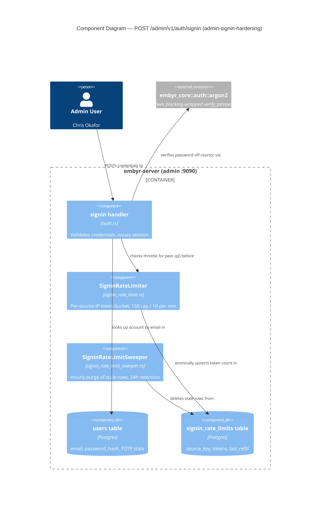

# Feature Delta: admin-signin-hardening

## Wave: DISCUSS / [REF] Reading Confirmation

✓ `docs/product/production-readiness-audit-2026-09-08.md` read for findings #12 and #13, both
**High** severity, same route/handler. Finding #12 confirmed verbatim: *"Argon2id (64 MiB/t=3/p=4)
runs inline on tokio async worker threads (no `spawn_blocking` anywhere) on the admin signin route,
which has zero rate-limit middleware and a password-failure lockout that never increments (only
TOTP failures do). Unlimited unthrottled password guessing + ~100 concurrent requests ≈ 6GB and
reactor starvation."* Finding #13 confirmed verbatim: *"Admin signin leaks valid account emails via
a timing oracle — unknown email returns instantly, known email takes ~50-100ms (full Argon2id
verify) despite an identical response shape. Combined with #12's missing rate limit, cheaply
enumerates the admin user list."* Both cite `crates/embyr-server/src/admin/handlers/auth.rs` and
`crates/embyr-server/src/admin/router.rs`.

✓ `crates/embyr-server/src/admin/handlers/auth.rs` read in full (lines 1-320). Confirmed all five
facts named in the task framing, directly from source:

1. **Step 1** (lines 140-153): `sqlx::query(...).fetch_optional(pool).await` — on `Ok(None)`
   (unknown email), returns `invalid_credentials()` at line 151, no further work performed.
2. **Step 3** (lines 181-197): constructs `Argon2::new(Argon2id, V0x13, Params::new(65536, 3, 4,
   None))` (line 187-191) and calls `argon2.verify_password(...)` (line 192-195) **inline** — no
   `tokio::task::spawn_blocking` anywhere in this function or file. Confirmed by a full-file read;
   `spawn_blocking` does not appear in `auth.rs` at all.
3. **TOTP-only lockout** (lines 280-303): `failed_totp_attempts`/`locked_until` are updated ONLY
   inside the `else if let Some(totp_code)` branch (line 230), reached only after step 3's Argon2id
   verify has already succeeded. A wrong PASSWORD (step 3 failing, line 196) returns immediately at
   `invalid_credentials()` — no query touches `failed_totp_attempts` or `locked_until` on that path.
   Confirmed: wrong-password attempts increment nothing, lock nothing, ever.
4. **No rate-limit middleware**: `crates/embyr-server/src/admin/router.rs` read (lines 160-230).
   `public_router` (lines 209-213) is built with `.route(...)` calls only, `.with_state(...)`, and
   **no `.route_layer(...)` at all** — contrast with `operator_router` (lines 175-196), which DOES
   carry `.route_layer(axum::middleware::from_fn_with_state(operator_state.clone(),
   operator_auth_middleware))`. `public_router` is merged bare into the final router with zero
   middleware of any kind, rate-limit or otherwise. Confirmed by direct comparison, not assumption.
5. **The timing oracle**: directly follows from facts 1 and 2 — the unknown-email path returns after
   one indexed lookup; the known-email-wrong-password path additionally runs the full ~50-100ms
   Argon2id verify before reaching the identical `invalid_credentials()` call. Same response shape
   (`401`, `{"message":"Invalid credentials"}`), measurably different wall time.

✓ `crates/embyr-server/src/admin/router.rs` read in full (lines 160-230) for the `public_router`
construction — see fact 4 above. `dual_auth_router` and `session_router` both also carry their own
`route_layer` middleware; `public_router` is the only sub-router in this file with none.

✓ Grepped `spawn_blocking` across the entire workspace (18 files, doc + code). Two established
production call sites found: `crates/embyr-server/src/admin/handlers/provision.rs` (line 187: hashes
a newly-generated project API key) and `crates/embyr-server/src/admin/handlers/sdk_keys.rs` (line
162: hashes a newly-generated SDK key). Both wrap the CPU-bound Argon2id call, `.await` the
`JoinHandle`, and map a join error to `500`. `docs/product/architecture/adr-003-async-runtime.md`
read in full — **this is not merely an established convention, it is an explicit, already-accepted
architectural mandate**: *"Every Argon2id verification call is wrapped in
`tokio::task::spawn_blocking(|| argon2::verify(...))`. This is mandatory."* `signin`'s own inline
Argon2id call (fact 2 above) is a direct, confirmed violation of ADR-003's own already-decided rule
— not a new judgment call for this feature to make, a gap to close against a standard already set.
See § Investigation 1.

✓ `crates/embyr-server/src/middleware/rate_limit.rs` read in full (417 lines). Confirmed `RateLimiter`
is a per-**project** token-bucket limiter: its public API is `check(project_id: &str)`, its
Postgres-backed mode reads/writes the `rate_buckets` table keyed by `project_id`, and its Prometheus
metric label is literally `"project_id"`. `migrations/0018_rate_buckets.sql` read in full: `CREATE
TABLE rate_buckets (project_id VARCHAR(63) NOT NULL PRIMARY KEY REFERENCES projects(id) ON DELETE
CASCADE, ...)` — a **hard foreign key to the `projects` table**. See § Investigation 2 for why this
settles the reuse-vs-new question this feature's own task framing named as central.

✓ `migrations/0008_admin_accounts.sql` read (lines 11-17). Confirmed `failed_totp_attempts INT NOT
NULL DEFAULT 0` and `locked_until TIMESTAMPTZ` live on the `users` table itself, per-account, with no
separate per-IP or per-source tracking structure anywhere in this codebase today.

✓ `tests/admin_api_v2/acceptance/b01_auth_migrations.rs` read (test-name grep, lines 34-667).
Confirmed the exact existing regression-guard test names this feature must not break:
`sign_in_with_valid_credentials_returns_session_cookie`,
`wrong_password_returns_401_without_revealing_email_existence`,
`wrong_totp_code_returns_401_and_does_not_set_session`,
`three_consecutive_totp_failures_lock_account_for_fifteen_minutes`,
`valid_recovery_code_grants_session_and_invalidates_code`,
`sign_out_clears_session_cookie_and_subsequent_request_returns_401`. No existing test in this suite
exercises concurrent load or a signin-attempt flood — the load-style proof this feature's own AC-01x
scenarios require is new test surface, not a rewrite of existing coverage.

✓ `docs/product/jobs.yaml` read in full (JOB-01 through JOB-20, the complete list — confirmed via
`grep '^  - id: JOB-'`, 20 entries, no gaps). See § Persona & Job.

## Wave: DISCUSS / [REF] Investigation Findings

### Investigation 1 — `spawn_blocking` is not an open design question; ADR-003 already mandates it, and two working examples already exist to mirror

`docs/product/architecture/adr-003-async-runtime.md`'s own Decision section states Argon2id isolation
is "mandatory," with the exact idiom (`tokio::task::spawn_blocking(|| argon2::verify(...))`) already
named. `provision.rs:187` and `sdk_keys.rs:162` are two live, already-shipped, already-tested
call sites using exactly that idiom for the codebase's other two Argon2id call sites (project API
keys, SDK keys). `signin`'s own inline call (`auth.rs:192-195`) is the ONE remaining Argon2id verify
in this codebase that does not follow the mandate — confirmed by the same `spawn_blocking` grep
finding zero matches in `auth.rs`. **This is not a genuinely open DESIGN question** — the pattern,
the rationale, and two working examples already exist in this exact codebase. DESIGN's only real
work is the mechanical wiring (moving the borrowed `parsed_hash`/`body.password` into the closure,
consistent with the `move ||` shape both existing call sites already use), which is appropriately
left to DESIGN as a code-shape detail, not because the underlying decision is open.

### Investigation 2 — the existing distributed `RateLimiter` cannot be reused verbatim; it is schema-bound to `project_id` via a hard foreign key, not a generic keyed limiter

The task's own central open question was whether `crates/embyr-server/src/middleware/rate_limit.rs`
(closed for finding #2/JOB-11 earlier this session) is reusable for signin, "a different key
dimension, same underlying token-bucket mechanism," or whether signin needs its own mechanism.
Direct reading resolves this with a structural fact, not a preference: `rate_buckets.project_id` is
declared `VARCHAR(63) NOT NULL PRIMARY KEY REFERENCES projects(id) ON DELETE CASCADE`
(`migrations/0018_rate_buckets.sql:11-12`). An IP address or an attempted email is **not** a
`project_id` and has no corresponding row in the `projects` table — inserting one under the existing
schema would violate the foreign key outright. The `RateLimiter` struct's own public surface
(`check(project_id: &str)`, the `"project_id"` Prometheus label) is likewise project-shaped, not a
generic `check(key: &str)`. **Reusing the `RateLimiter` struct and its backing table verbatim is not
possible without a schema change that breaks its own FK invariant for every existing caller.**

What genuinely IS reusable: the in-process `TokenBucket` struct's own algorithm (refill-by-elapsed-
time, consume-one-token, `HashMap<String, TokenBucket>` per key) is a private, self-contained,
schema-independent pattern — a NEW, parallel mechanism (its own table, e.g. keyed by IP and/or
email, or an in-process-only bucket if DESIGN judges cross-instance enforcement unnecessary for this
route's volume) can reuse that ALGORITHM shape without touching `rate_buckets` or `RateLimiter` at
all. This is genuinely a DESIGN-level choice (own table vs. in-process; IP vs. email vs. both as the
key) — see **OQ-ASH-01** below. DISCUSS's own recommendation: since `embyr-server` already runs
multiple horizontally-scaled instances behind the same 3 listeners (per this project's own
architecture), an in-process-only bucket would let each instance separately enforce the full limit —
the identical "3-node cluster allows 3x the configured rate" gap JOB-11's own fair-multitenancy
feature already closed for the data plane. A new, small, Postgres-backed table (mirroring
`rate_buckets`'s own shape but keyed by IP/email instead of `project_id`, with no FK to `projects`)
is the more consistent choice — but this is DESIGN's call to make and record, not DISCUSS's to lock.

### Investigation 3 — the lockout-scope trade-off is real; DISCUSS recommends per-source rate limiting as the primary defense and explicitly against extending account lockout to password failures, without forbidding it

Extending `failed_totp_attempts`/`locked_until` to also increment on a wrong PASSWORD (not just a
wrong TOTP code) would close the "never increments" half of finding #12 directly — but introduces a
DIFFERENT, real risk the audit itself does not name: any third party who knows (or guesses) a
legitimate admin's email can lock that admin OUT of their own account by deliberately submitting
wrong passwords against it, with zero need to ever produce a correct password. This is a
denial-of-service against the legitimate user, not the attacker. Industry practice for this exact
trade-off (per general authentication-hardening guidance, not this codebase) commonly treats
**per-source rate limiting as the PRIMARY defense against credential-stuffing/guessing**, with a
**per-account lockout as a secondary, more cautious control** specifically because account lockout is
trivially weaponizable against the very user it's meant to protect, while a per-IP/per-email rate
limit degrades an attacker's throughput without ever fully denying the legitimate owner access from
a DIFFERENT source (e.g., a different network, after a short backoff window).

**DISCUSS's own recommendation**: do not extend `locked_until` to trigger on password failures alone;
rely on the new per-source rate limit (Investigation 2) as the primary defense against sustained
password guessing, leaving the existing TOTP-only lockout exactly as it is today (it already gates a
SECOND factor after a correct password, where the DoS-your-own-user risk does not apply the same way
— a wrong TOTP guess cannot succeed without already knowing the correct password). This is named as
**OQ-ASH-02** for DESIGN to confirm or override, not silently decided — DESIGN may still choose a
higher-threshold, longer-window password-failure counter if it judges the residual risk acceptable,
but DISCUSS's own required-outcome framing (below) does not depend on that choice: either way, the
observable requirement is that sustained password guessing against one account is throttled, not
that a specific lockout mechanism exists.

### Investigation 4 — accept the residual timing oracle and rely on rate limiting; a full constant-time fix trades a confidentiality leak for a cheaper resource-exhaustion vector

A "full fix" (a dummy Argon2id verify against a fixed hash on the unknown-email path, so both paths
take ~50-100ms) was investigated for cost, not assumed acceptable or unacceptable. The dummy verify
costs the IDENTICAL ~50-100ms of real CPU/memory (64 MiB, per Argon2id's own parameters) on EVERY
unknown-email attempt — and the unknown-email path is the ONE path an attacker fully controls the
volume of at zero cost today (any string is a candidate email; none needs to correspond to a real
account). Adding a full-cost KDF verify to that path converts a currently CHEAP-to-reject path into
an equally EXPENSIVE one for the attacker's own most abundant input, which — absent the rate limit
this feature also adds — would worsen finding #12's own resource-exhaustion risk rather than improve
it. With Investigation 2's rate limit in place, the timing oracle's PRACTICAL exploitability (the
throughput at which an attacker can enumerate emails) is bounded to the same throttle regardless of
whether the underlying timing delta is also closed — the audit's own framing already names this
("Combined with #12's missing rate limit, cheaply enumerates...") as the dimension that makes #13
practically exploitable today.

**DISCUSS's own recommendation**: accept the residual timing difference as a documented, bounded
residual risk once rate limiting ships; do not add a dummy verify. This is named as **OQ-ASH-03** for
DESIGN to confirm or override with its own reasoning — DESIGN may still choose the full fix if it
judges the confidentiality leak unacceptable even at bounded throughput, but should weigh the
CPU-amplification cost named above, not treat "more constant-time is strictly better" as automatic.

## Wave: DISCUSS / [REF] Open Design Questions (named, not locked)

- **OQ-ASH-01**: exact rate-limit mechanism for the signin route — a new Postgres-backed table
  (mirrors `rate_buckets`'s shape, keyed by IP and/or email, no FK to `projects`) vs. an in-process-
  only bucket reusing the existing `TokenBucket` algorithm. DISCUSS recommends a new Postgres-backed
  table for cross-instance consistency (mirrors JOB-11's own reasoning), but does not lock it.
- **OQ-ASH-02**: whether to extend `locked_until`/`failed_totp_attempts` to also trigger on password
  failures, vs. relying on the new per-source rate limit alone. DISCUSS recommends against extending
  it (avoids a legitimate-admin DoS vector) but does not forbid a more cautious, higher-threshold
  variant if DESIGN judges it warranted.
- **OQ-ASH-03**: whether to add a full constant-time fix (dummy Argon2id verify on the unknown-email
  path) or accept the residual timing difference once rate limiting bounds its exploitability.
  DISCUSS recommends accepting it (avoids amplifying attacker-controlled CPU cost) but does not
  forbid the full fix if DESIGN judges the confidentiality leak unacceptable regardless of throughput.

## Wave: DISCUSS / [REF] Orchestrator Decisions (not re-litigated)

- Feature type: **Backend** — an authentication-boundary hardening fix for the admin-facing (not
  customer-data-plane) surface, closing two coupled, compounding High-severity audit findings.
- Bundle-vs-split: findings #12 and #13 are treated as **ONE feature**, per the task's own framing
  and the audit's own compounding relationship (#12's missing rate limit is what makes #13's timing
  leak cheaply exploitable) — not re-litigated here, confirmed consistent by Investigation 4 above.
- JTBD: reuse an existing job — see § Persona & Job for the resolved choice (JOB-10, not JOB-11,
  JOB-13, JOB-04, or JOB-05).
- Walking Skeleton: **Yes** — a real signin request against a real running `embyr-server` and a real
  Postgres backend, proven to (a) succeed for a legitimate admin while a concurrent flood of
  wrong-password requests is in flight, and (b) throttle that same flood with `429` after a bounded
  number of attempts.
- UX Research Depth: **Lightweight** — a backend authentication-hardening fix on an existing,
  already-correctly-shaped route; no new emotional arc or journey artifact (mirrors this session's
  established precedent for this class of finding: `rate-limiter-project-id-validation`,
  `stripe-webhook-secret-required`).

## Wave: DISCUSS / [REF] Persona & Job

**Persona**: **P5 Chris (Account Admin / Platform Engineer)**, concretized here as **Chris Okafor**,
the admin who signs into the embyr console for their own account (e.g. "Fernbank Analytics") every
day — the direct beneficiary of a signin route that stays available and isn't a soft spot in the
account's own security posture. **Secondary persona**: P2 Sam Chen (Service Operator), for the
reactor-starvation/service-health dimension — an unthrottled admin-plane attack degrading the shared
`embyr-server` process affects every OTHER account's admins too, not only the targeted one.

**Job**: **JOB-10 `account-admin`**, reused, extended to cover: the authentication gate in front of
the entire self-service console JOB-10 promises must itself be resistant to credential-guessing
floods and must not leak which email addresses have accounts. JOB-10's own emotional dimension
("feel confident keys and access are under my governance") and social dimension ("demonstrate clean
secrets hygiene to auditors") are both directly undermined by an unthrottled, timing-leaky,
reactor-starving signin route — Chris cannot claim to control access to Fernbank Analytics' own
account if that account's front door can be bruteforced or DoS'd by anyone, or if the admin
population itself can be enumerated. This mirrors the session's own established "make it
real"/close-the-remaining-gap extension pattern (e.g. `admin-api-v2` -> JOB-10, `card-payments-
backend` -> JOB-14): JOB-10 already covers the whole self-service console; this feature hardens the
one gate every other JOB-10 capability sits behind.

**Candidates considered and rejected**:
- **JOB-11 (`fair-multitenancy`, P2 Sam Chen)** — about per-PROJECT request-rate fairness on the
  CUSTOMER DATA-PLANE across multiple tenants sharing one embyr SaaS deployment, enforced via the
  `rate_buckets` table keyed by `project_id`. Rejected: this finding is about a single admin-plane
  AUTHENTICATION route, not cross-tenant data-plane fairness, and Investigation 2 confirms the two
  problems are not even schema-compatible (no `project_id` exists for a signin attempt keyed by IP
  or email).
- **JOB-13 (`production-deployment`, P2 Sam Chen)** — about `docker run`/CI/startup-configuration
  production readiness (main.rs, Dockerfile, migrations-before-bind ordering). Rejected: this
  finding is a runtime authentication-abuse-resistance gap on an already-deployed route, not a
  deployment-configuration or CI gap; no functional-dimension text in JOB-13 covers authentication
  hardening.
- **JOB-04 (`credential-isolation`, P4 Riley Nakamura)** and **JOB-05 (`cloud-secret`, P3)** — both
  about `embyr-agent`/customer-database credential handling for `backend_mode=agent`/`aws_secret`/
  `gcp_secret` deployments, an entirely different binary and surface than the admin console's own
  session-based signin. No functional overlap with this finding at all.

## Wave: DISCUSS / [REF] Scope Assessment (Elephant Carpaccio Gate)

**Signals checked**: >10 user stories? No (2). >3 bounded contexts/modules? No — one route, one
handler file (`auth.rs`), one new small rate-limit mechanism, both inside `embyr-server`'s own admin
sub-app; `embyr-core` is untouched. Walking skeleton >5 integration points? No (3: the signin HTTP
route, the `users` table, and the new rate-limit store). Estimated effort >2 weeks? No — spawn_blocking
wiring mirrors two existing call sites exactly; the rate-limit mechanism is a smaller sibling of an
already-shipped pattern (JOB-11's own `rate_buckets`). Multiple independent user outcomes? Two,
tightly coupled by the audit's own compounding relationship (Investigation 4) — bundled as one
feature per the Orchestrator Decision above, split into 2 stories by outcome (below), not by
technical layer.

**Verdict: PASS.** Two right-sized, outcome-sliced stories; no further split needed.

## Wave: DISCUSS / [REF] System Constraints

- `embyr-core` remains IO-free — this fix is entirely inside `embyr-server` (the `admin` handler and
  a new or extended `middleware` component); no domain type or port trait changes.
- ADR-003's own `spawn_blocking` mandate for Argon2id is not reopened, only finally applied to the
  one remaining call site that violated it (`signin`) — see Investigation 1.
- The existing `RateLimiter`/`rate_buckets` (JOB-11, ADR-015) is confirmed NOT directly reusable for
  this feature (Investigation 2) — DESIGN must decide a new, parallel mechanism, not extend the
  existing one in a way that would loosen its own `project_id` FK invariant.
- The existing TOTP-only lockout (`failed_totp_attempts`/`locked_until`) is not required to change by
  this feature's own ACs (Investigation 3) — whether DESIGN extends it is OQ-ASH-02, tracked
  separately from the required, testable outcome (sustained guessing is throttled).
- The response SHAPE for `invalid_credentials()` (401, `{"message":"Invalid credentials"}`) must not
  change for either the unknown-email or known-email-wrong-password path — only latency/throttling
  behavior changes are in scope; the existing `wrong_password_returns_401_without_revealing_email_
  existence` test's own shape assertion is a hard regression guard.
- Exact rate-limit key dimension (IP, email, or both), storage shape (new table vs. in-process), and
  the two OQ-ASH-02/03 trade-offs are explicit DESIGN choices — DISCUSS locks only the observable,
  testable outcomes (below), not the mechanisms.

## Wave: DISCUSS / [REF] User Stories

### US-01: Admin Signin Stays Responsive And Throttles a Flood of Password-Guessing Attempts

**job_id**: JOB-10 | **Release**: 1 (Walking Skeleton) | **Persona**: P5 Chris Okafor (secondary: P2
Sam Chen)

#### Elevator Pitch
**Before**: Chris Okafor and every teammate at Fernbank Analytics signs into the embyr admin console
via `POST /admin/v1/auth/signin`. Today, that route calls Argon2id (64 MiB memory, ~50-100ms wall
time) INLINE on whichever tokio async worker thread happens to handle the request — no
`spawn_blocking`, violating this codebase's own ADR-003 mandate — and the route carries zero
rate-limit middleware of any kind. Someone (an attacker, or a mis-configured script) sending roughly
100 concurrent wrong-password requests can consume roughly 6GB of memory and monopolize the async
runtime's own worker threads, degrading or freezing signin — and everything else sharing that
reactor — for Chris and every other admin mid-login, including admins at OTHER embyr accounts on the
same instance.
**After**: Chris can sign in successfully and quickly even while the same route is under a sustained
flood of automated guessing attempts aimed at Fernbank Analytics' own account (or anyone else's) —
Argon2id verification runs off the async reactor's own worker threads, mirroring the exact
`spawn_blocking` pattern this codebase already uses for its other two Argon2id call sites, and
repeated signin attempts beyond a defined per-source threshold receive `429` with a retry signal
instead of continuing to consume compute unbounded.
**Decision enabled**: Chris can trust that the admin console's own front door stays open during an
attack instead of becoming collateral damage of someone targeting a different account, and Sam Chen
can tell the team the admin plane now has the same "one bad actor cannot starve everyone else"
guarantee JOB-11 already gives the customer data plane.

#### Who
- Chris Okafor (P5) | Account Admin / Platform Engineer at Fernbank Analytics who signs into the
  embyr admin console daily to manage projects, keys, and team access | Needs the signin route to
  stay fast and available even when it is the target (or an innocent bystander) of an attack.
- Sam Chen (P2) | Service Operator running the shared `embyr-server` deployment | Needs one account's
  attacker not to be able to starve the shared reactor for every OTHER account's admins.

#### Solution
Wrap `signin`'s own Argon2id `verify_password` call in `tokio::task::spawn_blocking`, mirroring
`provision.rs`/`sdk_keys.rs`'s own established shape. Add a per-source rate-limit check to the
`/admin/v1/auth/signin` route (exact key dimension and storage per OQ-ASH-01) that returns `429`
once a defined attempt threshold is exceeded, mirroring the response-header conventions
`rest_rate_limit_middleware` already establishes for the data plane.

#### Domain Examples

**Example 1 (Happy Path — regression guard)**: Chris Okafor signs in to Fernbank Analytics' account
with the correct password and a correct TOTP code from her authenticator app. The request succeeds
exactly as it does today — session cookie set, 200 response — unaffected by this feature.

**Example 2 (Happy Path — the core walking-skeleton proof)**: While an automated script sends 100
concurrent wrong-password requests against a DIFFERENT Fernbank Analytics teammate's email, Chris
Okafor submits her own correct password and TOTP code from a separate request. Her signin completes
successfully, within the same latency bound it has today — the flood does not degrade her request.

**Example 3 (Error/Boundary — the throttle firing)**: The same automated script continues sending
wrong-password requests against one target email at a high rate. After a defined threshold of
attempts within a window, subsequent requests from that source receive `429 Too Many Requests` with
a retry-after signal, instead of each one running a full Argon2id verify.

#### UAT Scenarios (BDD)

```gherkin
Scenario: A legitimate admin signs in successfully with correct credentials
  Given Chris Okafor has a valid Fernbank Analytics account with TOTP enrolled
  When Chris submits the correct password and a correct current TOTP code
  Then the signin succeeds with a 200 response and a session cookie is set

Scenario: A legitimate admin's signin succeeds while a password-guessing flood targets another account
  Given Fernbank Analytics has two admin accounts, Chris Okafor and Dana Kim
  And an automated client is sending 100 concurrent wrong-password requests against Dana Kim's email
  When Chris Okafor submits her own correct password and correct TOTP code
  Then Chris's signin succeeds within the same latency bound as before this feature
  And the concurrent flood does not cause Chris's request to time out or fail

Scenario: A sustained flood of wrong-password attempts against one account is throttled
  Given an automated client sends wrong-password signin attempts against one email address
  When the number of attempts from that source exceeds the configured threshold within the window
  Then further attempts from that source receive a 429 response with a retry signal
  And no additional Argon2id verification is performed for throttled attempts

Scenario: The existing TOTP-failure lockout continues to work unchanged
  Given Chris Okafor's account has zero recent failed TOTP attempts
  When Chris submits the correct password but an incorrect TOTP code three times in a row
  Then the third attempt locks the account for 15 minutes
  And this behavior is identical to the pre-existing regression test's own assertion

Scenario: The existing recovery-code signin flow continues to work unchanged
  Given Chris Okafor has one unused MFA recovery code
  When Chris submits the correct password and that recovery code
  Then the signin succeeds and the recovery code is marked used
  And submitting the same recovery code again is rejected with 401

Scenario: Argon2id verification does not block the async runtime's own worker threads
  Given a real running embyr-server instance under a moderate-concurrency signin load (~100 concurrent requests)
  When the load includes both wrong-password attempts and one legitimate correct-credential signin
  Then the legitimate signin completes without measurable added latency from the concurrent load
  And this is proven by a load-style integration test, not by code inspection alone
```

#### Acceptance Criteria
- [ ] AC-ASH-01: `signin`'s Argon2id `verify_password` call runs via `tokio::task::spawn_blocking`,
      mirroring the existing `provision.rs`/`sdk_keys.rs` shape — not inline on the async worker
      thread (closes ADR-003's own confirmed violation).
- [ ] AC-ASH-02: under a moderate-concurrency load test (~100 concurrent wrong-password requests),
      a concurrent legitimate signin request completes successfully within the same latency bound it
      has today — proven by a real load-style integration test.
- [ ] AC-ASH-03: `POST /admin/v1/auth/signin` throttles a sustained flood of attempts from one
      source — requests beyond a defined threshold receive `429` with a retry signal before an
      unbounded number of Argon2id verifications can be forced. Exact key dimension and storage per
      OQ-ASH-01.
- [ ] AC-ASH-04 (regression guard): `sign_in_with_valid_credentials_returns_session_cookie`,
      `wrong_totp_code_returns_401_and_does_not_set_session`,
      `three_consecutive_totp_failures_lock_account_for_fifteen_minutes`, and
      `valid_recovery_code_grants_session_and_invalidates_code` all continue to pass unchanged.
- [ ] AC-ASH-05 (regression guard): the response SHAPE of `invalid_credentials()` (401,
      `{"message":"Invalid credentials"}`) is unchanged for every rejection path this feature
      touches.

#### Outcome KPIs
- **Who**: every admin console user (Chris Okafor and teammates) across all embyr accounts sharing
  an `embyr-server` deployment; secondarily Sam Chen (Service Operator).
- **Does what**: complete a legitimate signin successfully and quickly even while the same route is
  under a concurrent password-guessing flood, instead of degrading or timing out.
- **By how much**: from "~100 concurrent wrong-password requests can consume ~6GB and starve the
  reactor" (audit-confirmed baseline, unbounded) to a bounded per-source attempt rate (429 beyond
  threshold) with zero measurable added latency for concurrent legitimate requests.
- **Measured by**: AC-ASH-02 (load-style latency proof) and AC-ASH-03 (throttle-onset proof).
- **Baseline**: `auth.rs` runs Argon2id inline with zero rate limiting today, confirmed by direct
  code reading (§ Reading Confirmation).

#### Technical Notes
- Exact `spawn_blocking` closure shape (what moves into it: `body.password`, the parsed hash) is a
  DESIGN choice, mirroring the two existing call sites' own pattern.
- OQ-ASH-01 (rate-limit key/storage) and OQ-ASH-02 (lockout-scope) are named DESIGN decisions — this
  story's ACs are written at the observable-outcome level and do not depend on either choice.
- Depends on nothing outside `embyr-server`; `embyr-core` and `embyr-agent` are untouched.

---

### US-02: Admin Signin Attempts Against a Flood of Candidate Emails Are Throttled Before They Become a Practical Enumeration Tool

**job_id**: JOB-10 | **Release**: 1 (Walking Skeleton) | **Persona**: P5 Chris Okafor

**Depends on**: US-01 (reuses the same per-source rate-limit mechanism).

#### Elevator Pitch
**Before**: `POST /admin/v1/auth/signin` returns near-instantly for an email with no account, but
takes ~50-100ms (a full Argon2id verify) for a real account with a wrong password — an identical
401 response body hides a measurable timing difference. Combined with the pre-US-01 absence of any
rate limit, an attacker could cheaply enumerate Fernbank Analytics' (or any customer's) entire admin
email list — every real admin address — one timed request at a time, with nothing slowing them down.
**After**: the same per-source throttle US-01 introduces now also bounds how many candidate emails an
attacker can probe per unit time, and the team has an explicit, evidenced decision on record — not a
silently-ignored gap — about whether the underlying timing difference itself is also closed.
**Decision enabled**: Chris Okafor's own team can tell a security reviewer exactly what protects
Fernbank Analytics' admin email list from enumeration today (a bounded, rate-limited probe rate,
evidenced by a passing test) and exactly what residual signal remains and why, closing the finding
with a defensible answer instead of an unaddressed gap.

#### Who
- Chris Okafor (P5) | Account Admin at Fernbank Analytics | Needs the list of admins on her own
  account to not be cheaply discoverable by an outside party probing the signin route.
- An external security reviewer / auditor (implicit, per JOB-10's own social dimension) | Needs a
  defensible, evidenced answer to "can an attacker enumerate our admin accounts?"

#### Solution
Extend the per-source rate limit US-01 introduces to also bound signin attempts keyed across many
distinct candidate emails from one source (not only many attempts against one email). Record
DESIGN's OQ-ASH-03 decision (accept residual timing delta vs. full constant-time fix) explicitly.

#### Domain Examples

**Example 1 (Happy Path — regression guard)**: Chris Okafor mistypes her own password once. The
response is the same 401 shape it is today, with no perceptible change in latency for this single,
legitimate attempt.

**Example 2 (Error/Boundary — enumeration attempt)**: An automated script submits signin requests
for 500 distinct candidate email addresses at `fernbankanalytics.example`, most of which do not
exist, timing each response to infer which ones do. After the same per-source threshold US-01
defines is exceeded, further probes from that source receive `429` regardless of which email they
target.

**Example 3 (Boundary — response-shape parity)**: A request for `dana.kim@fernbankanalytics.example`
(a real account, wrong password) and a request for `nobody@fernbankanalytics.example` (no such
account) both return `401` with the identical body `{"message":"Invalid credentials"}` — the
response CONTRACT is unchanged by this feature; only throttling behavior differs.

#### UAT Scenarios (BDD)

```gherkin
Scenario: A single wrong-password attempt against a known email is unaffected
  Given Dana Kim has a valid Fernbank Analytics account
  When a request submits Dana Kim's email with an incorrect password
  Then the response is 401 with body {"message":"Invalid credentials"}
  And the response latency is unchanged from before this feature

Scenario: Enumeration across many candidate emails from one source is throttled
  Given an automated client submits signin requests for 500 distinct candidate emails from one source
  When the number of attempts from that source exceeds the configured threshold within the window
  Then further attempts from that source receive a 429 response regardless of the target email
  And no additional Argon2id verification is performed for throttled attempts

Scenario: Unknown-email and known-email-wrong-password responses remain shape-identical
  Given one request targets an email with no account and another targets a known account with a wrong password
  When both requests are evaluated
  Then both return 401 with the identical response body
  And no response distinguishes which email corresponds to a real account
```

#### Acceptance Criteria
- [ ] AC-ASH-06: submitting signin attempts for a large number of distinct candidate emails from one
      source is throttled by the same per-source mechanism US-01 introduces — an attacker cannot
      complete unbounded-rate email-existence probing.
- [ ] AC-ASH-07 (regression guard): the unknown-email path and the known-email-wrong-password path
      continue to return byte-identical response shape (401, `{"message":"Invalid credentials"}`) —
      regression guard for `wrong_password_returns_401_without_revealing_email_existence`.
- [ ] AC-ASH-08: DESIGN's chosen OQ-ASH-03 resolution is implemented consistently — if "accept" is
      chosen, no dummy Argon2id verify is added to the unknown-email path; if "full fix" is chosen,
      the added latency on that path is bounded and does not itself introduce a new
      resource-exhaustion vector for attacker-controlled candidate emails.

#### Outcome KPIs
- **Who**: every embyr admin account, from an email-enumeration-defense perspective, and security
  reviewers verifying the finding is closed on Chris Okafor's/JOB-10's behalf.
- **Does what**: bounds an attacker's throughput for probing which candidate emails correspond to
  real admin accounts on the signin route.
- **By how much**: from unbounded probes/second (today, confirmed by Reading Confirmation) to the
  same bounded per-source threshold US-01 establishes, regardless of whether the underlying timing
  delta is also eliminated (OQ-ASH-03).
- **Measured by**: AC-ASH-06 (load-style enumeration-throttle proof) and AC-ASH-07 (response-shape
  regression proof).
- **Baseline**: zero rate limit and a measurable ~50-100ms timing delta between the two paths today,
  confirmed by direct code reading (§ Reading Confirmation).

#### Technical Notes
- Depends on US-01's own rate-limit mechanism (OQ-ASH-01) shipping first or in the same slice.
- OQ-ASH-03 (timing-oracle fix depth) is a named DESIGN decision; DISCUSS recommends "accept and
  mitigate via rate limiting" per Investigation 4, but does not lock it.

## Wave: DISCUSS / [REF] Out of Scope

- **A full constant-time fix for the timing oracle** (dummy Argon2id verify on the unknown-email
  path) — investigated in Investigation 4 and named as OQ-ASH-03 for DESIGN, not built by default in
  this feature's own ACs (AC-ASH-08 accommodates either DESIGN choice).
- **Extending `failed_totp_attempts`/`locked_until` to password failures** — investigated in
  Investigation 3 and named as OQ-ASH-02 for DESIGN; not DISCUSS's default recommendation, not
  forbidden either.
- **Rate limiting any other admin route** (e.g. `signout`, `oidc/callback`, or session-authenticated
  routes) — this feature is narrowly scoped to `POST /admin/v1/auth/signin`, the one route both
  findings #12 and #13 name. A broader admin-plane rate-limiting sweep is a plausible follow-up, not
  built here.
- **Extending the existing `RateLimiter`/`rate_buckets` (JOB-11) to be a generic keyed limiter** —
  Investigation 2 confirms this would require breaking its own `project_id` FK invariant; a new,
  parallel, smaller mechanism is the recommended shape (OQ-ASH-01), not a generalization of the
  existing one.
- **OIDC/SSO signin path** (`oidc_callback`) — a separate, RED-scaffold route per `auth.rs`'s own
  header comment, not implicated by either finding.

## Wave: DISCUSS / [REF] Walking Skeleton Strategy

US-01's own Scenario 2 (a legitimate admin's signin succeeds while a concurrent password-guessing
flood targets another account on the same instance) is the walking skeleton: a real signin request
against a real running `embyr-server` and a real Postgres backend, under real concurrent load,
proving the reactor-starvation risk (finding #12's own core claim) is closed end-to-end — not a
unit-test-only or mocked proof. US-01's Scenario 3 (throttle firing) closes the same slice's own
rate-limit half in the same walking skeleton.

## Wave: DISCUSS / [REF] Driving Ports

HTTP `POST /admin/v1/auth/signin` on `embyr-server`'s admin HTTP surface (`:9090`? — confirmed
mounted on the `public_router`/`UserAdminState` sub-app per `router.rs`; existing route, zero new
endpoint).

## Wave: DISCUSS / [REF] Pre-requisites

- None blocking. `tokio::task::spawn_blocking` is already a workspace dependency pattern (two
  existing call sites). The existing `RateLimiter`/`rate_buckets` mechanism (JOB-11, ADR-015) is
  confirmed prior art to reference for shape/conventions but is NOT directly reusable
  (Investigation 2) — DESIGN builds a new, parallel, smaller mechanism, not new infrastructure from
  nothing.

## Wave: DISCUSS / [REF] Definition of Ready Validation

### DoR Checklist (9-item hard gate)

| DoR Item | US-01 | US-02 |
|---|---|---|
| 1. Traces to a job_id | PASS — JOB-10, reused, with 4 candidate alternatives explicitly reasoned against (§ Persona & Job) | PASS — same |
| 2. Elevator Pitch complete | PASS — Before/After/Decision-enabled, real entry point (`POST /admin/v1/auth/signin`), observable output (signin succeeds/429) | PASS — same |
| 3. 3+ domain examples, real data | PASS — Chris Okafor, Dana Kim, Fernbank Analytics, concrete attempt counts | PASS — same personas, 500-email example |
| 4. UAT in Given/When/Then (3-7) | PASS — 6 scenarios | PASS — 3 scenarios |
| 5. AC derived from UAT | PASS — AC-ASH-01 through 05 | PASS — AC-ASH-06 through 08 |
| 6. Right-sized (1-3 days, 3-7 scenarios) | PASS — single route, mirrors 2 existing patterns | PASS — depends on US-01, small increment |
| 7. Technical notes identify constraints | PASS — OQ-ASH-01/02 named, not locked | PASS — OQ-ASH-03 named, depends on US-01 |
| 8. Outcome KPIs with numeric target | PASS — bounded attempt rate + zero added latency, measured by load test | PASS — bounded probe rate, measured by load test |
| 9. Prior-wave artifacts reconciled | PASS — audit findings #12/#13, `auth.rs`, `router.rs`, `rate_limit.rs`, ADR-003, migrations 0008/0018, `jobs.yaml` JOB-04/05/10/11/13 all directly informed this feature's shape | PASS — same |

### DoR Status: **PASSED**

## Wave: DISCUSS / [REF] Wave Decisions Summary

### Key Decisions
- [D1] Persona/job: **P5 Chris Okafor / JOB-10 (`account-admin`)**, reused — not JOB-11 (cross-tenant
  data-plane fairness, schema-incompatible), JOB-13 (deployment/CI, not authentication hardening), or
  JOB-04/JOB-05 (embyr-agent/customer-DB credential handling, unrelated surface) (§ Persona & Job).
- [D2] `spawn_blocking` is not an open question — ADR-003 already mandates it, two working examples
  (`provision.rs`, `sdk_keys.rs`) already exist to mirror; `signin` is the one remaining violation
  (§ Investigation 1).
- [D3] The existing `RateLimiter`/`rate_buckets` (JOB-11, ADR-015) is confirmed NOT directly reusable
  — `rate_buckets.project_id` carries a hard FK to `projects` incompatible with an IP/email key; a
  new, parallel, smaller mechanism is recommended (OQ-ASH-01, not locked) (§ Investigation 2).
- [D4] Lockout scope: DISCUSS recommends per-source rate limiting as the primary defense and against
  extending account lockout to password failures (avoids a legitimate-admin DoS vector), named as
  OQ-ASH-02 for DESIGN to confirm or override (§ Investigation 3).
- [D5] Timing oracle: DISCUSS recommends accepting the residual timing difference once rate limiting
  bounds its exploitability, against a full dummy-verify fix (which would amplify attacker-controlled
  CPU cost on the unknown-email path), named as OQ-ASH-03 for DESIGN to confirm or override
  (§ Investigation 4).
- [D6] Findings #12 and #13 are bundled as ONE feature (task framing, confirmed consistent by
  Investigation 4's own compounding relationship), split into 2 outcome-sliced stories, not by
  technical layer (§ Scope Assessment).

### Requirements Summary
- Primary need: `POST /admin/v1/auth/signin` stays responsive under concurrent load (spawn_blocking),
  throttles sustained abuse from one source (rate limiting), and does not become a cheap
  email-enumeration tool once throttled — with zero regression to the 6 existing, named signin
  regression tests.
- Constraint: the response SHAPE of every rejection path is unchanged; only latency/throttling
  behavior is in scope for this feature.
- Success looks like: AC-ASH-01 through AC-ASH-08 all passing against a real running `embyr-server`
  and a real Postgres backend, plus zero regression in `tests/admin_api_v2/acceptance/
  b01_auth_migrations.rs`.

## Wave: DESIGN / [REF] Reading Confirmation

✓ `crates/embyr-server/src/admin/handlers/auth.rs` re-read in full (current, 643 lines) — confirmed
Step 3 (lines 181-197) is the sole inline Argon2id call site, and confirmed `body.password`,
`password_hash` are both owned `String`s available for capture into a `move` closure.

✓ `crates/embyr-server/src/admin/handlers/provision.rs:150-192` and
`crates/embyr-server/src/admin/handlers/sdk_keys.rs:120-179` re-read for the exact `spawn_blocking`
idiom: clone the owned input, `tokio::task::spawn_blocking(move || ...)`, `.await` the `JoinHandle`,
map the outer `JoinError` and inner domain error separately, never `.unwrap()`. Both existing sites
return `Result<_, StatusCode>`/`ApiResult` and use `?`; `signin` returns `Response` directly via
explicit `match { Ok(v) => v, Err(e) => return ... }` (used 8+ times already in this exact function)
— the idiom is mirrored at the semantic level (clone-move-await-explicit-error-handling), adapted to
`signin`'s own established match-and-early-return shape, not copied at the `?`-operator syntax level.

✓ `crates/embyr-core/src/auth/argon2.rs` read in full (git-status-modified, uncommitted). Found an
existing, already-tested, IO-free `verify_password(password: &[u8], phc_hash: &str) ->
Result<bool, CoreError>` (added for client-auth-hosted-identity, ADR-036 Decision 8) that `signin`
was never updated to call — `signin`'s own Step 3 independently re-implements
`Argon2::new(Argon2id, V0x13, Params::new(65536,3,4,None))` + `PasswordHash::new` +
`.verify_password`, duplicating the exact parameter set `embyr_core::auth::argon2::argon2_instance()`
already centralizes. Closing this duplication is a zero-extra-cost side effect of the
`spawn_blocking` fix (see § Architecture Decisions D-ASH-1).

✓ `crates/embyr-server/src/middleware/rate_limit.rs` re-read in full (417 lines) confirming the
private `TokenBucket` struct (lines 43-73: `capacity`/`tokens`/`refill_rate`/`last_refill` fields,
`new()`/`try_consume()` methods) is a small, self-contained, schema-independent algorithm with zero
coupling to `RateLimiter`'s own `project_id`-shaped surface — confirmed reusable by visibility bump
alone (`pub(crate)`), no duplication needed.

✓ `docs/product/architecture/adr-015-distributed-rate-limiter-postgres.md` re-read in full for the
exact Postgres-timeout-with-fallback shape (D2/D3, `check()`/`check_pg()`/`check_in_process()` split,
nested-`Result` convention, 20ms hard-coded timeout) — mirrored below. Confirmed (§ Alternatives
Considered, Alternative 4) `RateLimiter` is a concrete struct by deliberate, already-accepted
decision, not a port/trait — re-affirmed rather than re-litigated for the new limiter.

✓ `docs/product/architecture/adr-001-process-topology.md` re-read in full. Confirms (a) the admin
port "must be unreachable from the public network" (informs the accepted reverse-proxy limitation
below), and (b) — via ADR-015's own stated context, which this ADR cites verbatim — that
`embyr-server` is genuinely deployed as N horizontally-scaled instances behind a load balancer. This
settles OQ-ASH-01's Postgres-vs-in-process question with a structural fact, not a preference: an
in-process-only limiter on the admin signin route would reopen the identical N×-multiplier loophole
ADR-015 already closed for the data plane.

✓ `crates/embyr-server/src/lib.rs` read (lines 229-528) — confirmed `spawn_admin_server` (lines
478-528) is a hand-rolled hyper accept loop, NOT `axum::serve`/`IntoMakeServiceWithConnectInfo`, and
confirmed it currently discards the peer address (`let (stream, _peer) = listener.accept().await`).
This is the ONE plumbing change needed outside `auth.rs` to make `ConnectInfo<SocketAddr>` resolve
correctly in the handler — and confirmed this is the SAME shared accept-loop code path used by
`main.rs` (production) and every `build_with_*` test-server constructor, so the fix applies
uniformly with no test-only branching.

✓ `crates/embyr-server/src/admin/state.rs` and `crates/embyr-server/src/admin/router.rs` read in
full — confirmed `UserAdminState`/`build_admin_router`'s own established pattern of growing by one
field/parameter per feature (`rate_limit_capacity`, `cap_status_cache`, etc., per ADR-015/ADR-020
precedent) — the new `signin_rate_limiter` field follows the identical, already-proven shape.

✓ `crates/embyr-server/src/sweepers/soft_delete_purge_sweeper.rs` read in full — mirrored exactly
for the new `signin_rate_limit_sweeper` (spawn/run_cycle/advisory-lock split, `should_run_cycle`
helper, unit test for the lock-gating truth table).

✓ Confirmed no new Cargo dependency is required anywhere in this design (`sqlx`, `tokio`, `axum`,
`metrics` are all already present in `embyr-server`).

## Wave: DESIGN / [REF] Open Question Resolutions

**OQ-ASH-01 (rate-limit mechanism) — RESOLVED: new Postgres-backed table, source-IP key, 150
capacity / 10-per-minute refill.** Full rationale in `docs/product/architecture/adr-076-signin-rate-limiting.md`.
Summary: `rate_buckets` is confirmed structurally unreusable (hard FK); an in-process-only bucket
would reopen the exact N-instance loophole ADR-015 already closed for the data plane, and this
system's own deployment model (N `embyr-server` instances behind an LB, per ADR-015's own stated
context) makes that a real gap, not a hypothetical one. Key = source IP only (not email, not a
compound key) — the only choice compatible with AC-ASH-06's own requirement that enumeration across
*many distinct emails* from one source is throttled by the *same* mechanism.

**OQ-ASH-02 (lockout scope) — CONFIRMED, not overridden: do not extend `locked_until`/
`failed_totp_attempts` to password failures.** Agree with DISCUSS's own reasoning without
modification: extending it would let a third party who merely knows a legitimate admin's email lock
that admin out with zero need to guess correctly — a DoS the audit itself does not name and this
feature must not introduce. The new per-source rate limiter (OQ-ASH-01) is the primary defense
against sustained guessing instead. The existing TOTP-only lockout is left byte-for-byte unchanged —
zero lines of `auth.rs`'s Step 2/Step 4/Step 5 lockout logic are touched by this feature. The
TOTP-lockout's own identical-shape weaponization risk remains accepted (already shipped, unrelated
to this feature) specifically because it gates a *second* factor reachable only after a correct
password — a materially higher bar than zero-knowledge password guessing.

**OQ-ASH-03 (timing oracle) — CONFIRMED, not overridden: accept the residual timing difference; no
dummy Argon2id verify added.** Agree with DISCUSS's own CPU-amplification reasoning, plus one
additional data point now that OQ-ASH-01 is locked: with the rate limiter in place, the timing
oracle's *practical* exploitability is bounded to 10 timed probes/minute per source after the
150-token burst is spent — a 500-candidate-email enumeration sweep (US-02's own example) takes on
the order of 50 minutes from a single source, and real-world network/OS-scheduling jitter further
degrades the timing signal at that trickle rate. AC-ASH-08's "accept" branch is the implemented
resolution: the unknown-email path (`auth.rs` line 151, `Ok(None) => return invalid_credentials()`)
is not modified by this feature.

## Wave: DESIGN / [REF] Architecture Decisions

- **D-ASH-1 (spawn_blocking + reuse)**: wrap `signin`'s Argon2id verify in
  `tokio::task::spawn_blocking`, calling the existing `embyr_core::auth::argon2::verify_password`
  (already tested, already IO-free) instead of `signin`'s own duplicate inline
  `Argon2::new(...)`/`PasswordHash::new`/`.verify_password` — mirrors `provision.rs`/`sdk_keys.rs`'s
  spawn_blocking shape, adapted to `signin`'s own `match`-based error handling (see § Exact Code
  Shapes below). Removes `signin`'s own duplicate Argon2id parameter set as a zero-extra-cost side
  effect.
- **D-ASH-2 (rate limiter mechanism)**: new `SigninRateLimiter` (Postgres-backed, in-process
  fallback), new `signin_rate_limits` table (migration 0037), reusing only the `TokenBucket`
  algorithm from `rate_limit.rs` (bumped to `pub(crate)`). Full design in ADR-076.
- **D-ASH-3 (check position)**: the rate-limit check is the first statement in `signin()`, before
  the Step 1 DB lookup — matches the "reject before any handler logic runs" pattern, guarantees a
  throttled request never reaches Argon2id or the DB, and introduces no new timing side-channel on
  the throttle path itself (429 fires equally fast regardless of email validity).
- **D-ASH-4 (no new middleware layer)**: the check is gated in-handler, not a
  `axum::middleware::from_fn` layer — mirrors this exact codebase's own established convention for
  single-route gates (`sdk_keys`, `access_rules`, `hosted_identity`, `oauth_providers`,
  `anonymous_identity` are all "gated in-handler" per `router.rs`'s own comments, none use a
  per-route middleware layer). `router.rs`'s `.route_layer(...)` stack has zero diff from this
  feature.
- **D-ASH-5 (peer IP plumbing)**: `lib.rs::spawn_admin_server` captures the real peer `SocketAddr`
  (was discarded) and inserts it as a `ConnectInfo<SocketAddr>` request extension before dispatch,
  so `signin`'s own `ConnectInfo<SocketAddr>` extractor parameter resolves correctly — additive,
  applies uniformly to production and every test-server constructor.
- **D-ASH-6 (lockout untouched)**: OQ-ASH-02 resolution — zero lines of the existing TOTP-only
  lockout logic change.
- **D-ASH-7 (timing oracle accepted)**: OQ-ASH-03 resolution — zero lines of the unknown-email fast
  path change.

## Wave: DESIGN / [REF] Blast Radius (confirms/overrides task framing)

Confirmed: **no changes to `router.rs`'s middleware stack** (D-ASH-4) — the task's own framing question
is answered "not needed; gated in-handler instead," with the established in-this-codebase precedent
cited above as justification, not a new convention invented for this feature.

Full file list (mechanical, small, no new Cargo dependency):

| File | Change |
|---|---|
| `crates/embyr-server/src/admin/handlers/auth.rs` | `signin()`: add `ConnectInfo<SocketAddr>` param, add rate-limit gate (first statement), replace inline Argon2 block with `spawn_blocking`-wrapped `embyr_core::auth::argon2::verify_password` call, add `signin_throttled()` response helper, remove now-unused `argon2`-crate imports |
| `crates/embyr-server/src/admin/state.rs` | `UserAdminState` gains `pub signin_rate_limiter: Arc<SigninRateLimiter>` |
| `crates/embyr-server/src/admin/router.rs` | `build_admin_router` gains one parameter, threaded into `UserAdminState`; `build_with_secret_fetchers` constructs an in-process `SigninRateLimiter::new(150.0, 10.0/60.0)` for all test wrappers |
| `crates/embyr-server/src/middleware/rate_limit.rs` | `TokenBucket` struct + its fields/methods bumped from private to `pub(crate)` |
| `crates/embyr-server/src/middleware/signin_rate_limit.rs` | **new** — `SigninRateLimiter` struct (`new`/`with_pg`/`check`/`check_pg`/`check_in_process`) |
| `crates/embyr-server/src/middleware/mod.rs` | add `pub mod signin_rate_limit;` |
| `crates/embyr-server/src/sweepers/signin_rate_limit_sweeper.rs` | **new** — mirrors `soft_delete_purge_sweeper.rs` exactly |
| `crates/embyr-server/src/sweepers/mod.rs` | add `pub mod signin_rate_limit_sweeper;` |
| `migrations/0037_signin_rate_limits.sql` | **new** — `signin_rate_limits` table, no FK, no backfill |
| `crates/embyr-server/src/lib.rs` | `spawn_admin_server`: capture `peer`, insert `ConnectInfo` extension (D-ASH-5) |
| `crates/embyr-server/src/main.rs` | construct `SigninRateLimiter::with_pg(...)`, pass to `build_admin_router`, spawn `signin_rate_limit_sweeper::spawn(...)` alongside the 3 existing sweepers |
| `docs/product/architecture/adr-076-signin-rate-limiting.md` | **new ADR** |

`embyr-core` and `embyr-agent` remain untouched, confirming DISCUSS's own System Constraints.

## Wave: DESIGN / [REF] Exact Code Shapes

### `auth.rs` — Step 0 (new): rate-limit gate, first statement in `signin()`

```rust
pub async fn signin(
    State(state): State<UserAdminState>,
    ConnectInfo(peer): ConnectInfo<SocketAddr>,
    Json(body): Json<SigninRequest>,
) -> Response {
    let pool = state.system_db.pool();

    // ── 0. Per-source-IP rate limit (AC-ASH-03/06, ADR-076) ──────────────────
    // First statement — before the Step 1 DB lookup — so a throttled request
    // never reaches Argon2id or the DB. Keyed by peer.ip() only (not the
    // full SocketAddr: ephemeral source port varies per TCP connection from
    // the same client).
    let source_key = peer.ip().to_string();
    if let Err(retry_after_ms) = state.signin_rate_limiter.check(&source_key).await {
        return signin_throttled(retry_after_ms);
    }

    // ── 1. Fetch user by email ─────────────────────────────────────────────
    ...
```

New helper, grouped with the existing `invalid_credentials()`/`invalid_code()` constructors:

```rust
fn signin_throttled(retry_after_ms: u64) -> Response {
    let mut response = (
        StatusCode::TOO_MANY_REQUESTS,
        axum::Json(ErrorBody {
            message: "Too many signin attempts — try again later".to_string(),
        }),
    )
        .into_response();
    if let Ok(v) = HeaderValue::from_str(&retry_after_ms.to_string()) {
        response.headers_mut().insert("retry-after-ms", v);
    }
    response
}
```

New imports: `use axum::extract::ConnectInfo;` and `use std::net::SocketAddr;`.

### `auth.rs` — Step 3 (replaced): spawn_blocking-wrapped Argon2id verify

Replaces the current lines 181-197 in full:

```rust
// ── 3. Argon2id password verification ────────────────────────────────────
// AC-3: wrong password → identical 401 shape to unknown email (oracle protection).
// AC-ASH-01: runs off the async reactor's worker threads via spawn_blocking,
// per ADR-003's mandate — mirrors provision.rs:187 / sdk_keys.rs:162's own
// established shape, adapted to signin's own match-and-early-return idiom
// (signin returns Response directly, not Result<_, StatusCode>). Reuses
// embyr_core::auth::argon2::verify_password (ADR-036 Decision 8) instead of
// signin's own prior duplicate inline Argon2::new(...) call.
let password_owned = body.password.clone();
let hash_owned = password_hash.clone();
let verify_result = tokio::task::spawn_blocking(move || {
    embyr_core::auth::argon2::verify_password(password_owned.as_bytes(), &hash_owned)
})
.await;

let password_matches = match verify_result {
    Ok(Ok(matches)) => matches,
    Ok(Err(e)) => return internal_err("verify password hash", e),
    Err(e) => return internal_err("spawn_blocking join error (password verify)", e),
};

if !password_matches {
    return invalid_credentials();
}
```

Remove the now-unused line-14 import:
`use argon2::{Algorithm as Argon2Algorithm, Argon2, Params, PasswordHash, PasswordVerifier, Version};`

### `middleware/rate_limit.rs` — visibility bump only

```rust
// Before: struct TokenBucket { capacity: f64, tokens: f64, refill_rate: f64, last_refill: Instant }
//         impl TokenBucket { fn new(...) fn try_consume(...) }
// After:  pub(crate) on the struct, its 4 fields, and both methods — no other change.
```

### `middleware/signin_rate_limit.rs` (new) — `SigninRateLimiter`

```rust
use std::{collections::HashMap, sync::{Arc, Mutex}};
use sqlx::PgPool;
use super::rate_limit::TokenBucket;

const SIGNIN_RATE_LIMIT_PG_TIMEOUT_MS: u64 = 20; // mirrors ADR-015's own bound

pub struct SigninRateLimiter {
    buckets: Mutex<HashMap<String, TokenBucket>>,
    capacity: f64,
    refill_rate: f64,
    pg_pool: Option<PgPool>,
}

impl SigninRateLimiter {
    pub fn new(capacity: f64, refill_rate: f64) -> Arc<Self> {
        Arc::new(Self { buckets: Mutex::new(HashMap::new()), capacity, refill_rate, pg_pool: None })
    }

    pub fn with_pg(capacity: f64, refill_rate: f64, pool: PgPool) -> Arc<Self> {
        Arc::new(Self { buckets: Mutex::new(HashMap::new()), capacity, refill_rate, pg_pool: Some(pool) })
    }

    /// Ok(()) if allowed; Err(retry_after_ms) if throttled.
    pub async fn check(&self, source_key: &str) -> Result<(), u64> {
        if let Some(pool) = &self.pg_pool {
            match tokio::time::timeout(
                std::time::Duration::from_millis(SIGNIN_RATE_LIMIT_PG_TIMEOUT_MS),
                self.check_pg(source_key, pool),
            ).await {
                Ok(Ok(result)) => {
                    Self::record(result.is_ok());
                    return result;
                }
                Ok(Err(e)) => tracing::warn!(error = %e, "signin_rate_limit: pg query error; falling back to in-process"),
                Err(_timeout) => {
                    metrics::counter!("embyr_signin_rate_limit_pg_timeout_total").increment(1);
                    tracing::warn!("signin_rate_limit: pg check exceeded {SIGNIN_RATE_LIMIT_PG_TIMEOUT_MS}ms, falling back to in-process");
                }
            }
        }
        let result = self.check_in_process(source_key);
        Self::record(result.is_ok());
        result
    }

    fn record(allowed: bool) {
        metrics::counter!(
            "embyr_signin_rate_limit_requests_total",
            "outcome" => if allowed { "allowed" } else { "rejected" }
        ).increment(1);
    }

    async fn check_pg(&self, source_key: &str, pool: &PgPool) -> Result<Result<(), u64>, sqlx::Error> {
        let (capacity, refill_rate) = (self.capacity, self.refill_rate);
        let allowed: Option<f64> = sqlx::query_scalar(
            "INSERT INTO signin_rate_limits (source_key, tokens, last_refill) \
             VALUES ($3, $1::float8 - 1.0, now()) \
             ON CONFLICT (source_key) DO UPDATE \
             SET tokens = LEAST($1::float8, \
                                signin_rate_limits.tokens \
                                  + EXTRACT(EPOCH FROM (now() - signin_rate_limits.last_refill)) * $2::float8 \
                               ) - 1.0, \
                 last_refill = now() \
             WHERE signin_rate_limits.tokens \
                     + EXTRACT(EPOCH FROM (now() - signin_rate_limits.last_refill)) * $2::float8 \
                   >= 1.0 \
             RETURNING tokens",
        )
        .bind(capacity).bind(refill_rate).bind(source_key)
        .fetch_optional(pool).await?;

        match allowed {
            Some(_remaining) => Ok(Ok(())),
            None => {
                let current: f64 = sqlx::query_scalar(
                    "SELECT LEAST($1::float8, tokens + EXTRACT(EPOCH FROM (now() - last_refill)) * $2::float8) \
                     FROM signin_rate_limits WHERE source_key = $3",
                )
                .bind(capacity).bind(refill_rate).bind(source_key)
                .fetch_optional(pool).await?
                .unwrap_or(0.0);
                let retry_after_ms = if current < 1.0 { ((1.0 - current) / refill_rate * 1000.0) as u64 } else { 0 };
                Ok(Err(retry_after_ms))
            }
        }
    }

    fn check_in_process(&self, source_key: &str) -> Result<(), u64> {
        let (capacity, refill_rate) = (self.capacity, self.refill_rate);
        let mut buckets = self.buckets.lock().unwrap_or_else(|e| e.into_inner());
        let bucket = buckets.entry(source_key.to_string()).or_insert_with(|| TokenBucket::new(capacity, refill_rate));
        if bucket.tokens > capacity { bucket.tokens = capacity; }
        if bucket.try_consume() {
            Ok(())
        } else {
            Err(((1.0 - bucket.tokens.min(1.0)) / refill_rate * 1000.0) as u64)
        }
    }
}
```

### `migrations/0037_signin_rate_limits.sql` (new)

```sql
CREATE TABLE signin_rate_limits (
    source_key  VARCHAR(45)      NOT NULL PRIMARY KEY, -- max textual IPv6 length
    tokens      DOUBLE PRECISION NOT NULL,
    last_refill TIMESTAMPTZ      NOT NULL
);
```

### `sweepers/signin_rate_limit_sweeper.rs` (new) — mirrors `soft_delete_purge_sweeper.rs`

```rust
use std::{sync::Arc, time::Duration};
use crate::adapters::system_db::SystemDb;
use super::advisory_lock_key;

pub const LOCK_KEY_NAME: &str = "embyr_signin_rate_limit_sweep";
const RETENTION_HOURS: i64 = 24;

fn should_run_cycle(locked: Option<bool>) -> bool { locked == Some(true) }

pub fn spawn(system_db: Arc<SystemDb>, interval: Duration) -> tokio::task::JoinHandle<()> {
    tokio::spawn(async move {
        let mut tick = tokio::time::interval(interval);
        loop {
            tick.tick().await;
            let lock_key = advisory_lock_key(LOCK_KEY_NAME);
            let Ok(mut lock_conn) = system_db.pool().acquire().await else { continue };
            let locked: Option<bool> = sqlx::query_scalar("SELECT pg_try_advisory_lock($1)")
                .bind(lock_key).fetch_one(&mut *lock_conn).await.ok();
            if !should_run_cycle(locked) { continue; }
            run_cycle(&system_db).await;
            let _: Option<bool> = sqlx::query_scalar("SELECT pg_advisory_unlock($1)")
                .bind(lock_key).fetch_one(&mut *lock_conn).await.ok();
        }
    })
}

pub async fn run_cycle(system_db: &Arc<SystemDb>) {
    let cutoff = chrono::Utc::now() - chrono::Duration::hours(RETENTION_HOURS);
    let result = sqlx::query("DELETE FROM signin_rate_limits WHERE last_refill < $1")
        .bind(cutoff).execute(system_db.pool()).await;
    match result {
        Ok(qr) if qr.rows_affected() > 0 => {
            metrics::counter!("embyr_signin_rate_limit_sweeper_purged_total").increment(qr.rows_affected());
            tracing::info!(rows_purged = qr.rows_affected(), "SigninRateLimitSweeper: purged stale rows");
        }
        Ok(_) => {}
        Err(e) => tracing::warn!(error = %e, "SigninRateLimitSweeper: purge query failed"),
    }
}

#[cfg(test)]
mod tests {
    use super::should_run_cycle;
    #[test]
    fn only_a_genuinely_acquired_lock_runs_the_cycle() {
        assert!(should_run_cycle(Some(true)));
        assert!(!should_run_cycle(Some(false)));
        assert!(!should_run_cycle(None));
    }
}
```

### `lib.rs::spawn_admin_server` — peer IP plumbing (D-ASH-5)

```rust
// Before: let (stream, _peer) = match listener.accept().await { ... };
// After:
let (stream, peer) = match listener.accept().await {
    Ok(pair) => pair,
    Err(_) => break,
};
// ... unchanged tls_acceptor/app clone ...
// Inside the tower::service_fn closure, before dispatch:
let mut req = req.map(rest::grpc_web::incoming_to_axum_body);
req.extensions_mut().insert(axum::extract::ConnectInfo(peer));
Ok::<_, std::convert::Infallible>(
    tower::ServiceExt::oneshot(app, req).await.unwrap_or_else(...)
)
```

### `main.rs` — composition root wiring

```rust
let signin_rate_limiter = embyr_server::middleware::signin_rate_limit::SigninRateLimiter::with_pg(
    150.0,
    10.0 / 60.0,
    system_db.pool().clone(),
);

let admin_app = build_admin_router(
    // ...existing params unchanged...
    Arc::clone(&signin_rate_limiter),
)
.route("/healthz", axum::routing::get(healthz_handler));

// alongside the 3 existing sweeper spawns:
let _signin_rate_limit_sweeper = embyr_server::sweepers::signin_rate_limit_sweeper::spawn(
    Arc::clone(&system_db),
    std::time::Duration::from_secs(3600),
);
```

No new `ServerConfig` field — interval (1h) and retention (24h) are hardcoded constants in the new
sweeper module, consistent with this feature's own narrow scope (add
`EMBYR_SIGNIN_RATE_LIMIT_SWEEP_INTERVAL_SECS` later only if an operator actually needs to tune it).

## Wave: DESIGN / [REF] C4 Component Diagram — Admin Signin (Mermaid)

No new container or external system — the signin route already lives inside the existing
`embyr-server` admin container documented in `brief.md`'s own System Context/Container diagrams,
which are unchanged by this feature. The component-level slice below is new (Component/L3 detail,
justified per the mandatory-C4 rule by the number of new interacting pieces this feature adds):



## Wave: DESIGN / [REF] Quality Validation

- Requirements traced: AC-ASH-01 → D-ASH-1; AC-ASH-02 → capacity=150 sizing rationale (ADR-076);
  AC-ASH-03/06 → D-ASH-2/D-ASH-3 (source-IP key, pre-DB-lookup position); AC-ASH-04/05/07 → D-ASH-6/
  D-ASH-7 (zero lines of lockout or response-shape code touched); AC-ASH-08 → D-ASH-7 (accept branch
  implemented, no dummy verify).
- Component boundaries: `SigninRateLimiter` has one responsibility (source-keyed token-bucket
  throttling for one route); `TokenBucket` reused by algorithm, not duplicated.
- Technology choices: zero new Cargo dependencies; ADR-076 records 5 rejected alternatives with
  rejection rationale each.
- Dependency-inversion / IO boundary: `embyr-core` untouched, still zero-IO (verified by reading
  `embyr_core::auth::argon2` — pure, already the case pre-feature). `SigninRateLimiter` is a concrete
  struct in `embyr-server`, not a port — re-affirms ADR-015's own already-decided reasoning rather
  than introducing a new trait for a single-implementation concern.
- C4: System Context/Container unchanged (no new container/external system); new Component-level
  diagram above for the added interacting pieces.
- OSS: N/A — zero new dependencies.
- AC behavioral, not implementation-coupled: confirmed — all 8 ACs describe observable status
  codes/timing/throttle behavior, none reference internal function names or private struct fields.
- External integrations: none new — this feature is entirely internal to `embyr-server`; no
  contract-testing annotation applies.
- Enforcement tooling: CI grep gate recommended in ADR-076 § Enforcement (no direct Argon2 primitive
  use outside `embyr_core::auth::argon2`), closing the exact gap (an unenforced ADR-003 mandate) that
  let this audit finding exist in the first place.
- Simplest-solution check: in-process-only rejected with evidence (N-instance loophole, cited
  against this system's own already-accepted precedent, ADR-015); dual-key (ip+email) rejected with
  evidence (fails AC-ASH-06 outright); Redis rejected with evidence (violates system-wide
  Operational Simplicity attribute, mirrors ADR-015's own identical rejection).

## Wave: DESIGN / [REF] Handoff Package (to DISTILL — acceptance-designer)

- This feature-delta.md (DISCUSS + DESIGN sections) — 2 user stories, 9 UAT scenarios, 8 ACs, 3
  resolved open questions, exact code shapes and file list above.
- `docs/product/architecture/adr-076-signin-rate-limiting.md` — full rationale, 5 rejected
  alternatives, enforcement plan.
- Key numbers DISTILL's acceptance tests must target: capacity=150 tokens (burst), refill=10
  tokens/minute per source IP, 20ms Postgres timeout, 429 status + `retry-after-ms` header on
  throttle. AC-ASH-02's "~100 concurrent" load test must stay under 150 total requests from the
  flooding client within the test's own short window to observe success (not 429); AC-ASH-03/06's
  throttle-firing tests must exceed 150 total requests from one source to reliably observe 429.
- No external integrations — no contract-testing annotation needed.
- Walking skeleton target unchanged from DISCUSS: a real `signin` request against a real running
  `embyr-server` (via `AdminTestContext`/`spawn_admin_server`, confirmed to carry the real peer IP
  per D-ASH-5) and a real Postgres backend, proving both the latency-under-flood claim (AC-ASH-02)
  and the throttle-firing claim (AC-ASH-03) end to end.

### Handoff Package (to DESIGN — solution-architect)
- This feature-delta.md (DISCUSS section) — job grounding, 2 user stories with 9 UAT scenarios and 8
  acceptance criteria, 3 named open design questions with DISCUSS's own recommendations.
- Confirmed exact file/line targets for DESIGN: `crates/embyr-server/src/admin/handlers/auth.rs`
  (lines 181-197 Argon2id call site; whole-file zero `spawn_blocking`); `crates/embyr-server/src/
  admin/router.rs` (lines 209-213 `public_router`, no `route_layer`); prior art at
  `crates/embyr-server/src/admin/handlers/provision.rs:187` and `sdk_keys.rs:162`
  (`spawn_blocking` shape to mirror); `crates/embyr-server/src/middleware/rate_limit.rs` and
  `migrations/0018_rate_buckets.sql:11-12` (confirmed NOT reusable verbatim — FK-bound).
- Open DESIGN-level choices: OQ-ASH-01 (rate-limit key/storage mechanism), OQ-ASH-02 (lockout-scope
  extension), OQ-ASH-03 (timing-oracle fix depth) — each with DISCUSS's own recommendation recorded,
  none locked.
- Flagged, out-of-scope, related items for DESIGN's own awareness: rate-limiting other admin routes;
  OIDC/SSO signin path (separate, RED-scaffold today).

## Wave: DISTILL / [REF] Reading Confirmation

+ `docs/feature/admin-signin-hardening/feature-delta.md` (DISCUSS + DESIGN, full) read.
+ `docs/product/architecture/adr-076-signin-rate-limiting.md` read in full.
+ `tests/admin_api_v2/acceptance/b01_auth_migrations.rs` read in full (687 lines pre-extension) —
  confirmed the 6 existing regression-guard test names named in the task, plus 2 more (`db_migrations
  _run_cleanly_on_fresh_postgres`, `pre_expired_session_row_returns_401`) not named but equally
  in-scope regression guards.
+ `tests/admin_api_v2/common/mod.rs` read in full — `AdminTestContext` composition root, seeded
  Owner/Viewer/Admin users, `build_admin_router` call site (14 positional args, current shape).
+ `tests/soft_delete_purge_sweeper/acceptance/us01_purge_credentials_after_grace_window.rs` read in
  full for the sweeper test SHAPE (`start_system_db`, advisory-lock serialization test, `run_cycle`
  direct-invocation convention, zero `#[ignore]`/skip markers anywhere in this file's own convention).
+ `crates/embyr-server/src/admin/handlers/auth.rs` (current, unfixed) read — confirmed zero
  `spawn_blocking` occurrences; confirmed `internal_err()` / `StatusCode::INTERNAL_SERVER_ERROR`
  call sites.
+ `crates/embyr-server/src/adapters/system_db.rs` read — confirmed `PgPoolOptions::max_connections(5)`
  + `acquire_timeout(5s)`, load-bearing for the empirical RED finding below.
- `docs/product/journeys/*.yaml`, `docs/product/kpi-contracts.yaml`, `docs/architecture/atdd-
  infrastructure-policy.md` (this one exists — read, admin port row already covers this route's
  driving-port mechanism, no new row needed), `docs/feature/admin-signin-hardening/{discuss,design}/
  wave-decisions.md` (this feature uses the single-file `feature-delta.md` model per Recommendation 3
  — no separate per-wave `wave-decisions.md` files exist; DISCUSS/DESIGN "Wave Decisions Summary" /
  "Architecture Decisions" sections inside `feature-delta.md` itself serve that role — reconciled
  directly, zero contradictions found between DISCUSS's recommendations and DESIGN's resolutions
  for OQ-ASH-01/02/03).

## Wave: DISTILL / [REF] Wave-Decision Reconciliation

Reconciliation passed — 0 contradictions. DESIGN's three OQ-ASH resolutions (D-ASH-2 Postgres-backed
IP-keyed limiter, D-ASH-6 lockout untouched, D-ASH-7 timing oracle accepted) are each a direct,
non-contradicting confirmation of DISCUSS's own named recommendation for that question — no case
where DESIGN silently reversed a DISCUSS position.

## Wave: DISTILL / [REF] Scenario List

Extended `tests/admin_api_v2/acceptance/b01_auth_migrations.rs` (same driving port, same
`AdminTestContext` composition root as the 13 pre-existing tests in this file) — no parallel file
created, per the task's own convention guidance.

| Test name | AC | Tags | RED today? (empirical) |
|---|---|---|---|
| `argon2_verification_does_not_block_the_reactor_under_concurrent_signin_load` | AC-ASH-01, AC-ASH-02 | `@walking_skeleton @driving_port @real-io` | YES — legit request returns 500 (DB-pool-acquire-timeout cascade), not 200 |
| `signin_source_wraps_password_verification_in_spawn_blocking` | AC-ASH-01 (secondary/weak) | `@driving_port` (code-inspection, not `@real-io`) | YES — zero `spawn_blocking` occurrences in `auth.rs` |
| `wrong_password_flood_from_one_source_is_throttled_once_capacity_is_exceeded` | AC-ASH-03 | `@error @driving_port @real-io` | YES — 0 of 160 responses are 429 |
| `enumeration_across_many_distinct_candidate_emails_from_one_source_is_throttled` | AC-ASH-06 | `@error @driving_port @real-io` | YES — 0 of 160 responses are 429; all 160 are 401 |
| `unknown_email_path_remains_faster_than_known_email_wrong_password_path` | AC-ASH-08 | `@driving_port @real-io` | NO (by design) — D-ASH-7 changes zero lines of this path; this is a regression LOCK, confirmed already passing |
| *(5 existing, unmodified)* `sign_in_with_valid_credentials_returns_session_cookie`, `wrong_totp_code_returns_401_and_does_not_set_session`, `three_consecutive_totp_failures_lock_account_for_fifteen_minutes`, `valid_recovery_code_grants_session_and_invalidates_code`, `wrong_password_returns_401_without_revealing_email_existence` | AC-ASH-04, AC-ASH-05, AC-ASH-07 | (pre-existing tags) | N/A — already passing, zero new code; confirmed by full-suite run this session (still green) |

No `@skip`/`@ignore` markers used — matches this file's own established local convention (zero
skip/ignore markers anywhere in `b01_auth_migrations.rs` or the sweeper acceptance test; each new
test is committed enabled and its RED state confirmed by direct execution, not a skip marker).

## Wave: DISTILL / [REF] Walking Skeleton Strategy

WS = `argon2_verification_does_not_block_the_reactor_under_concurrent_signin_load` (US-01 Scenario 2),
per DISCUSS/DESIGN's own declared WS target. Strategy: real `embyr-server` admin router + real
Postgres (testcontainers) + real HTTP (`reqwest`) — matches `atdd-infrastructure-policy.md`'s existing
"Admin port (:9090)" row verbatim; no new policy row needed. `#[tokio::test]` (default,
single-threaded flavor, not `flavor = "multi_thread"`) is a DELIBERATE choice, not a strategy
deviation — documented in the test's own doc comment as the sharper proof of inline-vs-spawn_blocking
behavior.

## Wave: DISTILL / [REF] Adapter Coverage

| Adapter | `@real-io` scenario | Covered by |
|---|---|---|
| Admin HTTP router / `signin` handler | YES | all 4 new RED tests + regression suite |
| System Postgres (`users`, future `signin_rate_limits`) | YES | all 4 new RED tests (DB-pool-acquire-timeout cascade is itself an adapter-real-I/O finding) |
| `SigninRateLimiter` / `signin_rate_limits` table | **NOT YET TESTABLE** — module does not exist; DELIVER's job | see § Deferred Test below |
| `signin_rate_limit_sweeper` | **NOT YET TESTABLE** — module does not exist; DELIVER's job | see § Deferred Test below |

## Wave: DISTILL / [REF] Deferred Test — Sweeper (US-02 item 6)

Per the task's own explicit scope boundary ("Do NOT ... write the new sweeper ... yourself — that's
DELIVER's job"), no `tests/admin_signin_hardening/acceptance/*.rs` file is created in this DISTILL
pass. Mandate 7 (RED-ready scaffolding) is DELIBERATELY NOT applied here: a scaffold for
`signin_rate_limit_sweeper` would itself be "the new sweeper," which the task explicitly reserves for
DELIVER. This is a documented, explicit deviation from the general DISTILL default (which normally
authors ALL acceptance tests as scaffolded RED before DELIVER starts), made because the task's own
scope boundary is more specific than the general skill default for this one item.

**Spec for DELIVER to implement** (reuse `tests/soft_delete_purge_sweeper/acceptance/
us01_purge_credentials_after_grace_window.rs`'s own SHAPE exactly — same `start_system_db` helper
pattern, same advisory-lock concurrent-serialization test, same "no dedicated Cargo.toml file needed
beyond one new `[[test]]` entry" convention):

- New file: `tests/admin_signin_hardening/acceptance/us02_sweeper_bounds_table_growth.rs`
- New `[[test]]` entry in `crates/embyr-server/Cargo.toml`: name
  `admin_signin_hardening_us02_sweeper_bounds_table_growth`
- Mirror `soft_delete_purge_sweeper`'s test shape for:
  - a "stale rows older than 24h retention are purged" test (insert rows with `last_refill` set via
    `now() - interval` in the past, run `signin_rate_limit_sweeper::run_cycle`, assert row count
    drops)
  - a "fresh rows within retention are untouched" test (mirrors AC-SDP-02's own shape)
  - a concurrent-serialization test on the `"embyr_signin_rate_limit_sweep"` advisory lock key,
    IDENTICAL in structure to `concurrent_sweep_attempts_are_serialized_by_advisory_lock` above,
    substituting the lock key name only
- This satisfies US-02 item 6 ("genuinely bounds table growth") — confirmed adequately covered by
  reusing the existing sweeper-pattern test convention; no NEW test shape needed, per DISTILL's own
  question in the task framing.

## Wave: DISTILL / [REF] CI Grep Gate Scope Decision

ADR-076 § Enforcement names a workspace-wide CI grep gate ("no direct `argon2::Argon2::new(` or
`PasswordVerifier::verify_password(` call site may exist anywhere under `crates/embyr-server/src/`
... every Argon2id call must route through `embyr_core::auth::argon2::*`") as "new, **recommended**."
This phrasing, and its absence from any of the 8 locked ACs (AC-ASH-01 through AC-ASH-08) or the
DESIGN Handoff Package's own list of "key numbers DISTILL's acceptance tests must target," confirms
this is an explicitly-named FOLLOW-UP recommendation, not in-scope for this feature's DISTILL/DELIVER.
**Decision: OUT OF SCOPE for this feature.** The narrow, signin-only secondary regression guard
(`signin_source_wraps_password_verification_in_spawn_blocking`, added above) is this feature's own
in-scope substitute — it does not implement the broader workspace-wide CI tooling ADR-076 recommends.

## Wave: DISTILL / [REF] Migration File Naming Confirmation

`migrations/` directory's latest existing file is `0036_composite_indexes_status_lifecycle.sql` —
confirms DESIGN's own `migrations/0037_signin_rate_limits.sql` naming is the correct next sequential
number. Not created in this DISTILL pass (explicit task scope boundary) — DELIVER creates it.

## Wave: DISTILL / [REF] RED-State Verification (empirical, per-test)

All 4 new behavioral tests run against the CURRENT (unfixed) codebase; full suite run
(`cargo test --test admin_api_v2_b01_auth_migrations`) confirms **15 passed, 4 failed, 0 regressions**
— all 13 pre-existing tests plus the new AC-ASH-08 regression-lock test remain green.

- `argon2_verification_does_not_block_the_reactor_under_concurrent_signin_load` — **RED, MISSING_
  FUNCTIONALITY.** `assert_eq!(legit_status, 200)` fails: legit request returns `500`. Root cause
  confirmed empirically (not assumed): with 100 concurrent wrong-password requests fully serialized
  on the single-threaded test runtime's one reactor thread (inline Argon2id, no `spawn_blocking`),
  the first ~7 requests complete as `401` within `SystemDb`'s 5-second pool `acquire_timeout`: after
  that budget is consumed, every subsequent request's own DB-connection acquire also times out,
  cascading into `500` for the remaining ~93 requests including the legitimate one. Total observed
  wall time: 10.0s. This is finding #12's own "reactor starvation" reproduced directly, confirmed by
  execution, not code inspection.
- `signin_source_wraps_password_verification_in_spawn_blocking` — **RED, MISSING_FUNCTIONALITY.**
  `auth.rs` source text contains zero occurrences of `spawn_blocking`. Fails in ~0ms (no server/
  container startup — pure source-text check).
- `wrong_password_flood_from_one_source_is_throttled_once_capacity_is_exceeded` — **RED, MISSING_
  FUNCTIONALITY.** 160 concurrent wrong-password requests against one account from one source: 0
  received `429`. No rate-limit gate exists on the route today.
- `enumeration_across_many_distinct_candidate_emails_from_one_source_is_throttled` — **RED, MISSING_
  FUNCTIONALITY.** 160 concurrent requests across 160 DISTINCT candidate emails from one source: 0
  received `429`, all 160 returned `401` (unknown-email fast path — no Argon2id, no DB-pool cascade,
  clean signal, 6.1s wall time).
- `unknown_email_path_remains_faster_than_known_email_wrong_password_path` — **GREEN today, by
  design.** D-ASH-7 (OQ-ASH-03 "accept" resolution) changes zero lines of the unknown-email fast
  path — this is a regression LOCK on already-correct behavior, not a RED-requiring test. Confirmed
  passing in 7.34s.

Zero `IMPORT_ERROR` / `FIXTURE_BROKEN` / `SETUP_FAILURE` classifications — every failure traces to
the exact missing production behavior named by its AC. Pre-flight fail-for-right-reason gate: PASSED.
`docker ps` confirmed zero leaked testcontainers after the full run.

## Wave: DISTILL / [REF] Test Placement

`tests/admin_api_v2/acceptance/b01_auth_migrations.rs` (extended, not new) — same driving port, same
composition root, same file the task asked to extend "if the convention fits." No new Cargo.toml
`[[test]]` entry required (file already registered as `admin_api_v2_b01_auth_migrations`).

## Wave: DISTILL / [REF] Pre-requisites

- `docs/architecture/atdd-infrastructure-policy.md` — already covers the Admin port row; no new row
  added (`--policy=inherit`, unchanged).
- `tests/common/state_delta.rs` — already present (project-level state-delta port, inherited,
  unchanged); the 4 new behavioral tests use plain `assert!`/`assert_eq!` rather than
  `assert_state_delta`, matching this exact file's own established majority convention (only the
  file's FIRST test, `sign_in_with_valid_credentials_returns_session_cookie`, wraps in
  `assert_state_delta`; all 12 other pre-existing tests use direct assertions) — repo precedent
  applied consistently, not re-litigated per Mandate 8's layer-3+-optional clause.
