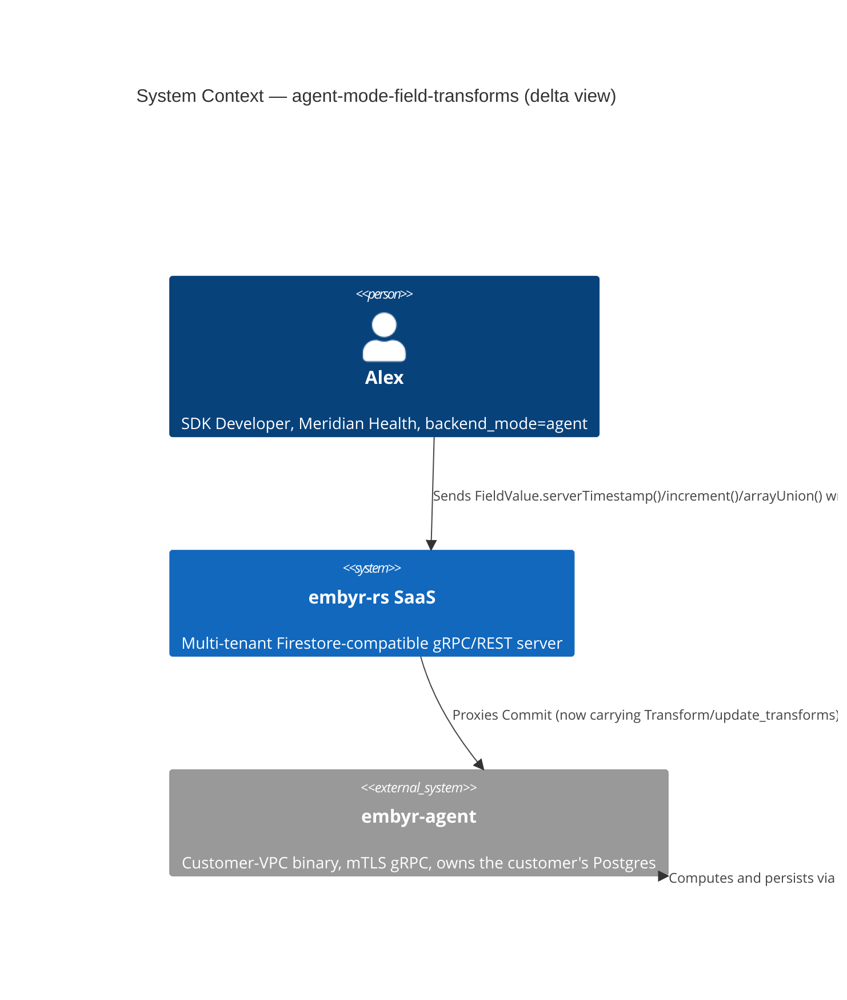
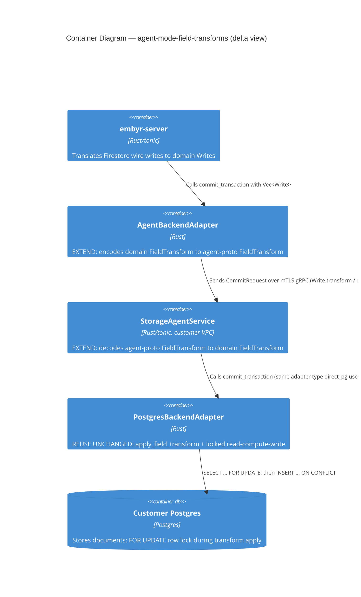

# agent-mode-field-transforms — Feature Delta

**Wave**: DISCUSS | **Agent**: Luna (nw-product-owner) | **Date**: 2026-08-31
**Status**: Ready for DESIGN handoff — one escalated open question (cross-version graceful-degradation UX, shared framing with sibling features). See § Handoff Package.
**Upstream**: No DISCOVER/DIVERGE wave ran — commissioned directly by the orchestrator as one of 4 confirmed `backend_mode=agent` parity gaps. `firestore-field-transforms`'s own DISCUSS (2026-08-31) scoped transforms to non-agent modes only, confirming the agent proto has zero transform representation, and named agent-mode as a candidate follow-up (its own § System Constraints, line 171): "the internal agent wire protocol has no transform message shape at all, a hard proto wall on a separately-deployed binary."

---

## Wave: DISCUSS / [REF] Prior Wave Consultation — Reading Confirmation

✓ `proto/embyr/agent/v1/storage_agent.proto` (full, 372 lines) — confirmed the `Write` message (lines 318-325) has exactly `oneof operation { Document update = 1; string delete = 2; }` — no transform representation of any kind, no `FieldTransform` message, no third oneof variant.
✓ `crates/embyr-agent/src/server.rs::proto_write_to_domain` (lines 194-209) — confirmed directly: `Operation::Update(doc) => ... DomainWrite::Update { ..., transforms: vec![], ... }` — the domain `Write::Update` variant DOES have a `transforms` field (shared domain type, used identically by direct_pg), but the agent's own proto-to-domain translation hardcodes it empty because the wire has nothing to populate it from.
✓ `crates/embyr-server/src/adapters/agent_backend.rs::commit_transaction` (lines 529-591) — confirmed directly: the `.filter_map` (line 559) matches `Write::Transform { .. } => None` — a standalone transform write is silently DROPPED before ever reaching the agent. The comment at line 583-587 states explicitly: "Agent-mode has no transform wire representation at all (backend_mode=agent is out of v1 scope, ADR-052 § Alternatives Considered) — permanently empty, not a temporary placeholder." This feature is the follow-up that makes it no longer permanent.
✓ `crates/embyr-pg-storage/src/backend_adapter.rs::commit_transaction` (lines 916-1230+, targeted grep on `transform`) — **the single most important finding for this feature's own sizing**: `apply_field_transform` (imported line 12, called lines 1135/1197) and the full locked-read-compute-write cycle for BOTH standalone `Write::Transform` (ADR-052 § Decision 5b) and transform-carrying `Write::Update` (lines 1116-1136) are ALREADY implemented in `embyr-pg-storage` — the SAME crate `embyr-agent`'s own `commit()` handler (`crates/embyr-agent/src/server.rs::commit`, line 613: `self.storage.commit_transaction(&pid, &txn_id, writes).await`) already calls, unchanged, today. **The compute logic is not agent-mode-specific work at all — it is already shared and already correct.** This feature's entire scope is wire-representation: a new `Transform`/`FieldTransform` message shape on `storage_agent.proto`, a new oneof variant on `Write`, and two small translation-layer edits (`proto_write_to_domain` in `embyr-agent`, removing the `filter_map` drop in `agent_backend.rs`).
✓ `docs/feature/firestore-field-transforms/feature-delta.md` (targeted grep, § System Constraints line 424, § Reuse Analysis line 535) — confirmed that feature's own Reuse Analysis explicitly named `crates/embyr-agent/src/server.rs:198-201` as a known future extension site with the exact same finding: "agent proto has no transform shape, permanent not temporary" (their words, now revised by this feature).
✓ `docs/product/jobs.yaml` lines 14-26 (JOB-01) — same motivating job as sibling features.

No contradictions found between this feature's scope and prior evidence.

---

## Wave: DISCUSS / [REF] Orchestrator Decisions (not re-litigated)

| # | Decision | Value |
|---|---|---|
| 1 | Feature Type | Backend — closes an SDK-facing silent-data-loss gap (field transforms) for `backend_mode=agent`, mirroring `firestore-field-transforms`'s own scope for the other three backend modes |
| 2 | Walking Skeleton | YES — one story IS the walking skeleton (the compute logic is already proven elsewhere; this story proves the wire path end-to-end) |
| 3 | UX Research Depth | Lightweight, SDK-facing — the experience is `FieldValue.serverTimestamp()`/`.increment()`/`.arrayUnion()`/`.arrayRemove()` actually computing, not silently dropping |
| 4 | JTBD Analysis | Confirmed: extends JOB-01 (sdk-compat), same persona P1 Alex, same "make it real" pattern |

---

## Wave: DISCUSS / [REF] Pre-requisites

- `firestore-field-transforms` (shipped, non-agent modes) — `apply_field_transform` + `commit_transaction`'s locked-read-compute-write cycle (`crates/embyr-pg-storage/src/backend_adapter.rs`), reused UNCHANGED by this feature. This is the single largest pre-existing asset this feature builds on — no new compute logic anywhere.
- `crates/embyr-agent/src/server.rs::proto_write_to_domain` and `crates/embyr-server/src/adapters/agent_backend.rs::commit_transaction`'s own `.filter_map` — the two known, already-identified edit sites (§ Reading Confirmation).
- No dependency on the other 3 sibling `backend_mode=agent` features (confirmed independent, § agent-mode-write-streaming's own Bundle-vs-Split Note).

---

## Wave: DISCUSS / [REF] Persona & Job

**Persona**: **P1 — Alex (SDK Developer)**, Meridian Health, `backend_mode=agent` — same persona and company as the other 2 sibling features.

**job_id decision**: `JOB-01` (`sdk-compat`), extended not new.

---

## Wave: DISCUSS / [REF] Scope Assessment (Elephant Carpaccio Gate)

| Signal | Threshold | This feature | Fired? |
|---|---|---|---|
| User stories | >10 | 1 (US-01) | **NO** |
| Bounded contexts / modules | >3 | 1 — BC-2 Document Storage, write/transform path | **NO** |
| Walking Skeleton integration points | >5 | 3 — (1) new `Transform` message + `Write` oneof variant on `storage_agent.proto`, (2) `proto_write_to_domain` translation edit in `embyr-agent`, (3) remove the `.filter_map` drop in `agent_backend.rs` | **NO** |
| Estimated effort | >2 weeks | ~1 day, single slice — compute logic already exists | **NO** |
| Independent shippable outcomes | multiple unrelated | **NO** | **NO** |

**0 of 5 signals fired. Verdict: PASS — single feature, single story, right-sized. Smallest of the 4 sibling features by a wide margin**, since the hard part (locked-read-compute-write cycle) is already built and shared.

---

## Wave: DISCUSS / [REF] Journey (Lightweight, SDK-facing, per Decision 3)

**Alex's mental model**: Alex's app calls `db.doc('patients/p_204').update({ lastModified: FieldValue.serverTimestamp() })` against staging (`direct_pg`) and sees the server-computed timestamp land correctly. Against `meridian-health-prod` (agent-mode), the identical call silently succeeds at the RPC level but the `lastModified` field is simply ABSENT from the stored document — no error, no signal, a quiet data-loss bug Alex would only discover by manually inspecting stored data.

**Emotional arc** (Problem Relief, since this is a silent-bug fix): **Start** — unease once discovered (a passing SDK call that doesn't do what it says is worse than a loud failure). **Middle** — Alex re-runs the same call and sees `lastModified` populated with a real server timestamp. **End** — trust restored; transform-based writes (audit timestamps, view counters via `increment()`, tag lists via `arrayUnion()`) work identically everywhere.

**Shared artifact**: `apply_field_transform`'s own transform semantics (source: `crates/embyr-pg-storage/src/backend_adapter.rs`, already shipped and unchanged) — single source of truth for WHAT each transform computes, reused identically by direct_pg and (after this feature) agent mode.

**Failure modes**: a transform targets a field that doesn't exist yet (`increment()` on an absent field — must default per already-established semantics) | a standalone `Write::Transform` (no accompanying field update) | a transform-carrying `Write::Update` combines regular field writes AND a transform in the same write | an unrecognized/future transform kind sent by a newer SDK against an older agent (§ Handoff Package).

---

## Wave: DISCUSS / [REF] Story Map & Walking Skeleton

**Persona**: P1 Alex | **Goal**: `FieldValue.serverTimestamp()`/`.increment()`/`.arrayUnion()`/`.arrayRemove()`/`maximum()`/`minimum()` all compute and persist correctly against `backend_mode=agent` projects, matching the already-shipped non-agent behavior exactly.

### Backbone

| A. Wire the Transform Through | B. Compute and Persist |
|---|---|
| A transform reaches the agent's own `commit()` handler intact (no longer dropped) **[WS]** | The already-shared `apply_field_transform`/locked-read-compute-write cycle computes and persists it **[WS]** |

### Walking Skeleton

Alex's app sends `serverTimestamp()` on `patients/p_204.lastModified` against `meridian-health-prod` → the transform reaches the agent's `commit()` handler → `apply_field_transform` computes the real timestamp → the document is persisted with `lastModified` populated. This is Slice 01, US-01 — the entire feature.

---

## Wave: DISCUSS / [REF] WS Strategy

**Strategy: B (Real, Narrow Slice)** — real `embyr-agent` binary, real Postgres, one representative transform type (`serverTimestamp()`) proven end-to-end first, with the remaining transform types covered as additional scenarios in the same story (not additional slices, since all reuse the identical already-shared compute path — the ONLY new work per transform type is that it reaches the wire, which is uniform across all transform kinds).

---

## Wave: DISCUSS / [REF] Elephant Carpaccio Slices

| Slice | Story | Release | Estimate | Learning Hypothesis (disproves) | Production-data taste test |
|---|---|---|---|---|---|
| 01 (WS) | US-01 | 1 | 1 day | The already-shared `apply_field_transform`/`commit_transaction` compute path cannot actually be reached from the agent's own `commit()` handler without a deeper refactor than "add a wire representation and stop dropping it" — i.e., the agent's own translation layer has a structural incompatibility with the shared compute path that the direct_pg path does not | Real Postgres, a real agent-mode `commit()` call carrying a real `serverTimestamp()` transform plus a real `increment()` transform on a separate document, asserting both compute correctly and persist — no mocked storage layer |

**Total estimate: 1 day, single slice.**

**Taste tests applied**: 4+ components — 3 components, 2 of them one-line edits to already-identified sites (§ Reading Confirmation) — PASS. New-abstraction-first — the one new abstraction (wire `Transform` message) ships in this single slice — PASS. Falsifiable hypothesis — PASS. Production data only — PASS. No identical-except-scale slices — N/A, single slice.

---

## Wave: DISCUSS / [REF] Prioritization

| Priority | Slice | Target Outcome | Rationale |
|---|---|---|---|
| 1 | Slice 01 (WS) | All 5 transform types compute and persist correctly against agent-mode | Single-slice feature; no sequencing decision needed |

---

## Wave: DISCUSS / [REF] System Constraints

- **No new compute logic anywhere.** `apply_field_transform` and `commit_transaction`'s locked-read-compute-write cycle (`crates/embyr-pg-storage/src/backend_adapter.rs`) are reused UNCHANGED. This feature's ENTIRE scope is: (1) a new wire message on `storage_agent.proto`, (2) `proto_write_to_domain`'s translation edit, (3) removing `agent_backend.rs`'s `.filter_map` drop.
- **`increment()`/`maximum()`/`minimum()` default-value semantics, and `arrayUnion()`/`arrayRemove()` de-duplication semantics, are governed entirely by `apply_field_transform`'s own already-established, already-tested behavior** — this feature does not redefine or re-test those semantics from scratch, only that they're reachable via the agent's own wire path.
- **Cross-version graceful degradation** — same open question as `agent-mode-write-streaming`'s own Escalation 2; referenced here, not re-litigated (§ Handoff Package). Notably sharper here: an unrecognized `Write.operation` oneof variant (a standalone `Transform` write sent by a newer SDK/embyr-server against an OLDER agent binary) already has a SAFE existing fallback — `proto_write_to_domain`'s own `None => Err(Status::invalid_argument("write operation required"))` (line 207) — confirmed this already handles an unknown future oneof tag safely today, without any new code.

---

## Wave: DISCUSS / [REF] Driving Ports

| Port | Trigger | Notes |
|---|---|---|
| Firebase SDK `FieldValue.serverTimestamp()`/`.increment()`/`.arrayUnion()`/`.arrayRemove()` within `.set()`/`.update()` | Client SDK call | Already shipped for non-agent modes (`firestore-field-transforms`); this feature closes the identical entry point for `backend_mode=agent` |

---

## Wave: DISCUSS / [REF] User Stories

<!-- markdownlint-disable MD024 -->

### US-01: Alex's Field Transforms Actually Compute Against an Agent-Mode Project

**job_id**: JOB-01 (sdk-compat) — extends, "make it real" pattern

#### Problem

Alex's app uses `FieldValue.serverTimestamp()` to stamp `lastModified` on every patient-record update, and `FieldValue.increment()` to maintain a `viewCount`. Against staging (`direct_pg`), both work correctly. Against `meridian-health-prod` (`backend_mode=agent`), the RPC call SUCCEEDS but the transform is silently dropped — `lastModified` and `viewCount` are simply absent or unchanged, with zero error signal. Alex would only discover this by manually inspecting stored production data.

#### Who

- Alex, SDK Developer at Meridian Health | Same persona and deployment as `agent-mode-write-streaming` and `agent-mode-list-collection-ids` | Relies on `serverTimestamp()`/`increment()`/`arrayUnion()` for audit timestamps, counters, and tag lists — needs them to either work or fail loudly, never silently no-op

#### Solution

A new wire representation for field transforms on `storage_agent.proto`, feeding directly into the already-shared, already-correct `apply_field_transform`/`commit_transaction` compute path — no new compute logic, only a new path for the transform to reach it.

#### Elevator Pitch

Before: Alex's app calling `db.doc('patients/p_204').update({ lastModified: FieldValue.serverTimestamp() })` against `meridian-health-prod` succeeds at the RPC level, but `lastModified` is silently absent from the stored document — no error.
After: Alex's app makes the identical call → sees `lastModified` populated with a real server-computed timestamp when the document is subsequently read, identical to the same call against a `direct_pg` project.
Decision enabled: Alex trusts that transform-based writes (audit trails, counters, tag lists) either compute correctly or fail loudly — never silently no-op — across every Meridian Health environment.

#### Domain Examples

##### 1: Happy Path — `serverTimestamp()` stamps `lastModified`

Alex's app updates `patients/p_204` with `{ lastModified: FieldValue.serverTimestamp() }`. The stored document's `lastModified` field is a real timestamp matching the commit time, not absent.

##### 2: Edge Case — `increment()` on a field that doesn't exist yet

`patients/p_204` has no `viewCount` field. Alex's app sends `{ viewCount: FieldValue.increment(1) }`. The stored document ends up with `viewCount = 1` (increment-from-absent defaults to the increment amount, per `apply_field_transform`'s own already-established semantics).

##### 3: Error/Boundary — A standalone transform-only write (no accompanying field update)

Alex's app sends a write to `patients/p_204` that carries ONLY `arrayUnion(['flagged'])` on a `tags` field, no other field changes. The existing `tags` array gains `'flagged'` (if not already present) with no other fields touched.

#### UAT Scenarios (BDD)

##### Scenario: serverTimestamp() computes and persists a real timestamp
```gherkin
Given patients/p_204 in meridian-health-prod exists with no lastModified field
When Alex's app updates patients/p_204 setting lastModified to FieldValue.serverTimestamp()
Then reading patients/p_204 afterward shows lastModified as a real timestamp matching the commit time
```

##### Scenario: increment() on an absent field defaults correctly
```gherkin
Given patients/p_204 has no viewCount field
When Alex's app updates patients/p_204 incrementing viewCount by 1
Then reading patients/p_204 afterward shows viewCount equal to 1
```

##### Scenario: increment() on an existing field adds correctly
```gherkin
Given patients/p_204 has viewCount equal to 5
When Alex's app updates patients/p_204 incrementing viewCount by 3
Then reading patients/p_204 afterward shows viewCount equal to 8
```

##### Scenario: arrayUnion() adds a value without duplicating an existing one
```gherkin
Given patients/p_204 has tags equal to ["urgent"]
When Alex's app updates patients/p_204 applying arrayUnion(["urgent", "flagged"]) to tags
Then reading patients/p_204 afterward shows tags equal to ["urgent", "flagged"] with no duplicate "urgent"
```

##### Scenario: A standalone transform-only write applies without touching other fields
```gherkin
Given patients/p_204 has tags equal to ["urgent"] and status equal to "admitted"
When Alex's app sends a write to patients/p_204 carrying only arrayUnion(["flagged"]) on tags
Then reading patients/p_204 afterward shows tags equal to ["urgent", "flagged"]
And status remains "admitted", unchanged
```

#### Acceptance Criteria

- [ ] `serverTimestamp()` persists a real, commit-time-matching timestamp, not an absent field
- [ ] `increment()` on an absent field defaults to the increment amount
- [ ] `increment()` on an existing numeric field adds correctly
- [ ] `arrayUnion()` adds new values without duplicating existing ones
- [ ] A standalone transform-only write (no accompanying regular field update) applies correctly without touching unrelated fields
- [ ] Exercised against a real `embyr-agent` binary and real Postgres (no mocked storage layer)

#### Outcome KPIs

- **Who**: Alex (SDK Developer, agent-mode customers)
- **Does what**: Sends a field-transform write (`serverTimestamp`/`increment`/`arrayUnion`/`arrayRemove`/`maximum`/`minimum`) against an agent-mode project and it actually computes and persists
- **By how much**: 0% → 100% of transform writes compute correctly (currently 100% silently no-op)
- **Measured by**: Count of correctly-computed transform writes against the reference test suite
- **Baseline**: 0% — every transform write against agent-mode is silently dropped today

#### Technical Notes (Optional)

- Reuses `apply_field_transform`/`commit_transaction`'s locked-read-compute-write cycle UNCHANGED — no new compute logic.
- Edit sites already identified: `crates/embyr-agent/src/server.rs::proto_write_to_domain` (lines 194-209), `crates/embyr-server/src/adapters/agent_backend.rs::commit_transaction` (line 559, remove the `.filter_map` drop).
- An unrecognized future transform kind sent against an older agent binary already has a safe existing fallback (§ System Constraints) — no new error-handling code required for that case specifically.

---

## Wave: DISCUSS / [REF] Outcome KPIs (Feature-Level Summary)

### Feature: agent-mode-field-transforms

### Objective

Alex's field-transform writes (`serverTimestamp`/`increment`/`arrayUnion`/`arrayRemove`/`maximum`/`minimum`) compute and persist correctly against `backend_mode=agent` projects, closing a silent-data-loss gap.

### Outcome KPIs

| # | Who | Does What | By How Much | Baseline | Measured By | Type |
|---|-----|-----------|-------------|----------|-------------|------|
| 1 | Alex | Sends a field-transform write against an agent-mode project | 0% → 100% compute and persist correctly | 0% (silently dropped today) | Reference test suite | North Star |

### Metric Hierarchy

- **North Star**: KPI #1
- **Leading Indicators**: N/A — single-slice feature
- **Guardrail Metrics**: transform compute semantics never diverge from the already-shipped non-agent behavior (regression guardrail, not a KPI)

### Measurement Plan

| KPI | Data Source | Collection Method | Frequency | Owner |
|-----|------------|-------------------|-----------|-------|
| Compute-correctness rate | Reference test suite | Automated assertion | Per CI run | embyr-agent + embyr-server (DELIVER) |

### Hypothesis

We believe that adding a wire representation for field transforms to `storage_agent.proto`, feeding the already-shared `apply_field_transform` compute path, will close the silent-data-loss gap for `backend_mode=agent`.
We will know this is true when Alex's transform-based writes against a real agent-mode deployment compute and persist identically to the already-shipped non-agent behavior.

---

## Wave: DISCUSS / [REF] Definition of Ready Validation

### Story: US-01

| DoR Item | Status | Evidence/Issue |
|----------|--------|----------------|
| Problem statement clear | PASS | Transform writes silently no-op against agent-mode, a real data-loss bug, not merely an unimplemented feature |
| User/persona identified | PASS | Alex, Meridian Health, agent-mode |
| 3+ domain examples | PASS | Happy path (serverTimestamp), edge case (increment-from-absent), boundary (standalone transform-only write) |
| UAT scenarios (3-7) | PASS | 5 scenarios |
| AC derived from UAT | PASS | 6 AC items |
| Right-sized | PASS | 1 day, 5 scenarios — smallest of the 4 sibling features |
| Technical notes | PASS | Exact edit sites named, no new compute logic |
| Dependencies tracked | PASS | No blocking dependency; reuses `firestore-field-transforms`'s own shipped compute path |
| Outcome KPIs | PASS | Numeric target and measurement method defined |

### DoR Status: PASSED

---

## Wave: DISCUSS / [REF] Handoff Package

### Escalation 1 — Cross-version graceful degradation (shared framing)

Same open question as `agent-mode-write-streaming`'s own Escalation 2 (full detail there). Notably lower-risk here: an unrecognized future `Write.operation` oneof variant already has a safe existing fallback in `proto_write_to_domain` (§ System Constraints) — the risk this escalation covers is narrower for this feature than for `agent-mode-write-streaming`/`agent-mode-list-collection-ids` (which add entirely new RPCs, not just a new oneof variant on an existing message). DESIGN should still confirm this explicitly rather than assume it, and decide whether the same mechanism (if any is built) applies uniformly across all 3 wire-touching sibling features.

### Handoff Confirmation

Next step (NOT performed by this agent): orchestrator dispatches `nw-solution-architect` for the DESIGN wave — full rigor with ADRs (at minimum: the `Transform`/`FieldTransform` wire message shape, confirming exact reuse of `apply_field_transform` with no semantic drift) and Reuse Analysis.

---

## Wave: DESIGN / [REF] Prior Wave Consultation — Reading Confirmation

Re-verified directly, not trusted from DISCUSS's own citation alone:

- `crates/embyr-agent/src/server.rs::commit` (line 613) calls
  `self.storage.commit_transaction(&pid, &txn_id, writes)` where
  `self.storage: Arc<PostgresBackendAdapter>` — literally the same
  `embyr_pg_storage::backend_adapter::PostgresBackendAdapter` type
  `direct_pg` uses server-side (`server.rs:20` imports it directly). Not a
  parallel implementation.
- `PostgresBackendAdapter::commit_transaction`
  (`crates/embyr-pg-storage/src/backend_adapter.rs:1064-1230`) has live
  match arms for `Write::Transform` (line 1186) and `Write::Update` with
  non-empty `transforms` (line 1116) — grepped directly, both present and
  calling `apply_field_transform`/populating `transform_results`. ADR-052's
  delivered shape is confirmed in the working tree, not merely documented.
- **DISCUSS's claim confirmed: the compute path is already reachable from
  the agent's own `commit()` handler, unchanged. This feature is
  wire-representation work.**
- **One correction to DISCUSS's own Technical Notes**: `crates/embyr-server/src/adapters/agent_backend.rs::commit_transaction`'s
  `.filter_map` (lines 535-561) discards TWO things, not one —
  `Write::Transform { .. } => None` (the site DISCUSS named) AND
  `Write::Update { path, fields, precondition, .. }`'s `..`, which silently
  drops `transforms` too (the field ADR-052 added to `Write::Update`,
  confirmed present in the domain type). DISCUSS's own framing ("removing
  the `.filter_map` drop") undersold this as a near-one-line change; fixing
  it requires a genuine new encode function
  (`FieldTransform` → agent proto `FieldTransform`), not a deletion. See
  ADR-057 § Context for full detail.
- **A second, unscoped finding**: `embyr-agent`'s own `commit()` handler
  discards `commit_transaction`'s return value —
  `Ok(_results) => Ok(Response::new(CommitResponse { commit_time: ..., ..Default::default() }))`
  (`server.rs:614-620`). `write_results`/`transform_results` are never
  populated on the agent's own `CommitResponse`, for any write kind,
  transform or not — pre-existing, orthogonal to this feature. Does not
  block this feature: every AC in Slice 01 verifies transform effects via a
  subsequent read, not the immediate commit response. Flagged as a
  candidate follow-up in ADR-057, not fixed here.
- `proto/embyr/agent/v1/storage_agent.proto`'s `Write` message (lines
  318-325) confirmed unchanged since DISCUSS's own reading: exactly
  `oneof operation { Document update = 1; string delete = 2; }`, no
  transform shape.
- `proto/google/firestore/v1/document.proto:90-152` (`Write`/
  `DocumentTransform`/`DocumentTransform.FieldTransform`/`ServerValue`) read
  in full as the shape to mirror — confirmed the exact oneof/field-number
  layout ADR-057 § Decision 1 adapts.
- `crates/embyr-agent/src/encoding.rs::proto_value_to_field_value` (decode)
  and `crates/embyr-server/src/adapters/agent_backend.rs::field_value_to_agent_value`
  (encode) read in full: both already handle every `FieldValue` variant a
  transform operand needs (`Integer`/`Double`/`Array`) — zero new
  value-encoding logic required, confirmed by direct reading of both
  functions.
- `proto_write_to_domain`'s own `None => Err(Status::invalid_argument("write
  operation required"))` (`server.rs:207`) re-confirmed as the safe existing
  fallback for an unrecognized future oneof tag — unchanged by this
  feature's proto edit, since the new `Transform` variant is added, not
  substituted, and `prost`'s generated enum still routes any unknown tag to
  `None`.

No contradictions found. DISCUSS's sizing claim (smallest of the 4 sibling
features) holds, with the one correction above (two translation functions,
not a one-line deletion).

---

## Wave: DESIGN / [WHY] Interaction Mode

**Mode: Propose** (autonomous analysis) — not explicitly passed by the
orchestrator's Decision 1. Chosen by direct analogy to `firestore-field-transforms`'s
own DESIGN-mode choice (its own brief.md entry, `## Application Architecture
— firestore-field-transforms`): the escalation this feature carries
(cross-version degradation) is explicitly deferred to a sibling feature's
own DESIGN wave, not decided here, and the remaining scope (a proto
addition mirroring an already-established client-facing shape, plus two
translation functions) is a bounded, resolvable design with no open
trade-off requiring user judgment calls.

---

## Wave: DESIGN / [WHY] Cross-Version Graceful Degradation — Deferred, Not Re-Derived

Per the orchestrator's own framing (not re-litigated here): this feature
inherits whatever conclusion `agent-mode-write-streaming`'s own DESIGN wave
reaches for the shared cross-version degradation question (that feature's
own Escalation 2). Confirmed directly, not assumed: as of this DESIGN pass,
`docs/feature/agent-mode-write-streaming/feature-delta.md` has not yet
completed its own DESIGN wave (still `Wave: DISCUSS` at its own § Status
line) — the sibling resolution genuinely does not exist yet. This feature
therefore builds NO version-degradation mechanism of its own.

**This feature's own risk on that axis, confirmed lower, as DISCUSS
claimed**: an unrecognized future `Write.operation` oneof variant already
has a safe existing fallback in `proto_write_to_domain`
(`server.rs:207`, `None => Err(Status::invalid_argument(...))`) — no new
code needed for that specific case. What remains genuinely open (not
covered by this fallback, and not this feature's to resolve): an OLDER
`embyr-server` talking to a NEWER `embyr-agent` binary (the new `Transform`
oneof variant/`update_transforms` field are simply never sent — silently
inert, not a fallback that needs building), and a NEWER `embyr-server`
sending `update_transforms`/`Transform` writes to an OLDER `embyr-agent`
binary that has not yet been redeployed past this feature (the OLDER
binary's own `prost`-generated `Write` type does not have these fields at
all — the request fails at gRPC deserialization, not inside application
logic, the SAME `Unimplemented`-adjacent failure mode `agent-mode-write-streaming`
names for its own analogous case). Whether that failure mode should be
surfaced more clearly is exactly the shared question deferred to the
sibling's own DESIGN wave; not decided here.

---

## Wave: DESIGN / [REF] Reuse Analysis

| Component | Action | Rationale |
|---|---|---|
| `embyr-core::domain::field_transform::apply_field_transform` | REUSE UNCHANGED | Pure compute, zero IO, already delivered by `firestore-field-transforms` (ADR-052 § Decision 5a). Confirmed present and unchanged. |
| `embyr-core::storage::backend_adapter::FieldTransform` (domain enum, 6 variants) | REUSE UNCHANGED | Same domain type both `direct_pg` and agent-mode target. |
| `embyr_pg_storage::backend_adapter::PostgresBackendAdapter::commit_transaction` | REUSE UNCHANGED | Literally the same struct instance type `embyr-agent`'s own `commit()` handler already calls — confirmed by import, not inferred. |
| `crates/embyr-server/src/adapters/agent_backend.rs::field_value_to_agent_value` | REUSE UNCHANGED | Already handles every `FieldValue` variant a transform operand needs; reused for `Increment`/`Maximum`/`Minimum`/array-kind operand encoding. |
| `crates/embyr-agent/src/encoding.rs::proto_value_to_field_value` | REUSE UNCHANGED | Same, decode direction. |
| `proto/embyr/agent/v1/storage_agent.proto` — `Write` message | EXTEND | Add `Transform transform = 5` oneof variant, `repeated FieldTransform update_transforms = 6`. No existing field renumbered or removed. |
| `proto/embyr/agent/v1/storage_agent.proto` — new `FieldTransform`/`Transform`/`ServerValue` messages | CREATE NEW | No existing agent-proto message carries transform semantics; mirrors `document.proto`'s own `DocumentTransform`/`FieldTransform`/`ServerValue` shape (ADR-057 § Decision 1). Justification: no existing alternative — the client-facing proto cannot be imported (no-cross-proto-import convention), and no local equivalent exists today. |
| `crates/embyr-agent/src/server.rs::proto_write_to_domain` | EXTEND | New `Operation::Transform` match arm; `Write::Update` arm now threads `update_transforms` instead of hardcoding `transforms: vec![]`. |
| `crates/embyr-agent/src/server.rs::translate_field_transforms` (new fn) | CREATE NEW | No existing agent-side transform-validation helper; mirrors `handler.rs`'s own established shared-helper pattern (ADR-048 § Decision 4), adapted for `embyr-agent`'s infallible `proto_value_to_field_value`. Justification: no existing alternative in this crate. |
| `crates/embyr-server/src/adapters/agent_backend.rs::commit_transaction` | EXTEND | `.filter_map` → `.map`; new `Write::Transform` arm; `Write::Update` arm now encodes `transforms` into `update_transforms`. |
| `crates/embyr-server/src/adapters/agent_backend.rs::field_transform_to_agent` (new fn) | CREATE NEW | No existing domain-`FieldTransform`-to-agent-proto encoder; symmetric counterpart to the new decode-side helper. Justification: no existing alternative. |
| `embyr_core::storage::backend_adapter::BackendAdapter` trait | REUSE UNCHANGED | Zero new trait method — `commit_transaction`'s existing signature already carries `Vec<Write>` end to end. |
| `embyr_core::error::CoreError` | REUSE UNCHANGED | `InvalidArgument` already covers every new validation-failure case (ADR-052 § Consequences precedent). |

**Net new code**: 2 proto messages + 1 enum + 1 oneof variant + 1 repeated
field (proto only, no new RPC), 2 Rust functions (one per translation
direction), both under 20-30 lines each by direct analogy to their
`handler.rs`/`agent_backend.rs`-existing-Update-arm precedents. Zero new
adapters, zero new ports, zero new SQL, zero new crate dependency.

---

## Wave: DESIGN / [REF] Component Decomposition

Single bounded context (BC-2 Document Storage), no new component. Extends
the existing agent-mode write path:

```
SDK → embyr-server (translate_one_write_for_commit, unchanged, ADR-052)
    → AgentBackendAdapter::commit_transaction (EXTEND: encode transforms)
    → mTLS gRPC (storage_agent.proto, EXTEND: wire shape)
    → embyr-agent StorageAgentService::commit (EXTEND: decode transforms)
    → PostgresBackendAdapter::commit_transaction (REUSE UNCHANGED, ADR-052)
    → apply_field_transform (REUSE UNCHANGED, ADR-052)
```

Every box above the `mTLS gRPC` line already exists and is unchanged for
non-agent modes; every box below the `PostgresBackendAdapter::commit_transaction`
line already exists and is unchanged for this feature. The feature's own
surface is exactly the two EXTEND boxes plus the wire-shape addition.

---

## Wave: DESIGN / [REF] C4 — System Context (unchanged from SSOT, included for completeness)



## Wave: DESIGN / [REF] C4 — Container (delta view)



---

## Wave: DESIGN / [REF] Enforcement

No new architectural rule needed beyond what ADR-052/§ CLAUDE.md already
enforce: `embyr-core` remains IO-free (`deny.toml`), `apply_field_transform`
is called, never reimplemented, by both backend adapters. No new adapter,
no new port — nothing new for `dependency-cruiser`-equivalent
(Rust: `deny.toml` + compiler) enforcement to cover.

---

## Wave: DESIGN / [REF] Quality Validation

- **Protocol fidelity** (SSOT § System Quality Attributes, Rank 1): agent-mode
  transform behavior now matches `direct_pg` exactly, since both paths call
  the identical `apply_field_transform` through the identical
  `PostgresBackendAdapter::commit_transaction`. Zero semantic drift by
  construction (same function, same struct), not by parallel-implementation
  discipline.
- **Testability**: `translate_field_transforms`/`field_transform_to_agent`
  are pure translation functions, unit-testable without a live agent
  process; Slice 01's own AC additionally require exercise against a real
  `embyr-agent` binary + real Postgres (no mocked storage layer), matching
  this feature's own WS Strategy B.
- **Maintainability**: two new functions mirror two already-existing,
  already-reviewed precedents (`translate_one_write_for_commit`'s
  `translate_field_transforms` in `handler.rs`; the existing `Write::Update`/
  `Write::Delete` arms in `agent_backend.rs`'s own `commit_transaction`) —
  no novel pattern introduced.
- **Simplest solution first**: no new adapter, no new port, no new RPC, no
  new SQL — confirmed the smallest possible change that closes the gap;
  rejected alternatives (§ ADR-057 Alternatives Considered) were all
  smaller-looking but structurally ambiguous or inconsistent with local
  convention, not simpler in substance.

---

## Wave: DESIGN / [REF] Handoff to `nw-software-crafter`

**Component list** (implementation order, matching the data flow):

1. `proto/embyr/agent/v1/storage_agent.proto` — add `FieldTransform`,
   `ServerValue`, `Transform` messages; extend `Write` (oneof variant +
   `update_transforms` field). Regenerate `embyr-proto` codegen.
2. `crates/embyr-agent/src/server.rs` — add `translate_field_transforms`;
   extend `proto_write_to_domain` (new `Transform` arm, thread
   `update_transforms` into the `Update` arm).
3. `crates/embyr-server/src/adapters/agent_backend.rs` — add
   `field_transform_to_agent`; change `commit_transaction`'s `.filter_map`
   to `.map`, add the `Write::Transform` arm, thread `transforms` into the
   `Write::Update` arm's `update_transforms`.
4. Slice 01's own scenarios (real `embyr-agent` + real Postgres, no mocked
   storage layer, per WS Strategy B) — exercise all 5 transform types
   listed in the slice's own IN Scope.

**No DISTILL wave, no roadmap.json, no execution-log.json, no DES markers**
— per this session's standing methodology. `nw-software-crafter` implements
directly from this feature-delta.md + ADR-057 + the slice brief.

**External integrations**: none new.

**Peer review**: not performed — session standing methodology has the
orchestrator independently verify DESIGN output against the code, per the
sibling `firestore-field-transforms` precedent.
