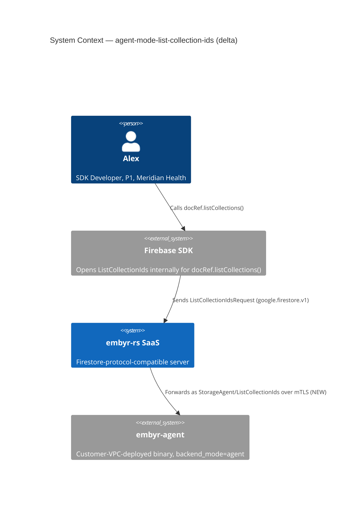
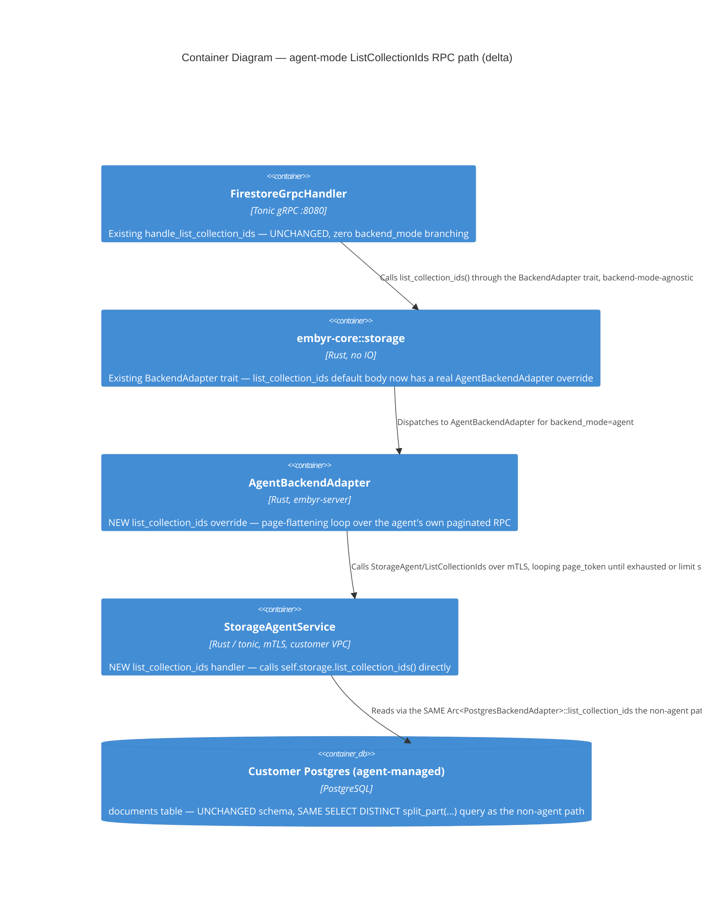

# agent-mode-list-collection-ids — Feature Delta

**Wave**: DISCUSS | **Agent**: Luna (nw-product-owner) | **Date**: 2026-08-31
**Status**: Ready for DESIGN handoff — one escalated open question (cross-version graceful-degradation UX, shared framing with sibling features). See § Handoff Package.
**Upstream**: No DISCOVER/DIVERGE wave ran — commissioned directly by the orchestrator as one of 4 confirmed `backend_mode=agent` parity gaps. `firestore-list-rpcs`'s own DISCUSS (2026-08-31) scoped `ListCollectionIds` to non-agent modes only and confirmed the agent proto has no such RPC (§ Reading Confirmation below) — named as a candidate follow-up feature, not silently dropped.

---

## Wave: DISCUSS / [REF] Prior Wave Consultation — Reading Confirmation

✓ `proto/embyr/agent/v1/storage_agent.proto` (full, 372 lines) — confirmed no `ListCollectionIds` RPC or message exists. The 15 RPCs present are document CRUD, `RunQuery`/`RunAggregationQuery`, transaction lifecycle, `Ping`, `ListDocuments`, and `Subscribe` — no distinct-child-collection enumeration primitive of any kind.
✓ `crates/embyr-agent/src/server.rs` (full, 860 lines) — confirmed `list_documents()`'s own `build_collection_path` fix (this session, `firestore-list-rpcs` DESIGN wave, lines 522-548) is the closest structural precedent: parent-path parsing + pagination (`encode_page_token`/`decode_page_token`) already correctly generalized. `ListCollectionIds` needs a genuinely NEW query primitive — "distinct child collection IDs under a parent" — which is NOT a variant of `run_query`'s existing per-document filtering; it requires either a dedicated SQL query shape or a new `PostgresBackendAdapter` method.
✓ `docs/feature/firestore-list-rpcs/feature-delta.md` (targeted grep, § Reading Confirmation, § Elephant Carpaccio Slices, § Escalation 1) — confirmed that feature shipped `ListCollectionIds` for `direct_pg`/`aws_secret`/`gcp_secret` only, and its own Escalation 1 was about `ListDocuments`'s agent-mode ROUTING (a different, already-solved question — reuse `run_query`) — NOT about `ListCollectionIds`, which was scoped out of that feature entirely for agent mode from the start, with no partial work landed.
✓ `crates/embyr-server/src/adapters/agent_backend.rs` (full, 627 lines) — confirmed `AgentBackendAdapter` has no method resembling collection-ID enumeration; `run_query` is the only query-shaped call it makes today.
✓ `docs/SPEC.md` § Agent gRPC Protocol (lines 493-503) — confirmed the documented (not implemented) protocol summary explicitly lists **"Collection ID listing"** as one of the mirrored `StorageAdapter` capabilities the agent is intended to expose — this gap was always part of the documented design intent, just never implemented, unlike `agent-mode-write-streaming` (absent even from the aspirational description).
✓ `docs/product/jobs.yaml` lines 14-26 (JOB-01) — confirmed same motivating job as sibling features: "all SDK calls succeed unchanged," now including `listCollections()` for agent-mode customers.

No contradictions found between this feature's scope and prior evidence.

---

## Wave: DISCUSS / [REF] Orchestrator Decisions (not re-litigated)

| # | Decision | Value |
|---|---|---|
| 1 | Feature Type | Backend — closes an SDK-facing RPC-level parity gap (`ListCollectionIds`) for `backend_mode=agent`, mirroring `firestore-list-rpcs`'s own US-02 for the other three backend modes |
| 2 | Walking Skeleton | YES — one story IS the walking skeleton (single-project, single-parent enumeration, happy path first scenario) |
| 3 | UX Research Depth | Lightweight, SDK-facing — no TUI; the experience is the Firebase SDK's `docRef.listCollections()` call working transparently against an agent-mode project |
| 4 | JTBD Analysis | Confirmed: extends JOB-01 (sdk-compat), same persona P1 Alex, same "make it real" pattern |

---

## Wave: DISCUSS / [REF] Pre-requisites

- `firestore-list-rpcs` (shipped, non-agent modes) — the `page_token` pagination shape (hex-encoded offset) and the distinct-child-collection query semantics this feature mirrors on the agent side.
- `crates/embyr-agent/src/server.rs::build_collection_path`/`encode_page_token`/`decode_page_token` (shipped, this binary) — directly reusable pagination helpers, no new pagination scheme needed.
- No dependency on the other 3 sibling `backend_mode=agent` features (investigated and confirmed independent, § agent-mode-write-streaming's own Bundle-vs-Split Note, recorded once there).

---

## Wave: DISCUSS / [REF] Persona & Job

**Persona**: **P1 — Alex (SDK Developer)**, Meridian Health, `backend_mode=agent` — same persona and company as `agent-mode-write-streaming`, for continuity within this session's own 4-feature split.

**job_id decision**: `JOB-01` (`sdk-compat`), extended not new.

---

## Wave: DISCUSS / [REF] Scope Assessment (Elephant Carpaccio Gate)

| Signal | Threshold | This feature | Fired? |
|---|---|---|---|
| User stories | >10 | 1 (US-01) | **NO** |
| Bounded contexts / modules | >3 | 1 — BC-2 Document Storage, query surface | **NO** |
| Walking Skeleton integration points | >5 | 3 — (1) new unary RPC + messages on `storage_agent.proto`, (2) new `embyr-agent` handler reusing `build_collection_path`/pagination helpers, (3) new `AgentBackendAdapter` method | **NO** |
| Estimated effort | >2 weeks | ~1.5 days, single slice | **NO** |
| Independent shippable outcomes | multiple unrelated | **NO** — one coherent outcome | **NO** |

**0 of 5 signals fired. Verdict: PASS — single feature, single story, right-sized.**

---

## Wave: DISCUSS / [REF] Journey (Lightweight, SDK-facing, per Decision 3)

**Alex's mental model**: Alex's app calls `docRef.listCollections()` against every other Meridian Health project (`direct_pg` staging) to discover subcollections dynamically (e.g., enumerating a patient document's `visits`, `labResults`, `medications` subcollections without hardcoding the list). Against `meridian-health-prod` (agent-mode), the identical call fails outright.

**Emotional arc** (Confidence Building): **Start** — mild friction; a working staging feature breaks specifically in production. **Middle** — Alex calls `listCollections()`, gets back the correct set of child collection IDs, paginated correctly for a document with many subcollections. **End** — confident; schema-discovery code works uniformly across environments.

**Shared artifact**: the `page_token` hex-offset scheme (source: `crates/embyr-agent/src/server.rs::encode_page_token`/`decode_page_token`, already shipped) — reused unchanged, not reinvented.

**Failure modes**: a parent document has zero subcollections (empty result, not an error) | a parent path is malformed | pagination spans more collections than fit in one page | a sibling subcollection under a DIFFERENT parent is incorrectly included (child-scoping bug).

---

## Wave: DISCUSS / [REF] Story Map & Walking Skeleton

**Persona**: P1 Alex | **Goal**: `docRef.listCollections()` works against `backend_mode=agent` projects exactly as it already does against the other three backend modes.

### Backbone

| A. Enumerate Child Collections | B. Paginate Results |
|---|---|
| Return distinct child collection IDs under a parent document **[WS]** | Correctly page through results for a parent with many subcollections **[WS]** |
| Never include a grandchild or sibling-parent collection **[WS]** | — |

### Walking Skeleton

Call the new RPC against `meridian-health-prod` for `patients/p_204` → returns `["visits", "labResults", "medications"]` (the document's real subcollections, no grandchildren, no siblings). This is Slice 01, US-01 — the entire feature.

---

## Wave: DISCUSS / [REF] WS Strategy

**Strategy: B (Real, Narrow Slice)** — real `embyr-agent` binary, real Postgres, one representative parent document with multiple subcollections. Mirrors `firestore-list-rpcs`'s own WS Strategy for the non-agent version of this RPC.

---

## Wave: DISCUSS / [REF] Elephant Carpaccio Slices

| Slice | Story | Release | Estimate | Learning Hypothesis (disproves) | Production-data taste test |
|---|---|---|---|---|---|
| 01 (WS) | US-01 | 1 | 1.5 days | The "distinct child collection IDs" query cannot be expressed against this codebase's existing document-storage schema without a new query primitive incompatible with the current `PostgresBackendAdapter` shape | Real Postgres, a real parent document with 3+ real subcollections and at least one sibling-parent document with its own distinct subcollection (to prove no cross-parent leakage), asserting the correct set and no extras |

**Total estimate: 1.5 days, single slice.**

**Taste tests applied**: 4+ components — 3 components (proto RPC, agent handler, adapter method), reusing 2 already-shipped helpers (pagination, `build_collection_path`) — PASS. New-abstraction-first — the one new abstraction (distinct-child-collection query) ships in this single slice, nothing deferred — PASS. Falsifiable hypothesis — PASS. Production data only — PASS. No identical-except-scale slices — N/A, single slice.

---

## Wave: DISCUSS / [REF] Prioritization

| Priority | Slice | Target Outcome | Rationale |
|---|---|---|---|
| 1 | Slice 01 (WS) | `listCollections()` works against agent-mode projects | Single-slice feature; no sequencing decision needed |

---

## Wave: DISCUSS / [REF] System Constraints

- **The distinct-child-collection query is a genuinely new primitive**, not a `run_query` variant — DESIGN must decide whether it lives as a new `PostgresBackendAdapter` method (shared with the non-agent `ListCollectionIds` implementation, if that implementation's own query shape is reusable) or as agent-binary-local logic.
- **Reuse `build_collection_path`/`encode_page_token`/`decode_page_token` unchanged** — no new pagination scheme.
- **Cross-version graceful degradation** — same open question as `agent-mode-write-streaming`'s own Escalation 2; referenced here, not re-litigated (§ Handoff Package).

---

## Wave: DISCUSS / [REF] Driving Ports

| Port | Trigger | Notes |
|---|---|---|
| Firebase SDK `docRef.listCollections()` | Client SDK call | Already shipped for non-agent modes (`firestore-list-rpcs`); this feature closes the identical entry point for `backend_mode=agent` |

---

## Wave: DISCUSS / [REF] User Stories

<!-- markdownlint-disable MD024 -->

### US-01: Alex's App Enumerates a Document's Subcollections Against an Agent-Mode Project

**job_id**: JOB-01 (sdk-compat) — extends, "make it real" pattern

#### Problem

Alex's app dynamically discovers a patient document's subcollections (`visits`, `labResults`, `medications`) via `docRef.listCollections()` against Meridian Health's staging project (`direct_pg`). The identical call against `meridian-health-prod` (`backend_mode=agent`) fails — the RPC does not exist on the agent's own gRPC surface.

#### Who

- Alex, SDK Developer at Meridian Health | Same persona and deployment context as `agent-mode-write-streaming` | Needs schema-discovery calls to work uniformly across environments without hardcoding subcollection names per backend mode

#### Solution

A new unary RPC on `storage_agent.proto`, reusing the agent binary's own already-shipped `build_collection_path` and pagination helpers, returns the distinct set of child collection IDs directly under a given parent document.

#### Elevator Pitch

Before: Alex's app calling `db.doc('patients/p_204').listCollections()` against `meridian-health-prod` receives an `Unimplemented` gRPC error.
After: Alex's app calls `db.doc('patients/p_204').listCollections()` → sees `['visits', 'labResults', 'medications']` returned, identical to the same call against a `direct_pg` project.
Decision enabled: Alex decides schema-discovery code can run identically across every Meridian Health environment, including production.

#### Domain Examples

##### 1: Happy Path — Alex enumerates patients/p_204's subcollections

`patients/p_204` has 3 subcollections: `visits`, `labResults`, `medications`. Alex's call returns exactly those 3 IDs.

##### 2: Edge Case — A document with zero subcollections

`patients/p_209` is a newly-created patient record with no subcollections yet. Alex's call returns an empty list, not an error.

##### 3: Boundary — Pagination across many subcollections

`patients/p_204` (in a load-test seed) has 150 subcollections. Alex's first call returns a page of results plus a `next_page_token`; a follow-up call with that token returns the remainder with no overlap or gap.

##### 4: Error/Boundary — Sibling-parent isolation

`patients/p_204` has subcollection `visits`; a DIFFERENT document `patients/p_205` also has its own `visits` subcollection. Alex's call for `p_204` returns `visits` exactly once, never conflated with `p_205`'s own `visits`.

#### UAT Scenarios (BDD)

##### Scenario: Subcollections of a document are listed correctly
```gherkin
Given patients/p_204 in meridian-health-prod has subcollections visits, labResults, and medications
When Alex's app calls listCollections() on patients/p_204
Then the response contains exactly visits, labResults, and medications
```

##### Scenario: A document with no subcollections returns an empty list
```gherkin
Given patients/p_209 in meridian-health-prod has no subcollections
When Alex's app calls listCollections() on patients/p_209
Then the response contains zero collection IDs
And no error is returned
```

##### Scenario: Pagination returns the full set across multiple pages with no overlap
```gherkin
Given patients/p_204 has 150 distinct subcollections
When Alex's app calls listCollections() with a page size of 100
Then the first page returns 100 collection IDs and a next_page_token
And a follow-up call with that token returns the remaining 50 with no duplicates
```

##### Scenario: Subcollections are scoped to the correct parent document
```gherkin
Given patients/p_204 has subcollection visits
And patients/p_205 has its own separate subcollection visits
When Alex's app calls listCollections() on patients/p_204
Then the response includes visits exactly once
And no collection belonging to patients/p_205 appears in the response
```

#### Acceptance Criteria

- [ ] `listCollections()` against a document with subcollections returns exactly the correct, distinct set of child collection IDs
- [ ] `listCollections()` against a document with no subcollections returns an empty list, not an error
- [ ] Pagination via `page_token`/`next_page_token` returns the complete set with no duplicates or gaps across pages
- [ ] Subcollections are correctly scoped to their own parent document — never conflated with a sibling document's identically-named subcollection
- [ ] Exercised against a real `embyr-agent` binary and real Postgres

#### Outcome KPIs

- **Who**: Alex (SDK Developer, agent-mode customers)
- **Does what**: Completes a `listCollections()` call against an agent-mode project
- **By how much**: 0% → 100% of well-formed requests succeed with correctly-scoped, correctly-paginated results
- **Measured by**: Count of successful `listCollections()` calls against the reference test suite
- **Baseline**: 0% — the RPC does not exist on the agent proto today

#### Technical Notes (Optional)

- Reuses `build_collection_path`/`encode_page_token`/`decode_page_token` unchanged.
- The distinct-child-collection query is new; DESIGN decides its exact shape (§ System Constraints).
- Depends on DESIGN resolving whether the underlying query logic is shared with the non-agent `ListCollectionIds` implementation or agent-binary-local.

---

## Wave: DISCUSS / [REF] Outcome KPIs (Feature-Level Summary)

### Feature: agent-mode-list-collection-ids

### Objective

Alex's schema-discovery code (`docRef.listCollections()`) works identically across every embyr backend mode Meridian Health runs, including `backend_mode=agent`.

### Outcome KPIs

| # | Who | Does What | By How Much | Baseline | Measured By | Type |
|---|-----|-----------|-------------|----------|-------------|------|
| 1 | Alex | Completes a `listCollections()` call against an agent-mode project | 0% → 100% of well-formed requests succeed | 0% (RPC does not exist) | Reference test suite | North Star |

### Metric Hierarchy

- **North Star**: KPI #1
- **Leading Indicators**: N/A — single-slice feature
- **Guardrail Metrics**: sibling-parent isolation never regresses (a correctness invariant, not a KPI)

### Measurement Plan

| KPI | Data Source | Collection Method | Frequency | Owner |
|-----|------------|-------------------|-----------|-------|
| Success rate | Reference test suite | Automated assertion | Per CI run | embyr-agent + embyr-server (DELIVER) |

### Hypothesis

We believe adding a new unary `ListCollectionIds`-equivalent RPC to `storage_agent.proto`, reusing already-shipped pagination helpers, will make `listCollections()` work identically against `backend_mode=agent` projects.
We will know this is true when Alex's schema-discovery code succeeds against a real agent-mode deployment with correct scoping and pagination.

---

## Wave: DISCUSS / [REF] Definition of Ready Validation

### Story: US-01

| DoR Item | Status | Evidence/Issue |
|----------|--------|----------------|
| Problem statement clear | PASS | `listCollections()` fails outright against agent-mode, works elsewhere |
| User/persona identified | PASS | Alex, Meridian Health, agent-mode |
| 3+ domain examples | PASS | Happy path, empty-subcollections edge case, pagination boundary, sibling-isolation boundary (4 total) |
| UAT scenarios (3-7) | PASS | 4 scenarios |
| AC derived from UAT | PASS | 5 AC items |
| Right-sized | PASS | 1.5 days, 4 scenarios |
| Technical notes | PASS | Reuse points and open DESIGN question named |
| Dependencies tracked | PASS | No blocking dependency; informational precedent from `firestore-list-rpcs` |
| Outcome KPIs | PASS | Numeric target and measurement method defined |

### DoR Status: PASSED

---

## Wave: DISCUSS / [REF] Handoff Package

### Escalation 1 — Cross-version graceful degradation (shared framing)

Same open question as `agent-mode-write-streaming`'s own Escalation 2 (full detail there, not repeated in full here): `docs/SPEC.md` documents a "major version must match" policy with no runtime enforcement. If `embyr-server` calls this new RPC against an agent binary that predates it, the failure is a clean `Unimplemented` today. DESIGN should resolve this once, ideally reusable across this feature and the other 2 wire-touching sibling features (`agent-mode-write-streaming`, `agent-mode-field-transforms`).

### Handoff Confirmation

Next step (NOT performed by this agent): orchestrator dispatches `nw-solution-architect` for the DESIGN wave — full rigor with ADRs (at minimum: proto message/RPC design; the distinct-child-collection query shape and whether it's shared with the non-agent implementation) and Reuse Analysis.

---

## Wave: DESIGN / [REF] Prior Wave Consultation — Reading Confirmation

**Agent**: Morgan (nw-solution-architect) | **Date**: 2026-08-31 | **Mode**: Propose (autonomous analysis — session standing methodology for this feature set states DESIGN runs full-rigor without a passed interaction mode; the one open question, cross-version graceful degradation, is explicitly deferred to a sibling feature's own DESIGN wave rather than elicited here, leaving nothing that needs a Guide-mode conversation)

✓ This file (full, 297 lines pre-DESIGN) and `docs/feature/agent-mode-list-collection-ids/slices/slice-01-enumerate-subcollections.md`
(full) — re-read directly, not trusted from the Handoff Package summary
alone.
✓ `docs/product/architecture/adr-051-list-collection-ids-query-primitive-and-agent-mode-deferral.md`
(full, 235 lines) — re-read directly. Confirms the non-agent
`list_collection_ids` trait method's exact signature
(`&CollectionPath, limit: i32, offset: i32) -> Result<Vec<String>, CoreError>`),
its default-error body (`FailedPrecondition`, reused unmodified by
`AgentBackendAdapter` until this feature), the `split_part`-based SQL (§
Decision 2), and its own named follow-up sketch for agent-mode support (§
Decision 3) — which this feature builds, with one correction (§ ADR-059
Context: zero SQL duplication needed, ADR-051's own sketch assumed a
duplicate agent-binary SQL handler would be required).
✓ `proto/embyr/agent/v1/storage_agent.proto` (full, 372 lines) — re-read
directly. Confirms no `ListCollectionIds` RPC or message exists (matches
DISCUSS's own Reading Confirmation); confirms `ListDocumentsRequest`/`Response`'s
own field numbering (`parent=1, collection_id=2, page_size=3, page_token=4`
/ `documents=1, next_page_token=2`) as the field-numbering precedent to
mirror, adapted to the client-facing (non-agent) `ListCollectionIdsRequest`/`Response`
shape instead, since `ListCollectionIds` has no `collection_id` field at
all on either proto family.
✓ `proto/google/firestore/v1/firestore.proto` lines 154-175 — re-read
directly. Confirms the exact client-facing message shape
(`ListCollectionIdsRequest{ parent=1, page_size=2, page_token=3 }` /
`ListCollectionIdsResponse{ collection_ids=1, next_page_token=2 }`) this
feature's own new agent-side messages mirror field-for-field.
✓ `crates/embyr-agent/src/server.rs` (full, 860 lines) — re-read directly at
current line numbers. Confirms `list_documents`'s own now-correct
`build_collection_path` usage (lines 549, using the fix landed earlier this
session in `firestore-list-rpcs` DESIGN); confirms `build_collection_path`
itself (lines 758-773) inlines a "find `databases/(default)/documents`, take
the suffix, trim leading `/`" block that is EXACTLY the prefix-extraction
logic this feature's own new handler needs, before it appends `collection_id`
— extracting a shared `parent_prefix` helper (ADR-059 § Decision 2) removes
this duplication rather than adding a third copy; confirms
`encode_page_token`/`decode_page_token` (lines 52-63) are reusable unchanged;
confirms `StorageAgentService` already holds `storage: Arc<PostgresBackendAdapter>`
(line 68) and `BackendAdapter` is already imported (line 19) — the new
handler can call `self.storage.list_collection_ids(...)` directly with zero
new import for that call.
✓ `crates/embyr-agent/Cargo.toml` (full, 65 lines) — re-read directly.
Confirms `embyr-pg-storage.workspace = true` is an unconditional (not
dev-only) dependency (line 18) — the load-bearing fact behind this feature's
own "zero SQL duplication" finding (ADR-059 § Context).
✓ `crates/embyr-pg-storage/src/backend_adapter.rs` lines 842-895 — re-read
directly. Confirms `PostgresBackendAdapter::list_collection_ids` is
ALREADY IMPLEMENTED (not merely documented in ADR-051 — the real Rust/SQL
matches ADR-051 § Decision 2 verbatim), reusable unchanged by the agent's
own new handler.
✓ `crates/embyr-core/src/storage/backend_adapter.rs` (full, 209 lines) —
re-read directly. Confirms the trait method's default-provided body (§
Decision 1 of ADR-051) is exactly what `AgentBackendAdapter` inherits today
— this feature adds the first real override for it outside
`PostgresBackendAdapter`.
✓ `crates/embyr-server/src/adapters/agent_backend.rs` (full, 627 lines) —
re-read directly. Confirms `AgentBackendAdapter` has no `list_collection_ids`
override (inherits the default-error body, matching ADR-051 § Decision 3);
confirms the exact `grpc_err`/domain↔agent-proto translation idiom every
other method uses (`domain_path_to_agent_parent`, `precondition_to_agent`,
`fields_to_agent_map`) as the shape the new
`domain_collection_prefix_to_agent_parent` helper mirrors; confirms
`probe()`'s own existing sentinel-`GetDocument` shape needs no change — this
feature adds no new external dependency, only a new call shape over the
already-`probe()`-covered mTLS channel.
✓ `crates/embyr-server/src/grpc/handler.rs` lines 1638-1687
(`handle_list_collection_ids`) — re-read directly at current line numbers.
Confirms the EXACT `limit = page_size + 1` (client `page_size` clamped
≤100) contract every `BackendAdapter::list_collection_ids` implementor must
honor, and confirms `handle_list_documents`'s own `collection_id`-empty
fan-out (lines 1497-1512) calls the SAME trait method with `limit = i32::MAX`
— both call shapes are the exact boundary conditions ADR-059 § Decision 3's
own page-flattening loop is designed and verified against.
✓ `crates/embyr-core/src/pagination.rs` (full, 65 lines) — re-read directly.
Confirms `encode_page_token`/`decode_page_token` are pure, already used by
the non-agent path; reused unchanged by `AgentBackendAdapter`'s own new loop
(§ Component Decomposition) — the first consumer of this module from within
`AgentBackendAdapter` specifically, still entirely inside `embyr-server`,
not a new cross-binary dependency.

No contradictions found between this feature's scope and prior evidence.
The one open question named at DISCUSS handoff (cross-version graceful
degradation) is deferred per the orchestrator's own standing instruction for
this feature set — see § Escalation Resolutions below, not re-derived here.

---

## Wave: DESIGN / [REF] Escalation Resolutions

### Escalation 1 — Cross-version graceful degradation (deferred to sibling DESIGN wave)

Per the orchestrator's own standing instruction for this session: this
question is being resolved once, in full, by the concurrently-running
`agent-mode-write-streaming` DESIGN wave — not re-derived here. **This
feature inherits whatever conclusion that sibling reaches.** This feature's
own failure mode under today's (unresolved) state is identical to every
other wire-touching sibling: an `embyr-agent` binary predating this RPC
returns a clean gRPC `Unimplemented` for `ListCollectionIds` — a correct,
already-honest gRPC behavior requiring no defensive code in this feature
regardless of which version-skew UX policy the sibling feature lands on
(ADR-059 § Consequences, Residual).

### Named-not-escalated 1 — the distinct-child-collection query's shape for agent mode

DISCUSS named the open question ("agent-local or shared with the non-agent
implementation") and left it to DESIGN. **Resolved: shared, with zero SQL
duplication** — `crates/embyr-agent`'s own `StorageAgentService` already
holds `Arc<PostgresBackendAdapter>` (confirmed, § Reading Confirmation); the
new agent handler calls `self.storage.list_collection_ids(...)` directly,
the IDENTICAL method and SQL the non-agent path already uses (ADR-051 §
Decision 2, unchanged). This is a stronger outcome than ADR-051's own
follow-up sketch anticipated (which assumed a duplicate agent-binary SQL
handler would be needed) — full reasoning: **ADR-059 § Context, § Decision 2**.

### Named-not-escalated 2 — pagination shape across the agent mTLS boundary

Not named as an open question by DISCUSS (which assumed reusing the
existing pagination helpers unchanged would be sufficient), but surfaced
during DESIGN's own re-reading of `handle_list_collection_ids`'s exact
`limit = page_size + 1` calling contract and `handle_list_documents`'s own
`limit = i32::MAX` internal call: the agent's own new RPC is
per-call-paginated (≤100 items, matching `list_documents`'s existing
defensive clamp) while the `BackendAdapter` trait method is a single call
with no page-token concept. **Resolved: `AgentBackendAdapter::list_collection_ids`
loops the agent's own paginated RPC internally, accumulating results until
either the caller's own `limit` is satisfied or the agent signals
exhaustion.** Verified correct at the exact 100/101-item boundary the
client-facing path already exercises. Full reasoning, alternatives
considered (including the naive single-round-trip approach, demonstrated
incorrect), and the worked correctness proof: **ADR-059 § Decision 3**.

---

## Wave: DESIGN / [REF] Component Decomposition

| Component | Path | Action | Notes |
|---|---|---|---|
| `rpc ListCollectionIds` declaration | `proto/embyr/agent/v1/storage_agent.proto` | MODIFY | Inserted immediately after `ListDocuments`, before `Subscribe` — unary-before-streaming, matches this file's own existing ordering |
| `ListCollectionIdsRequest`/`ListCollectionIdsResponse` messages | `proto/embyr/agent/v1/storage_agent.proto` | CREATE | Field shape mirrors the client-facing `google.firestore.v1` messages field-for-field (`parent=1, page_size=2, page_token=3` / `collection_ids=1, next_page_token=2`) — ADR-059 § Decision 1 |
| `parent_prefix` helper (extracted from `build_collection_path`) | `crates/embyr-agent/src/server.rs` | MODIFY (small in-file refactor) | Behavior-preserving extraction; `build_collection_path` becomes a two-line wrapper calling it then appending `collection_id` — ADR-059 § Decision 2 |
| `list_collection_ids` handler | `crates/embyr-agent/src/server.rs` | CREATE | Calls `self.storage.list_collection_ids(...)` directly — zero new SQL, same fetch-one-extra pagination technique `list_documents` (same file) already uses — ADR-059 § Decision 2 |
| `domain_collection_prefix_to_agent_parent` helper | `crates/embyr-server/src/adapters/agent_backend.rs` | CREATE | Mirrors `domain_path_to_agent_parent`'s own shape for a `CollectionPath`-as-parent-prefix semantic (ADR-051's own documented overload) — ADR-059 § Decision 3 |
| `AgentBackendAdapter::list_collection_ids` (real trait override) | `crates/embyr-server/src/adapters/agent_backend.rs` | CREATE (trait override) | Page-flattening loop over the agent's own ≤100-per-call RPC — the one genuinely new mechanism this feature adds — ADR-059 § Decision 3 |

No proto/handler/adapter change is needed on the CLIENT-facing side
(`google.firestore.v1.Firestore/ListCollectionIds`,
`handle_list_collection_ids`) — those already exist (`firestore-list-rpcs`)
and are entirely unaware of `backend_mode`; they call
`BackendAdapter::list_collection_ids` through the trait, which now resolves
to a real implementation for `backend_mode=agent` instead of the inherited
default-error body, with zero handler-level change.

---

## Wave: DESIGN / [REF] Reuse Analysis

| Mechanism | Source | Action | Rationale |
|---|---|---|---|
| `PostgresBackendAdapter::list_collection_ids` (SQL + method) | `crates/embyr-pg-storage/src/backend_adapter.rs:844-895`, unchanged | REUSE UNCHANGED, NEW CALLER | The agent binary already holds this exact struct (`Arc<PostgresBackendAdapter>`); zero SQL duplication (ADR-059 § Context, corrects ADR-051's own follow-up sketch) |
| `BackendAdapter::list_collection_ids` trait method signature | `crates/embyr-core/src/storage/backend_adapter.rs`, unchanged | REUSE UNCHANGED | `AgentBackendAdapter` now supplies its first real override; signature and default-error body (for any future non-overriding adapter) untouched |
| Fetch-one-extra-to-detect-more-pages pagination technique | `list_documents`'s own proven shape (same file) / `handle_list_collection_ids`'s own shape (non-agent) | REUSE (technique, new call site) | The agent's own new handler applies the SAME `page_size+1`/truncate/has_more idiom |
| `encode_page_token`/`decode_page_token` (agent-local copy) | `crates/embyr-agent/src/server.rs:52-63`, unchanged | REUSE UNCHANGED | New handler's own page-token encode/decode |
| `embyr_core::pagination::encode_page_token`/`decode_page_token` (shared copy) | `crates/embyr-core/src/pagination.rs`, unchanged | REUSE UNCHANGED, NEW CALLER | `AgentBackendAdapter`'s own new loop — first use from within `AgentBackendAdapter` specifically, still entirely inside `embyr-server` |
| `core_error_to_status` (agent-side) | `crates/embyr-agent/src/server.rs`, unchanged | REUSE UNCHANGED | New handler's own error mapping — `list_collection_ids`'s only error case (`BackendUnavailable`, from SQL failure) already has a match arm |
| `grpc_err` (server-side) | `crates/embyr-server/src/adapters/agent_backend.rs`, unchanged | REUSE UNCHANGED | `AgentBackendAdapter`'s own new loop, every RPC error in the loop |
| `domain_path_to_agent_parent`'s own shape | `crates/embyr-server/src/adapters/agent_backend.rs`, unchanged | REUSE (shape, new sibling function) | `domain_collection_prefix_to_agent_parent` mirrors its string-building pattern for a `CollectionPath` instead of a `DocumentPath` |
| `BackendAdapter` trait import | `crates/embyr-agent/src/server.rs:19`, unchanged | REUSE UNCHANGED | Already imported; new handler's `self.storage.list_collection_ids(...)` call resolves through it with no new import |
| `build_collection_path`'s own marker-finding logic | `crates/embyr-agent/src/server.rs:758-773` | EXTEND (small refactor into `parent_prefix`) | Removes an in-file duplication rather than adding a third copy; behavior-preserving (ADR-059 § Decision 2) |
| `AgentBackendAdapter` page-flattening loop | — | CREATE NEW | The one genuinely new mechanism — no existing precedent in this codebase for flattening a remote paginated RPC into a single bounded-`limit` driven-port call (ADR-059 § Decision 3) |

**8 REUSE (7 unchanged, 1 shape-only/new sibling function), 1 EXTEND (small
behavior-preserving refactor), 1 CREATE NEW (the page-flattening loop) —
plus the new proto RPC/message pair and the new agent handler, both thin
wrappers over entirely reused machinery.**

---

## Wave: DESIGN / [REF] Driving/Driven Ports

**Driving port**: no new driving port. The client-facing
`google.firestore.v1.Firestore/ListCollectionIds` RPC (existing,
`firestore-list-rpcs`) is unchanged — this feature makes its EXISTING call
into `BackendAdapter::list_collection_ids` resolve correctly for
`backend_mode=agent` for the first time, with zero handler-level
`backend_mode` branching (matching ADR-050/051's own discipline).

**Driven ports**: `StorageAgent/ListCollectionIds` (NEW unary RPC on the
existing agent mTLS driving port, agent-side) and
`BackendAdapter::list_collection_ids`'s first real `AgentBackendAdapter`
override (NEW, this feature's own genuinely new driven-port surface,
`crates/embyr-server`-side). Both sit entirely within the existing,
already-`probe()`-covered mTLS channel between `embyr-server` and
`embyr-agent` — no new external integration, no new third-party dependency.

**External integrations**: none new. Both the agent's own Postgres
connection (already `probe()`-covered at agent startup) and the SaaS↔agent
mTLS channel (already `probe()`-covered via `AgentBackendAdapter::probe()`'s
sentinel `GetDocument`) are pre-existing, unaffected by this feature.

**Earned Trust note (principle 12, applied)**: this feature adds no new
fallible EXTERNAL boundary requiring its own `probe()` — the new RPC and
the new `AgentBackendAdapter` override both fail through already-structured,
already-non-panicking paths: a SQL failure inside the agent's own handler
maps to `CoreError::BackendUnavailable` → `Status::internal` via
`core_error_to_status` (agent-side, existing); any gRPC failure in
`AgentBackendAdapter`'s own loop (including `Unimplemented` from an
old-version agent, § Escalation Resolutions) maps through the existing
`grpc_err` → `CoreError::BackendUnavailable` (server-side, existing). No
new panic surface, no new silent-empty-result path — the loop's own
termination is bounded by the agent's own finite, `LIMIT`-bounded SQL result
set on every iteration (ADR-059 § Decision 3, Alternative B).

---

## Wave: DESIGN / [REF] C4 Diagrams

### System Context (L1) — delta only; full system context unchanged from `brief.md`'s own System Architecture section



### Container (L2)



Component (L3) omitted — neither new handler's own internal shape meets the
5+-component threshold, matching `firestore-list-rpcs`'s own identical L3
omission precedent for the same RPC class.

---

## Wave: DESIGN / [REF] Technology Choices

No new dependency, no new crate. Reuses `sqlx::QueryBuilder` (already a
transitive dependency via `embyr-pg-storage`, already linked into
`embyr-agent`), `tonic`/`prost` (already dependencies of both `embyr-agent`
and `embyr-server`), and every existing domain/port type. Zero OSS
evaluation needed, nothing new to select.

---

## Wave: DESIGN / [REF] Enforcement

**`list_collection_ids`'s own default-provided-body pattern** (ADR-051 §
Decision 1, unchanged) — Rust's trait-default mechanism continues to ensure
any FUTURE `BackendAdapter` implementor that doesn't override the method
gets the safe, structured `FailedPrecondition` rejection automatically.
`AgentBackendAdapter` is now one of the adapters WITH a real override; its
own correctness (the page-flattening loop's boundary behavior, ADR-059 §
Decision 3) is enforced by the acceptance test suite Slice 01's own
AC-03 (pagination completeness) and AC-04 (sibling-parent scoping) drive —
run against the real `embyr-agent` binary and real Postgres (per this
feature's own WS Strategy B), the same test-coverage-based enforcement
discipline `firestore-list-rpcs` already established for this exact query
class (no new static tooling proposed).

**No new IO-boundary rule needed**: neither new component (the agent
handler, `AgentBackendAdapter`'s loop) touches `embyr-core` — `deny.toml`'s
existing NO-IO enforcement is unaffected, nothing new to enforce there.

---

## Wave: DESIGN / [REF] Quality Validation

- [x] Requirements traced: all 5 AC bullets under US-01 map to a named
  component above (query correctness/scoping → ADR-059 § Decision 2, zero
  SQL duplication; empty-result → same SQL, `DISTINCT` over zero rows;
  pagination completeness → ADR-059 § Decision 3, worked boundary proof;
  real-binary/real-Postgres exercise → WS Strategy B, unchanged from
  DISCUSS).
- [x] Component boundaries: the agent's own handler owns request
  parsing/pagination-clamping only, delegating all query logic to
  `PostgresBackendAdapter` (unchanged); `AgentBackendAdapter` owns ONLY the
  wire-pagination-flattening translation, no query logic of its own;
  `BackendAdapter` port is the sole boundary between `embyr-core`'s
  backend-agnostic callers and both concrete adapters.
- [x] Technology choices: zero new deps (documented above).
- [x] Quality attributes: correctness (page-flattening loop verified at the
  exact 100/101 boundary the client-facing path already exercises, ADR-059 §
  Decision 3); reliability (every new failure path is structured, non-panicking,
  bounded-loop-terminating, § Driven Ports Earned Trust note); maintainability
  (zero SQL duplication — one query, one implementation, two callers;
  `parent_prefix` extraction removes an in-file duplication rather than
  adding a third copy); performance (no numeric latency target set, matching
  `firestore-list-rpcs`'s own precedent; the page-flattening loop's own
  worst-case round-trip cost is named explicitly, not hidden, ADR-059 §
  Consequences).
- [x] Dependency-inversion compliance: `handle_list_collection_ids` (client-facing)
  depends on `BackendAdapter` trait only, unchanged, zero new
  `backend_mode` branching anywhere in `embyr-server`'s own handler layer —
  the agent-mode dispatch is entirely inside the existing adapter-selection
  mechanism.
- [x] C4 diagrams: L1 delta + L2 provided above.
- [x] Integration patterns: unary gRPC over the existing mTLS channel — no
  new external integration, no new integration PATTERN (pagination-loop
  wrapping a paginated wire RPC into a single bounded-limit call is a
  pattern already implicit in every Firestore SDK's own client-side
  pagination consumer, not a novel one for this codebase to invent from
  scratch).
- [x] OSS preference: N/A, zero new dependencies.
- [x] AC behavioral, not implementation-coupled: unchanged from DISCUSS.
- [x] External integrations: none new; both the agent's own Postgres
  connection and the SaaS↔agent mTLS channel are pre-existing,
  already-`probe()`-covered, unaffected by this feature (§ Driven Ports
  Earned Trust note).
- [x] Enforcement tooling: named above (trait-default mechanism for the
  IO-boundary/unimplemented-backend rule; test-coverage-based enforcement
  for the new loop's own boundary correctness).
- [ ] Peer review: not performed this session — session standing methodology
  (per orchestrator instruction) has the orchestrator independently verify
  DESIGN output directly against the code, not a dispatched
  `solution-architect-reviewer` sub-agent, for this feature set.

---

## Wave: DESIGN / [REF] Handoff to DELIVER

**Single slice, no sequencing decision needed** (per DISCUSS § Prioritization,
unchanged) — Slice 01 (WS) is the entire feature. Suggested build order
within the slice, smallest-safe-increment first:

1. Proto: add `ListCollectionIdsRequest`/`ListCollectionIdsResponse`
   messages and the `rpc ListCollectionIds` declaration to
   `proto/embyr/agent/v1/storage_agent.proto` (ADR-059 § Decision 1).
   Regenerate `embyr-proto`'s agent module.
2. `crates/embyr-agent/src/server.rs`: extract `parent_prefix` from
   `build_collection_path` (behavior-preserving refactor — verify
   `build_collection_path`'s own existing callers/tests are unaffected
   before adding new code), then add the `list_collection_ids` handler
   calling `self.storage.list_collection_ids(...)` directly (ADR-059 §
   Decision 2).
3. `crates/embyr-server/src/adapters/agent_backend.rs`: add
   `domain_collection_prefix_to_agent_parent` and the real
   `list_collection_ids` override with its page-flattening loop (ADR-059 §
   Decision 3). This is the one component with genuinely new logic — the
   crafter should write the boundary-case test (>100 children, page_size
   exactly 100) FIRST, mirroring the worked proof in ADR-059 § Decision 3,
   before the happy-path/empty/sibling-isolation tests that more directly
   mirror `firestore-list-rpcs`'s own already-proven non-agent test shape.

**Two things the crafter must not rediscover the hard way**:

1. Do NOT write new SQL or a new `PostgresBackendAdapter`-alike struct
   inside `crates/embyr-agent/`. The agent's own handler must call
   `self.storage.list_collection_ids(...)` on the EXISTING
   `Arc<PostgresBackendAdapter>` field directly — `BackendAdapter` is
   already imported in that file (line 19). Writing separate SQL would
   silently reintroduce the exact "two copies drift apart" risk ADR-059 §
   Alternatives C rejects.
2. Do NOT forward the driven-port `limit` parameter directly as the agent
   wire RPC's own `page_size` in a single round trip. This is demonstrably
   incorrect at `page_size=100` (the single most common client page size in
   this codebase) once more than 100 children exist for a parent — worked
   proof and the correct loop-based alternative: ADR-059 § Decision 3 /
   Alternatives A.

**Reference class**: `firestore-list-rpcs` Slice 02 (non-agent
`ListCollectionIds`, ADR-051) — same query class, same AC shape, this
feature's own agent-side handler and adapter are the wire-transport
translation layer around that already-proven query, not a reimplementation
of it.
