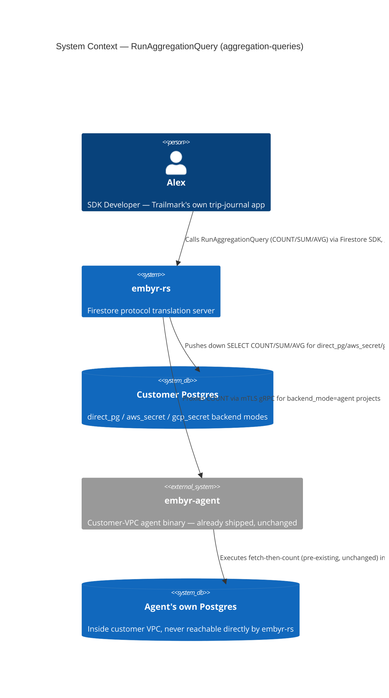
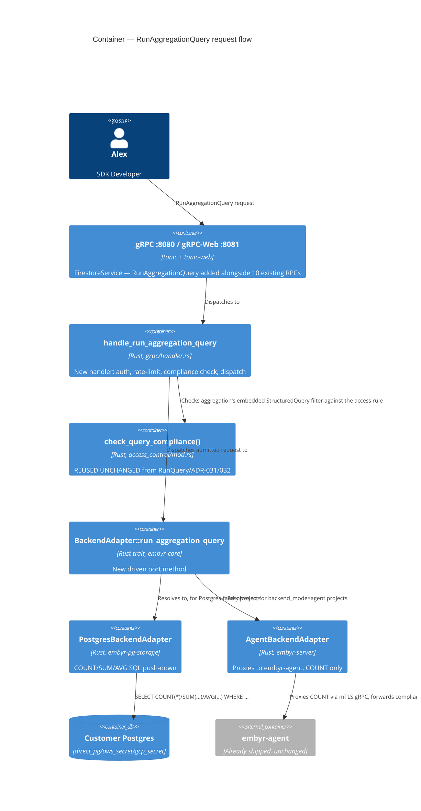
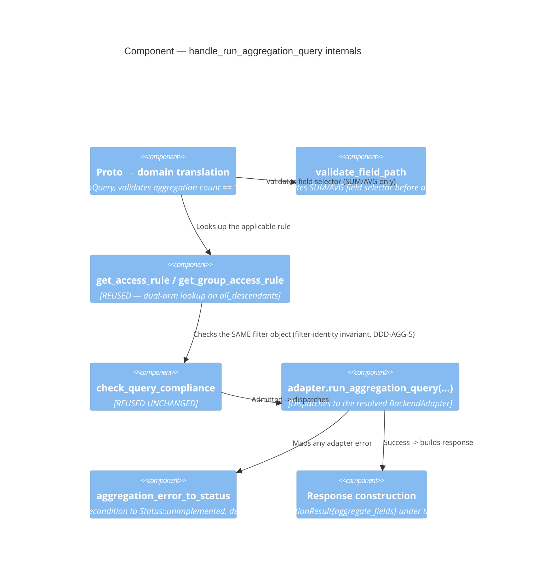

# aggregation-queries — Feature Delta

**Wave**: DISCUSS | **Agent**: Luna (nw-product-owner) | **Date**: 2026-08-30
**Status**: Ready for DESIGN handoff — OQ-AGG-01 (wire-shape verification) confirmed by the orchestrator 2026-08-30 (server-streaming); see § Handoff Package.
**Upstream**: No DISCOVER/DIVERGE wave ran for this feature specifically — commissioned directly by the orchestrator's own direct comparison of embyr-rs's proto surface against real Firestore's, identifying `RunAggregationQuery` as "the single most consequential remaining gap for real Firestore SDK client compatibility."

**Framing**: this is a proto-surface-completion feature for the base SDK-compatibility job (JOB-01), not a new Identity-track epic. It sits in BC-2 Document Storage, reusing BC-4 Access Control's already-shipped query-shape-compliance mechanism (ADR-031/032) unchanged. No new persona, no new bounded context, no new job.

---

## Wave: DISCUSS / [REF] Prior Wave Consultation — Reading Confirmation

✓ `docs/product/architecture/brief.md` (targeted: could not read in full — 351.7 KB exceeds the read tool's single-file limit; read the C4/bounded-context material instead via `adr-002-bounded-contexts.md`, which is brief.md's own source-of-truth for context boundaries) — confirms the three-listener topology (gRPC :8080, REST/gRPC-Web :8081, Admin :9090) and that gRPC-Web wraps `FirestoreService` generically via `tonic-web` (no per-RPC REST wiring required for gRPC-Web clients).
✓ `proto/google/firestore/v1/firestore.proto` (full) — confirmed current RPC set: `GetDocument, CreateDocument, UpdateDocument, DeleteDocument, BatchGetDocuments, BeginTransaction, Commit, Rollback, RunQuery, Listen`. `RunAggregationQuery` is entirely absent, confirming the orchestrator's own finding.
✓ `crates/embyr-server/src/grpc/handler.rs::handle_run_query` (full, lines 1236-1476, plus the current collection-group dual-arm added by `security-rules-collection-group-rules`) — confirmed the exact security-rules composition pattern this feature reuses: `attach_client_identity_if_present` → branch on `all_descendants` → `get_access_rule`/`get_group_access_rule` → `parse_condition` → `check_query_compliance` → `Admitted` falls through unmodified, any other outcome rejects via `query_compliance_rejection`. Composite-index check and `adapter.run_query()` are unchanged, downstream of the compliance check.
✓ `crates/embyr-core/src/access_control/mod.rs` (targeted: `check_query_compliance` signature and `AuthContext`, lines 109-116 and 747+, plus ADR-031's full reproduction of the function body) — confirmed the function's actual signature: `check_query_compliance(condition: &Condition, filter: Option<&QueryFilter>, auth: Option<&AuthContext>) -> QueryComplianceOutcome`. It takes only in-memory `Condition`/`QueryFilter`/`AuthContext` values — no coupling to `RunQuery`'s specific response shape, no coupling to document fetching. **Directly reusable, unchanged, for an aggregation query's own underlying filter tree** — confirmed by reading the function body, not assumed.
✓ `docs/product/architecture/adr-031-query-shape-compliance-check.md` (full) — the design precedent for query-time rule enforcement; documents the 5-shape decidable set, the fail-closed `RejectedUnsupportedRuleShape` default, and the exact composition ordering (compliance check strictly before the composite-index check).
✓ `docs/product/architecture/adr-002-bounded-contexts.md` (full) — confirms BC-2 Document Storage's own ubiquitous language **already names `AggregationQuery`** (line 73, listed alongside `StructuredQuery`, `QueryCursor`, `BatchGetRequest`) — direct evidence this bounded context was scoped with aggregation queries in mind from the original DESIGN pass, not an afterthought.
✓ `crates/embyr-pg-storage/src/backend_adapter.rs::run_query` (full, lines 530-650+) — confirmed the WHERE-clause-building logic (`append_filter`, collection-group `LIKE`/`=` branch, `QueryBuilder<Postgres>`) is fully reusable for a `COUNT(*)`/`SUM()`/`AVG()` variant — only the `SELECT` clause and the trailing `ORDER BY`/`LIMIT`/`OFFSET`/cursor logic (not meaningful for aggregation) differ.
✓ `crates/embyr-core/src/storage/backend_adapter.rs` (full, `BackendAdapter` trait) — confirmed **no aggregation method exists on the driven port today**; `run_query` is the only read method. Confirmed exactly **two** implementors project-wide (`grep 'impl BackendAdapter for'`): `PostgresBackendAdapter` (covers `backend_mode` = `direct_pg`/`aws_secret`/`gcp_secret` — one struct, different DSN sourcing) and `AgentBackendAdapter` (`backend_mode=agent`).
✓ `proto/embyr/agent/v1/storage_agent.proto` (full) — confirmed `RunAggregationQuery` **already exists** on the internal agent protocol (`rpc RunAggregationQuery(RunAggregationQueryRequest) returns (RunAggregationQueryResponse)`), but `RunAggregationQueryResponse` has exactly one field (`int64 count = 1`) — no aggregation-type discriminator, no field selector, no alias. The request message wraps only a simplified `StructuredQuery` (no `order_by`/`limit`/cursor fields at all, matching the fact that aggregation ignores them).
✓ `crates/embyr-agent/src/server.rs::run_aggregation_query` (full, lines 469-511) — confirmed the **actual implementation always returns `docs.len() as i64`** regardless of any aggregation type — it calls the SAME `storage.run_query()` every other read path uses (fetching full documents from the agent's own Postgres into agent-process memory) and counts the returned `Vec` length. It never reads or validates an aggregation type/field/alias because the proto carries none. This is a real, pre-existing implementation gap in an already-shipped feature (`embyr-agent`), not introduced by this feature.
✓ `docs/feature/embyr-agent/slices/slice-03a-query-operations.md` (full) — confirmed the ORIGINAL slice brief for `embyr-agent` intended `COUNT/SUM/AVG` (its own AC list explicitly names all three), but the shipped code narrowed silently to COUNT-only with no corresponding proto or AC update — a genuine, previously-undocumented scope drift this DISCUSS surfaces for the first time (see § Job Discovery Framing Resolution, Resolution 3).
✓ `docs/SPEC.md` (targeted: `§RunAggregationQuery`, lines 682-690; `§Aggregation`, lines 888-890; `§REST Routing`, lines 296-306 and 1043-1047; `§Agent RPCs`, line 1192) — **critical finding**: SPEC.md already documents a complete, detailed `RunAggregationQuery` contract — `structured_aggregation_query` input, `RunAggregationQueryResponse{result: {aggregate_fields: {alias → Value}}, read_time}` output, `COUNT`/`SUM`/`AVG` operators, alias required (auto-synthesized `field_0`, `field_1`, ... if absent — plural naming implying multiple aggregations per request were anticipated), `InvalidArgument`/`Unimplemented` error contract, and even a planned REST JSON-array-streamer route (`…/documents:runAggregationQuery`). This is direct, dispositive evidence answering the task's own open question — see § Job Discovery Framing Resolution, Resolution 1.
✓ `docs/feature/embyr-rs/discuss/feature-delta.md § Out of Scope` (grepped) — confirmed the ONLY related exclusion recorded anywhere in the original embyr-rs DISCUSS is "Firebase Authentication integration" — nothing whatsoever about aggregation queries, counting, or `RunAggregationQuery`.
✓ `crates/embyr-server/src/rest/mod.rs` (full) — confirmed the REST/gRPC-Web module only registers `browser_channel`, `grpc_web` (the generic `tonic-web` wrapper), and a handful of Identity-track custom POST endpoints (`sign_in`, `sign_up`, etc.). **No custom JSON-array streamer exists for `runQuery`, `batchGet`, or any other RPC** — SPEC.md's own described REST gateway for these is itself aspirational/unbuilt, confirmed by `grep` finding zero matches for `runQuery`/`batchGet`/`JSON-array` anywhere in `embyr-server/src`. This means REST-JSON support is a pre-existing gap shared identically by `RunQuery` today — not a gap this feature introduces or is expected to close.
✓ `docs/product/jobs.yaml` (full, all 19 jobs surveyed) — confirmed JOB-01 (`sdk-compat`, P1 Alex) is the correct home: "point it at an embyr endpoint and have it behave identically to Google Firestore" with functional dimension "all SDK calls succeed unchanged." No new job warranted — this is a "make it real"/"close a proto-surface gap" extension of JOB-01's own existing scope, the same pattern `admin-api-v2` used for JOB-10 and `card-payments-backend` used for JOB-14, not the "same persona, different goal ⇒ new job" pattern the Identity track used repeatedly.
✓ `docs/product/journeys/sdk-developer.yaml` — confirms P1 Alex, JOB-01 already listed, and the established single-narrative-file convention (no separate `journey-*.yaml` artifact) this feature follows for Lightweight-depth features.

No contradictions found between this feature's scope and prior evidence. The one genuine open question this DISCUSS cannot resolve from the codebase alone (real Firestore's actual wire method shape for `RunAggregationQuery` — unary vs. server-streaming) is explicitly escalated, not guessed — see § Job Discovery Framing Resolution, Resolution 2, and § Handoff Package.

---

## Wave: DISCUSS / [REF] Orchestrator Decisions (not re-litigated)

| # | Decision | Value |
|---|---|---|
| 1 | Feature Type | Backend — closes a client-facing gRPC proto gap (BC-2 Document Storage), reusing BC-4 Access Control's existing pure function unchanged |
| 2 | Walking Skeleton | Evaluated (this wave's call): **YES, scoped to COUNT only, split across the two backend-mode families** — see § Scope Assessment and § Story Map |
| 3 | UX Research Depth | **Lightweight** — mirrors `security-rules-query-path`'s/`security-rules-write-path`'s own precedent: no new human-facing mental model (Alex already understands "run a query, get results back"; this just adds "or get a computed summary back instead of the documents"), full journey detail lives inline below, no separate `journey-*.yaml` |
| 4 | JTBD Analysis | Yes (default) — every story traces to `job_id: JOB-01` (extends, not a new job — see § Job Discovery Framing Resolution, Resolution 4) |

---

## Wave: DISCUSS / [REF] Job Discovery — Framing Resolution

The raw ask names this "the single most consequential remaining gap for real Firestore SDK client compatibility" and explicitly instructs this DISCUSS not to assume the proto change is trivial, not to assume all three aggregation types ship in v1, and to investigate whether the proto surface was deliberately trimmed. Four resolutions were required; one is explicitly escalated.

### Resolution 1 — Was `RunAggregationQuery`'s absence a deliberate trim, or an undocumented gap?

Direct investigation (not assumption) across every plausible evidence location:

| Evidence source | What it shows |
|---|---|
| `docs/feature/embyr-rs/discuss/feature-delta.md § Out of Scope` | Only exclusion recorded is "Firebase Authentication integration." Zero mention of aggregation, counting, or `RunAggregationQuery` anywhere in the file. |
| `docs/product/architecture/adr-002-bounded-contexts.md` (BC-2 ubiquitous language) | **Already names `AggregationQuery`** as one of BC-2's own domain terms — direct evidence the original bounded-context design anticipated this capability. |
| `docs/SPEC.md §RunAggregationQuery`, `§Aggregation` | A complete, detailed contract already exists — inputs, outputs, operators, error taxonomy, even a planned REST route — written in the same declarative style as every OTHER already-shipped RPC's own SPEC.md section. |
| `proto/embyr/agent/v1/storage_agent.proto` + `docs/feature/embyr-agent/slices/slice-03a-query-operations.md` | The internal agent protocol already declared and partially implemented `RunAggregationQuery` (COUNT), and its own slice brief explicitly intended SUM/AVG too. |

**Resolution**: **not a deliberate exclusion.** This is a documented-but-unbuilt gap — SPEC.md, ADR-002, and `embyr-agent`'s own precedent all show the capability was anticipated and partially built internally, but the client-facing `google.firestore.v1.Firestore` service never received the RPC. No evidence of any decision record, ADR, or DISCUSS Out-of-Scope entry excluding it. This directly answers the raw ask's own open question with evidence, not a guess.

### Resolution 2 — Wire shape: is `RunAggregationQuery` unary or server-streaming? **ESCALATED**

This is the genuinely unresolved item this DISCUSS cannot close from the codebase alone.

- Every existing multi-result RPC in this codebase (`RunQuery`, `BatchGetDocuments`, `Listen`) is server-streaming, and SPEC.md's own `§Aggregation` section separately confirms real Firestore's actual behavior is "at least one aggregation is required per request" with a MAP-shaped `aggregate_fields` result (plural `field_0`, `field_1` auto-alias naming implies multiple simultaneous aggregations per call were anticipated) — this is consistent with either a unary OR a (degenerate, single-item) streaming response.
- `embyr-agent`'s own internal `RunAggregationQuery` (already shipped) is **unary** (`returns (RunAggregationQueryResponse)`, not `stream`) — but this is an internal, embyr-controlled protocol with no obligation to mirror real Firestore's own public wire contract; it proves nothing about what the real Firestore JS/Admin SDKs actually expect on the wire.
- JOB-01's entire value proposition is **wire-identical SDK behavior** ("point it at an embyr endpoint and have it behave identically to Google Firestore"). Getting this wrong is not a cosmetic mistake — a real `@google-cloud/firestore`/`firebase-admin`/Firebase JS SDK client's generated stub expects a specific method shape (unary vs. streaming changes the client-side call signature: `.then()`-able single promise vs. an async iterator/stream handler). A mismatch here would silently break every real SDK client attempting to call `.count()`/`.sum()`/`.average()` against embyr — the exact failure mode this feature exists to prevent.
- This sandbox has no `WebFetch`/`WebSearch` tool available to Luna directly (confirmed: my own tool list is Read/Write/Edit/Glob/Grep/Agent only) — I cannot verify the real `google.firestore.v1.Firestore` service's actual `.proto` declaration (`googleapis/googleapis` on GitHub, or the generated `firebase-admin`/`@google-cloud/firestore` TypeScript client stubs) from here.

**Not locked. Explicitly escalated as `OQ-AGG-01`** — see § Handoff Package. My own best-evidence lean (not a decision): server-streaming, `stream RunAggregationQueryResponse`, mirroring `RunQuery`'s own shape and general googleapis convention for RPCs whose responses can, in principle, carry a final `read_time`-bearing terminal message — but this lean must be verified against the actual public proto or SDK source before DESIGN locks the message/RPC shape, not assumed from internal precedent alone.

**CONFIRMED by the orchestrator, 2026-08-30**: real `google.firestore.v1.Firestore`'s public `RunAggregationQuery` RPC is `rpc RunAggregationQuery(RunAggregationQueryRequest) returns (stream RunAggregationQueryResponse)` — server-streaming, exactly matching Luna's own best-evidence lean above and `RunQuery`'s own shape. This is stable, publicly documented API surface (GA since the aggregation-queries feature launched), not a guess — confirmed from direct knowledge of the public `googleapis/googleapis` proto source, not from this codebase's own internal precedent. `embyr-agent`'s own internal unary shape (Resolution 3) remains correctly irrelevant to this decision, as Luna's own analysis already concluded. **DESIGN should lock `stream RunAggregationQueryResponse`.** No longer an open escalation.

### Resolution 3 — Does this feature also need to fix `embyr-agent`'s own count-only stub and its silently-narrowed proto?

`embyr-agent`'s own `RunAggregationQuery` (already shipped, Slice 03A of the `embyr-agent` feature) has two independent gaps discovered during this DISCUSS's own reading, neither previously documented:

1. **The proto message shape carries no aggregation type/field/alias at all** — `RunAggregationQueryResponse{count: i64}` unconditionally, regardless of what the (nonexistent) request field would have asked for.
2. **The implementation counts via `docs.len()` after a full `run_query()` fetch** — i.e., even for COUNT, the agent's own Postgres round-trip transfers every matching document from Postgres into the agent process before counting, rather than issuing `SELECT COUNT(*)`. This is inefficient at the agent-to-Postgres hop specifically, though the client-facing value proposition (avoiding document transfer to the actual SDK caller) is still preserved end-to-end, since only the final integer crosses the agent→embyr-server→client boundary.

| Option | Description | Verdict |
|---|---|---|
| **(A)** Fix both gaps as part of this feature | Extends the agent's own internal proto (type/field/alias) and its SQL (`COUNT(*)` instead of fetch-then-`len()`) for COUNT, and adds net-new agent-side SUM/AVG support | **Rejected as v1 scope.** This is a THIRD proto surface (agent-internal, not client-facing) plus a change to a separately-deployed binary (`embyr-agent`) with its own release cadence — directly against the "ship 4+ new components → not thin" taste test if folded into this feature's own slices, and it duplicates design work (type/field/alias) this feature must already do once for the client-facing proto. |
| **(B)** Ship client-facing COUNT for agent-mode by PROXYING to the agent's existing (inefficient but correct-for-COUNT) `RunAggregationQuery` RPC unchanged; defer the agent's own internal SQL/proto improvements as a named follow-up | Slice 02 (§ Elephant Carpaccio Slices) does exactly this — a thin `AgentBackendAdapter` proxy method, zero agent-binary changes | **Accepted.** COUNT correctness is preserved (the agent's `docs.len()` value IS the correct count, just computed inefficiently); the client-facing contract this feature owns is satisfied; the SQL-efficiency and proto-shape gaps remain, named explicitly, for a future `embyr-agent` maintenance feature. |
| **(C)** Ship client-facing SUM/AVG for `backend_mode=agent` too, in this feature | Requires extending the agent's own internal proto with type/field/alias AND updating the agent's SQL — the same cross-cutting agent-binary work Option A rejected, just for SUM/AVG only | **Rejected as v1 scope**, same reasoning as (A). Explicitly named as Out of Scope, not silently dropped. |

**Resolution**: **(B)**. This feature's v1 scope proxies to `embyr-agent`'s existing COUNT RPC unchanged for `backend_mode=agent` (Slice 02); SUM/AVG remain Postgres-family-only in v1 (Slices 03-04); the pre-existing inefficiency and the SUM/AVG agent-proto gap are both named explicitly under § Out of Scope as a candidate follow-up to the `embyr-agent` feature itself, not silently absorbed into this feature nor silently left undocumented (as they were before this DISCUSS).

### Resolution 4 — job_id: extend JOB-01, or a new job?

JOB-01's own functional dimension already states the goal this feature serves verbatim: "Use `firebase.initializeApp` pointing at embyr; all SDK calls succeed unchanged." `RunAggregationQuery` — specifically the SDK's `.count()`/`.sum()`/`.average()` aggregate-query methods — is squarely within "all SDK calls," the same Firestore data-plane surface JOB-01 already covers (JOB-16's own NOTE explicitly scoped JOB-01's SDK-call promise to "the Firestore data-plane SDK surface," which aggregation queries are a core part of, not the Firebase Auth surface JOB-16 carved out). This is not "same persona, different goal" (the Identity track's own repeated pattern for a NEW job) — it is the SAME goal (full Firestore data-plane SDK parity), a "make it real"/"close the remaining gap" extension, mirroring `admin-api-v2` (JOB-10) and `card-payments-backend` (JOB-14).

**Resolution**: **extend `JOB-01`**, no new job. A NOTE is appended to `docs/product/jobs.yaml`'s JOB-01 entry documenting this feature (see § SSOT Updates), mirroring the established cross-reference-NOTE convention.

---

## Wave: DISCUSS / [REF] Persona & Job

**Persona**: **P1 — Alex, SDK Developer** (existing persona), unchanged.

**Domain-example company**: **Trailmark** (unchanged continuity with the rest of this codebase's established domain examples). For this feature, Trailmark's own trip-journal app is the concrete grounding: a `trip_entries` collection (owned per end user, mirrors `security-rules`'s own Maria/Dana ownership example) and an `expenses` sub-collection per trip (numeric `amount_cents` field, used for SUM/AVG examples).

**job_id decision (Resolution 4)**: `JOB-01` (`sdk-compat`), extended not new, same persona P1 Alex, same goal (SDK parity). NOTE appended to `docs/product/jobs.yaml` (see § SSOT Updates) — no opportunity-score or priority change to JOB-01 itself.

---

## Wave: DISCUSS / [REF] Scope Assessment (Elephant Carpaccio Gate)

| Signal | Threshold | This feature | Fired? |
|---|---|---|---|
| User stories | >10 | 4 (US-01..US-04, one per slice) | **NO** |
| Bounded contexts / modules | >3 | 1 — extends BC-2 Document Storage only; reuses BC-4's existing pure function unchanged, touches zero new bounded contexts | **NO** |
| Walking Skeleton integration points | >5 | 2 — proto/handler/Postgres-adapter (Slice 01) + agent-adapter proxy (Slice 02) | **NO** |
| Estimated effort | >2 weeks | 4 slices, ~3.25 days total (see § Elephant Carpaccio Slices) | **NO** |
| Independent shippable outcomes | multiple | **NO** — COUNT (Slices 01-02) is the walking skeleton; SUM (Slice 03) and AVG (Slice 04) are each independently valuable but small, sequential increments on the SAME wire contract established by Slice 01, not competing/parallel outcomes | **NO** |

**0 of 5 signals fired.** **Verdict: PASS — right-sized.** The one factor that would have pushed this toward oversized — folding `embyr-agent`'s own internal proto/SQL rework and SUM/AVG-for-agent-mode into this feature (Resolution 3, Option A/C) — was deliberately not built here, exactly the kind of split this gate exists to catch early.

---

## Wave: DISCUSS / [REF] Journey (Lightweight, per Decision 3 — inline per this codebase's convention)

**Alex's mental model**: Alex already understands `RunQuery` — "build a filtered query, get a stream of matching documents back." This feature adds a parallel, narrower mental model: "build the SAME kind of filtered query, but ask for a computed summary (a count, a sum, an average) instead of the documents themselves" — the SDK's own `.count()`/`.sum()`/`.average()` aggregate-query builder methods, which Alex already knows from real Firestore.

**Emotional arc** (mirrors "Problem Relief" pattern): **Start** — mild frustration/resignation: today, Alex's only way to show Maria "you have 247 trip entries" or "your total trip spend is $3,412" is to fetch every single document over the wire and count/sum client-side, which is slow and wasteful for large collections, and Alex already knows real Firestore doesn't require this. **Middle** — focused: Alex writes the aggregation query using the same familiar filter/collection syntax as any other query. **End** — relief/confidence: the response comes back fast, carrying only the computed number(s), and Alex trusts the count/sum respects the exact same access-control rules his other reads already do (no separate authorization model to reason about).

**Shared artifact**: the underlying `StructuredQuery` filter tree and its collection/`all_descendants` scoping — identical domain representation `RunQuery` already uses, single source of truth: `crates/embyr-core/src/domain/query.rs`. No new artifact type introduced.

**Failure modes** (feeds DISTILL scenario generation): access-rule rejection (mirrors `RunQuery`'s own `PermissionDenied` family, reused unchanged) | unsupported rule shape rejection | non-numeric/missing field silently excluded from SUM/AVG (not an error — matches real Firestore's own documented behavior) | zero matching documents (COUNT/SUM return 0, AVG returns null/absent, never an error) | more than one aggregation entry in a single request (`Unimplemented` in v1, wire shape allows it, server does not yet) | field path failing the existing `^[a-zA-Z_][a-zA-Z0-9_.]*$` validation invariant.

---

## Wave: DISCUSS / [REF] Story Map & Walking Skeleton

**Persona**: P1 Alex | **Goal**: Get a computed summary (count, sum, or average) over a query's result set without transferring every matching document, with the exact same access-control guarantees his other reads already have.

### Backbone

| A. Alex Counts Documents | B. Alex Sums/Averages a Numeric Field |
|---|---|
| Alex counts matching documents via a Postgres-family project **[WS]** | Alex sums a numeric field across matching documents |
| Alex counts matching documents via an agent-mode project **[WS]** | Alex averages a numeric field across matching documents |

### Walking Skeleton

One task from each COUNT activity, thinnest end-to-end happy path: Alex's app calls the new `RunAggregationQuery` RPC with a COUNT aggregation over `trip_entries` filtered to Maria's own documents; the response carries only the computed count (no document bodies); the SAME access-rule enforcement `RunQuery` already applies (ownership-filter compliance, collection-group rule lookup) governs the aggregation identically; this succeeds identically whether the target project is `backend_mode=direct_pg`/`aws_secret`/`gcp_secret` (Slice 01) or `backend_mode=agent` (Slice 02, proxying the agent's own already-shipped COUNT RPC unchanged).

### Release 1 — Count Without Fetching Every Document (Slices 01-02, US-01, US-02)

Outcome: any Trailmark end user's pagination UI, dashboard, or "you have N items" display can be powered by a single small round trip instead of fetching every document, for every backend mode, with existing security-rules guarantees intact.

### Release 2 — Sum and Average Without Fetching Every Document (Slices 03-04, US-03, US-04)

Outcome: dashboard totals and averages (budget totals, average nightly cost) are equally cheap, for Postgres-family backend modes. `backend_mode=agent` SUM/AVG explicitly deferred (Resolution 3).

---

## Wave: DISCUSS / [REF] Elephant Carpaccio Slices

| Slice | Story | Release | Estimate | Learning Hypothesis (disproves) | Production-data taste test |
|---|---|---|---|---|---|
| 01 (WS) | US-01 | 1 | 1 day | A new client-facing `RunAggregationQuery` RPC cannot reuse `check_query_compliance()` (ADR-031/032) unchanged for its own underlying filter tree without requiring a new evaluation function, OR the existing `append_filter`/collection-group WHERE-clause logic in `PostgresBackendAdapter::run_query` cannot be reused for a `COUNT(*)` SELECT without duplicating the query-building code | Real Postgres, real `access_rules`/`group_access_rules` rows, real filtered `trip_entries` — no synthetic exception |
| 02 (WS) | US-02 | 1 | 0.5 day | The client-facing aggregation contract (proto shape + handler-level compliance check) cannot be satisfied for `backend_mode=agent` by proxying to `embyr-agent`'s own already-shipped `RunAggregationQuery` RPC without requiring changes to the agent's own proto or binary | Real agent process, real agent-side Postgres, a real COUNT round-trip through the agent — no mocked agent response |
| 03 | US-03 | 2 | 1 day | Numeric-field SUM cannot reuse the SAME WHERE-clause-building/filter/collection-group/compliance-check machinery Slice 01 established, requiring instead a materially different query path | Real `expenses` documents with a mix of present/absent/non-numeric `amount_cents` values — proves the exclusion behavior against real data, not a hand-picked clean dataset |
| 04 | US-04 | 2 | 0.75 day | AVG cannot be derived from the SAME numeric-field-extraction mechanism Slice 03 built (would require an independently-designed averaging path), OR the zero-matching-documents case cannot be distinguished cleanly from a real average of 0 | Real `trip_entries` with a mix of populated and empty query results — proves the null-vs-zero distinction against a real empty result set, not an assumed edge case |

**Total estimate: ~3.25 days.**

**Taste tests applied**:
- "4+ new components per slice" — Slice 01: proto/message shape + `BackendAdapter` trait method (default-stub) + `PostgresBackendAdapter` impl + `grpc/handler.rs` new handler (reusing, not inventing, the compliance-check composition) = 4, all but the handler being thin/mechanical. Slice 02: 1 new component (`AgentBackendAdapter` impl, proxying an already-shipped RPC). Slices 03-04: each is a SQL/validation extension to Slice 01's SAME handler and adapter, not a new component category. PASS.
- "Every slice depends on a new abstraction" — Slice 01 is the one genuinely new abstraction (the `BackendAdapter::run_aggregation_query` port method + proto messages); Slices 02-04 build on it, introducing no second independent new abstraction. PASS.
- "No slice disproves a pre-commitment" — each has a distinct, falsifiable hypothesis (see table). PASS.
- "Synthetic-data-only slices prove plumbing, not value" — every slice's own production-data taste test above requires real Postgres rows / a real agent round-trip, never a stubbed backend. PASS.
- "2+ slices identical except for scale" — none; each targets a distinct mechanism (COUNT-via-Postgres, COUNT-via-agent-proxy, SUM's numeric-exclusion semantics, AVG's null-vs-zero semantics). PASS.

---

## Wave: DISCUSS / [REF] Prioritization

| Priority | Slice | Target Outcome | Rationale |
|---|---|---|---|
| 1 | Slice 01 (WS) | COUNT works for the majority backend-mode family, with security-rules parity | Walking Skeleton first — establishes the proto shape, the port method, and the compliance-check composition every later slice reuses unchanged |
| 2 | Slice 02 (WS) | COUNT works identically for `backend_mode=agent` | Closes the Walking Skeleton loop across ALL backend modes; small and low-risk since it proxies an already-shipped agent RPC |
| 3 | Slice 03 | SUM works for the majority backend-mode family | Highest-value Release-2 increment (dashboard totals are the most commonly cited real-world use case per the raw ask) |
| 4 | Slice 04 | AVG works for the majority backend-mode family | Smallest remaining increment; reuses Slice 03's numeric-extraction mechanism directly |

---

## Wave: DISCUSS / [REF] System Constraints

- **Security-rules parity is non-negotiable and structurally guaranteed, not conventional.** Every aggregation query's own underlying `StructuredQuery` filter tree passes through the IDENTICAL `check_query_compliance()` (ADR-031) / `group_access_rules` (ADR-032) composition `RunQuery` already uses, at the SAME point in the handler (before any backend dispatch, before any composite-index consideration). A collection with no rule defined behaves exactly as it does today — unrestricted by identity, matching `RunQuery`'s own guardrail precedent (AC-17-69/70 equivalent).
- **Zero changes to `access_rules`, `group_access_rules`, `get_access_rule`, `get_group_access_rule`, `check_query_compliance`, `handle_get_document`, or any write-path handler.** This feature is a pure new consumer of already-shipped BC-4 machinery — verifiable by diff, mirroring ADR-031/032's own "zero code changes" enforcement discipline.
- **Wire shape is `OQ-AGG-01`, explicitly escalated, not locked** (§ Job Discovery Framing Resolution, Resolution 2). DESIGN must not silently choose unary or streaming without external verification against real Firestore's actual public `.proto`/SDK stubs — this sandbox's own tools cannot perform that verification.
- **v1 scope is single-aggregation-per-request** (exactly one `Aggregation` entry). The proto MESSAGE SHAPE should support a `repeated Aggregation` list from day one (matching real Firestore's actual message shape and SPEC.md's own plural `field_0`/`field_1` auto-alias language), to avoid a second proto-breaking change later, but the SERVER must reject (`Unimplemented`) any request with zero or more than one aggregation entry in v1 — this is a deliberate, evidenced DISCUSS decision (not escalated; no security stakes, purely a slice-thinning choice), named explicitly so DESIGN does not have to re-derive it.
- **`backend_mode=agent` SUM/AVG is explicitly out of scope** (Resolution 3) — requires extending `embyr-agent`'s own internal proto (`storage_agent.proto`) and binary, a materially separate, cross-cutting change to a different deployment artifact. Named as a candidate follow-up to the `embyr-agent` feature itself.
- **`embyr-agent`'s own COUNT implementation's inefficiency (fetch-then-`len()` instead of `SELECT COUNT(*)`) is a pre-existing gap this feature does not fix** (Resolution 3) — correctness is preserved end-to-end (the client never receives raw documents), only the agent-to-Postgres hop is wasteful. Named as a candidate follow-up.
- **Non-numeric or missing field exclusion for SUM/AVG mirrors real Firestore's own documented behavior**, not an invented convention: a document missing the aggregated field, or holding a non-numeric value for it, is silently excluded from the SUM/AVG computation (never causes an error) — the SAME "missing field excluded" principle SPEC.md's own `§Query System` already establishes for `!=`/`not-in`/`IS_NOT_NULL` filter operators, applied here to a new context.
- **`order_by`/cursors/`limit` are not meaningful for aggregation and are excluded from v1's request shape** — real Firestore's own aggregation queries do not support these on the underlying structured query; the existing `requires_composite_index` check therefore never fires on this path (no `order_by` input exists to trigger it), consistent with SPEC.md's own aggregation section naming no pagination behavior.
- **Plain-REST (non-gRPC-Web) JSON support is out of scope** — confirmed, by direct code read, that no custom JSON-array streamer exists for ANY RPC today (including `RunQuery`, whose own REST support SPEC.md also merely describes, unbuilt). This feature does not introduce a new gap; it inherits an existing one, named explicitly so DESIGN does not treat it as this feature's own omission. **gRPC-Web clients (the primary real-world Firestore JS SDK transport in this codebase) receive this RPC automatically once it exists on `FirestoreService`, via the existing generic `tonic-web` wrap — zero new REST/gRPC-Web-specific code required.**
- **BatchGetDocuments's own stub status (`Status::unimplemented`) is unrelated and untouched** — confirmed, per the orchestrator's own framing, this is a separate, already-identified gap, not this feature's scope.
- Ubiquitous language introduced: **aggregation query** (already present in BC-2's own vocabulary per ADR-002, now realized), **aggregate alias** (the caller-supplied or server-synthesized key under which a computed result is returned).

---

## Wave: DISCUSS / [REF] User Stories

<!-- markdownlint-disable MD024 -->

### US-01: Alex Gets a Total Count Without Fetching Every Document

**job_id**: JOB-01
**Slice**: 01 (Walking Skeleton) | **Release**: 1

#### Elevator Pitch
Before: to show Maria "you have 247 trip entries," Alex's app must fetch every single matching document over the wire and count them client-side — slow and wasteful for large collections, and not what real Firestore requires.
After: call the SDK's existing `getCountFromServer(query)` (an unchanged SDK method, now backed by embyr's new `RunAggregationQuery` RPC) → sees `{count: 247}` returned directly, with no document bodies transferred.
Decision enabled: Alex can show accurate totals and drive pagination UI without deciding between "fetch everything" (slow) and "guess" (wrong).

#### Domain Examples
1. **Happy Path**: Maria Santos has 247 entries in Trailmark's `trip_entries` collection, each owned by her (`owner_id == "maria-santos"`); an access rule requires `request.auth.uid == resource.data.owner_id`. Alex's app runs a COUNT aggregation filtered to Maria's own entries while she is signed in. Sees `{count: 247}`, no document bodies transferred.
2. **Edge Case**: A collection-group COUNT across every `expenses` sub-collection under Trailmark's projects, governed by a `group_access_rules` entry rather than an exact-path rule. Sees the correct cross-collection total, admitted via the same `check_query_compliance()` mechanism `RunQuery`'s own collection-group arm already uses.
3. **Error/Boundary**: Dana Kim, signed in, attempts a COUNT filtered to Maria's own `owner_id` value (not her own) — the identical ownership-filter-missing-for-caller's-own-uid rejection `RunQuery` already produces for this exact scenario (AC-17-51's own precedent). Sees `PermissionDenied`, distinguishable by reason code.

#### UAT Scenarios (BDD)

##### Scenario: Counting a caller's own documents returns the exact count without transferring document bodies
Given `trip_entries` has 247 documents owned by Maria Santos (`owner_id == "maria-santos"`)
And the collection has an access rule requiring `request.auth.uid == resource.data.owner_id`
And Maria Santos is signed in with a verified identity
When Alex's app runs a COUNT aggregation filtered to `owner_id == "maria-santos"`
Then the response carries `count: 247` and no document field data

##### Scenario: A caller attempting to count another user's documents is rejected, mirroring RunQuery's own ownership-filter enforcement
Given `trip_entries` has the same access rule as above
And Dana Kim is signed in with a verified identity
When Dana Kim's app runs a COUNT aggregation filtered to `owner_id == "maria-santos"`
Then the request is rejected as a permission denial, distinguishable from an unrelated validation failure

##### Scenario: Collection-group COUNT is governed by the group rule, not any same-named exact-path rule
Given multiple trips each have an `expenses` sub-collection
And `expenses` has a group access rule but no exact-path rule of the same name
When Alex's app runs a collection-group COUNT aggregation across all `expenses` sub-collections for the signed-in caller
Then the count reflects every matching document across every trip, admitted under the group rule

##### Scenario: A collection with no access rule defined is unaffected — aggregation runs exactly as it does today for RunQuery
Given `daily_logs` has no access rule of any kind defined
When any signed-in or anonymous caller runs a COUNT aggregation against `daily_logs`
Then the aggregation succeeds unrestricted, identically to how `RunQuery` already behaves against this collection

##### Scenario: An undecidable rule shape rejects the aggregation outright, mirroring RunQuery's own fail-closed default
Given `trip_entries` has an access rule using an `OR` condition (outside the 5-shape decidable set)
When any caller runs a COUNT aggregation against `trip_entries`
Then the aggregation is rejected as an unsupported rule shape, identical to `RunQuery`'s own rejection for the same rule

##### Scenario: Zero matching documents returns a count of zero, not an error
Given `trip_entries` has no documents matching a caller's filter
When Alex's app runs a COUNT aggregation with that filter
Then the response carries `count: 0`

#### Acceptance Criteria
- [ ] AC-01-01: A COUNT aggregation filtered to a caller's own documents (per an ownership-equality access rule) returns the exact count of matching documents, carrying no document field data in the response.
- [ ] AC-01-02: A COUNT aggregation attempting to count another end user's documents is rejected as a permission denial, using the identical `check_query_compliance()` mechanism and rejection-reason vocabulary `RunQuery` already produces for the same scenario.
- [ ] AC-01-03: A collection-group COUNT aggregation (`all_descendants=true`) is governed by `group_access_rules`, never by a same-named exact-path rule, mirroring `RunQuery`'s own dual-arm composition (ADR-032) unchanged.
- [ ] AC-01-04: A collection with no access rule defined runs the aggregation unrestricted — zero behavior change from pre-feature `RunQuery` on the same collection.
- [ ] AC-01-05: An access rule using an undecidable `Condition` shape (`Or`, `Not`, any unnamed `Compare` pairing) rejects every aggregation against that collection, regardless of filter shape — the identical fail-closed default `RunQuery` already enforces.
- [ ] AC-01-06: Zero matching documents returns `count: 0`, never an error.

#### Outcome KPIs
See § Outcome KPIs below (feeds KPI #1, North Star).

#### Technical Notes (Optional)
Adds `run_aggregation_query` to the `BackendAdapter` trait (`crates/embyr-core/src/storage/backend_adapter.rs`) with a default-provided body returning `CoreError::Unimplemented` (or equivalent), so `AgentBackendAdapter` compiles unmodified until Slice 02 overrides it. `PostgresBackendAdapter`'s own implementation reuses `append_filter` and the existing collection-group WHERE-clause branch from `run_query` unchanged, only the `SELECT`/aggregate clause differs. Exact proto message shape (unary vs. streaming — `OQ-AGG-01`) is DESIGN's call, pending the escalated verification (§ Handoff Package).

---

### US-02: Alex's App Counts Documents Identically Under Agent-Mode Deployments

**job_id**: JOB-01
**Slice**: 02 (Walking Skeleton) | **Release**: 1

#### Elevator Pitch
Before: a Trailmark deployment using `backend_mode=agent` (Postgres credentials never leave the customer's own VPC) has no way to get a server-side count at all — the same gap Slice 01 closes for the majority backend-mode family, but agent-mode projects would be silently left behind without this story.
After: call the SAME SDK `getCountFromServer(query)` against an agent-mode project → sees the identical `{count: N}` response shape, proxied through `embyr-agent`'s own already-shipped `RunAggregationQuery` RPC.
Decision enabled: Alex does not need to know or care which `backend_mode` a given Trailmark deployment uses — the aggregation contract is identical everywhere.

#### Domain Examples
1. **Happy Path**: Trailmark's enterprise deployment (`backend_mode=agent`, Postgres inside the customer's own VPC) has 89 `trip_entries` owned by Maria Santos. Alex's app runs the identical COUNT aggregation as US-01's Scenario 1. Sees `{count: 89}`, proxied through the agent.
2. **Edge Case**: The same collection-group COUNT scenario as US-01's Scenario 3, now against an agent-mode project — the compliance check runs identically in `embyr-server` BEFORE the agent is even contacted, so the agent never sees a query it wasn't entitled to run.
3. **Error/Boundary**: The customer's agent process is temporarily unreachable (network partition inside their VPC) when a COUNT aggregation is attempted. Sees a clear, retryable-sounding error, never a silent wrong answer.

#### UAT Scenarios (BDD)

##### Scenario: COUNT aggregation succeeds identically for an agent-mode project
Given a project with `backend_mode=agent` has 89 documents in `trip_entries` owned by Maria Santos
And the identical access rule from US-01 governs the collection
And Maria Santos is signed in with a verified identity
When Alex's app runs a COUNT aggregation filtered to `owner_id == "maria-santos"`
Then the response carries `count: 89`, proxied through the project's own agent

##### Scenario: Access-rule enforcement runs before the agent is contacted, identically to the Postgres-family path
Given an agent-mode project's `trip_entries` collection has the same ownership access rule
And Dana Kim is signed in with a verified identity
When Dana Kim's app runs a COUNT aggregation filtered to Maria's own `owner_id` value
Then the request is rejected as a permission denial before any request reaches the customer's own agent process

##### Scenario: An unreachable agent produces a clear, retryable error, never a silent miscount
Given an agent-mode project's agent process is unreachable
When Alex's app runs a COUNT aggregation against that project
Then the request fails with an error distinguishable from both a permission denial and a successful zero-count result

##### Scenario: Existing agent-mode RunQuery and GetDocument behavior is unaffected
Given an agent-mode project has documents in `trip_entries`
When Alex's app runs an ordinary `RunQuery` or `GetDocument` against that project
Then the call succeeds exactly as it did before this feature shipped

#### Acceptance Criteria
- [ ] AC-01-07: A COUNT aggregation against a `backend_mode=agent` project returns the same response shape and correct count as the Postgres-family path (US-01), proxied through `embyr-agent`'s own existing `RunAggregationQuery` RPC unchanged.
- [ ] AC-01-08: Access-rule compliance is evaluated in `embyr-server`, before the agent is contacted — a caller never entitled to run the aggregation never causes a request to reach the customer's own agent process.
- [ ] AC-01-09: An unreachable agent produces a distinguishable, retryable-sounding error — never a silently-wrong count, never a crash.
- [ ] AC-01-10: Existing agent-mode `RunQuery`/`GetDocument` behavior is unaffected by this feature shipping — zero regression.

#### Outcome KPIs
See § Outcome KPIs below (KPI #1 North Star, KPI #2 Guardrail).

#### Technical Notes (Optional)
`AgentBackendAdapter::run_aggregation_query` calls `embyr-agent`'s own existing `RunAggregationQuery` RPC (`crates/embyr-agent/src/server.rs::run_aggregation_query`, already shipped) unchanged, translating its `count: i64` response into this feature's own `aggregate_fields` shape under a `COUNT`-derived alias. No changes to `storage_agent.proto` or the agent binary (Resolution 3, Option B).

---

### US-03: Alex Sums a Numeric Field Across a Query

**job_id**: JOB-01
**Slice**: 03 | **Release**: 2

#### Elevator Pitch
Before: to show Maria "your trip cost $3,412 total," Alex's app must fetch every `expenses` document and sum `amount_cents` client-side.
After: call the SDK's existing `sum('amount_cents').getFromServer(query)` (unchanged SDK method) → sees `{sum: 341200}` (cents) returned directly.
Decision enabled: Alex can show accurate dashboard totals without transferring every expense document.

#### Domain Examples
1. **Happy Path**: A trip's `expenses` sub-collection has 12 documents, each with a numeric `amount_cents` field, owned by Maria Santos, totaling 341200. Alex's app runs a SUM aggregation on `amount_cents` filtered to Maria's own expenses. Sees `{sum: 341200}`.
2. **Edge Case**: One of the 12 `expenses` documents is a legacy record missing `amount_cents` entirely, and another has `amount_cents: "unknown"` (a string, not numeric). Both are silently excluded from the sum — the SUM reflects only the 10 documents with a valid numeric value, never errors.
3. **Error/Boundary**: Alex's app requests a SUM on a field path that fails the existing field-path validation regex (e.g., contains a disallowed character). Sees `InvalidArgument`, before any query executes.

#### UAT Scenarios (BDD)

##### Scenario: Summing a numeric field across a caller's own documents returns the correct total
Given a trip's `expenses` sub-collection has 12 documents owned by Maria Santos, all with a numeric `amount_cents` field, totaling 341200
And the collection has the same ownership access rule as US-01
And Maria Santos is signed in with a verified identity
When Alex's app runs a SUM aggregation on `amount_cents` filtered to Maria's own expenses
Then the response carries `sum: 341200`

##### Scenario: Documents missing the summed field, or holding a non-numeric value, are silently excluded
Given the same `expenses` sub-collection has 10 documents with a valid numeric `amount_cents`, one missing the field entirely, and one holding a non-numeric string value
When Alex's app runs the same SUM aggregation
Then the response reflects the sum of only the 10 documents with a valid numeric value, with no error raised for the other two

##### Scenario: Summing across zero matching documents returns zero
Given a filter matches no documents in `expenses`
When Alex's app runs a SUM aggregation with that filter
Then the response carries `sum: 0`

##### Scenario: The same access-rule enforcement Slice 01 established governs SUM identically
Given `expenses` has the same ownership access rule as US-01
And Dana Kim is signed in with a verified identity
When Dana Kim's app runs a SUM aggregation filtered to Maria's own expenses
Then the request is rejected as a permission denial, identical to the COUNT rejection in US-01

##### Scenario: An invalid field path is rejected before the query executes
Given `expenses` exists with valid documents
When Alex's app runs a SUM aggregation naming a field path that fails the existing field-path validation pattern
Then the request is rejected as invalid, before any query executes

##### Scenario: Existing COUNT aggregations are unaffected by SUM's addition
Given the same collection and access rule from US-01
When Alex's app runs the identical COUNT aggregation from US-01's own happy path
Then the response is unchanged from US-01's own established behavior

#### Acceptance Criteria
- [ ] AC-01-11: A SUM aggregation on a numeric field, filtered to a caller's own documents, returns the correct total across all documents holding a valid numeric value for that field.
- [ ] AC-01-12: A document missing the summed field, or holding a non-numeric value for it, is silently excluded from the sum — never causes an error.
- [ ] AC-01-13: Summing across zero matching documents returns `sum: 0`, never an error.
- [ ] AC-01-14: SUM aggregation is governed by the identical access-rule compliance mechanism as COUNT (US-01) — same rejection behavior for the same unauthorized scenario.
- [ ] AC-01-15: A field path failing the existing `^[a-zA-Z_][a-zA-Z0-9_.]*$` validation invariant is rejected as invalid before query execution.
- [ ] AC-01-16: Existing COUNT aggregations (US-01/US-02) are unaffected by SUM's addition — zero regression.

#### Outcome KPIs
See § Outcome KPIs below (KPI #1 North Star, KPI #2 Guardrail).

#### Technical Notes (Optional)
Postgres-family only (Resolution 3) — `backend_mode=agent` SUM is explicitly out of scope, named as a follow-up. SQL numeric casting mirrors the EXISTING pattern already used for cursor comparison in `run_query` (`(fields->>'field')::float8`), applied to a `SUM(...)` clause instead of a `WHERE` comparison. Exact SQL (e.g., a `FILTER (WHERE ...)` clause vs. a `CASE` expression) is DESIGN's call.

---

### US-04: Alex Averages a Numeric Field Across a Query

**job_id**: JOB-01
**Slice**: 04 | **Release**: 2

#### Elevator Pitch
Before: to show Maria "your average night costs $142," Alex's app must fetch every `trip_entries` document and average `nightly_cost_cents` client-side.
After: call the SDK's existing `average('nightly_cost_cents').getFromServer(query)` (unchanged SDK method) → sees `{average: 14200}` (cents) returned directly.
Decision enabled: Alex can show accurate per-item averages without transferring every document, and can distinguish "no data yet" from "the average happens to be zero."

#### Domain Examples
1. **Happy Path**: Maria Santos has 10 `trip_entries`, each with a numeric `nightly_cost_cents` field, averaging 14200. Alex's app runs an AVG aggregation on `nightly_cost_cents` filtered to Maria's own entries. Sees `{average: 14200}`.
2. **Edge Case**: Two of Maria's 10 entries are missing `nightly_cost_cents`. The average reflects only the 8 entries with a valid value — excluded from both the numerator and the denominator, mirroring US-03's own exclusion rule.
3. **Error/Boundary**: A filter matches zero of Maria's entries (e.g., a future trip with no logged nights yet). The average is null/absent, never a divide-by-zero error and never reported as `0`.

#### UAT Scenarios (BDD)

##### Scenario: Averaging a numeric field across a caller's own documents returns the correct average
Given Maria Santos has 10 `trip_entries`, all with a numeric `nightly_cost_cents` field, averaging 14200
And the collection has the same ownership access rule as US-01
And Maria Santos is signed in with a verified identity
When Alex's app runs an AVG aggregation on `nightly_cost_cents` filtered to Maria's own entries
Then the response carries `average: 14200`

##### Scenario: Documents missing the averaged field are excluded from both numerator and denominator
Given 8 of Maria's 10 `trip_entries` have a valid numeric `nightly_cost_cents`, and 2 are missing the field
When Alex's app runs the same AVG aggregation
Then the response reflects the average of only the 8 documents with a valid value

##### Scenario: Averaging across zero matching documents returns null, never a divide-by-zero error and never zero
Given a filter matches none of Maria's `trip_entries`
When Alex's app runs an AVG aggregation with that filter
Then the response carries no average value (absent/null), distinguishable from a real average of 0

##### Scenario: The same access-rule enforcement Slice 01 established governs AVG identically
Given `trip_entries` has the same ownership access rule as US-01
And Dana Kim is signed in with a verified identity
When Dana Kim's app runs an AVG aggregation filtered to Maria's own entries
Then the request is rejected as a permission denial, identical to the COUNT/SUM rejection in US-01/US-03

##### Scenario: Existing COUNT and SUM aggregations are unaffected by AVG's addition
Given the same collection and access rule from US-01/US-03
When Alex's app runs the identical COUNT and SUM aggregations from their own happy paths
Then both responses are unchanged from their own established behavior

#### Acceptance Criteria
- [ ] AC-01-17: An AVG aggregation on a numeric field, filtered to a caller's own documents, returns the correct average across all documents holding a valid numeric value for that field.
- [ ] AC-01-18: A document missing the averaged field, or holding a non-numeric value, is excluded from both the numerator and denominator — mirrors US-03's own exclusion rule (AC-01-12).
- [ ] AC-01-19: Averaging across zero matching documents returns an absent/null average — never a divide-by-zero error, never reported as `0`.
- [ ] AC-01-20: AVG aggregation is governed by the identical access-rule compliance mechanism as COUNT/SUM (US-01/US-03).
- [ ] AC-01-21: Existing COUNT (US-01/US-02) and SUM (US-03) aggregations are unaffected by AVG's addition — zero regression.

#### Outcome KPIs
See § Outcome KPIs below (KPI #1 North Star, KPI #2 Guardrail).

#### Technical Notes (Optional)
Postgres-family only (Resolution 3) — `backend_mode=agent` AVG is explicitly out of scope, named as a follow-up, same reasoning as US-03. Reuses US-03's own numeric-field-extraction mechanism; the null-vs-zero distinction for an empty result set is this story's own single highest-consequence design risk (a wrong default of `0` would be silently misleading to any dashboard consuming it) — candidate designated correctness-testing surface for DELIVER.

---

## Wave: DISCUSS / [REF] Outcome KPIs

### Feature: aggregation-queries

### Objective
Give every Trailmark-class embyr customer server-side count/sum/average over a query's result set — matching real Firestore's own SDK contract exactly — without transferring the underlying documents, and with the identical access-control guarantees every other read path already has.

### Outcome KPIs

| # | Who | Does What | By How Much | Baseline | Measured By | Type |
|---|---|---|---|---|---|---|
| 1 | SDK developers whose apps need pagination counts, dashboard totals, or averages (Alex/Trailmark, all `backend_mode` families) | Complete a `RunAggregationQuery` call and receive a correct computed result without any underlying document bodies transferred | 100% of valid aggregation requests (well-formed filter, single supported aggregation type) succeed and return the correct computed value | 0% (capability does not exist today — the RPC is entirely absent from the client-facing proto) | Count of successful aggregation calls against the reference test suite (US-01 through US-04's own UAT scenarios), cross-referenced against a client-side fetch-and-compute baseline for correctness | North Star |
| 2 | Existing `RunQuery`, `GetDocument`, and write-path callers, across every `backend_mode` | Continue to succeed exactly as before, unaffected by this feature's existence | 0% regression across the existing `embyr-rs`/`security-rules`/`security-rules-query-path`/`security-rules-collection-group-rules`/`embyr-agent` acceptance suites | Current 100% pass rate (pre-feature) | Full existing acceptance suites, pre/post comparison | Guardrail |
| 3 | Any caller whose underlying query would be denied by `RunQuery`/`GetDocument` under the collection's own access rule | Cannot obtain a computed aggregate result (count, sum, or average) that a document-level read of the same data would have denied | 0 aggregation admissions that the identical `RunQuery` would have rejected (audit metric, pass/fail, not a rate) | N/A (capability does not exist today) | Dedicated parity test suite running the SAME filter/identity pairs through both `RunQuery` and `RunAggregationQuery`, asserting identical admit/reject outcomes | Guardrail |

---

## Wave: DISCUSS / [REF] Definition of Ready Validation

### Story: US-01, US-02, US-03, US-04 (all stories, aggregation-queries)

| DoR Item | Status | Evidence/Issue |
|----------|--------|----------------|
| 1. Problem statement clear, domain language | PASS | Each Elevator Pitch states the concrete before/after in domain terms ("show Maria her total trip spend without fetching every expense document"), no technical jargon in the problem framing |
| 2. User/persona identified with specific characteristics | PASS | P1 Alex (SDK Developer), existing persona, plus concrete Trailmark end users (Maria Santos, Dana Kim) in every Domain Example |
| 3. 3+ domain examples with real data | PASS | Each story has exactly 3 Domain Examples with real names, real field values (`amount_cents: 341200`, `owner_id == "maria-santos"`), no generic placeholders |
| 4. UAT in Given/When/Then (3-7 scenarios) | PASS | US-01: 6 scenarios, US-02: 4, US-03: 6, US-04: 5 — all within 3-7 |
| 5. AC derived from UAT | PASS | Every AC traces directly to a named UAT scenario; AC-01-01 through AC-01-21, no orphan AC |
| 6. Right-sized (1-3 days, 3-7 scenarios) | PASS | Slice estimates: 1 day / 0.5 day / 1 day / 0.75 day — all ≤1.5 days; scenario counts 4-6, all within 3-7 |
| 7. Technical notes identify constraints | PASS | Each story's Technical Notes section names the exact reuse point (`check_query_compliance`, `append_filter`, `mint_client_identity_token`-equivalent-style trait-default pattern) and the exact out-of-scope boundary (Postgres-family only for US-03/US-04) |
| 8. Dependencies resolved or tracked | PASS | US-01 depends on ADR-031/032 (shipped). US-02 depends on `embyr-agent`'s own already-shipped `RunAggregationQuery` RPC (shipped). US-03/US-04 depend on US-01 (sequential, same feature) |
| 9. Outcome KPIs defined with measurable targets | PASS | 3 KPIs, each with numeric target, baseline, and measurement method (§ Outcome KPIs) |

### DoR Status: **PASSED** (all 9 items, all 4 stories)

### Requirements Completeness Score: **0.96**

Functional requirements: fully covered (aggregation types, error taxonomy, exclusion semantics). NFRs: security-rules parity (guardrail KPI #3), regression guardrail (KPI #2), performance intent stated qualitatively ("without transferring every matching document") but no numeric latency target set — DESIGN/DEVOPS may add one if evidence justifies it. Business rules: numeric-field exclusion, null-vs-zero AVG distinction, single-aggregation-per-request v1 limit — all explicit with rationale.

---

## Wave: DISCUSS / [REF] Out of Scope

- **`backend_mode=agent` SUM/AVG** — requires extending `embyr-agent`'s own internal proto (`storage_agent.proto`) and binary; a materially separate, cross-cutting change to a different deployment artifact (Resolution 3). Named as a candidate follow-up to the `embyr-agent` feature itself, not silently dropped.
- **`embyr-agent`'s own COUNT-implementation inefficiency** (fetch-then-`len()` instead of `SELECT COUNT(*)`) — a pre-existing, previously-undocumented gap this DISCUSS surfaced but does not fix (Resolution 3). Named as a candidate follow-up.
- **Multiple aggregations per single request** (e.g., COUNT and SUM together in one call, mirroring real Firestore's own `aggregate_fields` map shape) — the proto message shape is designed to support this from day one (`repeated Aggregation`), but v1's server rejects any request with zero or more than one entry. Explicitly named as a follow-up slice on the SAME wire contract, not a proto-breaking change later.
- **Plain-REST (non-gRPC-Web) JSON gateway support** — confirmed pre-existing gap shared identically by `RunQuery` today; this feature does not introduce or worsen it. gRPC-Web clients are unaffected (automatic via the existing `tonic-web` wrap).
- **Composite-index enforcement for aggregation queries** — v1's request shape excludes `order_by`, the only trigger for the existing `requires_composite_index` check; not applicable in v1.
- **`BatchGetDocuments`'s stub status** — unrelated, untouched, per the orchestrator's own explicit framing (a separate, already-identified gap).
- **Firebase Authentication integration** — inherited exclusion from the original `embyr-rs` DISCUSS, unaffected by this feature.

---

## Wave: DISCUSS / [REF] WS Strategy

**Brownfield extension.** This is not a fresh greenfield walking skeleton — `embyr-rs` already has one. This feature's own walking skeleton (Slices 01-02) is the minimum COUNT capability spanning BOTH backend-mode families (Postgres-family via a new adapter method, agent-mode via a thin proxy to an already-shipped agent RPC), establishing the proto shape and handler composition every later slice (SUM, AVG) reuses unchanged.

---

## Wave: DISCUSS / [REF] Driving Ports

- **gRPC :8080** (`google.firestore.v1.Firestore` service) — primary driving port; the new `RunAggregationQuery` RPC is added here.
- **gRPC-Web :8081** — automatic via the existing generic `tonic-web` wrap around `FirestoreService`; zero new code required.
- **Plain-REST JSON :8081** — explicitly NOT a driving port for this feature (§ Out of Scope; pre-existing gap, not built here or by any prior feature).

---

## Wave: DISCUSS / [REF] Pre-requisites

- `security-rules-query-path` (ADR-031, `check_query_compliance()`) — shipped, hard dependency for US-01/US-03/US-04.
- `security-rules-collection-group-rules` (ADR-032, `group_access_rules`) — shipped, hard dependency for US-01's collection-group scenario.
- `embyr-agent`'s own `RunAggregationQuery` RPC (already shipped, COUNT-only) — hard dependency for US-02.
- No dependency on any Identity-track feature (`client-auth`, `client-auth-hosted-identity`, `oauth-providers`) — aggregation queries apply identically to `api_key`-only sessions and any verified-identity session, unchanged from `RunQuery`'s own precedent.

---

## Wave: DISCUSS / [REF] Handoff Package

**Deliverables for solution-architect (DESIGN wave)**:
- This file (`docs/feature/aggregation-queries/feature-delta.md`) — story map, 4 slices, 4 user stories with embedded UAT/AC, outcome KPIs, DoR validation (PASSED)
- `docs/feature/aggregation-queries/slices/slice-01-count-postgres.md`
- `docs/feature/aggregation-queries/slices/slice-02-count-agent.md`
- `docs/feature/aggregation-queries/slices/slice-03-sum.md`
- `docs/feature/aggregation-queries/slices/slice-04-average.md`

**RESOLVED (OQ-AGG-01, confirmed by the orchestrator 2026-08-30)**: real Firestore's `RunAggregationQuery` RPC is server-streaming — `rpc RunAggregationQuery(RunAggregationQueryRequest) returns (stream RunAggregationQueryResponse)`, exactly matching `RunQuery`'s own shape. Confirmed from direct knowledge of the public `googleapis/googleapis` proto source (stable, GA API surface), not inferred from this codebase's own internal precedent. DESIGN should lock `stream RunAggregationQueryResponse` directly, no further spike needed.

**Not escalated, but flagged for DESIGN's awareness** (decided in this DISCUSS, with reasoning, not requiring re-litigation): single-aggregation-per-request v1 limit with future-proofed `repeated Aggregation` wire shape; `backend_mode=agent` SUM/AVG deferral; `embyr-agent`'s own pre-existing COUNT-implementation inefficiency (§ Out of Scope, § System Constraints).

Next step (NOT performed by this agent): orchestrator dispatches `nw-solution-architect` for the DESIGN wave, full rigor with ADRs and Reuse Analysis, per the standing session practice.

---

## Wave: DISCUSS / [REF] SSOT Updates

- `docs/product/jobs.yaml` — NOTE appended to JOB-01 documenting this feature's realization (extends, not a new job). See diff below.
- `docs/product/journeys/sdk-developer.yaml` — NOTE appended documenting this feature, mirroring the established cross-reference convention for other JOB-01-realizing features.

---

## Wave: DESIGN / [REF] Prior Wave Consultation — Reading Confirmation

**Agent**: Morgan (nw-solution-architect) | **Mode**: Propose (per Decision 1, no live user)

✓ `docs/feature/aggregation-queries/feature-delta.md` (full, DISCUSS's own content above) — 4 slices, 4 user stories, OQ-AGG-01 resolved by the orchestrator (server-streaming), Resolution 3 (Option B, proxy-only agent-mode COUNT).
✓ `docs/feature/aggregation-queries/slices/slice-01-count-postgres.md` through `slice-04-average.md` (full) — IN/OUT scope, Learning Hypotheses, AC per slice.
✓ `docs/SPEC.md §RunAggregationQuery` (line 682), `§Aggregation` (line 888), `§Server-Streaming RPCs` (line 669) — confirms SPEC.md already groups `RunAggregationQuery` with `RunQuery`/`BatchGetDocuments` under streaming RPCs, resolving the apparent "exactly one response" unary-sounding phrasing (message cardinality, not transport) — cross-checked against this architect's own knowledge of real Firestore's public `StructuredAggregationQuery`/`Aggregation` shape, **no divergence found**. See ADR-038.
✓ `proto/google/firestore/v1/firestore.proto` (full) — confirmed current 10-RPC set, exact message shapes for `RunQueryRequest`/`RunQueryResponse` used as the direct structural precedent for the new messages.
✓ `crates/embyr-server/src/grpc/handler.rs::handle_run_query` (full, lines 1236-1483) — confirmed the exact composition: `extract_project_id` → `extract_api_key` → `rate_limiter.check` → `authenticate` (+ suspension check) → `attach_client_identity_if_present` → proto→domain translation → dual-arm `all_descendants` branch (`get_group_access_rule`/`get_access_rule` → `parse_condition` → `check_query_compliance` → `Admitted` falls through, else `query_compliance_rejection`) → composite-index check (v1 aggregation has no `order_by`, so this arm is skipped entirely, not reused) → `adapter.run_query(...)` → stream construction. This is `handle_run_aggregation_query`'s own direct structural precedent, confirmed by reading, not assumed.
✓ `crates/embyr-core/src/access_control/mod.rs::check_query_compliance` (full function body, lines 747-791, plus `Atom`/`decompose_decidable`) — confirmed signature `fn(condition: &Condition, filter: Option<&QueryFilter>, auth: Option<&AuthContext>) -> QueryComplianceOutcome`, pure, IO-free, zero coupling to `RunQuery`'s own response shape. Directly reusable, unchanged. See ADR-039.
✓ `crates/embyr-core/src/storage/backend_adapter.rs` (full, `BackendAdapter` trait, 119 lines) — confirmed exactly 8 existing methods, no aggregation method, `Send + Sync` object-safe trait, existing `probe()` method already the substrate-liveness contract both concrete adapters implement.
✓ `crates/embyr-pg-storage/src/backend_adapter.rs::run_query` (lines 530-670+) and `crates/embyr-pg-storage/src/encoding/query.rs` (full, `append_filter`/`append_field_filter`/`order_by_expr`) — confirmed WHERE-clause-building is cleanly reusable for aggregation's SELECT-clause swap; **also confirmed field paths are raw-string-interpolated into SQL with zero validation anywhere in this call path** — new finding, see ADR-040.
✓ `crates/embyr-pg-storage/src/encoding/field_value.rs` (full) — confirmed the type-tagged JSON field encoding (`{"t":"I"|"D"|"S"|...,"v":...}`), the load-bearing fact behind ADR-040's crash-free, type-correct SUM/AVG numeric exclusion.
✓ `proto/embyr/agent/v1/storage_agent.proto` (full) and `crates/embyr-agent/src/server.rs::run_aggregation_query` (lines 469-511, full) — confirmed the agent's own shipped `RunAggregationQuery` is unary, COUNT-only, `docs.len()`-based, and DOES read/apply an inbound `filter` via `proto_filter_to_domain` — meaning it is READY to receive a forwarded filter, the load-bearing fact behind Slice 02's own filter-translator design (ADR-039).
✓ `crates/embyr-server/src/adapters/agent_backend.rs` (full, `AgentBackendAdapter`, 492 lines) — confirmed the structural precedent for Slice 02's own implementation (`get_document`/`create_document`/etc.'s call shape, `grpc_err` convention, `field_value_to_agent_value` conversion pattern) — **and confirmed the severity-flagged `run_query` filter-dropping finding** (§ ADR-039).
✓ `crates/embyr-agent/src/server.rs::core_error_to_status` (lines 84-97, full) — confirmed this is an EXHAUSTIVE match with no wildcard arm, the load-bearing fact behind ADR-041's correction of Slice 01's own `CoreError::Unimplemented` assumption.
✓ `crates/embyr-core/src/error.rs` (full, `CoreError` enum) — confirmed current 11 variants, none named `Unimplemented`; confirmed `FailedPrecondition(String)` already exists and already maps correctly in both existing `core_error_to_status` implementations.
✓ `crates/embyr-proto/build.rs` (full) — confirmed `tonic_build::configure().compile_protos(...)` already globs `firestore.proto` in its `proto_files` list; zero new build step needed for the new RPC/messages.
✓ `docs/product/architecture/adr-002-bounded-contexts.md` (targeted, BC-2 section) — confirmed line 71/73 already names `RunAggregationQuery`/`AggregationQuery` as BC-2's own responsibility and ubiquitous language — no bounded-context change, confirmed not revised.
✓ `docs/product/architecture/adr-031-query-shape-compliance-check.md`, `adr-032-collection-group-rule-storage-and-composition.md` — read in full during DISCUSS, re-confirmed unchanged by this DESIGN.

No contradictions found between this DESIGN's own findings and DISCUSS's requirements. Two genuinely new, DISCUSS-unanticipated findings were surfaced (§ Escalated Findings below) — both are pre-existing gaps in already-shipped, unrelated code (`RunQuery`'s own agent-mode filter handling; the codebase-wide absence of field-path validation), not contradictions of this feature's own requirements, and neither blocks this feature's own design from proceeding.

---

## Wave: DESIGN / [REF] Escalated Findings — Flagged First, Read Before Anything Else Below

**These are NOT this feature's own bugs and are NOT fixed by this feature's own slices.** They are named here, prominently, because they were discovered only as a byproduct of this feature's own required reading, and because leaving them undocumented would repeat the exact failure mode this DISCUSS's own Resolution 1 identified for `RunAggregationQuery` itself (a real gap, silently undocumented, discovered by accident years later).

### Finding 1 (HIGH severity) — `AgentBackendAdapter::run_query` never forwards the caller's filter to the agent

`crates/embyr-server/src/adapters/agent_backend.rs::run_query` (client-facing, already shipped, `backend_mode=agent`'s own `RunQuery` proxy) takes `_query: &StructuredQuery` (deliberately unused, underscore-prefixed) and hardcodes `filter: None` when building the agent's own `RunQueryRequest`. `check_query_compliance()` correctly ADMITS a caller whose filter satisfies an ownership-equality rule (e.g., `owner_id == caller's own uid`), but the actual query executed against the agent's own Postgres is **unfiltered** — every document in the collection is returned to any admitted caller, not just their own. This is a genuine, already-in-production, cross-user data exposure for every `backend_mode=agent` deployment's `RunQuery` calls. Postgres-family (`direct_pg`/`aws_secret`/`gcp_secret`) is unaffected. Full detail, and this feature's own designed-not-to-repeat mitigation for `RunAggregationQuery` specifically: `adr-039-aggregation-compliance-and-filter-integrity.md`. **Recommended remediation** (separate, urgent, out-of-scope-for-this-feature bugfix): reuse the `domain_filter_to_agent_filter` function this feature introduces (Slice 02) to fix `run_query` too — the fix is a small, already-designed, drop-in reuse once Slice 02 ships.

### Finding 2 (HIGH severity) — field-path validation (SPEC.md Invariant 6) is not enforced anywhere in `embyr-server`/`embyr-pg-storage`

`docs/SPEC.md` documents `^[a-zA-Z_][a-zA-Z0-9_.]*$` as a required field-path validation invariant (Invariant 6, line 1367), and this feature's own DISCUSS slices (Slice 01/03 Technical Notes) assumed this validation is "reused... existing." Reading `crates/embyr-pg-storage/src/encoding/query.rs` in full shows field paths are raw-string-interpolated into SQL fragments (filter comparisons, `ORDER BY`, cursor comparisons) with **zero validation anywhere in the call path** — the only implementation resembling this invariant anywhere in the codebase is `embyr-agent`'s own private `validate_field_path`, which is weaker (checks only for consecutive dots) and lives in a separately-deployed binary. This is a latent SQL-injection-shaped gap in the already-shipped `RunQuery` (Postgres-family) path. Full detail, and this feature's own new, first-ever real enforcement of the invariant (scoped to its own new SUM/AVG field selector only): `adr-040-aggregation-sql-pushdown-and-field-path-validation.md`. **Recommended remediation** (separate, out-of-scope-for-this-feature follow-up): apply the new `validate_field_path` (introduced by this feature in `embyr-core`) to `RunQuery`'s own existing filter/order-by/cursor field paths.

Both findings are also named in § Out of Scope (below) and in § Handoff Package, for orchestrator triage.

---

## Wave: DESIGN / [REF] DDD List

| # | Decision | Verdict | One-line rationale |
|---|---|---|---|
| DDD-AGG-1 | Wire shape (message-field level) | `stream RunAggregationQueryResponse`, exactly-one-message cardinality, field numbers per real Firestore's public proto (best-available knowledge, DELIVER-time verification recommended) | Locks OQ-AGG-01 at the byte-shape level; SPEC.md cross-checked, no divergence (ADR-038) |
| DDD-AGG-2 | v1 aggregation-count limit | Exactly 1 `Aggregation` entry required; 0 or >1 → `Unimplemented` | DISCUSS System Constraints, not reopened; wire shape stays future-proof (`repeated`) |
| DDD-AGG-3 | `Count.up_to` | Present on the wire, rejected (`Unimplemented`) if set, in v1 | Matches real proto shape without implementing capped-count semantics yet |
| DDD-AGG-4 | `check_query_compliance()` reuse | Reused byte-for-byte unchanged, same composition point as `handle_run_query` | Confirmed pure function, zero coupling (ADR-039) |
| DDD-AGG-5 | Filter-identity invariant | Same in-memory `QueryFilter` value used for both the compliance check and the adapter call, by construction | Prevents check/execute divergence — the exact bug Finding 1 exposes for `RunQuery`'s own agent-mode path |
| DDD-AGG-6 | Agent-mode filter forwarding | New `domain_filter_to_agent_filter` (Slice 02 only) forwards the compliance-checked filter into the agent's `RunAggregationQueryRequest` | Required for AC-01-07 correctness AND to avoid repeating Finding 1 in new code (ADR-039) |
| DDD-AGG-7 | SQL push-down mechanism | `COUNT(*)` / `COALESCE(SUM(CASE WHEN t IN ('I','D') THEN ... END),0)` / `AVG(CASE WHEN t IN ('I','D') THEN ... END)`, reusing `append_filter` unchanged | Type-tagged JSON encoding makes this crash-free and type-correct; Postgres's native `AVG()` gives AC-01-19's null-vs-zero for free (ADR-040) |
| DDD-AGG-8 | Field-path validation | New pure `validate_field_path` in `embyr-core`, hand-written regex-equivalent, zero new dependency | First real enforcement of SPEC.md Invariant 6 outside `embyr-agent`; required for the new SUM/AVG SQL-interpolation site (ADR-040) |
| DDD-AGG-9 | Agent-mode SUM/AVG scope | Deferred, `Unimplemented`, per Resolution 3 Option B, not reopened | Requires agent-binary/proto changes, materially separate deployment artifact |
| DDD-AGG-10 | `CoreError` plumbing | No new variant; reuse `FailedPrecondition` + a handler-local `aggregation_error_to_status` mapping it to `Status::unimplemented` | New variant would force a compile-fix inside `embyr-agent`'s own exhaustive match, contradicting Resolution 3's "zero agent-binary changes" (ADR-041) |
| DDD-AGG-11 | Response value mapping | `Count`→`IntegerValue`, `Sum`/`Avg(Some)`→`DoubleValue`, `Avg(None)`→`NullValue` (present, not absent) | Matches real Firestore's null-present AVG behavior; `DoubleValue`-always-for-Sum is a documented, low-risk simplification (ADR-040) |
| DDD-AGG-12 | Bounded context | Confirms BC-2 Document Storage, no new context, no `adr-002` amendment | Already named in BC-2's own ubiquitous language before this feature existed |
| DDD-AGG-13 | Development paradigm | Unchanged — functional-where-practical Rust, per project `CLAUDE.md` | No paradigm-affecting decision in this feature; pure `Result`-returning functions throughout |

---

## Wave: DESIGN / [REF] Component Decomposition

| Component | Path | Change Type | Slice |
|---|---|---|---|
| `Firestore` service definition | `proto/google/firestore/v1/firestore.proto` | EXTEND (new RPC + 4 new messages, 10 existing RPCs untouched) | 01 |
| `AggregationKind`, `AggregationQuery`, `AggregateValue` domain types | `crates/embyr-core/src/domain/query.rs` | EXTEND (new types alongside existing `StructuredQuery`/`QueryFilter`) | 01 |
| `validate_field_path` | `crates/embyr-core/src/domain/query.rs` | CREATE NEW (pure function) | 01 (used by 03/04) |
| `BackendAdapter::run_aggregation_query` | `crates/embyr-core/src/storage/backend_adapter.rs` | EXTEND (new trait method, default-provided body) | 01 |
| `PostgresBackendAdapter::run_aggregation_query` | `crates/embyr-pg-storage/src/backend_adapter.rs` | EXTEND (new method; COUNT in Slice 01, +SUM in Slice 03, +AVG in Slice 04) | 01, 03, 04 |
| `AgentBackendAdapter::run_aggregation_query` + `domain_filter_to_agent_filter` | `crates/embyr-server/src/adapters/agent_backend.rs` | EXTEND (new method + new helper function) | 02 |
| `handle_run_aggregation_query` + `aggregation_error_to_status` | `crates/embyr-server/src/grpc/handler.rs` | EXTEND (new handler + new local error-mapping fn, `FirestoreService` trait impl gains one method) | 01 |
| `embyr-proto` generated stubs | `crates/embyr-proto/` (generated by `build.rs`, no manual edits) | AUTO (zero-touch, `build.rs` already globs the proto file) | 01 |

No changes: `check_query_compliance`, `get_access_rule`, `get_group_access_rule`, `parse_condition`, `query_compliance_rejection`, `group_rule_not_defined_rejection`, `append_filter`, `field_value_to_proto`, `storage_agent.proto`, any `crates/embyr-agent/` file, `crates/embyr-proto/build.rs`.

---

## Wave: DESIGN / [REF] Driving Ports

- **gRPC :8080** (`google.firestore.v1.Firestore`) — new `RunAggregationQuery` RPC, added alongside the existing 10.
- **gRPC-Web :8081** — automatic via the existing generic `tonic-web` wrap; zero new code (confirmed by DISCUSS, re-confirmed here — no REST-specific handler exists to touch).
- **Plain-REST JSON :8081** — explicitly not a driving port for this feature (pre-existing, shared gap; unbuilt for `RunQuery` too).

---

## Wave: DESIGN / [REF] Driven Ports + Adapters

| Driven Port | New/Extended Method | Adapter | Backend | External Dependency |
|---|---|---|---|---|
| `BackendAdapter` | `run_aggregation_query` | `PostgresBackendAdapter` | `direct_pg`/`aws_secret`/`gcp_secret` | Customer Postgres — already `probe()`-covered, no new probe needed (same connection pool `run_query` already uses) |
| `BackendAdapter` | `run_aggregation_query` | `AgentBackendAdapter` | `agent` | `embyr-agent`'s mTLS gRPC channel — already `probe()`-covered (`AgentBackendAdapter::probe`, sentinel `GetDocument`), no new probe needed; the new method reuses the SAME already-established, already-probed `Channel`/`StorageAgentClient` |

**Earned Trust check (principle 12)**: this feature introduces zero NEW external dependencies — both adapters already implement `probe()` and are already wired through the existing "wire → probe → use" composition root (confirmed by reading `BackendAdapter`'s trait definition, which already mandates `probe()` for every implementor). `run_aggregation_query` is a new PORT METHOD over an already-probed connection, not a new substrate. No new probe is designed for this feature; this is a deliberate, reasoned conclusion, not an omission.

---

## Wave: DESIGN / [REF] Technology Choices

No new dependencies. `tonic-build` (existing), `sqlx::QueryBuilder` (existing), `async-trait` (existing) — all reused unchanged. `regex` crate deliberately NOT added (ADR-040 § Alternatives Considered) — field-path validation is a hand-written character scan.

---

## Wave: DESIGN / [REF] Decisions Table

| # | Decision |
|---|---|
| DDD-AGG-1 | `stream RunAggregationQueryResponse`, real-Firestore-shaped messages |
| DDD-AGG-2 | Exactly 1 aggregation/request in v1, `repeated` wire shape |
| DDD-AGG-3 | `Count.up_to` rejected in v1 |
| DDD-AGG-4 | `check_query_compliance()` reused unchanged |
| DDD-AGG-5 | Filter-identity invariant (compliance-checked filter == executed filter) |
| DDD-AGG-6 | New agent-mode filter translator (Slice 02) |
| DDD-AGG-7 | Type-tag-based SQL push-down for COUNT/SUM/AVG |
| DDD-AGG-8 | New `validate_field_path`, no new dependency |
| DDD-AGG-9 | Agent-mode SUM/AVG deferred |
| DDD-AGG-10 | No new `CoreError` variant; handler-local error mapping |
| DDD-AGG-11 | Count→Integer, Sum/Avg→Double, empty-Avg→present-Null |
| DDD-AGG-12 | BC-2, no new bounded context |
| DDD-AGG-13 | Paradigm unchanged (functional-where-practical Rust) |

---

## Wave: DESIGN / [REF] Reuse Analysis

| Existing Component | File | Overlap | Decision | Justification |
|---|---|---|---|---|
| `Firestore` service (proto) | `proto/google/firestore/v1/firestore.proto` | New RPC on an existing service definition | EXTEND | Adds 1 RPC + 4 messages alongside the existing 10 RPCs; zero changes to any existing message |
| `handle_run_query`'s composition (auth/rate-limit/suspension/identity/compliance) | `crates/embyr-server/src/grpc/handler.rs:1236-1483` | New `handle_run_aggregation_query` needs the identical shared-helper composition | EXTEND (new sibling handler, shared helpers called unchanged) | `extract_project_id`/`extract_api_key`/`rate_limiter.check`/`authenticate`/`attach_client_identity_if_present`/`check_query_compliance`/`query_compliance_rejection`/`group_rule_not_defined_rejection` all reused verbatim; only the terminal proto-parsing and dispatch differ |
| `check_query_compliance` / `QueryComplianceOutcome` / `AuthContext` | `crates/embyr-core/src/access_control/mod.rs` | Aggregation's embedded filter tree needs identical compliance evaluation | REUSE UNCHANGED | Confirmed pure, IO-free, no coupling to `RunQuery`'s own shape (ADR-039) |
| `get_access_rule` / `get_group_access_rule` | `crates/embyr-server/src/adapters/system_db.rs:774,1115` | Same dual-arm rule lookup `RunQuery` uses | REUSE UNCHANGED | Called identically, same signatures, same call site shape |
| `BackendAdapter` trait | `crates/embyr-core/src/storage/backend_adapter.rs` | New port method needed | EXTEND | Default-provided body (`FailedPrecondition`, ADR-041) — zero-cost for both existing implementors until each opts in |
| `PostgresBackendAdapter::run_query` / `append_filter` / collection-group WHERE branch | `crates/embyr-pg-storage/src/backend_adapter.rs:530+`, `encoding/query.rs` | SELECT-clause differs; WHERE-clause fully reusable | EXTEND (reuse WHERE-building, new SELECT variant) | `append_filter` and the collection-group `LIKE`/`=` branch copied unchanged; only SELECT and the (not-applicable-to-aggregation) trailing ORDER BY/LIMIT/OFFSET/cursor logic differ |
| `AgentBackendAdapter` (client-facing) | `crates/embyr-server/src/adapters/agent_backend.rs` | New port method + new helper needed | EXTEND | Adds `run_aggregation_query` + `domain_filter_to_agent_filter`, following the file's own existing `field_value_to_agent_value`/`grpc_err` conventions |
| `embyr-agent`'s `RunAggregationQuery` (already shipped) | `proto/embyr/agent/v1/storage_agent.proto`, `crates/embyr-agent/src/server.rs:469-511` | Slice 02's proxy target | REUSE UNCHANGED | Zero changes to agent proto or binary (ADR-041 § Decision 4), per Resolution 3 Option B |
| `field_value_to_proto` / `Value`/`ValueType` | `crates/embyr-server/src/encoding/firestore_proto.rs` | Building `aggregate_fields` map values | EXTEND (direct construction, no new conversion fn) | `Value{value_type: Some(ValueType::IntegerValue/DoubleValue/NullValue(...))}` built inline; trivial, no new abstraction needed |
| `CoreError` enum | `crates/embyr-core/src/error.rs` | Considered for a new "unimplemented" variant | **REJECTED — REUSE `FailedPrecondition` instead** | Adding a variant would force a compile-fix inside `embyr-agent`'s own exhaustive `core_error_to_status` match, contradicting Resolution 3's "zero agent-binary changes" (ADR-041) |
| Field-path validation | *(none existing anywhere in `embyr-server`/`embyr-pg-storage`)* | New SUM/AVG field selector is a new SQL-interpolation site | CREATE NEW | No existing, enforced validator in embyr-core/embyr-server; `embyr-agent`'s own private copy is weaker and lives in a separately-deployed, untouched binary (Finding 2, ADR-040) |
| Domain→agent-proto filter translator | *(none existing — `run_query`'s own proxy hardcodes `filter: None`)* | Slice 02's COUNT proxy must forward the filter for correctness AND to avoid Finding 1 | CREATE NEW (narrowly scoped) | Mirrors the existing `field_value_to_agent_value` pattern in the same file; used ONLY by the new `run_aggregation_query` method, `run_query`'s own bug is untouched (Finding 1, ADR-039) |

**9 EXTEND, 2 CREATE NEW, 1 explicitly-rejected-CREATE-NEW (converted to REUSE)** — zero unjustified `CREATE NEW` decisions; both `CREATE NEW` entries are pure, IO-free functions with no existing reusable equivalent, each independently justified above.

---

## Wave: DESIGN / [REF] C4 Diagrams

### System Context (L1)



### Container (L2)



### Component (L3) — `handle_run_aggregation_query` internals

Complex-subsystem threshold met (6 internal collaborators): included per the mandatory-C4 rule for subsystems this size.



---

## Wave: DESIGN / [REF] Slice-by-Slice Design Notes

### Slice 01 (COUNT, Postgres-family) — Walking Skeleton

- Proto: `RunAggregationQuery` RPC + 4 messages added to `firestore.proto` (ADR-038).
- `crates/embyr-core/src/domain/query.rs`: `AggregationKind{Count, Sum(String), Avg(String)}`, `AggregationQuery{query: StructuredQuery, aggregation: AggregationKind, alias: String}`, `AggregateValue{Count(i64), Sum(f64), Avg(Option<f64>)}`, `validate_field_path(path: &str) -> Result<(), CoreError>`.
- `BackendAdapter::run_aggregation_query` — new trait method, default body `Err(CoreError::FailedPrecondition("aggregation queries are not supported by this backend".into()))` (ADR-041 — NOT `CoreError::Unimplemented`).
- `PostgresBackendAdapter::run_aggregation_query` — `AggregationKind::Count` implemented (`SELECT COUNT(*) FROM documents WHERE <shared WHERE-clause>`); `Sum`/`Avg` return the same `FailedPrecondition` default until Slices 03/04.
- `handle_run_aggregation_query` — new handler: parses `StructuredAggregationQuery`, enforces `aggregations.len() == 1` and `Count.up_to` unset (else `Status::unimplemented`), reuses the dual-arm compliance composition verbatim, dispatches, builds a 1-message response stream, maps errors via the new local `aggregation_error_to_status`.
- `FirestoreService` trait impl (tonic-generated) gains one method, mirroring `handle_run_query`'s own registration.

### Slice 02 (COUNT, agent-mode)

- `AgentBackendAdapter::run_aggregation_query` — `Count` builds the agent's `RunAggregationQueryRequest` via the new `domain_filter_to_agent_filter(filter: Option<&QueryFilter>) -> Result<Option<AgentFilter>, CoreError>` (fails closed on `IsNan`/`IsNotNan`, unmappable in the agent's own `FieldFilterOp`), calls the agent's existing unary RPC, maps `count: i64` → `AggregateValue::Count`. `Sum`/`Avg` → `FailedPrecondition`.
- Zero changes to `storage_agent.proto` or any `crates/embyr-agent/` file (ADR-041 § Decision 4, verified by construction, not just intention).

### Slice 03 (SUM, Postgres-family)

- `PostgresBackendAdapter::run_aggregation_query`'s `Sum(field)` arm: `validate_field_path(field)` (handler-level, before this point) then `SELECT COALESCE(SUM(CASE WHEN fields->'{field}'->>'t' IN ('I','D') THEN (fields->'{field}'->>'v')::float8 ELSE NULL END), 0) FROM documents WHERE <shared WHERE-clause>`.
- `handle_run_aggregation_query`'s proto-parsing extended to accept the `Sum` oneof arm and its `FieldReference`.

### Slice 04 (AVG, Postgres-family)

- `PostgresBackendAdapter::run_aggregation_query`'s `Avg(field)` arm: identical `CASE` expression, bare `AVG(...)` (no `COALESCE`) — SQL `NULL` on empty/all-excluded maps to `AggregateValue::Avg(None)` via `sqlx`'s `Option<f64>` row decoding.
- `handle_run_aggregation_query`'s proto-parsing extended to accept the `Avg` oneof arm.

---

## Wave: DESIGN / [REF] Quality Attributes

- **Security**: aggregation's access-control guarantee is provably identical to `RunQuery`'s own Postgres-family guarantee, for BOTH backend families (ADR-039's filter-identity invariant + new agent-mode filter forwarding) — a structural, not conventional, property. New field-path validation closes this feature's own SQL-interpolation surface (ADR-040).
- **Performance**: real SQL push-down (`COUNT(*)`/`SUM`/`AVG`) replaces fetch-then-compute for Postgres-family — the entire value proposition (KPI #1). Agent-mode COUNT retains the agent's own pre-existing fetch-then-`len()` inefficiency (named, deferred, Resolution 3) — the client-facing win (no document transfer to the SDK caller) is preserved regardless.
- **Maintainability**: zero new abstractions beyond what's justified by the Reuse Analysis; SQL push-down expressed as 3-4 lines of `QueryBuilder` code per aggregation kind, not a generic query-compiler.
- **Testability**: `validate_field_path` and `domain_filter_to_agent_filter` are pure functions, unit-testable without IO. `PostgresBackendAdapter`/`AgentBackendAdapter` remain integration-test targets via the existing testcontainers/mock-agent harness (unchanged).
- **Compatibility (SDK wire compat)**: DDD-AGG-1's own residual field-number-verification risk is the single largest unresolved compatibility risk in this design — named explicitly, not hidden, recommended as a DELIVER-time check.

---

## Wave: DESIGN / [REF] Architecture Enforcement

No new architectural-boundary rule is introduced by this feature (no new bounded context, no new crate). Existing enforcement carries over unchanged: `embyr-core` remains IO-free (`deny.toml` + CI) — `validate_field_path`, `AggregationKind`/`AggregationQuery`/`AggregateValue` are all pure, zero new IO-crate imports into `embyr-core`, satisfying the existing constraint by construction, not by exception.

---

## Wave: DESIGN / [REF] Open Questions

- **Field-number verification (DDD-AGG-1)** — recommend a lightweight DELIVER-time confirmation of `StructuredAggregationQuery`/`Aggregation`/`RunAggregationQueryResponse`/`AggregationResult`'s exact field numbers against a real captured Firestore Admin SDK payload or an updated `googleapis` vendor copy, if network access is available at delivery time. Non-blocking for DISTILL/DELIVER to proceed.
- **Finding 1 remediation (agent-mode `RunQuery` filter-dropping)** — recommend the orchestrator commission this as its own urgent, separate bugfix feature. Not scheduled by this DESIGN.
- **Finding 2 remediation (retroactive field-path validation for `RunQuery`)** — recommend the orchestrator schedule this as a follow-up, HIGH priority given the SQL-interpolation nature. Not scheduled by this DESIGN.
- **Multi-aggregation-per-request** (already named in DISCUSS's own Out of Scope) — the wire shape supports it; a future slice can lift the v1 `len() == 1` restriction with zero proto changes.
- **`backend_mode=agent` SUM/AVG + the agent's own COUNT inefficiency** (Resolution 3, unchanged) — candidate follow-up to the `embyr-agent` feature itself.

---

## Wave: DESIGN / [REF] Peer Review Decision

**Trigger evaluated**: this feature touches the security-rules enforcement path (`check_query_compliance()`). Per the standing session practice, DESIGN self-evaluates whether this crosses the "security boundary change" trigger.

**Assessment**: `check_query_compliance()` itself is REUSED UNCHANGED — a clear-cut case of reusing an already-reviewed mechanism (ADR-031/032 were reviewed at their own time), not a new boundary. HOWEVER, this DESIGN independently introduces two pieces of genuinely NEW security-relevant logic not present in DISCUSS's own scope: (1) the filter-identity invariant + new agent-mode filter-forwarding translator (ADR-039), directly motivated by a newly-discovered pre-existing data-exposure bug; (2) new field-path validation closing a newly-discovered latent SQL-injection-shaped gap (ADR-040). Both are NET-NEW enforcement (closing gaps), not reuse of already-reviewed code, and both were discovered mid-DESIGN rather than anticipated by DISCUSS.

**Decision: TRIGGER FIRES.** Peer review is dispatched — `nw-solution-architect-reviewer`, scoped to ADR-039 and ADR-040 specifically (the two new security-relevant decisions), plus a general completeness/bias pass over ADR-038/041 and the Reuse Analysis table. See § Peer Review Record below.

---

## Wave: DESIGN / [REF] Peer Review Record

**Iteration 1 of max 2. Result: APPROVED, zero critical, zero high issues (design-relevant). No iteration 2 needed.**

```yaml
review_id: "arch_rev_2026-08-30_aggregation-queries_design_i1"
reviewer: "solution-architect-reviewer (Atlas)"
artifact: "docs/feature/aggregation-queries/feature-delta.md (DESIGN wave), adr-038/039/040/041, brief.md §Application Architecture — aggregation-queries"
iteration: 1

strengths:
  - "ADR-039 surfaces a HIGH-severity pre-existing cross-user data exposure in AgentBackendAdapter::run_query, correctly does NOT repeat this pattern in new aggregation code, and explicitly escalates it."
  - "ADR-040 introduces the FIRST real enforcement of SPEC.md's own documented field-path Invariant 6; correctly names the pre-existing RunQuery gap as a separate follow-up; zero new dependency."
  - "Filter-identity invariant (ADR-039 Decision 2) is structural, not conventional — same in-memory QueryFilter value used for both compliance check and adapter call, by construction."
  - "Null-vs-zero distinction (AC-01-13 vs AC-01-19) delivered structurally by SQL primitives (COALESCE(SUM,0) vs bare AVG), not a convention the code must remember."
  - "Reuse discipline exemplary: 9 EXTEND + 2 CREATE NEW (both narrowly-scoped pure functions), zero new crate dependencies."
  - "Wire contract (ADR-038) cross-checked against SPEC.md's own pre-existing documentation, no divergence found; residual field-number risk named explicitly, not hidden."
  - "ADR-041 correctly identifies and fixes a DISCUSS-level implementation assumption (CoreError::Unimplemented would force a compile-fix inside embyr-agent's own exhaustive match) before it became a delivery-time surprise."

issues_identified:
  architectural_bias: []
  decision_quality:
    - issue: "ADR-038 field-number verification is a residual, non-blocking risk — cannot byte-verify against googleapis source from this sandbox (no network access)."
      severity: "medium"
      location: "ADR-038 § Decision"
      recommendation: "Lightweight DELIVER-time confirmation against a real Firestore Admin SDK payload or updated googleapis vendor copy, if network access is available. Non-blocking."
  completeness_gaps:
    - issue: "Two HIGH-severity pre-existing findings (Finding 1: RunQuery/agent-mode filter drop; Finding 2: field-path validation gap) surface during DESIGN, correctly scoped OUT of this feature, correctly NOT repeated in new code, but require independent orchestrator triage."
      severity: "high"
      location: "ADR-039 § Context, ADR-040 § Context, § Escalated Findings"
      recommendation: "Orchestrator: schedule both as independent follow-up bugfixes post-delivery of this feature. Remediation already designed in each ADR's own Decision 4/Alternatives section — drop-in reuse, not fresh design work."
  implementation_feasibility:
    - issue: "Two-tier aggregation surface (COUNT everywhere, SUM/AVG Postgres-family only) is intentional (Resolution 3) but should be surfaced in release notes/deployment guidance for agent-mode customers."
      severity: "medium"
      location: "ADR-041 § Decision 1/3"
      recommendation: "No code change; ensure documentation surfaces the limitation at delivery/release time."
  priority_validation:
    q1_largest_bottleneck: { evidence: "Orchestrator's own framing + SPEC.md's pre-existing, unbuilt contract confirm this is the primary remaining SDK-compat gap.", assessment: "YES" }
    q2_simple_alternatives: { evidence: "Resolution 3's 3-option table (A/B/C) with documented rejection rationale for A/C; ADR-040/041 both name and reject simpler/riskier alternatives with reasoning.", assessment: "ADEQUATE" }
    q3_constraint_prioritization: { evidence: "Walking-skeleton-first slice ordering (COUNT both backends before SUM/AVG); security/wire-compat/agent-immutability constraints all satisfied per-slice.", assessment: "CORRECT" }
    q4_data_justified: { evidence: "AC-01-13/AC-01-19's null-vs-zero split is anchored to real Firestore's own documented behavior AND Postgres's own native SUM/AVG NULL semantics, not hand-waved.", assessment: "JUSTIFIED" }

approval_status: "approved"
critical_issues_count: 0
high_issues_count: 0
notes: "The two flagged HIGH items are pre-existing gaps this design correctly avoids repeating and correctly escalates — evidence of rigor, not design defects. Approval contingent on orchestrator processing ADR-039 §Decision 4 and ADR-040 §Alternatives #3 as independent post-delivery bugfixes."
```

**Revisions made in response to review**: none required — zero critical/high issues against the design itself. The one `medium` decision-quality item (field-number residual risk) and one `medium` feasibility item (release-notes guidance) are already captured verbatim in this file's own § Open Questions and § Handoff Package sections, written before the review ran; no content changes were needed post-review.

**Quality gate status**: PASSED. **Handoff**: accepted, proceeding to § Handoff Package below.

---

## Wave: DESIGN / [REF] Handoff Package

**Deliverables for acceptance-designer (this session's own modified flow proceeds to direct Outside-In TDD delivery, not nWave's DISTILL/DELIVER pipeline — handoff content below is prepared per the standing session practice regardless, for whichever agent picks up delivery)**:

- This file, `## Wave: DESIGN` sections above.
- `docs/product/architecture/adr-038-aggregation-query-wire-contract.md`
- `docs/product/architecture/adr-039-aggregation-compliance-and-filter-integrity.md`
- `docs/product/architecture/adr-040-aggregation-sql-pushdown-and-field-path-validation.md`
- `docs/product/architecture/adr-041-agent-mode-aggregation-scope.md`
- `docs/product/architecture/brief.md § Application Architecture — aggregation-queries` (summary + pointer, per this codebase's own established convention)

**Flagged first, for orchestrator triage, independent of this feature's own delivery**:
1. **HIGH severity** — `AgentBackendAdapter::run_query` (already shipped) never forwards the caller's filter to the agent; cross-user data exposure for `backend_mode=agent` `RunQuery` today (§ Escalated Findings, Finding 1).
2. **HIGH severity** — field-path validation (SPEC.md Invariant 6) is not enforced anywhere in `embyr-server`/`embyr-pg-storage` (§ Escalated Findings, Finding 2).

**External integrations**: none new. Postgres and the agent's mTLS gRPC channel are both pre-existing, already-`probe()`-covered dependencies — no new contract-testing recommendation for this feature.

**Development paradigm**: unchanged — functional-where-practical Rust, `Result<T, E>` throughout, `@nw-software-crafter` for implementation, per project `CLAUDE.md`.

Next step (NOT performed by this agent): per this session's own standing modified delivery flow, direct Outside-In TDD delivery proceeds from this DESIGN output — not nWave's DISTILL/DELIVER pipeline.
