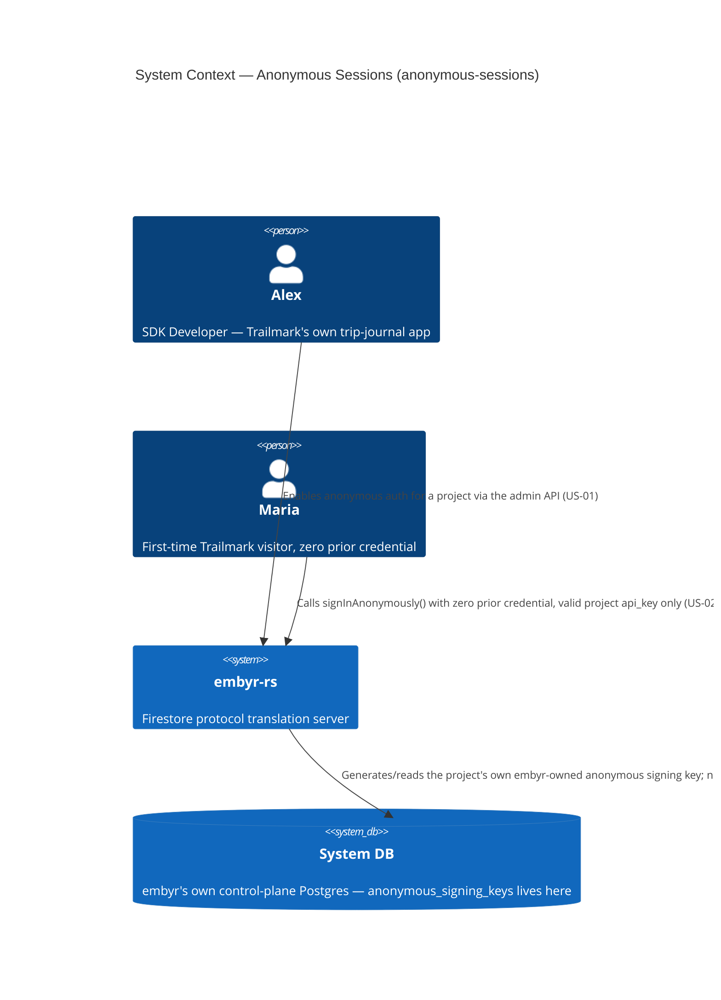
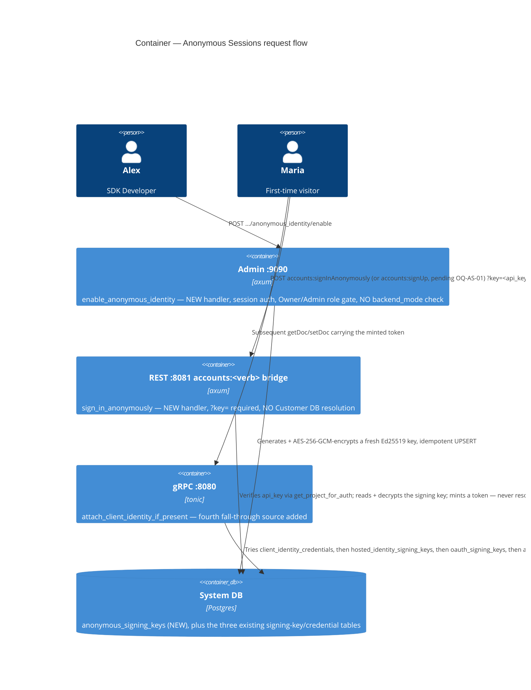

# anonymous-sessions — Feature Delta

**Wave**: DISCUSS | **Agent**: Luna (nw-product-owner) | **Date**: 2026-08-30
**Status**: Ready for DESIGN handoff — two escalated open questions (see § Handoff Package).
**Upstream**: No DISCOVER/DIVERGE wave ran for this feature specifically — commissioned directly by the orchestrator's own comparison of embyr-rs's identity surface against real Firebase's own Anonymous Authentication (`signInAnonymously()`), identifying it as a fourth, materially distinct end-user-identity-establishment mechanism this codebase does not yet support.

**Framing**: this is a **new, sibling identity-establishment job** for the same persona (P1 Alex) already served by JOB-16 (`client-auth`, custom-token bridge), JOB-18 (`client-auth-hosted-identity`, hosted email/password), and JOB-19 (`oauth-providers`, Google OAuth) — not an extension of any of the three. It is explicitly NOT the same concept as this codebase's own existing "anonymous" vocabulary in `access_control`/`security-rules` (a session presenting **no** client-identity token at all, evaluated as `request.auth == null`). This feature adds a real, server-issued, stable `end_user_id` obtainable with **zero prior credential** — the opposite of "no identity"; it is "an identity for free."

---

## Wave: DISCUSS / [REF] Prior Wave Consultation — Reading Confirmation

✓ `crates/embyr-core/src/client_identity/mod.rs` (full, 665 lines) — confirms `VerifiedEndUserIdentity{ end_user_id, project_id, expires_at_unix, claims }`, `verify_client_identity_token()` (unchanged since `client-auth`), and `mint_client_identity_token()` (added by `client-auth-hosted-identity`, ADR-036 Decision 3 — the exact mirror-mint operation this feature needs, already generalized as a shared primitive, not something to duplicate a fourth time).
✓ `crates/embyr-core/src/hosted_identity.rs` (full) — confirms `validate_password_strength()` is the ONLY pure logic this module owns; nothing here is reusable for anonymous sign-in (there is no password to validate) — confirms directly, not assumed, that anonymous sign-in needs no analogous new pure-domain module of its own.
✓ `crates/embyr-server/src/rest/sign_up.rs` (full, `accounts:signUp`) and `crates/embyr-server/src/rest/sign_in.rs` (full, `accounts:signInWithCustomToken`) — confirms the two structurally different existing REST driving-port shapes: `sign_up` requires `?key=<api_key>` (Customer DB resolution + ECIES pubkey derivation, ADR-036 Decision 6/5); `sign_in` (custom-token bridge) requires no auth header of its own (the token in the body IS the credential, ADR-026). Neither shape is a direct match for anonymous sign-in — see § Job Discovery Framing Resolution, Resolution 3.
✓ `crates/embyr-server/src/grpc/handler.rs::attach_client_identity_if_present` (lines 340-440+, full composition read) — confirms the credential-source fallback chain has ALREADY been widened twice beyond its original single source: `client_identity_credentials` (ADR-024/026) → `hosted_identity_signing_keys` (ADR-036 Decision 4) → `oauth_signing_keys` (ADR-037 Decision 8, "a THIRD widening"). Each attempt calls the identical, unchanged `verify_client_identity_token()`; a project with none of the sources populated never queries any of them (the `?`-short-circuit on an absent header holds a third time). This chain is proven, evidenced, cheap to widen a fourth time — directly informs Resolution 2 below.
✓ `docs/product/architecture/adr-036-hosted-identity-bounded-context-and-storage.md` (full) — confirms BC-5 Hosted Identity, its Customer-DB/System-DB storage split, its ECIES/`api_key`-derived encryption for `hosted_identity_signing_keys.private_key_enc`, and its `backend_mode` enablement gate (Decision 5) — the direct precedent for evaluating (and, per Resolution 2/4 below, NOT simply copying) for this feature's own signing-key and gating decisions.
✓ `docs/product/architecture/adr-037-oauth-providers-signing-key-and-verification-composition.md` (full) — **the single most load-bearing prior-wave finding for this feature.** Decision 2 explicitly REJECTED reusing `hosted_identity_signing_keys` for oauth-providers' own embyr-minted token, choosing instead a NEW, disjoint `oauth_signing_keys` table encrypted with **AES-256-GCM under `EMBYR_ENCRYPTION_KEY`** (not ECIES/`api_key`-derived) — specifically because oauth verification has no natural Customer-DB-adapter-resolution call site to piggyback an `api_key` requirement on, unlike hosted-identity's signup. The ADR's own § Consequences names this pattern as the reference class for **the next** "embyr mints its own token" flow, verbatim: *"A future feature needing a THIRD [i.e., next] 'embyr mints its own token' flow should evaluate reusing `oauth_signing_keys`'s AES-256-GCM/`EMBYR_ENCRYPTION_KEY` shape... rather than defaulting to a fourth table."* Anonymous sign-in is exactly that next feature — see Resolution 2.
✓ `docs/feature/client-auth-hosted-identity/feature-delta.md` (full, 1112 lines, all DISCUSS + DESIGN sections) — read in full for its own Resolution 2 (Customer-DB storage vs. System-DB-only, `backend_mode=agent` gating rationale) and Resolution 3 (structural disjointness of signing material) — both directly informative, neither directly transferable without re-derivation (see § Job Discovery Framing Resolution).
✓ `docs/product/jobs.yaml` (JOB-16, JOB-17, JOB-18, JOB-19 read in full; all 19 jobs' structure surveyed) — confirms the established "same persona, different goal ⇒ new job" precedent (JOB-11/JOB-06, JOB-14/JOB-10, JOB-17/JOB-16, JOB-18/JOB-16, JOB-19/JOB-16/JOB-18) directly applies here a fourth time; confirms JOB-19's own still-open escalation ("does this job's identity-verification mechanism need the same `backend_mode=agent` gating JOB-18 required, given it structurally touches no Customer DB") is the SAME unresolved question this feature independently re-raises (Resolution 4) — not coincidence, a structural pattern across every "embyr mints its own token, no Customer DB touch" mechanism.
✓ `crates/embyr-core/src/access_control/mod.rs` (targeted: `anonymous`/`request.auth != null` matches, lines 795, 1248, 1330+) and `tests/security_rules/acceptance/sr03_anonymous_session_evaluated_as_null_auth.rs` (full) — **critical disambiguation, confirmed directly, not assumed.** This codebase's EXISTING "anonymous" vocabulary means a session presenting **no** client-identity token at all (`request.auth == null` — AC-17-11/12/13). This is the OPPOSITE of what real Firebase's `signInAnonymously()` and this feature produce: a session with a real, verified `request.auth != null`, just one that was obtained with zero prior credential. Confirmed there is no naming collision risk in code (the existing tests/comments consistently say "a session with no verified identity," never "anonymous auth" as a product capability) — but flagged here explicitly so DESIGN does not conflate the two, and so this feature's own vocabulary (§ System Constraints) is chosen to avoid the collision.
✓ `docs/product/architecture/adr-002-bounded-contexts.md` (full, including all three `Changed Assumptions` amendments: BC-4 Access Control, BC-5 Hosted Identity, BC-1 extension for oauth-providers) — confirms Option D's three-part test and its three most recent applications; directly informs § System Constraints' bounded-context flag below.
✓ `docs/product/journeys/sdk-developer.yaml` — confirms P1 Alex's job list and the established single-narrative-file convention for Lightweight-depth features (per Orchestrator Decision 3).

No contradictions found between this feature's scope and prior evidence. This DISCUSS surfaces **two** genuinely unresolved, security/architecture-consequential judgment calls — more than `batch-get-documents`' zero, fewer than `client-auth-hosted-identity`'s two — both escalated explicitly, not silently decided; every other judgment call is resolved directly from this codebase's own already-shipped, still-being-actively-widened precedent (the credential-source fallback chain, the `oauth_signing_keys` reference shape).

---

## Wave: DISCUSS / [REF] Orchestrator Decisions (not re-litigated)

| # | Decision | Value |
|---|---|---|
| 1 | Feature Type | Backend — a fourth end-user-identity-establishment mechanism, extends BC-5-adjacent identity infrastructure |
| 2 | Walking Skeleton | **No** — this extends existing auth infra (the credential-source fallback chain, `mint_client_identity_token()`, `VerifiedEndUserIdentity`), it does not introduce a mechanism class this codebase has never built before, unlike `client-auth-hosted-identity`'s own password-authentication mechanism |
| 3 | UX Research Depth | **Lightweight** — backend/SDK-facing, not end-user UI; no separate `journey-*.yaml`, journey detail lives inline below |
| 4 | JTBD Analysis | Yes (default) — new job, `job_id: JOB-20` (see Resolution 1) |

---

## Wave: DISCUSS / [REF] Job Discovery — Framing Resolution

### Resolution 1 — job_id: extend an existing identity job, or a new one?

JOB-16's, JOB-18's, and JOB-19's own functional dimensions each assume a **specific, materially different authentication mechanic**: JOB-16 assumes Trailmark's own backend mints a token; JOB-18 assumes Maria types a password directly into embyr; JOB-19 assumes a third-party OAuth consent screen performs authentication. Anonymous sign-in's mental model is a fourth, distinct case: **no credential of any kind is presented — not a password, not a token, not a third-party consent flow.** This mirrors exactly this project's own established "same persona, different goal ⇒ new job" precedent, now applied a fourth time to the same identity-establishment goal-family (JOB-11/JOB-06, JOB-14/JOB-10, JOB-17/JOB-16, JOB-18/JOB-16, JOB-19/JOB-16/JOB-18).

**Resolution**: **new job, `JOB-20` (`anonymous-identity`)**. JOB-16, JOB-18, and JOB-19 each receive a cross-reference NOTE (not a rewrite), mirroring the established pattern (see § SSOT Updates).

### Resolution 2 — Signing-key custody and encryption: reuse `hosted_identity_signing_keys`, or follow `oauth_signing_keys`'s own precedent?

| Option | Description | Fit against evidence |
|---|---|---|
| **(A) Reuse `hosted_identity_signing_keys` (ECIES, `api_key`-derived)** | Same table/row a project already has if hosted identity is enabled | **Rejected — evidenced, not guessed.** `oauth-providers`' own ADR-037 Decision 2 already considered and rejected this exact move for its own signing key, on grounds that apply identically here: reuse would couple two independently-toggleable providers' custody boundaries, and ECIES's `api_key`-derivation requires a natural `api_key`-bearing call site anonymous sign-in does not obviously have (see Resolution 3) |
| **(B) A NEW, disjoint table, AES-256-GCM under `EMBYR_ENCRYPTION_KEY`, mirroring `oauth_signing_keys`'s own shape** | Structurally disjoint from `client_identity_credentials`, `hosted_identity_signing_keys`, AND `oauth_signing_keys` alike | **Recommended, high confidence.** This is not a fresh judgment call — ADR-037's own § Consequences names this pattern, verbatim, as the reference class for exactly this situation ("a future feature needing a THIRD ['embyr mints its own token'] flow should evaluate reusing `oauth_signing_keys`'s AES-256-GCM/`EMBYR_ENCRYPTION_KEY` shape... rather than defaulting to a fourth table"). Anonymous sign-in structurally matches oauth's own profile even more closely than oauth matched hosted-identity's: no Customer DB touch at all if Resolution 3 (stateless minting) is adopted, so there is no natural `api_key`-bearing call site to piggyback ECIES on, exactly the condition that drove oauth away from ECIES in the first place |

**Resolution**: **(B), recommended, not locked** — exact table name/schema is DESIGN's call, but the encryption *mechanism* choice (AES-256-GCM/`EMBYR_ENCRYPTION_KEY`, not ECIES) is a high-confidence recommendation grounded directly in the immediately-prior feature's own explicit forward-looking guidance, not an independent guess.

### Resolution 3 — Does an anonymous end-user identity need a persisted Customer DB row, or is it purely stateless/cryptographic?

| Option | Description | Evidence |
|---|---|---|
| **(A) Persist an Account row** (mirrors `hosted_identity_accounts`) | A row per anonymous `end_user_id`, created at sign-in time | Matches real Firebase's own actual behavior (an anonymous user IS a real, listable Firebase Auth user record) — but real Firebase's reason to persist it is almost entirely to support later account **linking/upgrade** (`linkWithCredential()`), which the raw ask explicitly places **out of scope** for this slice. With linking deferred, a persisted row buys this feature nothing: embyr has no admin-console listing of end-user accounts today (unlike Firebase's own console), no lifecycle action references it, and it introduces exactly the storage-growth/cleanup concern the raw ask itself named as a real cost to weigh |
| **(B) Stateless — mint-only, no persisted row** | `end_user_id` is a freshly-generated UUID at mint time (mirrors `hosted_identity_accounts.end_user_id`'s own UUID shape, but never written anywhere); the JWT itself (signature + `sub` + `exp`) is the entire identity — verified exactly like every other `VerifiedEndUserIdentity` source, no DB lookup for the specific end user, only a project-level signing-key lookup | Every existing identity-verification call site in this codebase ALREADY verifies without a per-end-user DB lookup (Ed25519 signature + `exp`, project-scoped key lookup only) — a stateless anonymous identity is not a weaker guarantee than any sibling mechanism provides today, it is the SAME guarantee. Directly resolves the raw ask's own named storage-cost/cleanup concern: zero storage, zero cleanup, by construction |

**Resolution**: **(B), recommended, moderate-high confidence** — tied directly to linking/upgrade being out of scope for this slice (per the raw ask). **Flagged explicitly**: if a future feature reverses that exclusion and builds account linking, it will need to reconsider this stateless choice (there is no row to link a hosted/custom-token/oauth identity to) — named here as a forward-looking consequence, not a blocker to this feature.

### Resolution 4 — Driving port: extend `accounts:signUp`, or a new endpoint?

Real Firebase's own Identity Toolkit REST surface is, to this architect's recollection, structurally interesting here: `signInAnonymously()` on the client SDK calls the **same** `accounts:signUp` endpoint hosted-identity's own signup already uses — simply with `email`/`password` both omitted from the body. This is the same class of empirical, external-wire-format recollection this codebase already tags and defers to a required pre-DELIVER spike (`OQ-CA-01`, `OQ-CHI-01`, `OQ-OAUTH`-style precedent) — **moderate confidence, not certainty**, flagged as `OQ-AS-01` (see § Handoff Package).

Two structurally different options follow from this:
- **(A) Extend the existing `sign_up.rs::sign_up` handler** to treat an absent `email`/`password` pair as the anonymous branch. **Rejected as a literal reuse** — that handler's existing gate (`hosted_identity_signing_keys` row / "hosted identity enabled") would incorrectly couple two independently-toggleable real-Firebase providers (a project could reasonably want ONLY anonymous, or ONLY hosted email/password, never forced to enable both together).
- **(B) Same URL shape (`accounts:signUp`), a structurally separate handler/branch with its own enablement gate and its own signing-key source (Resolution 2)**, sharing only what is genuinely shared (the `mint_client_identity_token()` call, the response shape). **Recommended.** Preserves real-SDK wire compatibility (the URL Alex's unmodified `signInAnonymously()` call actually hits, per `OQ-AS-01`) while keeping the two providers' enablement, storage, and custody boundaries fully independent, mirroring the disjointness discipline Resolutions 2/3 and every prior identity feature already established as non-negotiable.

**Resolution**: **(B), recommended**. Exact internal code composition (shared handler with a branch vs. two handlers behind one route) is DESIGN's call, not locked here — this DISCUSS locks only that the URL/wire shape should aim for `accounts:signUp`-compatibility (pending `OQ-AS-01`) and that the enablement/custody boundary must stay independent of hosted identity's own.

---

## Wave: DISCUSS / [REF] Persona & Job

**Persona**: **P1 — Alex, SDK Developer** (existing persona). Unchanged framing from every prior identity feature: Alex "hires" this capability; Maria's own device calls embyr directly.

**Domain-example company**: **Trailmark** (continuity). For this feature, Trailmark is reframed as offering a **try-before-signup** flow — Maria can draft a trip itinerary before deciding whether to create a real account, the concrete instantiation of the guest-checkout/try-it-now pattern the raw ask names.

**job_id decision (Resolution 1)**: `JOB-20` (`anonymous-identity`), new job, same persona P1 Alex, distinct goal from JOB-16/JOB-18/JOB-19.

```yaml
# Added to docs/product/jobs.yaml — see § SSOT Updates
- id: JOB-20
  name: anonymous-identity
  persona: P1
  feature: anonymous-sessions
  job_story: >
    When my app's end users want to try key features before committing to an
    account — or complete a guest action without ever creating one — I want
    each such visitor to get a real, stable, server-issued identity with zero
    prior credential and zero backend involvement, so I can let people use my
    app immediately while still building real per-visitor data (their own
    draft, their own cart) the same way I would for a signed-up user.
  dimensions:
    functional: >
      Maria's app calls the SDK's existing signInAnonymously() with zero
      arguments; her session resolves to the identical VerifiedEndUserIdentity
      type every other identity mechanism already produces, usable in the
      same security-rule-gated reads/writes immediately
    emotional: >
      Alex feels he can remove the signup wall entirely for a first-touch
      experience without losing per-visitor data isolation; Maria feels she
      can just start using the app, no typing, no commitment
    social: >
      Alex can tell his team "embyr let us keep the exact same
      try-before-you-buy flow Firebase gave us" instead of forcing every
      visitor through a signup screen just to see a single draft
  four_forces:
    push: >
      Every existing identity path (JOB-16 custom-token, JOB-18 hosted
      password, JOB-19 Google OAuth) requires the end user to commit to SOME
      credential before Alex's app can attach any per-user data at all — a
      hard signup wall Firebase never imposed, a real conversion cost for
      users who just want to try the app first
    pull: >
      signInAnonymously() gives Maria a real, usable uid in one call with zero
      typing, so Alex can let her build a draft immediately and only ask her
      to commit to a real account once she is already invested
    anxiety: >
      "If every anonymous visitor gets a real database identity, does my
      Customer DB fill up with millions of one-time throwaway rows I now have
      to clean up forever?" — addressed by Resolution 3's stateless
      recommendation (zero persisted rows, zero cleanup, by construction)
    habit: >
      Alex already calls signInAnonymously() with zero arguments in real
      Firebase apps for exactly this guest/try-before-signup pattern — one of
      the more common Firebase Auth methods in production consumer apps
  opportunity_score: 11
  priority: high
```

**Opportunity scoring**: Importance = 6 (a common, evidenced consumer-app pattern, narrower than JOB-16's "every multi-user app"). Satisfaction = 1 (zero support today). Opportunity = 6 + (6−1) = **11**. Priority: **high** (mirrors JOB-19's own scoring tier — a real but narrower segment than JOB-16/JOB-18).

---

## Wave: DISCUSS / [REF] Scope Assessment (Elephant Carpaccio Gate)

| Signal | Threshold | This feature | Fired? |
|---|---|---|---|
| User stories | >10 | 2 (US-01, US-02) | **NO** |
| Bounded contexts / modules | >3 | ~1-2 — extends BC-5-adjacent identity infrastructure (or a flagged, not-locked BC-5 sub-extension — see § System Constraints); zero changes to BC-1/BC-2/BC-3/BC-4 | **NO** |
| Walking Skeleton integration points | >5 | 2 — enable (US-01) + anonymous sign-in (US-02) | **NO** |
| Estimated effort | >2 weeks | 2 slices, ~3 days total (see § Elephant Carpaccio Slices) | **NO** |
| Independent shippable outcomes | multiple | **NO** — enablement without sign-in is inert; sign-in without enablement is unreachable; these are two halves of one outcome, mirroring `client-auth-hosted-identity`'s own US-01/US-02 pairing | **NO** |

**0 of 5 signals fired. Verdict: PASS — right-sized, single slice pair, single release.** Materially smaller than `client-auth-hosted-identity` (no password validation, no reset flow, no email-sending dependency, no Customer DB touch under Resolution 3) — this DISCUSS does not manufacture additional stories or slices to match that feature's own larger size.

---

## Wave: DISCUSS / [REF] Journey (Lightweight, per Decision 3 — inline per this codebase's convention)

**Alex's mental model**: Alex already understands the pattern from JOB-18/JOB-19 — "call an SDK Auth method, get back a session that carries a verified identity onto every subsequent Firestore call." Anonymous sign-in is the simplest possible instance of that pattern: no fields to fill in at all.

**Emotional arc**: **Start** — Maria opens Trailmark for the very first time with zero intent to commit to an account yet; today she would hit a hard signup wall before she can save anything. **Middle** — Trailmark's app calls `signInAnonymously()` with no user-visible friction at all (no form, no redirect, no consent screen). **End** — relief/frictionlessness: Maria is already drafting her trip before she has typed a single character into any form; Alex trusts her draft is correctly scoped to her, and only her, from the very first write, the same guarantee any other identity mechanism already provides.

**Shared artifact**: `VerifiedEndUserIdentity` (unchanged type, ADR-024) and the `mint_client_identity_token()`/`verify_client_identity_token()` pair (unchanged functions, ADR-036 Decision 3) — single source of truth, reused a fourth time, not reinvented.

**Failure modes** (feeds DISTILL scenario generation): anonymous auth not enabled for the project (rejected, distinguishable reason) | missing/invalid project `api_key` on the sign-in call (rejected) | two separate visitors must never collide on the same `end_user_id` | a session whose token has expired cannot silently resume as the SAME identity without re-calling sign-in, which mints a NEW identity — a named, honest v1 limitation (see § System Constraints, Escalation 1) | an anonymous identity must be denied by an ownership rule exactly as any other non-owning identity would be, never granted implicit trust.

---

## Wave: DISCUSS / [REF] Story Map & Walking Skeleton

**Persona**: P1 Alex | **Goal**: Let a first-time Trailmark visitor get a real, usable identity with zero prior credential, resolving to the identical `VerifiedEndUserIdentity` type every other identity mechanism already produces.

### Backbone

| A. Alex Enables Anonymous Authentication | B. Maria Gets an Identity With Zero Credential |
|---|---|
| Alex enables anonymous auth for `trailmark-prod` **[WS]** | Maria's app calls `signInAnonymously()`; her session is immediately usable **[WS]** |

### Walking Skeleton

Both tasks above, together — enablement without sign-in is inert, sign-in without enablement is unreachable. Alex enables anonymous auth (Activity A); Maria's app calls `signInAnonymously()` with zero prior credential and her subsequent `getDoc`/`setDoc` succeeds carrying her verified identity, correctly denied by an ownership rule for any document that is not hers (Activity B). This IS the whole feature — no second dimension, no per-backend-mode split evaluated as necessary (pending Resolution 5/Escalation 2's `backend_mode` question, flagged not locked).

### Release 1 — Anonymous Sign-In Works End-to-End (Slices 01-02, US-01, US-02)

Outcome: any Trailmark visitor with zero prior credential can obtain a real, usable identity in one call, subject to the exact same access-control guarantees any other identity mechanism already provides.

---

## Wave: DISCUSS / [REF] Elephant Carpaccio Slices

| Slice | Story | Release | Estimate | Learning Hypothesis (disproves) | Production-data taste test |
|---|---|---|---|---|---|
| 01 (WS) | US-01 | 1 | 1 day | An "enable anonymous auth" admin action cannot generate and safely custody its own project-scoped, `oauth_signing_keys`-shaped signing key using the existing admin-API conventions without inventing a new pattern | Real admin credential, real project row, real generated keypair — no synthetic exception |
| 02 (WS) | US-02 | 1 | 2 days (includes the SDK-wire-format spike, `OQ-AS-01`) | Anonymous sign-in cannot mint a token verified through the EXISTING, unchanged `verify_client_identity_token()`/`attach_client_identity_if_present` fallback chain without either colliding with an existing signing-key source (a security/coupling violation, Resolution 2) or requiring changes to the pure verification function itself; separately, `signInAnonymously()` may not be pointable at a non-Google backend the same way `signInWithCustomToken()`/`createUserWithEmailAndPassword()` already were (mirrors `OQ-CA-01`/`OQ-CHI-01`) | Two real, distinct minted identities in one test run (never a single fixture reused), a real ownership-rule denial between them, no synthetic mock |

**Total estimate: ~3 days.**

**Taste tests applied**:
- "4+ new components per slice" — Slice 01: admin handler + new signing-key table/generation (2). Slice 02: sign-in handler + fallback-chain widening (2, builds on Slice 01). PASS.
- "Every slice depends on a new abstraction" — Slice 01 is the one new abstraction (the anonymous signing key); Slice 02 builds on it, introduces no second one. PASS — mirrors `client-auth-hosted-identity`'s and `oauth-providers`' own precedent.
- "No slice disproves a pre-commitment" — each has a distinct, falsifiable hypothesis (see table). PASS.
- "Synthetic-data-only slices prove plumbing, not value" — both slices require real generated keys, real minted/verified tokens, real distinct identities. PASS.
- "2+ slices identical except for scale" — none; distinct mechanisms (enable vs. sign-in). PASS.

---

## Wave: DISCUSS / [REF] Prioritization

| Priority | Slice | Target Outcome | Rationale |
|---|---|---|---|
| 1 | Slice 01 (WS) | A project can opt into anonymous authentication | Walking Skeleton first — without enablement, nothing downstream has a signing key to mint against |
| 2 | Slice 02 (WS) | A first-time visitor gets a real, usable identity with zero credential | Closes the Walking Skeleton loop; bundles the highest-uncertainty item (the SDK wire-format spike, `OQ-AS-01`), burning down the riskiest new assumption first |

---

## Wave: DISCUSS / [REF] System Constraints

- **Vocabulary disambiguation (non-negotiable, see § Prior Wave Consultation)**: this feature's own "anonymous" identity (a real, verified `VerifiedEndUserIdentity` obtained with zero prior credential) is NOT the same concept as this codebase's EXISTING "anonymous session" vocabulary in `access_control`/`security-rules` (a request presenting no client-identity token at all, `request.auth == null`, AC-17-11/12/13). DESIGN and DELIVER must not reuse the term ambiguously in code comments, error reasons, or test names — recommend `anonymous_signing_keys`/`AnonymousIdentity`-style naming that reads unambiguously as "an established identity, obtained anonymously," never "no identity."
- **Reuses `VerifiedEndUserIdentity`, `mint_client_identity_token()`, `verify_client_identity_token()` unchanged** (Decision 3 of ADR-036, already generalized as a shared primitive across three prior identity mechanisms). Zero changes to the pure verification function required for a fourth source.
- **`attach_client_identity_if_present`'s credential-source fallback chain gains a fourth source**, mirroring the identical, proven "try source A, then B, then C" widening pattern already applied twice (ADR-036 Decision 4, ADR-037 Decision 8). A project with none of the four sources populated is structurally unaffected — the guardrail holds a fourth time by the same argument, not a new one.
- **Recommended (Resolution 2, high confidence, not locked)**: a NEW, disjoint signing-key table encrypted with AES-256-GCM under `EMBYR_ENCRYPTION_KEY`, mirroring `oauth_signing_keys`'s own shape — directly per ADR-037's own forward-looking guidance for exactly this situation, not an independent guess. Reusing `hosted_identity_signing_keys` (ECIES/`api_key`-derived) is explicitly named and should be avoided, for the same reasons `oauth-providers` already rejected it.
- **Recommended (Resolution 3, moderate-high confidence, not locked)**: stateless minting — no persisted Customer DB Account row, no BC-5-style storage write on the sign-in hot path. Tied directly to linking/upgrade being out of scope for this slice (see § Out of Scope); if a future feature reverses that exclusion, this choice must be revisited.
- **Recommended (Resolution 4, moderate confidence, not locked)**: driving port aims for `accounts:signUp`-compatible wire shape (matching real Firebase's own overload of that endpoint for anonymous sign-in), implemented as a structurally separate handler/enablement boundary from hosted-identity's own signup — never literally reusing `sign_up.rs`'s existing handler or its enablement gate, since anonymous and hosted-email/password are independently-toggleable real-Firebase providers.
- **`?key=<api_key>` requirement**: recommended as a minimal, uniform abuse-mitigation and consistency bar (every other REST identity endpoint in this codebase already requires it), Argon2id-verified via the existing `verify_api_key` primitive — even though, under Resolution 2/3, it is not cryptographically load-bearing (no ECIES decrypt, no Customer DB resolution) the way it is for hosted-identity's own signup. DESIGN's call whether to require it structurally or treat it as optional-but-conventional.
- **Rate-limiting anonymous session creation abuse is explicitly named by the raw ask as a real, unresolved concern, NOT designed here.** Anonymous sign-in is uniquely exposed among all four identity mechanisms: it is the only one requiring no credential verification step of any kind (a custom token needs a valid signature; hosted-identity needs a correct password; OAuth needs a real Google consent flow) — an attacker who can reach the endpoint can mint identities as fast as the transport allows, bounded today only by this codebase's existing generic per-project request-rate limiting (JOB-11, distributed token bucket). Whether that generic limit is a SUFFICIENT mitigation for this specific abuse vector, or whether a dedicated, tighter limit is warranted, is explicitly DESIGN's call.
- **Candidate bounded-context flag, not locked.** Under Resolution 3 (stateless), the new signing key is the ONLY new persisted entity this feature introduces — it has an identity (`project_id`), effectively no lifecycle beyond create (no reset, no rotation story in this feature's locked scope), and one invariant (uniqueness per project). This is thinner than BC-5's own Account entity was and may not independently warrant a new bounded context at all — DESIGN should apply ADR-002's Option-D three-part test fresh (per this codebase's own established discipline) rather than defaulting to either "fold into BC-5" or "new BC-6" by inertia.
- Ubiquitous language introduced: **anonymous sign-in** (the capability), **anonymous identity** (the resulting `VerifiedEndUserIdentity`, deliberately never called an "anonymous session" to avoid the § vocabulary-disambiguation collision named above).

---

## Wave: DISCUSS / [REF] User Stories

<!-- markdownlint-disable MD024 -->

### US-01: Alex Enables Anonymous Authentication For Trailmark

**job_id**: JOB-20
**Slice**: 01 (Walking Skeleton) | **Release**: 1

#### Elevator Pitch
Before: Trailmark's app cannot let a first-time visitor use any Firestore-backed feature until they commit to a full account (custom token, hosted password, or Google) — Alex has no way to offer a try-before-signup flow at all.
After: call the admin API's anonymous-auth-enable action (exact endpoint shape DESIGN's call) → sees a 201 confirming anonymous sign-in is now active for the project, with no signing material of any kind in the response.
Decision enabled: Alex knows his app's guest/try-it-now flows can now call embyr directly, with zero prior credential required from the visitor.

#### Domain Examples
1. **Happy Path**: Alex enables anonymous authentication for `trailmark-prod` via the admin API, using Trailmark's admin credential. Sees 201; embyr has generated and stored its own project-scoped anonymous signing key server-side; nothing is echoed back.
2. **Edge Case**: Alex, unsure whether his earlier request succeeded, submits the enable request a second time for `trailmark-prod`. Sees 200, idempotent no-op — no second signing key is generated, no error.
3. **Error/Boundary**: Alex submits the enable request for `trailmark-staging-old`, a project that has since been deleted. Sees 404.

#### UAT Scenarios (BDD)

##### Scenario: First-time enablement succeeds and generates embyr's own anonymous signing key without echoing it back
Given project `trailmark-prod` exists and does not yet have anonymous authentication enabled
When Alex enables anonymous authentication using a valid admin credential
Then anonymous authentication becomes active for the project, and the response confirms success without including any signing material

##### Scenario: Enabling an already-enabled project is idempotent, not an error
Given project `trailmark-prod` already has anonymous authentication enabled
When Alex submits another enable request for the same project
Then the request succeeds with no error, and no new signing key is generated

##### Scenario: Enablement without valid admin credentials is rejected
Given project `trailmark-prod` exists
When Alex submits an enable request with a missing or invalid admin credential
Then the request is rejected the same way any other admin endpoint rejects missing/invalid credentials

##### Scenario: Enablement against a non-existent or deleted project is rejected
Given project `trailmark-staging-old` does not exist or has been deleted
When Alex submits an enable request for it
Then the request is rejected as not found

#### Acceptance Criteria
- [ ] AC-20-01: Valid enablement returns 201; anonymous authentication becomes active for the project; no signing material appears in the response.
- [ ] AC-20-02: A second enablement request for an already-enabled project succeeds idempotently — no error, no duplicate signing key.
- [ ] AC-20-03: Missing or invalid admin credential returns 401.
- [ ] AC-20-04: Enablement for a non-existent or deleted project returns 404.

#### Outcome KPIs
See § Outcome KPIs below (feeds KPI #1, North Star).

#### Technical Notes (Optional)
Signing-key encryption mechanism recommended (Resolution 2, high confidence): AES-256-GCM under `EMBYR_ENCRYPTION_KEY`, mirroring `oauth_signing_keys` — NOT ECIES/`api_key`-derived like `hosted_identity_signing_keys`. Exact endpoint path and table schema are DESIGN's call. Hard constraint carried forward from ADR-036 Resolution 3's own precedent: structurally disjoint entity from every other signing-key table — never colocated, never sharing a row.

---

### US-02: Maria Gets a Real Identity Instantly With No Prior Credential

**job_id**: JOB-20
**Slice**: 02 (Walking Skeleton) | **Release**: 1

#### Elevator Pitch
Before: Maria opens Trailmark for the first time and wants to draft a trip itinerary before deciding whether to create an account — every existing path requires her to type a password, connect Google, or requires Alex to operate a backend that mints her a token first.
After: Trailmark's app calls the SDK's existing `signInAnonymously()` with zero arguments → sees an immediate, real `uid`, and her subsequent `getDoc`/`setDoc` calls succeed carrying that verified identity, exactly as they would for any signed-up user.
Decision enabled: Alex can let Maria start using his app in one call, with zero typing, and correctly scope her draft data to her own uid from the very first write.

#### Domain Examples
1. **Happy Path**: Maria Santos, a first-time Trailmark visitor, calls `signInAnonymously()` on `trailmark-prod` (anonymous auth already enabled). Sign-in succeeds immediately; her subsequent `setDoc` on a new draft trip document, then `getDoc` on that same document, both succeed carrying her verified identity.
2. **Edge Case**: A second, unrelated first-time visitor also calls `signInAnonymously()` on `trailmark-prod` around the same time as Maria. Sees a distinct `uid` from Maria's — no collision, no shared "the anonymous user."
3. **Error/Boundary**: A `signInAnonymously()` attempt is submitted for `trailmark-staging`, a project where Alex has not yet enabled anonymous authentication. Sees a rejection distinguishable from an invalid-`api_key` failure, naming that anonymous authentication is not enabled for this project.

#### UAT Scenarios (BDD)

##### Scenario: A first-time visitor with zero prior credential gets an immediate, real identity
Given `trailmark-prod` has anonymous authentication enabled
When Maria's app calls `signInAnonymously()` with a valid project `api_key` and no other credential
Then she receives a real end-user identity immediately, and her subsequent Firestore call succeeds carrying that verified identity

##### Scenario: Anonymous sign-in is rejected when not enabled for the project, distinguishably
Given `trailmark-staging` does not have anonymous authentication enabled
When an anonymous sign-in attempt is submitted for `trailmark-staging`
Then the request is rejected with a reason identifying that anonymous authentication is not enabled, distinguishable from an invalid-`api_key` failure

##### Scenario: Anonymous sign-in without a valid project api_key is rejected
Given `trailmark-prod` has anonymous authentication enabled
When an anonymous sign-in attempt is submitted with a missing or invalid `api_key`
Then the request is rejected as an invalid-credential failure, before any identity is minted

##### Scenario: Two separate anonymous sign-ins never collide on the same identity
Given `trailmark-prod` has anonymous authentication enabled
When two separate, unrelated visitors each call `signInAnonymously()` around the same time
Then each receives a distinct end-user identity — never the same `uid`, never a shared session

##### Scenario: An anonymous identity is subject to the exact same access-control evaluation as any other identity
Given `trip_entries` has an ownership access rule requiring `request.auth.uid == resource.data.owner_id`
And Maria's anonymous session has created her own `trip_entries` document
When a DIFFERENT anonymous session attempts to read Maria's document
Then the read is denied, identically to how the rule would deny any other non-owning verified identity

##### Scenario: A new sign-in after the prior session's token has expired produces a new identity, not the original one
Given Maria previously signed in anonymously and her session's token has since expired
When Maria's app calls `signInAnonymously()` again with no other credential available
Then she receives a NEW end-user identity, distinct from her original one — a named v1 limitation, not a silent data-loss bug

#### Acceptance Criteria
- [ ] AC-20-05: Valid anonymous sign-in (project has anonymous auth enabled, valid `api_key`) returns an immediate, real end-user identity; a subsequent Firestore call from that session succeeds carrying it.
- [ ] AC-20-06: Anonymous sign-in on a project without anonymous auth enabled is rejected, with a reason distinguishable from an invalid-`api_key` failure.
- [ ] AC-20-07: Anonymous sign-in without a valid project `api_key` is rejected, before any identity is minted.
- [ ] AC-20-08: Two separate anonymous sign-in calls on the same project always mint two distinct end-user identities — never a collision, never a shared identity.
- [ ] AC-20-09: An anonymous identity is subject to the exact same per-document access-control evaluation as any other verified identity — an ownership rule that denies a different uid denies an anonymous uid identically.
- [ ] AC-20-10: A new `signInAnonymously()` call made after a prior anonymous session's token has expired produces a new, different end-user identity — this is a named v1 limitation (see § System Constraints; Escalation 1 in § Handoff Package), not silently glossed over.

#### Outcome KPIs
See § Outcome KPIs below (KPI #1 North Star).

#### Technical Notes (Optional)
Token minting reuses Resolution 2's recommended disjoint signing key (US-01) via the unchanged `mint_client_identity_token()`. Fallback-chain widening is additive to `attach_client_identity_if_present` (§ System Constraints). Exact endpoint shape, whether `signInAnonymously()` can be pointed at a non-Google backend the way `signInWithCustomToken()`/`createUserWithEmailAndPassword()` already were (mirrors `OQ-CA-01`/`OQ-CHI-01`), and the exact token-TTL/refresh trade-off (Escalation 1) are DESIGN's call and, for the wire-format question, a required pre-DELIVER empirical spike (`OQ-AS-01`) — see § System Constraints and § Handoff Package.

---

## Wave: DISCUSS / [REF] Outcome KPIs

### Feature: anonymous-sessions

### Objective
Give every Trailmark-class embyr customer a working `signInAnonymously()`-equivalent capability — matching real Firebase's own SDK contract in spirit — so a first-time visitor can obtain a real, usable identity with zero prior credential, instead of hitting a hard signup wall before any per-visitor data can be attached.

### Outcome KPIs

| # | Who | Does What | By How Much | Baseline | Measured By | Type |
|---|---|---|---|---|---|---|
| 1 | SDK developers whose apps need a try-before-signup or guest flow (Alex/Trailmark) | Complete an anonymous sign-in and receive an identity usable in the exact same security-rule-gated reads/writes any other verified identity already supports | 100% of valid anonymous sign-in requests (enabled project, valid `api_key`) succeed and return a usable identity | 0% (the capability does not exist today) | Count of successful anonymous sign-ins against the reference test suite (US-02's own UAT scenarios) | North Star |
| 2 | Existing custom-token (JOB-16), hosted-identity (JOB-18), and oauth (JOB-19) callers | Continue to succeed exactly as before, unaffected by a fourth credential-source fallback | 0% regression across the existing `client-auth`/`client-auth-hosted-identity`/`oauth-providers`/`security-rules*` acceptance suites | Current 100% pass rate (pre-feature) | Full existing acceptance suites, pre/post comparison | Guardrail |
| 3 | Any two distinct anonymous visitors on the same project | Never receive the same `end_user_id`, and never gain access to each other's ownership-scoped data | 0 collisions, 0 unauthorized cross-visitor reads (audit metric, pass/fail, not a rate) | N/A (capability does not exist today) | Dedicated collision/isolation parity test suite (AC-20-08/AC-20-09) | Guardrail |

### Metric Hierarchy
- **North Star**: KPI #1 — successful anonymous sign-in rate.
- **Leading Indicators**: per-project anonymous-enablement adoption rate (qualitative intent only in v1 — no numeric target set, matching prior features' own precedent for not over-specifying adoption metrics DESIGN/DEVOPS haven't yet evidenced).
- **Guardrail Metrics**: KPI #2 (zero regression to the other three identity mechanisms), KPI #3 (zero collision, zero cross-visitor leak).

### Measurement Plan
| KPI | Data Source | Collection Method | Frequency | Owner |
|-----|------------|-------------------|-----------|-------|
| 1 | UAT scenario suite (US-01/US-02) | Automated test run | Per DELIVER commit | crafter/DELIVER |
| 2 | Full existing identity + security-rules acceptance suites | Automated regression run | Per DELIVER commit | crafter/DELIVER |
| 3 | Dedicated collision/isolation parity suite | Automated test run, paired assertions | Per DELIVER commit | crafter/DELIVER |

### Hypothesis
We believe that adding a fourth, zero-credential identity-establishment mechanism, reusing this codebase's own already-proven `VerifiedEndUserIdentity`/credential-source-fallback-chain pattern, for Trailmark-class SDK developers will achieve real try-before-signup parity with Firebase.
We will know this is true when SDK developers (Alex) successfully mint anonymous identities usable in the same security-rule-gated calls (100% of valid requests, KPI #1), with zero regression to the other three identity mechanisms (KPI #2) and zero collision/cross-visitor leak (KPI #3).

---

## Wave: DISCUSS / [REF] Definition of Ready Validation

### Story: US-01 (anonymous-sessions)

| DoR Item | Status | Evidence/Issue |
|----------|--------|----------------|
| 1. Problem statement clear, domain language | PASS | Elevator Pitch states the concrete before/after in domain terms, no technical jargon in the problem framing |
| 2. User/persona identified with specific characteristics | PASS | P1 Alex (SDK Developer), existing persona, concrete Trailmark instantiation |
| 3. 3+ domain examples with real data | PASS | 3 Domain Examples with real project names (`trailmark-prod`, `trailmark-staging-old`), no generic placeholders |
| 4. UAT in Given/When/Then (3-7 scenarios) | PASS | 4 scenarios |
| 5. AC derived from UAT | PASS | AC-20-01 through AC-20-04, each traces directly to a named UAT scenario |
| 6. Right-sized (1-3 days, 3-7 scenarios) | PASS | Slice estimate: 1 day; 4 scenarios |
| 7. Technical notes identify constraints | PASS | Names the recommended encryption mechanism and the structural-disjointness hard constraint |
| 8. Dependencies resolved or tracked | PASS | Depends on nothing outside this feature — first slice |
| 9. Outcome KPIs defined with measurable targets | PASS | 3 KPIs, each with numeric target, baseline, measurement method |

### DoR Status: **PASSED**

### Story: US-02 (anonymous-sessions)

| DoR Item | Status | Evidence/Issue |
|----------|--------|----------------|
| 1. Problem statement clear, domain language | PASS | Elevator Pitch states the concrete before/after, no technical jargon |
| 2. User/persona identified with specific characteristics | PASS | P1 Alex, concrete Maria Santos domain examples |
| 3. 3+ domain examples with real data | PASS | 3 Domain Examples, real persona names, real project names |
| 4. UAT in Given/When/Then (3-7 scenarios) | PASS | 6 scenarios |
| 5. AC derived from UAT | PASS | AC-20-05 through AC-20-10, each traces directly to a named UAT scenario |
| 6. Right-sized (1-3 days, 3-7 scenarios) | PASS | Slice estimate: 2 days; 6 scenarios |
| 7. Technical notes identify constraints | PASS | Names the reuse points and the two escalated open questions explicitly |
| 8. Dependencies resolved or tracked | PASS | Depends on US-01 (this feature) only |
| 9. Outcome KPIs defined with measurable targets | PASS | 3 KPIs, each with numeric target, baseline, measurement method |

### DoR Status: **PASSED**

### Requirements Completeness Score: **0.95**

Functional requirements: fully covered (enablement, immediate sign-in, non-collision, access-control parity). NFRs: regression guardrail (KPI #2), isolation guardrail (KPI #3), abuse/rate-limiting explicitly named as a real concern and explicitly NOT resolved here (deducted 0.03) — DESIGN must weigh in, not silently inherit the generic per-project limit as sufficient. Business rules: independence from hosted-identity's own enablement/custody boundary, structural disjointness of signing material — both explicit with rationale. Two genuinely open architectural escalations (§ Handoff Package) account for the remaining 0.02 — consistent with `client-auth-hosted-identity`'s own precedent of scoring below 1.0 when real escalations remain.

---

## Wave: DISCUSS / [REF] Out of Scope

- **Linking/upgrading an anonymous identity to a real credential** (custom-token, hosted-identity, or OAuth) — explicitly out of scope per the raw ask. Named consequence: Resolution 3's stateless recommendation deliberately forecloses easy linking later (no persisted row to link to); a future linking feature would need to reconsider that choice, not silently build on top of it.
- **Rate-limiting anonymous session creation abuse** — explicitly named by the raw ask as a real concern for DESIGN to weigh in on, not designed here. See § System Constraints for why this mechanism is uniquely exposed among the four identity paths.
- **The refresh-token mechanism / long-lived anonymous session survival beyond the minted token's own TTL** — genuinely unresolved, escalated (see § Handoff Package, Escalation 1). No refresh-token concept exists anywhere in this codebase today for ANY identity mechanism.
- **A `request.auth.token.firebase.sign_in_provider`-style claim letting security rules distinguish an anonymous identity from any other** — a real, common Firestore Security Rules pattern in production apps (e.g., "deny write if the caller is anonymous"), but no story in this feature's locked scope requires it. Named as a candidate follow-up, not built here — `custom-claims`' own `AuthTokenClaim` grammar extension (ADR-034) is the directly reusable mechanism if a future feature needs it.
- **Disabling anonymous authentication once enabled** — mirrors `client-auth-hosted-identity`'s own identical, still-open deferral for its own enable action; not reconsidered here.
- **A provider-agnostic admin UI/listing of anonymous identities** — no persisted row exists to list (Resolution 3); would require reversing that choice first.

---

## Wave: DISCUSS / [REF] WS Strategy

**Brownfield extension**, per Orchestrator Decision 2 (no separate walking-skeleton evaluation required or run). This feature extends already-shipped, already-twice-widened identity infrastructure (`mint_client_identity_token()`, `VerifiedEndUserIdentity`, the `attach_client_identity_if_present` credential-source fallback chain) — it introduces no mechanism class this codebase has never built before, unlike `client-auth-hosted-identity`'s own genuinely new password-authentication mechanism. Slices 01-02 together ARE the feature's own walking skeleton (§ Story Map).

---

## Wave: DISCUSS / [REF] Driving Ports

- **REST :8081** — new/extended endpoint aiming for `accounts:signUp`-compatible wire shape (Resolution 4, pending `OQ-AS-01`'s required pre-DELIVER spike), plus a new admin-API enable action (US-01).
- **gRPC :8080** — no new RPC. Benefits automatically, with zero new code beyond the fourth fallback-chain widening, from `attach_client_identity_if_present`'s existing wiring into `handle_get_document` (and, per this codebase's own already-named DELIVER-wave follow-through, the other RPC methods as they are extended).
- **Plain-REST JSON gateway** — not applicable; this feature's own REST surface IS plain REST, matching every prior identity feature's own driving-port shape.

---

## Wave: DISCUSS / [REF] Pre-requisites

- `client_identity` module (`VerifiedEndUserIdentity`, `mint_client_identity_token()`, `verify_client_identity_token()`, ADR-024/036 Decision 3) — shipped, hard dependency.
- `attach_client_identity_if_present`'s credential-source fallback chain (ADR-026/036 Decision 4/ADR-037 Decision 8) — shipped, extended a fourth time by this feature.
- `EMBYR_ENCRYPTION_KEY`/AES-256-GCM encryption pattern (`oauth_signing_keys`, ADR-037 Decision 2) — shipped, the recommended reference shape for this feature's own signing key.
- `argon2::verify_api_key` — shipped, reused for the recommended `?key=<api_key>` abuse-mitigation bar.
- No dependency on `client-auth-hosted-identity`'s own Customer DB storage or `hosted_identity_signing_keys` table — deliberately NOT reused (Resolution 2).

---

## Wave: DISCUSS / [REF] Handoff Package

**Deliverables for solution-architect (DESIGN wave)**:
- This file (`docs/feature/anonymous-sessions/feature-delta.md`) — story map, 2 slices, 2 user stories with embedded UAT/AC, outcome KPIs, DoR validation (PASSED both stories)
- `docs/feature/anonymous-sessions/slices/slice-01-alex-enables-anonymous-auth.md`
- `docs/feature/anonymous-sessions/slices/slice-02-maria-signs-in-anonymously.md`

**Escalation 1 (genuinely unresolved, security/architecture-consequential — the primary open question this DESIGN wave must resolve):** No refresh-token mechanism exists anywhere in this codebase, for any identity path, today. Every existing path re-establishes a fresh session by re-presenting SOME credential after token expiry (a custom token minted again by Trailmark's backend; the same password; the same Google account). Anonymous sign-in has **nothing** to re-present — there is no credential at all, by design. This means, as currently scoped, an anonymous identity's "stability across the session/device" the raw ask itself names as a requirement is honestly bounded by the minted token's own TTL: once it expires, calling `signInAnonymously()` again mints a **brand-new**, different `end_user_id` (AC-20-10), not a resumption of the original one. DESIGN must explicitly choose among: (a) give anonymous tokens a materially longer TTL than the existing `TOKEN_TTL_SECS = 3600` convention, reducing how often this gap is hit without eliminating it; (b) build a genuine refresh-token mechanism — a substantially larger, cross-cutting investment likely warranting its own follow-up feature, not built inside this one; or (c) accept and honestly document option (a)'s residual gap as a named v1 limitation for this feature specifically. This DISCUSS does not choose among these — it is flagged because it directly determines whether this feature's own core promise is actually met, not a routine implementation detail.

**Escalation 2 (mirrors JOB-19's own still-open question, re-raised independently, not coincidentally):** Does anonymous sign-in need the same `backend_mode=agent` refusal `client-auth-hosted-identity` structurally required (ADR-036 Decision 5)? Under Resolution 3 (stateless, no Customer DB touch) and Resolution 2 (AES-256-GCM/`EMBYR_ENCRYPTION_KEY`, not `api_key`-derived ECIES), this feature — like `oauth-providers` before it — structurally touches no Customer DB and no Postgres credential of any kind. The "zero credential egress" concern (JOB-04/JOB-09) that justified hosted-identity's own gate may simply not apply here, the same open question `oauth-providers`' own DISCUSS already flagged for itself and left unresolved. DESIGN should resolve this fresh, not by inertia from the hosted-identity precedent, and ideally in a way that also settles `oauth-providers`' own identical outstanding question if the reasoning generalizes.

**Flagged for DESIGN's awareness** (decided in this DISCUSS, with reasoning, not requiring re-litigation unless the escalations above change them): new job JOB-20, not a JOB-16/18/19 amendment (Resolution 1); signing-key encryption mechanism recommendation, AES-256-GCM/`EMBYR_ENCRYPTION_KEY` over ECIES (Resolution 2, high confidence); stateless minting recommendation, no Customer DB row (Resolution 3, moderate-high confidence, tied to linking being out of scope); driving-port shape recommendation, `accounts:signUp`-compatible but structurally separate from hosted-identity's own handler/enablement boundary (Resolution 4, moderate confidence, pending `OQ-AS-01`'s required pre-DELIVER spike); vocabulary disambiguation against this codebase's existing "anonymous = null auth" meaning (§ System Constraints).

Next step (NOT performed by this agent): orchestrator dispatches `nw-solution-architect` for the DESIGN wave, full rigor with ADRs, per the standing session practice.

---

## Wave: DISCUSS / [REF] SSOT Updates

- `docs/product/jobs.yaml` — new `JOB-20` entry added; NOTE cross-references appended to JOB-16, JOB-18, and JOB-19. See diff.
- `docs/product/journeys/sdk-developer.yaml` — `JOB-20` added to P1 Alex's job list; NOTE appended documenting this feature, mirroring the established cross-reference convention for other JOB-1x/2x-realizing features.

---

## Wave: DESIGN / [REF] Prior Wave Consultation — Reading Confirmation

✓ `docs/product/architecture/adr-036-hosted-identity-bounded-context-and-storage.md`,
`docs/product/architecture/adr-037-oauth-providers-signing-key-and-verification-composition.md`
(both full) — the two ADRs DISCUSS names as most load-bearing.
✓ `crates/embyr-server/src/rest/sign_up.rs` (full, 274 lines) — confirms
`TOKEN_TTL_SECS = 3600` at line 66, `pub(crate)`, already reused unchanged by
`sign_in_with_password.rs`/`sign_in_with_idp.rs`; confirms the exact
`resolve_customer_db_adapter`-based api_key-verification-and-Customer-DB-resolution
shape hosted-identity's own signup uses.
✓ `crates/embyr-server/src/rest/sign_in_with_idp.rs` (full) — confirms oauth's
own sign-in handler has **zero** `backend_mode` check anywhere, and **zero**
`?key=` query parameter.
✓ `crates/embyr-server/src/admin/handlers/{hosted_identity,oauth_providers}.rs`
(both full) — confirms `enable_hosted_identity` DOES check
`get_project_backend_mode`/refuses `backend_mode=agent`; confirms
`register_google_oauth_provider` does NOT — direct, ground-truth evidence
(not inferred from ADR prose) that oauth-providers shipped with zero
`backend_mode` gating, at either its enablement or sign-in call site.
✓ `crates/embyr-server/src/grpc/handler.rs::attach_client_identity_if_present`
(full function, lines 383-465) — confirms the exact current three-source
fall-through shape (`client_identity_credentials` →
`hosted_identity_signing_keys` → `oauth_signing_keys`), each an
`if let Some(row) = ...` block falling through cleanly on absence/failure —
directly reusable shape for a fourth widening, no restructuring needed.
✓ `crates/embyr-server/src/adapters/system_db.rs` (full, 1324 lines) —
confirms `HostedIdentitySigningKeyRow`/`enable_hosted_identity`/
`get_hosted_identity_signing_key`'s exact idempotent-UPSERT-plus-fallback-SELECT
shape and `OAuthSigningKeyRow`/`register_oauth_provider`/`get_oauth_signing_key`'s
exact transactional-UPSERT shape — both directly reusable patterns for this
feature's own new `AnonymousSigningKeyRow`/adapter methods.
✓ `crates/embyr-server/src/adapters/encryption.rs` (full) — confirms
`decrypt_with_rotation` is already generic over ciphertext shape (not
oauth-specific), directly reusable unchanged.
✓ `crates/embyr-server/src/lib.rs` (full, 817 lines) — confirms
`AccountsBridgeState`/`accounts_bridge_dispatch`'s exact literal-action-match
dispatch shape, and confirms **REST rate limiting does not exist**:
`grep -r "RateLimiter\|rate_limit" crates/embyr-server/src/rest/` returns
zero matches; `RateLimiter` is called exclusively from
`crates/embyr-server/src/grpc/handler.rs`. This directly contradicts
DISCUSS's own § System Constraints claim that anonymous sign-in abuse is
"bounded today only by this codebase's existing generic per-project
request-rate limiting" — that limiting does not apply to any REST
`accounts:<verb>` endpoint, including this feature's own. See ADR-043
Decision 7 for the full correction and resulting v1 decision.
✓ `crates/embyr-server/src/admin/handlers/shared.rs` (full) — confirms
`verify_project_ownership`'s exact 404/403 shape, directly reusable
unchanged.
✓ `crates/embyr-server/src/admin/handlers/mod.rs`, `crates/embyr-server/src/admin/router.rs`
(targeted) — confirms the exact registration pattern (`pub mod`, then a
`post(handler)` route) both `hosted_identity` and `oauth_providers` already
follow.
✓ Migration directories (`migrations/*.sql`, `migrations/customer/*.sql`) —
confirms highest System DB migration is `0030_oauth_signing_keys.sql`;
confirms zero Customer DB migration is needed for this feature (Resolution
3, stateless — no new Customer DB table).
✓ Highest existing ADR is `adr-042-batch-get-documents-per-document-denial-semantics.md`
— this wave's new ADRs are numbered 043/044/045.

**Two corrections to DISCUSS's own assumptions, found by ground-truth code
reading, not by trusting the prose**: (1) the generic per-project rate limit
DISCUSS cited as anonymous sign-in's baseline abuse mitigation does not
apply to REST endpoints at all (§ ADR-043 Decision 7); (2)
`oauth-providers`' own `backend_mode` gating question, which DISCUSS
described as "still open," was independently confirmed, by direct code
read, to have already shipped with zero gating — used as ground truth for
resolving this feature's own Escalation 2, not re-derived from scratch (§
ADR-044).

---

## Wave: DESIGN / [REF] Escalation Resolutions

### Escalation 1 — Refresh-token / TTL (primary escalation)

**Resolved: (c) — reuse `TOKEN_TTL_SECS` (3600s) unchanged. No new
constant, no per-mechanism TTL, no refresh-token mechanism built in this
feature.** Full reasoning in `docs/product/architecture/adr-045-anonymous-sessions-token-ttl-reuse-no-refresh.md`.
One-line rationale: a longer anonymous-specific TTL only shrinks the gap's
frequency without closing it (AC-20-10 is accepted regardless of the TTL's
value), breaks the codebase's own established one-constant-for-all-"embyr-mints"
convention for a partial benefit, and the actually-correct fix (a real
refresh mechanism) is cross-cutting across all four identity mechanisms —
not something this feature's own Elephant Carpaccio sizing (~3 days, 2
slices) supports building. Named explicitly as future work belonging to its
own feature, not silently implied as done here.

### Escalation 2 — `backend_mode=agent` gating

**Resolved: NO gating, at either US-01's enablement handler or US-02's
sign-in handler, for every `backend_mode` value including `agent`.** Full
reasoning in `docs/product/architecture/adr-044-anonymous-sessions-no-backend-mode-gating.md`.
One-line rationale: ground-truth code read of `oauth_providers.rs` and
`sign_in_with_idp.rs` confirms oauth-providers already shipped with zero
`backend_mode` checks anywhere; the underlying mechanism-level rule is that
the gate exists specifically to protect `resolve_customer_db_adapter`'s own
structural incapability for `backend_mode=agent` projects — a precondition
that only applies to features whose runtime path resolves a Customer DB
adapter. Anonymous sign-in, like oauth sign-in, never calls that function
(Resolution 3's stateless minting means it never needs a Customer DB
connection at all), so the gate's precondition never arises. This
generalizes and retroactively confirms oauth-providers' own resolution was
correct for a stated, not merely observed, reason — recorded as a scoping
amendment to ADR-036 Decision 5, not a rewrite of it.

### Recommendations confirmed (no deviation)

| Resolution | DISCUSS confidence | DESIGN verdict | Evidence |
|---|---|---|---|
| Resolution 2 (signing-key storage: NEW disjoint table, AES-256-GCM/`EMBYR_ENCRYPTION_KEY`, mirrors `oauth_signing_keys`) | high | **Confirmed, no deviation** | `oauth_providers.rs` read in full — `oauth_signing_keys`'s actual shape and generation call sequence match the DISCUSS description exactly; no divergence found (ADR-043 Decision 2) |
| Resolution 3 (stateless minting, no Customer DB row) | moderate-high | **Confirmed, no deviation** | No existing call site in this feature's own design needs `resolve_customer_db_adapter`; `end_user_id` generated as `uuid::Uuid::new_v4()`, never persisted (ADR-043 Decision 4) |
| Resolution 4 (driving port: `accounts:signUp`-compatible aim, structurally separate handler) | moderate | **Confirmed, no deviation — dispatch mechanics resolved** | New file `sign_in_anonymously.rs`, never touches `sign_up.rs`'s own function body; `OQ-AS-01`'s two possible dispatch outcomes both specified so DELIVER does not need to re-derive this decision (ADR-043 Decision 5) |

---

## Wave: DESIGN / [REF] Reuse Analysis

| Existing Component | File | Overlap | Decision | Justification |
|---|---|---|---|---|
| `oauth_signing_keys` table shape (`project_id` PK, `public_key`, `private_key_enc`, `algorithm`, `created_at`) | `migrations/0030_oauth_signing_keys.sql` | Anonymous sign-in needs an identically-shaped, structurally disjoint signing-key table | **CREATE NEW** (`anonymous_signing_keys`, same columns) | Structural disjointness is a hard constraint (Resolution 2) — the *shape* is reused, the *table* cannot be (would collapse two independently-toggleable providers' custody boundaries) |
| `register_google_oauth_provider`'s inline `SigningKey::generate` + `Aes256Gcm` encryption sequence | `crates/embyr-server/src/admin/handlers/oauth_providers.rs:84-101` | Anonymous enablement needs the identical key-generation-and-encryption sequence | **EXTEND** (pattern reused, new handler file — Resolution 4's structural-separation requirement) | Duplicated *shape*, not a shared abstraction — mirrors ADR-036 Decision 7's own "duplicated shape judged cheaper than indirection" reasoning; no third call site yet to justify extracting a helper |
| `enable_hosted_identity`'s idempotent-UPSERT-plus-fallback-SELECT `SystemDb` method shape | `crates/embyr-server/src/adapters/system_db.rs:448-500` | Anonymous enablement needs the identical idempotency shape (no redefinable field, unlike oauth's) | **EXTEND** (new method, `enable_anonymous_identity`, identical shape) | AC-20-02's idempotency requirement matches `enable_hosted_identity`'s own contract exactly, not `register_oauth_provider`'s 201-vs-200 dance (no `client_id` to redefine) |
| `verify_project_ownership` | `crates/embyr-server/src/admin/handlers/shared.rs` | Same 404/403 ownership check every admin handler needs | **REUSE UNCHANGED** | Already `pub(crate)`, already shared across `client_identity.rs`/`hosted_identity.rs`/`oauth_providers.rs`/`sdk_keys.rs`/`access_rules.rs` |
| `SystemDb::get_project_for_auth` + `embyr_core::auth::argon2::verify_api_key` | `crates/embyr-server/src/adapters/system_db.rs`, `crates/embyr-core/src/auth/argon2.rs` | Sign-in needs to verify `?key=` without resolving a full Customer DB adapter | **REUSE UNCHANGED** (called directly, not via `resolve_customer_db_adapter`) | These are the exact two primitives `resolve_customer_db_adapter` itself composes for its own "identify the caller" step (ADR-036 Decision 7) — reused directly since this feature needs no Customer DB adapter at all (Resolution 3) |
| `adapters::encryption::decrypt_with_rotation` | `crates/embyr-server/src/adapters/encryption.rs` | Sign-in needs to decrypt `anonymous_signing_keys.private_key_enc` | **REUSE UNCHANGED** | Already generic over ciphertext shape (its own doc comment names `projects.backend_pg_dsn_enc`-shape reuse as a design goal); zero new decryption code |
| `embyr_core::client_identity::mint_client_identity_token` / `verify_client_identity_token` / `VerifiedEndUserIdentity` | `crates/embyr-core/src/client_identity/mod.rs` | Same mint/verify pair every "embyr mints" flow already reuses | **REUSE UNCHANGED** | Zero changes, fourth caller/verifier source — the entire point of this shared primitive (ADR-036 Decision 3) |
| `rest::sign_up::TOKEN_TTL_SECS` | `crates/embyr-server/src/rest/sign_up.rs:66` (`pub(crate)`) | Minted-token lifetime constant | **REUSE UNCHANGED** (ADR-045) | Already `pub(crate)` for exactly this kind of cross-module reuse; already reused twice (`sign_in_with_password.rs`, `sign_in_with_idp.rs`) |
| `attach_client_identity_if_present`'s three-source fall-through shape | `crates/embyr-server/src/grpc/handler.rs:383-465` | Verification-time routing needs a fourth source | **EXTEND** (fourth `if let Some(row) = ...` block, identical shape) | The exact "try source A, then B, then C, [then D]" widening pattern ADR-036 Decision 4 and ADR-037 Decision 8 already established twice |
| `AccountsBridgeState`/`accounts_bridge_dispatch` | `crates/embyr-server/src/lib.rs:64-190` | New `accounts:<verb>` REST endpoint needs to be wired into the single shared route | **EXTEND** (new state field, dispatch mechanics per `OQ-AS-01`, ADR-043 Decision 5) | `matchit`'s single-capture-name constraint (already documented in `lib.rs`) applies identically to a fifth/sixth verb |
| `middleware::rate_limit::RateLimiter` | `crates/embyr-server/src/middleware/rate_limit.rs` | Candidate mitigation for anonymous sign-in abuse | **NOT EXTENDED IN THIS FEATURE** (named follow-up, ADR-043 Decision 7) | Currently gRPC-only; extending it to the REST `accounts:<verb>` bridge is a cross-cutting initiative spanning 5 endpoints, not a per-feature change — instrumenting only this feature's own endpoint would be a partial, inconsistent mitigation |
| `hosted_identity_accounts` (Customer DB Account-row pattern) | `migrations/customer/0003_hosted_identity_accounts.sql` | Real Firebase persists an anonymous user record | **NOT REUSED** (Resolution 3, confirmed) | Linking/upgrade out of scope for this slice; a persisted row buys nothing without it |

**7 EXTEND, 1 CREATE NEW (the signing-key table itself — structural
disjointness leaves no alternative), 4 REUSE UNCHANGED, 0 features
reimplemented from scratch.**

**Outcome Collision Check** (manual, per this session's own established
practice — no `nwave-ai` CLI in this project): does this feature collide
with any existing shipped capability? No. JOB-20 is a materially distinct
identity-establishment mechanic from JOB-16/JOB-18/JOB-19 (Resolution 1);
`anonymous_signing_keys` is structurally disjoint from every other
signing-key table; the fourth `attach_client_identity_if_present` widening
is additive, never replacing or narrowing any existing source's behavior.

---

## Wave: DESIGN / [REF] Bounded-Context Placement

Extends **BC-1 Tenant Management** — no new bounded context. Full ADR-002
Option-D three-part test application in `docs/product/architecture/adr-043-anonymous-sessions-signing-key-custody-and-driving-port.md`
§ Decision 1. One-line summary: `anonymous_signing_keys`' candidate entity
is thinner than `oauth_signing_keys`' own already-thin BC-1 extension (no
redefinable content field at all — not even a `client_id`), so the test
applies identically and produces the identical placement.

---

## Wave: DESIGN / [REF] Component Decomposition

| Component | Path | Change Type | Slice |
|---|---|---|---|
| `migrations/0031_anonymous_signing_keys.sql` | `migrations/0031_anonymous_signing_keys.sql` | CREATE NEW | 01 |
| `AnonymousSigningKeyRow`, `enable_anonymous_identity`, `get_anonymous_signing_key` | `crates/embyr-server/src/adapters/system_db.rs` | EXTEND | 01 |
| `enable_anonymous_identity` admin handler + `EnableAnonymousIdentityResponse` | `crates/embyr-server/src/admin/handlers/anonymous_identity.rs` | CREATE NEW | 01 |
| `pub mod anonymous_identity;` | `crates/embyr-server/src/admin/handlers/mod.rs` | EXTEND (one line) | 01 |
| Route registration `/admin/v1/projects/:project_id/anonymous_identity/enable` | `crates/embyr-server/src/admin/router.rs` | EXTEND | 01 |
| `AnonymousIdentityState`, `sign_in_anonymously` handler, `AnonymousSignInSuccessResponse`/`AnonymousSignInFailureResponse` | `crates/embyr-server/src/rest/sign_in_anonymously.rs` | CREATE NEW | 02 |
| `AccountsBridgeState.anonymous_identity` field, dispatch mechanics (per `OQ-AS-01`) | `crates/embyr-server/src/lib.rs::accounts_bridge_dispatch`/`spawn_all_servers` | EXTEND | 02 |
| Fourth fall-through source in `attach_client_identity_if_present` | `crates/embyr-server/src/grpc/handler.rs` | EXTEND | 02 |
| Test-server constructors (`start_test_server*`) — thread the new state through | `crates/embyr-server/src/lib.rs` | EXTEND (mechanical) | 01/02 |

No changes to `embyr-core` (zero new pure module — DISCUSS already confirmed
directly, not assumed, that anonymous sign-in needs no analogous
`hosted_identity.rs`-style pure module; `end_user_id` generation is a single
`uuid::Uuid::new_v4()` call, no domain logic to isolate). No changes to
`embyr-proto`, `embyr-admin`, `embyr-agent`, or any Customer DB migration.

---

## Wave: DESIGN / [REF] Driving Ports

- **REST `:8081`** — new admin action (US-01, `:9090` actually — see below)
  and a new/extended `accounts:<verb>` data-plane action (US-02).
- **Admin `:9090`** — `POST /admin/v1/projects/:project_id/anonymous_identity/enable`
  (US-01), session-authenticated, mirrors `hosted_identity`'s/
  `oauth_providers`' own admin-action shape.
- **gRPC `:8080`** — no new RPC. Benefits automatically from the fourth
  `attach_client_identity_if_present` widening, wired into
  `handle_get_document`/`handle_create_document` exactly as the third
  widening (oauth) already was.
- **Plain-REST JSON gateway** — not applicable; this feature's own REST
  surface IS plain REST (`accounts:<verb>` bridge), matching every prior
  identity feature.

---

## Wave: DESIGN / [REF] Driven Ports + Adapters

| Driven Port | Method | Adapter | Backend | External Dependency |
|---|---|---|---|---|
| `SystemDb` | `enable_anonymous_identity` (new) | `SystemDb` (Postgres) | System Postgres | Already `probe()`-covered, unchanged |
| `SystemDb` | `get_anonymous_signing_key` (new) | `SystemDb` (Postgres) | System Postgres | Already `probe()`-covered, unchanged |
| `SystemDb` | `get_project_for_auth` (existing, reused) | `SystemDb` (Postgres) | System Postgres | Already `probe()`-covered, unchanged |
| n/a (pure) | `decrypt_with_rotation` (existing, reused) | `adapters::encryption` | n/a — no IO | Pure function, no probe needed (unchanged from oauth's own reuse) |
| n/a (pure) | `mint_client_identity_token`/`verify_client_identity_token` (existing, reused) | `embyr_core::client_identity` | n/a — no IO | Pure, zero-IO, no probe needed |

**Earned Trust check (principle 12)**: this feature introduces zero NEW
external dependencies and zero new adapter types. Both new `SystemDb`
methods are new call sites of the SAME already-`probe()`-covered `SystemDb`
Postgres pool every other identity feature already writes through — no new
substrate, no new fault-injection surface beyond what `SystemDb::probe()`
already exercises (DB reachable, schema present). `Ed25519 SigningKey::generate(&mut OsRng)`
draws from the OS CSPRNG — an already-relied-upon substrate (every prior
identity feature's own signing-key generation uses the identical call), not
a new one this feature introduces. No network call, no filesystem call, no
subprocess, no vendor SDK is introduced anywhere in this feature — the
Earned Trust "probe the substrate" obligation is fully discharged by the
substrates this feature reuses already carrying their own probes.

---

## Wave: DESIGN / [REF] Technology Choices

No new dependencies. `aes-gcm`, `ed25519-dalek`, `rand_core`/`OsRng`, `uuid`
— all already workspace dependencies, already used by `oauth_providers.rs`/
`hosted_identity.rs` for the identical key-generation-and-encryption
sequence. Zero new `Cargo.toml` entries in any crate (the modified
`Cargo.toml` files visible in git status belong to the already-in-flight,
separately-tracked `client-auth-hosted-identity` work, not this feature).

---

## Wave: DESIGN / [REF] Decisions Table

| # | Decision |
|---|---|
| DDD-AS-1 | No new bounded context — extends BC-1 (ADR-043 Decision 1) |
| DDD-AS-2 | `anonymous_signing_keys`: new, structurally disjoint table, AES-256-GCM/`EMBYR_ENCRYPTION_KEY` (ADR-043 Decision 2, confirms Resolution 2) |
| DDD-AS-3 | Admin enablement handler: new file, no `api_key` field, no `backend_mode` check (ADR-043 Decision 3, ADR-044) |
| DDD-AS-4 | Stateless minting: `end_user_id = Uuid::new_v4()`, never persisted (ADR-043 Decision 4, confirms Resolution 3) |
| DDD-AS-5 | Driving port: new file `sign_in_anonymously.rs`, `?key=` structurally required, 200 response (ADR-043 Decision 5, confirms Resolution 4) |
| DDD-AS-6 | Dispatch mechanics contingent on `OQ-AS-01`; default to a new match arm if the spike is inconclusive by DELIVER time (ADR-043 Decision 5) |
| DDD-AS-7 | Fourth widening of `attach_client_identity_if_present`, identical shape to widenings 2/3 (ADR-043 Decision 6) |
| DDD-AS-8 | No `backend_mode=agent` gating, any call site, confirmed and generalized (ADR-044) |
| DDD-AS-9 | Reuse `TOKEN_TTL_SECS` unchanged; no refresh mechanism built here (ADR-045) |
| DDD-AS-10 | REST rate-limiting gap named, not fixed here; cross-cutting follow-up recommended (ADR-043 Decision 7) |
| DDD-AS-11 | Paradigm unchanged (functional-where-practical Rust) |

---

## Wave: DESIGN / [REF] C4 System Context (Mermaid)



## Wave: DESIGN / [REF] C4 Container Diagram (Mermaid)



C4 Component (L3) omitted — `sign_in_anonymously`'s internal sequence (5
steps: api_key verify, enabled check, mint UUID, decrypt key, mint token) is
below this SSOT's own established complex-subsystem threshold (`batch-get-documents`'
own precedent: L3 only at 7+ internal collaborators); every step is a direct,
unchanged reuse of an existing primitive, not novel internal structure
warranting its own diagram.

---

## Wave: DESIGN / [REF] Slice-by-Slice Design Notes

### Slice 01 — Alex Enables Anonymous Authentication (US-01)

- `SessionContext` extractor (401) → `session.role < Role::Admin` (403) →
  `verify_project_ownership` (404) — identical three-gate shape to
  `oauth_providers.rs`'s own handler, mirrored exactly, no `backend_mode`
  lookup (ADR-044).
- `SigningKey::generate(&mut OsRng)` → inline `Aes256Gcm` encrypt under
  `state.encryption_key` (12-byte random nonce prefix) — byte-for-byte the
  same sequence `register_google_oauth_provider` already uses.
- `state.system_db.enable_anonymous_identity(&project_id, &public_key, &private_key_enc)`
  — new method, mirrors `enable_hosted_identity`'s idempotent
  UPSERT-then-fallback-SELECT shape (always 201, AC-20-01/AC-20-02).
- Response: `{ project_id, algorithm, created_at }` — no signing material
  (AC-20-01's own requirement).

### Slice 02 — Maria Gets a Real Identity Instantly (US-02)

- Extract `?key=` → missing/empty → 401 `INVALID_API_KEY` (AC-20-07).
- `SystemDb::get_project_for_auth(&project_id)` → `None` → 401
  `INVALID_API_KEY` (oracle-protected, folds "project not found" into the
  same failure shape as "wrong key," mirrors `resolve_customer_db_adapter`'s
  own `ProjectNotFound`/`InvalidApiKey` folding).
- `argon2::verify_api_key(api_key.as_bytes(), &row.api_key_hash_current)` →
  `false` → 401 `INVALID_API_KEY`.
- `state.system_db.get_anonymous_signing_key(&project_id)` → `None` → 400
  `ANONYMOUS_AUTH_NOT_ENABLED` (AC-20-06, distinguishable from the
  `api_key` failure above because it is checked only after the `api_key`
  has already been verified — mirrors `sign_up.rs`'s own ordering).
- `end_user_id = uuid::Uuid::new_v4().to_string()` (AC-20-08: fresh per call,
  no collision, no shared identity).
- `decrypt_with_rotation(&state.encryption_key, state.encryption_key_previous.as_ref(), &row.private_key_enc)`
  → 32-byte seed.
- `client_identity::mint_client_identity_token(&seed, &end_user_id, &project_id, chrono::Utc::now().timestamp() + crate::rest::sign_up::TOKEN_TTL_SECS)`.
- Response: `200 { localId, idToken, expiresIn }` (AC-20-05).
- `attach_client_identity_if_present` gains a fourth fall-through block
  (AC-20-05/AC-20-09) — identical shape to the third widening.
- AC-20-10 (re-sign-in after expiry mints a new identity) requires no new
  code — it is the natural consequence of stateless minting plus an
  unchanged `TOKEN_TTL_SECS` (ADR-045); the acceptance scenario documents
  existing behavior, not a new branch.

---

## Wave: DESIGN / [REF] Quality Attributes

- **Security**: anonymous sign-in requires strictly less proof of identity
  than any of the three sibling mechanisms (a valid project `api_key` only —
  no password, no signature, no third-party consent) — named explicitly as
  an elevated-risk profile (ADR-043 Decision 7), partially bounded by the
  `?key=` requirement (AC-20-07, structurally locked) but NOT REST
  rate-limited today (a pre-existing, cross-cutting gap this feature
  inherits and sharpens, not introduces). `anonymous_signing_keys`'
  structural disjointness (Resolution 2) and the unchanged
  `verify_client_identity_token()` mean a forged/wrong-source token is
  rejected identically to any other mechanism's forgery (AC-20-09's
  ownership-rule parity).
- **Performance**: sign-in is 3 sequential System DB round trips
  (`get_project_for_auth`, `get_anonymous_signing_key`, implicit — no
  Customer DB round trip at all, unlike hosted-identity's own signup) plus
  one Ed25519 sign — materially cheaper than hosted-identity's own signup
  (which additionally writes a Customer DB row). No numeric target was set
  by DISCUSS (qualitative "immediate" per AC-20-05).
- **Maintainability**: 7 EXTEND, 1 CREATE NEW, 4 REUSE UNCHANGED (§ Reuse
  Analysis) — the entire feature is new composition over already-shipped,
  already-tested mechanisms, mirroring `batch-get-documents`' own lean
  Reuse Analysis discipline.
- **Testability**: every new branch (enablement idempotency, `?key=`
  rejection, not-enabled rejection, non-collision, ownership-rule parity,
  post-expiry new-identity behavior) traces directly to a locked AC
  (AC-20-01 through AC-20-10) — no untested new surface.
- **Compatibility (SDK wire compat)**: `OQ-AS-01` (whether
  `signInAnonymously()` reuses `accounts:signUp`'s action verb) is this
  design's single largest unresolved compatibility risk — named explicitly,
  both dispatch outcomes specified (ADR-043 Decision 5), non-blocking to
  DELIVER per this codebase's own established `OQ-*` precedent.

---

## Wave: DESIGN / [REF] Architecture Enforcement

No new architectural-boundary rule is introduced (no new bounded context, no
new crate, no new external dependency). Existing enforcement carries over
unchanged: `embyr-core` remains IO-free (`deny.toml` + CI) — this feature
adds zero new code to `embyr-core`. The Earned Trust "wire then probe then
use" discipline is satisfied by construction (§ Driven Ports + Adapters) —
every substrate this feature touches is an existing, already-`probe()`-covered
one; no new adapter, no new probe contract to author.

---

## Wave: DESIGN / [REF] Development Paradigm Confirmation

Unchanged: functional-where-practical Rust (project CLAUDE.md). This
feature's own new code is entirely `Result<T, E>`-returning async functions
composing existing pure/IO primitives — no new shared mutable state, no new
trait object beyond what already exists (`IEmailSender`-style ports are not
needed here; this feature has no email-sending dependency).

---

## Wave: DESIGN / [REF] Open Questions

- `OQ-AS-01` (moderate confidence, required pre-DELIVER spike, unchanged
  from DISCUSS): does the real Firebase JS SDK's `signInAnonymously()`, when
  pointed at a non-Google backend, POST to `accounts:signUp` with
  `email`/`password` omitted, or a distinct action verb (e.g.
  `accounts:signInAnonymously`)? Both dispatch-mechanics outcomes are fully
  specified in ADR-043 Decision 5 — this spike selects which one DELIVER
  implements, it does not change the logical contract (response shape,
  status codes, failure reasons) either way.

---

## Wave: DESIGN / [REF] External Integrations

None. This feature introduces zero new third-party/external API
dependency — every call site is either this codebase's own System DB or a
pure, zero-IO function. No contract-testing annotation is needed for
platform-architect's handoff.

---

## Wave: DESIGN / [REF] Handoff Package

**For acceptance-designer / software-crafter (no DISTILL/DELIVER wave
machinery per this session's standing methodology — direct handoff)**:

- `docs/feature/anonymous-sessions/feature-delta.md` (this file) — DISCUSS +
  DESIGN, one file, per this session's convention
- `docs/product/architecture/adr-043-anonymous-sessions-signing-key-custody-and-driving-port.md`
- `docs/product/architecture/adr-044-anonymous-sessions-no-backend-mode-gating.md`
- `docs/product/architecture/adr-045-anonymous-sessions-token-ttl-reuse-no-refresh.md`
- `docs/product/architecture/brief.md` § Application Architecture — updated,
  see diff

**Component list for the crafter** (§ Component Decomposition, repeated for
quick reference): `migrations/0031_anonymous_signing_keys.sql` (new);
`crates/embyr-server/src/adapters/system_db.rs` (extend —
`AnonymousSigningKeyRow`, `enable_anonymous_identity`,
`get_anonymous_signing_key`); `crates/embyr-server/src/admin/handlers/anonymous_identity.rs`
(new); `crates/embyr-server/src/admin/handlers/mod.rs` +
`crates/embyr-server/src/admin/router.rs` (extend, route registration);
`crates/embyr-server/src/rest/sign_in_anonymously.rs` (new);
`crates/embyr-server/src/lib.rs` (extend — `AccountsBridgeState`,
`accounts_bridge_dispatch` per `OQ-AS-01`, `spawn_all_servers`, all
`start_test_server*` constructors); `crates/embyr-server/src/grpc/handler.rs::attach_client_identity_if_present`
(extend — fourth fall-through source).

**No external integrations** — no contract-testing annotation required.

**Two ACs need no new code, only a test**: AC-20-10 (post-expiry re-sign-in
mints a new identity) is the natural consequence of Decisions 4 (stateless)
+ ADR-045 (unchanged TTL); it should be asserted, not additionally
implemented.

Next step (NOT performed by this agent): orchestrator dispatches
`nw-software-crafter` directly for Outside-In TDD delivery, per this
session's standing methodology (no roadmap.json, no execution-log.json, no
DES markers).
