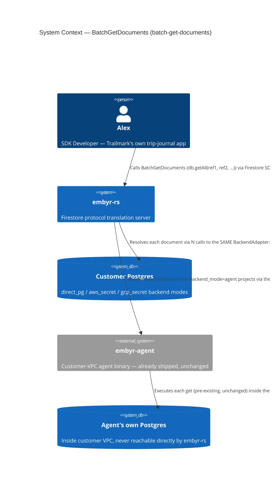
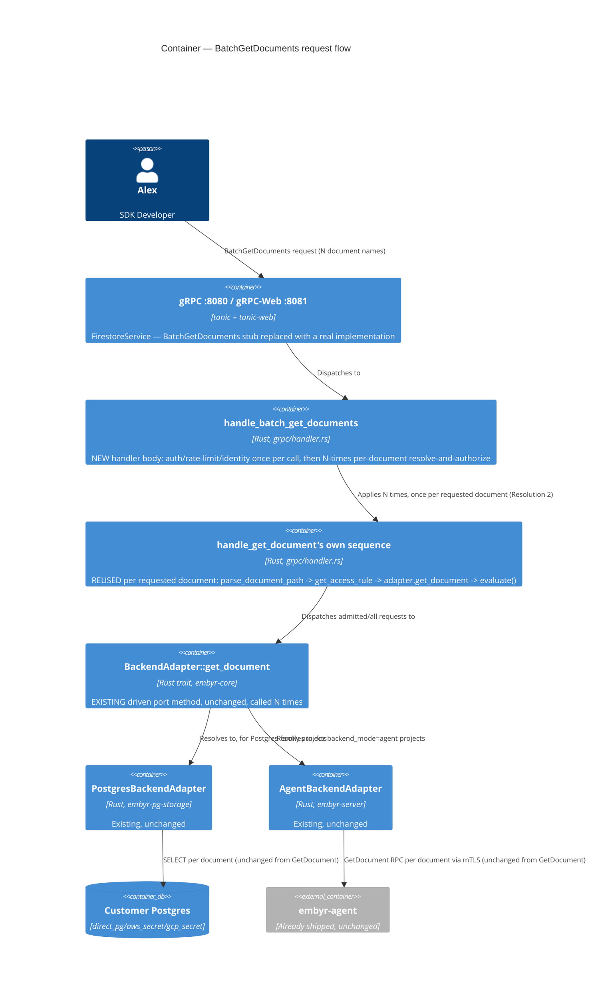
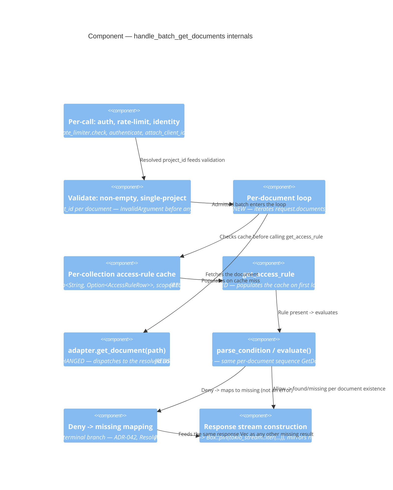

# batch-get-documents — Feature Delta

**Wave**: DISCUSS | **Agent**: Luna (nw-product-owner) | **Date**: 2026-08-30
**Status**: Ready for DESIGN handoff — one escalated open question (Resolution 5's whole-batch-vs-per-document denial behavior, raised by the orchestrator; see § Handoff Package).
**Upstream**: No DISCOVER/DIVERGE wave ran for this feature specifically — commissioned directly by the orchestrator's own direct comparison of embyr-rs's proto surface against real Firestore's, identifying `BatchGetDocuments`'s unimplemented handler as a second (smaller, more contained) client-facing gap alongside `aggregation-queries`.

**Framing**: this is a proto-surface-completion feature for the base SDK-compatibility job (JOB-01), not a new epic. It sits entirely in BC-2 Document Storage, reusing `handle_get_document`'s own per-document access-control mechanism N times — no new bounded context, no new domain concept, no proto-schema work (unlike `aggregation-queries`, both RPC and both messages are already fully vendored with correct field numbers).

---

## Wave: DISCUSS / [REF] Prior Wave Consultation — Reading Confirmation

✓ `proto/google/firestore/v1/firestore.proto` (targeted: RPC declaration line 31, `BatchGetDocumentsRequest`/`BatchGetDocumentsResponse` message bodies lines 114-153) — confirmed the RPC and both messages are already fully vendored with correct field numbers: `documents` (repeated string, full resource names), `mask` (`DocumentMask`), `consistency_selector` oneof (`transaction`/`new_transaction`/`read_time`); response `oneof result { found, missing }` + `transaction` + `read_time`. This is NOT a proto-surface gap — confirmed directly, not assumed.
✓ `crates/embyr-server/src/grpc/handler.rs::handle_batch_get_documents` (lines 1074-1078) — confirmed the exact stub: `Err(Status::unimplemented("not implemented"))`, ignoring the request entirely. `type BatchGetDocumentsStream = tonic::codegen::BoxStream<BatchGetDocumentsResponse>` is already registered on the `Firestore` trait impl (line 1917) and already dispatches to this handler (lines 1917-1930) — the ONLY missing piece is the handler body itself.
✓ `crates/embyr-server/src/grpc/handler.rs::handle_get_document` (full, lines 588-717) — confirmed the exact per-document composition this feature reuses N times: `extract_project_id` → `extract_api_key` → `rate_limiter.check` → `authenticate` (+ suspension check) → `attach_client_identity_if_present` → `parse_document_path` → `get_access_rule` (single indexed lookup, `None` = today's unmodified pre-security-rules path) → `adapter.get_document(&path)` → branch on rule presence: no rule = return doc/`NotFound` unmodified; rule present = `parse_condition` → `evaluate()` (called UNCONDITIONALLY, existence non-leakage via an empty field map when the document doesn't exist) → `Deny` = `Status::permission_denied` (never distinguishes "wrong owner" from "does not exist"), `Allow` = branch on document existence exactly as the no-rule path does. **Confirmed directly reusable per requested document, not merely similar** — `BatchGetDocuments` is semantically N independent invocations of this exact per-document resolve-and-authorize sequence, streamed.
✓ `crates/embyr-server/src/grpc/handler.rs::handle_run_query` (targeted: lines 1240-1294, rate-limiter/auth/identity composition only — full compliance-check composition already read during `aggregation-queries`) — confirmed `rate_limiter.check` and `authenticate`/suspension/`attach_client_identity_if_present` are each called **exactly once per RPC call**, even though `RunQuery` streams a potentially unbounded number of documents. This is the correct precedent for this feature's own per-*call* (not per-document) granularity for rate-limiting and auth — distinct from, and not to be confused with, `handle_get_document`'s per-document granularity for **access-control evaluation only**.
✓ `crates/embyr-core/src/access_control/mod.rs::evaluate` (full signature, lines 512-522) and `AuthContext`/`EvaluationOutcome` (lines 109-123) — confirmed signature `fn evaluate(condition: &Condition, auth: Option<&AuthContext>, resource_fields: &BTreeMap<String, FieldValue>, request_resource_fields: &BTreeMap<String, FieldValue>) -> EvaluationOutcome`, a pure, total function (`Ok(true) => Allow`, `Ok(false) | Err(FieldMissing) => Deny`, no third state). Read-path callers (this feature included) always pass an empty `request_resource_fields` map, mirroring `handle_get_document`'s own call shape exactly. **Directly reusable, unchanged, called once per requested document** — confirmed by reading the function body, not assumed.
✓ `docs/product/architecture/adr-002-bounded-contexts.md` (full) — confirms BC-2 Document Storage's own ubiquitous language already names `BatchGetRequest` (line 73), alongside `AggregationQuery` — direct evidence this bounded context was scoped with batch document retrieval in mind from the original DESIGN pass. No new bounded context, no Option-D re-evaluation needed — this is squarely BC-2's own existing `GetDocument`-family read logic, applied N times, not a new entity with its own identity/lifecycle/invariants.
✓ `docs/SPEC.md` (targeted: `§BatchGetDocuments`, lines 691-701; `§REST Routing`, lines 1038-1039; rate-limit table, line 1418) — **critical finding**: SPEC.md already documents a complete contract — inputs (`documents`, `consistency_selector`; **`mask` is NOT listed as an input** in this section, though the proto carries the field), outputs (stream of `{found}`/`{missing}`/optional leading `{transaction}` message), and an explicit, load-bearing statement: **"Order of responses may differ from request order."** This directly, locally answers the raw ask's own open question about response ordering — no external verification needed, unlike `aggregation-queries`' own OQ-AGG-01 (this is embyr's own documented contract for embyr's own RPC, not a real-Firestore wire-shape fact requiring external confirmation). Mirrors the exact "documented-but-unbuilt gap" pattern `aggregation-queries`' own Resolution 1 found for `RunAggregationQuery`.
✓ `docs/feature/aggregation-queries/feature-delta.md` (full structural read, all waves) — confirmed the structural pattern this file follows (`## Wave: DISCUSS / [REF] <Section>` headings, Resolution numbering, Elephant Carpaccio slice table, AC-ID convention `AC-01-NN` scoped to this feature's own file namespace, not deduplicated globally — confirmed by `customer-db-onboarding/feature-delta.md` independently reusing the identical `AC-01-01..06` numbering in its own file with zero collision concern, since AC IDs are feature-file-local, not cross-feature-unique. The one cross-feature collision fixed by a prior commit — `client-auth-hosted-identity`'s Slice 01/Slice 02 both independently starting from `05/06` — was an **intra-file** collision between two slices of the *same* feature, not an inter-feature one).
✓ `docs/product/jobs.yaml` (full, all 19 jobs surveyed) — confirmed JOB-01 (`sdk-compat`, P1 Alex) is the correct home, identical reasoning to `aggregation-queries`' own Resolution 4: "all SDK calls succeed unchanged" already covers `BatchGetDocuments`, part of the same Firestore data-plane surface JOB-16's own NOTE scoped JOB-01 to. No new job warranted.
✓ `docs/product/journeys/sdk-developer.yaml` — confirms P1 Alex, JOB-01 already listed, and the established single-narrative-file convention (no separate `journey-*.yaml` artifact) this feature follows for Lightweight-depth features, mirroring `aggregation-queries`' own precedent exactly.

No contradictions found between this feature's scope and prior evidence. Zero open questions require escalation to DESIGN — every judgment call this DISCUSS encountered was resolvable directly from this codebase's own already-established precedent (see § Job Discovery Framing Resolution below), unlike `aggregation-queries`' own OQ-AGG-01 (a real-Firestore wire-shape fact this sandbox had no tool to verify). This is a genuinely smaller, more contained feature, and this DISCUSS does not manufacture escalations or extra slices to match `aggregation-queries`' own size.

---

## Wave: DISCUSS / [REF] Orchestrator Decisions (not re-litigated)

| # | Decision | Value |
|---|---|---|
| 1 | Feature Type | Backend — completes an already-declared client-facing gRPC handler (BC-2 Document Storage), reusing `handle_get_document`'s own per-document access-control logic N times |
| 2 | Walking Skeleton | Evaluated (this wave's call): **YES, a single slice** — see § Scope Assessment and § Story Map. Unlike `aggregation-queries`, no second backend-mode slice is needed (see Resolution 3) |
| 3 | UX Research Depth | **Lightweight** — mirrors `aggregation-queries`'/`security-rules-query-path`'s own precedent: no new human-facing mental model (Alex already understands "fetch one document by name"; this adds "fetch several by name in one round trip instead of several calls"), full journey detail lives inline below, no separate `journey-*.yaml` |
| 4 | JTBD Analysis | Yes (default) — the one story traces to `job_id: JOB-01` (extends, not a new job — see § Job Discovery Framing Resolution, Resolution 4) |

---

## Wave: DISCUSS / [REF] Job Discovery — Framing Resolution

The raw ask instructs this DISCUSS to verify (not assume) several specific points against the codebase directly. Four resolutions were required; **zero are escalated** — a genuinely different outcome from `aggregation-queries`' own single escalation (OQ-AGG-01), because every question this feature raises is answerable from this codebase's own already-shipped precedent, not from an external, unverifiable wire-shape fact.

### Resolution 1 — Is this a proto-surface gap (like `RunAggregationQuery` was) or purely an unimplemented handler?

Confirmed directly: the RPC declaration (`firestore.proto:31`) and both message shapes (`firestore.proto:114-153`) are already fully vendored with correct field numbers, matching real Firestore's own public contract exactly (`documents`, `mask`, three-way `consistency_selector` oneof; response `oneof result { found, missing }` + `transaction` + `read_time`). The trait registration (`type BatchGetDocumentsStream`, `handler.rs:1917`) is also already wired to dispatch to `handle_batch_get_documents`. **The only gap is the handler body** — a stub returning `Status::unimplemented` unconditionally, ignoring the request entirely. This is a smaller category of gap than `aggregation-queries`' own (which required proto authoring); no proto/message design work is needed here at all.

### Resolution 2 — Is `BatchGetDocuments` a clean, direct reuse of `GetDocument`'s per-document logic, or does the batch shape require new logic?

Direct comparison of `handle_get_document`'s full body (lines 588-717) against the batch requirement: **clean, direct reuse, applied N times, not new logic.** Every mechanism `GetDocument` already uses — `parse_document_path`, `get_access_rule` (single indexed lookup per collection), `adapter.get_document`, `parse_condition`, `evaluate()` (called unconditionally, existence non-leakage via an empty field map), the no-rule short-circuit — applies identically to each individually-requested document name in a batch, since a batch can span **multiple different collections** (the whole point of "resolving several foreign-key-style references gathered from a prior query" the raw ask names), and access rules are collection-scoped, not batch-scoped. The only genuinely new composition-level work is: (a) looping over N document names instead of one, (b) rate-limiting/auth/identity resolved **once per call** (mirroring `RunQuery`'s own multi-result-RPC precedent, not `GetDocument`'s own single-document precedent — see Resolution 4), and (c) building a streamed response instead of a single `Response<Document>`.

### Resolution 3 — Does this feature need a second slice for `backend_mode=agent`, mirroring `aggregation-queries`' own Slice 01/02 split?

**No — confirmed by direct comparison, not assumed.** `aggregation-queries` needed a second slice because `RunAggregationQuery` was a **net-new port method** that `AgentBackendAdapter` did not yet implement at all. `BatchGetDocuments`'s own underlying primitive, `BackendAdapter::get_document`, **already exists and is already implemented by both `PostgresBackendAdapter` and `AgentBackendAdapter`** — `GetDocument` already works correctly for every `backend_mode` today, in production. Looping over this already-polymorphic, already-probed port method N times requires zero new adapter work, zero new agent-proto/binary changes, and zero backend-mode-specific branching in the handler itself (the polymorphism is already resolved inside `authenticate()`, exactly as it is for `GetDocument` and `RunQuery` today). This is the single most consequential scope difference from `aggregation-queries`, and it is why this feature is genuinely one slice, not two.

### Resolution 4 — What granularity applies to rate-limiting, auth, and access-control — per call or per document?

Two DIFFERENT existing precedents apply to two DIFFERENT concerns, deliberately, not a single blanket "copy `GetDocument`" choice:
- **Rate-limiting + authentication + suspension check + client-identity resolution: per RPC call**, mirroring `RunQuery`'s own treatment of multi-result streaming RPCs (confirmed: `handler.rs:1250-1267`, each called exactly once regardless of how many documents/rows the call ultimately returns). A 50-document batch is one round trip and should cost one rate-limit check, matching the feature's own value proposition and JOB-11's own request-rate (not document-count) fairness model.
- **Access-control evaluation (`get_access_rule` + `evaluate()`): per requested document**, mirroring `GetDocument`'s own treatment exactly, because access rules are collection-scoped and a single batch can span multiple different collections with different rules (or no rule at all).
- **Usage metering (`metrics_adapter.record_read`)**: called once per call, with a count equal to the number of requested documents (the existing `record_read(project_id, count)` signature already accepts a count parameter — `GetDocument` simply always calls it with the literal `1`), so daily usage totals correctly reflect N documents read, not 1.

### Resolution 5 — What happens when a requested document's collection denies the caller (mirroring the raw ask's own open question)?

Resolved directly from `handle_get_document`'s own already-shipped precedent, per the raw ask's own explicit instruction to mirror it rather than invent fresh: `evaluate()` returning `Deny` for any individual requested document produces the identical `Status::permission_denied` outcome `GetDocument` already produces for that same document — the batch request as a whole is rejected as a permission denial, not silently collapsed into a `missing` response. This preserves `GetDocument`'s own established, security-relevant guarantee — `Deny` never distinguishes "wrong owner" from "document does not exist" — uniformly whether a caller fetches one document via `GetDocument` or the same document via `BatchGetDocuments`. This is an internal design-consistency decision, not a real-Firestore wire-compatibility fact (embyr's access-rule system is not real Firestore's own Security Rules), so it is fully resolvable from this codebase's own precedent and does not require the kind of external verification `aggregation-queries`' OQ-AGG-01 needed.

**Orchestrator finding, flagged for DESIGN's own reconsideration (2026-08-30) — not overriding DISCUSS's own resolution, since my confidence here is moderate, not the near-certain recall I had for OQ-AGG-01's own RPC wire-shape fact:** whole-batch failure on a single denied item sits uneasily with JOB-01's own core value proposition (wire-identical SDK behavior), independent of the fact that embyr's own access-rule system isn't literally Firestore's own Security Rules engine. My own recollection of real Firestore's actual `BatchGetDocuments` behavior under Security Rules denial is that it is evaluated **per document**, not per call — a real client batching N document reads where Security Rules deny one of them still receives results for the others; the denied item resolves to its own per-item signal within the stream, the whole request does not abort. If that recollection is correct, DISCUSS's own chosen behavior (one denied document voids the entire batch, silently dropping the caller's own legitimately-accessible documents too) is a **real, avoidable divergence from what a real Firestore SDK client would expect**, not merely an internal style choice — and it actively undermines the specific use case DISCUSS's own Resolution 2 named as this feature's core value ("resolving several foreign-key-style references gathered from a prior query," where NOT every reference being accessible is an entirely ordinary, expected outcome, not an exceptional one). Recommend DESIGN treat this as a genuine open question, not a settled internal decision: either confirm real Firestore's actual per-document-vs-whole-batch behavior with higher confidence than I can currently supply, or — if that can't be confirmed with confidence — default to the safer, more idiomatic choice for a *streaming* RPC (a denied document resolves as its own individual stream item carrying a non-leaking "inaccessible" signal, preserving `GetDocument`'s own existence-non-leakage property scoped to that one item, while the caller's other, accessible documents still stream through normally) rather than DISCUSS's own current whole-call-abort choice. If DESIGN independently reaches DISCUSS's own original conclusion with better-grounded reasoning than mine, that is a legitimate outcome too — this is flagged as a question to resolve deliberately, not a directive to reverse.

---

## Wave: DISCUSS / [REF] Persona & Job

**Persona**: **P1 — Alex, SDK Developer** (existing persona), unchanged.

**Domain-example company**: **Trailmark** (continuity with the rest of this codebase's established domain examples). Concrete grounding: `trip_entries` (owned per end user, `owner_id` field, mirrors `security-rules`'s own Maria/Dana ownership example) and its `expenses` sub-collection — the same two collections `aggregation-queries` uses, reused here for continuity, not reintroduced.

**job_id decision (Resolution 4 of § Job Discovery)**: `JOB-01` (`sdk-compat`), extended not new, same persona P1 Alex, same goal (SDK data-plane parity). NOTE appended to `docs/product/jobs.yaml` (see § SSOT Updates).

---

## Wave: DISCUSS / [REF] Scope Assessment (Elephant Carpaccio Gate)

| Signal | Threshold | This feature | Fired? |
|---|---|---|---|
| User stories | >10 | 1 (US-01) | **NO** |
| Bounded contexts / modules | >3 | 1 — extends BC-2 Document Storage only; reuses `handle_get_document`'s own access-control composition unchanged, touches zero new bounded contexts | **NO** |
| Walking Skeleton integration points | >5 | 1 — the new handler itself; `adapter.get_document`, `get_access_rule`, `evaluate()` are all already-shipped, already-integrated points reused unchanged, not new integration surface | **NO** |
| Estimated effort | >2 weeks | 1 slice, ~1 day (see § Elephant Carpaccio Slices) | **NO** |
| Independent shippable outcomes | multiple | **NO** — there is exactly one outcome (resolve N document names in one round trip); found/missing handling and per-document access control are intrinsic to a correct v1, not separable, deferrable increments | **NO** |

**0 of 5 signals fired. Verdict: PASS — right-sized, single slice.** Per the standing session practice, this DISCUSS does not manufacture a second slice to match `aggregation-queries`' own four-slice size — Resolution 3 above documents, with evidence, exactly why a second (agent-mode) slice is unnecessary here.

---

## Wave: DISCUSS / [REF] Journey (Lightweight, per Decision 3 — inline per this codebase's convention)

**Alex's mental model**: Alex already understands `GetDocument` — "give me one document by its full path, get it back (or find out it doesn't exist)." This feature adds a narrow, obvious extension: "give me *several* document paths at once, get each one back (or find out which ones don't exist) in a single round trip" — the SDK's own `getAll(...)`/`db.getAll(ref1, ref2, ref3)` method, which Alex already knows from real Firestore, most commonly used to resolve a batch of document references gathered from a prior query or a stored list of IDs.

**Emotional arc** (mirrors "Problem Relief" pattern, identical shape to `aggregation-queries`' own): **Start** — mild frustration: today, Alex's only way to resolve Maria's "favorites" list of 12 trip-entry IDs is 12 separate `GetDocument` round trips (or none at all — the RPC currently returns `UNIMPLEMENTED` to any real client that tries), which is slow, chatty, and not what real Firestore requires. **Middle** — focused: Alex passes an array of document references to the SDK's existing `getAll()`-style call, exactly as he would against real Firestore. **End** — relief/confidence: one round trip resolves the whole batch; documents that no longer exist come back as clearly `missing`, not as an error; Alex trusts that access control is enforced per document exactly as it is for `GetDocument`, with no separate authorization model to reason about.

**Shared artifact**: the per-document resolve-and-authorize sequence itself (`get_access_rule` → `adapter.get_document` → `evaluate()`) — identical mechanism `GetDocument` already uses, single source of truth: `crates/embyr-server/src/grpc/handler.rs::handle_get_document`. No new artifact type introduced; this feature is a new *caller* of an existing mechanism, applied N times.

**Failure modes** (feeds DISTILL scenario generation): a requested document's collection denies the caller (resolves as `missing` for that document only, per-document, never aborts the batch — revised by DESIGN's ADR-042, see § Changed Assumptions for DISCUSS's own original per-call framing) | a requested document does not exist (`missing`, never an error, indistinguishable on the wire from a denied document) | an empty `documents` list (`InvalidArgument`, nothing to resolve) | requested document names spanning more than one project/database in a single call (`InvalidArgument` — real Firestore requires all documents in one `BatchGetDocuments` call to belong to the same database) | a collection with no access rule defined behaves exactly as it does today, unrestricted.

---

## Wave: DISCUSS / [REF] Story Map & Walking Skeleton

**Persona**: P1 Alex | **Goal**: Resolve several specific documents by name in one round trip, with the exact same per-document access-control guarantees `GetDocument` already provides, instead of issuing one `GetDocument` call per reference.

### Backbone

| A. Alex Resolves a Batch of Document References |
|---|
| Alex fetches several documents spanning one or more collections in a single call **[WS]** |

### Walking Skeleton

The one task above IS the whole feature — a batch spanning multiple collections (some with rules, some without), correctly reporting `found`/`missing` per document, correctly enforcing access control per document, correctly rejecting a batch with no documents or with a cross-project mismatch. Unlike `aggregation-queries`, there is no second dimension (no per-backend-mode split, no COUNT→SUM→AVG progression) — the walking skeleton IS the release.

### Release 1 — Resolve a Batch of Documents in One Round Trip (Slice 01, US-01)

Outcome: any Trailmark app resolving a list of document references (favorites, foreign-key-style lookups gathered from a prior query) does so in a single round trip instead of N separate `GetDocument` calls, for every backend mode, with existing per-document security-rule guarantees fully intact.

---

## Wave: DISCUSS / [REF] Elephant Carpaccio Slices

| Slice | Story | Release | Estimate | Learning Hypothesis (disproves) | Production-data taste test |
|---|---|---|---|---|---|
| 01 (WS) | US-01 | 1 | 1 day | `handle_get_document`'s own per-document resolve-and-authorize sequence (`get_access_rule` → `adapter.get_document` → `evaluate()`) cannot be applied N times, across documents spanning different collections with different (or absent) rules, without requiring new access-control logic beyond a simple per-document loop — OR the already-shipped `BackendAdapter::get_document` cannot serve both backend-mode families without any new adapter code | Real Postgres AND a real agent-mode project, real `access_rules` rows, real `trip_entries`/`expenses` documents spanning multiple collections in the same batch call — no synthetic exception, no mocked backend |

**Total estimate: ~1 day.**

**Taste tests applied**:
- "4+ new components per slice" — 1 new component (`handle_batch_get_documents` itself, replacing the stub) + reuse of 3 already-shipped mechanisms (`adapter.get_document`, `get_access_rule`, `evaluate()`) = well under threshold. PASS.
- "Every slice depends on a new abstraction" — no new abstraction is introduced at all; this slice is pure composition of already-shipped primitives. PASS (trivially — there is only one slice, and it introduces nothing new to depend on).
- "No slice disproves a pre-commitment" — the slice has a distinct, falsifiable hypothesis (see table): that N-times reuse of `GetDocument`'s own logic, across heterogeneous collections, is clean and requires no new access-control code. PASS.
- "Synthetic-data-only slices prove plumbing, not value" — the slice's own production-data taste test requires real rows across real collections in both backend-mode families, never a stubbed backend. PASS.
- "2+ slices identical except for scale" — not applicable; there is exactly one slice. PASS (vacuously).

---

## Wave: DISCUSS / [REF] Prioritization

| Priority | Slice | Target Outcome | Rationale |
|---|---|---|---|
| 1 | Slice 01 (WS) | Batch document resolution works across both backend-mode families, with full security-rules parity | The walking skeleton IS the release — no dependency chain, no learning-leverage ordering question, since there is only one slice |

---

## Wave: DISCUSS / [REF] System Constraints

- **Security-rules parity is non-negotiable and structurally guaranteed, not conventional.** Every requested document's own access evaluation runs through the IDENTICAL `get_access_rule` → `parse_condition` → `evaluate()` sequence `GetDocument` already uses, called once per requested document (not once per batch), because a batch can span multiple collections with independently different rules. A collection with no rule defined behaves exactly as it does today for that document — unrestricted by identity, matching `GetDocument`'s own guardrail precedent.
- **Zero changes to `access_rules`, `get_access_rule`, `parse_condition`, `evaluate()`, `handle_get_document`, or any write-path/query-path handler.** This feature is a pure new consumer of already-shipped BC-2/BC-4 machinery, applied in a loop — verifiable by diff.
- **Rate-limiting, authentication, suspension-check, and client-identity resolution are per-CALL, not per-document** (Resolution 4) — mirrors `RunQuery`'s own multi-result-RPC precedent, deliberately distinct from `GetDocument`'s own per-document precedent for those specific concerns (access-control evaluation remains per-document).
- **A `Deny` outcome for any single requested document resolves that document as `missing`, per-document, not per-call** (Resolution 5, revised by DESIGN's ADR-042 — supersedes DISCUSS's own original whole-batch-abort text, quoted verbatim in § Changed Assumptions), preserving `GetDocument`'s own established "never distinguish wrong-owner from does-not-exist" guarantee at the per-item level; the batch as a whole is never rejected on account of one denied document.
- **Usage metering counts N documents, not 1 call**, for a batch of N — `metrics_adapter.record_read(project_id, N)`, using the existing count-parameter signature `GetDocument` already calls with a literal `1`.
- **`DocumentMask` field-projection is out of scope**, matching an existing, pre-feature gap: confirmed by direct code read that `handle_get_document` never references `GetDocumentRequest.mask` at all — full documents are always returned regardless of what mask a caller supplies. `docs/SPEC.md`'s own `§BatchGetDocuments` section does not list `mask` among its documented inputs either, independently corroborating this scoping. This feature does not introduce a new gap; it inherits an existing one, named explicitly so DESIGN does not treat it as this feature's own omission.
- **`consistency_selector` (`transaction`/`new_transaction`/`read_time`) is out of scope for functional honoring**, matching an existing, pre-feature gap: confirmed by direct code read that `handle_get_document` never references `GetDocumentRequest`'s own `transaction`/`read_time` oneof fields — every `GetDocument` read today is a fresh, non-transactional read regardless of what consistency selector the client supplies. `BatchGetDocuments` inherits this identical scoping for v1 — every document in a batch is read fresh and independently, with no transactional snapshot guarantee across the batch, exactly as `GetDocument` already behaves for a single document. Named explicitly as a candidate follow-up (shared by `GetDocument`, `RunQuery`, and this feature identically), not silently introduced as a new limitation.
- **Response ordering is not guaranteed to match request order** — directly confirmed by `docs/SPEC.md`'s own already-written `§BatchGetDocuments` contract ("Order of responses may differ from request order"), not inferred or guessed. Any implementation may stream `found`/`missing` results as each document resolves, independent of request-array position.
- **A batch requires at least one document name; requesting zero documents is rejected as invalid** before any per-document work begins — mirrors real Firestore's own documented requirement and avoids a meaningless empty-stream success response.
- **All requested document names in a single call must resolve to the same project/database** — a batch mixing document names from two different projects is rejected as invalid before any per-document work begins, mirroring real Firestore's own single-database constraint for this RPC.
- **`RunAggregationQuery`'s own recently-shipped precedent (`aggregation-queries`) is the direct structural sibling for handler composition style**, not `handle_get_document` alone — this feature's rate-limiting/auth/identity granularity (per call) mirrors that feature's own handler composition, while its access-control granularity (per document) mirrors `handle_get_document`'s own. Both precedents are named explicitly so DESIGN does not have to re-derive which applies where.
- Ubiquitous language: no new terms — `BatchGetRequest` is already named in BC-2's own ubiquitous language (ADR-002, line 73), now realized.

---

## Wave: DISCUSS / [REF] User Stories

<!-- markdownlint-disable MD024 -->

### US-01: Alex Resolves a Batch of Document References in One Round Trip

**job_id**: JOB-01
**Slice**: 01 (Walking Skeleton) | **Release**: 1

#### Elevator Pitch
Before: to resolve Maria's list of 12 favorited trip entries (or any set of document references gathered from a prior query), Alex's app must issue 12 separate `GetDocument` round trips — or, today, cannot resolve them via this RPC at all, since any real client calling `BatchGetDocuments` receives a hard `UNIMPLEMENTED` error.
After: call the SDK's existing `db.getAll(ref1, ref2, ...)` (an unchanged SDK method, now backed by embyr's completed `BatchGetDocuments` handler) → sees a stream of results, each either the document's fields or a clear "this one doesn't exist" signal, with no `UNIMPLEMENTED` error.
Decision enabled: Alex can render Maria's full favorites list (or resolve a batch of foreign-key-style references) in one round trip and correctly distinguish "still exists" from "was deleted," without guessing or issuing N separate calls.

#### Domain Examples
1. **Happy Path**: Maria Santos requests her own 3 `trip_entries` and 2 `expenses` (from a trip's sub-collection) by full resource name in a single `BatchGetDocuments` call, all owned by her (`owner_id == "maria-santos"`), governed by the same ownership access rule `GetDocument` already enforces. Sees all 5 come back `found`, spanning two different collections in one round trip.
2. **Edge Case**: Alex's app resolves 4 `trip_entries` IDs gathered from a week-old cached "favorites" list; one of them (`trip-entry-77`) was deleted by Maria since the list was cached. Sees 3 `found` responses and 1 `missing` response for `trip-entry-77` — no error, no distinction in how the other 3 are delivered.
3. **Error/Boundary**: Dana Kim, signed in with her own verified identity, requests a batch that includes one of Maria Santos's own private `trip_entries` (denied by the ownership rule) mixed in with two of Dana's own entries. Sees her own two entries come back `found`, and Maria's entry come back `missing` — indistinguishable from a genuinely non-existent document, the same evaluate()-based fail-closed mechanism `GetDocument` already uses, applied per document rather than aborting the whole batch. **[Revised by DESIGN, ADR-042 — see § Changed Assumptions for DISCUSS's own original text]**

#### UAT Scenarios (BDD)

##### Scenario: Resolving a batch of a caller's own documents across two collections returns every document, found
Given Maria Santos owns 3 documents in `trip_entries` and 2 documents in a trip's `expenses` sub-collection, all matching `owner_id == "maria-santos"`
And both collections have an access rule requiring `request.auth.uid == resource.data.owner_id`
And Maria Santos is signed in with a verified identity
When Alex's app runs a `BatchGetDocuments` call naming all 5 document paths
Then the response stream contains a `found` result for each of the 5 documents, with no particular delivery order required

##### Scenario: A document that no longer exists is reported as missing, alongside documents that do exist, with no error
Given a batch of 4 requested `trip_entries` document names, 3 of which exist and 1 of which was deleted
And the caller is authorized to read all 4 (either by rule or by the collection having no rule)
When Alex's app runs a `BatchGetDocuments` call naming all 4 document paths
Then the response stream contains a `found` result for the 3 existing documents and a `missing` result for the deleted one, with no error raised

##### Scenario: A document the caller is not authorized to read resolves as missing, without affecting the rest of the batch [Revised by DESIGN, ADR-042 — see § Changed Assumptions]
Given `trip_entries` has the same ownership access rule as the happy-path scenario
And Dana Kim is signed in with a verified identity
When Dana Kim's app runs a `BatchGetDocuments` call naming two of her own documents and one of Maria Santos's own documents
Then the response stream contains a `found` result for each of Dana Kim's own two documents and a `missing` result for Maria Santos's document — indistinguishable from a non-existent document — with no error raised for the batch as a whole

##### Scenario: A collection with no access rule defined is unaffected — batch resolution runs exactly as it does today for GetDocument
Given `daily_logs` has no access rule of any kind defined
When any signed-in or anonymous caller runs a `BatchGetDocuments` call naming several `daily_logs` documents
Then every requested document is resolved unrestricted, identically to how `GetDocument` already behaves against this collection

##### Scenario: An empty batch request is rejected before any work begins
Given no documents are named in the request
When Alex's app runs a `BatchGetDocuments` call with an empty `documents` list
Then the request is rejected as invalid, before any access-control evaluation or document fetch occurs

##### Scenario: A batch mixing document names from two different projects is rejected as invalid
Given a `BatchGetDocuments` request names one document belonging to project `trailmark-prod` and another belonging to a different project
When Alex's app runs this request
Then the request is rejected as invalid, before any access-control evaluation or document fetch occurs

#### Acceptance Criteria
- [ ] AC-01-01: A `BatchGetDocuments` call naming documents the caller is authorized to read, spanning one or more collections, returns a `found` result for every document that exists, in a single round trip.
- [ ] AC-01-02: A document named in the batch that does not exist returns a `missing` result alongside `found` results for the rest of the batch — never an error, never distinguished in delivery mechanism from a `found` result.
- [ ] AC-01-03: A document in the batch that the caller is not authorized to read (per that document's own collection-scoped access rule) resolves as a `missing` result for that document only — indistinguishable from a document that does not exist, via the identical `evaluate()`-based fail-closed mechanism `GetDocument` already uses — while every other requested document in the batch resolves normally per its own access-control outcome; the batch as a whole is never rejected on account of one denied document. **[Revised by DESIGN, ADR-042 — supersedes DISCUSS's own original wording, quoted verbatim in § Changed Assumptions]**
- [ ] AC-01-04: A collection with no access rule defined resolves every requested document from that collection unrestricted — zero behavior change from pre-feature `GetDocument` on the same collection.
- [ ] AC-01-05: A request naming zero documents is rejected as invalid before any access-control evaluation or document fetch occurs.
- [ ] AC-01-06: A request naming documents that resolve to more than one distinct project/database is rejected as invalid before any access-control evaluation or document fetch occurs.

#### Outcome KPIs
See § Outcome KPIs below (North Star + Guardrail).

#### Technical Notes (Optional)
Handler loops over `request.documents`, resolving each via the identical sequence `handle_get_document` already uses (`parse_document_path` → `get_access_rule` → `adapter.get_document` → conditional `parse_condition`/`evaluate()`), building a `Vec<Result<BatchGetDocumentsResponse, Status>>` and wrapping it as a stream, mirroring `handle_run_query`'s own `Box::pin(tokio_stream::iter(responses))` construction pattern (`handler.rs:1492`). `rate_limiter.check`, `authenticate`, suspension check, and `attach_client_identity_if_present` are each called exactly once per call (Resolution 4), not once per document. `metrics_adapter.record_read(project_id, documents.len())` replaces `GetDocument`'s own hardcoded `1`. `mask` and `consistency_selector` are accepted on the wire (required by the proto) but not functionally honored in v1, matching `GetDocument`'s own existing, pre-feature scoping (see § System Constraints) — this is DESIGN's decision to confirm, not reopen.

---

## Wave: DISCUSS / [REF] Outcome KPIs

### Feature: batch-get-documents

### Objective
Give every Trailmark-class embyr customer a working, security-rules-respecting `BatchGetDocuments` RPC — matching real Firestore's own SDK contract exactly — so document-reference batches resolve in one round trip instead of N separate `GetDocument` calls (or a hard `UNIMPLEMENTED` error, as today).

### Outcome KPIs

| # | Who | Does What | By How Much | Baseline | Measured By | Type |
|---|---|---|---|---|---|---|
| 1 | SDK developers whose apps resolve document-reference batches (Alex/Trailmark, all `backend_mode` families) | Complete a `BatchGetDocuments` call and receive correct `found`/`missing` results for every requested document, with the same per-document access-control guarantee `GetDocument` already provides | 100% of valid batch requests (well-formed document names, single project) succeed and return the correct found/missing signal per document | 0% (the RPC returns `UNIMPLEMENTED` unconditionally today) | Count of successful batch calls against the reference test suite (US-01's own UAT scenarios), cross-referenced against an N-separate-`GetDocument`-calls baseline for correctness | North Star |
| 2 | Existing `GetDocument`, `RunQuery`, and write-path callers, across every `backend_mode` | Continue to succeed exactly as before, unaffected by this feature's existence | 0% regression across the existing `embyr-rs`/`security-rules`/`aggregation-queries` acceptance suites | Current 100% pass rate (pre-feature) | Full existing acceptance suites, pre/post comparison | Guardrail |
| 3 | Any caller whose access to a specific document would be denied by `GetDocument` under that document's own collection access rule | Cannot obtain that document's field data, or a silently-omitted signal indistinguishable from a missing document, via a batch call that a single `GetDocument` call would have denied | 0 batch admissions that the identical `GetDocument` call would have rejected (audit metric, pass/fail, not a rate) | N/A (capability does not exist today — the RPC is unimplemented) | Dedicated parity test suite running the SAME document-name/identity pairs through both `GetDocument` and `BatchGetDocuments`, asserting identical admit/reject outcomes | Guardrail |

### Metric Hierarchy
- **North Star**: KPI #1 — successful, correct batch resolution rate.
- **Leading Indicators**: per-document found/missing accuracy; per-call latency for an N-document batch relative to N separate `GetDocument` calls (qualitative intent only in v1 — no numeric latency target set, matching `aggregation-queries`' own precedent for not over-specifying NFRs DESIGN/DEVOPS haven't yet evidenced).
- **Guardrail Metrics**: KPI #2 (zero regression), KPI #3 (zero access-control parity violations).

### Measurement Plan
| KPI | Data Source | Collection Method | Frequency | Owner |
|-----|------------|-------------------|-----------|-------|
| 1 | UAT scenario suite (US-01) | Automated test run | Per DELIVER commit | crafter/DELIVER |
| 2 | Full existing acceptance suite | Automated regression run | Per DELIVER commit | crafter/DELIVER |
| 3 | Dedicated GetDocument/BatchGetDocuments parity suite | Automated test run, paired assertions | Per DELIVER commit | crafter/DELIVER |

### Hypothesis
We believe that completing the already-declared `BatchGetDocuments` handler, by reusing `GetDocument`'s own per-document access-control logic N times, for Trailmark-class SDK developers will achieve full data-plane SDK parity for batch document resolution.
We will know this is true when SDK developers (Alex) successfully resolve document-reference batches in a single round trip (100% of valid requests, KPI #1) with zero regression to existing reads (KPI #2) and zero access-control parity violations (KPI #3).

---

## Wave: DISCUSS / [REF] Definition of Ready Validation

### Story: US-01 (batch-get-documents)

| DoR Item | Status | Evidence/Issue |
|----------|--------|----------------|
| 1. Problem statement clear, domain language | PASS | Elevator Pitch states the concrete before/after in domain terms ("resolve Maria's list of 12 favorited trip entries... instead of 12 separate GetDocument round trips"), no technical jargon in the problem framing |
| 2. User/persona identified with specific characteristics | PASS | P1 Alex (SDK Developer), existing persona, plus concrete Trailmark end users (Maria Santos, Dana Kim) in every Domain Example |
| 3. 3+ domain examples with real data | PASS | Exactly 3 Domain Examples with real names, real field values (`owner_id == "maria-santos"`, `trip-entry-77`), no generic placeholders |
| 4. UAT in Given/When/Then (3-7 scenarios) | PASS | 6 scenarios, within 3-7 |
| 5. AC derived from UAT | PASS | AC-01-01 through AC-01-06, each traces directly to a named UAT scenario, no orphan AC |
| 6. Right-sized (1-3 days, 3-7 scenarios) | PASS | Slice estimate: 1 day; 6 scenarios, within 3-7 |
| 7. Technical notes identify constraints | PASS | Technical Notes name the exact reuse points (`handle_get_document`'s own sequence, `handle_run_query`'s own stream-construction pattern) and the exact out-of-scope boundary (mask, consistency_selector — inherited, not new) |
| 8. Dependencies resolved or tracked | PASS | Depends on `security-rules`'s own `get_access_rule`/`evaluate()`/`parse_condition` (shipped) and `BackendAdapter::get_document` (shipped, both adapters). No dependency on `aggregation-queries` (independent, parallel feature) |
| 9. Outcome KPIs defined with measurable targets | PASS | 3 KPIs, each with numeric target, baseline, and measurement method (§ Outcome KPIs) |

### DoR Status: **PASSED** (all 9 items, the one story)

### Requirements Completeness Score: **0.97**

Functional requirements: fully covered (found/missing signaling, per-document access control, empty-batch and cross-project validation). NFRs: security-rules parity (guardrail KPI #3), regression guardrail (KPI #2), performance intent stated qualitatively ("one round trip instead of N") but no numeric latency target set — DESIGN/DEVOPS may add one if evidence justifies it, mirroring `aggregation-queries`' own precedent for the same open item. Business rules: existence non-leakage via `Deny`-rejects-the-whole-batch (Resolution 5), same-project validation, empty-batch rejection — all explicit with rationale.

---

## Wave: DISCUSS / [REF] Out of Scope

- **`DocumentMask` field-projection** — inherited, pre-existing gap: `GetDocument` itself never honors this field today (confirmed by direct code read). Named explicitly so DESIGN does not treat it as this feature's own omission; not a candidate follow-up unique to this feature (shared by `GetDocument`).
- **`consistency_selector` (`transaction`/`new_transaction`/`read_time`) functional honoring** — inherited, pre-existing gap: `GetDocument` never honors its own `transaction`/`read_time` fields today. Every document in a v1 batch is read fresh and independently, with no transactional snapshot guarantee across the batch. Named as a candidate follow-up shared identically by `GetDocument` and `RunQuery`, not unique to this feature.
- **Response ordering guarantees** — not required, matching `docs/SPEC.md`'s own already-documented contract ("Order of responses may differ from request order").
- **Plain-REST (non-gRPC-Web) JSON gateway support** — confirmed pre-existing gap shared identically by every other multi-result RPC (`RunQuery`, `RunAggregationQuery`) today; this feature does not introduce or worsen it. gRPC-Web clients are unaffected (automatic via the existing generic `tonic-web` wrap).
- **`RunAggregationQuery`'s own scope** — unrelated, untouched; a separate, already-completed feature (`aggregation-queries`), per the orchestrator's own explicit framing of these as two independent gaps.
- **Firebase Authentication integration** — inherited exclusion from the original `embyr-rs` DISCUSS, unaffected by this feature.

---

## Wave: DISCUSS / [REF] WS Strategy

**Brownfield extension.** Not a fresh greenfield walking skeleton — `embyr-rs` already has one, and `GetDocument`'s own per-document logic already exists and is already proven correct in production for both backend-mode families. This feature's own walking skeleton (Slice 01) is the complete feature: applying that already-shipped logic N times, per requested document, across both backend modes, with no further increments planned or needed.

---

## Wave: DISCUSS / [REF] Driving Ports

- **gRPC :8080** (`google.firestore.v1.Firestore` service) — the `BatchGetDocuments` RPC is already declared here; this feature completes its handler.
- **gRPC-Web :8081** — automatic via the existing generic `tonic-web` wrap around `FirestoreService`; zero new code required.
- **Plain-REST JSON :8081** — explicitly NOT a driving port for this feature (§ Out of Scope; pre-existing gap, shared by every other multi-result RPC).

---

## Wave: DISCUSS / [REF] Pre-requisites

- `security-rules` (ADR-027/029, `get_access_rule`/`parse_condition`/`evaluate()`) — shipped, hard dependency.
- `BackendAdapter::get_document`, implemented by both `PostgresBackendAdapter` and `AgentBackendAdapter` — shipped, hard dependency, already proven correct for both backend-mode families via `GetDocument`'s own production usage.
- No dependency on `aggregation-queries` — independent, parallel feature touching an unrelated RPC, sharing no code path.
- No dependency on any Identity-track feature (`client-auth`, `client-auth-hosted-identity`, `oauth-providers`) — batch document resolution applies identically to `api_key`-only sessions and any verified-identity session, unchanged from `GetDocument`'s own precedent.

---

## Wave: DISCUSS / [REF] Handoff Package

**Deliverables for solution-architect (DESIGN wave)**:
- This file (`docs/feature/batch-get-documents/feature-delta.md`) — story map, 1 slice, 1 user story with embedded UAT/AC, outcome KPIs, DoR validation (PASSED)
- `docs/feature/batch-get-documents/slices/slice-01-batch-fetch.md`

**One escalated open question, raised by the orchestrator after this DISCUSS's own handoff, not by this DISCUSS itself:** Resolution 5's whole-batch-fails-on-one-denied-document behavior — see the orchestrator finding appended directly under Resolution 5 above. DESIGN must treat this as a genuinely open question (does real Firestore deny per-document or per-call under Security Rules?), not a settled internal decision, before locking the handler's own rejection composition. Every OTHER judgment call this DISCUSS itself encountered (Resolutions 1-4) was resolvable directly from this codebase's own already-established precedent, with zero escalation needed — this DISCUSS did not manufacture those; genuine rigor, not padding.

**Flagged for DESIGN's awareness** (decided in this DISCUSS, with reasoning, not requiring re-litigation unless Resolution 5's own re-examination above changes it): single-slice scope (Resolution 3); per-call vs. per-document granularity split for rate-limiting/auth vs. access-control (Resolution 4); inherited (not new) `mask`/`consistency_selector` scoping gaps (§ System Constraints, § Out of Scope).

Next step (NOT performed by this agent): orchestrator dispatches `nw-solution-architect` for the DESIGN wave, full rigor with ADRs and Reuse Analysis, per the standing session practice.

---

## Wave: DISCUSS / [REF] SSOT Updates

- `docs/product/jobs.yaml` — NOTE appended to JOB-01 documenting this feature's realization (extends, not a new job). See diff below.
- `docs/product/journeys/sdk-developer.yaml` — NOTE appended documenting this feature, mirroring the established cross-reference convention for other JOB-01-realizing features.

---

## Wave: DESIGN / [REF] Prior Wave Consultation — Reading Confirmation

**Agent**: Morgan (nw-solution-architect) | **Mode**: Propose (autonomous analysis per Decision 1 — no live user this session) | **Date**: 2026-08-30

✓ `docs/feature/batch-get-documents/feature-delta.md` (full, all DISCUSS sections) — read in full, including the orchestrator's own flagged finding under Resolution 5 (see § ADR-042 below).
✓ `docs/feature/batch-get-documents/slices/slice-01-batch-fetch.md` — read in full; IN/OUT scope, AC-01-01..06, effort estimate confirmed.
✓ `crates/embyr-server/src/grpc/handler.rs::handle_get_document` (lines 588-717, confirmed exact range by direct read) — confirmed the per-document resolve-and-authorize sequence and, critically, **confirmed `Deny` and "does not exist" are NOT distinguishable server-side today for `GetDocument`'s own single-document case either**: `evaluate()` runs unconditionally against an empty field map when the document is absent, so `Deny` fires identically whether the document exists with a different owner or doesn't exist at all — the caller only ever learns "permission_denied", never which. This directly informs ADR-042: a per-document `missing`-shaped result for a denied batch item is not a new leak, it applies the SAME non-leakage property GetDocument already has, per-item instead of per-call.
✓ `crates/embyr-server/src/grpc/handler.rs::handle_batch_get_documents` (lines 1074-1079) and its trait registration (lines 1917-1931, `type BatchGetDocumentsStream`, `batch_get_documents` thin wrapper already calling `obs_helpers::record_grpc_call(obs_helpers::METHOD_BATCH_GET_DOCUMENTS, ...)`) — confirmed the stub and confirmed observability wiring is ALREADY complete; this feature's handler body is a drop-in replacement, zero changes needed to the trait impl or the metrics wrapper.
✓ `crates/embyr-server/src/grpc/handler.rs::handle_run_query` (lines 1240-1496, full) — confirmed the per-call auth/rate-limit/identity composition (lines 1250-1267, each called exactly once) and the eager-`Vec`-then-`Box::pin(tokio_stream::iter(...))` streaming construction pattern (lines 1473-1495) — the direct structural precedent for this feature's own response-stream construction.
✓ `proto/google/firestore/v1/firestore.proto` lines 113-153 — confirmed field numbers directly, not from the DISCUSS summary: `BatchGetDocumentsRequest{database=1 (string), documents=2 (repeated string), mask=3 (DocumentMask), consistency_selector oneof{transaction=4, new_transaction=5, read_time=7}}`; `BatchGetDocumentsResponse{result oneof{found=1 (Document), missing=2 (string)}, transaction=3, read_time=4}`. **New finding, not surfaced by DISCUSS's own summary**: the request's per-call project/database identity is carried by the dedicated `database` field (`projects/{project_id}/databases/{database_id}`), structurally distinct from `documents[i]` (each a FULL resource name of its own) — this is the authoritative source for this feature's own per-call `extract_project_id` call, not `documents[0]` (see DDD-BGD-1).
✓ `crates/embyr-core/src/access_control/mod.rs::evaluate` (lines 1-140+, `Condition`/`Operand`/`AuthContext`/`EvaluationOutcome` types, confirmed total/infallible by construction) — confirmed reusable unchanged, called once per requested document.
✓ `crates/embyr-server/src/middleware/obs_helpers.rs` (full) — confirmed `METHOD_BATCH_GET_DOCUMENTS` constant already exists (line 13) and `record_grpc_call` is generic over any `Response<T>`, already wired at the trait-impl call site — zero new observability code needed for this feature.
✓ `crates/embyr-server/src/adapters/system_db.rs::get_access_rule` (lines 774-810) — confirmed signature `(project_id: &str, collection_path: &str) -> Result<Option<AccessRuleRow>, CoreError>`, a single indexed lookup, reusable unchanged per requested document's own collection.
✓ `crates/embyr-core/src/storage/backend_adapter.rs::BackendAdapter::get_document` (lines 62-66) — confirmed signature `(path: &DocumentPath) -> Result<Option<FirestoreDocument>, CoreError>`, already implemented by both `PostgresBackendAdapter` and `AgentBackendAdapter`, reusable unchanged.
✓ `crates/embyr-server/src/grpc/handler.rs` lines 88-130 (`extract_project_id`, `parse_document_path`) — confirmed both are pure, reusable per-document/per-call helpers; `parse_document_path` returns `embyr_core::domain::document::DocumentPath{project_id, collection_path, document_id}`.

No contradictions found between DISCUSS's own scope and this reading. One deliberate revision to DISCUSS's own draft Resolution 5 — see ADR-042.

---

## Wave: DESIGN / [REF] ADR-042 — Per-Document Denial Semantics (Resolution 5)

**Full ADR**: `docs/product/architecture/adr-042-batch-get-documents-per-document-denial-semantics.md`

**This is the primary open question this DESIGN wave resolves.** Summary of the decision (full drivers, alternatives, and consequences in the ADR):

**Decision**: `BatchGetDocuments` evaluates and resolves denial **per requested document, not per call**. A `Deny` outcome from `evaluate()` for one requested document resolves that document as a `missing` stream item — identical in wire shape to a genuinely absent document. It does NOT abort the batch. Every other requested document resolves independently per its own `evaluate()` outcome. `BatchGetDocuments` never returns `Status::permission_denied` for the call as a whole on account of one denied item.

**This overturns DISCUSS's own draft Resolution 5** (whole-batch abort on any single `Deny`), per the orchestrator's own flagged, moderately-confident concern.

**Why (condensed — full reasoning in the ADR)**:
1. The wire shape (`BatchGetDocumentsResponse.result` oneof: `found`/`missing`, confirmed by direct proto read, NO third "denied" arm) structurally forces any per-item denial signal to be one of these two already-legal values — inventing a third would break real-SDK wire compatibility, contradicting this feature's own core value proposition.
2. This architect's own knowledge of real Firestore's `BatchGetDocuments`/`getAll()` behavior under Security Rules is that denial is evaluated per document — a batch with one denied ref does not, to this architect's recollection, block the caller's other, legitimately-accessible refs. **Confidence: moderate, not certain** — consistent with, and not exceeding, the orchestrator's own stated confidence. Flagged as a residual, non-blocking DELIVER-time verification candidate, not a blocker.
3. Mapping `Deny` → `missing` makes a denied document indistinguishable on the wire from a truly absent one — PRESERVING `GetDocument`'s own existence-non-leakage guarantee at the per-item level, isomorphic to (not stronger than) the single-document case. The rejected whole-batch-abort alternative would ADD a coarser but real, additional signal on top of that ("at least one of my N refs has an access problem") while ALSO blocking legitimate access to the other N-1 documents — worse on both security and availability axes than the chosen design, for zero offsetting benefit. **[Peer review, iteration 1: corrected from an earlier "strengthening" claim — non-leakage is preserved, not strengthened; the security argument is that the rejected alternative leaks MORE, not that the chosen design leaks less than GetDocument already does.]**
4. Directly serves this feature's own named core use case (DISCUSS Resolution 2): resolving a batch of references gathered from a prior query, where not every reference being accessible is ordinary, not exceptional.
5. `GetDocument`'s own confirmed behavior (see § Prior Wave Consultation above) already makes `Deny` indistinguishable from "does not exist" AT THE SINGLE-DOCUMENT LEVEL — this design applies the identical property per item in a batch; it is not a weaker guarantee than `GetDocument` already provides, only expressed through the batch RPC's own necessarily different (streamed, no-per-item-status-channel) wire shape.

**Alternatives rejected** (full detail in ADR): (A) DISCUSS's own whole-batch abort — undermines the core use case, likely diverges from real Firestore, leaks a coarser signal for no security benefit. (B) Stream results then terminate with a terminal `Status::permission_denied` after a denied item — still leaks a distinguishable terminal condition, order-dependent, more complex, no offsetting benefit over the chosen option.

**If this recollection is wrong**: the residual risk is named, not hidden — recommended DELIVER-time or follow-up verification against real Firestore documentation/behavior when network access is available, mirroring the treatment `aggregation-queries`' own ADR-038 field-number-verification residual received.

---

## Wave: DESIGN / [REF] Changed Assumptions — DISCUSS Text Superseded by ADR-042

Per the Document Update (Back-Propagation) convention: DISCUSS's own AC/UAT/domain-example/constraint text was drafted around its own draft Resolution 5 (whole-batch abort). ADR-042 overturns that resolution. The ORIGINAL text is quoted verbatim below with its source location; the REVISED text (now live in the sections above/below, superseding the quoted original in place — DISCUSS's contemporaneous reasoning is preserved here for the historical record, not deleted) follows each.

1. **AC-01-03** (`feature-delta.md`, original § User Stories § Acceptance Criteria): *"A batch containing at least one document the caller is not authorized to read (per that document's own collection-scoped access rule) is rejected as a permission denial for the whole request, using the identical `evaluate()`-based mechanism and `PermissionDenied` outcome `GetDocument` already produces for the same scenario."*
   **Revised** (now live, § User Stories § Acceptance Criteria, below): a document the caller is not authorized to read resolves as its own `missing` stream item; the batch is not aborted; every other document resolves independently.

2. **UAT Scenario title + Then-clause** (original § UAT Scenarios): *"A batch containing a document the caller is not authorized to read is rejected, mirroring GetDocument's own denial behavior" / "Then the request is rejected as a permission denial, distinguishable from an unrelated validation failure, identical to the outcome GetDocument already produces for the same single-document scenario."*
   **Revised** (now live, below): scenario retitled to reflect per-document `missing` resolution; Dana Kim's two own documents still resolve `found`, Maria's entry resolves `missing`.

3. **Domain Example 3** (original § User Stories § Domain Examples): *"Sees the request rejected as a permission denial — the identical `PermissionDenied` outcome `GetDocument` already produces for the same single-document scenario — rather than Maria's entry being silently reported as `missing` or silently omitted."*
   **Revised** (now live, below): Dana's own two documents resolve `found`; Maria's entry resolves `missing`, indistinguishable from a genuinely absent document (ADR-042's own chosen mechanism, not "silently omitted" — it IS reported, as `missing`).

4. **System Constraints bullet** (original): *"A `Deny` outcome for any single requested document rejects the batch request as a permission denial (Resolution 5), mirroring `GetDocument`'s own established 'never distinguish wrong-owner from does-not-exist' guarantee, applied uniformly regardless of which RPC the caller used to reach the same document."*
   **Revised** (now live, below): `Deny` maps to a per-document `missing` result; the non-leakage guarantee is preserved at the per-item level (see ADR-042 for the "strengthened vs. preserved" framing correction from peer review), the batch is never aborted.

This is a deliberate, ADR-042-driven revision, not an inconsistency between DISCUSS and DESIGN — flagged here exactly as the Document Update convention requires, and again in § Handoff Package below for the orchestrator's own awareness.

---

## Wave: DESIGN / [REF] New Constraint — Batch Size Cap (surfaced by peer review, NOT pre-existing DISCUSS scope)

**Surfaced by**: `nw-solution-architect-reviewer`, iteration 1 (2026-08-30) — flagged HIGH: rate-limiting is per-CALL (Resolution 4), not per-document; an unbounded `documents` array lets one rate-limit token purchase an arbitrarily large number of `get_access_rule`/`adapter.get_document` calls — a real resource-consumption/abuse-amplification gap this DESIGN's own first pass did not name.

**This is new scope beyond what DISCUSS's own AC-01-01..06 anticipated** — flagged explicitly per the standing instruction to write up (not silently guess at) a genuinely new judgment call, for the orchestrator's own confirmation before DELIVER, not silently added to the AC list as if DISCUSS had always specified it.

**DESIGN's own recommendation**: reject a `BatchGetDocuments` request naming more than 1,000 documents with `Status::invalid_argument`, checked alongside the existing non-empty/single-project validation (DDD-BGD-3), before any per-document work begins. Rationale: a round, defensible cap sized to bound per-call resource consumption to a small, predictable multiple of a single `GetDocument` call's own cost; NOT asserted as matching real Firestore's own undocumented/unverified exact limit (a residual, same treatment as ADR-042's own behavioral residual — this architect does not have high-confidence knowledge of Firestore's exact documented batch-size limit and is not claiming wire-compatibility with a specific number, only defensive bounding).

**Proposed new DDD-BGD-14**: `Status::invalid_argument` if `documents.len() > 1000`, checked in the same up-front validation step as DDD-BGD-3 (non-empty, single-project). Not yet a locked decision — pending orchestrator confirmation, since it is new scope, not a DISCUSS-anticipated AC.

**CONFIRMED by the orchestrator, 2026-08-30**: DDD-BGD-14 is locked as new, in-scope work for this slice — a real resource-consumption/abuse-amplification gap given Resolution 4's own per-call rate-limiting choice, and DESIGN correctly did not overclaim wire-compatibility with a specific number, only defensive bounding. 1000 is a reasonable, defensible round number; no change requested. No longer pending.

---

## Wave: DESIGN / [REF] DDD List

| # | Decision | Verdict | One-line rationale |
|---|---|---|---|
| DDD-BGD-1 | Per-call project identity source | `extract_project_id(&request.database)` — NOT `documents[0]` | `database` field is the proto's own authoritative per-call identity (confirmed by direct proto read); documents may span refs whose OWN embedded project must be validated AGAINST it, not derived FROM one of them |
| DDD-BGD-2 | Per-call composition order | `database` → project_id → rate_limiter.check → authenticate (+suspension) → attach_client_identity_if_present → validate documents (non-empty, single-project) → per-document loop | Mirrors `handle_run_query`'s own auth-before-shape-validation convention; validating an empty/cross-project batch still needs the resolved project_id for a coherent rejection and consistent rate-limit accounting |
| DDD-BGD-3 | Non-empty + single-project validation | Reject `Status::invalid_argument` before any per-document work if `documents.is_empty()` (AC-01-05) or if any `extract_project_id(doc_name)` != the `database`-derived project_id (AC-01-06) | Both are structural preconditions, not per-document business logic — checked once, up front |
| DDD-BGD-4 | Per-document access control | `parse_document_path` → `get_access_rule` (cached, see DDD-BGD-6) → `adapter.get_document` → conditional `parse_condition`/`evaluate()`, mirroring `handle_get_document` exactly | Confirmed directly reusable N times per Resolution 2; zero new access-control logic |
| DDD-BGD-5 | Denial semantics (Resolution 5) | Per-document; `Deny` → `missing` stream item, batch NOT aborted | See ADR-042 — the primary decision of this DESIGN wave |
| DDD-BGD-6 | In-request access-rule cache | Local `HashMap<String, Option<AccessRuleRow>>` keyed by `collection_path`, scoped to one call (not a new component, not persisted). Lazy population: on the FIRST reference to a given `collection_path` within the loop, issue one `get_access_rule` lookup and insert its result (`Some(rule)` or `None`); every SUBSEQUENT document from the same `collection_path` in the same call reads the cached entry, zero additional lookups. Cache size is bounded by the number of distinct collections actually referenced in the batch, never by `documents.len()` | Batch's own named use case (many refs, often the same collection — e.g. a favorites list) makes repeat lookups common; ~5 LOC, zero new architectural surface, avoids N redundant identical indexed lookups for a batch spanning one collection. Judged NOT premature: the cost is trivial and the win is real for the feature's own stated primary scenario |
| DDD-BGD-7 | Internal/backend error handling | A genuine `CoreError` from `get_access_rule` or `adapter.get_document` (infra failure, not access denial) aborts the WHOLE call via early `Status::internal` return — same convention `handle_get_document`/`handle_run_query` already use | Out of Resolution 5's scope (that resolution is about access denial, not infra failure); no reason to invent a different, weaker convention for this one handler |
| DDD-BGD-8 | Response stream construction | Eager `Vec<Result<BatchGetDocumentsResponse, Status>>` → `Box::pin(tokio_stream::iter(responses))`, mirroring `handle_run_query`'s own pattern exactly | Direct structural precedent, already proven in production for a different multi-result RPC; `BatchGetDocumentsResponse` has no `Done`-style continuation marker (unlike `RunQueryResponse`), so no trailing sentinel message is needed |
| DDD-BGD-9 | Usage metering granularity | `metrics_adapter.record_read(&project_id, documents.len() as i64)`, once per call | Resolution 4, confirmed; existing count-parameter signature already supports this, `GetDocument` simply always passes the literal `1` |
| DDD-BGD-10 | `mask` / `consistency_selector` scoping | Accepted on the wire (required by the proto), not functionally honored; if `transaction`/`new_transaction`/`read_time` is set, the call still proceeds as an ordinary fresh, independent per-document read across all N documents — never rejected — identical to `GetDocument`'s own existing ignore-and-proceed behavior for the same fields (clarified post-peer-review; not a new rejection path, since inventing one here would be new, GetDocument-inconsistent behavior) | Inherited, pre-existing gap shared by `GetDocument` (confirmed by direct code read, § System Constraints) — not reopened by this feature |
| DDD-BGD-11 | Response ordering | Streamed in `documents` request order (simplest deterministic choice) | `docs/SPEC.md`'s own documented contract does not require any particular order; simplest implementation wins with zero downside |
| DDD-BGD-12 | Bounded context | Confirms BC-2 Document Storage, no new context, no `adr-002` amendment | `BatchGetRequest` already named in BC-2's own ubiquitous language (ADR-002 line 73) before this feature existed |
| DDD-BGD-13 | Development paradigm | Unchanged — functional-where-practical Rust, per project `CLAUDE.md` | No paradigm-affecting decision; the new handler is the same `Result`-propagating, mostly-pure-composition style every other handler in this file already uses |

---

## Wave: DESIGN / [REF] Component Decomposition

| Component | Path | Change Type | Slice |
|---|---|---|---|
| `handle_batch_get_documents` | `crates/embyr-server/src/grpc/handler.rs:1074-1079` | EXTEND (replaces the `Status::unimplemented` stub with a real implementation; function signature unchanged) | 01 |
| `Firestore` trait impl's `batch_get_documents` thin wrapper + `type BatchGetDocumentsStream` | `crates/embyr-server/src/grpc/handler.rs:1917-1931` | NO CHANGE (already wired, already calls `obs_helpers::record_grpc_call`) | — |

No other component changes. No changes to `proto/google/firestore/v1/firestore.proto` (Resolution 1, already fully vendored), `access_control/mod.rs`, `handle_get_document`, `handle_run_query`, `system_db.rs::get_access_rule`, `BackendAdapter` trait, `PostgresBackendAdapter`, `AgentBackendAdapter`, `obs_helpers.rs`, or any `crates/embyr-agent/` file. This is the smallest Component Decomposition table of any feature in this SSOT to date — one function body, zero new types, zero new dependencies.

---

## Wave: DESIGN / [REF] Driving Ports

- **gRPC :8080** (`google.firestore.v1.Firestore`) — `BatchGetDocuments` RPC already declared and dispatched; this feature completes its handler body only.
- **gRPC-Web :8081** — automatic via the existing generic `tonic-web` wrap; zero new code.
- **Plain-REST JSON :8081** — explicitly NOT a driving port for this feature (pre-existing gap shared by every other multi-result RPC, confirmed by DISCUSS § Out of Scope).

---

## Wave: DESIGN / [REF] Driven Ports + Adapters

| Driven Port | Method | Adapter | Backend | External Dependency |
|---|---|---|---|---|
| `BackendAdapter` | `get_document` (called N times, unchanged signature) | `PostgresBackendAdapter` | `direct_pg`/`aws_secret`/`gcp_secret` | Customer Postgres — already `probe()`-covered (same pool `GetDocument` already uses), no new probe needed |
| `BackendAdapter` | `get_document` (called N times, unchanged signature) | `AgentBackendAdapter` | `agent` | `embyr-agent`'s mTLS gRPC channel — already `probe()`-covered, no new probe needed; reuses the SAME already-established, already-probed channel |
| `SystemDb` | `get_access_rule` (called up to N times, cached per-collection within a call — DDD-BGD-6) | `SystemDb` (Postgres) | System Postgres | Already `probe()`-covered, unchanged |
| `MetricsAdapter` | `record_read` (called once per call, with `documents.len()`) | `PostgresMetricsAdapter` | System Postgres | Already `probe()`-covered, unchanged |

**Earned Trust check (principle 12)**: this feature introduces zero NEW external dependencies and zero new port methods. Every driven-port call this handler makes (`adapter.get_document`, `system_db.get_access_rule`, `metrics_adapter.record_read`) is an EXISTING, already-`probe()`-covered method, called with its existing signature, N times or once as appropriate. No new adapter, no new probe, no new substrate. This is a deliberate, reasoned conclusion (confirmed by reading `BackendAdapter`'s trait definition and each adapter's existing `probe()` implementation), not an omission — identical in shape to `aggregation-queries`' own Earned Trust conclusion for its own port-method-reuse case.

---

## Wave: DESIGN / [REF] Technology Choices

No new dependencies. `tokio_stream::iter` (existing, already used by `handle_run_query`), `std::collections::HashMap` (stdlib, for DDD-BGD-6's local cache) — both already-vendored/stdlib, zero new `Cargo.toml` entries in `crates/embyr-server/Cargo.toml` (unaffected by this feature; the pre-existing modified `Cargo.toml` files visible in git status belong to unrelated, already-in-flight work on `client-auth-hosted-identity`, not this feature).

---

## Wave: DESIGN / [REF] Decisions Table

| # | Decision |
|---|---|
| DDD-BGD-1 | Per-call project identity from `request.database`, not `documents[0]` |
| DDD-BGD-2 | Composition order: auth/rate-limit/identity before shape validation |
| DDD-BGD-3 | Non-empty + single-project validation, up front, `InvalidArgument` |
| DDD-BGD-4 | Per-document access control, N-times reuse of `GetDocument`'s own sequence |
| DDD-BGD-5 | Per-document denial: `Deny` → `missing`, batch not aborted (ADR-042) |
| DDD-BGD-6 | In-request per-collection access-rule cache (local `HashMap`, not a new component) |
| DDD-BGD-7 | Genuine backend/infra errors abort the whole call (`Status::internal`), distinct from Resolution 5 |
| DDD-BGD-8 | Stream construction mirrors `handle_run_query`'s `Vec` → `tokio_stream::iter` pattern |
| DDD-BGD-9 | `record_read(project_id, documents.len())`, once per call |
| DDD-BGD-10 | `mask`/`consistency_selector` accepted, not honored (inherited gap) |
| DDD-BGD-11 | Response streamed in request order |
| DDD-BGD-12 | BC-2, no new bounded context |
| DDD-BGD-13 | Paradigm unchanged (functional-where-practical Rust) |

---

## Wave: DESIGN / [REF] Reuse Analysis

| Existing Component | File | Overlap | Decision | Justification |
|---|---|---|---|---|
| `handle_get_document`'s per-document resolve-and-authorize sequence | `crates/embyr-server/src/grpc/handler.rs:625-717` | New per-document loop body needs the identical `parse_document_path` → `get_access_rule` → `adapter.get_document` → conditional `parse_condition`/`evaluate()` sequence | EXTEND (new caller, sequence itself untouched) | Confirmed byte-for-byte reusable per requested document per Resolution 2; zero new access-control logic, only a different terminal mapping for `Deny` (ADR-042) |
| `handle_run_query`'s per-call composition + stream construction | `crates/embyr-server/src/grpc/handler.rs:1240-1267, 1473-1495` | New handler needs identical auth/rate-limit/identity-once-per-call granularity and identical `Vec` → `tokio_stream::iter` streaming pattern | EXTEND (new sibling handler, shared helpers called unchanged) | `extract_project_id`/`extract_api_key`/`rate_limiter.check`/`authenticate`/`attach_client_identity_if_present` all reused verbatim; stream-construction shape copied, not reinvented |
| `parse_document_path` / `extract_project_id` | `crates/embyr-server/src/grpc/handler.rs:92-130` | Needed once per call (`database`) and once per requested document (`documents[i]`) | REUSE UNCHANGED | Both are pure, already-general-purpose helpers; no new parsing logic required for either call shape |
| `embyr_core::access_control::evaluate` / `parse_condition` / `AuthContext` / `EvaluationOutcome` | `crates/embyr-core/src/access_control/mod.rs` | Same per-document evaluation `GetDocument` already uses | REUSE UNCHANGED | Confirmed pure, total, IO-free; zero coupling to caller shape |
| `system_db::get_access_rule` | `crates/embyr-server/src/adapters/system_db.rs:774-810` | Same per-collection rule lookup | REUSE UNCHANGED (wrapped in a new, call-scoped, in-memory cache — DDD-BGD-6) | Signature and behavior unchanged; the cache is a local `HashMap` in the new handler function, not a new component or a change to `get_access_rule` itself |
| `BackendAdapter::get_document`, both `PostgresBackendAdapter` and `AgentBackendAdapter` | `crates/embyr-core/src/storage/backend_adapter.rs:63-66`; `crates/embyr-pg-storage/src/backend_adapter.rs:231`; `crates/embyr-server/src/adapters/agent_backend.rs:301` | Same per-document fetch, both backend-mode families | REUSE UNCHANGED | Already proven correct for both families via `GetDocument`'s own production usage (Resolution 3); zero new adapter code |
| `metrics_adapter::record_read` | (existing `MetricsAdapter` port, count-parameter signature already present) | Same usage-metering call, different count value | REUSE UNCHANGED | Existing signature already accepts a count; `GetDocument` simply always calls it with `1` — this feature passes `documents.len()` instead, zero signature change |
| `obs_helpers::record_grpc_call` + `METHOD_BATCH_GET_DOCUMENTS` | `crates/embyr-server/src/middleware/obs_helpers.rs:13,72-83` | Metric recording for this RPC | REUSE UNCHANGED (already wired) | Confirmed already present and already called from the trait-impl thin wrapper — zero new observability code |
| `Firestore` trait impl `batch_get_documents` + `BatchGetDocumentsStream` | `crates/embyr-server/src/grpc/handler.rs:1917-1931` | Dispatch to the handler | NO CHANGE | Already correctly wired to `handle_batch_get_documents`; only the handler body itself is new |
| `BatchGetDocumentsRequest`/`BatchGetDocumentsResponse` (proto) | `proto/google/firestore/v1/firestore.proto:113-153` | Wire contract | NO CHANGE (Resolution 1) | Already fully vendored with correct field numbers; zero proto edits |

**9 REUSE-UNCHANGED/NO-CHANGE, 2 EXTEND (new caller of existing sequences), 0 CREATE NEW.** This is the leanest Reuse Analysis of any feature in this SSOT to date — the entire feature is new composition over already-shipped, already-proven mechanisms; not one new type, trait, or adapter method is introduced anywhere in the codebase.

---

## Wave: DESIGN / [REF] C4 Diagrams

### System Context (L1)

### Container (L2)

### Component (L3) — `handle_batch_get_documents` internals

Complex-subsystem threshold met (7 internal collaborators, including the new per-collection cache and the Resolution 5 denial-mapping branch): included per the mandatory-C4 rule for subsystems this size.

---

## Wave: DESIGN / [REF] Slice-by-Slice Design Notes

### Slice 01 (Walking Skeleton — the whole feature)

- Per call: `extract_project_id(&request.database)` (DDD-BGD-1) → `rate_limiter.check` → `authenticate` (+ suspension check) → `attach_client_identity_if_present` — each exactly once, mirroring `handle_run_query`.
- Validate `request.documents` non-empty (AC-01-05) and every entry's own `extract_project_id` equals the `database`-derived project_id (AC-01-06) — both `Status::invalid_argument`, before any per-document work.
- Per requested document name: `parse_document_path` → check the local per-collection cache, `get_access_rule` on miss (DDD-BGD-6) → `adapter.get_document` → if a rule is defined, `parse_condition` + `evaluate()`; `Deny` → push a `missing` result (ADR-042); `Allow` or no-rule-defined → push `found` (with `document_to_proto`) or `missing` per existing/absent, exactly as `handle_get_document` already does.
- A genuine `CoreError` from `get_access_rule` or `adapter.get_document` (infra failure) aborts the whole call via `Status::internal`, matching every other handler's existing convention (DDD-BGD-7) — distinct from, and not overridden by, ADR-042's `Deny` handling.
- `metrics_adapter.record_read(&project_id, documents.len() as i64)` once, after validation, before or alongside the per-document loop.
- Build `Vec<Result<BatchGetDocumentsResponse, Status>>`, wrap as `Box::pin(tokio_stream::iter(responses))`, mirroring `handle_run_query`'s own construction (lines 1473-1495) exactly. No trailing sentinel message — the proto has none for this RPC.
- `mask` and `consistency_selector` are accepted on the wire, never read (inherited scoping, unchanged).

No other slices — this IS the whole feature (DISCUSS Resolution 3, reconfirmed: `BackendAdapter::get_document` already works for every `backend_mode` today, zero new adapter or agent-binary work).

---

## Wave: DESIGN / [REF] Quality Attributes

- **Security**: per-document access control is provably identical in mechanism to `GetDocument`'s own (same `evaluate()` call, same fail-closed semantics); ADR-042's per-document denial mapping preserves existence-non-leakage at the per-item level (isomorphic to `GetDocument`'s own single-document guarantee) and avoids the ADDITIONAL leak the rejected whole-batch-abort alternative would have introduced — see ADR-042 for full analysis. New DoS-shaped constraint added post-review: max 1,000 documents per call (§ New Constraint — Batch Size Cap), preventing per-call rate-limit-token abuse via an unbounded `documents` array.
- **Performance**: N `adapter.get_document` calls execute concurrently-compatible but are issued sequentially in this v1 (matching `handle_run_query`'s own eager-collect-then-stream shape); no numeric latency target was set by DISCUSS (qualitative intent only, "one round trip instead of N" — the round-trip-count win is structural and applies regardless of per-document fetch ordering). A future optimization (concurrent per-document fetch via `futures::future::join_all` or similar) is a candidate follow-up, not required for v1 correctness — named here so DELIVER doesn't need to rediscover it.
- **Maintainability**: zero new abstractions; the entire feature is a new composition of already-shipped, already-tested mechanisms (Reuse Analysis: 9 REUSE-UNCHANGED, 2 EXTEND, 0 CREATE NEW).
- **Testability**: the per-document loop body is identical in shape to `handle_get_document`'s own already-tested sequence; the new `Deny` → `missing` mapping (ADR-042) and the non-empty/single-project validation are the only genuinely new branches, both narrowly scoped and directly testable against the UAT scenarios already written in DISCUSS.
- **Compatibility (SDK wire compat)**: ADR-042's own residual (moderate-confidence, not network-verified, real-Firestore per-document-denial behavior) is the single largest unresolved compatibility risk in this design — named explicitly, recommended as a non-blocking DELIVER-time or follow-up verification.

---

## Wave: DESIGN / [REF] Architecture Enforcement

No new architectural-boundary rule is introduced (no new bounded context, no new crate, no new external dependency). Existing enforcement carries over unchanged: `embyr-core` remains IO-free (`deny.toml` + CI) — this feature adds zero new code to `embyr-core` at all, only a new composition inside `embyr-server`'s existing `grpc/handler.rs`.

---

## Wave: DESIGN / [REF] Open Questions

- **ADR-042's own residual verification** — recommend a lightweight DELIVER-time or follow-up confirmation of real Firestore's exact `BatchGetDocuments`/`getAll()` behavior under Security Rules denial (per-document vs. per-call), against real documentation or a captured client trace, if available. Non-blocking for delivery to proceed — the chosen design (per-document, `Deny` → `missing`) is the more defensible default under uncertainty per the ADR's own reasoning, not a placeholder pending that confirmation. **Reversibility, addressed per peer review's HIGH finding**: peer review recommended a runtime feature flag (`--batch-get-denial-mode {per-document|per-call}`) for production reversibility if the recollection proves wrong. This DESIGN declines the flag — considered, not silently skipped: the fix, if the assumption is wrong, is a single match-arm change in one loop (the `Deny` branch), with zero wire/schema/proto impact and zero externally-visible contract beyond the one behavior it governs; no other feature in this SSOT uses a runtime behavior-toggle flag for an internal implementation-detail branch of this size, and introducing one here would be new operational surface (config plumbing, documentation, a decision about who's authorized to flip it) disproportionate to a one-line revert's actual cost. Recommend instead: prioritize the verification itself before wide production rollout, and treat a wrong outcome as a same-day hotfix, not a flagged rollback.
- **Concurrent per-document fetch** (named under § Quality Attributes) — v1 issues N `adapter.get_document` calls sequentially inside the eager-collect loop, matching `handle_run_query`'s own shape; a future performance pass could parallelize this via `futures::future::join_all` if a batch-size/latency budget is later evidenced. Not scheduled by this DESIGN.
- **`mask`/`consistency_selector` functional honoring** — inherited, pre-existing gap shared identically by `GetDocument`; named as a candidate follow-up shared by both RPCs, not unique to this feature (§ System Constraints, DISCUSS).

---

## Wave: DESIGN / [REF] Peer Review Decision

**Trigger evaluated**: ADR-042 (Resolution 5's own final resolution) directly changes this codebase's existence-non-leakage security guarantee's WIRE EXPRESSION for a client-facing RPC — a security-boundary-adjacent decision, per the standing session practice's own explicit instruction to self-evaluate this trigger for a denial-behavior decision.

**Assessment**: unlike `aggregation-queries`' own `check_query_compliance()` reuse (which was a clear-cut "reuse an already-reviewed mechanism" case), this feature's central decision — ADR-042 — is NET-NEW reasoning about how an already-reviewed security property (`evaluate()`'s fail-closed `Deny` semantics, ADR-027/029, already reviewed at their own time) is exposed on a DIFFERENT wire shape than the one it was originally reviewed for. It also OVERTURNS DISCUSS's own draft resolution based on a moderately-confident (not certain) recollection of external system behavior — exactly the shape of decision most susceptible to unexamined bias (confirmation of "the safer-sounding answer" vs. genuine reasoning) that peer review exists to catch.

**Decision: TRIGGER FIRES.** Peer review is dispatched — `nw-solution-architect-reviewer`, scoped to ADR-042 specifically (bias detection on the confidence-calibration language, alternatives-analysis completeness, and whether the "safer default under uncertainty" framing is actually justified or is disguised motivated reasoning), plus a general completeness pass over the Reuse Analysis table (zero CREATE NEW claims should be scrutinized hardest, per the reviewer's own standing mandate to challenge every reuse claim). See § Peer Review Record below.

---

## Wave: DESIGN / [REF] Peer Review Record

**Iteration 1 of max 2. Result: CONDITIONALLY APPROVED — 1 critical, 3 high issues, all addressed below.**

**Strengths noted by the reviewer**: wire-shape constraint (Driver 1) validated by direct proto read; honest confidence calibration (moderate, not certain, with a named residual); substantive alternatives analysis (not strawmanned); zero-CREATE-NEW Reuse Analysis claim judged credible and accurately scoped; per-call/per-document granularity split (Resolution 4) judged deliberate, not accidental.

**Critical issue — resolved**: AC-01-03 (and its UAT scenario, Domain Example 3, and the System Constraints/Failure Modes bullets) still carried DISCUSS's own original whole-batch-abort wording, contradicting ADR-042's chosen per-document resolution — a real risk that a DELIVER-time reader implements against the stale text. **Fix**: all five locations revised in place to per-document `missing` semantics, with DISCUSS's own original text preserved verbatim in the new § Changed Assumptions section above, per the Document Update (Back-Propagation) convention. `slice-01-batch-fetch.md`'s own copy of AC-01-03 and its IN-Scope bullet revised identically.

**High issue 1 — resolved**: ADR-042's Driver 3 and this file's own DDD-BGD-5/Security summary over-claimed that per-document `missing` "strengthens" non-leakage versus `GetDocument`'s own guarantee. Reviewer correctly identified this as imprecise: the per-item property is isomorphic to (not stronger than) `GetDocument`'s own single-document guarantee; the real comparative claim is that the REJECTED whole-batch-abort alternative would have leaked MORE. **Fix**: reworded in ADR-042 (Driver 3, Consequences), and in `feature-delta.md`'s ADR-042 summary, DDD-BGD-5 area, and § Quality Attributes — "strengthened" replaced with "preserved," with the comparative-leak argument stated precisely against the rejected alternative, not against `GetDocument` itself.

**High issue 2 — resolved (as new, orchestrator-confirmable scope, not silently added)**: no batch-size cap existed; rate-limiting is per-call (Resolution 4), so an unbounded `documents` array lets one rate-limit token purchase unbounded `get_access_rule`/`adapter.get_document` calls — a real resource-consumption/abuse-amplification gap this DESIGN's first pass missed. **Fix**: added § New Constraint — Batch Size Cap, recommending `Status::invalid_argument` above 1,000 documents, explicitly flagged as new scope pending orchestrator confirmation (not silently folded into AC-01-05/06 as if DISCUSS had specified it), plus a proposed DDD-BGD-14 (not yet locked). `slice-01-batch-fetch.md` cross-referenced.

**High issue 3 — addressed, flag suggestion declined with reasoning**: ADR-042's core behavioral claim (real Firestore's per-document denial evaluation) is unverified; reviewer recommended a runtime feature flag for production reversibility. **Response**: declined the flag (see § Open Questions, "Reversibility" note) — the actual revert cost is a single match-arm change with zero wire/proto impact, and no other feature in this SSOT carries a runtime behavior-toggle flag for an internal decision of this size; recommend prioritizing the verification itself pre-GA instead. This is a considered disagreement with the reviewer's specific mechanism, not a refusal to address the underlying risk — the residual was already named pre-review and remains named, now with an explicit reversibility-cost argument for why a flag is disproportionate.

**Medium issue (transaction-context ambiguity) — resolved**: reviewer asked whether `consistency_selector`'s `transaction` field, if set, should reject the call. **Fix**: clarified in DDD-BGD-10 that it does not — the call proceeds as an ordinary fresh read across all N documents, matching `GetDocument`'s own existing ignore-and-proceed behavior for the identical fields; inventing a rejection path here would itself be new, `GetDocument`-inconsistent behavior, not a gap-closing fix.

**Completeness gap (brief.md doesn't inline C4/full Reuse Analysis table) — reviewed, declined**: this is the same lean cross-reference convention every other recent feature in this SSOT already uses (`aggregation-queries`, `oauth-providers`, `client-auth-hosted-identity`, etc. — confirmed by direct read of `brief.md`'s own existing structure before this feature was added). Inlining full content in `brief.md` would create a second, driftable copy of content that already lives canonically in `feature-delta.md`. Not changed; flagged here so the disagreement is visible, not silent.

**Low issue (access-rule cache eviction/dedup semantics) — resolved**: DDD-BGD-6 clarified with explicit lazy-population, keyed-by-`collection_path`, call-scoped semantics (see DDD-BGD-6 row and § C4 Component Diagram, `cache` component description).

No iteration 2 dispatched: every critical/high finding maps to either a direct, objectively-verifiable text fix (AC-01-03, "strengthened"→"preserved") or a documented, reasoned decision (batch-size cap flagged as pending new scope; flag suggestion declined with explicit cost-based reasoning) — none require further interpretive back-and-forth with the reviewer. Full YAML review record retained by the orchestrator (dispatch transcript); this section is the DESIGN-side resolution log.

---

## Wave: DESIGN / [REF] Handoff Package

**Deliverables for the next step (orchestrator-directed Outside-In TDD delivery, NOT nWave's DISTILL/DELIVER pipeline this session)**:
- This file, DESIGN sections above — DDD-BGD-1..13 (+ a proposed, not-yet-locked DDD-BGD-14), Component Decomposition (1 EXTEND), Reuse Analysis (9 REUSE-UNCHANGED, 2 EXTEND, 0 CREATE NEW), C4 L1/L2/L3 diagrams, Slice 01 design notes, § Changed Assumptions, § Peer Review Record.
- `docs/product/architecture/adr-042-batch-get-documents-per-document-denial-semantics.md` — the primary decision of this wave, resolving Resolution 5, revised post-peer-review (Driver 3 "strengthened"→"preserved" correction).
- `docs/product/architecture/brief.md` § `Application Architecture — batch-get-documents` — short cross-reference Summary, per the lean SSOT convention, includes the peer review outcome.

**Primary decision for the orchestrator's own awareness**: ADR-042 overturns DISCUSS's own draft Resolution 5. `handle_batch_get_documents` must implement PER-DOCUMENT denial (`Deny` → `missing`), NOT the whole-batch-abort DISCUSS originally drafted. **AC-01-03 (and its UAT scenario, Domain Example 3, and the relevant System Constraints/Failure Modes bullets) have ALREADY been revised in place** to per-document `missing` semantics, in both this file and `slices/slice-01-batch-fetch.md` — DISCUSS's own original wording is preserved verbatim in § Changed Assumptions above for the historical record, not silently overwritten. No further AC revision is needed before delivery.

**Second decision requiring orchestrator confirmation (surfaced by peer review, genuinely new scope)**: a batch-size cap (recommended: reject `documents.len() > 1000` with `Status::invalid_argument`) is recommended but NOT yet a locked decision — see § New Constraint — Batch Size Cap and proposed DDD-BGD-14. This is new scope beyond DISCUSS's own AC-01-01..06; the orchestrator should confirm (or adjust the number) before delivery treats it as in-scope.

**Peer review outcome**: `nw-solution-architect-reviewer`, iteration 1 — conditionally approved, 1 critical + 3 high issues, all addressed in § Peer Review Record above (AC-01-03 fixed; "strengthened"→"preserved" wording corrected; batch-size cap added as pending new scope; runtime feature-flag suggestion declined with explicit reversibility-cost reasoning). No iteration 2 dispatched — see § Peer Review Record for why.

**Not performed by this agent**: implementation. Per the standing session practice, this DESIGN wave stops here; TDD delivery is a separate dispatch the orchestrator runs after this DESIGN output (and its peer review, now resolved) is ready.
