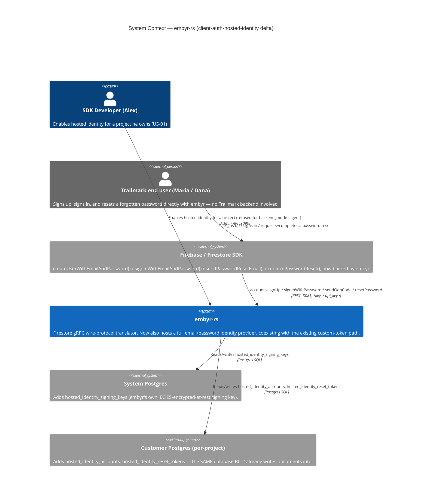
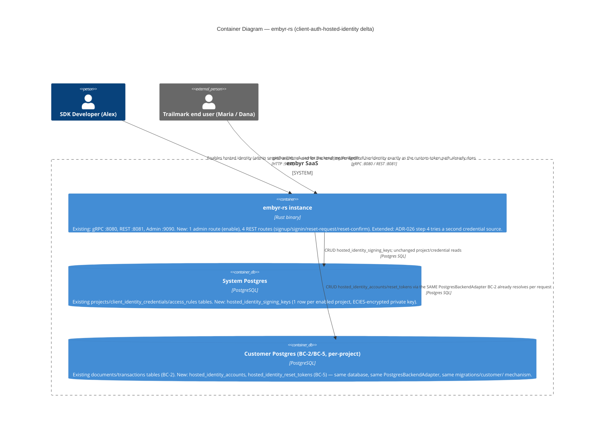
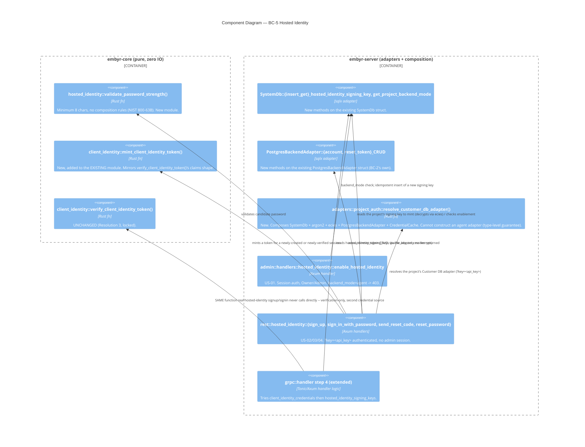

# client-auth-hosted-identity — Feature Delta

**Wave**: DISCUSS | **Agent**: Luna (nw-product-owner) | **Date**: 2026-08-27
**Status**: Ready for DESIGN handoff (with explicit escalation flags — see § Handoff Package)
**Upstream**: `client-auth` (reversed, not replaced — see § Job Discovery Framing Resolution). No DISCOVER/DIVERGE wave ran for this feature specifically.

**Framing**: this is a **strategic scope reversal**, not a routine next-epic. `client-auth`'s own DISCUSS deliberately locked v1 to custom-token-only verification and named "embyr-hosted email/password (or any other) identity provider" as an explicit, out-of-scope, candidate follow-up epic — not silently ruled out for all future work. This feature is that follow-up, commissioned explicitly by the orchestrator. Extra rigor applied throughout per that framing, especially in § Scope Assessment and § Job Discovery Framing Resolution.

---

## Wave: DISCUSS / [REF] Prior Wave Consultation — Reading Confirmation

✓ `docs/feature/client-auth/feature-delta.md` (full, 973 lines — DISCUSS + DESIGN sections) — § Job Discovery Framing Resolution read in full: quoted verbatim below as this feature's own charter. § Out of Scope's exact lines on hosted email/password and anonymous/phone/social providers quoted verbatim. § System Constraints, § Handoff Package, and the DESIGN-wave § Open Questions table read in full — `OQ-CA-03` (line 757) already explicitly named this exact reversal as a future possibility: *"embyr-hosted email/password identity provider (Framing Resolution Option B) — is it fully out of scope for all future work, or deferred-but-eventually-needed? ... triggered by future customer-segment evidence, not this feature."* This confirms the reversal was anticipated, not sprung from nowhere.
✓ `docs/product/architecture/adr-024-client-identity-verification-mechanism.md` (full) — the existing Ed25519/EdDSA verification mechanism, its `Changed Assumptions` amendment (custom-claims), and its non-impersonation Decision Driver — the hard constraint this feature must not silently violate (see § Job Discovery Framing Resolution, Resolution 3).
✓ `docs/product/architecture/adr-025-client-identity-credential-storage-rotation.md` (full) — `client_identity_credentials` table shape: `project_id` is the **PRIMARY KEY** (one row per project). Directly informs Resolution 3's rejection of colocating hosted-identity signing material in the same row.
✓ `docs/product/architecture/adr-026-client-identity-composition-with-api-key-auth.md` (full) — the additive request-composition shape (`x-embyr-client-identity` header, step 4 of `authenticate()`, stateless per-request re-verification) this feature must reuse unchanged, plus `OQ-CA-01`'s SDK-wire-format uncertainty precedent, directly reused as this feature's own `OQ-CHI-01` (see § Handoff Package).
✓ `crates/embyr-core/src/client_identity/mod.rs` (full, 571 lines) — confirms the exact current shape of `VerifiedEndUserIdentity { end_user_id, project_id, expires_at_unix, claims }` and `verify_client_identity_token(token, project_id, credential: &ClientIdentityCredential)`. Confirms the function's only external input is a caller-resolved `&ClientIdentityCredential` — meaning the pure verification function itself needs zero changes regardless of which credential source the caller resolves it from (directly informs Resolution 3).
✓ `crates/embyr-server/src/admin/handlers/auth.rs` (full, 642 lines — re-confirms `client-auth`'s own reading) — confirms the RS256/JWKS OIDC code (`oidc_callback`) is browser-session-shaped, not reusable directly (same conclusion `client-auth` reached, independently re-verified). Confirms two genuinely reusable **patterns**, not code: (1) `signin`'s Argon2id parameters (`memory=65536KiB, iter=3, par=4`, identical to `CLAUDE.md`'s stated auth standard) — directly reusable for end-user passwords, no justified reason to diverge; (2) `invalid_credentials()` — AC-3's own comment states *"wrong password → identical 401 shape to unknown email (oracle protection)"* — a directly reusable enumeration-defense pattern this feature's US-03/US-04 lock as a hard constraint.
✓ `crates/embyr-server/src/adapters/email.rs` + `crates/embyr-core/src/admin/email.rs` (both full) — confirms `IEmailSender` (ADR-011) already exists as an accepted port: `NoopEmailSender` (V1, log-only, no real delivery) is fully implemented; `SmtpEmailSender` (V2) is an explicit RED scaffold (`panic!("Not yet implemented -- RED scaffold ... V2 slice")`). Resolves Research Question 3 directly: no new email-sending mechanism is needed — reuse the existing port, and be honest that real delivery depends on a cross-feature V2 dependency already named and tracked by `docs/product/architecture/adr-011-email-sender-port.md`, not something this feature must build.
✓ `docs/product/architecture/adr-011-email-sender-port.md` (full) — confirms the port contract and the V1→V2 adapter-swap composition-root pattern this feature's US-04 reuses unchanged.
✓ `docs/product/architecture/adr-002-bounded-contexts.md` (full, including the `security-rules`-appended `Changed Assumptions` amendment) — confirms Option D's three-part test (does the candidate subsystem have an entity with identity, a lifecycle, and invariants of its own?) and BC-4 Access Control's precedent for a NEW subsystem that fails Option D's fold-into-BC-1 conclusion. Directly informs this feature's own candidate-bounded-context flag (§ System Constraints).
✓ `docs/product/jobs.yaml` (JOB-16 read in full, all 17 existing jobs' structure surveyed for the "same persona, different goal ⇒ new job" precedent — JOB-11/JOB-06, JOB-14/JOB-10, JOB-17/JOB-16 itself) — confirms JOB-16 is functionally scoped to custom-token verification only (Alex's own backend mints); directly informs § Job Discovery Framing Resolution, Resolution 4 (new job, JOB-18).
✓ `docs/product/journeys/sdk-developer.yaml` — confirms P1 Alex's job list and the established convention that a Lightweight-or-Comprehensive UX depth choice still lives inline in the feature's own `feature-delta.md`, never as a separate `journey-*.yaml`, for every feature in this codebase to date.

No contradictions found between this feature's scope and prior evidence. This is a deliberate, orchestrator-commissioned reversal of a named, explicitly-flagged-as-reversible founding exclusion — not a silent reopening. Genuine new judgment calls this reversal surfaces (storage location / network-egress fit for VPC-isolated customers, candidate bounded-context placement, SDK wire-format fidelity) are resolved as far as evidence allows and explicitly escalated where it does not — see § Job Discovery Framing Resolution and § Handoff Package.

---

## Wave: DISCUSS / [REF] Orchestrator Decisions (not re-litigated)

| # | Decision | Value |
|---|---|---|
| 1 | Feature Type | Cross-cutting — spans BC-1-adjacent admin surface, a new Customer-DB-or-System-DB-scoped end-user credential concern (flagged, not locked), and must remain structurally invisible to every downstream `custom-claims`/`security-rules*` consumer, exactly as `client-auth` was |
| 2 | Walking Skeleton | Evaluated (this wave's call): **YES, scoped narrowly** — see § Walking Skeleton Evaluation |
| 3 | UX Research Depth | **Comprehensive** (orchestrator's own call, honored) — unlike every prior Authorization epic's "Lightweight, delta on an existing journey," this is a genuinely new end-user-facing capability (Maria creates an account, types a password, can be locked out, resets it) with real emotional stakes. Full emotional-arc journey work produced below, inline per this codebase's established single-narrative-file convention (matches `security-rules`'s own precedent for Comprehensive depth staying inline, not a separate `journey-*.yaml`) |
| 4 | JTBD Analysis | Yes (default) — new job, `job_id: JOB-18` (see Resolution 4) |

### Walking Skeleton Evaluation (Decision 2)

One existing mechanism was evaluated for reuse before concluding a new walking skeleton is needed:

**`client-auth`'s own custom-token verification path** (`verify_client_identity_token()`, ADR-024/025/026). Structurally cannot be reused as-is for hosted identity: its entire non-impersonation security property rests on embyr holding only a **public** key while the **customer's own backend** holds the private key and performs authentication. Hosted identity inverts this completely — embyr itself must perform the authentication decision (verify a password), which no existing driving-port mechanism in this codebase supports for end users today. The admin-console password path (`admin/handlers/auth.rs::signin`) is the closest structural precedent, but it authenticates a human account operator into a browser session — a different persona, a different credential table, a different response contract.

**Verdict**: no existing driving-port mechanism can be extended to perform end-user password authentication. A walking skeleton is needed, scoped to the thinnest end-to-end slice that proves the two riskiest new assumptions: (a) a project can opt into hosted identity and (b) a hosted-identity account can sign up and sign in, resolving to the identical `VerifiedEndUserIdentity` type `client-auth`'s path already produces (§ Story Map, Slices 01-03).

---

## Wave: DISCUSS / [REF] Job Discovery — Framing Resolution

This feature reverses one named line from `client-auth`'s own § Out of Scope, quoted verbatim as this feature's charter:

> "**embyr-hosted email/password (or any other) identity provider** — explicitly deferred per § Framing Resolution's locked (A) custom-token-only scope. Flagged as a candidate follow-up epic, not silently ruled out for all future work (see confidence/escalation note) and not built here."
>
> "**Anonymous auth, phone auth, social OAuth providers** — same reasoning as hosted email/password (a customer-hosted-identity expansion, not a verification-of-an-externally-minted-token capability); deferred, not built here."

`client-auth`'s own confidence/escalation note on this exact question, quoted verbatim: *"the ceiling — 'embyr-hosted email/password is fully out of v1 scope, not just deferred to a later release of this feature' — is medium-high, not full, confidence. This could not be closed from repository evidence alone... flagged for redirect if the actual customer-segment evidence (once available) points the other way."* This DISCUSS treats that flag as now actioned by explicit orchestrator commission (this feature's own raw ask), not as newly-discovered evidence — the underlying customer-segment question (does Firebase's built-in email/password provider block real migrations) remains as open today as `client-auth` left it; this feature does not manufacture new market evidence to close it, it builds the capability the orchestrator has decided to commission regardless.

Four sub-resolutions were required to scope this feature responsibly. Each is evidenced below; two carry unresolved, security-consequential judgment calls that are explicitly escalated rather than silently decided (per this feature's own explicit instruction not to guess on password storage, token minting, or session/reset-flow security).

### Resolution 1 — v1 scope: what concretely ships in THIS feature

| Option | Description | Fit against evidence |
|---|---|---|
| **(A) Full Firebase parity** | Signup + signin + password reset + email verification + account lifecycle (disable, delete, list end-user accounts, force-logout) | **Rejected as v1.** Mirrors exactly the reasoning `client-auth` itself used to reject building the *whole* Auth SDK surface at once (Option B's original rejection: "a new PII storage class... a new breach-notification and GDPR-erasure surface... comparable in scope to the 642-line admin-console `auth.rs`"). Email verification and account lifecycle each have their own state machine and no named urgency in any job story. |
| **(B) Core hosted identity — signup + signin + password reset only** | The three flows the raw ask names explicitly ("real Firebase Auth's own email/password provider: signup..., sign-in..., password reset, and (critically) the resulting identity is INDISTINGUISHABLE... from a custom-token-verified identity") | **Accepted.** Password reset is cheap to include because `IEmailSender` (ADR-011) already exists as an accepted port with a working V1 (`NoopEmailSender`) — the reset flow can lock its full *observable behavior* (single-use token, oracle-protected request response) without needing to build a new email mechanism. Email verification and account lifecycle are explicitly deferred (§ Out of Scope) — genuinely separable, no evidenced urgency, keeps the feature right-sized (§ Scope Assessment). |
| **(C) Signup + signin only, defer reset too** | Smallest possible slice | **Rejected — unnecessarily conservative.** Reset would otherwise become its own future DISCUSS wave for marginal savings (ADR-011 makes it nearly free to scope now), and a hosted-identity feature that cannot recover a forgotten password is not credibly "real Firebase Auth parity" per the raw ask's own framing. |

**Resolution**: **(B)**. This is the v1 scope locked by this DISCUSS.

### Resolution 2 — Where do hosted-identity credentials live, and does embyr's own SaaS layer necessarily see plaintext end-user passwords over the network?

This is the genuinely new, security-consequential finding this DISCUSS surfaces — **not fully resolved here, explicitly escalated.**

| Option | Description | Evidence |
|---|---|---|
| **(A) System DB, project-scoped table** (mirrors `users`/`sessions`, but keyed by `(project_id, email)` instead of cross-project) | Simplest; no new kind of inter-context relationship (BC-1 already owns System DB exclusively per ADR-002) | Reintroduces the SAME concern `client-auth`'s own Framing Resolution used to reject Option B originally: "a new PII storage class (passwords for potentially millions of end users across every customer)... in embyr's own System DB." |
| **(B) Customer DB, project-scoped** | Matches `VerifiedEndUserIdentity`'s existing per-project scope; keeps a customer's end-user PII inside the customer's OWN Postgres, not commingled with embyr's cross-customer System DB — directly strengthens the audit-evidence posture JOB-04 (Riley, credential-isolation)/JOB-09 (agent-auditproof) already value | Architecturally novel: BC-2 Document Storage is currently the *only* bounded context with a **write** dependency into Customer DB (ADR-002 § Context Map). A new subsystem writing hosted-identity rows into Customer DB is a genuinely new *kind* of inter-context relationship, not merely a new instance of an already-sanctioned kind (contrast BC-4's read-only dependency on BC-2, explicitly called out in ADR-002's own `security-rules` amendment as *not* a new kind) |
| **(C) Either, gated by `backend_mode`** | Hosted identity available only for `backend_mode=direct_pg`/`cloud_secret`, explicitly refused for `backend_mode=agent` | Directly addresses the network-egress finding below, at the cost of a real capability gap for the agent-mode segment |

**The load-bearing finding, independent of which storage option is chosen**: regardless of at-rest location, **embyr's own SaaS servers must receive and process plaintext end-user passwords over the network on every signup/signin/reset call**, because Argon2id verification has to run *somewhere*, and that somewhere is embyr's own request-handling code — not the customer's own infrastructure. For a `backend_mode=agent` deployment (JOB-04's Riley, JOB-09's audit-proof claim), the entire point of the agent topology is that **no credential-bearing material crosses the VPC boundary to embyr SaaS**. Hosted-identity end-user passwords are exactly that class of material. This means **JOB-04's "zero credential egress" claim cannot be structurally preserved for hosted-identity end users on an agent-mode project, regardless of where the password hash is ultimately stored** — the storage-location question (A vs. B above) does not resolve this network-egress question; a different, genuinely new architectural investment (password verification running inside the agent itself, not embyr SaaS) would be required to preserve it, and that is a materially larger change than this feature's own scope.

**Resolution**: this DISCUSS locked the network-egress/gating question at the time of writing only provisionally; **confirmed by the orchestrator, 2026-08-27**: **Option (C) is locked — hosted identity is gated to `backend_mode=direct_pg`/`cloud_secret` projects only, explicitly refused for `backend_mode=agent`.** This preserves JOB-04 (Riley)/JOB-09's "zero credential egress" guarantee for the agent-mode segment by construction — that segment is simply not offered this capability in v1, rather than shipping a guarantee regression or a warning-only mitigation. Combined with storage location **(B) Customer DB** (this DISCUSS's own best-evidence lean, now adopted as the paired decision — PII-isolation and per-project-scope-consistency, matching `VerifiedEndUserIdentity`'s existing per-project scope). **DESIGN must implement an explicit `backend_mode` check that refuses hosted-identity enablement (US-01) outright for agent-mode projects — not a soft warning, not an opt-in override.** No longer an open escalation.

### Resolution 3 — Token/session issuance: does hosted identity produce a `VerifiedEndUserIdentity` through the existing `verify_client_identity_token()` unchanged?

| Option | Description | Verdict |
|---|---|---|
| **(A) Disjoint, embyr-owned signing key, same token shape** | embyr auto-generates its own project-scoped Ed25519 keypair when Alex enables hosted identity (US-01), stored in a **new, separate table** — never colocated with the customer-registered `client_identity_credentials` row (ADR-025's `project_id` is a PRIMARY KEY; one row per project already, holding the customer's OWN public key for the custom-token path). embyr mints a JWT in the identical `sub`/`aud`/`exp` shape (ADR-024) after a successful signup/signin, signed with its own private key. `verify_client_identity_token()` itself needs **zero code changes** — it already takes a caller-resolved `&ClientIdentityCredential` as a parameter; the caller simply resolves it from the hosted-identity table instead of (or in addition to) the customer-registered one | **Accepted.** Directly satisfies "coexist, don't replace." |
| **(B) Reuse the SAME `client_identity_credentials` row** | Store embyr's own hosted-identity signing key in the same row the customer registers their public key into | **Rejected — concrete security violation, not a style preference.** For a project using BOTH custom-token and hosted identity, this would require embyr to custody a private key that verifies against the SAME public key Trailmark's own backend uses to prove custom-token authenticity — silently granting embyr the ability to forge a token indistinguishable from one Trailmark's own backend minted, for that project's custom-token path too. This directly violates ADR-024's locked, high-confidence non-impersonation Decision Driver ("embyr must never hold anything that lets it mint a token that verifies as authentic for a project it does not control"). Named explicitly here and rejected — not merely omitted — because the risk of a well-intentioned DESIGN engineer reaching for "just reuse the existing table" is real given how closely the two flows resemble each other. |
| **(C) Entirely separate session mechanism** (opaque server-side session, admin-console-style, bypassing JWT verification and ADR-026's composition path entirely) | Would require a NEW request-path integration point (the existing `x-embyr-client-identity` header + step 4 of `authenticate()` is JWT-shaped by construction) — a second parallel mechanism `custom-claims`/`security-rules*`'s five call sites would need to learn about | **Rejected as unnecessary** given (A) achieves full reuse of the existing composition path and domain type with a smaller design footprint. |

**Resolution**: **(A)**, with **(B) explicitly named and rejected** as a hard constraint DESIGN must not silently reach for. Exact schema (table name, column shapes) is DESIGN's call — this DISCUSS locks only that the two credential sources must be **structurally disjoint entities**, never sharing a row or a custody boundary.

### Resolution 4 — job_id: extend JOB-16, or a new job?

JOB-16's own functional dimension is explicit: *"Alex's own backend mints a per-end-user token; the SDK's existing `signInWithCustomToken()` call, now backed by embyr, resolves it..."* — JOB-16's entire mental model assumes Trailmark's own backend performs authentication. Hosted identity's mental model is materially different: **Trailmark's end users create an account directly with embyr — no Trailmark backend is in the authentication loop at all.** This mirrors exactly the reasoning this project's own precedent already applied for "same persona, different goal ⇒ new job" (JOB-11 vs. JOB-06, JOB-14 vs. JOB-10, and — most directly — **JOB-17 vs. JOB-16 itself**, a new job for the same persona P1 Alex when the goal changed from "establish identity" to "authorize access").

**Resolution**: **new job, `JOB-18` (`embyr-hosted-identity`)**. JOB-16 receives a cross-reference NOTE (not a rewrite), mirroring the established pattern.

---

## Wave: DISCUSS / [REF] Persona & Job

**Persona**: **P1 — Alex, SDK Developer** (existing persona). Unchanged from `client-auth`: Alex is still the one who "hires" this capability and integrates it into his app. Maria's/Dana's devices still call embyr's endpoints directly (exactly as they already do for `signInWithCustomToken` in the custom-token flow) — this does not change the persona framing, only *who performs the authentication decision*.

**Domain-example company**: **Trailmark** (unchanged continuity). For this feature, Trailmark is reframed slightly for domain-example purposes as **not yet having its own backend user-identity system** — the concrete instantiation of the segment JOB-18 serves (distinct from `client-auth`'s own Trailmark instantiation, which explicitly *did* have its own backend). This is a deliberate, evidenced narrowing, not a contradiction: real companies vary, and JOB-18 exists precisely for the sub-segment JOB-16 cannot serve.

**Segment-fit warning (not a persona, a constraint)**: **P4 — Riley (CISO, credential-isolation, JOB-04/JOB-09)** is named explicitly here as a customer segment for whom this capability carries real, evidenced risk — see § Job Discovery Framing Resolution, Resolution 2. Riley is not this feature's target user; Riley is the segment DESIGN must not silently expose to a network-egress regression.

**job_id decision (Resolution 4)**: `JOB-18` (`embyr-hosted-identity`), new job, same persona P1 Alex, distinct goal from JOB-16.

```yaml
# Added to docs/product/jobs.yaml — see § SSOT Updates
- id: JOB-18
  name: embyr-hosted-identity
  persona: P1
  feature: client-auth-hosted-identity
  job_story: >
    When my app's end users have no existing account with any backend I operate — no
    backend of my own to mint a custom token from — I want them to create and sign in
    to an account directly with embyr using email and password, so my end users get
    the same self-service signup Firebase's built-in email/password provider gave
    them, without me having to build and operate my own identity backend just to
    unblock migration.
  dimensions:
    functional: >
      Maria signs up/signs in directly with embyr via the SDK's existing
      createUserWithEmailAndPassword()/signInWithEmailAndPassword() calls; her
      session resolves to the identical VerifiedEndUserIdentity type client-auth's
      custom-token path already produces; she can reset a forgotten password
      without contacting Alex
    emotional: >
      Alex feels he doesn't have to become his own end-user-identity operator just
      to finish migrating; Maria feels signing up, signing in, and resetting a
      password is as simple and trustworthy as any other app she has used
    social: >
      Alex can tell his own team "we didn't have to stand up a whole auth backend
      just to migrate off Firebase"; Trailmark's end users never notice anything
      different about creating an account
  four_forces:
    push: >
      Trailmark (and any embyr customer with no existing backend user database of
      its own) cannot adopt client-auth's custom-token path at all — there is no
      backend to mint a token from — so JOB-16 alone leaves this segment fully
      blocked from migrating
    pull: >
      embyr-hosted signup/signin/reset, wire-compatible with the SDK's existing
      Auth methods, gives this segment the same zero-backend-required experience
      Firebase's built-in provider already gave them
    anxiety: >
      "If embyr becomes my end users' identity provider, embyr now sees and stores
      something about my users I used to control entirely myself" — partly
      mitigated by oracle-protected responses and Argon2id-parameter reuse, but the
      deeper anxiety (does hosting my users' passwords change my own VPC-isolation
      security posture) is NOT fully resolved by this feature — see Job Discovery
      Framing Resolution, Resolution 2
    habit: >
      Real Firebase apps commonly use the built-in email/password provider as
      their PRIMARY identity mechanism — more common in the wild than custom
      tokens, per client-auth's own Framing Resolution — so Alex expects
      createUserWithEmailAndPassword()/signInWithEmailAndPassword() to just work,
      not to require a bespoke bridge
  opportunity_score: 13
  priority: high
```

**Opportunity scoring**: Importance = 7 (blocks a real, evidenced customer segment — apps with *no* existing backend identity system — from migrating at all; narrower than JOB-16's "every multi-user app" since JOB-16 already unblocks apps that *do* have a backend). Satisfaction = 1 (zero support exists; a named, deliberate exclusion just reversed by explicit commission). Opportunity = 7 + (7−1) = **13**. Priority: **high** (not critical — a narrower segment than JOB-16 was).

---

## Wave: DISCUSS / [REF] Scope Assessment (Elephant Carpaccio Gate)

Per this feature's own explicit instruction, this gate is run with extra rigor given the "strategic scope reversal" framing.

| Signal | Threshold | This feature (with Resolution 1's v1 scope locked) | Fired? |
|---|---|---|---|
| User stories | >10 | 4 (US-01 through US-04) — validation/edge cases folded as UAT scenarios within stories, not spun into separate stories, mirroring `client-auth`'s own convention | **NO** |
| Bounded contexts / modules | >3 | ~2 — a BC-1-adjacent admin action (US-01, mirrors `client-auth`'s own extension) + one candidate NEW subsystem (hosted end-user Account entity — flagged, not locked, § System Constraints) | **NO** |
| Walking Skeleton integration points | >5 | 3 — admin enable (US-01) + hosted signup (US-02) + hosted signin (US-03) | **NO** |
| Estimated effort | >2 weeks | 4 slices, ~1.4 days average ≈ **6 days** (see § Elephant Carpaccio Slices) | **NO** |
| Independent shippable outcomes | multiple | **NO** — signup+signin (US-02/US-03) are two halves of one outcome, exactly like `client-auth`'s US-01/US-02 pairing (a hosted account nothing can sign into is inert; a signin path with nothing signed up is untestable). Password reset (US-04) is a genuinely separable Release-2 enhancement, normal sequencing, not a second walking-skeleton-level outcome | **NO** |

**0 of 5 signals fired.** **Verdict: PASS — right-sized, once Resolution 1's tightened v1 scope (email verification and account lifecycle explicitly deferred) is applied.** This is an honest finding, not a foregone conclusion: had Resolution 1 landed on Option (A) full-Firebase-parity, this gate would very likely have fired on both story-count and effort signals, and this DISCUSS would have recommended a genuine multi-feature split (e.g., "hosted-identity-core" vs. "hosted-identity-verification-and-lifecycle" as separate features). Because ADR-011's existing `IEmailSender` port made password reset cheap to include and email-verification/account-lifecycle were cleanly separable with no evidenced urgency, one right-sized feature suffices. No split needed.

---

## Wave: DISCUSS / [REF] Journey (Comprehensive, per Decision 3 — inline per this codebase's convention)

Decision 3 = Comprehensive: unlike every prior Authorization epic's Lightweight "system-flow" journey, this feature has a genuine end-user-facing emotional arc (Maria creates an account, types a password, can be locked out, resets it) worth mapping in full, in addition to Alex's lighter admin-side flow.

### Alex's sub-journey: enabling hosted identity (Slice 01)

```
Alex calls the admin API to enable hosted identity for trailmark-prod
        │
        ▼
   Does project trailmark-prod exist and is Alex's admin credential valid?
        │
   no / invalid ─────────────┐                yes
        │                     │                 │
        ▼                     │                 ▼
  404 (no such project) or    │      Is hosted identity already enabled
  401 (bad admin credential)  │      for trailmark-prod?
        │                     │                 │
        │                     │        ┌────────┼────────┐
        │                     │       yes                no
        │                     │        │                  │
        │                     │        ▼                  ▼
        │                     │   200 — idempotent,   201 — hosted identity
        │                     │   no-op, no new key    enabled; embyr's own
        │                     │   generated            signing key generated
        │                     │        │               and stored server-side;
        └─────────────────────┴────────┴────────────── no signing material
                                                          echoed back
```

Emotional arc: **entry — mildly curious** (a new admin toggle, low stakes, mirrors the tone of every other admin-API action Alex has already used) → **exit — confidently unblocked** ("now my users who have no backend of their own can just sign up"). No anxiety spike — this is a low-consequence, reversible-feeling action from Alex's own vantage point (the real, higher-stakes anxiety belongs to Maria's sub-journey and to Resolution 2's unresolved segment-fit question, not to this step).

### Maria's sub-journey: signup → signin → (later) forgotten-password reset

```
Maria opens Trailmark for the first time; Trailmark's app calls the SDK's
existing createUserWithEmailAndPassword(auth, maria@email.com, "•••••••")
— an unchanged SDK method, now backed by embyr
        │
        ▼
   Is hosted identity enabled for trailmark-prod (Alex's Slice 01 step)?
        │
   no ──────────────┐                            yes
        │            │                             │
        ▼            │            Is maria@email.com already registered
  Signup rejected,   │            on trailmark-prod?
  distinguishable    │                             │
  from a bad-         │                 ┌───────────┼───────────┐
  credential reason   │                yes                       no
        │             │                 │                         │
        │             │                 ▼                         ▼
        │             │         "email already          Does the password meet
        │             │         registered" — this      the minimum strength
        │             │         is a signup-time         requirement?
        │             │         reveal, matching real     │
        │             │         Firebase's own            ┌────┴────┐
        │             │         createUserWithEmail       no        yes
        │             │         AndPassword() behavior     │          │
        │             │                 │                  ▼          ▼
        │             │                 │            "password    Account created;
        │             │                 │            too weak",   session
        │             │                 │            naming the   established
        │             │                 │            requirement  immediately —
        └─────────────┴─────────────────┴──────────────────────── Maria's
                                                                     subsequent
                                                                     getDoc succeeds,
                                                                     carrying her
                                                                     verified identity

  ── Later, a different day: Maria forgot her password ──

Trailmark's app calls sendPasswordResetEmail(auth, maria@email.com)
        │
        ▼
  Always the SAME generic response ("if this account exists, a reset
  was sent") regardless of whether maria@email.com is actually registered
  — no account-enumeration leak, mirroring the admin console's own
  established oracle-protection convention
        │
        ▼
  Maria's app calls confirmPasswordReset(auth, oobCode, newPassword)
  with the token from her (V1: logged, not yet actually delivered —
  see § System Constraints) reset message
        │
   ┌────┴─────┬──────────────┬───────────────┐
   │           │              │               │
 valid,     expired        already        new password
 unexpired,  token          used           too weak
 unused                     token
   │           │              │               │
   ▼           ▼              ▼               ▼
 password    rejected,     rejected        rejected,
 updated;    distinguish-  (single-use     naming the
 Maria can   able from     enforced)       requirement
 sign in     malformed/
 again with  used
 the new
 password
```

Emotional arc (Maria, comprehensive):
- **Signup — entry: mildly wary** ("another account, another password to remember") → **exit: relieved/confident** (it worked in one step, felt exactly like every other app she's used — no unfamiliar friction).
- **Signin — entry: neutral/routine** (this is now an established habit) → **exit: confident** (fast, unsurprising).
- **Password reset — entry: frustrated/anxious** (she's locked out, possibly worried her account or data is now inaccessible) → **middle: uncertain** (waiting on an email that, in V1, is not actually delivered yet — a real, honestly-flagged gap, see § System Constraints) → **exit: relieved** once complete. This is the highest-tension point in Maria's arc, and the one place a jarring transition is most likely if the V1 email-delivery gap is not communicated honestly to Alex (who needs to know his users cannot *actually* receive a reset email until the `SmtpEmailSender` V2 adapter lands) — flagged explicitly, not glossed over.

### Shared artifact

| Artifact | Source of truth | Consumers | Integration risk |
|---|---|---|---|
| Hosted-identity enablement flag + embyr-owned signing key | New table, disjoint from `client_identity_credentials` (storage location — System DB vs. Customer DB — flagged, not locked; see Resolution 2) | Signup handler (US-02), signin handler (US-03), password-reset handlers (US-04) | **HIGH** — must never be colocated with the customer-registered `client_identity_credentials` row (Resolution 3); if the enablement check and the token-minting step read from independently-maintained copies, they can drift |
| End-user account record (email, Argon2id password hash) | Same new table/store as above, or a sibling table | Signup (create), signin (verify), reset (update hash) | **HIGH** — must reuse the exact Argon2id parameters already established (`memory=65536KiB, iter=3, par=4`); a divergent parameter set for end-user vs. admin passwords would be an unjustified, un-evidenced technology choice |

### Failure modes (feeds DISTILL scenario generation)

- Alex forgets to enable hosted identity before Trailmark ships a signup screen — Maria's very first attempt must fail with a reason distinguishable from "bad credentials," not a generic 500.
- A weak-password check that is too lax lets Maria create an easily-guessed password; too strict and she abandons signup in frustration — exact strength requirement is DESIGN's call, but the requirement must be named in the rejection reason, not opaque.
- Sign-in failure responses that DO distinguish wrong-password from unknown-email would let an attacker enumerate Trailmark's real end-user emails — must not happen (direct reuse of the admin console's own established defense).
- A password-reset token that can be replayed (reused) or that never expires is a standing account-takeover risk — must be single-use and time-bounded.
- An ordinary Firestore call from a session that never signed in via ANY path (hosted or custom-token) must not regress — this feature extends `client-auth`'s own AC-16-08 guardrail, it does not reopen it.

---

## Wave: DISCUSS / [REF] Story Map & Walking Skeleton

**Persona**: P1 Alex | **Goal**: Give Trailmark's end users a way to create and sign in to an embyr-hosted account directly — with no backend of Trailmark's own required — resolving to the identical verified-identity type `client-auth`'s custom-token path already produces.

### Backbone

| A. Alex Enables Hosted Identity | B. Maria Establishes Her Account | C. Maria Recovers Access Over Time |
|---|---|---|
| Alex enables hosted identity for `trailmark-prod` **[WS]** | Maria signs up with email + password; her session is immediately verified **[WS]** | Maria requests a password reset without contacting Alex |
| | Maria signs in on a later visit; her session carries her identity onto Firestore calls **[WS]** | Maria completes the reset with a single-use, time-bounded token |
| | Signup/signin failures are rejected without leaking account existence **[WS]** | |

### Walking Skeleton

One task from each activity, thinnest end-to-end happy path: Alex enables hosted identity for `trailmark-prod` (Activity A); Maria signs up with a fresh email + a password meeting the strength requirement, her session is established immediately and her subsequent `getDoc` call succeeds carrying her verified identity; on a later visit she signs in again with the same credential and the same guarantee holds; a session that never signed in via any path continues to succeed unaffected (Activity B). This is Slices 01-03's happy-path-plus-guardrail scenarios — real project/table state, no facade.

### Release 1 — Hosted Identity Works End-to-End (Slices 01-03, US-01, US-02, US-03)

Outcome: any Trailmark end user with no backend identity system of their own can create and use an embyr-hosted account, resolving to the same verified-identity type the custom-token path already produces.

### Release 2 — Self-Service Recovery (Slice 04, US-04)

Outcome: Maria can recover a forgotten password without contacting Alex, using the existing `IEmailSender` port — honestly scoped to the port's own current V1 (log-only) delivery reality.

---

## Wave: DISCUSS / [REF] Elephant Carpaccio Slices

| Slice | Story | Release | Estimate | Learning Hypothesis (disproves) | Production-data taste test |
|---|---|---|---|---|---|
| 01 (WS) | US-01 | 1 | 1 day | An "enable hosted identity" admin action cannot auto-generate and safely custody its own project-scoped signing key, structurally disjoint from `client_identity_credentials`, using the existing admin-API conventions without inventing a new pattern | Real admin Bearer credential, real project row, real generated keypair — no synthetic exception |
| 02 (WS) | US-02 | 1 | 2 days (includes the SDK-wire-format spike, see below) | A hosted signup flow cannot mint a token verified through the EXISTING `verify_client_identity_token()` unchanged without either reusing the customer's own registered credential (a security violation, Resolution 3) or requiring changes to the pure verification function itself; separately, `createUserWithEmailAndPassword()` may not be pointable at a non-Google backend the same opacity-permissive way `signInWithCustomToken()` was (mirrors `OQ-CA-01`) | Real Argon2id-hashed account row, real minted token in each rejection state (already-registered email, weak password, hosted-identity-not-enabled) — no synthetic mock |
| 03 (WS) | US-03 | 1 | 1 day | Hosted sign-in cannot share the identical oracle-protected rejection response shape the admin console's own password path already established, without either duplicating that logic or an awkward cross-module dependency | Real wrong-password and real unknown-email attempts checked against the real handler, asserting byte-identical response shape |
| 04 | US-04 | 2 | 1.5 days | A password-reset flow cannot be built on the existing `IEmailSender` port without the "reset requested" step leaking account-existence information via response-shape or timing differences | Real reset-token table, real Argon2id re-hash on completion, real `NoopEmailSender` call (V1) — no synthetic bypass of the enumeration-defense check |

**Total estimate: ~5.5 days.**

**Taste tests applied**:
- "4+ new components per slice" — Slice 01: admin handler + signing-key generation/storage (2). Slice 02: signup handler + account storage + token minting (3). Slice 03: signin handler + oracle-protected rejection reuse (2, builds on Slice 02's storage). Slice 04: reset-request handler + reset-token storage + reset-confirm handler + `IEmailSender` call site (4 — borderline, flagged honestly: request and confirm are two ends of one indivisible user-facing capability sharing one table; splitting further would ship a request-only half nobody could ever complete). PASS, with Slice 04 noted as borderline-but-justified.
- "Every slice depends on a new abstraction" — Slice 01 is the one genuinely new abstraction (the hosted-identity signing key + enablement flag); Slices 02-04 build on it, none introduces a second new abstraction independently. PASS — mirrors `client-auth`'s own precedent exactly.
- "No slice disproves a pre-commitment" — each has a distinct, falsifiable hypothesis (see table). PASS.
- "Synthetic-data-only slices prove plumbing, not value" — N/A; all 4 slices require real Argon2id hashing, real table state, real token minting/verification. PASS.
- "2+ slices identical except for scale" — none; each targets a distinct mechanism (enable vs. signup vs. signin vs. reset). PASS.

---

## Wave: DISCUSS / [REF] Prioritization

| Priority | Slice | Target Outcome | Rationale |
|---|---|---|---|
| 1 | Slice 01 (WS) | A project can opt into hosted identity | Walking Skeleton first — without enablement, nothing downstream has anywhere to write to or verify against |
| 2 | Slice 02 (WS) | An account can be created and immediately resolves to a verified identity | Highest-uncertainty slice (SDK wire-format spike bundled in) — burns down the riskiest new assumption first, per riskiest-assumption-first discipline |
| 3 | Slice 03 (WS) | A returning end user can sign in with the same guarantee | Closes the Walking Skeleton loop; lower uncertainty than Slice 02 since it reuses Slice 02's storage and minting logic |
| 4 | Slice 04 | Self-service password recovery | Highest-leverage for Maria's own trust in the capability, but correctly sequenced last — depends conceptually on Slice 02/03's account and credential storage existing, and is independently shippable as Release 2 |

---

## Wave: DISCUSS / [REF] System Constraints

- **Coexists with, does not replace, `client-auth`'s custom-token path.** Both resolve to the identical `VerifiedEndUserIdentity` type. A project may have EITHER or BOTH enabled simultaneously. The two identity-establishment paths produce **two disjoint end-user account namespaces** per project — there is no automatic linking or migration between a custom-token-minted `end_user_id` and a hosted-identity account (see § Out of Scope).
- **Hard constraint (Resolution 3, non-negotiable):** hosted identity's own signing/session material MUST be stored as a structurally disjoint entity from `client_identity_credentials` (ADR-024/025) — never colocated, never sharing a row or a custody boundary. Reusing the same row would silently grant embyr the ability to forge tokens indistinguishable from Trailmark's own custom-token-minted ones for that project, violating ADR-024's locked non-impersonation guarantee. DESIGN must not reach for this shortcut even though the two flows resemble each other closely.
- **Password hashing MUST reuse the existing Argon2id parameters** (`memory=65536KiB, iter=3, par=4`, `admin/handlers/auth.rs::signin`) — no justified reason to diverge for end-user passwords.
- **Oracle protection MUST carry through, direct reuse of an already-accepted pattern.** Sign-in failure responses (US-03) and password-reset-request responses (US-04) MUST NOT distinguish "wrong credential" from "unknown email" — directly reuses `admin/handlers/auth.rs::invalid_credentials()`'s own established AC-3 convention ("wrong password → identical 401 shape to unknown email (oracle protection)"). Signup failures (US-02) are the one deliberate exception — real Firebase's own `createUserWithEmailAndPassword()` reveals "email already exists" at signup time, and this feature mirrors that, since signup inherently requires it to be useful.
- **RESOLVED (Resolution 2, confirmed by the orchestrator 2026-08-27):** hosted identity is stored in **Customer DB**, project-scoped, and is **structurally gated to `backend_mode=direct_pg`/`cloud_secret` projects only** — `backend_mode=agent` projects are refused enablement outright (US-01 must implement this check, not a soft warning). This preserves the "zero credential egress" claim JOB-04 (Riley)/JOB-09 rely on by construction: the agent-mode segment is simply not offered this capability in v1, since no storage-location choice alone could otherwise preserve that guarantee once plaintext passwords necessarily transit embyr's own SaaS servers for Argon2id verification.
- **Candidate new bounded-context subsystem, flagged not locked.** The hosted end-user Account entity has an identity (`(project_id, email)`), a lifecycle (create → reset → [deferred: disable/delete]), and invariants of its own (uniqueness, password-strength rules) — it passes ADR-002's own Option-D three-part test the same way `security-rules`'s `AccessRule` did when BC-4 Access Control was added. Exact bounded-context placement is DESIGN's call; this DISCUSS only flags that the same test applies and that folding it silently into BC-1 without applying that test would repeat the exact reasoning gap ADR-002's own `Changed Assumptions` amendment already corrected once.
- **SDK wire-format empirical uncertainty (mirrors `OQ-CA-01`, likely more acute here).** Whether the Firebase JS SDK's `createUserWithEmailAndPassword()`/`signInWithEmailAndPassword()`/`sendPasswordResetEmail()`/`confirmPasswordReset()`, when pointed at a non-Google backend, POST to URLs embyr controls the shape of, or fixed Identity-Toolkit-specific REST paths (`accounts:signUp`, `accounts:signInWithPassword`, `accounts:sendOobCode`) it must replicate exactly, cannot be confirmed from this codebase alone. This is squarely the same class of uncertainty as `OQ-CA-01`, `OQ-02`, `OQ-03` — not blocking DESIGN's logical contract, but a required empirical spike before DELIVER (see § Handoff Package, flag 5).
- **Honest V1 delivery gap.** Password-reset "send" (US-04) reuses `IEmailSender` (ADR-011), whose only implemented adapter today is `NoopEmailSender` (log-only). Real email delivery depends on the already-named, already-tracked `SmtpEmailSender` V2 slice landing — a cross-feature dependency, not something this feature must build, but something Alex must be told honestly (his users cannot actually *receive* a reset email until that V2 adapter ships).
- Ubiquitous language introduced: **hosted identity** (the enablement flag + capability), **hosted-identity account** (Maria's email+password-backed account, distinct from a custom-token `end_user_id`), **reset token** (single-use, time-bounded credential-recovery artifact). These terms should carry forward into DESIGN's naming.

---

## Wave: DISCUSS / [REF] User Stories

<!-- markdownlint-disable MD024 -->

### US-01: Alex Enables Hosted Email/Password Identity For Trailmark

**job_id**: JOB-18
**Slice**: 01 (Walking Skeleton) | **Release**: 1

#### Elevator Pitch
Before: Trailmark has no backend of its own to mint a custom token from, so `client-auth`'s existing verification path is unusable for Trailmark's end users — Alex has no way to let them create an account at all.
After: call the admin API's hosted-identity-enable action (exact endpoint shape DESIGN's call) → sees a 201 confirming hosted identity is now active for the project, with no signing material of any kind in the response.
Decision enabled: Alex knows his app's signup/signin screens can now call embyr directly, instead of waiting on a custom-token backend he doesn't have and doesn't want to build.

#### Domain Examples
1. **Happy Path**: Alex enables hosted identity for `trailmark-prod` via the admin API, using Trailmark's admin Bearer credential. Sees 201; embyr has generated and stored its own project-scoped signing key server-side; nothing is echoed back.
2. **Edge Case**: Alex, unsure whether his earlier request succeeded, submits the enable request a second time for `trailmark-prod`. Sees 200, idempotent no-op — no second signing key is generated, no error.
3. **Error/Boundary**: Alex submits the enable request for `trailmark-staging-old`, a project that has since been deleted. Sees 404.

#### UAT Scenarios (BDD)

##### Scenario: First-time enablement succeeds and generates embyr's own signing key without echoing it back
Given project `trailmark-prod` exists and does not yet have hosted identity enabled
When Alex enables hosted identity using a valid admin Bearer credential
Then hosted identity becomes active for the project, and the response confirms success without including any signing material

##### Scenario: Enabling an already-enabled project is idempotent, not an error
Given project `trailmark-prod` already has hosted identity enabled
When Alex submits another enable request for the same project
Then the request succeeds with no error, and no new signing key is generated

##### Scenario: Enablement without valid admin credentials is rejected
Given project `trailmark-prod` exists
When Alex submits an enable request with a missing or invalid admin Bearer credential
Then the request is rejected the same way any other admin endpoint rejects missing/invalid credentials

##### Scenario: Enablement against a non-existent or deleted project is rejected
Given project `trailmark-staging-old` does not exist or has been deleted
When Alex submits an enable request for it
Then the request is rejected as not found

#### Acceptance Criteria
- [ ] AC-18-01: Valid enablement returns 201; hosted identity becomes active for the project; no signing material appears in the response.
- [ ] AC-18-02: A second enablement request for an already-enabled project succeeds idempotently — no error, no duplicate signing key.
- [ ] AC-18-03: Missing or invalid admin Bearer credential returns 401.
- [ ] AC-18-04: Enablement for a non-existent or deleted project returns 404.

#### Outcome KPIs
See § Outcome KPIs below (feeds KPI #1, North Star).

#### Technical Notes (Optional)
Exact endpoint path, storage location for the generated signing key (System DB vs. Customer DB — see § Job Discovery Framing Resolution, Resolution 2, UNRESOLVED), and exact key-generation mechanism are DESIGN's call. Hard constraint: MUST be a structurally disjoint entity from `client_identity_credentials` (Resolution 3) — never the same table/row.

---

### US-02: Maria Signs Up For A Trailmark Account Directly With Embyr

**job_id**: JOB-18
**Slice**: 02 (Walking Skeleton) | **Release**: 1

#### Elevator Pitch
Before: Trailmark has no backend user database, and embyr's only identity mechanism (`client-auth`) requires one — Maria has no way to create an account at all.
After: call the SDK's existing `createUserWithEmailAndPassword(auth, "maria.santos@example.com", "correct-horse-battery")` — an unchanged SDK method, now backed by embyr — → sees the signup resolve successfully, and her subsequent `getDoc` call succeeds, carrying her verified end-user identity.
Decision enabled: Alex knows Trailmark's signup screen works end-to-end without him operating any identity backend of his own.

#### Domain Examples
1. **Happy Path**: Maria Santos, a first-time Trailmark user, signs up with `maria.santos@example.com` and a password meeting the strength requirement, on `trailmark-prod` (hosted identity already enabled). Signup succeeds; her session is immediately verified; her subsequent `getDoc` on her own trip-journal document succeeds.
2. **Edge Case**: Dana Kim tries to sign up with `dana.kim@example.com`, an email already registered on `trailmark-prod` from an earlier session. Sees a rejection explicitly naming "email already registered" — a deliberate signup-time reveal, matching real Firebase's own behavior.
3. **Error/Boundary**: A signup attempt is submitted for `trailmark-staging`, a project where Alex has not yet enabled hosted identity. Sees a rejection distinguishable from a credential-validation failure, naming that hosted identity is not enabled for this project.

#### UAT Scenarios (BDD)

##### Scenario: Signup with a new email and a valid password succeeds and immediately establishes a verified session
Given `trailmark-prod` has hosted identity enabled
And no account exists yet for `maria.santos@example.com` on `trailmark-prod`
When Maria signs up with `maria.santos@example.com` and a password meeting the strength requirement
Then her account is created, her session is immediately verified, and her subsequent Firestore call succeeds carrying her verified end-user identity

##### Scenario: Signup with an already-registered email is rejected, naming the reason
Given `trailmark-prod` already has an account for `dana.kim@example.com`
When Dana attempts to sign up again with `dana.kim@example.com`
Then the signup is rejected, explicitly naming that the email is already registered

##### Scenario: Signup with a password below the strength requirement is rejected, naming the requirement
Given `trailmark-prod` has hosted identity enabled
When a signup attempt submits a password that does not meet the minimum strength requirement
Then the signup is rejected, naming the specific requirement that was not met

##### Scenario: Signup on a project without hosted identity enabled is rejected, distinguishably
Given `trailmark-staging` does not have hosted identity enabled
When a signup attempt is submitted for `trailmark-staging`
Then the signup is rejected with a reason identifying that hosted identity is not enabled, distinguishable from a credential-validation failure

##### Scenario: Signup with a missing email or password field is rejected
Given `trailmark-prod` has hosted identity enabled
When a signup attempt omits the email or the password field
Then the request is rejected as malformed

#### Acceptance Criteria
- [ ] AC-18-05: Valid signup creates the account, establishes a verified session immediately, and the subsequent Firestore call succeeds carrying that identity.
- [ ] AC-18-06: Signup with an already-registered email on that project is rejected, explicitly naming the reason.
- [ ] AC-18-07: Signup with a password below the minimum strength requirement is rejected, naming the requirement.
- [ ] AC-18-08: Signup on a project without hosted identity enabled is rejected, distinguishable from a credential-validation failure.
- [ ] AC-18-09: The raw plaintext password never appears in any log line or response body, mirroring the existing DSN/signing-material non-disclosure convention.

#### Outcome KPIs
See § Outcome KPIs below (KPI #1 North Star).

#### Technical Notes (Optional)
Token minting reuses Resolution 3's disjoint, embyr-owned signing key (US-01). Exact password-strength requirement, endpoint shape, and whether `createUserWithEmailAndPassword()` can be pointed at a non-Google backend the way `signInWithCustomToken()` was (mirrors `OQ-CA-01`) are DESIGN's call and a required pre-DELIVER empirical spike respectively — see § System Constraints.

---

### US-03: Maria Signs In With Her Hosted Email/Password Credential

**job_id**: JOB-18
**Slice**: 03 (Walking Skeleton) | **Release**: 1

#### Elevator Pitch
Before: Maria has a hosted-identity account, but nothing lets her use it again on a later visit — every session would need to re-signup, which is not how any real app works.
After: call the SDK's existing `signInWithEmailAndPassword(auth, "maria.santos@example.com", "correct-horse-battery")` → sees sign-in resolve successfully, and her subsequent Firestore calls carry her verified identity exactly as they did right after signup.
Decision enabled: Alex knows returning Trailmark users can sign back in reliably, the same guarantee Firebase's built-in provider already gave him.

#### Domain Examples
1. **Happy Path**: Maria Santos returns to Trailmark a week after signing up and signs in with her original email and password. Sign-in succeeds; her subsequent `getDoc` succeeds carrying her verified identity.
2. **Edge Case**: Dana Kim mistypes her password. Sees a rejection with the identical response shape she would have seen if she had mistyped her email instead — no way to tell which was wrong.
3. **Error/Boundary**: A sign-in attempt is submitted for `dana.kim@example.com` on `trailmark-prod`, but Dana never actually signed up (the email is entirely unregistered). Sees the identical rejection shape as the wrong-password case in Domain Example 2 — no account-existence leak.

#### UAT Scenarios (BDD)

##### Scenario: Signing in with the correct email and password succeeds and carries identity forward
Given Maria Santos has a hosted-identity account on `trailmark-prod`
When she signs in with her correct email and password
Then sign-in succeeds and her subsequent Firestore call succeeds carrying her verified end-user identity

##### Scenario: Signing in with the wrong password is rejected with the identical shape as an unknown email
Given Maria Santos has a hosted-identity account on `trailmark-prod`
When a sign-in attempt is submitted with her email and an incorrect password
Then the request is rejected with the identical response shape a sign-in attempt for an unregistered email would produce

##### Scenario: Signing in with an unregistered email is rejected with the identical shape as a wrong password
Given `dana.kim@example.com` has never signed up on `trailmark-prod`
When a sign-in attempt is submitted for that email
Then the request is rejected with the identical response shape a wrong-password attempt would produce

##### Scenario: Signing in on a project without hosted identity enabled is rejected, distinguishably
Given `trailmark-staging` does not have hosted identity enabled
When a sign-in attempt is submitted for that project
Then the request is rejected with a reason identifying that hosted identity is not enabled, distinguishable from a credential mismatch

##### Scenario: An ordinary Firestore call from a session that never signed in via any path is unaffected
Given a Trailmark session has never attempted sign-in via hosted identity or a custom token
When that session calls `setDoc` or `getDoc` using only the existing project `api_key`
Then the call succeeds exactly as it did before this feature shipped

#### Acceptance Criteria
- [ ] AC-18-10: Valid email+password sign-in succeeds; the verified end-user identity attaches to subsequent Firestore calls.
- [ ] AC-18-11: Wrong password and unknown email are rejected with an identical response shape — no oracle for account enumeration, directly reusing `admin/handlers/auth.rs::invalid_credentials()`'s own established convention.
- [ ] AC-18-12: Sign-in on a project without hosted identity enabled is rejected, distinguishable from a credential mismatch.
- [ ] AC-18-13: A Firestore data call from a session that never signed in via any path continues to succeed exactly as before this feature shipped — extends AC-16-08's guardrail to the hosted path (regression guardrail; see § System Constraints).

#### Outcome KPIs
See § Outcome KPIs below (KPI #1 North Star, KPI #3 Guardrail).

#### Technical Notes (Optional)
Reuses Slice 02's account storage and Resolution 3's disjoint signing key. The oracle-protection response shape should be a literal shared response constructor, mirroring `invalid_credentials()`'s own existing pattern, to structurally prevent the two rejection paths from drifting apart over time — DESIGN's call on exact implementation.

---

### US-04: Maria Resets Her Forgotten Password Without Contacting Alex

**job_id**: JOB-18
**Slice**: 04 | **Release**: 2

#### Elevator Pitch
Before: if Maria forgets her password, her only recourse is asking Alex to intervene manually — there is no self-service path, unlike every real app she's used.
After: call the SDK's existing `sendPasswordResetEmail(auth, "maria.santos@example.com")`, then `confirmPasswordReset(auth, oobCode, "new-correct-horse-battery")` → sees confirmation, and can immediately sign in again (US-03) with the new password.
Decision enabled: Maria regains access herself, and Alex never has to be paged for a routine password-reset request.

#### Domain Examples
1. **Happy Path**: Maria Santos, locked out, requests a reset for `maria.santos@example.com`. She receives the generic "if this account exists, a reset was sent" response, then completes the reset with a valid, unexpired, unused token and a new password meeting the strength requirement. She signs in successfully with the new password.
2. **Edge Case**: An attacker requests a reset for `not-a-real-user@example.com`, an email never registered on `trailmark-prod`. Sees the identical generic response Maria saw in Domain Example 1 — no way to tell the email doesn't exist.
3. **Error/Boundary**: Dana Kim, who requested a reset three days ago and never completed it, tries to use that same reset link now. Sees a rejection naming the token as expired, distinguishable from an already-used or malformed token.

#### UAT Scenarios (BDD)

##### Scenario: Requesting a reset returns the identical generic response regardless of whether the email is registered
Given `maria.santos@example.com` is registered on `trailmark-prod` and `not-a-real-user@example.com` is not
When a reset is requested for each email in turn
Then both requests return the identical generic "if this account exists, a reset was sent" response

##### Scenario: Completing a reset with a valid, unexpired, unused token updates the password
Given Maria Santos holds a valid, unexpired, unused reset token for her account
When she completes the reset with that token and a new password meeting the strength requirement
Then her password is updated, and she can subsequently sign in with the new password

##### Scenario: Completing a reset with an expired token is rejected, distinguishably
Given Dana Kim holds a reset token that has since expired
When she attempts to complete the reset with that token
Then the reset is rejected with a reason identifying expiry, distinguishable from an already-used or malformed token

##### Scenario: A reset token can be used at most once
Given a reset token has already been successfully used to complete a reset
When it is presented again to complete another reset
Then the reset is rejected as no longer valid

##### Scenario: Completing a reset with a new password below the strength requirement is rejected
Given a valid, unexpired, unused reset token
When the reset is completed with a new password that does not meet the minimum strength requirement
Then the reset is rejected, naming the specific requirement that was not met

#### Acceptance Criteria
- [ ] AC-18-14: Requesting a reset always returns the identical generic response regardless of whether the email is registered — extends AC-18-11's oracle-protection principle to the reset-request path.
- [ ] AC-18-15: A valid, unexpired, unused reset token, with a new password meeting the strength requirement, updates the credential; the new password subsequently works for sign-in (US-03).
- [ ] AC-18-16: An expired reset token is rejected, distinguishable from an already-used or malformed token.
- [ ] AC-18-17: A reset token can be consumed at most once.
- [ ] AC-18-18: The "send" step uses the existing `IEmailSender` port (ADR-011); V1 ships with `NoopEmailSender` (log-only) — real delivery depends on the already-named, already-tracked `SmtpEmailSender` V2 adapter, a cross-feature dependency this feature does not itself build.

#### Outcome KPIs
See § Outcome KPIs below (KPI #2 Leading).

#### Technical Notes (Optional)
Reuses `crates/embyr-core/src/admin/email.rs::IEmailSender` and `crates/embyr-server/src/adapters/email.rs::NoopEmailSender` unchanged. Reset-token table, expiry window, and exact request/confirm endpoint shapes are DESIGN's call. Whether an existing signed-in session survives a password change (session-invalidation-on-reset policy) is explicitly not decided here — see § Out of Scope.

---

## Wave: DISCUSS / [REF] Outcome KPIs

### Feature: client-auth-hosted-identity

### Objective
Give Trailmark-class embyr customers with no existing backend identity system of their own a fully embyr-hosted email/password option for their end users — signup, signin, and self-service password recovery — resolving to the identical verified-identity type the custom-token path already produces, without requiring them to operate any identity backend of their own.

### Outcome KPIs

| # | Who | Does What | By How Much | Baseline | Measured By | Type |
|---|---|---|---|---|---|---|
| 1 | SDK developers with no existing backend identity system (e.g. Alex/Trailmark, hosted-identity segment) | Complete a hosted signup or signin and have subsequent Firestore calls carry a verified end-user identity | 100% of valid signup/signin attempts succeed and attach identity | 0% (capability does not exist today) | Count of successful signups/signins against enabled projects, cross-referenced with subsequent authenticated Firestore calls carrying identity | North Star |
| 2 | End users who forget their password | Recover access via self-service reset without contacting Alex or embyr support | ≥90% of reset requests that reach the confirm step complete successfully | 0% (no self-service recovery path exists today) | Reset-request-to-completion funnel, cross-referenced with support-ticket volume for "reset my Trailmark user's password" | Leading |
| 3 | Existing `client-auth` custom-token sessions and `embyr-rs` api_key-only sessions | Continue to make ordinary Firestore data calls successfully, unaffected by hosted identity's existence | 0% regression across the 72 existing `embyr-rs` scenarios plus `client-auth`'s own acceptance suite | Current 100% pass rate (pre-feature) | Full existing acceptance suites, pre/post comparison | Guardrail |
| 4 | Any party attempting to enumerate registered end-user emails via signin or reset-request responses | Cannot distinguish a registered email from an unregistered one via response shape or timing | 0 account-enumeration-capable responses (audit metric, pass/fail, not a rate) | N/A (capability does not exist today) | Dedicated enumeration-defense test suite comparing response bytes/timing across registered vs. unregistered emails | Guardrail |

---

## Wave: DISCUSS / [REF] Definition of Ready Validation

### Story: US-01 through US-04 (all stories, client-auth-hosted-identity)

| DoR Item | Status | Evidence |
|---|---|---|
| 1. Problem statement clear, domain language | PASS | Every Elevator Pitch names a concrete "Before" state grounded in read code (`client_identity/mod.rs`'s exact type shape, `admin/handlers/auth.rs`'s existing password/oracle-protection conventions, `adr-011`'s existing email port) |
| 2. User/persona with specific characteristics | PASS | P1 Alex (existing persona), concretely instantiated as an SDK developer whose Trailmark deployment has no backend of its own — a deliberate, evidenced narrowing from `client-auth`'s own Trailmark instantiation |
| 3. 3+ domain examples with real data | PASS | All 4 stories have exactly 3 (Happy/Edge/Error) with real-feeling names, emails, and project IDs (`Maria Santos`, `Dana Kim`, `trailmark-prod`, `trailmark-staging`) |
| 4. UAT in Given/When/Then (3-7 scenarios) | PASS | US-01: 4, US-02: 5, US-03: 5, US-04: 5 — all within 3-7 |
| 5. AC derived from UAT | PASS | Every AC traces to a named scenario (e.g. AC-18-11 ← "Signing in with the wrong password is rejected with the identical shape as an unknown email") |
| 6. Right-sized (1-3 days, 3-7 scenarios) | PASS | Each story maps 1:1 to a slice, each 1-2 days (§ Elephant Carpaccio Slices); feature-level story count (4) is well within the ≤10 threshold — this PASS is contingent on Resolution 1's tightened v1 scope (see § Scope Assessment's own honest counterfactual) |
| 7. Technical notes identify constraints | PASS | All 4 stories defer exact mechanism (endpoint shapes, storage location, password-strength rule, reset-token schema) to DESIGN while locking observable behavior; § System Constraints names the additive/disjoint-credential and oracle-protection constraints explicitly, and names two genuinely UNRESOLVED, escalated judgment calls rather than silently deciding them |
| 8. Dependencies resolved or tracked | PASS | US-02/US-03 depend on US-01 (need enablement before anything can sign up/in); US-04 depends on US-02/US-03's account storage and on the pre-existing, already-accepted `IEmailSender` port (ADR-011) — all documented in § Story Map and § Prioritization; no circular or unresolved *code* dependency (the two escalated judgment calls are scope/security decisions, not missing dependencies) |
| 9. Outcome KPIs defined with measurable targets | PASS | All 4 KPIs have explicit numeric targets (or an explicitly binary pass/fail target for KPI #4, honestly labeled as such) and named measurement methods |

### DoR Status: **PASSED** (all 9 items, all 4 stories)

### Requirements Completeness Score: **0.93**

- Functional requirements: complete — all 4 stories cover the full backbone (§ Story Map), all traced to JOB-18's four forces.
- Non-functional requirements: oracle-protection and Argon2id-parameter-reuse are locked as explicit constraints; the shared-artifact drift risk (disjoint-credential-entity requirement) is carried into § System Constraints as an explicit DESIGN-scoping requirement.
- Business rules: complete — JOB-18's push/pull/anxiety/habit forces are all traced to specific ACs (e.g., habit → US-02/US-03's reuse of the familiar SDK Auth methods; anxiety → the entire Resolution 2 discussion, honestly left partially unresolved rather than fabricated as resolved).
- Two deliberate, documented gaps, both larger and more consequential than `client-auth`'s own single ceiling-confidence gap, scored down accordingly: (1) Resolution 2's storage-location/network-egress question for `backend_mode=agent` customers — a genuine, unresolved security-consequential judgment call; (2) the candidate bounded-context placement question and the SDK wire-format empirical uncertainty (`OQ-CHI-01`). Both are explicitly escalated in § Handoff Package, not silently guessed. Scored 0.93, not higher, specifically because flag (1) has real security consequence and genuinely cannot be closed from repository evidence alone — consistent with this feature's own explicit instruction not to guess on password storage/token minting/session security.

---

## Wave: DISCUSS / [REF] Out of Scope

- **Email verification** (Firebase's own optional "verify this address" flow, an `emailVerified` state machine, resend-verification action) — explicitly deferred. The raw ask itself calls this "optional" in real Firebase; no evidenced urgency; genuinely separable (§ Job Discovery Framing Resolution, Resolution 1).
- **Hosted-identity account lifecycle beyond signup/signin/reset** — disabling hosted identity for a project, deleting an end-user account, listing a project's hosted-identity accounts, force-invalidating all of an end user's sessions — explicitly deferred as a candidate follow-up epic, not silently ruled out for all future work (mirrors `client-auth`'s own escalation-note discipline).
- **Real SMTP email delivery** (`SmtpEmailSender` V2 adapter) — this feature reuses the existing `IEmailSender` port (ADR-011) and its already-existing `NoopEmailSender` V1 adapter; building the real SMTP adapter is a cross-feature dependency already named and tracked by ADR-011 itself, not built here.
- **Linking or migrating between a custom-token-minted `end_user_id` and a hosted-identity account** — the two remain disjoint namespaces per project; no merge mechanism is built (§ System Constraints).
- **Social/OAuth, phone, and anonymous auth providers** — same reasoning `client-auth`'s own Out of Scope already applied (a customer-hosted-identity expansion beyond what evidence currently supports); deferred, not built here.
- **Multi-factor authentication for hosted end users** — no evidence of demand in any job story; the admin console's own TOTP mechanism is not reused or extended to end users here.
- **Session-invalidation-on-password-change policy** (whether completing a reset signs out a currently-active OTHER session of the same end user) — genuinely undecided; no strong evidence either way in this codebase; DESIGN's call, not locked here.
- **Password verification running inside the customer's own agent** (the only mechanism that could fully preserve JOB-04's zero-credential-egress claim for hosted identity) — a materially larger architectural investment than this feature's own scope; named explicitly as the "real" fix for Resolution 2's tension, not attempted here.
- **Exact token format, endpoint paths, password-strength rule, reset-token schema** — DESIGN's call; this DISCUSS locks observable behavior only.
- **Making hosted identity mandatory or auto-enabled for any project** — always an explicit, opt-in admin action (US-01); never a default.

---

## Wave: DISCUSS / [REF] WS Strategy

Walking Skeleton Strategy: **B — Thin End-to-End Slice**. Slices 01-03 are real, narrow vertical slices against real table state, real Argon2id hashing, and real token minting (no facade, no mock) — Slice 01 proves the riskiest new assumption (a project can safely opt into hosted identity with a structurally disjoint credential entity); Slice 02 proves the second riskiest assumption (a hosted account can be created and immediately resolve to the identical verified-identity type, including the SDK-wire-format spike); Slice 03 closes the loop for returning users. Together they form the thinnest end-to-end flow: enable → sign up / sign in / reject → identity carried forward, exactly mirroring `client-auth`'s own WS Strategy B precedent.

---

## Wave: DISCUSS / [REF] Driving Ports

| Port | Protocol | Extension |
|---|---|---|
| Admin port `:9090` (existing, extended) | HTTP/1.1 | New hosted-identity-enable action (US-01), alongside existing project-lifecycle and `client-auth` credential-registration actions |
| Data ports `:8080` (gRPC) / `:8081` (REST/gRPC-Web) (existing, extended) | gRPC / HTTP | New signup/signin/reset-request/reset-confirm actions (US-02/US-03/US-04); existing Firestore calls optionally carry the resulting verified identity in request context, reusing `client-auth`'s own ADR-026 composition shape unchanged |

No new network-facing port introduced. Exact endpoint/RPC shapes are DESIGN's call.

---

## Wave: DISCUSS / [REF] Pre-requisites

- `docs/feature/client-auth/feature-delta.md` — this feature reverses its named, explicitly-flagged-as-reversible Out-of-Scope line ("embyr-hosted email/password... identity provider"); DESIGN should treat its ADR-024/025/026 as the direct precedent for the disjoint-credential-entity constraint (Resolution 3) and the additive request-composition shape this feature reuses unchanged.
- `docs/product/architecture/adr-011-email-sender-port.md` and `crates/embyr-core/src/admin/email.rs` / `crates/embyr-server/src/adapters/email.rs` — the existing `IEmailSender` port US-04 reuses unchanged; `SmtpEmailSender` V2 adapter is a cross-feature dependency for real email delivery, not built here.
- `crates/embyr-server/src/admin/handlers/auth.rs` — the existing Argon2id-parameter and oracle-protection patterns this feature reuses directly (not the OIDC/session code, which remains browser-session-shaped and not directly reusable, confirmed independently).
- `docs/product/architecture/adr-002-bounded-contexts.md` — the Option-D three-part test this feature's own candidate-bounded-context flag applies, mirroring BC-4 Access Control's precedent.
- `docs/product/jobs.yaml` (JOB-16, cross-referenced; JOB-04, JOB-09 — the evidentiary basis for Resolution 2's escalation) and the new JOB-18.

---

## Wave: DISCUSS / [REF] Handoff Package

**To DESIGN (solution-architect)**: this `feature-delta.md` (journey + story map + user stories + embedded AC), 4 slice briefs (`docs/feature/client-auth-hosted-identity/slices/slice-01-alex-enables-hosted-identity.md` through `slice-04-maria-resets-forgotten-password.md`), `docs/product/jobs.yaml` (JOB-18, new; JOB-16 cross-reference note), `docs/product/journeys/sdk-developer.yaml` (extended with JOB-18).

**To DEVOPS (platform-architect)**: § Outcome KPIs above (4 KPIs — 1 North Star, 1 Leading, 2 Guardrail — for instrumentation planning).

**Explicit flags for DESIGN**:
1. § Job Discovery Framing Resolution's Resolution 1 is the locked v1 scope (signup + signin + password reset only) — DESIGN should not silently expand into email verification or account lifecycle; those are documented candidate follow-up epics, not this feature's scope.
2. **RESOLVED (orchestrator-confirmed, 2026-08-27) — treat as locked, not a DESIGN choice point.** Resolution 2: hosted-identity credentials live in **Customer DB**, project-scoped. Hosted identity is **gated to `backend_mode=direct_pg`/`cloud_secret` projects only** — US-01's enablement action MUST refuse `backend_mode=agent` projects outright (a hard rejection, not a warning, not an opt-in override). This is the mechanism that preserves the "zero credential egress" claim JOB-04 (Riley)/JOB-09 rely on: the agent-mode segment is not offered this capability at all in v1.
3. **Hard constraint, not a preference.** Resolution 3: hosted identity's signing/session material MUST be a structurally disjoint entity from `client_identity_credentials` (ADR-024/025) — reusing the same row/table would silently break ADR-024's locked non-impersonation guarantee for that project's custom-token path too.
4. Oracle-protection MUST carry through unchanged: sign-in failure (US-03) and reset-request (US-04) responses must not distinguish a registered credential/email from an unregistered one — direct reuse of `admin/handlers/auth.rs::invalid_credentials()`'s own already-accepted convention.
5. **`OQ-CHI-01`** (new, mirrors `OQ-CA-01`): whether the Firebase JS SDK's `createUserWithEmailAndPassword()`/`signInWithEmailAndPassword()`/`sendPasswordResetEmail()`/`confirmPasswordReset()`, pointed at a non-Google backend, POST to URLs embyr controls the shape of or fixed Identity-Toolkit-specific paths it must replicate exactly — not blocking DESIGN's logical contract, but a required empirical spike before DELIVER, likely more acute here than `OQ-CA-01` given how well-known the Identity Toolkit REST surface is.
6. Candidate new bounded-context subsystem (hosted end-user Account entity) — passes ADR-002's own Option-D test the same way BC-4 did; exact placement is DESIGN's call, not locked here.
7. This feature coexists with, does not replace, `client-auth`'s custom-token path — both resolve to the identical `VerifiedEndUserIdentity` type; the two identity-establishment paths are disjoint namespaces per project with no linking/migration mechanism (named Out of Scope).

Peer review: not invoked per-wave (default skip per SKILL Phase 3 step 6 — the genuine ambiguities here, flags 2 and 5, are resolved with fully explicit and auditable reasoning above and clearly flagged for redirect, mirroring `client-auth`'s own confidence/escalation-note discipline; no JTBD assumptions inherited from elsewhere requiring re-validation beyond Resolution 4's own reasoning; no vendor-neutrality risk, since no technology was selected). Mandatory consolidated review fires at end of DISTILL.

---

## Wave: DISCUSS / [REF] SSOT Updates

- `docs/product/jobs.yaml` — added JOB-18 (`embyr-hosted-identity`, P1 Alex). JOB-16 receives a cross-reference note (not a rewrite), mirroring the project's established cross-reference pattern.
- `docs/product/journeys/sdk-developer.yaml` — extended with JOB-18 in its `jobs` list (same persona, P1 Alex, new goal). No separate visual/YAML journey artifact produced — Decision 3 (UX Research Depth) = Comprehensive, but per this codebase's established convention (mirrors `security-rules`'s own precedent), the full emotional-arc journey work stays inline in this file, not as a separate `journey-*.yaml`.
- No new persona file — Trailmark's end users (Maria Santos, Dana Kim) remain domain-example data within Alex's stories, not a formal persona, unchanged from `client-auth`'s own precedent.

---

## Wave: DESIGN / [REF] Prior Wave Consultation — Reading Confirmation

**Agent**: Morgan (nw-solution-architect) | **Mode**: Propose (per Decision 1, passed from orchestrator) | **Date**: 2026-08-27

✓ `docs/feature/client-auth-hosted-identity/feature-delta.md` (this file, full — the DISCUSS wave being extended)
✓ `docs/feature/client-auth-hosted-identity/slices/slice-01-alex-enables-hosted-identity.md` through `slice-04-maria-resets-forgotten-password.md` (all 4, full)
✓ `docs/product/architecture/brief.md` (SSOT — extended, not recreated; see `## Application Architecture — client-auth-hosted-identity`)
✓ `docs/product/architecture/adr-002-bounded-contexts.md` (full, including the `security-rules` `Changed Assumptions` amendment) — Option D's three-part test applied fresh below, not cited-and-skipped
✓ `docs/product/architecture/adr-024-client-identity-verification-mechanism.md`, `adr-025-client-identity-credential-storage-rotation.md`, `adr-026-client-identity-composition-with-api-key-auth.md` (all full) — the existing custom-token mechanism this feature coexists with
✓ `docs/product/architecture/adr-011-email-sender-port.md` (full) — the `IEmailSender` port US-04 reuses unchanged
✓ `crates/embyr-core/src/client_identity/mod.rs` (full, 571 lines) — confirmed `verify_client_identity_token()` needs zero changes; its `ClientIdentityClaims`/JWT-encoding shape is the reuse target for minting (Decision 3)
✓ `crates/embyr-server/src/admin/handlers/auth.rs` (full, 643 lines) — confirmed the Argon2id parameters and `invalid_credentials()`'s oracle-protection pattern are directly reusable (mechanism decided: shared thin wrapper for Argon2id, pattern-only reuse for oracle protection — see Decisions 8 and the oracle-protection row below)
✓ `crates/embyr-server/src/adapters/email.rs` + `crates/embyr-core/src/admin/email.rs` (both full) — `IEmailSender` port contract confirmed reusable unchanged
✓ `crates/embyr-server/src/adapters/system_db.rs` (full, 977 lines) — confirmed the "one struct, many bounded per-concern inherent methods sharing one pool" convention (`client_identity_credentials`/`access_rules`/`write_access_rules`/`group_access_rules` all live as inherent methods on `SystemDb`) — directly informs Decision 5's `SystemDb::get_project_backend_mode` placement
✓ `crates/embyr-core/src/auth/argon2.rs` (full) — confirmed `hash_api_key`/`verify_api_key` share one private `argon2_instance()`; this is the actual reusable unit (Decision 8), not `admin/handlers/auth.rs`'s own inline Argon2id call
✓ `crates/embyr-core/src/auth/ecies.rs` (full) — confirmed `derive_public_key`/`encrypt`/`decrypt`'s exact signatures; directly reused for the embyr-owned signing key's at-rest encryption (Decision 2)
✓ `crates/embyr-pg-storage/src/backend_adapter.rs` (targeted, `PostgresBackendAdapter` + the single static `MIGRATOR`) and `docs/product/architecture/adr-022-customer-db-prep-crate-and-migration-consolidation.md` (full) — confirmed `migrations/customer/` is an EXISTING, already-single-sourced mechanism; this feature adds files to it, introduces no new mechanism (Decision 10)
✓ `crates/embyr-server/src/admin/handlers/{client_identity,provision,shared}.rs`, `crates/embyr-server/src/rest/sign_in.rs`, `crates/embyr-server/src/grpc/handler.rs` (targeted, `authenticate`/adapter-resolution branches) — confirmed the exact backend-mode branching, ECIES-decrypt-DSN, and credential-cache shapes reused by Decisions 5–7
✓ `migrations/0021_client_identity_credentials.sql`, `migrations/customer/0001_documents.sql` (both full) — confirmed exact column/PK conventions mirrored by the new migrations

No contradictions found between DESIGN's conclusions and DISCUSS's locked resolutions. Flags 2 and 3 (Resolutions 2/3) are treated as hard, non-negotiable inputs throughout — not reopened. Flag 6 (bounded-context placement) and flag 5 (`OQ-CHI-01`) are resolved below as the genuine DESIGN-owned decisions DISCUSS routed to this wave.

---

## Wave: DESIGN / [REF] Reuse Analysis (hard gate)

| Existing Component | File | Overlap | Decision | Justification |
|---|---|---|---|---|
| `client_identity_credentials`-style adapter CRUD (`insert_*`/`get_*`/`rotate_*`) | `adapters/system_db.rs:169-354` | CRUD pattern for project-scoped, System-DB-resident credential state | **EXTEND (pattern reuse; new table)** | The new `hosted_identity_signing_keys` table follows the identical typed-row-struct + `try_get` + `CoreError::BackendUnavailable` shape, added as new `SystemDb` inherent methods — the SAME established "one struct, many bounded concerns" convention this file already uses 4 times (`client_identity_credentials`, `access_rules`, `write_access_rules`, `group_access_rules`). |
| `verify_project_ownership` (shared helper) | `admin/handlers/shared.rs` | Project-ownership-by-account_id check | **EXTEND (composed, not modified)** | US-01's new handler calls a NEW, narrow `SystemDb::get_project_backend_mode` that folds ownership + `backend_mode` into one query (Decision 5) — `verify_project_ownership` itself is unchanged; not modifying a helper 6 other handlers already depend on. |
| Admin handler shape (Owner/Admin gate, no-raw-material-in-response, JSON error body) | `admin/handlers/client_identity.rs` | Handler structure for project-scoped, session-authenticated, mutating admin actions | **EXTEND (pattern reuse)** | The new `enable_hosted_identity` handler (`admin/handlers/hosted_identity.rs`, new file) follows the identical shape: `Role::Admin` gate, `verify_project_ownership`-adjacent check, idempotent-success response, zero signing material in the response body (mirrors AC-16-01's own discipline, applied to embyr's own generated key this time). |
| `client_identity/mod.rs`'s pure, zero-IO module shape + `ClientIdentityClaims`/JWT-encoding | `client_identity/mod.rs` | Client-identity token claims shape and wire format | **EXTEND** | `mint_client_identity_token()` is added to this SAME module (not a new one) — the mirror operation of the existing `verify_client_identity_token()`, same claims shape, same `jsonwebtoken`/`ed25519-dalek` dependencies already imported by this module's own test helpers. Zero changes to `verify_client_identity_token()` itself (Resolution 3, locked). |
| ADR-026 step 4 (`x-embyr-client-identity` verification branch) | `grpc/handler.rs:358-383`-adjacent | Ordinary-data-plane-call credential verification | **EXTEND, additively** | Widened to try `client_identity_credentials` then `hosted_identity_signing_keys` — see ADR-026 § Changed Assumptions. The existing, ORIGINAL branch for `client_identity_credentials` is untouched code, executed first. |
| `argon2::hash_api_key`/`verify_api_key` + private `argon2_instance()` | `auth/argon2.rs` | Argon2id parameter single-source-of-truth | **EXTEND** | 2 new thin wrapper functions (`hash_password`/`verify_password`) call the SAME private `argon2_instance()` — zero parameter duplication, named for call-site clarity (Decision 8; rejected: calling `hash_api_key(password.as_bytes())` directly — misleading name at the call site). |
| `embyr_core::auth::ecies::{derive_public_key, encrypt, decrypt}` | `auth/ecies.rs` | ECIES encrypt-with-key-derived-from-`api_key` | **EXTEND (reuse unchanged)** | The embyr-owned signing key's `private_key_enc` column uses this EXACT primitive and pattern, applied to a second secret (Decision 2) — zero new cryptographic code. |
| `PostgresBackendAdapter` + `migrations/customer/` single-embed mechanism (ADR-022) | `crates/embyr-pg-storage/src/backend_adapter.rs` | Customer DB connection + migration mechanism | **EXTEND** | 2 new migration files added to the EXISTING `migrations/customer/` directory (Decision 10); new hosted-identity Account/ResetToken CRUD added as new inherent methods on `PostgresBackendAdapter`, mirroring `SystemDb`'s own "one struct, many concerns" convention. Zero new migration embed point, zero new connection-resolution mechanism. |
| `rest::sign_in::SignInState` (minimal per-route state, not `UserAdminState`) | `rest/sign_in.rs` | Driving-port state-struct minimality discipline | **EXTEND (pattern reuse)** | The new `HostedIdentityState` follows the identical discipline — only the fields the 4 new routes actually need, not the full admin-session state. |
| `admin/handlers/auth.rs::invalid_credentials()` | `admin/handlers/auth.rs` | Oracle-protected rejection response, one shared constructor per rejection class | **EXTEND (pattern reuse, not code reuse)** | A new, analogous constructor is added inside the hosted-identity REST module — different response shape (JSON `reason` enum, not a cookie-session `message` string), different module, so literal code sharing is not applicable; the DISCIPLINE (one constructor, both branches call it, structurally preventing drift) is reused exactly. |
| `grpc/handler.rs::authenticate` (Argon2id verify, status check, ECIES-decrypt-DSN, backend-mode branch) | `grpc/handler.rs:168-330` | Project-authenticated Customer DB adapter resolution | **EXTEND (primitives reused; new composing function)** | `resolve_customer_db_adapter` (new, `adapters/project_auth.rs`) composes exclusively PRE-EXISTING, independently-callable primitives (`SystemDb::get_project_for_auth`, `argon2::verify_api_key`, `ecies::decrypt`, `PostgresBackendAdapter::new`, `CredentialCache`) in the identical order/discipline `authenticate()` already established. `authenticate()` itself has ZERO lines changed (Decision 7) — refactoring it to share code across a `tonic::Status` world and an `axum::http::StatusCode` world was evaluated and rejected as costing more indirection than it saves (mirrors ADR-025's own Alternative-1 rejection reasoning). |
| Hosted-identity `Account`/`ResetToken` entities, password-strength validation, signing-key mint/verify orchestration, 5 new admin/REST handlers, 4 new tables | — | New end-user-authentication capability | **CREATE NEW** | Confirmed by DISCUSS's own Walking Skeleton Evaluation: no existing driving-port mechanism performs end-user password authentication anywhere in this codebase; the admin-console password path authenticates a human OPERATOR into a browser session, a different persona/credential table/response contract entirely. |

**Verdict: 11 EXTEND (2 of them composing pre-existing primitives into new,
narrow functions — the honest cost of a genuinely new capability, not
hidden), 1 CREATE NEW (extensively justified — no existing mechanism performs
end-user password authentication, confirmed by DISCUSS's own Walking
Skeleton Evaluation), 0 unjustified CREATE NEW.** Despite the favorable
EXTEND ratio, this feature genuinely needs more new components (2 new
tables in Customer DB, 1 new table in System DB, 5 new handlers, 3 new
adapter files/modules) than `security-rules`' own precedent —
and this table reports that honestly rather than force-fitting a
"mostly EXTEND" narrative onto a feature DISCUSS itself flagged as needing
"more new components per slice than `client-auth`'s own precedent" (§
Elephant Carpaccio Slices taste-test note).

---

## Wave: DESIGN / [REF] Bounded-Context Placement

**BC-5: Hosted Identity** is added — see
`docs/product/architecture/adr-036-hosted-identity-bounded-context-and-storage.md`
§ Decision 1 for the full application of ADR-002's own Option-D three-part
test (entity with identity, lifecycle, invariants — all three pass, the
identical pattern BC-4 Access Control passed) and
`docs/product/architecture/adr-002-bounded-contexts.md` § Changed
Assumptions (second appendix) for the formal amendment.

BC-5 is the first bounded context in this system whose storage boundary is
**split** across both databases: `Account`/`ResetToken` in Customer DB
(Resolution 2, PII isolation), the embyr-owned signing key in System DB
(a control-plane secret, not project data — see ADR-036 § Decision 2 for the
full security rationale on why this split, not a single database, is
correct). This is named explicitly as a new fact about this system's
architecture, not glossed over.

At the mechanism level (not the bounded-context-relationship level), BC-5's
Customer DB dependency introduces **no new kind of database access** — it
reuses BC-2's existing `PostgresBackendAdapter` + `migrations/customer/`
mechanism (ADR-022) as a second consumer. This directly de-risks the
DISCUSS-flagged concern that "a new subsystem writing into Customer DB is a
genuinely new kind of inter-context relationship" at the code level, while
still being honest that at the bounded-context level, BC-5 IS the first
context besides BC-2 to depend on Customer DB directly — a real, new
relationship, documented in ADR-002's amended Context Map, not the same kind
BC-4's read-only BC-2 dependency already was.

---

## Wave: DESIGN / [REF] Component Decomposition

| Component | Crate/Module Path | Responsibility | New/Extended | Bounded Context |
|---|---|---|---|---|
| `embyr-core::hosted_identity` | `crates/embyr-core/src/hosted_identity/mod.rs` (new) | `validate_password_strength()` — pure, total, NIST-800-63B-length-based rule (Decision 9). Zero IO. | New | BC-5 |
| `embyr-core::client_identity` (extended) | `crates/embyr-core/src/client_identity/mod.rs` | Adds `mint_client_identity_token()` — pure, mirrors the existing `verify_client_identity_token()`'s claims shape/wire format (Decision 3). Zero changes to `verify_client_identity_token()` itself. | Extended (existing file) | BC-5 (mint), BC-1 (verify, unchanged) |
| `embyr-core::auth::argon2` (extended) | `crates/embyr-core/src/auth/argon2.rs` | Adds `hash_password()`/`verify_password()` — thin wrappers over the existing `argon2_instance()` (Decision 8). | Extended (existing file) | BC-5 |
| `embyr-server::admin::handlers::hosted_identity` | `crates/embyr-server/src/admin/handlers/hosted_identity.rs` (new) | `enable_hosted_identity` (US-01) — session-auth Axum handler, mirroring `client_identity.rs`'s shape; `backend_mode=agent` hard rejection (Decision 5). | New | BC-5 (driving adapter, Alex's admin action) |
| `embyr-server::rest::hosted_identity` | `crates/embyr-server/src/rest/hosted_identity.rs` (new) | `sign_up`, `sign_in_with_password`, `send_reset_code`, `reset_password` (US-02/03/04) — no admin-session auth, `?key=<api_key>`-authenticated (Decision 6). Oracle-protected rejection constructor (US-03/04). | New | BC-5 (driving adapter, Maria's end-user actions) |
| `embyr-server::adapters::project_auth` | `crates/embyr-server/src/adapters/project_auth.rs` (new) | `resolve_customer_db_adapter()` — composes pre-existing Argon2id/ECIES/`CredentialCache` primitives into a `PostgresBackendAdapter` resolver that structurally cannot resolve `backend_mode=agent` (Decision 7). | New | BC-5 (driven adapter resolution) |
| `embyr-server::adapters::system_db` (extended) | `crates/embyr-server/src/adapters/system_db.rs` | Adds `HostedIdentitySigningKeyRow`, `insert_hosted_identity_signing_key()` (idempotent `ON CONFLICT DO NOTHING`, Decision 5), `get_hosted_identity_signing_key()`, `get_project_backend_mode()`. | Extended (existing file) | BC-5 (driven adapter, System DB side) |
| `embyr-server::adapters::postgres_backend` (extended, `PostgresBackendAdapter`) | `crates/embyr-pg-storage/src/backend_adapter.rs` | Adds `HostedIdentityAccountRow`/`HostedIdentityResetTokenRow` and CRUD (`insert_account`, `get_account_by_email`, `update_password_hash`, `insert_reset_token`, `consume_reset_token`) as new inherent methods on the SAME struct BC-2 already uses. | Extended (existing file) | BC-5 (driven adapter, Customer DB side) |
| `embyr-server::grpc::handler` (extended, ADR-026 step 4) | `crates/embyr-server/src/grpc/handler.rs` | Widens the `x-embyr-client-identity` verification branch to try `hosted_identity_signing_keys` after `client_identity_credentials` (Decision 4). Zero change to any other `handle_*` method or to step 1-3. | Extended (existing file) | BC-5 (consumes), BC-1 (unchanged) |
| `hosted_identity_signing_keys` (System DB table) | `migrations/0028_hosted_identity_signing_keys.sql` (new) | Embyr-owned, project-scoped, ECIES-encrypted-at-rest Ed25519 signing key (Decision 2). | New table | BC-5 |
| `hosted_identity_accounts` (Customer DB table) | `migrations/customer/0003_hosted_identity_accounts.sql` (new) | Hosted-identity Account: email, Argon2id password hash, `end_user_id` (Decision 2). | New table | BC-5 |
| `hosted_identity_reset_tokens` (Customer DB table) | `migrations/customer/0004_hosted_identity_reset_tokens.sql` (new) | Single-use, time-bounded password-reset token (Decision 2). | New table | BC-5 |

---

## Wave: DESIGN / [REF] Driving Ports (Inbound)

| Port | Protocol | Location | New/Extended | What it does |
|---|---|---|---|---|
| `HostedIdentityEnablementPort` | HTTP (admin `:9090`, session sub-router) | `admin/handlers/hosted_identity.rs` | New | `POST /admin/v1/projects/:project_id/hosted_identity` (US-01). Session auth, Owner/Admin only, mirrors `client_identity.rs::register_client_identity_credential`. 201 first enablement / 200 idempotent re-enablement / 403 `backend_mode=agent` (named reason) / 404 no such project. |
| `HostedIdentitySignupPort` | HTTP (`:8081`) | `rest/hosted_identity.rs` | New | `POST /v1/projects/:project_id/accounts:signUp?key=<api_key>` (US-02). No admin session — `?key=` authenticates and resolves the Customer DB adapter (Decision 6/7). |
| `HostedIdentitySigninPort` | HTTP (`:8081`) | `rest/hosted_identity.rs` | New | `POST /v1/projects/:project_id/accounts:signInWithPassword?key=<api_key>` (US-03). Oracle-protected rejection (AC-18-11). |
| `HostedIdentityResetRequestPort` | HTTP (`:8081`) | `rest/hosted_identity.rs` | New | `POST /v1/projects/:project_id/accounts:sendOobCode?key=<api_key>` (US-04). Always the identical generic response (AC-18-14). |
| `HostedIdentityResetConfirmPort` | HTTP (`:8081`) | `rest/hosted_identity.rs` | New | `POST /v1/projects/:project_id/accounts:resetPassword?key=<api_key>` (US-04). Single-use token consumption. |
| `FirestoreGrpcPort` / `RestPort` (existing) | gRPC `:8080` / REST `:8081` | `grpc/handler.rs` step 4 | **Extended, additively** | Ordinary Firestore calls now additionally resolve a `VerifiedEndUserIdentity` from a hosted-identity-minted token, alongside the existing `client-auth` path (Decision 4). No new RPC. Every other RPC unmodified. |

No new network-facing port/listener. Exact endpoint shapes above are DESIGN's
best-evidence proposal per `OQ-CHI-01` (see § Open Questions).

---

## Wave: DESIGN / [REF] Driven Ports + Adapters (Outbound)

| Driven Port / Adapter | New/Extended | Substrate | Earned Trust / Probe |
|---|---|---|---|
| `SystemDb::{insert_hosted_identity_signing_key, get_hosted_identity_signing_key, get_project_backend_mode}` | Extended (`system_db.rs`) | System DB (existing, already-probed `SystemDb::probe()` connection pool) | No new probe — reuses the identical, already-probed pool every other `SystemDb` method already uses. |
| `PostgresBackendAdapter::{insert_account, get_account_by_email, update_password_hash, insert_reset_token, consume_reset_token}` | Extended (`crates/embyr-pg-storage/src/backend_adapter.rs`) | Customer DB (existing, per-request-resolved pool; migrations applied via the existing single-sourced `MIGRATOR`) | No new probe — Customer DB reachability is already verified at connection-resolution time by `resolve_customer_db_adapter`'s reuse of the existing `PostgresBackendAdapter::new`/`probe_customer_db`-style connect step; no new substrate class introduced. |
| `resolve_customer_db_adapter` (`adapters/project_auth.rs`) | New | Composes System DB read + Argon2id (CPU) + ECIES decrypt (CPU) + Customer DB connect — zero new I/O substrate; every substrate it touches is already probed/connected by an existing, reused primitive. | No new probe required — see § Earned Trust note below. |
| `IEmailSender` (ADR-011) | Unchanged | Reused exactly as-is for reset "send" (US-04) — `NoopEmailSender` V1. | Unchanged — `NoopEmailSender.probe()` already trivially `Ok(())` per ADR-011; `SmtpEmailSender` V2's real probe is a cross-feature dependency this feature does not build. |

**Earned Trust note (Principle 12 discipline, explicit, not silently
skipped):** no new Earned Trust probe is introduced by this feature. Every
new I/O path (`resolve_customer_db_adapter`, the new `SystemDb`/
`PostgresBackendAdapter` methods) is a NEW COMPOSITION of substrates that are
each ALREADY independently probed/verified by existing mechanisms:
`SystemDb`'s own connection pool is probed at startup (`SystemDb::probe()`,
unchanged); a Customer DB connection resolved via `PostgresBackendAdapter::new`
fails loudly (connection error) at resolution time if unreachable — the
identical fault-surface `authenticate()`'s own existing `direct_pg`/
`aws_secret`/`gcp_secret` branches already expose, reused unchanged, not
newly introduced. ECIES decryption of the embyr-owned signing key either
succeeds (correct `api_key`, matching ciphertext) or fails with an
AES-GCM authentication error — the identical "no partial-trust / no
substrate-lie scenario" a pure decrypt-or-fail cryptographic operation
already has for `ecies_encrypted_dsn` today, unchanged by this feature. No
new external service, no new network dependency, no new environment capable
of lying to this feature's code that isn't already accounted for by an
existing probe.

---

## Wave: DESIGN / [REF] Technology Choices

| Layer | Choice | Version | License | Rationale |
|---|---|---|---|---|
| Token format / signing | `jsonwebtoken` + `ed25519-dalek` (both existing workspace dependencies) | Unchanged from ADR-024 | MIT (both) | Zero new dependency — `mint_client_identity_token()` reuses the exact crates `verify_client_identity_token()` already depends on. |
| Password hashing | `argon2` crate (existing workspace dependency) | Unchanged | Apache-2.0/MIT | Zero new dependency — 2 new thin wrapper functions over the existing `argon2_instance()`. |
| At-rest encryption of the embyr-owned signing key | `embyr_core::auth::ecies` (existing, in-crate module — `x25519-dalek`/`hkdf`/`aes-gcm`, all existing dependencies) | Unchanged | MIT (all) | Zero new dependency — reuses the exact primitive `ecies_encrypted_dsn` already uses. |
| Reset-token hashing | `blake3` (existing workspace dependency) | Unchanged | CC0-1.0/Apache-2.0 | Zero new dependency — reuses the exact primitive `sessions.token_hash`/`mfa_recovery_codes.code_hash` already use. |
| Password-strength policy | Hand-written pure function, no crate | N/A | N/A | Minimum-length rule (NIST SP 800-63B) needs no library; a dependency for an 8-character length check would be resume-driven, not evidence-driven. |

No new workspace dependency is added by this feature.

---

## Wave: DESIGN / [REF] Decisions Table

| ID | Decision | Verdict |
|---|---|---|
| DDD-CHI-1 | Bounded-context placement: new BC-5 Hosted Identity, not folded into BC-1 or BC-2 (Option-D three-part test, applied fresh) | Accepted — ADR-036 Decision 1, amends ADR-002 |
| DDD-CHI-2 | Storage split: `Account`/`ResetToken` in Customer DB (Resolution 2, locked); embyr-owned signing key in System DB (DESIGN's own call, justified by custody-boundary risk to a `direct_pg` customer's own DBA) | Accepted — ADR-036 Decision 2 |
| DDD-CHI-3 | Embyr-owned signing key encrypted at rest via ECIES, key derived from the project's own `api_key` — identical pattern to `ecies_encrypted_dsn` | Accepted — ADR-036 Decision 2 |
| DDD-CHI-4 | Token minting: `mint_client_identity_token()` added to the EXISTING `embyr_core::client_identity` module, not a new module; zero changes to `verify_client_identity_token()` | Accepted — ADR-036 Decision 3 |
| DDD-CHI-5 | Verification-time credential routing: ADR-026 step 4 tries `client_identity_credentials` then `hosted_identity_signing_keys`, both via the unchanged `verify_client_identity_token()` | Accepted — ADR-036 Decision 4, amends ADR-026 |
| DDD-CHI-6 | `backend_mode=agent` refused twice, independently: US-01 enablement (structural 403) and every signup/signin/reset call (`resolve_customer_db_adapter` cannot construct an agent adapter) | Accepted — ADR-036 Decisions 5/7 |
| DDD-CHI-7 | Driving port: REST `:8081`, `?key=<api_key>` query param on all 4 new end-user endpoints (genuine difference from `signInWithCustomToken()`'s credential-only shape, since Customer DB access is required) | Accepted — ADR-036 Decision 6 |
| DDD-CHI-8 | Customer DB adapter resolution: new, narrow `resolve_customer_db_adapter()` composing pre-existing primitives; zero changes to `grpc/handler.rs::authenticate` | Accepted — ADR-036 Decision 7 |
| DDD-CHI-9 | Argon2id reuse mechanism: 2 new thin named wrapper functions sharing the existing `argon2_instance()` — not `hash_api_key(password.as_bytes())` directly | Accepted — ADR-036 Decision 8 |
| DDD-CHI-10 | Password-strength rule: minimum 8 characters, no composition rules (NIST SP 800-63B) | Accepted — ADR-036 Decision 9 |
| DDD-CHI-11 | Customer DB migration mechanism: zero new mechanism — 2 new files added to the existing, already-single-sourced `migrations/customer/` (ADR-022) | Accepted — ADR-036 Decision 10 |
| DDD-CHI-12 | Reset-token expiry: 1 hour, single-use enforced by an atomic `UPDATE ... WHERE used_at IS NULL` | Accepted — ADR-036 Decision 2 |
| DDD-CHI-13 | `end_user_id` minted into the `sub` claim is an opaque UUID, never the raw email | Accepted — ADR-036 Decision 2 |
| DDD-CHI-14 | Session-invalidation-on-password-reset policy: left genuinely undecided per DISCUSS's own Out-of-Scope framing — an emergent consequence of the stateless-verification model (Decision Driver 3/ADR-026 Option B), not a new mechanism this feature must build | Deferred — no new decision forced |

---

## Wave: DESIGN / [REF] C4 System Context (Mermaid)



---

## Wave: DESIGN / [REF] C4 Container Diagram (Mermaid)



---

## Wave: DESIGN / [REF] C4 Component Diagram — BC-5 Hosted Identity (Mermaid)

Warranted per the SKILL's "5+ components, complex subsystem" threshold: the
password validator, mint/verify extension, two new adapters (System DB and
Customer DB sides), the new Customer-DB-resolution function, and 5 new
handlers are more than five separable pieces, and this feature's own
highest-risk property (the `backend_mode=agent` structural double-refusal)
is exactly the kind of call-graph fact this diagram makes visible.



---

## Wave: DESIGN / [REF] Architecture Enforcement

Style: Hexagonal (ports-and-adapters), unchanged project-wide pattern. BC-5
is a new inner hexagon within the existing Cargo-workspace enforcement
mechanism (AD-01/AD-06) — no new crate, no new tooling.

Rules enforced (existing, applying unchanged to the new module):
- `embyr-core::hosted_identity` and the extended `embyr-core::client_identity`
  have zero IO imports (`cargo-deny`, `deny.toml`, already covers all of
  `embyr-core` — no `deny.toml` change needed).
- `embyr-core` defines the value-type/function surface; `embyr-server`
  consumes it — dependency direction inward, matching AD-02's existing rule.
- `resolve_customer_db_adapter`'s `Ok` type is `Arc<PostgresBackendAdapter>`
  (a concrete struct), not a trait object — a compile-time-visible guarantee
  that it can never resolve `backend_mode=agent` into a usable adapter (no
  `AgentBackendAdapter` variant exists in its return type at all).
- New migration files follow the existing single-sourced embed points
  unchanged: `migrations/0028_*.sql` via `SystemDb::migrate()`
  (`sqlx::migrate!("../../migrations")`), `migrations/customer/000{3,4}_*.sql`
  via `PostgresBackendAdapter::migrate()`
  (`sqlx::migrate!("../../migrations/customer")`, ADR-022's sole embed point
  — no new `sqlx::migrate!` invocation anywhere in this feature).

---

## Wave: DESIGN / [REF] Development Paradigm Confirmation

No change to the project-wide paradigm. New `embyr-core` additions
(`hosted_identity::validate_password_strength`,
`client_identity::mint_client_identity_token`) follow the existing
"functional-where-practical Rust" discipline: pure, total functions,
explicit `Result`/plain-value returns, zero IO, zero shared mutable state.
`CLAUDE.md`'s existing paradigm section requires no update.

---

## Wave: DESIGN / [REF] Open Questions

| ID | Question | Impact | Resolution owner |
|---|---|---|---|
| `OQ-CHI-01` (carried from DISCUSS, mirrors `OQ-CA-01`) | Whether the Firebase JS SDK's `createUserWithEmailAndPassword()`/`signInWithEmailAndPassword()`/`sendPasswordResetEmail()`/`confirmPasswordReset()`, pointed at a non-Google backend, POST to URLs embyr controls the shape of (this ADR's `?key=`-query-param, `accounts:*`-named proposal) or fixed Identity-Toolkit-specific paths embyr must replicate exactly | Not blocking DESIGN's logical contract (fully specified above regardless of outcome); required pre-DELIVER empirical spike, likely MORE confidently guessable than `OQ-CA-01` since the real Identity Toolkit REST surface (`accounts:signUp` etc.) is well-known and this ADR's proposal deliberately mirrors it | DISTILL/DELIVER, empirical spike before the sign-up/sign-in transport is considered final — mirrors exactly how `client-auth`'s own `OQ-CA-01` was handled: DESIGN proceeds on best-evidence assumption, DELIVER validates before implementation commits |
| `OQ-CHI-02` (new) | Reset-token expiry window (this DESIGN defaults to 1 hour) — is this the right value for this product's actual risk tolerance, or should it be configurable per-deployment? | Does not block v1 implementation (a constant is a trivial follow-up change to a config value); no evidence in any job story of a specific required window | Product Discovery, if real usage data ever shows 1 hour is wrong in either direction |
| `OQ-CHI-03` (new) | Should `hosted_identity_signing_keys`' signing key ever need rotation (mirroring ADR-025's dual-generation window for the CUSTOMER's own registered credential)? | Out of this feature's locked v1 scope (no story requires it); ADR-025's exact shape is the documented upgrade path if a future feature needs it | Product Discovery, triggered by evidenced need, not built speculatively (Principle 8) |
| `OQ-CHI-04` (carried from DISCUSS) | Session-invalidation-on-password-reset policy | Genuinely undecided; the stateless per-request verification model (ADR-026 Option B, reused unchanged) means an already-issued token remains valid until its own `exp` regardless of a subsequent password reset — this is an emergent property of the existing model, not a gap this feature introduces or is required to close | Product Discovery, if evidence ever shows this needs an explicit revocation mechanism |

---

## Wave: DESIGN / [REF] External Integrations

**None requiring contract tests.** This feature introduces no new outbound
network dependency: `hosted_identity_signing_keys` reuses the existing,
already-probed `SystemDb` connection; `hosted_identity_accounts`/
`hosted_identity_reset_tokens` reuse the existing, already-resolved Customer
DB connection (BC-2's own); password-reset "send" reuses the existing
`IEmailSender` port with its existing `NoopEmailSender` V1 adapter (no real
SMTP delivery is built by this feature — that is `SmtpEmailSender` V2, a
named, tracked, cross-feature dependency per ADR-011, unchanged by this
feature). The only genuinely external-facing uncertainty (`OQ-CHI-01`) is
about the *shape* of embyr's own already-existing REST surface as consumed
by the Firebase JS SDK, not a new third-party service integration — no
consumer-driven contract test is warranted for it.

---

## Wave: DESIGN / [REF] Handoff Package

**To DISTILL (acceptance-designer)**: this `feature-delta.md` (DISCUSS +
DESIGN sections), the 4 slice briefs, `adr-036-hosted-identity-bounded-context-and-storage.md`,
the amended `adr-002-bounded-contexts.md` and `adr-026-client-identity-composition-with-api-key-auth.md`.

**To DEVOPS (platform-architect)**: the 3 new migration files (`migrations/0028_*.sql`,
`migrations/customer/0003_*.sql`, `migrations/customer/0004_*.sql`) — no new
migration MECHANISM (ADR-022 already single-sources Customer DB migrations);
no new external integration requiring contract tests (see § External
Integrations above); § Outcome KPIs (DISCUSS) for instrumentation planning.

**Explicit flags carried forward / newly raised**:
1. Resolutions 2 and 3 (storage location, disjoint-entity constraint) remain
   LOCKED, as DISCUSS specified — this DESIGN did not reopen either; it
   resolved the schema/placement details DISCUSS explicitly deferred.
2. `OQ-CHI-01` (SDK wire-format empirical uncertainty) is NOT resolved by
   this DESIGN pass — required pre-DELIVER spike, exactly as `OQ-CA-01` was
   handled for `client-auth`. DISTILL should treat the exact endpoint paths/
   query-param placement above as provisional, the *logical* contract
   (fields, status codes, rejection taxonomy) as implementation-ready.
3. Bounded-context placement (flag 6) is RESOLVED by this DESIGN pass: BC-5
   Hosted Identity, per ADR-036 § Decision 1 and the ADR-002 amendment.
4. New Earned Trust surface: none (see § Driven Ports + Adapters' explicit
   Earned Trust note) — every new I/O path composes already-probed
   substrates; no new `probe()` is required or added.
5. This feature amends `adr-002` and `adr-026` (both additive `Changed
   Assumptions` appendices, neither rewritten) — DISTILL/DEVOPS should read
   both amendments alongside their original text, mirroring how
   `custom-claims`'s amendment to `adr-024` was already handled.
6. Observability architecture for the 4 new REST endpoints (signup, signin,
   reset-request, reset-confirm) — RESOLVED per peer review, see ADR-036 §
   Decision 11: structured `tracing` logs only for v1 (matching this
   codebase's existing REST-wide silence, per direct confirmation that
   `rest/sign_in.rs` itself carries zero instrumentation today); a
   REST-equivalent of `obs_helpers`'s gRPC metrics family is named as an
   explicit, deferred, cross-cutting follow-up, not this feature's scope.
7. `backend_mode=agent` dual-independent refusal (ADR-036 § Decision 4/8) —
   whichever slice implements US-01 must include a test asserting the
   TYPE-LEVEL guarantee, not just the runtime behavior: confirm
   `resolve_customer_db_adapter` has no code path that can construct
   anything other than `Arc<PostgresBackendAdapter>` (e.g. by exhaustive
   match over `BackendMode` with no `agent` arm returning an agent adapter),
   in addition to the existing admin-enablement 403 test.

Peer review: invoked per-wave (trigger: security boundary change —
signing-key placement + zero-credential-egress tension). `nw-solution-
architect-reviewer` returned **CONDITIONALLY APPROVED** (0 critical, 1 HIGH,
3 MEDIUM). Disposition: HIGH (observability gap) resolved via flag 6 above;
MEDIUM #1 (password-reset v1 delivery gap) foregrounded in ADR-036 §
Consequences / Negative; MEDIUM #2 (Argon2id latency KPI) accepted as
inherent cost, no action — Argon2id parameters are fixed by reuse of
`signin`'s existing tuning, not a new tunable; MEDIUM #3 (type-guarantee
test plan) resolved via flag 7 above. Mandatory consolidated review still
fires at end of DISTILL covering all 4 waves in parallel.
