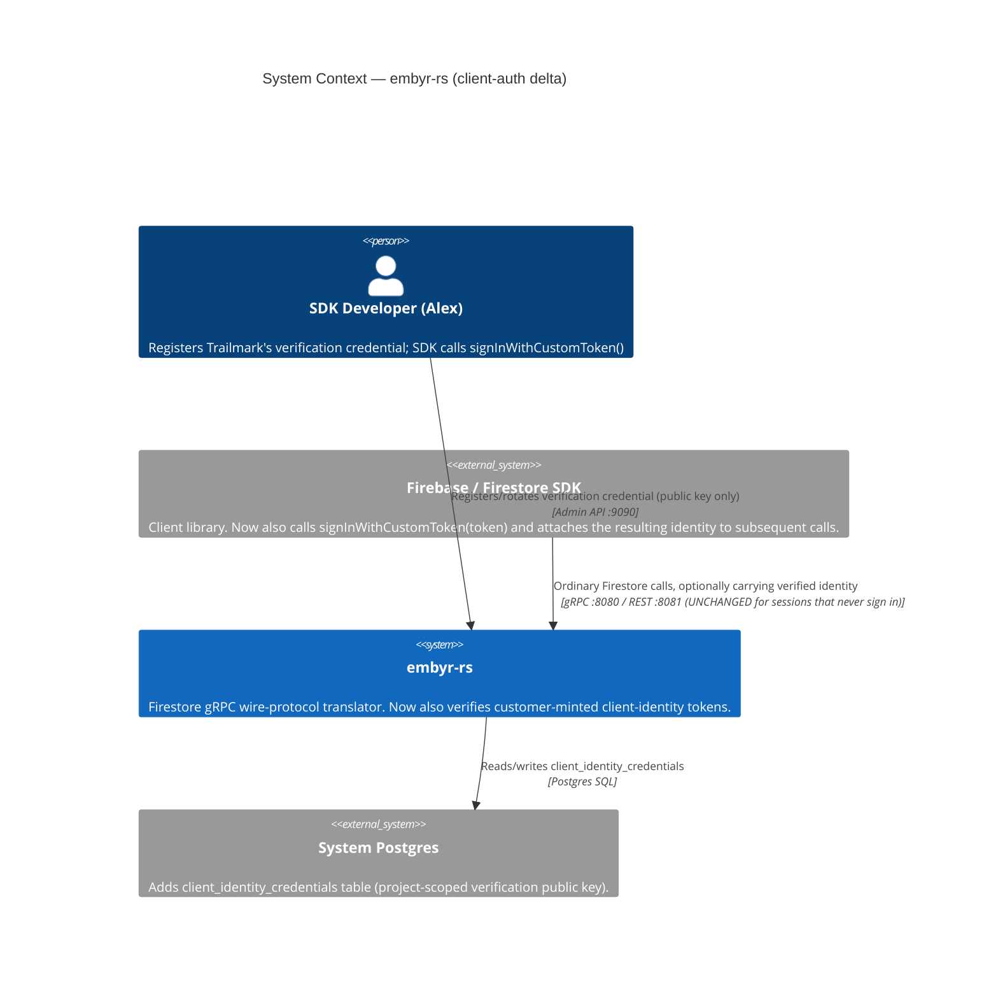
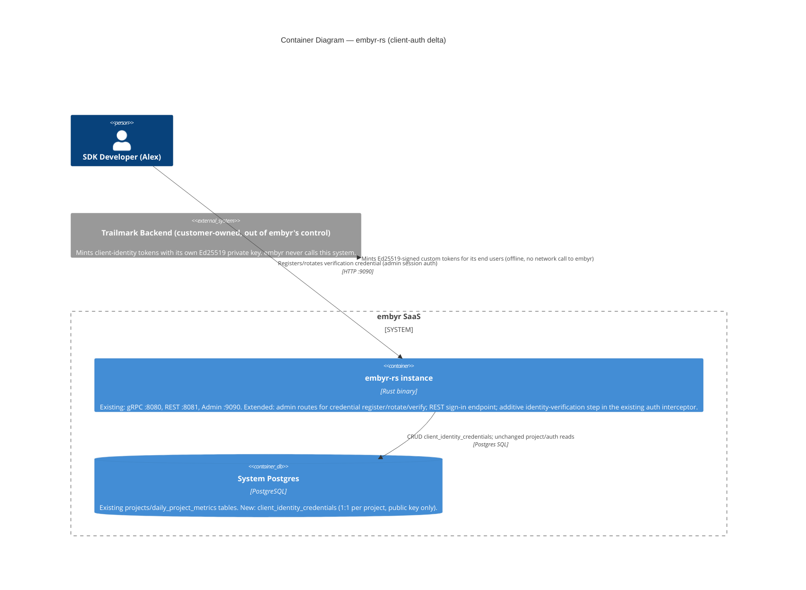

# client-auth — Feature Delta

**Wave**: DISCUSS | **Agent**: Luna (nw-product-owner) | **Date**: 2026-08-16
**Status**: Ready for DESIGN handoff
**Upstream**: none — greenfield feature, no DISCOVER/DIVERGE wave ran

---

## Wave: DISCUSS / [REF] Prior Wave Consultation — Reading Confirmation

✓ `docs/product/jobs.yaml` (all 15 existing jobs read in full; JOB-01 sdk-compat and JOB-15 customer-db-preflight identified as the closest structural precedents — JOB-01 for the persona/SDK-developer framing, JOB-15 for the "reverses/extends a founding decision, needs a Framing Resolution" discipline)
✓ `docs/product/journeys/sdk-developer.yaml` (pointer file, P1 Alex, JOB-01 + JOB-03 — extended with JOB-16 as part of this wave, see § SSOT Updates)
✓ `docs/product/journeys/customer-dba.yaml` (read as the structural precedent for a lightweight, no-separate-journey-artifact pointer file under Decision 3 = Lightweight)
✓ `docs/product/architecture/adr-002-bounded-contexts.md` (full — confirms exactly 3 bounded contexts: BC-1 Tenant Management, BC-2 Document Storage, BC-3 Real-Time Delivery; BC-1 already owns `AuthKey`/`Argon2idHash`/`DualHashWindow` and its own rejected-Option-D reasoning — "credential resolution has no entities, no aggregate roots... that is a domain service within BC-1, not a separate context" — is the direct precedent this feature's Scope Assessment relies on)
✓ `docs/feature/embyr-rs/discuss/feature-delta.md` (full, 673 lines — confirms the two Out-of-Scope lines this feature reverses, quoted verbatim in § Job Discovery Framing Resolution below; also the source of the D5 dual-hash-rotation pattern reused in US-03, and the admin-API response-shape precedent — "no raw DSN or key in response" — reused in US-01)
✓ `docs/feature/customer-db-onboarding/feature-delta.md` (DISCUSS section read in full — structural precedent for Framing Resolution rigor, single-narrative-file format, and the "confidence and escalation note" pattern for a judgment call that cannot be closed from evidence alone)
✓ `crates/embyr-server/src/grpc/handler.rs` (full, 1241 lines — `extract_api_key`/`authenticate` confirmed: the `api_key` bearer credential on every gRPC call serves three simultaneous roles — (a) project identification via the credential-cache key, (b) request authorization via Argon2id verification against `api_key_hash_current`/`_previous`, and (c) ECIES decryption key material for the stored customer DSN (`direct_pg` branch) or the agent mTLS bundle (`agent` branch). This confirms the scope boundary in § Out of Scope: a new end-user identity layer must be additive, not a replacement for this three-role credential.)
✓ `crates/embyr-server/src/admin/handlers/auth.rs` (full, 642 lines — confirms this implements email/password + TOTP + OIDC login for the **admin console** (human account operators, e.g. Chris/P5), issuing an `HttpOnly; Secure; SameSite=Strict; Path=/admin` browser session cookie via `sessions` table + BLAKE3(token) hash. This is architecturally a different mechanism from what a Firestore SDK client needs: gRPC clients are not browsers holding cookies, and need a portable, statelessly-verifiable credential attached per-call via metadata, not a server-side session. The RS256/JWKS verification logic inside `oidc_callback` — fetch JWKS by issuer discovery, match by `kid`, verify via `jsonwebtoken::DecodingKey::from_jwk` — is a genuinely reusable **code pattern** for verifying externally-signed tokens, noted as a DESIGN-wave reference, not adopted as a decision here.)

No contradictions found between this feature's scope and prior evidence. One deliberate reversal of a named founding decision is documented explicitly below (§ Job Discovery Framing Resolution), not silently introduced.

---

## Wave: DISCUSS / [REF] Orchestrator Decisions (not re-litigated)

| # | Decision | Value |
|---|---|---|
| 1 | Feature Type | Cross-cutting — a new identity-verification step sits in front of every existing gRPC/REST driving port, plus new `embyr-core` domain types and `embyr-server` adapters |
| 2 | Walking Skeleton | Evaluated (this wave's call): **YES, scoped narrowly** — see § Walking Skeleton Evaluation and § Story Map |
| 3 | UX Research Depth | Lightweight — primary user (Alex) interacts at the API/SDK-call level, not a rich UI embyr renders; journey work below is system-flow-focused, not emotional-arc UX design |
| 4 | JTBD Analysis | Yes (default) — every story traces to `job_id: JOB-16` |

### Walking Skeleton Evaluation (Decision 2 = "Depends")

Two existing mechanisms were evaluated for reuse before concluding a new walking skeleton is needed:

1. **The existing `api_key` auth interceptor** (`FirestoreService::authenticate` in `handler.rs`). Structurally cannot be reused or extended to represent end-user identity: it verifies a single **project-level** secret that also doubles as ECIES key material (see reading confirmation above). It has no concept of "which end user" — every one of Alex's app's end users presents the identical `api_key`. Repurposing it would conflate two credential classes with different lifecycles, different custody rules, and different rotation cadences.
2. **The admin-console OIDC/session code** (`admin/handlers/auth.rs`). Not reusable as a driving-port mechanism: it issues a browser `HttpOnly` cookie for a human logging into a web UI. A gRPC/REST Firestore client is not a browser and cannot hold or replay a cookie the way `admin/handlers/auth.rs` expects. Its RS256/JWKS signature-verification logic, however, is a reusable *code pattern* (see reading confirmation above) — flagged for DESIGN, not treated as a decision here since DISCUSS does not select algorithms or wire formats.

**Verdict**: no existing driving-port mechanism can be extended to carry end-user identity. A walking skeleton is needed, scoped narrowly to the thinnest end-to-end slice: register a project's verification credential, then have a session carrying a valid token succeed while one carrying no/malformed/expired/wrong-project token is rejected with a specific reason (§ Story Map, Slices 01-02).

---

## Wave: DISCUSS / [REF] Job Discovery — Framing Resolution: Auth-Method v1 Scope

This is the central scoping question for this feature. The raw ask is deliberately open on it: build client Auth (identity) now; do **not** default silently to either extreme. Two structurally different v1 scopes were evaluated.

| Option | Description | Fit against evidence |
|---|---|---|
| **(A) Custom-token-only** | embyr verifies a token that the *customer's own backend* mints (using verification material the customer registers with embyr) — analogous to Firebase's `signInWithCustomToken()` bridge pattern. embyr never sees, stores, or resets an end-user password. | **Strongest fit.** JOB-04 (Riley, CISO, credential-isolation) and JOB-09 (agent-auditproof) establish that embyr's most security-conscious customer segment actively minimizes what third parties custody on their behalf — hosting a *new* class of secret (end-user passwords, potentially for every end user of every customer) runs directly counter to that established posture. JOB-15 (Elena, customer-db-preflight) independently confirms embyr's technical customer segment already runs its own backend infrastructure (Postgres under their own DBA governance) — exactly the kind of backend that can mint a custom token today. No job, persona, or discovery finding in `jobs.yaml` describes a customer segment with *no* backend of its own that needs embyr to host identity for it. |
| **(B) Custom-token + embyr-hosted email/password** | Additionally, embyr becomes a full identity provider: stores hashed end-user credentials, issues its own sessions/tokens, and handles password-reset flows — for customers with no backend identity system of their own. | **Meaningfully bigger, weaker evidence.** The only supporting signal is JOB-01's phrase "behave identically to Firestore" and the general market reality that many real-world Firebase apps use Firebase's built-in email/password provider. But JOB-01's own *functional dimension* is explicitly scoped to the Firestore SDK data-plane surface (`setDoc`/`getDoc`/`onSnapshot`/etc — confirmed against the shipped `embyr-rs` feature's 14 user stories, none of which touch `firebase/auth`), not the Auth SDK surface — so "identical to Firestore" does not, on a careful reading, entail "identical to Firebase Auth's hosted providers." Option (B) would also introduce a materially larger bounded-context and compliance footprint: a new PII storage class (passwords for potentially millions of end users across every customer), a new breach-notification and GDPR-erasure surface for people who are not even embyr's own direct customers, and new UX surfaces (password-reset email delivery, login-attempt rate limiting, account lockout) comparable in scope to the 642-line admin-console `auth.rs` — but built for an unbounded number of *customers' customers* instead of embyr's own admin users. |

**Resolution**: **(A) Custom-token-only is the locked v1 scope.** It is the only option with direct, multi-job evidentiary support (JOB-04, JOB-09, JOB-15) and it fully satisfies JOB-16's actual functional dimension (a verifiable per-end-user identity on Firestore calls) without embyr taking on a new, unbounded custody liability. embyr-hosted email/password (Option B) is explicitly deferred — see § Out of Scope — as a named candidate follow-up epic, not built here and not silently ruled out either.

**Confidence and escalation note**: the floor of this resolution — "custom-token verification must be in v1" — is **high confidence**, independently triangulated from three jobs (JOB-04, JOB-09, JOB-15). The ceiling — "embyr-hosted email/password is *fully* out of v1 scope, not just deferred to a later release of *this* feature" — is **medium-high, not full, confidence**. This could not be closed from repository evidence alone: no discovery interview or support-ticket evidence in this codebase specifically asked "does your app rely on Firebase's built-in email/password provider today, and would losing it block your migration?" JOB-01's literal text ("behave identically to Firestore") is suggestive but, on the close reading above, does not resolve the question either way. Per Auto Mode guidance and the same discipline `customer-db-onboarding`'s own Framing Resolution applied, this reasoning is made fully explicit and auditable here — flagged for redirect if the actual customer-segment evidence (once available) points the other way — rather than blocking the wave or guessing silently. No interactive question mechanism (`AskUserQuestion`) is available in this run.

---

## Wave: DISCUSS / [REF] Persona & Job

**Persona**: **P1 — Alex, SDK Developer** (existing persona, `jobs.yaml`/`journeys/sdk-developer.yaml`). Alex is migrating an existing Firebase app to embyr and needs his app's own end users — not Alex himself — to be individually, verifiably identifiable on Firestore calls.

**Domain-example company**: **Trailmark**, a hiking-trip journal app, used consistently across this feature's domain examples. Trailmark already runs its own backend (its own user accounts/login system) — the concrete instantiation of the evidence in § Framing Resolution. Trailmark's end users are never a formal persona (they never interact with embyr directly; Alex "hires" this capability on their behalf) — they appear only as concrete, named domain-example data per Core Principle 6: **Maria Santos** and **Dana Kim**.

**job_id decision (per Decision 4)**: this feature creates one new job, **JOB-16 (`client-identity-verification`)**, rather than extending JOB-01 (`sdk-compat`). JOB-01 is scoped to the Firestore data-plane SDK surface (see § Framing Resolution); JOB-16 is a distinct goal — per-end-user identity — for the same persona. This mirrors the project's own precedent for "same persona, different goal ⇒ new job" (e.g. JOB-11 vs. JOB-06 for P2 Sam). JOB-01 receives a cross-reference note (not a rewrite), mirroring the established pattern (JOB-02 → JOB-15, JOB-10 → JOB-14).

**Opportunity scoring**: Importance = 8 (this fully blocks any Firestore app with per-user data restrictions — the majority of non-trivial Firestore apps — from meaningfully migrating; today every one of a customer's end users is indistinguishable to embyr). Satisfaction = 1 (zero support exists; this is a *named, deliberate* founding exclusion, not an unaddressed gap — see § Framing Resolution quoting `embyr-rs`'s own Out of Scope). Opportunity = 8 + (8−1) = **15**. Priority: **critical** (JOB-01/JOB-03 are also critical; this is a comparable-magnitude gap for any multi-user app, not a niche edge case).

---

## Wave: DISCUSS / [REF] Scope Assessment (Elephant Carpaccio Gate)

Run before journey/story-map investment, per Phase 1.5.

| Signal | Threshold | This feature | Fired? |
|---|---|---|---|
| User stories | >10 | 4 (US-01 through US-04) | **NO** |
| Bounded contexts / modules | >3 | **1** — BC-1 Tenant Management only (ADR-002 confirms BC-1 already owns `AuthKey`/`Argon2idHash`/`DualHashWindow` and its own auth-middleware step that "reads project status before dispatching to either [BC-2 or BC-3]"; end-user identity verification is a new domain service *within* BC-1's existing auth middleware, exactly like ADR-002's own rejected Option D reasoning for credential resolution — "that is a domain service within BC-1, not a separate context") | **NO** |
| Walking Skeleton integration points | >5 | 2 — admin-port credential registration (US-01) + data-port sign-in verification (US-02) | **NO** |
| Estimated effort | >2 weeks | 4 slices × ~1.25 days average ≈ 5 days | **NO** |
| Independent shippable outcomes | multiple | **NO** — US-01 (register credential) and US-02 (verify session) are two halves of one outcome; neither is independently valuable alone (a registered credential nothing can verify against is inert; a verifier with nothing registered has nothing to check). US-03/US-04 are genuinely separable enhancements, but that is normal release-2 sequencing, not multiple *walking-skeleton*-level outcomes. | **NO** |

**0 of 5 signals fired** (threshold is 2+). **Verdict: PASS — right-sized.** No split needed. The feature is still decomposed into 4 elephant-carpaccio slices below (normal thin-slicing, not oversized-triggered splitting).

---

## Wave: DISCUSS / [REF] System/SDK-Developer Journey (lightweight, per Decision 3)

Decision 3 = Lightweight: Alex's interaction is API/SDK-call-level, not a rendered UI. Journey work below is system-flow-focused.

### Credential registration flow (Alex's side, Slice 01)

```
Alex calls the admin API to register Trailmark's verification credential
        │
        ▼
   Does project trailmark-prod exist and is Alex's admin credential valid?
        │
   no / invalid ──────────────┐                 yes
        │                      │                  │
        ▼                      │                  ▼
  404 (no such project) or     │       Does trailmark-prod already have a
  401 (bad admin credential)   │       verification credential registered?
        │                      │                  │
        │                      │        ┌─────────┼─────────┐
        │                      │       yes                  no
        │                      │        │                    │
        │                      │        ▼                    ▼
        │                      │   409 "already        Is the submitted
        │                      │   registered — use     material well-formed?
        │                      │   rotate instead"            │
        │                      │        │            ┌────────┼────────┐
        │                      │        │          malformed         valid
        │                      │        │            │                 │
        │                      │        │            ▼                 ▼
        │                      │        │      400, naming what's   201 — credential
        │                      │        │      wrong                stored, active;
        └──────────────────────┴────────┴────────────────────────  no raw material
                                                                     echoed back
```

### Sign-in and per-call identity flow (Trailmark end user's side, Slice 02)

```
Maria Santos opens Trailmark; Trailmark's own backend mints her a token
        │
        ▼
   Trailmark's app calls the SDK's existing signInWithCustomToken(token),
   now pointed at embyr
        │
   embyr verifies the token against trailmark-prod's registered credential
        │
   ┌────┴─────┬──────────────┬──────────────┐
   │           │              │              │
missing /   malformed     expired for    minted for a
no token    signature     trailmark-prod different project
   │           │              │              │
   ▼           ▼              ▼              ▼
sign-in rejected, each with a reason distinguishable from the other three
   │
   └─────────────────────── valid ───────────────────────┐
                                                            ▼
                                          Sign-in succeeds; Maria's session now
                                          carries her verified end-user identity
                                                            │
                                                            ▼
                                          Maria's subsequent setDoc/getDoc calls
                                          succeed exactly as before — AND carry
                                          her verified identity for a follow-up
                                          Security Rules epic to consume
                                                            │
                                          (critical guardrail — see below)
                                                            ▼
                                          A DIFFERENT Trailmark session that never
                                          signed in at all still succeeds on
                                          ordinary Firestore calls, unchanged from
                                          today — this feature does not gate
                                          existing data-plane calls on identity
```

### Shared artifact

| Artifact | Source of truth | Consumers | Integration risk |
|---|---|---|---|
| Project verification credential | System DB, one row per project (new column(s)/table on the existing `Project`/BC-1 aggregate — exact shape DESIGN's call) | Admin API registration/rotation handler (US-01, US-03); sign-in verification path (US-02); standalone verify/debug check (US-04) | **HIGH** — if the verify path and the standalone debug check (US-04) read from two independently-maintained copies instead of one shared verification routine, they can drift and give Alex a false debug signal (see US-04 Technical Notes) |

### Failure modes (feeds DISTILL scenario generation)

- Alex registers malformed verification material (wrong length/format) — must be named, not a raw parse error.
- Alex attempts to register a second credential for a project that already has one — must direct him to rotation (US-03), not silently overwrite or silently reject with no explanation.
- Trailmark's minting code has a bug (wrong project ID embedded, wrong expiry) — must be catchable in the standalone verify/debug check (US-04) before it reaches a real end user in production.
- A token minted under a just-rotated-away credential must still work for the remainder of its natural lifetime (US-03) — an abrupt cutover would silently sign out every currently-active Trailmark user mid-session.
- An ordinary Firestore data call (`setDoc`/`getDoc`) made by a session that never signed in at all must **not** regress — this feature is additive, not a new gate on the 72 existing `embyr-rs` acceptance scenarios.

---

## Wave: DISCUSS / [REF] Story Map & Walking Skeleton

**Persona**: P1 Alex | **Goal**: Give each of Trailmark's end users a verifiable identity on their own Firestore sessions, without embyr ever custodying an end-user password.

### Backbone

| A. Alex Establishes Trust | B. An End User's Session Is Verified | C. Alex Operates the Credential Over Time |
|---|---|---|
| Alex registers Trailmark's verification credential **[WS]** | A valid, current-project, unexpired token signs in successfully and carries identity onto subsequent calls **[WS]** | Alex rotates the credential without breaking already-signed-in users |
| Malformed/duplicate registration attempts are rejected with a specific reason **[WS]** | Missing/malformed/expired/wrong-project tokens are rejected, each distinguishably **[WS]** | Alex pre-verifies a minted token before shipping to production |
| | Ordinary Firestore calls without a signed-in session are unaffected **[WS]** | |

### Walking Skeleton

One task from each activity, thinnest end-to-end happy path: Alex registers Trailmark's verification credential (Activity A); Maria Santos's Trailmark session signs in with a valid, current-project token and her subsequent `getDoc` call succeeds carrying her verified identity, while a session presenting no/malformed/expired/wrong-project token is rejected with a specific, distinguishable reason, and a session that never signed in at all continues to succeed exactly as before (Activity B). This is exactly Slice 01 + Slice 02's happy-path-plus-guardrail scenarios — no facade, real project/credential state.

### Release 1 — Identity Verification Works End-to-End (Slices 01-02, US-01, US-02)

Outcome: any Trailmark end user can be individually, verifiably identified on their own Firestore session, using a token Trailmark's own backend mints — the prerequisite a follow-up Security Rules epic needs.

### Release 2 — Operational Maturity (Slices 03-04, US-03, US-04)

Outcome: Alex can operate the credential safely over time (rotate without downtime) and catch minting bugs before they reach production, instead of discovering them from a live user's failed sign-in.

---

## Wave: DISCUSS / [REF] Elephant Carpaccio Slices

| Slice | Story | Release | Estimate | Learning Hypothesis (disproves) | Production-data taste test |
|---|---|---|---|---|---|
| 01 (WS) | US-01 | 1 | 1 day | A project-scoped verification credential cannot be registered and stored safely (never echoed back) using the existing admin-API auth/response conventions (`POST /admin/v1/projects` precedent) without inventing a new pattern | Real System DB row, real admin Bearer credential — no synthetic exception |
| 02 (WS) | US-02 | 1 | 1.5 days | A signed-in session cannot carry a verified end-user identity onto subsequent Firestore calls without either (a) gating existing data-plane calls on identity (a regression) or (b) requiring a live Security Rules engine that doesn't exist yet | Real registered credential + real minted tokens in each of the 4 rejection states (missing, malformed, expired, wrong-project) + real un-signed-in session for the regression guardrail — no synthetic mock |
| 03 | US-03 | 2 | 1.25 days | A credential cannot be rotated without either downtime for currently-signed-in users or an unbounded, ever-growing set of "still valid" old credentials | Real rotation against real in-flight tokens minted under the prior credential |
| 04 | US-04 | 2 | 1 day | A standalone pre-production verify/debug check cannot share the exact same rejection-reason taxonomy as real sign-in without duplicating (and risking drift in) the verification logic | Real tokens (valid, expired, wrong-project) checked against the real verification path, not a hand-rolled test double |

**Total estimate: ~4.75 days.**

**Taste tests applied**:
- "4+ new components per slice" — none exceeds 2 (Slice 01: admin handler + credential storage; Slice 02: sign-in handler + verification routine; Slice 03: rotation handler reusing D5's dual-hash-window shape; Slice 04: thin wrapper over Slice 02's verification routine). PASS.
- "Every slice depends on a new abstraction" — Slice 01 is the one genuinely new abstraction (the credential itself); Slices 02-04 build on it but do not each introduce a *new* one. PASS — no forced sequencing beyond the natural Walking-Skeleton pairing (01 before 02).
- "No slice disproves a pre-commitment" — each has a distinct, falsifiable hypothesis (see table). PASS.
- "Synthetic-data-only slices prove plumbing, not value" — N/A; all 4 slices require real System DB state and real minted tokens in each relevant state. PASS.
- "2+ slices identical except for scale" — none; each targets a distinct mechanism (register vs. verify vs. rotate vs. debug-check). PASS.

---

## Wave: DISCUSS / [REF] Prioritization

| Priority | Slice | Target Outcome | Rationale |
|---|---|---|---|
| 1 | Slice 01 (WS) | A project can have a verification credential registered | Walking Skeleton first — without a registered credential, Slice 02 has nothing to verify against |
| 2 | Slice 02 (WS) | A session carrying a valid token is verified; invalid ones are rejected specifically; unsigned-in sessions are unaffected | Closes the loop the raw ask requires; burns down the riskiest new assumption (identity can be added without regressing the existing 72 `embyr-rs` acceptance scenarios) immediately after Slice 01 |
| 3 | Slice 03 | Rotation without downtime | Operational necessity once real credentials exist in production, but not required for the core capability to exist — correctly sequenced after the Walking Skeleton |
| 4 | Slice 04 | Pre-production debug/verify check | Highest-leverage *for Alex's integration confidence*, but depends conceptually on Slice 02's verification routine existing to wrap — sequenced last, though independently testable against a stubbed verification routine if needed |

---

## Wave: DISCUSS / [REF] System Constraints

- **Additive, not a replacement.** This feature layers a *second*, additional credential (per-end-user identity token) on top of the existing `api_key` (project identification + request authorization + ECIES key material, confirmed in `handler.rs`). It does **not** re-architect, replace, or weaken the `api_key`'s existing three roles — that is explicitly out of scope (see § Out of Scope) and was flagged as a much larger, riskier change than this feature should attempt.
- **Critical regression guardrail.** An ordinary Firestore data call (`setDoc`/`getDoc`/`onSnapshot`/etc.) made by a session that never signed in with a client-identity token at all **must continue to succeed exactly as it does today**, gated only by the existing `api_key`. This feature does not make end-user identity *mandatory* for data-plane calls — there is no Security Rules engine yet to make mandatory identity meaningful, and Security Rules is an explicitly separate, dependent follow-up epic (see § Out of Scope). The only place a *missing* token is rejected is the sign-in/verification action itself (US-02) — not downstream data calls. DESIGN must not silently expand this into a hard gate on all data calls; doing so would regress all 72 existing `embyr-rs` acceptance scenarios listed in `docs/feature/embyr-rs/discuss/feature-delta.md` § DISTILL / Scenario List.
- **Bounded-context placement.** Per ADR-002 and § Scope Assessment above, this feature extends **BC-1 Tenant Management** only — it does not introduce a fourth bounded context. DESIGN should extend BC-1's ubiquitous language (`AuthKey`, `Argon2idHash`, `DualHashWindow` → add e.g. `ClientIdentityCredential`, `VerifiedEndUserIdentity`) in `adr-002-bounded-contexts.md`, consistent with ADR-002's own reasoning for why credential resolution (Option D) was folded into BC-1 rather than made a separate context.
- **Shared artifact — verification credential.** See journey § Shared Artifact table above. Integration risk HIGH: the sign-in verification path (US-02) and the standalone debug/verify check (US-04) must read from one shared verification routine, not two independently-maintained copies, or they will drift and give Alex a false debug signal.
- **No new `api_key`-shaped secret custody expansion.** Per § Framing Resolution, embyr must never receive, store, or be able to reconstruct an end-user's password. Whatever verification material DESIGN chooses (public key, shared secret, JWKS reference, etc.) must be something embyr can use to *verify* a token Trailmark's backend signs, not something that lets embyr *impersonate* Trailmark's own identity system or *learn* an end-user credential.
- Ubiquitous language introduced: **verification credential** (what a project registers so embyr can check tokens), **client-identity token** / **custom token** (what the customer's own backend mints per end user), **verified end-user identity** (the resolved identity attached to a signed-in session). These terms should carry forward into DESIGN's naming, not be silently renamed.

---

## Wave: DISCUSS / [REF] User Stories

<!-- markdownlint-disable MD024 -->

### US-01: Alex Registers Trailmark's Verification Credential With Embyr

**job_id**: JOB-16
**Slice**: 01 (Walking Skeleton) | **Release**: 1

#### Elevator Pitch
Before: embyr has no way to check that a request claiming to be "Maria Santos, a Trailmark user" is legitimate — the only credential embyr understands is Trailmark's single project-level `api_key`, shared identically by every one of Trailmark's end users.
After: call the admin API's project-scoped credential-registration action (exact endpoint shape DESIGN's call) with the verification material Trailmark's backend will use to mint end-user tokens → sees a 201 confirming the credential is registered and active, with no raw signing material echoed back in the response — matching the existing "no raw DSN or key in response" convention (`AC-07a` precedent).
Decision enabled: Alex knows Trailmark's backend can now start minting real per-end-user tokens that embyr will actually check, instead of guessing whether a verification step exists at all.

#### Domain Examples
1. **Happy Path**: Alex registers Trailmark's verification credential for project `trailmark-prod` via the admin API, using Trailmark's admin Bearer credential. Sees 201; the response contains no raw signing material.
2. **Edge Case**: Alex's registration request submits verification material with the wrong length/format (a copy-paste truncation). Sees 400 naming specifically what's malformed, not a raw parse error.
3. **Error/Boundary**: Alex, testing against `trailmark-prod`, accidentally submits a second registration request (his first one already succeeded an hour earlier). Sees 409, directing him to the rotation action (US-03) instead of silently overwriting or silently failing.

#### UAT Scenarios (BDD)

##### Scenario: First-time registration succeeds and never echoes the raw material back
Given project `trailmark-prod` exists and has no verification credential registered yet
When Alex registers verification material using a valid admin Bearer credential
Then the credential is stored and active, and the response confirms success without including the raw material

##### Scenario: Malformed verification material is rejected with a specific reason
Given project `trailmark-prod` exists and has no verification credential registered yet
When Alex submits verification material that is malformed (wrong length or format)
Then the registration is rejected with a message naming what is malformed, not a generic error

##### Scenario: Registering a second credential for an already-registered project is rejected, not silently overwritten
Given project `trailmark-prod` already has an active verification credential
When Alex submits another registration request for the same project
Then the request is rejected, and the response directs Alex to the rotation action instead

##### Scenario: Registration without valid admin credentials is rejected
Given project `trailmark-prod` exists
When Alex submits a registration request with a missing or invalid admin Bearer credential
Then the request is rejected the same way any other admin endpoint rejects missing/invalid credentials

##### Scenario: Registration against a non-existent or deleted project is rejected
Given project `trailmark-staging-old` does not exist or has been deleted
When Alex submits a registration request for it
Then the request is rejected as not found

#### Acceptance Criteria
- [ ] AC-16-01: Valid registration returns 201; the credential is stored and active; no raw signing material appears in the response.
- [ ] AC-16-02: Malformed verification material returns 400, naming what specifically is wrong.
- [ ] AC-16-03: Missing or invalid admin Bearer credential returns 401, consistent with existing admin-endpoint behavior.
- [ ] AC-16-04: Registering when a credential already exists for the project returns 409 and directs the caller to the rotation action (US-03).
- [ ] AC-16-05: Registering for a non-existent or deleted project returns 404.

#### Outcome KPIs
See § Outcome KPIs below (feeds KPI #1, North Star).

#### Technical Notes (Optional)
Exact verification-material shape (public key, shared secret, JWKS reference, etc.), exact endpoint path, and storage location (new column(s) on the existing `Project`/BC-1 aggregate, or a related table) are DESIGN's call — this story locks observable behavior only. Must never echo the raw material back in any response body or log line, mirroring the existing DSN/api-key non-disclosure convention already established for `POST /admin/v1/projects`.

---

### US-02: A Trailmark User's Verified Identity Unlocks Their Firestore Session

**job_id**: JOB-16
**Slice**: 02 (Walking Skeleton) | **Release**: 1

#### Elevator Pitch
Before: Trailmark's backend can mint a token asserting "this is Maria Santos," but embyr has no call that checks it — every one of Trailmark's end users looks identical to embyr, distinguishable only by the one shared project `api_key`.
After: call the SDK's existing `signInWithCustomToken(trailmarkMintedToken)` — an unchanged SDK method, now backed by embyr — → sees the sign-in resolve successfully, and Maria's subsequent `setDoc`/`getDoc` calls succeed exactly as before, now carrying her verified end-user identity.
Decision enabled: Alex knows, per session, *which* of Trailmark's end users is calling — the prerequisite a follow-up Security Rules epic needs to let Maria see only her own trip-journal entries.

#### Domain Examples
1. **Happy Path**: Maria Santos opens Trailmark; Trailmark's backend mints her a token against `trailmark-prod`'s registered credential; her device calls `signInWithCustomToken(token)`; sign-in succeeds; her subsequent `getDoc` on her own trip-journal document succeeds, carrying her verified identity.
2. **Edge Case**: Dana Kim's token was minted 2 hours ago; Trailmark mints tokens valid for 1 hour. Her sign-in attempt is rejected as expired, with a reason distinguishable from "wrong project" or "malformed."
3. **Error/Boundary**: A token minted for `trailmark-staging` is presented against `trailmark-prod`. Sign-in is rejected, naming the project mismatch — and, separately, a *different* Trailmark session that never attempted sign-in at all still succeeds on an ordinary `getDoc` call, unaffected.

#### UAT Scenarios (BDD)

##### Scenario: Signing in with a valid, current-project, unexpired token succeeds and carries identity forward
Given `trailmark-prod` has an active registered verification credential
And Maria Santos holds a token minted against it, unexpired
When Maria's session calls sign-in with that token
Then sign-in succeeds and Maria's subsequent Firestore call succeeds carrying her verified end-user identity

##### Scenario: Signing in with no token is rejected
Given `trailmark-prod` has an active registered verification credential
When a session attempts sign-in with no token present
Then sign-in is rejected with a reason identifying the missing token

##### Scenario: Signing in with a malformed token is rejected, distinguishably from a missing one
Given `trailmark-prod` has an active registered verification credential
When a session attempts sign-in with a corrupted or malformed token
Then sign-in is rejected with a reason distinguishable from the missing-token reason

##### Scenario: Signing in with an expired token is rejected, distinguishably from malformed
Given Dana Kim holds a token minted against `trailmark-prod`'s credential that has since expired
When Dana's session attempts sign-in with that token
Then sign-in is rejected with a reason identifying expiry, distinguishable from malformed or missing

##### Scenario: Signing in with a token minted for a different project is rejected, distinguishably from expiry
Given a token was minted against `trailmark-staging`'s registered credential
When a session attempts sign-in with that token against `trailmark-prod`
Then sign-in is rejected with a reason identifying the project mismatch, distinguishable from the other three reasons

##### Scenario: An ordinary Firestore call from a session that never signed in is unaffected
Given a Trailmark session has never attempted sign-in with any client-identity token
When that session calls `setDoc` or `getDoc` using only the existing project `api_key`
Then the call succeeds exactly as it did before this feature shipped

#### Acceptance Criteria
- [ ] AC-16-06: Sign-in with a valid, current-project, unexpired token succeeds, and the verified end-user identity is attached to that session's subsequent Firestore calls.
- [ ] AC-16-07: Sign-in attempted with no token, a malformed token, an expired token, or a token minted for a different project is rejected, and each of the four reasons is distinguishable from the other three in the response.
- [ ] AC-16-08: A Firestore data call made by a session that never signed in continues to succeed exactly as it did before this feature shipped — this feature does not gate existing data-plane calls on end-user identity (regression guardrail; see § System Constraints).
- [ ] AC-16-09: The verified end-user identity is available to embyr's own request handling for at least the duration of that signed-in session, sufficient for a follow-up Security Rules epic to consume it (exact exposure mechanism is DESIGN's call).

#### Outcome KPIs
See § Outcome KPIs below (KPI #1 North Star, KPI #3 Guardrail).

#### Technical Notes (Optional)
Exact sign-in transport/endpoint, token format, and how the verified identity is threaded into subsequent calls are DESIGN's call — this story locks observable behavior only. `handler.rs`'s existing `extract_api_key`/`authenticate` pattern is the precedent for "authenticate before touching data," but is not reused directly — client-identity verification is additive, layered on top (see § System Constraints).

---

### US-03: Alex Rotates Trailmark's Verification Credential Without Breaking Signed-In Users

**job_id**: JOB-16
**Slice**: 03 | **Release**: 2

#### Elevator Pitch
Before: if Trailmark's signing material is ever suspected compromised, or is simply due for routine rotation, Alex has no way to change it without either downtime or silently invalidating every one of Trailmark's currently signed-in users.
After: call the rotation action (exact shape DESIGN's call) with new verification material → sees confirmation the new credential is active, while tokens minted under the immediately-previous credential continue to verify successfully until they naturally expire.
Decision enabled: Alex can rotate on a routine security schedule, or respond to a suspected compromise, without coordinating a "everyone re-signs-in" event with Trailmark's own users.

#### Domain Examples
1. **Happy Path**: Alex rotates `trailmark-prod`'s credential at 2pm. Maria's session, signed in at 1:50pm under the old credential, continues to make Firestore calls successfully for the rest of her session's natural lifetime.
2. **Edge Case**: Alex rotates twice in quick succession (a fumbled first rotation, then a corrected second one). Only the two most recent credentials remain valid for verification — mirroring the existing D5 dual-hash-window shape for `api_key` rotation, not an unbounded history.
3. **Error/Boundary**: A token minted under a credential from three rotations ago is presented for sign-in. It is rejected as no longer valid — the same "wrong/stale credential" class of rejection, not a crash or an internal error.

#### UAT Scenarios (BDD)

##### Scenario: Rotation succeeds and the new credential is immediately active for new tokens
Given `trailmark-prod` has an active verification credential
When Alex submits a rotation request with new verification material and valid admin credentials
Then the new credential becomes active and tokens minted against it verify successfully

##### Scenario: Tokens minted under the immediately-previous credential still verify during the rotation window
Given Alex has just rotated `trailmark-prod`'s credential
And a token was minted under the credential immediately prior to rotation, still unexpired
When a session attempts sign-in with that token
Then sign-in succeeds

##### Scenario: Tokens minted under a credential older than the rotation window are rejected
Given `trailmark-prod`'s credential has been rotated twice since a token was minted
When a session attempts sign-in with that stale token
Then sign-in is rejected as no longer valid

##### Scenario: Rotation without valid admin credentials is rejected
Given `trailmark-prod` has an active verification credential
When a rotation request is submitted with a missing or invalid admin Bearer credential
Then the request is rejected the same way any other admin endpoint rejects missing/invalid credentials

#### Acceptance Criteria
- [ ] AC-16-10: A valid rotation request activates the new credential; tokens minted against it verify successfully.
- [ ] AC-16-11: Tokens minted under the immediately-previous credential continue to verify successfully during the rotation window.
- [ ] AC-16-12: Tokens minted under a credential older than the rotation window are rejected.
- [ ] AC-16-13: Rotation without a valid admin Bearer credential is rejected 401.

#### Outcome KPIs
See § Outcome KPIs below (KPI #4).

#### Technical Notes (Optional)
Mirrors the existing D5 pattern (dual-hash window for `api_key` rotation: `api_key_hash_current`/`api_key_hash_previous`, `docs/feature/embyr-rs/discuss/feature-delta.md`). DESIGN should evaluate reusing the identical rotation-window shape for verification-credential rotation rather than inventing a new one.

---

### US-04: Alex Verifies a Minted Token Resolves to the Right End User Before Shipping

**job_id**: JOB-16
**Slice**: 04 | **Release**: 2

#### Elevator Pitch
Before: Alex's only way to find out whether Trailmark's token-minting code is correct is to ship it and watch real production sign-ins succeed or fail.
After: call a standalone verify/debug check (exact shape DESIGN's call) with a token Trailmark's backend just minted → sees the resolved end-user identity and expiry echoed back, without that call itself creating a live signed-in session.
Decision enabled: Alex catches a token-minting bug (wrong user ID embedded, wrong project, wrong expiry) during integration testing, before it reaches a real Trailmark user.

#### Domain Examples
1. **Happy Path**: Alex, testing locally, mints a token for a synthetic test user `test-user-001` against `trailmark-staging`'s credential, and calls the verify check. Sees the resolved identity `test-user-001` and its expiry, matching what he expects.
2. **Edge Case**: Alex's minting code has a bug and embeds `trailmark-prod` as the project instead of `trailmark-staging`. The verify check surfaces the same project-mismatch reason a real sign-in attempt would have used.
3. **Error/Boundary**: Alex calls the verify check with a token that expired five minutes ago. Sees the expiry reason specifically, not a generic failure.

#### UAT Scenarios (BDD)

##### Scenario: Verifying a valid token returns the resolved identity without creating a live session
Given Alex holds a valid, unexpired token minted against `trailmark-staging`'s registered credential
When Alex calls the standalone verify check with that token
Then the response shows the resolved end-user identity and expiry, and no live signed-in session is created

##### Scenario: Verifying a token with a project mismatch surfaces the same reason real sign-in would
Given a token was minted against `trailmark-staging`'s credential
When Alex calls the standalone verify check with that token, specifying `trailmark-prod`
Then the response shows the same project-mismatch reason that a real sign-in attempt (US-02) would return

##### Scenario: Verifying an expired token surfaces the expiry reason
Given Alex holds a token minted against `trailmark-staging`'s credential that has since expired
When Alex calls the standalone verify check with that token
Then the response shows the expiry reason, distinguishable from malformed or project-mismatch

#### Acceptance Criteria
- [ ] AC-16-14: Verifying a valid token returns the resolved end-user identity and expiry, and does not itself establish a live signed-in session.
- [ ] AC-16-15: The verify check surfaces the identical rejection-reason taxonomy used by real sign-in (US-02) — malformed / expired / wrong-project — so Alex can trust it as a faithful pre-production diagnostic.

#### Outcome KPIs
See § Outcome KPIs below (KPI #4).

#### Technical Notes (Optional)
Strongly encouraged to be implemented as a thin wrapper over the same verification routine used by real sign-in (US-02), not a duplicate — see § System Constraints' shared-artifact integration risk.

---

## Wave: DISCUSS / [REF] Outcome KPIs

### Feature: client-auth

### Objective
Give every Trailmark-class embyr customer's end users a verifiable per-user identity on Firestore sessions, without embyr ever custodying an end-user password, closing the gap that today makes any multi-user Firestore app unable to meaningfully migrate.

### Outcome KPIs

| # | Who | Does What | By How Much | Baseline | Measured By | Type |
|---|---|---|---|---|---|---|
| 1 | SDK developers migrating multi-user Firestore apps (e.g. Alex/Trailmark) | Complete a custom-token sign-in and have subsequent Firestore calls carry a verified end-user identity | 100% of valid custom-token sign-in attempts succeed and attach identity | 0% (capability does not exist today) | Count of successful sign-ins against registered credentials, cross-referenced with subsequent authenticated Firestore calls carrying identity | North Star |
| 2 | SDK developers whose sign-in attempts fail | Identify the specific remediation needed (missing/malformed/expired/wrong-project) from the rejection reason alone | ≥90% of failed sign-ins are self-resolved without an internal support ticket | 0% (no verification path exists to fail specifically today) | Support-ticket tagging cross-referenced with sign-in retry success | Leading |
| 3 | Existing embyr-rs customers/sessions that never adopt client-identity tokens | Continue to make ordinary Firestore data calls successfully, unaffected | 0% regression across the 72 existing `embyr-rs` acceptance scenarios | Current 100% pass rate (pre-feature) | `embyr-rs` acceptance suite, pre/post comparison | Guardrail |
| 4 | SDK developers operating a credential over its lifecycle (rotation, pre-production verification) | Rotate credentials with zero session-breaking downtime; catch minting bugs before production | 0 signed-in-user disruptions per rotation; ≥1 minting bug caught pre-production per integration cycle (qualitative, ramps with adoption) | N/A (capability does not exist today) | Rotation event log cross-referenced with sign-in failure spikes; verify-check usage log | Leading |

### Metric Hierarchy
- **North Star**: KPI #1 — this is the entire reason the feature exists; if end-user identity cannot be reliably established, the follow-up Security Rules epic has nothing to build on.
- **Leading Indicators**: KPI #2 (rejection-reason quality predicts whether the North Star holds up in practice) and KPI #4 (operational maturity predicts sustained adoption, not just a one-time demo).
- **Guardrail Metrics**: KPI #3 — a regression here (breaking the existing, working `embyr-rs` data plane) is the single highest-consequence defect class this feature can produce, since it would trade a narrow identity-gap-fix for a broad regression across every existing customer.

### Measurement Plan

| KPI | Data Source | Collection Method | Frequency | Owner |
|---|---|---|---|---|
| 1 | Sign-in audit log + Firestore call auth-context log | Cross-reference query | Weekly | platform-architect (DEVOPS wave) |
| 2 | Support-ticket system + sign-in attempt log | Correlation query | Weekly | platform-architect (DEVOPS wave) |
| 3 | `embyr-rs` acceptance test suite | CI run, pre/post comparison | Every DELIVER-wave run | platform-architect (DEVOPS wave) |
| 4 | Rotation event log + verify-check usage log | Existing admin-audit instrumentation, extended | Weekly | platform-architect (DEVOPS wave) |

### Hypothesis
We believe that letting a customer's backend mint per-end-user tokens, which embyr verifies against a project-registered credential, will give SDK developers migrating multi-user Firestore apps the caller identity their apps (and a follow-up Security Rules epic) need, without embyr taking on end-user password custody.
We will know this is true when a previously-blocked multi-user migration (any Firestore app with per-user data restrictions) completes end-to-end using custom-token sign-in, and the existing `embyr-rs` data plane shows zero regression.

**Note on baseline honesty**: KPI #1's baseline is 0% by definition (this capability does not exist today, and was a deliberate founding exclusion — see § Framing Resolution), not a measurement gap.

---

## Wave: DISCUSS / [REF] Definition of Ready Validation

### Story: US-01 through US-04 (all stories, client-auth)

| DoR Item | Status | Evidence |
|---|---|---|
| 1. Problem statement clear, domain language | PASS | Every Elevator Pitch names a concrete "Before" state grounded in read code (`handler.rs`'s `extract_api_key`/`authenticate`, the admin API's existing response-shape conventions) |
| 2. User/persona with specific characteristics | PASS | P1 Alex (existing persona), concretely instantiated as an SDK developer at Trailmark, a hiking-trip journal app with its own existing backend |
| 3. 3+ domain examples with real data | PASS | All 4 stories have exactly 3 (Happy/Edge/Error) with real-feeling names, project IDs, and timing (`Maria Santos`, `Dana Kim`, `trailmark-prod`, `trailmark-staging`, `test-user-001`) |
| 4. UAT in Given/When/Then (3-7 scenarios) | PASS | US-01: 5, US-02: 6, US-03: 4, US-04: 3 — all within 3-7 |
| 5. AC derived from UAT | PASS | Every AC traces to a named scenario (e.g. AC-16-08 ← "An ordinary Firestore call from a session that never signed in is unaffected") |
| 6. Right-sized (1-3 days, 3-7 scenarios) | PASS | Each story maps 1:1 to a slice, each 1-1.5 days (§ Elephant Carpaccio Slices); feature-level story count (4) is well within the ≤10 threshold |
| 7. Technical notes identify constraints | PASS | All 4 stories defer exact mechanism (verification-material shape, endpoint paths, rotation storage, verify-check implementation) to DESIGN while locking observable behavior; § System Constraints names the additive/non-replacement and no-regression constraints explicitly |
| 8. Dependencies resolved or tracked | PASS | US-02 depends on US-01 (needs a registered credential to verify against); US-03/US-04 depend conceptually on US-02's verification routine — all documented in § Story Map and § Prioritization; no circular or unresolved dependency |
| 9. Outcome KPIs defined with measurable targets | PASS | All 4 KPIs have explicit numeric targets (or an explicitly-qualitative ramping target for KPI #4, honestly labeled as such) and named measurement methods |

### DoR Status: **PASSED** (all 9 items, all 4 stories)

### Requirements Completeness Score: **0.96**

- Functional requirements: complete — all 4 stories cover the full backbone (§ Story Map), all traced to JOB-16's four forces.
- Non-functional requirements: the shared-artifact integrity risk (verification routine must not drift between US-02 and US-04) and the critical no-regression guardrail (AC-16-08, KPI #3) are carried into § System Constraints as explicit DESIGN-scoping requirements, not fabricated as numeric NFRs before a mechanism is chosen.
- Business rules: complete — JOB-16's push/pull/anxiety/habit forces are all traced to specific ACs (e.g., anxiety → AC-16-01's non-disclosure guarantee and the entire Framing Resolution scope lock; habit → US-02's reuse of the familiar `signInWithCustomToken()` SDK call).
- One deliberate, documented gap (same class as `customer-db-onboarding`'s own scored-down point): § Job Discovery Framing Resolution's *ceiling* — whether embyr-hosted email/password is fully out of scope for all future work, vs. just this feature — could not be closed from repository evidence alone (§ Framing Resolution, confidence and escalation note). Scored 0.96, not 1.0, for this reason; not a blocking gap, since the *floor* (custom-token-only in v1) is high-confidence and independently triangulated.

---

## Wave: DISCUSS / [REF] Out of Scope

- **Token format, signing algorithm, verification mechanism** (JWT vs. PASETO, HMAC vs. RSA/JWKS, exact endpoint paths) — DESIGN's call; this DISCUSS locks observable behavior only (§ User Stories).
- **Firestore Security Rules (authorization)** — explicitly, structurally out of scope. This feature establishes *identity* (who is calling); a Security Rules engine (*what that identity may access*) is a separate, dependent follow-up epic that needs this feature's caller identity to evaluate against. Flagged as a named follow-up dependency for DESIGN, not built toward here.
- **embyr-hosted email/password (or any other) identity provider** — explicitly deferred per § Framing Resolution's locked (A) custom-token-only scope. Flagged as a candidate follow-up epic, not silently ruled out for all future work (see confidence/escalation note) and not built here.
- **Anonymous auth, phone auth, social OAuth providers** — same reasoning as hosted email/password (a customer-hosted-identity expansion, not a verification-of-an-externally-minted-token capability); deferred, not built here.
- **Re-architecting the existing project-level `api_key`'s three roles** (project ID, request authorization, ECIES key material) — this feature is additive on top of it, not a replacement. Re-architecting `api_key` is a much larger, riskier change explicitly out of scope (confirmed via reading `handler.rs`; see § System Constraints).
- **Token refresh mechanics beyond natural expiry** (e.g. silent background refresh flows) — DESIGN's call whether/how to support; not locked here.
- **Making end-user identity mandatory on any existing Firestore data-plane call** — explicitly out of scope for this feature; see § System Constraints regression guardrail. Enforcement is Security Rules' job (the follow-up epic), not this one's.

---

## Wave: DISCUSS / [REF] WS Strategy

Walking Skeleton Strategy: **B — Thin End-to-End Slice**. Both Slice 01 and Slice 02 are real, narrow vertical slices against real System DB state and real minted tokens (no facade, no mock) — Slice 01 proves the riskiest new assumption (a credential can be registered and stored safely using existing admin-API conventions); Slice 02 proves the second riskiest assumption (identity verification can be added without regressing the existing, working `embyr-rs` data plane). Together they form the thinnest end-to-end flow: register → sign in / reject → identity carried forward.

---

## Wave: DISCUSS / [REF] Driving Ports

| Port | Protocol | Extension |
|---|---|---|
| Admin port `:9090` (existing, extended) | HTTP/1.1 | New credential registration (US-01) and rotation (US-03) actions, alongside existing project-lifecycle actions |
| Data ports `:8080` (gRPC) / `:8081` (REST/gRPC-Web) (existing, extended) | gRPC / HTTP | New sign-in/identity-exchange action (US-02); existing Firestore calls optionally carry the resulting verified identity in request context alongside the unchanged existing `api_key` metadata |

No new network-facing port introduced. Exact endpoint/RPC shapes are DESIGN's call.

---

## Wave: DISCUSS / [REF] Pre-requisites

- `docs/feature/embyr-rs/discuss/feature-delta.md` — this feature reverses its named Out-of-Scope decision ("Firebase Authentication integration ... no Firebase Auth service dependency"); DESIGN should treat that file's D5 (Argon2id dual-hash rotation pattern) as the direct precedent for US-03's rotation-window shape, and its admin-API response-shape convention (no raw secret in response) as the precedent for US-01.
- `crates/embyr-server/src/grpc/handler.rs`'s `extract_api_key`/`authenticate` (existing three-role `api_key` credential — the mechanism this feature must not replace or weaken).
- `crates/embyr-server/src/admin/handlers/auth.rs` (existing admin-console session/OIDC code — not directly reusable as a driving-port mechanism, but its RS256/JWKS verification logic is a reference pattern for DESIGN).
- `docs/product/architecture/adr-002-bounded-contexts.md` (BC-1 Tenant Management's existing ubiquitous language and auth-middleware placement — this feature extends BC-1, does not introduce a new bounded context).
- `docs/product/jobs.yaml` (JOB-01, JOB-04, JOB-09, JOB-15 — the evidentiary basis for § Framing Resolution).

---

## Wave: DISCUSS / [REF] Handoff Package

**To DESIGN (solution-architect)**: this `feature-delta.md` (journey + story map + user stories + embedded AC), 4 slice briefs (`docs/feature/client-auth/slices/slice-01-register-verification-credential.md` through `slice-04-standalone-token-verify-check.md`), `docs/product/jobs.yaml` (JOB-16, new; JOB-01 cross-reference note), `docs/product/journeys/sdk-developer.yaml` (extended with JOB-16).

**To DEVOPS (platform-architect)**: § Outcome KPIs above (4 KPIs — 1 North Star, 2 Leading, 1 Guardrail — for instrumentation planning).

**Explicit flags for DESIGN**:
1. § Job Discovery Framing Resolution's option (A) is the locked v1 framing — DESIGN should not silently expand into embyr-hosted email/password (option B); that is a documented candidate follow-up epic, not this feature's scope.
2. § System Constraints' critical regression guardrail (AC-16-08) is the single highest-consequence design risk in this feature — an ordinary Firestore data call from a session that never signed in must keep working exactly as it does today. Do not silently make identity mandatory on data-plane calls; that is Security Rules' job (a separate, dependent follow-up epic), not this feature's.
3. This feature extends BC-1 Tenant Management (ADR-002) — do not introduce a fourth bounded context for it.
4. § System Constraints' shared-artifact integration risk (US-02's sign-in verification and US-04's standalone debug check must share one verification routine, not two independently-maintained copies) must be resolved explicitly.
5. Security Rules is a named, dependent follow-up epic — this feature's identity output (verified end-user identity attached to a signed-in session) is the exact interface that follow-up epic will need; DESIGN should not design it away or make it Security-Rules-specific.

Peer review: not invoked per-wave (default skip per SKILL Phase 3 step 6 — the one genuine ambiguity, the Framing Resolution's ceiling, is resolved with fully explicit and auditable reasoning above and flagged clearly for redirect; no JTBD assumptions inherited from elsewhere requiring re-validation; no vendor-neutrality risk, since no technology was selected). Mandatory consolidated review fires at end of DISTILL.

---

## Wave: DISCUSS / [REF] SSOT Updates

- `docs/product/jobs.yaml` — added JOB-16 (`client-identity-verification`, P1 Alex). JOB-01 receives a cross-reference note (not a rewrite), mirroring the project's established cross-reference pattern (JOB-02 → JOB-15, JOB-10 → JOB-14, JOB-06/JOB-11 in `card-payments-backend`).
- `docs/product/journeys/sdk-developer.yaml` — extended with JOB-16 in its `jobs` list (same persona, P1 Alex, new goal). No separate visual/YAML journey artifact produced for JOB-16 — Decision 3 (UX Research Depth) = Lightweight; journey detail lives inline in this file per the current single-narrative-file convention.
- No new persona file — Trailmark's end users (Maria Santos, Dana Kim) are domain-example data within Alex's stories, not a formal persona (they never interact with embyr directly).

---

## Wave: DESIGN / [REF] Prior Wave Consultation — Reading Confirmation

**Wave**: DESIGN | **Agent**: Morgan (nw-solution-architect) | **Date**: 2026-08-16 | **Mode**: Propose (Decision 1)

✓ `docs/product/architecture/brief.md` § System Architecture (System Quality Attributes, System Constraints, Process/Network Topology, C4 System Context + Container, System-Level Decisions Table) — read in full
✓ `docs/product/architecture/brief.md` § Application Architecture (Development Paradigm, Architectural Pattern, Component Decomposition, Driving/Driven Ports, Technology Choices, Reuse Analysis, Application-Level Decisions Table, C4 Component — Data Plane, Rate Limiting, Open Questions) — read in full
✓ `docs/product/architecture/adr-002-bounded-contexts.md` — confirms BC-1 Tenant Management ownership and the Option D precedent this feature's BC-1-extension follows
✓ `docs/product/architecture/adr-008-crate-structure.md` — read; not directly relevant (admin-UI crate topology), confirms no crate-boundary precedent conflicts with this feature's additions to `embyr-core`/`embyr-server`
✓ `docs/product/architecture/adr-009-auth-middleware-separation.md` — sub-router-per-auth-type shape; `dual_auth_middleware`'s "try session then operator" precedent reused as ADR-026's OQ-CA-01 fallback shape
✓ `docs/product/architecture/adr-010-session-context-extractor.md` — `SessionContext` `FromRequestParts` extractor reused verbatim for the three new admin routes (no new auth middleware written)
✓ `docs/product/architecture/adr-018-secrets-management.md` — dual-key rotation-window shape (`admin_key`/`admin_key_previous`, `decrypt_with_rotation`) — the direct precedent ADR-025 mirrors for verification-credential rotation
✓ `docs/product/journeys/sdk-developer.yaml` — JOB-16 already extended by DISCUSS; no further journey change needed from DESIGN
✓ `docs/feature/client-auth/feature-delta.md` (this file, DISCUSS sections, full) — user stories, story map, system constraints, framing resolution, handoff flags
✓ `crates/embyr-server/src/grpc/handler.rs` — `extract_api_key`/`authenticate` (lines 129–315) read in full; confirms the exact three-role `api_key` check this feature must not restructure (ADR-026)
✓ `crates/embyr-server/src/admin/handlers/auth.rs` — `oidc_callback` (RS256/JWKS verification, lines 432–635) read in full; confirmed reusable as a **reference pattern only** (browser-session-shaped, not a stateless per-request verifier) — DISCUSS's own assessment independently confirmed, not adopted directly (see ADR-024 Option B)
✓ `crates/embyr-server/src/admin/handlers/sdk_keys.rs` — read in full; closest structural precedent for project-scoped, session-authenticated, Owner/Admin-gated credential lifecycle actions (list/create/revoke) with a "never echo raw material back" response convention
✓ `crates/embyr-server/src/admin/router.rs` — confirms exact `session_router` registration shape for the three new routes
✓ `crates/embyr-core/src/auth/{mod,argon2,ecies}.rs`, `crates/embyr-core/src/domain/project.rs` — confirms `embyr-core`'s existing crypto module shape (pure functions, zero IO) that `embyr-core::client_identity` extends
✓ `Cargo.toml` (workspace root) — confirms `jsonwebtoken = { version = "10", features = ["aws_lc_rs"] }` already a workspace dependency (currently only consumed by `embyr-server`)
✓ `crates/embyr-server/migrations/*.sql` (directory listing, 0001–0020) — confirms migration numbering; this feature adds `0021_client_identity_credentials.sql`

No contradictions found between DISCUSS's requirements and existing architecture. One deliberate scope reversal (embyr-hosted-auth exclusion) was already flagged explicitly by DISCUSS and is carried forward unchanged in § Handoff Package below — DESIGN does not reopen or re-litigate it.

---

## Wave: DESIGN / [REF] Quality Attribute Priorities — client-auth

| Rank | Attribute | Forcing Constraint |
|------|-----------|---------------------|
| 1 | **No regression to existing api_key-only traffic** | KPI #3 guardrail (AC-16-08) — the single highest-consequence defect class this feature can produce. Structurally enforced, not just tested (ADR-026). |
| 2 | **Non-impersonation (confidentiality of intent, not of data)** | § Framing Resolution / System Constraints — embyr must never hold anything that lets it mint a token that verifies as a Trailmark-authentic identity. Drives ADR-024's asymmetric-only decision. |
| 3 | **Distinguishable rejection-reason fidelity** | KPI #2 leading indicator — ≥90% of failed sign-ins self-resolved from the reason alone. Four reasons (missing/malformed/expired/wrong-project) must never collapse into a generic error. |
| 4 | **Shared-artifact integrity (no verification-routine drift)** | DISCUSS-flagged HIGH integration risk — sign-in (US-02) and debug-verify (US-04) must call one function, not two independently maintained copies. |
| 5 | **Operational simplicity for V1** | Team size/timeline; AD-03 precedent (reject session-token machinery); drives ADR-026's stateless-per-request decision over an embyr-minted session JWT. |

---

## Wave: DESIGN / [REF] Reuse Analysis (hard gate)

| Existing Component | File | Overlap | Decision | Justification |
|---------------------|------|---------|----------|----------------|
| `extract_api_key`/`authenticate` (`FirestoreService`) | `crates/embyr-server/src/grpc/handler.rs:129-315` | Per-request credential extraction; dual-hash current/previous verify pattern | **EXTEND (additively)** | A new, independent, header-gated step is appended after the existing three-role `api_key` check completes unchanged. Rewriting/replacing `authenticate` was rejected — DISCUSS's own constraint forbids weakening or restructuring the existing check. See ADR-026. |
| `SessionContext` extractor + session sub-router | `crates/embyr-server/src/admin/extractors/session_context.rs`, `admin/middleware/session_auth.rs`, `admin/router.rs` | Project-owner-scoped admin action auth (ADR-009/010) | **EXTEND** | Three new routes (register/rotate/verify) are added directly to the existing `session_router`, reusing `SessionContext` verbatim. Zero new auth middleware. |
| `verify_project_ownership` (private fn) | `crates/embyr-server/src/admin/handlers/sdk_keys.rs:268-294` | Project-ownership-by-account_id check | **EXTEND** | Promote to a shared helper (`admin::handlers::shared::verify_project_ownership`) called by both `sdk_keys.rs` and the new `client_identity.rs` handler — avoids a second, independently-maintained copy of a security-relevant query. |
| Dual-current/previous rotation shape (`api_key_hash_current`/`_previous`; ADR-018 `admin_key`/`admin_key_previous`) | `crates/embyr-server/src/grpc/handler.rs:193-207`; `docs/product/architecture/adr-018-secrets-management.md` | Two-generation credential validity window | **EXTEND (pattern reuse; data representation is new — see ADR-025)** | US-03 reuses the identical "current, then previous, no unbounded history" control-flow shape. Code is not literally shared — Argon2id hash comparison, AES-GCM decrypt, and Ed25519 verify are three different primitives — but a fourth bespoke rotation design was explicitly rejected in favor of matching this one. |
| `jsonwebtoken` crate (workspace dependency, `aws_lc_rs` backend) | `Cargo.toml:45`; consumed today only by `crates/embyr-server/src/admin/handlers/auth.rs::oidc_callback` | JWT decode/verify tooling | **EXTEND (dependency reuse; new call site, new crate consumer)** | Same crate/version is reused for client-identity tokens rather than adding a second JWT library. New: `jsonwebtoken` becomes a dependency of `embyr-core` for the first time (currently only in `embyr-server`) — flagged explicitly since it changes `embyr-core`'s dependency surface. Verified pure-computation, no IO — consistent with `argon2`/`aes-gcm`/`x25519-dalek` already living in `embyr-core`. See ADR-024. |
| `Project` aggregate / `projects` table | `crates/embyr-core/src/domain/project.rs`; `migrations/0001_initial_schema.sql` + subsequent ALTERs (`0015_projects_admin_columns.sql`) | New per-project credential state | **CREATE NEW (table `client_identity_credentials`); EXTEND (BC-1 ubiquitous language only)** | New table, 1:1 FK to `projects.id` — mirrors the existing `sdk_api_keys`-as-own-table precedent rather than adding more inline columns to an already 15+-admin-column `projects` table. `Project` aggregate itself is not modified; BC-1's ubiquitous language gains `ClientIdentityCredential`/`VerifiedEndUserIdentity` per ADR-002's own extension precedent. See ADR-025. |
| Admin router / `build_admin_router` | `crates/embyr-server/src/admin/router.rs` | Route registration | **EXTEND** | Three routes added to the existing `session_router`; zero new sub-routers, zero new middleware, zero signature changes to `build_admin_router`. |
| `admin/handlers/auth.rs::oidc_callback` (RS256/JWKS verification) | `crates/embyr-server/src/admin/handlers/auth.rs:432-635` | JWT signature verification logic | **CREATE NEW (reference pattern only, not reused directly)** | Confirmed during DISCUSS reading and independently re-confirmed here: this code is shaped for a browser-session admin login (issues an `HttpOnly` cookie, fetches JWKS over the network per-login) — structurally incompatible with a stateless, per-gRPC-call, no-network-fetch verifier (ADR-024 Option B rejection). The *pattern* (jsonwebtoken decode/validate shape) transfers; the code does not. |

**Verdict: 6 EXTEND, 2 CREATE NEW (both extensively justified — new table mirrors an existing own-table precedent; new verification call site is architecturally required, not a reimplementation of working code), 0 unjustified CREATE NEW.**

---

## Wave: DESIGN / [REF] Development Paradigm Confirmation

No change to the project-wide paradigm. `embyr-core::client_identity` follows the existing "functional-where-practical Rust" discipline (brief.md § Development Paradigm): a pure `verify_client_identity_token()` function, `Result<VerifiedEndUserIdentity, ClientIdentityVerifyError>` return type, zero IO, zero shared mutable state. `CLAUDE.md`'s existing paradigm section requires no update.

---

## Wave: DESIGN / [REF] Component Decomposition

| Component | Crate/Module Path | Responsibility | Type | Bounded Context |
|-----------|-------------------|-----------------|------|------------------|
| `embyr-core::client_identity` | `crates/embyr-core/src/client_identity/mod.rs` (new) | `ClientIdentityCredential`, `VerifiedEndUserIdentity` value types; `ClientIdentityVerifyError` enum; pure `verify_client_identity_token()` function (ADR-024/025). No IO. | New module | BC-1 |
| `embyr-server::admin::handlers::client_identity` | `crates/embyr-server/src/admin/handlers/client_identity.rs` (new) | `register_client_identity_credential` (US-01), `rotate_client_identity_credential` (US-03), `verify_client_identity_credential` (US-04, debug-only) — session-auth Axum handlers, mirroring `sdk_keys.rs`'s shape | New module | BC-1 (driving adapter) |
| `embyr-server::admin::handlers::shared` | `crates/embyr-server/src/admin/handlers/shared.rs` (new; extraction target) | Promoted `verify_project_ownership` helper, shared by `sdk_keys.rs` and `client_identity.rs` | New module (extraction) | BC-1 |
| `embyr-server::rest::sign_in` | `crates/embyr-server/src/rest/sign_in.rs` (new) | `POST /v1/projects/{project_id}/accounts:signInWithCustomToken` (US-02) — REST handler, calls `verify_client_identity_token()`, returns the AC-16-07 rejection taxonomy | New module | BC-1 → BC-2/BC-3 (driving adapter) |
| `embyr-server::grpc::handler` (extended) | `crates/embyr-server/src/grpc/handler.rs::authenticate` (existing, extended) | Adds step 4: optional `x-embyr-client-identity` check, additive only (ADR-026) | Extended (existing file) | BC-1 |
| `client_identity_credentials` (System DB table) | `crates/embyr-server/migrations/0021_client_identity_credentials.sql` (new) | Storage for the per-project verification credential (ADR-025) | New table | BC-1 |

---

## Wave: DESIGN / [REF] Driving Ports (Inbound) — client-auth additions

| Port | Protocol | Location | New/Extended | What it does |
|------|----------|----------|---------------|---------------|
| `ClientIdentityCredentialAdminPort` | HTTP (admin `:9090`, session sub-router) | `admin/handlers/client_identity.rs` | New | `POST /admin/v1/projects/:project_id/client_identity_credential` (register, US-01); `POST .../client_identity_credential/rotate` (US-03); `POST .../client_identity_credential/verify` (debug-verify, US-04). Session auth, Owner/Admin for register/rotate; any role for read-only verify. |
| `ClientIdentitySignInPort` | HTTP/JSON (REST `:8081`) | `rest/sign_in.rs` | New | `POST /v1/projects/{project_id}/accounts:signInWithCustomToken` (US-02). No auth header of its own — the token being verified *is* the credential. See ADR-026; exact URL shape flagged OQ-CA-01. |
| `FirestoreGrpcPort` / `RestPort` (existing) | gRPC `:8080` / REST `:8081` | `grpc/handler.rs`, `rest/` | **Extended, additively** | Optional `x-embyr-client-identity` / `X-Embyr-Client-Identity` header check appended after the existing unchanged `api_key` auth step. See ADR-026 for the exact composition and the structural non-regression argument. |

---

## Wave: DESIGN / [REF] Driven Ports + Adapters — client-auth additions

No new *driven* (outbound infrastructure) ports. This feature adds no new external dependency (no new cloud service, no new network call) — `embyr-core::client_identity::verify_client_identity_token()` is pure computation over already-fetched request data and an already-loaded database row, consistent with ADR-024's rejection of Option B (JWKS network fetch). The existing `SystemDb` driven port (System DB Postgres) is reused unchanged for the new `client_identity_credentials` table — no new adapter, no new `probe()`.

**Earned Trust note**: no new Earned Trust probe is required for this feature specifically because no new *substrate* dependency is introduced. `verify_client_identity_token()`'s only "environment" is CPU-deterministic Ed25519 signature math (no clock skew handling beyond standard `exp` comparison, no filesystem, no network) — the equivalent guarantee ADR-018 already established for `decrypt_with_rotation()`'s AEAD-tag check applies identically here: a signature either cryptographically verifies or it does not; there is no partial-trust or substrate-lie scenario to probe for. This is intentional simplicity, not an omission — flagged explicitly per Principle 12 discipline (the same "why no new probe" reasoning ADR-018's Enforcement section already models).

---

## Wave: DESIGN / [REF] Technology Choices — client-auth additions

| Layer | Choice | Version | License | Rationale |
|-------|--------|---------|---------|-----------|
| Client-identity token format/verification | `jsonwebtoken` (already workspace dep) | 10.x, `aws_lc_rs` backend | MIT | Reused, not newly added — see Reuse Analysis. New consumer: `embyr-core` (previously only `embyr-server`). |
| Signature algorithm | EdDSA (Ed25519) | RFC 8032 / RFC 8037 | N/A (algorithm, not a crate) | ADR-024. Asymmetric — satisfies the non-impersonation constraint. `jsonwebtoken`'s `aws_lc_rs` backend already supports EdDSA; no new crypto crate needed. |
| Credential fingerprint (admin response, non-secret) | `blake3` (already workspace dep) | 1.x | CC0 / Apache 2.0 | Reused for the registration-response fingerprint (ADR-025) — same crate already used for the `CredentialFingerprint`/NOTIFY-channel-naming precedents. |

No new dependency is added to the workspace. `jsonwebtoken`'s dependency surface changes only in *which crates* consume it (`embyr-core` in addition to `embyr-server`).

---

## Wave: DESIGN / [REF] Decisions Table

| ID | Decision | Verdict |
|----|----------|---------|
| DDD-CA-1 | Verification mechanism: directly-registered Ed25519 public key, JWT envelope, EdDSA-only | Accepted — ADR-024 |
| DDD-CA-2 | Credential storage: new `client_identity_credentials` table, plaintext (unhashed, unencrypted) public key, current/previous rotation columns | Accepted — ADR-025 |
| DDD-CA-3 | Identity-carrying mechanism: stateless per-request re-verification of the original customer-minted token; no embyr-issued session token | Accepted — ADR-026 |
| DDD-CA-4 | Wire composition: new `x-embyr-client-identity` metadata key/header, additive to the unchanged existing `authorization`/`api_key` slot | Accepted — ADR-026 (OQ-CA-01 flags empirical-fidelity risk) |
| DDD-CA-5 | Data-plane failure mode on invalid/expired identity header: attach nothing, never reject the underlying data call | Accepted — ADR-026 |
| DDD-CA-6 | Sign-in endpoint transport: new REST endpoint on `:8081`, Identity-Toolkit-shaped naming, not literal URL-compatible (pending OQ-CA-01) | Accepted (provisional pending spike) — ADR-026 |
| DDD-CA-7 | Bounded context placement: BC-1 Tenant Management extension, no new context | Accepted — matches ADR-002 |
| DDD-CA-8 | `jsonwebtoken` becomes an `embyr-core` dependency (previously `embyr-server`-only) | Accepted — verified IO-free; `cargo-deny` unaffected |

---

## Wave: DESIGN / [REF] C4 System Context (Mermaid, client-auth delta)

No new external system is introduced. Trailmark's own backend (the token-minting service) is a component *of* the existing "Firebase / Firestore SDK" actor's owning application, not a new system embyr integrates with directly — embyr never calls it (no network dependency, consistent with § Driven Ports above). The existing System Context diagram (brief.md § System Architecture) is accurate as-is; this feature adds a new *relationship label*, not a new box:



## Wave: DESIGN / [REF] C4 Container Diagram (Mermaid, client-auth delta)



---

## Wave: DESIGN / [REF] Open Questions — client-auth

| ID | Question | Impact | Resolution owner |
|----|----------|--------|-------------------|
| OQ-CA-01 | Exact `signInWithCustomToken()` wire behavior against a non-Google backend: URL shape flexibility, and whether the post-sign-in credential-carrying header can be embyr-defined or must reuse the existing `Authorization` slot | Blocks final confirmation of the sign-in transport (DDD-CA-4/CA-6); does not block `embyr-core::client_identity`'s logical contract, which is transport-independent | DISTILL-wave empirical spike against the real Firebase JS SDK, mirroring OQ-02/OQ-03's existing precedent |
| OQ-CA-02 | Should `VerifiedEndUserIdentity` verification results be cached (keyed by token hash, mirroring `CredentialCache`) once real traffic volume is known? | Not required for V1 correctness (Ed25519 verify is cheap); a pure performance follow-up | Platform-architect, post-launch, if profiling warrants |
| OQ-CA-03 | embyr-hosted email/password identity provider (Framing Resolution Option B) — is it fully out of scope for all future work, or deferred-but-eventually-needed? | Does not block this feature; DISCUSS already scored this a non-blocking 0.96 DoR gap | Product Discovery, triggered by future customer-segment evidence, not this feature |

---

## Wave: DESIGN / [REF] Handoff Package

**To DISTILL (acceptance-designer)**: this `feature-delta.md` (DISCUSS + DESIGN sections), `docs/product/architecture/adr-024-client-identity-verification-mechanism.md`, `adr-025-client-identity-credential-storage-rotation.md`, `adr-026-client-identity-composition-with-api-key-auth.md`, `docs/product/architecture/brief.md` § Application Architecture — client-auth.

**To DEVOPS (platform-architect)**: § Outcome KPIs (DISCUSS section, unchanged) for instrumentation planning; no new external integration requiring contract testing (§ Driven Ports confirms zero new outbound network dependency — Trailmark's own token-minting backend is never called by embyr, so there is no consumer-driven-contract surface here, unlike AWS/GCP Secrets Manager).

**Explicit flags for DISTILL/DELIVER**:
1. **ADR-026's structural regression argument is the acceptance-test design center of gravity**: DISTILL should design the "unsigned-in session unaffected" scenario not just as one more happy-path test but as a direct re-run of the existing 72 `embyr-rs` scenarios, unmodified, per ADR-026's Enforcement section.
2. **OQ-CA-01 is a required pre-DELIVER spike**, not an implementation detail to guess at — mirrors the project's own OQ-02/OQ-03 precedent for SDK wire-fidelity unknowns.
3. **This feature reverses `docs/feature/embyr-rs/discuss/feature-delta.md`'s named Out-of-Scope line** ("Firebase Authentication integration ... no Firebase Auth service dependency") — carried forward from DISCUSS's own flag, restated here for DISTILL/DELIVER's awareness since it is a deliberate, documented, non-silent reversal, not scope creep.
4. **Security Rules remains explicitly out of scope** — `VerifiedEndUserIdentity` is attached to request context (when present) but nothing in this feature's design consumes it for authorization decisions. DISTILL must not design acceptance scenarios that gate document access on identity; that is the dependent follow-up epic's responsibility.
5. **`embyr-core` gains its first `jsonwebtoken` dependency** (DDD-CA-8) — DELIVER should confirm `cargo-deny`'s `deny.toml` for `embyr-core` does not need updating (jsonwebtoken/`aws_lc_rs` are pure-computation, not on the IO deny-list, but this is the first time this specific crate crosses into `embyr-core`, so a explicit CI green-check is warranted before assuming it).

Peer review: not invoked per-wave (default skip per SKILL Phase 3 step 6 trigger list — reviewing against the four named triggers: contested ADR — no, all three ADRs have single accepted options with documented alternatives; novel pattern — no, this feature deliberately reuses three existing precedents (ADR-009/010 session auth, ADR-018 rotation shape, AD-03 simplicity bias) rather than introducing a new one; performance-budget unverified by spike — no explicit performance budget was set for this feature, and Ed25519 verify cost is well-characterized, not spike-dependent; security boundary change — arguably yes, in the sense that a new identity dimension is introduced, but the boundary itself (non-impersonation, additive-only composition) is the entire subject of ADR-024/026's Alternatives analysis, already peer-reviewable from the document as written). Mandatory consolidated review fires at end of DISTILL covering all 4 waves in parallel, per standard process.

---

## Wave: DESIGN / [REF] SSOT Updates

- `docs/product/architecture/brief.md` — new `## Application Architecture — client-auth` section added (see below).
- `docs/product/architecture/adr-024-client-identity-verification-mechanism.md` — new.
- `docs/product/architecture/adr-025-client-identity-credential-storage-rotation.md` — new.
- `docs/product/architecture/adr-026-client-identity-composition-with-api-key-auth.md` — new.
- `docs/product/architecture/adr-002-bounded-contexts.md` — **not modified in this pass**; BC-1's ubiquitous language extension (`ClientIdentityCredential`, `VerifiedEndUserIdentity`) is recorded here and in the new ADRs; a follow-up edit to ADR-002's own ubiquitous-language list is recommended but not required to unblock DISTILL (flagged, not blocking).

---

## Wave: DISTILL / [REF] Prior Wave Consultation — Reading Confirmation

**Wave**: DISTILL | **Agent**: Quinn (nw-acceptance-designer) | **Date**: 2026-08-17

+ `docs/product/architecture/brief.md` § Application Architecture — client-auth (read in full, lines 3316-3479)
+ `docs/product/architecture/adr-024-client-identity-verification-mechanism.md` (read in full — current/final, security-review-approved)
+ `docs/product/architecture/adr-025-client-identity-credential-storage-rotation.md` (read in full — current/final, security-review-approved)
+ `docs/product/architecture/adr-026-client-identity-composition-with-api-key-auth.md` (read in full — current/final, security-review-approved)
+ `docs/feature/client-auth/feature-delta.md` (DISCUSS + DESIGN sections, read in full — including Handoff Package and OQ-CA-01)
+ `docs/architecture/atdd-infrastructure-policy.md` (read in full — confirmed reusable rows already present for the gRPC data port `:8080`, REST/gRPC-Web port `:8081`, admin port `:9090`, and System Postgres driven-internal port; zero new policy rows needed — this feature introduces no new port CLASS, per DESIGN § Driven Ports + Adapters: "No new driven port")
+ `docs/feature/client-auth/slices/slice-01-register-verification-credential.md` through `slice-04-standalone-token-verify-check.md` (all four read in full)
- `docs/feature/client-auth/discuss/wave-decisions.md`, `docs/feature/client-auth/design/wave-decisions.md`, `docs/feature/client-auth/devops/wave-decisions.md` (not found — this project uses the single-narrative-file convention for `client-auth`; DISCUSS/DESIGN decisions live embedded in this file's own `§ System Constraints`, `§ Decisions Table`, `§ Application-Level Decisions Table` sections, consulted directly for reconciliation below)
- `docs/product/kpi-contracts.yaml` (not found at the expected path — soft gate, warned, proceeded; `feature-delta.md § Outcome KPIs` above already carries the 4 KPIs with measurement plans, owned by DEVOPS which has not yet run for this feature)
- `docs/feature/client-auth/devops/` (directory does not exist — DEVOPS wave has not run for this feature yet; graceful degradation applied per the skill's Graceful Degradation Matrix: WARN, default environment matrix used — `clean` | `with-pre-commit` | `with-stale-config` — no environment-specific preconditions materially affect this feature's scenarios, since it introduces no new deployment topology)
- `docs/product/journeys/client-auth.yaml` (no standalone journey file — per DISCUSS § SSOT Updates, JOB-16 is embedded in the existing `sdk-developer.yaml` pointer file, Decision 3 = Lightweight; read as part of DISCUSS's own reading confirmation, re-consulted here via `feature-delta.md § System/SDK-Developer Journey`)

Migration Gate: `docs/product/` exists and is the established SSOT root for this project (confirmed via the multiple prior features already living under it — `card-payments-backend`, `customer-db-onboarding`, `distributed-rate-limiting`, etc.). Greenfield/migration gate: N/A, not triggered.

---

## Wave: DISTILL / [REF] Wave-Decision Reconciliation — HARD GATE

Executed BEFORE any scenario was written, per the skill's mandatory pre-scenario gate.

**Method**: since `client-auth` has no separate `discuss/design/devops` `wave-decisions.md` files (single-narrative-file convention), reconciliation was performed directly against the embedded decision sections: DISCUSS's `§ System Constraints`, `§ Out of Scope`, `§ Job Discovery Framing Resolution`, and `§ Handoff Package` flags, checked against DESIGN's `§ Decisions Table`, `§ Application-Level Decisions Table`, and all three ADRs' `Decision` sections.

| DISCUSS decision | DESIGN treatment | Contradiction? |
|---|---|---|
| Custom-token-only (Option A locked); embyr never custodies an end-user password | ADR-024: directly-registered Ed25519 **public** key only, asymmetric, no shared secret | NO — consistent, DESIGN's non-impersonation argument is stricter than, and satisfies, DISCUSS's constraint |
| Additive, not a replacement for `api_key`'s three roles | ADR-026: new step 4 appended AFTER the existing three-role check completes unchanged; Reuse Analysis marks `authenticate()` **EXTEND (additively)** | NO — consistent |
| Critical regression guardrail: unsigned-in sessions unaffected, no data-plane call gated on identity | ADR-026: failure branch "DOES NOT reject the request"; new branch structurally unreachable without the new header | NO — consistent, DESIGN's mechanism is *stronger* than DISCUSS required (structural, not just behavioral) |
| BC-1 Tenant Management only, no new bounded context | DESIGN CA-AD table + Component Decomposition: all new components placed under BC-1; ADR-002 not modified (flagged, non-blocking) | NO — consistent |
| Shared verification routine (US-02 sign-in + US-04 debug-verify must not drift) | ADR-025 § Debug/verify check: both call sites invoke the identical `verify_client_identity_token()` | NO — consistent |
| Security Rules explicitly out of scope; `VerifiedEndUserIdentity` established but never consumed for authorization | DESIGN nowhere designs an authorization-gating consumer of the identity; Component Decomposition attaches identity to request context only | NO — consistent |
| Token format/algorithm/endpoint paths are DESIGN's call (DISCUSS locks behavior only) | ADR-024 (JWT/EdDSA), ADR-025 (table shape), ADR-026 (headers/endpoint) — DESIGN exercised exactly the delegated authority DISCUSS granted | NO — not a contradiction, this is DISCUSS's own explicit deferral being honored |

**OQ-CA-01 note** (per the DISTILL dispatch instructions): DESIGN's `x-embyr-client-identity` header assumption (DDD-CA-4/CA-6) is an explicitly-flagged **open question**, not a DISCUSS/DESIGN contradiction — DISCUSS never specified a transport mechanism (deferred to DESIGN), and DESIGN proceeded with a documented best-evidence assumption plus a concrete fallback (`dual_auth`-style single-header precedence check) if the assumption is later disproven. Per the dispatch instructions, this DISTILL run tests the **logical contract** (what gets verified, against what, with what rejection taxonomy) — which ADR-026 states holds regardless of which transport assumption is eventually confirmed — and does NOT block on OQ-CA-01. **The empirical spike DESIGN called for (running the real Firebase JS SDK against a non-Google backend) is DISTILL/DELIVER-wave work that has NOT been done in this run** — flagged prominently here for DELIVER's awareness, mirroring the project's own OQ-02/OQ-03 precedent. If the spike disproves DDD-CA-4 (the SDK reuses the existing `Authorization` slot instead of a new header), `grpc/handler.rs::extract_client_identity_token` and `rest/sign_in.rs`'s header expectations are the two call sites DELIVER would need to revise to the `dual_auth`-style fallback — the pure `embyr-core::client_identity::verify_client_identity_token` contract itself does not change either way.

**Reconciliation passed — 0 contradictions.** Proceeded to scenario design.

---

## Wave: DISTILL / [REF] Two-Tier Acceptance Composition Decision (Mandate 10)

**Tier A only. Tier B (state-machine PBT) is explicitly NOT added.**

Journey shape check against Mandate 10's trigger:
- Chained scenarios (Pillar 2 active)? Partially — ca01→ca02 and ca02→ca03 form natural narrative chains (register → sign-in → rotate), but each individual file's journey is 1-2 conceptual steps, not a single ≥3-chained-scenario journey through one state machine.
- Domain-rich input space (emails, dates, payloads, free-text, IDs from a large set)? **NO** — the entire input space this feature reasons about is a bounded, four-member rejection taxonomy (`MissingToken`/`Malformed`/`Expired`/`ProjectMismatch`) plus a two-generation rotation window. This is closer to Mandate 10's explicit "skip" case ("the feature is config/taxonomy-shaped") than to a domain-rich journey (contrast a shopping cart or workflow engine with a large valid-transition space).

**Where the generative/PBT value already lives instead**: the one place this feature genuinely has a quantifiable input space (arbitrary `sub`/`aud`/expiry-offset values under a *fixed* verification algorithm) is captured at **layer 1** — `crates/embyr-core/src/client_identity/mod.rs`'s `proptest!` block (3 properties, 64 cases each: claims round-trip, past-expiry always rejected, project-mismatch always rejected) — exactly where Mandate 9 says PBT-full belongs, and far cheaper per-case than a Tier B `RuleBasedStateMachine` over an in-memory-doubled server would be. Adding Tier B on top would explore the same bounded taxonomy a second time at 10-100x the per-case cost for no additional contract-gap discovery.

---

## Wave: DISTILL / [REF] Scenario List

23 acceptance scenarios (Tier A, example-only per the decision above) + 3 pure-routing unit tests (already GREEN) + 14 layer-1 unit/property tests (embyr-core, RED). **18/23 acceptance scenarios are error/edge (78%)** — well over the 40% mandate.

| # | File | Scenario | Tags |
|---|---|---|---|
| 1 | ca01 | `alex_registers_trailmarks_verification_credential_and_no_raw_material_is_echoed_back` | `@walking_skeleton @driving_port @real-io @US-01 @AC-16-01` |
| 2 | ca01 | `registration_with_wrong_length_key_material_is_rejected_naming_whats_wrong` | `@error @driving_port @real-io @US-01 @AC-16-02` |
| 3 | ca01 | `registration_without_a_valid_session_is_rejected_same_as_any_other_admin_endpoint` | `@error @driving_port @real-io @US-01 @AC-16-03` |
| 4 | ca01 | `registering_a_second_credential_for_an_already_registered_project_is_rejected_not_overwritten` | `@error @driving_port @real-io @US-01 @AC-16-04` |
| 5 | ca01 | `registration_against_a_non_existent_project_is_rejected_as_not_found` | `@error @driving_port @real-io @US-01 @AC-16-05` |
| 6 | ca01 | `a_viewer_role_cannot_register_a_verification_credential` | `@error @driving_port @real-io @US-01` |
| 7 | ca02 | `marias_valid_token_signs_in_and_her_subsequent_getdoc_call_succeeds` | `@walking_skeleton @driving_port @real-io @US-02 @AC-16-06` |
| 8 | ca02 | `signing_in_with_no_token_is_rejected_with_missing_token_reason` | `@error @driving_port @real-io @US-02 @AC-16-07` |
| 9 | ca02 | `signing_in_with_a_corrupted_token_is_rejected_with_malformed_reason` | `@error @driving_port @real-io @US-02 @AC-16-07` |
| 10 | ca02 | `danas_expired_token_is_rejected_with_expiry_reason` | `@error @driving_port @real-io @US-02 @AC-16-07` |
| 11 | ca02 | `token_minted_for_a_different_project_is_rejected_with_project_mismatch_reason` | `@error @driving_port @real-io @US-02 @AC-16-07` |
| 12 | ca02 | `an_expired_client_identity_header_does_not_break_an_ordinary_getdoc_call` | `@driving_port @real-io @US-02 @AC-16-08` (regression guardrail b) |
| 13 | ca02 | `a_session_that_never_presents_the_client_identity_header_never_reaches_the_new_verification_branch` | `@driving_port @real-io @US-02 @AC-16-08` (regression guardrail c) |
| 14 | ca03 | `a_valid_rotation_activates_the_new_credential_for_new_tokens` | `@driving_port @real-io @US-03 @AC-16-10` |
| 15 | ca03 | `a_token_minted_under_the_immediately_previous_credential_still_verifies_during_the_window` | `@driving_port @real-io @US-03 @AC-16-11` |
| 16 | ca03 | `a_token_signed_under_a_credential_two_rotations_ago_is_rejected_as_no_longer_valid` | `@error @driving_port @real-io @US-03 @AC-16-12` |
| 17 | ca03 | `rotation_without_a_valid_session_is_rejected` | `@error @driving_port @real-io @US-03 @AC-16-13` |
| 18 | ca04 | `verifying_a_valid_token_returns_resolved_identity_and_creates_no_live_session` | `@driving_port @real-io @US-04 @AC-16-14` |
| 19 | ca04 | `verifying_a_token_with_a_project_mismatch_surfaces_the_same_reason_as_real_signin` | `@error @driving_port @real-io @US-04 @AC-16-15` |
| 20 | ca04 | `verifying_an_expired_token_surfaces_the_expiry_reason_distinguishable_from_others` | `@error @driving_port @real-io @US-04 @AC-16-15` |
| 21 | ca04 | `verifying_with_no_credential_registered_for_the_project_is_rejected_not_a_crash` | `@error @driving_port @real-io @US-04` |
| 22 | ca05 | `an_hs256_token_forged_from_the_registered_public_key_bytes_is_rejected_as_malformed` | `@error @driving_port @real-io @security-regression @ADR-024` |
| — | embyr-core `client_identity::tests` | 14 layer-1 unit/property tests (all 4 rejection reasons, algorithm-confusion, signature-before-claims ordering, ADR-025 rotation window, 3 `proptest!` properties, fingerprint) | `@property` (proptest block) / example (pinned cases) |
| — | `grpc/handler.rs::client_identity_extension_tests` | 3 pure-routing unit tests (already GREEN — real code, not scaffolds) | n/a (layer 1, non-RED by design) |

Story traceability: US-01 → scenarios 1-6; US-02 → 7-13; US-03 → 14-17; US-04 → 18-21; algorithm-confusion regression (ADR-024 Enforcement, security-review flag) → 22 + the embyr-core unit test of the same name.

---

## Wave: DISTILL / [REF] WS Strategy

**Architecture of Reference applied (per-project defaults, not a per-feature A/B/C/D choice)**: Driving ports (admin `:9090`, REST `:8081`, gRPC `:8080`) use real adapters via the production composition root (`build_admin_router` directly for admin-only scenarios; `embyr_server::start_test_server` for the full gRPC+REST+admin stack) — Pillar 3 compliance confirmed: zero hand-rolled routers, zero mocked driving ports anywhere in this feature's tests. Driven-internal (System Postgres, including the new `client_identity_credentials` table) uses real `testcontainers-rs` Postgres per the existing project policy row — reused unchanged, no new row needed. Zero driven-external ports (DESIGN § External Integrations: "None requiring contract tests" — this feature calls no new outbound network dependency).

Two walking-skeleton scenarios (one per DISCUSS Activity, matching the feature's own two-halves Walking Skeleton): scenario 1 (ca01, Activity A — register) and scenario 7 (ca02, Activity B — sign-in + subsequent call). Both tagged `@walking_skeleton @driving_port`, both real-I/O, both GREEN-provable once implemented (currently RED for the correct MISSING_FUNCTIONALITY reason — see the Pre-DELIVER Gate below).

---

## Wave: DISTILL / [REF] Adapter Coverage Table (Mandate 6)

| Adapter / Port | `@real-io` scenario | Covered by |
|---|---|---|
| Admin HTTP `:9090` (driving) | YES | ca01 (register/list scenarios), ca03 (rotate), ca04 (verify) — all via real `build_admin_router`/`start_test_server` |
| REST `:8081` sign-in endpoint (driving, new) | YES | ca02 (all 7 sign-in scenarios), ca03 (post-rotation sign-in), ca05 |
| gRPC `:8080` `GetDocument` + `authenticate()` extension (driving, extended) | YES | ca02 (walking skeleton + both AC-16-08 guardrail scenarios) |
| `SystemDb` / System Postgres — `client_identity_credentials` table (driven-internal) | YES | all of ca01/ca03/ca04's `seed_credential`/`credential_row_exists` helpers exercise real INSERT/SELECT against real Postgres; ca01's walking skeleton additionally exercises the real INSERT path once `insert_client_identity_credential` is implemented |
| `embyr_core::client_identity::verify_client_identity_token` (pure, no adapter — layer 1) | N/A (pure function; direct unit + property coverage, not an I/O adapter) | `crates/embyr-core/src/client_identity/mod.rs` — 14 unit/property tests |

Zero "NO — MISSING" rows. This feature introduces no new driven-external port (DESIGN confirms zero new outbound network dependency), so the driven-external column of the Architecture-of-Reference table is not applicable here.

---

## Wave: DISTILL / [REF] Scaffolds (RED-ready, Mandate 7)

All scaffold bodies `panic!` (Rust convention — RED, not `NotImplementedError`-equivalent BROKEN) and are marked `// SCAFFOLD: true`.

| File | What's scaffolded | Confirmed RED (not BROKEN) |
|---|---|---|
| `crates/embyr-core/src/client_identity/mod.rs` (new) | `verify_client_identity_token()`, `credential_fingerprint()` | YES — 14/14 unit/property tests panic inside the scaffold |
| `crates/embyr-server/src/adapters/system_db.rs` (extended) | `get_client_identity_credential`, `insert_client_identity_credential`, `rotate_client_identity_credential` (+ `ClientIdentityCredentialRow`, real, non-scaffold) | YES — reached and panics via the admin handlers |
| `crates/embyr-server/src/admin/handlers/client_identity.rs` (new) | `register_client_identity_credential`, `rotate_client_identity_credential`, `verify_client_identity_credential` (ownership/malformed-key checks ahead of the panic are real, reused code, not scaffolds — see Mandate 7 rationale in the file's own doc comment) | YES — ca01/ca03/ca04 confirmed |
| `crates/embyr-server/src/rest/sign_in.rs` (new) | `sign_in_with_custom_token` | YES — ca02/ca03/ca05 confirmed (surfaces as HTTP 500) |
| `crates/embyr-server/src/grpc/handler.rs` (extended) | `attach_client_identity_if_present` (calls into the embyr-core scaffold when the header IS present); `extract_client_identity_token` and its 3 unit tests are real, non-scaffold code (pure routing, per the file's own doc comment distinguishing "missing functionality" from "already-correct control flow") | YES — ca02's AC-16-08(b) scenario confirmed |
| `migrations/0021_client_identity_credentials.sql` (new) | `client_identity_credentials` table (real DDL, not a scaffold — schema is not "business logic") | N/A — applied cleanly by every test context's `system_db.migrate()` |

Also wired (composition-root plumbing, real code, not scaffolds): `crates/embyr-core/src/lib.rs` (`pub mod client_identity`), `crates/embyr-server/src/admin/handlers/mod.rs` (`pub mod client_identity`), `crates/embyr-server/src/admin/router.rs` (3 new `session_router` routes), `crates/embyr-server/src/rest/mod.rs` (`pub mod sign_in`), `crates/embyr-server/src/lib.rs::spawn_all_servers` (merges the sign-in router into the REST `:8081` Axum app), `crates/embyr-core/Cargo.toml` + `crates/embyr-server/Cargo.toml` + root `Cargo.toml` (new `jsonwebtoken` embyr-core dependency per DDD-CA-8; new `ed25519-dalek` dev-only dependency for test-side token minting).

**Deliberate DISTILL-scope limitation, flagged for DELIVER**: `attach_client_identity_if_present` is wired into exactly ONE RPC handler (`handle_get_document`) — the only call every DISCUSS/DESIGN domain example uses (Maria's `getDoc`). AC-16-09's full "available to embyr's own request handling for at least the duration of the signed-in session" surface requires the identical additive call in the other 8 RPC methods (`BatchGetDocuments`, `RunQuery`, `CreateDocument`, `UpdateDocument`, `DeleteDocument`, `BeginTransaction`, `Commit`, `Listen`) — this is explicit DELIVER-wave follow-through, not a DISTILL gap, since no acceptance scenario in this DISTILL run asserts against any RPC other than `GetDocument`.

**Reuse-debt flag** (Reuse Analysis, feature-delta.md DESIGN section): `admin/handlers/client_identity.rs::verify_project_ownership` is currently a local copy of `sdk_keys.rs`'s identical private helper, not yet promoted to the shared `admin/handlers/shared.rs` module DESIGN's Reuse Analysis recommends — kept as a local copy during DISTILL specifically to avoid editing already-green `sdk_keys.rs` production code during the acceptance-test-authoring wave. DELIVER should perform the promotion (mechanical, zero behavior change) as part of implementing this feature's handlers.

---

## Wave: DISTILL / [REF] Test Placement

`tests/client_auth/acceptance/*.rs` + `tests/client_auth/common/mod.rs`, registered as `[[test]]` entries in `crates/embyr-server/Cargo.toml` with the `client_auth_ca0N_*` binary-name prefix.

**Precedent verified before choosing this path**: exact structural match to `tests/card_payments_backend/` (`cpb0N_*.rs` + `common/mod.rs`, `[[test]]` names prefixed `card_payments_backend_`) and `tests/customer_db_onboarding/` (`cdo0N_*.rs`, prefixed `cdo_`... actually unprefixed `cdoNN_*`) — both established under the same `tests/{feature}/acceptance/*.rs` + `tests/{feature}/common/mod.rs` convention this repo uses project-wide (confirmed via `find tests -maxdepth 3`). `ca` is the feature's own natural abbreviation, already used throughout the three ADRs' own decision IDs (`CA-AD-01..05`, `DDD-CA-1..8`), so it doubles as a a self-documenting cross-reference.

---

## Wave: DISTILL / [REF] Driving Adapter Coverage

Per the skill's Driving Adapter Verification mandate — every CLI/endpoint/hook DESIGN specifies, mapped to at least one subprocess/HTTP/hook scenario (not just a service-level call):

| Driving adapter (DESIGN § Driving Ports) | Protocol | WS/subprocess-equivalent scenario |
|---|---|---|
| `ClientIdentityCredentialAdminPort` (register/rotate/verify) | HTTP `:9090` | ca01 scenario 1 (register, real `reqwest::Client` against real `build_admin_router`) |
| `ClientIdentitySignInPort` (`signInWithCustomToken`) | HTTP/JSON `:8081` | ca02 scenario 7 (real `reqwest::Client` against `embyr_server::start_test_server`'s REST port) |
| `FirestoreGrpcPort`/`RestPort` `authenticate()` extension | gRPC `:8080` (+ REST `:8081` via tonic-web header lowercasing, noted as an assumption for DELIVER to confirm) | ca02 scenarios 7, 12, 13 (real `FirestoreClient` gRPC calls with/without the new metadata key) |

Zero uncovered entry points — all three new/extended driving ports DESIGN specifies have at least one real-protocol scenario exercising exit status (HTTP status code / gRPC `Status`), response body shape, and argument handling.

---

## Wave: DISTILL / [REF] Pre-requisites

- DESIGN driving ports: `ClientIdentityCredentialAdminPort`, `ClientIdentitySignInPort`, extended `FirestoreGrpcPort`/`RestPort` (all confirmed present and routable — see Driving Adapter Coverage above).
- DEVOPS environment matrix: not yet produced for this feature (DEVOPS wave has not run) — default matrix applied (`clean` | `with-pre-commit` | `with-stale-config`); no environment-specific precondition materially affects these scenarios, since the feature adds no new deployment topology, no new external service, and no new configuration surface beyond the existing System DB connection string already required by every other feature in this workspace.
- `docs/architecture/atdd-infrastructure-policy.md`: read, applied unchanged (`--policy=inherit`, default) — zero new rows appended, confirmed no genuinely new port class was introduced.
- `tests/common/state_delta.rs`: present (bootstrapped 2026-05-24, feature `embyr-rs`) — inherited, re-exported via `tests/client_auth/common/mod.rs`, applied in ca01's walking-skeleton scenario (`CREDENTIAL_ROW_EXISTS` universe entry, `set_to(true)` predicate). `[port-mode] inherit`.
- `[lang-mode] rust` (per this repo's own `CLAUDE.md` — Rust workspace, `functional-where-practical` paradigm) — confirmed via `Cargo.toml` at the workspace root; no `--lang` override needed.

---

## Wave: DISTILL / [REF] Pre-DELIVER Fail-For-The-Right-Reason Gate

Full results: `docs/feature/client-auth/distill/red-classification.md`.

**Summary**: both walking-skeleton scenarios (ca01 #1, ca02 #7) and every spot-checked `--ignored` scenario across ca03/ca04/ca05, plus all 14 embyr-core layer-1 unit/property tests, fail with `MISSING_FUNCTIONALITY` classification (panics inside the target RED scaffold; two legitimate GREEN-by-construction exceptions documented explicitly — `ca03`'s unauthenticated-rotation scenario and the 3 pure-routing unit tests in `grpc/handler.rs`, neither of which is fixture-shape theater). **Zero scenarios classified as test-bug/wrong-shape.** Gate **PASSED**.

**AC-16-08(a) regression confirmation (mandatory, run this DISTILL session, not deferred)**: the full existing 72-scenario `embyr-rs` acceptance suite (15 `[[test]]` binaries: `us_01` through `us_14`, `walking_skeleton`) was run unmodified against the tree with this feature's scaffolds applied. **69/72 passed.** The 3 failures (`us_12_agent_backend`'s subprocess-spawn tests) were confirmed **pre-existing** via `git stash` reproduction against the clean tree before any client-auth change — an unrelated sandbox `CARGO_TARGET_DIR` binary-path resolution issue, not a regression. The `admin_api_v2` suite (93 scenarios, the other consumer of `build_admin_router`, which this feature extended with 3 new session-router routes) was additionally run as extra regression coverage: **93/93 passed unmodified.**

`cargo deny check bans`: **`bans ok`** — `embyr-core`'s new `jsonwebtoken` dependency (DDD-CA-8) confirmed not to violate the IO-prohibition ban list, resolving DESIGN's handoff flag #5 during DISTILL.

---

## Wave: DISTILL / [REF] Mandate Compliance Evidence

- **CM-A** (Mandate 1, hexagonal boundary): every scenario invokes through a driving port — `reqwest::Client` against real HTTP admin/:8081 routes, or a real `FirestoreClient` gRPC stub — zero test imports an internal handler/adapter function directly. Import listing: `use embyr_proto::firestore::firestore_client::FirestoreClient` (ca02), `reqwest::Client` (ca01/02/03/04/05) — zero `use embyr_server::admin::handlers::*` or `use embyr_server::adapters::*` in any acceptance test file.
- **CM-B** (Mandate 2, business language): scenario/function names use domain terms (`alex_registers_trailmarks_verification_credential...`, `marias_valid_token_signs_in...`, `danas_expired_token_is_rejected...`) — zero occurrences of "database", "endpoint", "schema" in scenario *names*; technical detail (HTTP status codes, JSON field names) lives inside step bodies only, consistent with every other feature in this codebase's established `#[tokio::test]` convention (this repo's own established idiom substitutes for Gherkin, per the dispatch instructions).
- **CM-C** (Mandate 3, journey completeness): both walking skeletons carry a real user trigger (Alex/Maria), real business logic (verification), and an observable, business-meaningful outcome (credential active + no raw material; sign-in success + subsequent call still works) — not an isolated technical operation.
- **CM-D** (Mandate 4, pure function extraction): `embyr_core::client_identity::verify_client_identity_token` is the pure function all impure adapters (admin handlers, sign-in handler, `authenticate()` extension) delegate to — zero business logic (rejection-reason branching, algorithm pinning, rotation-window trial order) lives in any `embyr-server` adapter; adapters only do I/O (HTTP/DB) plus thin translation to/from the pure type.

---

