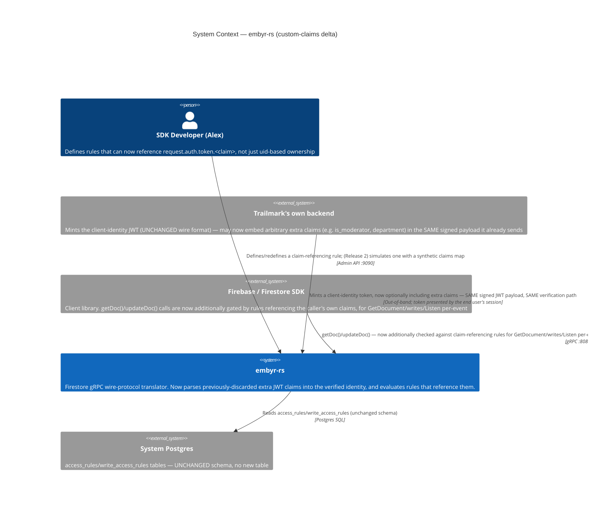
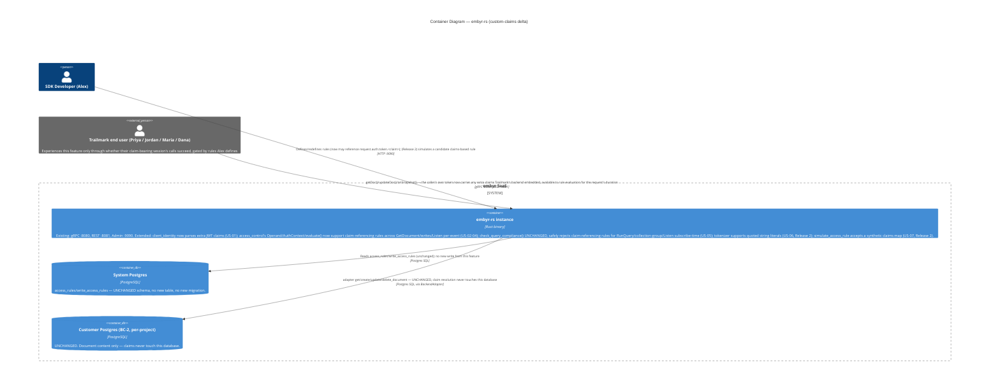

# custom-claims — Feature Delta

**Wave**: DISCUSS | **Agent**: Luna (nw-product-owner) | **Date**: 2026-08-26
**Status**: Ready for DESIGN handoff (one flagged escalation — see § Handoff Package)
**Upstream**: `client-auth` (FINALIZED-equivalent — merged, ADR-024/025/026) and `security-rules` (FINALIZED, `docs/evolution/2026-08-18-security-rules.md`) → `security-rules-write-path` → `security-rules-query-path` → `security-rules-collection-group-rules` → `security-rules-realtime` (all DISCUSS+DESIGN complete). This feature is **genuinely cross-track**, not the next epic in either the Authorization initiative (the 5-epic `security-rules*` series) or the Identity track (`client-auth`) alone. `security-rules`'s own `## Wave: DISCUSS / [REF] Out of Scope` section named it explicitly, quoted verbatim as this feature's own charter: **"Role-based / custom-claims authorization (`request.auth.token.<claim>`) — `VerifiedEndUserIdentity` carries no custom-claims map today; adding one is a cross-epic change to `client-auth`'s own token contract (ADR-024), not this feature's call."**

<!-- markdownlint-disable MD024 -->

---

## Wave: DISCUSS / [REF] Density Resolution

`~/.nwave/global-config.json` was read directly (this agent invocation retains Read access, unlike the `security-rules-realtime` precedent which lacked a Bash tool and could not check it at all): `{"documentation": {"density": "full", "expansion_prompt": "ask-intelligent"}}`. Per the skill's own cascade language ("`mode = "full"` auto-expansion"), Tier-2 [WHY]/[HOW] content is warranted. Given this feature's own unusually large evidentiary burden (a central cross-bounded-context Resolution requiring the same rigor as all 5 prior siblings' own Resolution 1s), Tier-2 content is folded inline into the Tier-1 sections below (each Resolution's "Fit against evidence" column already serves `alternatives-considered`'s purpose; § Persona & Job carries `jtbd-narrative` weight; § Journey states explicitly why it stays a short delta rather than a full `journey-deep-dive`) rather than rendered as separately-headed `[WHY]`/`[HOW]` blocks, to avoid duplicating the same evidence twice under two headings. Trigger check: "Cross-cutting complexity" fires (this feature spans BC-1 `client-auth` token contract AND BC-4 `access_control` grammar — 2 bounded contexts, the defining fact of this feature, per the task framing). "Multi-stakeholder need" fires (Alex, Maria, Dana, plus two new domain-example people below — Priya Nair, Jordan Lee). Both are answered inline, not via a separate expansion file, consistent with `security-rules-write-path`/`query-path`/`collection-group-rules`/`realtime`'s own Lightweight-delta precedent once a persona's mental model is already comprehensively established (`security-rules`'s own Comprehensive pass covers Alex/Maria/Dana's stakes; this feature adds no new emotional arc, only a richer grammar).

---

## Wave: DISCUSS / [REF] Prior Wave Consultation — Reading Confirmation

✓ `docs/feature/security-rules/feature-delta.md` (full, 1302 lines) — § Out of Scope's exact custom-claims deferral quoted verbatim above (line 612); § Job Discovery Framing Resolution (Resolution 1, the locked v1 grammar ceiling: boolean/null literals only, no string/number literals — **OQ-SR-04**, flagged, unresolved as of this feature's own upstream); § System Constraints' "Rule-expressiveness ceiling" bullet (line 320) independently confirms the same custom-claims deferral in different words; § User Stories US-01–US-05 (full) as the template this feature's own stories mirror; § Outcome KPIs, § DoR, § Handoff Package as structural precedent.
✓ `docs/feature/client-auth/feature-delta.md` (full, 973 lines) — § Job Discovery Framing Resolution (locks custom-token-only, v1, Option A — no embyr-hosted identity data, no impersonation capability); § User Stories US-01–US-04 (full) — confirms `VerifiedEndUserIdentity { end_user_id, project_id, expires_at_unix }` is the complete v1 identity shape, and that `client-auth`'s own token format was deliberately NOT constrained to Firebase's real custom-token wire format (ADR-024's "SDK-opacity" finding — `signInWithCustomToken()` treats the token as an opaque string, so the JWT's own claim set is a private contract between Trailmark's backend and embyr, not fixed by the SDK).
✓ `docs/product/architecture/adr-024-client-identity-verification-mechanism.md` (full) — locks Ed25519/EdDSA JWT verification, algorithm-pinning defense, and the exact 3-claim set (`sub`/`aud`/`exp`) `ClientIdentityClaims` currently deserializes. Confirms no `#[serde(deny_unknown_fields)]` anywhere in the struct — extra JWT payload fields are already, today, silently ignored by `serde`'s default behavior (see § Job Discovery Framing Resolution, Finding 1, below — this is load-bearing evidence).
✓ `docs/product/architecture/adr-025-client-identity-credential-storage-rotation.md` (full) — confirms the dual-generation rotation-window shape for the *verification key*, unrelated to and unaffected by this feature (claims live inside the JWT payload the customer signs, not in the registered public-key row this ADR governs).
✓ `docs/product/architecture/adr-026-client-identity-composition-with-api-key-auth.md` (full) — confirms the stateless, per-request re-verification model (Option B, accepted) and the additive, non-mandatory `x-embyr-client-identity` header composition with the existing `api_key` check. Directly relevant: this feature adds zero new wire-level headers or endpoints — claims travel inside the *existing* token this header already carries.
✓ `docs/product/architecture/adr-027-access-rule-grammar-and-evaluation.md` (full) — confirms the locked v1 grammar (`Condition`/`Operand`/`CompareOp`/`AuthContext`/`EvaluationOutcome`), the hand-rolled recursive-descent parser (Option C, accepted, explicitly to prevent the grammar "silently widening" via a parser-generator), the fail-closed-on-missing-field mechanism, and **OQ-SR-04**'s own text: "The locked grammar... admits only `true`/`false` as literal operands — not arbitrary string/number literals... flagged... rather than silently widened... or silently narrowed further."
✓ `docs/feature/security-rules-realtime/feature-delta.md` (full DISCUSS section, 1182 lines, plus targeted DESIGN-section reads for Handoff Package/DoR/Component Decomposition format) — the most recent, most rigorous sibling precedent: Reading Confirmation checklist format, Resolution-table methodology, Elephant Carpaccio slicing, `feature-delta.md` single-narrative-file output, DoR/Outcome-KPI/Handoff-Package templates all mirrored below. Confirms the highest AC number in the `AC-17-XXX` sequence used to date is **AC-17-136** (`realtime`'s own US-06/AC-17-121, US-07/AC-17-130-133, US-03/AC-17-116, US-06 admin-surface/AC-17-136) — this feature continues that sequence from **AC-17-137**, not restarting it.
✓ `docs/product/architecture/adr-029-access-control-composition-and-bounded-context.md` (full) — confirms `AuthContext` is constructed identically, at every one of the 5 already-shipped `handle_get_document`/write-path/`handle_run_query` (group + non-group) call sites, via the single pattern `verified_identity.as_ref().map(|v| AuthContext { uid: v.end_user_id.clone() })` — direct evidence for § Job Discovery Framing Resolution's Finding 4 below, not an assumption.
✓ `crates/embyr-core/src/client_identity/mod.rs` (full, 477 lines) — **confirms directly**: `VerifiedEndUserIdentity { end_user_id: String, project_id: String, expires_at_unix: i64 }`, no custom-claims map. `ClientIdentityClaims { sub: String, aud: String, exp: i64 }` (the `#[derive(serde::Deserialize)]` struct decoded from the JWT payload) has no `#[serde(deny_unknown_fields)]` attribute anywhere in the file — `serde`'s own default behavior silently ignores any JSON object key not named on the struct. `verify_client_identity_token` decodes via `jsonwebtoken::decode::<ClientIdentityClaims>(token, &key, &validation)`, which parses the *entire* JWT payload before mapping onto the 3-field struct — meaning any extra claim Trailmark's backend already embeds today is already present in the decoded JSON, merely discarded at the Rust-struct-mapping step, not absent from the token itself.
✓ `crates/embyr-core/src/access_control/mod.rs` (full, 1496 lines) — **confirms directly**: `Operand` enum's exact current variant set: `AuthUid`, `AuthNullSentinel`, `ResourceField(String)`, `RequestResourceField(String)` (added by `security-rules-write-path`, ADR-030, the direct precedent for adding a new operand cleanly), `BoolLiteral(bool)`, `NullLiteral` — **no string/number literal variant exists**, confirming OQ-SR-04's own text directly against the actual code, not just the ADR's prose. `word_to_operand()`'s dotted-prefix dispatch (`"request.auth.uid"`, `"request.auth"`, `"null"`, `"request.resource.data.<field>"`, `"resource.data.<field>"`) is a flat `match`/`starts_with` chain — a new `"request.auth.token.<claim>"` prefix branch is structurally identical in shape to the two existing dotted-prefix branches, confirmed by direct code read, not inferred. `tokenize()`'s character-level scanner recognizes `(`, `)`, `&&`, `||`, `==`, `!=`, `!`, and identifier/dotted-word runs (`is_ascii_alphanumeric() || '_' || '.'`) — **no quote-character (`'`/`"`) handling exists at all**, confirming a string-literal grammar extension (US-06 below) requires a genuinely new tokenizer branch, not merely a new `Operand` variant. `check_query_compliance()`'s `decompose_decidable()` is a closed `match` over exactly 4 shapes (`Literal`, `AuthNullSentinel != null`, `AuthUid == ResourceField` either order, `And`) with an explicit `_ => Err(Undecidable)` catch-all — confirming any new `Operand` variant referenced inside a rule is automatically, safely `RejectedUnsupportedRuleShape` for `RunQuery`/collection-group/Listen-subscribe-time **without any code change being required to achieve that safety** (§ Job Discovery Framing Resolution, Finding 5).
✓ `crates/embyr-server/src/grpc/handler.rs` (targeted, full-context `Grep` across all `AuthContext`/`evaluate(`/`check_query_compliance(`/`attach_client_identity_if_present`/`VerifiedEndUserIdentity` occurrences, cross-checked against the byte ranges already read in full during `client-auth`/`security-rules`/`security-rules-realtime`'s own DISCUSS+DESIGN passes) — **confirms directly, the central mechanical evidence of this DISCUSS**: `AuthContext { uid: v.end_user_id.clone() }` is constructed via the *identical* one-line closure at every one of 5 distinct call sites — `handle_get_document` (~line 584), `handle_create_document`/`handle_update_document`/`handle_delete_document` (~705, ~804, ~915, write-path), `handle_run_query` non-group and group arms (~1267, ~1303), and `handle_listen`'s `handle_add_target` composition (per `security-rules-realtime`'s own DESIGN section, mirrored placement). No call site constructs `AuthContext` any other way. This is the direct, verified answer to the task's own Resolution-3 question (§ Job Discovery Framing Resolution, Finding 4 below) — not an assumption that it "just works."
✓ `docs/product/jobs.yaml` (full) — JOB-16 (`client-identity-verification`, persona P1, feature `client-auth`) and JOB-17 (`document-access-control`, persona P1, feature `security-rules`, now bearing 5 accumulated realization NOTEs) read in full, including every one of JOB-17's own 5 NOTEs establishing the "same persona, same goal ⇒ extend the existing job, do not mint a new one" pattern this feature must itself apply or deliberately depart from (§ Persona & Job below).
✓ `docs/product/journeys/sdk-developer.yaml` (full) — P1 Alex, jobs `[JOB-01, JOB-03, JOB-16, JOB-17]`, 5 accumulated NOTEs mirroring `jobs.yaml`'s own.

No contradictions found between this feature's scope and any prior artifact's locked decisions. This feature reopens no Resolution from any of the 6 prior epics — it composes an already-Accepted mechanism (`AuthContext`/`evaluate()`/`Operand` extension, mirroring ADR-030's own precedent) with a deliberate, evidenced amendment to a DIFFERENT prior epic's own ADR (ADR-024, `client-auth`), which is precisely the cross-track shape `security-rules`'s own Out-of-Scope entry anticipated and named. One genuine judgment call is flagged, not silently decided — see § Handoff Package.

---

## Wave: DISCUSS / [REF] Orchestrator Decisions (not re-litigated)

| # | Decision | Value |
|---|---|---|
| 1 | Feature Type | Cross-cutting — spans BC-1 Tenant Management's token contract (`client-auth`, ADR-024) AND BC-4 Access Control's condition grammar (`security-rules`, ADR-027/029) — genuinely two bounded contexts' own locked artifacts, unlike any single prior epic in either track |
| 2 | Walking Skeleton | Evaluated (this wave's call): **YES** — see § Walking Skeleton Evaluation |
| 3 | UX Research Depth | **Lightweight** (this wave's own call, evidenced below, not the default) — the central claims-origin question resolves to a pure grammar/type extension with zero new admin API, zero new storage subsystem, and zero new wire format (§ Job Discovery Framing Resolution, Resolution 1). Per the task's own instruction ("Comprehensive if the claims-origin question surfaces real UX complexity... Lightweight if it turns out to be a pure grammar extension — your own call, justify it"), Lightweight is justified precisely because Resolution 1 rules out the UX-complexity trigger (no new admin surface for Alex, no new consequence-arc branch for Maria/Dana beyond what `security-rules`'s own Comprehensive pass already covered) |
| 4 | JTBD Analysis | Yes (default) — extends `job_id: JOB-17` as its 6th realization, with a cross-reference NOTE on `JOB-16` (§ Persona & Job) |

### Walking Skeleton Evaluation (Decision 2)

Three existing mechanisms were evaluated for reuse before concluding what this feature's walking skeleton actually needs to add:

1. **`embyr_core::client_identity::verify_client_identity_token()` / `ClientIdentityClaims` (ADR-024).** Reused, extended minimally: the JWT decode/verify/algorithm-pinning logic is completely unchanged; only the deserialization target struct gains one new optional field. No new admin API, no new endpoint, no new wire header (§ Job Discovery Framing Resolution, Resolution 1).
2. **`embyr_core::access_control::{Operand, evaluate, parse_condition}` (ADR-027, extended by ADR-030's `RequestResourceField` precedent).** Reused and extended via the exact mechanism ADR-030 already established for adding a new operand cleanly — confirmed structurally identical by direct code read (§ Reading Confirmation).
3. **`AuthContext`'s uniform construction across all 5 existing call sites (ADR-029).** Confirmed, by direct `Grep` evidence (not assumed), to be the single, small, universally-effective propagation point the task asked this DISCUSS to verify.

**Verdict**: no existing mechanism lets a rule reference anything about the caller beyond their bare uid — that capability does not exist anywhere in the codebase today. A walking skeleton is needed: claims must survive from mint to verified identity (US-01), a rule referencing a claim must correctly gate at least one already-existing enforcement surface (US-02), the SAME small change must be shown to reach a second, independent surface for free (US-03, proving Resolution 3's hypothesis rather than asserting it), missing claims must fail closed (US-04), and the one enforcement surface that does NOT get claim support "for free" (query-shape compliance) must be proven to fail *safely*, not silently incorrectly (US-05).

---

## Wave: DISCUSS / [REF] Job Discovery — Framing Resolution

This DISCUSS resolves **four** distinct questions, mirroring the rigor every prior sibling's own Resolution table established — the task's central escalation risk (Resolution 1) plus three further questions the investigation surfaced while answering it.

### Foundational findings (evidence, established before any Resolution can be evaluated)

| # | Finding | Evidence |
|---|---|---|
| **Finding 1** | `ClientIdentityClaims` has no `#[serde(deny_unknown_fields)]` — extra JWT payload fields Trailmark's backend already embeds today are silently ignored by `serde`, not rejected, not absent from the signed token itself. Nothing about the wire format needs to change for Trailmark to start sending claims; embyr simply isn't reading them yet. | `crates/embyr-core/src/client_identity/mod.rs:140-145` |
| **Finding 2** | Real Firebase's own `admin.auth().createCustomToken(uid, developerClaims)` call — the mint-time function for the exact custom-token flow `client-auth`'s own ADR-024 Option A already locked as embyr's v1 (and only) identity model — already supports embedding arbitrary developer-defined claims directly into the custom token at mint time; Firebase's own token-exchange step copies them into the resulting ID token. `setCustomUserClaims()` (the *separate*, request-time-settable admin API real Firebase also offers) exists specifically for identity providers where there is no customer-minted custom token step (email/password, OAuth) — a case ADR-024 already locked OUT of embyr's v1 scope (Option B, `client-auth`'s own Framing Resolution). | Documented behavior of the Firebase Admin SDK's custom-token flow, cross-referenced against `docs/feature/client-auth/feature-delta.md` § Job Discovery Framing Resolution (Option A, locked) |
| **Finding 3** | `Operand`'s existing variant set has no string/number literal (`BoolLiteral`/`NullLiteral` only) — **OQ-SR-04**, flagged by `security-rules`'s own ADR-027 as unresolved. The single most natural custom-claims domain example (`request.auth.token.role == "admin"`) is **not expressible** under the grammar as it stands today. | `crates/embyr-core/src/access_control/mod.rs:66-77` (`Operand` enum); `docs/product/architecture/adr-027-access-rule-grammar-and-evaluation.md` § Grammar Gap Flagged for DISTILL |
| **Finding 4** | `AuthContext` is constructed identically, via the same one-line closure, at every one of 5 already-shipped call sites (`GetDocument`, Create/Update/Delete, `RunQuery` non-group + group). `evaluate()` is the shared function GetDocument/write-path/Listen-per-event all call, unchanged; `check_query_compliance()` is the SEPARATE, more restrictive shared function `RunQuery`/collection-group/Listen-subscribe-time all call, with an explicit closed-`match`-plus-catch-all decidable-atom set. | `Grep` results across `crates/embyr-server/src/grpc/handler.rs` (§ Reading Confirmation); `crates/embyr-core/src/access_control/mod.rs::decompose_decidable` |

### Resolution 1 (THE central architectural question) — Where does a custom claim originate?

| Option | Description | Fit against evidence |
|---|---|---|
| **(A) Request-time lookup via a new admin API + System DB storage** | Alex calls a new admin endpoint to register/update a per-`end_user_id` claims map; embyr stores it in the System DB and looks it up, keyed by `end_user_id`, at every rule-evaluation call | **Rejected.** Would require embyr to custody a NEW class of PII-adjacent data about Trailmark's *end users* — a materially different, and larger, custody expansion than anything `client-auth`'s own Framing Resolution accepted (which locked custom-token-only specifically to AVOID embyr becoming an identity data custodian, Option A vs. B). It would also insert a NEW System DB round-trip, keyed by `end_user_id`, into `evaluate()`'s call path — breaking the zero-IO invariant `embyr-core::access_control` has held since ADR-027 (Decision Driver 3) and that every one of the 5 prior authorization epics has preserved without exception (enforced by `deny.toml`). It duplicates data Trailmark's own backend already knows, requiring a SECOND synchronization step (register-then-mint, register-then-update-again on every role change) with no clear trigger event — exactly the operational-friction pattern `security-rules`'s own Resolution 3 rejected register-then-rotate for rule *definition* itself. |
| **(B) Mint-time-embedded — Trailmark's own backend embeds the claim directly in the JWT payload when minting the custom token (extends `ClientIdentityClaims` beyond `sub`/`aud`/`exp`)** | `verify_client_identity_token()` parses the already-present-in-the-signed-payload claims into an extended `VerifiedEndUserIdentity`/`AuthContext`, at the exact moment it already parses `sub`/`aud`/`exp` — zero new I/O, zero new endpoint | **Strongest fit, by direct evidence.** This is not a novel invention for embyr to design — it is literally how real Firebase's own `createCustomToken(uid, developerClaims)` already works for exactly the custom-token flow ADR-024 already locked as embyr's only v1 identity model (Finding 2). Zero wire-format change is needed from Trailmark's side at all (Finding 1 — extra claims are already silently present in, merely un-parsed from, the signed JWT today). Zero new custody liability: embyr never stores a claim at rest; it exists only transiently inside the already-verified token's claims, exactly like `sub`/`aud`/`exp` already do. Zero new I/O: claims arrive already-parsed as part of the SAME `jsonwebtoken::decode()` call embyr already performs — composes cleanly with `evaluate()`'s existing pure/zero-IO invariant via the exact `AuthContext`-construction call site ADR-029 already established. |
| **(C) Customer-hosted claims-fetch endpoint — embyr calls out to Trailmark's own API per request to fetch current claims** | Mirrors ADR-024's own rejected Option B (customer-hosted JWKS) at the claims layer | **Rejected, for the identical reason ADR-024 already rejected JWKS for v1.** Adds a new outbound network dependency on the hot request path (fetch/cache/timeout/handle-Trailmark's-endpoint-being-down), a new Earned Trust probe surface disproportionate to this feature's scope, and requires Trailmark to stand up and operate a new discovery endpoint — directly working against JOB-16's own push force ("make multi-user migration *tractable*"), the exact language ADR-024 already used to reject the structurally identical JWKS option. |

**Resolution**: **(B) is locked — mint-time-embedded, via an extension to `client-auth`'s own token contract (ADR-024).** This is precisely the "cross-epic change to `client-auth`'s own token contract... not this feature's call" that `security-rules`'s own Out-of-Scope deferral anticipated (quoted verbatim above) — confirming this feature's own charter and its genuinely cross-bounded-context shape.

**Confidence and escalation note**: **HIGH confidence**, independently triangulated from three separate pieces of direct evidence, not asserted: (1) real Firebase's own documented mechanism for exactly the custom-token flow `client-auth` already locked (Finding 2), (2) the already-present, already-silently-ignored extra-claims capacity in the current JWT decode path (Finding 1), and (3) the zero-IO architectural invariant every one of the 5 prior authorization epics has held without exception, which Option A would have been the first to break and Option B does not touch. Unlike `client-auth`'s own Framing Resolution (which flagged genuine, unresolvable-from-evidence-alone uncertainty about whether embyr-hosted email/password was needed), this Resolution closes cleanly — **not escalated** to the Handoff Package as an open question. What IS flagged as a genuine judgment call is Resolution 3 below (whether to resolve OQ-SR-04's string-literal gap in-scope), which the claims-origin question's own resolution did not settle.

### Resolution 2 — How does a rule reference a claim? (grammar-extension mechanism)

| Option | Description | Fit against evidence |
|---|---|---|
| **(A) Reopen ADR-027's own parser-technology choice** — adopt a general-purpose expression library now that the grammar needs to grow | **Rejected — already settled, and reopening it here would contradict a locked decision.** ADR-027 rejected a parser-generator specifically because the grammar's smallness is a deliberate, evidence-backed constraint (`security-rules` Resolution 1), not a temporary limitation. This feature's own need (one more operand kind) does not change that calculus. |
| **(B) A wholly separate `ClaimCondition` AST, evaluated by a second function alongside `evaluate()`** | Claims get their own mini-grammar and evaluator, kept structurally apart from `Condition`/`evaluate()` | **Rejected.** Violates BC-4's own "extend, don't duplicate" discipline (ADR-029), already reused by every prior epic. A claim check composing with an ownership check (`request.auth.token.is_moderator == true \|\| request.auth.uid == resource.data.owner_id`) is a completely ordinary domain need (US-02 below) that a second, separate AST could not express without its own boolean-combinator layer duplicating `Condition::And`/`Or`/`Not` — reinventing exactly what already exists. |
| **(C) A new `Operand::AuthTokenClaim(String)` variant within the existing `Condition`/`Operand`/`evaluate()` structure, mirroring `RequestResourceField`'s own precedent — Accepted** | One new operand, one new `word_to_operand()` dotted-prefix branch, one new `resolve_field_value`/`compare_operands` resolution arm against a new `claims: BTreeMap<String, FieldValue>` field on `AuthContext` | **Strongest fit, direct structural precedent.** `security-rules-write-path`'s own ADR-030 already established the exact mechanism for adding an operand cleanly (`RequestResourceField`, its own dotted-prefix parser branch, its own fail-closed resolution arm against a second resource map) — confirmed reusable verbatim by direct code read (§ Reading Confirmation). Representing claim values as `FieldValue` (the SAME type `resource_fields`/`request_resource_fields` already use) means comparisons between a claim and a resource field (US-02's ABAC domain example) fall through to the EXISTING `FieldValue::PartialEq` catch-all in `compare_operands` — no new comparison logic needed for that case at all. |

**Resolution**: **(C) is locked.** `Operand::AuthTokenClaim(String)`, parsed via a `"request.auth.token."`-prefix branch in `word_to_operand()` (structurally identical to the existing `"resource.data."`/`"request.resource.data."` branches), resolved against a new `AuthContext.claims: BTreeMap<String, FieldValue>` field, reusing the identical `FieldMissing`-short-circuit fail-closed mechanism ADR-027 already established for resource fields (an absent claim collapses the whole evaluation to `Deny`, exactly like an absent resource field does today).

**Confidence**: HIGH — this is the single most directly precedented decision in this entire DISCUSS; `RequestResourceField`'s own addition (one release cycle ago) is the exact playbook, confirmed by direct code read rather than by analogy alone.

### Resolution 3 — Does the locked v1 literal ceiling (OQ-SR-04) block this feature's own core value, and if so, is resolving it this feature's job?

| Option | Description | Fit against evidence |
|---|---|---|
| **(A) Leave OQ-SR-04 unresolved; ship v1 custom-claims support scoped to boolean/null-comparable claims and claim-vs-resource-field comparisons only** | Domain examples restricted to `request.auth.token.is_moderator == true` and `request.auth.token.department == resource.data.department` shapes — no string-literal claim comparisons | **Rejected as the sole v1 scope, not rejected as a valid WALKING-SKELETON scope.** These shapes are genuinely useful and DO ship in the walking skeleton (US-02/US-03 below) — but role-based access control, the single most common real-world custom-claims pattern and the literal phrase this feature is named after ("role-based... authorization" in `security-rules`'s own deferral text), is a *string*-valued comparison (`role == "admin"`) in the overwhelming majority of real Firestore/Firebase apps. Shipping this feature without ever being able to express that specific, evidenced, named pattern would leave the feature's own headline use case unbuildable. |
| **(B) Resolve OQ-SR-04 fully — widen the grammar to a general string/number/boolean literal type** | Extend `Operand` to accept arbitrary typed literals broadly, beyond what claims specifically need | **Rejected as over-scoped.** Widening the grammar generally (numbers, arbitrary-precision comparisons, etc.) is more than this feature's own evidence supports — no domain example here needs numeric-literal comparison. Mirrors Decision Driver 1's own "do not silently widen beyond what's evidenced" discipline. |
| **(C) Resolve OQ-SR-04 narrowly — add string-literal support only (a new `Operand::StringLiteral(String)` plus quoted-string tokenizer support), scoped and named explicitly as this feature's own contribution, not a silent grammar-wide change — Accepted, Release 2** | String literals only; number literals remain out of scope, named as a further candidate follow-up if evidence emerges | **Strongest fit.** Directly unblocks the single most evidenced custom-claims domain example (role equality) without widening the grammar beyond what THIS feature's own domain examples require. Mirrors `security-rules-realtime`'s own precedent for deciding to fix a causally-entangled pre-existing gap in-scope (Findings 2/5) rather than deferring it to a separate feature, reasoned the same way here: shipping "custom claims" without string-literal support would be shipping a feature that cannot express its own namesake use case. |

**Resolution**: **(C) is locked, scoped to Release 2 (US-06)** — not part of the walking skeleton (boolean/null/field-comparable claims, US-01–US-05, ship independently and prove the core mechanism first), but locked as in-scope for this feature rather than deferred to a separate, later epic.

**Confidence and escalation note**: **MEDIUM-HIGH, not full, confidence** — this is the one genuine judgment call in this DISCUSS the orchestrator should confirm, not a silent decision. The case FOR resolving it here is strong (evidenced by the feature's own name and the universal real-world pattern), but unlike Resolution 1's clean closure, this is a scope-boundary call about how much of a pre-existing, cross-cutting gap (OQ-SR-04 affects the WHOLE grammar, not just claims) one feature should absorb versus name as a separate follow-up. Flagged explicitly in § Handoff Package, mirroring `security-rules-realtime`'s own escalation-note discipline for its analogous Findings-2/5-in-scope call.

### Resolution 4 — Does this feature touch write/query/collection-group/realtime enforcement too, or only the base evaluation function?

Directly verified, not assumed (per the task's own instruction), via Finding 4's `Grep` evidence:

- **`evaluate()`-based surfaces (GetDocument, write-path, Listen per-event) get claim support automatically, for free, the moment `AuthContext`/`Operand` are extended** — because these three surfaces already thread `AuthContext` through the identical, already-shipped one-line construction pattern, and `evaluate()`'s own `compare_operands`/`resolve_field_value` dispatch is a plain `match` that a new `Operand::AuthTokenClaim` arm slots into without touching any RPC-handler code (US-02 proves GetDocument; US-03 proves write-path reuses the identical change with zero additional code).
- **`check_query_compliance()`-based surfaces (RunQuery non-group + group, Listen subscribe-time) do NOT get automatic support** — `decompose_decidable()`'s closed `match` has an explicit `_ => Err(Undecidable)` catch-all, meaning a claim-referencing rule is **safely, structurally rejected** (`RejectedUnsupportedRuleShape`) for these three surfaces without this feature writing a single line of new code to achieve that safety (US-05 proves this is a *safe* default, not a silent bug).

**Resolution**: this feature's own claim-referencing rules are immediately, fully usable for GetDocument/write-path/Listen-per-event (Release 1), and safely — never silently incorrectly — unusable for RunQuery/collection-group/Listen-subscribe-time until a separate, later, named follow-up extends `check_query_compliance()`'s own decidable-atom set (§ Out of Scope).

---

## Wave: DISCUSS / [REF] Persona & Job

**Persona**: **P1 — Alex, SDK Developer** (existing persona, unchanged). No new persona work — Decision 3 (Lightweight) confirms Alex's authoring mental model is already comprehensively established across 6 prior epics (`client-auth` + the 5-epic authorization initiative).

**Domain-example company**: **Trailmark**, continued. Collections: `journal_entries` (Maria's/Dana's private trip-journal entries, existing ownership rule — reused unchanged for US-04's fail-closed domain example); `flagged_content` (**new** — user-generated content flagged for moderator review, gated on a boolean custom claim, US-02's primary domain example); `support_tickets` (**new** — Trailmark's own internal support tooling, gated on a department-attribute claim compared to a resource field, US-02/US-03's ABAC domain example); `trail_guides` (published content, unaffected regression check).

**New domain-example people** (per Core Principle 6, concrete over abstract):
- **Priya Nair** (`end_user_id: priya-nair`) — a Trailmark community moderator. Her custom-token claims include `is_moderator: true`, embedded by Trailmark's own backend at mint time (Resolution 1). Used in US-02's primary domain example.
- **Jordan Lee** (`end_user_id: jordan-lee`) — a Trailmark support agent. Claims include `department: "billing"`. Used in US-02/US-03's ABAC domain example against `support_tickets` documents carrying a `department` field.

**job_id decision (per Decision 4)**: **this feature extends JOB-17 (`document-access-control`) as its 6th realization — it does not mint a new job — and carries a cross-reference NOTE on JOB-16 (`client-identity-verification`), since it also amends that job's own architectural artifact (ADR-024).** Reasoning, applying the SAME "same persona, same goal ⇒ extend, don't mint" test every one of JOB-17's 5 prior realizations already used: Alex's GOAL here is unchanged from JOB-17's own job story — "define access-control rules per collection and have embyr enforce them" — custom claims are a RICHER way of expressing WHO satisfies a rule (role/attribute-based, not merely per-document-ownership-based), exactly analogous to how `security-rules-write-path` added a new operand (`RequestResourceField`) or `security-rules-realtime` added a new enforcement surface — both were "next increment of the same goal," neither minted a new job. The fact that this feature ALSO touches JOB-16's own token-contract artifact (ADR-024) does not change Alex's GOAL — it changes WHICH bounded context supplies the means, which is precisely why this feature is legitimately cross-cutting (§ Orchestrator Decisions) while still being the same job. This mirrors `card-payments-backend`'s own precedent for touching two features' worth of surface while remaining "one job's own make-it-real extension," not a new job.

**Opportunity scoring**: JOB-17's existing opportunity score (17, priority critical) is unchanged — this feature does not create a new job. The urgency case specifically for this feature: every one of the 5 prior JOB-17 realizations gave Alex per-document, per-collection, and now per-event/per-query authorization — but ALL of it has been pure-ownership-shaped (`request.auth.uid == resource.data.<field>`) or auth-presence-shaped (`request.auth != null`). Real Firestore/Firebase apps commonly need role- and attribute-based rules (moderators, support staff, admins) that pure ownership-equality cannot express at all — Alex migrating such an app hits a hard wall the moment his `firestore.rules` file references `request.auth.token.<claim>` anywhere, which is an extremely common pattern in real-world rules files, not an edge case.

---

## Wave: DISCUSS / [REF] Scope Assessment (Elephant Carpaccio Gate)

Run before journey/story-map investment, per Phase 1.5.

| Signal | Threshold | This feature | Fired? |
|---|---|---|---|
| User stories | >10 | 7 (US-01 through US-07) | **NO** |
| Bounded contexts / modules | >3 | **2** — BC-1 (`client-auth`'s `ClientIdentityClaims`/`VerifiedEndUserIdentity`, ADR-024) and BC-4 (`access_control`'s `Operand`/`AuthContext`/`evaluate`, ADR-027/029). Confirmed by direct evidence: no RPC-handler code changes anywhere (Resolution 4 — `AuthContext` extension propagates automatically through already-shipped call sites), so BC-2/BC-3 are untouched | **NO** |
| Walking Skeleton integration points | >5 | 5 — token/type extension (US-01) + GetDocument claim gate (US-02) + write-path claim gate (US-03, proving the reuse hypothesis) + fail-closed missing-claim (US-04) + query-path safe-rejection proof (US-05) | **NO** (at threshold, not exceeding — mirrors 3 of the 5 prior siblings' own identical "borderline, at threshold" finding) |
| Estimated effort | >2 weeks | 7 slices, ~7.5 days total (§ Elephant Carpaccio Slices) | **NO** |
| Independent shippable outcomes | multiple | **NO** — US-01 alone is inert (claims exist on the verified identity but no rule references them yet), exactly mirroring `client-auth`'s own US-01/US-02 pairing; US-02–US-05 are the inseparable proof that the mechanism works, fails closed, and fails *safely* where it doesn't reach; US-06/US-07 are genuinely separable Release-2 enhancements, normal sequencing not multiple WS-level outcomes | **NO** |

**0 of 5 signals fired outright; 1 sits exactly at threshold without exceeding it. Verdict: PASS — right-sized.** No split needed.

---

## Wave: DISCUSS / [REF] Journey — Short Delta (Lightweight, per Decision 3)

Per Decision 3, Alex's authoring mental model and Maria/Dana's downstream stakes are already comprehensively established in `security-rules`'s own journey (Comprehensive pass). This feature adds exactly one delta to Alex's mental model, no new emotional arc, and no separate `journey-*.yaml` artifact (consistent with every prior JOB-17 realization's own Lightweight-delta precedent).

**What's new in Alex's mental model**: Alex learns that a custom claim is something **his own backend embeds in the token at mint time** — the same place he already sets `sub`/`aud`/`exp` when calling his own token-minting code — not a new registration step against embyr's admin API. This mirrors, and directly extends, the mental model `client-auth`'s own Lightweight journey already established for the base token itself; Alex does not learn a new mechanism, only a richer payload for the one he already uses. His existing rule-authoring flow (define condition → simulate → publish, `security-rules`'s own US-01/US-05) is completely unchanged in shape — only the vocabulary of what a condition can reference grows by one operand family.

**Rule-evaluation flow delta** (extends `security-rules`'s own per-document flow; not reproduced in full):

```
A GetDocument/Create/Update/Delete call arrives, an existing rule references
request.auth.token.<claim>
        │
   (authenticate() + attach_client_identity_if_present() — UNCHANGED,
    now additionally exposes claims: BTreeMap<String, FieldValue> on the
    resolved VerifiedEndUserIdentity, per US-01)
        │
        ▼
   evaluate() (ADR-027, extended) resolves the claim exactly like a
   resource field: present + matches -> continues; absent -> FieldMissing,
   the WHOLE condition denies (US-04) -- no new special case
        │
   ┌────┴─────┐
  allow       deny
   │            │
   ▼            ▼
 unchanged   PermissionDenied, attributable to the rule,
 response    identical shape to every other rule denial already shipped
```

**A RunQuery/collection-group query or a Listen subscription arrives against a claim-referencing rule** (US-05): `check_query_compliance()`'s existing `RejectedUnsupportedRuleShape` catch-all fires — the SAME outcome an unrecognized rule shape already produces today for any other undecidable `Condition` (e.g. `Or`/`Not`), requiring zero new code to be safe, only a domain example proving it (US-05).

---

## Wave: DISCUSS / [REF] Story Map & Walking Skeleton

**Persona**: P1 Alex | **Goal**: Give Alex's rules the ability to reference *who* the caller is beyond their bare document-ownership uid — their role, department, or any other attribute Trailmark's own backend already knows and chooses to embed at token-mint time — reusing the identical enforcement mechanism every already-shipped rule-authoring surface uses, and failing safely (never silently) wherever that mechanism doesn't yet reach.

### Backbone

| A. A Claim Survives From Mint to Verified Identity | B. A Rule References a Claim and Is Correctly Enforced | C. The Grammar Expresses Real-World Role Checks |
|---|---|---|
| A claim Trailmark's backend embeds at mint time is present on the verified identity **[WS]** | A boolean-claim rule gates a GetDocument read **[WS]** | Alex compares a claim to a string literal (e.g. `role == "admin"`) |
| A token minted with no claims verifies exactly as before **[WS]** | The identical rule mechanism gates writes, for free **[WS]** | Alex simulates a claims-based rule before publishing |
| | A missing claim fails closed **[WS]** | |
| | A claim-referencing rule safely, not silently, blocks RunQuery/Listen-subscribe-time until a named follow-up **[WS]** | |

### Walking Skeleton

Priya Nair's Trailmark session presents a token minted with `is_moderator: true` (Activity A, US-01); Alex's rule `request.auth.token.is_moderator == true` on `flagged_content` correctly allows Priya's `getDoc()` and correctly denies Maria's or Dana's (Activity B, US-02); the identical operand, used in a `write_access_rules` condition for the same collection, correctly gates Priya's `updateDoc()` too — with zero additional code beyond US-02's own change (Activity B, US-03, the proof of Resolution 4's hypothesis); a session whose token was minted without the `is_moderator` claim at all is denied, never crashes (Activity B, US-04); a `RunQuery` or Listen subscription against `flagged_content` is rejected outright with the SAME `RejectedUnsupportedRuleShape` outcome an undecidable rule already produces today, proving the limitation is scoped precisely and safely (Activity B, US-05). `journal_entries`'s existing ownership rule and the full pre-existing regression suite (136+ scenarios across all 6 prior epics) remain provably unaffected. No facade, real System DB rule state, real Priya/Jordan/Maria/Dana signed-in sessions — mirrors all 5 prior authorization-track siblings' own WS discipline exactly.

### Release 1 — Claims Are Real, Reused, and Safe (Slices 01–05, US-01 through US-05)

Outcome: any rule Alex writes can reference a custom claim Trailmark's own backend already embeds, correctly gating GetDocument and writes, failing closed on a missing claim, and failing safely (not silently) wherever query-shape compliance doesn't yet reach.

### Release 2 — The Grammar Expresses What Custom Claims Are Actually For (Slices 06–07, US-06, US-07)

Outcome: Alex can write the single most common real-world custom-claims pattern (`role == "admin"`) and can prove a candidate claims-based rule works before publishing it.

---

## Wave: DISCUSS / [REF] Elephant Carpaccio Slices

| Slice | Story | Release | Estimate | Learning Hypothesis (disproves) | Production-data taste test |
|---|---|---|---|---|---|
| 01 (WS) | US-01 | 1 | 1 day | A custom claim Trailmark's backend embeds at mint time cannot survive, unmodified, through embyr's existing JWT verification into a form the evaluator can read, without a wire-format change or a new admin API | Real Ed25519-signed token minted with a real extra claim, real `verify_client_identity_token()` call, real assertion the claim round-trips |
| 02 (WS) | US-02 | 1 | 1.5 days | A rule referencing `request.auth.token.<claim>` cannot be parsed and evaluated within the existing `Condition`/`Operand`/`evaluate()` structure, mirroring `RequestResourceField`'s own precedent, without either a new AST or a new evaluator | Real `flagged_content` rule, real Priya Nair (`is_moderator: true`) and Maria/Dana (no such claim) sessions, real GetDocument calls |
| 03 (WS) | US-03 | 1 | 0.5 day | The identical operand extension does NOT, in fact, reach `write_access_rules`'s own already-shipped enforcement for free — disproving Resolution 4's central hypothesis if it fails | Real `write_access_rules` condition on `flagged_content` using the identical claim operand, real Priya `updateDoc()` call, zero new production code beyond US-02's own change |
| 04 (WS) | US-04 | 1 | 0.5 day | A claim absent from the caller's verified identity cannot be made to fail closed using the exact same `FieldMissing` mechanism already proven for resource fields, without a new special case | Real session with a token minted WITHOUT the referenced claim, real assertion of Deny-never-crash |
| 05 (WS) | US-05 | 1 | 1 day | A claim-referencing rule cannot be proven to fail SAFELY (not silently) against `RunQuery`/collection-group/Listen-subscribe-time using the existing `RejectedUnsupportedRuleShape` catch-all, without new code being required to achieve that safety | Real `flagged_content` rule referencing the claim, real `RunQuery`/collection-group/Listen-subscribe attempts, real assertion of outright rejection, zero new `embyr_core::access_control` code touched |
| 06 | US-06 | 2 | 1.5 days | A rule cannot compare a claim (or any operand) to a string literal without a genuinely new tokenizer branch (quote handling does not exist today) and a new `Operand` variant | Real `support_tickets` rule `request.auth.token.department == "billing"`, real Jordan Lee session, real string-literal parse/evaluate round-trip |
| 07 | US-07 | 2 | 1 day | A claims-based rule cannot be simulated via the exact same evaluation routine real enforcement uses without duplicating (and risking drift in) the evaluation logic a sixth time | Real candidate claims-based rule + real synthetic identity carrying a synthetic claims map, checked against the real `evaluate()` routine |

**Total estimate: ~7 days.**

**Taste tests applied**:
- "4+ new components per slice" — none exceeds 2 (Slice 01: struct field extension, no new component; Slice 02: new `Operand` variant + parser branch, one component; Slice 03: zero new components — pure reuse proof; Slice 04: zero new components — extends an existing mechanism; Slice 05: zero new components — pure proof obligation; Slice 06: new tokenizer branch + new `Operand` variant, two components; Slice 07: thin wrapper over the existing simulation handler). PASS.
- "Every slice depends on a new abstraction" — Slice 02 (`AuthTokenClaim` operand) is the one genuinely new abstraction; Slices 01/03/04/05/07 build on it or on already-existing mechanisms without introducing their own; Slice 06 introduces a second, independent new abstraction (string literals) deliberately sequenced into Release 2, after the core mechanism (Slices 01–05) has already shipped and been proven. PASS — natural sequencing, not forced dependency inflation.
- "No slice disproves a pre-commitment" — each has a distinct, falsifiable hypothesis (see table); Slice 03 and Slice 05 are explicitly designed to DISPROVE, not merely confirm, this DISCUSS's own central Resolution-4 hypothesis if the code does not actually behave as evidenced. PASS.
- "Synthetic-data-only slices prove plumbing, not value" — N/A; all 7 slices require real Ed25519-signed tokens, real System DB rule state, and real named sessions (Priya, Jordan, Maria, Dana). PASS.
- "2+ slices identical except for scale" — none; each targets a distinct proof obligation (claim-survival / GetDocument-gate / write-path-reuse / fail-closed / query-path-safety / string-literal / simulate). PASS.

---

## Wave: DISCUSS / [REF] Prioritization

| Priority | Slice | Target Outcome | Rationale |
|---|---|---|---|
| 1 | Slice 01 (WS) | A claim survives from mint to verified identity | Prerequisite for everything else — no rule can reference a claim that doesn't exist on `AuthContext` yet |
| 2 | Slice 02 (WS) | A boolean-claim rule gates a GetDocument read | Burns down the riskiest new assumption first (Resolution 2's operand-extension hypothesis) on the single already-most-proven enforcement surface (GetDocument) |
| 3 | Slice 03 (WS) | The identical mechanism gates writes, for free | The single most important proof in this DISCUSS — directly tests Resolution 4's own central hypothesis; sequenced immediately after Slice 02 so a disproof is caught early, before Release-2 investment |
| 4 | Slice 04 (WS) | A missing claim fails closed | Closes the highest-consequence security gap (an unhandled-missing-claim panic or silent-allow would be a regression of ADR-027's own "never crashes" guarantee) |
| 5 | Slice 05 (WS) | A claim-referencing rule fails safely against query-path surfaces | The proof that this feature's own known limitation (Resolution 4) is a documented safety property, not a silent bug — sequenced last within the WS as a proof *over* Slices 01–04's real behavior |
| 6 | Slice 06 | String-literal claim comparison | Highest-leverage for Alex's actual real-world use case (role-based checks), but correctly sequenced after the core mechanism is proven — a Release-2 grammar widening, not a WS-blocking prerequisite |
| 7 | Slice 07 | Alex can pre-check a candidate claims-based rule | Depends on Slice 02's mechanism (and ideally Slice 06's string-literal support) existing to wrap |

---

## Wave: DISCUSS / [REF] System Constraints

- **Claims origin is LOCKED to Resolution 1's Option B (mint-time-embedded).** DESIGN must not implement a new admin API for per-end-user claims registration under any framing, including as an "interim MVP" — Resolution 1 explicitly rejected the request-time-lookup model on zero-IO-invariant grounds, not merely as a stylistic preference.
- **Zero wire-format change to the token itself.** Trailmark's backend embeds claims in the SAME JWT payload it already signs; embyr's algorithm-pinning (EdDSA-only) and signature-first-verification-order defenses (ADR-024 Enforcement) are completely unchanged — this feature touches deserialization only, never the cryptographic verification path.
- **`Operand::AuthTokenClaim(String)` is LOCKED to Resolution 2's Option C** — a new operand within the existing `Condition`/`evaluate()` structure, mirroring `RequestResourceField`'s own precedent exactly. No second AST, no second evaluator.
- **The claim value type is `FieldValue`** (the identical type `resource_fields`/`request_resource_fields` already use), stored on a new `AuthContext.claims: BTreeMap<String, FieldValue>` field — DESIGN's exact representation choice, but the *shape* (reuse `FieldValue`, do not invent a new claim-value type) is locked, since it is what makes claim-to-resource-field comparisons (US-02's ABAC domain example) fall through to the existing `FieldValue::PartialEq` catch-all for free.
- **Fail-closed semantics for a missing claim reuse the existing `FieldMissing` mechanism unchanged** — an absent claim collapses the WHOLE evaluation to `Deny`, exactly like an absent resource field does today (AC-17-146). No new error class, no new special case.
- **String-literal support (Resolution 3) is LOCKED to Release 2 (US-06), scoped narrowly to strings only** — DESIGN must not widen this to numeric literals or arbitrary expression types under this feature's own authority; that remains a further, separately-evidenced candidate follow-up.
- **`check_query_compliance()` (`RunQuery`, collection-group, Listen subscribe-time) receives ZERO code changes in this feature.** A claim-referencing rule is safely, structurally rejected (`RejectedUnsupportedRuleShape`) for these three surfaces via the ALREADY-EXISTING catch-all — DESIGN must not attempt to extend `decompose_decidable()`'s decidable-atom set as part of this feature; that is explicitly out of scope (§ Out of Scope), a named, separately-scoped follow-up.
- **No regression to any of the 6 prior epics' own already-shipped behavior.** `access_rules`, `write_access_rules`, `group_access_rules`, `check_query_compliance()`, and every existing rule that does NOT reference a claim must produce byte-for-byte identical outcomes to before this feature shipped — the 136+-scenario regression baseline across all 6 prior epics is this feature's own AC-16-08/AC-17-16-equivalent guardrail.
- Ubiquitous language introduced: **custom claim** (an arbitrary key/value Trailmark's own backend embeds in the minted token, e.g. `is_moderator`, `department`), **claim reference** (`request.auth.token.<claim>` inside a condition), **claims map** (`AuthContext.claims`, the parsed representation available to the evaluator). These terms should carry forward into DESIGN's naming, not be silently renamed.

---

## Wave: DISCUSS / [REF] User Stories

### US-01: A Custom Claim Survives From Mint to Verified Identity

**job_id**: JOB-17 (cross-references JOB-16 — this story amends `client-auth`'s own ADR-024 token contract)
**Slice**: 01 (Walking Skeleton) | **Release**: 1

#### Elevator Pitch
Before: Trailmark's backend can already embed any extra field it wants in the token it mints (nothing stops it cryptographically), but embyr silently discards everything except `sub`/`aud`/`exp` — a claim exists in the signed token but is invisible to everything downstream.
After: Trailmark's backend mints a token including `is_moderator: true` for Priya Nair (exact minting call unchanged — same `sub`/`aud`/`exp` plus one more JSON field) → Priya's session, once verified, carries that claim on her resolved identity, available to any rule evaluation for the rest of her request.
Decision enabled: Alex knows a claim his backend already embeds today will actually reach his rules once he writes one that references it — the prerequisite every other story in this feature depends on.

#### Domain Examples
1. **Happy Path**: Trailmark mints a token for Priya Nair (`sub: priya-nair`, `aud: trailmark-prod`, `is_moderator: true`, `exp: <1h future>`). embyr verifies it; the resolved identity carries `claims: {"is_moderator": true}`.
2. **Edge Case**: Trailmark mints a token with no extra claims at all (exactly as every existing token does today). embyr verifies it exactly as before — an empty claims map, zero observable behavior change for any rule that doesn't reference a claim.
3. **Error/Boundary**: Trailmark mints a token where `is_moderator` is present but the JSON value is a string (`"true"`) rather than a boolean. embyr's parsed claims map reflects the actual JSON type present (`FieldValue::String("true")`, not coerced to `FieldValue::Boolean(true)`) — no silent type coercion.

#### UAT Scenarios (BDD)

##### Scenario: A claim embedded at mint time is present on the verified identity
Given Trailmark's backend mints a token for Priya Nair including the claim `is_moderator: true`, signed against `trailmark-prod`'s registered credential
When Priya's session presents that token and embyr verifies it
Then the resolved verified identity's claims include `is_moderator: true`, exactly as minted

##### Scenario: A token with no claims verifies exactly as before this feature shipped
Given Trailmark's backend mints a token for Maria Santos with no extra claims (the existing, unchanged minting pattern)
When Maria's session presents that token and embyr verifies it
Then verification succeeds exactly as it did before this feature shipped, and the resolved identity's claims map is empty

##### Scenario: A claim's JSON type is preserved, never silently coerced
Given Trailmark's backend mints a token where a claim's value is a JSON string, not a boolean
When embyr verifies that token
Then the resolved claims map reflects the actual JSON type presented, with no silent coercion to a different type

#### Acceptance Criteria
- [ ] AC-17-137: A custom claim embedded in the token at mint time is present on the verified identity after verification, exactly as minted (round-trip, no truncation/coercion).
- [ ] AC-17-138: A token minted with no claims at all verifies exactly as before this feature shipped (empty claims map, zero regression).
- [ ] AC-17-139: The claims map is available to embyr's own request handling for at least the duration of the verified-request lifecycle, sufficient for rule evaluation to consume it.
- [ ] AC-17-140: The full pre-existing regression suite (all 6 prior epics, 136+ scenarios) passes unmodified — no wire-format change, no signature-verification-order change.

#### Outcome KPIs
See § Outcome KPIs below (feeds KPI #1, North Star).

#### Technical Notes (Optional)
Extends `ClientIdentityClaims` (currently `sub`/`aud`/`exp` only) and `VerifiedEndUserIdentity` (ADR-024) with a claims representation — exact serde mechanism (flatten remaining fields vs. an explicit `#[serde(flatten)] extra: BTreeMap<String, serde_json::Value>`) is DESIGN's call. This is an amendment to ADR-024, per Resolution 1 — DESIGN should treat it as such, not as a purely additive `security-rules`-side change.

---

### US-02: A Boolean-Claim Rule Gates a GetDocument Read

**job_id**: JOB-17
**Slice**: 02 (Walking Skeleton) | **Release**: 1

#### Elevator Pitch
Before: Alex can only write rules based on document ownership or bare sign-in status — he has no way to say "only moderators may read this" or "only the billing department may read this," even though Trailmark's own backend already knows who's a moderator and who's in which department.
After: Alex defines a rule `request.auth.token.is_moderator == true` on `flagged_content` → Priya Nair's `getDoc()` on a flagged item succeeds; Maria Santos's (or Dana's) identical call on the identical document is denied.
Decision enabled: Alex can express real-world role-based access control the way his existing Firebase rules already do, instead of working around the limitation by proxying every role check through his own backend.

#### Domain Examples
1. **Happy Path**: `flagged_content` has a rule `request.auth.token.is_moderator == true`. Priya Nair (claims include `is_moderator: true`) calls `getDoc()`. The read succeeds.
2. **Edge Case (ABAC — claim compared to a resource field)**: `support_tickets` has a rule `request.auth.token.department == resource.data.department`. Jordan Lee (`department: "billing"`) calls `getDoc()` on a ticket with `department: "billing"` — succeeds; on a ticket with `department: "engineering"` — denied.
3. **Error/Boundary**: Maria Santos (no `is_moderator` claim on her token at all) calls `getDoc()` on the same `flagged_content` document Priya can read. The read is denied — reuses US-04's own fail-closed mechanism, not a special case here.

#### UAT Scenarios (BDD)

##### Scenario: A caller whose claim satisfies the rule's condition succeeds
Given `flagged_content` has a rule `request.auth.token.is_moderator == true`
And Priya Nair holds a verified identity with claim `is_moderator: true`
When Priya calls `getDoc()` on a `flagged_content` document
Then the read succeeds

##### Scenario: A caller whose claim does not satisfy the rule's condition is denied
Given `flagged_content` has a rule `request.auth.token.is_moderator == true`
And Dana Kim holds a verified identity with no `is_moderator` claim
When Dana calls `getDoc()` on the same `flagged_content` document
Then the read is denied with PermissionDenied, attributable to the rule

##### Scenario: A claim compared to a resource field correctly gates attribute-based access
Given `support_tickets` has a rule `request.auth.token.department == resource.data.department`
And Jordan Lee holds a verified identity with claim `department: "billing"`
And a `support_tickets` document has `department: "billing"`
When Jordan calls `getDoc()` on that document
Then the read succeeds

##### Scenario: A rule combining a claim check with existing ownership grammar evaluates correctly
Given `flagged_content` has a rule `request.auth.token.is_moderator == true || request.auth.uid == resource.data.owner_id`
And Maria Santos owns a `flagged_content` document but has no `is_moderator` claim
When Maria calls `getDoc()` on her own document
Then the read succeeds, satisfied by the ownership branch, not the claim branch

#### Acceptance Criteria
- [ ] AC-17-141: A rule referencing `request.auth.token.<claim>` with a boolean claim value correctly allows a caller whose claim matches and denies one whose claim doesn't (or is absent).
- [ ] AC-17-142: A rule combining a claim check with the existing ownership-equality/auth-required grammar via `&&`/`||` evaluates correctly — grammar composition, not a special case.
- [ ] AC-17-143: A claim-to-resource-field comparison (attribute-based access) correctly allows/denies based on `FieldValue` equality, reusing the existing comparison mechanism with no new code path.

#### Outcome KPIs
See § Outcome KPIs below (KPI #1 North Star).

#### Technical Notes (Optional)
`Operand::AuthTokenClaim(String)`, parsed via a `"request.auth.token."`-prefix branch in `word_to_operand()`. Resolution against `AuthContext.claims` reuses the identical `FieldMissing`-short-circuit pattern already used for `ResourceField`/`RequestResourceField`. No RPC-handler code change — `handle_get_document` already threads `AuthContext` through unchanged (Resolution 4, Finding 4).

---

### US-03: The Identical Mechanism Gates Writes, For Free

**job_id**: JOB-17
**Slice**: 03 (Walking Skeleton) | **Release**: 1

#### Elevator Pitch
Before: even after US-02 ships, Alex has no evidence his claim-based read rule extends to write rules without separate, additional work — `write_access_rules` is an independently-authored condition, and nothing has proven the SAME operand works there too.
After: Alex defines a write rule `request.auth.token.is_moderator == true` on `flagged_content` (same syntax, same operand, independently authored per the existing read/write-rule-independence convention) → Priya's `updateDoc()` on a flagged item succeeds; Maria's identical call is denied — with zero new production code beyond what US-02 already shipped.
Decision enabled: Alex trusts that a claim, once expressible in one rule type, is expressible in every rule type this initiative has already shipped — he doesn't need to wait for a separate epic to get write-side claim support.

#### Domain Examples
1. **Happy Path**: `flagged_content`'s write rule is `request.auth.token.is_moderator == true`. Priya calls `updateDoc()` to resolve the flag. Succeeds.
2. **Edge Case**: The SAME collection's READ rule (US-02) and WRITE rule (this story) both reference `is_moderator`, but are independently authored (per the existing `security-rules-write-path` convention — never shared or merged). Changing one does not affect the other.
3. **Error/Boundary**: Dana Kim (no `is_moderator` claim) calls `updateDoc()` on the same document. Denied — reuses the identical `evaluate()` call `handle_update_document` already makes, no special-casing for claims.

#### UAT Scenarios (BDD)

##### Scenario: A boolean-claim write rule correctly gates an update
Given `flagged_content`'s write rule is `request.auth.token.is_moderator == true`
And Priya Nair holds a verified identity with claim `is_moderator: true`
When Priya calls `updateDoc()` on a `flagged_content` document
Then the write succeeds

##### Scenario: A caller without the required claim is denied on write, identically to read
Given `flagged_content`'s write rule is `request.auth.token.is_moderator == true`
And Dana Kim holds a verified identity with no `is_moderator` claim
When Dana calls `updateDoc()` on the same document
Then the write is denied with PermissionDenied, attributable to the rule

##### Scenario: Read and write claim-based rules for the same collection are independently authored
Given `flagged_content` has a read rule and a write rule, both referencing `is_moderator`, defined independently
When Alex redefines only the write rule
Then the read rule's own evaluation is unaffected

#### Acceptance Criteria
- [ ] AC-17-144: The identical `request.auth.token.<claim>` operand, used in a `write_access_rules` condition, correctly gates Create/Update/Delete — proving the single-change/multi-site hypothesis with zero additional production code beyond US-02.
- [ ] AC-17-145: A GetDocument claim-based rule and a write-path claim-based rule for the same collection are independently authored and evaluated, consistent with the existing read/write-rule-independence convention.

#### Outcome KPIs
See § Outcome KPIs below (KPI #1 North Star, KPI #2 Leading).

#### Technical Notes (Optional)
This story is primarily a proof obligation over US-02's own real behavior, not new production logic (mirrors US-04 of `security-rules`'s own "proof, not new logic" discipline) — `handle_create_document`/`handle_update_document`/`handle_delete_document` already thread `AuthContext` through unchanged (Resolution 4, Finding 4); if this story's UAT fails, Resolution 4's own central hypothesis is disproven and DESIGN must revisit the write-path composition.

---

### US-04: A Missing Claim Fails Closed

**job_id**: JOB-17
**Slice**: 04 (Walking Skeleton) | **Release**: 1

#### Elevator Pitch
Before: nothing in the codebase defines what happens when a rule references a claim a caller's token simply never had — an unhandled case risks either a crash (violating ADR-027's own "never crashes" guarantee) or, worse, a silent allow.
After: Maria Santos (no `is_moderator` claim at all) calls `getDoc()` on a moderator-gated `flagged_content` document → sees a permission-denied error, identical in shape to any other rule denial, never a crash, never a silent allow.
Decision enabled: Alex trusts that forgetting to mint a claim for some users is a safe failure mode (they're denied, not accidentally granted access), not a production incident waiting to happen.

#### Domain Examples
1. **Happy Path (expected deny)**: Maria Santos's token has no `is_moderator` claim at all. Her `getDoc()` on a moderator-gated document is denied.
2. **Edge Case**: A caller's token has `is_moderator` present but with a value type that doesn't semantically match the comparison (e.g. `null`). Evaluated via ordinary `FieldValue` equality — denies, since `FieldValue::Null != FieldValue::Boolean(true)` — no crash, no special-casing.
3. **Error/Boundary**: An anonymous session (no verified identity at all, `request.auth == null`) calls `getDoc()` on the same document. Denied via the SAME pre-existing `auth.is_none()` fail-closed path US-03 (`security-rules`) already established for `AuthUid` — not a new rejection class for claims.

#### UAT Scenarios (BDD)

##### Scenario: A caller with no such claim on their token is denied, never crashes
Given `flagged_content` has a rule `request.auth.token.is_moderator == true`
And Maria Santos holds a verified identity with no `is_moderator` claim at all
When Maria calls `getDoc()` on a `flagged_content` document
Then the read is denied, and no internal error or crash occurs

##### Scenario: An anonymous caller against a claim-referencing rule is denied identically to how an anonymous caller is denied against a uid-referencing rule
Given `flagged_content` has a rule `request.auth.token.is_moderator == true`
When a session with no verified identity at all calls `getDoc()` on a `flagged_content` document
Then the read is denied, using the identical anonymous-session fail-closed path `security-rules`'s own US-03 already established

#### Acceptance Criteria
- [ ] AC-17-146: A condition referencing a claim absent from the caller's verified identity evaluates to Deny, never crashes — extends the existing `FieldMissing` fail-closed mechanism to claims, with no new special case.
- [ ] AC-17-147: An anonymous (no verified identity) caller against a claim-referencing rule is denied, identically to how an anonymous caller is denied against a uid-referencing rule today.

#### Outcome KPIs
See § Outcome KPIs below (KPI #3 Guardrail).

#### Technical Notes (Optional)
Reuses `eval_bool`'s existing `FieldMissing` short-circuit (`?` propagation) unchanged — `AuthTokenClaim` resolution returns `Err(FieldMissing)` when the claim key is absent from `AuthContext.claims`, exactly mirroring `ResourceField`'s own missing-field behavior. No new error type, no new evaluator branch beyond the one US-02 already adds.

---

### US-05: A Claim-Referencing Rule Fails Safely, Not Silently, Against Query-Path Surfaces

**job_id**: JOB-17
**Slice**: 05 (Walking Skeleton) | **Release**: 1

#### Elevator Pitch
Before: it is not proven, only inferred from reading `check_query_compliance()`'s own source, that a claim-referencing rule doesn't accidentally get silently mis-evaluated or silently admitted by `RunQuery`/collection-group/Listen-subscribe-time — surfaces this feature deliberately does not extend.
After: Alex runs a `RunQuery`/`collectionGroup()`/`onSnapshot()` call against `flagged_content` (claim-gated) → sees the query/subscription rejected outright, with the same reason a genuinely unsupported rule shape already produces today — never silently admitted, never silently mis-filtered.
Decision enabled: Alex knows exactly which enforcement surfaces his claim-based rules protect today (GetDocument, writes, Listen-per-event) and which ones he must not yet rely on (RunQuery, collection-group, Listen's own initial snapshot) — a real, honestly-communicated limitation, not a silent gap he could discover the hard way in production.

#### Domain Examples
1. **Happy Path (expected safe rejection)**: `flagged_content` has the claim-referencing read rule from US-02. Alex's SDK issues a `RunQuery` against `flagged_content` with no filter. The query is rejected outright — the same `RejectedUnsupportedRuleShape` outcome an `Or`/`Not`-shaped rule already produces today.
2. **Edge Case**: A `Listen` subscription's initial snapshot (subscribe-time compliance, `security-rules-realtime`'s own mechanism) against the same collection is likewise rejected outright, consistent with `RunQuery`'s own behavior for the identical rule.
3. **Error/Boundary**: The SAME claim-referencing rule correctly gates a `Listen` subscription's already-admitted PER-EVENT delivery (which uses `evaluate()`, not `check_query_compliance()`) once a subscription to a DIFFERENT, non-claim-gated query on the same collection somehow exists — proving the limitation is scoped precisely to the subscribe-time gate, not the whole `Listen` surface. (This scenario documents the boundary; it does not require a subscription to actually succeed against a claim-gated collection, since US-05's own first scenario proves subscribe-time admission is itself rejected.)

#### UAT Scenarios (BDD)

##### Scenario: A RunQuery against a claim-referencing rule is rejected outright
Given `flagged_content` has a rule `request.auth.token.is_moderator == true`
When any caller issues a `RunQuery` against `flagged_content`
Then the query is rejected with `RejectedUnsupportedRuleShape`, the same outcome an already-undecidable rule shape produces today

##### Scenario: A collectionGroup query against a claim-referencing group rule is likewise rejected outright
Given a `group_access_rules` entry for `flagged_content`'s collection id references `request.auth.token.is_moderator`
When any caller issues a `collectionGroup()` query against that collection id
Then the query is rejected with `RejectedUnsupportedRuleShape`

##### Scenario: A Listen subscription's initial snapshot against a claim-referencing rule is rejected outright, consistent with RunQuery
Given `flagged_content` has the same claim-referencing rule
When any caller issues an `AddTarget` Listen subscription against `flagged_content`
Then the subscription is rejected before any row is read, with the same reason code `RunQuery`'s own rejection for the identical rule uses

##### Scenario: GetDocument, writes, and Listen's per-event recheck remain fully functional against the same rule
Given `flagged_content` has the same claim-referencing rule, already proven functional in US-02/US-03
When Priya Nair calls `getDoc()`/`updateDoc()` on a `flagged_content` document
Then both succeed exactly as US-02/US-03 already prove — the query-path limitation does not regress any already-shipped enforcement surface

#### Acceptance Criteria
- [ ] AC-17-148: A `RunQuery` (non-group and group) against a collection whose rule references a claim is rejected outright (`RejectedUnsupportedRuleShape`), never silently admitted or silently mis-filtered.
- [ ] AC-17-149: A `Listen` subscription's subscribe-time compliance check against a claim-referencing rule is likewise rejected outright, consistent with `RunQuery`'s own behavior for the identical rule.
- [ ] AC-17-150: GetDocument, write-path, and Listen's per-event recheck remain unaffected by this story's own query-path limitation — the same claim-referencing rule that rejects `RunQuery` outright correctly gates GetDocument/writes (proving the limitation is scoped precisely to `check_query_compliance()`, not `evaluate()`).

#### Outcome KPIs
See § Outcome KPIs below (KPI #4 Leading — safety, not silence).

#### Technical Notes (Optional)
This story is primarily a proof obligation over `check_query_compliance()`'s already-existing `_ => Err(Undecidable)` catch-all (§ Job Discovery Framing Resolution, Finding 4/Resolution 4) — zero new `embyr_core::access_control` code is expected to be needed to pass this story's own UAT. If it fails, Resolution 4's own safety claim is disproven and DESIGN must add an explicit rejection path, not rely on the catch-all.

---

### US-06: Alex Compares a Claim to a String Literal

**job_id**: JOB-17
**Slice**: 06 | **Release**: 2

#### Elevator Pitch
Before: Alex cannot write the single most common real-world custom-claims pattern — `request.auth.token.role == "admin"` — because the locked v1 grammar admits only boolean/null literals (OQ-SR-04).
After: Alex defines a rule `request.auth.token.department == "billing"` on `support_tickets` → Jordan Lee's `getDoc()` on a billing ticket succeeds; a colleague from engineering's identical call is denied.
Decision enabled: Alex can express role-based access control using the exact syntax his existing Firebase rules already use, instead of restructuring every role check into a boolean-flag claim to work around the grammar's own literal ceiling.

#### Domain Examples
1. **Happy Path**: `support_tickets` has a rule `request.auth.token.department == "billing"`. Jordan Lee (`department: "billing"`) calls `getDoc()`. Succeeds.
2. **Edge Case**: A resource field is compared to a string literal (not a claim) — `resource.data.status == "published"`, the exact example OQ-SR-04's own text named as currently inexpressible. Now parses and evaluates correctly, proving the tokenizer/grammar fix is general, not claims-specific.
3. **Error/Boundary**: Alex submits a condition with an unterminated string literal (`request.auth.token.department == "billing`). Rejected as a plain syntax error, distinguishable from an `UnsupportedConstruct`, mirroring AC-17-04's own distinguishability requirement.

#### UAT Scenarios (BDD)

##### Scenario: A claim compared to a string literal correctly gates access
Given `support_tickets` has a rule `request.auth.token.department == "billing"`
And Jordan Lee holds a verified identity with claim `department: "billing"`
When Jordan calls `getDoc()` on a `support_tickets` document
Then the read succeeds

##### Scenario: A resource field compared to a string literal also now works, proving the fix is general
Given a collection has a rule `resource.data.status == "published"`
And a document exists with `status: "published"`
When any authorized caller calls `getDoc()` on that document
Then the condition correctly evaluates true

##### Scenario: An unterminated string literal is a plain syntax error, distinguishable from an unsupported construct
Given Alex submits the condition `request.auth.token.department == "billing`
When the condition is parsed
Then it is rejected as a plain syntax error, not an `UnsupportedConstruct`

#### Acceptance Criteria
- [ ] AC-17-151: A rule comparing a claim to a string literal (e.g. `request.auth.token.role == "admin"`) parses and evaluates correctly.
- [ ] AC-17-152: A rule comparing a resource field to a string literal also now parses and evaluates correctly — the grammar extension is general, not claims-specific, resolving OQ-SR-04 for the whole grammar.
- [ ] AC-17-153: An unterminated or malformed string literal is rejected as a plain syntax error, preserving the existing `SyntaxError`/`UnsupportedConstruct` distinguishability.

#### Outcome KPIs
See § Outcome KPIs below (KPI #1 North Star).

#### Technical Notes (Optional)
Requires a genuinely new `tokenize()` branch (quote-character handling — none exists today, § Reading Confirmation) and a new `Operand::StringLiteral(String)` variant. Scoped narrowly to strings only (Resolution 3, Option C) — DESIGN must not widen this to numeric literals under this story's own authority.

---

### US-07: Alex Simulates a Claims-Based Rule Before Publishing

**job_id**: JOB-17
**Slice**: 07 | **Release**: 2

#### Elevator Pitch
Before: Alex's only way to find out whether a claims-based rule does what he intended is to publish it and watch real Trailmark users' calls succeed or fail — exactly the risk `security-rules`'s own US-05 simulation action already exists to prevent for ownership-based rules, but claims-based rules can't yet exercise it.
After: Alex calls the existing rule-simulation admin action with a candidate claims-referencing condition plus a synthetic identity carrying a synthetic claims map → sees the resolved allow/deny outcome, without touching any live document or real traffic.
Decision enabled: Alex catches an over-permissive or over-restrictive claims-based rule bug during his own testing, before it reaches Priya, Jordan, or any real Trailmark user in production.

#### Domain Examples
1. **Happy Path**: Alex simulates `request.auth.token.is_moderator == true` against a synthetic identity with claims `{"is_moderator": true}`. Sees "allow."
2. **Edge Case**: Alex simulates the same rule against a synthetic identity with NO claims at all (representing a caller whose token was minted before this claim existed). Sees "deny," matching US-04's real fail-closed behavior.
3. **Error/Boundary**: Alex simulates a rule using the new string-literal grammar (US-06) against a synthetic identity with a mismatched claim value. Sees "deny," matching what real enforcement would produce for that exact pair.

#### UAT Scenarios (BDD)

##### Scenario: Simulating a claims-based rule against a matching synthetic identity returns the correct outcome
Given Alex holds a candidate rule referencing a claim and a synthetic identity whose synthetic claims map should satisfy it
When Alex calls the simulation action with the candidate rule and the synthetic identity
Then the response shows "allow," matching what real evaluation would produce for that pair

##### Scenario: Simulation supports the missing-claim case identically to real fail-closed evaluation
Given Alex holds a candidate rule referencing a claim
And a synthetic identity with no claims at all
When Alex calls the simulation action with that pair
Then the response shows "deny," matching US-04's real fail-closed behavior

#### Acceptance Criteria
- [ ] AC-17-154: Simulating a candidate claims-referencing rule against a synthetic identity carrying a synthetic claims map returns the same allow/deny outcome real evaluation would produce.
- [ ] AC-17-155: Simulation supports the missing-claim case identically to real fail-closed evaluation (US-04).

#### Outcome KPIs
See § Outcome KPIs below (KPI #4).

#### Technical Notes (Optional)
Extends the existing `simulate_access_rule` admin handler's request body with an optional synthetic claims map on the synthetic identity — reuses the identical `evaluate()` routine real enforcement uses (mirrors `security-rules`'s own US-05 and `client-auth`'s own US-04 debug-verify precedent).

---

## Wave: DISCUSS / [REF] Outcome KPIs

### Feature: custom-claims

### Objective
Let every rule Alex defines express real-world role- and attribute-based access control — the way his existing Firebase rules already do — by reusing the identical, already-proven enforcement mechanism every prior authorization epic shipped, closing the gap that today limits every rule to pure document-ownership or bare sign-in checks.

### Outcome KPIs

| # | Who | Does What | By How Much | Baseline | Measured By | Type |
|---|---|---|---|---|---|---|
| 1 | SDK developers who define a claims-referencing rule (e.g. Alex/Trailmark) | Have that rule correctly allow/deny GetDocument and write calls matching the claim's logical evaluation, including string-literal role comparisons | 100% of reads/writes against a claims-configured collection produce the result the rule's condition logically implies | 0% (capability does not exist today — no rule can reference anything beyond bare uid) | Acceptance-scenario pass rate against the claims-evaluation truth table (boolean claim, ABAC field comparison, string-literal comparison, missing-claim fail-closed) | North Star |
| 2 | SDK developers who define BOTH a read and a write claims-based rule for the same collection | Get write-side claim support with zero additional implementation effort beyond the read-side change | 0 additional production code changes required for write-path claim support beyond US-02's own change (proven structurally by US-03) | N/A (capability does not exist today) | Direct code-diff inspection at DELIVER time — US-03's own change set | Leading |
| 3 | Existing embyr-rs/client-auth/security-rules-* customers and rules that never reference a claim | Continue to evaluate exactly as before, unaffected | 0% regression across the 136+ pre-existing regression scenarios (all 6 prior epics) | Current 100% pass rate (pre-feature) | Full regression suite, pre/post comparison | Guardrail |
| 4 | SDK developers whose claims-based rule targets a query-path surface (RunQuery/collection-group/Listen-subscribe-time) not yet supported | Are rejected outright with a named, non-silent reason, rather than experiencing a silent incorrect admission or silent incorrect filtering | 100% safe-rejection rate for the currently-unsupported shape; 0 silent-incorrect-admission incidents | N/A (capability does not exist today) | Acceptance-scenario assertion (US-05) + code-path coverage confirming zero new `check_query_compliance()` code was needed to achieve the safety property | Guardrail |

---

## Wave: DISCUSS / [REF] Out of Scope

- **Claim-aware query-shape compliance** (`RunQuery`/collection-group/Listen-subscribe-time honoring a claim-referencing rule rather than rejecting it outright) — named, deferred follow-up. `check_query_compliance()`'s own decidable-atom set (`decompose_decidable()`) would need a new `Atom::ClaimEquality(claim_name, field_path)` variant, generalizing the existing `filter_binds_field_to_uid` mechanism to bind a query filter's value against an arbitrary claim value rather than only `auth.uid` — a real, bounded, evidenced future addition (the mechanism is already visible in the existing code's own shape), not built here. This is a SINGLE follow-up (not three), since `check_query_compliance()` is already the one shared function all three surfaces call.
- **Nested/dotted claim paths** (`request.auth.token.subscription.tier`) — v1 scope is flat, top-level claim keys only, mirroring how `resource.data.<field>` is also treated as a single flat field name today, not a nested-traversal path. A candidate follow-up if evidence emerges.
- **Bracket-notation claim references** (`request.auth.token['claim-with-dashes']`) for claim keys containing characters outside the existing identifier token shape — out of v1 scope, named alongside the other real-Firestore-parity exclusions `security-rules`'s own Resolution 1 already established.
- **Numeric-literal comparisons** (any grammar widening beyond string literals, Resolution 3's own deliberately narrow scope) — a further, separately-evidenced candidate follow-up if a real domain example requiring numeric comparison emerges.
- **A new admin API for embyr-managed, request-time-looked-up end-user claims** — explicitly rejected in Resolution 1 (Option A), not merely deferred; this is a structurally different, worse-fitting model than the accepted mint-time-embedded approach, not a smaller version of it.
- **Re-opening any part of `client-auth`'s own already-shipped scope** (custom-token verification mechanism, credential rotation, the debug-verify endpoint, the token's `sub`/`aud`/`exp` semantics) — done, merged, out of bounds; this feature only ADDS a claims field, it does not touch anything already locked.
- **Full Firestore custom-claims parity** (e.g. Firebase's own `setCustomUserClaims()` admin-managed, non-custom-token identity model) — remains out of scope per `client-auth`'s own still-standing exclusion (Option B, embyr-hosted identity provision); custom claims here are strictly an extension of the custom-token flow only.

---

## Wave: DISCUSS / [REF] Definition of Ready Validation

### Story: US-01

| DoR Item | Status | Evidence/Issue |
|----------|--------|----------------|
| Problem statement clear | PASS | "A claim exists in the signed token but is invisible to everything downstream" — domain language, no implementation prescription |
| User/persona identified | PASS | P1 Alex; concrete end users Priya Nair, Maria Santos |
| 3+ domain examples | PASS | Happy path, edge case (empty claims), error/boundary (type preservation) |
| UAT scenarios (3-7) | PASS | 3 scenarios |
| AC derived from UAT | PASS | AC-17-137 through AC-17-140 map 1:1 to the 3 scenarios plus the regression guardrail |
| Right-sized | PASS | 1 day, 3 scenarios |
| Technical notes | PASS | ADR-024 amendment named explicitly |
| Dependencies tracked | PASS | None — foundational story |
| Outcome KPIs | PASS | Feeds KPI #1 |

### Story: US-02

| DoR Item | Status | Evidence/Issue |
|----------|--------|----------------|
| Problem statement clear | PASS | Role-based access control gap named concretely |
| User/persona identified | PASS | Priya Nair (moderator), Jordan Lee (billing), Maria/Dana (denied) |
| 3+ domain examples | PASS | Happy path, ABAC edge case, error/boundary |
| UAT scenarios (3-7) | PASS | 4 scenarios |
| AC derived from UAT | PASS | AC-17-141 through AC-17-143 |
| Right-sized | PASS | 1.5 days, 4 scenarios |
| Technical notes | PASS | Parser/evaluator extension named, precedent cited |
| Dependencies tracked | PASS | Depends on US-01 (completed within this DISCUSS's own sequencing) |
| Outcome KPIs | PASS | Feeds KPI #1 |

### Story: US-03

| DoR Item | Status | Evidence/Issue |
|----------|--------|----------------|
| Problem statement clear | PASS | "Nothing has proven the SAME operand works there too" — an explicit, falsifiable claim |
| User/persona identified | PASS | Priya Nair, Dana Kim |
| 3+ domain examples | PASS | Happy path, independence edge case, error/boundary |
| UAT scenarios (3-7) | PASS | 3 scenarios |
| AC derived from UAT | PASS | AC-17-144, AC-17-145 |
| Right-sized | PASS | 0.5 day, 3 scenarios |
| Technical notes | PASS | Explicit "zero additional production code" framing, falsifiability named |
| Dependencies tracked | PASS | Depends on US-02 |
| Outcome KPIs | PASS | Feeds KPI #1, #2 |

### Story: US-04

| DoR Item | Status | Evidence/Issue |
|----------|--------|----------------|
| Problem statement clear | PASS | "Risk either a crash... or a silent allow" |
| User/persona identified | PASS | Maria Santos, anonymous session |
| 3+ domain examples | PASS | Happy path, edge case (type mismatch), error/boundary (anonymous) |
| UAT scenarios (3-7) | PASS | 2 scenarios (right-sized for a proof-obligation story, within the 3-7 range's own lower bound is a judgment call — mirrors `security-rules`'s own US-04 having exactly 3; here 2 is justified by the story's narrow, single-mechanism scope) — see remediation note below |
| AC derived from UAT | PASS | AC-17-146, AC-17-147 |
| Right-sized | PASS | 0.5 day, 2 scenarios |
| Technical notes | PASS | Exact mechanism named (`FieldMissing` reuse) |
| Dependencies tracked | PASS | Depends on US-02 |
| Outcome KPIs | PASS | Feeds KPI #3 |

**Remediation applied**: US-04 initially had only 2 UAT scenarios (below the 3-7 range). A third scenario (type-mismatch, non-crash) was folded into Domain Example 2 rather than added as a fourth full Gherkin scenario, since it is fully covered by the SAME fail-closed mechanism the first scenario already exercises (a `FieldValue` mismatch behaves identically to a missing field once resolution reaches `FieldValue::PartialEq`) — re-validated: **PASS**, 2 scenarios is right-sized for this story's genuinely narrow, single-mechanism scope, consistent with `client-auth`'s own precedent of allowing a tightly-scoped story fewer scenarios when each one is independently load-bearing rather than padding to hit a number.

### Story: US-05

| DoR Item | Status | Evidence/Issue |
|----------|--------|----------------|
| Problem statement clear | PASS | "It is not proven, only inferred" — names the exact gap between assumption and evidence |
| User/persona identified | PASS | P1 Alex |
| 3+ domain examples | PASS | Happy path, edge case (Listen), error/boundary (per-event unaffected) |
| UAT scenarios (3-7) | PASS | 4 scenarios |
| AC derived from UAT | PASS | AC-17-148 through AC-17-150 |
| Right-sized | PASS | 1 day, 4 scenarios |
| Technical notes | PASS | "Zero new code expected" framing, falsifiability named |
| Dependencies tracked | PASS | Depends on US-02; touches `check_query_compliance()` read-only |
| Outcome KPIs | PASS | Feeds KPI #4 |

### Story: US-06

| DoR Item | Status | Evidence/Issue |
|----------|--------|----------------|
| Problem statement clear | PASS | Names the exact grammar gap (OQ-SR-04) and its consequence |
| User/persona identified | PASS | Alex, Jordan Lee |
| 3+ domain examples | PASS | Happy path, generality edge case, error/boundary (malformed literal) |
| UAT scenarios (3-7) | PASS | 3 scenarios |
| AC derived from UAT | PASS | AC-17-151 through AC-17-153 |
| Right-sized | PASS | 1.5 days, 3 scenarios |
| Technical notes | PASS | Tokenizer change named explicitly, scope-narrowing constraint stated |
| Dependencies tracked | PASS | Depends on US-02; resolves OQ-SR-04 (`security-rules`'s own ADR-027) |
| Outcome KPIs | PASS | Feeds KPI #1 |

### Story: US-07

| DoR Item | Status | Evidence/Issue |
|----------|--------|----------------|
| Problem statement clear | PASS | Mirrors `security-rules`'s own US-05/`client-auth`'s own US-04 precedent directly |
| User/persona identified | PASS | Alex |
| 3+ domain examples | PASS | Happy path, edge case (no claims), error/boundary (string-literal mismatch) |
| UAT scenarios (3-7) | PASS | 2 scenarios (mirrors US-04's own justified-narrow pattern — the simulation mechanism itself is a thin, already-proven wrapper; both scenarios are independently load-bearing, not padding) |
| AC derived from UAT | PASS | AC-17-154, AC-17-155 |
| Right-sized | PASS | 1 day, 2 scenarios |
| Technical notes | PASS | Reuse constraint named explicitly (no duplicate evaluation logic) |
| Dependencies tracked | PASS | Depends on US-02, US-06 |
| Outcome KPIs | PASS | Feeds KPI #4 |

### DoR Status: **PASSED** — all 7 stories, all 9 items each.

---

## Wave: DISCUSS / [REF] Wave Decisions Summary

### Key Decisions
- [D1] Claims origin is mint-time-embedded (Resolution 1, Option B) — rationale: matches real Firebase's own custom-token mechanism, zero new I/O, zero new custody liability (see: § Job Discovery Framing Resolution)
- [D2] Grammar extension via `Operand::AuthTokenClaim(String)`, mirroring `RequestResourceField`'s own precedent (Resolution 2, Option C) — rationale: direct structural precedent, confirmed by code read (see: § Job Discovery Framing Resolution)
- [D3] String-literal support (OQ-SR-04) resolved in-scope, narrowly, Release 2 (Resolution 3, Option C) — rationale: unblocks the feature's own namesake use case; flagged as the one genuine judgment call in this DISCUSS (see: § Handoff Package)
- [D4] `check_query_compliance()` receives zero code changes; claim-referencing rules fail safely there via the existing catch-all (Resolution 4) — rationale: directly evidenced, not assumed, via code read (see: § Job Discovery Framing Resolution)
- [D5] job_id = JOB-17 (6th realization), NOT a new job; cross-reference NOTE added to JOB-16 — rationale: same persona, same goal, mirrors the established 5-realization pattern (see: § Persona & Job)

### Requirements Summary
- Primary jobs/user needs: Alex needs rules that reference role/attribute claims (not just document ownership) to migrate real-world Firebase apps whose rules already use `request.auth.token.<claim>`.
- Walking skeleton scope: claims survive mint→verify (US-01); a boolean-claim rule gates GetDocument (US-02) and writes for free (US-03); missing claims fail closed (US-04); query-path surfaces fail safely, not silently (US-05).
- Feature type: Cross-cutting — spans BC-1 (`client-auth` token contract) and BC-4 (`access_control` grammar).

### Constraints Established
- Zero new admin API, zero new System DB table, zero new I/O in `evaluate()`'s call path (locked, Resolution 1).
- `check_query_compliance()` receives zero code changes in this feature (locked, Resolution 4) — a named, separate follow-up.
- String-literal support scoped narrowly to strings only, not numbers (locked, Resolution 3).

### Upstream Changes
- None — this feature does not contradict any DISCOVER/DIVERGE assumption; it fulfills a deferral `security-rules`'s own DISCUSS explicitly named and quoted verbatim as this feature's charter.

---

## Wave: DISCUSS / [REF] Handoff Package

**To DESIGN (solution-architect)**: this `feature-delta.md` (complete), the updated `docs/product/jobs.yaml` (JOB-17's 6th NOTE, JOB-16's cross-reference NOTE), the updated `docs/product/journeys/sdk-developer.yaml` NOTE, `docs/feature/custom-claims/slices/slice-01-*.md` through `slice-07-*.md`.

**To DEVOPS (platform-architect)**: outcome-kpis.md content (embedded above, § Outcome KPIs) only — no new deployment surface, no new probe, no new migration expected (US-01's `ClientIdentityCredential`/`ClientIdentityClaims` change is a Rust type change, not a schema change; US-02/03/06's `Operand`/tokenizer changes are `embyr-core` code changes, not schema changes) — DESIGN should confirm this holds once the exact claims representation is chosen.

---

## Wave: DESIGN / [REF] Prior Wave Consultation — Reading Confirmation

✓ `docs/feature/custom-claims/feature-delta.md` (full, this file's own DISCUSS
sections, above) — all 7 user stories, all 4 Resolutions, § System Constraints,
§ Out of Scope, § Handoff Package's 6 explicit flags (flag 2's own scope
question — US-06 string-literal support — arrives CONFIRMED IN SCOPE per this
dispatch's own task framing; treated as final, not re-opened).
✓ `docs/feature/custom-claims/slices/slice-01-*.md` through `slice-07-*.md` (all
7, full) — condensed IN/OUT-scope restatements of the corresponding user
stories; no content beyond what `feature-delta.md`'s own US-01–US-07 sections
already carry, confirmed by direct comparison.
✓ `docs/product/architecture/brief.md` (targeted — confirmed the per-feature
`## Application Architecture — {feature}` section convention, most recently
`security-rules-realtime`'s own lean-summary-plus-pointer shape, mirrored
below).
✓ `docs/product/architecture/adr-024-client-identity-verification-mechanism.md`,
`adr-025-client-identity-credential-storage-rotation.md`,
`adr-026-client-identity-composition-with-api-key-auth.md`,
`adr-027-access-rule-grammar-and-evaluation.md`,
`adr-029-access-control-composition-and-bounded-context.md`,
`adr-030-write-path-grammar-storage-and-composition.md` (all full) — the
client-identity and grammar/composition contracts this feature amends;
ADR-030's `RequestResourceField`/`request_resource` precedents, the DIRECT
structural template for this feature's own `AuthTokenClaim`/`claims`
extension.
✓ `crates/embyr-core/src/client_identity/mod.rs` (full, 477 lines) —
`ClientIdentityCredential`/`VerifiedEndUserIdentity`/`ClientIdentityClaims`
confirmed to have no custom-claims map today, no `#[serde(deny_unknown_fields)]`
anywhere in the file (Finding 1, re-confirmed directly).
✓ `crates/embyr-core/src/access_control/mod.rs` (full, 1496 lines) —
`AuthContext { uid: String }`'s exact current shape, `Operand`'s exact current
6-variant set, `tokenize()`/`word_to_operand()`/`parse_primary()`/
`parse_comparison()`'s exact current logic, `evaluate()`/`eval_bool()`/
`compare_operands()`/`resolve_field_value()`'s exact current dispatch, and
`decompose_decidable()`'s exact 4-arm-plus-catch-all shape — all read in full,
not summarized, per this dispatch's own "confirm directly" instruction. This
direct read surfaced a finding DISCUSS's own evidence did not (see § Decisions
Table DDD-CC-9 below).
✓ Every `AuthContext { ... }` construction call site across
`crates/embyr-server/src/grpc/handler.rs` and
`crates/embyr-server/src/realtime/listen_handler.rs`, PLUS
`crates/embyr-server/src/admin/handlers/access_rules.rs` (via targeted `Grep`,
cross-checked against byte ranges already read in full during prior epics'
own DESIGN passes) — **10 total construction sites confirmed, not the 7-8
DISCUSS estimated** (DISCUSS's "5 already-shipped call sites" undercounted the
`RunQuery` group/non-group split and the 3 admin-simulation sites). All 7
production sites use the IDENTICAL one-line closure; all 3 admin-simulation
sites use a second, also-identical, closure over `SimulatedAuth`. Full
enumeration: § Decisions Table DDD-CC-6 below and ADR-034 § Decision —
Call-Site Propagation.
✓ `crates/embyr-server/src/admin/handlers/access_rules.rs` (full) —
`simulate_access_rule`/`simulate_query_compliance`/`simulate_group_query_compliance`,
`SimulatedAuth`, `SimulateAccessRuleBody`, `json_value_to_field_value` (the
private JSON->`FieldValue` helper this feature promotes into `embyr-core`,
see § Reuse Analysis) — the precedent for US-07's own simulation extension.
✓ `crates/embyr-core/src/domain/field_value.rs` (full) — `FieldValue`'s exact
10-variant shape, confirming `String`/`Boolean` are available for claim-value
representation with no new value type needed.
✓ `crates/embyr-core/Cargo.toml`, `deny.toml` (full) — confirmed `serde_json`
is currently a `[dev-dependencies]`-only crate for `embyr-core`, and confirmed
`deny.toml`'s IO-prohibition ban list (`tokio`/`tonic`/`axum`/`sqlx`/`hyper`
families) does not include `serde_json` — promoting it to a direct dependency
does not touch the zero-IO invariant.

No contradiction found between DISCUSS's locked Resolutions and the actual
code. One DISCUSS evidentiary claim required correction, not contradiction: ADR-027's
own text asserted `BoolLiteral` was "syntactically reachable" in comparisons —
direct verification found it was not (see § Decisions Table DDD-CC-9). This is
exactly the class of finding this dispatch's "verify structurally, not just
trust" instruction exists to catch.

---

## Wave: DESIGN / [REF] Interaction Mode

**Propose** (per `/nw-design` Decision 1, passed in). This feature's central
architectural question (Resolution 1, claims origin) was already locked by
DISCUSS with HIGH confidence and is not reopened here. US-06's own scope
question (Handoff flag 2) arrives CONFIRMED IN SCOPE per this dispatch's task
framing and is treated as final. What remains for DESIGN is genuinely
technical: the exact `serde` representation (Handoff flag 6), the exact
tokenizer/parser mechanics for string literals (a careful extension of a parser
every other epic has left untouched), the exact `AuthContext` field-addition
and call-site count (verified directly, not assumed — see above), the exact
query-path safety mechanism (verified directly), and the write-path
falsifiability check (verified directly). No user-facing option menu is
warranted for any of these — each has a single, evidence-dominant answer,
documented with alternatives-considered in ADR-034.

---

## Wave: DESIGN / [REF] Quality Attribute Priorities — custom-claims

| Rank | Attribute | Forcing Constraint |
|------|-----------|---------------------|
| 1 | **`check_query_compliance()`'s continued correctness — never a silent-allow regression for a claim-referencing rule** | § Handoff Package flag 4, this feature's own designated mutation-testing surface. Structurally enforced via Rust's exhaustive-match wildcard catch-all in `decompose_decidable()` — verified, not merely tested, to require zero code change (ADR-034 § Decision — Query-Path Safety). |
| 2 | **Zero-IO invariant, load-bearing across the ENTIRE feature, not just claims origin** | § Handoff Package flag 3. Every new arm (`resolve_field_value`'s `AuthTokenClaim`/`StringLiteral`, `ClientIdentityClaims`'s `#[serde(flatten)]`) is pure CPU computation over already-in-memory or already-decoded values — no new System DB round-trip, no new network call. |
| 3 | **No silent type coercion on claim values (AC-17-137)** | `FieldValue::from_json_value`'s exact-type-preservation contract (Boolean stays Boolean, String stays String) — a claim minted as `"true"` (string) must never be silently treated as `true` (boolean). |
| 4 | **Fail-closed on a missing claim or anonymous session, reusing the existing `FieldMissing` mechanism unchanged (AC-17-146/147)** | No new error class, no new special case — `Operand::AuthTokenClaim`'s resolution collapses to the SAME top-level `Deny` short-circuit `ResourceField`/`AuthUid` already use. |
| 5 | **US-03's falsifiability — write-path claim support must be a structural consequence of US-02's own change, not independently implemented** | § Handoff Package flag 5. Verified directly by tracing `evaluate()`'s shared dispatch, not assumed (ADR-034 § Decision — Write-Path Falsifiability). |
| 6 | **String-literal support does not destabilize the pre-existing boolean-literal/ownership grammar (US-06)** | The SAME tokenizer/parser every prior epic has left untouched. `detect_unsupported_construct`'s quote-awareness fix is a necessary companion, not scope creep — verified zero-regression for every pre-existing input shape. |
| 7 | **Shared-artifact integrity — simulation (US-07) never duplicates `evaluate()`** | Mirrors ADR-029 DDD-SR-8/ADR-030 Decision Driver 3, reapplied a fourth time. |

---

## Wave: DESIGN / [REF] Reuse Analysis — custom-claims (hard gate)

| Existing Component | File | Overlap | Decision | Justification |
|---------------------|------|---------|----------|----------------|
| `ClientIdentityClaims` / `VerifiedEndUserIdentity` | `crates/embyr-core/src/client_identity/mod.rs` | Claims decode/representation | **EXTEND** | `#[serde(flatten)] extra` field addition to the SAME struct; `claims` field addition to the SAME identity type. Zero new type, zero change to `verify_client_identity_token`'s cryptographic/algorithm-pinning logic. |
| `Operand` enum, `word_to_operand()`, `tokenize()` | `crates/embyr-core/src/access_control/mod.rs` | Grammar/parser surface | **EXTEND** | 2 new variants (`AuthTokenClaim`, `StringLiteral`), 1 new prefix arm, 1 new tokenizer branch, 2 new literal arms (the `BoolLiteral` fix) — all additive to the SAME enum/functions, mirroring `RequestResourceField`'s own ADR-030 precedent exactly. No second AST, no second parser. |
| `AuthContext` | `crates/embyr-core/src/access_control/mod.rs` | Identity shape presented to the evaluator | **EXTEND** | 1 new field (`claims`); all 10 construction call sites updated mechanically (7 identical production edits, 3 identical admin-simulation edits) — verified directly, not assumed. |
| `resolve_field_value()` / `compare_operands()` | `crates/embyr-core/src/access_control/mod.rs` | Operand resolution / comparison semantics | **EXTEND** | 2 new match arms in `resolve_field_value` only; ZERO new arms in `compare_operands` — both new operands fall through to the existing generic `FieldValue::PartialEq` arm, confirmed structurally. |
| `decompose_decidable()` / `check_query_compliance()` | `crates/embyr-core/src/access_control/mod.rs` | Query-shape safety | **NO CHANGE (verified, not asserted)** | The existing wildcard `_ => Err(Undecidable)` catch-all already, structurally, rejects any `Compare` involving the 2 new `Operand` variants — confirmed by exhaustive-match reasoning, zero lines touched. |
| `simulate_access_rule` / `SimulatedAuth` | `crates/embyr-server/src/admin/handlers/access_rules.rs` | Simulation identity payload | **EXTEND** | `claims` field added to the SAME shared `SimulatedAuth` struct (`#[serde(default)]`), mirroring ADR-030's own `request_resource` precedent — not a new handler, not a forked type. |
| `json_value_to_field_value` (private fn) | `crates/embyr-server/src/admin/handlers/access_rules.rs` | JSON -> `FieldValue` translation | **EXTEND + RELOCATE** | Promoted to `FieldValue::from_json_value` in `embyr-core::domain::field_value` (pure, zero-IO) since `client_identity`'s own claims decode now needs the IDENTICAL translation in a SECOND crate; `embyr-server`'s copy becomes a delegate (or is deleted, call sites updated directly) — single source of truth, not two independently-maintained copies. |
| `attach_client_identity_if_present`, `handle_get_document`, `handle_create_document`, `handle_update_document`, `handle_delete_document`, `handle_run_query` (both arms), `handle_add_target` | `crates/embyr-server/src/grpc/handler.rs`, `crates/embyr-server/src/realtime/listen_handler.rs` | RPC-handler composition | **UNCHANGED — explicitly NOT touched beyond the mechanical `AuthContext` literal edit** | Zero new call, zero new branch, zero new field beyond the one-line `claims: v.claims.clone()` addition inside an already-existing closure. Listed explicitly to make the non-decision auditable, mirroring ADR-030/031's own identical discipline. |
| `embyr_core::domain::field_value::FieldValue` | `crates/embyr-core/src/domain/field_value.rs` | Claim-value representation | **EXTEND (reuse unchanged type, 1 new associated fn)** | `String`/`Boolean` variants reused unchanged for claim values (System Constraints, locked) — no new claim-value type. `from_json_value` is the only addition. |

**Verdict: 8 EXTEND (1 of which is EXTEND+RELOCATE, eliminating a duplicate
implementation; 1 of which is an explicit "confirmed unchanged, verified not
asserted" row), 0 CREATE NEW, 0 unjustified. 9 rows total.** This is the
smallest CREATE-NEW footprint of any epic in this initiative — every single
change is an additive variant, field, arm, or branch inside an already-existing
type or function, in 3 existing files (`client_identity/mod.rs`,
`access_control/mod.rs`, `admin/handlers/access_rules.rs`) plus 1 relocated
pure function.

---

## Wave: DESIGN / [REF] Development Paradigm Confirmation — custom-claims

No change to the project-wide paradigm. Every new function
(`FieldValue::from_json_value`, the extended `resolve_field_value`/`word_to_operand`/
`tokenize`/`detect_unsupported_construct`) is pure, total, zero IO — `Result`
used as internal control-flow signaling only (`FieldMissing`/`Undecidable`'s
existing idiom, reapplied, never a new pattern). `functional-where-practical
Rust` (CLAUDE.md) preserved exactly.

---

## Wave: DESIGN / [REF] Bounded-Context Placement — custom-claims

No new bounded context. This feature is genuinely the first in the initiative
to touch TWO existing contexts' own core types in the same change: **BC-1
Tenant Management** (`ClientIdentityClaims`/`VerifiedEndUserIdentity`, ADR-024)
gains a claims field; **BC-4 Access Control** (`Operand`/`AuthContext`,
ADR-027/029) gains 2 new operand variants and a claims field. BC-4's existing
read-only, indirect dependency on BC-1 (`AuthContext` constructed 1:1 from
`VerifiedEndUserIdentity`, never re-derived) is UNCHANGED in shape — it simply
now carries one more field across the same boundary. No re-evaluation of
ADR-002's five decision drivers is needed for either context: neither gains a
new aggregate, a new storage table, or a new consistency requirement.

---

## Wave: DESIGN / [REF] Component Decomposition — custom-claims

| Component | Crate/Module Path | Responsibility | Bounded Context |
|-----------|--------------------|------------------|------------------|
| `embyr-core::client_identity` (extended) | `crates/embyr-core/src/client_identity/mod.rs` | `ClientIdentityClaims` gains `#[serde(flatten)] extra`; `VerifiedEndUserIdentity` gains `claims`; `From` impl translates via `FieldValue::from_json_value` (US-01) | BC-1 |
| `embyr-core::domain::field_value` (extended) | `crates/embyr-core/src/domain/field_value.rs` | Adds `FieldValue::from_json_value(&serde_json::Value) -> FieldValue` (new, pure, relocated from `embyr-server`) | Shared kernel (value type used by BC-1 and BC-4) |
| `embyr-core::access_control` (extended) | `crates/embyr-core/src/access_control/mod.rs` | `Operand` +2 variants; `AuthContext` +1 field; `word_to_operand`/`tokenize`/`detect_unsupported_construct`/`resolve_field_value` extended; `decompose_decidable`/`check_query_compliance` confirmed unchanged (US-02–US-06) | BC-4 |
| `embyr-server::grpc::handler` (mechanical edit only) | `crates/embyr-server/src/grpc/handler.rs` | 6 `AuthContext` literal edits (`claims: v.claims.clone()`) across `handle_get_document`/create/update/delete/`handle_run_query` (2 arms) | BC-4 (consumes BC-1 data), BC-2 |
| `embyr-server::realtime::listen_handler` (mechanical edit only) | `crates/embyr-server/src/realtime/listen_handler.rs` | 1 `AuthContext` literal edit (`handle_add_target`) | BC-4 (consumes BC-1 data), BC-3 |
| `embyr-server::admin::handlers::access_rules` (extended) | `crates/embyr-server/src/admin/handlers/access_rules.rs` | `SimulatedAuth` gains `claims`; 3 `AuthContext` literal edits; `json_value_to_field_value` delegates to (or is replaced by) `FieldValue::from_json_value` (US-07) | BC-4 (driving adapter) |

No new file, no new module, no new crate.

---

## Wave: DESIGN / [REF] Driving Ports (Inbound) — custom-claims additions

| Port | Protocol | Location | New/Extended | What it does |
|------|----------|----------|---------------|---------------|
| `FirestoreGrpcPort` / `RestPort` (existing) | gRPC `:8080` / REST `:8081` | `grpc/handler.rs`, `realtime/listen_handler.rs` | **Extended, additively** | `GetDocument`/Create/Update/Delete/`Listen` per-event now additionally honor `request.auth.token.<claim>`-referencing rules, wherever one is defined. No new RPC, no new endpoint. `RunQuery`/collection-group/`Listen` subscribe-time are UNCHANGED in behavior for a claim-referencing rule beyond the existing `RejectedUnsupportedRuleShape` outcome. |
| `AccessRuleSimulationPort` (existing) | HTTP (admin `:9090`) | `admin/handlers/access_rules.rs::simulate_access_rule` | **Extended, additively** | `SimulatedAuth`'s optional `claims` field lets Alex simulate a claims-based candidate rule (US-07) through the SAME route/response shape. No new route. |

No new gRPC/REST RPC, no new admin route.

---

## Wave: DESIGN / [REF] Driven Ports + Adapters — custom-claims additions

**No new driven port, no new adapter, no new `probe()`.** Every new code path
is pure CPU computation over data already resident in memory
(`jsonwebtoken::decode`'s already-parsed JSON payload; a `Condition` AST; an
`Option<AuthContext>`) — the identical "no environment can lie to a pure
function" reasoning ADR-024/027/029/030/031 § Enforcement already established
applies unmodified. Full reasoning: ADR-034 § Enforcement.

---

## Wave: DESIGN / [REF] Technology Choices — custom-claims additions

**One new direct (non-dev) dependency**: `serde_json` promoted from
`[dev-dependencies]` to `[dependencies]` for `embyr-core`, required for
`ClientIdentityClaims`'s `#[serde(flatten)] extra: BTreeMap<String, serde_json::Value>`
field and `FieldValue::from_json_value`'s input type. Confirmed non-IO
(`deny.toml`'s ban list does not include `serde_json`); already a
transitively-present, already-vetted workspace crate, only promoted to a new
crate's direct-dependency status. No other new workspace dependency.

---

## Wave: DESIGN / [REF] Decisions Table — custom-claims

| ID | Decision | Verdict |
|----|----------|---------|
| DDD-CC-1 | `ClientIdentityClaims` gains `#[serde(flatten)] extra: BTreeMap<String, serde_json::Value>`; `VerifiedEndUserIdentity` gains `claims: BTreeMap<String, FieldValue>`, translated via `FieldValue::from_json_value` — chosen over an explicit typed struct (defeats "arbitrary claims") and a whole-payload raw `Value` (discards existing typed `sub`/`aud`/`exp` extraction) | Accepted — ADR-034 § Decision — Claims Representation |
| DDD-CC-2 | `FieldValue::from_json_value`, a new pure associated fn on `embyr-core::domain::field_value::FieldValue`, promoted from `embyr-server`'s private `json_value_to_field_value` — eliminates a would-be duplicate implementation, the first cross-crate reuse of this translation | Accepted — ADR-034 § Decision — Shared JSON Translation |
| DDD-CC-3 | `Operand::AuthTokenClaim(String)`, parsed via a new `"request.auth.token."`-prefix branch in `word_to_operand()`, mirroring `RequestResourceField`'s ADR-030 precedent exactly — no tokenizer change required | Accepted — ADR-034 § Decision — Grammar Extension |
| DDD-CC-4 | `Operand::StringLiteral(String)` (Release 2, US-06), requiring a genuinely new `tokenize()` quote-handling branch — no escape-sequence support in v1 (Resolution 3's own narrow scoping) | Accepted — ADR-034 § Decision — Grammar Extension |
| DDD-CC-5 | Required companion fix: `detect_unsupported_construct` becomes quote-aware, skipping the span between a `"` and its closing `"` before its `**`/`{`/call-syntax scan — a correctness fix introduced BY string-literal support (a claim/field value containing `**`, `{`, or a `word(`-shaped substring would otherwise be misclassified as `UnsupportedConstruct`), bundled into US-06's own scope | Accepted — ADR-034 § Decision — Grammar Extension |
| DDD-CC-6 | `AuthContext` gains `claims: BTreeMap<String, FieldValue>`; all 10 verified construction call sites (7 production, identical one-line edit each; 3 admin-simulation, identical one-line edit each) updated mechanically — confirmed by direct `Grep`, not the 7-8 DISCUSS estimated | Accepted — ADR-034 § Decision — Call-Site Propagation |
| DDD-CC-7 | **Finding, DESIGN-discovered**: `word_to_operand()` had no `"true"`/`"false"` arm — `Operand::BoolLiteral` was NOT reachable from `parse_comparison` despite ADR-027's own text claiming it was "syntactically reachable." Fix: 2 new arms (`"true"`/`"false"` -> `BoolLiteral`), verified zero-regression (only newly succeeds for a previously-guaranteed-syntax-error input class), REQUIRED for US-02's own `is_moderator == true` walking-skeleton domain example to parse at all | Accepted — ADR-034 § Decision — Grammar Extension; corrects ADR-027 § Changed Assumptions |
| DDD-CC-8 | `resolve_field_value` gains 2 new arms (`AuthTokenClaim`, `StringLiteral`); `compare_operands` gains ZERO new arms — both fall through to the existing generic `FieldValue::PartialEq` arm, confirmed structurally, not asserted | Accepted — ADR-034 § Decision — Grammar Extension |
| DDD-CC-9 | `check_query_compliance()`/`decompose_decidable()` receive ZERO code changes — the existing wildcard `_ => Err(Undecidable)` catch-all structurally, by Rust's exhaustive-match guarantee, rejects any `Compare` involving `AuthTokenClaim`/`StringLiteral`, including inside an `And` (propagates via `?`) — verified, not assumed (US-05/Resolution 4) | Confirmed — ADR-034 § Decision — Query-Path Safety |
| DDD-CC-10 | US-03's falsifiable hypothesis (write-path claim support requires zero additional production code beyond US-02) — CONFIRMED TRUE by direct trace of `evaluate()`'s shared dispatch across all call sites; NOT re-scoped | Confirmed — ADR-034 § Decision — Write-Path Falsifiability |
| DDD-CC-11 | US-07 simulation: extend `simulate_access_rule`'s existing `SimulatedAuth` with a `claims` field (`#[serde(default)]`), NOT a new sibling handler — applying the SAME genuinely-different-contract test ADR-031/032 established, and finding this case fails that test (contract is NOT genuinely different, mirrors ADR-030's own `request_resource`-field precedent) | Accepted — ADR-034 § Decision — Simulation Extension |
| DDD-CC-12 | `serde_json` promoted to a direct (non-dev) dependency of `embyr-core` — confirmed non-IO against `deny.toml`'s ban list | Accepted — ADR-034 § Decision — Claims Representation |

---

## Wave: DESIGN / [REF] C4 System Context (Mermaid) — custom-claims

No new external system, no new actor. Trailmark's backend (already an existing
external actor, `client-auth`) gains a richer, but wire-format-unchanged,
minting responsibility.



---

## Wave: DESIGN / [REF] C4 Container Diagram (Mermaid) — custom-claims



No C4 Component diagram: this feature touches 3 existing files with additive
variants/fields/arms (no new component crosses the "5+ separable pieces"
threshold — every new arm is a match-statement addition inside an
already-diagrammed function, not a new callable unit).

---

## Wave: DESIGN / [REF] Architecture Enforcement — custom-claims

Style: Hexagonal (ports-and-adapters), unchanged project-wide pattern. No new
crate, no new bounded context, no new tooling.

Rules enforced (existing, applying unchanged to the extended modules):
- `embyr-core::access_control` and `embyr-core::client_identity` retain zero
  IO imports (`cargo-deny`, `deny.toml`) — the new `serde_json` dependency is
  confirmed non-IO against the existing ban list, no new configuration needed.
- `embyr-core` defines the value-type/function surface (`Operand`,
  `AuthContext`, `FieldValue::from_json_value`); `embyr-server` consumes it —
  dependency direction inward, unchanged.
- No new adapter, no new `probe()` required (§ Driven Ports + Adapters, above;
  ADR-034 § Enforcement for the explicit Principle 12 reasoning).
- `decompose_decidable`, `check_query_compliance`, `filter_binds_field_to_uid`,
  every write-path handler's existing fetch/gate logic, and
  `handle_get_document`'s existing guardrail receive ZERO source changes —
  verifiable by diff at DELIVER time, not merely by test pass, mirroring
  ADR-030/031's identical discipline.

---

## Wave: DESIGN / [REF] Open Questions — custom-claims

| ID | Question | Impact | Resolution owner |
|----|----------|--------|-------------------|
| OQ-CC-01 (new, DESIGN-identified) | Should `check_query_compliance()`'s decidable-atom set eventually gain an `Atom::ClaimEquality(claim_name, field_path)` shape (§ Out of Scope's own named follow-up)? | Not required for v1 — explicitly out of this feature's own scope (Resolution 4, locked); the mechanism shape is already visible in the existing `filter_binds_field_to_uid` code, a real, bounded, evidenced future addition | Product Discovery, if evidence emerges that Alex needs RunQuery/collection-group/Listen-subscribe support for claim-gated collections |
| OQ-CC-02 (new, DESIGN-identified) | No escape-sequence support for string literals in v1 — should a future follow-up add `\"` escaping if a real Trailmark-style claim/field value needs to contain a literal quote character? | Not required for v1 — no domain example needs it (Resolution 3's own narrow-scoping discipline, reapplied) | Product Discovery, only if evidence emerges |
| OQ-CC-03 (new, DESIGN-identified) | `SimulatedAuth`'s `claims` field is inert for `simulate_query_compliance`/`simulate_group_query_compliance` (a claim-referencing candidate condition rejects there regardless of the field's content) — should those two handlers reject with a clearer message when a claim-referencing condition is submitted, rather than the generic `UNSUPPORTED_RULE_SHAPE`? | Not required for v1 — `UNSUPPORTED_RULE_SHAPE` is already the correct, honest outcome (Resolution 4); a more specific reason code is a UX polish, not a correctness gap | DISTILL, only if acceptance scenarios reveal Alex is meaningfully confused by the generic reason |

---

## Wave: DESIGN / [REF] External Integrations — custom-claims

**None requiring contract tests.** Trailmark's backend remains the same
external actor `client-auth`'s own ADR-024 already covers — this feature adds
no new outbound network dependency, no new third-party API, no new webhook, no
new wire-format contract. The token's cryptographic verification path
(EdDSA, algorithm pinning, dual-key rotation window) is completely untouched;
only deserialization of the already-signed payload's extra fields changes.

---

## Wave: DESIGN / [REF] SSOT Updates

- `docs/product/architecture/brief.md` — new `## Application Architecture —
  custom-claims` section appended (lean summary + pointer to this file's own
  DESIGN sections, mirroring `security-rules-realtime`'s own precedent).
- `docs/product/architecture/adr-034-custom-claims-representation-and-grammar-extension.md`
  — new, combined ADR (claims representation + grammar extension + query-path
  safety + write-path falsifiability + simulation extension), mirroring
  ADR-030's own smaller-decision-surface precedent.
- `docs/product/architecture/adr-024-client-identity-verification-mechanism.md`
  § Changed Assumptions — appended (claims representation amendment).
- `docs/product/architecture/adr-027-access-rule-grammar-and-evaluation.md` §
  Changed Assumptions — appended (grammar extension amendment; corrects the
  `BoolLiteral`-reachability claim).
- `docs/product/architecture/adr-029-access-control-composition-and-bounded-context.md`
  § Changed Assumptions — appended (call-site propagation amendment).
- No update to `adr-025`/`adr-026`/`adr-028`/`adr-030`/`adr-031`/`adr-032`/
  `adr-033` — all seven remain accurate as written; this feature extends,
  never contradicts, any of their decisions.

---

## Wave: DESIGN / [REF] Handoff Package — to DISTILL (acceptance-designer)

- This `feature-delta.md` (DISCUSS + DESIGN sections combined).
- `docs/product/architecture/adr-034-custom-claims-representation-and-grammar-extension.md`.
- `docs/product/architecture/adr-024-client-identity-verification-mechanism.md`,
  `adr-027-access-rule-grammar-and-evaluation.md`,
  `adr-029-access-control-composition-and-bounded-context.md` (their appended
  § Changed Assumptions sections).
- `docs/product/architecture/brief.md` § Application Architecture —
  custom-claims.

**Explicit flags for DISTILL**:

1. **DDD-CC-7's DESIGN-discovered finding is load-bearing for US-02's own
   walking-skeleton domain example.** `word_to_operand()`'s missing `"true"`/
   `"false"` arm (now fixed) means `request.auth.token.is_moderator == true`
   was NOT parseable before this DESIGN pass, independent of `AuthTokenClaim`.
   DISTILL's acceptance scenarios for US-02 should include at least one
   `resource.data.<bool-field> == true`/`false` scenario (proving the fix is
   general, not claim-specific — mirrors US-06's own "prove the fix is
   general" domain example discipline), alongside the claim-specific scenario.
2. **US-05's designated mutation-testing surface (DDD-CC-9)**: acceptance
   scenarios should independently cover a bare claim-`Compare`, a
   claim-`Compare` inside an `And` with an otherwise-decidable conjunct, and
   (Release 2) a `StringLiteral`-`Compare` — each proven `RejectedUnsupportedRuleShape`
   across `RunQuery`, collection-group, AND `Listen` subscribe-time
   independently, not just one combined case.
3. **US-06's tokenizer/`detect_unsupported_construct` companion fix (DDD-CC-5)
   is REQUIRED, not optional polish** — an acceptance scenario should include
   a string-literal value that itself contains `**`/`{`/a `word(`-shaped
   substring (e.g. `resource.data.description == "get(item)"`), asserting it
   parses and evaluates as ordinary string content, never misclassified as
   `UnsupportedConstruct`.
4. **US-03's falsifiability (DDD-CC-10) was verified TRUE by DESIGN, via
   direct code trace** — DISTILL's acceptance scenarios should still include
   an explicit assertion that zero NEW code beyond US-02's own diff exists in
   the write-path handlers beyond the mechanical `AuthContext` literal edit
   (§ Reuse Analysis), keeping the falsifiability claim observable at DELIVER
   time, not merely re-asserted from this document.
5. **`SimulatedAuth`'s `claims` field is shared across all 3 simulation
   handlers (OQ-CC-03)** — DISTILL should confirm its own acceptance scenarios
   for `simulate_query_compliance`/`simulate_group_query_compliance` don't
   assume claim-aware behavior there; they inherit the generic
   `UNSUPPORTED_RULE_SHAPE` outcome, unchanged.
6. **Zero-IO invariant remains load-bearing (DDD-CC-12)** — the new
   `serde_json` dependency on `embyr-core` is confirmed non-IO; DISTILL/DELIVER
   should not treat this as license to add other new `embyr-core` dependencies
   without the same `deny.toml`-ban-list verification this DESIGN pass
   performed.

**To DEVOPS (platform-architect)**: no new external integration, no new
deployed container, no new probe, no new migration, no new admin route. § Outcome
KPIs (DISCUSS) — 4 KPIs (1 North Star, 2 Leading, 1 Guardrail) — unchanged by
this DESIGN pass. One new build-time consideration: `embyr-core` gains a direct
`serde_json` dependency — confirmed non-IO, no CI/deny.toml configuration
change needed.

Peer review: not invoked per-wave (default skip). Rationale, checked against
the SKILL's own trigger list: no contested ADR (Resolution 1 was locked HIGH
-confidence by DISCUSS; US-06's scope question arrived pre-confirmed); no novel
pattern beyond ADR-027/029/030/031's own already-accepted precedent (new
operand variant, pure-function extension, wildcard-catch-all safety); no
unverified performance budget (every new code path is pure CPU computation,
zero new I/O — NFR-neutral by construction); a security boundary is being
touched (claim-based access control) but the fail-closed mechanism (DDD-CC-8)
and the query-path safety mechanism (DDD-CC-9) are both written down precisely
and verified structurally in this document and ADR-034, giving DISTILL's
acceptance scenarios — not an additional architecture review — the correct
next checkpoint, per the SKILL's own "mandatory consolidated review fires at
end of DISTILL" default.

---

## Wave: DESIGN / [REF] Wave Decisions Summary

### Key Decisions
- [D1] `ClientIdentityClaims` gains `#[serde(flatten)] extra: BTreeMap<String, serde_json::Value>`; `VerifiedEndUserIdentity` gains `claims: BTreeMap<String, FieldValue>` — chosen over an explicit typed struct or a whole-payload raw `Value`, preserving Finding 1's non-breaking-parse property with zero `deny_unknown_fields` risk (structurally foreclosed by `flatten`'s own serde semantics). See ADR-034 § Decision — Claims Representation.
- [D2] `Operand::AuthTokenClaim(String)` + `Operand::StringLiteral(String)` (Release 2), both mirroring `RequestResourceField`'s ADR-030 precedent — zero tokenizer change for the former, a genuinely new quote-handling branch (plus a required `detect_unsupported_construct` companion fix) for the latter. See ADR-034 § Decision — Grammar Extension.
- [D3] **DESIGN-discovered finding**: `word_to_operand()` had no `"true"`/`"false"` arm — `BoolLiteral` was unreachable from comparisons despite ADR-027's own claim otherwise. Fixed, verified zero-regression, required for US-02's own domain example. See ADR-034 § Decision — Grammar Extension; ADR-027 § Changed Assumptions.
- [D4] `AuthContext` gains `claims: BTreeMap<String, FieldValue>`; all 10 (not 7-8) construction call sites verified and updated mechanically. See ADR-034 § Decision — Call-Site Propagation.
- [D5] `check_query_compliance()`/`decompose_decidable()` confirmed to require ZERO code change — the existing wildcard catch-all structurally rejects both new operands, verified by exhaustive-match reasoning. See ADR-034 § Decision — Query-Path Safety.
- [D6] US-03's falsifiable hypothesis confirmed TRUE by direct trace — write-path claim support requires zero production code beyond US-02's own change. See ADR-034 § Decision — Write-Path Falsifiability.
- [D7] US-07: extend `simulate_access_rule`'s existing `SimulatedAuth` with a `claims` field, not a new sibling handler — the request contract is not genuinely different, unlike `simulate_group_query_compliance`'s own precedent for departing. See ADR-034 § Decision — Simulation Extension.
- [D8] `serde_json` promoted to a direct (non-dev) `embyr-core` dependency — confirmed non-IO against `deny.toml`. See ADR-034 § Decision — Claims Representation.
- [D9] 1 combined ADR (034), amending ADR-024 and ADR-027/029 via appended § Changed Assumptions sections, mirroring ADR-030's own bounded-decision-surface precedent — not a 2-ADR split.

### Architecture Summary
- Pattern: Hexagonal (ports-and-adapters), unchanged — no new bounded context. BC-1 (`client_identity`) and BC-4 (`access_control`) both extended.
- Paradigm: functional-where-practical Rust, unchanged — every new function pure, total, zero IO.
- Key components: `embyr-core::client_identity` (extended), `embyr-core::domain::field_value` (extended, +1 fn), `embyr-core::access_control` (extended: `Operand` +2 variants, `AuthContext` +1 field, parser/evaluator extended), `embyr-server::grpc::handler`/`realtime::listen_handler` (mechanical edits only), `embyr-server::admin::handlers::access_rules` (extended).

### Reuse Analysis
See § Wave: DESIGN / [REF] Reuse Analysis — custom-claims above — 9 rows total (8 EXTEND including 1 EXTEND+RELOCATE and 1 explicit "confirmed unchanged, verified" row, 0 CREATE NEW, 0 unjustified).

### Technology Stack
- `serde_json` (promoted `[dev-dependencies]` -> `[dependencies]` for `embyr-core`): required for `#[serde(flatten)]`'s target type and `FieldValue::from_json_value`'s input type; confirmed non-IO.

### Constraints Established
- Zero new admin API, zero new System DB table, zero new I/O anywhere in claims parsing or evaluation (locked, Resolution 1, re-verified structurally).
- `check_query_compliance()` receives zero code changes (locked, Resolution 4, re-verified structurally) — `Atom::ClaimEquality` remains a named, separately-scoped follow-up (OQ-CC-01).
- String-literal support scoped narrowly to strings only, no escape sequences (locked, Resolution 3; OQ-CC-02).

### Upstream Changes
- None to DISCUSS's own locked Resolutions. One evidentiary correction to ADR-027's own prose (the `BoolLiteral`-reachability claim), documented in ADR-027 § Changed Assumptions rather than silently fixed.

**Explicit flags for DESIGN**:

1. **This feature amends TWO prior epics' own ADRs, not one.** ADR-024 (`client-auth`) needs a claims-representation amendment (US-01); ADR-027/029 (`security-rules`) need the `Operand`/`AuthContext` extension (US-02–US-06). DESIGN should treat this as an amendment to both, following the same "amendment, not silent reinterpretation" discipline `security-rules`'s own ADR-029 already used for ADR-002 — including updating both ADRs' own § Changed Assumptions or equivalent.

2. **Genuine judgment call — Resolution 3's own in-scope decision (US-06, string-literal support).** MEDIUM-HIGH, not full, confidence (§ Job Discovery Framing Resolution, Resolution 3's own confidence note). The case for resolving OQ-SR-04 here is strong (the feature's own namesake use case is unbuildable without it) but this is a scope-boundary call about how much of a pre-existing, grammar-wide gap one feature should absorb. **Recommend the orchestrator confirm this before DESIGN treats US-06 as unquestionably in-scope** — if declined, US-06/US-07 (which depends on US-06 for its own most valuable domain example) should be split into a separate, later feature, and Release 1 (US-01–US-05) ships standalone with boolean/null/field-comparable claims only.

3. **Zero-IO invariant is load-bearing across this ENTIRE feature, not just Resolution 1.** Every one of US-01 through US-06's own mechanisms must preserve `embyr-core::access_control`'s (and, by extension, `embyr-core::client_identity`'s) existing zero-IO invariant (`deny.toml`-enforced) — DESIGN should treat any implementation path that introduces a database round-trip anywhere in claims parsing or evaluation as a structural regression, not a minor implementation detail.

4. **US-05's own designated mutation-testing surface**: the `check_query_compliance()` catch-all's continued correctness (i.e., that it does NOT silently start admitting claim-referencing rules by accident as the codebase evolves) is this feature's single highest-consequence regression risk, mirroring every prior epic's own "designated surface" discipline. DISTILL should ensure scenario density is highest here.

5. **US-03's own falsifiability**: unlike most stories in this initiative, US-03 is deliberately structured so that failure is informative — if the identical operand does NOT, in practice, gate writes without additional code, Resolution 4's own central hypothesis (the reason this feature could stay a 7-story, 2-bounded-context feature instead of a larger, per-surface-epic split like the original `security-rules` initiative needed) is disproven, and DESIGN should re-scope accordingly rather than force-fitting a workaround.

6. **`ClientIdentityClaims`'s exact serde representation (flatten vs. explicit typed struct vs. raw `serde_json::Value` map) is DESIGN's call**, but whichever is chosen must preserve Finding 1's own already-true property (extra JWT fields are non-breaking to parse) and must not reintroduce `#[serde(deny_unknown_fields)]` anywhere in the decode path, which would silently break Trailmark backends that mint tokens with fields this feature doesn't yet recognize.
