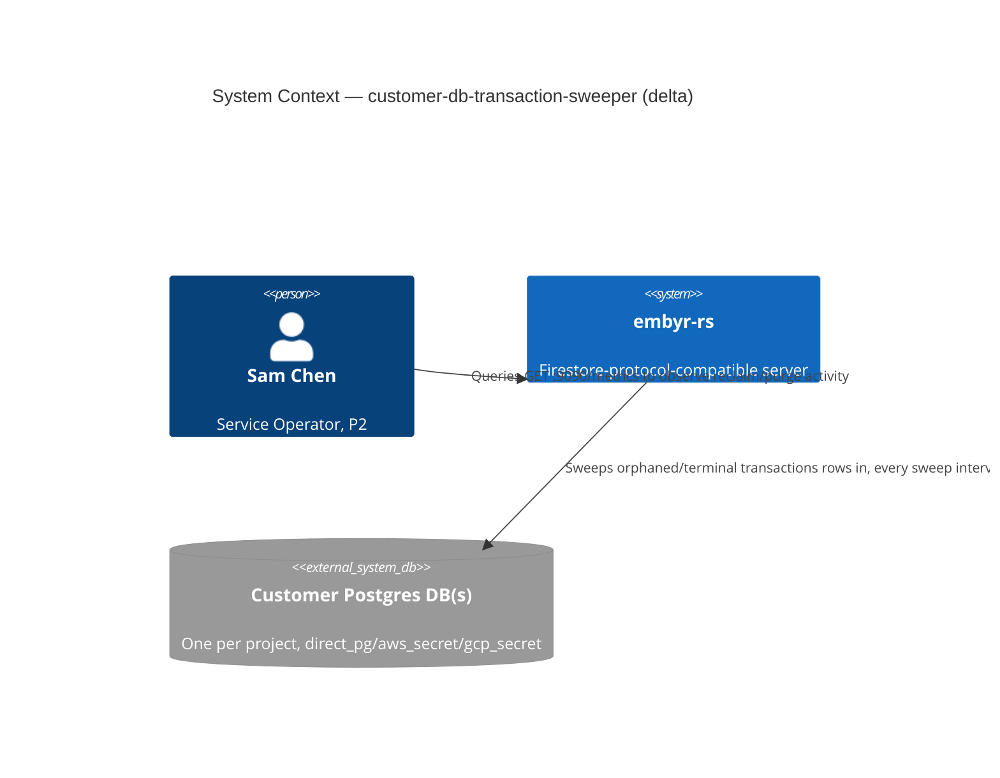
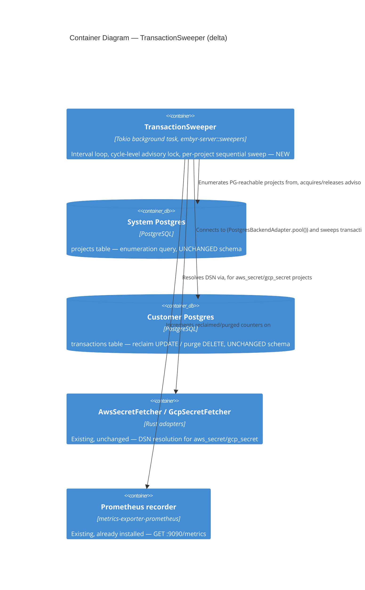

# customer-db-transaction-sweeper — Feature Delta

**Wave**: DISCUSS | **Agent**: Luna (nw-product-owner) | **Date**: 2026-08-31
**Status**: Ready for DESIGN handoff — two escalated open questions (raw customer-DB SQL access path; `backend_pg_dsn_enc IS NULL` coverage gap). See § Handoff Package.
**Upstream**: No DISCOVER/DIVERGE wave ran for this feature — commissioned directly by the orchestrator from a confirmed code-reading finding (not a customer report): `commit_transaction`'s own reactive 60-second expiry check only fires when a LATER call happens to reference the SAME `transaction_id`, and `firestore-batch-write`'s own per-write loop (ADR-048) synthesizes a fresh `transaction_id` for every write, so a failed per-write commit's row is orphaned with no later call ever able to trigger its own expiry — up to 500 orphaned rows per single `BatchWrite` call at the cap. Severity is low (no data loss, no functional incorrectness, pure storage growth in a small bookkeeping table) — the orchestrator explicitly chose full DISCUSS→DESIGN→delivery rigor over a quick patch because a quick patch (cleanup only in `commit_transaction`'s own error path) would not fix the general case: ANY client that calls `BeginTransaction` and abandons it (crash, give-up, no `Commit`/`Rollback`) leaks identically, `BatchWrite` just multiplies frequency.

**Framing**: this is background reliability/data-hygiene work, not an SDK-parity feature. It does not extend JOB-01 (Alex never observes it — no SDK call's behavior changes). Framing resolved by evidence, not assumption — see § Job Discovery Framing Resolution.

---

## Wave: DISCUSS / [REF] Prior Wave Consultation — Reading Confirmation

✓ `crates/embyr-server/src/sweepers/cap_usage_refresher.rs` (full, 225 lines) — the ONLY existing sweeper actually built in code (not just documented). Confirmed shape: `tokio::time::interval` loop, one `PoolConnection` held across a `pg_try_advisory_lock`/`pg_advisory_unlock` pair (session affinity required — two separate pool borrows are not guaranteed to land on the same physical connection), `run_cycle` iterating a `SystemDb`-only query, `continue`-on-error per iterated row (never aborts the whole cycle on one account's failure), no panic on skip. This is the direct structural precedent for this feature's own sweeper.
✓ `crates/embyr-server/src/sweepers/mod.rs` (full, 10 lines) — confirmed `cap_usage_refresher` is the ONLY module present. `docs/product/architecture/brief.md`'s own documented `QueryLogSweeper`/`SessionCleaner` (see below) are DESIGN-wave artifacts from `admin-api-v2` that were never actually implemented — real, useful precedent for the advisory-lock SHAPE, but not live code to call into.
✓ `docs/product/architecture/brief.md` lines 2152-2224 (admin-api-v2's own `[REF] New Database Schema` + `[REF] Background Tasks`) — documents `QueryLogSweeper` (daily, drops `query_logs_<project_id>_<date>` partitions) and `SessionCleaner` (hourly, hard-deletes `sessions`/`invitations` past a retention window) as DESIGN intent. Both operate on **System DB tables only** (`query_logs` lives in System Postgres per the schema table at line 2167, not any customer database) — neither is a precedent for reaching INTO a customer database, only for the advisory-lock interval-loop shape and (for `SessionCleaner`) the hard-delete-past-retention pattern this feature's own purge behavior reuses.
✓ `migrations/customer/0002_transactions.sql` (full, 6 lines) — confirmed schema: `transaction_id UUID PRIMARY KEY, project_id VARCHAR(63), status VARCHAR(20) DEFAULT 'active', started_at TIMESTAMPTZ DEFAULT now()`. No index beyond the primary key.
✓ `crates/embyr-pg-storage/src/backend_adapter.rs::begin_transaction` (lines 894-909) and `::commit_transaction` (lines 911-1065, expiry-check portion 919-946) — confirmed directly: `begin_transaction` INSERTs a `transactions` row as its own standalone, immediately-committed statement (not part of any later transaction). `commit_transaction` opens exactly ONE `pg_txn`, and only as its LAST step (inside that same `pg_txn`, not shown in the excerpt above but consistent with the orchestrator's own description) sets `status = 'committed'`. Its OWN first few lines check `status`/`started_at` and reactively mark `'expired'` on a >60s-old row — but ONLY when a call happens to reference that exact `transaction_id` again. Confirms the orchestrator's own framing exactly, not assumed.
✓ `crates/embyr-agent/src/server.rs` — confirmed references `begin_transaction`/`commit_transaction` against the SAME `embyr-pg-storage` crate embyr-server uses. The identical orphan-row bug exists inside `backend_mode=agent`'s own local customer Postgres (inside the customer's VPC) — but embyr-server has no connection model to reach it (see § Out of Scope).
✓ `crates/embyr-server/src/adapters/credential_cache.rs` (full, 65 lines) — **the single most load-bearing read for this feature's central architectural question**. `CredentialCache` is an LRU (`main.rs:136`/`lib.rs:278`: capacity 256), keyed by `CredentialCacheKey { project_id, api_key_blake3 }` — keyed by `(project, BLAKE3(api_key))`, NOT by `project_id` alone. Populated lazily on `authenticate()`/`resolve_customer_db_adapter()` cache-miss; evicted under LRU pressure AND explicitly on project status change (`evict_project`). **There is no enumerable, authoritative, always-current collection of "every currently-known customer DB connection" anywhere in this codebase.** Every request re-resolves on cache miss.
✓ `crates/embyr-server/src/grpc/handler.rs::authenticate` (lines 194-347+) and `crates/embyr-server/src/adapters/project_auth.rs::resolve_customer_db_adapter` (full, 174 lines) — confirmed BOTH existing DSN-resolution call sites require a live `api_key` for `backend_mode=direct_pg`: `ecies::decrypt(api_key.as_bytes(), &encrypted_dsn)` (`project_auth.rs` line 144, mirrored in `handler.rs`). For `aws_secret`/`gcp_secret`, only the stored `backend_secret_arn`/`backend_secret_gcp` (system DB columns, not api_key-derived) is needed — `AwsSecretFetcher`/`GcpSecretFetcher::get_dsn` can be called directly with no api_key.
✓ `crates/embyr-server/src/adapters/system_db.rs::get_project_for_auth` (lines 212-264) — confirmed the query's own `SELECT` column list includes `ecies_encrypted_dsn` but does **NOT** select `backend_pg_dsn_enc` — that column is invisible to the existing auth path entirely.
✓ `crates/embyr-server/src/admin/handlers/provision.rs` line 397 — confirmed the project-creation `INSERT` populates `ecies_encrypted_dsn` only; `backend_pg_dsn_enc` is never written at provision time.
✓ `crates/embyr-server/src/admin/handlers/projects.rs::patch_project` (lines 98-182) — confirmed `backend_pg_dsn_enc` is written **only** when a project owner explicitly submits `backend_pg_dsn` in a `PATCH /admin/v1/projects/:id` body (session-authenticated, self-service). It is AES-256-GCM encrypted under `EMBYR_ENCRYPTION_KEY` (a server-held secret, not api_key-derived) via `state.encryption_key`.
✓ `crates/embyr-server/src/adapters/encryption.rs::decrypt_with_rotation` (full, 67 lines) — confirmed a rotation-aware AES-256-GCM decrypt helper already exists and is explicitly documented as generic enough for `projects.backend_pg_dsn_enc` — but its own doc comment states plainly: "even though only the TOTP call site is live today." **`backend_pg_dsn_enc` has zero read call sites anywhere in this codebase today** — it is write-only (via `patch_project`), decryptable in principle, unused in practice.
✓ `migrations/0015_projects_admin_columns.sql` line 4 and `docs/product/architecture/adr-014-sdk-key-ecies-integration.md` (full) — confirmed `backend_pg_dsn_enc BYTEA` is a real column, added by `admin-api-v2`, with an ALREADY-ACCEPTED "Known Limitation" for a different consumer (SDK key rotation's DSN re-encryption step): pre-existing projects (provisioned before the column existed, or that have never PATCHed `backend_pg_dsn`) have `backend_pg_dsn_enc IS NULL` and that consumer silently skips them. This feature hits the structurally IDENTICAL gap for a new consumer (§ Handoff Package, Escalation 2).
✓ `docs/product/architecture/brief.md` lines 89-197 (`[REF]` capacity/scale section) — confirmed the codebase's own documented scale assumptions: "4–8 GB RAM handles ~500 concurrent projects with active streams comfortably"; "Customer DBs: up to 25 connections per project, but connections are established on-demand. At 100 active projects per instance, this is up to 2,500 simultaneous Postgres connections — likely too many. Operators should deploy PgBouncer..." — direct evidence that PARALLEL fan-out across many customer DBs at once is the real risk, not total project count sequentially.
✓ `docs/product/architecture/brief.md` lines 2363-2368 — confirmed a second scale data point: "deployments up to ~10,000 projects" (Prometheus cardinality analysis for `embyr_rate_limit_requests_total{project_id}`), the largest documented deployment-size assumption anywhere in this codebase.
✓ `docs/product/jobs.yaml` (full, all 20 jobs, JOB-01 through JOB-20 surveyed) — confirmed no existing job explicitly covers "orphaned background bookkeeping-row cleanup." JOB-11 (fair-multitenancy), JOB-12 (observability), and JOB-13 (production-deployment) are the three existing operator-facing (P2 Sam Chen) infra jobs, each with a distinct, non-overlapping goal (rate fairness / metrics visibility / deployment). JOB-12's own job story ("query a Prometheus /metrics endpoint... so I can diagnose the problem before the customer escalates") is the closest legitimate fit — see § Job Discovery Framing Resolution.

No contradictions found between this feature's scope and prior evidence.

---

## Wave: DISCUSS / [REF] Orchestrator Decisions (not re-litigated)

| # | Decision | Value |
|---|---|---|
| 1 | Feature Type | Backend/Infrastructure — a periodic background sweeper closing a confirmed resource leak in `embyr-pg-storage::backend_adapter`'s transaction bookkeeping, spanning every reachable customer database |
| 2 | Walking Skeleton | Evaluated (this wave's call): YES, a real walking skeleton exists (US-01, reclaim orphaned active rows) — see § Scope Assessment. Not a "prove a new mechanism class" skeleton the way `firestore-write-streaming`'s was; the interval/advisory-lock SHAPE is proven (`CapUsageRefresher`), the genuinely new piece is reaching customer DBs without an api_key |
| 3 | UX Research Depth | Lightweight, inline only (no separate `journey-*.yaml`/`journey-*-visual.md`) — Alex (P1, SDK developer) never observes this feature at all; Sam Chen (P2, operator) gets one small new observable surface (two Prometheus counters), which is the only "journey" worth documenting |
| 4 | JTBD Analysis | Confirmed by investigation, not assumed: **extends JOB-12 (observability)**, not a new job and not the infrastructure-only escape valve — see § Job Discovery Framing Resolution for why the escape valve does NOT apply once a real operator-observable surface exists |

---

## Wave: DISCUSS / [REF] Pre-requisites

- `CapUsageRefresher` (`crates/embyr-server/src/sweepers/cap_usage_refresher.rs`) — ships already, provides the interval-loop + `pg_try_advisory_lock`/`pg_advisory_unlock` shape this feature's own sweeper reuses unchanged.
- `backend_pg_dsn_enc` column + `decrypt_with_rotation` helper (`admin-api-v2`, `crates/embyr-server/src/adapters/encryption.rs`) — ship already, exist but are unread by any production code path today; this feature is their first live consumer.
- `AwsSecretFetcher` / `GcpSecretFetcher` (`crates/embyr-server/src/adapters/{aws_secret_fetcher,gcp_secret_fetcher}.rs`) — ship already, reused unchanged for `aws_secret`/`gcp_secret` DSN resolution.
- `EMBYR_ENCRYPTION_KEY` startup validation (`admin-api-v2`) — already enforced at startup; this feature adds no new secret/env-var requirement.
- No DIVERGE or DISCOVER artifacts exist for this feature (commissioned directly, § Upstream) — no upstream job/persona validation to reconcile against beyond `docs/product/jobs.yaml` itself (§ Reading Confirmation).
- No dependency on any in-flight feature in this session; nothing here blocks or is blocked by concurrently-developing work.

---

## Wave: DISCUSS / [REF] Job Discovery — Framing Resolution

### Resolution 1 — Does this belong to JOB-01 (sdk-compat)?

**No.** JOB-01's functional dimension is "all SDK calls succeed unchanged" — every prior JOB-01 "make it real" extension this session (aggregation-queries, batch-get-documents, firestore-write-streaming, firestore-batch-write, firestore-list-rpcs, firestore-field-transforms) closed a gap in the SDK-facing wire contract or its silently-discarded computation. This feature changes zero RPC behavior, zero response shape, zero client-observable timing — Alex's SDK calls behave identically before and after. Forcing JOB-01 here would be exactly the "tech-surface vs value-outcome backlog anti-pattern" this session's own standing rule (2026-04-24) warns against in the opposite direction: framing infrastructure work as if it serves a job it does not actually touch.

### Resolution 2 — Infrastructure-only escape valve, or does an existing job actually fit?

**Investigated rather than assumed, per the orchestrator's own explicit instruction not to default to the escape valve.** The escape valve requires "no user-visible behavior change" on ANY surface — that premise held for a plain reclaim-only sweeper (mark orphaned rows `'expired'`, silently, with zero new observable output), which would have been genuinely infrastructure-only. But the codebase already has a real precedent for making exactly this class of background-maintenance signal operator-observable: `rate_limit.rs`'s own `rate_limit_pg_timeout_total` counter (added by the `observability` feature specifically to convert a log-only signal into a Prometheus-queryable one) and JOB-12's own job story verbatim: "I want to query a Prometheus /metrics endpoint... and see... so I can diagnose the problem before the customer escalates." Adding two small counters (`embyr_transaction_sweeper_reclaimed_total`, `embyr_transaction_sweeper_purged_total`) on the ALREADY-INSTALLED `/metrics` recorder (`get_or_install_prometheus_handle()`, no new component) gives Sam Chen a real, cheap, decision-enabling surface: whether this leak is actually live and growing for a given deployment, without hand-querying any customer database — the exact class of "diagnose before the customer escalates" JOB-12 already names. This is a judgment call, not a silent one — flagged for DESIGN/orchestrator to confirm or strip (§ Handoff Package does NOT re-list it as an escalation because it is cheap, reuses an already-installed mechanism unchanged, and the alternative — an all-`@infrastructure` slice — fails this agent's own Dimension-0 slice-composition gate outright).

**job_id decision**: `JOB-12` (`observability`), extended not new, same persona P2 Sam Chen, "make it real"/close-the-remaining-gap pattern (mirrors `admin-api-v2` → JOB-10, `card-payments-backend` → JOB-14). NOTE appended to `docs/product/jobs.yaml` (§ SSOT Updates).

---

## Wave: DISCUSS / [REF] Persona & Job

**Persona**: **P2 — Sam Chen (Service Operator / Platform Engineer)** (existing persona, JOB-12's own), unchanged.

**Domain-example company**: **Trailmark** (`trailmark-prod`, direct_pg) and **Acme Orders** (`acme-orders`, aws_secret; `acme-legacy`, direct_pg with no `backend_pg_dsn_enc` on file) — continuity with this session's existing domain-example convention, reused here as Sam's own monitored customer deployments rather than Alex's own app.

**job_id decision**: `JOB-12` (`observability`), extended not new — see Resolution 2 above.

---

## Wave: DISCUSS / [REF] Scope Assessment (Elephant Carpaccio Gate)

| Signal | Threshold | This feature | Fired? |
|---|---|---|---|
| User stories | >10 | 2 (US-01, US-02) | **NO** |
| Bounded contexts / modules | >3 | 2 — BC-1 Tenant Management (`projects` enumeration in System DB) + BC-2 Document Storage's own customer-DB storage boundary (`transactions` table cleanup) | **NO** |
| Walking Skeleton integration points | >5 | 5 — (1) new `TransactionSweeper` sweeper module (shape reused from `CapUsageRefresher`), (2) new `SystemDb` query enumerating `projects` by `backend_mode`, (3) DSN-resolution dispatch reusing 3 already-shipped adapters (`AwsSecretFetcher`, `GcpSecretFetcher`, `decrypt_with_rotation` + `backend_pg_dsn_enc`), (4) a genuinely new raw-SQL access path against a customer DB's `transactions` table (outside `BackendAdapter`'s existing document-CRUD surface — § Handoff Package Escalation 1), (5) two new Prometheus counters on the already-installed recorder | **NO** (at threshold, not exceeding) |
| Estimated effort | >2 weeks | ~2-3 days total across 2 slices (1-1.5 days each) | **NO** |
| Independent shippable outcomes | multiple unrelated | **NO** — one coherent problem (unbounded `transactions`-table growth), split into 2 sequential increments by outcome (reclaim correctness first, then the retention/purge that actually stops growth), not several unrelated features glued together | **NO** |

**0 of 5 signals fired. Verdict: PASS — single feature, right-sized as a 2-slice feature, no split needed.** Deliberately kept lean given the orchestrator's own explicit low-severity framing: the two Prometheus counters are the only scope addition beyond the minimum needed to close the leak, added specifically to satisfy this agent's own DoR/Elevator-Pitch gate honestly rather than by working around it (see Resolution 2).

---

## Wave: DISCUSS / [REF] Journey (Lightweight, inline — Sam Chen only, per Decision 3)

**Sam's mental model**: Sam does not know this leak exists today — there is no signal anywhere (no metric, no log counter, nothing in `/metrics`) that any customer database's `transactions` table is growing unboundedly. If a customer's Postgres bill or table-bloat monitoring flags it, Sam's only recourse today is to hand-run `SELECT count(*), status FROM transactions GROUP BY status` against that ONE customer's database directly — assuming Sam even has a reason to suspect that specific customer.

**Emotional arc** (mirrors "Problem Relief"): **Start** — mild unease, prompted by an external signal (a customer's own Postgres storage alert, or routine review) that a bookkeeping table looks larger than expected, with no internal tooling to explain why. **Middle** — Sam runs `curl :9090/metrics | grep transaction_sweeper`, sees `embyr_transaction_sweeper_reclaimed_total` and `embyr_transaction_sweeper_purged_total` climbing steadily across sweep cycles — confirms the leak is real, ongoing, and now being actively reclaimed automatically, not merely observed. **End** — relief: the counters, combined with the sweeper's own automatic reclaim+purge behavior, tell Sam this is a background, self-healing condition rather than an active incident requiring a customer escalation or a manual SQL intervention.

**Shared artifact**: the `transactions.status` state machine itself (`'active'` → `'committed'` XOR `'expired'` → eventually deleted) — single source of truth: `migrations/customer/0002_transactions.sql`'s own schema plus `commit_transaction`'s own existing status semantics, both reused unchanged (§ System Constraints — no new status value is introduced).

**Failure modes** (feeds DISTILL scenario generation): a customer database becomes unreachable mid-cycle (network blip, customer Postgres restart) while other customers in the same cycle are healthy | a `direct_pg` project has `backend_pg_dsn_enc IS NULL` (never explicitly re-entered) and must be skipped, not treated as a cycle-aborting error | two server instances both attempt the same sweep cycle simultaneously (advisory lock must prevent double-processing) | a transaction is still legitimately in-flight (started seconds ago) and must NOT be reclaimed just because a sweep cycle happens to run while it is active | a project transitions to `suspended`/`deleted` mid-cycle (sweeper must not error, must simply skip or continue past it, mirroring `CapUsageRefresher`'s own per-account `continue`-on-error discipline).

---

## Wave: DISCUSS / [REF] Story Map & Walking Skeleton

**Persona**: P2 Sam Chen | **Goal**: Every reachable customer database's `transactions` bookkeeping table stops growing unboundedly, and Sam can see, via the existing `/metrics` endpoint, whether this leak is actually live for a given deployment — without hand-querying any customer database.

### Backbone

| A. Sweeper Enumerates Reachable Customer DBs | B. Sweeper Reclaims Orphaned Rows | C. Sweeper Purges Terminal Rows |
|---|---|---|
| Query System DB `projects` for `backend_mode IN (direct_pg, aws_secret, gcp_secret)` **[WS]** | Mark `'active'` rows older than the abandonment threshold as `'expired'`, per reachable customer DB **[WS]** | Hard-delete `'committed'`/`'expired'` rows older than the retention window, per reachable customer DB |
| Resolve each project's DSN without any api_key (aws/gcp fetcher, or `backend_pg_dsn_enc` for direct_pg) **[WS]** | Skip (not error) any project whose DSN cannot be resolved **[WS]** | Emit `embyr_transaction_sweeper_purged_total` on `/metrics` |
| Emit `embyr_transaction_sweeper_reclaimed_total` on `/metrics` **[WS]** | Advisory-lock the cycle so multiple instances never race **[WS]** | — |

### Walking Skeleton

One sweep cycle: enumerate every `projects` row with `backend_mode IN (direct_pg, aws_secret, gcp_secret)` from System DB → resolve each project's DSN (aws/gcp fetcher, or decrypt `backend_pg_dsn_enc` under `EMBYR_ENCRYPTION_KEY` for direct_pg; skip silently if unresolvable) → `UPDATE transactions SET status = 'expired' WHERE status = 'active' AND started_at < now() - abandonment_threshold` against each reachable customer DB → increment `embyr_transaction_sweeper_reclaimed_total`. Guarded by a `pg_try_advisory_lock`, mirroring `CapUsageRefresher` exactly. This is Slice 01, US-01.

### Release 1 — Orphaned Rows Stop Living Forever (Slice 01, US-01)

Outcome: every reachable customer database's abandoned `'active'` transaction rows are proactively reclaimed on a recurring cycle, regardless of whether any later call ever references the same `transaction_id` again — closing both the `BatchWrite`-specific gap (ADR-048, fresh `transaction_id` per write, never revisited) and the general any-abandoned-client gap. Sam gains a Prometheus-observable signal that this is happening.

### Release 2 — The Table Actually Stops Growing (Slice 02, US-02)

Outcome: terminal-state rows (`'committed'` — which today never get deleted at all, not just `'expired'` ones from Release 1) are purged past a retention window, which is the piece that actually bounds table growth rather than merely relabeling rows. Reuses Release 1's own DSN-resolution dispatch unchanged.

---

## Wave: DISCUSS / [REF] WS Strategy

**Strategy: B (Real, Narrow Slice)** — the walking skeleton (US-01) runs against REAL Postgres customer databases (no test double, no mocked adapter) for a NARROW subset of surface (one representative project per PG-reachable `backend_mode`), rather than A (full-breadth real) or C (mocked/stubbed skeleton). Not D (Configurable/env-switching) — there is no environment-conditional behavior to switch between; the sweeper behaves identically in every deployment. Justification: `CapUsageRefresher` (the only prior sweeper actually built) itself proves this codebase's own convention is "real Postgres, narrow scenario, no mocking" for background-task walking skeletons — this feature follows the identical precedent, not a new one. Full-breadth real (Strategy A — every `backend_mode` × every DSN-resolution path × concurrent-instance racing, all in the WS itself) is deferred to the full US-01 scenario set (7 scenarios), not crammed into the walking skeleton alone.

---

## Wave: DISCUSS / [REF] Elephant Carpaccio Slices

| Slice | Story | Release | Estimate | Learning Hypothesis (disproves) | Production-data taste test |
|---|---|---|---|---|---|
| 01 (WS) | US-01 | 1 | 1.5 days | Reaching a customer database's `transactions` table without holding a live api_key is not actually possible today for any backend_mode using only already-shipped adapters — i.e., the `AwsSecretFetcher`/`GcpSecretFetcher`/`backend_pg_dsn_enc`+`decrypt_with_rotation` combination cannot actually resolve a real DSN outside of a live authenticated request | Real Postgres customer DB(s) for at least one project per reachable `backend_mode`, a real orphaned `'active'` row inserted directly (simulating an abandoned `BeginTransaction`), asserting the sweep cycle marks it `'expired'` and `embyr_transaction_sweeper_reclaimed_total` increments — no mocked adapter, no synthetic single-project shortcut |
| 02 | US-02 | 2 | 1 day | Hard-deleting terminal-state rows introduces a race against a row that is about to be legitimately re-read (e.g., an operator debugging a recent transaction) within the retention window | Real Postgres customer DB, a real `'committed'` row aged past the retention window (backdated `started_at`, mirroring `SessionCleaner`'s own precedent for testing time-based retention), asserting it is hard-deleted and a row within the window is untouched |

**Total estimate: ~2.5 days across 2 slices.**

**Taste tests applied**:
- "4+ new components per slice" — Slice 01 introduces 2 new components (`TransactionSweeper` module, the raw customer-DB SQL access path) plus reuse of 4 already-shipped mechanisms (advisory-lock shape, `SystemDb` query pattern, `AwsSecretFetcher`/`GcpSecretFetcher`, `decrypt_with_rotation`). Slice 02 introduces 0 new components, reusing Slice 01's own dispatch against a different query. PASS, both slices.
- "Every slice depends on a new abstraction" — the one genuinely new piece (raw customer-DB SQL access, § Handoff Package Escalation 1) ships FIRST, in Slice 01; Slice 02 depends on nothing not already built. PASS.
- "No slice disproves a pre-commitment" — each slice has a distinct, falsifiable hypothesis (table above). PASS.
- "Synthetic-data-only slices prove plumbing, not value" — both slices require a real sweep cycle against real customer Postgres with a real orphaned/aged row, never a stubbed adapter. PASS.
- "2+ slices identical except for scale" — not applicable; Slice 01 (reclaim) and Slice 02 (purge) are distinct lifecycle transitions on the same row, not a scaled repeat. PASS.

---

## Wave: DISCUSS / [REF] Prioritization

| Priority | Slice | Target Outcome | Rationale |
|---|---|---|---|
| 1 | Slice 01 (WS) | Orphaned `'active'` rows are proactively reclaimed, observable via `/metrics` | Proves the confirmed-feasible-but-unbuilt "reach a customer DB without an api_key" mechanism end-to-end before layering retention/purge on top; also the piece that most directly closes the reported `BatchWrite`/ADR-048 gap |
| 2 | Slice 02 | Terminal-state rows are purged past retention, actually bounding table growth | Sequenced second because it depends on Slice 01's own DSN-resolution dispatch existing first, and because it is the piece that fully resolves "storage growth" (Slice 01 alone only re-labels rows — it does not delete anything, since even successfully-`'committed'` rows are never deleted today either) |

---

## Wave: DISCUSS / [REF] System Constraints

- **No new `transactions.status` value is introduced.** The sweeper's reclaim step reuses the identical `'expired'` value `commit_transaction`'s own reactive check already writes (`crates/embyr-pg-storage/src/backend_adapter.rs` line ~939) — the sweeper is a proactive, cross-project generalization of an already-established semantic, not a new one.
- **The sweeper must never hold a live api_key.** This is the feature's own central constraint, confirmed by evidence (§ Reading Confirmation): `direct_pg` DSN resolution reuses `backend_pg_dsn_enc` (AES-256-GCM under the server-held `EMBYR_ENCRYPTION_KEY`, via `decrypt_with_rotation`) — NEVER `ecies_encrypted_dsn` (which structurally requires a live api_key the sweeper never has). `aws_secret`/`gcp_secret` reuse the existing fetchers unchanged, keyed only by the ARN/resource name already in the `projects` row.
- **A `direct_pg` project with `backend_pg_dsn_enc IS NULL` must be skipped silently, not treated as a cycle-aborting error** — mirrors `CapUsageRefresher`'s own per-account `continue`-on-error discipline, and mirrors `admin-api-v2`'s own already-accepted precedent for the identical NULL-column gap in a different consumer (SDK key rotation).
- **The sweep must be sequential/throttled across enumerated projects within a cycle, never a full concurrent fan-out to all N projects at once.** Justified directly by `docs/product/architecture/brief.md`'s own documented capacity language ("up to 2,500 simultaneous Postgres connections — likely too many" at 100 active projects per instance) — the risk this codebase's own evidence names is PARALLEL connection fan-out, not total project count swept sequentially over a generous interval. At the documented ceiling (~10,000 projects), a sequential sweep on a multi-minute interval is trivial background load.
- **The reclaim query and the purge query are two DISTINCT statements against the SAME table**, not one combined statement — `UPDATE ... WHERE status = 'active' AND started_at < now() - abandonment_threshold` (reclaim) then, separately, `DELETE ... WHERE status IN ('committed','expired') AND started_at < now() - retention_window` (purge). Both reuse the exact abandonment-threshold/retention-window PATTERN `CapUsageRefresher`'s own `EMBYR_CAP_CHECK_INTERVAL_SECS` and `SessionCleaner`'s own 30-day precedent already establish in this codebase — exact numeric defaults are a DESIGN/DEVOPS tuning question (§ Out of Scope), not committed here, mirroring this codebase's own precedent (OQ-CP-3) for leaving interval tuning to a later wave.
- **Purge is broader than the reported bug.** `'committed'` rows are never deleted today either (only `'expired'` ones were ever candidates for cleanup, and even that only relabels, never deletes) — Slice 02's purge step addresses the FULL "no retention mechanism exists for this table at all" root cause, not merely the narrower "abandoned transactions" framing the orchestrator's own bug report led with. This is a deliberate widening, confirmed necessary by the evidence (§ Reading Confirmation), not scope creep.
- **`backend_mode=agent` is excluded from the sweeper's own project-enumeration query entirely** — not attempted, not silently skipped-per-row (excluded at the SQL `WHERE backend_mode IN (...)` level). embyr-server has no connection model to reach an agent-mode customer DB; only `AgentBackendAdapter`'s own mTLS RPC surface to `StorageAgent` exists, and `StorageAgent`'s own proto has no bulk/sweep-shaped RPC today (§ Out of Scope).
- **Prometheus counters carry no `project_id` label** — mirrors `docs/product/architecture/brief.md`'s own explicit high-cardinality caution (§ `HIGH CARDINALITY: project_id label`) for `embyr_rate_limit_requests_total`; a per-deployment aggregate counter is sufficient for Sam's own "is this live and growing" decision, and avoids adding unbounded cardinality for a low-severity background signal.

---

## Wave: DISCUSS / [REF] Driving Ports

This feature has **no client-invocable driving port** — unlike every SDK-parity feature this session (gRPC RPC, REST endpoint), the sweeper is triggered by nothing external. Its only "entry point" is time itself:

| Port | Trigger | Notes |
|---|---|---|
| `TransactionSweeper::spawn` | `tokio::time::interval` tick, inside `embyr-server`'s own composition root | Mirrors `CapUsageRefresher::spawn`'s exact signature shape — takes `Arc<SystemDb>` + whatever adapters DSN resolution needs + `Duration` interval, returns a `JoinHandle` the composition root holds for the process lifetime |
| `GET :9090/metrics` | Existing Prometheus scrape endpoint (already shipped, `observability` feature) | The only OBSERVABLE surface this feature adds — `embyr_transaction_sweeper_reclaimed_total`/`embyr_transaction_sweeper_purged_total` ride the already-installed recorder, no new route |

No new gRPC RPC, no new REST route, no new admin-API route. Sam Chen never calls anything to trigger this feature — she only ever reads its output via the metric.

---

## Wave: DISCUSS / [REF] User Stories

<!-- markdownlint-disable MD024 -->

### US-01: Orphaned Transaction Rows Are Reclaimed Across Every Reachable Customer Database

**job_id**: JOB-12 (observability) — extends, "make it real" pattern (§ Job Discovery Framing Resolution, Resolution 2)

#### Problem

Sam Chen operates an embyr deployment serving multiple customer projects. Today, any client that calls `BeginTransaction` and then abandons it — crashes, gives up, or (in `firestore-batch-write`'s own per-write loop, ADR-048) simply never revisits that specific `transaction_id` again — leaves a `transactions` row stuck at `status = 'active'` forever. The ONLY existing cleanup mechanism (`commit_transaction`'s own reactive 60-second expiry check) fires exclusively when a LATER call happens to reference that exact same `transaction_id` — which structurally never happens for `BatchWrite`'s own fresh-`transaction_id`-per-write pattern, and often doesn't happen for a genuinely abandoned client either. Sam has no way to know this is happening in any given customer's database without hand-running SQL against it.

#### Who

- Sam Chen, Service Operator/Platform Engineer | Running an embyr deployment with multiple customer projects across `direct_pg`, `aws_secret`, and `gcp_secret` backend modes | Motivated to catch and self-heal background reliability issues before a customer's own Postgres storage monitoring flags them

#### Solution

A recurring background sweep (`TransactionSweeper`, mirroring `CapUsageRefresher`'s own interval + advisory-lock shape) enumerates every System-DB `projects` row with a PG-reachable `backend_mode`, resolves each project's customer-DB DSN without requiring any live api_key, and marks abandoned `'active'` rows `'expired'` — proactively, not reactively, regardless of whether any later call ever references them.

#### Domain Examples

##### 1: Happy Path — `trailmark-prod` (direct_pg, `backend_pg_dsn_enc` populated)

Trailmark's own `trailmark-prod` project (`backend_mode=direct_pg`) had its DSN explicitly re-entered via `PATCH /admin/v1/projects/trailmark-prod` six weeks ago (so `backend_pg_dsn_enc` is populated). A `BatchWrite` call twenty minutes ago left `transaction_id = 3f9a1c9e-...` at `status = 'active'`, `started_at` twenty minutes in the past — no later call has referenced it. The next sweep cycle decrypts `backend_pg_dsn_enc` under `EMBYR_ENCRYPTION_KEY`, connects, and marks the row `'expired'`. `embyr_transaction_sweeper_reclaimed_total` increments by 1.

##### 2: Edge Case — `acme-orders` (aws_secret, no api_key involved at all)

Acme's `acme-orders` project (`backend_mode=aws_secret`, `backend_secret_arn = arn:aws:secretsmanager:us-east-1:111122223333:secret:acme-orders-pg-dsn`) had a client SDK crash mid-transaction three hours ago, leaving `transaction_id = b7c2e410-...` at `status = 'active'`. The sweep cycle calls `AwsSecretFetcher::get_dsn(&arn)` directly — the identical call `authenticate()` would make on a real request, but with zero api_key involved anywhere in this path — connects, and marks the row `'expired'`.

##### 3: Error/Boundary — `trailmark-prod`, a genuinely in-flight transaction

A different `trailmark-prod` transaction, `transaction_id = 91ab4f02-...`, started ten seconds ago via a real, currently-in-progress `Commit` call. The sweep cycle runs concurrently. Because `started_at` is well within the abandonment threshold, the sweeper's `UPDATE ... WHERE started_at < now() - abandonment_threshold` clause does not match this row — it is left untouched, and the in-flight `Commit` completes normally afterward.

##### 4: Coverage Gap (documented, not silently dropped) — `acme-legacy` (direct_pg, `backend_pg_dsn_enc IS NULL`)

Acme's `acme-legacy` project (`backend_mode=direct_pg`) was provisioned before `admin-api-v2` and has never had its DSN re-entered via `PATCH`. `backend_pg_dsn_enc IS NULL`. The sweep cycle detects this, skips `acme-legacy` entirely (no connection attempt, no error raised), and continues to the next project. `acme-legacy`'s own orphaned rows, if any, remain unreclaimed by this feature — an explicit, evidenced scope boundary (§ Handoff Package Escalation 2), not a silently-introduced gap.

#### UAT Scenarios (BDD)

##### Scenario: An orphaned transaction in a direct_pg customer database is reclaimed
```gherkin
Given trailmark-prod's transactions table has a row with status "active" and started_at 20 minutes ago
And trailmark-prod's backend_pg_dsn_enc is populated
When the next sweep cycle runs
Then trailmark-prod's transaction row has status "expired"
And embyr_transaction_sweeper_reclaimed_total has incremented by 1
```

##### Scenario: An orphaned transaction in an aws_secret customer database is reclaimed without any api_key
```gherkin
Given acme-orders (backend_mode=aws_secret) has a transaction row with status "active" and started_at 3 hours ago
When the next sweep cycle runs
Then acme-orders's transaction row has status "expired"
And the sweep resolved acme-orders's DSN via the AWS secret ARN alone, with no api_key involved
```

##### Scenario: An orphaned transaction in a gcp_secret customer database is reclaimed without any api_key
```gherkin
Given a gcp_secret-mode project has a transaction row with status "active" and started_at 1 hour ago
When the next sweep cycle runs
Then that project's transaction row has status "expired"
```

##### Scenario: A transaction still within the abandonment threshold is left untouched
```gherkin
Given trailmark-prod has a transaction row with status "active" and started_at 10 seconds ago
When the next sweep cycle runs
Then trailmark-prod's transaction row still has status "active"
```

##### Scenario: A direct_pg project with no DSN on file is skipped without aborting the cycle
```gherkin
Given acme-legacy (backend_mode=direct_pg) has backend_pg_dsn_enc set to NULL
And trailmark-prod has an orphaned "active" transaction row eligible for reclaim
When the next sweep cycle runs
Then acme-legacy's transactions table is never queried
And trailmark-prod's transaction row is still reclaimed in the same cycle
```

##### Scenario: backend_mode=agent projects are never included in the sweep
```gherkin
Given a project exists with backend_mode "agent"
When the next sweep cycle runs
Then that project never appears in the sweep's own project-enumeration query
```

##### Scenario: Two server instances never race the same sweep cycle
```gherkin
Given two embyr-server instances are running against the same System DB
When both instances' sweep intervals fire at the same time
Then only one instance's cycle actually runs the reclaim queries
And the other instance's cycle is skipped, retrying on its next interval
```

#### Acceptance Criteria

- [ ] A `'active'` transaction row older than the abandonment threshold, in a `direct_pg` project with `backend_pg_dsn_enc` populated, is marked `'expired'` by the next sweep cycle
- [ ] A `'active'` transaction row older than the abandonment threshold, in an `aws_secret` or `gcp_secret` project, is marked `'expired'` by the next sweep cycle, with DSN resolution requiring zero live api_key
- [ ] A `'active'` transaction row younger than the abandonment threshold is never modified by a sweep cycle
- [ ] A `direct_pg` project with `backend_pg_dsn_enc IS NULL` is skipped without raising an error or aborting the cycle for other projects
- [ ] `backend_mode=agent` projects never appear in the sweep's own enumeration query
- [ ] Concurrent sweep attempts across multiple server instances are serialized by a Postgres advisory lock; only one instance's cycle executes per interval
- [ ] `embyr_transaction_sweeper_reclaimed_total` increments once per row actually transitioned to `'expired'`, observable via `GET :9090/metrics`

#### Outcome KPIs

- **Who**: Sam Chen (Service Operator)
- **Does what**: Can determine, from `/metrics` alone, whether abandoned Firestore transactions are accumulating in any customer database — without hand-querying that database
- **By how much**: From 0% observability today (no signal exists anywhere) to 100% — every reclaim event across every reachable customer DB is counted
- **Measured by**: `embyr_transaction_sweeper_reclaimed_total` on the existing `GET :9090/metrics` endpoint
- **Baseline**: 0 — the metric and the proactive reclaim behavior both do not exist today; the only existing signal is the reactive per-call 60s check, which is invisible externally

#### Technical Notes (Optional)

- Reuses `CapUsageRefresher`'s own interval-loop + `pg_try_advisory_lock`/`pg_advisory_unlock` (session-affinity-preserving, one held `PoolConnection`) shape unchanged.
- Requires a new raw customer-DB SQL access path outside `BackendAdapter`'s existing document-CRUD trait surface (§ Handoff Package Escalation 1).
- Depends on `backend_pg_dsn_enc` + `decrypt_with_rotation` (`adapters/encryption.rs`) for `direct_pg` DSN resolution — the first live read call site for that column (§ Reading Confirmation).

---

### US-02: Terminal-State Transaction Rows Are Purged, Bounding Table Growth

**job_id**: JOB-12 (observability) — extends, "make it real" pattern, same as US-01

#### Problem

Even after US-01 ships, the `transactions` table still never shrinks — `'expired'` rows (from US-01's own reclaim) and `'committed'` rows (from every successful transaction, ever) both accumulate forever, since no delete path exists anywhere for this table. Sam's original concern ("pure storage growth in a small bookkeeping table, over a long enough time horizon") is only half-addressed by reclaim alone: relabeling a row `'active'` → `'expired'` does not reduce row count.

#### Who

- Sam Chen, Service Operator/Platform Engineer | Same persona and deployment context as US-01 | Wants the leak's storage-growth consequence actually bounded, not merely relabeled

#### Solution

The same sweep cycle, after its reclaim step, additionally purges (hard-deletes) any `transactions` row in a terminal state (`'committed'` or `'expired'`) older than a retention window — mirroring `SessionCleaner`'s own documented "hard delete, no soft-delete needed, contains no user-generated content" precedent.

#### Domain Examples

##### 1: Happy Path — `trailmark-prod`, a `'committed'` row past retention

A `trailmark-prod` transaction committed successfully 45 days ago (`status = 'committed'`, `started_at` 45 days in the past). The retention window is 30 days. The next sweep cycle's purge step hard-deletes the row. `embyr_transaction_sweeper_purged_total` increments by 1.

##### 2: Edge Case — `trailmark-prod`, an `'expired'` row still within retention

A `trailmark-prod` transaction was reclaimed (marked `'expired'`) by US-01's own reclaim step 20 days ago — within the 30-day retention window. The purge step leaves it untouched this cycle; it becomes eligible in a future cycle once it crosses 30 days.

##### 3: Boundary — `acme-orders` (aws_secret), purge applies identically across backend modes

An `acme-orders` transaction, `status = 'expired'`, `started_at` 60 days in the past, is purged in the same cycle as `trailmark-prod`'s own purge — proving purge reuses US-01's own DSN-resolution dispatch unchanged, with no `direct_pg`-only special-casing.

#### UAT Scenarios (BDD)

##### Scenario: A committed transaction row past the retention window is purged
```gherkin
Given trailmark-prod has a transaction row with status "committed" and started_at 45 days ago
And the retention window is 30 days
When the next sweep cycle runs
Then that transaction row no longer exists in trailmark-prod's transactions table
And embyr_transaction_sweeper_purged_total has incremented by 1
```

##### Scenario: An expired transaction row past the retention window is purged
```gherkin
Given trailmark-prod has a transaction row with status "expired" and started_at 45 days ago
When the next sweep cycle runs
Then that transaction row no longer exists in trailmark-prod's transactions table
```

##### Scenario: A transaction row within the retention window is left untouched
```gherkin
Given trailmark-prod has a transaction row with status "expired" and started_at 20 days ago
And the retention window is 30 days
When the next sweep cycle runs
Then that transaction row still exists in trailmark-prod's transactions table
```

##### Scenario: Purge applies identically across aws_secret and gcp_secret customer databases
```gherkin
Given acme-orders (backend_mode=aws_secret) has a transaction row with status "expired" and started_at 60 days ago
When the next sweep cycle runs
Then that transaction row no longer exists in acme-orders's transactions table
```

##### Scenario: Purge activity is observable via the existing metrics endpoint
```gherkin
Given at least one project has a purge-eligible transaction row
When the next sweep cycle runs
Then GET :9090/metrics includes an updated embyr_transaction_sweeper_purged_total value
```

#### Acceptance Criteria

- [ ] A `'committed'` transaction row older than the retention window is hard-deleted by the next sweep cycle
- [ ] An `'expired'` transaction row older than the retention window is hard-deleted by the next sweep cycle
- [ ] A terminal-state transaction row within the retention window is never deleted
- [ ] Purge behavior is identical across `direct_pg`, `aws_secret`, and `gcp_secret` backend modes (reuses US-01's own DSN-resolution dispatch, no mode-specific branching)
- [ ] `embyr_transaction_sweeper_purged_total` increments once per row actually deleted, observable via `GET :9090/metrics`

#### Outcome KPIs

- **Who**: Sam Chen (Service Operator)
- **Does what**: Any given reachable customer database's `transactions` table row count stabilizes to a bounded value instead of growing indefinitely
- **By how much**: Steady-state row count bounded by `(sweep interval × cycles within retention window)` worth of terminal rows, rather than unbounded lifetime accumulation — a qualitative shift from "grows forever" to "bounded," not a specific percentage (no current row-count baseline exists to compute one against)
- **Measured by**: `embyr_transaction_sweeper_purged_total` (proxy for deletion activity) + an operator-run `SELECT count(*) FROM transactions` spot-check per customer DB (not itself instrumented in v1)
- **Baseline**: 0 rows ever deleted today — every `'committed'` and `'expired'` row persists forever, by construction (confirmed, § Reading Confirmation)

#### Technical Notes (Optional)

- Reuses US-01's own DSN-resolution dispatch and raw customer-DB SQL access path unchanged — no new integration points.
- Retention window must exceed any plausible operator debugging window (mirrors `SessionCleaner`'s own 30-day precedent) — exact value is a DESIGN/DEVOPS tuning question (§ Out of Scope).

---

## Wave: DISCUSS / [REF] Outcome KPIs (Feature-Level Summary)

### Feature: customer-db-transaction-sweeper

### Objective

Sam Chen can trust that abandoned Firestore transactions never accumulate unboundedly in any reachable customer database, and can confirm this directly from the existing `/metrics` endpoint without hand-querying customer databases.

### Outcome KPIs

| # | Who | Does What | By How Much | Baseline | Measured By | Type |
|---|-----|-----------|-------------|----------|-------------|------|
| 1 | Sam Chen | Observes reclaim activity for orphaned transactions | 0% → 100% of reclaim events counted | 0 (no signal exists today) | `embyr_transaction_sweeper_reclaimed_total` on `/metrics` | Leading |
| 2 | Sam Chen | Observes purge activity for terminal-state rows | 0% → 100% of purge events counted | 0 (no deletion path exists today) | `embyr_transaction_sweeper_purged_total` on `/metrics` | Leading |
| 3 | Any reachable customer DB | `transactions` table row count | Unbounded growth → bounded, steady-state | Unbounded (every row persists forever today) | Operator-run row-count spot-check (not instrumented in v1) | Lagging |

### Metric Hierarchy

- **North Star**: `transactions` table row count is bounded (KPI #3) — the actual problem statement
- **Leading Indicators**: `embyr_transaction_sweeper_reclaimed_total`, `embyr_transaction_sweeper_purged_total` — directly actionable proxies the sweeper itself drives every cycle
- **Guardrail Metrics**: sweep cycle must never modify a transaction row younger than the abandonment threshold (data-safety guardrail, not a KPI but a hard AC) | sweep must never open >1 concurrent connection fan-out beyond the documented per-instance Postgres connection ceiling (§ System Constraints)

### Measurement Plan

| KPI | Data Source | Collection Method | Frequency | Owner |
|-----|------------|-------------------|-----------|-------|
| Reclaimed count | `TransactionSweeper` sweep cycle | `metrics::counter!` increment | Every sweep cycle | embyr-server (DELIVER) |
| Purged count | `TransactionSweeper` sweep cycle | `metrics::counter!` increment | Every sweep cycle | embyr-server (DELIVER) |
| Table row count | Customer Postgres | Manual operator query (v1) | Ad hoc | Sam Chen (operator) |

### Hypothesis

We believe that a proactive, api_key-independent sweep of every reachable customer database's `transactions` table, exposed via two Prometheus counters, will achieve a bounded row count and eliminate the silent-forever-orphan condition.
We will know this is true when Sam Chen can observe non-zero, steadily-incrementing reclaim/purge counters on `/metrics` for any deployment with real abandoned-transaction activity, and a spot-checked customer DB's row count stabilizes rather than growing without bound.

---

## Wave: DISCUSS / [REF] Definition of Ready Validation

### Story: US-01

| DoR Item | Status | Evidence/Issue |
|----------|--------|----------------|
| Problem statement clear | PASS | Sam Chen's own pain, domain language, grounded in confirmed code reading (§ Reading Confirmation) |
| User/persona identified | PASS | P2 Sam Chen, specific deployment context (multi-project, multi-backend-mode) |
| 3+ domain examples | PASS | 4 examples, real project names (`trailmark-prod`, `acme-orders`, `acme-legacy`), real UUIDs/timestamps |
| UAT scenarios (3-7) | PASS | 7 scenarios, Given/When/Then |
| AC derived from UAT | PASS | 7 AC bullets, each traceable to a scenario |
| Right-sized | PASS | 1.5 days estimate, 7 scenarios (upper bound, not exceeding) |
| Technical notes | PASS | Reuse targets and the one new access-path dependency named explicitly |
| Dependencies tracked | PASS | Depends on `backend_pg_dsn_enc` (exists, unread today) and `decrypt_with_rotation` (exists, unused today) — both already shipped, zero new schema |
| Outcome KPIs | PASS | Numeric target (0% → 100% signal coverage), measurement method, baseline stated |

### DoR Status: PASSED

### Story: US-02

| DoR Item | Status | Evidence/Issue |
|----------|--------|----------------|
| Problem statement clear | PASS | Explicitly distinguishes "reclaim relabels" from "purge deletes" — the actual storage-growth fix |
| User/persona identified | PASS | Same P2 Sam Chen, same deployment context |
| 3+ domain examples | PASS | 3 examples, real project names/timestamps |
| UAT scenarios (3-7) | PASS | 5 scenarios |
| AC derived from UAT | PASS | 5 AC bullets |
| Right-sized | PASS | 1 day estimate, 5 scenarios |
| Technical notes | PASS | Reuse of US-01's dispatch stated explicitly; retention-window tuning flagged as deferred |
| Dependencies tracked | PASS | Depends on US-01 shipping first (shared dispatch path) |
| Outcome KPIs | PASS | Qualitative-but-honest target (bounded vs. unbounded, no fabricated percentage since no baseline row count exists), measurement method, baseline stated |

### DoR Status: PASSED

---

## Wave: DISCUSS / [REF] Handoff Package

### Escalation 1 — Raw customer-DB SQL access path

`BackendAdapter`'s trait surface is document-CRUD-shaped (`get_document`, `create_document`, `begin_transaction`/`commit_transaction`, etc.) — it has no method for arbitrary maintenance SQL against a customer DB's own `transactions` table. Two options for DESIGN to choose between, not decided here:
- (a) Expose a raw pool accessor on `PostgresBackendAdapter` (mirroring `SystemDb::pool()`'s own existing "expose sparingly, prefer typed methods" precedent) and have the sweeper issue raw SQL directly. Simpler, no forced changes to `AgentBackendAdapter` (which this feature never calls into — agent-mode is excluded at enumeration, § System Constraints).
- (b) Add 2 new `BackendAdapter` trait methods (`reclaim_orphaned_transactions`, `purge_old_transactions`) that every implementor must satisfy. More "proper" encapsulation, but forces `AgentBackendAdapter` to implement methods this feature never calls (dead code for a type this feature structurally cannot reach).

This agent leans toward (a) given the precedent and the fact that sweeping is not a per-request document operation, but this is DESIGN's call.

### Escalation 2 — `backend_pg_dsn_enc IS NULL` coverage gap

Any `direct_pg` project that has never had its DSN explicitly re-submitted via `PATCH /admin/v1/projects/:id` is silently excluded from BOTH reclaim and purge, indefinitely — its orphaned rows are never touched by this feature. This mirrors an ALREADY-ACCEPTED identical gap in `admin-api-v2`'s own SDK-key-rotation DSN re-encryption (same root cause: the plaintext DSN cannot be recovered without the original api_key once it exists only as `ecies_encrypted_dsn`). Given the orchestrator explicitly chose full rigor specifically because a narrower quick-patch would leave the fix incomplete, this residual incompleteness (a DIFFERENT, evidenced kind — not "we didn't try," but "the codebase's own existing credential model makes this specific subset structurally unreachable without an out-of-band DSN re-submission") needs an explicit DESIGN/orchestrator sign-off: accept as a documented scope boundary (this agent's own recommendation, consistent with precedent), or invest in a broader remediation (e.g., prompting affected project owners to re-submit their DSN).

### Not escalated (explicit, evidence-based judgment calls made directly)

- Two new Prometheus counters added to satisfy this agent's own DoR/Elevator-Pitch gate (Resolution 2) — cheap, reuses an already-installed recorder, matches an exact existing convention (`rate_limit_pg_timeout_total`). Not escalated; DESIGN/orchestrator can strip if judged unnecessary.
- Sequential/throttled sweep, never full concurrent fan-out — directly justified by this codebase's own documented connection-ceiling language (§ System Constraints). Not escalated; the evidence is unambiguous.
- Exact abandonment-threshold/retention-window numeric defaults — left as a DESIGN/DEVOPS tuning question, mirroring this codebase's own OQ-CP-3 precedent (cap-check interval tuning was likewise deferred, not blocking).

---

## Wave: DISCUSS / [REF] SSOT Updates

`docs/product/jobs.yaml` JOB-12 gains a NOTE documenting this feature's own extension (appended below the existing entry, matching this session's established NOTE convention — see § Reading Confirmation for the full survey this NOTE is grounded in).

---

## Wave: DISCUSS / [REF] Out of Scope

- **`backend_mode=agent`'s own identical orphan-row bug**, inside the customer-VPC agent's own local Postgres. Confirmed the same `embyr-pg-storage::backend_adapter` code runs there (`crates/embyr-agent/src/server.rs`, § Reading Confirmation) — the bug exists, but embyr-server structurally cannot reach it (no direct Postgres connection model for agent mode; only `StorageAgent`'s own mTLS RPC surface exists, and that proto has no bulk/sweep-shaped RPC today). A symmetric fix, if wanted, is a separate future feature: a self-contained sweep loop running INSIDE the `embyr-agent` binary itself (a distinct deployment artifact), mirroring this session's own established pattern for other `backend_mode=agent` deferrals (`Write`'s own agent-mode gap, `ListCollectionIds`, SUM/AVG aggregates).
- **Exact abandonment-threshold/retention-window/sweep-interval numeric defaults** — deferred to DESIGN/DEVOPS tuning, mirroring OQ-CP-3's own precedent.
- **Backfilling `backend_pg_dsn_enc` for pre-existing `direct_pg` projects** — out of scope; see § Handoff Package Escalation 2.
- **Real Firestore's own actual abandoned-transaction timeout/GC behavior** — this agent does NOT have confident, citable recall of the exact mechanism or timeout values real Firestore uses server-side for abandoned transactions, and is explicitly NOT asserting one as a design input, matching this session's own established discipline for un-cited recall (see e.g. OQ-AGG-01's own precedent for the same discipline). If DESIGN wants to align abandonment/retention windows with real Firestore's own behavior, that requires independent verification this DISCUSS did not have tooling to perform.

---

## Wave: DESIGN / [REF] Prior Wave Consultation — Reading Confirmation

**Agent**: Morgan (nw-solution-architect) | **Date**: 2026-08-31 | **Mode**: Propose (autonomous analysis — both escalations are bounded, evidence-resolvable trade-offs with a clear existing-precedent answer, not open stakeholder preferences; mirrors `firestore-batch-write`'s own DESIGN-mode choice for the identical reason)

✓ This file (full, 511 lines pre-DESIGN) and both slice briefs (`docs/feature/customer-db-transaction-sweeper/slices/slice-0{1,2}-*.md`, each full) — re-read directly, not trusted from the Handoff Package summary alone.
✓ `crates/embyr-server/src/sweepers/cap_usage_refresher.rs` (full, 225 lines) and `crates/embyr-server/src/sweepers/mod.rs` (full) — re-confirmed unchanged from DISCUSS's own citation: interval loop, ONE cycle-level `pg_try_advisory_lock`/`pg_advisory_unlock` pair held on a single borrowed `PoolConnection`, `run_cycle`'s own queries borrowing the pool independently, per-row `continue`-on-error.
✓ `crates/embyr-pg-storage/src/backend_adapter.rs::begin_transaction`/`::commit_transaction` (current lines 894-1065) — re-confirmed at today's line numbers (drifted slightly from DISCUSS's own citation, unchanged content): the 60-second literal is `chrono::Duration::seconds(60)` at line 937, and the reactive expiry `UPDATE` at lines 938-944 writes the identical `'expired'` value this sweeper's own proactive reclaim reuses.
✓ **`crates/embyr-server/src/adapters/project_auth.rs::resolve_customer_db_adapter` (full, 174 lines) — re-read in full; NOT cited by DISCUSS's own Reading Confirmation, and the single most load-bearing find of this DESIGN pass.** It already resolves a project's DSN across all three PG-reachable `backend_mode`s and returns a CONCRETE `Arc<PostgresBackendAdapter>` (not `Arc<dyn BackendAdapter>`) specifically so its own caller can run raw SQL against `hosted_identity_accounts` — a table outside `BackendAdapter`'s document-CRUD surface, structurally the same class of problem `transactions` maintenance SQL presents here. Its own `direct_pg` branch uses `ecies::decrypt(api_key.as_bytes(), ...)` (line 144) — confirms DISCUSS's own finding that this exact function cannot be reused unchanged (it requires a live api_key this sweeper never has) — but its OVERALL SHAPE (dispatch by `backend_mode`, build concrete `PostgresBackendAdapter`, expose `.pool()`) is the direct template `resolve_dsn_without_api_key` (ADR-054 § D3) follows.
✓ **`crates/embyr-pg-storage/src/backend_adapter.rs:86-88` — `PostgresBackendAdapter::pool()` already exists**, doc-commented "Expose the internal pool for use by `PostgresNotifyListener`" — a second pre-existing raw-pool consumer, also not cited by DISCUSS. Confirms Escalation 1's Option (a) requires zero new code on the adapter side.
✓ **`docs/product/architecture/brief.md`'s own ORIGINAL greenfield Application Architecture (lines 890, 1297-1309, 1560-1580) — not cited by DISCUSS's own Reading Confirmation**, which read only the later admin-api-v2 `QueryLogSweeper`/`SessionCleaner` sections (lines 2152-2224). The day-one design already named `TransactionSweeper` as a planned `embyr-server::sweepers` component (line 890, alongside never-built `TombstoneSweeper`/`DeletedProjectSweeper`) and its agent-side counterpart `AgentTransactionSweeper` (line 1308), with AD-A05 already stating verbatim: "Embyr SaaS cannot sweep agent-local transactions (it has no direct Postgres access to the customer VPC DB)." This feature builds an already-planned component; the agent-mode exclusion was architected in from day one, not discovered during this feature's own DISCUSS.
✓ `docs/product/architecture/adr-014-sdk-key-ecies-integration.md` (full) and `docs/evolution/2026-08-07-admin-api-v2.md` (§ Retrospective item 5) — re-read directly to verify, not trust, DISCUSS's own claim of an identical already-accepted precedent for Escalation 2. Confirmed precisely — see ADR-055.
✓ `crates/embyr-server/src/adapters/system_db.rs::get_project_for_auth`/`::pool()` (lines 212-271) — re-confirmed `get_project_for_auth`'s own SELECT list omits `backend_pg_dsn_enc` (DISCUSS's own finding, unchanged); `pool()`'s own doc comment ("expose sparingly, prefer typed methods") is the established precedent this ADR's own `PostgresBackendAdapter::pool()` reuse mirrors.
✓ `crates/embyr-server/src/adapters/{aws_secret_fetcher,gcp_secret_fetcher}.rs` (both full) — confirmed both already internally TTL-cache DSNs per ARN/resource-name (default via `ttl_secs` param), a detail DISCUSS's own citation did not surface — a beneficial, free consequence of reusing one long-lived fetcher instance across sweep cycles, not something this feature needs to build.
✓ **`crates/embyr-server/src/main.rs` (composition root, lines 130-260) — finding beyond DISCUSS's own Reading Confirmation**: `FirestoreService`'s own construction (lines 156-167) hardcodes `aws_secret_fetcher: None, gcp_secret_fetcher: None` today. `aws_secret`/`gcp_secret` backend_mode DSN resolution is not actually wired for the live gRPC request-serving path in production either — a pre-existing gap, confirmed by direct reading, unrelated to and out of scope for this feature. Named explicitly in ADR-054 § D7 so DELIVER is not surprised by silent aws_secret/gcp_secret skip behavior in an unconfigured deployment.
✓ `crates/embyr-server/src/config.rs` (`cap_check_interval_secs` field/parsing, lines 95-112, 252) and `crates/embyr-server/src/main.rs:226-234` (`CapUsageRefresher::spawn` call site) — read directly to confirm the exact env-var-to-composition-root wiring pattern this feature's own two new env vars (ADR-054 § D7) must mirror.
✓ `docs/product/architecture/adr-041-agent-mode-aggregation-scope.md` (full) — re-read per the orchestrator's own explicit pointer, to evaluate whether its "default-provided trait body" precedent transfers to Escalation 1's Option (b). Found NOT to transfer — see ADR-054 § Alternatives Considered (the precedent applies to genuine per-request runtime polymorphism across `dyn BackendAdapter`, which this sweeper's own enumeration-time `backend_mode` filtering never exercises).
✓ `docs/feature/firestore-batch-write/feature-delta.md` §§ Wave: DESIGN (full) — read directly as the format/rigor template this session's standing methodology names explicitly.

No contradictions found between this feature's DISCUSS scope and DESIGN's own re-verification. Two findings materially sharpen DISCUSS's own framing without changing its conclusions: (1) `resolve_customer_db_adapter` and `PostgresBackendAdapter::pool()` together make Escalation 1's Option (a) not just "leaning" but a near-zero-new-code reuse of an already-established pattern; (2) `brief.md`'s own original architecture already planned this exact component and its agent-mode exclusion, confirming DISCUSS's own framing was correct, not merely reasonable.

---

## Wave: DESIGN / [REF] Escalation Resolutions

### Escalation 1 — Raw customer-DB SQL access path

**Resolved: Option (a).** The sweeper builds a concrete `Arc<PostgresBackendAdapter>` per project (via the existing `PostgresBackendAdapter::new(&dsn)` constructor, identical call `resolve_customer_db_adapter` already makes) and issues raw SQL directly against its existing `.pool()` accessor (`crates/embyr-pg-storage/src/backend_adapter.rs:86-88`, already used today by `PostgresNotifyListener` — a second pre-existing consumer, not new). Zero `BackendAdapter` trait change; zero `AgentBackendAdapter` change of any kind, verifiable via `git diff` showing nothing — stronger than "the new methods go unused," because no new methods exist and `AgentBackendAdapter` is never constructed by the sweeper at all (backend_mode=agent excluded at the `SystemDb` enumeration query, not per-adapter). Full reasoning, the ADR-041 "default trait body" precedent evaluated and found not to transfer, and the two rejected alternatives (per-project advisory locks; connection caching): **ADR-054**.

### Escalation 2 — `backend_pg_dsn_enc IS NULL` coverage gap

**Resolved: Accept as documented scope**, matching this codebase's own already-shipped ADR-014 precedent (SDK-key-rotation's identical gap) exactly, re-verified directly (not trusted from DISCUSS's own claim) against ADR-014's own "Known limitation — pre-existing projects" section and `docs/evolution/2026-08-07-admin-api-v2.md`'s own retrospective. No backfill, no forced DSN-resubmission flow built in this feature. A named follow-up (a single admin-facing report/remediation action covering BOTH this feature's gap and ADR-014's own SDK-key-rotation gap, since both share the identical root cause) is recorded, not built. Full reasoning and alternatives considered: **ADR-055**.

---

## Wave: DESIGN / [REF] Component Decomposition (per Slice)

| Slice | Component | Path | Action | Notes |
|---|---|---|---|---|
| 01 | `TransactionSweeper::spawn` + `run_cycle` | `crates/embyr-server/src/sweepers/transaction_sweeper.rs` | CREATE | Interval loop + cycle-level advisory lock, shape copied from `CapUsageRefresher`; ADR-054 § D5 |
| 01 | `advisory_lock_key` (FNV1a helper) | `crates/embyr-server/src/sweepers/mod.rs` | EXTEND (small refactor) | Extracted from `cap_usage_refresher.rs`'s own private copy on second use (mirrors this session's own "extract on second use" discipline, e.g. `translate_writes_for_commit`'s own extraction, ADR-048 § Decision 4); `cap_usage_refresher.rs` updated to call the shared function, zero behavior change |
| 01 | `sweep_one_project` (connect, reclaim, drop) | `crates/embyr-server/src/sweepers/transaction_sweeper.rs` | CREATE | Builds `PostgresBackendAdapter::new(&dsn)`, runs the reclaim `UPDATE` against `.pool()`, increments `embyr_transaction_sweeper_reclaimed_total` by `rows_affected()`; ADR-054 § D1, D2, D6 |
| 01 | `resolve_dsn_without_api_key` | `crates/embyr-server/src/sweepers/transaction_sweeper.rs` | CREATE | Dispatch by `backend_mode`, template mirrored from `resolve_customer_db_adapter`'s own shape (minus api_key); ADR-054 § D3 |
| 01 | `SweeperProjectRow` + `SystemDb::list_pg_reachable_projects` | `crates/embyr-server/src/adapters/system_db.rs` | EXTEND | New row type + query, `backend_mode IN (...)`, no status filter; ADR-054 § D4 |
| 01 | `EMBYR_TRANSACTION_SWEEP_INTERVAL_SECS`, `EMBYR_TRANSACTION_RETENTION_DAYS` | `crates/embyr-server/src/config.rs` | EXTEND | Mirrors `EMBYR_CAP_CHECK_INTERVAL_SECS`'s exact parsing pattern; ADR-054 § D7 |
| 01 | `_transaction_sweeper` spawn call + `AwsSecretFetcher`/`GcpSecretFetcher` construction | `crates/embyr-server/src/main.rs` | EXTEND | Placed immediately after `_cap_usage_refresher`; fetcher construction mirrors `config.rs::fetch_from_secret_manager`'s own pattern; ADR-054 § D7 |
| 01 | Two Prometheus counters (`embyr_transaction_sweeper_reclaimed_total`, `embyr_transaction_sweeper_purged_total`) | `crates/embyr-server/src/sweepers/transaction_sweeper.rs` | CREATE | Both registered (first-use-registers, matching `rate_limit.rs`'s own `metrics::counter!` convention — no `describe_counter!` call exists anywhere in this codebase to mirror) in Slice 01; `_purged_total` incremented starting Slice 02 only |
| 02 | Purge `DELETE` statement added to `sweep_one_project` | `crates/embyr-server/src/sweepers/transaction_sweeper.rs` | EXTEND | Second statement, same customer-DB pool, run after Slice 01's own reclaim statement; increments `embyr_transaction_sweeper_purged_total`; ADR-054 § D2 |

---

## Wave: DESIGN / [REF] Reuse Analysis

| Mechanism | Source | Action | Rationale |
|---|---|---|---|
| Interval-loop + cycle-level advisory-lock shape | `CapUsageRefresher::spawn` | REUSE (shape) | Direct structural precedent; only the loop body's inner work changes (per-project connect instead of SystemDb-only query) |
| FNV1a advisory-lock-key helper | `cap_usage_refresher.rs`'s own private `advisory_lock_key` | EXTEND (extract to `sweepers::mod`, second-use extraction) | Zero new hashing logic; avoids a second private copy |
| Concrete `PostgresBackendAdapter` + `.pool()` raw-SQL pattern | `resolve_customer_db_adapter` (`project_auth.rs`) + `PostgresBackendAdapter::pool()` (`backend_adapter.rs:86-88`) | REUSE (pattern + accessor, both unchanged) | Near-identical existing precedent for "raw SQL against a table outside `BackendAdapter`'s surface"; zero new adapter-side code |
| `aws_secret`/`gcp_secret` DSN resolution | `AwsSecretFetcher`/`GcpSecretFetcher::get_dsn`, unchanged | REUSE UNCHANGED | Zero api_key involved either way, already TTL-caching |
| `direct_pg` DSN resolution | `backend_pg_dsn_enc` (column) + `decrypt_with_rotation` (`encryption.rs`), unchanged | REUSE UNCHANGED, NEW CALLER | First live read call site for `backend_pg_dsn_enc`, per DISCUSS's own finding; function itself untouched |
| Reclaim semantic value (`'expired'`) | `commit_transaction`'s own reactive-check status write | REUSE (value, unchanged) | Same status string, same semantic — proactive generalization, not a new state |
| Retention pattern | `SessionCleaner`'s own documented 30-day hard-delete precedent (`brief.md`, admin-api-v2) | REUSE (shape + default value) | Identical "hard delete, no soft-delete needed, purely operational bookkeeping" reasoning |
| Prometheus counter convention | `embyr_rate_limit_pg_timeout_total`/`embyr_rate_limit_requests_total` (`rate_limit.rs`) | REUSE (macro pattern, no labels) | Same `metrics::counter!` macro shape; deliberately no `project_id` label, mirrors documented high-cardinality caution |
| Per-account/per-project `continue`-on-error discipline | `CapUsageRefresher::run_cycle` | REUSE (shape) | Identical discipline, now applied per-project instead of per-account |

**7 REUSE (5 unchanged, 2 shape/pattern-only), 1 small EXTEND (advisory-lock-key extraction, zero behavior change), 5 CREATE NEW (sweeper module, enumeration query, two config vars, composition-root wiring — all small/additive, zero new external dependency).**

---

## Wave: DESIGN / [REF] Driving/Driven Ports

**Driving port**: none (unchanged from DISCUSS — `tokio::time::interval` tick is the only trigger, `GET :9090/metrics` is the only observable surface, both pre-existing mechanisms this feature adds no new route to).

**Driven ports**: none new. `PostgresBackendAdapter::new`/`.pool()` (unchanged, new caller), `AwsSecretFetcher`/`GcpSecretFetcher::get_dsn` (unchanged, new caller), `decrypt_with_rotation` (unchanged, first live caller for `backend_pg_dsn_enc`), `SystemDb::pool()` (unchanged, new caller for the enumeration query). No new `BackendAdapter` trait method (ADR-054 § D1).

**External integrations**: none new. AWS/GCP Secrets Manager calls reuse the already-shipped `AwsSecretFetcher`/`GcpSecretFetcher` (each already `probe()`-covered elsewhere in this codebase for their existing use); customer Postgres connections reuse the already-shipped `PostgresBackendAdapter` connection path. No third-party API is newly introduced by this feature — no new contract-testing annotation needed for platform-architect.

---

## Wave: DESIGN / [REF] C4 Diagrams

### System Context (L1) — delta only; full system context unchanged from `brief.md`'s own System Architecture section



### Container (L2)



Component (L3) omitted — the sweeper's own internal shape (`spawn`, `run_cycle`, `sweep_one_project`, `resolve_dsn_without_api_key`) is 4 functions, below the 5+-component threshold, mirroring `firestore-batch-write`'s own identical L3-omission precedent.

---

## Wave: DESIGN / [REF] Technology Choices

No new dependency, no new crate. Reuses `sqlx` (already a workspace dep, raw `sqlx::query`/`query_scalar` calls against an existing `PgPool`), the `metrics` crate's existing `counter!` macro, and every existing adapter (`PostgresBackendAdapter`, `AwsSecretFetcher`, `GcpSecretFetcher`, `decrypt_with_rotation`). Zero OSS evaluation needed.

---

## Wave: DESIGN / [REF] Enforcement

No new static enforcement tooling. `embyr-core`'s existing `deny.toml` IO-import ban is unaffected (this feature adds zero code to `embyr-core`). The two behavioral invariants this feature introduces — (1) the sweeper never modifies a transaction row younger than the 60s abandonment threshold, (2) a `direct_pg` project with `backend_pg_dsn_enc IS NULL` never aborts the cycle — are enforced by acceptance-test coverage (both slices' own AC), matching `firestore-batch-write`'s own identical "test-coverage-based, no new CI tooling" precedent (this codebase has no static enforcement for per-sweeper SQL predicate correctness, and inventing one for a single feature would be disproportionate).

---

## Wave: DESIGN / [REF] Quality Validation

- [x] Requirements traced: every AC (US-01/US-02, both slice briefs) maps to a named component above or an explicit ADR-054/055 decision.
- [x] Component boundaries: `TransactionSweeper` owns enumeration + cycle orchestration; `resolve_dsn_without_api_key` owns DSN dispatch exclusively; `PostgresBackendAdapter`/`BackendAdapter` trait untouched.
- [x] Technology choices: zero new deps (documented above).
- [x] Quality attributes: reliability (per-project continue-on-error, never aborts the cycle, ADR-054 § D5); security (sweeper never holds a live api_key, by construction — `direct_pg` path never touches `ecies_encrypted_dsn`, ADR-054 § D3); maintainability (advisory-lock-key extraction removes an emerging duplicate, small refactor); performance (sequential-not-concurrent loop satisfies the documented connection-ceiling constraint without extra guard code, ADR-054 § D5).
- [x] Dependency-inversion compliance: zero new `BackendAdapter` trait method (ADR-054 § D1); the one deliberate exception — bypassing the trait entirely for raw maintenance SQL — is justified in ADR-054, not silently done.
- [x] C4 diagrams: L1 delta + L2 provided above.
- [x] Integration patterns: interval-triggered, in-process (Postgres) — no new external integration.
- [x] OSS preference: N/A, zero new dependencies.
- [x] AC behavioral, not implementation-coupled: unchanged from DISCUSS.
- [x] External integrations: none new; AWS/GCP secret fetchers already `probe()`-covered elsewhere, unaffected by this feature.
- [x] Enforcement tooling: named above (test-coverage-based, no new CI job).
- [ ] Peer review: not performed this session — session standing methodology (per orchestrator instruction) does not use a dispatched `solution-architect-reviewer` sub-agent for this feature; the orchestrator verifies DESIGN output directly.

---

## Wave: DESIGN / [REF] Handoff to DELIVER

**Slice sequencing** (per DISCUSS § Prioritization, unchanged — Slice 02 depends structurally on Slice 01's own DSN-resolution dispatch and connection path existing first):

1. **Slice 01** (WS) — must ship first. Introduces `transaction_sweeper.rs` in full (`spawn`, `run_cycle`, `sweep_one_project` with the reclaim statement only, `resolve_dsn_without_api_key`), the `SystemDb` enumeration query, the two new config env vars, the composition-root wiring, both Prometheus counters registered (only `_reclaimed_total` incremented).
2. **Slice 02** — depends on Slice 01 only. Adds the purge `DELETE` statement to the SAME `sweep_one_project` function (after the reclaim statement, same customer-DB pool, same connection — no new connect), increments `_purged_total`. Zero new files.

**Five things the crafter must not rediscover the hard way**:

1. The abandonment threshold (60s) is a compile-time Rust constant, `const ABANDONMENT_THRESHOLD_SECS: i64 = 60`, baked as a literal into the reclaim SQL (`interval '60 seconds'`) — **never** an env var. This is deliberate (ADR-054 § D2): it must stay in permanent lockstep with `commit_transaction`'s own hardcoded `chrono::Duration::seconds(60)` (`crates/embyr-pg-storage/src/backend_adapter.rs:937`). The retention window (`EMBYR_TRANSACTION_RETENTION_DAYS`, default 30), by contrast, IS a runtime-configurable bound parameter — it has no sibling constant to drift out of sync with.
2. Both Prometheus counters must increment by the SQL statement's own `PgQueryResult::rows_affected()` — never a flat `+1` per project swept. "Increments once per row actually transitioned" (both slices' AC) is exact, not approximate.
3. The `SystemDb::list_pg_reachable_projects()` enumeration query has **no `status` filter** (ADR-054 § D4, deliberate) — do not add one. A suspended/deleted project's customer DB, if torn down, fails to connect and is skipped via the existing continue-on-error path; adding a status branch would be redundant, unrequested complexity.
4. `resolve_dsn_without_api_key`'s `direct_pg` branch must read `backend_pg_dsn_enc` via `decrypt_with_rotation` — **never** `ecies_encrypted_dsn` via `ecies::decrypt` (that path requires a live api_key, structurally unavailable here; `resolve_customer_db_adapter`'s own `direct_pg` branch is the WRONG one to copy verbatim — copy its overall dispatch SHAPE only, substituting the decrypt call, per ADR-054 § D3).
5. The advisory lock is ONE cycle-level lock (key `embyr_transaction_sweep`), held across the WHOLE cycle (enumerate + every project's sequential sweep) on a single borrowed `PoolConnection` from `SystemDb`'s own pool — never a per-project lock, and never the SAME connection used for the enumeration query or any customer-DB connection (mirrors `CapUsageRefresher`'s own session-affinity discipline exactly, ADR-054 § D5).

