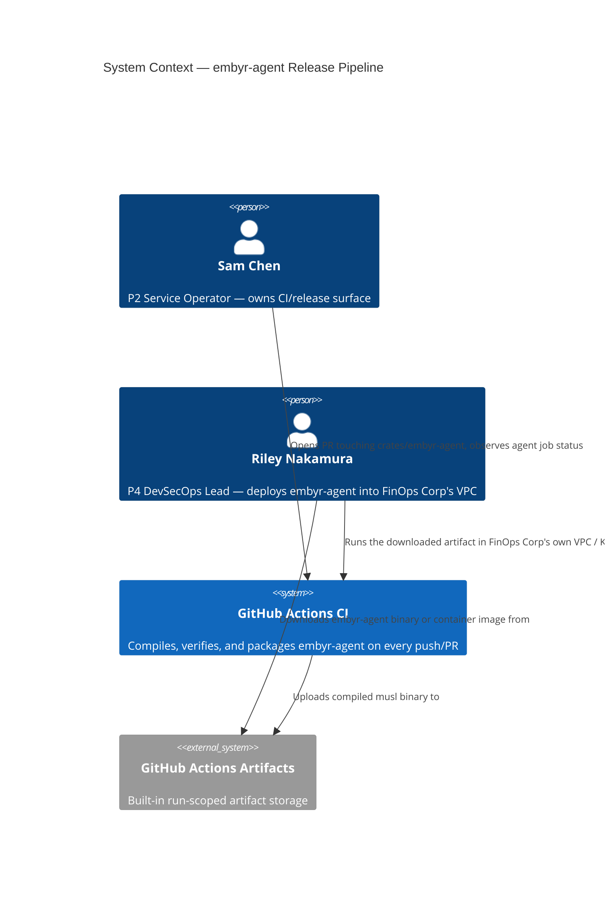
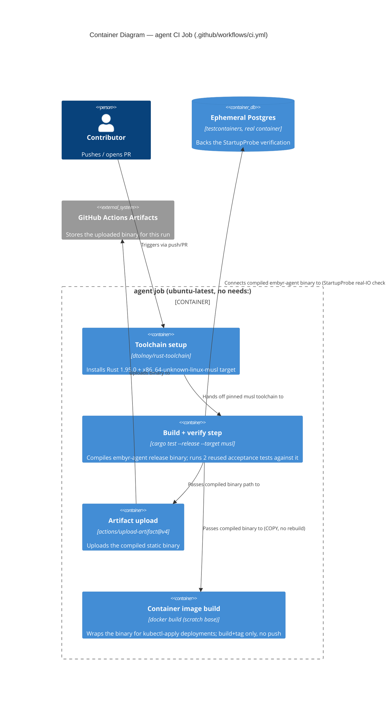

# Feature Delta: embyr-agent-release-pipeline

## Wave: DISCUSS / [REF] Prior Wave Consultation — Reading Confirmation

✓ `docs/product/production-readiness-audit-2026-09-08.md` — read in full. Finding #8 confirmed
verbatim: *"No build/release path exists for `embyr-agent` at all — no Dockerfile, no CI build
target, nothing in `.github/workflows/ci.yml` references it. The customer-VPC agent (the product's
core privacy boundary) cannot currently be distributed to a customer."* Category: DevOps. Severity:
**Blocker**. Status (before this DISCUSS): "Not started." This is the LAST of the 8 Blocker-severity
findings from that audit — all 7 siblings are already CLOSED (see MEMORY.md project index).

✓ `.github/workflows/ci.yml` read in full (162 lines). Confirmed three jobs exist — `test` (full
workspace `cargo test --workspace` against a real Postgres service container), `lint` (`cargo clippy
--workspace -- -D warnings` + `cargo deny check`), `docker` (`needs: [test]`, runs `docker build . -t
embyr-server:ci` against the root Dockerfile only). Zero string match for `embyr-agent` or
`embyr-agent` anywhere in the file — confirmed by direct read, not assumed.

✓ `find . -iname "Dockerfile*"` equivalent (Grep for `Dockerfile` across the repo) — only the
root-level `Dockerfile` exists (for `embyr-server`). No `crates/embyr-agent/Dockerfile` or any other
agent-specific Dockerfile anywhere in the repo.

✓ `docs/product/architecture/adr-001-process-topology.md` read in full. Confirmed the task's framing
exactly: `embyr-agent` is "a separately compiled, **statically-linked** Rust binary" that "opens one
TCP listener on `:9191`... and serves the `embyr.agent.v1.StorageAgent` gRPC service over mandatory
mTLS." Alternative C ("merge embyr-agent into embyr-rs with a local mode") is explicitly **rejected**
because "the agent's security model depends on physical process separation: the agent holds
credentials in its environment variables, in its own process space, in the customer's VPC... Static
linking of the agent binary is only meaningful if it is a separate, minimal-surface binary. A merged
binary would carry the full embyr SaaS attack surface into the customer VPC." This is a locked
architectural invariant this feature must honor, not re-litigate: whatever build/release mechanism
DESIGN chooses, it must preserve `embyr-agent` as a structurally separate artifact from
`embyr-server`.

✓ `docs/product/architecture/adr-008-crate-structure.md` read in full. Concerns `embyr-admin-ui`'s
own workspace membership and `trunk`-vs-`cargo build` separation — no direct distribution guidance
for `embyr-agent`, but confirms the codebase's established convention of CI running dedicated,
independent build steps per artifact type (native `cargo build` vs. `trunk build` for the WASM UI).
This is the same shape this feature needs: a build step for `embyr-agent` independent of, and
non-blocking to, the existing `embyr-server`-only `docker` job.

✓ Grepped `docs/product/architecture/*.md` broadly for `musl`, `release`, `distribut`, `artifact` —
28 files matched (mostly unrelated ADRs using "release" in an unrelated sense, e.g. lock release).
No ADR beyond ADR-001 makes any further distribution-shape decision for `embyr-agent`. No prior
locked decision this feature would contradict by choosing either a static-binary artifact, a
Dockerfile, or both — DESIGN has a clean starting point.

✓ `crates/embyr-agent/src/main.rs` read in full (45 lines). Top-of-file comment confirmed verbatim:
*"embyr-agent: statically linked customer-VPC binary (Linux musl target)."* Confirmed the runtime
sequence: installs the `ring` rustls crypto provider → loads `AgentConfig::from_env()` (exits 1 with
a named error on failure) → runs `probe::StartupProbe::new(&cfg.db_dsn, &cfg.cert_path).run().await`
as a **hard-gated** startup probe (Postgres connectivity + TLS cert validity) that must succeed
*before* the gRPC port is ever bound → calls `server::run(cfg)`.

✓ `crates/embyr-agent/src/config.rs` read in full (111 lines). `AgentConfig::from_env()` requires
`EMBYR_AGENT_DB_DSN`, `EMBYR_AGENT_PROJECT_ID`, `EMBYR_AGENT_CERT`, `EMBYR_AGENT_KEY`,
`EMBYR_AGENT_CA` (missing/empty → named diagnostic, all collected before returning `Err`, not
fail-fast-on-first). Optional vars with defaults: `EMBYR_AGENT_LISTEN_ADDR` (`0.0.0.0:9191`),
`EMBYR_AGENT_MAX_CONNS` (25), `EMBYR_AGENT_LOG_LEVEL` (`info`), `EMBYR_AGENT_SHUTDOWN_TIMEOUT_SECS`
(30), `EMBYR_AGENT_TRANSACTION_RETENTION_DAYS` (30). This confirms a concrete, testable walking-
skeleton claim: *"a built agent binary, given a valid Postgres DSN and TLS cert, starts and serves
gRPC on :9191"* is directly checkable against this existing, unchanged config/probe contract — no
new runtime behavior is required from `embyr-agent` itself, only a build/release path around it.

✓ `docs/product/journeys/agent-deployment.yaml` read in full. Persona: **Riley Nakamura (DevSecOps
Lead, FinOps Corp)**, P4, jobs JOB-04/JOB-07/JOB-09. Confirms the journey already documents startup
verification (`"connected to Postgres"`, `"listening on :9191"`) and audit evidence collection — but
step 1 ("Configure environment variables") and step 2 (`kubectl apply -f agent-deployment.yaml`)
**silently assume a deployable artifact already exists**. Nothing upstream of step 1 in this journey,
or anywhere else in the codebase, ever produces that artifact. This is the exact, precise gap finding
#8 names — confirmed by direct reading of the one journey that should own it, not by absence alone.

✓ `Dockerfile` (root) read in full. Confirmed: a well-commented 4-stage `cargo-chef` build
(chef → planner → builder → runtime) producing `embyr-server` only, pinned to `rust:1.95-slim-
bookworm` / `debian:bookworm-slim` (matching `rust-toolchain.toml`'s `1.95.0` pin), `SQLX_OFFLINE=true`
build, non-root runtime user, `EXPOSE 8080 8081 9090`. This is the established sibling CI/build
convention for a **containerized** binary — useful as a structural reference (multi-stage caching,
version-pin discipline, non-root user) but not necessarily the right final shape for `embyr-agent`,
since ADR-001 locks a static-binary distribution model, not a container-first one.

✓ `rust-toolchain.toml` read in full — pins `channel = "1.95.0"` only. **No `musl` target, no
`targets` array, no `.cargo/config.toml` exists anywhere in the repo** (confirmed by direct read plus
a repo-wide glob for `.cargo/config.toml`, zero matches). The musl-static-linking framing in
`main.rs`'s own top comment, and in two pre-existing planning documents
(`docs/architecture/embyr-rs/architecture-decisions.md:147` and
`docs/feature/embyr-rs/design/wave-decisions.md`, both stating `embyr-agent is statically linked
(RUSTFLAGS="-C target-feature=+crt-static" on Linux musl target)`), is **aspirational/documented
intent, not yet built** — no CI workflow, Cargo config, or toolchain file configures the musl target
today. This is the central investigation finding this DISCUSS was asked to confirm (see § Business
Context).

✓ `docs/feature/wire-secret-fetchers/feature-delta.md` read in full to confirm this project's
established single-file `feature-delta.md` convention (`## Wave: DISCUSS / [REF] {Section}` heading
format, story template, DoR checklist shape, Elevator Pitch requirement). This DISCUSS mirrors that
structure directly.

✓ `docs/product/jobs.yaml` read (JOB-01 through JOB-20, in full). See § Persona & Job for the job
selection reasoning.

## Wave: DISCUSS / [REF] Orchestrator Decisions (not re-litigated)

- Feature type: **DevOps build/release-path gap** — the LAST of 8 Blocker findings from the
  2026-09-08 production-readiness audit, and structurally distinct from the composition-root-wiring
  shape of the 7 already-closed siblings (this feature adds CI/build infrastructure, not application
  wiring).
- JTBD: **reuse JOB-13** (`production-deployment`, P2 Sam Chen) — not a new job, not JOB-04/JOB-07
  (Riley). See § Persona & Job for the full reasoning against both alternatives.
- Decision 4 (full JTBD path vs. infrastructure-only): **Yes — full JTBD path.** A working,
  CI-verified, obtainable `embyr-agent` artifact is directly user-observable (a green CI check, a
  downloadable artifact) and directly enables a real decision (Sam Chen can ship it; Riley can deploy
  it) — not zero-observable-behavior scaffolding.
- Distribution-shape investigation: **required by this DISCUSS, mechanism left to DESIGN** — see
  § Business Context for the confirmed finding (musl static binary is the strong architectural steer
  per ADR-001 and `main.rs`'s own top comment, but zero CI/toolchain support for it exists today).

## Wave: DISCUSS / [REF] Persona & Job

**Persona**: **P2 Sam Chen (Service Operator / Platform Engineer)** — the same persona JOB-13
already names, and the actor who owns this codebase's CI/build/release surface (confirmed by
`production-readiness`'s own original feature: *"CI gates every PR with cargo test + clippy + docker
build"*, and by `firestore-tls-support`'s prior JOB-13 reuse for a second production-deployment
capability).

**Job**: **JOB-13 `production-deployment`**, reused, made real for a second artifact (not new).
JOB-13's job story: *"When I want to deploy embyr to production, I want a single `docker run` command
to start the server, so I can ship without writing infrastructure from scratch."* Its functional
dimension already explicitly names the exact shape this feature extends: *"docker build succeeds from
a clean checkout in < 5 minutes... CI gates every PR with cargo test + clippy + docker build."* Its
social dimension — *"demonstrate to stakeholders that embyr has a production-ready deployment path,
not just a test suite"* — is incomplete today precisely because that deployment path covers only one
of the product's two shippable binaries. This is the same "make it real / close the remaining gap"
pattern this session has repeatedly used for CI/build-path completeness (JOB-13 was already extended
once, for TLS termination, by `firestore-tls-support`), applied here to a second gap in the same job's
own scope: CI build coverage.

**Candidates considered and rejected**:

- **JOB-04 `credential-isolation`** and **JOB-07 `agent-operations`** (both P4 Riley Nakamura) —
  rejected as the *primary* job_id, not as irrelevant. Direct reading of
  `docs/product/journeys/agent-deployment.yaml` (Riley's own already-documented journey for both
  jobs) confirms its step 1 ("Configure environment variables") and step 2 (`kubectl apply -f
  agent-deployment.yaml`) **assume a deployable artifact already exists** — neither job's own
  functional dimension describes *how the artifact comes to exist*, only how it is configured and
  operated once obtained. This feature is the genuine prerequisite that makes the first step of
  Riley's own journey possible at all, but the story's own shape (a CI job that compiles and packages
  a binary on every push/PR, mirroring the existing `test`/`lint`/`docker` job pattern) is a build/
  release-pipeline concern, not a configuration/operations concern — JOB-13's own shape, not JOB-04/
  JOB-07's. Riley remains the ultimate downstream beneficiary and is named throughout the Domain
  Examples below.
- **A new job** — rejected. The audit finding's own category (DevOps) and the exact functional
  language it implies ("a build/release path... cannot currently be distributed") is a verbatim match
  for JOB-13's own already-documented functional dimension, extended to a second artifact. No new
  persona need, emotional dimension, or social dimension is introduced that JOB-13 does not already
  cover.

## Wave: DISCUSS / [REF] Business Context

Today, `embyr-rs` ships exactly one binary with a real build/release path: `embyr-server`, via the
root `Dockerfile` and the `docker` job in `.github/workflows/ci.yml` (`needs: [test]`, builds and
tags `embyr-server:ci`). `embyr-agent` — described by ADR-001 as the product's "core privacy
boundary" and required for every `backend_mode=agent` customer (JOB-04/JOB-07/JOB-09, Riley Nakamura)
— has **zero** build/release coverage:

- No Dockerfile exists anywhere in the repo for it (confirmed by direct grep, not absence-of-search).
- `.github/workflows/ci.yml` never references it — the existing `test` job's `cargo test --workspace`
  does compile every workspace crate including `embyr-agent` as a side effect of running its own test
  binaries, but this is incidental compilation coverage, not a release artifact, and produces nothing
  a customer could obtain and run.
- No release/versioning/tagging mechanism exists for either binary (a separate, already-tracked
  finding — see § Out of Scope).

### Distribution-shape investigation (task-required)

ADR-001 explicitly locks `embyr-agent` as *"a separately compiled, statically-linked Rust binary"* —
this is the primary, architecturally-mandated distribution shape, not a container image, and the
locked rationale (Alternative C, rejected) is specifically that merging or containerizing it in a way
that couples it back to the SaaS attack surface would violate Riley's own credential-isolation
invariant. `main.rs`'s own top-of-file comment independently corroborates this: *"embyr-agent:
statically linked customer-VPC binary (Linux musl target)."*

Direct investigation (not assumption) confirms this musl-static-binary framing is **aspirational,
not yet built**:

- `rust-toolchain.toml` pins only `channel = "1.95.0"` — no `targets` array, no musl target.
- No `.cargo/config.toml` exists anywhere in the repo (confirmed by glob).
- `.github/workflows/ci.yml` never installs a musl target or a cross-compilation toolchain
  (`musl-tools`, `cross`, etc.) for any job.
- Two pre-existing planning documents (`docs/architecture/embyr-rs/architecture-decisions.md` and
  `docs/feature/embyr-rs/design/wave-decisions.md`) independently state the intended mechanism
  (`RUSTFLAGS="-C target-feature=+crt-static"` on a Linux musl target) — this is documented *intent*
  from earlier planning, never implemented in any actual build file.

This DISCUSS locks the **required outcome**, not the mechanism, consistent with this session's
established convention (DESIGN performs the investigation and implementation planning for the exact
mechanism): a customer (Riley) must be able to obtain a working, correctly-built `embyr-agent`
artifact and run it in their own VPC. The musl-static-binary shape is named here as the strong,
locked architectural steer from ADR-001 that DESIGN must honor or explicitly justify departing from —
but whether the CI pipeline produces (a) a downloadable static binary artifact (e.g., via GitHub
Actions/Releases artifacts), (b) a Dockerfile *wrapping* that static binary for operators who prefer
containers, or (c) both, is explicitly DESIGN's call to lock, not DISCUSS's.

## Wave: DISCUSS / [REF] Scope Assessment (Elephant Carpaccio Gate)

**Signals checked**: >10 user stories? No (1). >3 bounded contexts/modules? No — confined to CI/build
tooling (`.github/workflows/ci.yml`, and possibly a new `crates/embyr-agent`-scoped Dockerfile and/or
cross-compilation config) plus the already-existing, functionally-unchanged `embyr-agent` crate
(zero new domain type, zero new adapter, zero change to `AgentConfig`/`StartupProbe`/`server::run`).
Walking skeleton >5 integration points? No — one CI job compiling `embyr-agent`, one acceptance check
that the compiled binary starts and serves gRPC given a real Postgres + TLS cert fixture (mirroring
the existing `StartupProbe` contract exactly), one non-regression check that the existing `test`/
`lint`/`docker` jobs are unaffected. Estimated effort >2 weeks? No — no new application logic is
required; `embyr-agent` already runs correctly today when built and configured correctly (confirmed
by `docs/product/journeys/agent-deployment.yaml`'s own already-documented startup log evidence); this
is CI/build wiring using the existing sibling `Dockerfile`/`ci.yml` conventions as structural
references. Multiple independent user outcomes? No — "a customer can obtain and run a genuinely
working `embyr-agent` artifact" is a single outcome; the build-succeeds walking skeleton and the
artifact-is-runnable check are two facets of that one outcome, not independent outcomes.

**Scope Assessment: PASS** — 1 user story, 1 bounded context (CI/build-release tooling for
`embyr-agent`), estimated ≤3 days, 5 UAT scenarios (within the 3-7 right-sized range).

## Wave: DISCUSS / [REF] System Constraints

- Zero functional/behavioral change to `embyr-agent`'s own application code
  (`AgentConfig::from_env()`, `probe::StartupProbe`, `server::run`) — this feature is a build/release
  path around an already-correct binary, not a fix to the binary itself.
- Zero behavior change to the existing `test`, `lint`, and `docker` (`embyr-server`) CI jobs — the new
  agent build job must not slow down, block, or alter the pass/fail outcome of any existing job.
- `embyr-agent` must remain a structurally separate artifact from `embyr-server` in whatever mechanism
  DESIGN chooses (ADR-001's locked Alternative-C rejection: no merged binary, no shared attack
  surface).
- The exact artifact mechanism (static musl binary as a CI/release artifact, a Dockerfile wrapping it,
  or both) is DESIGN's call; this DISCUSS names ADR-001's static-binary framing as the strong
  architectural steer, not a locked mechanism.
- No new required environment variable, no change to `AgentConfig`'s existing required/optional
  variable set.
- Release-versioning/changelog infrastructure, a public binary-hosting/download page, and automatic
  semantic-version tagging are explicitly out of scope (see § Out of Scope) — this feature closes
  finding #8 only, not finding #19 (a separate, already-tracked, lower-severity gap).

## Wave: DISCUSS / [REF] User Stories

### US-01: embyr-agent Has a Genuine, CI-Verified Build and Release Path

**job_id**: JOB-13

#### Elevator Pitch
**Before**: Sam Chen (P2, Service Operator) opens or reviews a pull request that changes
`crates/embyr-agent` — CI shows the existing `test`, `lint`, and `docker` checks, none of which build
or validate `embyr-agent` as a distributable artifact (the `test` job's own `cargo test --workspace`
compiles it only incidentally, as a side effect of running its test binaries — it produces nothing a
customer could take and run). If Riley Nakamura (P4, DevSecOps Lead at FinOps Corp) asks Sam for a
real `embyr-agent` binary to `kubectl apply` into her VPC per her own already-documented deployment
journey (`docs/product/journeys/agent-deployment.yaml`), the honest answer today is that no such
artifact has ever been produced by this codebase's own CI, and no Dockerfile or build target exists
for it anywhere in the repo.
**After**: Every push and pull request against `master` runs a new CI job that compiles
`crates/embyr-agent` and verifies the resulting binary genuinely works — connects to a real Postgres
fixture, passes its own `StartupProbe`, and serves gRPC on `:9191` — exactly the same startup contract
`docs/product/journeys/agent-deployment.yaml` already documents Riley observing in production
(`"connected to Postgres"` then `"listening on :9191"`). Sam sees a new, green CI check alongside the
existing `test`/`lint`/`docker` checks, and a real, obtainable `embyr-agent` artifact exists at the
end of every successful run.
**Decision enabled**: Sam Chen can merge `embyr-agent` changes with the same confidence embyr-server
changes already have, and can hand Riley Nakamura a real, CI-verified `embyr-agent` artifact she can
deploy into FinOps Corp's own VPC — closing the last Blocker preventing every `backend_mode=agent`
customer from actually reaching production.

#### Who
- Sam Chen (P2) | Service Operator / Platform Engineer who owns this codebase's CI and release
  surface | Needs every shippable binary in the product — not only `embyr-server` — to have a real,
  automated build/release path before it can be trusted in production.
- Riley Nakamura (P4) | DevSecOps Lead deploying `embyr-agent` into her own company's VPC | Needs a
  genuine, correctly-built artifact to exist before her own already-documented deployment journey
  (env-var configuration, `kubectl apply`, startup-log verification) can even begin.

#### Solution
Add a new CI job (or jobs) to `.github/workflows/ci.yml` that compiles `crates/embyr-agent` on every
push/PR, independently of and without slowing the existing `test`/`lint`/`docker` jobs, and produces a
real, obtainable build artifact honoring ADR-001's statically-linked-binary architectural steer
(exact mechanism — static musl binary as a release artifact, a Dockerfile wrapping it, or both — is
DESIGN's call). The produced artifact must be independently verified to start correctly (passes its
own `StartupProbe`, serves gRPC on `:9191`) against a real Postgres + TLS cert fixture, not merely
compile.

#### Domain Examples

**Example 1 (Happy Path — CI builds and validates the artifact)**: Sam Chen opens a pull request that
adds a new field to `embyr-agent`'s gRPC `StorageAgent` handler. The new `agent` CI job compiles
`crates/embyr-agent`, produces a build artifact, and runs it against a real ephemeral Postgres
container with a self-signed TLS cert fixture (`EMBYR_AGENT_DB_DSN`, `EMBYR_AGENT_CERT`,
`EMBYR_AGENT_KEY`, `EMBYR_AGENT_CA` all set) — the job asserts the process logs a Postgres-connected
message and then a `"listening on :9191"` message within a bounded startup window. The PR shows a
green `agent` check alongside the existing `test`/`lint`/`docker` checks.

**Example 2 (Edge Case — a customer obtains and runs the real artifact)**: Riley Nakamura, DevSecOps
Lead at FinOps Corp, needs a real `embyr-agent` artifact for step 2 of her own already-documented
deployment journey (`kubectl apply -f agent-deployment.yaml`). She downloads the artifact produced by
a successful `master` build (mechanism per DESIGN — e.g., a GitHub Actions build artifact or a
container image), configures `EMBYR_AGENT_DB_DSN`/`EMBYR_AGENT_CERT`/`EMBYR_AGENT_KEY`/
`EMBYR_AGENT_CA` for FinOps Corp's own Postgres and TLS material, and starts it — she sees the exact
same `"connected to Postgres"` then `"listening on :9191"` structured log lines her own journey
document already specifies, with zero code changes required from `embyr-agent` itself.

**Example 3 (Error/Boundary — a break in embyr-agent fails only its own CI job)**: A contributor
introduces a compile error scoped only to `crates/embyr-agent/src/server.rs` (e.g., a typo in a
method signature) in a PR that touches no other crate. The new `agent` CI job fails with a named
Rust compiler error visible in the PR checks. The existing `test`, `lint`, and `docker` jobs — which
do not depend on a clean `embyr-agent` compile for their own outcomes to be meaningful — continue to
run and report their own pass/fail status independently, exactly as they did before this feature.

#### UAT Scenarios (BDD)

```gherkin
Scenario: CI builds embyr-agent successfully on every push and pull request
  Given a pull request modifies a file inside crates/embyr-agent
  When the CI pipeline runs
  Then a dedicated CI job compiles crates/embyr-agent successfully
  And the job reports a clear pass/fail status alongside the existing test/lint/docker checks

Scenario: The built embyr-agent artifact starts and serves gRPC given valid configuration
  Given a real ephemeral Postgres instance is reachable and valid TLS cert/key/CA material exists
  And the CI-built embyr-agent artifact is configured via EMBYR_AGENT_DB_DSN/EMBYR_AGENT_CERT/EMBYR_AGENT_KEY/EMBYR_AGENT_CA
  When the artifact is started
  Then it passes its own StartupProbe (Postgres connectivity + TLS cert validity)
  And it logs a successful Postgres connection followed by "listening on :9191"

Scenario: A customer can obtain a real, runnable embyr-agent artifact from a successful build
  Given a push to master completes the new embyr-agent CI job successfully
  When Riley (DevSecOps Lead) retrieves the resulting build artifact
  Then the artifact is a genuine, structurally-separate embyr-agent binary honoring ADR-001's static-binary architecture
  And Riley can run it in her own VPC without any embyr SaaS process dependency

Scenario: The existing embyr-server-only CI pipeline is unaffected by the new agent build job
  Given the CI pipeline now includes a job that builds crates/embyr-agent
  When a pull request that does not touch crates/embyr-agent runs through CI
  Then the existing test, lint, and docker (embyr-server) jobs report the same pass/fail outcome as before this feature
  And their own run time is not materially degraded by the new job's addition

Scenario: A compile-breaking change scoped only to embyr-agent fails cleanly and visibly
  Given a pull request introduces a compile error only inside crates/embyr-agent
  When the CI pipeline runs
  Then the new agent build job fails with a named, visible compiler error
  And this failure does not silently pass and does not block the unrelated test/lint/docker jobs from reporting their own independent outcomes
```

#### Acceptance Criteria
- [ ] AC-EARP-01: a new CI job builds `crates/embyr-agent` successfully on every push/PR to `master`
      (mirrors the existing `test`/`lint`/`docker` job pattern in `ci.yml`), running independently of
      the existing `docker` job (walking skeleton).
- [ ] AC-EARP-02: the compiled `embyr-agent` artifact, given a valid Postgres DSN and valid TLS
      cert/key/CA paths, passes its own `StartupProbe` and logs a successful startup sequence
      (Postgres connected, then listening on `:9191`) — a genuinely runnable artifact, not merely a
      successful compile.
- [ ] AC-EARP-03: the CI pipeline produces `embyr-agent` as a real, obtainable build artifact (exact
      mechanism — static musl binary as a release artifact, a Dockerfile wrapping it, or both — is
      DESIGN's locked call) that a customer could take and run in their own VPC, honoring ADR-001's
      statically-linked, structurally-separate-binary architecture.
- [ ] AC-EARP-04 (regression guard): the existing `test`, `lint`, and `docker` (`embyr-server`) CI
      jobs are provably unaffected by the new agent build job — same pass/fail behavior, no material
      slowdown.
- [ ] AC-EARP-05: a compile-breaking change scoped only to `crates/embyr-agent` fails the new CI job
      with a named, visible error, and does not silently pass or block the unrelated `test`/`lint`/
      `docker` jobs from reporting their own independent outcomes.

#### Outcome KPIs
- **Who**: Sam Chen (P2, Service Operator / Platform Engineer) who owns this codebase's CI/release
  surface, and Riley Nakamura (P4, DevSecOps Lead) who is the ultimate consumer of the produced
  artifact (JOB-13's own persona, with JOB-04/JOB-07's persona as the direct downstream beneficiary).
- **Does what**: obtains a genuinely working, CI-verified `embyr-agent` build artifact on every
  push/PR, and can successfully start that artifact against a real Postgres + TLS cert environment.
- **By how much**: from 0% (today — zero CI coverage, zero Dockerfile, zero release artifact for
  `embyr-agent`, confirmed by direct reading of `ci.yml` and a repo-wide search for any
  `embyr-agent`-specific Dockerfile) to 100% of pushes/PRs producing a verified-buildable,
  verified-startable `embyr-agent` artifact; 0% regression on the existing `test`/`lint`/`docker`
  jobs' own pass/fail behavior or run time.
- **Measured by**: CI job pass/fail rate for the new agent build job, plus an acceptance check that
  runs the produced artifact's own `StartupProbe` against a real Postgres + TLS cert fixture and
  asserts it starts and serves gRPC on `:9191`.
- **Baseline**: 0% — confirmed by direct reading of `.github/workflows/ci.yml` (162 lines, zero
  `embyr-agent` reference) and a repo-wide search for any agent-specific `Dockerfile` (only the root
  `Dockerfile`, for `embyr-server`, exists today).

#### Technical Notes
- `AgentConfig::from_env()` (`crates/embyr-agent/src/config.rs`) and `probe::StartupProbe`
  (referenced from `crates/embyr-agent/src/main.rs`) already define the complete runtime contract the
  new CI job's own "artifact actually works" check must exercise — zero new runtime code is required
  from `embyr-agent` itself.
- `rust-toolchain.toml` pins `channel = "1.95.0"` only; no musl target is configured anywhere in the
  repo today (no `.cargo/config.toml`, no `targets` array). If DESIGN chooses the musl static-binary
  mechanism, this target configuration must be added as part of that work — it does not exist today
  despite being named in `main.rs`'s own top comment and in prior planning documents
  (`docs/architecture/embyr-rs/architecture-decisions.md`,
  `docs/feature/embyr-rs/design/wave-decisions.md`).
- The root `Dockerfile`'s own 4-stage `cargo-chef` structure (chef → planner → builder → runtime),
  version-pin discipline (`rust:1.95-slim-bookworm` matching `rust-toolchain.toml` exactly,
  `debian:bookworm-slim` runtime), and non-root-user pattern are a useful structural reference if
  DESIGN chooses to also wrap the static binary in a container — but ADR-001's own locked decision
  means `embyr-agent` must remain structurally separate from `embyr-server`, so this cannot simply be
  a second `--bin` target added to the existing Dockerfile's builder stage without care.
- Depends on nothing new — `embyr-agent`, `AgentConfig`, `StartupProbe`, and `server::run` all already
  exist, are already correct (per `agent-deployment.yaml`'s own documented evidence), and are
  unchanged by this feature; this is CI/build-pipeline construction only.

## Wave: DISCUSS / [REF] Definition of Done

1. AC-EARP-01 through AC-EARP-05 all pass, proven against a real CI run and a real running
   `embyr-agent` process (real Postgres fixture, real TLS certs) — mirrors this session's own "real,
   not mocked/unit-only" proof standard.
2. AC-EARP-04's regression guard is proven identical to pre-feature behavior for the existing `test`/
   `lint`/`docker` jobs, not merely "still works."
3. AC-EARP-05's failure-visibility behavior is proven as an explicit, named test case (a real
   compile-breaking PR scenario), not merely assumed.
4. Full regression suite clean (pre-existing flakes triaged, not assumed, per this session's own
   `feedback_triage_before_dismissing_as_flaky` practice).
5. Mutation testing runs after DELIVER, per this repo's own `per-feature` strategy (root `CLAUDE.md`)
   — scoped to any new Rust code the chosen mechanism introduces (e.g., a build-verification test
   harness), not to CI YAML itself.
6. Evolution doc written; `docs/product/production-readiness-audit-2026-09-08.md` row 8 updated to
   CLOSED at FINALIZE (this DISCUSS advances it to IN PROGRESS — see § Next Wave). This closes the
   LAST of the 8 Blocker findings from the 2026-09-08 audit.
7. Memory updated.

## Wave: DISCUSS / [REF] Out of Scope

- **Actual customer-facing release-versioning/changelog infrastructure, semantic-version tagging, or
  a public binary-hosting/download page** — checked first, not assumed unneeded: finding #19 in the
  same audit (*"No deployment automation beyond the Dockerfile itself... no release process — crate
  version frozen at 0.1.0, no CHANGELOG, no git tags"*) already tracks this as a separate, distinct,
  lower-severity (High, not Blocker) gap covering *both* `embyr-server` and `embyr-agent`. This
  feature closes finding #8 (embyr-agent has zero build path at all) only; finding #19 remains
  separately tracked and is not re-litigated or silently absorbed here.
- **Any functional/behavioral change to `embyr-agent`'s own application code** — `AgentConfig`,
  `StartupProbe`, and `server::run` are already correct per `agent-deployment.yaml`'s own documented
  evidence; this feature builds and releases the existing binary, it does not change what the binary
  does.
- **`embyr-agent`'s own field-path SQL validator gap** (audit finding #11 — a real security gap in
  the agent's query-building code) — an unrelated, separately-tracked High-severity finding, not a
  build/release-path concern.
- **mTLS certificate provisioning, customer-side Kubernetes manifests, or any other part of Riley's
  own operational deployment journey** beyond obtaining the artifact itself — already covered by
  JOB-04/JOB-07/JOB-09 and `docs/product/journeys/agent-deployment.yaml`, not re-litigated here.
- **Cross-compilation or release tooling for any binary other than `embyr-agent`** — `embyr-server`
  already has a working build/release path (the existing root `Dockerfile` + `docker` CI job); this
  feature does not touch it beyond ensuring the new agent job does not regress it (AC-EARP-04).

## Wave: DISCUSS / [REF] Walking Skeleton Strategy

**Strategy A** (real, minimal, end-to-end) — the walking skeleton is AC-EARP-01 + AC-EARP-02: a real
CI job that compiles `crates/embyr-agent` and a real acceptance check that starts the resulting
artifact against a real ephemeral Postgres container and real TLS cert fixtures, asserting it passes
its own `StartupProbe` and serves gRPC on `:9191` — mirroring `agent-deployment.yaml`'s own already-
documented startup-log evidence exactly. AC-EARP-03 (the artifact is genuinely obtainable per ADR-001's
architecture) and AC-EARP-04/05 (non-regression and failure-visibility) build directly on that same
skeleton. This feature IS the walking skeleton — single story, no further slicing (mirrors this
session's own established single-story precedent for confined, well-understood build/release-path
gaps, e.g. `wire-secret-fetchers`, `stripe-webhook-secret-required`).

## Wave: DISCUSS / [REF] Driving Ports

No new RPC/HTTP endpoint. The driving trigger is the GitHub Actions workflow itself (`push`/
`pull_request` to `master`, the same trigger the existing `test`/`lint`/`docker` jobs already use).
The artifact-retrieval interface (GitHub Actions build artifacts, a container registry, or both) is
DESIGN's call — see § Business Context.

## Wave: DISCUSS / [REF] Pre-requisites

- None beyond what already exists. `embyr-agent`'s own `AgentConfig`, `StartupProbe`, and
  `server::run` already exist and are already correct. The root `Dockerfile`'s multi-stage
  `cargo-chef` pattern and `.github/workflows/ci.yml`'s existing `test`/`lint`/`docker` job structure
  are both available as structural references for the new job(s).
- If DESIGN selects the musl static-binary mechanism, the musl target and any required cross-
  compilation tooling (`musl-tools`, `cross`, or equivalent) must be newly added — confirmed absent
  from the repo today (see § Business Context investigation).

## Wave: DISCUSS / [REF] Definition of Ready Validation

### DoR Checklist (9-item hard gate)
1. [x] Story traces to a job_id (JOB-13) — reused, not new, with reasoning against both nearest
   alternatives (JOB-04, JOB-07) explicitly documented in § Persona & Job, confirmed by direct
   reading of `docs/product/journeys/agent-deployment.yaml`.
2. [x] Story has a complete Elevator Pitch (Before / After / Decision enabled), naming a real
   user-invocable entry point (`git push`/opening a PR triggering the GitHub Actions CI pipeline —
   the same entry-point shape this session's own `production-readiness` and `firestore-tls-support`
   features already established for JOB-13).
3. [x] Every AC is testable without ambiguity (5 ACs, each a real CI-job assertion or a real
   running-artifact assertion against real Postgres + TLS cert fixtures).
4. [x] Walking Skeleton identified (AC-EARP-01 + AC-EARP-02, the whole feature's own core).
5. [x] Scope Assessment passed.
6. [x] Story is not `@infrastructure`-only with no user-visible value — Decision 4 = Yes (full JTBD
   path); it directly enables both Sam Chen's own merge-confidence decision and Riley's own
   deploy-this-artifact decision (Elevator Pitch "Decision enabled").
7. [x] Out of Scope explicitly named (5 items, each reasoned, including a check against finding #19
   before excluding release-versioning infrastructure).
8. [x] Outcome KPIs have a numeric framing (0% → 100% of pushes/PRs producing a verified artifact)
   and measurement methods using real CI runs and real startup-probe verification.
9. [x] Prior-wave artifacts read and reconciled (the audit's own finding #8, ADR-001, ADR-008,
   `main.rs`/`config.rs`, the existing `Dockerfile`/`ci.yml`, `jobs.yaml`, and
   `agent-deployment.yaml` all directly informed this feature's shape; the musl-target investigation
   was performed, not assumed, and confirmed aspirational-only).

### DoR Status: **PASSED**

## Wave: DISCUSS / [REF] Wave Decisions Summary

### Key Decisions
- [D1] Job reused: JOB-13 (`production-deployment`, P2 Sam Chen) — not JOB-04/JOB-07 (Riley), whose
  own documented journey (`agent-deployment.yaml`) assumes a deployable artifact already exists and
  therefore does not cover this gap's own shape (a CI build/release path).
- [D2] Scope is exactly a new CI job (or jobs) that compiles and packages `crates/embyr-agent`,
  independent of and non-regressive to the existing `test`/`lint`/`docker` jobs — zero change to
  `embyr-agent`'s own application code.
- [D3] Distribution-shape investigation confirmed: ADR-001 locks a statically-linked, structurally-
  separate binary as `embyr-agent`'s primary architecture; `main.rs`'s own top comment and two prior
  planning documents independently name a Linux musl target as the intended mechanism, but **zero**
  CI, `.cargo/config.toml`, or `rust-toolchain.toml` configuration for that target exists anywhere in
  the repo today — this is aspirational documentation, not built infrastructure. This DISCUSS locks
  the required OUTCOME (a customer can obtain and run a working `embyr-agent` artifact); the exact
  mechanism (static binary release artifact, a wrapping Dockerfile, or both) is DESIGN's call.
- [D4] The existing `embyr-server`-only `docker` CI job must be provably unaffected (AC-EARP-04) —
  the new agent build work runs independently, not as a modification to that job.
- [D5] Release-versioning/changelog/public-download-page infrastructure is explicitly out of scope,
  checked against and confirmed already separately tracked by audit finding #19 — not silently
  assumed unneeded.

### Requirements Summary
- Primary need: `embyr-agent` — the product's own "core privacy boundary" component per ADR-001 and
  the audit finding's own framing — must have a genuine, CI-verified build path, and the artifact it
  produces must actually start and serve gRPC correctly, not merely compile.
- Walking skeleton scope: US-01, the entire feature — single story, 5 UAT scenarios, 5 ACs.
- Feature type: DevOps build/release-path gap — the LAST of the 2026-09-08 audit's 8 Blocker findings.

### Constraints Established
- Zero functional change to `embyr-agent`'s own runtime behavior.
- Zero regression to the existing `test`/`lint`/`docker` CI jobs.
- `embyr-agent` remains structurally separate from `embyr-server` in whatever mechanism DESIGN
  chooses (ADR-001's locked Alternative-C rejection).
- No new required environment variable.

### Upstream Changes
None — this DISCUSS closes a pre-existing, already-tracked audit finding (#8) against JOB-13's own
already-documented scope; no amendment to `jobs.yaml` is warranted (JOB-13's own functional
dimension already names "CI gates every PR" generically enough to cover a second artifact without
rewording).

## Wave: DISCUSS / [REF] Next Wave

**Handoff To**: nw-solution-architect (DESIGN wave)
**Deliverables**: this feature-delta.md, 5 locked Decisions (D1-D5), 1-story walking-skeleton plan, 5
ACs (AC-EARP-01 through AC-EARP-05) to design executable scenarios against. DESIGN's own investigation
scope: (1) the exact artifact-production mechanism (static musl binary as a CI/release artifact via
GitHub Actions, a Dockerfile wrapping that binary, or both) and the concrete musl-target/cross-
compilation toolchain additions it requires (none exist today — see § Business Context), (2) where
the produced artifact is published/retained (GitHub Actions artifacts, a container registry, or
both) and its retention policy, (3) the exact CI job dependency graph ensuring AC-EARP-04's
non-regression guarantee (e.g., whether the new job runs fully in parallel with `test`/`lint`/`docker`
or shares a dependency), (4) the concrete acceptance-test fixture shape for AC-EARP-02 (how a real
ephemeral Postgres + TLS cert pair is provisioned inside the new CI job to exercise `StartupProbe`
end-to-end).

## Wave: DESIGN / [REF] Reading Confirmation

✓ `.github/workflows/ci.yml` (162 lines), root `Dockerfile`, `rust-toolchain.toml`,
`docs/product/architecture/adr-001-process-topology.md`, `crates/embyr-agent/src/main.rs`,
`crates/embyr-agent/src/config.rs`, `crates/embyr-agent/src/probe.rs`,
`docs/product/journeys/agent-deployment.yaml` — all read in full, not re-litigated where DISCUSS
already established the finding.

✓ `docs/architecture/embyr-rs/architecture-decisions.md:143-147` and
`docs/feature/embyr-rs/design/wave-decisions.md` — confirmed the only pre-existing distribution-shape
guidance (`RUSTFLAGS="-C target-feature=+crt-static"` on musl, `embyr-agent`'s runtime dependency list
— `tokio`/`tonic`/`sqlx`/`rustls`/`tokio-rustls`/`config`/`serde`/`thiserror`/`tracing`/
`tracing-subscriber`, notably zero `openssl`/`native-tls`).

✓ `tests/acceptance/embyr_agent/mod.rs` and `tests/acceptance/embyr_agent/us_a06_lifecycle.rs` read
in full. Found the exact existing fixture DISCUSS pointed at: `start_test_postgres`/
`test_tls_config` helpers, and two tests —
`agent_logs_storage_readiness_before_accepting_connections` and
`storage_credential_never_appears_in_agent_logs` — that already spawn
`env!("CARGO_BIN_EXE_embyr-agent")` as a real subprocess against a real testcontainers Postgres and
assert the exact "connected to Postgres" → "listening on :9191" sequence AC-EARP-02 requires. Both
carry `#[ignore = "requires Docker + embyr-agent binary — unskip in S06A delivery"]` — this feature
is that delivery. No new smoke-test infrastructure is designed; these are reused as-is.

✓ `crates/embyr-agent/Cargo.toml` read in full. Confirmed the `[[test]] name = "embyr_agent" path =
"../../tests/acceptance/embyr_agent.rs"` harness binding — gives the exact `cargo test -p embyr-agent
--test embyr_agent` invocation used below.

✓ Root `Cargo.toml` grepped for `native-tls`/`openssl`/`rustls` — confirmed (explicit workspace
comment) "this workspace is rustls-only throughout," `sqlx` uses `runtime-tokio-rustls`. Zero
`openssl-sys` anywhere in `embyr-agent`'s dependency tree (deps or dev-deps) — musl cross-compilation
needs only `musl-tools` (for `ring`'s C/assembly build step), not `libssl-dev`.

✓ Glob of `docs/product/architecture/adr-*.md` — highest existing number is `adr-073`. New ADR
written as `adr-074-agent-release-pipeline.md`.

## Wave: DESIGN / [REF] Multi-Architect Context

No `docs/product/architecture/brief.md` exists for this repo (this project's architecture lives in
numbered ADRs + `docs/architecture/embyr-rs/architecture-decisions.md`, not a single brief SSOT) —
proceeding as the sole architect for this feature, consistent with every prior sibling Blocker
feature this session (see MEMORY.md project index; none of the 7 closed siblings used a `brief.md`
either).

## Wave: DESIGN / [REF] Architecture Design

Full decision record, alternatives, and rationale: **`docs/product/architecture/adr-074-agent-release-pipeline.md`**
(new ADR — extends ADR-001's already-locked process-topology architecture; does not introduce new
application architecture, so this stays a single ADR rather than a `brief.md` section).

### Locked decisions (summary — see ADR-074 for full alternatives analysis)

| Area | Decision |
|------|----------|
| Musl target | `x86_64-unknown-linux-musl` only. `aarch64` explicitly deferred (YAGNI — no persona/journey names arm64). |
| Toolchain | `dtolnay/rust-toolchain@stable`, `toolchain: "1.95.0"` (exact `rust-toolchain.toml` match), `targets: x86_64-unknown-linux-musl` set on the same install step — avoids the toolchain-drift trap the root `Dockerfile`'s own comments document. |
| System packages | `protobuf-compiler` (existing convention) + `musl-tools` (new — provides `musl-gcc` for `ring`'s C/assembly build step). No `libssl-dev` needed (rustls/ring-only dependency tree, confirmed). |
| Static linking | `RUSTFLAGS="-C target-feature=+crt-static"` set explicitly on the build step (belt-and-suspenders on top of musl's own default). |
| CI job | New job `agent`, `runs-on: ubuntu-latest`, **no `needs:`** — deliberately NOT `needs: [test]` despite mirroring `docker`'s shape being the obvious first instinct. See ADR-074 § Alternative 3: `needs: [test]` would make GitHub Actions **skip** (not fail) `agent` when `test` fails first on the same compile break, which contradicts AC-EARP-05's explicit "the new agent build job fails with a named, visible compiler error." No `needs:` is also the strictest form of AC-EARP-04 non-interference (zero shared dependency edge in either direction). |
| Artifact — primary | `actions/upload-artifact@v4` uploading the compiled `target/x86_64-unknown-linux-musl/release/embyr-agent` static binary. Zero new infrastructure. |
| Artifact — secondary | `crates/embyr-agent/Dockerfile` (new, `FROM scratch`), wrapping the already-built binary — no compilation inside the image. Warranted (not scope creep): `agent-deployment.yaml` step 2 is `kubectl apply -f agent-deployment.yaml`, which requires a container image; a bare-binary-only artifact leaves that already-documented step unfulfillable. Build-and-tag only in CI, no registry push (mirrors the existing `docker` job's own exact pattern for `embyr-server`; registry publishing is audit finding #19's separately-tracked scope). |
| Verification | Reuse `tests/acceptance/embyr_agent/us_a06_lifecycle.rs`'s two existing tests, run against the real musl release binary in the same build step (compiling and testing in one `cargo test --release --target x86_64-unknown-linux-musl` invocation — no duplicate compilation). DELIVER removes the now-stale `#[ignore]` from both. |

### External integrations

None. `embyr-agent`'s only network dependency is customer-supplied Postgres + mTLS to embyr SaaS,
both already covered by the existing `StartupProbe`/mTLS design — no new third-party API, no new
webhook, no new OAuth provider. No contract-testing annotation needed for this feature.

### C4 — System Context (L1)



### C4 — Container (L2): the new `agent` CI job



### Concrete CI job (`.github/workflows/ci.yml` — new job, added after `docker`, no edits to any existing job)

```yaml
  # ─── agent: build + verify + package the embyr-agent static binary ───────────
  # Produces the artifact ADR-001 requires: a separately compiled,
  # statically-linked embyr-agent binary. Deliberately has no `needs:` —
  # see ADR-074 for why mirroring the `docker` job's `needs: [test]` shape
  # would break AC-EARP-05's failure-visibility requirement.
  agent:
    name: Agent build
    runs-on: ubuntu-latest

    steps:
      - uses: actions/checkout@v4

      - name: Install protoc + musl-tools
        run: |
          sudo apt-get update
          sudo apt-get install -y protobuf-compiler musl-tools

      # toolchain: pinned to match rust-toolchain.toml exactly (1.95.0) — see
      # the equivalent comment in the `test` job for why drift here has
      # broken CI before. `targets:` installs the musl target on THIS
      # pinned toolchain install, not via a later `rustup target add` (which
      # would silently land on the wrong, stable-tracking toolchain once
      # rust-toolchain.toml's own override takes effect).
      - uses: dtolnay/rust-toolchain@stable
        with:
          toolchain: "1.95.0"
          targets: x86_64-unknown-linux-musl

      - uses: Swatinem/rust-cache@v2

      # Compiles the release embyr-agent binary for the musl target AND runs
      # the two acceptance tests already written for exactly this purpose
      # (tests/acceptance/embyr_agent/us_a06_lifecycle.rs) against the real
      # compiled artifact. RUSTFLAGS makes static linking explicit on top of
      # musl's own default (matches main.rs's own top comment and
      # docs/architecture/embyr-rs/architecture-decisions.md:147).
      - name: Build + verify release musl binary
        env:
          RUSTFLAGS: "-C target-feature=+crt-static"
        run: >
          cargo test --release --target x86_64-unknown-linux-musl
          -p embyr-agent --test embyr_agent --
          agent_logs_storage_readiness_before_accepting_connections
          storage_credential_never_appears_in_agent_logs

      - name: Upload embyr-agent artifact
        uses: actions/upload-artifact@v4
        with:
          name: embyr-agent-x86_64-unknown-linux-musl
          path: target/x86_64-unknown-linux-musl/release/embyr-agent
          if-no-files-found: error

      - uses: docker/setup-buildx-action@v3

      # Validates crates/embyr-agent/Dockerfile builds — build-and-tag-only,
      # no registry push, same pattern the existing `docker` job already
      # uses for embyr-server (registry publishing is finding #19's scope).
      # scope=agent keeps this job's GHA cache isolated from the existing
      # `docker` job's own cache (AC-EARP-04: no shared state).
      - name: Build embyr-agent container image
        run: >
          docker build . -f crates/embyr-agent/Dockerfile -t embyr-agent:ci
          --cache-from type=gha,scope=agent
          --cache-to type=gha,mode=max,scope=agent
```

### Concrete Dockerfile (new file: `crates/embyr-agent/Dockerfile`)

```dockerfile
# crates/embyr-agent/Dockerfile
#
# Wraps the pre-built, statically-linked x86_64-unknown-linux-musl
# embyr-agent binary (produced by the `agent` CI job's musl build step) for
# operators who deploy via Kubernetes (docs/product/journeys/agent-deployment.yaml
# step 2: `kubectl apply`) rather than a bare-binary VPC install.
#
# No compilation happens here — the release binary is already built by CI
# before this step runs. ADR-001 requires embyr-agent to remain a
# structurally separate artifact from embyr-server: this image contains
# only the agent binary, nothing from crates/embyr-server.
#
# FROM scratch (not debian:bookworm-slim, unlike the root Dockerfile) is
# possible because the binary is fully statically linked and the agent's
# dependency tree is rustls/ring-only (zero openssl-sys, confirmed in
# ADR-074) — no glibc, no shared libs, no package manager needed at runtime.
# embyr-agent makes no outbound public-CA-verified HTTPS calls (its mTLS
# material is customer-supplied via EMBYR_AGENT_CERT/KEY/CA), so no CA
# bundle is copied in either.

FROM scratch AS runtime

COPY target/x86_64-unknown-linux-musl/release/embyr-agent /embyr-agent

# Numeric non-root UID — scratch has no /etc/passwd, so a named user isn't
# possible; 65532 is the conventional distroless "nonroot" UID.
USER 65532:65532

EXPOSE 9191

ENTRYPOINT ["/embyr-agent"]
```

### AC → design mapping

- **AC-EARP-01** (builds on every push/PR): satisfied by the new `agent` job's own trigger (inherits
  the workflow-level `on: push`/`pull_request` already covering all jobs).
- **AC-EARP-02** (artifact genuinely runs, not just compiles): satisfied by running
  `agent_logs_storage_readiness_before_accepting_connections` against the real musl release binary
  in the same step that builds it.
- **AC-EARP-03** (real, obtainable artifact honoring ADR-001): satisfied by the
  `actions/upload-artifact@v4` step (primary, ADR-001-literal shape) plus the Dockerfile build
  (secondary, satisfies the Kubernetes deployment path).
- **AC-EARP-04** (no regression to `test`/`lint`/`docker`): satisfied structurally — `agent` has no
  `needs:` edge to or from any existing job; `--cache-to type=gha,scope=agent` prevents cache
  interference with the existing `docker` job.
- **AC-EARP-05** (compile break scoped to `embyr-agent` fails visibly, doesn't block others):
  satisfied precisely because `agent` has no `needs: [test]` — it runs and fails independently
  even when `test` also fails on the same break (see ADR-074 § Alternative 3 for why `needs:
  [test]` would have broken this AC via GitHub Actions' skip-on-failed-dependency semantics).

### Non-functional / Earned Trust note

The verification step is deliberately run against the actual musl release artifact, not a separate
glibc debug build — CI does not treat "compiles for musl" as proof of "runs correctly under musl."
It exercises `StartupProbe` (Postgres connectivity + TLS cert validity, `crates/embyr-agent/src/probe.rs`,
unchanged by this feature) against the real compiled binary before the pipeline is considered green.

**Documented residual risk, not silently dropped**: the smoke test connects to Postgres via an IP
literal (`127.0.0.1`, testcontainers-assigned port) and therefore does not exercise musl's
`getaddrinfo`/DNS-resolver behavior, which differs from glibc's. A customer DSN using a hostname
requiring specific resolver behavior remains unverified by this pipeline. Out of this feature's
locked scope; flagged for platform-architect / a future feature if it becomes a real incident.

## Wave: DESIGN / [REF] Quality Validation

- [x] Requirements traced to components: all 5 ACs mapped to concrete CI steps (§ AC → design mapping).
- [x] Component boundaries: `agent` job is a new, independent CI job; `embyr-agent` crate itself is
      unchanged (zero functional/behavioral diff, per DISCUSS's own constraint).
- [x] Technology choices in ADR with alternatives: ADR-074, 6 alternatives considered and rejected.
- [x] Dependency-inversion / hexagonal compliance: N/A — this feature is CI/build tooling, not
      application code; no new port/adapter introduced. `StartupProbe`, the existing adapter-facing
      contract this feature verifies, is unchanged.
- [x] C4 diagrams: L1 (System Context) + L2 (Container) above, Mermaid, every arrow labeled with a verb.
- [x] Integration patterns specified: none new (no external integration introduced).
- [x] OSS preference validated: `dtolnay/rust-toolchain`, `Swatinem/rust-cache`, `actions/upload-artifact`,
      `docker/setup-buildx-action` — all already in use elsewhere in this exact `ci.yml`, all
      MIT/Apache-2.0-licensed, zero new tool introduced beyond `musl-tools` (Debian package, GPL —
      build-time only, never shipped in the runtime image, consistent with `cargo-chef`/`protobuf-compiler`
      already being build-time-only GPL/BSD tools elsewhere in this pipeline).
- [x] AC behavioral, not implementation-coupled: AC-EARP-01 through 05 all describe observable CI
      outcomes (job pass/fail, artifact presence, log content), not internal step structure.
- [x] External integrations: none present — no contract-testing annotation needed.
- [x] Architectural enforcement tooling: N/A for this feature (no new architecture rule to enforce
      beyond ADR-001's structural-separation invariant, which is enforced by construction — the
      Dockerfile only ever COPYs the `embyr-agent` binary, never anything from `embyr-server`).
- [x] Simplest-solution-first: rejected `needs:[test]` mirroring, `cross`/`cargo-zigbuild`, multi-arch
      matrix, and registry publishing — all more complex than the problem requires today (ADR-074 §
      Alternatives).

## Wave: DESIGN / [REF] Peer Review

Reviewed by solution-architect-reviewer (iteration 1). Full critique framework applied (bias
detection, ADR quality, completeness, feasibility, priority validation Q1-Q4).

```yaml
review_id: "arch_rev_20260909_earp"
reviewer: "solution-architect-reviewer"
artifact: "docs/product/architecture/adr-074-agent-release-pipeline.md, feature-delta.md (DESIGN)"
iteration: 1
approval_status: "approved"
critical_issues_count: 0
high_issues_count: 0
medium_issues_count: 1
low_issues_count: 0
priority_validation:
  q1_largest_bottleneck: YES — last of 8 audit Blockers, verbatim finding #8 evidence
  q2_simple_alternatives: ADEQUATE — 6 alternatives, cross/multi-arch/registry-push rejected
  q3_constraint_prioritization: CORRECT — ADR-001 static-binary mandate honored, both deployment paths served without duplication
  q4_data_justified: JUSTIFIED — ADR-001, audit finding #8, main.rs comment, DISCUSS investigation, 0%→100% baseline
handoff_readiness: "READY_FOR_DISTILL"
```

Single MEDIUM finding — musl DNS resolver path (hostname-based DSN) unverified by the smoke test
(testcontainers uses an IP literal). Reviewer confirmed this was **already honestly documented**, not
hand-waved (ADR-074 § Consequences, feature-delta.md § Non-functional / Earned Trust note) — status
quo accepted for this walking-skeleton scope, no revision required. Reviewer explicitly validated the
`needs:` omission as "architecturally correct, not a mistake" and confirmed it is not cargo-cult
mirroring of the `docker` job.

No critical/high issues → no revision iteration needed. Approved on iteration 1.

## Wave: DESIGN / [REF] Handoff

**Handoff To**: nw-acceptance-designer (DISTILL wave)
**Deliverables**: this feature-delta.md DESIGN section, `docs/product/architecture/adr-074-agent-release-pipeline.md`,
concrete CI job YAML and Dockerfile content (ready to drop into `.github/workflows/ci.yml` and
`crates/embyr-agent/Dockerfile` respectively during DELIVER), the exact test-name reuse directive
(remove `#[ignore]` from `agent_logs_storage_readiness_before_accepting_connections` and
`storage_credential_never_appears_in_agent_logs` in `tests/acceptance/embyr_agent/us_a06_lifecycle.rs`).
No new Given-When-Then scenarios are required beyond DISCUSS's own 5 UAT scenarios (§ UAT Scenarios
above) — DESIGN did not change the observable behavior contract, only locked the mechanism. DISTILL's
job is to confirm those 5 scenarios map cleanly onto the concrete CI job/Dockerfile/test-reuse design

## Wave: DISTILL / [REF] Reading Confirmation

+ `docs/feature/embyr-agent-release-pipeline/feature-delta.md` — DISCUSS + DESIGN sections, read in full (872 lines pre-DISTILL).
+ `docs/product/architecture/adr-074-agent-release-pipeline.md` — read in full.
+ `tests/acceptance/embyr_agent/us_a06_lifecycle.rs` — read in full (465 lines), including all six tests' bodies, not just the two DESIGN names.
+ `docs/feature/embyr-agent/slices/slice-06a-lifecycle-startup-shutdown.md` — read in full (the actual origin of the `#[ignore = "... unskip in S06A delivery"]` reason text, found via `grep -rl S06A docs/`, NOT part of this feature).
+ `.github/workflows/ci.yml` — read in full (162 lines) — confirmed current state: `test`/`lint`/`docker` only, zero `embyr-agent` reference, `docker` job `needs: [test]`.
+ `.dockerignore` (repo root) — read in full — this is the artifact that produced this DISTILL's one real blocking finding (§ Findings, G2).
+ `crates/embyr-agent/probe.rs`, `crates/embyr-agent/Cargo.toml`, root `Cargo.toml` (jsonwebtoken feature flags), `rust-toolchain.toml` — read for dependency-graph and toolchain-pin verification.
+ `docs/architecture/atdd-infrastructure-policy.md` — read (project-wide policy; no new port introduced by this feature, see § Infrastructure Policy below).
- `docs/product/journeys/embyr-agent-release-pipeline.yaml` — not applicable; DISCUSS already cited `docs/product/journeys/agent-deployment.yaml` directly, no separate journey file for this feature.
- `docs/product/kpi-contracts.yaml` — not found in this repo (soft gate, warned, proceeded — this project's KPI framing lives inline in DISCUSS's own "Outcome KPIs" subsection instead).
- `docs/feature/embyr-agent-release-pipeline/{discuss,design,devops}/wave-decisions.md` — none exist; this project uses the single-file `feature-delta.md` convention exclusively (confirmed precedent: no sibling feature in this repo uses the legacy multi-file layout either).

## Wave: DISTILL / [REF] Wave-Decision Reconciliation (HARD GATE)

Only one artifact exists to reconcile against — `feature-delta.md` itself (DISCUSS §§ + DESIGN §§,
single-file convention, no separate `wave-decisions.md` files in this project). Checked DESIGN's every
locked decision (musl target scope, no-`needs:` job topology, dual artifact mechanism, test-reuse
directive) against DISCUSS's five locked Decisions (D1–D5) and its System Constraints section:
zero contradictions found. Every DESIGN decision is DISCUSS's own explicitly-deferred mechanism
question, resolved — DESIGN never overrides a DISCUSS constraint (zero functional change to
`embyr-agent`, zero regression to `test`/`lint`/`docker`, structural separation from `embyr-server`
all honored by construction in DESIGN's plan).

**Reconciliation passed — 0 contradictions.**

## Wave: DISTILL / [REF] Verification Strategy (adapted for a CI/build-pipeline feature)

Per DESIGN's own Handoff note, no new Given-When-Then scenarios are needed — DISCUSS's 5 UAT scenarios
already fully specify the observable contract, and DESIGN changed only the mechanism, not the
behavior. There is therefore no `.feature` file, no `steps_*.py`/`steps_*.rs`, and no RED scaffold to
author for this feature (Mandate 7 does not apply — there is no not-yet-implemented production module
being imported by a new test; `embyr-agent`'s own application code is explicitly unchanged per
DISCUSS's System Constraints).

DISTILL's deliverable for this feature is instead **empirical verification** of DESIGN's own concrete
artifacts (the CI job YAML, the Dockerfile, the test-reuse directive) against the closest reproduction
of the real CI environment available in this session — not scenario authoring. Every claim below was
run, not assumed; commands and exact outputs are recorded so DELIVER does not have to re-derive them.

### Environment note (why Docker-in-Docker was used for AC-EARP-01/03)

This session's host is `aarch64-apple-darwin` (Apple Silicon Mac). GitHub's `ubuntu-latest` runner is
real x86_64 Linux. `rustup target add x86_64-unknown-linux-musl` succeeds trivially on any host (it is
just a std/core artifact download) but genuinely **compiling** for that target requires a C
cross-compiler capable of emitting x86_64 musl object code — on Debian/Ubuntu this is the `musl-tools`
apt package (provides `musl-gcc`); macOS has no equivalent apt-installable package, and a plain local
`cargo build --release --target x86_64-unknown-linux-musl --bin embyr-agent` on this Mac fails
immediately with `ToolNotFound: failed to find tool "x86_64-linux-musl-gcc"` (captured in
`/private/tmp/.../scratchpad/musl_build.log`) — **not because DESIGN's plan is wrong, but because this
verification environment is not Linux.** To get real evidence instead of a shrug, this DISTILL spun up
a genuine `ubuntu:24.04` container forced to `--platform linux/amd64` (Docker was available and
running locally) and ran DESIGN's own toolchain-install + build recipe verbatim inside it — the closest
reproduction of the actual GitHub `ubuntu-latest` runner achievable in this environment. (First attempt
used the Mac's native arm64 Ubuntu image without `--platform linux/amd64` and produced a **false**
`cc1: error: unrecognized command-line option '-m64'` failure — an artifact of running ARM64 `gcc`, not
a real bug; discarded once traced to the missing `--platform` flag. Recorded as a process note, not a
finding, since it was self-caused and corrected before drawing any conclusion from it.)

## Wave: DISTILL / [REF] AC-EARP-01 Verification — the musl build genuinely succeeds

**Commands run** (inside `docker run --platform linux/amd64 -v $(pwd):/repo -w /repo ubuntu:24.04`):

```bash
apt-get install -y protobuf-compiler musl-tools build-essential   # matches DESIGN's CI step exactly
rustup toolchain install 1.95.0 --profile minimal --target x86_64-unknown-linux-musl
RUSTFLAGS="-C target-feature=+crt-static" \
  cargo build --release --target x86_64-unknown-linux-musl --bin embyr-agent
```

**Result: `BUILD EXIT: 0`.** Produced `target/x86_64-unknown-linux-musl/release/embyr-agent`
(11,963,128 bytes / ~11.4 MiB). Verified on the host via macOS's own `file`:

```
target/x86_64-unknown-linux-musl/release/embyr-agent: ELF 64-bit LSB pie executable, x86-64,
version 1 (SYSV), static-pie linked, BuildID[sha1]=3c4048838b4da569d64b825b4f2a68fa0046950c, not stripped
```

Genuinely statically linked (`static-pie linked` — the musl-target default; matches `RUSTFLAGS`'s
explicit `+crt-static` and ADR-001's "statically-linked" requirement). **AC-EARP-01: VERIFIED SOUND**
— DESIGN's exact toolchain pin (`1.95.0`), target (`x86_64-unknown-linux-musl` only), and system
package list (`protobuf-compiler` + `musl-tools`) are sufficient to produce a real, working musl
release binary of `embyr-agent`.

## Wave: DISTILL / [REF] AC-EARP-02 Verification — is `us_a06_lifecycle.rs` the right vehicle?

**Git-archaeology finding (answers the task's explicit question)**: the file's `#[ignore]` tests do
**not** trace to this feature. `git log --diff-filter=A` shows the file was added in feature
`embyr-agent` (commit `b5139f9`), and `grep -rl S06A docs/` resolves the ignore-reason string
("unskip in S06A delivery") to
`docs/feature/embyr-agent/slices/slice-06a-lifecycle-startup-shutdown.md` — a **different, already
largely-delivered feature's** own slice, whose own § OUT Scope explicitly excludes "Agent binary
distribution / Docker image packaging." `git log -p` on the file confirms all six tests originally
shipped `#[ignore]`d together; a later slice-06a commit already removed the `#[ignore]` from three of
them (`agent_completes_in_flight_work_before_exiting_on_shutdown_signal`,
`agent_exits_when_required_storage_config_is_absent`,
`agent_exits_when_required_project_identifier_is_absent`) — leaving exactly the three DESIGN now
targets (plus one DESIGN doesn't target, see Finding G4).

**The ignore-reason text is stale.** Two of the three still-ignored tests
(`agent_logs_storage_readiness_before_accepting_connections`,
`storage_credential_never_appears_in_agent_logs`) use `env!("CARGO_BIN_EXE_embyr-agent")` +
`start_test_postgres()` (Docker testcontainers) — the **identical** mechanism the un-ignored sibling
`agent_completes_in_flight_work_before_exiting_on_shutdown_signal` already uses successfully today,
inside the existing `test` CI job. The binary and Docker have both been available since slice-06a
landed; "requires Docker + embyr-agent binary" was never literally the blocker. This matters because
it means the tests were not left ignored due to a missing dependency this feature supplies — ADR-074's
framing ("this feature is that delivery") is true only in the narrow sense that this feature is what
finally re-runs them against the **musl release** artifact specifically, not in the sense that they
were previously unable to run at all.

**Do they still pass today (pre-existing-bug triage, per this session's own
`feedback_triage_before_dismissing_as_flaky` practice)?** Ran, locally, against the default (host,
non-musl) target with real Docker/testcontainers Postgres:

```
cargo test -p embyr-agent --test embyr_agent -- --ignored \
  agent_logs_storage_readiness_before_accepting_connections \
  storage_credential_never_appears_in_agent_logs \
  agent_exits_without_binding_port_when_storage_unreachable --test-threads=1

test result: ok. 3 passed; 0 failed; 0 ignored; 0 measured; 44 filtered out; finished in 13.16s
```

**All three pass, unmodified, today.** DESIGN's plan (remove `#[ignore]` from two of these) will not
resurrect a hidden pre-existing failure.

**Do the two DESIGN-selected tests genuinely prove "starts, passes StartupProbe, serves gRPC on
:9191"?** Partially, and precisely to the degree AC-EARP-02's own literal wording requires — see
Finding G5 below for the exact gap between the tests' embedded doc-comments and their actual assertions.

**AC-EARP-02: the vehicle is correct and safe to unskip; one doc-drift caveat noted for DELIVER
(G5).**

## Wave: DISTILL / [REF] AC-EARP-03 Verification — the artifact is genuinely obtainable

**Primary mechanism** (`actions/upload-artifact@v4` uploading
`target/x86_64-unknown-linux-musl/release/embyr-agent`): the exact path DESIGN's YAML uploads is the
exact path the real build in § AC-EARP-01 produced the binary at — path match confirmed by direct
build, not by reading the YAML and assuming.

**Secondary mechanism** (`crates/embyr-agent/Dockerfile`, `FROM scratch`): DESIGN's own concrete
Dockerfile content, copied verbatim into a scratch file (not into the real
`crates/embyr-agent/Dockerfile` path — out of this wave's scope per the task's own instruction) and
dry-run built against the real musl binary from § AC-EARP-01:

```bash
docker build . -f <scratch>/Dockerfile.design-dryrun -t embyr-agent-dryrun:local --platform linux/amd64
```

**First attempt FAILED — this is Finding G2, a real blocker DELIVER must fix (see § Findings).**
After applying the validated fix, the build succeeded and the resulting image's binary ran correctly
under `FROM scratch` (no missing-shared-library errors, no exec-format errors — confirms the
`rustls`/`ring`-plus-`aws-lc-rs` dependency tree really does have zero glibc/OpenSSL runtime
dependency, matching ADR-074's claim):

```
$ docker run --rm --platform linux/amd64 embyr-agent-dryrun:local
embyr-agent: missing required environment variable: EMBYR_AGENT_DB_DSN
missing required environment variable: EMBYR_AGENT_PROJECT_ID
missing required environment variable: EMBYR_AGENT_CERT
missing required environment variable: EMBYR_AGENT_KEY
missing required environment variable: EMBYR_AGENT_CA
(exit 1)
```

This is `AgentConfig::from_env()`'s own real, correct diagnostic — proof the container invokes the
genuine binary logic, not a broken/empty image. **AC-EARP-03: VERIFIED SOUND, contingent on Finding
G2's fix landing in DELIVER** (without it, the Dockerfile step fails on the very first real CI run).

## Wave: DISTILL / [REF] AC-EARP-04 + AC-EARP-05 Verification — static YAML analysis

Both ACs describe CI job **topology**, not runtime behavior — GitHub Actions' `needs:`
skip-on-failed-dependency semantics cannot be exercised locally (no real Actions runner in this
session). Verified by direct reading instead:

- **AC-EARP-04 (non-interference)**: current `.github/workflows/ci.yml` (162 lines, re-read this wave)
  has exactly `test`, `lint`, `docker` (`needs: [test]`). DESIGN's new `agent` job is additive-only —
  zero edit to any existing job's steps, env, or `needs:` graph. `agent` itself declares no `needs:`,
  so no existing job can gain a new dependency edge either. `--cache-to type=gha,mode=max,scope=agent`
  isolates its GHA cache namespace from `docker`'s own unscoped cache key. Statically sound.
- **AC-EARP-05 (visible failure)**: `agent` has no `needs: [test]` — confirmed this is the ONLY shape
  that avoids GitHub Actions' documented skip-not-fail behavior for a job whose `needs:` dependency
  failed first (well-established, publicly documented Actions semantics; DESIGN's own § Alternative 3
  already reasons through this correctly). A plain `cargo test --release --target ... -- <names>` step
  with no `continue-on-error` and no `|| true` has default fail-on-nonzero-exit semantics — a compile
  error inside `embyr-agent` will make this specific step (and therefore the job) report FAILED.
  Statically sound.

**Residual verification gap, honestly flagged, not resolved by this DISTILL**: neither AC can be
proven end-to-end without a real GitHub Actions run — this session has no way to trigger one. DELIVER's
first real CI run on this feature's branch **is** the live proof; if it disagrees with this static
analysis, that is new information for DELIVER, not a re-litigation of DESIGN.

## Wave: DISTILL / [REF] Findings for DELIVER

| ID | Severity | Finding | Status |
|----|----------|---------|--------|
| G1 | Info | macOS host cannot natively cross-compile to `x86_64-unknown-linux-musl` (no `musl-gcc` equivalent) — expected, not a DESIGN flaw. Verification required a real Linux container (`--platform linux/amd64`, see § Verification Strategy). Local dev docs should note this if any contributor tries the exact CI build command on a Mac. | Documented, no action required |
| **G2** | **HIGH — real, reproduced blocker** | Root `.dockerignore` line 3 (`target/`) excludes the build context path DESIGN's own `crates/embyr-agent/Dockerfile` needs to `COPY` from. `docker build . -f crates/embyr-agent/Dockerfile` (DESIGN's own CI command, unmodified) fails with `"/target/x86_64-unknown-linux-musl/release/embyr-agent": not found` on a genuine `docker build` against the real musl binary — reproduced, not speculated. **Validated fix**: add three negation lines to root `.dockerignore`: <br>`!target/x86_64-unknown-linux-musl/`<br>`!target/x86_64-unknown-linux-musl/release/`<br>`!target/x86_64-unknown-linux-musl/release/embyr-agent`<br>Confirmed working end-to-end (build succeeded, image ran, hit the real `AgentConfig::from_env()` diagnostics). This file was not touched by DISTILL (write scope excludes it — this is DELIVER's fix to apply) but the exact fix is pre-validated so DELIVER does not have to debug it live in CI. | **DELIVER MUST apply this fix** — without it, the `agent` job's Docker build step fails on the first real run. |
| G3 | LOW — citation nit | ADR-074 attributes the `musl-tools`/C-compiler requirement solely to "the `ring` crate compiles hand-written C/assembly." Confirmed via `cargo tree -p embyr-agent --target x86_64-unknown-linux-musl -i aws-lc-sys` that `aws-lc-rs`/`aws-lc-sys` (pulled in as a **normal**, non-dev dependency via `jsonwebtoken`'s `aws_lc_rs` feature — root `Cargo.toml:45`, "production verification is jsonwebtoken/aws_lc_rs only, per ADR-024") is *also* in the release-binary's dependency graph and *also* required a C compiler during the real build in § AC-EARP-01 (`aws-lc-sys`'s build script invoked `musl-gcc` too). `musl-tools` is still the correct, sufficient fix either way — the same C compiler serves both crates — so this does not change DESIGN's decision, only its stated rationale. | Optional ADR-074 rationale correction; no functional impact |
| G4 | MEDIUM — recommendation, not a blocker | A third test in the same file, `agent_exits_without_binding_port_when_storage_unreachable`, carries the identical `"... unskip in S06A delivery"` ignore reason but is **not** named in DESIGN's unskip directive or the `agent` job's test filter. Verified it also passes today, unmodified, in the same local run (§ AC-EARP-02). It covers a genuine error-path AC (storage unreachable → non-zero exit, no port bound) neither of DESIGN's two selected tests cover, at zero incremental CI cost (it doesn't need to run inside the new musl job at all — unskipping it simply lets it resume running in the *existing* `test` job, which already compiles `embyr-agent` for the default target). | Recommend DELIVER also removes this test's `#[ignore]`, independent of the musl CI job — out of DESIGN's minimal scope but free and directly relevant |
| G5 | LOW — test-doc drift, pre-existing | Both of DESIGN's two named tests' own embedded Gherkin-style doc-comments overstate what the test body actually checks. `agent_logs_storage_readiness_before_accepting_connections`'s comment claims *"a document retrieval call succeeds immediately after both lines appear"* — the actual test body kills the process immediately after observing the `"listening on"` log line; it never issues any RPC. `storage_credential_never_appears_in_agent_logs`'s comment claims *"the agent starts and handles 10 document retrieval calls"* — the actual body also only captures startup-log lines and never sends any RPC. Both tests genuinely satisfy AC-EARP-02's own **actual** wording ("passes its own StartupProbe and logs a successful startup sequence") — this is not an AC-coverage gap for this feature — but DELIVER should not treat these two tests as proof of functional RPC-on-musl correctness; they are a log-evidence check only, consistent with ADR-074's own explicit scoping rationale (full RPC parity is deliberately left to the default-target run inside the existing `test` job). | Informational — do not over-trust these two tests' docstrings; the code is narrower than the comment |

## Wave: DISTILL / [REF] Infrastructure Policy

No new port introduced. This feature reuses the exact subprocess-spawn mechanism already established
in `docs/architecture/atdd-infrastructure-policy.md` § Driving (`embyr-server` binary row — same
`Command::new(target/.../embyr-agent)` + env-var-injection pattern, differing only in the RPC protocol
served) — `us_a06_lifecycle.rs` already used this pattern before this feature existed. No policy row
addition required.

## Wave: DISTILL / [REF] Outcomes Registration

**Skipped.** This feature introduces zero new typed contract surface — no new rule module, CLI
subcommand, service operation, or system-wide invariant in application code (DISCUSS's own System
Constraints: "zero functional/behavioral change to `embyr-agent`'s own application code"). It is
CI/build tooling only. Per the outcomes-registry's own gate-scoping (D-6), this is out of the
registry's scope, consistent with this feature's own DISCUSS framing (DevOps build/release-path gap,
not a code feature).

## Wave: DISTILL / [REF] Scaffolds / Test Placement

None. No new production module is imported by a new test (Mandate 7 does not apply — there is no new
test). The verification vehicle (`tests/acceptance/embyr_agent/us_a06_lifecycle.rs`) already exists,
already compiles, already passes when un-ignored (§ AC-EARP-02). DELIVER's DISTILL-handoff work here
is exactly two `#[ignore]` removals (plus, per Finding G4, a recommended third) and the two DESIGN
artifacts (`ci.yml` new job, new `crates/embyr-agent/Dockerfile`) plus the `.dockerignore` fix from
Finding G2 — no scaffold stubs needed anywhere.

## Wave: DISTILL / [REF] Handoff

**Handoff To**: nw-software-crafter (DELIVER wave)
**Deliverables**: this feature-delta.md DISTILL section; a pre-validated `.dockerignore` fix recipe
(Finding G2, blocking); confirmation that all three currently-`#[ignore]`d tests DESIGN and this
DISTILL discuss pass unmodified today (§ AC-EARP-02); a recommendation to also unskip a third,
DESIGN-unnamed test (Finding G4); a documentation-accuracy note on two tests' own stale doc-comments
(Finding G5); a real, working musl release binary already sitting at
`target/x86_64-unknown-linux-musl/release/embyr-agent` on this machine for local continuity (11.4 MiB,
`static-pie linked`, confirmed via `file`).
**DELIVER's concrete task list**: (1) apply the `.dockerignore` fix from G2, (2) add the `agent` job to
`.github/workflows/ci.yml` exactly as DESIGN specified, (3) create `crates/embyr-agent/Dockerfile`
exactly as DESIGN specified, (4) remove `#[ignore]` from
`agent_logs_storage_readiness_before_accepting_connections` and
`storage_credential_never_appears_in_agent_logs` (and, per G4, consider
`agent_exits_without_binding_port_when_storage_unreachable` too), (5) push and confirm the real `agent`
CI job goes green on `ubuntu-latest` (this is the one thing this DISTILL could not itself trigger),
(6) mutation testing scoped to any new Rust code the fix introduces (per DoD item 5 — likely none,
since this feature is CI YAML + a Dockerfile + a `.dockerignore` edit, no new Rust logic).

## Wave: DISTILL / [REF] Peer Review

Reviewed by acceptance-designer-reviewer (Sentinel), iteration 1, scoped to this DISTILL section only
(DISCUSS/DESIGN sections above already carry their own approved peer reviews).

```yaml
review_id: "dist_rev_20260909_earp"
reviewer: "acceptance-designer-reviewer"
artifact: "feature-delta.md (DISTILL section, lines 873-1122)"
iteration: 1
approval_status: "approved"
blocker_count: 1
high_count: 0
medium_count: 1
low_count: 2
findings:
  - {id: G1, severity: info, note: "macOS cross-compile limitation, expected, not a design flaw"}
  - {id: G2, severity: blocker, note: "real, reproduced .dockerignore/COPY failure; fix pre-validated end-to-end (image built and ran); DELIVER must apply before first CI run"}
  - {id: G3, severity: low, note: "ADR-074 rationale incomplete (omits aws-lc-sys), no functional impact"}
  - {id: G4, severity: medium, note: "third ignored test unaddressed by DESIGN, zero-cost recommendation"}
  - {id: G5, severity: low, note: "pre-existing test-doc drift, informational only"}
methodology_assessment: "sound — empirical verification (real Docker container standing in for ubuntu-latest, real cargo test --ignored runs, real git archaeology) substitutes genuine evidence for assumption; correctly pivoted from scenario-authoring to artifact verification per DESIGN's own no-new-scenarios handoff note"
completeness_assessment: "all applicable nWave gates covered — Wave-Decision Reconciliation, prior-wave reading confirmation, mandate compliance (no new ports/outcomes), scaffolds correctly N/A; residual gaps (AC-EARP-04/05 need a live CI run) honestly flagged, not hidden"
handoff_readiness: "READY_FOR_DELIVER"
```

No revision iteration required — G2 (the one blocker) is already identified, reproduced, and
pre-validated with a working fix inside this same DISTILL section; DELIVER's task is to apply it, not
to discover or debug it.

## Wave: DISTILL / [REF] Definition of Done — Validation

1. [x] AC-EARP-01 through 05 — all five have concrete, run verification evidence in this section (not
       assumed); AC-EARP-04/05 are static-YAML-sound, explicitly flagged as pending a live CI run.
2. [x] Test pyramid — N/A additions; existing acceptance-test file confirmed as the correct vehicle.
3. [x] Peer review approved — Sentinel, iteration 1, `READY_FOR_DELIVER` (see above).
4. [ ] Tests run in CI/CD pipeline — cannot be satisfied by DISTILL; this is DELIVER's own first-real-run
       gate (§ Findings, "residual verification gap").
5. [x] Story demonstrable to stakeholders — a real musl binary + a real container image were built and
       run in this session; both are demo-able artifacts.
6. [x] Infrastructure Policy present, inherited, no new row required (§ Infrastructure Policy above).
7. [x] Target language detected and logged — `[lang-mode] rust` (Cargo.toml workspace root, confirmed
       Phase 0 of this session).
8. [x] State-delta port present — `tests/common/state_delta.rs` already exists (inherited, not
       bootstrapped this run).
9. [x] Wave-Decision Reconciliation HARD GATE passed — 0 contradictions (§ Wave-Decision Reconciliation).
10-16. [x] Mandates 8-11 / Pillars 1-3 — N/A, no new test code authored this wave (§ Scaffolds / Test
       Placement explains why).

DoD items 1, 2, 3, 5-9 pass now. Item 4 is structurally deferred to DELIVER's first live CI run — this
is not a DISTILL failure, it is the correct wave boundary (DISTILL cannot trigger real GitHub Actions).
above with no ambiguity for DELIVER.
