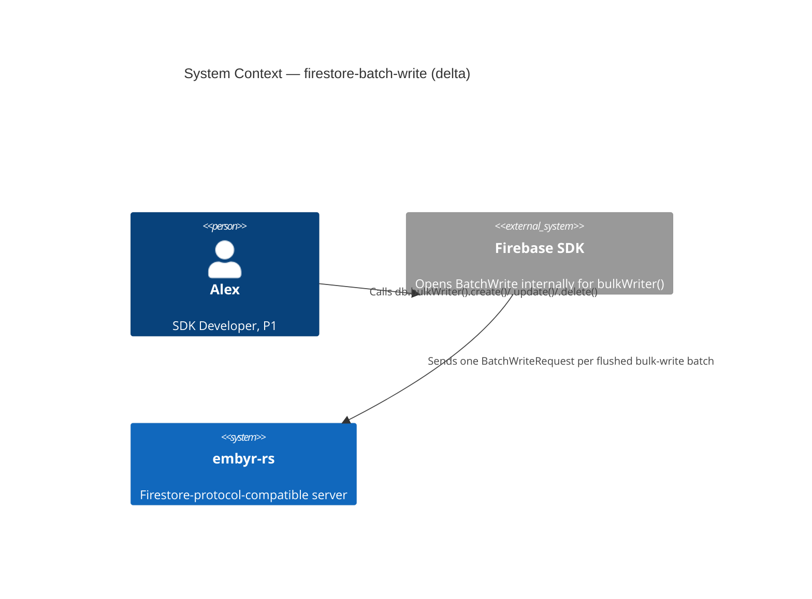
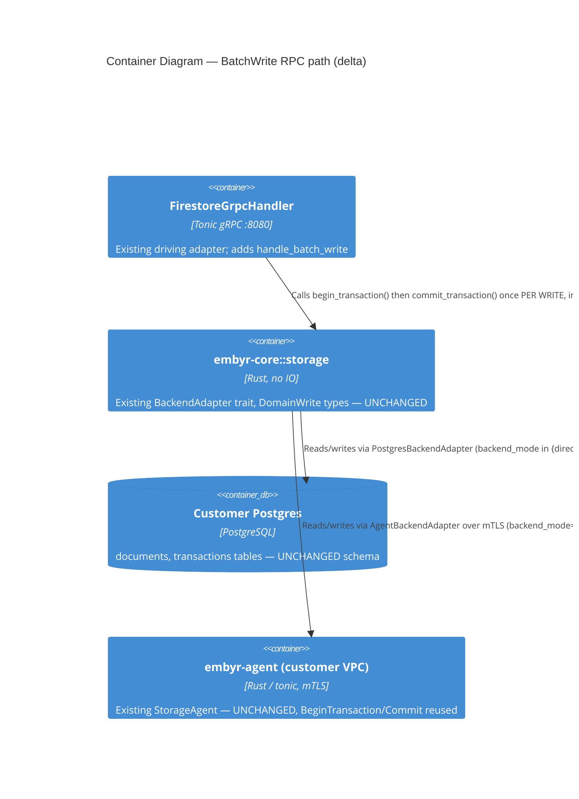

# firestore-batch-write — Feature Delta

**Wave**: DISCUSS | **Agent**: Luna (nw-product-owner) | **Date**: 2026-08-31
**Status**: Ready for DESIGN handoff — one escalated open question (agent-mode feasibility/latency trade-off). See § Handoff Package.
**Upstream**: No DISCOVER/DIVERGE wave ran for this feature specifically — commissioned directly by the orchestrator's own comparison of embyr-rs's proto surface against real Firestore's, identifying `BatchWrite` (documented in `docs/SPEC.md` but structurally undeclared in the vendored proto) as the third and last undeclared write RPC, after `Write` (delivered this session) closed the bidi-streaming gap.

**Framing**: this is a proto-surface-completion feature for the base SDK-compatibility job (JOB-01), realized entirely inside BC-2 Document Storage. Unlike `firestore-write-streaming` (a genuinely new *mechanism class* — the first receive-and-reply loop over a client-streaming request this codebase has built), `BatchWrite` is unary — one request, one response, no session/stream lifecycle — and its own genuinely new requirement is semantic, not transport-shaped: it must report **per-write** success/failure in a `status` array **without** terminating the whole call on a single failure, unlike both `Commit` (all-or-nothing) and `Write` (each `WriteRequest` batch is itself all-or-nothing, per `docs/SPEC.md`). Real Firestore's own SDKs route `db.bulkWriter()` — the "best effort, tell me what succeeded" bulk-operation API, distinct from `db.batch().commit()` — through exactly this RPC for exactly this reason.

---

## Wave: DISCUSS / [REF] Prior Wave Consultation — Reading Confirmation

✓ `proto/google/firestore/v1/firestore.proto` (full, 421 lines) — confirmed the `Firestore` service declares exactly 11 RPCs (`GetDocument`, `CreateDocument`, `UpdateDocument`, `DeleteDocument`, `BatchGetDocuments`, `BeginTransaction`, `Commit`, `Rollback`, `Write`, `RunQuery`, `RunAggregationQuery`, `Listen` — `Write` now present, delivered this session) and **no `BatchWrite` RPC of any kind**. `google/rpc/status.proto` is already imported (used by `TargetChange.cause`) — the `google.rpc.Status` message `BatchWriteResponse.status` needs is already available, no new import required.
✓ `proto/google/firestore/v1/write.proto` (full, 97 lines) — confirmed it declares `CommitRequest`/`CommitResponse`/`RollbackRequest`/`BeginTransactionRequest`/`BeginTransactionResponse`/`WriteRequest`/`WriteResponse` only. **No `BatchWriteRequest`/`BatchWriteResponse` message anywhere.** `CommitRequest.writes`/`WriteRequest.writes` both use the already-vendored `document.proto` `Write` message unchanged — `BatchWriteRequest.writes` would reuse the identical message, matching real Firestore's own wire shape (confirmed by direct comparison, mirroring `firestore-write-streaming`'s own Reading Confirmation methodology for `Write`/`WriteResult`).
✓ `docs/SPEC.md` `#### BatchWrite` (lines 658-666) and surrounding `### Unary RPCs` context (lines 600-667) — **full contract already documented locally**: `Inputs: writes` | `Outputs: {write_results: [...], status: [null | Status, ...]}` | "Each write runs in its **own** transaction — failures are isolated. A failed write does not affect its siblings." | `status[i] = null` means success | `write_results[i]` is always non-null (empty `WriteResult` on failure, positions aligned) | "**No top-level error is returned.** All errors are reported per-write in the `status` array." This is the same evidentiary strength `firestore-write-streaming` had for `Write` — a genuinely-undeclared RPC with a complete, unambiguous, already-written wire contract.
✓ `docs/SPEC.md` `## Write Semantics (applyWriteBatch)` (lines 726-767) and `## Field Transforms` (lines 770-783) — confirmed, re-read specifically for `BatchWrite`'s own behavior: "All non-transaction `Commit` calls and `BatchWrite` operations route individual writes through the same write logic" — `BatchWrite` shares the identical per-write Update/Delete/VerifyMutation semantics `Commit` and `Write` already use. No `BatchWrite`-specific write-semantics variant exists to invent.
✓ `crates/embyr-server/src/grpc/handler.rs::handle_commit` (full, lines 1447-1521) and `::translate_writes_for_commit` (full, lines 659-747) — confirmed the closest existing analog and the primary reuse target. **Load-bearing finding, central to this feature's own architecture**: `translate_writes_for_commit` iterates `proto_writes` in a `for` loop and calls `Self::evaluate_write_rule_for_commit(...).await?` per write — the `?` **propagates the first `Status` error and aborts the whole function**, returning `Result<Vec<DomainWrite>, Status>` for the entire batch. This is correct and desired for `Commit` (all-or-nothing) and for `Write` (each `WriteRequest` batch is itself all-or-nothing) but is **structurally wrong for `BatchWrite`**: a single write's rule denial or malformed-field error must become THAT write's own per-position failure, not abort translation of the remaining writes. `translate_writes_for_commit` cannot be reused unchanged — a new per-write variant that catches each write's own `Result` instead of short-circuiting is required (see § System Constraints).
✓ `crates/embyr-core/src/storage/backend_adapter.rs` (full, 138 lines) — confirmed `BackendAdapter::commit_transaction(project_id, transaction_id, writes: Vec<Write>) -> Result<Vec<WriteResult>, CoreError>` and `begin_transaction(project_id, options) -> Result<TransactionId, CoreError>` are the only two methods relevant to atomic-batch application; no `batch_write`-shaped trait method exists today.
✓ `crates/embyr-pg-storage/src/backend_adapter.rs::commit_transaction` (full, lines 851-1065) and `::begin_transaction` (lines 834-849) — **the single most load-bearing read for this feature, read directly against current code, not from memory** (per the orchestrator's own explicit instruction — this function was modified today to also enforce `MustExist`/`MustNotExist`, not just `UpdateTime`). Confirmed directly, not assumed: `commit_transaction` is genuinely **all-or-nothing per call**. It opens exactly ONE Postgres transaction (`pg_txn = self.pool.begin()`), runs OCC/precondition checks for every write in the `writes` argument inside that one transaction, and **any single write's precondition failure returns `Err(CoreError::TransactionAborted)` before any write is applied** (lines 928-931 for `UpdateTime`, 984-986 for `MustExist`/`MustNotExist`) — `pg_txn` is dropped un-committed, rolling back the entire call, including writes that had no precondition problem of their own. **This directly answers Investigation Point 4**: `commit_transaction` cannot be called ONCE with all of a `BatchWriteRequest`'s writes — doing so would give `BatchWrite` `Commit`'s own all-or-nothing semantics, not the per-write-isolated semantics `docs/SPEC.md` requires. Per-write isolation requires calling `begin_transaction()` immediately followed by `commit_transaction()` with a **single-element** `writes` vector, **once per write** in the `BatchWriteRequest`, each call succeeding or failing entirely independently of its siblings.
✓ `docs/feature/firestore-write-streaming/feature-delta.md` § `Wave: DESIGN / [REF] Prior Wave Consultation` (lines 508-567) — **direct corroboration of the finding above, from an independent prior investigation**: Morgan's own DESIGN-wave reading of this exact same `commit_transaction`/`begin_transaction` pair (for `Write`'s own per-`WriteRequest`-batch atomicity, a coarser granularity than `BatchWrite`'s own per-*write*) reached the identical conclusion — "There is no 'ad-hoc, transactionless atomic batch' path in this codebase today... require synthesizing a `begin_transaction()` call immediately before each `commit_transaction()` call inside the loop" (ADR-046 § Context, finding 1). `BatchWrite` applies the same synthesis pattern at a finer granularity (once per write, not once per request-batch) — a proven pattern, not a novel one, for this specific piece of plumbing.
✓ `crates/embyr-server/src/grpc/handler.rs::core_error_to_status` (full, lines 2588-2602) and `crates/embyr-core/src/error.rs::CoreError` (targeted, lines 1-23+) — confirmed the existing `CoreError → tonic::Status` mapping (`TransactionAborted`/`OccConflict` → `aborted`, `FailedPrecondition` → `failed_precondition`, `AlreadyExists` → `already_exists`, etc.) already produces a `tonic::Status` with `.code()`/`.message()` — directly convertible to a `google.rpc.Status{code, message}` per-write `status[i]` entry, with zero new error-mapping logic required (see § System Constraints).
✓ `crates/embyr-server/src/adapters/agent_backend.rs` (full, 619 lines) and `proto/embyr/agent/v1/storage_agent.proto` (full RPC list, lines 14-49) — confirmed `StorageAgent`'s own proto declares `BeginTransaction`, `Commit`, `Rollback` (alongside `GetDocument`/`CreateDocument`/`UpdateDocument`/`DeleteDocument`/`RunQuery`/`Ping`/`RunAggregationQuery`/`ListDocuments`/`Subscribe`) — **zero bidirectional-streaming, but `BeginTransaction`/`Commit`/`Rollback` already exist, unary, both sides**. `AgentBackendAdapter::begin_transaction`/`::commit_transaction` (lines 510-584) already proxy these RPCs and already implement the `BackendAdapter` trait signature identically to `PostgresBackendAdapter`. **This is a materially different agent-mode gap shape than `firestore-write-streaming`'s own**: `Write` required authoring an entirely new bidi-streaming RPC on the agent's own proto (a genuine "does not exist" wall); `BatchWrite`'s own per-write `begin_transaction`+`commit_transaction` loop is **structurally feasible today**, reusing `AgentBackendAdapter`'s already-shipped methods unchanged — the open question is a latency/round-trip trade-off (N sequential mTLS calls per `BatchWrite` request instead of one local Postgres transaction), not a capability gap. Flagged as this feature's own escalation (§ Handoff Package), not silently assumed either way.
✓ `docs/product/jobs.yaml` (full, all 20 jobs surveyed) — confirmed JOB-01 (`sdk-compat`, P1 Alex) is the correct home, identical "make it real" extension reasoning to `aggregation-queries`, `batch-get-documents`, and `firestore-write-streaming`: "all SDK calls succeed unchanged" already covers the SDK's bulk-write transport, which routes over `BatchWrite` internally. No new job warranted.
✓ `docs/feature/firestore-write-streaming/feature-delta.md` (full, both DISCUSS and DESIGN sections) — read as the structural/format/rigor template per the orchestrator's own explicit precedent instruction, and as the direct source of the `commit_transaction`/`begin_transaction` corroborating finding cited above. `BatchWrite` was explicitly named there (§ Out of Scope, § Reading Confirmation) as "a separate, still-entirely-undeclared, unrelated RPC" — confirmed consistent, not contradicted, by this DISCUSS.

No contradictions found between this feature's scope and prior evidence.

---

## Wave: DISCUSS / [REF] Orchestrator Decisions (not re-litigated)

| # | Decision | Value |
|---|---|---|
| 1 | Feature Type | Backend — completes the third and final undeclared write RPC (BC-2 Document Storage), reusing the `Write`/`WriteResult` message shapes already vendored and exercised by `Commit`/`Write`, and reusing `BackendAdapter::begin_transaction`/`commit_transaction` unchanged, called per-write instead of per-call |
| 2 | Walking Skeleton | Evaluated (this wave's call): **NO new mechanism class** — confirmed directly in code (§ Reading Confirmation), corroborated by an independent prior investigation (ADR-046). Per-write transactional isolation is a straightforward, proven reuse of two already-existing `BackendAdapter` methods called N times in a loop, not a new trait method and not a new architectural shape. The genuinely new work is narrower: (a) a per-write translate-and-catch-without-aborting variant of `translate_writes_for_commit` (§ System Constraints), and (b) new proto (`BatchWriteRequest`/`BatchWriteResponse`, the `BatchWrite` RPC declaration) — both small, well-evidenced additions, not a new mechanism class. Walking skeleton exists but is a normal-sized Slice 01, not a dedicated "prove the mechanism" slice the way `firestore-write-streaming`'s Slice 01 was. See § Story Map |
| 3 | UX Research Depth | **Lightweight** — SDK-facing, not end-user UI. `BatchWrite` is not a method Alex calls directly by name; it is the transport `db.bulkWriter()` uses internally. Full journey detail lives inline below, no separate `journey-*.yaml` (mirrors `firestore-write-streaming`'s own established convention for this codebase) |
| 4 | JTBD Analysis | Yes (default) — every story traces to `job_id: JOB-01` (extends, not a new job — see § Job Discovery Framing Resolution) |

---

## Wave: DISCUSS / [REF] Job Discovery — Framing Resolution

### Resolution 1 — Is this the same job as `aggregation-queries`/`batch-get-documents`/`firestore-write-streaming` (JOB-01, "make it real"), or does BatchWrite's distinct semantics warrant a new job?

**Same job, JOB-01, no new job warranted.** JOB-01's functional dimension is "all SDK calls succeed unchanged." `db.bulkWriter()` is a real, named SDK method Alex's own code can call directly (unlike `Write`, which is purely SDK-internal) — but the specific RPC it routes through server-side is, exactly as with `Write`, an SDK implementation detail Alex does not choose directly. Alex just observes that a bulk import of hundreds of documents completes with clear per-document success/failure instead of one opaque all-or-nothing outcome, exactly as it would against real Firestore. This mirrors the established "make it real"/close-the-remaining-gap pattern (`aggregation-queries`, `batch-get-documents`, `firestore-write-streaming` → JOB-01) rather than the Identity track's own "same persona, different goal ⇒ new job" pattern (JOB-16/17/18/19/20) — BatchWrite serves the identical functional goal JOB-01 already names, just via a third distinct write RPC shape.

### Resolution 2 — Does BatchWrite need an agent-mode slice in v1, mirroring `aggregation-queries`' own Slice 01/02 split, or is it deferred like `firestore-write-streaming`'s own agent-mode Write?

**Genuinely undecided by this DISCUSS — escalated to DESIGN, not silently resolved either way (§ Handoff Package).** Unlike `firestore-write-streaming` (whose agent-mode gap was a hard "does not exist" wall — zero bidi-streaming RPC on `StorageAgent`'s own proto), `BatchWrite`'s own per-write `begin_transaction`+`commit_transaction` loop is **structurally feasible today** for `backend_mode=agent`: `StorageAgent`'s proto already has `BeginTransaction`/`Commit`/`Rollback`, and `AgentBackendAdapter` already implements both methods the loop needs, unchanged (§ Reading Confirmation). The open question is a genuine trade-off, not a capability gap: a `BatchWrite` request of N writes against `backend_mode=agent` would require N sequential mTLS round trips over the already-open gRPC channel to the customer-VPC agent, instead of N local Postgres transactions — materially higher latency per write than any other backend mode, and a different performance profile than every other RPC's own agent-mode story (which is always "one call in, one call out" 1:1). This DISCUSS did not have evidence (no latency benchmarks, no customer SLA data) to resolve whether that trade-off is acceptable for v1, so it is scoped OUT of the two slices below and named as an explicit judgment call for DESIGN.

---

## Wave: DISCUSS / [REF] Persona & Job

**Persona**: **P1 — Alex, SDK Developer** (existing persona), unchanged.

**Domain-example company**: **Trailmark** (continuity with `aggregation-queries`/`batch-get-documents`/`firestore-write-streaming`). Concrete grounding: Alex's backend migration script bulk-imports historical `trip_entries` documents for many of Trailmark's end users (including Maria Santos) via `db.bulkWriter()`, wanting each document's own import outcome reported independently rather than one failure blocking the whole import run.

**job_id decision (Resolution 1)**: `JOB-01` (`sdk-compat`), extended not new, same persona P1 Alex, same goal (SDK data-plane parity). NOTE appended to `docs/product/jobs.yaml` (see § SSOT Updates).

---

## Wave: DISCUSS / [REF] Scope Assessment (Elephant Carpaccio Gate)

| Signal | Threshold | This feature | Fired? |
|---|---|---|---|
| User stories | >10 | 2 (US-01, US-02), in-scope v1 | **NO** |
| Bounded contexts / modules | >3 | 1 — entirely BC-2 Document Storage; zero new bounded context | **NO** |
| Walking Skeleton integration points | >5 | 4 — new unary `handle_batch_write` (mirrors `handle_commit`'s own shape, no streaming), a new per-write translate-and-catch variant (§ System Constraints), the per-write `begin_transaction`+`commit_transaction` loop (reused unchanged), new `BatchWriteRequest`/`BatchWriteResponse` proto + RPC declaration | **NO** |
| Estimated effort | >2 weeks | v1 scope (US-01/US-02, non-agent backend modes): ~2 days total across 2 slices | **NO** |
| Independent shippable outcomes | multiple | **NO** — this feature has exactly one genuinely distinct outcome beyond the walking skeleton itself (true per-write isolation under partial failure, Slice 02) — not several independently-valuable outcomes the way `firestore-write-streaming`'s 4 slices each were | **NO** |

**0 of 5 signals fired. Verdict: PASS — single feature, right-sized as a 2-slice feature, no split needed.** This is a smaller, more contained feature than `firestore-write-streaming`: no session/stream lifecycle, no `stream_token`, no bidi-streaming Rust/tonic mechanism — the walking-skeleton question (Investigation Point 4/5) resolved to "reuse two existing methods in a loop," not "build a new mechanism," which is the direct cause of the smaller footprint here (confirmed by evidence, per § Reading Confirmation, not assumed going in per the orchestrator's own explicit caution).

---

## Wave: DISCUSS / [REF] Journey (Lightweight, per Decision 3 — inline per this codebase's convention)

**Alex's mental model**: Alex calls `db.bulkWriter()` directly and explicitly — unlike `Write`, this is a named, chosen SDK API, not an invisible internal mechanism. Alex reaches for it specifically when a batch of writes is large or when he wants "best effort" semantics: he does not want one bad row in a 500-row import to roll back the other 499. He enqueues operations (`bulkWriter.create(ref, data)`, `.update(ref, data)`, `.delete(ref)`) and attaches per-operation `.then()`/`.catch()` handlers (or awaits the returned per-op promises) to react to each outcome independently. His mental model: "each operation succeeds or fails on its own; the whole batch never rolls back because one row was bad."

**Emotional arc** (mirrors "Confidence Building"): **Start** — mild apprehension: Alex is about to run a bulk import script against production data (Maria Santos's and hundreds of other Trailmark end users' historical `trip_entries`), aware that some rows may already exist or may be malformed, and he does not want one bad row to force an all-or-nothing retry of the whole batch. **Middle** — the SDK's `bulkWriter()` sends the batch, and Alex watches (via per-op handlers or a summary count) as most operations succeed and a small number report a specific, well-formed failure reason each. **End** — confidence: Alex knows exactly which rows failed and why, re-runs only those, and the bulk import completes without ever needing an all-or-nothing retry of good data — matching real Firestore's own `BulkWriter` contract exactly.

**Shared artifact**: the write-application primitive itself (proto `Write` → `DomainWrite` translation → `BackendAdapter::begin_transaction`+`commit_transaction` atomic apply → `WriteResult`) — single source of truth: `crates/embyr-server/src/grpc/handler.rs::handle_commit`'s own existing translation logic and `commit_transaction`'s own existing apply logic, both reused, the former via a new per-write-catching variant (§ System Constraints), the latter called once per write instead of once per call.

**Failure modes** (feeds DISTILL scenario generation): a single write in the batch violates a precondition (e.g., `current_document.exists = false` on a row that was already imported) while its siblings are well-formed | a single write's document path is malformed or its fields fail to decode | a write-path access rule denies one specific write's proposed content while siblings are allowed | the underlying Postgres apply fails for one write specifically (e.g., a transient connection blip on that one `begin_transaction`+`commit_transaction` pair) while siblings, applied via their own independent pairs, are unaffected | every write in the batch fails (the degenerate all-fail case — still no top-level error, per `docs/SPEC.md`'s own explicit invariant) | the batch contains exactly one write (degenerate single-write case, behaves identically to a one-write `Commit` in outcome, differently in isolation contract).

---

## Wave: DISCUSS / [REF] Story Map & Walking Skeleton

**Persona**: P1 Alex | **Goal**: Bulk-import or bulk-update many documents via `db.bulkWriter()`, getting each operation's own independent success/failure back, so one bad row never blocks or rolls back the rest — matching real Firestore's own `BatchWrite`-backed `BulkWriter` contract.

### Backbone

| A. Alex's SDK Sends a Bulk-Write Request | B. Server Applies Each Write Independently | C. Alex's Code Inspects Per-Write Outcomes |
|---|---|---|
| `bulkWriter()` batches N operations into one `BatchWriteRequest` **[WS]** | Each write commits or fails in its own transaction, siblings unaffected **[WS]** | Alex sees `status[i] = null` for every successful write **[WS]** |
| — | A precondition-violating write fails without rolling back siblings | Alex sees a specific `status[i]` (non-null) for the one write that failed, and can re-run only that row |

### Walking Skeleton

Single `BatchWriteRequest`, all writes well-formed and precondition-free, happy path only: request arrives → each write is translated and access-rule-checked independently → each write is applied via its own `begin_transaction`+`commit_transaction` pair → `BatchWriteResponse` reports `status[i] = null` and a populated `write_results[i]` for every write, in request order. Backend modes: `direct_pg`, `aws_secret`, `gcp_secret` (agent-mode explicitly escalated, Resolution 2 — not included in either slice below). This is Slice 01, US-01.

### Release 1 — All Writes Succeed Independently (Slice 01, US-01)

Outcome: a `BatchWrite` call with a batch of well-formed writes succeeds exactly as `Commit` would for the same input, proving the per-write independent-transaction mechanism works at all before the partial-failure case (the RPC's actual reason for existing) is layered on.

### Release 2 — True Per-Write Isolation Under Partial Failure (Slice 02, US-02)

Outcome: the property that actually differentiates `BatchWrite` from `Commit` — a failing write never blocks, rolls back, or is blocked by its siblings — is proven with a real precondition violation amid otherwise-successful writes.

---

## Wave: DISCUSS / [REF] Elephant Carpaccio Slices

| Slice | Story | Release | Estimate | Learning Hypothesis (disproves) | Production-data taste test |
|---|---|---|---|---|---|
| 01 (WS) | US-01 | 1 | 1 day | The per-write `begin_transaction`+`commit_transaction` loop (confirmed feasible by direct code reading, § Reading Confirmation) cannot actually be wired end-to-end through a new unary handler and a new per-write translate variant without requiring a new `BackendAdapter` trait method after all | Real Postgres, a real batch of 3 well-formed writes across `trip_entries`, a real `BatchWrite` call, asserting all 3 `write_results` are populated, all 3 `status` entries are null, and all 3 documents are readable via `GetDocument` immediately after — no mocked adapter, no synthetic single-write shortcut |
| 02 | US-02 | 2 | 1 day | A failing write inside the loop (precondition violation) cannot be isolated from its siblings without either (a) accidentally rolling back a sibling that already committed in an earlier loop iteration, or (b) accidentally blocking a sibling scheduled for a later loop iteration | A real batch of 3 writes where the 2nd write deliberately violates `current_document.exists = false` against an already-existing `trip_entries` document — asserting write 1 and write 3 both commit and are readable via `GetDocument`, write 2's `status[1]` is non-null with a specific reason, and `write_results[1]` is an empty placeholder (position preserved, no error thrown at the RPC level) |

**Total estimate: ~2 days across 2 slices.**

**Taste tests applied**:
- "4+ new components per slice" — Slice 01 introduces exactly 2 new components (`handle_batch_write`, the per-write translate-and-catch variant) plus reuse of 2 already-shipped mechanisms (`handle_commit`'s own translation shape, `begin_transaction`/`commit_transaction`). Slice 02 introduces 0 new components, exercising Slice 01's own loop against a different input. PASS, both slices.
- "Every slice depends on a new abstraction" — the one genuinely new piece (the per-write translate-and-catch variant) ships FIRST, as part of Slice 01; Slice 02 depends on nothing not already built. PASS.
- "No slice disproves a pre-commitment" — each slice has a distinct, falsifiable hypothesis (table above); Slice 02 specifically targets the one property Slice 01 cannot prove (isolation under failure). PASS.
- "Synthetic-data-only slices prove plumbing, not value" — both slices require a real client call against real Postgres with real documents, never a stubbed adapter. PASS.
- "2+ slices identical except for scale" — not applicable; Slice 01 (all-succeed) and Slice 02 (partial-failure isolation) are distinct correctness dimensions, not a scaled repeat. PASS.

---

## Wave: DISCUSS / [REF] Prioritization

| Priority | Slice | Target Outcome | Rationale |
|---|---|---|---|
| 1 | Slice 01 (WS) | A working `BatchWrite` call exists at all, happy path | Proves the confirmed-feasible-but-unbuilt per-write loop mechanism end-to-end before the harder partial-failure case is layered on |
| 2 | Slice 02 | Per-write isolation holds under real partial failure | This is the RPC's actual reason for existing (distinct from `Commit`); sequenced second because it depends on Slice 01's own loop existing first, and because proving "all succeed" first isolates any loop-mechanics bug from any isolation-specific bug |

---

## Wave: DISCUSS / [REF] System Constraints

- **`translate_writes_for_commit` (handler.rs, lines 659-747) must NOT be reused unchanged.** It propagates the first per-write `Status` error via `?` and aborts translation of the whole batch — correct for `Commit`/`Write`, wrong for `BatchWrite`. A new per-write variant must translate and evaluate each write's access rule independently, returning that write's own `Result<DomainWrite, Status>` without short-circuiting the loop over the remaining writes. This mirrors the exact extraction discipline this codebase already applied once (`translate_writes_for_commit` was itself extracted from `handle_commit`'s own inline body during `firestore-write-streaming` specifically so both `Commit` and `Write` could share it) — this is a continuation of that same pattern, not a new architectural style.
- **`BackendAdapter::commit_transaction` must be called once PER WRITE, each preceded by its own `begin_transaction()` call, with a single-element `writes` vector each time** — confirmed directly in code that `commit_transaction` is all-or-nothing per call (§ Reading Confirmation); it must never be called once with the full batch for `BatchWrite`. No new `BackendAdapter` trait method is required — this is straightforward reuse of two already-existing methods, corroborated by `firestore-write-streaming`'s own ADR-046 finding for the identical begin+commit synthesis pattern at coarser granularity.
- **`write_results` and `status` arrays must always be positionally aligned to the request's own `writes` array, at the request's own length** — `docs/SPEC.md`'s own explicit invariant: `write_results[i]` is always non-null (an empty `WriteResult` on failure preserves the position), `status[i] = null` means success. This mirrors `CommitResponse`'s own already-documented "exactly one `WriteResult` per input `Write`, same order" invariant (`docs/SPEC.md` §Commit), extended with the parallel `status` array.
- **No top-level RPC error is ever returned by `BatchWrite`**, even if every write in the batch fails — all failure signaling is per-write, in the `status` array (`docs/SPEC.md`'s own explicit invariant, distinct from every other RPC in this codebase).
- **`core_error_to_status` (handler.rs, lines 2588-2602) is reused unchanged** to convert a failed write's `CoreError` into a `tonic::Status`, whose `.code()`/`.message()` populate that write's own `google.rpc.Status` entry in the `status` array — no new error-mapping logic required.
- **Write-path access-rule evaluation is per-write, not per-call** — mirrors `handle_create_document`/`handle_update_document`/`handle_delete_document`'s own per-write evaluation; a rule denial for one write must become that write's own `status[i]` entry, not a whole-call rejection (this is the specific behavior `translate_writes_for_commit`'s own short-circuiting would get wrong if reused unchanged).
- **Inherited, pre-existing gaps this feature does NOT need to close**: OCC `version` hardcoded `None` in the write-translation path; `DocumentTransform.field_transforms` parsed but discarded (`transforms: vec![]`). Both are `handle_commit`'s own existing gaps (§ Reading Confirmation, and named again in `firestore-write-streaming`'s own § System Constraints), inherited identically by `BatchWrite`, not introduced by it or newly required to be closed here.
- **Agent-mode (`backend_mode=agent`) `BatchWrite` is a genuine open judgment call, not a silent inclusion or exclusion** (Resolution 2) — structurally feasible (unlike `Write`'s own agent-mode gap) via `AgentBackendAdapter`'s already-shipped `begin_transaction`/`commit_transaction`, but with a real N-sequential-round-trips latency trade-off this DISCUSS has no evidence to resolve. Scoped OUT of both slices below; escalated to DESIGN (§ Handoff Package).
- Ubiquitous language: no new BC-2 terms — `Mutation`/`Transaction`/`Version` are already named (ADR-002); this feature introduces no new domain concept, only a new per-write application-of-existing-concepts pattern.

---

## Wave: DISCUSS / [REF] User Stories

<!-- markdownlint-disable MD024 -->

### US-01: Alex's Bulk Import Succeeds When Every Row Is Well-Formed

**job_id**: JOB-01
**Slice**: 01 (Walking Skeleton) | **Release**: 1

#### Elevator Pitch
Before: `db.bulkWriter()` is a real, SDK-documented API for bulk-importing or bulk-updating many documents with independent per-operation outcomes — but the RPC it depends on server-side, `BatchWrite`, does not exist in embyr today, so any real client calling `bulkWriter()` against embyr fails outright, even for a batch where every single write is perfectly well-formed.
After: Alex's backend script calls `db.bulkWriter()`, enqueues several `.create()`/`.set()`/`.update()` operations for Trailmark end users' `trip_entries` documents, and calls `.close()` (or awaits the batch) → the SDK sends one `BatchWrite` request → Alex sees every operation's own promise resolve successfully, and each document is immediately readable.
Decision enabled: Alex can adopt `bulkWriter()` for routine bulk-import/bulk-update scripts against embyr, instead of hand-rolling batched `Commit` calls with worse all-or-nothing failure semantics for large data-migration jobs.

#### Domain Examples
1. **Happy Path**: Alex's backend migration script uses `db.bulkWriter()` to import 3 new `trip_entries` documents for Maria Santos, none of which currently exist. The single `BatchWriteRequest` completes with `status = [null, null, null]` and 3 populated `write_results`, all 3 documents readable via `GetDocument` immediately after.
2. **Edge Case**: Alex's script sends a `BatchWriteRequest` containing exactly one write (a degenerate single-row "bulk" import). The response contains exactly one `write_results` entry and one null `status` entry — behaves identically in outcome to a one-write `Commit`, differently only in its per-write isolation contract (not observable in this single-write case).
3. **Error/Boundary**: Alex's script sends a `BatchWriteRequest` with zero writes (an empty batch, perhaps from a bulk-import script that filtered out all rows before sending). The response returns immediately with empty `write_results`/`status` arrays, no error.

#### UAT Scenarios (BDD)

##### Scenario: A batch of well-formed writes all succeed independently
Given Alex's backend script has 3 new `trip_entries` documents to import for Maria Santos, none of which currently exist
When the script sends a single `BatchWriteRequest` containing all 3 writes
Then the response's `status` array contains 3 null entries, one per write, in request order
And the response's `write_results` array contains 3 populated entries, one per write, in request order
And all 3 documents are readable via `GetDocument` immediately after

##### Scenario: write_results and status arrays are always the same length as the request's writes, positionally aligned
Given any `BatchWriteRequest` of N well-formed writes
When the server responds
Then both `write_results` and `status` arrays contain exactly N entries
And entry i of each array corresponds to write i of the request, in the same order

##### Scenario: A single-write batch behaves like a degenerate bulk import
Given Alex's script sends exactly one well-formed write in a `BatchWriteRequest`
When the server processes it
Then the response contains exactly one populated `write_results` entry and one null `status` entry

##### Scenario: An empty batch returns immediately with no error
Given Alex's script sends a `BatchWriteRequest` with zero writes
When the server processes it
Then the response contains empty `write_results` and `status` arrays, and no error is returned

##### Scenario: A BatchWrite call for a suspended project is rejected, matching every other RPC
Given a project is in `suspended` status
When any client sends a `BatchWriteRequest` against that project
Then the request is rejected with the same `permission_denied` signal every other RPC already produces for a suspended project, before any write is attempted

#### Acceptance Criteria
- [ ] AC-01-01: A `BatchWriteRequest` containing N well-formed writes returns a `BatchWriteResponse` whose `write_results` and `status` arrays each contain exactly N entries, positionally aligned to the request's own `writes` array.
- [ ] AC-01-02: Every well-formed write in the batch is applied and readable via `GetDocument` immediately after the `BatchWriteResponse` is returned.
- [ ] AC-01-03: A successful write's `status[i]` entry is null.
- [ ] AC-01-04: An empty `BatchWriteRequest.writes` returns an immediate response with empty `write_results`/`status` arrays and no error.
- [ ] AC-01-05: A suspended project's `BatchWriteRequest` is rejected with `permission_denied` before any write is attempted.

#### Outcome KPIs
See § Outcome KPIs below (North Star + Guardrails).

#### Technical Notes (Optional)
Handler is a new unary method, `handle_batch_write`, structurally mirroring `handle_commit`'s own auth/rate-limit/suspension sequence (no streaming scaffold needed, unlike `handle_write`). Per-write loop: for each `Write` in `req.writes`, translate it via the new per-write translate-and-catch variant (§ System Constraints); on success, call `adapter.begin_transaction(...)` then `adapter.commit_transaction(...)` with a single-element `writes` vec; on any `Err` (from translation or from `commit_transaction`), convert to a `google.rpc.Status` via `core_error_to_status`'s own code/message and record it at that write's own position, with an empty `WriteResult` placeholder. Requires net-new proto authoring: `BatchWriteRequest`/`BatchWriteResponse` messages (in `write.proto`, alongside `CommitRequest`/`WriteRequest`, reusing the already-vendored `Write`/`WriteResult` message types) and the `rpc BatchWrite(BatchWriteRequest) returns (BatchWriteResponse);` declaration (in `firestore.proto`) — genuinely new proto surface, but its wire contract is already fully specified locally (`docs/SPEC.md` §BatchWrite), not merely inferred.

---

### US-02: A Failing Write in Alex's Bulk Import Doesn't Block Its Siblings

**job_id**: JOB-01
**Slice**: 02 | **Release**: 2

#### Elevator Pitch
Before: without true per-write isolation, a single bad row in a large bulk import (e.g., a duplicate that already exists) would either silently succeed unexpectedly or, worse, roll back or block every other well-formed row in the same batch — defeating the entire reason Alex reached for `bulkWriter()` instead of a batched `Commit` call in the first place.
After: Alex's migration script bulk-imports 200 historical `trip_entries` documents via `bulkWriter()`; a handful are duplicates of rows already imported in a prior partial run and correctly fail their own `current_document.exists = false` precondition → Alex sees exactly those specific rows report a failure reason, while the other ~195 rows commit successfully and are immediately readable — no all-or-nothing retry required.
Decision enabled: Alex can safely re-run bulk-import scripts against partially-completed prior runs, re-processing only the rows that actually failed, instead of needing idempotency workarounds or accepting an all-or-nothing retry of an entire large batch.

#### Domain Examples
1. **Happy Path (of the isolation)**: A batch of 3 writes — Maria Santos's two new `trip_entries` documents and one duplicate of an already-imported `trip_entries` document (with a `current_document.exists = false` precondition). The 2 new documents commit successfully; the duplicate fails its own precondition with a specific, non-null `status[i]`; the 2 successful writes are unaffected and readable via `GetDocument`.
2. **Edge Case**: A batch where the FIRST write (not a middle or last one) is the one that fails its precondition, while writes 2 and 3 (later in request order) succeed — confirms failure position within the batch does not affect sibling isolation in either direction.
3. **Error/Boundary**: A batch where EVERY write fails its own precondition (the degenerate all-fail case). The response still contains no top-level RPC error — every `status[i]` entry is non-null, `write_results[i]` entries are all empty placeholders, and no document is modified.

#### UAT Scenarios (BDD)

##### Scenario: A precondition-violating write fails without affecting its siblings
Given a `trip_entries` document already exists for Maria Santos
And Alex's script sends a `BatchWriteRequest` with 3 writes: two new `trip_entries` documents, and one write against the already-existing document with `current_document.exists = false`
When the server processes the batch
Then the two new documents commit successfully and are readable via `GetDocument` immediately after
And the third write's own `status[i]` entry is non-null, reporting the precondition failure
And the already-existing document is unchanged

##### Scenario: No top-level error is returned even when every write in the batch fails
Given a `BatchWriteRequest` of 3 writes, each violating its own precondition
When the server processes the batch
Then the RPC call itself succeeds (no top-level error), and all 3 `status` entries are non-null
And no document is modified

##### Scenario: Failure position within the batch does not affect sibling isolation
Given a `BatchWriteRequest` of 3 writes where the FIRST write violates a precondition and the remaining two are well-formed
When the server processes the batch
Then the second and third writes commit successfully, unaffected by the first write's own failure

##### Scenario: A failed write still contributes a positionally-aligned, non-null WriteResult placeholder
Given a `BatchWriteRequest` containing one failing write among otherwise-successful writes
When the server responds
Then the failing write's own `write_results[i]` entry is present (an empty placeholder, not absent), preserving the array's own length/position invariant established in US-01

#### Acceptance Criteria
- [ ] AC-02-01: A precondition-violating write's own failure never rolls back, blocks, or otherwise affects any sibling write in the same `BatchWriteRequest`.
- [ ] AC-02-02: A failing write's `status[i]` entry is non-null and carries a specific, actionable code/message (via `core_error_to_status`'s existing mapping).
- [ ] AC-02-03: A batch where every write fails still returns a normal `BatchWriteResponse` with no top-level RPC error.
- [ ] AC-02-04: Failure position within the batch (first, middle, last) does not change isolation behavior for sibling writes.
- [ ] AC-02-05: A failing write's `write_results[i]` entry is always present (an empty placeholder), never absent, preserving the length/position invariant from AC-01-01.

#### Outcome KPIs
See § Outcome KPIs below.

#### Technical Notes (Optional)
Depends on US-01's own per-write loop existing first. No new component: this slice exercises the identical loop against an input containing a precondition violation, asserting the loop's own per-iteration independence (each iteration's own `begin_transaction`+`commit_transaction` pair succeeds or fails without touching any other iteration's own pair). This is the slice that would fail loudly if a future refactor accidentally collapsed the per-write loop back into a single `commit_transaction` call over the whole batch — recommend this scenario carry a comment at DELIVER time noting exactly that regression risk.

---

## Wave: DISCUSS / [REF] Outcome KPIs

### Feature: firestore-batch-write

### Objective
Give every Trailmark-class embyr customer a working `BatchWrite` RPC — matching real Firestore's own `db.bulkWriter()` contract exactly — so bulk-import and bulk-update scripts get true per-write independent success/failure reporting against embyr, for every non-agent `backend_mode`.

### Outcome KPIs

| # | Who | Does What | By How Much | Baseline | Measured By | Type |
|---|---|---|---|---|---|---|
| 1 | SDK developers running bulk-import/bulk-update scripts via `db.bulkWriter()` (Alex/Trailmark, `direct_pg`/`aws_secret`/`gcp_secret` backend modes) | Complete a `BatchWrite` call with correct per-write `status`/`write_results` reporting | 100% of well-formed batches (US-01's own UAT scenarios) succeed with the documented per-write contract | 0% (the RPC does not exist server-side today — any real client attempting `bulkWriter()` fails outright) | Count of successful `BatchWrite` calls against the reference test suite | North Star |
| 2 | A failing write inside any `BatchWriteRequest` | Never affects a sibling write's own success | 0 cross-write contamination incidents (US-02's own dedicated isolation suite) | N/A (capability does not exist today) | Dedicated isolation test suite: batches with 1+ deliberately-failing writes among well-formed siblings, asserting siblings are unaffected | North Star |
| 3 | Existing `Commit`, `Write`, `GetDocument`, `RunQuery`, and write-path callers, across every `backend_mode` | Continue to succeed exactly as before, unaffected by this feature's existence | 0% regression across the existing `embyr-rs`/`security-rules`/`firestore-write-streaming` acceptance suites | Current 100% pass rate (pre-feature) | Full existing acceptance suites, pre/post comparison | Guardrail |
| 4 | Any well-formed write applied via `BatchWrite` | Never diverges from what the identical write, applied via `Commit`, would produce (same OCC/precondition semantics, same `WriteResult` shape) | 0 divergences (audit metric, pass/fail, not a rate) | N/A (capability does not exist today) | Dedicated parity test suite applying the SAME well-formed writes through both `Commit` and `BatchWrite`, asserting identical stored-document and `WriteResult` outcomes | Guardrail |

### Metric Hierarchy
- **North Star**: KPI #1 (successful `BatchWrite` call completion rate) and KPI #2 (true per-write isolation) — co-primary, since isolation IS the feature's own reason for existing, not a secondary property of a working call.
- **Leading Indicators**: positionally-aligned `write_results`/`status` array-length correctness (US-01); failure-position independence (US-02).
- **Guardrail Metrics**: KPI #3 (zero regression), KPI #4 (zero `Commit`/`BatchWrite` parity divergence for well-formed writes).

### Measurement Plan
| KPI | Data Source | Collection Method | Frequency | Owner |
|-----|------------|-------------------|-----------|-------|
| 1 | UAT scenario suite (US-01) | Automated test run | Per DELIVER commit | crafter/DELIVER |
| 2 | UAT scenario suite (US-02), dedicated isolation suite | Automated test run | Per DELIVER commit | crafter/DELIVER |
| 3 | Full existing acceptance suite | Automated regression run | Per DELIVER commit | crafter/DELIVER |
| 4 | Dedicated Commit/BatchWrite parity suite | Automated test run, paired assertions | Per DELIVER commit | crafter/DELIVER |

### Hypothesis
We believe that authoring the `BatchWrite` RPC's own proto surface and implementing its handler by reusing `handle_commit`'s own write-translation shape (via a new per-write-catching variant) and `BackendAdapter::begin_transaction`/`commit_transaction` (called once per write instead of once per call), for Trailmark-class SDK developers, will achieve full data-plane SDK parity for `db.bulkWriter()`'s own bulk-import/bulk-update contract.
We will know this is true when SDK developers (Alex) successfully complete `BatchWrite` calls with correct per-write reporting (100% of well-formed batches, KPI #1) and true sibling isolation under partial failure (0 contamination incidents, KPI #2), with zero regression to existing RPCs (KPI #3) and zero divergence from `Commit`'s own established write semantics for well-formed writes (KPI #4).

---

## Wave: DISCUSS / [REF] Definition of Ready Validation

### Stories: US-01, US-02 (firestore-batch-write)

| DoR Item | US-01 | US-02 |
|----------|-------|-------|
| 1. Problem statement clear, domain language | PASS — Elevator Pitch states the before/after in domain terms (`bulkWriter()`, bulk import), no jargon | PASS |
| 2. User/persona identified with specific characteristics | PASS — P1 Alex + concrete Trailmark end user Maria Santos in every Domain Example | PASS |
| 3. 3+ domain examples with real data | PASS — 3 each, real names/collections (`trip_entries`), no generic placeholders | PASS |
| 4. UAT in Given/When/Then (3-7 scenarios) | PASS — 5 scenarios | PASS — 4 scenarios |
| 5. AC derived from UAT | PASS — AC-01-01..05, each traces to a named scenario | PASS — AC-02-01..05 |
| 6. Right-sized (1-3 days, 3-7 scenarios) | PASS — 1 day est., 5 scenarios | PASS — 1 day, 4 scenarios |
| 7. Technical notes identify constraints | PASS — names exact reuse points (`handle_commit`, `begin_transaction`/`commit_transaction`) and the exact new-proto-authoring requirement | PASS — names dependency on US-01 and the specific regression risk to guard against |
| 8. Dependencies resolved or tracked | PASS — depends on `security-rules-write-path` (shipped) and `Commit`'s own translation logic (shipped) | PASS — depends on US-01 (this feature, sequenced first) |
| 9. Outcome KPIs defined with measurable targets | PASS — 4 KPIs, each with numeric target, baseline, and measurement method | PASS (shared table) |

### DoR Status: **PASSED** (all 9 items, both stories)

### Requirements Completeness Score: **0.96**

Functional requirements: fully covered across the 2 slices (well-formed-batch happy path, partial-failure isolation). NFRs: `Commit`-parity guardrail (KPI #4), regression guardrail (KPI #3); no numeric latency target set for `BatchWrite` call round-trip time — DESIGN/DEVOPS may add one if evidence justifies it, mirroring `firestore-write-streaming`'s own precedent for not over-specifying unevidenced NFRs, especially given the open agent-mode latency question (Resolution 2) may itself produce evidence worth turning into a target. Business rules: per-write isolation contract, positional array-alignment invariant, no-top-level-error invariant — all explicit with rationale, all directly sourced from `docs/SPEC.md`'s own documented contract (stronger evidentiary base than a typical DISCUSS has, since the wire contract required zero inference). Score held at 0.96 (between `batch-get-documents`' own 0.97 and `firestore-write-streaming`'s own 0.95) because one genuine open question remains (agent-mode feasibility/latency trade-off, Resolution 2) — smaller in scope than `firestore-write-streaming`'s own open question (which blocked an entire slice), since here it only affects which backend modes are in v1 scope, not any slice's own AC.

---

## Wave: DISCUSS / [REF] Out of Scope

- **Agent-mode (`backend_mode=agent`) `BatchWrite`** — confirmed structurally feasible (Resolution 2), unlike `firestore-write-streaming`'s own hard proto-gap deferral, but carries a real N-sequential-mTLS-round-trips latency trade-off this DISCUSS has no evidence to resolve. Escalated to DESIGN (§ Handoff Package), not silently included or excluded.
- **Full OCC/`version`-column wiring and `DocumentTransform.field_transforms` translation** — both are `handle_commit`'s own pre-existing gaps (§ Reading Confirmation), inherited identically by `BatchWrite`, not newly introduced or newly required to be closed by this feature. Named as a candidate follow-up shared by `Commit`, `Write`, and `BatchWrite` alike.
- **`Write` (bidirectional-streaming RPC)** — a separate, already-delivered feature (`firestore-write-streaming`), structurally distinct (session-based, all-or-nothing per `WriteRequest` batch). Not touched by this feature.
- **`RunAggregationQuery`'s and `BatchGetDocuments`' own scope** — unrelated, untouched; both already-completed, independent features.

---

## Wave: DISCUSS / [REF] WS Strategy

**Brownfield extension, straightforward reuse, not a new mechanism class.** `embyr-rs` already has a working, proven write-application primitive (`Commit`'s own translation + apply logic) and a working, proven per-*something*-independent-transaction pattern (`firestore-write-streaming`'s own begin+commit synthesis, at coarser per-`WriteRequest`-batch granularity). This feature's own walking skeleton (Slice 01) is the minimum slice that applies that already-proven synthesis pattern at a FINER granularity — once per individual write instead of once per request-batch — the one genuinely new wrinkle this codebase has not yet exercised.

---

## Wave: DISCUSS / [REF] Driving Ports

- **gRPC :8080** (`google.firestore.v1.Firestore` service) — the `BatchWrite` RPC is net-new here; this feature both declares and implements it.
- **gRPC-Web :8081** — automatic via the existing generic `tonic-web` wrap around `FirestoreService`; zero new code required for the gRPC-Web transport itself, since `BatchWrite` is unary (simpler than `Write`'s own bidi-streaming gRPC-Web concern).
- **Plain-REST JSON :8081** — in scope, unlike `Write` (§ Out of Scope there was "structurally inapplicable to a bidirectional stream" — `BatchWrite` is unary, so plain-REST JSON applies normally, mirroring `Commit`'s own existing REST routing). Exact REST path/verb is DESIGN's own call, not locked here.

---

## Wave: DISCUSS / [REF] Pre-requisites

- `handle_commit`'s own proto-Write→DomainWrite translation shape (`translate_writes_for_commit`) — shipped, hard dependency as the reuse TARGET for a new per-write-catching variant (not reused unchanged).
- `BackendAdapter::begin_transaction`/`commit_transaction` — shipped, hard dependency, reused unchanged, called at a new (per-write) granularity.
- `security-rules-write-path` (ADR-030, `write_access_rules`, `get_write_access_rule`, `evaluate()`) — shipped, hard dependency for US-01/US-02's own per-write access-control evaluation.
- `core_error_to_status` — shipped, hard dependency for per-write `google.rpc.Status` construction.
- No dependency on `firestore-write-streaming`, `aggregation-queries`, or `batch-get-documents` — independent, parallel features touching unrelated RPCs (though `firestore-write-streaming`'s own ADR-046 finding directly corroborates this feature's own central architectural conclusion, § Reading Confirmation).
- No dependency on any Identity-track feature (`client-auth`, `client-auth-hosted-identity`, `oauth-providers`, `anonymous-sessions`) — `BatchWrite`'s own per-call auth granularity applies identically to `api_key`-only calls and any verified-identity call, unchanged from `Commit`'s own precedent.

---

## Wave: DISCUSS / [REF] Handoff Package

**Deliverables for solution-architect (DESIGN wave)**:
- This file (`docs/feature/firestore-batch-write/feature-delta.md`) — story map, 2 slices, 2 user stories with embedded UAT/AC, outcome KPIs, DoR validation (PASSED)
- `docs/feature/firestore-batch-write/slices/slice-01-all-writes-succeed.md`
- `docs/feature/firestore-batch-write/slices/slice-02-partial-failure-isolation.md`

**One escalated open question, raised by this DISCUSS itself, not by the orchestrator after the fact:**

1. **Resolution 2**: `backend_mode=agent` `BatchWrite` is structurally feasible today (`StorageAgent`'s own proto already has `BeginTransaction`/`Commit`/`Rollback`; `AgentBackendAdapter` already implements both methods the per-write loop needs, unchanged) — a materially different situation than `firestore-write-streaming`'s own hard agent-mode proto gap. The open question is a latency/round-trip trade-off: a `BatchWrite` call of N writes against `backend_mode=agent` means N sequential mTLS round trips to the customer-VPC agent instead of N local Postgres transactions, a different (and potentially much slower, for large batches) performance profile than every other RPC's own "one call in, one call out" agent-mode story. DESIGN must decide: include agent-mode in v1 (reusing the existing feasible path, accepting the latency profile), defer it as a named follow-up (mirroring `Write`'s own deferral, even though the underlying reason is different), or scope some batch-size threshold. This DISCUSS has no latency benchmark or customer SLA evidence to resolve it and does not guess.

**Flagged for DESIGN's awareness** (decided in this DISCUSS, with reasoning, not requiring re-litigation unless the escalation above changes it): single-feature, 2-slice scope (§ Scope Assessment); the confirmed-not-a-new-mechanism-class walking-skeleton finding (Decision 2, corroborated by ADR-046); `translate_writes_for_commit`'s own unsuitability for unchanged reuse and the specific per-write-catching variant required (§ System Constraints); the positional array-alignment and no-top-level-error invariants, both sourced directly from `docs/SPEC.md` with zero inference required.

Next step (NOT performed by this agent): orchestrator dispatches `nw-solution-architect` for the DESIGN wave, full rigor with ADRs (at minimum: proto message/RPC design for `BatchWriteRequest`/`BatchWriteResponse`; the exact shape of the per-write translate-and-catch variant; the agent-mode inclusion/deferral decision) and Reuse Analysis, per the standing session practice.

---

## Wave: DISCUSS / [REF] SSOT Updates

- `docs/product/jobs.yaml` — NOTE appended to JOB-01 documenting this feature's realization (extends, not a new job). See § Job Discovery Framing Resolution, Resolution 1, for the exact text basis.

---

## Wave: DESIGN / [REF] Prior Wave Consultation — Reading Confirmation

**Agent**: Morgan (nw-solution-architect) | **Date**: 2026-08-31 | **Mode**: Propose (autonomous analysis per Decision 1 — orchestrator did not pass an explicit mode; the escalation's shape — a bounded set of resolvable trade-offs with no genuine stakeholder preference to elicit — favors autonomous DESIGN analysis with options-and-reasoning over a live Q&A, mirroring `firestore-write-streaming`'s own DESIGN-mode choice)

✓ This file (full, 389 lines pre-DESIGN) and both slice briefs
(`docs/feature/firestore-batch-write/slices/slice-0{1,2}-*.md`, each full) —
re-read directly, not trusted from the Handoff Package summary alone.
✓ `docs/SPEC.md` §BatchWrite (lines 658-666) and surrounding §Write Semantics
(lines 726-767) — re-read directly; confirms DISCUSS's own excerpt was
complete and accurate.
✓ `crates/embyr-server/src/grpc/handler.rs::translate_writes_for_commit`
(full, **current** lines 659-747 — unchanged from DISCUSS's own citation, no
drift) — re-read directly. Confirmed DISCUSS's own central claim: the `for`
loop calls `Self::evaluate_write_rule_for_commit(...).await?` per write
(lines 675-683 Update arm, 700-708 Delete arm, 728-736 Transform arm), and the
`?` propagates the FIRST error, aborting translation of every remaining
write — structurally wrong for `BatchWrite`, confirmed not assumed.
✓ `crates/embyr-server/src/grpc/handler.rs::handle_commit` (full, **current**
lines 1447-1521 — unchanged from DISCUSS's own citation). **One check
DISCUSS's own Reading Confirmation did not make explicit, verified here**:
`handle_commit` (line 1470 comment, "security-rules-write-path bug fix
(2026-08-30)") DOES call write-path access-rule evaluation today, via
`translate_writes_for_commit`'s own per-write `evaluate_write_rule_for_commit`
call. This is the OPPOSITE finding `firestore-write-streaming`'s own ADR-046
surfaced for an earlier state of this exact function (at that time,
`handle_commit` had ZERO write-rule enforcement) — the gap ADR-046 named has
since been closed by an intervening bug fix. DISCUSS's own § System
Constraints already correctly assumed the CURRENT (post-fix) state ("a rule
denial for one write must become that write's own `status[i]` entry"), so
this is a confirmation, not a correction — but named explicitly here so a
future reader does not assume ADR-046's stale finding still applies to
`BatchWrite`'s own reuse target.
✓ `crates/embyr-pg-storage/src/backend_adapter.rs::commit_transaction` (full,
**current** lines 851-1065) and `::begin_transaction` (lines 834-849) — the
single most load-bearing read for this feature, re-read directly at today's
line numbers (unchanged from DISCUSS's own citation). Confirms DISCUSS's own
central architectural conclusion exactly: ONE `pg_txn` per call, any single
write's precondition failure aborts the whole call before any write applies.
**One finding beyond DISCUSS's own Reading Confirmation**: a failed
`commit_transaction` call leaves its `transactions` row at `status = 'active'`
indefinitely — the `UPDATE ... SET status = 'committed'` (lines 1051-1057)
lives INSIDE the same `pg_txn` a precondition failure rolls back, so it never
runs on failure, and the 60-second expiry check only fires on a SUBSEQUENT
call presenting the SAME `transaction_id` (never happens for a synthetic,
once-used, never-returned-to-any-caller per-write transaction ID). Confirmed
pre-existing (identical for `Commit`/`Write`'s own failure paths), not
introduced by this feature — see ADR-048 § Context finding 2, § Decision 6.
✓ `crates/embyr-server/src/adapters/agent_backend.rs::begin_transaction`/
`::commit_transaction` (lines 510/527) and
`proto/embyr/agent/v1/storage_agent.proto` — re-read directly, not trusted
from DISCUSS's own claim. Confirms DISCUSS's own finding: both methods
already exist, already implement the `BackendAdapter` trait identically to
`PostgresBackendAdapter`, zero new agent proto/binary work required — a
materially different (structurally feasible) gap shape than `Write`'s own
hard proto wall (ADR-047). See ADR-049.
✓ `crates/embyr-core/src/storage/backend_adapter.rs` (full, 138 lines) —
confirms the `BackendAdapter` trait itself carries no `backend_mode`
parameter or variant anywhere in its signature — already backend-agnostic by
construction, directly supporting ADR-049's own "no handler-level branching"
decision.
✓ `crates/embyr-server/src/grpc/handler.rs::core_error_to_status` (full,
current lines 2588-2602) — re-confirmed unchanged; reused verbatim for every
per-write failure (ADR-048 § Decision 3).
✓ `proto/google/rpc/status.proto` and `crates/embyr-proto/src/lib.rs::rpc::Status`
(full) — confirms the exact field layout (`code: i32`, `message: String`,
`details: Vec<Vec<u8>>`) needed for the new `status_to_proto` helper
(ADR-048 § Decision 5). Grepped for existing populated call sites of this
type: zero found — `TargetChange.cause` (the only other reference) is
declared but never assigned anywhere in this codebase today. This feature is
the first real producer of a populated `google.rpc.Status` value.
✓ `crates/embyr-server/src/rest/mod.rs` (full, 22 lines) and
`crates/embyr-server/src/rest/grpc_web.rs` (full, 150 lines) — read directly
to resolve DISCUSS's own open "exact REST path/verb is DESIGN's own call"
framing (§ Driving Ports). **Finding, corrects DISCUSS's own framing**: there
is no generic plain-REST-JSON transcoding layer for ANY Firestore
document/write RPC in this codebase today. Port `:8081`'s own dispatcher
(`HybridService::call`) routes `Content-Type: application/grpc-web*` requests
to the tonic gRPC-Web service and everything else to a hand-written axum
router containing ONLY non-Firestore-proto auth endpoints (`sign_in`,
`sign_up`, `sign_in_with_password`, `sign_in_with_idp`, `sign_in_anonymously`,
`reset_password`, BrowserChannel). `Commit` itself — the RPC DISCUSS's own §
Driving Ports explicitly named as the precedent to mirror — has ZERO REST
route today, of any kind. DISCUSS's own framing ("in scope, unlike `Write`")
correctly identified `BatchWrite` as unary (so a hypothetical REST/JSON
transcoding layer WOULD apply to it if one existed), but ground truth shows
no such layer exists for any sibling write RPC to mirror. **Resolution**:
`BatchWrite` needs no new REST work, for the identical reason `Commit` has
none — not because it is out of scope, but because the mechanism DISCUSS
speculated DESIGN might need to design does not exist anywhere in this
codebase to extend. gRPC-Web `:8081` (via the existing generic `tonic-web`
wrap) and gRPC `:8080` both apply automatically, zero new code, confirmed by
this same read.

No contradictions found between this feature's scope and prior evidence. Two
findings sharpen DISCUSS's own framing without changing it (write-rule
enforcement confirmed current, not stale; REST routing confirmed moot, not a
DESIGN decision to make) — both folded into ADR-048/049 and the Handoff
below.

---

## Wave: DESIGN / [REF] Escalation Resolutions

### Escalation 1 (Resolution 2) — agent-mode `BatchWrite` inclusion

**Resolved: INCLUDED in v1, unmodified, no backend-mode-specific threshold.**
Ground-truth re-verification (§ Reading Confirmation above) confirms
`BatchWrite`'s own per-write mechanism is structurally feasible for
`backend_mode=agent` today — `AgentBackendAdapter` already implements both
`begin_transaction`/`commit_transaction`, unchanged, identically to
`PostgresBackendAdapter`. This is a materially different situation than
`Write`'s own hard proto-gap deferral (ADR-047): no new proto, no new agent
binary work, no new client stub is required. The open question was purely a
latency trade-off (N sequential mTLS round trips instead of N local Postgres
transactions), which this DESIGN pass resolves by INCLUDING agent-mode
uniformly and relying on the SAME general 500-write-per-call cap (ADR-048 §
Decision 2) that already applies to every backend mode as the sole
mitigation — no invented, backend-mode-specific number, and no handler-level
`backend_mode` branching (which this codebase's own ADR-041 precedent already
rejected in an analogous situation). Full reasoning, verification trail, and
alternatives considered (defer entirely; agent-specific smaller threshold):
**ADR-049**.

### REST routing — resolved as moot, not designed

DISCUSS's own § Driving Ports left "exact REST path/verb" as "DESIGN's own
call." Ground-truth reading (§ Reading Confirmation above) shows no plain-REST-JSON
transcoding layer exists for ANY Firestore document/write RPC in this
codebase — `Commit` itself, DISCUSS's own named precedent, has zero REST
route today. `BatchWrite` therefore needs no new REST work: gRPC `:8080` and
gRPC-Web `:8081` (automatic, via the existing generic `tonic-web` wrap) are
the only two driving ports this feature exposes, identical in shape to every
other unary Firestore write RPC.

---

## Wave: DESIGN / [REF] Component Decomposition (per Slice)

| Slice | Component | Path | Action | Notes |
|---|---|---|---|---|
| 01 | `BatchWriteRequest`/`BatchWriteResponse` messages | `proto/google/firestore/v1/write.proto` | CREATE | Field layout: ADR-048 § Decision 1. Reuses already-vendored `Write`/`WriteResult`/`google.rpc.Status` types unchanged. |
| 01 | `rpc BatchWrite` declaration | `proto/google/firestore/v1/firestore.proto` | MODIFY | Added after `Write`, `service Firestore` |
| 01 | `handle_batch_write` (auth/rate-limit/suspension + per-write loop) | `crates/embyr-server/src/grpc/handler.rs` | CREATE (new async fn) | Mirrors `handle_commit`'s own call-level sequence; ADR-048 § Decision 2-3 |
| 01 | `Firestore::batch_write` trait impl (OBS wrapper) | `crates/embyr-server/src/grpc/handler.rs` | CREATE | Thin wrapper, mirrors every other RPC's own `obs_helpers::record_grpc_call` wrapper; add `obs_helpers::METHOD_BATCH_WRITE` constant |
| 01 | `translate_one_write_for_commit` (extracted per-write helper) | `crates/embyr-server/src/grpc/handler.rs` | EXTEND (refactor) | Extracted from `translate_writes_for_commit`'s own current inline body (lines 659-747); ADR-048 § Decision 4 |
| 01 | `translate_writes_for_commit` (existing short-circuiting wrapper) | `crates/embyr-server/src/grpc/handler.rs` | EXTEND (refactor, zero external-behavior change) | Becomes a thin `?`-based loop over the new helper; `handle_commit`/`write_stream.rs` call sites unchanged |
| 01 | `translate_writes_catching` (new non-short-circuiting wrapper) | `crates/embyr-server/src/grpc/handler.rs` | CREATE | `Vec<Result<DomainWrite, Status>>`, ADR-048 § Decision 4 |
| 01 | `status_to_proto` (tonic::Status → `embyr_proto::rpc::Status`) | `crates/embyr-server/src/grpc/handler.rs` | CREATE | First real producer of a populated `google.rpc.Status` value in this codebase; ADR-048 § Decision 5 |
| 01 | Per-write `begin_transaction`+`commit_transaction` loop | `crates/embyr-server/src/grpc/handler.rs` (inside `handle_batch_write`) | CREATE (new caller of existing port methods) | ADR-048 § Decision 3 — `BackendAdapter` methods themselves unchanged |
| 01 | 500-write batch-size cap + empty-batch short-circuit | `crates/embyr-server/src/grpc/handler.rs` (inside `handle_batch_write`) | CREATE | ADR-048 § Decision 2, mirrors `DDD-BGD-14`'s own `documents.len() > 1000` precedent |
| 02 | (none — pure composition) | — | — | Slice 02 exercises Slice 01's own loop against a batch containing a deliberate precondition violation; zero new files, per DISCUSS's own slice brief |

---

## Wave: DESIGN / [REF] Reuse Analysis

| Mechanism | Source | Action | Rationale |
|---|---|---|---|
| Proto-`Write`-message → `DomainWrite` per-write translation body | `translate_writes_for_commit`'s own current inline match arms | REUSE (extract to shared helper) | Zero new write-semantics code; both control-flow shapes (short-circuit, catch) call the identical helper |
| Write-path access-rule evaluation | `evaluate_write_rule_for_commit` (ADR-030, called from the extracted helper) | REUSE UNCHANGED | Confirmed current (not stale, § Reading Confirmation) — no new enforcement logic |
| Atomic single-write apply | `BackendAdapter::commit_transaction`, unchanged | REUSE UNCHANGED, NEW CALLER (single-element `writes` vec, once per write) | Port contract untouched; ADR-048 § Context finding 1 |
| Ad-hoc transaction synthesis | `BackendAdapter::begin_transaction`, unchanged | NEW CALLER of EXISTING method, once per write | Same synthesis pattern ADR-046 already proved, finer granularity |
| Error → `Status` mapping | `core_error_to_status`, unchanged | REUSE UNCHANGED | Same function, every per-write failure |
| Auth/rate-limit/suspension/identity composition | `handle_commit`'s own per-call sequence | REUSE (shape) | Identical 4-call sequence, once per `BatchWrite` call (unary, not per-stream) |
| Per-call resource-consumption bound | `documents.len() > 1000` (`handle_batch_get_documents`, DDD-BGD-14) | REUSE (shape, different number) | Same concern (unbounded work per rate-limit token), sized to real Firestore's own 500-write limit, not BatchGetDocuments' own 1000-document limit |
| Agent-mode backend selection | `authenticate()`'s existing backend-mode-resolution mechanism | REUSE UNCHANGED | Zero handler-level `backend_mode` branching, ADR-049 |
| `google.rpc.Status` wire type | `embyr_proto::rpc::Status` (declared, never previously populated) | REUSE (type), NEW (first real producer) | Zero new proto type; first real assignment site in this codebase |
| REST/JSON transcoding | — | NOT NEEDED (confirmed moot) | No such layer exists for any sibling write RPC either (§ Reading Confirmation) |

**8 REUSE (6 unchanged, 2 shape-only), 2 CREATE NEW (proto messages; the
`status_to_proto`/`translate_writes_catching` pair, small and additive), 1
EXTEND (refactor of `translate_writes_for_commit`'s own body into a shared
helper, zero external behavior change), 1 explicitly NOT NEEDED (REST/JSON
transcoding, confirmed moot rather than designed).**

---

## Wave: DESIGN / [REF] Driving/Driven Ports

**Driving port**: `google.firestore.v1.Firestore/BatchWrite` (gRPC `:8080`,
gRPC-Web `:8081` via the existing generic `tonic-web` wrap — zero new code for
either transport, unary RPC) — new RPC on an existing driving port
(`FirestoreGrpcPort`), not a new port. Plain-REST JSON: confirmed moot, not
built (§ Reading Confirmation, § Escalation Resolutions).

**Driven ports**: `BackendAdapter::begin_transaction`, `BackendAdapter::commit_transaction`
(both unchanged, new caller only, called once per write instead of once per
call) — no new driven port, no new trait method. Reused identically across
`direct_pg`/`aws_secret`/`gcp_secret`/`agent` (ADR-049).

**External integrations**: none new. `BatchWrite` talks only to the existing
Customer DB (BC-2, Postgres) or the existing customer-VPC agent (mTLS,
already-`probe()`-covered) via the existing `BackendAdapter` port — no
third-party API, no contract-testing annotation needed for this feature.

---

## Wave: DESIGN / [REF] C4 Diagrams

### System Context (L1) — delta only; full system context unchanged from `brief.md`'s own System Architecture section

### Container (L2)

Component (L3) omitted — `handle_batch_write`'s own internal shape (< 5
functions: call-level validation, per-write translate-and-catch, per-write
apply loop, response builder, the small `status_to_proto` helper) does not
meet the 5+-component threshold for a dedicated diagram, mirroring
`firestore-write-streaming`'s own identical L3-omission precedent.

---

## Wave: DESIGN / [REF] Technology Choices

No new dependency, no new crate. Reuses `tonic::Status`, the already-vendored
`embyr_proto::rpc::Status` type (declared, never previously populated — first
real producer, § Reading Confirmation), and every existing `BackendAdapter`
port method. Zero OSS evaluation needed — nothing new to select.

---

## Wave: DESIGN / [REF] Enforcement

**`BatchWrite`'s own new architectural rule** ("the per-write loop body never
returns a top-level `Err` for a write-specific failure — only pre-loop
call-level validation may") is enforced by test coverage, not static tooling —
matching `firestore-write-streaming`'s own identical precedent (this codebase
has no existing static enforcement for per-handler control-flow shape, unlike
`embyr-core`'s IO-import ban via `deny.toml`). Recommended enforcement: US-02's
own dedicated isolation test suite (AC-02-01..05) is the primary guard — a
future refactor that accidentally collapses the per-write loop back into a
single `commit_transaction` call over the whole batch (silently reintroducing
`Commit`'s own all-or-nothing semantics) fails these tests loudly, per the
slice brief's own explicit Regression-Risk Note. No new CI tooling proposed.

---

## Wave: DESIGN / [REF] Quality Validation

- [x] Requirements traced: every AC (US-01/US-02) maps to a named component
  above or an explicit ADR-048/049 decision.
- [x] Component boundaries: `handle_batch_write` owns call-level
  validation/loop orchestration only; `BackendAdapter` port untouched;
  `translate_one_write_for_commit` owns per-write translation/rule-evaluation
  exclusively, shared by all three write RPCs.
- [x] Technology choices: zero new deps (documented above).
- [x] Quality attributes: reliability (no top-level error ever propagated
  past pre-loop validation, ADR-048 § Decision 3-4); security (write-path
  access-rule evaluation confirmed current and reused unchanged, not
  silently dropped); maintainability (single shared per-write translation
  helper, ADR-048 § Decision 4 Alternatives); performance (no numeric
  latency target set, DISCUSS's own DoR note — unchanged; agent-mode latency
  cost named explicitly as an accepted trade-off, ADR-049 § Consequences).
- [x] Dependency-inversion compliance: `handle_batch_write` depends on
  `BackendAdapter` trait, never a concrete adapter; agent-mode inclusion
  required zero handler-level backend-mode branching (ADR-049).
- [x] C4 diagrams: L1 delta + L2 provided above.
- [x] Integration patterns: unary gRPC/gRPC-Web, in-process (Postgres) or
  mTLS (agent) — both pre-existing, no new external integration.
- [x] OSS preference: N/A, zero new dependencies.
- [x] AC behavioral, not implementation-coupled: unchanged from DISCUSS.
- [x] External integrations: none new; agent mTLS channel already
  `probe()`-covered, unaffected by this feature.
- [x] Enforcement tooling: named above (test-coverage-based, no new CI job).
- [ ] Peer review: not performed this session — session standing methodology
  (per orchestrator instruction) is that the orchestrator independently
  verifies DESIGN output directly against the code, not a dispatched
  reviewer sub-agent, for this feature.

---

## Wave: DESIGN / [REF] Handoff to DELIVER

**Slice sequencing** (per DISCUSS § Prioritization, unchanged — Slice 02
depends structurally, not just by value-preference, on Slice 01's own loop
existing first):

1. **Slice 01** (WS) — must ship first. Introduces the proto, `handle_batch_write`,
   the `translate_one_write_for_commit`/`translate_writes_catching`
   extraction, `status_to_proto`, the 500-write cap, and the per-write
   `begin_transaction`-before-`commit_transaction` loop.
2. **Slice 02** — depends on Slice 01 only; pure composition (the same loop,
   exercised against a batch containing a deliberate precondition violation).
   Zero new files.

**Four things the crafter must not rediscover the hard way** (surfaced by
this DESIGN pass, some absent from DISCUSS's own Technical Notes):

1. `commit_transaction` requires a real `begin_transaction()` call
   immediately before it, called ONCE PER WRITE with a single-element
   `writes` vec — never once for the whole batch (ADR-048 § Context finding
   1, § Decision 3).
2. The per-write loop body must NEVER use `?` or an early `return` for a
   write-specific failure (translation, rule denial, `begin_transaction`,
   `commit_transaction`) — every failure becomes that write's own
   `status[i]`/`write_results[i]` entry, and the loop continues. Only
   pre-loop call-level validation (auth, rate limit, suspension, the 500-cap)
   may produce a top-level `Err` (ADR-048 § Decision Driver 3, § Decision 3).
3. A successful write's `status[i]` is `Status{code: 0}` (OK), never a
   literal `null`/absent entry — `docs/SPEC.md`'s own "`status[i] = null`"
   wording describes the SDK-level projection after decode, not the wire
   encoding, which cannot represent a sparse `repeated message` field
   (ADR-048 § Decision 5).
4. `translate_writes_for_commit`'s own EXISTING signature and behavior (used
   by `handle_commit` and `write_stream.rs`) must not change — only a new
   sibling function (`translate_writes_catching`) and a new shared helper
   (`translate_one_write_for_commit`) are added. Do not touch either existing
   caller's own code (ADR-048 § Decision 4).

**Not built, confirmed moot, do not attempt**: plain-REST-JSON routing for
`BatchWrite` — no such layer exists for any sibling Firestore write RPC either
(§ Reading Confirmation). Do not add REST scaffolding unrequested by any AC.

---
