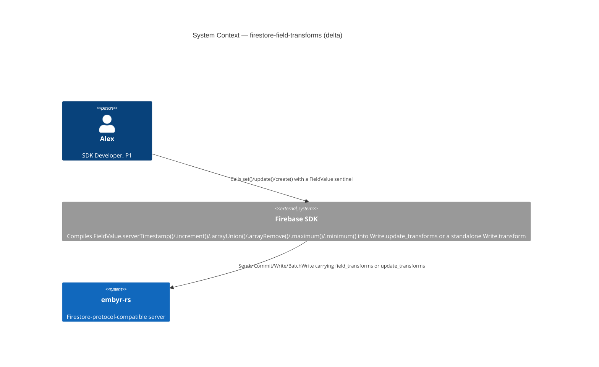
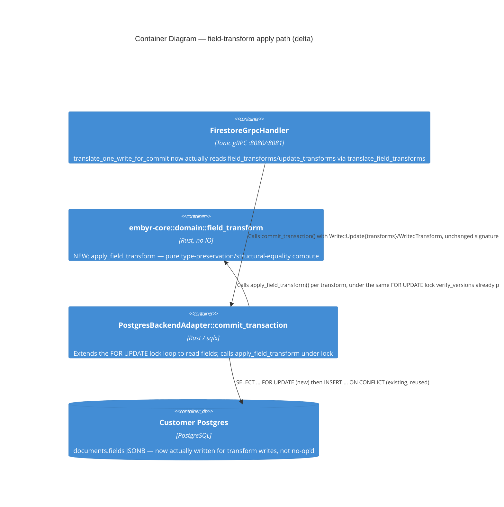

# firestore-field-transforms — Feature Delta

**Wave**: DISCUSS | **Agent**: Luna (nw-product-owner) | **Date**: 2026-08-31
**Status**: Ready for DESIGN handoff — two escalated open questions (integer-overflow behavior on `increment`; SPEC.md's own internal inconsistency about `transform_results` for array ops). See § Handoff Package.
**Upstream**: No DISCOVER/DIVERGE wave ran for this feature specifically — commissioned directly by the orchestrator's own direct-grep audit of `translate_one_write_for_commit` (`crates/embyr-server/src/grpc/handler.rs`), confirming every write RPC this session has built or touched (`Commit`, `Write`, `BatchWrite`) parses a proto `DocumentTransform` off the wire and then discards it: `DomainWrite::Transform { transforms: vec![] }` is unconditional, regardless of client intent.

**Framing**: this is a **bug fix** (restoring documented, intended behavior), not a new RPC. Unlike `firestore-write-streaming`/`firestore-batch-write`/`firestore-list-rpcs` (net-new proto surface), the wire messages (`FieldTransform`, `DocumentTransform`) and their intended semantics (`docs/SPEC.md` § Field Transforms) already exist and are already documented; only the actual computation logic is missing. `firestore-batch-write`'s own feature-delta.md (§ Out of Scope, § System Constraints) already named this exact gap twice as "`handle_commit`'s own pre-existing gap, inherited identically... not newly required to be closed" — this feature is that named follow-up.

---

## Wave: DISCUSS / [REF] Prior Wave Consultation — Reading Confirmation

✓ `proto/google/firestore/v1/document.proto` `message DocumentTransform` (lines 112-152) and its parent `message Write` (lines 89-110) — confirmed the **full wire shape, including a detail the orchestrator's own commission did not anticipate**: a `FieldTransform` can arrive on the wire via **two distinct paths**, not one. (1) `Write.operation = transform(DocumentTransform)` (field 6) — a standalone transform-only write, no `update`/`delete` set; this is the path `translate_one_write_for_commit`'s existing `Operation::Transform(dt)` arm already parses (and discards). (2) `Write.update_transforms` (field 7, `repeated DocumentTransform.FieldTransform`) — "the transforms to perform after update," attached **alongside** an `update` operation on the *same* `Write` message. This second path is the wire shape a real SDK call like `docRef.set({name: "Maria", updatedAt: FieldValue.serverTimestamp()})` (mixed regular fields + a transform sentinel in one call) compiles to — almost certainly the *more* common real-world shape for `serverTimestamp()`, since it is typically attached to an existing write rather than issued standalone. **Load-bearing finding**: `translate_one_write_for_commit`'s `Update` arm (handler.rs lines 696-717) never reads `proto_write.update_transforms` at all — no comment, no partial handling, nothing. This is a second, previously-undocumented instance of the same discard bug, not a variant of the first.
✓ `message FieldTransform` (lines 121-144) — confirmed the 6 real `transform_type` oneof variants: `set_to_server_value` (`ServerValue::REQUEST_TIME` only, enum has no other value), `increment`/`maximum`/`minimum` (each a single `Value`), `append_missing_elements`/`remove_all_from_array` (each an `ArrayValue`).
✓ `message WriteResult` (lines 154-161) — confirmed `repeated Value transform_results = 2`, "the results of applying each FieldTransform." Per the orchestrator's own framing and cross-checked against `docs/SPEC.md` (next item): NOT every transform kind necessarily produces a result-array entry — see the SPEC.md inconsistency flagged below.
✓ `docs/SPEC.md` § Field Transforms (lines 770-783), read in full, alongside § Transactions (786-819) for the FOR UPDATE precedent (next item). **The table only documents 4 of the 6 transform kinds** — `setToServerValue`, `increment`, `appendMissingElements`, `removeAllFromArray` all have rows; **`maximum` and `minimum` have zero rows, zero mention anywhere in the file** (confirmed by full-file grep for "maximum"/"minimum" — no matches). This is a real documentation gap in this codebase's own local source of truth, not an inference gap on this DISCUSS's part — flagged as § Escalation 2 below, not silently filled in. **Second finding, an internal inconsistency**: the `removeAllFromArray` row states "Returns empty array as transform result" (implying it DOES populate `transform_results`), but the `appendMissingElements` row says nothing about a transform result at all, and real Firestore's own well-established public contract is that **array-transform kinds (`appendMissingElements`/`removeAllFromArray`) do NOT populate `transform_results`** — only `setToServerValue`/`increment`/`maximum`/`minimum` do (they compute a server-side value the client could not otherwise know; array membership is fully client-known already). SPEC.md's own text is internally inconsistent on this point (asymmetric treatment of the two array rows) and is not confidently resolvable from local evidence alone — flagged as § Escalation 2, not silently picked either way.
✓ `crates/embyr-server/src/grpc/handler.rs::translate_one_write_for_commit` (full function, current lines 687-771 — moved during this session's `firestore-batch-write`/`firestore-write-streaming` extractions, per the orchestrator's own warning) — confirmed directly: the `Operation::Transform(dt)` arm (lines 742-768) parses `dt.document` and `dt.field_transforms` off the wire, evaluates the write-path access rule (correctly, against `None` proposed-fields per the existing `evaluate_write_rule_for_commit` doc comment), and then **unconditionally** constructs `DomainWrite::Transform { path, transforms: vec![] }` — `dt.field_transforms` is never read past the access-rule check. The existing comment (lines 745-753) already names this: "`field_transforms` are discarded elsewhere in this codebase (pre-existing, separately-tracked gap — out of scope for this fix)" — written during `firestore-write-streaming`/`firestore-batch-write`'s own delivery, confirming this gap has been observed and deliberately deferred at least twice before. The `Update` arm (lines 696-717) has no such comment and no `update_transforms` handling of any kind (§ finding above).
✓ `crates/embyr-core/src/storage/backend_adapter.rs` (full, 138 lines) — confirmed `pub enum FieldTransform { ServerTimestamp(String) }` (lines 27-32) already exists but models only 1 of 6 real transform kinds, and — because `transforms` is always `vec![]` at the call site — is **dead code today, never constructed anywhere in this codebase** (confirmed by full-workspace grep: zero non-definition references). `pub enum Write` (lines 34-56) already has a `Transform { path, transforms: Vec<FieldTransform> }` variant, structurally separate from `Update { fields, .. }` — confirms the domain model has no representation today for a *combined* update+transform write (the `update_transforms` wire shape above), only a pure-transform-only write.
✓ `crates/embyr-pg-storage/src/backend_adapter.rs::commit_transaction` (full apply loop, lines 1060-1108) — confirmed directly: the `Write::Transform { .. }` match arm (lines 1103-1106) does not inspect `transforms` at all; it appends a `WriteResult { update_time: from_datetime(now), create_time: None }` (the same shape as every other write, i.e. "accept the write, touch nothing") and moves on. **No `fields` JSONB write of any kind happens for a transform.** This is the primary implementation target confirmed exactly as the orchestrator's commission described: a silent no-op, not an error, not a partial application.
✓ `crates/embyr-server/src/adapters/agent_backend.rs::commit_transaction` (lines 527-559) — confirmed a **second, distinct discard**: the `Write::Transform { .. } => None` arm inside the `.filter_map(...)` (line 557) silently **removes** the transform write from the batch sent to the customer-VPC agent entirely — the agent never even sees it, unlike the PG path's own no-op-but-still-350-OK. Cross-checked `proto/embyr/agent/v1/storage_agent.proto` and the full `proto/embyr/agent/v1/` tree (grep for "Transform"/"transform") — **zero results**. The internal embyr-server↔embyr-agent wire protocol has no message shape for a transform at all; fixing agent-mode would require extending the agent's own proto and (per `CLAUDE.md`) the separately-deployed `embyr-agent` binary — a materially larger, cross-binary change than the PG-mode fix. Named explicitly in § Out of Scope, not silently included.
✓ `crates/embyr-core/src/domain/field_value.rs::FieldValue` (full, 51 lines) — confirmed `#[derive(Debug, Clone, PartialEq)]` on the `FieldValue` enum (line 4), which recursively gives `Vec<FieldValue>`/`BTreeMap<String, FieldValue>` structural equality for free (`Array`/`Map` variants). **This directly resolves Investigation Point 6**: `appendMissingElements`/`removeAllFromArray`'s "proto structural equality" requirement (`docs/SPEC.md`'s own words) is already fully available via `FieldValue: PartialEq` — zero new equality logic needed, a straight reuse. Confirmed `Integer(i64)`/`Double(f64)` are already separate variants (not unified into one numeric type), matching `docs/SPEC.md`'s own type-preservation rule for `increment` ("Result is integer" / "Result is double") — no new type-modeling work needed for the numeric distinction itself, only for the arithmetic/comparison logic that operates on it.
✓ `crates/embyr-core/src/domain/document.rs::WriteResult` (lines 35-40) — confirmed the domain `WriteResult` struct has exactly two fields, `update_time` and `create_time` — **no field exists to carry a computed transform result value anywhere in the domain model**. Cross-checked every proto-response construction site in `handler.rs` (5 call sites: lines 1851-56, 1949-51, 1968-70, 1982-2002) — **all five hardcode `transform_results: vec![]`** on the outgoing `embyr_proto::firestore::WriteResult`, independent of and in addition to the PG-layer no-op above. Fixing this feature requires touching the domain `WriteResult` struct itself (add a field) and all 5 response-construction call sites, not just the PG apply loop.
✓ `crates/embyr-pg-storage/src/transactions/occ.rs::verify_versions` (lines 15-31, `SELECT update_time ... FOR UPDATE`) — confirmed directly (Investigation Point 5): this codebase already has a proven `SELECT ... FOR UPDATE` row-locking idiom, executed inside `commit_transaction`'s own single `pg_txn`, used today to serialize concurrent OCC/precondition checks on the same document row before the apply loop runs. **This lock currently only fires for writes carrying an explicit `WritePrecondition`** (`UpdateTime`/`MustExist`/`MustNotExist`) — a `Write::Transform` typically carries none, so today's code takes NO lock at all on a transform's target row before "applying" it (moot today, since nothing is applied, but load-bearing for this feature's own atomicity design).
✓ `crates/embyr-core/src/domain/query.rs::validate_field_path`/`is_valid_field_path` (lines 16-36) — the only existing "field path" logic in this codebase; validates dotted-path *syntax* for query filters, does **no** get/set/merge on a `BTreeMap<String, FieldValue>` by dotted path. Grepped the full `embyr-server`/`embyr-core` tree for any nested-field get/set/merge utility (`update_mask`, dotted-path merge) — **zero results**. `UpdateDocument`/`Commit`'s existing `Update` writes always replace the entire `fields` map (full-document overwrite; no partial `update_mask` merge exists anywhere today). This means: real Firestore's `FieldTransform.field_path` *can* be a dotted nested path (e.g. `"stats.viewCount"`), but this codebase has **no existing nested-field read/write primitive of any kind** to reuse — implementing dotted-path transform targets would be wholly new domain logic, not a reuse. Scoped explicitly (§ Scope Assessment) rather than silently assumed either way.
✓ `crates/embyr-server/src/grpc/write_stream.rs` (grepped for `Transform`/`FieldTransform`) and `firestore-batch-write`'s own delivery (`translate_writes_catching`, confirmed via the same handler.rs read above) — **confirmed, not assumed**: neither has any partial or divergent transform handling. Both route through the identical `translate_one_write_for_commit`/`Write::Transform` primitives this feature fixes; fixing the shared primitive fixes `Commit`, `Write`, and `BatchWrite` simultaneously, with zero call-site-specific changes needed in either of those two files.
✓ `docs/product/jobs.yaml` JOB-01 (full entry re-read) — confirmed the established "make it real"/close-the-remaining-gap pattern (`aggregation-queries`, `batch-get-documents`, `firestore-write-streaming`, `firestore-batch-write`, `firestore-list-rpcs` → JOB-01) applies here too, with the distinct-gap-category framing noted above (silently-discarded computation on already-existing RPCs, not an undeclared RPC). NOTE appended (see § SSOT Updates).

No contradictions found between this feature's scope and prior evidence. Two genuine documentation/evidence gaps found in `docs/SPEC.md` itself (missing `maximum`/`minimum` rows; internally inconsistent `transform_results` treatment for array ops) — both escalated, not silently resolved (§ Handoff Package).

---

## Wave: DISCUSS / [REF] Orchestrator Decisions (not re-litigated)

| # | Decision | Value |
|---|---|---|
| 1 | Feature Type | Backend — closes a silent-data-loss gap in three already-shipped write RPCs (`Commit`, `Write`, `BatchWrite`), realized entirely inside BC-2 Document Storage |
| 2 | Walking Skeleton | Evaluated (this wave's call): **NO new mechanism class.** `SELECT ... FOR UPDATE` row-locking inside `commit_transaction`'s own single `pg_txn` is already proven (`verify_versions`, § Reading Confirmation) for OCC/precondition checks. The genuinely new element is *what* gets read under that lock — actual field VALUES (for read-compute-write), not just `update_time`/existence for a boolean check — an extension of an already-proven idiom to a new read shape, not a new architectural mechanism. See § Atomicity Mechanism Investigation for the full recommendation (Rust-side compute vs. raw `jsonb_set` SQL) |
| 3 | UX Research Depth | **Lightweight** — SDK-facing. Field transforms are not a method Alex calls directly by RPC name; they are what `FieldValue.serverTimestamp()`/`.increment()`/`.arrayUnion()`/`.arrayRemove()` compile to inside `set()`/`update()`/`create()` calls he already makes. Full journey detail lives inline below, no separate `journey-*.yaml` (established convention this session) |
| 4 | JTBD Analysis | Yes (default) — every story traces to `job_id: JOB-01` (extends, not a new job — same "make it real" pattern as every prior JOB-01 realization this session) |

---

## Wave: DISCUSS / [REF] Persona & Job

**Persona**: **P1 — Alex, SDK Developer** (existing persona), unchanged.

**Domain-example company**: **Trailmark** (continuity with every other JOB-01 feature this session). Concrete grounding: Alex's Trailmark backend writes `trip_entries` documents for end users like Maria Santos, and reaches for `FieldValue.serverTimestamp()` on every write's `updatedAt` field (so he never has to trust client clocks), `FieldValue.increment(1)` for a `viewCount` field on shared trip itineraries, and `FieldValue.arrayUnion(...)`/`.arrayRemove(...)` for a `sharedWithUserIds` field when Maria shares or unshares a trip with a co-traveler.

**job_id decision**: `JOB-01` (`sdk-compat`), extended not new, same persona P1 Alex, same functional dimension ("all SDK calls succeed unchanged") — this feature is a distinct gap *category* within that job (silently-discarded computation on already-shipped RPCs, not an undeclared RPC), not a distinct job. NOTE appended to `docs/product/jobs.yaml` (§ SSOT Updates).

---

## Wave: DISCUSS / [REF] Scope Assessment (Elephant Carpaccio Gate)

| Signal | Threshold | This feature | Fired? |
|---|---|---|---|
| User stories | >10 | 3 (US-01, US-02, US-03) | **NO** |
| Bounded contexts / modules | >3 | 1 — entirely BC-2 Document Storage; zero new bounded context | **NO** |
| Walking Skeleton integration points | >5 | 4 — domain model extension (`FieldTransform` enum, `WriteResult.transform_results` field), both wire-shape translations (`Operation::Transform` + `update_transforms`), PG apply-under-lock, response wiring at the 5 existing call sites | **NO** |
| Estimated effort | >2 weeks | v1 scope (US-01/02/03, non-agent backend modes): ~4 days total across 3 slices | **NO** |
| Independent shippable outcomes | multiple | **NO** — one coherent outcome (transforms actually compute and persist), sliced by transform-kind complexity for risk-reduction, not because the kinds are independently valuable in isolation. A client mixing `increment()` and `serverTimestamp()` in the same app needs all slices to trust the feature; that said, each slice IS independently demonstrable (§ Elephant Carpaccio Slices) | **NO** |

**0 of 5 signals fired. Verdict: PASS — single feature, right-sized as a 3-slice feature, no split needed.** Scoped explicitly NARROWER than a full real-Firestore-parity implementation in two ways, both named rather than silently assumed: (1) **top-level field paths only** — dotted/nested `field_path` targets (e.g. `"stats.viewCount"`) require wholly new nested-map get/set logic this codebase has zero precedent for (§ Reading Confirmation) and are deferred (§ Out of Scope); (2) **`backend_mode=agent` is out of v1** — the internal agent wire protocol has no transform representation at all, a hard proto wall on a separately-deployed binary, structurally the same shape of gap `firestore-write-streaming`'s own agent-mode `Write` had (ADR-047), not the "structurally feasible, just a latency trade-off" shape `firestore-batch-write`'s agent-mode question had.

---

## Wave: DISCUSS / [REF] Atomicity Mechanism Investigation

**Question** (Investigation Point 5): is extending the already-proven `SELECT ... FOR UPDATE` row-locking pattern the natural mechanism for atomic `increment`/`maximum`/`minimum`/array operations, or would raw Postgres JSONB operators (`jsonb_set` with arithmetic) be more direct?

**Both investigated. Recommendation: extend the FOR UPDATE + Rust-side read-compute-write pattern, NOT raw JSONB SQL arithmetic.**

- **FOR UPDATE + Rust compute (recommended)**: inside `commit_transaction`'s existing single `pg_txn`, for each `Write::Transform` (or `Write::Update` carrying attached transforms), `SELECT fields FROM documents WHERE ... FOR UPDATE` (identical idiom to `verify_versions`, extended to read the `fields` JSONB column instead of just `update_time`), decode to `BTreeMap<String, FieldValue>` (reusing the existing JSON↔`FieldValue` encoding boundary, `crates/embyr-core/src/encoding/field_value.rs`), compute the new value(s) in Rust (type-preservation match arms on `FieldValue::Integer`/`Double`, structural-equality filtering via the already-derived `PartialEq` for array ops), then `UPDATE ... SET fields = $new_json`. Reasons: (a) type-preservation rules (int vs. double promotion) are naturally expressed as Rust match arms on the already-existing `FieldValue` enum — this codebase already does all business logic in Rust and treats SQL as a storage boundary only (`fields_to_json`/`json_to_field_value` at the encoding layer, never inline arithmetic in a query); (b) array-membership filtering needs `FieldValue`'s already-derived structural `PartialEq` — reimplementing that as a `jsonb` containment/diff expression in raw SQL would duplicate logic that already exists correctly in Rust; (c) dotted-path targeting (if ever added later) composes naturally with a decode→mutate→encode round-trip and would require a hand-built dynamic `jsonb_set` path expression in SQL, error-prone at parse time; (d) the exact same `pg_txn`-scoped `FOR UPDATE` lock already serializes concurrent writers on the same row, giving atomicity "for free" from the already-proven idiom — no new locking primitive, no new isolation level.
- **Raw JSONB SQL (rejected for v1)**: `jsonb_set(fields, '{viewCount}', to_jsonb((fields->>'viewCount')::bigint + $delta))` is possible for a single top-level integer increment, but does not naturally express type-preservation (int vs. double), does not naturally express `maximum`/`minimum` comparisons across mixed types, and does not naturally express array structural-equality filtering (`jsonb` array containment operators do element-level equality on JSON values, not `FieldValue`'s Rust-level semantics, e.g. `Timestamp`/`Reference` values are encoded as JSON objects/strings that would need custom comparison logic duplicated in SQL). Rejected as the primary mechanism; may be worth a future micro-optimization once the Rust-side implementation is correct and if profiling shows it matters — not evidenced here.

---

## Wave: DISCUSS / [REF] Numeric Type-Preservation & Array-Equality Findings

- **Type preservation** (`increment`): per `docs/SPEC.md`, integer delta + integer current = integer result; double delta (or double current) = double result (promotion). Already directly expressible via `FieldValue::Integer(i64)`/`Double(f64)` match arms — no new type modeling required, confirmed reuse (§ Reading Confirmation).
- **Missing-field handling** (`increment`): SPEC.md is explicit — treated as 0 (integer) or 0.0 (double), per the delta's own type.
- **Missing-field handling** (`maximum`/`minimum`) — **undocumented by SPEC.md** (§ Escalation 2). Well-established real-Firestore behavior (moderate confidence, not locally documented, flagged consistent with this session's own established practice for un-cited recall — cf. `aggregation-queries`' OQ-AGG-01): unlike `increment`, a missing field is **set directly to the given value** (not compared against an assumed 0/0.0 baseline). Proposed as a `docs/SPEC.md` addition for DESIGN/crafter to confirm and finalize, not asserted here as settled fact.
- **Non-numeric field / non-numeric delta**: SPEC.md documents `InvalidArgument` for a non-numeric `increment` delta; by direct analogy (not documented, reasonable extension) the same should apply if the *existing* field value is present but non-numeric (e.g. `increment` against a field currently holding a string) — flagged as a domain example needing DESIGN/DELIVER confirmation, not left silently unhandled.
- **Integer overflow** (`increment`): SPEC.md is silent (§ Escalation 1). Recommend `checked_add` → `InvalidArgument` on overflow as the safe default (never silently wrap), pending confirmation against real Firestore's own documented behavior, which this DISCUSS does not have high-confidence evidence for.
- **Array structural equality** (`appendMissingElements`/`removeAllFromArray`): fully covered by `FieldValue`'s already-derived `PartialEq` (§ Reading Confirmation) — zero new equality logic needed, direct reuse.
- **`appendMissingElements` ordering**: SPEC.md's own row ("Merges incoming values into the current array, skipping values already present") implies append-in-order at the end of the existing array for values not already present — consistent with real Firestore's own documented behavior. No SPEC ambiguity here.
- **`removeAllFromArray` semantics**: SPEC.md is explicit — removes ALL matching elements (not just the first), consistent with real Firestore.

---

## Wave: DISCUSS / [REF] Journey (Lightweight, per Decision 3 — inline per this codebase's convention)

**Alex's mental model**: Alex does not think of field transforms as a distinct RPC concept at all — to him they are just arguments inside a normal `set()`/`update()`/`create()` call (`FieldValue.serverTimestamp()`, `FieldValue.increment(1)`, `FieldValue.arrayUnion(coTravelerId)`). His mental model is "the server computes this value for me, atomically, without me needing to read-modify-write myself" — the entire reason `increment()` exists is so Alex never has to do a transactional read-then-write from client code just to bump a counter safely under concurrent access.

**Emotional arc** (mirrors "Problem Relief" — this is a bug fix, not new capability): **Start** — quiet confidence, misplaced: Alex's code calls `.update({viewCount: FieldValue.increment(1), updatedAt: FieldValue.serverTimestamp()})` against embyr today, gets a 200/OK back, and has no visible signal anything is wrong — the failure is silent. **Middle** (post-fix) — Alex re-runs the identical call; the response is unchanged in shape, but now `viewCount` actually increments and `updatedAt` actually reflects server time, matching what he already assumed was happening. **End** — relief and restored trust: Alex's counters, timestamps, and array-membership fields behave exactly as they would against real Firestore, with no code change on his side required — the fix is entirely server-side.

**Shared artifact**: the write-application primitive (`translate_one_write_for_commit` → `DomainWrite`/`Write::{Update,Transform}` → `BackendAdapter::commit_transaction`'s apply loop → `WriteResult`) — same primitive `firestore-batch-write`/`firestore-write-streaming` already reuse; this feature extends its computation, not its shape.

**Failure modes** (feeds DISTILL scenario generation): `increment`/`maximum`/`minimum` against a field that doesn't exist yet | against a field that exists but holds a non-numeric value | integer overflow on `increment` | `setToServerValue` with any enum value other than `REQUEST_TIME` (must return `InvalidArgument`, unmodified) | `appendMissingElements`/`removeAllFromArray` against a field that doesn't exist yet | a `Write` with BOTH `update` fields AND `update_transforms` in the same message (the more-common real wire shape, § Reading Confirmation) | multiple transforms of different kinds targeting different fields in the same `DocumentTransform` | concurrent writers incrementing the same counter field simultaneously (the atomicity property `increment()` exists specifically to guarantee).

---

## Wave: DISCUSS / [REF] Story Map & Walking Skeleton

**Persona**: P1 Alex | **Goal**: Field transforms embedded in `set()`/`update()`/`create()` calls (`serverTimestamp()`, `increment()`, `maximum()`/`minimum()`, `arrayUnion()`/`arrayRemove()`) actually compute and persist, matching real Firestore's own documented contract, instead of silently no-op-ing.

### Backbone

| A. Alex's SDK Sends a Write With Transform Sentinels | B. Server Computes Each Transform Atomically | C. Alex's Code Observes the Persisted Result |
|---|---|---|
| Standalone transform-only `Write` (`operation = transform`) **[WS]** | `setToServerValue: REQUEST_TIME` sets the field to the commit timestamp **[WS]** | The written field reflects the computed value on the very next `GetDocument` **[WS]** |
| `Write` with BOTH `update` fields AND `update_transforms` attached | `increment`/`maximum`/`minimum` read-compute-write under the same row lock, type-preserved | `WriteResult.transform_results` carries the computed value for value-producing kinds |
| — | `appendMissingElements`/`removeAllFromArray` read-filter-write using existing structural equality | — |

### Walking Skeleton

A single `serverTimestamp()` transform, both wire shapes (standalone `Operation::Transform` and `update_transforms` attached to an `Update`), top-level field only, `direct_pg`/`aws_secret`/`gcp_secret` backend modes only: request arrives → `FieldTransform::ServerTimestamp` is actually constructed from the wire (not discarded) → the PG apply loop actually writes the field into the `fields` JSONB column (not a no-op) → `WriteResult.transform_results` carries the computed timestamp value → `GetDocument` immediately after reflects it. This is Slice 01, US-01. Chosen as the walking skeleton not because it is the most commonly used transform kind in isolation, but because it requires zero read-before-write (a pure function of "now") and therefore proves the full four-layer plumbing (domain model → both wire shapes → PG persistence → response wiring) without also requiring the atomicity/type-preservation logic Slice 02 introduces — isolating "does the pipe exist end to end" from "is the computation correct," mirroring this session's own established walking-skeleton discipline.

### Release 1 — Server Timestamp Actually Persists (Slice 01, US-01)

Outcome: the full four-layer plumbing this feature's every other slice depends on is proven with the simplest possible computation.

### Release 2 — Numeric Counters Compute Atomically and Type-Correctly (Slice 02, US-02)

Outcome: `increment`/`maximum`/`minimum` — the transforms whose entire reason for existing is atomicity under concurrent access — actually read-compute-write under row lock, with correct integer/double type preservation.

### Release 3 — Array Membership Updates Without Duplicates (Slice 03, US-03)

Outcome: `appendMissingElements`/`removeAllFromArray` actually read-filter-write using this codebase's existing structural-equality primitive.

---

## Wave: DISCUSS / [REF] Elephant Carpaccio Slices

| Slice | Story | Release | Estimate | Learning Hypothesis (disproves) | Production-data taste test |
|---|---|---|---|---|---|
| 01 (WS) | US-01 | 1 | 2 days | The full four-layer plumbing (domain `FieldTransform`/`WriteResult` model extension, both wire-shape translations, PG persistence, response wiring at all 5 call sites) cannot be wired end-to-end for even the simplest transform kind without requiring a new `BackendAdapter` trait method or a breaking change to `Write`'s own shape | Real Postgres, a real `trip_entries` document for Maria Santos, one `Commit` call with a standalone `serverTimestamp()` transform AND a second `Commit` call mixing `update` fields with an attached `update_transforms` sentinel, asserting the persisted `updatedAt` field is a real server timestamp (not client-supplied, not absent) readable via a real `GetDocument` — no mocked adapter |
| 02 | US-02 | 2 | 1.5 days | Extending the already-proven `FOR UPDATE` row-locking idiom to a read-compute-write shape (instead of a read-compare-abort shape) cannot preserve integer/double typing correctly, or cannot guarantee atomicity under two concurrent `increment` calls against the same field | Real Postgres, a real `trip_entries.viewCount` field starting at a real integer value, two concurrent `Commit` calls each incrementing by 1, asserting the final persisted value reflects both increments (no lost update) and remains an integer type — plus a `maximum`/`minimum` case against a real pre-existing numeric field |
| 03 | US-03 | 3 | 1 day | `FieldValue`'s already-derived `PartialEq` cannot be reused directly for array-membership filtering without new equality logic, or the read-filter-write shape cannot correctly avoid duplicate entries on `appendMissingElements` | Real Postgres, a real `trip_entries.sharedWithUserIds` array field containing existing user IDs, an `arrayUnion` call re-adding one already-present ID plus one genuinely new ID, and a separate `arrayRemove` call, asserting no duplicate entry results and removal matches all occurrences |

**Total estimate: ~4.5 days across 3 slices.**

**Taste tests applied**:
- "4+ new components per slice" — Slice 01 introduces exactly 4 new/extended components (`FieldTransform` enum expansion, `WriteResult.transform_results` field, `update_transforms` translation, PG persistence for `ServerTimestamp`) — at the edge but each is small and load-bearing for every later slice, not decorative. Slices 02/03 introduce 0 new structural components, only new computation logic inside the pipe Slice 01 built. PASS, with the note that Slice 01 is the heaviest of the three by necessity (full-stack plumbing has no thinner honest slice).
- "Every slice depends on a new abstraction" — the one genuinely new abstraction (the read-compute-write-under-lock shape) ships as part of Slice 01/02 together, not deferred; Slice 03 depends on nothing Slice 01/02 didn't already build. PASS.
- "No slice disproves a pre-commitment" — each slice has a distinct, falsifiable hypothesis (table above), each targeting a different real risk (plumbing exists / atomicity+typing is correct / equality reuse is correct). PASS.
- "Synthetic-data-only slices prove plumbing, not value" — all three slices require a real Postgres write against real `trip_entries` domain data, never a stubbed adapter. PASS.
- "2+ slices identical except for scale" — `increment`/`maximum`/`minimum` were merged into ONE slice (02) precisely because they share the identical read-compute-write-under-lock shape and differ only in the arithmetic/comparison operator — this IS the "identical except for a swapped operator" merge case the taste test calls for, applied deliberately rather than left as 3 separate slices. `appendMissingElements`/`removeAllFromArray` were merged into ONE slice (03) for the identical reason (same read-filter-write shape, differ only in add-vs-remove-matching). PASS.

---

## Wave: DISCUSS / [REF] Prioritization

| Priority | Slice | Target Outcome | Rationale |
|---|---|---|---|
| 1 | Slice 01 (WS) | Full plumbing proven with the simplest computation | `serverTimestamp()` needs no read-before-write and no type reasoning — isolates "does the pipe exist" from "is the computation correct," and both later slices depend on this pipe existing |
| 2 | Slice 02 | Atomic, type-correct numeric transforms | The transforms whose entire reason for existing is atomicity under concurrency — sequenced second because it is the highest real-world-impact gap (counters, inventory) and because it proves the read-compute-write-under-lock shape Slice 03 reuses |
| 3 | Slice 03 | Array membership without duplicates | Lowest real-world frequency of the three groups (per the orchestrator's own framing) and structurally simplest once Slice 02's read-under-lock shape already exists — sequenced last by risk, not by difficulty |

---

## Wave: DISCUSS / [REF] System Constraints

- **`translate_one_write_for_commit`'s `Operation::Transform` arm must actually construct `FieldTransform` values from `dt.field_transforms`, not `vec![]`.** The existing "pre-existing, separately-tracked gap — out of scope for this fix" comment (handler.rs lines 745-753) must be removed/replaced once this feature closes the gap it names.
- **`translate_one_write_for_commit`'s `Update` arm must also translate `proto_write.update_transforms`** (field 7) — currently silently ignored with no comment at all. The domain model must be able to represent "one write, both a field-value update AND attached transforms" — today's `Write` enum (`Update`/`Delete`/`Transform` as fully separate variants) cannot express this combination; DESIGN must decide the exact shape (add `transforms` to the `Update` variant; split into two `DomainWrite`s applied atomically in the same PG transaction; or another shape) — not decided here, named as a required DESIGN decision.
- **`embyr-core::storage::backend_adapter::FieldTransform` must grow from 1 variant to 6** (or however DESIGN shapes it): `ServerTimestamp`, `Increment`, `Maximum`, `Minimum`, `AppendMissingElements`, `RemoveAllFromArray`, each carrying the operand `Value`/`ArrayValue` translated to `FieldValue`/`Vec<FieldValue>`.
- **`embyr-core::domain::document::WriteResult` must grow a field to carry computed transform-result values** (e.g. `transform_results: Vec<FieldValue>`), threaded from the PG apply loop through `BackendAdapter::commit_transaction`'s return value up to all 5 proto-response construction call sites in `handler.rs` (currently all 5 hardcode `transform_results: vec![]`) — a genuinely cross-cutting, not-localized-to-one-function change, named explicitly so DESIGN scopes it deliberately rather than discovering it mid-slice.
- **PG apply loop must extend the `FOR UPDATE` row-locking idiom** (`verify_versions`'s own precedent, `crates/embyr-pg-storage/src/transactions/occ.rs`) to read `fields`, not just `update_time`/existence, for any `Write::Transform` (or update-with-attached-transforms) inside `commit_transaction`'s existing single `pg_txn` — see § Atomicity Mechanism Investigation for the full recommendation and rejected alternative.
- **`FieldValue`'s already-derived `PartialEq` is reused unchanged** for `appendMissingElements`/`removeAllFromArray` structural-equality filtering — no new equality logic (§ Reading Confirmation).
- **Scoped explicitly to top-level field paths only** — dotted/nested `field_path` targets are OUT of v1 scope (§ Out of Scope); this codebase has zero existing nested-map get/set/merge primitive to reuse, and inventing one is a materially larger, separately-scoped piece of work.
- **`backend_mode=agent` is OUT of v1 scope** — the internal agent wire protocol (`proto/embyr/agent/v1/`) has no transform message shape at all, a hard proto wall on a separately-deployed binary (`embyr-agent`), unlike `firestore-batch-write`'s own "structurally feasible, just a latency question" agent-mode situation.
- **`docs/SPEC.md` § Field Transforms needs an update as part of this feature's own delivery** — `maximum`/`minimum` rows are entirely missing, and the `transform_results`-for-array-ops inconsistency needs resolving (§ Escalation 2) — this is documentation debt this feature is well-positioned to close as a byproduct of implementing the computation, not a separate feature.
- Ubiquitous language: no new BC-2 terms — `FieldTransform`/`transform_results` are already named in the vendored proto and in `docs/SPEC.md`; this feature implements already-named concepts, introduces none new.

---

## Wave: DISCUSS / [REF] User Stories

<!-- markdownlint-disable MD024 -->

### US-01: Alex's `serverTimestamp()` Actually Persists

**job_id**: JOB-01
**Slice**: 01 (Walking Skeleton) | **Release**: 1

#### Elevator Pitch
Before: Alex's code calls `db.collection('trip_entries').doc(id).set({..., updatedAt: FieldValue.serverTimestamp()}, {merge: true})` (or the standalone-transform equivalent) against embyr today — the call returns 200/OK, but `updatedAt` is never actually written; the transform is silently discarded (`translate_one_write_for_commit`'s `Operation::Transform` arm always produces `transforms: vec![]`, and the `Update` arm never reads `update_transforms` at all).
After: Alex runs `db.collection('trip_entries').doc(id).set({name: "Kilimanjaro Trek", updatedAt: FieldValue.serverTimestamp()}, {merge: true})` against embyr → he immediately calls `docRef.get()` → sees `updatedAt` populated with a real server-generated timestamp close to the commit time, not absent, not client-supplied.
Decision enabled: Alex can trust that `updatedAt`-style audit-timestamp fields, written via the standard SDK idiom on every mutating call, actually reflect server time — a foundational building block for any of his code that later queries or sorts by "most recently modified," without hand-rolling a client-clock-based alternative he does not trust.

#### Domain Examples
1. **Happy Path — standalone transform**: Alex's backend sends a `Commit` with one standalone `Write { operation: transform(...) }` targeting an existing `trip_entries/kilimanjaro-trek` document for Maria Santos, `field_transforms: [{ field_path: "updatedAt", set_to_server_value: REQUEST_TIME }]`. The document's `updatedAt` field is set to the commit timestamp, readable via `GetDocument` immediately after.
2. **Happy Path — attached to an update**: Alex's backend sends a `Commit` with one `Write { operation: update(...), update_transforms: [{ field_path: "updatedAt", set_to_server_value: REQUEST_TIME }] }`, where the `update` document body sets `name: "Kilimanjaro Trek — Revised Itinerary"`. Both the regular field AND the transformed field persist correctly in the same write.
3. **Error/Boundary**: Alex's backend sends a transform with `set_to_server_value` set to an unspecified/unsupported `ServerValue` (anything other than `REQUEST_TIME`). The write is rejected with `InvalidArgument`, and no field is modified — matching `docs/SPEC.md`'s own documented row.

#### UAT Scenarios (BDD)

##### Scenario: A standalone server-timestamp transform persists a real server time
Given Maria Santos's `trip_entries/kilimanjaro-trek` document exists with no `updatedAt` field
When Alex's script sends a `Commit` with a standalone transform write setting `updatedAt` to `REQUEST_TIME`
Then `GetDocument` immediately after shows `updatedAt` populated with a timestamp within a few seconds of the commit call
And the timestamp is not the value of any field the client supplied

##### Scenario: A server-timestamp transform attached to a regular update persists both together
Given Maria Santos's `trip_entries/kilimanjaro-trek` document exists
When Alex's script sends a `Commit` with one write that both updates `name` AND attaches an `update_transforms` entry setting `updatedAt` to `REQUEST_TIME`
Then `GetDocument` immediately after shows the new `name` value AND a freshly-set `updatedAt` timestamp
And both changes are visible from the same single `GetDocument` call — no partial application

##### Scenario: A server-timestamp transform creates the field when it doesn't already exist
Given a new `trip_entries` document with no `updatedAt` field at all
When Alex's script sends a create-with-transform write setting `updatedAt` to `REQUEST_TIME`
Then `GetDocument` immediately after shows `updatedAt` present and populated

##### Scenario: WriteResult.transform_results reports the computed timestamp
Given any well-formed `serverTimestamp()` transform write
When the server responds to the `Commit` call
Then `WriteResult.transform_results` contains exactly one entry: the same timestamp value now persisted on the document

##### Scenario: An unsupported ServerValue is rejected without modifying the document
Given Maria Santos's `trip_entries/kilimanjaro-trek` document exists
When Alex's script sends a transform with an unspecified/unsupported `ServerValue`
Then the call fails with `InvalidArgument`
And the document's fields are unchanged from before the call

#### Acceptance Criteria
- [ ] AC-01-01: A standalone `serverTimestamp()` transform write persists a real server-generated timestamp, readable via `GetDocument` immediately after.
- [ ] AC-01-02: A `serverTimestamp()` transform attached to a regular `update` (via `update_transforms`) persists BOTH the regular field change and the transformed field in the same write.
- [ ] AC-01-03: A `serverTimestamp()` transform creates the target field if it does not already exist.
- [ ] AC-01-04: `WriteResult.transform_results` contains the computed timestamp value, positionally aligned to the transform's own position in `field_transforms`/`update_transforms`.
- [ ] AC-01-05: An unsupported `ServerValue` is rejected with `InvalidArgument`, and the document is left unmodified.

#### Outcome KPIs
See § Outcome KPIs below.

#### Technical Notes (Optional)
Requires: (a) `embyr-core::FieldTransform::ServerTimestamp` actually constructed in `translate_one_write_for_commit`'s `Operation::Transform` arm (currently `vec![]`) AND a new translation path for `proto_write.update_transforms` in the `Update` arm (currently absent entirely) — the exact domain-model shape for "one write, both fields and transforms" is a DESIGN decision (§ System Constraints), not fixed here; (b) `WriteResult` domain struct gains a `transform_results`-carrying field, threaded through all 5 proto-response call sites in `handler.rs`; (c) PG `commit_transaction`'s `Write::Transform` (and updated `Write::Update`) apply arms actually write the computed value into the `fields` JSONB column, no read-before-write needed for this transform kind specifically (pure function of `now`, same `now` already computed once per `commit_transaction` call for `update_time`). Scoped to `direct_pg`/`aws_secret`/`gcp_secret` backend modes; `backend_mode=agent` out (§ Out of Scope).

---

### US-02: Alex's Counters Increment Atomically and Type-Correctly

**job_id**: JOB-01
**Slice**: 02 | **Release**: 2

#### Elevator Pitch
Before: Alex's code calls `db.collection('trip_entries').doc(id).update({ viewCount: FieldValue.increment(1) })` every time Maria Santos's shared itinerary is viewed — the call returns 200/OK, but `viewCount` never actually changes; every view is silently lost, and Alex has no way to build a working view counter, like count, or inventory decrement without hand-rolling his own client-side read-then-write (defeating the entire reason `increment()` exists: avoiding races under concurrent access).
After: Alex's code calls `.update({ viewCount: FieldValue.increment(1) })` from two concurrent requests when two different friends view Maria's Kilimanjaro Trek itinerary at nearly the same moment → both increments land, `viewCount` reflects both views, and a subsequent `.update({ viewCount: FieldValue.maximum(1000) })` caps a promotional counter without Alex ever reading the current value client-side first.
Decision enabled: Alex can build view counters, like counts, and inventory-decrement logic (`increment(-1)`) that are correct under real concurrent traffic, without writing his own transactional read-modify-write client code or accepting lost updates.

#### Domain Examples
1. **Happy Path**: Maria Santos's `trip_entries/kilimanjaro-trek` document has `viewCount: 41` (integer). Alex's backend sends `increment(1)`. The document's `viewCount` becomes `42` (integer, type preserved).
2. **Edge Case — type promotion and concurrency**: `viewCount` starts at `41` (integer). Two concurrent `Commit` calls each send `increment(1)` at nearly the same time. The final persisted value is `43` (no lost update — both increments landed), still an integer. A third call sends `increment(0.5)` (a double delta) — the result becomes `43.5`, now a `Double`, matching SPEC.md's promotion rule.
3. **Error/Boundary**: `viewCount` field does not exist yet on a brand-new `trip_entries` document. Alex sends `increment(1)`. The field is created and set to `1` (treated as starting from 0, per SPEC.md). Separately, `maximum(1000)` against a still-missing field sets it directly to `1000` (per the proposed SPEC.md addition, § Numeric Type-Preservation Findings) rather than comparing against an assumed 0.

#### UAT Scenarios (BDD)

##### Scenario: Increment on an existing integer field preserves integer type
Given Maria Santos's `trip_entries/kilimanjaro-trek` document has `viewCount: 41`
When Alex's script sends an `increment(1)` transform against `viewCount`
Then `GetDocument` immediately after shows `viewCount: 42`, still an integer value

##### Scenario: Two concurrent increments against the same field both land (no lost update)
Given Maria Santos's `trip_entries/kilimanjaro-trek` document has `viewCount: 41`
When two `Commit` calls, each incrementing `viewCount` by 1, are sent concurrently
Then `GetDocument` after both calls complete shows `viewCount: 43`
And neither increment is silently dropped

##### Scenario: Increment against a missing field treats it as zero
Given a new `trip_entries` document with no `viewCount` field
When Alex's script sends an `increment(1)` transform against `viewCount`
Then `GetDocument` immediately after shows `viewCount: 1`

##### Scenario: A double delta promotes an integer field to double
Given Maria Santos's `trip_entries/kilimanjaro-trek` document has `viewCount: 43` (integer)
When Alex's script sends an `increment(0.5)` transform against `viewCount`
Then `GetDocument` immediately after shows `viewCount: 43.5`, now a double value

##### Scenario: Maximum caps a promotional counter without a client-side read
Given Maria Santos's `trip_entries/kilimanjaro-trek` document has `promoBoostCount: 1200`
When Alex's script sends a `maximum(1000)` transform against `promoBoostCount`
Then `GetDocument` immediately after shows `promoBoostCount: 1200` (unchanged — current value already exceeds the given maximum)

##### Scenario: Increment against a non-numeric existing value is rejected
Given Maria Santos's `trip_entries/kilimanjaro-trek` document has `viewCount: "not-a-number"` (a string, from unrelated bad data)
When Alex's script sends an `increment(1)` transform against `viewCount`
Then the call fails with `InvalidArgument`
And the document's `viewCount` field is unchanged

#### Acceptance Criteria
- [ ] AC-02-01: `increment` against an existing numeric field preserves integer/double type per SPEC.md's promotion rule.
- [ ] AC-02-02: Two concurrent `increment` calls against the same field both land — no lost update (proves the FOR UPDATE-locked read-compute-write mechanism, § Atomicity Mechanism Investigation).
- [ ] AC-02-03: `increment` against a missing field treats it as 0 (integer delta) or 0.0 (double delta), per SPEC.md.
- [ ] AC-02-04: `maximum`/`minimum` correctly compare against the existing value and set the field to whichever is greater/lesser, type-preserved.
- [ ] AC-02-05: `increment`/`maximum`/`minimum` against a field whose existing value is non-numeric is rejected with `InvalidArgument`, leaving the document unmodified.

#### Outcome KPIs
See § Outcome KPIs below.

#### Technical Notes (Optional)
Depends on US-01's own domain-model/wire-shape/response-wiring plumbing existing first. New work is narrower: (a) 3 new `FieldTransform` variants (`Increment`, `Maximum`, `Minimum`), each carrying a `FieldValue` operand; (b) PG apply loop extends `FOR UPDATE` row-locking to read the `fields` column (not just `update_time`), decode the target field, compute the new value in Rust (type-preserving match arms), re-encode, `UPDATE`; (c) integer-overflow behavior on `increment` is an open question (§ Escalation 1) — recommend `checked_add` → `InvalidArgument` pending confirmation. `maximum`/`minimum` missing-field semantics need a `docs/SPEC.md` addition as part of this slice's delivery (§ System Constraints).

---

### US-03: Alex's Array Fields Update Without Duplicates

**job_id**: JOB-01
**Slice**: 03 | **Release**: 3

#### Elevator Pitch
Before: Alex's code calls `db.collection('trip_entries').doc(id).update({ sharedWithUserIds: FieldValue.arrayUnion(coTravelerId) })` when Maria Santos shares her Kilimanjaro itinerary with a co-traveler — the call returns 200/OK, but `sharedWithUserIds` never actually changes; sharing (and unsharing, via `arrayRemove`) silently does nothing, so any access-control or notification logic keyed off that array is permanently stale.
After: Alex's code calls `.update({ sharedWithUserIds: FieldValue.arrayUnion(coTravelerId) })` when Maria shares her itinerary → the array gains the new ID exactly once, even if called twice by an accidental client retry; a later `.update({ sharedWithUserIds: FieldValue.arrayRemove(coTravelerId) })` when she unshares removes it cleanly.
Decision enabled: Alex can maintain array-valued membership/tag fields (who a trip is shared with, which categories apply) using the SDK's own idempotent-by-design primitives, without hand-rolling client-side duplicate-checking or accepting silently-broken sharing.

#### Domain Examples
1. **Happy Path**: Maria Santos's `trip_entries/kilimanjaro-trek` document has `sharedWithUserIds: ["u-diego"]`. Alex sends `arrayUnion("u-priya")`. The array becomes `["u-diego", "u-priya"]`.
2. **Edge Case — idempotent re-add**: Same document. Alex sends `arrayUnion("u-diego")` again (already present, e.g. a retried request). The array remains `["u-diego", "u-priya"]` — no duplicate.
3. **Error/Boundary**: `sharedWithUserIds` field does not exist yet on a new document. Alex sends `arrayRemove("u-diego")`. Per SPEC.md, this is a no-op — the field is NOT created, and (per § Escalation 2, pending resolution) either no `transform_results` entry or an empty-array entry is returned for this position.

#### UAT Scenarios (BDD)

##### Scenario: arrayUnion adds a new element that wasn't already present
Given Maria Santos's `trip_entries/kilimanjaro-trek` document has `sharedWithUserIds: ["u-diego"]`
When Alex's script sends an `arrayUnion("u-priya")` transform against `sharedWithUserIds`
Then `GetDocument` immediately after shows `sharedWithUserIds: ["u-diego", "u-priya"]`

##### Scenario: arrayUnion is idempotent for an already-present element
Given Maria Santos's `trip_entries/kilimanjaro-trek` document has `sharedWithUserIds: ["u-diego", "u-priya"]`
When Alex's script sends an `arrayUnion("u-diego")` transform (already present) against `sharedWithUserIds`
Then `GetDocument` immediately after still shows `sharedWithUserIds: ["u-diego", "u-priya"]`, no duplicate entry

##### Scenario: arrayRemove removes all matching occurrences
Given Maria Santos's `trip_entries/kilimanjaro-trek` document has `sharedWithUserIds: ["u-diego", "u-priya", "u-diego"]` (a pre-existing duplicate from unrelated legacy data)
When Alex's script sends an `arrayRemove("u-diego")` transform against `sharedWithUserIds`
Then `GetDocument` immediately after shows `sharedWithUserIds: ["u-priya"]` — both occurrences removed, not just the first

##### Scenario: arrayUnion creates the field when it doesn't already exist
Given a new `trip_entries` document with no `sharedWithUserIds` field
When Alex's script sends an `arrayUnion("u-diego")` transform against `sharedWithUserIds`
Then `GetDocument` immediately after shows `sharedWithUserIds: ["u-diego"]`

##### Scenario: arrayRemove against a missing field is a no-op, does not create it
Given a new `trip_entries` document with no `sharedWithUserIds` field
When Alex's script sends an `arrayRemove("u-diego")` transform against `sharedWithUserIds`
Then `GetDocument` immediately after still shows no `sharedWithUserIds` field at all

#### Acceptance Criteria
- [ ] AC-03-01: `arrayUnion` adds elements not already present in the array (structural equality via `FieldValue::PartialEq`).
- [ ] AC-03-02: `arrayUnion` is idempotent — re-adding an already-present element produces no duplicate.
- [ ] AC-03-03: `arrayRemove` removes ALL matching occurrences of a given element, not just the first.
- [ ] AC-03-04: `arrayUnion` against a missing field creates it as the incoming array.
- [ ] AC-03-05: `arrayRemove` against a missing field is a no-op and does NOT create the field.

#### Outcome KPIs
See § Outcome KPIs below.

#### Technical Notes (Optional)
Depends on US-01/US-02's own plumbing and read-under-lock shape. New work is narrower still: 2 new `FieldTransform` variants (`AppendMissingElements`, `RemoveAllFromArray`), each carrying `Vec<FieldValue>`; PG apply reads the existing array field under the same `FOR UPDATE` lock, filters via `FieldValue::PartialEq` (already derived, zero new equality logic), re-encodes, writes back. The `transform_results` question for this transform kind specifically is the subject of § Escalation 2 — implementation should not guess silently; DESIGN/crafter should resolve against `docs/SPEC.md`'s own clarified table (this feature's own responsibility to update, § System Constraints).

---

## Wave: DISCUSS / [REF] Outcome KPIs

### Feature: firestore-field-transforms

### Objective
Close the silent-data-loss gap in `Commit`/`Write`/`BatchWrite`'s own field-transform handling so every SDK call using `FieldValue.serverTimestamp()`/`.increment()`/`.arrayUnion()`/`.arrayRemove()` (and the less-common `maximum`/`minimum` pair) against embyr actually computes and persists the transformed value, matching real Firestore's own documented contract, for every non-agent `backend_mode`.

### Outcome KPIs

| # | Who | Does What | By How Much | Baseline | Measured By | Type |
|---|---|---|---|---|---|---|
| 1 | SDK developers using `FieldValue.serverTimestamp()`/`.increment()`/`.arrayUnion()`/`.arrayRemove()`/`.maximum()`/`.minimum()` (Alex/Trailmark, `direct_pg`/`aws_secret`/`gcp_secret` backend modes) | Issue a write containing a field transform and see the computed value actually persisted | 100% of well-formed transform writes (across all 6 kinds, both wire shapes) persist correctly per this feature's own UAT scenario suite | 0% (every transform kind silently no-ops today, confirmed by direct code reading) | Count of UAT scenarios passing against the reference test suite | North Star |
| 2 | Two concurrent writers incrementing/decrementing the same numeric field | Never lose an update to a race | 0 lost-update incidents across the dedicated concurrency UAT scenario (US-02) | N/A (capability does not exist today — no computation happens at all) | Dedicated concurrent-`increment` test: N concurrent calls, assert final value reflects all N | North Star |
| 3 | Existing `Commit`, `Write`, `BatchWrite`, `GetDocument`, and write-path callers, across every backend mode | Continue to succeed exactly as before, unaffected by this feature's existence | 0% regression across the existing `embyr-rs`/`security-rules`/`firestore-write-streaming`/`firestore-batch-write` acceptance suites | Current 100% pass rate (pre-feature) | Full existing acceptance suites, pre/post comparison | Guardrail |
| 4 | Any well-formed write with NO transforms attached | Continue to apply exactly as it does today, unaffected by the `Update` arm's new `update_transforms` handling | 0 divergences (audit metric, pass/fail) | N/A (regression risk specific to this feature's own `Update`-arm change) | Dedicated parity test: identical transform-free writes applied before/after this feature's own code change, asserting identical stored-document outcomes | Guardrail |

### Metric Hierarchy
- **North Star**: KPI #1 (transform writes actually persist, all 6 kinds) and KPI #2 (no lost updates under concurrency) — co-primary, since atomicity IS the reason `increment()`-class transforms exist, not a secondary property of a working write.
- **Leading Indicators**: type-preservation correctness (US-02); structural-equality correctness for array ops (US-03); positional `transform_results` alignment (US-01).
- **Guardrail Metrics**: KPI #3 (zero regression to existing RPCs), KPI #4 (zero divergence for transform-free writes, specifically guarding the new `update_transforms` codepath in the `Update` arm from breaking the common case it did not touch before).

### Measurement Plan
| KPI | Data Source | Collection Method | Frequency | Owner |
|-----|------------|-------------------|-----------|-------|
| 1 | UAT scenario suite (US-01/02/03) | Automated test run | Per DELIVER commit | crafter/DELIVER |
| 2 | Dedicated concurrent-increment test (US-02) | Automated test run, concurrent client calls | Per DELIVER commit | crafter/DELIVER |
| 3 | Full existing acceptance suite | Automated regression run | Per DELIVER commit | crafter/DELIVER |
| 4 | Dedicated transform-free-write parity suite | Automated test run, paired assertions | Per DELIVER commit | crafter/DELIVER |

### Hypothesis
We believe that extending `embyr-core::FieldTransform` to model all 6 real transform kinds, translating both wire shapes (standalone `Operation::Transform` and `update_transforms` attached to `Update`), and applying them via a read-compute-write extension of the already-proven `FOR UPDATE` row-locking idiom, will close the silent-data-loss gap for Trailmark-class SDK developers using `FieldValue.serverTimestamp()`/`.increment()`/`.arrayUnion()`/`.arrayRemove()`/`.maximum()`/`.minimum()`.
We will know this is true when field-transform writes actually persist their computed value (100% of well-formed cases, KPI #1), concurrent counter updates never lose a race (0 incidents, KPI #2), with zero regression to existing RPCs (KPI #3) and zero divergence for transform-free writes (KPI #4).

---

## Wave: DISCUSS / [REF] Definition of Ready Validation

### Stories: US-01, US-02, US-03 (firestore-field-transforms)

| DoR Item | US-01 | US-02 | US-03 |
|----------|-------|-------|-------|
| 1. Problem statement clear, domain language | PASS — Elevator Pitch states silent-data-loss before/after in domain terms | PASS | PASS |
| 2. User/persona identified with specific characteristics | PASS — P1 Alex + concrete Trailmark end user Maria Santos in every Domain Example | PASS | PASS |
| 3. 3+ domain examples with real data | PASS — 3 each, real names/collections (`trip_entries`, `kilimanjaro-trek`) | PASS | PASS |
| 4. UAT in Given/When/Then (3-7 scenarios) | PASS — 5 scenarios | PASS — 6 scenarios | PASS — 5 scenarios |
| 5. AC derived from UAT | PASS — AC-01-01..05, each traces to a named scenario | PASS — AC-02-01..05 | PASS — AC-03-01..05 |
| 6. Right-sized (1-3 days, 3-7 scenarios) | PASS — 2 days est. (heaviest, full-stack plumbing, justified in § Elephant Carpaccio Slices), 5 scenarios | PASS — 1.5 days, 6 scenarios | PASS — 1 day, 5 scenarios |
| 7. Technical notes identify constraints | PASS — names exact reuse points and the open domain-model-shape decision for combined update+transform writes | PASS — names the open integer-overflow question and the SPEC.md addition needed | PASS — names the open `transform_results`-for-array-ops question |
| 8. Dependencies resolved or tracked | PASS — depends on `Commit`'s own translation logic (shipped), `security-rules-write-path` (shipped) | PASS — depends on US-01's own plumbing | PASS — depends on US-01/US-02's own plumbing and read-under-lock shape |
| 9. Outcome KPIs defined with measurable targets | PASS — 4 KPIs, each with numeric target, baseline, and measurement method | PASS (shared table) | PASS (shared table) |

### DoR Status: **PASSED** (all 9 items, all three stories)

### Requirements Completeness Score: **0.94**

Functional requirements: fully covered across the 3 slices (all 6 transform kinds, both wire shapes, top-level field paths). NFRs: concurrency-correctness guardrail (KPI #2), regression guardrail (KPI #3), transform-free-write parity guardrail (KPI #4); no numeric latency target set for the added `FOR UPDATE`-under-lock read-compute-write round trip — DESIGN/DEVOPS may add one if evidence justifies it, consistent with this session's own established practice of not over-specifying unevidenced NFRs. Business rules: type-preservation rule, missing-field-per-transform-kind rules, structural-equality rule for array ops — all explicit with rationale, mostly sourced directly from `docs/SPEC.md` with two named exceptions requiring DESIGN confirmation (§ Escalation 1, § Escalation 2). Score held at 0.94 (slightly below `firestore-batch-write`'s own 0.96) specifically because of those two genuine open questions AND the deliberately-narrowed scope (top-level-only field paths, non-agent-only backend modes) both requiring DESIGN-level confirmation that the narrowing is acceptable, not because of any gap in the evidence gathered for what IS in scope.

---

## Wave: DISCUSS / [REF] Out of Scope

- **Dotted/nested `field_path` targets** (e.g. `"stats.viewCount"`) — this codebase has zero existing nested-map get/set/merge primitive (§ Reading Confirmation: `UpdateDocument`/`Commit` always replace the entire `fields` map, no `update_mask`-driven partial merge exists anywhere). Implementing dotted-path targeting is materially new domain logic, scoped out as a named follow-up candidate, not silently assumed unsupported forever.
- **`backend_mode=agent` field transforms** — the internal `embyr-server`↔`embyr-agent` wire protocol (`proto/embyr/agent/v1/`) has zero transform message shape today, a hard proto wall on a separately-deployed binary (unlike `firestore-batch-write`'s own "structurally feasible" agent-mode situation). Named as a candidate follow-up feature requiring agent-proto authoring and an `embyr-agent` binary release, not a small addition to this feature.
- **`docs/SPEC.md`'s own broader Field Transforms documentation gaps beyond what this feature needs to resolve to implement correctly** — e.g., no attempt is made here to fully audit SPEC.md's entire document for unrelated inconsistencies; only the two directly load-bearing for this feature's own implementation (missing `maximum`/`minimum` rows, inconsistent `transform_results`-for-array-ops treatment) are flagged and require resolution before/during DESIGN.
- **`BatchWrite`'s and `Write`'s own broader OCC/`version`-column wiring gap** — a separate, already-named, still-open gap (`firestore-batch-write`'s own § System Constraints: "OCC `version` hardcoded `None` in the write-translation path"), unrelated to field transforms, not touched by this feature.

---

## Wave: DISCUSS / [REF] WS Strategy

**Brownfield extension, straightforward reuse of two already-proven primitives, not a new mechanism class.** `embyr-rs` already has a working, proven `FOR UPDATE` row-locking idiom (`verify_versions`, used today for OCC/precondition checks inside `commit_transaction`'s own single `pg_txn`) and a working, proven Rust-side JSON↔`FieldValue` encoding boundary (`fields_to_json`/`json_to_field_value`). This feature's own walking skeleton (Slice 01) is the minimum slice that wires the full pipe end-to-end (domain model → both wire shapes → PG persistence → response) using the transform kind that needs neither of those two primitives extended (a pure function of "now," no read-before-write) — proving the plumbing before Slice 02 extends the row-locking idiom to a read-compute-write shape and Slice 03 reuses the already-derived `FieldValue::PartialEq` for structural equality.

---

## Wave: DISCUSS / [REF] Driving Ports

- **gRPC :8080** (`google.firestore.v1.Firestore` service) — `Commit`, `Write`, `BatchWrite` are all already-declared, already-implemented RPCs; this feature changes their shared internal translation/apply logic, not their own RPC declarations.
- **gRPC-Web :8081** — automatic via the existing generic `tonic-web` wrap; zero new transport-level code, since no proto RPC surface changes.
- **Plain-REST JSON :8081** — moot, mirroring `firestore-batch-write`'s own confirmed finding (§ Reading Confirmation there): no generic plain-REST-JSON transcoding layer exists for any Firestore document/write RPC in this codebase today; nothing to extend here either.

---

## Wave: DISCUSS / [REF] Pre-requisites

- `translate_one_write_for_commit` / `handle_commit`'s own write-translation shape (shipped) — hard dependency, the exact function this feature modifies.
- `BackendAdapter::commit_transaction`'s existing `FOR UPDATE`-locked single-`pg_txn` apply loop (shipped, `verify_versions`'s own idiom) — hard dependency, extended not replaced.
- `FieldValue`'s already-derived `PartialEq` (shipped) — hard dependency for US-03's structural-equality requirement.
- `security-rules-write-path` (shipped) — hard dependency; transform writes already route through `evaluate_write_rule_for_commit`, unchanged by this feature.
- `core_error_to_status` (shipped) — reused unchanged for the new `InvalidArgument` cases this feature introduces (unsupported `ServerValue`, non-numeric `increment` target).
- No dependency on `firestore-write-streaming`, `firestore-list-rpcs` — independent, parallel features touching unrelated RPC surface (though both share the identical `translate_one_write_for_commit` primitive this feature fixes, meaning the fix benefits them automatically with zero call-site changes, per § Reading Confirmation).
- No dependency on any Identity-track feature — field-transform application is orthogonal to `api_key`-only vs. verified-identity call auth, unchanged from `Commit`'s own precedent.

---

## Wave: DISCUSS / [REF] Handoff Package

**Deliverables for solution-architect (DESIGN wave)**:
- This file (`docs/feature/firestore-field-transforms/feature-delta.md`) — story map, 3 slices, 3 user stories with embedded UAT/AC, outcome KPIs, DoR validation (PASSED)
- `docs/feature/firestore-field-transforms/slices/slice-01-server-timestamp.md`
- `docs/feature/firestore-field-transforms/slices/slice-02-numeric-counters.md`
- `docs/feature/firestore-field-transforms/slices/slice-03-array-membership.md`

**Two escalated open questions, raised by this DISCUSS itself, not by the orchestrator after the fact:**

1. **Escalation 1 — integer overflow on `increment`.** `docs/SPEC.md` is silent on overflow behavior; this DISCUSS has no confirmed real-Firestore evidence either way. Recommend `checked_add` → `InvalidArgument` as the safe default (never silently wrap/saturate), but DESIGN should confirm against real Firestore's own documented behavior if higher-confidence evidence becomes available, and finalize the exact `CoreError` variant/message.
2. **Escalation 2 — `docs/SPEC.md`'s own internal inconsistency for `transform_results` on array-transform kinds, AND its complete silence on `maximum`/`minimum`.** The `removeAllFromArray` row claims "returns empty array as transform result" while the `appendMissingElements` row says nothing; real Firestore's own well-established (but not locally documented) contract is that array-transform kinds do NOT populate `transform_results` at all, only value-producing kinds do (`setToServerValue`/`increment`/`maximum`/`minimum`). DESIGN must decide the exact `transform_results` shape for US-03 (§ Technical Notes there) and should update `docs/SPEC.md` § Field Transforms as part of resolving this — both to add the missing `maximum`/`minimum` rows (with the proposed missing-field-sets-directly-to-given-value semantics, § Numeric Type-Preservation Findings) and to fix the array-ops inconsistency. This DISCUSS did not have high-confidence local evidence to resolve either point silently and does not guess.

**Flagged for DESIGN's awareness** (decided in this DISCUSS, with reasoning, not requiring re-litigation unless an escalation above changes it): 3-slice scope grouping numeric transforms (increment/maximum/minimum) into one slice and array transforms (appendMissingElements/removeAllFromArray) into another, based on shared implementation shape not surface-level similarity (§ Elephant Carpaccio Slices); the confirmed-not-a-new-mechanism-class walking-skeleton finding (Decision 2); the Rust-side-compute-over-raw-SQL atomicity recommendation (§ Atomicity Mechanism Investigation); the two-wire-shapes finding (standalone `Operation::Transform` vs. `update_transforms` attached to `Update`) and the resulting required domain-model-shape decision for combined update+transform writes (§ System Constraints — this is the one architecturally consequential decision DESIGN must make even though it isn't a numbered escalation, since it affects the `Write`/`DomainWrite` enum shape all three slices depend on).

Next step (NOT performed by this agent): orchestrator dispatches `nw-solution-architect` for the DESIGN wave, full rigor with ADRs (at minimum: the combined update+transform domain-model shape; the exact `FieldTransform`/`WriteResult` struct extensions; the read-compute-write-under-lock implementation shape; resolution of both escalations) and Reuse Analysis, per the standing session practice.

---

## Wave: DISCUSS / [REF] SSOT Updates

- `docs/product/jobs.yaml` — NOTE appended to JOB-01 documenting this feature's realization (extends, not a new job; distinct gap-category framing — silently-discarded computation on already-shipped RPCs, not an undeclared RPC). See § Job Discovery Framing, and the NOTE text itself for the exact basis.

---

## Wave: DESIGN / [REF] Prior Wave Consultation — Reading Confirmation

**Agent**: Morgan (nw-solution-architect) | **Date**: 2026-08-31 | **Mode**: Propose (autonomous analysis — orchestrator did not pass an explicit interaction mode; both escalations and the flagged domain-model decision are bounded, resolvable trade-offs with no genuine stakeholder preference to elicit, mirroring `firestore-batch-write`'s own DESIGN-mode choice)

✓ This file (full, pre-DESIGN 478 lines) and all 3 slice briefs (`docs/feature/firestore-field-transforms/slices/slice-0{1,2,3}-*.md`, each full) — re-read directly.
✓ `docs/product/architecture/brief.md` and `docs/SPEC.md` § Field Transforms (lines 770-783) and § Transactions (786-819) — re-read directly; confirms DISCUSS's own excerpt and both flagged gaps (missing `maximum`/`minimum` rows, the `removeAllFromArray`/`appendMissingElements` `transform_results` asymmetry).
✓ `crates/embyr-server/src/grpc/handler.rs::translate_one_write_for_commit` (full, current lines 687-771, unchanged from DISCUSS's own citation) — re-confirmed directly: `Update` arm (696-717) never reads `proto_write.update_transforms`; `Transform` arm (742-768) unconditionally discards `dt.field_transforms` into `vec![]`.
✓ `crates/embyr-core/src/storage/backend_adapter.rs` (full, 160 lines) — confirms `FieldTransform::ServerTimestamp(String)` (1 variant, dead code) and `Write::Transform { path, transforms }` (structurally separate from `Update`), exactly as DISCUSS found.
✓ `crates/embyr-core/src/domain/document.rs::WriteResult` (full) — confirms exactly 2 fields (`update_time`, `create_time`), no transform-result carrier, as DISCUSS found.
✓ `crates/embyr-pg-storage/src/backend_adapter.rs::commit_transaction` (full apply loop, current lines 1009-1108) and `crates/embyr-pg-storage/src/transactions/occ.rs::verify_versions` (full, 49 lines) — re-confirmed: `Write::Update`'s own apply (1062-1085) is a full-document-overwrite `INSERT ... ON CONFLICT DO UPDATE SET fields = $4::jsonb`, not a partial merge; `Write::Transform`'s own apply (1103-1106) is a pure no-op `WriteResult` push; `verify_versions` proves the exact `SELECT ... FOR UPDATE` idiom this feature extends, reading `version` only today.
✓ **New finding beyond DISCUSS's own Reading Confirmation**: `WriteResult` (`embyr_core::domain::document::WriteResult`) is constructed at **9 domain-layer call sites**, not just the 3 inside `commit_transaction` — `crates/embyr-pg-storage/src/backend_adapter.rs:319,369,400,454,484` (single-document `create_document`/`update_document`, used by `CreateDocument`/`UpdateDocument`/`SetDocument`, which carry no transform wire representation at all) and `crates/embyr-server/src/adapters/agent_backend.rs:344,375,575` (the agent adapter's own equivalents). All 9 need `transform_results` added; 6 mechanically (`vec![]`, zero behavior change), 3 with real computed values (`commit_transaction`'s own `Write::Update`/`Write::Transform` arms).
✓ **Second new finding**: the proto-response `transform_results: vec![]` hardcode exists at **6 call sites, not the 5 DISCUSS found** — `crates/embyr-server/src/grpc/write_stream.rs:165` (the `Write` RPC's own streaming response) has the identical hardcode DISCUSS's own grep of `handler.rs` alone missed. Corrected here, folded into ADR-052 § Decision 3.
✓ `crates/embyr-server/src/encoding/firestore_proto.rs` (full, 105 lines) — confirms `proto_value_to_field_value`/`field_value_to_proto`/`fields_to_proto`/`proto_fields_to_domain` already exist and are the exact reuse targets for translating `FieldTransform` operands in and `transform_results` values out — zero new proto↔domain translation logic needed at the wire-shape layer, a reuse opportunity DISCUSS's own Technical Notes did not name explicitly.
✓ `crates/embyr-pg-storage/src/encoding/field_value.rs` (full, 112 lines) — confirms `fields_to_json`/`json_to_fields`/`json_to_field_value` already exist (the JSON↔`FieldValue` encoding boundary DISCUSS's own § Atomicity Mechanism Investigation named) — direct reuse for the new locked read's own decode step.
✓ `crates/embyr-server/src/adapters/agent_backend.rs::commit_transaction` (lines 527-559) and `crates/embyr-agent/src/server.rs` (lines 198-207, its own local `AgentWrite` → `DomainWrite` translation) — re-confirmed: both construct `DomainWrite::Update`/`Write::Transform` today; both need a mechanical `transforms: vec![]`/`transform_results: vec![]` addition to keep compiling once the domain model grows — zero functional change on either path, since the internal agent proto has no transform message shape (confirmed, DISCUSS's own finding) and agent-mode is out of v1 scope for this feature.
✓ `proto/google/firestore/v1/document.proto` lines 89-152 (`Write`, `DocumentTransform`, `DocumentTransform.FieldTransform`, `ServerValue`) — re-read directly, confirms the exact oneof shape and field numbers DISCUSS's own citation used, unchanged.
✓ `crates/embyr-core/src/error.rs` (full, `CoreError`) — confirms `InvalidArgument(String)` already exists; every new error case this feature introduces (unsupported `ServerValue`, non-numeric delta/target, overflow) reuses it — zero new `CoreError` variant, zero new `core_error_to_status` match arm.

No contradictions found between DISCUSS's own findings and this DESIGN pass's re-read. Two findings sharpen DISCUSS's own count without changing its scope (9 `WriteResult` construction sites, not 3; 6 proto-response call sites, not 5) — both folded into ADR-052, not silently left at DISCUSS's own lower count.

---

## Wave: DESIGN / [REF] Escalation Resolutions

### Escalation 1 — integer overflow on `increment`

**Resolved: `checked_add` → `InvalidArgument`, DISCUSS's own recommendation adopted.** Never silently wrap or saturate. Full reasoning (this feature's own trustworthiness purpose, reuse of the existing `InvalidArgument` category, genuine rarity/reversibility, symmetry with `maximum`/`minimum`'s own non-numeric rejection): **ADR-053 § Escalation 1 Resolution**.

### Escalation 2 — `transform_results` for array ops, and `docs/SPEC.md`'s own missing `maximum`/`minimum` rows

**Resolved: array-transform kinds (`appendMissingElements`/`removeAllFromArray`) NEVER populate `transform_results`**, confirming DISCUSS's own moderate-confidence recall. `docs/SPEC.md` § Field Transforms corrected as part of this DESIGN wave's own deliverable (not deferred) — `maximum`/`minimum` rows added (missing-field semantics: set directly to the given value, not compared against 0), the `removeAllFromArray` row's incorrect "returns empty array as transform result" claim removed, and an explicit `transform_results`-population column added so the rule is stated once, unambiguously. Full reasoning and the exact corrected table: **ADR-053 § Escalation 2 Resolution**. Applied directly to `docs/SPEC.md` § Field Transforms (this session, same commit as this DESIGN pass).

### Flagged (not a numbered escalation) — the combined update+transform domain-model shape

**Resolved: `Write::Update` gains a `transforms: Vec<FieldTransform>` field** (default empty for every existing/transform-free write); `Write::Transform` unchanged in shape. This is the single decision every other DESIGN decision in this feature depends on — full reasoning, the two rejected alternatives (splitting into two `DomainWrite`s; unifying `Update`/`Transform` into one variant), and the exact atomicity-mechanism shape built on top of it: **ADR-052**.

---

## Wave: DESIGN / [REF] Component Decomposition (per Slice)

| Slice | Component | Path | Action | Notes |
|---|---|---|---|---|
| 01 | `FieldTransform` enum (6 variants) | `crates/embyr-core/src/storage/backend_adapter.rs` | EXTEND | 1 variant → 6; ADR-052 § Decision 1 |
| 01 | `Write::Update.transforms` field | `crates/embyr-core/src/storage/backend_adapter.rs` | EXTEND | New field, default empty; ADR-052 § Decision 2 |
| 01 | `WriteResult.transform_results` field | `crates/embyr-core/src/domain/document.rs` | EXTEND | New field; ADR-052 § Decision 3 |
| 01 | `apply_field_transform` (pure compute) | `crates/embyr-core/src/domain/field_transform.rs` | CREATE | New module, zero IO; ADR-052 § Decision 5a. Covers `ServerTimestamp`/`Increment`/`Maximum`/`Minimum`/`AppendMissingElements`/`RemoveAllFromArray` match arms for THIS slice's own `ServerTimestamp` arm only — Slice 02/03 extend the same function's other arms, not a new function |
| 01 | `translate_field_transforms` (shared proto→domain helper) | `crates/embyr-server/src/grpc/handler.rs` | CREATE | Called from both `Update` and `Transform` arms; ADR-052 § Decision 4 |
| 01 | `translate_one_write_for_commit` `Update` arm | `crates/embyr-server/src/grpc/handler.rs` | EXTEND | Reads `proto_write.update_transforms` via the new helper (currently absent entirely) |
| 01 | `translate_one_write_for_commit` `Transform` arm | `crates/embyr-server/src/grpc/handler.rs` | EXTEND | Reads `dt.field_transforms` via the new helper (currently `vec![]`); remove the now-inaccurate "discarded elsewhere... out of scope" comment (lines 745-753) |
| 01 | Locked `fields` read (`SELECT ... FOR UPDATE`) | `crates/embyr-pg-storage/src/backend_adapter.rs` (inside `commit_transaction`, alongside the existing precondition-lock loop) | CREATE | The one genuinely new SQL statement this feature adds; ADR-052 § Decision 5b/5c |
| 01 | `Write::Transform` apply arm | `crates/embyr-pg-storage/src/backend_adapter.rs` | EXTEND | No-op → genuine partial-merge upsert via `apply_field_transform` + existing `INSERT ... ON CONFLICT`; ADR-052 § Decision 5b |
| 01 | `Write::Update` apply arm | `crates/embyr-pg-storage/src/backend_adapter.rs` | EXTEND | Non-empty `transforms` path computes `final_fields` before the existing `INSERT ... ON CONFLICT`; ADR-052 § Decision 5c |
| 01 | 9 domain `WriteResult` construction sites | `crates/embyr-pg-storage/src/backend_adapter.rs:319,369,400,454,484,1081,1101,1105`, `crates/embyr-server/src/adapters/agent_backend.rs:344,375,575` | EXTEND (mechanical, 6 sites) / EXTEND (real values, 3 sites) | ADR-052 § Decision 3 |
| 01 | 6 proto `WriteResult` response call sites | `crates/embyr-server/src/grpc/handler.rs:1851-56,1949-51,1968-70,1982-2002` (4 sites), `crates/embyr-server/src/grpc/write_stream.rs:165` | EXTEND | `transform_results: vec![]` → `wr.transform_results.iter().map(field_value_to_proto).collect()`; ADR-052 § Decision 3 |
| 01 | `Write::Update` construction, agent binary's own translation | `crates/embyr-agent/src/server.rs:198-201` | EXTEND (mechanical) | `transforms: vec![]` — agent proto has no transform shape, permanent not temporary |
| 02 | `apply_field_transform` `Increment`/`Maximum`/`Minimum` arms | `crates/embyr-core/src/domain/field_transform.rs` | EXTEND | Same function Slice 01 creates; type-preserving arithmetic/comparison, overflow → `InvalidArgument` (ADR-053) |
| 02 | `translate_field_transforms` `increment`/`maximum`/`minimum` arms | `crates/embyr-server/src/grpc/handler.rs` | EXTEND | Operand-type validation (non-numeric delta → `InvalidArgument`), reusing `proto_value_to_field_value` |
| 02 | (none — locked-read/apply-loop shape) | — | — | Slice 02 reuses Slice 01's own locked-read and apply-arm shape unchanged; zero new SQL, zero new files beyond the `apply_field_transform` extension above |
| 03 | `apply_field_transform` `AppendMissingElements`/`RemoveAllFromArray` arms | `crates/embyr-core/src/domain/field_transform.rs` | EXTEND | Reuses `FieldValue::PartialEq` unchanged, zero new equality logic |
| 03 | `translate_field_transforms` array-transform arms | `crates/embyr-server/src/grpc/handler.rs` | EXTEND | Operand decode via `proto_value_to_field_value` per element |
| 03 | (none — locked-read/apply-loop shape) | — | — | Reuses Slice 02's own read-under-lock shape unchanged |

---

## Wave: DESIGN / [REF] Reuse Analysis

| Mechanism | Source | Action | Rationale |
|---|---|---|---|
| `FOR UPDATE` row-locking idiom | `verify_versions` (`crates/embyr-pg-storage/src/transactions/occ.rs`) | REUSE (extended to read `fields`, not just `version`) | Identical idiom, one column wider; ADR-052 § Decision 5b |
| `INSERT ... ON CONFLICT` upsert | `Write::Update`'s own existing apply arm | REUSE UNCHANGED (new caller: `Write::Transform`'s apply arm; new payload: Rust-computed `final_fields` for `Write::Update` with transforms) | Zero new SQL statement shape; ADR-052 § Decision 5b/5c |
| JSON↔`FieldValue` encoding | `fields_to_json`/`json_to_fields`/`json_to_field_value` (`crates/embyr-pg-storage/src/encoding/field_value.rs`) | REUSE UNCHANGED | Direct reuse for the new locked read's own decode step |
| Proto↔domain value translation | `proto_value_to_field_value`/`field_value_to_proto` (`crates/embyr-server/src/encoding/firestore_proto.rs`) | REUSE UNCHANGED | Zero new translation logic for `FieldTransform` operands in, `transform_results` values out |
| Structural equality for array ops | `FieldValue: PartialEq` (`crates/embyr-core/src/domain/field_value.rs`, already derived) | REUSE UNCHANGED | Zero new equality logic (DISCUSS's own confirmed finding) |
| Per-write translation shared helper | `translate_one_write_for_commit` (ADR-048 § Decision 4) | EXTEND (both `Update`/`Transform` arms grow a call to the new `translate_field_transforms` helper) | Zero write-semantics logic duplicated between `Commit`/`Write`/`BatchWrite` — fixing the shared primitive fixes all three, per DISCUSS's own confirmed finding |
| Error → `Status` mapping | `core_error_to_status` | REUSE UNCHANGED | Zero new `CoreError` variant; `InvalidArgument` already covers every new failure case |
| Write-path access-rule evaluation | `evaluate_write_rule_for_commit` | REUSE UNCHANGED | Transform writes already route through it (standalone case); combined writes route through the existing `Update` arm's own call, unaffected by the new `transforms` field |

**8 REUSE (6 unchanged, 2 extended-shape), 3 CREATE NEW** (`apply_field_transform` pure-compute module; `translate_field_transforms` shared proto→domain helper; the one new `SELECT ... FOR UPDATE` locked-read statement), **remainder EXTEND** (mechanical field/construction-site additions across 9+6+1 call sites, zero new logic at those sites). Zero new `BackendAdapter` trait method, zero new `CoreError` variant, zero new crate dependency.

---

## Wave: DESIGN / [REF] Driving/Driven Ports

**Driving ports**: `google.firestore.v1.Firestore/{Commit,Write,BatchWrite}` (gRPC `:8080`, gRPC-Web `:8081` via the existing generic `tonic-web` wrap) — all three already-declared, already-implemented RPCs; this feature changes only their shared internal translation/apply logic (`translate_one_write_for_commit`, `commit_transaction`), not any RPC declaration. Zero new driving port.

**Driven ports**: `BackendAdapter::commit_transaction` (unchanged signature, extended internal logic for `PostgresBackendAdapter` only) — zero new trait method. `AgentBackendAdapter`'s own `commit_transaction` requires only the mechanical `transform_results: vec![]`/`transforms: vec![]` compile-fix additions named above (§ Component Decomposition); its actual transform-handling logic is unchanged (agent-mode out of v1 scope, confirmed unreachable via the agent's own proto, which has no transform message shape).

**External integrations**: none new. This feature touches only the existing Customer DB (BC-2, Postgres) via the existing `BackendAdapter` port — no third-party API, no contract-testing annotation needed.

---

## Wave: DESIGN / [REF] C4 Diagrams

### System Context (L1) — delta only; full system context unchanged from `brief.md`'s own System Architecture section

### Container (L2)

Component (L3) omitted — `apply_field_transform`'s own internal shape (6 match arms on one enum, no sub-collaborators) does not meet the 5+-component threshold for a dedicated diagram, mirroring `firestore-batch-write`'s own identical L3-omission precedent.

---

## Wave: DESIGN / [REF] Technology Choices

No new dependency, no new crate. Reuses `sqlx` (already a dependency, `crates/embyr-pg-storage/Cargo.toml`), `serde_json` (already used by the existing JSON↔`FieldValue` encoding boundary), and every existing proto/domain translation helper named above. Zero OSS evaluation needed — nothing new to select.

---

## Wave: DESIGN / [REF] Enforcement

**This feature's own new architectural rule** ("transform-carrying writes must acquire the locked `fields` read BEFORE computing, inside the SAME `pg_txn` `commit_transaction` already opens — never a separate, unlocked round trip") is enforced by test coverage, not static tooling, matching `firestore-batch-write`'s own identical precedent (this codebase has no existing static enforcement for per-adapter locking discipline, unlike `embyr-core`'s IO-import ban via `deny.toml`). Recommended enforcement: US-02's own dedicated concurrency test (AC-02-02, two concurrent `increment` calls, asserting no lost update) is the primary guard — a future refactor that accidentally moves the read outside the lock, or outside the transaction, fails this test under real concurrent load, not just under a single-threaded happy path. No new CI tooling proposed.

`apply_field_transform`'s own placement in `embyr-core` (zero IO) is enforced by the EXISTING `deny.toml` IO-crate ban — no new enforcement mechanism needed, the pre-existing one already covers this feature's own new module by construction.

---

## Wave: DESIGN / [REF] Quality Validation

- [x] Requirements traced: every AC (US-01/02/03) maps to a named component above or an explicit ADR-052/053 decision.
- [x] Component boundaries: `apply_field_transform` (pure compute, `embyr-core`) owns type-preservation/structural-equality logic exclusively; `commit_transaction` (`embyr-pg-storage`) owns the locked read and the SQL apply; `translate_field_transforms`/`translate_one_write_for_commit` (`embyr-server`) own wire-shape translation exclusively — no logic duplicated across layers.
- [x] Technology choices: zero new deps (documented above).
- [x] Quality attributes: reliability (no lost updates under concurrency, ADR-052 § Decision 5d; never-silently-wrong overflow handling, ADR-053); maintainability (pure compute function independently unit-testable without a Postgres fixture, ADR-052 § Decision Driver 4); correctness (combined update+transform base-value semantics kept honest with `Write::Update`'s own existing narrower behavior rather than silently widened, ADR-052 § Decision Driver 2); security (write-path access-rule evaluation unchanged, reused not modified).
- [x] Dependency-inversion compliance: `apply_field_transform` has zero IO dependency; `commit_transaction` depends on the `BackendAdapter` port's own existing shape, zero new trait method.
- [x] C4 diagrams: L1 delta + L2 provided above.
- [x] Integration patterns: unary gRPC/gRPC-Web, in-process Postgres — pre-existing, no new external integration.
- [x] OSS preference: N/A, zero new dependencies.
- [x] AC behavioral, not implementation-coupled: unchanged from DISCUSS.
- [x] External integrations: none new.
- [x] Enforcement tooling: named above (test-coverage-based for the locking discipline; existing `deny.toml` for the IO boundary).
- [ ] Peer review: not performed this session — session standing methodology (per orchestrator instruction) is that the orchestrator independently verifies DESIGN output directly against the code, not a dispatched reviewer sub-agent, for this feature set.

---

## Wave: DESIGN / [REF] Handoff to DELIVER

**Slice sequencing** (per DISCUSS § Prioritization, unchanged — Slice 02/03 depend structurally, not just by value-preference, on Slice 01's own plumbing existing first):

1. **Slice 01** (WS) — must ship first. Introduces `FieldTransform`'s 6-variant shape (though only `ServerTimestamp` gets a real `apply_field_transform` arm this slice — the other 5 variants exist but are unreachable from translation until Slice 02/03 wire their own `translate_field_transforms` arms), `Write::Update.transforms`, `WriteResult.transform_results`, both wire-shape translations, the new locked `SELECT ... FOR UPDATE` read, and all 16 mechanical/real `WriteResult` call-site updates (9 domain + 6 proto + the agent binary's own construction site).
2. **Slice 02** — depends on Slice 01's own plumbing. Adds `Increment`/`Maximum`/`Minimum` arms to the SAME `apply_field_transform` function and the SAME `translate_field_transforms` helper Slice 01 created — zero new files, zero new SQL, zero new locking mechanism (reuses Slice 01's own locked-read shape unchanged).
3. **Slice 03** — depends on Slice 01/02. Adds `AppendMissingElements`/`RemoveAllFromArray` arms to the same two functions. Zero new files, zero new SQL.

**Six things the crafter must not rediscover the hard way**:

1. **The domain-model shape is `Write::Update.transforms`, not two `DomainWrite`s** — splitting a combined write into two domain writes breaks the `Vec<Write> → Vec<WriteResult>` positional invariant `Commit`/`BatchWrite`/`Write` all depend on. See ADR-052 § Decision 2, § Alternatives Considered (Alternative A, rejected outright).
2. **A combined update+transform write's "current value" for a transform reads against the PRE-existing PERSISTED value (the new locked read), not against the write's own `fields` map** — getting this backwards silently breaks `increment` against any already-populated counter (would treat `viewCount:41` as missing, producing `1` instead of `42`). See ADR-052 § Decision 5c, with the exact worked example.
3. **Standalone `Write::Transform` is a genuine partial merge onto the persisted document (preserves untouched fields); `Write::Update` (with or without transforms) remains a full-document overwrite for its own `fields`** — these are two different base semantics reusing the SAME `apply_field_transform` function and the SAME `INSERT ... ON CONFLICT` SQL shape, but starting from different Rust-side base maps. See ADR-052 § Decision 5b vs 5c.
4. **Array-transform kinds (`appendMissingElements`/`removeAllFromArray`) NEVER push onto `transform_results`, even when they change the array** — `apply_field_transform` returns `None` for these two variants unconditionally; do not special-case "did the array actually change" into a conditional push. See ADR-053 § Escalation 2 Resolution.
5. **Overflow on `increment` is `checked_add` → `InvalidArgument`, never `wrapping_add`/`saturating_add`** — reuses the existing `CoreError::InvalidArgument` variant, no new variant needed. See ADR-053 § Escalation 1 Resolution.
6. **9 domain `WriteResult` construction sites and 6 proto-response call sites need `transform_results` added** (not the 3+5 DISCUSS's own count implied) — the full list, with exact current line numbers, is in § Component Decomposition above. Most are mechanical (`vec![]`); only `commit_transaction`'s own `Write::Update`/`Write::Transform` apply arms carry real computed values.

**Two pre-existing, deliberately-deferred findings, named so the crafter does not treat them as this feature's own bugs**: `Write::Transform` has no `precondition` field (a `must_exist`/`update_time` precondition on a standalone transform write is silently discarded, unchanged by this feature — ADR-052 § Consequences); `Write::Update`'s own lack of `update_mask`-driven partial merge is a pre-existing, out-of-scope gap this feature builds on top of honestly, not one it closes (ADR-052 § Decision Driver 2, § Consequences).
