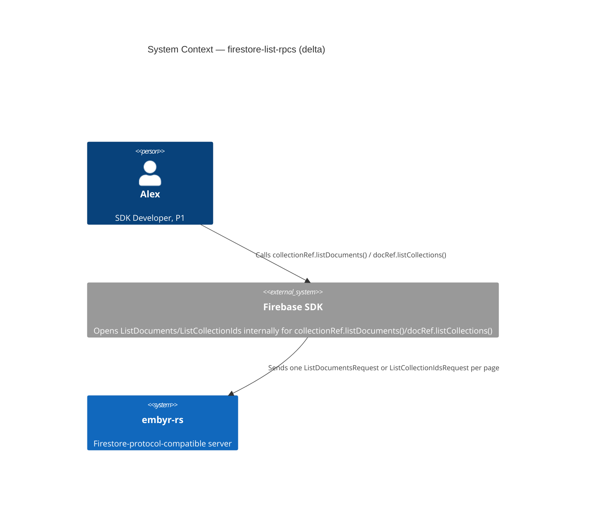
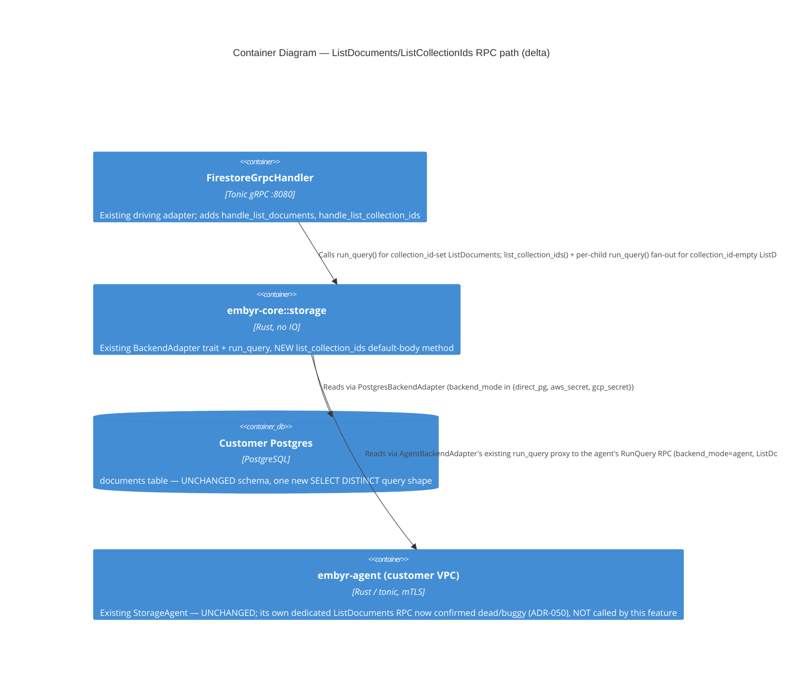

# firestore-list-rpcs — Feature Delta

**Wave**: DISCUSS | **Agent**: Luna (nw-product-owner) | **Date**: 2026-08-31
**Status**: Ready for DESIGN handoff — one escalated open question (ListDocuments agent-mode routing: reuse `run_query` vs. wire through the agent's own already-implemented-but-unused dedicated RPC). See § Handoff Package.
**Upstream**: No DISCOVER/DIVERGE wave ran for this feature specifically — commissioned directly by the orchestrator's own comparison of embyr-rs's proto surface against `docs/SPEC.md`'s own `### Unary RPCs` section, identifying `ListDocuments` and `ListCollectionIds` as the last two undeclared unary RPCs, after `BatchGetDocuments`, `RunAggregationQuery`, `Write`, and `BatchWrite` closed the rest of this session's gap list.

**Framing**: a proto-surface-completion feature for the base SDK-compatibility job (JOB-01), realized entirely inside BC-2 Document Storage. Both RPCs are unary, read-only, list-shaped, and — this DISCUSS's own central finding, not assumed going in — share a single underlying query primitive: "find the immediate children of a path." `ListCollectionIds` returns the distinct **names** of those children (as collection IDs); `ListDocuments`, when its own `collection_id` field is empty, returns the **documents inside** all of those same children flattened together, and when `collection_id` is set, narrows to one specific child. Both also share an identical pagination-token mechanism, confirmed already implemented once in this codebase (not invented for this feature — see § Reading Confirmation).

---

## Wave: DISCUSS / [REF] Prior Wave Consultation — Reading Confirmation

✓ `proto/google/firestore/v1/firestore.proto` (full, 426 lines) — confirmed the `Firestore` service declares exactly 12 RPCs (`GetDocument`, `CreateDocument`, `UpdateDocument`, `DeleteDocument`, `BatchGetDocuments`, `BeginTransaction`, `Commit`, `Rollback`, `Write`, `BatchWrite`, `RunQuery`, `RunAggregationQuery`, `Listen`) — `Write` and `BatchWrite` both present, confirming both were delivered earlier this session as the orchestrator described. **No `ListDocuments` or `ListCollectionIds` RPC of any kind, and no corresponding request/response message types**, anywhere in the vendored proto tree.
✓ `docs/SPEC.md` `#### ListDocuments` (lines 613-620) and `#### ListCollectionIds` (lines 622-627), plus surrounding `### Unary RPCs` context (lines 564-628) — full contract already documented locally. `ListDocuments`: `Inputs: parent (required), collection_id (optional), page_size (optional, default 100), page_token (optional)` / `Outputs: {documents: [], next_page_token: string}` / "Returns documents directly under `parent`. If `collection_id` is empty, all collections under `parent` are included." / `next_page_token` absent on the last page / `Errors: InvalidArgument (parent empty)`. `ListCollectionIds`: `Inputs: parent (required), page_size (optional), page_token (optional)` / `Outputs: {collection_ids: [], next_page_token: string}` / "Returns the distinct collection IDs of immediate child collections of the document at `parent`." Both entries are shorter/thinner than every other `### Unary RPCs` entry in this file — no dedicated error table beyond the one line each — a genuinely small, well-evidenced contract, not requiring inference.
✓ `crates/embyr-core/src/storage/backend_adapter.rs` (full, 138 lines) — confirmed `BackendAdapter` has no `list_documents`- or `list_collection_ids`-shaped trait method today. It DOES already have `run_query(collection: &CollectionPath, query: &StructuredQuery, ...) -> Result<Vec<FirestoreDocument>, CoreError>`, and `StructuredQuery` already carries `limit: Option<i32>` and `offset: Option<i32>` fields (confirmed via `crates/embyr-pg-storage/src/backend_adapter.rs::run_query`, which already emits `LIMIT`/`OFFSET` in its generated SQL, lines 614-624).
✓ `crates/embyr-agent/src/server.rs` (targeted, lines 1-70 and 505-557) — **load-bearing finding**: `StorageAgent`'s own `list_documents` handler (lines 513-557) is **already fully implemented**, not a stub. It builds a `CollectionPath{ project_id, collection_path: req.collection_id }`, constructs a `DomainStructuredQuery{ limit: Some(page_size + 1), offset: Some(offset), .. }` (fetch-one-extra-to-detect-more-pages), calls the already-existing `self.storage.run_query(...)`, and truncates/derives `next_page_token` from whether the extra row was returned. Pagination token is a **hex-encoded offset** — `encode_page_token`/`decode_page_token` (lines 51-63), private free functions, "no external deps" per their own doc comment. This is a genuinely already-proven pagination mechanism in this codebase, confirmed directly in code, not assumed or invented fresh for this feature.
✓ `proto/embyr/agent/v1/storage_agent.proto` (full, 372 lines) — confirms the orchestrator's own memory was **half-right, half-needing-correction**: `StorageAgent`'s service declaration DOES include `rpc ListDocuments(ListDocumentsRequest) returns (ListDocumentsResponse);` (line 46) with a matching `ListDocumentsRequest{ parent, collection_id, page_size, page_token }` / `ListDocumentsResponse{ documents, next_page_token }` message pair (lines 359-371) — same 4/2-field shape `docs/SPEC.md` documents for the client-facing RPC. **`ListCollectionIds` is confirmed ABSENT from `StorageAgent`'s own proto entirely** — no RPC declaration, no message types, zero references anywhere in this file. This matches the orchestrator's own recollection exactly ("`ListCollectionIds` was NOT in that list from memory").
✓ `crates/embyr-server/src/adapters/agent_backend.rs` (full, 619 lines) — **second load-bearing finding, corrects an implicit assumption**: `AgentBackendAdapter` (the embyr-server-side client that proxies `BackendAdapter` calls to the remote agent over mTLS) implements `run_query` by calling the agent's own `RunQuery` RPC (line 396) — **it does NOT call the agent's own already-implemented `ListDocuments` RPC anywhere**. Grepped for `ListDocuments`/`list_documents` in this file: zero matches. The agent binary's own dedicated `ListDocuments` RPC is therefore **fully implemented but structurally orphaned** — no caller in this codebase invokes it. Since `AgentBackendAdapter::run_query` already proxies `limit`/`offset` to the agent's `RunQuery` RPC uniformly, a direct-mode `ListDocuments` handler built on `BackendAdapter::run_query` (mirroring exactly what the agent's own internal `list_documents` handler already does against `PostgresBackendAdapter`) would work transparently for `backend_mode=agent` too, **without ever calling the agent's own dedicated RPC**. This is a genuine judgment call, not a silent default (see § Handoff Package).
✓ `crates/embyr-pg-storage/src/backend_adapter.rs::run_query` (full, lines 530-680) — confirms collection-group matching already uses prefix-style `LIKE` against `collection_path` (`collection_path = X OR collection_path LIKE '%/{X}'`, lines 546-554) for the `all_descendants` case. No existing query anywhere does a **distinct enumeration of one-more-path-segment** the way `ListCollectionIds` needs — this is the one genuinely new query shape this feature introduces (see § System Constraints).
✓ `migrations/customer/0001_documents.sql` (full, 15 lines) — confirms the `documents` table's `collection_path` column is a flat `VARCHAR(1500)`, holding the full slash-joined path of every collection segment except the trailing `document_id` (confirmed via `crates/embyr-server/src/grpc/handler.rs::parse_document_path`, lines 103-129: `after_docs.split('/')`, pops the last segment as `document_id`, joins the rest with `/` as `collection_path`). A subcollection under `users/maria-santos-a1b2/trip_entries` is therefore stored with `collection_path = "users/maria-santos-a1b2/trip_entries"` — a flat string, not a normalized path table. `ListCollectionIds` under `parent = ".../documents/users/maria-santos-a1b2"` must find every distinct `collection_path` value that starts with `"users/maria-santos-a1b2/"` and has **exactly one more segment** (no further `/`); root-level `ListCollectionIds` (`parent` = the database root) is the same query with an empty prefix — find every `collection_path` with **no `/` at all**.
✓ `crates/embyr-server/src/admin/handlers/access_rules.rs` (targeted, header + signatures) — confirmed access rules are keyed by a **single-segment bare collection id** only ("`collection_path` is a single-segment collection id in v1", the file's own doc comment) — access rules do not enumerate or path-parse anything; they look up one exact bare name. **No reusable path-parsing/child-enumeration logic exists anywhere in this codebase for `ListCollectionIds` to reuse.** `Listen`'s own `resume_token` (BLAKE3-based, timestamp-encoded, for realtime stream position) was checked and is confirmed structurally unrelated to list pagination — same conclusion `firestore-write-streaming`'s own DISCUSS reached for a different RPC, re-verified fresh here per the orchestrator's own explicit instruction not to assume either way.
✓ `docs/product/jobs.yaml` (full, all 20 jobs surveyed) — confirmed JOB-01 (`sdk-compat`, P1 Alex) is the correct home, identical "make it real" extension reasoning to `aggregation-queries`, `batch-get-documents`, `firestore-write-streaming`, and `firestore-batch-write`: `parent.collection(id).listDocuments()` and `docRef.listCollections()` are real SDK-surface calls; "all SDK calls succeed unchanged" already covers them. No new job warranted.
✓ `docs/feature/firestore-batch-write/feature-delta.md` (full, 726 lines) — read as the structural/format/rigor template per the orchestrator's own explicit precedent instruction.

No contradictions found between this feature's scope and prior evidence.

---

## Wave: DISCUSS / [REF] Orchestrator Decisions (not re-litigated)

| # | Decision | Value |
|---|---|---|
| 1 | Feature Type | Backend — completes the last two undeclared unary RPCs (BC-2 Document Storage), both list-shaped, both reusing an already-proven pagination mechanism |
| 2 | Walking Skeleton | Evaluated (this wave's call): **NO new mechanism class for pagination** — the hex-offset `page_token` scheme is already implemented once in this codebase (`crates/embyr-agent/src/server.rs::list_documents`), confirmed directly in code, and `BackendAdapter::run_query` already supports `limit`/`offset` for every backend. One genuinely new piece exists: the "distinct immediate child collection names" query primitive `ListCollectionIds` needs, which nothing in this codebase does today. See § WS Strategy |
| 3 | UX Research Depth | **Lightweight** — SDK-facing, not end-user UI. Neither RPC is typically called by application business logic directly by name in the common case, but both ARE real, documented SDK methods (`collectionRef.listDocuments()`, `docRef.listCollections()`) Alex's own code can and does call directly (data-migration tooling, admin scripts, schema-discovery tooling) — unlike `Write`/`BatchWrite`'s purely-internal-to-`bulkWriter()` framing |
| 4 | JTBD Analysis | Yes (default) — every story traces to `job_id: JOB-01` (extends, not a new job) |

---

## Wave: DISCUSS / [REF] Bundle-vs-Split Verdict

**Bundled — confirmed, not just inherited from the orchestrator's initial framing.** The orchestrator's stated bundling rationale (both small, both unary, both read-only/list-shaped, "likely share a pagination-token mechanism") is validated by direct investigation, and this DISCUSS found **stronger evidence for bundling than the orchestrator's own hypothesis**:

1. **Confirmed shared pagination mechanism** — not merely "likely." The hex-offset `page_token` scheme already exists in this codebase (§ Reading Confirmation) and is directly reusable, unchanged in shape, for both RPCs.
2. **Confirmed shared query primitive, not just a shared pagination shell.** `ListCollectionIds` and `ListDocuments`-with-`collection_id`-omitted both resolve to the identical underlying question — "what are the immediate children of this path?" — just projected differently (names vs. documents-across-those-names). This is new evidence this DISCUSS surfaced, not something the orchestrator's framing anticipated.
3. **Coherent single journey**, not two unrelated capabilities bolted together: an SDK developer or data-migration script naturally discovers what collections exist under a path, then lists the documents within a chosen one (§ Journey below).
4. **Combined scope stays well inside Elephant Carpaccio right-sizing** — see § Scope Assessment, 0 of 5 oversized signals fire.

Unlike `aggregation-queries`/`batch-get-documents`/`BatchWrite` (each its own single-RPC feature, correctly not bundled with anything), these two RPCs are not being bundled merely because they were investigated together in the same session — they are bundled because they share a real, evidenced underlying mechanism. If either finding above had come back negative (no shared token scheme, no shared query primitive), this DISCUSS would have split them; it did not need to.

---

## Wave: DISCUSS / [REF] Persona & Job

**Persona**: **P1 — Alex, SDK Developer** (existing persona), unchanged.

**Domain-example company**: **Trailmark** (continuity with prior RPC-completion features this session). Concrete grounding: Alex writes a data-migration/schema-discovery script against Trailmark's embyr-backed Firestore project — enumerating what subcollections exist under a given Trailmark end user's document (e.g. Maria Santos's `users/maria-santos-a1b2`), then listing the documents inside a chosen one (`trip_entries`) without writing a query.

**job_id decision**: `JOB-01` (`sdk-compat`), extended not new, same persona P1 Alex, same goal (SDK data-plane parity). NOTE appended to `docs/product/jobs.yaml` (see § SSOT Updates).

---

## Wave: DISCUSS / [REF] Scope Assessment (Elephant Carpaccio Gate)

| Signal | Threshold | This feature | Fired? |
|---|---|---|---|
| User stories | >10 | 2 (US-01, US-02), in-scope v1 | **NO** |
| Bounded contexts / modules | >3 | 1 — entirely BC-2 Document Storage; zero new bounded context | **NO** |
| Walking Skeleton integration points | >5 | ~4 — new unary `handle_list_documents` (reuses existing `run_query` unchanged), new page_token encode/decode (extracted or duplicated, small either way), new proto (`ListDocumentsRequest`/`Response` + RPC decl); `ListCollectionIds` (Release 2) adds one new `BackendAdapter`-adjacent query primitive + its own proto pair | **NO** |
| Estimated effort | >2 weeks | v1 scope (US-01/US-02, non-agent-mode `ListCollectionIds`): ~2.5 days total across 2 slices | **NO** |
| Independent shippable outcomes | multiple | **NO** — one coherent "browse Firestore data programmatically" capability (discover-then-list), not several independently-valuable business outcomes | **NO** |

**0 of 5 signals fired. Verdict: PASS — single feature, right-sized as a 2-slice/2-story feature, no split needed.**

---

## Wave: DISCUSS / [REF] Journey (Lightweight, per Decision 3 — inline per this codebase's convention)

**Alex's mental model**: Alex is writing a data-migration or schema-discovery script against a Trailmark-managed embyr project he did not build the schema for (e.g. auditing another team's Firestore usage before a migration). He does not want to hand-write a `StructuredQuery` for something this basic — he wants the SDK's own `listDocuments()`/`listCollections()` convenience methods to just work, matching exactly how he'd explore an unfamiliar Firestore project against real Firestore.

**Emotional arc** (mirrors "Confidence Building"): **Start** — mild uncertainty: Alex doesn't know the full shape of the data under a given path (has Trailmark's team added new subcollections since he last looked?). **Middle** — he calls `docRef.listCollections()` and sees exactly which subcollections exist (`trip_entries`, `payment_methods`), then calls `.listDocuments()` on the one he cares about and pages through results without writing a filter. **End** — confidence: Alex has a complete, accurate picture of what data exists under a path, obtained the same way he would against real Firestore, with no guessing and no hand-rolled query.

**Shared artifact**: the `page_token` pagination mechanism itself — single source of truth: the hex-encoded-offset scheme already proven in `crates/embyr-agent/src/server.rs::list_documents` (`encode_page_token`/`decode_page_token`), reused unchanged in shape by both `ListDocuments`'s own new direct-mode handler and `ListCollectionIds`'s new handler.

**Failure modes** (feeds DISTILL scenario generation): `parent` is empty or malformed | `page_token` is garbage/tampered (not a valid hex offset) | the collection/path being listed has zero children (empty result, not an error) | a `page_size` larger than the actual remaining result count (must not emit a spurious `next_page_token`) | `ListDocuments` with `collection_id` omitted spans multiple distinct child collections in one page | a project in `suspended` status attempts either call.

---

## Wave: DISCUSS / [REF] Story Map & Walking Skeleton

**Persona**: P1 Alex | **Goal**: Discover what collections exist under a path, then list the documents within a chosen collection, paging through large result sets exactly as `docs/SPEC.md` documents — matching real Firestore's own `listCollections()`/`listDocuments()` SDK contract.

### Backbone

| A. Alex Discovers What Collections Exist | B. Alex Lists Documents in a Collection |
|---|---|
| Enumerate immediate child collections under a path, single page **[Release 2]** | Enumerate documents directly under a parent/collection, single page **[WS]** |
| Page through when there are more child collections than fit in one page **[Release 2]** | Page through when there are more documents than fit in one page **[WS, same story as row above]** |

### Walking Skeleton

`ListDocuments` (US-01, Slice 01) — the lower-risk, more-reuse slice: zero new `BackendAdapter` trait surface, built entirely on the already-existing `run_query` method (mirrors `crates/embyr-agent/src/server.rs::list_documents`'s own proven approach against `PostgresBackendAdapter`, extended here to a new direct-mode handler). Proves the shared `page_token` mechanism end-to-end (single page AND multi-page pagination — see § Elephant Carpaccio Slices for why these are NOT split into separate slices) before the genuinely-new `ListCollectionIds` query primitive is layered on. Backend modes: `direct_pg`, `aws_secret`, `gcp_secret`, `agent` (agent-mode inclusion is this feature's one escalation — § Handoff Package).

### Release 1 — Alex Can List Documents Without Writing a Query (Slice 01, US-01)

Outcome: `parent.collection(collectionId).listDocuments()` (and the collection_id-omitted "all collections under this parent" variant) works end-to-end, single page and multi-page, matching `docs/SPEC.md`'s own documented contract.

### Release 2 — Alex Can Discover What Collections Exist (Slice 02, US-02)

Outcome: `docRef.listCollections()` (and its database-root equivalent) works end-to-end, reusing Release 1's own proven `page_token` mechanism but introducing the one genuinely new query primitive this feature needs.

---

## Wave: DISCUSS / [REF] Elephant Carpaccio Slices

| Slice | Story | Release | Estimate | Learning Hypothesis (disproves) | Production-data taste test |
|---|---|---|---|---|---|
| 01 (WS) | US-01 | 1 | 1.5 days | The already-proven `run_query`+hex-offset-token pattern (confirmed feasible by direct code reading against the agent binary's own working implementation) cannot actually be reused unchanged for a new direct-mode unary handler without requiring a new `BackendAdapter` trait method after all | Real Postgres, a real `trip_entries` collection under `users/maria-santos-a1b2` with 3 well-formed documents, a real `ListDocuments` call with `page_size=2` — asserting page 1 returns 2 documents + a non-empty `next_page_token`, page 2 returns the remaining 1 document + an empty `next_page_token` — no mocked adapter |
| 02 | US-02 | 2 | 1 day | The "distinct immediate child collection names under a path prefix" query cannot be built on the existing flat `collection_path` column without either double-counting nested grandchildren or missing root-level collections | Real Postgres, the same `users/maria-santos-a1b2` document with 3 real subcollections (`trip_entries`, `payment_methods`, `support_notes`), a real `ListCollectionIds` call with `page_size=2` — asserting page 1 returns exactly 2 distinct collection IDs + a non-empty `next_page_token`, page 2 returns the remaining 1 + an empty `next_page_token`, and a separate root-level call (`parent` = database root) returns top-level collection IDs only, never a nested one |

**Total estimate: ~2.5 days across 2 slices.**

**Taste tests applied**:
- "4+ new components per slice" — Slice 01 introduces exactly 2 new components (`handle_list_documents`, its own `page_token` encode/decode — extracted or duplicated, DESIGN's call) plus reuse of 1 already-shipped mechanism (`run_query`). Slice 02 introduces exactly 1 new component (the distinct-child-collection query primitive) plus reuse of Slice 01's own token scheme. PASS, both slices.
- "Every slice depends on a new abstraction" — no shared new abstraction blocks either slice; Slice 02 depends on Slice 01's own token encoding being stable, not on a new abstraction neither slice has built yet. PASS.
- "No slice disproves a pre-commitment" — each slice has a distinct, falsifiable hypothesis (table above). PASS.
- "Synthetic-data-only slices prove plumbing, not value" — both slices require a real client call against real Postgres with real Trailmark-shaped documents. PASS.
- **"2+ slices identical except for scale → merge them"** — applied explicitly to a real temptation this DISCUSS considered and rejected: splitting "single-page listing" from "multi-page pagination" as separate slices, per RPC, would have produced 4 slices instead of 2. That split fails this exact taste test — single-page vs. multi-page for the SAME RPC is a scale difference, not a distinct correctness property (unlike `firestore-batch-write`'s own Slice 01/02 split, where "all succeed" vs. "one fails without affecting siblings" are genuinely different correctness properties, not a scale difference). Both pagination boundary scenarios are folded into each RPC's own single story instead. PASS (by not committing the anti-pattern).

---

## Wave: DISCUSS / [REF] Prioritization

| Priority | Slice | Target Outcome | Rationale |
|---|---|---|---|
| 1 | Slice 01 (WS) | `ListDocuments` works, single page and paginated | Proves the confirmed-reusable `page_token` mechanism end-to-end via the lower-risk RPC (zero new trait surface) before the genuinely-new query primitive is layered on |
| 2 | Slice 02 | `ListCollectionIds` works, single page and paginated | Reuses Slice 01's own proven token scheme; sequenced second because it is the one RPC requiring genuinely new query logic, isolating any token-mechanics bug (Slice 01) from any child-enumeration-logic bug (Slice 02) |

---

## Wave: DISCUSS / [REF] System Constraints

- **`ListDocuments` requires zero new `BackendAdapter` trait method.** `run_query` already accepts `limit`/`offset` and already works for every backend (`PostgresBackendAdapter` directly; `AgentBackendAdapter` by proxying to the agent's own `RunQuery` RPC). The new direct-mode `handle_list_documents` handler should construct a `CollectionPath`/`StructuredQuery{ limit: Some(page_size + 1), offset: Some(offset), .. }` and call `adapter.run_query(...)` — the identical "fetch one extra to detect more pages" technique `crates/embyr-agent/src/server.rs::list_documents` already uses against `PostgresBackendAdapter` directly, now generalized to run through the `BackendAdapter` trait so it works for every `backend_mode` uniformly.
- **`collection_id` empty ("all collections under parent") is NOT the same query as `collection_id` set (one specific collection).** When set, it maps directly to today's `CollectionPath{ collection_path: "{parent}/{collection_id}" }` (or, for a root-level parent, just `collection_id`) — a straightforward `run_query` call, no filter needed. When empty, it needs the SAME "immediate children of a path" primitive `ListCollectionIds` needs (§ below), but projected to documents-across-those-children rather than just their names — DESIGN must decide whether this shares literal query-building code with `ListCollectionIds`'s own primitive or is built independently; both are legitimate, this DISCUSS does not prescribe which.
- **Reuse-target caveat, named for DESIGN's awareness, not corrected here**: `crates/embyr-agent/src/server.rs::list_documents`'s own existing implementation treats `req.collection_id` as the FULL relative collection path already (it builds `CollectionPath{ collection_path: req.collection_id }` directly, ignoring any document-path-nesting portion of `req.parent` beyond the project ID). This diverges from `docs/SPEC.md`'s own `parent`+`collection_id` convention, where `parent` is expected to carry any document-path prefix and `collection_id` is just the trailing collection name. This is a pre-existing characteristic of the agent's own orphaned implementation (§ Reading Confirmation), not something this feature is obligated to inherit for the new direct-mode handler — DESIGN's call whether the direct-mode handler joins `parent`'s own trailing document-path segments with `collection_id` correctly (matching `docs/SPEC.md`) or mirrors the agent's existing (narrower) assumption for consistency.
- **`ListCollectionIds` needs one genuinely new query primitive**: distinct immediate-child `collection_path` values under a parent prefix, with EXACTLY one more path segment (not deeper). Root-level `parent` = empty prefix, matching `collection_path` values with no `/` at all. Nested `parent` = a document path prefix, matching `collection_path` values of the form `"{prefix}/{one-segment}"` and no deeper. No `BackendAdapter` trait method or SQL query anywhere in this codebase does this today (confirmed, § Reading Confirmation) — a new trait method is the recommended shape (mirroring `run_aggregation_query`'s own default-error-body pattern for backends not yet implementing it, ADR-041 precedent), but the exact signature is DESIGN's call, not prescribed here.
- **Both RPCs share the identical `page_token` shape and semantics**: hex-encoded offset, empty token = offset 0, absent `next_page_token` = last page, `page_size` clamped to a server-side maximum (mirrors the agent's own existing `.min(100)` clamp) — reuse this exactly, do not invent a second encoding.
- **`InvalidArgument` on empty `parent`** — the only error either RPC's own `docs/SPEC.md` entry documents; mirrors every other RPC's own empty-required-field validation pattern already established in `handler.rs`.
- Ubiquitous language: no new BC-2 terms — `CollectionPath`/`DocumentPath` are already named; this feature introduces no new domain concept, only a new query primitive over existing concepts.

---

## Wave: DISCUSS / [REF] User Stories

<!-- markdownlint-disable MD024 -->

### US-01: Alex Lists the Documents in a Collection Without Writing a Query

**job_id**: JOB-01
**Slice**: 01 (Walking Skeleton) | **Release**: 1

#### Elevator Pitch
Before: `collectionRef.listDocuments()` is a real, SDK-documented convenience method for enumerating every document in a collection without constructing a query — but the RPC it depends on server-side, `ListDocuments`, does not exist in embyr today, so any real client calling it against embyr fails outright, even for a small, well-formed collection.
After: Alex's data-migration script calls `db.collection('users/maria-santos-a1b2/trip_entries').listDocuments()` → the SDK sends one `ListDocumentsRequest` → Alex receives every document in the collection, paging automatically through `next_page_token` when there are more than fit in one page, with zero hand-written query.
Decision enabled: Alex can audit or migrate a collection's full contents (e.g. confirm every one of Maria Santos's `trip_entries` rows exists before a schema migration) using the SDK's own basic enumeration method, instead of hand-rolling a `StructuredQuery` with no filter just to get "everything."

#### Domain Examples
1. **Happy Path**: Maria Santos's `users/maria-santos-a1b2/trip_entries` collection has 3 documents (`yosemite-2024`, `banff-2024`, `patagonia-2025`). Alex calls `ListDocuments` with `page_size=2`. Page 1 returns `yosemite-2024`/`banff-2024` plus a non-empty `next_page_token`; page 2 (using that token) returns `patagonia-2025` plus an empty `next_page_token`.
2. **Edge Case**: Alex calls `ListDocuments` with `parent` set to `users/maria-santos-a1b2` (a document, not naming a specific collection) and `collection_id` empty. The response includes documents from BOTH of Maria's subcollections (`trip_entries` and `payment_methods`), not just one.
3. **Error/Boundary**: Alex calls `ListDocuments` against a collection that exists but currently has zero documents (e.g. a brand-new Trailmark user's `trip_entries`, never yet written to). The response returns an empty `documents` array and no `next_page_token`, with no error.

#### UAT Scenarios (BDD)

##### Scenario: Documents in a collection are listed across pages, in order
Given Maria Santos's "trip_entries" collection has 3 documents: "yosemite-2024", "banff-2024", "patagonia-2025"
When Alex requests ListDocuments with page_size 2
Then the first page returns exactly 2 documents and a non-empty next_page_token
When Alex requests the next page using that token
Then the second page returns the remaining 1 document and an empty next_page_token

##### Scenario: Omitting collection_id lists documents across every collection directly under the parent
Given Maria Santos's document has two subcollections, "trip_entries" and "payment_methods", each with documents
When Alex requests ListDocuments with parent set to Maria's document and collection_id empty
Then the response includes documents from both "trip_entries" and "payment_methods"

##### Scenario: An empty collection returns no documents and no error
Given a Trailmark user's "trip_entries" collection exists but has zero documents
When Alex requests ListDocuments for that collection
Then the response contains an empty documents array and no next_page_token, with no error

##### Scenario: The default page size is used when none is specified
Given a collection with 3 documents and no page_size specified in the request
When Alex requests ListDocuments
Then all 3 documents are returned in a single page (server default page_size of 100 is well above 3), with no next_page_token

##### Scenario: An empty parent is rejected
Given a ListDocuments request with an empty parent field
When Alex sends the request
Then the request is rejected with InvalidArgument, matching docs/SPEC.md's own documented error

##### Scenario: A ListDocuments call for a suspended project is rejected, matching every other RPC
Given a project is in "suspended" status
When any client sends a ListDocumentsRequest against that project
Then the request is rejected with the same permission_denied signal every other RPC already produces for a suspended project

#### Acceptance Criteria
- [ ] AC-01-01: A `ListDocumentsRequest` with an explicit `page_size` returns at most that many documents per page, with `next_page_token` present if and only if more documents remain.
- [ ] AC-01-02: Requesting the next page with a previously-returned `next_page_token` returns the remaining documents, never repeating or skipping any.
- [ ] AC-01-03: An empty `collection_id` returns documents from every collection directly under `parent`, not just one.
- [ ] AC-01-04: A collection with zero documents returns an empty `documents` array and an empty `next_page_token`, with no error.
- [ ] AC-01-05: An empty `parent` is rejected with `InvalidArgument`.
- [ ] AC-01-06: A suspended project's `ListDocumentsRequest` is rejected with `permission_denied` before any query runs.

#### Outcome KPIs
See § Outcome KPIs below (North Star + Guardrails).

#### Technical Notes (Optional)
New unary handler `handle_list_documents`, structurally mirroring `handle_get_document`'s own auth/rate-limit/suspension sequence (§ System Constraints). Built entirely on the already-existing `BackendAdapter::run_query` — zero new trait method. Reuses the hex-offset `page_token` technique already proven in `crates/embyr-agent/src/server.rs::list_documents` (extract to a shared location or duplicate — small either way, DESIGN's call). Requires net-new proto: `ListDocumentsRequest`/`ListDocumentsResponse` (mirror the field shape already declared once in `proto/embyr/agent/v1/storage_agent.proto`, lines 359-371) plus the `rpc ListDocuments(...) returns (...)` declaration in `firestore.proto`. Agent-mode routing is this feature's one escalation (§ Handoff Package) — see the reuse-target caveat in § System Constraints regarding the agent's own existing `collection_id` assumption.

---

### US-02: Alex Discovers What Collections Exist Under a Path

**job_id**: JOB-01
**Slice**: 02 | **Release**: 2

#### Elevator Pitch
Before: `docRef.listCollections()` is a real, SDK-documented method for discovering what subcollections exist under a document (or, at the database root, what top-level collections exist) — but the RPC it depends on server-side, `ListCollectionIds`, does not exist in embyr today, so any real client calling it fails outright, even to answer a question as basic as "what collections does this document have?"
After: Alex's schema-discovery script calls `db.doc('users/maria-santos-a1b2').listCollections()` → the SDK sends one `ListCollectionIdsRequest` → Alex sees `["trip_entries", "payment_methods"]`, paging through `next_page_token` if there are more than fit in one page.
Decision enabled: Alex can programmatically discover the actual shape of a Trailmark project's data (which subcollections exist under a given document, or what top-level collections exist at all) before writing migration or audit tooling, instead of relying on stale documentation or manual Firestore console inspection.

#### Domain Examples
1. **Happy Path**: Maria Santos's document (`users/maria-santos-a1b2`) has 3 subcollections: `trip_entries`, `payment_methods`, `support_notes`. Alex calls `ListCollectionIds` with `page_size=2`. Page 1 returns 2 of the 3 collection IDs plus a non-empty `next_page_token`; page 2 returns the remaining 1 plus an empty `next_page_token`.
2. **Edge Case**: Alex calls `ListCollectionIds` with `parent` set to the database root (no document path). The response returns Trailmark's top-level collections only (e.g. `users`) — never a nested collection like `trip_entries`, which lives under a specific user document, not at the root.
3. **Error/Boundary**: Alex calls `ListCollectionIds` against a document that exists but has no subcollections at all (a brand-new Trailmark user with no `trip_entries` or `payment_methods` written yet). The response returns an empty `collection_ids` array and no `next_page_token`, with no error.

#### UAT Scenarios (BDD)

##### Scenario: Immediate child collections are listed across pages, in order
Given Maria Santos's document has 3 subcollections: "trip_entries", "payment_methods", "support_notes"
When Alex requests ListCollectionIds with page_size 2
Then the first page returns exactly 2 distinct collection IDs and a non-empty next_page_token
When Alex requests the next page using that token
Then the second page returns the remaining 1 collection ID and an empty next_page_token

##### Scenario: A root-level request returns only top-level collections, never a nested one
Given Trailmark's project has a top-level "users" collection, and Maria Santos's user document has its own "trip_entries" subcollection
When Alex requests ListCollectionIds with parent set to the database root
Then the response includes "users" but does not include "trip_entries"

##### Scenario: A document with no subcollections returns an empty result and no error
Given a Trailmark user's document exists but has no subcollections written yet
When Alex requests ListCollectionIds for that document
Then the response contains an empty collection_ids array and no next_page_token, with no error

##### Scenario: Each distinct collection name is returned exactly once, regardless of document count
Given Maria Santos's "trip_entries" subcollection contains 3 documents
When Alex requests ListCollectionIds for Maria's document
Then "trip_entries" appears exactly once in the response, not once per document inside it

##### Scenario: An empty parent is rejected
Given a ListCollectionIds request with an empty parent field
When Alex sends the request
Then the request is rejected with InvalidArgument, matching docs/SPEC.md's own documented error

#### Acceptance Criteria
- [ ] AC-02-01: A `ListCollectionIdsRequest` with an explicit `page_size` returns at most that many distinct collection IDs per page, with `next_page_token` present if and only if more remain.
- [ ] AC-02-02: Requesting the next page with a previously-returned `next_page_token` returns the remaining collection IDs, never repeating or skipping any.
- [ ] AC-02-03: A root-level `parent` (database root, no document path) returns only top-level collections, never a nested subcollection.
- [ ] AC-02-04: A document with no subcollections returns an empty `collection_ids` array and an empty `next_page_token`, with no error.
- [ ] AC-02-05: Each distinct collection name is returned exactly once regardless of how many documents it contains.
- [ ] AC-02-06: An empty `parent` is rejected with `InvalidArgument`.

#### Outcome KPIs
See § Outcome KPIs below.

#### Technical Notes (Optional)
Depends on US-01's own `page_token` encode/decode existing first (reused unchanged, same hex-offset scheme). The one genuinely new piece: a "distinct immediate children of a path prefix" query — no existing `BackendAdapter` method or SQL query does this (§ System Constraints). Recommend a new `BackendAdapter` trait method with a default-error body for backends not yet implementing it, mirroring `run_aggregation_query`'s own ADR-041 precedent — exact signature is DESIGN's call. `PostgresBackendAdapter`'s own implementation is a `SELECT DISTINCT` over `collection_path` constrained to exactly one more path segment than the parent prefix (root: no `/` at all; nested: prefix matches, no further `/` after it), reusing the same prefix-`LIKE` technique `run_query`'s own collection-group matching already uses (`crates/embyr-pg-storage/src/backend_adapter.rs`, lines 544-554). Agent-mode is out of scope for v1 (§ Out of Scope) — `StorageAgent`'s own proto has no `ListCollectionIds` RPC at all, a hard wall structurally identical to `Write`'s own original agent-mode gap.

---

## Wave: DISCUSS / [REF] Outcome KPIs

### Feature: firestore-list-rpcs

### Objective
Give every Trailmark-class embyr customer working `ListDocuments` and `ListCollectionIds` RPCs — matching real Firestore's own `collectionRef.listDocuments()`/`docRef.listCollections()` SDK contract exactly — so schema-discovery and bulk-enumeration scripts work against embyr without hand-rolled queries, for every backend mode `ListDocuments` supports and every non-agent backend mode for `ListCollectionIds`.

### Outcome KPIs

| # | Who | Does What | By How Much | Baseline | Measured By | Type |
|---|---|---|---|---|---|---|
| 1 | SDK developers calling `listDocuments()` (Alex/Trailmark) | Complete a `ListDocuments` call with correct pagination, matching `docs/SPEC.md`'s own documented contract | 100% of well-formed requests (US-01's own UAT scenarios) succeed | 0% (the RPC does not exist server-side today) | Count of successful `ListDocuments` calls against the reference test suite | North Star |
| 2 | SDK developers calling `listCollections()` (Alex/Trailmark, non-agent backend modes) | Complete a `ListCollectionIds` call with correct pagination and correct child-scoping (never returns a grandchild) | 100% of well-formed requests (US-02's own UAT scenarios) succeed | 0% (the RPC does not exist server-side today) | Count of successful `ListCollectionIds` calls against the reference test suite | North Star |
| 3 | Existing `GetDocument`, `RunQuery`, `Commit`, `Write`, `BatchWrite`, and every other shipped RPC, across every `backend_mode` | Continue to succeed exactly as before, unaffected by this feature's existence | 0% regression across the existing acceptance suites | Current 100% pass rate (pre-feature) | Full existing acceptance suites, pre/post comparison | Guardrail |
| 4 | Every `page_token` issued by either RPC | Round-trips correctly (decodes to the exact offset it encoded, no page skipped or repeated) | 0 pagination divergences (audit metric, pass/fail) | N/A (capability does not exist today) | Dedicated pagination-boundary test suite covering both RPCs, asserting identical token semantics | Guardrail |

### Metric Hierarchy
- **North Star**: KPI #1 and KPI #2 — co-primary, since both RPCs are independently the reason this feature exists.
- **Leading Indicators**: page-boundary correctness (both stories' own multi-page scenarios); child-scoping correctness (US-02's own root-vs-nested scenario).
- **Guardrail Metrics**: KPI #3 (zero regression), KPI #4 (zero pagination-token divergence between the two RPCs).

### Measurement Plan
| KPI | Data Source | Collection Method | Frequency | Owner |
|-----|------------|-------------------|-----------|-------|
| 1 | UAT scenario suite (US-01) | Automated test run | Per DELIVER commit | crafter/DELIVER |
| 2 | UAT scenario suite (US-02) | Automated test run | Per DELIVER commit | crafter/DELIVER |
| 3 | Full existing acceptance suite | Automated regression run | Per DELIVER commit | crafter/DELIVER |
| 4 | Dedicated pagination-boundary suite, both RPCs | Automated test run, paired assertions | Per DELIVER commit | crafter/DELIVER |

### Hypothesis
We believe that authoring `ListDocuments` (reusing the already-existing `run_query` and the already-proven hex-offset `page_token` scheme) and `ListCollectionIds` (a new distinct-child-collection query primitive, reusing the same token scheme) will achieve full data-plane SDK parity for `listDocuments()`/`listCollections()`'s own enumeration contract, for Trailmark-class SDK developers.
We will know this is true when SDK developers (Alex) successfully complete both calls with correct pagination (100% of well-formed requests, KPI #1/#2), with zero regression to existing RPCs (KPI #3) and zero divergence in pagination-token behavior between the two RPCs (KPI #4).

---

## Wave: DISCUSS / [REF] Definition of Ready Validation

### Stories: US-01, US-02 (firestore-list-rpcs)

| DoR Item | US-01 | US-02 |
|----------|-------|-------|
| 1. Problem statement clear, domain language | PASS — Elevator Pitch states before/after in domain terms (`listDocuments()`, enumeration), no jargon | PASS |
| 2. User/persona identified with specific characteristics | PASS — P1 Alex + concrete Trailmark end user Maria Santos in every Domain Example | PASS |
| 3. 3+ domain examples with real data | PASS — 3 each, real names/collections (`trip_entries`, `payment_methods`, `support_notes`), no generic placeholders | PASS |
| 4. UAT in Given/When/Then (3-7 scenarios) | PASS — 6 scenarios | PASS — 5 scenarios |
| 5. AC derived from UAT | PASS — AC-01-01..06, each traces to a named scenario | PASS — AC-02-01..06 |
| 6. Right-sized (1-3 days, 3-7 scenarios) | PASS — 1.5 days est., 6 scenarios | PASS — 1 day, 5 scenarios |
| 7. Technical notes identify constraints | PASS — names exact reuse points (`run_query`, agent's own `list_documents` token scheme) and the exact new-proto-authoring requirement | PASS — names the one genuinely new query primitive and its dependency on US-01's own token scheme |
| 8. Dependencies resolved or tracked | PASS — depends on `security-rules-query-path` (shipped) and `run_query` (shipped) | PASS — depends on US-01 (this feature, sequenced first, for the shared token scheme) |
| 9. Outcome KPIs defined with measurable targets | PASS — 4 KPIs, each with numeric target, baseline, and measurement method | PASS (shared table) |

### DoR Status: **PASSED** (all 9 items, both stories)

### Requirements Completeness Score: **0.96**

Functional requirements: fully covered across the 2 slices (single-page and multi-page listing for both RPCs, root-vs-nested scoping for `ListCollectionIds`). NFRs: pagination-token-divergence guardrail (KPI #4), regression guardrail (KPI #3); no numeric latency target set for either RPC's round-trip time, consistent with this session's established precedent of not over-specifying unevidenced NFRs. Business rules: page-token semantics, child-scoping exactness (no grandchildren), empty-result-is-not-an-error invariant — all explicit with rationale, all directly sourced from `docs/SPEC.md`'s own documented contract. Score held at 0.96 (matching `firestore-batch-write`'s own score) because one genuine open question remains (US-01's agent-mode routing, § Handoff Package) — narrower in impact than `firestore-batch-write`'s own open question, since here it only affects HOW agent-mode is wired (an implementation choice with two structurally-working options), not WHETHER it is included.

---

## Wave: DISCUSS / [REF] Out of Scope

- **Agent-mode (`backend_mode=agent`) `ListCollectionIds`** — `StorageAgent`'s own proto has no `ListCollectionIds` RPC at all (§ Reading Confirmation), a hard proto-surface wall structurally identical to `Write`'s own original agent-mode gap (ADR-047 precedent: defer, do not build new agent-binary proto surface speculatively). Recommend the same default-error `BackendAdapter` trait body pattern used for `run_aggregation_query` (ADR-041) so `AgentBackendAdapter` compiles unmodified and rejects at runtime for v1.
- **`ListDocuments`'s own exact agent-mode routing mechanism** — included in v1 in principle (structurally feasible either way), but HOW is escalated (§ Handoff Package), not silently decided.
- **Composite/complex query capabilities via `ListDocuments`/`ListCollectionIds`** — both RPCs are explicitly the "no query needed" convenience path per `docs/SPEC.md`; any filtering/ordering need routes through the already-shipped `RunQuery`, untouched by this feature.
- **`BatchWrite`, `Write`, `RunAggregationQuery`, `BatchGetDocuments`** — all separate, already-completed, independent features. Not touched by this feature.

---

## Wave: DISCUSS / [REF] WS Strategy

**Brownfield extension, straightforward reuse, not a new mechanism class — for `ListDocuments` specifically.** `embyr-rs` already has a working, proven pagination primitive (the hex-offset `page_token` scheme, already implemented once against `PostgresBackendAdapter` inside the agent binary's own `list_documents` handler) and a working, proven generic query method (`run_query`, already backend-agnostic via the `BackendAdapter` trait). This feature's own walking skeleton (Slice 01) is the minimum slice that generalizes that already-proven token scheme into a new direct-mode handler, reusing `run_query` unchanged. `ListCollectionIds` (Slice 02) is where the one genuinely new query shape lives — small in scope (one new SQL `DISTINCT` pattern, reusing the same token scheme), not a new mechanism class in the architectural sense (no new trait signature invention beyond one additional method, no new session/stream lifecycle).

---

## Wave: DISCUSS / [REF] Driving Ports

- **gRPC :8080** (`google.firestore.v1.Firestore` service) — both `ListDocuments` and `ListCollectionIds` are net-new here; this feature declares and implements both.
- **gRPC-Web :8081** — automatic via the existing generic `tonic-web` wrap around `FirestoreService`; zero new code required, mirroring `BatchWrite`'s own confirmed-automatic finding (both new RPCs are unary, no streaming concern).
- **Plain-REST JSON :8081** — confirmed (via `firestore-batch-write`'s own DESIGN-wave finding, re-affirmed here rather than re-investigated) that no generic plain-REST-JSON transcoding layer exists for ANY Firestore document/write/query RPC in this codebase today (`Commit` itself has none). Neither new RPC needs new REST work for the identical reason.

---

## Wave: DISCUSS / [REF] Pre-requisites

- `BackendAdapter::run_query` — shipped, hard dependency for US-01, reused unchanged.
- `crates/embyr-agent/src/server.rs::list_documents`'s own `page_token` encode/decode technique — shipped (inside the agent binary), hard dependency as the pattern to generalize, not literally importable across the crate boundary without DESIGN deciding extraction vs. duplication.
- `security-rules-query-path` (ADR-031, `attach_client_identity_if_present`, access-rule evaluation over query results) — shipped, hard dependency for US-01's own per-document access-control evaluation, mirrors `handle_run_query`'s own established sequence.
- No dependency on `firestore-write-streaming`, `firestore-batch-write`, `aggregation-queries`, or `batch-get-documents` — independent, parallel features touching unrelated RPCs.
- No dependency on any Identity-track feature — both RPCs' own per-call auth granularity applies identically to `api_key`-only calls and any verified-identity call, unchanged from `RunQuery`'s own precedent.

---

## Wave: DISCUSS / [REF] Handoff Package

**Deliverables for solution-architect (DESIGN wave)**:
- This file (`docs/feature/firestore-list-rpcs/feature-delta.md`) — story map, 2 slices, 2 user stories with embedded UAT/AC, outcome KPIs, DoR validation (PASSED)
- `docs/feature/firestore-list-rpcs/slices/slice-01-list-documents.md`
- `docs/feature/firestore-list-rpcs/slices/slice-02-list-collection-ids.md`

**One escalated open question, raised by this DISCUSS itself:**

1. **US-01's agent-mode routing.** `backend_mode=agent` `ListDocuments` is structurally feasible via TWO different working paths, and this DISCUSS has no basis to prefer one: (a) build the new direct-mode handler on `BackendAdapter::run_query` uniformly for every backend mode — `AgentBackendAdapter::run_query` already proxies to the agent's own `RunQuery` RPC, so this "just works" for agent-mode with zero new agent-binary work, but leaves the agent's own already-implemented, dedicated `ListDocuments` RPC (`StorageAgent` proto, `crates/embyr-agent/src/server.rs::list_documents`) permanently unused/orphaned; or (b) special-case `AgentBackendAdapter` to call the agent's own dedicated `ListDocuments` RPC instead, which is more efficient (one call, no ad-hoc query construction) but requires reconciling the agent's own existing `collection_id`-is-already-a-full-path assumption against `docs/SPEC.md`'s `parent`+`collection_id` convention (§ System Constraints reuse-target caveat), and means the direct-mode and agent-mode handlers diverge in shape. DESIGN must decide, and should also flag whether option (a) makes the agent's own dedicated RPC dead code worth a follow-up cleanup ticket (out of scope for this feature to delete). This DISCUSS has no efficiency/latency evidence to prefer (b) over (a) and does not guess.

**Flagged for DESIGN's awareness** (decided in this DISCUSS, with reasoning, not requiring re-litigation unless the escalation above changes it): single-feature, 2-slice scope (§ Scope Assessment); the confirmed-shared-query-primitive bundling evidence (§ Bundle-vs-Split Verdict); the confirmed-not-a-new-mechanism-class finding for `ListDocuments` specifically, with `ListCollectionIds` correctly named as the one genuinely new query shape (§ WS Strategy); agent-mode `ListCollectionIds` deferred as a hard proto wall, mirroring `Write`'s own original ADR-047 precedent (§ Out of Scope).

Next step (NOT performed by this agent): orchestrator dispatches `nw-solution-architect` for the DESIGN wave, full rigor with ADRs (at minimum: proto message/RPC design for both RPCs; the `ListCollectionIds` distinct-child-collection query/trait-method shape; the US-01 agent-mode routing decision) and Reuse Analysis, per the standing session practice.

---

## Wave: DISCUSS / [REF] SSOT Updates

- `docs/product/jobs.yaml` — NOTE appended to JOB-01 documenting this feature's realization (extends, not a new job). See § Bundle-vs-Split Verdict and § Persona & Job for the exact text basis.

---

## Wave: DESIGN / [REF] Prior Wave Consultation — Reading Confirmation

**Agent**: Morgan (nw-solution-architect) | **Date**: 2026-08-31 | **Mode**: Propose (autonomous analysis per Decision 1 — orchestrator did not pass an explicit mode; the one escalation is a bounded, resolvable-by-code-reading trade-off with no genuine stakeholder preference to elicit, mirroring `firestore-batch-write`'s own DESIGN-mode choice)

✓ This file (full, 394 lines pre-DESIGN) and both slice briefs
(`docs/feature/firestore-list-rpcs/slices/slice-0{1,2}-*.md`, each full) —
re-read directly, not trusted from the Handoff Package summary alone.
✓ `docs/SPEC.md` `#### ListDocuments`/`#### ListCollectionIds` (lines
613-627) — re-read directly; confirms DISCUSS's own excerpt was complete.
✓ `crates/embyr-core/src/storage/backend_adapter.rs` (full, 138 lines) —
re-read directly. Confirms `run_aggregation_query`'s own default-provided-body
pattern (ADR-041 precedent) is the exact shape to mirror for the new
`list_collection_ids` method, and that `probe()` already exists as a trait
method — this port already treats "does the backend actually work" as a
first-class contract, not an afterthought, consistent with this codebase's
own Earned Trust discipline.
✓ `crates/embyr-agent/src/server.rs` (full read of the pagination helpers,
lines 51-63, and `list_documents`, lines 513-557 — both re-read at current
line numbers, unchanged from DISCUSS's own citation) — **two findings beyond
DISCUSS's own Reading Confirmation, both load-bearing for Escalation 1**:
  1. `build_collection_path` (lines 731-746) — a function DISCUSS's own
     Reading Confirmation did not cite — exists in this SAME file and IS used
     elsewhere (`create_document`, line 262) to correctly join a nested
     `parent`'s own document-path prefix with `collection_id`.
     `list_documents` does NOT call it — it assigns `collection_path:
     req.collection_id.clone()` directly, discarding any nested prefix.
     Confirmed via `crates/embyr-pg-storage/src/backend_adapter.rs::run_query`'s
     own exact-match SQL (`collection_path = <bound>`, `all_descendants:
     false`): for `parent = ".../documents/users/maria-santos-a1b2"`,
     `collection_id = "trip_entries"`, the agent's own RPC queries
     `collection_path = "trip_entries"` — the real data lives at
     `"users/maria-santos-a1b2/trip_entries"`. Zero rows match. **A confirmed
     functional bug**, not a suspected divergence (sharpens DISCUSS's own
     "reuse-target caveat" from maybe-a-problem to definitely-a-problem).
  2. When `collection_id` is empty (AC-01-03's own scenario), the same
     handler builds `collection_path: ""` and `run_query`'s SQL performs
     `WHERE collection_path = ''` — the `documents` table's `collection_path`
     column is never empty for any real row (confirmed,
     `migrations/customer/0001_documents.sql`), so this silently returns an
     empty result instead of the documented multi-collection fan-out. **The
     agent's own dedicated RPC has no working code path for AC-01-03 at
     all** — a capability gap, not merely a path-handling bug.
  Full verification trail and consequence: **ADR-050**.
✓ `crates/embyr-server/src/adapters/agent_backend.rs` (full, 619 lines) —
re-read directly. Confirms DISCUSS's own finding: `run_query` (line 396)
proxies to the agent's own `RunQuery` RPC — a code path structurally separate
from, and unaffected by, both bugs found above (Finding 1/2 are specific to
`list_documents`'s own handler, not `RunQuery`'s).
✓ `crates/embyr-pg-storage/src/backend_adapter.rs::run_query` (lines
530-684, re-read at current line numbers) — confirms the exact `QueryBuilder`
idiom (`sqlx::QueryBuilder<sqlx::Postgres>`, `push_bind`, `try_get`,
`BackendUnavailable` error mapping) every new SQL method in this feature
reuses verbatim in shape.
✓ `crates/embyr-core/src/domain/document.rs` (`CollectionPath`,
`DocumentPath`, `FirestoreDocument`) and `crates/embyr-core/src/domain/query.rs`
(`StructuredQuery`) — read in full. Confirms `CollectionPath{ project_id,
collection_path: String }` already carries exactly the two fields a "parent
prefix" needs — no new domain type required for the new trait method (§
Component Decomposition).
✓ `crates/embyr-core/src/error.rs` (full, 39 lines) — confirms
`CoreError::InvalidArgument(String)` already exists, reused for the new
shared `decode_page_token` (§ Component Decomposition) — zero new `CoreError`
variant anywhere in this feature, matching ADR-041's own discipline.
✓ `crates/embyr-server/src/grpc/handler.rs::handle_get_document` (lines
833-962) and `::handle_run_query` (lines 1770-1900+) — read in full/targeted.
Confirms the exact auth/rate-limit/suspension/identity sequence both new
handlers mirror, and confirms `obs_helpers::record_grpc_call` +
`obs_helpers::METHOD_*` is applied uniformly to every RPC in `impl Firestore
for FirestoreService` (grepped, 15 existing call sites, zero exceptions) —
the two new RPCs need their own `METHOD_LIST_DOCUMENTS`/
`METHOD_LIST_COLLECTION_IDS` constants and thin OBS wrappers, mirroring this
pattern exactly.
✓ `proto/google/firestore/v1/firestore.proto` (full, 60-line service block +
message definitions) — confirms the exact insertion point (`docs/SPEC.md`'s
own ordering: right after `DeleteDocument`, before `BatchGetDocuments`) and
field-numbering precedent to mirror from `proto/embyr/agent/v1/storage_agent.proto`'s
own already-declared `ListDocumentsRequest`/`Response` (lines 359-371:
`parent=1, collection_id=2, page_size=3, page_token=4` / `documents=1,
next_page_token=2`).
✓ `crates/embyr-server/src/rest/mod.rs` — re-confirmed (via
`firestore-batch-write`'s own DESIGN-wave finding) no plain-REST-JSON
transcoding layer exists for any Firestore document/write/query RPC; the same
conclusion applies here without new investigation.

No contradictions found between this feature's scope and prior evidence.
Escalation 1 is resolved with STRONGER evidence than DISCUSS had (two
confirmed bugs, not one suspected divergence) — see § Escalation Resolutions.

---

## Wave: DESIGN / [REF] Escalation Resolutions

### Escalation 1 — US-01's agent-mode `ListDocuments` routing

**Resolved: `handle_list_documents` is built uniformly on
`BackendAdapter::run_query` for every `backend_mode`, including `agent`.**
`AgentBackendAdapter` is NOT special-cased to call the agent's own dedicated
`ListDocuments` RPC. Ground-truth re-verification (§ Reading Confirmation
above) found the agent's own RPC is not merely orphaned but **confirmed
buggy** — it discards a nested `parent`'s own document-path prefix (Finding
1) and has no working code path for the `collection_id`-empty case at all
(Finding 2, AC-01-03). Routing agent-mode through it would ship a real,
demonstrable correctness regression for exactly this feature's own UAT
scenarios. `crates/embyr-agent/` is untouched by this feature — zero new
agent-binary work, matching ADR-041/047/049's own standing discipline. The
agent's own dedicated `ListDocuments` RPC is now confirmed dead AND broken —
named as a cleanup/fix candidate, out of scope for this feature. Full
verification, alternatives (including "fix the agent's own bug in-feature,"
rejected), and consequences: **ADR-050**.

### Named-not-escalated 1 — the `ListCollectionIds` query primitive

DISCUSS recommended a new `BackendAdapter` trait method, exact signature left
to DESIGN. **Resolved**: one new trait method, `list_collection_ids(&self,
parent: &CollectionPath, limit: i32, offset: i32) -> Result<Vec<String>,
CoreError>`, default-error body mirroring `run_aggregation_query`'s ADR-041
precedent, reusing the existing `CollectionPath` type for the "parent prefix"
parameter (no new domain type). `PostgresBackendAdapter`'s own implementation
is a single `SELECT DISTINCT split_part(...) ... LIMIT/OFFSET` query — exact
SQL: **ADR-051 § Decision 2**. This SAME trait method also resolves
`handle_list_documents`'s own `collection_id`-empty branch (§ Component
Decomposition) — DISCUSS's own System Constraints correctly anticipated this
shared-primitive shape without prescribing the mechanism.

### Named-not-escalated 2 — agent-mode `ListCollectionIds`

DISCUSS named this a hard proto-surface wall (mirroring `Write`'s ADR-047)
and recommended deferral. **Confirmed, not re-litigated**: `StorageAgent`'s
proto has zero `ListCollectionIds` RPC of any kind (re-verified). Deferred to
a named follow-up, default-error trait body applies uniformly (no
`AgentBackendAdapter` override). Full reasoning: **ADR-051 § Decision 3**.

### Page-token mechanism — extracted, not duplicated, into `embyr-core`

DISCUSS left "extract vs. duplicate" as DESIGN's call, noting either is
"small either way." **Resolved: extract** — `encode_page_token`/
`decode_page_token` move into a new pure module, `crates/embyr-core/src/pagination.rs`
(no IO, matching `embyr-core`'s own constraint), reused by BOTH new
`embyr-server` handlers (`handle_list_documents`, `handle_list_collection_ids`)
so KPI #4's own "zero pagination divergence between the two RPCs" guardrail
is satisfied by construction (one function, two callers) rather than by two
independently-written copies staying in sync by convention. **The agent
binary's own existing private copy (`crates/embyr-agent/src/server.rs:51-63`)
is left untouched** — extracting it too, or refactoring the agent's own
`list_documents` to delegate to the shared copy, would touch
`crates/embyr-agent/` for a function that (per Escalation 1) belongs to
already-dead, now-confirmed-buggy code; not worth a source edit to a binary
this feature has no other reason to touch. The two copies are not "kept in
sync by convention" going forward — the agent's own copy has no live caller
after this feature ships (Escalation 1) and needs no further maintenance.

---

## Wave: DESIGN / [REF] Component Decomposition (per Slice)

| Slice | Component | Path | Action | Notes |
|---|---|---|---|---|
| 01 | `ListDocumentsRequest`/`ListDocumentsResponse` messages | `proto/google/firestore/v1/firestore.proto` | CREATE | Field shape mirrors `docs/SPEC.md` and the agent's own already-declared message pair (`parent=1, collection_id=2, page_size=3, page_token=4` / `documents=1, next_page_token=2`) |
| 01 | `rpc ListDocuments` declaration | `proto/google/firestore/v1/firestore.proto` | MODIFY | Inserted after `DeleteDocument`, before `BatchGetDocuments` — matches `docs/SPEC.md`'s own ordering |
| 01 | `encode_page_token`/`decode_page_token` | `crates/embyr-core/src/pagination.rs` | CREATE (new file, pure fns) | Extracted-in-shape from the agent's own hex-offset scheme (§ Escalation Resolutions); `decode_page_token` returns `Result<u32, CoreError>` using the EXISTING `InvalidArgument` variant, zero new `CoreError` surface |
| 01 | `parse_parent_prefix` (parent → `(ProjectId, prefix: String)`, no trailing document_id popped) | `crates/embyr-server/src/grpc/handler.rs` | CREATE | Structurally distinct from `parse_document_path` (which pops a trailing document_id) — `parent` here IS the full document-or-root path, nothing to pop |
| 01 | `handle_list_documents` (auth/rate-limit/suspension + `collection_id`-set/-empty branch) | `crates/embyr-server/src/grpc/handler.rs` | CREATE | Mirrors `handle_get_document`'s own call-level sequence (unary); `collection_id` set → one `run_query` call; `collection_id` empty → `list_collection_ids` (unpaginated internal call) + per-child `run_query` fan-out + in-memory merge/sort/paginate (ADR-050) |
| 01 | `Firestore::list_documents` trait impl (OBS wrapper) | `crates/embyr-server/src/grpc/handler.rs` | CREATE | Thin wrapper, mirrors every other RPC's `obs_helpers::record_grpc_call`; add `obs_helpers::METHOD_LIST_DOCUMENTS` |
| 01 | `list_collection_ids` trait method (default-error body) | `crates/embyr-core/src/storage/backend_adapter.rs` | CREATE (new trait method) | Signature + default body: ADR-051 § Decision 1. Introduced in Slice 01 because `handle_list_documents`'s own `collection_id`-empty branch depends on it — Slice 02 supplies the real `PostgresBackendAdapter` override |
| 02 | `ListCollectionIdsRequest`/`ListCollectionIdsResponse` messages | `proto/google/firestore/v1/firestore.proto` | CREATE | Field shape mirrors `docs/SPEC.md` |
| 02 | `rpc ListCollectionIds` declaration | `proto/google/firestore/v1/firestore.proto` | MODIFY | Inserted immediately after `ListDocuments` |
| 02 | `handle_list_collection_ids` | `crates/embyr-server/src/grpc/handler.rs` | CREATE | Same auth/rate-limit/suspension sequence as Slice 01; calls `list_collection_ids` directly with request-supplied `limit`/`offset`, applies the shared `page_token` encode/decode |
| 02 | `Firestore::list_collection_ids` trait impl (OBS wrapper) | `crates/embyr-server/src/grpc/handler.rs` | CREATE | Mirrors pattern above; add `obs_helpers::METHOD_LIST_COLLECTION_IDS` |
| 02 | `PostgresBackendAdapter::list_collection_ids` (real override) | `crates/embyr-pg-storage/src/backend_adapter.rs` | CREATE (trait override) | `SELECT DISTINCT split_part(...) ... LIMIT/OFFSET` — exact SQL: ADR-051 § Decision 2 |

---

## Wave: DESIGN / [REF] Reuse Analysis

| Mechanism | Source | Action | Rationale |
|---|---|---|---|
| Fetch-one-extra-to-detect-more-pages pagination technique | `crates/embyr-agent/src/server.rs::list_documents`'s own proven shape | REUSE (technique, new call sites) | Same `limit: page_size+1` / truncate-and-flag idea, applied via `run_query`'s existing `limit`/`offset` params for the `collection_id`-set case, and in-memory for the `collection_id`-empty/merged case |
| Hex-offset `page_token` encode/decode | `crates/embyr-agent/src/server.rs::encode_page_token`/`decode_page_token` | EXTRACT (new shared copy in `embyr-core::pagination`, agent's own copy left untouched) | KPI #4's own zero-divergence guardrail satisfied by one function, two new callers; agent's copy has no live caller after Escalation 1, not worth a source edit to `crates/embyr-agent/` |
| `run_query` (existing `BackendAdapter` method) | `crates/embyr-core::storage::backend_adapter::BackendAdapter::run_query`, unchanged | REUSE UNCHANGED, NEW CALLERS | `collection_id`-set case (Slice 01) and the per-child fan-out inside the `collection_id`-empty case (Slice 01); zero signature change |
| `QueryBuilder`/`try_get`/`BackendUnavailable` SQL idiom | `PostgresBackendAdapter::run_query`, lines 530-684 | REUSE (idiom, new query) | `list_collection_ids`'s own SQL (ADR-051 § Decision 2) matches this shape exactly |
| `CollectionPath` domain type | `crates/embyr-core/src/domain/document.rs`, unchanged | REUSE (existing type, new semantic use as "parent prefix") | No new domain type for a single trait method's one parameter (ADR-051 § Alternatives B) |
| `CoreError::InvalidArgument` | `crates/embyr-core/src/error.rs`, unchanged | REUSE UNCHANGED | Shared `decode_page_token`'s own error case; zero new `CoreError` variant, matching ADR-041's own exhaustive-match discipline |
| `run_aggregation_query`'s default-provided-body pattern | `crates/embyr-core/src/storage/backend_adapter.rs`, unchanged | REUSE (pattern) | `list_collection_ids`'s own default body is structurally identical (ADR-051 § Decision 1) |
| Auth/rate-limit/suspension/identity sequence | `handle_get_document`'s own shape | REUSE (shape) | Both new handlers mirror this exactly, unary not streaming |
| `obs_helpers::record_grpc_call` OBS wrapper | Existing pattern, all 15 current RPCs | REUSE (shape), 2 new constants | `METHOD_LIST_DOCUMENTS`, `METHOD_LIST_COLLECTION_IDS` |
| `core_error_to_status` | `crates/embyr-server/src/grpc/handler.rs`, unchanged | REUSE UNCHANGED | Both new handlers; `list_collection_ids`'s own `FailedPrecondition` (agent-mode default body) maps via this SAME shared function — no new local mapper (ADR-051 § Decision 3, unlike ADR-041's own `aggregation_error_to_status`) |
| `security-rules-query-path` (ADR-031, `attach_client_identity_if_present`) | Existing, unchanged | REUSE UNCHANGED | Both new handlers, per-document access-rule evaluation, mirrors `handle_run_query`'s own sequence |
| REST/JSON transcoding | — | NOT NEEDED (confirmed moot, re-affirmed not re-investigated) | No such layer exists for any Firestore document/query RPC either (`firestore-batch-write`'s own DESIGN finding) |

**10 REUSE (7 unchanged, 3 shape-only/new-callers), 1 EXTRACT (page-token
functions, new shared home), 3 CREATE NEW (both proto message pairs; one new
`BackendAdapter` trait method + its one real Postgres override; the new
`parse_parent_prefix` helper), 1 explicitly NOT NEEDED (REST/JSON
transcoding).**

---

## Wave: DESIGN / [REF] Driving/Driven Ports

**Driving port**: `google.firestore.v1.Firestore/ListDocuments` and
`.../ListCollectionIds` (gRPC `:8080`, gRPC-Web `:8081` via the existing
generic `tonic-web` wrap — zero new code for either transport, both unary) —
two new RPCs on an existing driving port (`FirestoreGrpcPort`), not a new
port. Plain-REST JSON: confirmed moot, not built.

**Driven ports**: `BackendAdapter::run_query` (unchanged, new callers only) —
no signature change. `BackendAdapter::list_collection_ids` (NEW trait
method, § Component Decomposition) — the one new driven-port surface this
feature adds; default-error body means every existing `BackendAdapter`
implementor (`PostgresBackendAdapter` after Slice 02's override,
`AgentBackendAdapter`, and any AWS/GCP-secret-backed adapter reusing
`PostgresBackendAdapter` under the hood) compiles unmodified.

**External integrations**: none new. Both RPCs talk only to the existing
Customer DB (BC-2, Postgres, direct or AWS/GCP-secret-sourced) or the
existing customer-VPC agent (mTLS, already-`probe()`-covered, `ListDocuments`
only — `ListCollectionIds` is agent-mode-deferred) via the existing
`BackendAdapter` port. No third-party API, no contract-testing annotation
needed.

**Earned Trust note (principle 12, applied)**: neither new handler adds a
new external dependency requiring its own `probe()` — both reuse
`BackendAdapter::probe()` (already part of the trait, already exercised at
composition-root wiring time for every backend, unchanged by this feature).
The one genuinely new fallible boundary this feature introduces —
`list_collection_ids` against a backend that doesn't implement it — fails
loud and structured (`CoreError::FailedPrecondition` → `Status::failed_precondition`,
not a panic, not a silent empty result) by construction of the
default-provided-body pattern itself (ADR-051 § Decision 1/3), the same
"refuse cleanly, don't lie" discipline `probe()` embodies at startup, applied
here at call time for a not-yet-implemented backend/operator combination.

---

## Wave: DESIGN / [REF] C4 Diagrams

### System Context (L1) — delta only; full system context unchanged from `brief.md`'s own System Architecture section

### Container (L2)

Component (L3) omitted — neither new handler's own internal shape (auth/rate-limit/suspension
sequence + one or two port calls) meets the 5+-component threshold, mirroring
`firestore-batch-write`'s own identical L3-omission precedent.

---

## Wave: DESIGN / [REF] Technology Choices

No new dependency, no new crate. Reuses `sqlx::QueryBuilder` (already a
dependency of `embyr-pg-storage`), `tonic::Status`, and every existing
`BackendAdapter`/domain type. Postgres's own built-in `split_part`/`substring`
functions are used (no new extension, no new index) — zero OSS evaluation
needed, nothing new to select.

---

## Wave: DESIGN / [REF] Enforcement

**`embyr-core`'s NO-IO constraint** (existing `deny.toml` + CI, unchanged) —
the new `crates/embyr-core/src/pagination.rs` module is pure `String`/`u32`
hex math, zero IO imports, already compliant by construction; CI's existing
enforcement covers it with no new rule needed.

**`list_collection_ids`'s own default-provided-body pattern** — enforced the
same way `run_aggregation_query`'s already is: Rust's own trait-default
mechanism (a backend that doesn't override it gets the safe, structured
rejection automatically; there is no way to "forget" to handle an
unimplemented backend, unlike a runtime `match` that could omit an arm).
Self-application of Earned Trust principle 12(e): the enforcement here is the
type system itself, not a test that could be skipped — the one thing a test
suite could still miss is a FUTURE adapter silently doing the WRONG thing
inside a real override (returning a plausible-looking empty `Vec` instead of
erroring); recommended guard: Slice 02's own AC-02-01..06 test suite, run
against every concrete adapter this feature touches, is the primary catch for
that case — no new static tooling proposed beyond what `firestore-batch-write`
already established as this codebase's own precedent (test-coverage-based
enforcement for handler/adapter behavioral rules; `deny.toml`-based
enforcement only for the IO-boundary rule, which is structural, not
behavioral).

---

## Wave: DESIGN / [REF] Quality Validation

- [x] Requirements traced: every AC (US-01/US-02) maps to a named component
  above or an explicit ADR-050/051 decision.
- [x] Component boundaries: `handle_list_documents`/`handle_list_collection_ids`
  own call-level validation/orchestration only; `BackendAdapter` port owns
  every backend-specific query; `pagination.rs` owns token encode/decode
  exclusively, shared by both handlers.
- [x] Technology choices: zero new deps (documented above).
- [x] Quality attributes: correctness (Escalation 1's own two confirmed bugs
  in the agent's orphaned RPC are NOT inherited, ADR-050); reliability
  (`list_collection_ids`'s default body fails loud and structured for
  unimplemented backends, never silently empty, § Driven Ports Earned Trust
  note); maintainability (one shared page-token module instead of two
  independently-drifting copies, KPI #4); performance (no numeric latency
  target set, matching this session's own established precedent; the
  `collection_id`-empty in-memory merge-then-paginate approach is a named,
  bounded simplification, ADR-050 § Consequences, not a hidden one).
- [x] Dependency-inversion compliance: both new handlers depend on
  `BackendAdapter` trait only, never a concrete adapter; agent-mode
  `ListDocuments` requires zero handler-level `backend_mode` branching
  (reuses `run_query` uniformly, ADR-050); agent-mode `ListCollectionIds`
  deferral requires zero handler-level branching either (default-body
  rejection is inside the trait/adapter layer, not the handler, ADR-051).
- [x] C4 diagrams: L1 delta + L2 provided above.
- [x] Integration patterns: unary gRPC/gRPC-Web, in-process (Postgres) or
  mTLS (agent, `ListDocuments` only) — both pre-existing, no new external
  integration.
- [x] OSS preference: N/A, zero new dependencies.
- [x] AC behavioral, not implementation-coupled: unchanged from DISCUSS.
- [x] External integrations: none new; agent mTLS channel already
  `probe()`-covered, unaffected by this feature (§ Driven Ports Earned Trust
  note).
- [x] Enforcement tooling: named above (structural for the IO boundary,
  test-coverage-based for handler/adapter behavior).
- [ ] Peer review: not performed this session — session standing methodology
  (per orchestrator instruction) has the orchestrator independently verify
  DESIGN output directly against the code, not a dispatched
  `solution-architect-reviewer` sub-agent, for this feature set.

---

## Wave: DESIGN / [REF] Handoff to DELIVER

**Slice sequencing** (per DISCUSS § Prioritization, unchanged — Slice 02
depends structurally on Slice 01's own `page_token` module and the
`list_collection_ids` trait method's SIGNATURE existing first, even though
Slice 01 only calls the trait method's default-error body until Slice 02
supplies the real override):

1. **Slice 01** (WS) — must ship first. Introduces the proto
   (`ListDocumentsRequest`/`Response` + `rpc ListDocuments`), the shared
   `crates/embyr-core/src/pagination.rs` module, `parse_parent_prefix`,
   `handle_list_documents` (both the `collection_id`-set `run_query` path
   and the `collection_id`-empty `list_collection_ids`-then-fan-out path),
   and the NEW `BackendAdapter::list_collection_ids` trait method
   declaration (default-error body only — Slice 01 does not need a real
   Postgres implementation, since its own `collection_id`-empty UAT
   scenario, AC-01-03, only needs the ENUMERATION of child names to work
   against real Postgres, which requires Slice 02's real override to exist
   for Slice 01's own AC-01-03 test to pass against real data — see note
   below).
2. **Slice 02** — depends on Slice 01. Introduces the
   `PostgresBackendAdapter::list_collection_ids` real override (the SQL,
   ADR-051 § Decision 2), the `ListCollectionIdsRequest`/`Response` proto +
   `rpc ListCollectionIds`, and `handle_list_collection_ids`.

**Important sequencing correction to DISCUSS's own framing**: DISCUSS's own
Learning Hypothesis for Slice 01 assumed zero new trait surface. This DESIGN
pass found that assumption does not hold — Slice 01's own AC-01-03
(`collection_id` empty) depends on `list_collection_ids`'s REAL Postgres
implementation existing and working correctly, not just its trait
declaration. **The crafter should implement `PostgresBackendAdapter::list_collection_ids`'s
real SQL (ADR-051 § Decision 2) as part of Slice 01's own work**, ahead of
formally starting Slice 02 — Slice 02 then adds only the `ListCollectionIds`
proto/handler/RPC-declaration layer on top of an already-working, already-
tested query primitive. This does not change the two slices' own AC
ownership or estimates materially (the SQL is small, ADR-051 § Decision 2 is
concrete and copy-paste-ready) — it changes WHEN the SQL is written, not WHO
owns which AC.

**Five things the crafter must not rediscover the hard way**:

1. `handle_list_documents`'s `collection_id`-empty branch is NOT a single
   `run_query` call — it is `list_collection_ids` (internal, unpaginated:
   pass a large `limit` such as `i32::MAX` and `offset: 0` to enumerate every
   immediate child) followed by one `run_query` call per discovered child
   collection, merged, sorted deterministically by `(collection_path,
   document_id)`, then paginated in Rust using the same `page_size + 1`/
   truncate technique `run_query`'s own SQL `LIMIT`/`OFFSET` provides for the
   `collection_id`-set case (ADR-050).
2. Do NOT call the agent's own dedicated `ListDocuments` RPC
   (`crates/embyr-agent/src/server.rs::list_documents`) from
   `AgentBackendAdapter`, and do NOT modify anything under
   `crates/embyr-agent/` for this feature — it is confirmed buggy for nested
   `parent` and incapable of the `collection_id`-empty case (ADR-050).
   `backend_mode=agent` `ListDocuments` works correctly via the EXISTING
   `AgentBackendAdapter::run_query` proxy, unchanged.
3. `list_collection_ids`'s SQL uses `split_part`+`substring` to collapse
   arbitrary nesting depth down to the immediate child name in ONE query,
   for both root (`prefix` empty) and nested `parent` — do not write a
   separate `NOT LIKE 'prefix/%/%'` exclusion; it is unnecessary and `split_part`
   already produces the correct collapsed name (ADR-051 § Decision 2).
4. `parse_parent_prefix` (new) is NOT `parse_document_path` (existing) —
   `parent` for both new RPCs is itself a complete document-or-root path with
   no trailing document_id to pop; do not reuse `parse_document_path` and
   accidentally strip a real path segment.
5. The extracted `crates/embyr-core/src/pagination.rs` functions are a NEW
   copy, not a refactor of the agent binary's own existing
   `encode_page_token`/`decode_page_token` — leave
   `crates/embyr-agent/src/server.rs` completely untouched, including its own
   now-dead copy of the same logic (ADR-050, Escalation 1).

**Not built, confirmed moot, do not attempt**: plain-REST-JSON routing for
either RPC — no such layer exists for any sibling Firestore document/query
RPC either (re-confirmed, not re-investigated). Do not add REST scaffolding
unrequested by any AC. Do not build agent-mode `ListCollectionIds` — deferred
(ADR-051 § Decision 3), default-error trait body is sufficient for v1.

---
