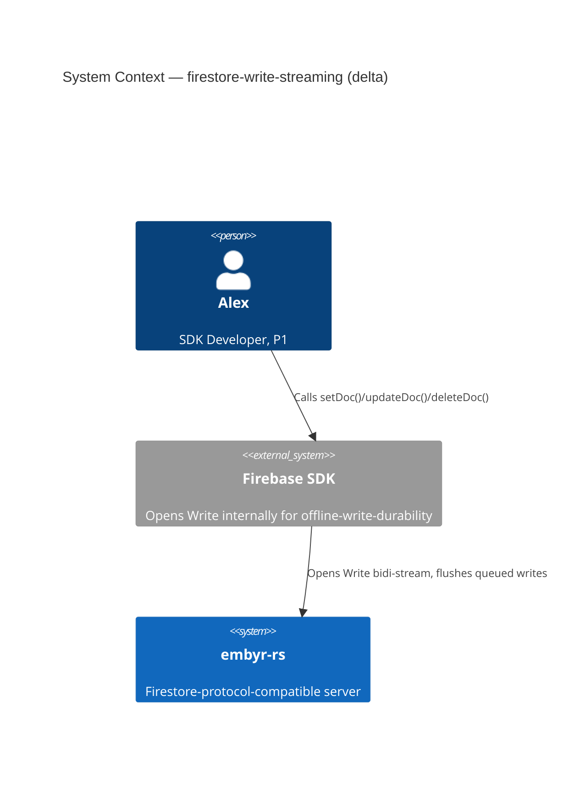
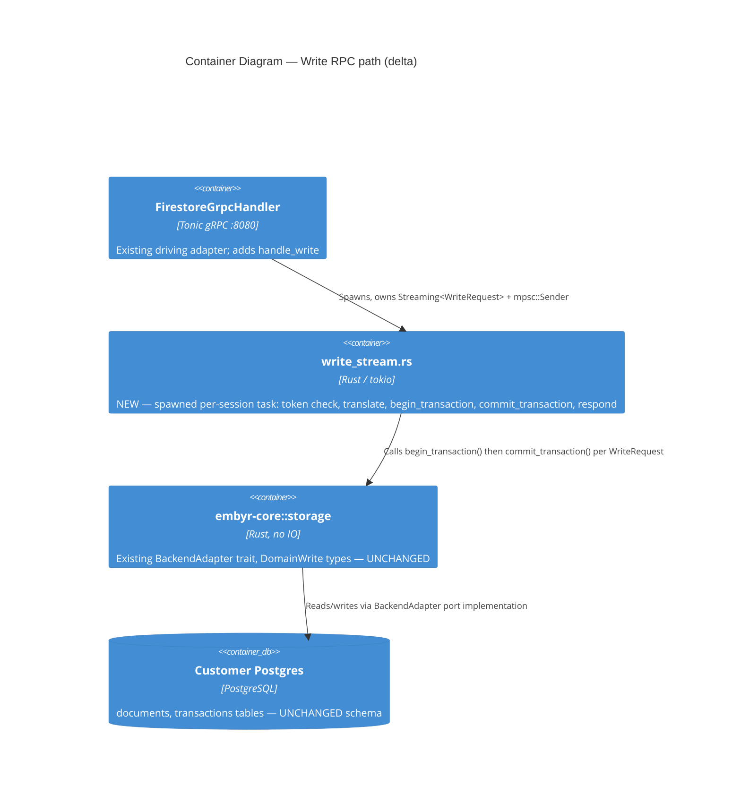

# firestore-write-streaming — Feature Delta

**Wave**: DISCUSS | **Agent**: Luna (nw-product-owner) | **Date**: 2026-08-30
**Status**: Ready for DESIGN handoff — two escalated open questions (stream_token mismatch/expiry behavior; agent-mode Write scoping). See § Handoff Package.
**Upstream**: No DISCOVER/DIVERGE wave ran for this feature specifically — commissioned directly by the orchestrator's own comparison of embyr-rs's proto surface against real Firestore's, identifying the `Write` bidirectional-streaming RPC (used internally by every official SDK for offline-queue flushing / write-ahead durability) as a real, structurally distinct gap from `Commit` — not a smaller variant of it.

**Framing**: this is a proto-surface-completion feature for the base SDK-compatibility job (JOB-01), realized entirely inside BC-2 Document Storage. It is a genuinely new *mechanism class* for this codebase, not a thin extension: `Write` is real Firestore's only RPC that is simultaneously client-streaming (the client keeps sending on the same stream after the handshake) and server-streaming (the server replies to each batch), whereas every RPC embyr-rs has shipped is either request/response, server-streaming-only, or (for `Listen`) client-streaming only in the sense that the server *drains* further client messages without yet processing them for a lifecycle action. Unlike `aggregation-queries` (net-new proto with no pre-existing local documentation) and `batch-get-documents` (proto fully vendored, contract undocumented beyond the proto itself), this feature sits in a **third gap category**: the RPC and its `WriteRequest`/`WriteResponse` envelope messages are net-new to the proto (must be authored), but `docs/SPEC.md` already documents their complete wire contract in detail — handshake, `stream_id`/`stream_token` formats, write-loop, and termination semantics — a stronger evidentiary base than either precedent had.

---

## Wave: DISCUSS / [REF] Prior Wave Consultation — Reading Confirmation

✓ `proto/google/firestore/v1/firestore.proto` (full, 417 lines) — confirmed the `Firestore` service declares exactly 11 RPCs (`GetDocument`, `CreateDocument`, `UpdateDocument`, `DeleteDocument`, `BatchGetDocuments`, `BeginTransaction`, `Commit`, `Rollback`, `RunQuery`, `RunAggregationQuery`, `Listen`) and **no `Write` RPC of any kind**. `Listen` (`rpc Listen(stream ListenRequest) returns (stream ListenResponse)`) is the only bidirectional-streaming RPC already declared — confirmed as the correct Rust/tonic mechanism precedent (see below), not a domain-logic precedent (Listen's domain is subscription/fan-out, Write's is mutation-apply).
✓ `proto/google/firestore/v1/write.proto` (full, 58 lines) — confirmed it declares `CommitRequest`/`CommitResponse`/`RollbackRequest`/`BeginTransactionRequest`/`BeginTransactionResponse` only. **No `WriteRequest`/`WriteResponse` message anywhere in the vendored proto tree** (confirmed by a second grep across `proto/`, matches found only in unrelated `document.proto` message names and `embyr/agent/v1/storage_agent.proto`'s own, differently-scoped `Write`/`WriteResult` messages — see below).
✓ `proto/google/firestore/v1/document.proto` lines 89-161 — confirmed `Write` (the mutation message: `oneof operation { update, delete, transform }` + `update_mask` + `update_transforms` + `current_document` precondition), `DocumentTransform` (+ nested `FieldTransform`), and `WriteResult` (`update_time` + `transform_results`) **already exist, fully vendored, and are already exercised today by `CommitRequest.writes`/`CommitResponse.write_results`**. These are the per-mutation message shapes the `Write` RPC's own `writes` field would reuse unchanged — genuinely reusable, not merely similar (confirmed by direct comparison, mirroring `batch-get-documents`' own Resolution 2 methodology).
✓ `crates/embyr-server/src/grpc/handler.rs::handle_commit` (full, lines 1295-1379) — confirmed the closest existing analog: extracts `project_id` from `req.database`, authenticates once, translates each proto `Write` into a domain `DomainWrite::{Update,Delete,Transform}` via a loop (lines 1319-1351), calls `adapter.commit_transaction(&project_id, &txn_id, domain_writes)` once for the whole batch, then maps the returned `Vec<WriteResultRow>` 1:1 into proto `WriteResult`s. **Two confirmed pre-existing gaps, not introduced by this feature**: (a) `DomainWrite::Update`/`Delete` always pass `version: None` — the domain type has an OCC hook (`version: Option<i64>`) that `handle_commit` never populates; (b) `DomainWrite::Transform { transforms: vec![] }` — `DocumentTransform.field_transforms` is parsed off the wire but never translated, so field-transform semantics (increment, server-timestamp, array-union, etc.) are silently discarded even though `WriteResult.transform_results` exists on the wire and `docs/SPEC.md` fully documents the intended behavior (see below). `Write` inherits both gaps identically, since it will reuse this same translation/apply logic — named explicitly here so DESIGN does not treat either as newly introduced by this feature (mirrors `batch-get-documents`' own `mask`/`consistency_selector` inheritance framing, Resolution/§ Out of Scope pattern).
✓ `crates/embyr-server/src/grpc/handler.rs::handle_run_query` / `handle_run_aggregation_query` / `handle_batch_get_documents` (targeted: auth/rate-limit/identity composition, confirmed already read in full for `aggregation-queries`/`batch-get-documents`) — confirmed the established pattern for a **server-streaming** driving-port handler: `rate_limiter.check` → `authenticate` (+suspension) → `attach_client_identity_if_present` are each called **exactly once per RPC call**, never per streamed item. Directly relevant for Write's own per-*stream* (not per-message) auth granularity — see Resolution 2.
✓ `crates/embyr-server/src/grpc/handler.rs::handle_listen` (full, lines 1913-2042) and `crates/embyr-server/src/realtime/listen_handler.rs` (targeted, lines 1-150) — **the single most load-bearing read for this feature.** Confirmed the exact Rust/tonic mechanism for receiving a `Request<tonic::Streaming<T>>` while still needing the request's own metadata for auth: (1) call `request.get_mut().next().await` to peek the first client message *without* consuming the `Request` itself (`get_mut()`, not `into_inner()`); (2) extract auth/routing info (project_id) from that first message; (3) run the normal rate-limit/authenticate/identity sequence; (4) **only then** call `request.into_inner()` to take ownership of the `Streaming<T>` body; (5) `tokio::spawn` a task that owns the stream and the response `mpsc::Sender`; (6) wrap the `mpsc::Receiver` as `tokio_stream::wrappers::ReceiverStream` for the `Response<BoxStream<...>>` return value. **Critical structural difference this feature must NOT copy blindly**: `handle_listen`'s spawned task, after its own one-time `handle_add_target` setup, only *drains* further client messages (`while (in_stream.next().await).is_some() {}` — line 2033) — it never processes a second, third, ... client message as a distinct lifecycle action. `Write` requires the spawned task to **loop**, processing every subsequent `WriteRequest` as its own apply-and-reply cycle (`while let Some(msg) = in_stream.next().await { ...apply...; tx.send(response)...; }`) — the receive-and-reply loop shape is structurally new for this codebase, even though the surrounding scaffold (peek-then-spawn-then-mpsc-then-ReceiverStream) is a direct, provably-working reuse of `Listen`'s own mechanism.
✓ `docs/SPEC.md` §Bidirectional-Streaming RPCs → §Write Stream (lines 705-724) — **critical finding, not surfaced by the raw ask's own summary**: the complete 3-step wire protocol is already documented, in detail: (1) handshake — client sends `WriteRequest` with empty `writes` and empty `stream_id`; (2) server opens the stream — replies `WriteResponse{stream_id: <16-hex-encoded-unix-nanoseconds>, stream_token: <RFC3339Nano-timestamp>, commit_time}` with **no** `write_results` in this message; (3) write loop — client sends `WriteRequest{writes: [...], stream_id, stream_token}`, server applies all writes in a single atomic operation then replies `WriteResponse{stream_id, stream_token: <new-timestamp>, write_results: [...], commit_time}`; step 3 repeats until the stream closes. Termination: client `io.EOF` → server returns cleanly (nil); `codes.Canceled` → server returns cleanly; any other error → server propagates it and the stream terminates (client is expected to reconnect, confirmed again at line 1354). The text explicitly states: "Full mask and transform semantics ... apply identically on the Write bidi-stream path as on `Commit` and `BatchWrite`" — i.e., DESIGN's job is to **reuse** the write-application primitive `handle_commit` already exercises, not invent a second one.
✓ `docs/SPEC.md` §Write Semantics (`applyWriteBatch`, lines 726-767) and §Field Transforms (lines 770+) — confirmed this section is written as a **shared** semantic engine for `Commit`, `BatchWrite`, and `Write` alike ("All non-transaction `Commit` calls and `BatchWrite` operations route individual writes through the same write logic" — the Write-stream's own write loop is explicitly folded into this same contract per the §Write Stream text above). Confirms Resolution 2's own inherited-gap framing: whatever `Commit` does or does not fully implement of this contract today, `Write` inherits identically.
✓ `docs/SPEC.md` §WebChannel Transport (targeted: lines 1060-1097) — confirmed `Write/channel` is already a named, documented BrowserChannel routing target alongside `Listen/channel` (`reqN___data__` proto3-JSON bodies are typed as `ListenRequest` for `Listen/channel` and `WriteRequest` for `Write/channel`), and that session-type mismatch is already specified ("A Listen POST using a Write session's SID (or vice versa) returns HTTP 400"). This is REST/gRPC-Web/BrowserChannel routing awareness that already anticipates this feature — not something this DISCUSS is inventing.
✓ `docs/SPEC.md` §Errors (lines 1340-1356) and §Invariants (lines 1360-1376) — confirmed `Write` is explicitly named among the streaming RPCs whose errors terminate the stream (client reconnects) and confirmed **`BatchWrite`** — mentioned repeatedly alongside `Write`/`Commit` in this same section — is a *third*, still-entirely-undeclared, unary RPC ("per-write errors are reported in the `status` array without terminating the RPC") that is **not** part of this feature; named explicitly so it is not conflated with `Write` (§ Out of Scope).
✓ `crates/embyr-core/src/storage/backend_adapter.rs` (targeted: `Write`/`WritePrecondition` enum definitions, lines ~18-56) — confirmed `DomainWrite::Update`/`Delete` already carry a `version: Option<i64>` OCC field and `WritePrecondition::UpdateTime(i64, i32)` — the domain type already models both OCC mechanisms `handle_commit` doesn't yet wire up (Resolution 3 distinguishes these from Write's own `stream_token`).
✓ `crates/embyr-server/src/adapters/agent_backend.rs` (targeted, lines 1-30, 440-520) and `proto/embyr/agent/v1/storage_agent.proto` (full RPC list, lines 14-49) — confirmed `StorageAgent`'s own proto declares `GetDocument`, `CreateDocument`, `UpdateDocument`, `DeleteDocument`, `RunQuery` (server-streaming), `BeginTransaction`, `Commit`, `Rollback`, `Ping`, `RunAggregationQuery`, `ListDocuments`, `Subscribe` (server-streaming) — **zero bidirectional-streaming RPC of any kind**. `agent_backend.rs`'s own `Write` grep hits are all the mutation-message-level `embyr_proto::agent::Write`/`DomainWrite` translation (reused from `Commit`'s own agent-mode path), not a streaming RPC. Confirmed: agent-mode `Write` would require net-new `storage_agent.proto` authoring plus a new `AgentBackendAdapter` method — an even larger gap than `aggregation-queries`' own Slice 02 (which extended an existing *unary* RPC shape, not added a wholly new bidi-streaming one).
✓ `crates/embyr-server/src/realtime/resume_token.rs` (full, 42 lines) — confirmed `Listen`'s own `resume_token` is a 40-byte `[8-byte BE unix-seconds][32-byte BLAKE3 hash]` structure purpose-built for delta-query resumption (docs since last seen timestamp). Confirmed structurally **unrelated** to `docs/SPEC.md`'s own `stream_token` for `Write` (an RFC3339Nano timestamp string, rotated every response, with no documented delta-resumption semantics) — named explicitly so DESIGN does not reuse this module or its format for Write's own `stream_token` (Resolution 3).
✓ `docs/product/architecture/adr-002-bounded-contexts.md` (targeted: § BC-2, lines 69-79) — confirmed BC-2 Document Storage's own ubiquitous language already names `Transaction`, `TransactionId`, `OccConflict`, `Mutation`, `Version` (line 73) — `Write` is squarely BC-2's own existing mutation-and-transaction domain, applied via a new transport shape. No new bounded context.
✓ `docs/product/jobs.yaml` (full, all 20 jobs surveyed) — confirmed JOB-01 (`sdk-compat`, P1 Alex) is the correct home, identical "make it real" extension reasoning to `aggregation-queries` and `batch-get-documents`: "all SDK calls succeed unchanged" already covers the SDK's offline-write-durability mechanism, which routes over `Write` internally. No new job warranted.
✓ `docs/product/journeys/sdk-developer.yaml` — confirms P1 Alex, JOB-01 already listed; this feature follows the established single-narrative-file convention (Lightweight UX depth), no separate `journey-*.yaml` artifact.
✓ `docs/feature/aggregation-queries/feature-delta.md` and `docs/feature/batch-get-documents/feature-delta.md` (both full) — read as structural/format templates and as the two prior "documented-but-unbuilt gap"/"net-new proto" precedents this feature's own gap-category sits between (see Framing above).

No contradictions found between this feature's scope and prior evidence. This feature's own gap category is genuinely different from both precedents (see Framing) — this DISCUSS does not force it into either prior shape.

---

## Wave: DISCUSS / [REF] Orchestrator Decisions (not re-litigated)

| # | Decision | Value |
|---|---|---|
| 1 | Feature Type | Backend — completes an entirely undeclared client-facing gRPC RPC (BC-2 Document Storage), reusing `Write`/`DocumentTransform`/`WriteResult` message shapes and `handle_commit`'s own write-application primitive |
| 2 | Walking Skeleton | Evaluated (this wave's call): **YES** — confirmed genuinely warranted, not reflexively assumed. Bidirectional client-streaming *combined with a receive-and-reply loop on every subsequent client message* is a mechanism class this codebase has not built: `Listen` is bidi-streaming but its spawned task only drains further client messages after its one-time setup (§ Reading Confirmation); `Write` must process every message as its own apply-and-reply cycle. See § Story Map |
| 3 | UX Research Depth | **Lightweight** — SDK-facing, not end-user UI. `Write` is not a method Alex ever calls directly; it is the transport the Firebase SDK uses internally for offline-queue flushing / write-ahead durability. Full journey detail lives inline below, no separate `journey-*.yaml` |
| 4 | JTBD Analysis | Yes (default) — every story traces to `job_id: JOB-01` (extends, not a new job — see § Job Discovery Framing Resolution, Resolution 1) |

---

## Wave: DISCUSS / [REF] Job Discovery — Framing Resolution

### Resolution 1 — Is this the same job as `aggregation-queries`/`batch-get-documents` (JOB-01, "make it real"), or does the SDK-internal (not directly-called) nature of `Write` warrant a new job?

**Same job, JOB-01, no new job warranted.** JOB-01's functional dimension is "all SDK calls succeed unchanged" — this is exactly the shape of gap `Write` closes: Alex's app code never calls `Write` directly (no `db.write(...)` public SDK method exists), it calls ordinary `setDoc()`/`updateDoc()`/`deleteDoc()`, and the SDK's own internal offline-persistence/write-ahead-durability layer chooses to route those calls over the `Write` bidi-stream instead of one-shot `Commit` when persistence is enabled or the client is reconnecting after a network drop. This is still squarely "an SDK call that should succeed unchanged" — the SDK, not Alex, decides which RPC to use; Alex just observes that his writes now work reliably under flaky connectivity, exactly as they would against real Firestore. This mirrors `batch-get-documents`' own Resolution 4 finding that `db.getAll()` (a real SDK method Alex calls) and this feature's own "invisible to Alex's own code, but SDK-selected" mechanism are two different *points of user visibility* for the identical underlying job.

### Resolution 2 — What granularity applies to rate-limiting, auth, and access-control for a stream that carries many write batches over its lifetime?

**Per stream (once, at handshake), not per `WriteRequest` message** — mirrors `RunQuery`'s/`handle_listen`'s own established per-*call*-not-per-item precedent (§ Reading Confirmation), applied here to "per stream session" instead of "per RPC call" since the RPC itself is long-lived. `rate_limiter.check`, `authenticate` (+suspension), and `attach_client_identity_if_present` run exactly once, at the first (handshake) message, using the SAME `request.get_mut().next()`-then-`into_inner()` sequence `handle_listen` already proves works for extracting routing/auth data from a first message while the `Request`'s metadata is still available. **Access-control evaluation (write-path rules, if a project has any defined) is a separate concern**: it must run for every subsequently-received `WriteRequest`'s own `writes` batch, mirroring `handle_create_document`/`handle_update_document`/`handle_delete_document`'s own per-write-call evaluation — a stream that stays open for many write batches must not evaluate its access rule only once at handshake time, since a rule can reference `request.resource.data` (the specific proposed document content), which differs per batch.

### Resolution 3 — Is `stream_token` the same concept as a `BeginTransaction`-issued transaction ID, and should it reuse OCC/`version`-column machinery?

**No — confirmed structurally distinct, must not be conflated.** `Commit`'s own `transaction` field (optional bytes) references a real `BeginTransaction`-issued ID with actual read-set-validation OCC semantics (BC-2's own `Transaction`/`OccConflict` ubiquitous language; `begin_transaction`/`commit_transaction`/`rollback_transaction` adapter methods). `docs/SPEC.md`'s own `stream_token` for `Write` is a rotating, per-response, RFC3339Nano-timestamp session-continuity value with no stated relationship to OCC read-set validation, the `version` column, or `BeginTransaction` at all — its role (as best evidenced by the documented protocol) is stream-liveness/ordering, not transactional isolation. It is also NOT the same shape or purpose as `Listen`'s own `resume_token` (BLAKE3-hash-based, built for delta-query resumption after reconnect — § Reading Confirmation). **Each `WriteRequest` in the write loop is applied as its own independent atomic write batch** (SPEC.md: "applies all writes in a single [atomic operation], then replies"), not as part of one long-lived client-visible transaction spanning the whole stream. **Genuinely open, not resolved by this DISCUSS**: `docs/SPEC.md`'s own excerpt does not document what happens when a client resends a `WriteRequest` with a stale or mismatched `stream_token` (reject-and-require-fresh-handshake? silently accept? resync to latest?) — flagged as an explicit open question for DESIGN (§ Handoff Package), not invented here.

### Resolution 4 — Does this feature need an agent-mode slice, mirroring `aggregation-queries`' own Slice 01/02 split?

**Confirmed structurally larger gap than `aggregation-queries` had, and deferred out of this feature's own v1 scope, not silently dropped.** `StorageAgent`'s own proto (`storage_agent.proto`) has zero bidirectional-streaming RPC of any kind today — `aggregation-queries`' own agent-mode slice extended an existing *unary* RPC shape (`RunAggregationQuery` already existed unary on both sides); `Write` for `backend_mode=agent` would require authoring an entirely new streaming RPC on the agent's own proto surface plus a new `AgentBackendAdapter::write_stream`-shaped port method — genuinely new plumbing on a separate deployment artifact (the customer-VPC agent binary), not a same-artifact extension. Given walking-skeleton discipline and this feature's own already-larger-than-usual scope for the non-agent path, agent-mode `Write` is scoped as an explicit, named, deferred follow-up (§ Out of Scope) — flagged for DESIGN's own confirmation, not silently decided, since this is a genuine judgment call about a currently-unserved `backend_mode=agent` segment (JOB-04/JOB-09's own credential-isolation customers).

---

## Wave: DISCUSS / [REF] Persona & Job

**Persona**: **P1 — Alex, SDK Developer** (existing persona), unchanged.

**Domain-example company**: **Trailmark** (continuity with `aggregation-queries`/`batch-get-documents`). Concrete grounding: Maria Santos's own `trip_entries` (owned per end user, `owner_id` field) — the same collection reused throughout this codebase's domain examples, now exercised through the SDK's offline-write-durability path rather than a direct online write.

**job_id decision (Resolution 1)**: `JOB-01` (`sdk-compat`), extended not new, same persona P1 Alex, same goal (SDK data-plane parity). NOTE to be appended to `docs/product/jobs.yaml` (see § SSOT Updates).

---

## Wave: DISCUSS / [REF] Scope Assessment (Elephant Carpaccio Gate)

| Signal | Threshold | This feature | Fired? |
|---|---|---|---|
| User stories | >10 | 4 (US-01..US-04), in-scope v1 | **NO** |
| Bounded contexts / modules | >3 | 1 — entirely BC-2 Document Storage; zero new bounded context (confirmed, ADR-002) | **NO** |
| Walking Skeleton integration points | >5 | 4 — new `handle_write` peek-then-spawn plumbing (reused shape from `handle_listen`), the spawned task's receive-and-reply loop (structurally new), reuse of `handle_commit`'s own proto-Write→DomainWrite translation + `adapter.commit_transaction`-shaped apply call (reused unchanged), `stream_id`/`stream_token` generation (new, small) | **NO** |
| Estimated effort | >2 weeks | v1 scope (US-01..US-04, non-agent backend modes): ~4-5 days total across 4 slices (see § Elephant Carpaccio Slices) | **NO** |
| Independent shippable outcomes | multiple | **YES** — single-write happy path, multi-write batching, `stream_token`-mismatch rejection, and clean stream termination are each independently demonstrable and independently valuable, even though all four sit inside one RPC's own lifecycle | **YES** |

**1 of 5 signals fired. Verdict: PASS — single feature, not split into separate top-level `docs/feature/` directories.** The one fired signal (multiple independent shippable outcomes) is the expected, ordinary shape of *any* stateful streaming-protocol feature and is the exact reason Elephant Carpaccio thin-slicing exists (Phase 2.5) — it is handled by slicing *within* this one feature, not by splitting into separate features. This is a materially different, more careful call than reflexively agreeing the raw ask's own "likely fires" framing without checking bounded-context count, integration-point count, and effort against actual evidence — all three came back well under threshold once agent-mode was correctly scoped out (Resolution 4) and once `handle_listen`'s own proven mechanism was confirmed reusable for the streaming scaffold (§ Reading Confirmation), leaving only the receive-and-reply loop itself as genuinely new work.

---

## Wave: DISCUSS / [REF] Journey (Lightweight, per Decision 3 — inline per this codebase's convention)

**Alex's mental model**: Alex does not know `Write` exists as a distinct RPC — he calls `setDoc(docRef, data)`/`updateDoc(docRef, data)`/`deleteDoc(docRef)` exactly as he always has. The Firebase SDK itself decides, internally, whether to send that call over one-shot `Commit` or over the persistent `Write` stream — most commonly when offline persistence is enabled (default on mobile SDKs, opt-in via `enableIndexedDbPersistence()` on web) or when the SDK is actively recovering from a dropped connection and has queued writes to flush. Alex's own mental model is simply: "my writes eventually succeed and my UI updates, even if the network was flaky when I made them" — the same trust real Firestore's offline-write-durability guarantee earns today.

**Emotional arc** (mirrors "Problem Relief"): **Start** — latent risk, not yet felt: today, any embyr-backed app that relies on the SDK's default offline-write-durability behavior (a large fraction of production mobile apps, since it is the SDK's own default, not an opt-in Alex consciously chose) silently fails the moment the SDK's internal logic opens a `Write` stream — the RPC does not exist server-side, so the underlying gRPC call errors outright. Alex may not discover this until a user goes offline in the field and their write is silently lost or the app hangs. **Middle** — the SDK's own internal machinery runs exactly as it does against real Firestore: opens the stream, sends the handshake, receives a `stream_id`/`stream_token`, flushes the queued write, receives a `WriteResponse`. Alex's own code observes none of this directly. **End** — confidence/relief: the write's returned `Promise` resolves, any `onSnapshot` listener reflects the change, and Alex's app behaves identically online or after a reconnect — matching real Firestore's own SDK contract exactly, with zero code change on Alex's side.

**Shared artifact**: the write-application primitive itself (proto `Write` → `DomainWrite` translation → `adapter.commit_transaction`-shaped atomic apply → `WriteResult`) — single source of truth: `crates/embyr-server/src/grpc/handler.rs::handle_commit`'s own existing translation loop (lines 1319-1351), reused unchanged inside the new stream's per-message write loop. The bidi-streaming scaffold itself (peek-first-message → auth-once → spawn → mpsc → `ReceiverStream`) — single source of truth: `crates/embyr-server/src/grpc/handler.rs::handle_listen` (lines 1913-2042), reused for its shape, not its domain logic.

**Failure modes** (feeds DISTILL scenario generation): the stream closes with `io.EOF` before any write is sent (clean close, zero writes applied — matches the "handshake only, then disconnect" case a flaky mobile network produces routinely) | a `WriteRequest` presents a `stream_token` that does not match the most recently issued one (Resolution 3 — behavior flagged open for DESIGN, not invented here) | a `WriteRequest` in the write loop carries an invalid/malformed write (mirrors `Commit`'s own existing `invalid_argument` handling, applied per-message instead of per-call) | the underlying Postgres apply fails mid-batch (mirrors `Commit`'s own existing internal-error handling) | the client cancels the stream (`codes.Canceled`) mid-write-loop (clean server-side close, no error surfaced) | a write-path access rule denies a batch's proposed content (mirrors `handle_create_document`/`handle_update_document`'s own per-write evaluation, applied per `WriteRequest` rather than per RPC call, per Resolution 2).

---

## Wave: DISCUSS / [REF] Story Map & Walking Skeleton

**Persona**: P1 Alex | **Goal**: Have the Firebase SDK's own default offline-write-durability behavior (queue writes while offline, flush over a persistent stream, get correct results back) work against embyr exactly as it does against real Firestore, with zero code change to Alex's own app.

### Backbone

| A. Alex's SDK Opens a Write Session | B. Alex's SDK Flushes Queued Writes | C. Alex's SDK Closes or Recovers the Session |
|---|---|---|
| SDK sends handshake, receives `stream_id`/`stream_token` **[WS]** | SDK sends one write, receives one `WriteResponse` **[WS]** | SDK closes cleanly (EOF/Cancel) **[WS]** |
| — | SDK sends a batch of N writes in one message | SDK resends against a stale/wrong `stream_token` |
| — | — | Server-side apply error terminates the stream |

### Walking Skeleton

Single stream, single write per batch, happy path only: open stream → handshake → `stream_id`/`stream_token` issued → client sends one write → server applies it via the existing `handle_commit`-derived primitive → client receives one `WriteResponse` with one `write_result` → client closes the stream → server returns cleanly. Backend modes: `direct_pg`, `aws_secret`, `gcp_secret` (agent-mode explicitly deferred, Resolution 4). This is Slice 01, US-01.

### Release 1 — A Working Write Stream, Happy Path (Slice 01, US-01)

Outcome: the SDK's own internal `Write`-stream code path, when it opens a session and flushes exactly one write, succeeds against embyr exactly as it would against real Firestore.

### Release 2 — Batched Writes and Session Longevity (Slices 02-04, US-02..US-04)

Outcome: the SDK's own realistic usage pattern — multiple writes queued together, a session that survives reconnect-token continuity concerns, and clean termination under every documented stream-close condition — is fully supported, matching `docs/SPEC.md`'s own already-documented contract.

---

## Wave: DISCUSS / [REF] Elephant Carpaccio Slices

| Slice | Story | Release | Estimate | Learning Hypothesis (disproves) | Production-data taste test |
|---|---|---|---|---|---|
| 01 (WS) | US-01 | 1 | 1.5 days | `handle_listen`'s own peek-then-spawn-then-mpsc-then-`ReceiverStream` scaffold cannot be adapted into a genuine receive-and-reply loop (not merely drain-leftover-messages) — OR `handle_commit`'s own proto-Write→DomainWrite translation + atomic-apply call cannot be reused unchanged for a single write arriving via this new transport | Real Postgres, real `trip_entries` document, a real client opening a stream, sending one write, receiving one `WriteResponse`, closing cleanly — no mocked stream, no synthetic single-message shortcut that bypasses the loop |
| 02 | US-02 | 2 | 1 day | `handle_commit`'s own existing multi-`Write`-per-call translation loop (already proven for N writes in one `CommitRequest`) cannot be reused unchanged for N writes arriving in one `WriteRequest.writes` batch inside the stream's own write loop | A single `WriteRequest` batching 3 writes spanning `trip_entries` and a trip's `expenses` sub-collection, applied atomically, real Postgres |
| 03 | US-03 | 2 | 1 day | A stream cannot safely reject a stale/mismatched `stream_token` without either (a) silently accepting writes against the wrong session state or (b) requiring new machinery beyond a simple compare-and-reject at the top of the per-message loop | A real two-message sequence: session opened, `stream_token` A issued, a `WriteRequest` presenting a DIFFERENT token sent deliberately, asserting rejection before any write is applied |
| 04 | US-04 | 2 | 1 day | The three documented termination conditions (`io.EOF`, `codes.Canceled`, other error) cannot each be distinguished and handled correctly using tonic's own `Streaming<T>` error/`None` semantics without new, bespoke per-condition detection machinery | A real client-initiated clean close mid-loop, a real client cancellation mid-loop, and a real forced apply failure (duplicate-precondition violation) — asserting the stream terminates correctly and distinguishably in each case |

**Total estimate: ~4.5 days across 4 slices.**

**Taste tests applied**:
- "4+ new components per slice" — Slice 01 introduces exactly 2 new components (`handle_write` itself, `stream_id`/`stream_token` generation) plus reuse of 2 already-shipped mechanisms (`handle_listen`'s scaffold, `handle_commit`'s translation/apply). Slices 02-04 each introduce 0-1 new components, extending Slice 01's own loop. PASS, all slices.
- "Every slice depends on a new abstraction" — the one genuinely new abstraction (the receive-and-reply loop itself) is shipped FIRST, as Slice 01, and every later slice extends it rather than depending on something not yet built. PASS.
- "No slice disproves a pre-commitment" — each slice has a distinct, falsifiable hypothesis (table above), none redundant with another. PASS.
- "Synthetic-data-only slices prove plumbing, not value" — every slice's own taste test requires a real client stream against real Postgres with real documents, never a stubbed transport. PASS.
- "2+ slices identical except for scale" — not applicable; Slice 02 (batching) is a distinct dimension from Slice 01 (loop mechanics), Slice 03 (token continuity) and Slice 04 (termination) are each their own distinct failure-mode dimension, not scaled repeats of one another. PASS.

---

## Wave: DISCUSS / [REF] Prioritization

| Priority | Slice | Target Outcome | Rationale |
|---|---|---|---|
| 1 | Slice 01 (WS) | A working Write stream exists at all, happy path | Highest learning leverage — disproves or confirms the one genuinely new mechanism (the receive-and-reply loop) before any other slice can be built on top of it |
| 2 | Slice 02 | Realistic multi-write batches work | Directly extends Slice 01's own loop; the SDK's real offline queue routinely batches several pending writes into one flush, not one-at-a-time |
| 3 | Slice 04 | Stream terminates correctly under every documented condition | Prioritized ahead of Slice 03 — termination correctness (not silently hanging or corrupting state on disconnect) is closer to this feature's own core value proposition (durability under flaky connectivity) than token-mismatch rejection is |
| 4 | Slice 03 | Stale/mismatched `stream_token` is safely rejected | Lowest-frequency real-world trigger of the four (requires a client bug or a genuinely unusual reconnect race) and depends on DESIGN's own resolution of the open `stream_token` behavior question (Resolution 3) — sequenced last so DESIGN's answer is available before this slice is built |

---

## Wave: DISCUSS / [REF] System Constraints

- **`stream_token` is NOT a `BeginTransaction` transaction ID and must never be validated, generated, or stored via the OCC/`version`-column machinery** (Resolution 3). Each `WriteRequest` in the write loop is its own independent atomic apply, not a step inside one client-visible transaction spanning the whole stream.
- **`stream_token` is NOT `Listen`'s own `resume_token`** (Resolution 3) — different format (RFC3339Nano timestamp vs. BLAKE3-hash), different purpose (session continuity vs. delta-query resumption after reconnect). Do not reuse `realtime::resume_token`'s module or encoding.
- **Rate-limiting, authentication, suspension-check, and client-identity resolution are per-STREAM (once, at handshake), not per `WriteRequest` message** (Resolution 2) — mirrors `RunQuery`'s/`Listen`'s own per-call granularity, applied to "per stream session" for this long-lived RPC.
- **Write-path access-control evaluation (where a write rule is defined) is per `WriteRequest` message, not per stream** (Resolution 2) — mirrors `handle_create_document`/`handle_update_document`/`handle_delete_document`'s own per-call evaluation, since `request.resource.data` differs per batch.
- **The write-application primitive (`Write`→`DomainWrite` translation, atomic apply, `WriteResult` construction) is reused unchanged from `handle_commit`** — zero new write-semantics code; this feature is a new *transport* for already-shipped mutation-apply logic.
- **Inherited, pre-existing gaps this feature does NOT need to close**: OCC `version` hardcoded `None` in the write-translation path; `DocumentTransform.field_transforms` parsed but discarded (`transforms: vec![]`). Both are `handle_commit`'s own existing gaps (§ Reading Confirmation), inherited identically by `Write`, not introduced by it. Named explicitly so DESIGN does not treat either as this feature's own omission — mirrors `batch-get-documents`' own `mask`/`consistency_selector` inheritance framing.
- **Agent-mode (`backend_mode=agent`) `Write` is out of v1 scope** (Resolution 4) — requires net-new `storage_agent.proto` authoring and a new `AgentBackendAdapter` port method; named as a candidate follow-up feature, not silently dropped.
- **`BatchWrite` is a separate, still-entirely-undeclared, unrelated RPC** — mentioned alongside `Write`/`Commit` in `docs/SPEC.md`'s own shared write-semantics text, but it is a unary RPC with per-write non-terminating error reporting, structurally different from `Write`'s own bidi-streaming shape. Out of scope, not to be conflated.
- Ubiquitous language: no new BC-2 terms — `Mutation`/`Transaction`/`Version` are already named (ADR-002); this feature introduces "Write stream session" (`stream_id`, `stream_token`) as a new, transport-level concept distinct from `Transaction`, flagged for DESIGN to formally place in the ubiquitous language.

---

## Wave: DISCUSS / [REF] User Stories

<!-- markdownlint-disable MD024 -->

### US-01: Alex's SDK Flushes a Single Queued Write Over a Persistent Session

**job_id**: JOB-01
**Slice**: 01 (Walking Skeleton) | **Release**: 1

#### Elevator Pitch
Before: when Alex's app relies on the Firebase SDK's default offline-write-durability behavior — writes made while the network is flaky are queued and flushed once connectivity returns, or via a persistent write-ahead session while online — the SDK opens embyr's `Write` stream internally and the call fails outright, since the RPC does not exist server-side; Alex's own `setDoc()` call never resolves correctly and, depending on the SDK's own retry/fallback behavior, the write may appear to hang or silently fail.
After: Alex's app calls `setDoc(docRef, data)` exactly as before (unchanged app code) → the SDK internally opens a `Write` session, sends the write, and receives a `WriteResponse` → Alex's app sees the returned `Promise` resolve and, if subscribed, `onSnapshot` reflects the new document — identical behavior to real Firestore.
Decision enabled: Alex can ship apps that depend on the SDK's own default offline-write-durability guarantee against embyr, instead of discovering write loss or hangs only when a real user's device goes offline in the field.

#### Domain Examples
1. **Happy Path**: Maria Santos's app, with SDK offline persistence enabled, calls `setDoc()` to save a new `trip_entries` document while her phone briefly loses signal. Once reconnected, the SDK's own internal `Write` stream opens, sends the queued write, and receives back a `WriteResponse` with one `write_result`. Maria's app shows the trip entry saved, matching what she'd see against real Firestore.
2. **Edge Case**: Alex's app opens a `Write` session (handshake only) at app startup to keep a persistent write-ahead channel ready, but the user never actually writes anything in that session before closing the app. The stream closes cleanly with zero writes ever sent past the handshake — no error, no dangling state.
3. **Error/Boundary**: Maria attempts to save a `trip_entries` document that violates an existing precondition (e.g., `current_document.exists = false` on a document that already exists, mirroring `Commit`'s own precondition-violation handling). Her write's own `WriteResponse` reflects the failure via the same mechanism `Commit` already uses for precondition violations, without terminating the stream if the underlying RPC design permits recoverable per-batch errors (flagged for DESIGN to confirm against `docs/SPEC.md`'s own general "any other error terminates the stream" rule — see § Handoff Package).

#### UAT Scenarios (BDD)

##### Scenario: A single queued write is flushed and confirmed over a new Write session
Given Maria Santos's app opens a new `Write` stream and completes the handshake, receiving a `stream_id` and `stream_token`
When the app sends a `WriteRequest` containing one write to create her `trip_entries` document, presenting the issued `stream_id`/`stream_token`
Then the app receives a `WriteResponse` containing exactly one `write_result` and a new `stream_token`
And the document is readable via `GetDocument` immediately after

##### Scenario: A session opened but never used to write closes cleanly
Given Alex's app opens a new `Write` stream and completes the handshake
When the app closes the stream without ever sending a subsequent `WriteRequest`
Then the server returns cleanly, with zero writes applied and no error surfaced

##### Scenario: A write violating an existing precondition is reported without corrupting session state
Given a `trip_entries` document already exists for Maria Santos
And Maria Santos's app has an open `Write` session with a valid `stream_id`/`stream_token`
When the app sends a `WriteRequest` whose one write requires `current_document.exists = false` on that same document
Then the response (or stream termination, per DESIGN's own resolution of recoverable-vs-terminal per-batch errors — flagged open) reflects the precondition failure using the same signal `Commit` already produces for this case
And no document is modified

##### Scenario: The handshake message itself is rejected if it is not empty
Given Alex's app sends a first `WriteRequest` that already contains one or more writes (not an empty handshake)
When the server processes this first message
Then the request is rejected as invalid, before any write is applied

##### Scenario: A stream for a suspended project is rejected at handshake, matching every other RPC
Given a project is in `suspended` status
When any client attempts to open a `Write` stream against that project
Then the stream is rejected with the same `permission_denied` signal every other RPC already produces for a suspended project, before any write is accepted

#### Acceptance Criteria
- [ ] AC-01-01: Opening a `Write` stream with a valid, empty handshake `WriteRequest` returns a `WriteResponse` carrying a `stream_id`, a `stream_token`, and a `commit_time`, with no `write_results`.
- [ ] AC-01-02: A subsequent `WriteRequest` containing exactly one write, presenting the issued `stream_id`/`stream_token`, is applied atomically via the same primitive `Commit` already uses, and the server replies with a `WriteResponse` containing exactly one `write_result` and a rotated `stream_token`.
- [ ] AC-01-03: A stream that receives no `WriteRequest` beyond the handshake, then closes, terminates cleanly with zero writes applied.
- [ ] AC-01-04: A first (handshake) `WriteRequest` that is not empty (carries writes or a non-empty `stream_id`) is rejected as invalid before any write is attempted.
- [ ] AC-01-05: Rate-limiting, authentication, suspension-check, and client-identity resolution each run exactly once per stream, at handshake time — not once per subsequent `WriteRequest`.
- [ ] AC-01-06: A suspended project's `Write` stream is rejected with `permission_denied` at handshake, before any write is accepted.

#### Outcome KPIs
See § Outcome KPIs below (North Star + Guardrails).

#### Technical Notes (Optional)
Handler mirrors `handle_listen`'s own scaffold: `request.get_mut().next()` to peek the handshake message while `request` metadata is still available, then the normal rate-limit/authenticate/identity sequence, then `request.into_inner()` and `tokio::spawn` a task owning the stream + an `mpsc::Sender<Result<WriteResponse, Status>>`, wrapped as `ReceiverStream` for the response. Unlike `handle_listen`'s spawned task (which only drains further messages), this task's own loop must process every subsequent `WriteRequest`: translate its `writes` via the identical logic `handle_commit` already uses (lines 1319-1351), call the existing atomic-apply primitive, construct and send a `WriteResponse`. `stream_id`/`stream_token` generation format is informative only from `docs/SPEC.md` (16-hex-encoded-unix-nanoseconds; RFC3339Nano timestamp respectively) — exact implementation is DESIGN's own call, not locked here. Requires net-new proto authoring: `WriteRequest`/`WriteResponse` messages (in `write.proto`, alongside `CommitRequest`) and the `rpc Write(stream WriteRequest) returns (stream WriteResponse);` declaration (in `firestore.proto`) — unlike `batch-get-documents`, this is genuinely new proto surface, but its wire contract is already fully specified locally (`docs/SPEC.md` §Write Stream), not merely inferred.

---

### US-02: Alex's SDK Flushes a Batch of Several Queued Writes in One Message

**job_id**: JOB-01
**Slice**: 02 | **Release**: 2

#### Elevator Pitch
Before: US-01 proves a single write flushes correctly, but the SDK's own real offline queue routinely accumulates several pending writes (e.g., Maria edits three different `trip_entries` while offline) and flushes them together in one `WriteRequest.writes` batch — if only single-write batches work, the SDK's own realistic usage pattern still fails.
After: Alex's app makes three separate `updateDoc()`/`setDoc()` calls while offline; once reconnected, the SDK flushes all three as one `WriteRequest` → the app sees all three `Promise`s resolve together, correctly reflecting each document's own updated state.
Decision enabled: Alex can trust that a realistic burst of offline edits (not just a single isolated write) reconciles correctly and atomically once connectivity returns.

#### Domain Examples
1. **Happy Path**: Maria Santos, offline, edits two `trip_entries` documents and adds one new `expenses` document under a trip's sub-collection. Reconnecting, the SDK flushes all three writes in one `WriteRequest`. Sees a `WriteResponse` with exactly three `write_result`s, all three documents correctly reflecting the applied changes.
2. **Edge Case**: A batch of five writes includes both creates and deletes against different `trip_entries` documents in the same `WriteRequest`. All five are applied atomically — none partially applied if one fails.
3. **Error/Boundary**: A batch of three writes includes one that violates a precondition (mirrors US-01's own single-write precondition case, now amid a larger batch). The whole batch's atomicity guarantee (mirroring `Commit`'s own all-or-nothing semantics) means none of the three writes are applied if any one fails its precondition.

#### UAT Scenarios (BDD)

##### Scenario: A batch of three writes spanning two collections is applied atomically and confirmed together
Given Maria Santos's app has an open `Write` session with a valid `stream_id`/`stream_token`
And she has three pending offline edits: two updates to `trip_entries` documents and one create in a trip's `expenses` sub-collection
When the app sends a single `WriteRequest` containing all three writes
Then the app receives a `WriteResponse` containing exactly three `write_result`s, in the same order as the request's own `writes` array
And all three documents reflect the applied changes

##### Scenario: A batch containing one precondition failure applies none of its writes
Given Maria Santos's app has an open `Write` session with a valid `stream_id`/`stream_token`
And a batch of three writes includes one that violates an existing precondition
When the app sends this batch in a single `WriteRequest`
Then none of the three writes are applied
And the response (or stream behavior) reflects the precondition failure using the same mechanism US-01 establishes for a single-write case

##### Scenario: write_results length always matches the batch's own writes length
Given any successfully-applied `WriteRequest` batch of N writes
When the server replies with a `WriteResponse`
Then the `write_results` array contains exactly N entries, mirroring the identical invariant `docs/SPEC.md` already documents for `CommitResponse`

##### Scenario: Successive batches on the same session each get their own rotated stream_token
Given Maria Santos's app has an open `Write` session
When the app sends two successive `WriteRequest` batches, each presenting the `stream_token` returned by the immediately prior response
Then each `WriteResponse` carries a newly rotated `stream_token`, distinct from the one issued before it

#### Acceptance Criteria
- [ ] AC-02-01: A `WriteRequest` containing N writes (N > 1), spanning one or more collections, is applied atomically — all N succeed together or none are applied.
- [ ] AC-02-02: A successful batch's `WriteResponse.write_results` length exactly equals the batch's own `writes` length, in request order.
- [ ] AC-02-03: A batch containing any single precondition-violating write applies zero writes from that batch.
- [ ] AC-02-04: Each successive `WriteRequest`/`WriteResponse` round trip on the same session issues a newly rotated `stream_token`, distinct from the previous one.

#### Outcome KPIs
See § Outcome KPIs below.

#### Technical Notes (Optional)
Reuses `handle_commit`'s own existing per-`Write`-message translation loop (already proven for N writes in one `CommitRequest.writes`) unchanged inside the stream's own per-`WriteRequest` write loop — this slice is compositional, not new logic. Depends on US-01's own receive-and-reply loop existing first.

---

### US-03: A Stale or Mismatched stream_token Is Safely Rejected

**job_id**: JOB-01
**Slice**: 03 | **Release**: 2

#### Elevator Pitch
Before: without an explicit rejection rule, a client bug or an unusual reconnect race could present a `stream_token` that does not match the most recently issued one — undefined behavior here risks either silently applying a write against stale session state or crashing the stream unpredictably.
After: Alex's SDK, in the rare case it presents a wrong or outdated `stream_token` (e.g., after an internal SDK retry race), receives a clear, well-defined rejection instead of an ambiguous failure → the SDK's own reconnect logic can respond predictably (open a fresh handshake) rather than guessing.
Decision enabled: Alex can trust that the SDK's own retry/reconnect logic, when it does hit this rare race, gets a signal it can act on deterministically, rather than silent data corruption or an unexplained hang.

#### Domain Examples
1. **Happy Path (of the rejection)**: A `Write` session issues `stream_token` A. A `WriteRequest` deliberately presents an unrelated token B (simulating a client bug). Sees the request rejected before any write is attempted, with a clear, actionable signal.
2. **Edge Case**: A `WriteRequest` presents the token that was issued TWO responses ago (not the most recent one) — an out-of-order resend, plausible under network reordering. Sees the same rejection as a wholly unrelated token, since only the single most-recently-issued token is ever valid.
3. **Error/Boundary**: The very first post-handshake `WriteRequest` presents the exact `stream_id`/`stream_token` pair issued by the handshake response itself (the correct, expected case). Sees this accepted normally — confirms the rejection rule does not also reject valid, freshly-issued tokens.

#### UAT Scenarios (BDD)

##### Scenario: A WriteRequest presenting the wrong stream_token is rejected before any write is applied
Given a `Write` session has issued `stream_token` A
When a `WriteRequest` is sent presenting a different, unrelated `stream_token`
Then the request is rejected before any write is attempted
And no document is modified

##### Scenario: An out-of-order resend presenting a previously-valid (now-superseded) token is rejected
Given a `Write` session has progressed through two successful write round trips, issuing `stream_token` A then `stream_token` B
When a `WriteRequest` is sent presenting `stream_token` A (now superseded by B)
Then the request is rejected before any write is attempted

##### Scenario: A WriteRequest presenting the correct, freshly-issued token is accepted normally
Given a `Write` session has just issued `stream_token` A via its handshake response
When a `WriteRequest` presenting `stream_token` A is sent
Then the write is applied normally, matching US-01's own happy-path behavior

#### Acceptance Criteria
- [ ] AC-03-01: A `WriteRequest` presenting a `stream_token` that does not match the most recently issued one for that `stream_id` is rejected before any write is attempted.
- [ ] AC-03-02: A `WriteRequest` presenting the correct, most-recently-issued `stream_token` is accepted and applied normally.
- [ ] AC-03-03: Rejection of a mismatched token never applies any part of that request's own write batch.

#### Outcome KPIs
See § Outcome KPIs below.

#### Technical Notes (Optional)
**Depends on DESIGN's own resolution of Resolution 3's open question** (exact rejection mechanism/signal — e.g., `Status` code, whether the stream terminates or merely rejects the one message) before this slice's own implementation detail is locked; the AC above describe the observable behavior only (rejected, no write applied), not the mechanism.

---

### US-04: A Write Session Terminates Correctly Under Every Documented Close Condition

**job_id**: JOB-01
**Slice**: 04 | **Release**: 2

#### Elevator Pitch
Before: without explicit handling of each of `docs/SPEC.md`'s own three documented termination conditions (clean client close, client cancellation, server-side error), a dropped connection mid-write-loop risks the server hanging indefinitely, leaking a spawned task, or surfacing a confusing error to the SDK instead of a clean, reconnectable signal.
After: whether Alex's app closes the write session normally, the OS kills the app mid-write (a cancellation), or a genuine server-side apply error occurs, the SDK's own reconnect logic receives the correct, distinguishable signal in each case and can recover predictably — exactly as it would against real Firestore.
Decision enabled: Alex can trust that any interruption to the write session — expected or not — leaves the server in a clean state and gives the SDK a signal it already knows how to act on (reconnect and resume).

#### Domain Examples
1. **Happy Path**: Alex's app finishes flushing its queued writes and closes the stream cleanly (`io.EOF`). Sees the server return cleanly with no error, no leaked resources.
2. **Edge Case**: Maria's phone loses connectivity mid-write-loop (after the handshake, before a pending `WriteRequest`'s response arrives) — the underlying gRPC stream is cancelled. Sees the server terminate cleanly, applying no partial write from the in-flight request, and the SDK's own reconnect logic opens a fresh session once connectivity returns.
3. **Error/Boundary**: A genuine server-side apply failure occurs mid-write-loop (e.g., the underlying Postgres connection is lost). Sees the stream terminate with the error propagated to the client, matching `docs/SPEC.md`'s own documented "any other error terminates the stream" rule, distinct from the two clean-close cases above.

#### UAT Scenarios (BDD)

##### Scenario: A client-initiated clean close mid-session terminates the server side cleanly
Given Alex's app has an open `Write` session and has successfully flushed one write
When the app closes the stream (`io.EOF`)
Then the server returns cleanly, with no error and no further writes applied

##### Scenario: A client cancellation mid-write-loop leaves no partial write applied
Given Maria's app has an open `Write` session with a `WriteRequest` in flight
When the underlying connection is cancelled before the server's `WriteResponse` is sent
Then the server terminates cleanly, and the in-flight write is either fully applied or not applied at all — never partially

##### Scenario: A genuine server-side apply error terminates the stream with a propagated error
Given a `Write` session is mid-write-loop
When the underlying storage apply fails for a reason other than a precondition violation (e.g., a lost database connection)
Then the stream terminates with the error propagated to the client
And this is distinguishable, on the wire, from the two clean-close cases above

#### Acceptance Criteria
- [ ] AC-04-01: A client-initiated `io.EOF` close terminates the server side cleanly, with no error.
- [ ] AC-04-02: A client cancellation (`codes.Canceled`) terminates the server side cleanly, with no error, and never leaves a partially-applied write.
- [ ] AC-04-03: A genuine server-side apply error terminates the stream with the error propagated to the client, distinguishable from the two clean-close conditions.
- [ ] AC-04-04: No condition above leaks the spawned per-session task or leaves the active-stream count inconsistent.

#### Outcome KPIs
See § Outcome KPIs below.

#### Technical Notes (Optional)
Mirrors `handle_listen`'s own spawned-task lifecycle, extended to distinguish `Streaming::next()` returning `None` (clean EOF) from returning `Some(Err(status))` with `Status::code() == Cancelled` vs. any other code — tonic's own `Streaming<T>` surface already distinguishes these; this slice is about correct handling, not new transport-level detection machinery.

---

## Wave: DISCUSS / [REF] Outcome KPIs

### Feature: firestore-write-streaming

### Objective
Give every Trailmark-class embyr customer a working `Write` bidirectional stream — matching real Firestore's own SDK contract exactly — so the Firebase SDK's default offline-write-durability behavior (queue writes, flush over a persistent session, recover cleanly from disconnects) functions against embyr exactly as it does against real Firestore, for every non-agent `backend_mode`.

### Outcome KPIs

| # | Who | Does What | By How Much | Baseline | Measured By | Type |
|---|---|---|---|---|---|---|
| 1 | SDK developers whose apps rely on the SDK's own default offline-write-durability behavior (Alex/Trailmark, `direct_pg`/`aws_secret`/`gcp_secret` backend modes) | Complete a full `Write` session lifecycle (handshake → one or more write batches → clean close) with correct, atomically-applied results | 100% of well-formed sessions (US-01..US-04's own UAT scenarios) succeed with the documented behavior | 0% (the RPC does not exist server-side today — any real client attempting it fails outright) | Count of successful session lifecycles against the reference test suite | North Star |
| 2 | Existing `Commit`, `GetDocument`, `RunQuery`, `Listen`, and write-path callers, across every `backend_mode` | Continue to succeed exactly as before, unaffected by this feature's existence | 0% regression across the existing `embyr-rs`/`security-rules`/`aggregation-queries`/`batch-get-documents` acceptance suites | Current 100% pass rate (pre-feature) | Full existing acceptance suites, pre/post comparison | Guardrail |
| 3 | Any write applied via the `Write` stream | Never diverges from what the identical write, applied via `Commit`, would produce (same OCC/precondition/atomicity guarantees, same `WriteResult` shape) | 0 divergences (audit metric, pass/fail, not a rate) | N/A (capability does not exist today) | Dedicated parity test suite applying the SAME write batches through both `Commit` and `Write`, asserting identical stored-document and `WriteResult` outcomes | Guardrail |
| 4 | Any `Write` session interrupted mid-lifecycle (client close, cancellation, or server error) | Never leaves a partially-applied write batch or a leaked spawned task | 0 partial-apply or resource-leak incidents (audit metric) | N/A (capability does not exist today) | US-04's own dedicated interruption-scenario test suite, run under load | Guardrail |

### Metric Hierarchy
- **North Star**: KPI #1 — successful, correct `Write` session lifecycle completion rate.
- **Leading Indicators**: per-batch `write_results` length-correctness (US-02); `stream_token` rotation/rejection correctness (US-03); clean-termination correctness under each documented condition (US-04).
- **Guardrail Metrics**: KPI #2 (zero regression), KPI #3 (zero `Commit`/`Write` parity divergence), KPI #4 (zero partial-apply/leak incidents).

### Measurement Plan
| KPI | Data Source | Collection Method | Frequency | Owner |
|-----|------------|-------------------|-----------|-------|
| 1 | UAT scenario suite (US-01..US-04) | Automated test run | Per DELIVER commit | crafter/DELIVER |
| 2 | Full existing acceptance suite | Automated regression run | Per DELIVER commit | crafter/DELIVER |
| 3 | Dedicated Commit/Write parity suite | Automated test run, paired assertions | Per DELIVER commit | crafter/DELIVER |
| 4 | US-04's interruption-scenario suite | Automated test run, load-condition variant | Per DELIVER commit | crafter/DELIVER |

### Hypothesis
We believe that authoring the `Write` RPC's own proto surface and implementing its handler by reusing `handle_listen`'s own bidi-streaming scaffold and `handle_commit`'s own write-application primitive, for Trailmark-class SDK developers, will achieve full data-plane SDK parity for the Firebase SDK's own default offline-write-durability behavior.
We will know this is true when SDK developers (Alex) successfully complete `Write` session lifecycles (100% of valid sessions, KPI #1) with zero regression to existing RPCs (KPI #2), zero divergence from `Commit`'s own established write semantics (KPI #3), and zero partial-apply/resource-leak incidents under interruption (KPI #4).

---

## Wave: DISCUSS / [REF] Definition of Ready Validation

### Stories: US-01..US-04 (firestore-write-streaming)

| DoR Item | US-01 | US-02 | US-03 | US-04 |
|----------|-------|-------|-------|-------|
| 1. Problem statement clear, domain language | PASS — Elevator Pitch states the SDK-internal before/after in domain terms, no jargon | PASS | PASS | PASS |
| 2. User/persona identified with specific characteristics | PASS — P1 Alex + concrete Trailmark end user Maria Santos in every Domain Example | PASS | PASS | PASS |
| 3. 3+ domain examples with real data | PASS — 3 each, real names/collections (`trip_entries`, `expenses`), no generic placeholders | PASS | PASS | PASS |
| 4. UAT in Given/When/Then (3-7 scenarios) | PASS — 5 scenarios | PASS — 4 scenarios | PASS — 3 scenarios | PASS — 3 scenarios |
| 5. AC derived from UAT | PASS — AC-01-01..06, each traces to a named scenario | PASS — AC-02-01..04 | PASS — AC-03-01..03 | PASS — AC-04-01..04 |
| 6. Right-sized (1-3 days, 3-7 scenarios) | PASS — 1.5 days est., 5 scenarios | PASS — 1 day, 4 scenarios | PASS — 1 day, 3 scenarios | PASS — 1 day, 3 scenarios |
| 7. Technical notes identify constraints | PASS — names exact reuse points (`handle_listen`, `handle_commit`) and the exact new-proto-authoring requirement | PASS — names dependency on US-01 | PASS — names the open DESIGN dependency (Resolution 3) explicitly | PASS — names the tonic-level detection mechanism |
| 8. Dependencies resolved or tracked | PASS — depends on `security-rules-write-path` (shipped) and `Commit`'s own translation logic (shipped) | PASS — depends on US-01 (this feature, sequenced first) | PASS — depends on US-01 + an explicit open DESIGN question (Resolution 3) | PASS — depends on US-01 |
| 9. Outcome KPIs defined with measurable targets | PASS — 4 KPIs, each with numeric target, baseline, and measurement method | PASS (shared table) | PASS (shared table) | PASS (shared table) |

### DoR Status: **PASSED** (all 9 items, all 4 stories)

### Requirements Completeness Score: **0.95**

Functional requirements: fully covered across the 4 slices (handshake, single-write apply, multi-write batch apply, token continuity, termination handling). NFRs: `Commit`-parity guardrail (KPI #3), regression guardrail (KPI #2), resource-leak guardrail (KPI #4); no numeric latency target set for stream round-trip time — DESIGN/DEVOPS may add one if evidence justifies it, mirroring `aggregation-queries`'/`batch-get-documents`' own precedent for not over-specifying unevidenced NFRs. Business rules: atomicity-per-batch, per-stream vs. per-message auth/access-control granularity split (Resolution 2), `stream_token`/OCC non-conflation (Resolution 3) — all explicit with rationale. Score held at 0.95 rather than 0.97 (`batch-get-documents`' own score) because one genuine open question (US-03's own `stream_token` mismatch mechanism, Resolution 3) is explicitly unresolved pending DESIGN, not a completeness gap in this DISCUSS's own work but a real, named residual uncertainty.

---

## Wave: DISCUSS / [REF] Out of Scope

- **Agent-mode (`backend_mode=agent`) `Write`** — confirmed structurally larger gap than any other feature's own agent-mode slice (Resolution 4): `StorageAgent`'s own proto has zero bidi-streaming RPC today. Named as a candidate follow-up feature, not silently dropped — JOB-04/JOB-09's own credential-isolation customers remain unserved by this RPC until it lands.
- **`BatchWrite`** — a separate, still-entirely-undeclared, unrelated unary RPC (per-write non-terminating error reporting). Mentioned alongside `Write`/`Commit` in `docs/SPEC.md`'s own shared write-semantics text but structurally distinct; not touched by this feature.
- **Full OCC/`version`-column wiring and `DocumentTransform.field_transforms` translation** — both are `handle_commit`'s own pre-existing gaps (§ Reading Confirmation), inherited identically by `Write`, not newly introduced or newly required to be closed by this feature. Named as a candidate follow-up shared by `Commit` and `Write` alike, not unique to this feature.
- **Exact `stream_token` mismatch/expiry rejection mechanism** — the observable behavior (reject, no write applied) is specified by US-03; the underlying mechanism is explicitly escalated to DESIGN (Resolution 3), not decided here.
- **Plain-REST (non-gRPC-Web/BrowserChannel) JSON gateway support for a bidirectional-streaming RPC** — `docs/SPEC.md`'s own §WebChannel Transport section already documents `Write/channel` routing for gRPC-Web/BrowserChannel; a bidirectional stream has no meaningful plain-REST JSON equivalent, matching real Firestore's own transport constraints for this RPC.
- **`RunAggregationQuery`'s and `BatchGetDocuments`' own scope** — unrelated, untouched; both already-completed, independent features.

---

## Wave: DISCUSS / [REF] WS Strategy

**Brownfield extension, genuinely new mechanism class within it.** Not a fresh greenfield walking skeleton — `embyr-rs` already has one, and both halves of this feature's own walking skeleton (the bidi-streaming scaffold, the write-application primitive) already exist and are already proven correct in production, via `Listen` and `Commit` respectively. This feature's own walking skeleton (Slice 01) is the minimum slice that *combines* those two already-proven halves into the one genuinely new shape this codebase has not built: a receive-and-reply loop over a client-streaming request.

---

## Wave: DISCUSS / [REF] Driving Ports

- **gRPC :8080** (`google.firestore.v1.Firestore` service) — the `Write` RPC is net-new here; this feature both declares and implements it.
- **gRPC-Web :8081** — automatic via the existing generic `tonic-web` wrap around `FirestoreService`; zero new code required for the gRPC-Web transport itself (bidi-streaming support over gRPC-Web is a `tonic-web` concern, already exercised by `Listen`).
- **BrowserChannel `Write/channel` :8081** — already named and routed in `docs/SPEC.md`'s own §WebChannel Transport section; this feature's own handler is the target that routing dispatches to, mirroring `Listen/channel`'s own existing precedent.
- **Plain-REST JSON :8081** — explicitly NOT a driving port for this feature (§ Out of Scope; structurally inapplicable to a bidirectional stream).

---

## Wave: DISCUSS / [REF] Pre-requisites

- `handle_listen` / `realtime::listen_handler` (bidi-streaming scaffold) — shipped, hard dependency for the receive-and-reply loop's own surrounding mechanism.
- `handle_commit`'s own proto-Write→DomainWrite translation and atomic-apply primitive — shipped, hard dependency, reused unchanged.
- `security-rules-write-path` (ADR-030, `write_access_rules`, `get_write_access_rule`, `evaluate()`) — shipped, hard dependency for US-01..US-04's own per-`WriteRequest` access-control evaluation (Resolution 2).
- No dependency on `aggregation-queries` or `batch-get-documents` — independent, parallel features touching unrelated RPCs.
- No dependency on any Identity-track feature (`client-auth`, `client-auth-hosted-identity`, `oauth-providers`, `anonymous-sessions`) — the `Write` stream's own per-stream auth granularity applies identically to `api_key`-only sessions and any verified-identity session, unchanged from `Commit`'s own precedent.

---

## Wave: DISCUSS / [REF] Handoff Package

**Deliverables for solution-architect (DESIGN wave)**:
- This file (`docs/feature/firestore-write-streaming/feature-delta.md`) — story map, 4 slices, 4 user stories with embedded UAT/AC, outcome KPIs, DoR validation (PASSED)
- `docs/feature/firestore-write-streaming/slices/slice-01-single-write-happy-path.md`
- `docs/feature/firestore-write-streaming/slices/slice-02-multi-write-batch.md`
- `docs/feature/firestore-write-streaming/slices/slice-03-stream-token-rejection.md`
- `docs/feature/firestore-write-streaming/slices/slice-04-termination-conditions.md`

**Two escalated open questions, raised by this DISCUSS itself, not by the orchestrator after the fact:**

1. **Resolution 3 / US-03**: the exact `stream_token` mismatch/expiry rejection mechanism is not documented in the `docs/SPEC.md` excerpt this DISCUSS read (§Write Stream, lines 705-724) — only the token *formats* and the general write-loop shape are specified, not what happens on a mismatch. DESIGN must decide: does a mismatched token reject just that one `WriteRequest` (stream stays open, client can retry with the correct token) or terminate the whole stream (client must reconnect via a fresh handshake)? US-03's own AC describe the observable "rejected, no write applied" outcome without prescribing which of these two shapes, deliberately.
2. **Resolution 4**: agent-mode `Write` is scoped out of this feature's own v1 (§ Out of Scope), given the structurally larger gap on `StorageAgent`'s own proto surface (zero existing bidi-streaming RPC to extend, unlike `aggregation-queries`' own agent-mode slice which extended an existing unary shape). DESIGN should confirm this deferral is acceptable given JOB-04/JOB-09's own credential-isolation customer segment remains unserved by `Write` until a dedicated follow-up feature ships, or push back if that gap is judged too consequential to defer.

**Flagged for DESIGN's awareness** (decided in this DISCUSS, with reasoning, not requiring re-litigation unless the escalations above change it): single-feature, 4-slice scope (§ Scope Assessment); per-stream vs. per-message granularity split for auth vs. access-control (Resolution 2); `stream_token`'s structural non-conflation with OCC/`version`/`resume_token` (Resolution 3, the format/purpose distinction itself, not the open mismatch-mechanism question above); inherited (not new) OCC/`version` and `DocumentTransform.field_transforms` gaps (§ System Constraints, § Out of Scope).

Next step (NOT performed by this agent): orchestrator dispatches `nw-solution-architect` for the DESIGN wave, full rigor with ADRs (at minimum: proto message/RPC design for `WriteRequest`/`WriteResponse`; the `stream_token` mismatch-mechanism decision; agent-mode deferral confirmation) and Reuse Analysis, per the standing session practice.

---

## Wave: DISCUSS / [REF] SSOT Updates

- `docs/product/jobs.yaml` — NOTE to be appended to JOB-01 documenting this feature's realization (extends, not a new job). See § Job Discovery Framing Resolution, Resolution 1, for the exact text basis.
- `docs/product/journeys/sdk-developer.yaml` — NOTE to be appended documenting this feature, mirroring the established cross-reference convention for other JOB-01-realizing features.

---

## Wave: DESIGN / [REF] Prior Wave Consultation — Reading Confirmation

**Agent**: Morgan (nw-solution-architect) | **Date**: 2026-08-30 | **Mode**: Propose (autonomous analysis per Decision 1 — orchestrator did not pass an explicit mode; DISCUSS's own "Propose" framing for this session's other recent features, and the size/shape of the two escalations, both favor autonomous DESIGN analysis with options presented, not a live Q&A)

✓ This file (full, 505 lines pre-DESIGN) and all 4 slice briefs
(`docs/feature/firestore-write-streaming/slices/slice-0{1,2,3,4}-*.md`, each
full) — re-read directly, not trusted from the Handoff Package summary alone.
✓ `docs/SPEC.md` §Bidirectional-Streaming RPCs → §Write Stream (lines
705-724), §Write Semantics/§Field Transforms (lines 726-782) — re-read
directly; confirms DISCUSS's own excerpt was complete and accurate, including
the exhaustive 3-way termination taxonomy (`io.EOF`/`codes.Canceled`/"any
other error") with no fourth, undocumented "recoverable per-message
rejection" shape for `Write` anywhere in this section.
✓ `crates/embyr-server/src/grpc/handler.rs::handle_commit` (full, lines
1295-1379) — re-read directly. Confirms DISCUSS's own translation-loop reuse
claim (lines 1319-1351) but surfaces **two findings DISCUSS's own Reading
Confirmation did not check**: (a) `handle_commit` never calls
`get_write_access_rule`/`access_control::evaluate()` — write-path access rules
are NOT enforced on the `Commit` path today, a gap DISCUSS's Resolution 2
implicitly assumed did not exist when it named `handle_commit` as `Write`'s
own reuse target; (b) `core_error_to_status` (lines 2362-2376) maps
`CoreError::FailedPrecondition` → `Status::failed_precondition`,
`CoreError::OccConflict`/`TransactionAborted` → `Status::aborted` — the
primary evidence base for both DESIGN decisions below.
✓ `crates/embyr-pg-storage/src/backend_adapter.rs::commit_transaction` (full,
lines 851-1010) and `::begin_transaction` (lines 834-849) — read directly, not
assumed from `handle_commit`'s own call site alone. **Load-bearing finding**:
`commit_transaction` requires a pre-existing `transactions` row with `status =
'active'` (`uuid_from_bytes` hard-errors on anything but exactly 16 bytes,
then a `SELECT ... WHERE transaction_id = $1` must return a row or the call
fails `CoreError::TransactionNotFound`). There is no "ad-hoc, transactionless
atomic batch" path in this codebase today — `Write`'s own per-`WriteRequest`
independent-atomic-batch semantics (DISCUSS Resolution 3) require synthesizing
a `begin_transaction()` call immediately before each `commit_transaction()`
call inside the loop. See ADR-046 § Context, finding 1.
✓ `crates/embyr-server/src/grpc/handler.rs::handle_listen` (full, lines
1913-2042) — re-confirmed directly (not re-derived from DISCUSS's own
description) as the scaffold precedent; no divergence from DISCUSS's own
reading found.
✓ `proto/embyr/agent/v1/storage_agent.proto` (full, 372 lines) and
`crates/embyr-server/src/adapters/agent_backend.rs` (targeted:
`commit_transaction`/`begin_transaction`, lines 440-580) — re-read directly to
verify, not trust, DISCUSS's own Resolution 4 claim. Confirms: 11 RPCs, zero
bidirectional-streaming, zero client-streaming. See ADR-047 for the full
verification trail.
✓ `docs/product/architecture/adr-030-write-path-grammar-storage-and-composition.md`
(targeted, § Context/Decision Drivers) — confirms `security-rules-write-path`
added enforcement to `CreateDocument`/`UpdateDocument`/`DeleteDocument` only,
consistent with the `handle_commit` gap found above — this is a pre-existing,
cross-cutting gap between `Commit` and the three single-document handlers,
not something introduced by DISCUSS's own reasoning error.
✓ `docs/product/architecture/adr-042-batch-get-documents-per-document-denial-semantics.md`
and `adr-038-aggregation-query-wire-contract.md`/`adr-041-agent-mode-aggregation-scope.md`
(full) — read as this session's own established ADR-writing and
proto-wire-contract-ADR format exemplars (per session standing methodology).

No contradiction found between DISCUSS's own scope/story shape and this DESIGN
pass — both new findings above are refinements/corrections to DISCUSS's own
"reuse handle_commit unchanged" framing, not scope changes; ADR-046 and
ADR-047 both fold them in explicitly.

---

## Wave: DESIGN / [REF] Escalation Resolutions

### Escalation 1 (Resolution 3's open question) — `stream_token` mismatch mechanism

**Resolved: `Status::aborted`, whole-stream termination (client must
reconnect via a fresh handshake to retry).** A `stream_token` mismatch is
structurally a sequencer-check failure (the token functions as an implicit,
rotating request-ordering counter) — gRPC's own canonical `ABORTED` semantics
("typically due to a concurrency issue such as a sequencer check failure")
describes this more precisely than `FAILED_PRECONDITION`, and reuses this
codebase's own established status-code-FAMILY convention
(`CoreError::OccConflict`/`TransactionAborted` → `Status::aborted`) without
conflating the underlying OCC MECHANISM itself (`version` column,
`BeginTransaction`) — exactly the non-conflation DISCUSS's own Resolution 3
required. Whole-stream termination (not a recoverable per-message rejection)
because `docs/SPEC.md`'s own termination taxonomy for `Write` is exhaustive —
3 cases, no fourth "reject-and-stay-open" shape; that shape belongs
exclusively to the separate, out-of-scope `BatchWrite` RPC. Full reasoning,
alternatives (including why `Status::failed_precondition` was considered and
rejected — it would collide at the status-code level with the DIFFERENT
decision below), and the exact mechanism (compare-then-`tx.send(Err(...))`-
then-break, reusing Slice 04's own error-exit path): **ADR-046 § Decision 3-4,
§ Alternatives Considered**.

### Escalation 2 (Resolution 4) — agent-mode `Write` out-of-scope confirmation

**Confirmed, not overridden.** Ground-truth re-verification of
`storage_agent.proto` (372 lines, zero bidi/client-streaming RPC) and
`agent_backend.rs` independently reproduces DISCUSS's own finding. Locked as
an explicit, named deferral — not a silent drop — with the JOB-04/JOB-09
credential-isolation trade-off restated and the exact follow-up shape sized
(net-new agent proto RPC + new agent binary handler + new
`AgentBackendAdapter` method, a materially larger unit of work than any prior
agent-mode slice this codebase has shipped). Full verification trail and
alternatives: **ADR-047**.

### US-01 Domain Example 3 / Technical Notes — precondition-violation termination

**Resolved: whole-stream termination, `Status::failed_precondition`, reusing
`core_error_to_status` unchanged.** Directly satisfies US-01's own framing
("the same mechanism `Commit` already uses for precondition violations")
literally — the identical function, not a re-derived mapping — generalizing
`Commit`'s own unary "the call fails" into streaming's own equivalent, "the
stream terminates with that status." Resolved by the SAME reasoning as
Escalation 1 (no documented recoverable-per-message shape exists for `Write`),
giving both open questions one unifying answer instead of two independently-
justified ones. Full reasoning: **ADR-046 § Decision 3-4**.

---

## Wave: DESIGN / [REF] Component Decomposition (per Slice)

| Slice | Component | Path | Action | Notes |
|---|---|---|---|---|
| 01 | `WriteRequest`/`WriteResponse` messages | `proto/google/firestore/v1/write.proto` | CREATE | Field layout: ADR-046 § Decision 1 |
| 01 | `rpc Write` declaration | `proto/google/firestore/v1/firestore.proto` | MODIFY | Added after `Rollback`, `service Firestore` |
| 01 | `handle_write` (handshake + spawn) | `crates/embyr-server/src/grpc/handler.rs` | CREATE (new async fn) | Mirrors `handle_listen` (`handler.rs:1913-2042`) structurally |
| 01 | `Firestore::write` trait impl (OBS wrapper) | `crates/embyr-server/src/grpc/handler.rs` | CREATE | Thin wrapper, mirrors every other RPC's own `obs_helpers::record_grpc_call` wrapper (`handler.rs:2049-2175` pattern); add `obs_helpers::METHOD_WRITE` constant |
| 01 | Per-message write loop, `stream_id`/`stream_token` generation | `crates/embyr-server/src/grpc/write_stream.rs` (new file) | CREATE | Spawned task body; owns all session state locally (no registry) — ADR-046 § Decision 3 |
| 01 | Shared write-translation function | `crates/embyr-server/src/grpc/handler.rs` | EXTEND (refactor) | Extract `handle_commit`'s own inline loop (lines 1319-1351) into a function callable from both `handle_commit` and `write_stream.rs` — exact shape is DELIVER's own call |
| 01 | Ad-hoc `begin_transaction()` call per `WriteRequest` | `crates/embyr-server/src/grpc/write_stream.rs` | CREATE (new caller of existing port method) | ADR-046 § Context finding 1 — `BackendAdapter::begin_transaction` itself is unchanged |
| 02 | (none — pure composition) | — | — | Slice 02 exercises Slice 01's own loop with N>1 writes per message; zero new files, per DISCUSS's own Technical Notes and slice brief |
| 03 | Token-mismatch compare-and-reject | `crates/embyr-server/src/grpc/write_stream.rs` | EXTEND | One `if` at the loop's own entry point, reusing Slice 04's error-exit path — ADR-046 § Decision 4 |
| 04 | Termination-condition handling (`None`/`Cancelled`/other) | `crates/embyr-server/src/grpc/write_stream.rs` | EXTEND | Match arms on `Streaming::next()`'s result — ADR-046 § Decision 4 |

---

## Wave: DESIGN / [REF] Reuse Analysis

| Mechanism | Source | Action | Rationale |
|---|---|---|---|
| Bidi-streaming scaffold (peek-then-spawn-then-mpsc-then-`ReceiverStream`) | `handle_listen`, `handler.rs:1913-2042` | REUSE (shape only) | Proven correct in production; DISCUSS § Reading Confirmation |
| Proto-`Write`-message → `DomainWrite` translation | `handle_commit`, `handler.rs:1319-1351` | REUSE (extract to shared fn) | Zero new write-semantics code; DISCUSS's own core framing |
| Atomic apply (`commit_transaction`) | `BackendAdapter` port, unchanged | REUSE UNCHANGED | Port contract untouched; new CALLER only |
| Ad-hoc transaction synthesis | `BackendAdapter::begin_transaction`, unchanged | NEW CALLER of EXISTING method | ADR-046 § Context finding 1 — genuinely new composition, zero new domain logic |
| Error → `Status` mapping | `core_error_to_status`, `handler.rs:2362-2376` | REUSE UNCHANGED | Same function, both `Commit` and `Write` |
| Write-path access-rule enforcement | `get_write_access_rule`/`evaluate()` (ADR-030) | NOT ADDED (inherited gap) | `handle_commit` itself lacks this; adding it only to `Write` would make `Write` stricter than `Commit` — ADR-046 § Decision 2 |
| `stream_token` mismatch state | — (new) | CREATE NEW (local var only) | No existing analog; deliberately NOT `Listen`'s `resume_token` (DISCUSS Resolution 3) |
| Rate-limit/auth/suspension/identity composition | `handle_listen`'s own per-call sequence | REUSE (shape) | Same 4-call sequence, applied once per stream (Resolution 2) |

**7 REUSE, 2 CREATE NEW (proto messages; `write_stream.rs`'s own token-state), 1 EXTEND (refactor of `handle_commit`'s loop into a shared fn), 1 explicitly NOT ADDED (access-control enforcement, named).**

---

## Wave: DESIGN / [REF] Driving/Driven Ports

**Driving port**: `google.firestore.v1.Firestore/Write` (gRPC `:8080`, gRPC-Web
`:8081` via existing `tonic-web` wrap, BrowserChannel `Write/channel` `:8081`
via already-documented routing, `docs/SPEC.md` §WebChannel Transport) — new
RPC on an existing driving port (`FirestoreGrpcPort`, `brief.md` line 902),
not a new port.

**Driven ports**: `BackendAdapter::begin_transaction`, `BackendAdapter::commit_transaction`
(both unchanged, new caller only) — no new driven port, no new trait method.

**External integrations**: none. `Write` talks only to the existing Customer
DB (BC-2, Postgres) via the existing `BackendAdapter` port — no third-party
API, no contract-testing annotation needed for this feature.

---

## Wave: DESIGN / [REF] C4 Diagrams

### System Context (L1) — delta only; full system context unchanged from `brief.md`'s own System Architecture section

### Container (L2)

Component (L3) omitted — `write_stream.rs`'s own internal shape (< 5
functions: handshake helper, loop body, token compare, translate-call,
response builder) does not meet the 5+-component threshold for a dedicated
diagram.

---

## Wave: DESIGN / [REF] Technology Choices

No new dependency, no new crate. Reuses: `tonic::Streaming`, `tokio::sync::mpsc`,
`tokio_stream::wrappers::ReceiverStream` (all already workspace dependencies,
exercised by `handle_listen` today), `chrono` (already a dependency, used
throughout `handler.rs`) for `stream_token` generation. Zero OSS evaluation
needed — nothing new to select.

---

## Wave: DESIGN / [REF] Enforcement

**`Write`'s own new architectural rule** ("every non-EOF/Cancel error
terminates the whole stream via one shared exit path, never a bespoke
per-trigger exit") is enforced by test coverage, not static tooling — this
codebase has no existing precedent for statically enforcing per-handler
control-flow shape (unlike `embyr-core`'s IO-import ban, enforced by
`deny.toml` + CI). Recommended enforcement: a single shared private helper
(e.g. `fn terminate(tx: &mpsc::Sender<Result<WriteResponse, Status>>, status:
Status)`) that EVERY error trigger in `write_stream.rs` must call — a future
reviewer can grep for direct `tx.send(Err(...))` calls bypassing the helper as
a lightweight, code-review-time check. No new CI tooling proposed; the
existing `deny.toml` IO-import ban already covers `embyr-core` remaining
IO-free, unaffected by this feature (no `embyr-core` file changes).

---

## Wave: DESIGN / [REF] Quality Validation

- [x] Requirements traced: every AC (US-01..US-04) maps to a named component
  above or an explicit ADR-046 decision.
- [x] Component boundaries: `write_stream.rs` owns session state exclusively;
  `handler.rs::handle_write` owns handshake/auth only; `BackendAdapter` port
  untouched.
- [x] Technology choices: zero new deps (documented above).
- [x] Quality attributes: reliability (ADR-046 § Decision 4, no leaked task);
  security (ADR-046 § Decision 2, access-control gap named not hidden);
  maintainability (single shared error-exit path, ADR-046 § Consequences);
  performance (no numeric latency target set, DISCUSS's own DoR note —
  unchanged).
- [x] Dependency-inversion compliance: `write_stream.rs` depends on
  `BackendAdapter` trait, never a concrete adapter.
- [x] C4 diagrams: L1 delta + L2 provided above.
- [x] Integration patterns: gRPC bidi-stream, in-process only, no external
  integration.
- [x] OSS preference: N/A, zero new dependencies.
- [x] AC behavioral, not implementation-coupled: unchanged from DISCUSS.
- [x] External integrations: none, no contract-test annotation needed.
- [x] Enforcement tooling: named above (test-coverage-based, no new CI job).
- [ ] Peer review: pending — see § Peer Review Record below.

---

## Wave: DESIGN / [REF] Handoff to DELIVER

**Slice sequencing** (per DISCUSS § Prioritization, now confirmed structurally
necessary, not just value-preferred, by ADR-046 § Decision 4):

1. **Slice 01** (WS) — must ship first. Introduces the proto, `handle_write`,
   `write_stream.rs`, the `begin_transaction`-before-`commit_transaction`
   composition, and the shared error-exit path.
2. **Slice 02** — depends on Slice 01 only; pure composition (N>1 writes per
   message through the same loop). Safe to build immediately after Slice 01,
   no new open question.
3. **Slice 04** — depends on Slice 01 (recommended after Slice 02 for a
   realistic in-flight-batch AC-04-02 case, per the slice's own stated
   preference, not a hard requirement). Must ship BEFORE Slice 03 — Slice 03's
   own rejection mechanism reuses Slice 04's error-exit path directly (ADR-046
   § Decision 4).
4. **Slice 03** — depends on Slice 01 AND Slice 04 (structural, not just
   sequencing preference, per the finding above). The mechanism DESIGN
   resolved (`Status::aborted`, whole-stream termination) is now locked; no
   further design decision remains for Slice 03's own implementation.

Slices 02 and 04 could theoretically be built in parallel by two crafters once
Slice 01 lands (no interdependency between them), but Slice 03 MUST wait for
Slice 04.

**Two things the crafter must not rediscover the hard way** (surfaced by this
DESIGN pass, absent from DISCUSS's own Technical Notes):
1. `commit_transaction` requires a real `begin_transaction()` call
   immediately before it — there is no transactionless atomic-apply path in
   this codebase today (ADR-046 § Context finding 1).
2. `Write` does NOT gain write-path access-rule enforcement in this feature
   — `handle_commit`, its own reuse target, has none either (ADR-046 §
   Decision 2). Do not add `get_write_access_rule`/`evaluate()` calls to
   `write_stream.rs`; doing so would be new, unscoped, unrequested behavior.

---

## Wave: DESIGN / [REF] Peer Review Record

**Reviewer**: `nw-solution-architect-reviewer` (Atlas) | **Iteration**: 1 |
**Outcome**: **Conditionally approved** — 0 critical, 0 high, 1 medium issue.

**Strengths noted**: ground-truth code reading (not DISCUSS-trust) surfacing
the transaction-row and access-control findings; `Status::aborted` mapping
judged semantically sound and gRPC-canonical; whole-stream-termination
decision judged well-grounded in `docs/SPEC.md`'s own exhaustive termination
taxonomy; Alternatives Considered sections judged substantive (not
strawmen) in both ADRs; minimal component decomposition and lean Reuse
Analysis; agent-mode deferral judged properly ground-truth-verified, not a
trusted pass-through of DISCUSS's own claim. Priority validation: Q1 YES, Q2
ADEQUATE, Q3 CORRECT, Q4 JUSTIFIED — all four passed.

**Medium issue**: `brief.md`'s own Application Architecture summary did not
explicitly flag, in override language, that the "access-control NOT added"
decision reconsiders DISCUSS's own Resolution 2 requirement (the summary
described the finding and decision but did not use explicit "this overrides
DISCUSS Resolution 2" framing). **Addressed**: an explicit "Explicit override
note" paragraph was added to `brief.md`'s § firestore-write-streaming summary
immediately following the access-control finding, stating plainly that this
is a deliberate, evidenced override of DISCUSS's own stated requirement, not
a silent scope drop.

**Reviewer's secondary note** (C4 diagram L3-omission justification) — already
present in this file's own § C4 Diagrams section ("Component (L3) omitted —
`write_stream.rs`'s own internal shape (< 5 functions...) does not meet the
5+-component threshold"); no action needed, likely a partial-read artifact on
the reviewer's own side.

No re-review iteration required — the single medium issue was documentation-
only and has been resolved without any change to a decision, ADR, or
component design.

