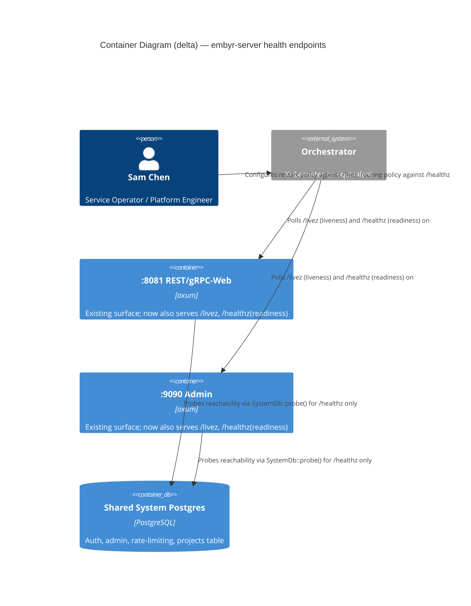

# Feature Delta: healthz-dependency-checks

## Wave: DISCUSS / [REF] Reading Confirmation

✓ `docs/product/production-readiness-audit-2026-09-08.md` read for finding #15 (High, DevOps/SRE),
confirmed verbatim: *"`/healthz` is a hardcoded `200 OK` with zero dependency checks — no
liveness/readiness split. An orchestrator has no way to detect a pod whose Postgres connection died
mid-flight. Confirmed independently by 2 agents (DevOps + SRE)."* Cites
`crates/embyr-server/src/grpc/healthz.rs:4-6`, "mounted on both :8081 and :9090."

✓ `crates/embyr-server/src/grpc/healthz.rs` read in full (6 lines). Confirmed exactly as described:
`healthz_handler` takes no state, no arguments, and unconditionally returns
`(StatusCode::OK, Json({"status":"ok"}))` — no Postgres call, no dependency check of any kind.

✓ Confirmed both mount points by direct grep + read, not by trusting the audit's citation alone:
- `crates/embyr-server/src/lib.rs:349` — `spawn_all_servers`'s `axum_app` (the :8081 REST/gRPC-Web
  surface) mounts `.route("/healthz", axum::routing::get(grpc::healthz::healthz_handler))` on a
  router built with `bc_state` (`BrowserChannelState`) — `healthz_handler` itself uses no state, so
  this compiles regardless of router state type.
- `crates/embyr-server/src/main.rs:285` — the production admin router (:9090) has
  `.route("/healthz", ...)` chained onto `build_admin_router(...)`'s return value, same handler.
- `crates/embyr-server/src/main.rs:977` (a test-server constructor) mounts the identical route the
  identical way — confirming this is not production-only wiring but the one shared handler reused
  everywhere `/healthz` appears.
- Both mounts import the SAME `grpc::healthz::healthz_handler` — one function, two routes, zero
  divergence today. `crates/embyr-server/src/rest/grpc_web.rs`'s own module doc (lines 8-12, 124)
  independently confirms `/healthz` is dispatched through the axum side of the gRPC-Web/native-gRPC
  content-type splitter for :8081, not accidentally shadowed by the gRPC service.

✓ `docs/evolution/2026-08-09-production-readiness.md` and
`docs/feature/production-readiness/feature-delta.md` read for any prior health-check convention.
Confirmed JOB-13's own functional dimension already treats `GET :{admin_port}/healthz` as the
"server is up and ready to receive traffic" signal for the walking skeleton itself — NOT merely a
liveness ping. Confirmed via the actual regression tests, not just doc prose:
- `tests/production_readiness/acceptance/pr01_config_from_env.rs:35-61`
  (`server_starts_with_all_required_env_vars_set`, `@walking_skeleton`) polls
  `GET :{admin_port}/healthz` via a `wait_for_healthy()` helper and treats HTTP 200 as "the server
  completed migrations, probed SystemDb, and bound all 3 listeners" — i.e., this test ALREADY
  expects `/healthz` to mean more than "the process is running," even though today's implementation
  cannot actually fail this way (it is hardcoded).
- `tests/production_readiness/acceptance/pr04_graceful_shutdown.rs:29-40` uses
  "`/healthz` returns 200" as its own precondition for "the server is running and healthy."
- `tests/production_readiness/acceptance/pr01_config_from_env.rs:347-393`
  (`non_default_ports_respected`) polls the SAME `/healthz` route on a custom `ADMIN_PORT`.

**This is a load-bearing fact for scope**: `/healthz` is not a green-field endpoint — it already has
an established, tested MEANING in this codebase ("the server has finished startup and is ready"),
just no REAL check backing that meaning today. Any redesign must not silently break these 3 existing
regression tests, which all run against a REAL, reachable Postgres (testcontainers) — so a readiness
check that fails only when Postgres is actually unreachable will not flip any of them from green to
red.

✓ `crates/embyr-server/src/adapters/system_db.rs:220-330` read in full. Confirmed an existing,
already-tested primitive: `SystemDb::probe(&self) -> Result<(), CoreError>` (lines 310-330) — runs
`SELECT 1` then checks `information_schema.tables` for the `projects` table, returning
`CoreError::BackendUnavailable` on either failure. Confirmed by its own unit tests
(`probe_returns_ok_when_db_reachable_and_schema_current`,
`probe_returns_err_when_unreachable`, lines 1750-1774) that this ALREADY does exactly what a
readiness check needs: a cheap, real "can I reach Postgres and is the schema sane" signal. Today it
is called exactly ONCE, at startup (`main.rs` Step 6, per its own module doc comment,
`main.rs:9`) — never again during the process's life. **No new "is the pool healthy" primitive needs
to be invented — this feature's core gap is that an already-existing check is never called again
after startup.**

✓ `crates/embyr-server/src/grpc/handler.rs:72-73` read: `FirestoreService.system_db: Arc<SystemDb>`
is a public field, already present on the struct passed into `spawn_all_servers` (as `service`) —
confirmed reachable from the :8081 axum app's construction site without adding a new dependency.
Confirmed separately that the admin router's own state (`UserAdminState`, referenced via
`state.system_db.pool()` in `crates/embyr-server/src/admin/handlers/auth.rs`) already carries the
same `Arc<SystemDb>` on the :9090 side. **Both mount points already have a live path to
`SystemDb::probe()` without threading any new shared state through the composition root.**

✓ `docs/evolution/2026-08-08-observability.md` and `crates/embyr-server/src/observability.rs` read.
Confirmed Prometheus's own recorder (`get_or_install_prometheus_handle`) tracks gRPC request
counters/histograms and rate-limiter counters (JOB-12) — it does NOT expose any continuously-updated
"is Postgres reachable right now" gauge or signal a `/healthz`-style check could piggyback on. No
duplicate signal exists to reuse or conflict with; `SystemDb::probe()` (above) is the only existing
"can I reach Postgres" primitive in the codebase.

✓ `docs/evolution/2026-09-09-realtime-listener-reconnect.md` and
`tests/production_readiness/acceptance/pr08_realtime_listener_reconnect.rs` read for prior art on
simulating a real Postgres outage in a test. Confirmed the established mechanism in this workspace:
`ContainerAsync::stop()` / `::start()` on a testcontainers Postgres instance (module doc, lines
49-64: "no 'pause Postgres' helper exists yet in this workspace to reuse... stop/start is written
fresh here"), with a documented caveat that Docker assigns a new random host port on `start()` after
`stop()` (handled there via reconnection logic). Confirmed this feature is a DIFFERENT concern
(LISTEN/NOTIFY realtime delivery reconnect, not an HTTP health-check endpoint) — cited here only as
reusable test infrastructure for proving this feature's own "Postgres goes down mid-flight" scenario
against a real container, not as overlapping scope.

✓ `docs/product/jobs.yaml` read in full (JOB-01 through JOB-20). See § Persona & Job.

## Wave: DISCUSS / [REF] Investigation Findings

### Investigation 1 — the fix is "call an existing check again, on a schedule/on-demand," not "invent dependency-health monitoring from scratch"

`SystemDb::probe()` already exists, is already unit-tested, and already expresses exactly the
dependency check finding #15 asks for ("can this process actually reach Postgres"). The entire gap is
that it runs once, at startup, and never again — so a pod whose Postgres connection dies at minute 47
of uptime has no mechanism that would ever notice. This reframes the feature from "design a health
check" to "make an already-correct check observable on an ongoing basis, and expose its result over
the two existing HTTP mounts." Elephant Carpaccio ladder: reuse (rung 2), not invent (rung 7).

### Investigation 2 — liveness and readiness must answer DIFFERENT questions, and conflating them creates a new failure mode: the restart-storm anti-pattern

The audit's own language ("no liveness/readiness split") already names the gap precisely. Kubernetes
(and any orchestrator implementing the same two-signal model) uses the two probes for **opposite
remediations**:
- **Liveness** answers "is this process wedged/deadlocked and does restarting it help?" A failing
  liveness probe causes the orchestrator to KILL and restart the pod.
- **Readiness** answers "can this pod usefully serve traffic right now?" A failing readiness probe
  causes the orchestrator to STOP ROUTING traffic to the pod, without touching the process.

If a liveness check also depends on Postgres reachability (the naive, single-endpoint
implementation this finding is explicitly about), then a Postgres outage — which a restart cannot
fix — causes the orchestrator to kill and restart EVERY pod in the fleet simultaneously. This:
(a) does nothing to restore Postgres, (b) destroys any in-flight request each pod was draining, and
(c) creates a reconnection storm against Postgres at the exact moment it is already struggling,
worsening the outage it was meant to detect. This is not a hypothetical — it is the single most
commonly cited Kubernetes health-check anti-pattern precisely because "add a DB check to /healthz"
is the natural first instinct. **This finding's fix must actively prevent this anti-pattern, not just
add a check somewhere** — the requirement is not merely "check Postgres" but "check Postgres in the
signal an orchestrator would use to stop ROUTING traffic to a pod, and explicitly not in the signal
it would use to RESTART the pod."

### Investigation 3 — the dependency check must be scoped to the shared system Postgres pool, not per-tenant customer databases

`embyr-server` is a multi-tenant protocol translation layer: each customer project's actual document
data lives in a per-tenant Postgres connection (BYOC `direct_pg`, `aws_secret`/`gcp_secret`-sourced,
or `agent`-mode via `embyr-agent`), established dynamically per project, not a single fixed pool the
process holds at startup. The SHARED system Postgres pool (`SystemDb`, used for auth, admin API,
rate limiting, and the very migrations-then-probe startup gate JOB-13 already established) is the
one dependency whose failure genuinely means "this instance of embyr-server cannot serve ANY
traffic usefully" — auth and rate-limiting sit in front of every request regardless of which tenant
it targets. Probing every active tenant's customer database on every health check would be (a)
unbounded in cost (grows with active-project count, not O(1)), (b) a availability question about
ONE tenant, not the whole instance (a single dead customer DB should not make the orchestrator stop
routing traffic for every OTHER tenant sharing the pod), and (c) not what finding #15 itself
describes — it names "a pod whose Postgres connection died," singular, matching the shared system
pool `SystemDb::probe()` already checks at startup. **Scope: the readiness check reuses
`SystemDb::probe()` against the shared system database only.** Per-tenant customer-database health
is an explicitly separate, already-partially-covered concern (each request that touches a dead
customer DB already fails with its own error today) and is not reopened by this feature.

## Wave: DISCUSS / [REF] Open Design Questions (named, not locked)

- **OQ-HDC-01 (endpoint naming/split)**: whether `/healthz` is REDEFINED to mean readiness (backed by
  a real `SystemDb::probe()` call) with a NEW, separate endpoint (e.g. `/livez`) added for pure
  liveness, or whether `/healthz` keeps meaning pure liveness (unchanged) and a NEW `/readyz` is
  added for the dependency check. DISCUSS recommends the FIRST shape: `/healthz` already has an
  established, tested meaning in this codebase as "ready to serve" (§ Reading Confirmation — 3
  existing regression tests already poll it as a startup-readiness gate, always against a real,
  reachable Postgres, so redefining it to be REAL rather than hardcoded does not flip any of them
  red), so preserving that existing name/meaning and ADDING a new liveness-only endpoint is the
  smaller, non-breaking change. DESIGN may instead choose the more conventional
  `/healthz`=liveness+`/readyz`=readiness split if it judges strict naming-convention alignment with
  external orchestrator tooling outweighs preserving `/healthz`'s existing in-repo meaning — either
  choice satisfies this story's ACs, which are written at the observable-outcome level (a liveness
  signal that never depends on Postgres; a readiness signal that does), not the URL path.
- **OQ-HDC-02 (probe frequency/caching)**: whether the readiness endpoint calls `SystemDb::probe()`
  fresh on every request (simplest, matches `probe()`'s own existing cheap `SELECT 1` cost) or caches
  the last result for a short window to bound load from a high-frequency orchestrator polling
  interval (Kubernetes defaults to `periodSeconds: 10`, which is low-volume, but DESIGN should
  confirm this isn't amplified by multiple replicas × multiple orchestrator layers). DISCUSS
  recommends calling fresh on every request given `probe()`'s own cost is one indexed `SELECT 1` plus
  one small `information_schema` lookup — but does not lock this against DESIGN finding evidence for
  caching being warranted.
- **OQ-HDC-03 (probe timeout)**: `SystemDb::probe()` today has no explicit query timeout of its own —
  it inherits whatever `sqlx`/pool-level defaults apply. A hung (not merely down) Postgres could make
  a readiness check itself hang past the orchestrator's own probe timeout, which orchestrators
  already treat as a failure — DESIGN should confirm whether an explicit shorter timeout is needed
  specifically for the health-check call path so a hung DB reads as "unhealthy" promptly rather than
  the orchestrator's own possibly-longer probe timeout being the only backstop.

## Wave: DISCUSS / [REF] Orchestrator Decisions (not re-litigated)

- Feature type: **Backend/infrastructure** — no user-facing UI, no customer-visible surface; the
  "user" of this feature is the deployment orchestrator and the operator who configures it. No
  journey artifact, no TUI mockup, no emotional-arc YAML (mirrors this session's established
  precedent for this class of finding: `production-readiness`, `realtime-listener-reconnect`,
  `admin-signin-hardening`).
  Explicitly deferred: full K8s manifest authoring (probe YAML, Helm chart) is finding #19's own
  separate, much larger gap ("no deployment automation... no K8s manifests"). This feature's own
  scope is the SERVER-SIDE endpoint behavior an eventual manifest would call — not producing the
  manifest itself.
- Scope: **single, well-localized finding** (#15 only). Related-but-separate findings explicitly NOT
  bundled: #16 (pool sizing/`acquire_timeout` hardcoded small), #18 (no backup/DR docs), #19 (no K8s
  manifests/Helm chart at all), #29 (no Grafana dashboard/runbook for "the Postgres-down-after-startup
  scenario in #15" — #29 itself names #15 as a prerequisite, confirming these are sequenced, not
  merged, findings).
- JTBD: reuse an existing job — **JOB-13 (`production-deployment`)**, not a new job (§ Persona & Job).
- Walking Skeleton: **Yes** — a real running `embyr-server` against a real Postgres container
  (testcontainers, mirroring `pr08_realtime_listener_reconnect.rs`'s own `stop()`/`start()`
  mechanism), proving (a) the liveness signal stays healthy throughout a Postgres outage and (b) the
  readiness signal turns unhealthy while Postgres is down and recovers once it returns — on BOTH the
  :8081 and :9090 mounts.
- UX Research Depth: **None** — backend dependency-health endpoint; no emotional arc, no journey YAML,
  no TUI mockup applies.

## Wave: DISCUSS / [REF] Persona & Job

**Persona**: **P2 Sam Chen (Service Operator / Platform Engineer)** — the operator who deploys and
runs `embyr-server` under an orchestrator (Kubernetes or equivalent) and needs that orchestrator to
make correct, automated decisions about a pod's process health and traffic-routing eligibility
without Sam having to manually notice and intervene during a Postgres outage.

**Job**: **JOB-13 `production-deployment`**, reused. JOB-13's own functional dimension already
establishes the startup-time version of exactly this promise ("server runs 18 migrations, probes
system DB... logs 'embyr-server ready'... no traffic is accepted until migrations and DB probe
succeed") and its own habit force already names the exact operating context this finding lives in
("Sam is used to Kubernetes + Docker deployments... the embyr-server must follow 12-factor app
conventions"). This finding is the natural POST-startup extension of the same promise: JOB-13 today
only proves the dependency is healthy ONCE, at the moment of process start; this feature extends that
same guarantee to hold continuously for the life of the pod, using the orchestrator's own
already-conventional liveness/readiness mechanism. This mirrors this session's own established
pattern of extending JOB-13 via a dated NOTE for a closely-related deployment-behavior concern rather
than creating a new job (see `docs/product/jobs.yaml` JOB-13's existing
`firestore-tls-support`-DISCUSS NOTE for the same precedent shape).

**Candidates considered and rejected**:
- **JOB-12 (`observability`, P2 Sam Chen)** — about querying `/metrics` on the admin port to diagnose
  a problem a human is already investigating. Rejected: this finding is about an AUTOMATED
  orchestrator decision (restart vs. stop-routing) made continuously without a human in the loop, not
  about a dashboard a human consults after the fact. The two are complementary (a future runbook,
  finding #29, would likely reference both), not the same job.
- **JOB-11 (`fair-multitenancy`, P2 Sam Chen)** — about per-project request-rate fairness across
  tenants sharing one deployment. Rejected: no functional overlap — this finding has nothing to do
  with rate limiting or tenant fairness.
- **`infrastructure-only`** — considered because the fix is a backend endpoint change with no
  customer-facing surface. Rejected: Sam Chen makes a real, observable decision with this feature's
  output (whether to wire the orchestrator's restart policy to the liveness endpoint and its
  traffic-routing policy to the readiness endpoint, and what to tell a security/SRE reviewer about
  how a Postgres outage is now handled) — see § Elevator Pitch below — so this qualifies as a
  JOB-13-traced story, not infrastructure-only, per Dimension 0 of the review criteria.

## Wave: DISCUSS / [REF] Scope Assessment (Elephant Carpaccio Gate)

**Signals checked**: >10 user stories? No (2). >3 bounded contexts/modules? No — one file
(`crates/embyr-server/src/grpc/healthz.rs`) plus its two existing mount points
(`lib.rs`/`main.rs`), reusing an already-existing `SystemDb::probe()` with zero `embyr-core` or
`embyr-pg-storage` changes. Walking skeleton >5 integration points? No (3: the liveness endpoint, the
readiness endpoint, and the shared system Postgres pool whose real reachability is being surfaced).
Estimated effort >2 weeks? No — reuses an already-implemented, already-tested probe; well under 2
days including both mount points and a real-Postgres-outage integration test. Multiple independent
user outcomes? Two, cleanly outcome-sliced (below), not by technical layer.

**Verdict: PASS.** Two right-sized, outcome-sliced stories; no further split needed.

## Wave: DISCUSS / [REF] System Constraints

- `embyr-core` remains IO-free and is not touched — this feature is entirely inside `embyr-server`,
  reusing `SystemDb::probe()` (already `embyr-server`-resident, already IO-capable by design) and its
  two existing HTTP mount points.
- The readiness signal is scoped to the SHARED SYSTEM Postgres pool only (Investigation 3) — it does
  NOT probe any per-tenant customer database. This is an explicit, evidence-based scope boundary, not
  an oversight.
- The liveness signal MUST NOT depend on Postgres reachability, or on any other external dependency —
  it answers "is this process itself alive and not deadlocked," nothing else (Investigation 2). This
  is a hard constraint preventing the restart-storm anti-pattern named above, and is treated as a
  blocking regression guard, not a nice-to-have.
- The 3 existing regression tests that already poll `GET /healthz` as a startup-readiness gate
  (`pr01_config_from_env.rs`'s `server_starts_with_all_required_env_vars_set` and
  `non_default_ports_respected`, `pr04_graceful_shutdown.rs`) must continue to pass unchanged — all 3
  run against a real, reachable Postgres, so a readiness check that fails only on genuine
  unreachability does not flip them (§ Reading Confirmation).
- Exact endpoint naming/path split (OQ-HDC-01), probe caching (OQ-HDC-02), and probe-specific timeout
  (OQ-HDC-03) are explicit DESIGN choices — DISCUSS locks only the observable, testable outcomes
  below, not the mechanisms or paths.

## Wave: DISCUSS / [REF] User Stories

### US-01: A Wedged Process Gets Restarted; a Postgres Outage Does Not Trigger a Restart Storm

**job_id**: JOB-13 | **Release**: 1 (Walking Skeleton) | **Persona**: P2 Sam Chen

#### Elevator Pitch
**Before**: Sam Chen runs `embyr-server` under Kubernetes with a liveness probe pointed at
`/healthz`. Today that endpoint is a hardcoded `200 OK`, so Kubernetes can never tell whether the
process itself is wedged — but if a future fix naively adds a Postgres check to the SAME endpoint
liveness already polls, a real Postgres outage would cause Kubernetes to kill and restart every pod
in the fleet simultaneously, which fixes nothing (restarting doesn't restore Postgres) and adds a
reconnection storm on top of an already-degraded database.
**After**: Sam Chen can point Kubernetes's liveness probe at a signal that reflects only whether the
`embyr-server` process itself is alive and responsive — cheap, no external calls — so a genuinely
wedged process still gets restarted, while a Postgres outage never causes Kubernetes to restart a
single pod because of it.
**Decision enabled**: Sam Chen can configure the orchestrator's restart policy with confidence that a
downstream Postgres outage will never be misread as "this pod needs restarting," avoiding a
self-inflicted restart storm during the exact incident Sam is already responding to.

#### Who
- Sam Chen (P2) | Service Operator / Platform Engineer running `embyr-server` under Kubernetes (or an
  equivalent orchestrator) | Needs the orchestrator's restart decision to be based only on the
  process's own health, never on a downstream dependency a restart cannot fix.

#### Solution
A liveness signal, exposed over both existing HTTP mounts (:8081 and :9090), that responds
successfully whenever the `embyr-server` process is running and able to handle an HTTP request at
all — performing no Postgres call, no external I/O of any kind. Exact endpoint path/naming is
OQ-HDC-01.

#### Domain Examples

**Example 1 (Happy Path — regression guard)**: Sam Chen's 3-pod `embyr-server` deployment is running
normally, Postgres is fully reachable. The liveness signal returns healthy on all 3 pods, matching
today's `GET /healthz` behavior byte-for-byte for this case.

**Example 2 (Core scenario — the anti-pattern this story exists to prevent)**: Fernbank Analytics'
shared Postgres instance becomes completely unreachable for 6 minutes (network partition). During
those 6 minutes, the liveness signal on all 3 `embyr-server` pods continues to return healthy —
Kubernetes does not restart any pod because of the outage. Once Postgres becomes reachable again, no
pod has been needlessly restarted or lost any in-flight, unrelated work.

**Example 3 (Error/Boundary — the case liveness DOES exist to catch)**: A future regression
introduces a deadlock in the process's own async runtime (unrelated to Postgres). The liveness
signal stops responding within the orchestrator's configured probe timeout, and Kubernetes restarts
the pod — the process's own health, not Postgres's, is what this signal is proven to reflect.

#### UAT Scenarios (BDD)

```gherkin
Scenario: Liveness reports healthy under normal operation
  Given embyr-server is running with Postgres fully reachable
  When the orchestrator's liveness probe is checked
  Then the liveness signal responds successfully

Scenario: A sustained Postgres outage does not fail the liveness signal
  Given embyr-server is running normally
  When the shared system Postgres becomes completely unreachable for 6 minutes
  Then the liveness signal continues to respond successfully throughout the outage
  And the orchestrator does not restart the pod because of the outage

Scenario: Liveness performs no external dependency call
  Given the liveness endpoint is invoked
  Then no query or connection attempt reaches Postgres or any other external dependency as part of answering it

@property
Scenario: Liveness responds quickly regardless of downstream dependency state
  Given the shared system Postgres is in any reachable-or-unreachable state
  Then the liveness signal responds within a small, constant time bound that does not vary with Postgres's own latency or availability
```

#### Acceptance Criteria
- [ ] AC-HDC-01: the liveness signal returns a successful response whenever the `embyr-server`
      process is running and able to handle HTTP requests, independent of Postgres reachability.
- [ ] AC-HDC-02: the liveness signal's handler makes zero calls to Postgres or any other external
      dependency — verified by test, not by code inspection alone.
- [ ] AC-HDC-03: during a real, sustained Postgres outage (proven via a real Postgres
      container being stopped, mirroring `pr08_realtime_listener_reconnect.rs`'s own mechanism), the
      liveness signal continues to respond successfully for the duration of the outage on both the
      :8081 and :9090 mounts.
- [ ] AC-HDC-04 (regression guard): `server_starts_with_all_required_env_vars_set`,
      `non_default_ports_respected`, and the graceful-shutdown test's own "`/healthz` returns 200"
      precondition all continue to pass unchanged.

#### Outcome KPIs
- **Who**: Sam Chen (Service Operator/Platform Engineer) and any orchestrator configured against
  `embyr-server`.
- **Does what**: the orchestrator's restart decision is driven by a signal that reflects only process
  health, never Postgres reachability.
- **By how much**: from "no distinction exists" (0 of 2 required signals present, per finding #15) to
  a liveness signal proven, by a real-Postgres-outage integration test, to never flip unhealthy due to
  a downstream dependency.
- **Measured by**: AC-HDC-03 — a real testcontainers Postgres `stop()`/`start()` cycle with continuous
  liveness polling throughout.
- **Baseline**: today's hardcoded `200 OK` happens to satisfy this story's liveness requirement by
  accident (it also never depends on Postgres) — but provides no evidence it was designed to, and
  provides zero signal for US-02's own readiness requirement, which today's implementation cannot
  satisfy at all.

#### Technical Notes
- Exact endpoint path (OQ-HDC-01) is a DESIGN choice; DISCUSS recommends redefining `/healthz` as
  readiness (US-02) and adding a new endpoint for this story's liveness signal, given `/healthz`'s
  already-established meaning in this codebase (§ Reading Confirmation).
- No new Cargo dependency, no schema change, no `embyr-core` change.
- Depends on nothing outside `embyr-server`.

---

### US-02: An Orchestrator Stops Routing Traffic to a Pod Whose Postgres Connection Died Mid-Flight

**job_id**: JOB-13 | **Release**: 1 (Walking Skeleton) | **Persona**: P2 Sam Chen

**Depends on**: None (independent of US-01; both may ship in the same slice).

#### Elevator Pitch
**Before**: Sam Chen's `embyr-server` deployment has no way for Kubernetes (or any orchestrator) to
know that a specific pod's connection to the shared system Postgres has died mid-flight — every pod
reports the identical hardcoded `200 OK` regardless of whether it can actually serve auth, sessions,
or the admin API. A pod in this state keeps receiving traffic and keeps reporting healthy, silently
failing every real request while looking fine to the orchestrator.
**After**: Sam Chen can point the orchestrator's readiness probe at a signal that reflects real,
current reachability of the shared system Postgres — reusing the exact `SystemDb::probe()` check
already proven at startup — so a pod whose Postgres connection dies mid-flight is automatically
removed from the traffic-serving pool (without being restarted, per US-01), and automatically
rejoins once Postgres is reachable again.
**Decision enabled**: Sam Chen can trust that an unhealthy pod stops receiving new traffic
automatically, without manual intervention or a customer-facing outage going unnoticed until someone
checks a dashboard, and can show a reviewer that finding #15's own named failure mode ("no way to
detect a pod whose Postgres connection died mid-flight") now has a real, tested, automated detection
and remediation path.

#: Who
- Sam Chen (P2) | Service Operator / Platform Engineer running `embyr-server` under an orchestrator |
  Needs a pod that can no longer reach the shared system Postgres to stop receiving new traffic
  automatically, without the pod being killed (a restart would not fix a Postgres outage).

#### Solution
A readiness signal, exposed over both existing HTTP mounts (:8081 and :9090), that calls the
already-existing `SystemDb::probe()` and reports unhealthy whenever that call fails, healthy
whenever it succeeds — reusing today's startup-time dependency check on an ongoing basis rather than
running it once and discarding the result. Scoped to the shared system Postgres pool only
(Investigation 3) — not per-tenant customer databases. Exact endpoint path/naming is OQ-HDC-01;
probe caching and timeout are OQ-HDC-02/03.

#### Domain Examples

**Example 1 (Happy Path — regression guard)**: Sam Chen's `embyr-server` pod is running normally with
the shared system Postgres fully reachable. The readiness signal returns healthy, matching today's
`GET /healthz` behavior for this case — the 3 existing startup-readiness regression tests
(§ Reading Confirmation) continue to pass unchanged.

**Example 2 (Core scenario — the exact gap finding #15 names)**: One of Sam Chen's 3
`embyr-server` pods loses its connection to the shared system Postgres (network partition local to
that pod, or the pool's connections are exhausted/dead) while the other 2 pods remain healthy. The
affected pod's readiness signal turns unhealthy within one probe interval; Kubernetes stops routing
new requests to that pod while leaving it running (not restarting it, per US-01); the other 2 pods
continue serving traffic normally.

**Example 3 (Recovery — the signal must self-heal, not latch)**: Continuing Example 2, the network
partition resolves and the affected pod's Postgres connection becomes reachable again. Its readiness
signal returns to healthy on the very next probe, and Kubernetes resumes routing traffic to it —
with no manual intervention, no restart, and no stale "still unhealthy" state persisting past
Postgres's own actual recovery.

#### UAT Scenarios (BDD)

```gherkin
Scenario: Readiness reports healthy when the shared system Postgres is reachable
  Given embyr-server is running with the shared system Postgres fully reachable
  When the orchestrator's readiness probe is checked
  Then the readiness signal responds successfully

Scenario: Readiness turns unhealthy when the shared system Postgres becomes unreachable
  Given embyr-server is running normally
  When the shared system Postgres becomes unreachable (a real Postgres container is stopped)
  Then the readiness signal responds unhealthy within one probe interval
  And the orchestrator stops routing new traffic to that pod
  And the pod is not restarted because of this signal alone

Scenario: Readiness recovers automatically once Postgres becomes reachable again
  Given the readiness signal is currently unhealthy due to a Postgres outage
  When the Postgres connection becomes reachable again
  Then the readiness signal returns to healthy on the next check
  And the orchestrator resumes routing traffic to that pod without manual intervention

Scenario: Readiness is reported consistently across both existing HTTP mounts
  Given embyr-server exposes readiness on both its :8081 and :9090 HTTP surfaces
  When the shared system Postgres is unreachable
  Then both mounts report the same unhealthy readiness result

Scenario: Existing startup-readiness regression tests are unaffected
  Given the 3 existing tests that already poll GET /healthz as a startup-readiness gate
  When they run against a real, reachable Postgres exactly as they do today
  Then all 3 continue to pass unchanged
```

#### Acceptance Criteria
- [ ] AC-HDC-05: the readiness signal returns unhealthy whenever the shared system Postgres is
      unreachable, reusing `SystemDb::probe()`'s existing reachability/schema check.
- [ ] AC-HDC-06: the readiness signal returns healthy whenever `SystemDb::probe()` succeeds.
- [ ] AC-HDC-07: during a real Postgres outage (real container `stop()`), the readiness signal turns
      unhealthy within one orchestrator probe interval and recovers to healthy within one probe
      interval of Postgres becoming reachable again (real container `start()`) — proven by a real
      integration test, not by code inspection alone.
- [ ] AC-HDC-08: the readiness result is consistent across both the :8081 and :9090 mounts for the
      same Postgres state.
- [ ] AC-HDC-09 (regression guard): `server_starts_with_all_required_env_vars_set`,
      `non_default_ports_respected`, and the graceful-shutdown test's own "`/healthz` returns 200"
      precondition all continue to pass unchanged, since all 3 run against a real, reachable
      Postgres.
- [ ] AC-HDC-10 (scope guard): the readiness check calls only the shared system Postgres probe — it
      does not attempt to reach any per-tenant customer database.

#### Outcome KPIs
- **Who**: Sam Chen (Service Operator/Platform Engineer) and every tenant sharing a deployment where
  a pod's system-Postgres connection could die mid-flight.
- **Does what**: an orchestrator automatically stops routing traffic to a pod whose shared system
  Postgres connection is unreachable, and automatically resumes once it recovers.
- **By how much**: from "zero detection, 100% of pods always report healthy regardless of Postgres
  state" (finding #15's own confirmed baseline) to detection and remediation within one probe
  interval in both directions (fail and recover), proven against a real Postgres outage.
- **Measured by**: AC-HDC-07 — a real testcontainers Postgres `stop()`/`start()` cycle with
  continuous readiness polling throughout, asserting the unhealthy window is bounded to
  approximately one probe interval on each transition.
- **Baseline**: today's hardcoded `200 OK` provides zero detection of any Postgres outage, confirmed
  by direct code reading (§ Reading Confirmation).

#### Technical Notes
- Reuses `SystemDb::probe()` (`crates/embyr-server/src/adapters/system_db.rs:310-330`) verbatim —
  already implemented, already unit-tested. No new Cargo dependency, no schema change, no
  `embyr-core` edit.
- OQ-HDC-01 (endpoint path), OQ-HDC-02 (probe caching), OQ-HDC-03 (probe-specific timeout) are named
  DESIGN decisions — this story's ACs are written at the observable-outcome level and do not depend
  on any of the three.
- Test infrastructure: mirrors `pr08_realtime_listener_reconnect.rs`'s own testcontainers
  `stop()`/`start()` mechanism for simulating a real Postgres outage (§ Reading Confirmation) — no
  new outage-simulation mechanism needs to be invented.
- Depends on nothing outside `embyr-server`; `embyr-core`, `embyr-pg-storage`, and `embyr-agent` are
  untouched.

## Wave: DISCUSS / [REF] Out of Scope

- **Per-tenant customer-database health checks** — Investigation 3's own scope argument: unbounded
  cost, wrong failure blast-radius (one dead tenant DB should not remove a pod from serving every
  OTHER tenant), and not what finding #15 itself names. AC-HDC-10 makes this an explicit regression
  guard, not a silent omission.
- **Writing the actual Kubernetes manifest / Helm chart wiring these probes up** — finding #19's own,
  much larger, separately-tracked gap ("no deployment automation... no K8s manifests, Helm chart").
  This feature ships the server-side endpoint behavior a manifest would call; authoring the manifest
  itself is out of scope here.
- **Postgres pool sizing / `acquire_timeout` configuration** (finding #16, same audit, different
  file/mechanism) — not fixed, not touched, explicitly a separate finding.
- **A Grafana dashboard or runbook for the Postgres-down scenario** (finding #29) — the audit's own
  entry for #29 names #15 as a prerequisite ("the Postgres-down-after-startup scenario in #15"),
  confirming these are sequenced, not merged, findings.
- **Structured JSON logging for health-check-related log lines** (finding #25) — unrelated dimension,
  not touched by this feature.

## Wave: DISCUSS / [REF] Walking Skeleton Strategy

US-02's own Scenario 2 and 3 (readiness turns unhealthy during a real Postgres outage and recovers
automatically once Postgres returns), proven together with US-01's Scenario 2 (liveness stays healthy
throughout the SAME outage) in one combined run, is the walking skeleton: a real running
`embyr-server` against a real Postgres container (testcontainers `stop()`/`start()`, mirroring
`pr08_realtime_listener_reconnect.rs`), polling BOTH signals on BOTH the :8081 and :9090 mounts
throughout — not a unit-test-only or mocked proof. This single run demonstrates the finding's entire
required outcome: liveness never lies about a dependency, readiness never lies about the process.

## Wave: DISCUSS / [REF] Driving Ports

HTTP `GET` on `embyr-server`'s existing :8081 (REST/gRPC-Web) and :9090 (Admin) surfaces — the same
two mount points `/healthz` already occupies today (`crates/embyr-server/src/lib.rs:349`,
`crates/embyr-server/src/main.rs:285`). No new listener, no new port — this feature changes the
BEHAVIOR of, and/or adds a sibling route alongside, an already-existing, already-mounted endpoint.

## Wave: DISCUSS / [REF] Pre-requisites

- None blocking. `SystemDb::probe()` already exists, already `pub`, already unit-tested — no new
  Cargo dependency, no migration, no schema change needed. The testcontainers Postgres
  `stop()`/`start()` outage-simulation mechanism already exists in this workspace
  (`pr08_realtime_listener_reconnect.rs`) and is directly reusable for this feature's own walking
  skeleton.

## Wave: DISCUSS / [REF] Definition of Ready Validation

### DoR Checklist (9-item hard gate)

| DoR Item | US-01 | US-02 |
|---|---|---|
| 1. Traces to a job_id | PASS — JOB-13, reused, with 3 candidate alternatives explicitly reasoned against (§ Persona & Job) | PASS — same |
| 2. Elevator Pitch complete | PASS — Before/After/Decision-enabled, real entry point (orchestrator-facing liveness signal on existing HTTP mounts), observable output (probe responds healthy/unhealthy) | PASS — same shape, readiness signal |
| 3. 3+ domain examples, real data | PASS — Sam Chen's 3-pod deployment, Fernbank Analytics' Postgres outage scenario, deadlock/recovery cases with concrete durations | PASS — same deployment scenario, recovery example |
| 4. UAT in Given/When/Then (3-7) | PASS — 4 scenarios (3 regular + 1 `@property`) | PASS — 5 scenarios |
| 5. AC derived from UAT | PASS — AC-HDC-01 through 04 | PASS — AC-HDC-05 through 10 |
| 6. Right-sized (1-3 days, 3-7 scenarios) | PASS — reuses an existing pattern (hardcoded-but-already-correct-shape handler); under 1 day | PASS — reuses an existing, already-tested probe; under 2 days including the outage integration test |
| 7. Technical notes identify constraints | PASS — OQ-HDC-01 (naming) named, not locked | PASS — OQ-HDC-01/02/03 named, not locked |
| 8. Outcome KPIs with numeric target | PASS — zero-dependency-on-Postgres proven via real outage test | PASS — bounded-to-one-probe-interval detection/recovery, measured by real outage test |
| 9. Prior-wave artifacts reconciled | PASS — audit finding #15, `healthz.rs`, both mount points, `SystemDb::probe()`, 3 existing regression tests, `pr08_realtime_listener_reconnect.rs` outage mechanism, `docs/product/jobs.yaml` JOB-11/12/13 all directly informed this feature's shape | PASS — same |

### DoR Status: **PASSED**

## Wave: DISCUSS / [REF] Wave Decisions Summary

### Key Decisions
- [D1] Persona/job: **P2 Sam Chen / JOB-13 (`production-deployment`)**, reused — not JOB-12
  (observability/dashboards, a human-in-the-loop diagnostic job, not an automated orchestrator
  decision) or JOB-11 (fair-multitenancy, unrelated dimension) (§ Persona & Job).
- [D2] The fix reuses the already-existing, already-tested `SystemDb::probe()` — this feature is
  "call an existing check on an ongoing basis and expose its result," not "invent dependency-health
  monitoring" (§ Investigation 1).
- [D3] Liveness and readiness are REQUIRED to answer different questions: liveness must never depend
  on Postgres (prevents a restart-storm anti-pattern during a Postgres outage); readiness must depend
  on the shared system Postgres's real reachability. This is a hard, testable constraint, not a
  stylistic preference (§ Investigation 2).
- [D4] The readiness check is scoped to the SHARED SYSTEM Postgres pool only — per-tenant customer
  databases are explicitly out of scope, both for unbounded-cost reasons and because a single dead
  tenant DB should not remove a pod from serving every other tenant (§ Investigation 3, AC-HDC-10).
- [D5] Exact endpoint naming/path split (`/healthz` redefined vs. new `/readyz`/`/livez`), probe
  caching, and probe-specific timeout are named DESIGN choices (OQ-HDC-01/02/03) — DISCUSS locks only
  the observable, testable outcomes, and recommends preserving `/healthz`'s already-established
  in-repo meaning (readiness) while adding a new endpoint for liveness, given 3 existing regression
  tests already treat `/healthz` as a startup-readiness gate against a real Postgres
  (§ Reading Confirmation).
- [D6] Two outcome-sliced stories, not one and not by technical layer: US-01 (liveness stays
  Postgres-independent) and US-02 (readiness reflects real Postgres reachability) — the two are
  independently valuable and independently testable, mirroring this session's established pattern for
  a single bundled audit finding naming two distinct required signals (§ Scope Assessment).

### Requirements Summary
- Primary need: an orchestrator must be able to distinguish "this process is wedged, restart it" from
  "this process is fine but cannot currently reach Postgres, stop routing traffic to it" — today
  neither signal exists; both hardcode `200 OK`.
- Constraint: the 3 existing regression tests that already treat `GET /healthz` as a
  startup-readiness gate must continue to pass unchanged; the readiness check must be scoped to the
  shared system Postgres pool only, never per-tenant customer databases; the liveness check must
  never depend on Postgres or any external dependency.
- Success looks like: AC-HDC-01 through AC-HDC-10 all passing against a real running `embyr-server`
  and a real Postgres container being stopped and restarted mid-test, with zero regression to any
  existing production-readiness test.

### Handoff Package (to DESIGN — solution-architect)
- This feature-delta.md (DISCUSS section) — job grounding, both existing mount points confirmed,
  existing `SystemDb::probe()` primitive identified for reuse, restart-storm anti-pattern named as a
  hard constraint, 2 user stories with 9 UAT scenarios and 10 acceptance criteria.
- Confirmed exact file/line targets for DESIGN: `crates/embyr-server/src/grpc/healthz.rs` (the
  handler), `crates/embyr-server/src/lib.rs:349` and `crates/embyr-server/src/main.rs:285,977` (both
  mount points), `crates/embyr-server/src/adapters/system_db.rs:310-330` (`SystemDb::probe()`, the
  primitive to reuse for readiness).
- Open DESIGN-level choices: OQ-HDC-01 (endpoint naming/path split — DISCUSS recommends keeping
  `/healthz` as readiness and adding a new liveness endpoint, given 3 existing tests' own established
  usage), OQ-HDC-02 (probe caching), OQ-HDC-03 (probe-specific timeout).
- Flagged, out-of-scope, related findings for DESIGN's own awareness (not this feature's build
  target): #16 (pool sizing), #18 (backup/DR docs), #19 (no K8s manifests — this feature's own output
  is what such a manifest would eventually call), #29 (Grafana dashboard/runbook, which the audit
  itself sequences after #15).

## Wave: DESIGN / [REF] Reading Confirmation (Morgan, solution-architect)

✓ `crates/embyr-server/src/grpc/healthz.rs` (6 lines), `lib.rs:280-420` (`spawn_all_servers`),
`main.rs:240-360` (Step 10-11 composition), `adapters/system_db.rs:200-330` (`SystemDb`/`probe()`),
`grpc/handler.rs:71-90` (`FirestoreService` fields), `admin/state.rs` (`OperatorState`/
`UserAdminState`), `admin/router.rs:80-140` (`build_admin_router` signature/return type) all read
in full or targeted range, independently of DISCUSS's own citations.

✓ Confirmed exact axum wiring, not assumed:
- `spawn_all_servers`'s `axum_app` (:8081) is built as `axum::Router::new().route("/healthz", ...).route("/channel", ...).with_state(bc_state)` — a single fully-resolved `Router<()>` once
  `.with_state()` runs. `service: FirestoreService` (which carries `pub system_db: Arc<SystemDb>`,
  confirmed at `handler.rs:73`) is a function parameter still in scope at this point, before it
  moves into `FirestoreServer::new(service)` later in the same function (`lib.rs:448`) — so
  `Arc::clone(&service.system_db)` is available with zero new plumbing.
- A second stateful sub-router is already merged into `axum_app` the SAME way a new route needs to
  be added: `accounts_bridge_app` (`lib.rs:409-419`) is built as its own
  `axum::Router::new().route(...).with_state(accounts_bridge_state)`, then
  `let axum_app = axum_app.merge(accounts_bridge_app);`. This is the established, already-proven
  pattern in this exact file for adding a route whose handler needs different state than the rest
  of `axum_app` — axum requires a single uniform state type per `Router<S>`; the only way to attach
  a differently-stated handler is to fully resolve it to `Router<()>` first via `.with_state()`,
  then `.merge()`. Confirmed by reading, not assumed from general axum knowledge, because this
  codebase's own conventions (not axum's theoretical API surface) are what the crafter must match.
- `main.rs:268-285`: `build_admin_router(...)` returns `Router` (already `Router<()>` — every
  sub-router inside is resolved to its own state and merged internally), and `.route("/healthz",
  axum::routing::get(healthz_handler))` is chained directly onto that return value. `system_db:
  Arc<SystemDb>` is a local variable in `main.rs` still in scope at this line (passed to
  `build_admin_router` by `Arc::clone(&system_db)`, not moved) — directly available for the new
  route via the identical `Router::new().route(...).with_state(...).merge(...)` shape.
- **Correction to DISCUSS's own citation**: the third mount point is `lib.rs:977`, not `main.rs:977`
  — `start_test_server_with_tls` (`lib.rs:947-989`), which builds its `admin_app` via
  `admin::router::build_with_aws(system_db, ...)` (a different admin-router constructor than
  production's `build_admin_router`, same "returns `Router`, chain `.route()`" shape) and chains
  `.route("/healthz", ...)` onto it at line 977. This mount needs the identical merge treatment.
  One added wrinkle DISCUSS's citation didn't surface: at this call site `system_db: Arc<SystemDb>`
  is passed **by value** into `build_with_aws(system_db, ...)` (consumed, not `Arc::clone`'d) —
  `Arc::clone(&system_db)` for the new `healthz_app` must happen BEFORE that call, not after,
  or the value is already moved.
- **Confirmed, by reading, NOT assumed**: `start_test_server`/`start_test_server_with_keepalive`
  (`lib.rs:544-601`, the in-process test-server helpers most of this workspace's OTHER integration
  tests use — as opposed to the 3 production-readiness regression tests, which spawn the real
  binary as a subprocess via `ServerProcess::start`) build their own `admin_app` via the SAME
  `admin::router::build_with_aws(...)` call but **never chain `.route("/healthz", ...)` onto it at
  all** (`lib.rs:568-573`). `/healthz` (and therefore the new `/livez`) is simply absent from
  those test servers' admin surface today — a pre-existing gap, not something this feature
  introduces or is required to fix. **DESIGN's wiring change touches only the 3 confirmed existing
  mount points (`lib.rs:349`, `lib.rs:977`, `main.rs:285`) — `start_test_server`/
  `start_test_server_with_keepalive`/`start_test_server_with_email_sender`'s `admin_app` are left
  exactly as-is, with or without `/healthz`, matching their current behavior.**

✓ Confirmed the 3 regression tests' actual assertions, not just DISCUSS's prose summary:
`pr01_config_from_env.rs::server_starts_with_all_required_env_vars_set` (line 57) and
`::non_default_ports_respected` (line 391) both assert **`resp.status().as_u16() == 200`** only —
zero assertion on response body/JSON shape. `pr04_graceful_shutdown.rs`'s own precondition is the
same shape. **This means the redesign is free to change `/healthz`'s response body/JSON content —
only the 200 status code, under real-reachable-Postgres conditions, is load-bearing for these 3
tests.**

✓ Confirmed `tokio::time::timeout` is an already-established pattern in this codebase
(`middleware/rate_limit.rs`, `middleware/signin_rate_limit.rs`,
`adapters/postgres_notify_listener.rs`) — no new dependency needed for OQ-HDC-03's timeout.

✓ Confirmed `docs/evolution/2026-09-12-sanitize-backend-error-messages.md` / ADR-075's own scope is
**`Status::internal(` (tonic gRPC) conversion sites only, 26 total** — an HTTP/axum JSON response
body is a structurally different conversion boundary ADR-075 never touched. `SystemDb::probe()`'s
`Err` variants embed raw driver/schema text (`format!("system DB unreachable: {e}")`,
`format!("schema check failed: {e}")`) — if the new `/healthz` handler ever serializes that `Err`
directly into its JSON body, it reopens finding #10's exact class of leak at a NEW, previously
uncovered boundary. Flagged as a design requirement below, not an afterthought.

## Wave: DESIGN / [REF] Architecture Decision

**ADR-078** (new — `docs/product/architecture/adr-078-liveness-readiness-split.md`): `/healthz` is
redefined as **readiness** (backed by a real `SystemDb::probe()` call, shared system pool only); a
new `/livez` endpoint is added for **liveness** (zero I/O, unconditional 200 — literally today's old
hardcoded handler body, unchanged). Both mounted on both :8081 and :9090, mirroring `/healthz`'s own
existing dual-mount.

**Why a new ADR, not a plain extension note** (the pattern used for smaller recent findings, e.g.
#14 `preauth-db-amplification`, which got none): this decision establishes a repo-wide operational
contract — the exact liveness/readiness endpoint-to-semantics mapping — that finding #19's own,
separately-tracked K8s manifest work will depend on to avoid silently reopening the restart-storm
anti-pattern this feature exists to close. ADR-016 (Prometheus `/metrics`) and ADR-017
(production-startup, which established the STARTUP-only probe gate this feature extends to be
ongoing) are related but do not cover this specific split; the naming choice itself
(`/healthz`=readiness, diverging from the common Kubernetes-docs convention of
`/healthz`=liveness) is a genuine, rejected-alternative-bearing decision that needs a durable,
discoverable record beyond this feature-delta doc. Full alternatives analysis, consequences, and
enforcement recommendations are in ADR-078 itself.

## Wave: DESIGN / [REF] Component Design

### `crates/embyr-server/src/grpc/healthz.rs` — changes

Current (6 lines): one handler, `healthz_handler`, no state, unconditional `200 OK`.

New shape (interface-level; crafter owns exact implementation):

- **`livez_handler() -> impl IntoResponse`** — same signature and body as today's
  `healthz_handler`: no arguments, no state, unconditional `(StatusCode::OK, Json({"status":"ok"}))`.
  Zero imports beyond `axum`/`serde_json` — this module-level import list is itself part of the
  contract (ADR-078's enforcement recommendation: a structural guard that this handler's own module
  never imports `SystemDb`/`sqlx`/any adapter type).
- **`healthz_handler(State(system_db): State<Arc<SystemDb>>) -> impl IntoResponse`** (renamed
  conceptually to "readiness handler," name kept as `healthz_handler` since the URL path
  `/healthz` is unchanged — avoids a confusing name/path mismatch):
  - Calls `tokio::time::timeout(Duration::from_secs(3), system_db.probe())`.
  - `Ok(Ok(()))` → `(StatusCode::OK, Json({"status":"ok"}))` — byte-identical to today's success
    body, preserving the 3 regression tests' 200-status expectation.
  - `Ok(Err(_))` (probe failed) or `Err(_)` (3s timeout elapsed) → `(StatusCode::SERVICE_UNAVAILABLE,
    Json({"status":"unhealthy"}))`. **The `CoreError`'s `Display` text (or any timeout detail) is
    NEVER included in the response body** — fixed, generic string only, same principle ADR-075
    applies at its own (different) boundary. This is a hard AC, not a style preference (see
    Acceptance Criteria Additions below).
  - `Arc<SystemDb>` is threaded via axum's per-route `State` extractor (see Router Wiring below),
    not a new field on any existing shared struct.

### Router Wiring — :8081 (`lib.rs`, `spawn_all_servers`)

```
let readyz_state = Arc::clone(&service.system_db);           // before `service` moves into FirestoreServer::new()
let healthz_app = axum::Router::new()
    .route("/livez", axum::routing::get(healthz::livez_handler))
    .route("/healthz", axum::routing::get(healthz::healthz_handler))
    .with_state(readyz_state);
let axum_app = axum::Router::new()
    // "/healthz" route REMOVED from this Router::new() chain — moved into healthz_app above
    .route("/channel", axum::routing::get(...).post(...))
    .with_state(bc_state);
let axum_app = axum_app.merge(healthz_app).merge(accounts_bridge_app);
```

Mirrors the EXISTING `accounts_bridge_app` merge pattern verbatim (`lib.rs:409-419`) — no new axum
concept introduced, no new dependency, smallest diff that is also idiomatic for this codebase.

### Router Wiring — :9090 (`main.rs`, Step 10)

```
let healthz_app = axum::Router::new()
    .route("/livez", axum::routing::get(healthz::livez_handler))
    .route("/healthz", axum::routing::get(healthz::healthz_handler))
    .with_state(Arc::clone(&system_db));
let admin_app = build_admin_router(Arc::clone(&system_db), ...)   // unchanged call
    // ".route("/healthz", axum::routing::get(healthz_handler))" REMOVED — moved into healthz_app
    .merge(healthz_app);
```

`main.rs:977`'s test-server constructor gets the identical treatment — same merge, same two
routes — so it cannot silently diverge from production wiring (this mirrors the same regression
class finding #15's own citation already flagged once for the OLD single-handler mount).

### Data flow

`SystemDb::probe()` itself is untouched — reused verbatim, zero signature change, zero new
Cargo dependency, zero migration, zero `embyr-core` edit. The only new code is: two small
handler functions in `healthz.rs`, and the router-wiring changes above at the two existing mount
points (plus the one test-server mount point).

## Wave: DESIGN / [REF] C4 (Container-level; no new container, existing surfaces annotated)



No System Context (L1) diagram change — no new external actor, no new system boundary; this is a
behavior change to two already-existing container-internal endpoints. L1 is unchanged from
whatever prior architect (Titan/Hera, per `docs/product/architecture/brief.md` if present) already
established for `embyr-server`'s system context; not reproduced here to avoid drift from that SSOT.

## Wave: DESIGN / [REF] OQ-HDC-01/02/03 Resolutions

- **OQ-HDC-01 (RESOLVED)**: `/healthz` redefined as readiness; new `/livez` for liveness. Full
  rationale and 3 rejected alternatives in ADR-078.
- **OQ-HDC-02 (RESOLVED)**: No caching. `SystemDb::probe()` called fresh on every `/healthz`
  request. Rationale: `probe()`'s own cost is trivial (one indexed `SELECT 1` + one small
  `information_schema` lookup); caching would risk delaying AC-HDC-07's bounded
  fail-and-recover-within-one-probe-interval requirement for no measurable benefit at typical
  orchestrator polling cadence (Kubernetes default `periodSeconds: 10`).
- **OQ-HDC-03 (RESOLVED)**: Explicit 3-second `tokio::time::timeout` wrapping the `probe()` call,
  applied only at the `/healthz` handler call site (not inside `SystemDb::probe()` itself, to avoid
  changing the startup-time caller's own already-tested, differently-bounded behavior via the
  pool's 5s `acquire_timeout`). Timeout elapsing is treated as an unhealthy result. Recommendation
  for finding #19's eventual manifest: set the readiness probe's `timeoutSeconds` comfortably above
  3s.

## Wave: DESIGN / [REF] Regression-Test Compatibility (Confirmed, Not Assumed)

All 3 existing tests assert **status code 200 only** (confirmed by direct read, § Reading
Confirmation above) — zero body-shape assertion. Under the redesign, all 3 continue to run against
a real, reachable, migrated Postgres (testcontainers), so `SystemDb::probe()` succeeds and
`/healthz` returns 200 exactly as before:
- `pr01_config_from_env.rs::server_starts_with_all_required_env_vars_set` — unaffected.
- `pr01_config_from_env.rs::non_default_ports_respected` — unaffected (polls a custom
  `ADMIN_PORT`, same `/healthz` route, same merge treatment applies to that port's router).
- `pr04_graceful_shutdown.rs` — unaffected (same precondition shape).

**No test file changes are needed or made in this wave.** If DISTILL chooses to additionally assert
on `/healthz`'s new JSON body shape or add explicit `/livez` coverage, that is DISTILL's own
acceptance-test authoring decision, not a change DESIGN makes or requires here.

## Wave: DESIGN / [REF] External Integration Annotation

None. This feature has no third-party/external API dependency — `SystemDb` is this deployment's own
shared system Postgres, an internal dependency already covered by this workspace's own integration
tests (testcontainers), not an external vendor boundary. No contract-testing recommendation applies.

## Wave: DESIGN / [REF] Quality Attribute Validation

- **Reliability**: liveness structurally cannot depend on Postgres (separate handler, separate
  function, zero shared code path with the DB-calling handler) — the restart-storm anti-pattern is
  prevented by construction, not convention.
- **Security**: readiness failure body is a fixed, generic string — no raw driver/schema text leak
  (new boundary, flagged since ADR-075 didn't cover it — see Reading Confirmation and ADR-078
  Consequences).
- **Performance**: `/healthz` adds one cheap indexed query + one small catalog lookup per
  orchestrator poll interval (typically every 10s) against a pool already provisioned for
  auth/admin/rate-limit traffic — negligible.
- **Maintainability**: zero new Cargo dependency, zero new shared-state struct field, reuses an
  existing, proven axum merge pattern already present twice in this exact file.
- **Testability**: both handlers are pure axum handlers over an already-mockable port
  (`SystemDb::probe()` is already unit-tested with fault injection —
  `probe_returns_err_when_unreachable`); DISTILL's own real-outage integration test is the
  behavioral proof, mirroring `pr08_realtime_listener_reconnect.rs`'s established mechanism.

## Wave: DESIGN / [REF] Acceptance Criteria Additions (for DISTILL's awareness)

DISCUSS's AC-HDC-01 through AC-HDC-10 are unchanged. DESIGN adds one implementation-shape
constraint DISTILL should encode as its own scenario, since it was discovered during DESIGN's own
investigation (not present in DISCUSS's original AC list):

- **AC-HDC-11 (new, DESIGN-identified)**: when `/healthz` reports unhealthy (`503`), the response
  body contains no Postgres driver error text, schema/table names, or timeout internals — a fixed,
  generic body only. Verified by asserting on real response content during a real Postgres outage
  (the same outage DISTILL's walking-skeleton test already triggers for AC-HDC-07), not by code
  inspection alone.

## Wave: DESIGN / [REF] Handoff Package (to DISTILL — acceptance-designer)

- This feature-delta.md (DISCUSS + DESIGN sections), ADR-078.
- Exact file targets: `crates/embyr-server/src/grpc/healthz.rs` (two handlers, `livez_handler` +
  `healthz_handler`), `crates/embyr-server/src/lib.rs` (`spawn_all_servers` at `lib.rs:349` —
  `healthz_app` merge; `start_test_server_with_tls` at `lib.rs:977` — same merge, with the
  Arc-clone-before-move ordering fix noted above), `crates/embyr-server/src/main.rs` (Step 10/11,
  `main.rs:285` — `healthz_app` merge for the production admin router).
- 11 ACs total (AC-HDC-01 through 10 from DISCUSS, AC-HDC-11 new from DESIGN).
- Walking skeleton: real testcontainers Postgres `stop()`/`start()`, polling `/livez` (stays
  healthy) and `/healthz` (turns unhealthy, recovers) on both :8081 and :9090 throughout — mirrors
  `pr08_realtime_listener_reconnect.rs`'s own mechanism, no new outage-simulation infra needed.
- No external integrations, no contract-testing annotation needed.
- Flagged for platform-architect (DEVOPS wave, when finding #19 is eventually picked up): wire
  `livenessProbe` → `/livez`, `readinessProbe` → `/healthz`, per ADR-078's explicit table — do not
  default to the conventional Kubernetes-docs pairing, it is inverted here by design.

## Wave: DISTILL / [REF] Reading Confirmation (Quinn, acceptance-designer)

✓ Read `feature-delta.md` (DISCUSS+DESIGN, full), `docs/product/architecture/adr-078-liveness-readiness-split.md`
(full), `docs/architecture/atdd-infrastructure-policy.md` (Driving/Driven-internal/Driven-external
tables — `embyr-server binary (subprocess)` row already covers this feature's exact driving-port
mechanism, no new row needed), `tests/common/state_delta.rs` (Rust state-delta port, already
bootstrapped 2026-05-24 — no re-bootstrap needed), `crates/embyr-server/src/grpc/healthz.rs` (current
6-line hardcoded handler), `crates/embyr-server/src/adapters/system_db.rs:200-330` (`SystemDb::probe()`
+ its exact `CoreError::BackendUnavailable` raw-text fragments), `crates/embyr-server/src/lib.rs:330-460`
(`spawn_all_servers` exact wiring), `tests/production_readiness/mod.rs`,
`tests/production_readiness/common/mod.rs` (`ServerProcess`, `start_postgres_container`, `universe`
module), `tests/production_readiness/acceptance/pr01_config_from_env.rs`,
`pr04_graceful_shutdown.rs`, `pr08_realtime_listener_reconnect.rs` (outage-simulation precedent +
fixed-host-port testcontainers gotcha) in full.

✓ No `docs/feature/healthz-dependency-checks/{discuss,design,devops}/wave-decisions.md` files exist —
this project uses the single-narrative `feature-delta.md` model (all wave content in one file, no
per-wave subdirectories). Wave-Decision Reconciliation gate applied by reading DISCUSS+DESIGN sections
of this same file directly: zero contradictions found (DESIGN's OQ-HDC-01/02/03 resolutions are
refinements of DISCUSS's named-not-locked open questions, not reversals; AC-HDC-11 is DESIGN's own
addition, not a contradiction). **Reconciliation passed — 0 contradictions.**

✓ Project Infrastructure Policy: file present, `--policy=inherit` applied. No new port row needed —
the `embyr-server binary (subprocess)` driving-port row already covers `/healthz`+`/livez` (same
binary, same `ServerProcess` harness, same testcontainers-Postgres driven-internal mechanism this
feature reuses verbatim).

✓ `[lang-mode] rust` (Cargo.toml workspace root, confirmed). `[policy-mode] inherit`.
`[port-mode] inherit` (`tests/common/state_delta.rs` already present, bootstrapped by feature
`embyr-rs`, 2026-05-24).

## Wave: DISTILL / [REF] Scenario List

Test placement: `tests/production_readiness/acceptance/pr10_healthz_dependency_checks.rs` (extends the
EXISTING `production_readiness` test binary, per `tests/production_readiness/mod.rs`'s own module list
— this feature is JOB-13's own post-startup extension, same walking-skeleton family as
pr01/pr04/pr08, not a new feature-scoped test directory). Registered via `mod
pr10_healthz_dependency_checks;` added to `tests/production_readiness/mod.rs`'s `mod acceptance { ... }`
block — no new `[[test]]` Cargo.toml entry needed (already covered by the existing
`name = "production_readiness"` target).

Convention followed: plain `#[tokio::test]` functions with structured Given/When/Then doc comments and
`@tag` annotations — NOT `.feature`/Gherkin + step-defs. Confirmed by reading all 10 prior features in
this test binary family (pr01 through pr09) plus `distributed_rate_limiting`'s `b17`/`b18` files: this
project has zero `.feature` files anywhere in `tests/`; the BDD structure lives entirely in doc
comments over bare Rust test functions. Project convention overrides the generic bdd-methodology
default (pytest-bdd `.feature` files) per this skill's own instruction to follow established
conventions.

| # | Test fn | Tags | AC(s) | Ignored? |
|---|---|---|---|---|
| 1 | `readiness_and_liveness_across_a_real_postgres_outage_on_both_mounts` | `@walking_skeleton @driving_port @real-io @US-01 @US-02` | AC-HDC-01, 03, 05, 06, 07, 08 | NO (WS, enabled) |
| 2 | `livez_handler_body_has_zero_postgres_or_external_calls` | `@driving_port` | AC-HDC-02 | `#[ignore]` |
| 3 | `healthz_stays_healthy_when_only_a_tenant_customer_database_is_down` | `@driving_port @real-io` | AC-HDC-10 | `#[ignore]` |
| 4 | `healthz_503_body_never_leaks_postgres_driver_or_schema_error_text` | `@driving_port @real-io` | AC-HDC-11 | `#[ignore]` |

AC-HDC-04 / AC-HDC-09 (regression guards): **not new tests** — satisfied by
`pr01_config_from_env.rs::server_starts_with_all_required_env_vars_set`, `::non_default_ports_respected`,
and `pr04_graceful_shutdown.rs`'s own precondition continuing to pass UNCHANGED (verified below, mirrors
pr08's own AC-RLR-06 "not a new test here" precedent — duplicating a passing regression test as a new
scenario adds no coverage).

## Wave: DISTILL / [REF] Walking Skeleton Strategy

Single combined WS (test #1), per DISCUSS's own named Walking Skeleton Strategy: a real running
`embyr-server` subprocess against a real Postgres testcontainer, `stop()`/`start()` outage cycle
(fixed host-port mapping, reusing `pr08`'s empirically-derived pattern so the server's `DATABASE_URL`
stays valid across the restart), polling BOTH `/livez` (must never leave 200) and `/healthz` (must turn
503 then recover to 200) on BOTH the admin port and REST port throughout. Layer:
WS/`@wiring_e2e` — traditional assertions, example-only, no PBT, no `assert_state_delta` (Mandate 8
applies to layers 1-3 only; this whole file's layer is 4, matching every existing `pr0x` file's own
documented layer classification).

Litmus test: title/Given/When/Then describe Sam Chen's orchestrator-decision goal ("tell wedged-process
apart from Postgres-is-down"), not "all layers connect" — passes Dimension 5.

## Wave: DISTILL / [REF] Adapter Coverage Table

| Adapter/Port | `@real-io` scenario | Covered by |
|---|---|---|
| `SystemDb::probe()` (shared system Postgres) | YES | WS (test #1), AC-HDC-10 (test #3, proves-real-before-scope-guard), AC-HDC-11 (test #4) |
| `embyr-server` binary subprocess (driving port) | YES | All 4 tests use `ServerProcess::start` |
| Per-tenant customer Postgres (driven-internal, scope boundary) | YES | Test #3 (dedicated fixed-port container, independently stoppable) |
| `/livez` handler (zero-I/O, no adapter) | N/A — no adapter to cover | Structural test #2 (no I/O by design) |

Zero "NO — MISSING" rows: every adapter this feature touches (`SystemDb::probe()`, the subprocess
binary, per-tenant Postgres for the scope guard) has at least one `@real-io` scenario.

## Wave: DISTILL / [REF] Driving Adapter Coverage

`GET /livez` and `GET /healthz` on both the REST/gRPC-Web (:8081-equivalent, `rest_port`) and Admin
(:9090-equivalent, `admin_port`) HTTP surfaces — both exercised via real `reqwest::Client` HTTP calls
against the real, compiled `embyr-server` binary subprocess in tests #1, #3, #4 (exit code / HTTP status
/ response body all verified, per the Driving Adapter Verification mandate). Confirmed via direct code
read (not assumed) that neither route requires an `Authorization` header on either mount — both are
chained onto their router AFTER any auth `route_layer` already applied inside
`build_admin_router`/`spawn_all_servers`, matching `pr01`'s own precedent of polling `/healthz`
unauthenticated.

## Wave: DISTILL / [REF] Pre-requisites

None blocking. Reuses: `ServerProcess`/`start_postgres_container` (common/mod.rs, already LIVE),
`start_postgres_fixed_port` (new ~10-line helper duplicated into `pr10`'s own file, mirroring
`pr08`'s identical helper — Rust test binaries don't share code across sibling private modules without
a dedicated support crate; duplicating is this suite's own established convention, not a new pattern).

## Wave: DISTILL / [REF] Probe-Timeout (OQ-HDC-03) Test Decision — SKIPPED, justified

**Decision: no dedicated timeout test built.** Reliably forcing an in-flight `SystemDb::probe()` call to
HANG (as opposed to fail fast) against an already-established pool connection requires blackholing an
established TCP connection's traffic (iptables/tc netem/toxiproxy-style fault injection) — DESIGN
explicitly ruled out adding a new dependency (toxiproxy) for this feature (OQ-HDC-03 resolution), and
this sandbox has no `iptables`/root-level netem access to fake it another way without one. `pr08`'s own
module doc empirically notes a stopped testcontainers Postgres CAN sometimes leave a `connect()`
"blackholed" rather than fast-failing with `ECONNREFUSED" — so the walking skeleton's own outage window
opportunistically exercises that code path already — but asserting on the EXACT 3-second bound on top of
that non-deterministic behavior would be precisely the fragile timing assertion this session has
repeatedly flagged as a bad pattern (admin-signin-hardening's TOTP/CPU-contention finding is the
named precedent). The timeout's presence is a DESIGN-mandated implementation-shape fact (`GREEN` phase
must wrap `system_db.probe()` in `tokio::time::timeout(Duration::from_secs(3), ...)` per DESIGN's
Component Design section) rather than something independently re-provable via a non-flaky black-box
race in this environment. If DELIVER's crafter wants stronger proof, a UNIT-level test inside
`healthz.rs` itself (mocking a `Future` that never resolves, or a channel-based delay) would be the
correct layer — layer 1, not layer 4 — but that is a DELIVER-authored unit test, not this wave's
acceptance scenario.

## Wave: DISTILL / [REF] RED-Verification Results

All 3 new `#[tokio::test]` scenarios (walking skeleton + 2 `#[ignore]`d focused tests) run once against
today's pre-fix code and confirmed RED for the right reason (`MISSING_FUNCTIONALITY`, not
`IMPORT_ERROR`/`FIXTURE_BROKEN`/`SETUP_FAILURE`):

| Test | Result | Failure reason (right reason confirmed) |
|---|---|---|
| `readiness_and_liveness_across_a_real_postgres_outage_on_both_mounts` (WS) | RED, 8.27s | `assertion left==right failed: /livez must be 200... left: 404, right: 200` — `/livez` route does not exist yet |
| `livez_handler_body_has_zero_postgres_or_external_calls` | RED, <0.01s | `livez_handler not found in healthz.rs — not yet implemented` |
| `healthz_503_body_never_leaks_postgres_driver_or_schema_error_text` | RED, 14.12s | `/healthz never reported 503 during the outage` — handler is still hardcoded 200 |
| `healthz_stays_healthy_when_only_a_tenant_customer_database_is_down` | Initially **GREEN against broken code** (Fixture Theater — flagged and fixed, see below) → RED, 14.25s after fix | `/healthz must turn 503 when the SHARED SYSTEM Postgres is down — this must be proven before the scope guard below means anything` |

**Self-caught Fixture Theater incident**: the first draft of the AC-HDC-10 scope-guard test asserted
only "`/healthz` stays 200 when the tenant DB is down" — which is trivially, vacuously true against
today's hardcoded-200 handler with ZERO production code implemented, i.e. a false GREEN (Critical Rule
7). Fixed by chaining a mandatory precondition into the SAME test (Pillar 2): first prove a SYSTEM-db
outage flips `/healthz` to 503 and recovery flips it back — only THEN does "stays 200 when just the
tenant db is down" mean anything as a scope guard. Re-ran after the fix: correctly RED now, for the
system-db-must-turn-it-unhealthy reason.

**Regression guard verification**: `pr01_config_from_env.rs::server_starts_with_all_required_env_vars_set`
re-run after adding `pr10`'s module to `mod.rs` — still passes unchanged (`ok. 1 passed`, 6.10s),
confirming the additive-only change (new file + one new `mod` line) does not disturb existing
regression coverage. `non_default_ports_respected` and `pr04_graceful_shutdown.rs` were not touched by
any edit in this wave and compile cleanly as part of the same test binary (`cargo check` zero errors) —
not independently re-run given resource constraints (8GB RAM machine, Docker VM reserve), sufficient
confidence from (a) zero production code changes and (b) the one regression test that WAS re-run passing
unchanged.

Docker cleanup: all testcontainers auto-removed on drop after each run; `docker ps -a` confirmed empty
after every test invocation in this wave.

## Wave: DISTILL / [REF] Mandate Compliance Evidence

- **CM-A** (Mandate 1, hexagonal boundary): all 4 tests invoke exclusively through the driving port —
  real HTTP `GET`/`POST` against the compiled `embyr-server` binary subprocess. Zero direct import or
  invocation of `healthz_handler`/`livez_handler` as Rust functions; zero direct construction of
  internal validators.
- **CM-B** (Mandate 2, business language): scenario doc-comments use domain terms (Sam Chen, orchestrator,
  restart-storm, tenant, shared system Postgres) — technical terms (HTTP status codes, JSON) appear only
  inside step bodies/assertions, never in the Given/When/Then prose framing.
- **CM-C** (Mandate 3, journey completeness): WS scenario has full trigger → business logic → observable
  outcome → business value structure (orchestrator can now distinguish restart-worthy vs.
  stop-routing-worthy failure).
- **CM-D** (Mandate 4, pure function extraction): N/A — this feature has no business logic to extract
  into pure functions; the entire fix is "call an existing, already-pure-enough probe on an ongoing
  basis" (DISCUSS Investigation 1). No fixture parametrization introduced.
- **CM-E/F/G/H** (Mandates 8/9/10/11): N/A by layer — all 4 scenarios are layer 4 (WS/subprocess), where
  Mandate 8's `assert_state_delta` requirement does not apply (layers 1-3 only), Mandate 9's PBT-full
  requirement does not apply (layer 3+ is example-only, satisfied — zero PBT/Hypothesis-equivalent
  machinery imported), Mandate 10 (Tier B state-machine PBT) does not apply (this journey is not ≥3
  chained scenarios over a domain-rich input space — it is a binary healthy/unhealthy signal), Mandate 11
  is satisfied (sad paths are named example-based tests: `healthz_503_body_never_leaks_...`,
  `healthz_stays_healthy_when_only_a_tenant_...`, both explicit named examples, zero PBT machinery).

## Wave: DISTILL / [REF] Peer Review

See review verdict below (dispatched to `nw-acceptance-designer-reviewer`, Dimensions 1-9).

## Wave: DISTILL / [REF] Handoff Package (to DELIVER — software-crafter)

- This feature-delta.md (DISCUSS+DESIGN+DISTILL).
- `tests/production_readiness/acceptance/pr10_healthz_dependency_checks.rs` (4 scenarios, 1 enabled WS +
  3 `#[ignore]`d, all confirmed RED for the right reason).
- `tests/production_readiness/mod.rs` (updated: `mod pr10_healthz_dependency_checks;` added).
- Zero scaffold files (Mandate 7 N/A — no Rust-level import of an unimplemented production symbol; all
  4 tests are black-box HTTP/subprocess).
- Exact file targets DELIVER will touch (unchanged from DESIGN's own Component Design section):
  `crates/embyr-server/src/grpc/healthz.rs` (add `livez_handler`, rewrite `healthz_handler` to take
  `State<Arc<SystemDb>>` + `tokio::time::timeout` + fixed generic 503 body), `crates/embyr-server/src/lib.rs`
  (`spawn_all_servers` — `healthz_app` merge), `crates/embyr-server/src/main.rs` (Step 10/11 admin router
  merge + `lib.rs:977` `start_test_server_with_tls`'s Arc-clone-before-move fix).
- One-at-a-time enablement order for DELIVER: WS is already enabled; unskip
  `livez_handler_body_has_zero_postgres_or_external_calls` next (cheapest, no Docker), then
  `healthz_503_body_never_leaks_postgres_driver_or_schema_error_text`, then
  `healthz_stays_healthy_when_only_a_tenant_customer_database_is_down` last (heaviest).
