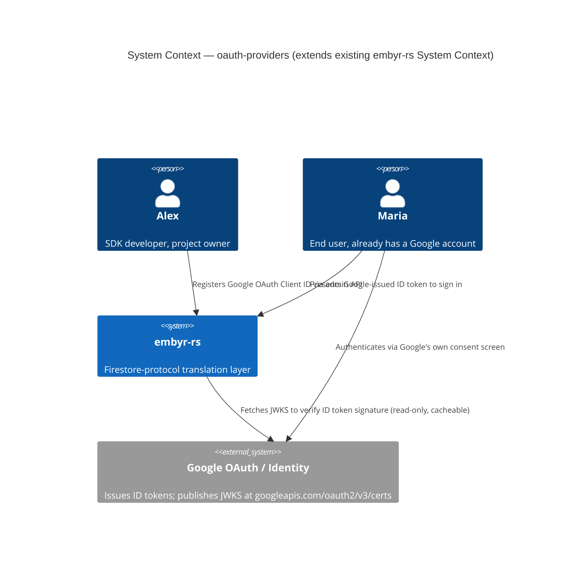

# oauth-providers — Feature Delta

**Wave**: DISCUSS | **Agent**: Luna (nw-product-owner) | **Date**: 2026-08-30
**Status**: Ready for DESIGN handoff — escalated judgment calls (Resolutions 2 and 5) confirmed by the orchestrator 2026-08-30, see § Handoff Package
**Upstream**: `client-auth` and `client-auth-hosted-identity` (both explicitly named "Social/OAuth providers" as a deferred, candidate follow-up, not silently ruled out). No DISCOVER/DIVERGE wave ran for this feature specifically.

**Framing**: this is the THIRD identity-establishment mechanism in the Identity track (JOB-18's sibling epic, commissioned in the same session), joining `client-auth`'s customer-minted custom tokens (JOB-16) and `client-auth-hosted-identity`'s embyr-hosted email/password (JOB-18). Same discipline as both predecessors: extra rigor in § Scope Assessment and § Job Discovery Framing Resolution, explicit escalation rather than silent decisions on security-consequential judgment calls.

---

## Wave: DISCUSS / [REF] Prior Wave Consultation — Reading Confirmation

✓ `docs/product/architecture/brief.md` (targeted: § System Constraints, § Application Architecture — client-auth, § Application Architecture — client-auth-hosted-identity summary) — confirms the three-listener topology, the `backend_mode` security posture, and both prior Identity-track features' own DESIGN summaries.
✓ `docs/product/architecture/adr-002-bounded-contexts.md` (full, including both `security-rules` and `client-auth-hosted-identity` `Changed Assumptions` amendments) — Option D's three-part test (entity identity, lifecycle, invariants), now applied twice (BC-4, BC-5). Applied fresh a third time below (§ Job Discovery Framing Resolution, Resolution 3) — reaching a genuinely different conclusion than either precedent, not a pattern-match.
✓ `docs/product/architecture/adr-024-client-identity-verification-mechanism.md`, `adr-025-client-identity-credential-storage-rotation.md`, `adr-026-client-identity-composition-with-api-key-auth.md` (all full) — confirms the target shape `VerifiedEndUserIdentity { end_user_id, project_id, expires_at_unix, claims }`, the non-impersonation constraint, and the additive `x-embyr-client-identity` composition path both prior features reuse.
✓ `docs/product/architecture/adr-036-hosted-identity-bounded-context-and-storage.md` (full) — the freshest, closest precedent: BC-5's placement reasoning, the storage split (Customer DB for PII, System DB for embyr's own control-plane secrets), the `mint_client_identity_token()` extension (Decision 3), the widened verification-time routing (Decision 4), and the `backend_mode=agent` dual-gating pattern (Decision 5/7) — evaluated fresh below for THIS feature's own, materially different, credential-egress profile (Resolution 2).
✓ `docs/feature/client-auth-hosted-identity/feature-delta.md` (full, DISCUSS + DESIGN) — read in full for its own Resolution-2-style escalation discipline (flagged the storage/egress tension explicitly rather than guessing) and its Resolution-1-style scope-narrowing discipline (Option B over Option A's full-parity temptation). Both disciplines applied below.
✓ `crates/embyr-core/src/client_identity/mod.rs` (full, 660 lines, including the `mint_client_identity_token()` addition already shipped by `client-auth-hosted-identity`) — confirms `verify_client_identity_token()` needs zero changes for this feature either; confirms `mint_client_identity_token()`'s exact signature (`signing_key_seed`, `end_user_id`, `project_id`, `expires_at_unix`, no custom-claims parameter in v1) is the direct reuse target for minting a Google-verified identity.
✓ `crates/embyr-server/src/admin/handlers/auth.rs::oidc_callback` (full, 642 lines) — read fresh, not cited-and-skipped, per this feature's own explicit instruction. Confirms the conclusion both prior features reached (browser-session-shaped, not stateless-per-request, not directly reusable) still holds, AND surfaces a NEW finding neither prior feature's own reading needed to surface: `oidc_callback` implements an **implicit-flow-shaped** OIDC exchange — the `id_token` arrives directly in the callback's query string from the browser redirect; the function never uses its own `code` field for a server-side authorization-code exchange, and requires no client secret. This is a materially different, and structurally simpler, security shape than a proper authorization-code exchange — directly informs Resolution 1 below (Google's ID-token-only flow is a close structural cousin of this code's *shape*, not just its JWKS-fetch/RS256-verify mechanics). The genuinely reusable **pattern** (not code, since this function is per-account not per-project/per-end-user, and has no `?key=`/Customer DB dependency) is exactly what DISCOVER's own reading hypothesis named: JWKS-fetching (`reqwest::get`, cached-if-DESIGN-chooses), `kid` matching, `DecodingKey::from_jwk`, `Validation::new(Algorithm::RS256)` — the RS256/JWKS *primitives*, not the flow.
✓ `docs/product/jobs.yaml` (JOB-16, JOB-18 read in full; all 19 jobs' structure surveyed for the "same persona, different goal ⇒ new job" precedent — now applied a fifth time, see Resolution 4) — confirms both JOB-16 and JOB-18 are functionally scoped to mechanisms this job's own mental model does not share.
✓ `docs/product/journeys/sdk-developer.yaml` — confirms P1 Alex's job list and the established single-narrative-file convention this feature follows unchanged.

No contradictions found between this feature's scope and prior evidence. Genuine new judgment calls this feature surfaces (provider-mechanism asymmetry, credential-egress fit for `backend_mode=agent`, candidate bounded-context placement) are resolved as far as evidence allows and explicitly escalated where it does not — see § Job Discovery Framing Resolution and § Handoff Package.

---

## Wave: DISCUSS / [REF] Orchestrator Decisions (not re-litigated)

| # | Decision | Value |
|---|---|---|
| 1 | Feature Type | Cross-cutting — extends BC-1-adjacent admin surface and the same `x-embyr-client-identity` verification composition both `client-auth` and `client-auth-hosted-identity` already extend; bounded-context placement flagged, not locked (see Resolution 3) |
| 2 | Walking Skeleton | Evaluated (this wave's call): **YES, scoped narrowly to a single provider** — see § Walking Skeleton Evaluation |
| 3 | UX Research Depth | **Comprehensive** — mirrors `client-auth-hosted-identity`'s own precedent: a genuinely new end-user-facing capability (Maria sees a real third-party consent screen for the first time) with real trust stakes, even though the interaction itself is a single click |
| 4 | JTBD Analysis | Yes (default) — new job, `job_id: JOB-19` (see Resolution 4) |

### Walking Skeleton Evaluation (Decision 2)

Two existing mechanisms were evaluated for reuse before concluding a new, narrowly-scoped walking skeleton is needed:

**`client-auth-hosted-identity`'s own signing/minting infrastructure** (`mint_client_identity_token()`, `hosted_identity_signing_keys`). Directly reusable for the *minting* half of this feature (embyr, having independently verified an end user's identity through some other party, mints its own `VerifiedEndUserIdentity` token) — see Resolution 3. NOT reusable for the *verification* half: hosted identity verifies a password against embyr's own stored hash; this feature must verify a Google-issued ID token against Google's own published keys, a structurally different check with no password anywhere in the flow.

**`admin/handlers/auth.rs::oidc_callback`'s existing RS256/JWKS code.** Structurally cannot be reused as-is (browser-session-shaped, per-account not per-project, implicit-flow-shaped — see reading confirmation above), but its RS256/JWKS *primitives* (`DecodingKey::from_jwk`, `kid` matching, `jsonwebtoken::Validation::new(Algorithm::RS256)`) are a directly reusable pattern for verifying Google's ID token, which is itself RS256-signed and JWKS-published (`https://www.googleapis.com/oauth2/v3/certs`) — a much closer structural match than either prior Identity-track feature found for their own custom-token/password mechanisms.

**Verdict**: no existing driving-port mechanism performs third-party OAuth identity verification anywhere in this codebase today. A walking skeleton is needed, scoped to the single riskiest new assumption: a project can register a Google OAuth Client ID and a Google-authenticated end user resolves to the identical `VerifiedEndUserIdentity` type every other mechanism already produces (§ Story Map, Slices 01-02).

---

## Wave: DISCUSS / [REF] Job Discovery — Framing Resolution

The raw ask names "Google and GitHub" as the two most commonly requested providers but explicitly asks DISCUSS to confirm or adjust based on its own research. Both `client-auth`'s and `client-auth-hosted-identity`'s own § Out of Scope sections already named "Social/OAuth providers" as a deferred, candidate follow-up — this feature is that follow-up, commissioned explicitly. Four resolutions were required to scope it responsibly; two carry judgment calls explicitly escalated rather than silently decided.

### Resolution 1 — Provider scope: Google and GitHub together, or a narrower v1?

Direct investigation of what each provider's OAuth mechanism actually requires surfaces a material asymmetry the raw ask's "two most commonly requested" framing does not on its own reveal:

| Provider | Mechanism | What embyr must custody |
|---|---|---|
| **Google** | OIDC-compliant. The SDK's client-side flow (`signInWithPopup`/`signInWithRedirect` with `GoogleAuthProvider`, mirroring Firebase's own architecture) obtains a Google-issued **ID token** (a JWT) directly in the browser, using a **public** OAuth Client ID Alex registers with Google Cloud Console. embyr verifies that ID token's RS256 signature against Google's own published JWKS (`iss`/`aud`/`exp` — the identical shape `ClientIdentityVerifyError`'s own taxonomy already handles) and extracts `sub`/`email` — no server-side token exchange, no secret of any kind. | **Nothing confidential.** Only a public Client ID (mirrors `client_identity_credentials`' own no-confidentiality-property public key). |
| **GitHub** | **Not OIDC** — OAuth 2.0 only, issues no ID token. embyr's server would need to (a) exchange the authorization `code` for an access token via a server-side POST to `github.com/login/oauth/access_token`, using Alex's own registered GitHub OAuth App **client_id AND client_secret**; (b) call `api.github.com/user` (and possibly `/user/emails`, since GitHub allows a private/null primary email) using that access token to fetch the profile. | **A customer-supplied secret** — Alex's own GitHub OAuth App client_secret, which embyr must store encrypted at rest and use server-side for outbound HTTP calls to `github.com`/`api.github.com`. |

This is a **third, structurally distinct credential-custody relationship**, different from both prior Identity-track features: not "verify a customer-registered public key with no confidentiality property" (ADR-024/025) and not "embyr's own self-generated private key" (ADR-036) — a **customer's own third-party secret**, held in escrow by embyr specifically so embyr's servers can act as a confidential OAuth client on Alex's behalf. This is a materially larger trust surface than Google's ID-token-only flow, and is exactly the kind of thing this feature's own explicit instruction says not to guess on.

| Option | Description | Fit against evidence |
|---|---|---|
| **(A) Google + GitHub together, v1** | Ship both providers named in the raw ask | **Rejected as v1.** Would fold a genuinely new credential-custody class (customer-supplied third-party secret) into the same slice as a zero-custody mechanism (Google), inflating both risk and slice size — directly against the "ship 4+ new components → not thin" taste test (a code-exchange HTTP client, a `client_secret` ECIES-encryption call site, a GitHub profile-fetch call, PLUS Google's own ID-token-verify path, all in one release, is not a thin slice). |
| **(B) Google only, v1; GitHub named, explicitly deferred** | Ship the zero-custody, structurally-simpler mechanism first; treat GitHub (and, generically, any other non-OIDC provider requiring server-side code exchange) as its own follow-up requiring dedicated DISCUSS/DESIGN attention to the client_secret-custody question | **Accepted.** Mirrors `client-auth-hosted-identity`'s own Resolution 1 discipline (Option B over Option A's full-parity temptation) — right-sizes v1 around the evidence rather than the raw ask's naming convenience, while keeping GitHub a named, not-silently-ruled-out candidate. |
| **(C) Neither — build a generic OAuth abstraction first** | Design a provider-agnostic OAuth port before implementing any concrete provider | **Rejected — premature abstraction.** With only one concrete provider in v1 (Google), a generic abstraction has no second instance to validate its shape against — directly against "problem-first, solution-never" and this codebase's own established practice of shipping concrete mechanisms before generalizing (`client_identity`/`hosted_identity` are each their own module, not routed through a shared "IdentityProvider" trait). |

**Resolution**: **(B)**. v1 scope is Google only. GitHub — and, more generally, any OAuth provider requiring server-side authorization-code exchange with a customer-supplied client secret — is explicitly named as a deferred, candidate follow-up epic (mirrors both prior features' own escalation-note discipline for deferred scope), not silently ruled out and not folded into this feature's v1.

### Resolution 2 — Does this mechanism need the same `backend_mode=agent` gating `client-auth-hosted-identity` required?

**This is the genuinely new, security-adjacent finding this DISCUSS surfaces — not fully resolved here, explicitly escalated.**

`client-auth-hosted-identity`'s own Resolution 2 gated hosted identity away from `backend_mode=agent` projects because Argon2id password verification structurally requires plaintext end-user passwords to transit embyr's own SaaS servers, and because the resulting Account/ResetToken data had to live in Customer DB (a write dependency into a database an agent-mode customer's own infrastructure, not embyr, controls the network boundary of).

This feature's v1 scope (Resolution 1: Google only, ID-token verification) has a **materially different credential-egress profile**:

- No customer-controlled secret transits embyr's servers on the sign-in hot path (unlike a password) — the material embyr receives on every sign-in is a Google-issued ID token, already public-key-verifiable, carrying no confidentiality property once issued (its security rests on the signature, not on secrecy of the token bytes reaching embyr — the same property `client_identity_credentials`' own public key already has).
- Google's JWKS fetch is a **read-only, cacheable, outbound call to Google**, not a call into or out of the customer's own VPC/Postgres boundary — it is orthogonal to the `backend_mode` distinction entirely (Google's public keys are the same regardless of where a project's Postgres lives).
- The Walking Skeleton scope (§ Story Map) requires **no Customer DB write of any kind** — Resolution 3 below concludes the mechanism can be fully stateless, deriving `end_user_id` deterministically from `(provider, sub)` rather than persisting an account-linking row. If DESIGN confirms this, there is no Customer DB dependency to gate at all, for either storage-location or credential-egress reasons.

**Provisional, evidence-based lean (NOT locked — explicitly escalated)**: unlike hosted identity, this mechanism's v1 (Google, ID-token-only, stateless) does not appear to touch any credential class JOB-04 (Riley)/JOB-09's "zero credential egress" guarantee protects — no Postgres DSN, no customer-controlled secret, and (pending Resolution 3's confirmation) no Customer DB write at all. On this evidence, this feature's own DISCUSS-level lean is that **no `backend_mode=agent` gating is needed** — Google sign-in could safely be offered to every `backend_mode`, actually serving JOB-04/JOB-09's Riley-class segment better than hosted identity does, with no tension at all.

**Why this is escalated rather than locked, despite that lean being fairly strong**: this feature's own instruction is explicit that password storage, token minting, and session/reset-flow security are not to be silently decided, and gating precedent in this exact Identity track (Resolution 2 of the immediately-preceding sibling feature) was *itself* provisionally leaned one way in DISCUSS and only locked after explicit orchestrator confirmation mid-session. The stakes of getting this wrong run in both directions here — under-gating could (if this reasoning has a gap DISCUSS-level analysis missed) create a credential-egress regression for the audit-sensitive Riley segment; over-gating would needlessly withhold a genuinely lower-risk capability from exactly the segment (agent-mode, VPC-isolated customers) that would benefit most from a password-free identity option. Both outcomes are consequential enough that this DISCUSS defers the final call to the orchestrator/DESIGN, exactly as its own instructions require, rather than trusting its own reasoning as sufficient without confirmation.

**CONFIRMED by the orchestrator, 2026-08-30**: unlike the sibling feature's own Resolution 2, this one has no genuine tension pulling the other way — the reasoning above is sound and the three cited facts (no customer-controlled secret on the hot path, JWKS fetch is embyr-to-Google only and orthogonal to `backend_mode`, no Customer DB write under Resolution 3(B)) are independently verifiable from the codebase, not assumptions. **No `backend_mode=agent` gating for this feature** — Google sign-in is available to every `backend_mode`. No longer an open escalation; DESIGN should treat this as locked.

### Resolution 3 — Storage: does this feature need a persistent Account entity, or can it be fully stateless?

| Option | Description | Verdict |
|---|---|---|
| **(A) Persist an `oauth_linked_accounts` row** (mirrors `hosted_identity_accounts`: `(project_id, provider, provider_user_id) → end_user_id`, keyed independently of email) | Enables future admin visibility (listing linked accounts), future account-linking across providers, and a stable `end_user_id` independent of any deterministic derivation scheme | Genuinely useful for a *mature* feature, but not required for v1's own locked scope (no admin-listing story, no cross-provider-linking story — see § Out of Scope) — adds a Customer DB write dependency this feature does not otherwise need, which is exactly the dependency Resolution 2's own lean turns on avoiding |
| **(B) Fully stateless: derive `end_user_id` deterministically from `(provider, sub)`** (e.g. `"google:" + sub`), mint immediately, persist nothing | Google's own `sub` claim is a stable, unique, non-reassigned identifier for a given Google account (Google's own documented guarantee) — deterministic derivation gives the SAME repeat-sign-in-produces-the-same-identity guarantee (Model J-18's own "she can sign in again" requirement) with zero storage, zero Customer DB touch, and — per Resolution 2 — a measurably simpler credential-egress profile than either prior Identity-track feature achieved | **Accepted, as the v1 lean** — genuinely simpler, matches the Walking Skeleton's own single-riskiest-assumption discipline, and is the direct enabler of Resolution 2's own more favorable finding. Exact schema/mechanism remains DESIGN's call (mirrors every prior feature's own convention of DISCUSS locking observable behavior, not implementation), but this DISCUSS records the *evidence* that a stateless design is viable, not just permissible |
| **(C) Either, DESIGN's free choice** | Leave storage entirely open | **Rejected as too little guidance.** Given Resolution 2's own escalation explicitly depends on whether Customer DB is touched at all, leaving this fully open would strand DESIGN without the one piece of evidence (B's viability) that makes Resolution 2's favorable lean coherent in the first place |

**Resolution**: **(B), as this DISCUSS's own evidenced lean, not a hard lock** — DESIGN may still choose (A) if a concrete requirement DISCUSS did not surface (e.g., an admin-visibility need discovered during DESIGN's own reading) justifies it, but if DESIGN chooses (A), Resolution 2's own favorable credential-egress lean must be re-evaluated, since (A) reintroduces exactly the Customer DB write dependency (B) was designed to avoid.

### Resolution 4 — job_id: extend JOB-16, extend JOB-18, or a new job?

JOB-16's mental model requires Trailmark's own backend to mint a token — absent here (no Trailmark backend is involved in Google's OAuth exchange at all). JOB-18's mental model requires Maria to create and remember a password with embyr directly — also absent here (Maria authenticates on Google's own consent screen; embyr never sees a password). This mirrors exactly the reasoning this project's own precedent already applied four times for "same persona, different goal ⇒ new job" (JOB-11/JOB-06, JOB-14/JOB-10, JOB-17/JOB-16, and most directly JOB-18/JOB-16 itself, its own immediately-preceding sibling).

**Resolution**: **new job, `JOB-19` (`oauth-provider-identity`)**. JOB-16 and JOB-18 each receive a cross-reference NOTE (not a rewrite), mirroring the established pattern.

### Resolution 5 — Bounded-context placement: new BC, extend BC-5, or extend BC-1?

Applying ADR-002's Option-D three-part test fresh (per the discipline both BC-4 and BC-5 already established — "applied fresh, not by inertia") to the candidate entities this feature's own locked scope (Resolutions 1 and 3) actually needs:

| Candidate entity | Identity? | Lifecycle? | Invariants? | Verdict |
|---|---|---|---|---|
| **`OAuthProviderCredential`** (the registration Alex performs: `(project_id, provider) → client_id`) | Yes — `(project_id, provider)` | Yes, but thin — register → redefine (idempotent upsert, mirrors `AccessRule`'s own define/redefine lifecycle, ADR-036's own cited precedent) → [deferred: deregister] | Yes, but thin — `client_id` format validity, provider-enum validity, uniqueness per `(project_id, provider)` | **Passes**, but the SAME shape `client_identity_credentials`' own registration entity already has — and that entity was never itself treated as warranting a standalone bounded context; it lives inside BC-1 without controversy |
| **A stateful end-user "OAuth Account"** (mirrors BC-5's own `Account`) | N/A under Resolution 3(B) | N/A under Resolution 3(B) | N/A under Resolution 3(B) | **Does not exist in this feature's own locked v1 scope** — Resolution 3 concludes no such entity is needed |

**Provisional, evidence-based lean (flagged, not locked, per every prior candidate-BC question in this codebase's own history)**: unlike BC-4's `AccessRule` and BC-5's `Account` — both of which introduced a genuine new entity with real identity/lifecycle/invariants that BC-1's own vocabulary did not already cover — this feature's only candidate entity (`OAuthProviderCredential`) is structurally the *same kind of thing* `client_identity_credentials` already is: project-scoped, System-DB-resident, no-confidentiality-property auth-material registration. On this evidence, this DISCUSS's own lean is that **this feature extends BC-1 Tenant Management**, the same bounded context `client-auth` itself extended — not a new BC-6, and not BC-5 either (BC-5's own defining trait, per ADR-036, is its Customer-DB-resident PII; this feature's own locked v1 scope, per Resolution 3, touches no Customer DB at all). This is a genuinely different conclusion than either BC-4 or BC-5 reached, which is itself the point of applying the test fresh rather than by inertia (ADR-002's own repeated instruction) — this feature is direct evidence the test does not always produce "add a new BC."

Storage location follows from the same reasoning: `OAuthProviderCredential` belongs in **System DB**, mirroring `client_identity_credentials`' own placement — it is project-scoped auth *configuration* Alex registers, not Maria's own PII.

**CONFIRMED by the orchestrator, 2026-08-30**: the table above correctly applies Option D fresh, and the analogy to `client_identity_credentials`'s own uncontroversial BC-1 placement is exact, not approximate — same table shape, same DB, same confidentiality property (none). **This feature extends BC-1 Tenant Management** — no new BC-6. No longer an open escalation; DESIGN should treat this as locked.

**Not locked**: exact bounded-context placement remains DESIGN's own call to confirm by applying ADR-002's test formally (mirrors every prior feature's own discipline for this exact class of question) — but this DISCUSS records a materially different evidence-based lean than either BC-4 or BC-5's own precedent, specifically so DESIGN does not silently pattern-match "BC-4 and BC-5 both added a new BC, therefore this feature should too."

---

## Wave: DISCUSS / [REF] Persona & Job

**Persona**: **P1 — Alex, SDK Developer** (existing persona), unchanged. Maria's device calls embyr's endpoints directly after Google's own consent flow completes, exactly as she already does for both `signInWithCustomToken` and hosted-identity's own sign-in flows — this does not change the persona framing.

**Domain-example company**: **Trailmark** (unchanged continuity). For this feature, Trailmark is reframed for domain-example purposes as serving end users who **already have a Google account and no interest in creating a new password** — a distinct sub-segment from both `client-auth`'s (has own backend) and `client-auth-hosted-identity`'s (has no backend, wants a new password) own instantiations.

**Segment-fit note**: unlike hosted identity, this job's own § Job Discovery Framing Resolution Resolution 2 leans TOWARD, not away from, serving **P4 — Riley (CISO, credential-isolation, JOB-04/JOB-09)** — flagged explicitly as a candidate positive differentiator, still pending confirmation, not a segment this feature knowingly excludes.

**job_id decision (Resolution 4)**: `JOB-19` (`oauth-provider-identity`), new job, same persona P1 Alex, distinct goal from both JOB-16 and JOB-18. Full job entry added to `docs/product/jobs.yaml` (see § SSOT Updates) — opportunity score 11 (importance 6: serves a real but narrower segment than either JOB-16 or JOB-18 alone; satisfaction 1: zero support exists today), priority high.

---

## Wave: DISCUSS / [REF] Scope Assessment (Elephant Carpaccio Gate)

| Signal | Threshold | This feature (with Resolution 1's Google-only v1 scope locked) | Fired? |
|---|---|---|---|
| User stories | >10 | 2 (US-01, US-02) — deliberately smaller than `client-auth-hosted-identity`'s own 4, since this feature's v1 mechanism (stateless, no password, no reset) is materially simpler | **NO** |
| Bounded contexts / modules | >3 | 1 — extends BC-1 (Resolution 5's own lean); no new BC introduced | **NO** |
| Walking Skeleton integration points | >5 | 2 — admin registration (US-01) + Google sign-in (US-02) | **NO** |
| Estimated effort | >2 weeks | 2 slices, ~1.5 days average ≈ **3 days** (see § Elephant Carpaccio Slices) | **NO** |
| Independent shippable outcomes | multiple | **NO** — registration (US-01) and sign-in (US-02) are two halves of one outcome, mirroring both prior Identity-track features' own enablement+use pairing; a registered-but-unused Client ID is inert, a sign-in path with nothing registered is untestable | **NO** |

**0 of 5 signals fired.** **Verdict: PASS — right-sized**, and more tightly scoped than either predecessor once Resolution 1's provider-asymmetry finding is applied. GitHub was the one plausible path to an oversized feature (would very likely have pushed bounded-context count and component count past threshold, per Resolution 1's own analysis) — deliberately not built here.

---

## Wave: DISCUSS / [REF] Journey (Comprehensive, per Decision 3 — inline per this codebase's convention)

### Alex's sub-journey: registering his Google OAuth Client ID (Slice 01)

```
Alex registers his Google OAuth Client ID for trailmark-prod via the admin API
        │
        ▼
   Does project trailmark-prod exist and is Alex's admin credential valid?
        │
   no / invalid ─────────────┐                yes
        │                     │                 │
        ▼                     │                 ▼
  404 (no such project) or    │      Is a Google Client ID already
  401 (bad admin credential)  │      registered for trailmark-prod?
        │                     │                 │
        │                     │        ┌────────┼────────┐
        │                     │       yes                no
        │                     │        │                  │
        │                     │        ▼                  ▼
        │                     │   200 — the existing   201 — the submitted
        │                     │   registration is       Client ID is stored;
        │                     │   REPLACED with the     Google sign-in is now
        │                     │   newly submitted one    active for the project
        │                     │   (idempotent redefine,               │
        │                     │   not an error)                       │
        └─────────────────────┴────────┴──────────────────────────────
```

Emotional arc: **entry — mildly curious** (a new admin toggle, mirrors the low-stakes tone of every other admin-API action Alex has already used, including hosted identity's own US-01) → **exit — confidently unblocked** ("now my users who already have a Google account can just click one button"). No anxiety spike — Alex is registering a PUBLIC Client ID, not a secret, so this step carries even lower stakes than hosted identity's own equivalent step.

### Maria's sub-journey: signing in with her existing Google account

```
Maria opens Trailmark; Trailmark's app calls the SDK's existing
signInWithPopup(auth, new GoogleAuthProvider()) — an unchanged SDK method,
now backed by embyr
        │
        ▼
  Google's own consent screen appears (embyr never sees this step — it
  happens entirely between Maria's browser and accounts.google.com)
        │
   Maria approves ──────────────┐            Maria cancels/denies
        │                        │                    │
        ▼                        │                    ▼
  Maria's browser holds a         │          Popup closes with no identity
  Google-issued ID token          │          established — Trailmark's app
        │                        │          sees an unambiguous "cancelled"
        ▼                        │          signal, not a confusing error
  Trailmark's app presents that   │
  ID token to embyr                │
        │                        │
        ▼                        │
   Is Google sign-in enabled                Is the ID token's signature valid,
   for trailmark-prod (Alex's                unexpired, and issued for THIS
   Slice 01 step)?                           project's registered Client ID?
        │                                              │
   no ──────────────┐                          ┌───────┼───────┐
        │            │                        no                yes
        ▼            │                         │                 │
  Sign-in rejected,   │                         ▼                 ▼
  distinguishable      │                  Rejected, distin-  Session established
  from a token-        │                  guishable from a   immediately — Maria's
  validation failure   │                  provider-not-       subsequent getDoc
        │              │                  enabled rejection   succeeds carrying her
        └──────────────┴─────────────────────────────────────verified identity
```

Emotional arc (Maria, comprehensive):
- **Entry — mildly wary, first time only** ("a new app wants to know something about my Google account" — Google's own consent screen, not embyr's, carries this moment; embyr's own role is invisible to Maria until identity is established) → **exit — confident/delighted** (one click, no new password to invent or remember — faster and lower-friction than hosted identity's own signup flow). This is a materially SHORTER, lower-tension arc than hosted identity's own comprehensive arc (no password-strength negotiation, no reset-flow anxiety spike) — an honest finding, not a design goal artificially claimed.
- **Repeat sign-in — entry: routine/confident** (an established habit within one session) → **exit: confident** (fast, unsurprising — mirrors both `client-auth` and hosted-identity's own repeat-sign-in arc).
- **Cancellation/denial — entry: neutral** (Maria changed her mind on Google's own consent screen) → **exit: unaffected**, not frustrated — this must read as a normal "I chose not to" outcome, not an error, since nothing on embyr's or Trailmark's side malfunctioned.

### Shared artifact

| Artifact | Source of truth | Consumers | Integration risk |
|---|---|---|---|
| Registered Google OAuth Client ID | New table, System-DB-resident (Resolution 5's own lean; DESIGN's call to confirm) | Sign-in handler (US-02), for `aud` validation against the ID token Google issued | **HIGH** — if the registered Client ID and the Client ID the SDK/app actually used to obtain the ID token diverge, every sign-in attempt fails with no useful signal to Alex unless the rejection reason names the mismatch explicitly |
| Google's own JWKS (public keys) | `https://www.googleapis.com/oauth2/v3/certs` (Google-owned, outside this codebase) | Sign-in handler (US-02), for RS256 signature verification | **MEDIUM** — an unreachable/stale JWKS fetch must fail sign-in gracefully (a named, distinguishable rejection), not crash or silently accept an unverified token; caching strategy is DESIGN's call |

### Failure modes (feeds DISTILL scenario generation)

- Alex forgets to register a Google Client ID before Trailmark ships a "Sign in with Google" button — Maria's very first attempt must fail with a reason distinguishable from a token-validation failure, not a generic 500.
- Maria cancels Google's own consent screen — Trailmark's app must see an unambiguous "the user did not complete sign-in" signal, not an error indistinguishable from a real failure.
- A Google ID token whose `aud` does not match the project's registered Client ID (e.g., Maria's browser somehow held a token minted for a different site) must be rejected as a mismatch, not silently accepted.
- Google's JWKS endpoint is temporarily unreachable — sign-in must fail gracefully with a distinguishable, retryable-sounding reason, not crash the request handler.
- An ordinary Firestore call from a session that never signed in via ANY path (custom-token, hosted, or OAuth) must not regress — this feature extends both AC-16-08's and AC-18-13's guardrail, it does not reopen either.

---

## Wave: DISCUSS / [REF] Story Map & Walking Skeleton

**Persona**: P1 Alex | **Goal**: Give Trailmark's end users who already have a Google account a one-click way to sign in directly through Google — with no password to create, no custom-token backend of Trailmark's own required — resolving to the identical verified-identity type every other mechanism already produces.

### Backbone

| A. Alex Registers Google Sign-In | B. Maria Signs In With Google |
|---|---|
| Alex registers his Google OAuth Client ID for `trailmark-prod` **[WS]** | Maria signs in with her Google account; her session is immediately verified **[WS]** |
| | Sign-in failures are rejected without leaking implementation detail, distinguishable from a not-enabled rejection **[WS]** |

### Walking Skeleton

One task from each activity, thinnest end-to-end happy path: Alex registers a Google OAuth Client ID for `trailmark-prod` (Activity A); Maria signs in with a valid, unexpired Google ID token issued for that Client ID, her session is established immediately and her subsequent `getDoc` call succeeds carrying her verified identity; a session that never signed in via any path continues to succeed unaffected (Activity B). This is Slices 01-02's happy-path-plus-guardrail scenarios — real project/table state, no facade.

### Release 1 — Google Sign-In Works End-to-End (Slices 01-02, US-01, US-02)

Outcome: any Trailmark end user with an existing Google account can sign in to Trailmark through embyr with one click, resolving to the same verified-identity type every other mechanism already produces.

### Release 2 (deferred, not this feature) — Additional Providers

Outcome (future, not built here): GitHub and other non-OIDC providers, once a dedicated DISCUSS/DESIGN cycle resolves the client_secret-custody question Resolution 1 explicitly deferred.

---

## Wave: DISCUSS / [REF] Elephant Carpaccio Slices

| Slice | Story | Release | Estimate | Learning Hypothesis (disproves) | Production-data taste test |
|---|---|---|---|---|---|
| 01 (WS) | US-01 | 1 | 1 day | A "register Google OAuth Client ID" admin action cannot store a project-scoped, public (non-confidential) OAuth Client ID using the existing admin-API conventions without inventing a new pattern, or cannot support idempotent redefine (Alex correcting a mistyped Client ID) without a separate rotate-style endpoint | Real admin Bearer credential, real project row, real submitted Client ID string — no synthetic exception |
| 02 (WS) | US-02 | 1 | 2 days (includes the SDK-wire-format spike, see below) | A Google sign-in flow cannot verify a real Google-issued ID token against Google's own live JWKS and mint a `VerifiedEndUserIdentity` via the EXISTING `mint_client_identity_token()` unchanged without requiring changes to either that function or the pure verification taxonomy; separately, `signInWithPopup()`/`GoogleAuthProvider` may not be pointable at a non-Google backend for the RESULTING token exchange the same opacity-permissive way `signInWithCustomToken()` was (mirrors `OQ-CA-01`/`OQ-CHI-01`) | Real Google-issued ID token (obtained via a real Google OAuth Client ID against Google's real consent flow) verified against Google's real live JWKS — no synthetic/self-signed token standing in for a genuine Google-issued one |

**Total estimate: ~3 days.**

**Taste tests applied**:
- "4+ new components per slice" — Slice 01: admin handler + `OAuthProviderCredential` storage (2). Slice 02: sign-in handler + Google JWKS fetch/verify + `mint_client_identity_token()` call site (3, all composing pre-existing primitives — no new cryptographic code). PASS.
- "Every slice depends on a new abstraction" — Slice 01 is the one genuinely new abstraction (the registered Client ID); Slice 02 builds on it plus the already-shipped `mint_client_identity_token()`, introducing no second new abstraction independently. PASS — mirrors both prior Identity-track features' own precedent exactly.
- "No slice disproves a pre-commitment" — each has a distinct, falsifiable hypothesis (see table). PASS.
- "Synthetic-data-only slices prove plumbing, not value" — N/A; Slice 02 explicitly requires a REAL Google-issued ID token, not a self-signed stand-in, precisely because the entire point of this feature is verifying material this codebase does not control the signing of. PASS.
- "2+ slices identical except for scale" — none; each targets a distinct mechanism (register vs. verify-and-mint). PASS.

---

## Wave: DISCUSS / [REF] Prioritization

| Priority | Slice | Target Outcome | Rationale |
|---|---|---|---|
| 1 | Slice 01 (WS) | A project can register a Google OAuth Client ID | Walking Skeleton first — without registration, nothing downstream has a Client ID to verify `aud` against |
| 2 | Slice 02 (WS) | A Google-authenticated end user resolves to a verified identity | Highest-uncertainty slice (SDK wire-format spike + real-Google-token dependency bundled in) — burns down the riskiest new assumption first, closing the Walking Skeleton loop |

---

## Wave: DISCUSS / [REF] System Constraints

- **Coexists with, does not replace,** either `client-auth`'s custom-token path or `client-auth-hosted-identity`'s hosted email/password path. All three resolve to the identical `VerifiedEndUserIdentity` type. A project may have any combination enabled simultaneously. All three identity-establishment paths produce disjoint end-user account namespaces per project — no automatic linking or migration between them (see § Out of Scope).
- **Hard constraint, mirrors Resolution 3 of `client-auth-hosted-identity` for the identical non-impersonation reason.** Whatever signing/session material mints this feature's `VerifiedEndUserIdentity` tokens MUST be structurally disjoint from `client_identity_credentials` (ADR-024/025) — never colocated, never sharing a row or custody boundary. Whether it may safely REUSE `hosted_identity_signing_keys` (both are "embyr independently establishes identity and mints its own token" flows, unlike `client-auth`'s customer-minted-token flow) is a legitimate DESIGN-level reuse question, not a security violation either way — flagged as a candidate reuse point, not locked.
- **v1 provider scope is Google only** (Resolution 1) — DESIGN should not silently expand into GitHub or other non-OIDC providers; that is a documented, deferred candidate follow-up requiring its own client_secret-custody analysis, not this feature's scope.
- **RESOLUTION 3 (evidenced lean, not locked): this feature's v1 requires no Customer DB write** — `end_user_id` is derived deterministically from `(provider, sub)`, not persisted. If DESIGN's own reading surfaces a requirement this DISCUSS did not (e.g., admin-visibility), and chooses to persist an account-linking row instead, Resolution 2's own favorable credential-egress lean must be re-evaluated, not silently assumed to still hold.
- **ESCALATED, NOT LOCKED (Resolution 2): `backend_mode=agent` gating.** This DISCUSS's own evidence-based lean is that no gating is needed (unlike `client-auth-hosted-identity`), because this feature's v1 mechanism touches no Postgres credential, no customer-controlled secret, and (per Resolution 3) no Customer DB at all. This lean is NOT confirmed and must not be treated as locked — the orchestrator must confirm it, exactly as the sibling feature's own Resolution 2 required explicit confirmation before DESIGN could treat it as locked.
- **Candidate bounded-context placement, flagged not locked (Resolution 5).** This DISCUSS's own evidenced lean is that this feature extends BC-1 Tenant Management (not a new BC-6, not BC-5) — a genuinely different conclusion than either BC-4 or BC-5 reached, recorded explicitly so DESIGN applies ADR-002's own test fresh rather than pattern-matching the two most recent precedents.
- **SDK wire-format empirical uncertainty (mirrors `OQ-CA-01`/`OQ-CHI-01`), tagged `OQ-OAP-01`.** Whether the Firebase JS SDK's `signInWithPopup()`/`signInWithRedirect()` with `GoogleAuthProvider`, when pointed at a non-Google backend, lets embyr control the shape of the token-presentation call, or insists on a fixed Identity-Toolkit-specific `accounts:signInWithIdp` endpoint shape, cannot be confirmed from this codebase alone. Not blocking DESIGN's logical contract, but a required empirical spike before DELIVER (see § Handoff Package).
- Ubiquitous language introduced: **OAuth provider credential** (the registered, public Client ID), **Google sign-in** (the enablement flag + capability, scoped narrowly to Google in v1, not a generic "OAuth" umbrella term until a second provider actually ships). These terms should carry forward into DESIGN's naming.

---

## Wave: DISCUSS / [REF] User Stories

<!-- markdownlint-disable MD024 -->

### US-01: Alex Registers His Google OAuth Client ID For Trailmark

**job_id**: JOB-19
**Slice**: 01 (Walking Skeleton) | **Release**: 1

#### Elevator Pitch
Before: Trailmark's end users who already have a Google account have no way to use it to sign in — Alex's only options are a custom-token backend he may not have (JOB-16) or making every user create a brand-new password (JOB-18).
After: call the admin API's Google-sign-in-registration action (exact endpoint shape DESIGN's call) with his own Google OAuth Client ID → sees a 201 confirming Google sign-in is now active for the project.
Decision enabled: Alex knows his app's sign-in screen can now offer a real "Sign in with Google" button, without building any OAuth exchange logic himself.

#### Domain Examples
1. **Happy Path**: Alex registers his Google OAuth Client ID (`123456789-abc.apps.googleusercontent.com`) for `trailmark-prod` via the admin API, using Trailmark's admin Bearer credential. Sees 201; Google sign-in is now active for the project.
2. **Edge Case**: Alex realizes he registered the wrong Client ID (a staging one, not production) and submits the correct one for the same project. Sees 200, the registration is idempotently redefined — no error, no stale Client ID left active.
3. **Error/Boundary**: Alex submits the registration for `trailmark-staging-old`, a project that has since been deleted. Sees 404.

#### UAT Scenarios (BDD)

##### Scenario: First-time registration succeeds and activates Google sign-in for the project
Given project `trailmark-prod` exists and does not yet have a Google Client ID registered
When Alex registers a Google OAuth Client ID using a valid admin Bearer credential
Then Google sign-in becomes active for the project using that Client ID

##### Scenario: Re-registering with a different Client ID redefines the active registration, not an error
Given project `trailmark-prod` already has a Google Client ID registered
When Alex submits a registration with a different Client ID for the same project
Then the request succeeds, and the newly submitted Client ID becomes the one used for subsequent sign-in verification

##### Scenario: Registration without valid admin credentials is rejected
Given project `trailmark-prod` exists
When Alex submits a registration request with a missing or invalid admin Bearer credential
Then the request is rejected the same way any other admin endpoint rejects missing/invalid credentials

##### Scenario: Registration against a non-existent or deleted project is rejected
Given project `trailmark-staging-old` does not exist or has been deleted
When Alex submits a registration request for it
Then the request is rejected as not found

#### Acceptance Criteria
- [ ] AC-19-01: Valid first-time registration returns 201; Google sign-in becomes active for the project using the submitted Client ID.
- [ ] AC-19-02: Re-registration with a different Client ID for an already-registered project succeeds (200), and the new Client ID is the one used for subsequent `aud`-claim verification — no stale registration remains active.
- [ ] AC-19-03: Missing or invalid admin Bearer credential returns 401.
- [ ] AC-19-04: Registration for a non-existent or deleted project returns 404.

#### Outcome KPIs
See § Outcome KPIs below (feeds KPI #1, North Star).

#### Technical Notes (Optional)
Exact endpoint path and storage location (System DB — this DISCUSS's own evidenced lean, § Job Discovery Framing Resolution Resolution 5) are DESIGN's call. No secret material is involved in this story (the Client ID is public, per Resolution 1) — unlike `client-auth-hosted-identity`'s own equivalent story, no `api_key`-derived ECIES step is needed here.

---

### US-02: Maria Signs In With Her Google Account

**job_id**: JOB-19
**Slice**: 02 (Walking Skeleton) | **Release**: 1

#### Elevator Pitch
Before: Maria has a Google account she already trusts, but Trailmark has no way to let her use it — her only options are creating a new password (JOB-18) or Trailmark building its own custom-token backend (JOB-16).
After: call the SDK's existing `signInWithPopup(auth, new GoogleAuthProvider())` — an unchanged SDK method, now backed by embyr — → sees the sign-in resolve successfully after Google's own consent screen, and her subsequent `getDoc` call succeeds, carrying her verified end-user identity.
Decision enabled: Alex knows Trailmark's "Sign in with Google" button works end-to-end without him building any OAuth exchange logic of his own.

#### Domain Examples
1. **Happy Path**: Maria Santos, who already has a Google account, signs in to `trailmark-prod` (Google sign-in already registered by Alex) via Google's own consent screen. Sign-in succeeds; her subsequent `getDoc` on her own trip-journal document succeeds, carrying her verified identity.
2. **Edge Case**: Dana Kim starts the Google sign-in flow but cancels Google's own consent screen partway through. Trailmark's app sees an unambiguous "sign-in was not completed" signal — not an error indistinguishable from a real failure.
3. **Error/Boundary**: A sign-in attempt presents a Google ID token whose `aud` claim does not match `trailmark-prod`'s registered Client ID (e.g., a token obtained for a different site). Sees a rejection explicitly naming the mismatch, distinguishable from an unregistered-provider rejection.

#### UAT Scenarios (BDD)

##### Scenario: Signing in with a valid Google ID token succeeds and establishes a verified session
Given `trailmark-prod` has a Google Client ID registered
And Maria Santos holds a valid, unexpired Google ID token issued for that Client ID
When Maria presents that ID token to sign in
Then her session is immediately verified, and her subsequent Firestore call succeeds carrying her verified end-user identity

##### Scenario: The same Google account signing in again resolves to the same identity as before
Given Maria Santos previously signed in to `trailmark-prod` with her Google account
When she signs in again on a later visit with a freshly issued Google ID token for the same Google account
Then her session resolves to the identical `end_user_id` as her first sign-in

##### Scenario: A Google ID token issued for a different Client ID is rejected, distinguishably
Given `trailmark-prod` has a Google Client ID registered
When a sign-in attempt presents a Google ID token whose audience does not match the registered Client ID
Then the sign-in is rejected with a reason identifying the mismatch, distinguishable from a not-enabled rejection

##### Scenario: Sign-in on a project without Google sign-in registered is rejected, distinguishably
Given `trailmark-staging` does not have a Google Client ID registered
When a sign-in attempt is submitted for that project
Then the sign-in is rejected with a reason identifying that Google sign-in is not enabled, distinguishable from a token-validation failure

##### Scenario: An expired Google ID token is rejected, distinguishably
Given `trailmark-prod` has a Google Client ID registered
When a sign-in attempt presents a Google ID token that has expired
Then the sign-in is rejected with a reason identifying expiry, distinguishable from a signature or audience failure

##### Scenario: An ordinary Firestore call from a session that never signed in via any path is unaffected
Given a Trailmark session has never attempted sign-in via Google, hosted identity, or a custom token
When that session calls `setDoc` or `getDoc` using only the existing project `api_key`
Then the call succeeds exactly as it did before this feature shipped

#### Acceptance Criteria
- [ ] AC-19-05: A valid, unexpired Google ID token issued for the project's registered Client ID succeeds; the verified end-user identity attaches to subsequent Firestore calls.
- [ ] AC-19-06: The same Google account signing in on a later visit resolves to the identical `end_user_id` as its first sign-in.
- [ ] AC-19-07: An ID token whose audience does not match the registered Client ID is rejected, naming the mismatch, distinguishable from a not-enabled rejection.
- [ ] AC-19-08: Sign-in on a project with no Google Client ID registered is rejected, distinguishable from a token-validation failure.
- [ ] AC-19-09: An expired ID token is rejected, distinguishable from a signature or audience failure.
- [ ] AC-19-10: A Firestore data call from a session that never signed in via any path continues to succeed exactly as before this feature shipped — extends AC-16-08's and AC-18-13's guardrail (regression guardrail; see § System Constraints).
- [ ] AC-19-11: Google's JWKS being temporarily unreachable causes sign-in to fail gracefully with a distinguishable, retryable-sounding reason — never a crash, never a silently-accepted unverified token.

#### Outcome KPIs
See § Outcome KPIs below (KPI #1 North Star, KPI #2 Guardrail).

#### Technical Notes (Optional)
Token minting reuses `mint_client_identity_token()` (already shipped by `client-auth-hosted-identity`) unchanged. `end_user_id` derivation scheme (Resolution 3's own stateless lean: deterministic from `(provider, sub)`), exact endpoint shape, JWKS caching strategy, and whether `signInWithPopup()`/`GoogleAuthProvider` can be pointed at a non-Google backend the way `signInWithCustomToken()` was (`OQ-OAP-01`) are DESIGN's call and a required pre-DELIVER empirical spike respectively — see § System Constraints.

---

## Wave: DISCUSS / [REF] Outcome KPIs

### Feature: oauth-providers

### Objective
Give Trailmark-class embyr customers a fully embyr-mediated "Sign in with Google" option for end users who already have a Google account, resolving to the identical verified-identity type every other identity mechanism already produces, without Alex building any OAuth exchange logic or embyr custodying any customer secret.

### Outcome KPIs

| # | Who | Does What | By How Much | Baseline | Measured By | Type |
|---|---|---|---|---|---|---|
| 1 | SDK developers whose end users already have a Google account (Alex/Trailmark, Google-sign-in segment) | Complete a Google sign-in and have subsequent Firestore calls carry a verified end-user identity | 100% of valid sign-in attempts (correctly-audienced, unexpired, correctly-signed ID token) succeed and attach identity | 0% (capability does not exist today) | Count of successful Google sign-ins against registered projects, cross-referenced with subsequent authenticated Firestore calls carrying identity | North Star |
| 2 | Existing `client-auth` custom-token sessions, `client-auth-hosted-identity` hosted sessions, and `embyr-rs` api_key-only sessions | Continue to make ordinary Firestore data calls successfully, unaffected by Google sign-in's existence | 0% regression across the 72 existing `embyr-rs` scenarios plus `client-auth`'s and `client-auth-hosted-identity`'s own acceptance suites | Current 100% pass rate (pre-feature) | Full existing acceptance suites, pre/post comparison | Guardrail |
| 3 | Any party presenting a Google ID token with an invalid signature, wrong audience, or expired claim | Cannot obtain a verified identity from a token that does not genuinely, currently, and correctly represent a Google-authenticated end user for this project | 0 forged-or-mismatched-token acceptances (audit metric, pass/fail, not a rate) | N/A (capability does not exist today) | Dedicated rejection-taxonomy test suite covering signature, audience, and expiry failure classes | Guardrail |

---

## Wave: DISCUSS / [REF] Definition of Ready Validation

### Story: US-01 and US-02 (both stories, oauth-providers)

| DoR Item | Status | Evidence |
|---|---|---|
| 1. Problem statement clear, domain language | PASS | Every Elevator Pitch names a concrete "Before" state grounded in read code (`client_identity/mod.rs`'s exact `mint_client_identity_token()` signature, `oidc_callback`'s own JWKS/RS256 primitives) |
| 2. User/persona with specific characteristics | PASS | P1 Alex (existing persona), concretely instantiated as an SDK developer whose end users already have Google accounts — a deliberate, evidenced narrowing distinct from both `client-auth`'s and `client-auth-hosted-identity`'s own Trailmark instantiations |
| 3. 3+ domain examples with real data | PASS | Both stories have exactly 3 (Happy/Edge/Error) with real-feeling names, project IDs, and Client-ID-shaped strings (`Maria Santos`, `Dana Kim`, `trailmark-prod`, `123456789-abc.apps.googleusercontent.com`) |
| 4. UAT in Given/When/Then (3-7 scenarios) | PASS | US-01: 4, US-02: 6 — both within 3-7 |
| 5. AC derived from UAT | PASS | Every AC traces to a named scenario (e.g. AC-19-07 ← "A Google ID token issued for a different Client ID is rejected, distinguishably") |
| 6. Right-sized (1-3 days, 3-7 scenarios) | PASS | Each story maps 1:1 to a slice, each 1-2 days (§ Elephant Carpaccio Slices); feature-level story count (2) is well within the ≤10 threshold |
| 7. Technical notes identify constraints | PASS | Both stories defer exact mechanism (endpoint shapes, storage location, JWKS caching) to DESIGN while locking observable behavior; § System Constraints names the additive/disjoint-credential constraint explicitly and names two genuinely UNRESOLVED, escalated judgment calls rather than silently deciding them |
| 8. Dependencies resolved or tracked | PASS | US-02 depends on US-01 (needs a registered Client ID before anything can verify `aud` against); US-02 also depends on the already-shipped `mint_client_identity_token()` (`client-auth-hosted-identity`, DELIVER-complete per this session's own git history) — all documented in § Story Map and § Prioritization; no circular or unresolved *code* dependency (the two escalated judgment calls are scope/security decisions, not missing dependencies) |
| 9. Outcome KPIs defined with measurable targets | PASS | All 3 KPIs have explicit numeric targets (or an explicitly binary pass/fail target for KPI #3, honestly labeled as such) and named measurement methods |

### DoR Status: **PASSED** (all 9 items, both stories)

### Requirements Completeness Score: **0.94**

- Functional requirements: complete — both stories cover the full backbone (§ Story Map), both traced to JOB-19's four forces.
- Non-functional requirements: the disjoint-credential-entity requirement and the JWKS-unreachable graceful-failure requirement are locked as explicit constraints/ACs.
- Business rules: complete — JOB-19's push/pull/anxiety/habit forces are all traced to specific ACs (e.g., anxiety → the entire Resolution 1/2 custody-and-egress analysis, honestly left partially unresolved rather than fabricated as resolved).
- Two deliberate, documented gaps, scored down accordingly: (1) Resolution 2's `backend_mode=agent` gating question — genuinely unresolved, though this feature's own evidence-based lean is more favorable than its sibling's; (2) Resolution 5's bounded-context placement question and `OQ-OAP-01`'s SDK wire-format empirical uncertainty. Both explicitly escalated in § Handoff Package, not silently guessed. Scored 0.94 — one notch higher than `client-auth-hosted-identity`'s own 0.93, reflecting that this feature's escalations, while real, carry a more favorable evidenced lean and touch fewer subsystems than the sibling's own storage-location tension did.

---

## Wave: DISCUSS / [REF] Out of Scope

- **GitHub and other non-OIDC OAuth providers** — explicitly named, deferred candidate follow-up requiring its own client_secret-custody DISCUSS/DESIGN cycle (§ Job Discovery Framing Resolution, Resolution 1). Not silently ruled out.
- **Account linking across identity mechanisms or across OAuth providers** — the two identity-establishment paths already shipped (JOB-16, JOB-18) and this feature's own path remain disjoint namespaces per project; no merge mechanism is built (mirrors `client-auth-hosted-identity`'s own § System Constraints precedent exactly).
- **Persisted admin visibility into which Google accounts have signed in** (a listing/audit action analogous to a future hosted-identity account-listing story) — not built under Resolution 3's stateless lean; would require re-opening Resolution 3 if a concrete need surfaces later.
- **Additional Google-specific data beyond the minimum identity claims** (profile photo, verified-email flag, locale, etc.) — `VerifiedEndUserIdentity.claims` already supports arbitrary custom claims (per `custom-claims`/ADR-034), but `mint_client_identity_token()` mints with an empty claims map in v1 (matching every pre-existing token) — extending minting to carry claims is explicitly deferred, mirroring `client-auth-hosted-identity`'s own identical v1 scoping decision for the same function.
- **Multi-factor or step-up authentication for Google-authenticated end users** — no evidence of demand in any job story.
- **Revoking or force-invalidating a previously-issued Google-sign-in session** — genuinely undecided, no strong evidence either way, DESIGN's call, not locked here (mirrors hosted-identity's own analogous, explicitly-undecided session-invalidation question).
- **Exact endpoint paths, JWKS caching mechanism, and `end_user_id` derivation format** — DESIGN's call; this DISCUSS locks observable behavior only.
- **Making Google sign-in mandatory or auto-enabled for any project** — always an explicit, opt-in admin action (US-01); never a default.

---

## Wave: DISCUSS / [REF] WS Strategy

Walking Skeleton Strategy: **B — Thin End-to-End Slice**. Slices 01-02 are real, narrow vertical slices against real table state and real Google-issued ID tokens (no facade, no self-signed stand-in) — Slice 01 proves the riskiest new assumption for the registration half (a project can register a public, non-confidential Client ID using existing admin-API conventions); Slice 02 proves the second riskiest assumption (a real Google ID token verifies against Google's own live JWKS and mints the identical `VerifiedEndUserIdentity` type, including the SDK-wire-format spike). Together they form the thinnest end-to-end flow: register → sign in / reject → identity carried forward, mirroring both prior Identity-track features' own WS Strategy B precedent.

---

## Wave: DISCUSS / [REF] Driving Ports

| Port | Protocol | Extension |
|---|---|---|
| Admin port `:9090` (existing, extended) | HTTP/1.1 | New Google-Client-ID-registration action (US-01), alongside existing project-lifecycle, `client-auth` credential-registration, and `client-auth-hosted-identity` enablement actions |
| Data ports `:8080` (gRPC) / `:8081` (REST/gRPC-Web) (existing, extended) | gRPC / HTTP | New Google sign-in action (US-02); existing Firestore calls optionally carry the resulting verified identity in request context, reusing the same ADR-026 composition shape both prior Identity-track features already extend |

No new network-facing port introduced. Exact endpoint/RPC shapes are DESIGN's call.

---

## Wave: DISCUSS / [REF] Pre-requisites

- `docs/feature/client-auth-hosted-identity/feature-delta.md` and `docs/product/architecture/adr-036-hosted-identity-bounded-context-and-storage.md` — this feature directly reuses the already-shipped `mint_client_identity_token()` function and the sibling's own precedent for the disjoint-signing-material constraint and the widened ADR-026 step 4 credential-routing pattern.
- `docs/product/architecture/adr-024/025/026-*.md` — the original `client-auth` mechanism this feature's own non-impersonation constraint mirrors.
- `crates/embyr-server/src/admin/handlers/auth.rs::oidc_callback` — the existing RS256/JWKS primitives this feature reuses as a pattern (not the OIDC/session flow, which remains browser-session-shaped, implicit-flow-shaped, and not directly reusable — confirmed independently by this feature's own fresh reading).
- `docs/product/architecture/adr-002-bounded-contexts.md` — the Option-D three-part test this feature's own candidate-bounded-context flag applies fresh, reaching a different conclusion than either BC-4 or BC-5.
- `docs/product/jobs.yaml` (JOB-16, JOB-18, cross-referenced) and the new JOB-19.

---

## Wave: DISCUSS / [REF] Handoff Package

**To DESIGN (solution-architect)**: this `feature-delta.md` (journey + story map + user stories + embedded AC), 2 slice briefs (`docs/feature/oauth-providers/slices/slice-01-alex-registers-google-oauth-client.md`, `slice-02-maria-signs-in-with-google.md`), `docs/product/jobs.yaml` (JOB-19, new; JOB-16/JOB-18 cross-reference notes), `docs/product/journeys/sdk-developer.yaml` (extended with JOB-19).

**To DEVOPS (platform-architect)**: § Outcome KPIs above (3 KPIs — 1 North Star, 2 Guardrail — for instrumentation planning).

**Explicit flags for DESIGN**:
1. § Job Discovery Framing Resolution's Resolution 1 is the locked v1 scope (Google only) — DESIGN should not silently expand into GitHub or other non-OIDC providers; that is a documented candidate follow-up requiring its own client_secret-custody DISCUSS, not this feature's scope.
2. **RESOLVED (Resolution 2, confirmed by the orchestrator 2026-08-30).** No `backend_mode=agent` gating for this feature — Google sign-in is available to every `backend_mode`. Unlike the sibling feature's own Resolution 2, this one had no genuine tension pulling the other way; the three cited facts (no customer-controlled secret on the hot path, JWKS fetch is embyr-to-Google only, no Customer DB write under Resolution 3(B)) are independently verifiable, not assumptions. No longer an open escalation.
3. Resolution 3's stateless (`end_user_id` derived from `(provider, sub)`, no Customer DB write) design is this DISCUSS's own evidenced lean, not a hard lock — if DESIGN's own reading surfaces a concrete need for persisted account-linking data, Resolution 2's own favorable escalation lean must be re-evaluated in that light, not silently assumed to still hold.
4. **Hard constraint, not a preference.** This feature's signing/session material MUST be structurally disjoint from `client_identity_credentials` (ADR-024/025), for the identical non-impersonation reason Resolution 3 of `client-auth-hosted-identity` already established. Whether it may REUSE `hosted_identity_signing_keys` is a legitimate DESIGN-level reuse question (both are "embyr mints its own token" flows), not locked either way here.
5. **`OQ-OAP-01`** (new, mirrors `OQ-CA-01`/`OQ-CHI-01`): whether the Firebase JS SDK's `signInWithPopup()`/`signInWithRedirect()` with `GoogleAuthProvider`, pointed at a non-Google backend, lets embyr control the shape of the token-presentation call or insists on a fixed Identity-Toolkit-specific `accounts:signInWithIdp` endpoint shape — not blocking DESIGN's logical contract, but a required empirical spike before DELIVER.
6. **RESOLVED (Resolution 5, confirmed by the orchestrator 2026-08-30).** This feature extends BC-1 Tenant Management — no new BC-6. The analogy to `client_identity_credentials`'s own uncontroversial BC-1 placement is exact (same table shape, same DB, same no-confidentiality-property auth material). No longer an open escalation.
7. This feature coexists with, does not replace, either prior Identity-track mechanism — all three resolve to the identical `VerifiedEndUserIdentity` type; the three identity-establishment paths are disjoint namespaces per project with no linking/migration mechanism (named Out of Scope).

**Peer review**: invoked for this wave via `nw-product-owner-reviewer` — two genuinely novel escalations (flags 2 and 6) beyond what either prior Identity-track feature's own per-wave-review-skip precedent covered, warranting independent verification before handoff. **Outcome: `approved`, 0 critical, 0 high, 1 medium** (AC-19-02's phrasing was ambiguous about which claim the re-registered Client ID gates — remediated by naming the `aud` claim explicitly in both `feature-delta.md` and `slices/slice-01-alex-registers-google-oauth-client.md`). Reviewer independently confirmed: both escalations (Resolutions 2 and 5) are evidence-based, honestly flagged as unlocked rather than silently decided, and each names the exact dependency that would force re-evaluation if DESIGN's own findings diverge from this DISCUSS's lean. Full DoR (9/9), Elevator Pitch test, JTBD traceability, slice composition, and anti-pattern scan all passed with zero findings.

---

## Wave: DISCUSS / [REF] SSOT Updates

- `docs/product/jobs.yaml` — added JOB-19 (`oauth-provider-identity`, P1 Alex). JOB-16 and JOB-18 each receive a cross-reference note (not a rewrite), mirroring the project's established cross-reference pattern.
- `docs/product/journeys/sdk-developer.yaml` — extended with JOB-19 in its `jobs` list (same persona, P1 Alex, new goal). No separate visual/YAML journey artifact produced — Decision 3 (UX Research Depth) = Comprehensive, but per this codebase's established convention, the full emotional-arc journey work stays inline in this file, not as a separate `journey-*.yaml`.
- No new persona file — Trailmark's end users (Maria Santos, Dana Kim) remain domain-example data within Alex's stories, not a formal persona, unchanged from both prior Identity-track features' own precedent.

---

## Wave: DESIGN / [REF] Prior Wave Consultation — Reading Confirmation

✓ `docs/feature/oauth-providers/feature-delta.md` (full, DISCUSS) — Resolutions
1-5, all seven Handoff Package flags, two orchestrator-confirmed locks
(Resolution 2: no `backend_mode=agent` gating; Resolution 5: extends BC-1, no
new BC-6) treated as settled, not re-litigated below.
✓ `docs/feature/oauth-providers/slices/slice-01-alex-registers-google-oauth-client.md`,
`slice-02-maria-signs-in-with-google.md` (full) — filled in below; Slice 01's
own Reference Class assumption ("no signing-key generation... embyr generates
nothing here") is corrected by evidence, see § Changed Assumptions.
✓ `docs/product/architecture/adr-036-hosted-identity-bounded-context-and-storage.md`
(full, re-read) — direct structural precedent for storage split, verification-time
routing widening (Decision 4), and the `enable_hosted_identity`
idempotent-UPSERT shape, all reused below.
✓ `crates/embyr-server/src/admin/handlers/auth.rs::oidc_callback` (full,
re-confirmed) — RS256/JWKS primitives cited precisely: `jsonwebtoken::decode_header`
(kid extraction), `DecodingKey::from_jwk`, `Validation::new(Algorithm::RS256)`,
`reqwest::get` (JWKS fetch, unbounded timeout — a gap this feature does not
inherit, see ADR-037 § Decision 7). Confirms, a second time, this function's
own flow (browser-session-shaped, per-account, implicit-flow) is not directly
reusable — only the primitives are.
✓ `crates/embyr-server/src/admin/handlers/hosted_identity.rs`,
`crates/embyr-server/src/rest/sign_up.rs`, `sign_in_with_password.rs`,
`crates/embyr-server/src/adapters/project_auth.rs` (full) — direct structural
precedent for the admin registration handler shape, the `accounts:<verb>`
REST-bridge shape, and (not reused here — see ADR-037 § Decision 2)
`resolve_customer_db_adapter`'s own Customer-DB-resolution shape, correctly
NOT needed by this feature's stateless Slice 02.
✓ `crates/embyr-core/src/client_identity/mod.rs` (full) — confirms
`mint_client_identity_token(signing_key_seed: &[u8; 32], end_user_id: &str,
project_id: &str, expires_at_unix: i64) -> String` (line 206) is the direct,
zero-change reuse target; confirms `verify_client_identity_token`'s own
signature-before-claims discipline, mirrored by the new `oauth_identity`
module (ADR-037 § Decision 5).
✓ `crates/embyr-server/src/adapters/encryption.rs`,
`admin/handlers/oidc_providers.rs` (lines 111-150), `admin/handlers/projects.rs`
(line 153) — confirms the AES-256-GCM-under-`EMBYR_ENCRYPTION_KEY` pattern
(`decrypt_with_rotation` + two existing inline-encrypt call sites) is already
workspace-resident and directly reusable — the evidence base for ADR-037 §
Decision 2's central finding.
✓ `crates/embyr-server/src/grpc/handler.rs::attach_client_identity_if_present`
(full, lines 372-423) — confirms the exact two-source fallback chain ADR-036
Decision 4 already built, and confirms it must be widened a third time (ADR-037
§ Decision 8) for AC-19-05/AC-19-10 to hold.
✓ `crates/embyr-server/src/lib.rs::accounts_bridge_dispatch` /
`AccountsBridgeState` (full) — confirms the exact `matchit`-conflict reasoning
and the 4-verb dispatch shape a fifth (`signInWithIdp`) arm extends.
✓ `crates/embyr-server/src/admin/router.rs`, `admin/handlers/client_identity.rs`
(lines 130-210), `admin/handlers/shared.rs::verify_project_ownership` — confirms
`register_client_identity_credential`'s exact in-handler role-gate shape and
`verify_project_ownership`'s exact 404/403 split, both reused unchanged.
✓ `docs/product/architecture/brief.md`, `adr-002-bounded-contexts.md` (targeted:
§ Application Architecture — client-auth-hosted-identity, § Changed Assumptions)
— confirms the exact summary/pointer convention this wave's own SSOT update
follows.
✓ Migration/ADR numbering: highest existing System DB migration is
`migrations/0028_hosted_identity_signing_keys.sql`; highest existing ADR is
`adr-036-*.md` — this wave adds `migrations/0029_oauth_provider_credentials.sql`,
`migrations/0030_oauth_signing_keys.sql`, `adr-037-*.md`.

No contradictions found between DISCUSS's locked scope and this wave's
findings. One genuine correction to a DISCUSS-level assumption was found and
resolved (not escalated) — see § Changed Assumptions immediately below.

---

## Wave: DESIGN / [REF] Changed Assumptions (corrects Slice 01's own Reference Class assumption)

**Original assumption**, quoted verbatim,
`docs/feature/oauth-providers/slices/slice-01-alex-registers-google-oauth-client.md`
§ Reference Class: *"simpler than both: no signing-key generation (unlike
hosted identity, embyr generates nothing here)."*

**New assumption**: this does not hold. Tracing `mint_client_identity_token`'s
exact signature shows minting always requires a 32-byte embyr-owned Ed25519
seed; Slice 02 cannot mint a `VerifiedEndUserIdentity` for a
Google-authenticated end user without one existing. Slice 01's own
registration handler DOES generate a signing key — a NEW, disjoint
`oauth_signing_keys` row, created idempotently alongside the Client-ID
registration, encrypted under `EMBYR_ENCRYPTION_KEY` (not ECIES/`api_key`,
and not a reuse of `hosted_identity_signing_keys`). Full reasoning, rejected
alternatives (reuse `hosted_identity_signing_keys`; a single global key), and
the encryption-mechanism choice: `docs/product/architecture/adr-037-oauth-providers-signing-key-and-verification-composition.md`
§ Decision 2.

**Why resolved here, not escalated to the orchestrator**: unlike Resolutions
2 and 5 (genuine two-sided business/security trade-offs DISCUSS itself could
not resolve from evidence alone), this is a structural necessity with exactly
one architecturally sound answer once `mint_client_identity_token`'s own
signature is traced — mirrors `client-auth-hosted-identity`'s own "gap found
and closed during pre-DELIVER review" precedent (ADR-036 Decision 5), which
was likewise resolved within DESIGN, not escalated. Flagged prominently in
this wave's own final report per this session's standing practice, so the
orchestrator can override if this classification is judged wrong.

---

## Wave: DESIGN / [REF] Quality Attribute Priorities

| Attribute | Priority | Driver |
|---|---|---|
| Security (non-impersonation, forged-token rejection) | Highest | KPI #3 (0 forged/mismatched-token acceptances); this feature verifies a third-party-issued credential and mints a project-scoped identity from it — the highest-risk boundary class this codebase's own methodology names |
| Testability | High | Team size and existing convention (every verification/minting primitive in this codebase is a pure, unit-tested function; `oauth_identity` follows the identical discipline) |
| Time-to-market | High | Elephant Carpaccio gate passed 0/5 (DISCUSS); 3-day estimate; near-total reuse (see § Reuse Analysis) keeps this true at DESIGN too |
| Availability (of Google sign-in specifically, not the whole server) | Medium | AC-19-11 — Google's own JWKS being unreachable must degrade gracefully, scoped to Slice 02's own endpoint only; must not affect any other capability's uptime |
| Auditability | Low (v1) | No admin-visibility story in locked v1 scope (§ Out of Scope); structured logging only, mirrors ADR-036 Decision 11's own precedent and rationale (no REST handler in this codebase has metrics instrumentation yet — not a gap this feature introduces) |

**Constraints**: team size/timeline unchanged from both prior Identity-track
features (same team, same session); no new regulatory driver; operational
maturity unchanged (same CI, same migration mechanism, zero new
infrastructure). Conway's Law: no team-boundary implication — this extends
the same BC-1-adjacent admin surface and the same `x-embyr-client-identity`
composition path both prior Identity-track features already extended, built
by the same team.

---

## Wave: DESIGN / [REF] Reuse Analysis (hard gate)

| Existing Component | File | Overlap | Decision | Justification |
|---|---|---|---|---|
| `verify_project_ownership` | `admin/handlers/shared.rs` | 404/403 project-ownership check | **EXTEND** (reused unchanged) | Identical need to `register_client_identity_credential`'s own precondition — zero new code |
| Owner/Admin in-handler role gate | `admin/handlers/client_identity.rs::register_client_identity_credential` (shape) | Session-role gate before a registration write | **EXTEND** (pattern reused, new handler) | Identical shape, new handler file — mirrors `enable_hosted_identity`'s own reuse of the same pattern |
| Idempotent UPSERT (`INSERT ... ON CONFLICT DO NOTHING RETURNING` + fallback SELECT) | `adapters/system_db.rs::enable_hosted_identity` (shape) | "Register → redefine, no regeneration on redefine" lifecycle | **EXTEND** (pattern reused) | Identical shape needed for both `oauth_provider_credentials` (upsert-with-update) and `oauth_signing_keys` (upsert-with-no-op) |
| `mint_client_identity_token()` | `crates/embyr-core/src/client_identity/mod.rs` | Mint a `VerifiedEndUserIdentity` from an embyr-owned seed | **EXTEND** (reused unchanged, zero code changes) | Exact reuse target named by DISCUSS; confirmed unchanged signature |
| `verify_client_identity_token()` | `crates/embyr-core/src/client_identity/mod.rs` | Verify a minted token on ordinary Firestore calls | **EXTEND** (reused unchanged, zero code changes) | Called a third time by the widened `attach_client_identity_if_present` — same function, new caller |
| `attach_client_identity_if_present` | `grpc/handler.rs` | Verification-time credential-source routing | **EXTEND** (structural change: third fallback arm) | Mirrors ADR-036 Decision 4's own widening one level deeper — see ADR-037 § Decision 8 |
| `accounts_bridge_dispatch` / `AccountsBridgeState` | `lib.rs` | Single-capture-name REST dispatch for `accounts:<verb>` | **EXTEND** (new match arm + new state field) | Same `matchit`-conflict constraint every prior `accounts:<verb>` addition already solved this way |
| RS256/JWKS primitives (`decode_header`, `DecodingKey::from_jwk`, `Validation::new(Algorithm::RS256)`) | `admin/handlers/auth.rs::oidc_callback` | Verify an RS256, JWKS-published third-party token | **EXTEND** (primitives reused, new pure function) | Confirmed by DISCUSS and re-confirmed here: `oidc_callback`'s own flow is not reusable, but these primitives are — composed into a new pure function, not copied inline a second time |
| AES-256-GCM-under-`EMBYR_ENCRYPTION_KEY` (`adapters/encryption.rs::decrypt_with_rotation` + `oidc_providers.rs`/`projects.rs`'s inline encrypt shape) | `adapters/encryption.rs`, `admin/handlers/oidc_providers.rs`, `admin/handlers/projects.rs` | Encrypt/decrypt an embyr-owned secret that does not need per-project `api_key` scoping | **EXTEND** (pattern + `decrypt_with_rotation` fn reused directly; encrypt side follows the identical inline shape) | Central evidence for ADR-037 § Decision 2 — already proven at 2 call sites for exactly this threat-model class |
| `TOKEN_TTL_SECS` | `rest/sign_up.rs` (`pub(crate)`) | Minted-token lifetime constant | **EXTEND** (reused unchanged) | Already `pub(crate)` for exactly this kind of cross-module reuse (Slice 03 of the sibling feature already reused it once) |
| `ClientIdentityCredential` | `crates/embyr-core/src/client_identity/mod.rs` | Verification input shape (`public_key_current`/`public_key_previous`) | **EXTEND** (reused unchanged) | `oauth_signing_keys.public_key` is wrapped in this exact existing type at verification time — no new type needed |
| `SystemDb` (struct + pool) | `adapters/system_db.rs` | Owns every System DB table's CRUD | **EXTEND** (new methods on the existing struct) | Mirrors every prior Identity-track feature's own convention — no second System-DB-access struct |
| `oauth_identity` (Google ID-token verification) | — | RS256/JWKS-published third-party verification, distinct claims shape, distinct algorithm from `client_identity` | **CREATE NEW** (`crates/embyr-core/src/oauth_identity.rs`) | Structurally different concern from `client_identity`'s EdDSA/single-key scheme — identical justification pattern ADR-036 Decision 9 already established for `hosted_identity::validate_password_strength`; extending `client_identity` would repeat that exact "unrelated concern crammed into an existing module" mistake |
| `GoogleJwksCache` (JWKS fetch + TTL cache) | — | No existing adapter fetches/caches a third-party JWKS | **CREATE NEW** (`crates/embyr-server/src/adapters/google_jwks_cache.rs`) | `oidc_callback`'s own inline `reqwest::get` has no caching and no bounded timeout — not extractable as a shared adapter without first fixing `oidc_callback` itself, out of this feature's scope; a small, focused new adapter is the smaller diff |
| `oauth_provider_credentials`, `oauth_signing_keys` (tables) | — | No existing table stores a registered third-party OAuth Client ID or this feature's own disjoint signing key | **CREATE NEW** (2 migrations) | Hard constraint (structural disjointness from `client_identity_credentials`) forecloses reuse for the second; the first has no existing analog (`client_identity_credentials` stores a CUSTOMER's key, not a third-party provider's public Client ID) |
| `register_google_oauth_provider` (admin handler), `sign_in_with_idp` (REST handler) | — | No existing handler registers a third-party OAuth Client ID or verifies a Google ID token | **CREATE NEW** (2 new handler files) | New driving-port surface for a new mechanism — mirrors every prior Identity-track feature's own 1-2 new handler files per slice |

**Tally**: 13 EXTEND, 5 CREATE NEW (2 pure/adapter modules, 2 migrations, 2
handler files — counted as new files, not new mechanisms; every CREATE NEW
row states the "no existing alternative" evidence the Reuse Analysis gate
requires). Zero unjustified CREATE NEW decisions.

---

## Wave: DESIGN / [REF] Bounded-Context Placement — Confirms Resolution 5

Applying ADR-002's Option-D three-part test formally (not by inertia) to
`OAuthProviderCredential`, the only candidate entity this feature's locked
v1 scope introduces: **confirms Resolution 5 — extends BC-1 Tenant
Management, no new BC-6.** Full three-part-test table:
`docs/product/architecture/adr-037-oauth-providers-signing-key-and-verification-composition.md`
§ Decision 1. `docs/product/architecture/adr-002-bounded-contexts.md` §
Changed Assumptions is appended with a short confirming note (this wave's own
SSOT update, see below) — the third application of the Option-D test in this
codebase's history, and the first to NOT produce a new bounded context,
direct evidence the test is applied per-case rather than by pattern-match
(mirrors Resolution 5's own framing exactly).

**BC-1 ubiquitous language gains**: `OAuthProviderCredential`, `OAuthSigningKey`,
`GoogleIdToken`, `VerifiedOAuthIdentity`.

---

## Wave: DESIGN / [REF] Component Decomposition

| Component | Path | Change Type | Responsibility |
|---|---|---|---|
| `oauth_identity` | `crates/embyr-core/src/oauth_identity.rs` | CREATE NEW | Pure Google ID-token verification (RS256/JWKS-published) + deterministic `end_user_id` derivation |
| `oauth_providers` (admin handler) | `crates/embyr-server/src/admin/handlers/oauth_providers.rs` | CREATE NEW | `register_google_oauth_provider` — Slice 01 |
| `sign_in_with_idp` (REST handler) | `crates/embyr-server/src/rest/sign_in_with_idp.rs` | CREATE NEW | `sign_in_with_idp` — Slice 02 |
| `google_jwks_cache` (adapter) | `crates/embyr-server/src/adapters/google_jwks_cache.rs` | CREATE NEW | JWKS fetch, bounded timeout, fixed-TTL cache |
| `SystemDb` | `crates/embyr-server/src/adapters/system_db.rs` | EXTEND | New methods: `register_oauth_provider` (transactional upsert-credential + idempotent-create-signing-key), `get_oauth_provider_credential`, `get_oauth_signing_key` |
| `attach_client_identity_if_present` | `crates/embyr-server/src/grpc/handler.rs` | EXTEND | Third fallback credential source (`oauth_signing_keys`) |
| `accounts_bridge_dispatch` / `AccountsBridgeState` | `crates/embyr-server/src/lib.rs` | EXTEND | Fifth `accounts:<verb>` match arm (`signInWithIdp`); new `OAuthProviderState` field |
| Admin router | `crates/embyr-server/src/admin/router.rs` | EXTEND | New route: `POST /admin/v1/projects/:project_id/oauth_providers/google` |
| Migrations | `migrations/0029_oauth_provider_credentials.sql`, `migrations/0030_oauth_signing_keys.sql` | CREATE NEW | System DB schema, zero new migration mechanism (ADR-022 already single-sourced) |

---

## Wave: DESIGN / [REF] Driving Ports

| Port | Protocol | Extension |
|---|---|---|
| Admin `:9090` | HTTP/1.1 | `POST /admin/v1/projects/:project_id/oauth_providers/google` (Slice 01) — session-auth, Owner/Admin, in-handler gate |
| Data-plane REST `:8081` | HTTP | `POST /v1/projects/{project_id}/accounts:signInWithIdp` (Slice 02) — no auth header, no `?key=`; the Google ID token in the body is the sole credential, mirrors `signInWithCustomToken`'s own stateless shape |

No new listener, no new network-facing port — both extend existing `:9090`/`:8081` surfaces exactly as DISCUSS's own § Driving Ports anticipated.

---

## Wave: DESIGN / [REF] Driven Ports + Adapters

| Driven Port | Adapter | Fault Model / Earned Trust Answer |
|---|---|---|
| Google JWKS (`https://www.googleapis.com/oauth2/v3/certs`) | `GoogleJwksCache` (new) | Bounded 5s timeout; DNS/TCP/TLS/non-2xx/malformed-body/slow-response all fold into one `GOOGLE_JWKS_UNREACHABLE` rejection (AC-19-11 is the enforcement mechanism — see ADR-037 § Decision 7); not probed at startup (per-request soft dependency, deliberately) |
| System DB (`oauth_provider_credentials`, `oauth_signing_keys`) | `SystemDb` (EXTEND) | Same connection-pool/error-mapping discipline every other `SystemDb` method already uses; no new fault class |
| `EMBYR_ENCRYPTION_KEY` (server-wide secret, ADR-018) | `adapters/encryption.rs::decrypt_with_rotation` (EXTEND, reused unchanged) | Rotation-aware (current-then-previous), already proven at the TOTP call site |

**External integration flag (per skill `nw-architecture-patterns` §
Contract Testing)**: Google's OAuth/JWKS surface (`https://www.googleapis.com/oauth2/v3/certs`)
is a third-party, externally-versioned API this feature depends on for its
core security property (signature verification). See § Handoff Package
below for the contract-testing annotation to `platform-architect`.

---

## Wave: DESIGN / [REF] Technology Choices

No new crate dependencies. `jsonwebtoken` (already a workspace dependency,
used by `client_identity` and `oidc_callback`), `reqwest` (already used by
`oidc_callback`), `aes-gcm` (already used by `adapters/encryption.rs` and
`oidc_providers.rs`), `ed25519-dalek` (already used by `hosted_identity.rs`'s
own key generation). Every primitive this feature needs is already
workspace-resident and OSS (MIT/Apache-2.0 licensed, matching this
workspace's existing license posture — no new license to document).

---

## Wave: DESIGN / [REF] C4 System Context — Extended (Mermaid)

Additive to `docs/product/architecture/brief.md` § C4 System Context — adds
Google as a new external system. No Container-level (L2) diagram change: no
new container/service is introduced, only new endpoints on the existing
`:9090` admin and `:8081` REST containers (see § Driving Ports above); a
Container diagram would show the identical `embyr-server` box with two more
labeled arrows, adding no new information over the table above.



---

## Wave: DESIGN / [REF] Decisions Table (DDD-OAP-1..8)

| # | Decision | Verdict | Rationale (one line) |
|---|---|---|---|
| DDD-OAP-1 | Bounded-context placement | Extends BC-1 Tenant Management | Same shape as `client_identity_credentials`; confirms Resolution 5 |
| DDD-OAP-2 | Signing-key custody | New, disjoint `oauth_signing_keys` table | Reuse of `hosted_identity_signing_keys` would couple Google sign-in to hosted identity being enabled; rejected |
| DDD-OAP-3 | Signing-key encryption | AES-256-GCM under `EMBYR_ENCRYPTION_KEY`, not ECIES/`api_key` | Slice 02 has no Customer DB dependency to justify forcing `api_key` onto the request |
| DDD-OAP-4 | Slice 01 endpoint shape | `POST .../oauth_providers/google`, provider in path | Structurally forecloses silent GitHub expansion; no `api_key` field needed |
| DDD-OAP-5 | Google ID-token verification | New pure module `embyr_core::oauth_identity` | Structurally different concern from `client_identity` (RS256/JWKS vs EdDSA/single-key) |
| DDD-OAP-6 | Slice 02 endpoint shape | `POST .../accounts:signInWithIdp`, no `?key=` | Stateless, mirrors `signInWithCustomToken`'s own shape more closely than the hosted-identity family |
| DDD-OAP-7 | JWKS caching | Fixed 6h TTL, 5s bounded timeout, new `GoogleJwksCache` adapter | Simplest correct choice; `oidc_callback`'s own unbounded fetch is a gap this feature does not inherit |
| DDD-OAP-8 | Verification-time routing | Widen `attach_client_identity_if_present` a third time | Required for AC-19-05/AC-19-10; mirrors ADR-036 Decision 4's own widening one level deeper |

---

## Wave: DESIGN / [REF] Architecture Enforcement

- `embyr-core` remains IO-free — `oauth_identity.rs` performs zero network
  calls (JWKS is passed in, already-fetched, by the caller); enforced by the
  existing `deny.toml` + CI mechanism, unchanged, zero new configuration.
- `attach_client_identity_if_present`'s three-source fallback chain is
  enforced by the unit-test triad named in ADR-037 § Decision 8 (single-source,
  all-three-sources, zero-sources-zero-queries) — the same enforcement
  discipline ADR-026/ADR-036 already established for this exact function.

---

## Wave: DESIGN / [REF] Open Questions

- **`OQ-OAP-01`** (unchanged from DISCUSS, not resolved by DESIGN): whether
  the Firebase JS SDK's `signInWithPopup()`/`signInWithRedirect()` with
  `GoogleAuthProvider`, pointed at a non-Google backend, lets embyr control
  the shape of the token-presentation call, or insists on a fixed
  Identity-Toolkit-specific endpoint shape. This wave's own endpoint design
  (`accounts:signInWithIdp`, § Decision 6) is implementation-ready regardless
  of the spike's outcome, mirroring `OQ-CA-01`/`OQ-CHI-01`'s own precedent —
  required pre-DELIVER spike, not run here.
  **Scope of the gate (peer-review clarification, addresses reviewer's one
  HIGH finding)**: `OQ-OAP-01` does NOT block DESIGN's handoff or Slice 01's
  DELIVER (registration has no SDK-wire-format dependency at all). It DOES
  gate Slice 02 specifically: Slice 02's server-side contract
  (`accounts:signInWithIdp`'s request/response shape, verification, minting)
  can be implemented and unit-tested end-to-end against a real Google-issued
  ID token without the spike — but Slice 02 is not DELIVER-*complete*
  (walking-skeleton-closing, production-ready) until the spike confirms the
  Firebase JS SDK can actually reach this endpoint shape from Trailmark's own
  client code. If the spike finds the SDK insists on a different shape,
  Slice 02's transport (not its logical contract, verification taxonomy, or
  storage) is the only thing that changes. Concretely: run `OQ-OAP-01` before
  or during Slice 02's own acceptance-test authoring in DISTILL, not deferred
  to the end of DELIVER.

---

## Wave: DESIGN / [REF] External Integrations Requiring Contract Tests

External Integrations Requiring Contract Tests:
- Google OAuth / Identity (`https://www.googleapis.com/oauth2/v3/certs`, JWKS/OIDC): embyr fetches Google's published JSON Web Key Set to verify RS256-signed ID tokens; this is the sole cryptographic trust anchor for Slice 02's entire security property.
  Recommended: consumer-driven contract test via Pact (or, minimally, a scheduled schema-shape smoke test against the live JWKS endpoint) in the CI acceptance stage, to detect a breaking JWKS schema/algorithm change (e.g. Google rotating away from RS256, or changing the response envelope) before it silently breaks every project's Google sign-in in production.

---

## Wave: DESIGN / [REF] Quality Gate Validation

- [x] Requirements traced to components (§ Component Decomposition, every row traces to AC-19-01..11)
- [x] Component boundaries with clear responsibilities
- [x] Technology choices documented, zero new dependencies, OSS unchanged
- [x] Quality attributes addressed (§ Quality Attribute Priorities)
- [x] Dependency-inversion compliance — `oauth_identity` pure/IO-free; `GoogleJwksCache` is the sole IO boundary, injected via `OAuthProviderState`
- [x] C4 diagrams — System Context extension produced; Container-level extension judged not warranted (no new container) and documented as such
- [x] ADRs written with 2+ alternatives each (ADR-037 §§ Decision 2, 4, 6 all carry rejected alternatives)
- [x] OSS preference validated — zero new dependencies
- [x] AC behavioral, not implementation-coupled (unchanged from DISCUSS)
- [x] External integrations annotated (§ External Integrations Requiring Contract Tests)
- [x] Architectural enforcement tooling — existing `deny.toml`/CI mechanism unchanged; unit-test triad named for the routing widening
- [x] Reuse Analysis table present, zero unjustified CREATE NEW (§ Reuse Analysis)

---

## Wave: DESIGN / [REF] Peer Review

**Trigger evaluated**: this feature verifies a third-party-issued token
(Google ID token) and mints a project-scoped `VerifiedEndUserIdentity` from
it — a security boundary change per this wave's own trigger list. **Peer
review invoked**: `nw-solution-architect-reviewer`, mirroring
`client-auth-hosted-identity`'s own DESIGN-wave precedent for the identical
reason.

**Outcome (iteration 1): `approved`, 0 critical, 1 high, 2 medium.**

Strengths confirmed independently: the signing-key-custody correction (§
Changed Assumptions) is sound with fairly-represented rejected alternatives;
the `attach_client_identity_if_present` third-widening claim was verified
directly against the actual code (confirmed the current `.ok()??` hard-return
shape at the cited lines); Reuse Analysis (13 EXTEND / 5 CREATE NEW) fully
justified, zero unjustified CREATE NEW; bounded-context placement correctly
applies Option D fresh; security boundary (forged/mismatched-audience/expired
rejection, JWKS-unreachable graceful degradation) adequately addressed;
priority validation Q1-Q4 all pass (UNCLEAR/ADEQUATE/CORRECT/JUSTIFIED, no
inverted constraints, no unjustified technology choices).

**1 HIGH issue, remediated**: `OQ-OAP-01`'s gating scope was ambiguous —
unclear whether it blocks Slice 02's DELIVER-completion or only a later
polish step. **Remediation**: § Open Questions above now states explicitly
that `OQ-OAP-01` does not block Slice 01 or DESIGN's own handoff, but DOES
gate Slice 02's DELIVER-*completion* (not its implementability) — the spike
should run before or during Slice 02's acceptance-test authoring in DISTILL,
not deferred to end of DELIVER.

**2 MEDIUM issues, accepted as-is (no remediation required)**: (1) the fixed
6h JWKS TTL's rotation-window ceiling — reviewer confirmed the named upgrade
path is adequate, recommended (not required) linking a future metric;
deferred to DISTILL's own scenario generation, not a DESIGN-blocking gap. (2)
Resolution 3(B)'s stateless design being a conditional, not a hard lock —
reviewer confirmed this is correctly, explicitly flagged already, no change
needed.

**Quality gate status**: approved, no re-review iteration required (all
findings were either remediated inline above or explicitly accepted by the
reviewer as non-blocking). Full YAML review record retained in this wave's
session transcript; summary captured here per this wave's own Review Proof
Display convention.

---

## Wave: DESIGN / [REF] Handoff Package

**To DISTILL/DELIVER (direct Outside-In TDD, per this session's own modified
flow — not nWave's DISTILL/DELIVER pipeline)**: this `feature-delta.md`
(DESIGN sections above), `docs/product/architecture/adr-037-oauth-providers-signing-key-and-verification-composition.md`,
`docs/product/architecture/brief.md` § Application Architecture —
oauth-providers, `docs/product/architecture/adr-002-bounded-contexts.md` §
Changed Assumptions (BC-1 confirmation note).

**To DEVOPS (platform-architect)**: § External Integrations Requiring
Contract Tests above (Google JWKS — Pact or scheduled schema-shape smoke
test); § Outcome KPIs (DISCUSS, unchanged) for instrumentation planning.

**Explicit flags for DELIVER**:
1. `OQ-OAP-01` — required pre-DELIVER spike (unchanged from DISCUSS), not run
   by this wave.
2. § Changed Assumptions above — Slice 01 DOES generate a signing key (a
   correction to the slice brief's own Reference Class text); crafter should
   read ADR-037 § Decision 2 before implementing Slice 01, not the slice
   brief's Reference Class section alone.
3. `attach_client_identity_if_present`'s tail (`grpc/handler.rs`) requires a
   structural change (hard-return → fall-through on the second attempt, ADR-037
   § Decision 8) before the third attempt can be added — this is a
   modification to existing, already-tested code, not a pure addition; the
   existing unit tests for the two-source chain must continue to pass
   unmodified after the change (regression-safety requirement, not optional).
4. Migration numbering locked: `migrations/0029_oauth_provider_credentials.sql`,
   `migrations/0030_oauth_signing_keys.sql`. ADR numbering locked: `adr-037`.
5. No new judgment calls requiring orchestrator confirmation were found
   beyond DISCUSS's own two (both already resolved/confirmed 2026-08-30). The
   signing-key-custody finding (§ Changed Assumptions) was resolved within
   DESIGN, not escalated — flagged prominently in this wave's final report
   per this session's standing practice, in case the orchestrator judges
   otherwise.
