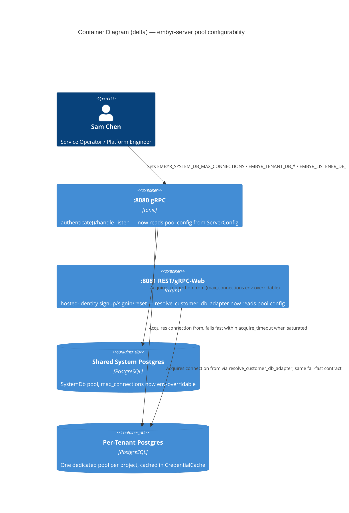

# Feature Delta: pool-sizing-and-limits

## Wave: DISCUSS / [REF] Reading Confirmation

✓ `docs/product/production-readiness-audit-2026-09-08.md` read for finding #16 (High, Reliability),
confirmed verbatim: *"Postgres pool sizing is hardcoded tiny (`max_connections(5)` or `(2)`)
everywhere with no env override, and most pools have no `acquire_timeout` (sqlx 30s default) —
saturated tenants see 30s tail latency before a clean error instead of a fast fail. No concurrency
limiter exists anywhere to shed load before it queues."* Cites 4 locations, all read in full below.

✓ All 4 cited locations read directly, not trusted from the audit's citation alone:

1. **`crates/embyr-server/src/adapters/system_db.rs:229-236`** (`SystemDb::new`) — the SHARED SYSTEM
   pool (auth, admin API, rate-limit token buckets; the same pool `preauth-db-amplification` and
   `distributed-rate-limiting` both already depend on). `max_connections(5)`, **already has**
   `acquire_timeout(Duration::from_secs(5))` with an explicit doc comment: *"Pool acquire timeout is
   5 seconds to ensure startup fails fast when the database is unreachable (rather than the sqlx
   default of 30 seconds)."* **Correction to the audit's own framing**: this specific pool is NOT
   missing `acquire_timeout` — it is the one site in the whole finding that already does the right
   thing. Its only real gap is `max_connections(5)` has no env override.
2. **`crates/embyr-pg-storage/src/backend_adapter.rs:41-47`** (`PostgresBackendAdapter::new`) — the
   PER-CUSTOMER-PROJECT pool. One instance is constructed per tenant, on that tenant's first request
   after a process (re)start, and then held in `CredentialCache` (confirmed via
   `crates/embyr-server/src/grpc/handler.rs:288,306,357` — `PostgresBackendAdapter::new(&dsn)` is
   called only on a cache miss, keyed by `CredentialCacheKey`; every subsequent request for that
   tenant reuses the SAME cached pool). `max_connections(5)`, **no `acquire_timeout` at all** — this
   is the sqlx-default-30s site the finding's "saturated tenants see 30s tail latency" language most
   directly describes: once one tenant's own concurrent request load exceeds 5 in-flight document
   operations against their own dedicated pool, request #6 queues silently for up to 30s before
   erroring, while every OTHER tenant's own separate pool is unaffected (isolation already exists by
   construction — the gap is purely the missing timeout and fixed size).
3. **`crates/embyr-server/src/grpc/handler.rs:3563-3568`** (inside `handle_listen`) — an ad hoc pool
   built fresh, per project, the first time that project's realtime `Listen` RPC is invoked (guarded
   by `active_listeners`'s `contains_key` check), used only by `PostgresNotifyListener`'s own fetch
   queries. `max_connections(2)`, **no `acquire_timeout`**. Smallest pool of the three, but the same
   missing-timeout gap. The surrounding comment confirms this is a deliberate, if minimal, design:
   *"We need the pool from the adapter... build a new pool from the DSN specifically for the
   listener's fetch queries"* — a second pool per tenant is already an accepted pattern, not
   something this feature needs to consolidate away.
4. **`crates/embyr-db-prep/src/main.rs:67-77`** (`main`) — a ONE-SHOT, customer-run migration binary
   (its own module doc: *"Lets a customer's DBA apply `migrations/customer/` against their own
   Postgres, under their own elevated... credentials"*, JOB-15, ADR-022/023 — a fundamentally
   different persona and job from the other 3 sites). `max_connections(5)`, **no `acquire_timeout`**
   — but the entire pool-open call is already wrapped in `tokio::time::timeout(Duration::from_secs(10),
   ...)`, and a timeout there is treated identically to a connect failure: it short-circuits straight
   to `connection_failed_and_exit`, a hardcoded, structurally-distinct message, *before*
   `error_report::classify()` is ever reached. **This site already has an outer fail-fast guard
   functionally equivalent to what the other 3 sites lack** — see § Investigation 3 for why this
   changes its treatment.

✓ `docs/feature/production-readiness/feature-delta.md` and
`docs/product/architecture/adr-017-production-startup.md`-equivalent (`ServerConfig`,
`crates/embyr-server/src/config.rs`) read for the established env-var configuration convention.
Confirmed the exact precedent to reuse for pool-sizing knobs: `ServerConfig::from_env()` already has
several OPTIONAL, numeric, `EMBYR_*`-prefixed env vars that parse-with-a-documented-default rather
than requiring the operator to set them (`EMBYR_CAP_CHECK_INTERVAL_SECS`,
`EMBYR_TRANSACTION_SWEEP_INTERVAL_SECS`, `EMBYR_TRANSACTION_RETENTION_DAYS`,
`EMBYR_SOFT_DELETE_SWEEP_INTERVAL_SECS`, `EMBYR_SOFT_DELETE_GRACE_DAYS`,
`EMBYR_RATE_LIMIT_RPS`) — an invalid (non-numeric, non-finite, non-positive) value is a startup
`ConfigError`, not a silent fallback. This is the exact shape pool-sizing/timeout knobs should follow;
DESIGN's job is naming the specific env vars, not inventing a new configuration mechanism.

✓ `docs/evolution/2026-09-13-preauth-db-amplification.md` (finding #14, closed) and
`docs/product/jobs.yaml` JOB-11 (`fair-multitenancy`, `distributed-rate-limiting`) read for what is
already known about the shared system pool's real-world load characteristics. Confirmed:
`preauth-db-amplification` already reduced the SAME shared `SystemDb` pool's per-unauthenticated-
request round-trip count (UPDATE + SELECT EXISTS + INSERT, pre-`authenticate()`) — a load-*reduction*
fix, not a pool-*sizing* fix; it does not touch `PgPoolOptions` at all. `distributed-rate-limiting`
(JOB-11) enforces cluster-wide per-project REQUEST-RATE fairness via a `rate_buckets` Postgres row,
checked BEFORE `authenticate()` — a completely different mechanism and a different failure mode
(rejecting excess requests outright with `RESOURCE_EXHAUSTED`) than pool-connection exhaustion
(requests that already passed the rate limiter queuing for a DB connection). **Neither prior feature
sized or timed-out any pool** — this finding is genuinely unaddressed by either.

✓ `docs/evolution/2026-08-10-secrets-management.md` (ADR-018) read for env-var sourcing conventions.
Confirmed ADR-018's AWS/GCP-secret-sourcing pattern applies to *secret* values (`EMBYR_ADMIN_KEY`,
`EMBYR_ENCRYPTION_KEY`) with dual-source resolution — not applicable here: pool size and timeout are
plain non-secret tuning numbers, correctly modeled on the simpler `EMBYR_RATE_LIMIT_RPS`-style
single-source optional numeric var, not the dual-source secret-resolution machinery.

✓ `docs/feature/healthz-dependency-checks/feature-delta.md` read in full for this session's own most
recent sibling finding (#15) on the identical shared system pool, confirming the established
DISCUSS-doc conventions this document follows (top-level `feature-delta.md`, `## Wave: DISCUSS / [REF]
...` section headers, JOB-13/Sam-Chen framing for backend/infrastructure findings in this codebase)
and confirming #15's own explicit "Out of Scope" line: *"Postgres pool sizing / `acquire_timeout`
configuration (finding #16, same audit, different file/mechanism) — not fixed, not touched, explicitly
a separate finding."* This feature is exactly that deferred finding.

✓ `docs/product/jobs.yaml` read (JOB-01 through JOB-15, this file's relevant range) for persona/job
grounding — see § Persona & Job.

## Wave: DISCUSS / [REF] Investigation Findings

### Investigation 1 — this is a configurability + fast-fail gap, not a "pools are too small" gap

Nothing in the audit or in the code establishes that 5 (or 2) connections is numerically wrong for
any given deployment — the finding is that the number is HARDCODED with no way to change it without a
recompile, and that 3 of 4 sites have no bound on how long a request queues for a connection before
failing. The fix DISCUSS scopes is: (a) make `max_connections` env-overridable at each of the 3
long-running `embyr-server` pool sites, with a sane documented default; (b) add `acquire_timeout` to
the 2 sites that lack it, short enough that a saturated pool produces a clean, actionable gRPC error
within single-digit seconds rather than sqlx's 30s default; (c) make that timeout itself
env-overridable, following the exact `EMBYR_CAP_CHECK_INTERVAL_SECS`-style optional-numeric-var
convention. **Not in scope**: picking the "correct" production numbers for any specific customer's
deployment — that is an operational tuning decision Sam Chen makes per-deployment using the new knobs,
not something this feature hardcodes differently.

### Investigation 2 — the 3 `embyr-server`-resident pools share one root cause and one fix shape; `embyr-db-prep` does not

`system_db.rs`, `backend_adapter.rs`, and `handler.rs`'s `handle_listen` pool are all: (a) inside the
same long-running, multi-tenant `embyr-server` process, (b) built with `sqlx::postgres::PgPoolOptions`,
(c) sit directly in a live request's critical path (auth, document reads/writes, realtime
subscription setup), and (d) are the exact mechanism by which one saturated tenant's own request
concurrency turns into 30s of silent queuing instead of a fast, clean error. Fixing all 3 is
mechanical repetition of the identical `PgPoolOptions::new().max_connections(N).acquire_timeout(T)`
pattern, sourced from env vars via the same helper — genuinely one user-observable outcome ("a
saturated pool fails fast, everywhere embyr-server has one"), not three unrelated concerns. This
supports ONE story, per Elephant Carpaccio's "outcome, not technical layer" test.

`embyr-db-prep` is different in every dimension that matters for this finding: it is a
customer-DBA-run, one-shot CLI (JOB-15, persona P6 Elena Vasquez — not P2 Sam Chen/JOB-13), it opens
exactly one pool for the lifetime of one process invocation with no concurrent tenant contention
possible (Elena is the only caller, running once), and its pool-open call is ALREADY wrapped in an
outer `tokio::time::timeout(Duration::from_secs(10), ...)` that produces a hardcoded, distinct
"connection failed" message on timeout — functionally the fast-clean-error outcome this finding wants,
already present, just via a different mechanism (an outer `tokio::time::timeout` around the whole
connect future, not sqlx's own `acquire_timeout`). See § Out of Scope for the full argument; this is a
different-persona, different-job, already-adequately-guarded site, not a 4th slice of the same story.

### Investigation 3 — a concurrency limiter is a genuinely separate mechanism from pool sizing, and DISCUSS does not resolve which (or both) DESIGN should pick

The finding names two distinct things: (1) pool sizing/timeout hardcoding, and (2) *"No concurrency
limiter exists anywhere to shed load before it queues."* These solve different problems. Right-sizing
`max_connections` + a short `acquire_timeout` bounds HOW LONG a request waits before failing, but does
not reduce HOW MANY requests attempt to acquire a connection concurrently — under sustained overload,
every one of those requests still burns a task/thread/memory footprint queuing for up to the acquire
timeout before failing, just faster than 30s. A separate concurrency limiter (e.g. a semaphore or
admission gate in front of the request-handling path, bounding in-flight requests per tenant or
per-process before they ever attempt a pool acquisition) would shed load pre-emptively rather than
let it queue-then-fail-fast. **DISCUSS frames this as an explicit open question (OQ-PSL-02) rather
than locking a mechanism**: it is plausible that right-sized pools + a short `acquire_timeout` is
sufficient to satisfy the finding's own stated goal ("fast clean error instead of 30s tail latency"),
since a fast, clean, typed error IS the goal, not necessarily pre-emptive shedding. A separate limiter
is a genuinely different, larger design commitment (where does it live — per-tenant, per-process,
per-pool-role; what error/status does it return; does it interact with `distributed-rate-limiting`'s
existing pre-`authenticate()` rejection path) that DESIGN should evaluate with real evidence, not
something DISCUSS should prescribe.

## Wave: DISCUSS / [REF] Open Design Questions (named, not locked)

- **OQ-PSL-01 (per-pool-role vs. global config)**: whether one shared pair of env vars
  (`EMBYR_DB_POOL_MAX_CONNECTIONS`/`EMBYR_DB_POOL_ACQUIRE_TIMEOUT_SECS`, illustrative names only)
  applies uniformly to all 3 `embyr-server`-resident pool roles (system, per-tenant customer,
  per-tenant listener), or whether each role gets its own pair (the system pool's own current
  `acquire_timeout(5s)` precedent and the listener pool's much smaller natural connection need suggest
  different roles may warrant different defaults). DISCUSS leans toward per-role env vars with
  role-appropriate defaults (mirroring that the system pool already independently chose 5s over
  sqlx's 30s default for its own reasons) but does not lock this — it is a genuine DESIGN trade-off
  between operator simplicity (one knob) and correctness (three pools with different concurrency
  profiles rarely want identical numbers).
- **OQ-PSL-02 (concurrency limiter as separate mechanism)**: whether right-sized pools + a short
  `acquire_timeout` alone satisfies "fast clean error instead of 30s tail latency," or whether a
  separate pre-emptive concurrency limiter (shedding load before it ever attempts a pool acquisition)
  is also required to fully close the finding's own second sentence. DISCUSS surfaces this as the
  single largest open question in this feature (§ Investigation 3) and explicitly does NOT recommend
  a default — DESIGN should evaluate against real or estimated concurrency numbers before choosing.
- **OQ-PSL-03 (`embyr-db-prep` scope)**: DISCUSS recommends treating `embyr-db-prep`'s pool config as
  OUT OF SCOPE for this feature (§ Out of Scope, § Investigation 2) given its already-adequate
  10-second outer timeout and complete absence of concurrent-tenant load. DESIGN may override this if
  it identifies real evidence of DBA-facing pain (e.g. Elena Vasquez's own migration needing more than
  5 connections, or wanting the 10s connect timeout to be operator-tunable) that DISCUSS's own reading
  did not surface.

## Wave: DISCUSS / [REF] Orchestrator Decisions (not re-litigated)

- Feature type: **Backend/infrastructure** — no user-facing UI, no customer-visible surface; the
  "user" is the deployment operator (Sam Chen) who configures pool sizing per deployment. No journey
  artifact, no TUI mockup, no emotional-arc YAML (mirrors this session's established precedent for
  this class of finding: `production-readiness`, `firestore-tls-support`, `healthz-dependency-checks`).
- Scope: **finding #16 (High)**, and — since it shares its exact root cause and 2 of its exact file
  locations (`system_db.rs:230-232`, `backend_adapter.rs:42-44`) — this feature's fix also resolves
  **finding #30 (Medium, "Postgres pool sizing has no env override anywhere... Same underlying issue
  as #16, DB-specific angle")** as a byproduct, not a separately-scoped effort. Related-but-separate
  findings explicitly NOT bundled: #17 (collection-group query scan cost), #18 (backup/DR docs), #19
  (no K8s manifests/Helm chart), #24 (message/body size limits), #29 (Grafana dashboard/runbook).
- JTBD: reuse an existing job — **JOB-13 (`production-deployment`)** — not a new job (§ Persona & Job).
- Walking Skeleton: **Yes** — a real running `embyr-server` against a real Postgres container
  (testcontainers), with each of the 3 pool sites configured via env var override and proven to (a)
  accept the override at startup and (b) fail a saturated-pool request with a clean, typed error
  within the configured timeout rather than sqlx's 30s default.
- UX Research Depth: **None** — backend configuration/reliability fix; no emotional arc, no journey
  YAML, no TUI mockup applies.

## Wave: DISCUSS / [REF] Persona & Job

**Persona**: **P2 Sam Chen (Service Operator / Platform Engineer)** — the operator who deploys and
tunes `embyr-server` for a given customer base's concurrency profile, and who needs both the ability
to size pools for that profile without a code change, and confidence that a tenant whose load exceeds
its pool's capacity gets a fast, diagnosable error rather than a silent 30-second hang that looks like
the whole service is down.

**Job**: **JOB-13 `production-deployment`**, reused. JOB-13's own functional dimension already
establishes the env-var-driven, fail-fast-with-named-errors configuration discipline this feature
extends to pool sizing (*"DATABASE_URL + EMBYR_ADMIN_KEY + EMBYR_ENCRYPTION_KEY env vars configure
everything... no hardcoded defaults for security-critical values"*) and its own habit force already
names the exact operating pattern this finding lives in (*"Sam is used to Kubernetes + Docker
deployments... 12-factor app conventions"*). Pool size and acquire-timeout are exactly the kind of
per-environment tuning knob 12-factor config prescribes as env vars, not compiled constants. This
mirrors the session's established pattern of extending JOB-13 via a dated NOTE for a closely-related
deployment-behavior concern (`firestore-tls-support`, `healthz-dependency-checks`) rather than creating
a new job.

**Candidates considered and rejected**:
- **JOB-11 (`fair-multitenancy`, P2 Sam Chen)** — considered because pool exhaustion is, at a glance,
  a per-tenant fairness question ("one project cannot consume more than its fair share"). Rejected as
  the PRIMARY job because JOB-11's own shipped mechanism (`distributed-rate-limiting`) is a completely
  different failure boundary: it rejects excess REQUESTS outright, cluster-wide, BEFORE
  `authenticate()` runs, using a `rate_buckets` Postgres row. This finding is about connection-pool
  exhaustion AFTER a request has already passed rate limiting and authentication, against a pool
  already isolated per-tenant by construction (`CredentialCache`, § Reading Confirmation #2) — not a
  cross-tenant fairness problem, a single-tenant capacity/timeout problem. If DESIGN chooses a
  concurrency limiter (OQ-PSL-02) with cross-tenant shedding semantics, that specific piece may
  warrant a JOB-11 cross-reference at DESIGN/DISTILL time — named here, not resolved.
- **`infrastructure-only`** — considered because the fix is env-var plumbing with no customer-facing
  surface. Rejected: Sam Chen makes a real, observable decision with this feature's output — how to
  size each pool for a given deployment's tenant mix, and can show an SRE reviewer or a customer that a
  saturated tenant now gets a fast, typed error instead of an unexplained 30-second stall (§ Elevator
  Pitch) — satisfying Dimension 0's "real decision enabled" test the same way `healthz-dependency-checks`
  and `firestore-tls-support` did for this same job.

## Wave: DISCUSS / [REF] Scope Assessment (Elephant Carpaccio Gate)

**Signals checked**: >10 user stories? No (1). >3 bounded contexts/modules? No — 2 crates touched
(`embyr-server`, `embyr-pg-storage`), 3 call sites, one shared config-sourcing pattern reused 3 times,
zero `embyr-core` change (pool construction has always lived outside the IO-free domain crate).
Walking skeleton >5 integration points? No (3: the 3 pool sites, each independently overridable and
independently provable via a saturated-pool integration test). Estimated effort >2 weeks? No — the
audit's own closing note characterizes this class of finding as "most fixes are single-function";
applying an identical `PgPoolOptions` builder change 3 times plus one shared env-parsing helper is
well under 3 days including a real-Postgres saturation integration test. Multiple independent user
outcomes? No — one outcome, cleanly stated: "a saturated pool anywhere in `embyr-server` fails fast
and is sizeable without a code change."

**Verdict: PASS.** One right-sized story covering the 3 `embyr-server`-resident sites;
`embyr-db-prep` is excluded with explicit rationale (§ Out of Scope), not silently dropped.

## Wave: DISCUSS / [REF] System Constraints

- `embyr-core` remains IO-free and is not touched — `PgPoolOptions` construction has always lived in
  `embyr-server` and `embyr-pg-storage`, both already IO-capable by design.
- The system pool's existing `acquire_timeout(5s)` and its documented startup-fail-fast rationale
  (`system_db.rs:227-228`) must not regress — its new env override must preserve `5` as the default
  when unset, matching today's byte-for-byte startup behavior.
- Per-tenant pool isolation (one `PostgresBackendAdapter`/pool per project, cached in
  `CredentialCache`) is an existing, load-bearing property this feature must not weaken — a saturated
  tenant's own pool timing out must not affect any other tenant's separate pool or the shared system
  pool.
- New env vars follow the established `ServerConfig` convention exactly: optional, numeric,
  `EMBYR_*`-prefixed, parse-with-a-documented-default, invalid (non-numeric/non-positive) value is a
  startup `ConfigError` — not a silent fallback and not a runtime panic on first pool acquisition.
- `embyr-db-prep`'s pool configuration is explicitly OUT OF SCOPE (§ Out of Scope) — not touched by
  this feature's build target.
- Whether a separate concurrency limiter is also needed (OQ-PSL-02) is an explicit DESIGN decision —
  DISCUSS locks only the observable, testable "fails fast, is sizeable via env var" outcomes below,
  not the mechanism.

## Wave: DISCUSS / [REF] User Stories

### US-01: Sam Chen Gets a Fast, Clean Failure Instead of a 30-Second Hang When a Tenant's Pool Is Saturated — and Can Size Every Pool Without a Recompile

**job_id**: JOB-13 | **Release**: 1 (Walking Skeleton) | **Persona**: P2 Sam Chen

#### Elevator Pitch
**Before**: Sam Chen deploys `embyr-server` for a growing customer base. Every pool the process
opens — the shared system pool, each tenant's own document-storage pool, each tenant's own realtime-
listener pool — is hardcoded to `max_connections(5)` or `(2)`, with no environment variable to change
it without a rebuild. Two of the three pools have no `acquire_timeout` at all, so once a tenant's own
concurrent request load exceeds their pool's fixed size, the next request queues silently for up to
sqlx's default 30 seconds before finally erroring — indistinguishable, from the outside, to a total
outage.
**After**: Sam Chen can configure `max_connections` and `acquire_timeout` for each of `embyr-server`'s
pools via documented environment variables, following the exact same optional-numeric-var convention
already established for `EMBYR_CAP_CHECK_INTERVAL_SECS` and its siblings. Every pool a saturated
tenant's requests could queue against now fails fast, with a clean, typed error, within a short,
configurable window — never sqlx's 30-second default.
**Decision enabled**: Sam Chen can size each pool appropriately for a specific deployment's tenant
concurrency profile without a code change or redeploy of a new binary, and can tell a customer or an
SRE reviewer, backed by a real test, that a saturated tenant now gets a fast, actionable error instead
of an unexplained multi-second stall that looks like a full outage.

#### Who
- Sam Chen (P2) | Service Operator / Platform Engineer deploying and tuning `embyr-server` for a
  specific customer base | Needs to size connection pools per deployment without a rebuild, and needs
  a saturated pool to fail fast and cleanly rather than queue silently toward sqlx's 30-second default.

#### Solution
Env-var-overridable `max_connections` and `acquire_timeout` for the 3 `embyr-server`-resident pool
sites (shared system pool, per-tenant customer-document pool, per-tenant realtime-listener pool),
sourced through the same `ServerConfig`-style optional-numeric-var-with-documented-default convention
already used elsewhere in this codebase. Exact env var names/grouping (OQ-PSL-01) and whether a
separate concurrency limiter is also needed (OQ-PSL-02) are DESIGN decisions.

#### Domain Examples

**Example 1 (Happy Path — defaults preserved)**: Sam Chen deploys `embyr-server` with none of the new
pool-sizing env vars set. The shared system pool behaves byte-for-byte as it does today
(`max_connections(5)`, `acquire_timeout(5s)`); the per-tenant customer pool and per-tenant listener
pool keep their current `max_connections` (5 and 2) but now also have a short, documented default
`acquire_timeout` instead of sqlx's undocumented 30s default.

**Example 2 (Core scenario — env override at deployment time)**: Sam Chen is onboarding Solstice
Retail, a customer whose flash-sale traffic regularly drives 12 concurrent checkout writes against
their own dedicated pool. Sam sets the new env var(s) to raise Solstice Retail's effective pool
ceiling before the sale, without recompiling or patching `embyr-server`, and the pool opens at the
configured size on the next process start.

**Example 3 (Error/Boundary — saturated pool fails fast)**: During Solstice Retail's flash sale,
concurrent checkout writes briefly exceed even the raised pool size. The 6th (or Nth, per configured
size) concurrent request queues for at most the configured `acquire_timeout` — a small number of
seconds — then receives a clean, typed `UNAVAILABLE`-class error rather than hanging for 30 seconds;
Fernbank Analytics' own separate, unrelated pool and requests are completely unaffected by Solstice
Retail's saturation.

#### UAT Scenarios (BDD)

```gherkin
Scenario: Unset pool env vars preserve today's exact default behavior
  Given embyr-server starts with none of the new pool-sizing environment variables set
  Then the shared system pool opens with max_connections=5 and acquire_timeout=5s, unchanged from today
  And the per-tenant customer pool and per-tenant listener pool open with their current max_connections
  And both previously-timeout-less pools now have a short, documented default acquire_timeout

Scenario: An operator resizes a pool via environment variable without a rebuild
  Given Sam Chen sets the pool-sizing environment variable(s) to a larger max_connections value before starting embyr-server
  When embyr-server starts
  Then the corresponding pool opens with the configured max_connections value
  And no source change or recompilation was required to achieve this

Scenario: A saturated tenant pool fails fast with a clean error instead of hanging
  Given Solstice Retail's dedicated customer pool is fully saturated (every connection in use)
  When another request for Solstice Retail attempts to acquire a connection
  Then the request fails with a clean, typed error within the configured acquire_timeout
  And the request does not hang for anywhere close to sqlx's 30-second default

Scenario: One tenant's pool saturation does not affect another tenant's pool
  Given Solstice Retail's dedicated pool is fully saturated
  When Fernbank Analytics makes a request against its own, separate dedicated pool
  Then Fernbank Analytics' request is served normally, unaffected by Solstice Retail's saturation

Scenario: An invalid pool-sizing environment variable value fails startup with a named error
  Given Sam Chen sets a pool-sizing environment variable to a non-numeric or non-positive value
  When embyr-server attempts to start
  Then the server exits non-zero with an error naming the specific invalid environment variable
  And no pool is silently opened with an unintended fallback value

Scenario: The realtime-listener pool also fails fast under saturation
  Given a tenant's dedicated realtime-listener pool is fully saturated
  When a new Listen request for that tenant attempts to provision or use that pool
  Then the request fails with a clean, typed error within the configured acquire_timeout rather than hanging
```

#### Acceptance Criteria
- [ ] AC-PSL-01: with no new environment variables set, the shared system pool's `max_connections`
      and `acquire_timeout` remain exactly `5` and `5s` (today's values), and the per-tenant customer
      and listener pools keep their current `max_connections` (5 and 2 respectively) while gaining a
      short, documented default `acquire_timeout` where none existed before.
- [ ] AC-PSL-02: each of the 3 `embyr-server`-resident pool sites accepts an environment-variable
      override for `max_connections`, applied at pool-construction time, requiring no code change.
- [ ] AC-PSL-03: each of the 2 sites currently missing `acquire_timeout`
      (`backend_adapter.rs`, `handler.rs`'s listener pool) gains one, and it is environment-variable
      overridable following the same convention as `max_connections`.
- [ ] AC-PSL-04: a request that cannot acquire a connection from a saturated pool fails with a clean,
      typed error within the pool's configured `acquire_timeout` — proven against a real, saturated
      Postgres-backed pool, not asserted by code inspection alone.
- [ ] AC-PSL-05: an invalid (non-numeric or non-positive) value for any new pool-sizing environment
      variable causes `embyr-server` to exit non-zero at startup with an error naming that specific
      variable, matching the existing `ConfigError` convention — it never silently falls back or
      panics later at first pool-acquisition time.
- [ ] AC-PSL-06 (isolation regression guard): one tenant's saturated, dedicated pool does not delay or
      fail any other tenant's separate pool, nor the shared system pool.

#### Outcome KPIs
- **Who**: Sam Chen (Service Operator/Platform Engineer) and every tenant whose request concurrency
  could exceed its dedicated pool's connection count.
- **Does what**: a saturated pool anywhere in `embyr-server` returns a clean, typed error within a
  short, operator-configured window, instead of queuing silently toward sqlx's 30-second default; pool
  size is tunable per deployment via environment variable, without a rebuild.
- **By how much**: from "no env override exists anywhere, 2 of 3 pools have no acquire_timeout at all,
  worst-case 30s silent hang" (findings #16/#30's own confirmed baseline) to a bounded,
  single-digit-second failure window on every pool, proven by a real saturated-pool integration test,
  plus zero-recompile resizing via environment variable.
- **Measured by**: AC-PSL-04 — a real testcontainers Postgres-backed integration test that saturates a
  pool (exhausts `max_connections`) and asserts the next request's failure latency is bounded by the
  configured `acquire_timeout`, not sqlx's 30-second default.
- **Baseline**: today's hardcoded `max_connections`/absent `acquire_timeout`, confirmed by direct code
  reading (§ Reading Confirmation) — zero pools are env-overridable today; 2 of 3 `embyr-server`-
  resident pools have no timeout bound at all.

#### Technical Notes
- Reuses the exact `ServerConfig`-established optional-numeric-env-var-with-documented-default
  convention (`EMBYR_CAP_CHECK_INTERVAL_SECS` and siblings, `crates/embyr-server/src/config.rs`) — no
  new configuration mechanism, no new Cargo dependency.
- `PostgresBackendAdapter::new()` (`crates/embyr-pg-storage/src/backend_adapter.rs`) is called only on
  a `CredentialCache` miss (`crates/embyr-server/src/grpc/handler.rs:288,306,357`) — pool sizing here
  affects a per-tenant pool held for the life of the cache entry, not a per-request pool; DESIGN should
  confirm how (or whether) a resize takes effect for an already-cached tenant without a process
  restart.
- OQ-PSL-01 (per-role vs. global env vars) and OQ-PSL-02 (separate concurrency limiter) are named
  DESIGN decisions — this story's ACs are written at the observable-outcome level and do not depend on
  either.
- `embyr-db-prep`'s pool (finding #16's 4th cited location) is explicitly out of scope for this story
  (§ Out of Scope).
- Depends on nothing outside `embyr-server` and `embyr-pg-storage`; `embyr-core` and `embyr-agent` are
  untouched.

## Wave: DISCUSS / [REF] Out of Scope

- **`embyr-db-prep`'s pool configuration** (finding #16's 4th cited location,
  `crates/embyr-db-prep/src/main.rs:69-70`) — different persona (P6 Elena Vasquez, not Sam Chen),
  different job (JOB-15 `customer-db-preflight`, not JOB-13), different execution model (one-shot CLI,
  single caller, no concurrent-tenant contention possible), and already has a functionally-equivalent
  fast-fail guard (the whole pool-open call is wrapped in an outer `tokio::time::timeout(10s, ...)`
  that already short-circuits to a hardcoded, distinct "connection failed" message). No evidence
  surfaced during DISCUSS that Elena Vasquez has ever needed more than 5 connections for a one-shot
  migration run, or that the existing 10-second connect timeout is a real pain point. Named as
  OQ-PSL-03 for DESIGN to override if it finds evidence DISCUSS did not (§ Investigation 2).
- **A separate pre-emptive concurrency limiter** (semaphore or admission gate shedding load before it
  ever attempts a pool acquisition) — an explicit open question (OQ-PSL-02), not a locked requirement
  of this story. DISCUSS frames the decision; DESIGN evaluates and chooses.
- **Picking specific production pool-size/timeout numbers for any given customer deployment** — that
  is Sam Chen's own per-deployment operational tuning decision once the env-var knobs exist, not
  something this feature hardcodes differently for any particular tenant.
- **Collection-group query scan cost (#17), backup/DR documentation (#18), K8s manifests/Helm chart
  (#19), request/message body size limits (#24), Grafana dashboard/runbook (#29)** — separate,
  already-tracked findings from the same audit, not touched by this feature.

## Wave: DISCUSS / [REF] Walking Skeleton Strategy

A real running `embyr-server` against a real Postgres container (testcontainers), with the per-tenant
customer pool's `max_connections` set to a small number (e.g. 2) via the new environment variable and
its `acquire_timeout` set to a short value via the same mechanism, then deliberately saturated by
holding that many connections open concurrently and issuing one more request — proving (a) the env
override took effect at startup and (b) the saturated request fails within the configured timeout, not
sqlx's 30-second default. This single run demonstrates the finding's entire required outcome for the
highest-risk site (the per-tenant pool); the other 2 sites (system pool, listener pool) reuse the
identical proof shape in their own scenarios.

## Wave: DISCUSS / [REF] Driving Ports

Process startup (`embyr-server`'s own `main()`/`ServerConfig::from_env()`, reading the new
environment variables) and the existing gRPC/HTTP request paths that already acquire connections from
each of the 3 pools (`SystemDb` auth/admin queries, `PostgresBackendAdapter` document operations,
`PostgresNotifyListener`'s realtime fetch queries) — no new listener, no new port, no new RPC. This
feature changes pool-construction parameters and their sourcing, not any request/response shape.

## Wave: DISCUSS / [REF] Pre-requisites

- None blocking. `PgPoolOptions` is already the library in use at all 4 cited sites; the
  `ServerConfig` optional-numeric-env-var convention already exists and is directly reusable; the
  testcontainers Postgres integration-test mechanism already exists in this workspace
  (`pr08_realtime_listener_reconnect.rs` and others) and is directly reusable for this feature's own
  saturated-pool proof.

## Wave: DISCUSS / [REF] Definition of Ready Validation

### DoR Checklist (9-item hard gate)

| DoR Item | US-01 |
|---|---|
| 1. Traces to a job_id | PASS — JOB-13, reused, with JOB-11 explicitly considered and reasoned against as the primary job (§ Persona & Job) |
| 2. Elevator Pitch complete | PASS — Before/After/Decision-enabled, real entry point (operator-set environment variables at deployment time, mirroring `firestore-tls-support`'s and `healthz-dependency-checks`'s own precedent for this job), observable output (bounded-latency typed error vs. 30s hang) |
| 3. 3+ domain examples, real data | PASS — defaults-preserved regression example, Solstice Retail's flash-sale resize and saturation examples, Fernbank Analytics' isolation example |
| 4. UAT in Given/When/Then (3-7) | PASS — 6 scenarios |
| 5. AC derived from UAT | PASS — AC-PSL-01 through 06 |
| 6. Right-sized (1-3 days, 3-7 scenarios) | PASS — mechanical repetition of one `PgPoolOptions` pattern across 3 sites plus one shared env-parsing helper; well under 3 days including a real saturated-pool integration test |
| 7. Technical notes identify constraints | PASS — OQ-PSL-01/02 named, not locked; `CredentialCache` caching behavior flagged for DESIGN |
| 8. Outcome KPIs with numeric target | PASS — bounded single-digit-second failure window, proven by real saturated-pool test, replacing an unbounded-up-to-30s baseline |
| 9. Prior-wave artifacts reconciled | PASS — audit findings #16 and #30, `production-readiness`/ADR-017's own env-var convention, `distributed-rate-limiting`/`preauth-db-amplification`'s own (different-mechanism) prior work on the same shared system pool, `secrets-management`/ADR-018's env-var sourcing convention (confirmed not directly applicable), `healthz-dependency-checks`'s own explicit deferral of this exact finding, `docs/product/jobs.yaml` JOB-11/13/15 all directly informed this feature's shape |

### DoR Status: **PASSED**

## Wave: DISCUSS / [REF] Wave Decisions Summary

### Key Decisions
- [D1] Persona/job: **P2 Sam Chen / JOB-13 (`production-deployment`)**, reused — not JOB-11
  (fair-multitenancy, a different failure boundary: pre-`authenticate()` cluster-wide request-rate
  rejection, not post-auth per-tenant pool-connection exhaustion) (§ Persona & Job).
- [D2] Scope is the 3 `embyr-server`-resident pools (shared system, per-tenant customer, per-tenant
  listener) as ONE story — genuinely mechanical repetition of one fix shape, one user-observable
  outcome, not three unrelated concerns (§ Investigation 2, § Scope Assessment).
- [D3] `embyr-db-prep`'s pool (the finding's 4th cited location) is explicitly OUT OF SCOPE — different
  persona (Elena Vasquez/JOB-15), different execution model (one-shot, no tenant contention), and
  already has a functionally-equivalent outer fail-fast timeout (§ Investigation 2, § Out of Scope,
  OQ-PSL-03).
- [D4] This feature's fix also resolves finding #30 (Medium) as a byproduct — same root cause, 2 of
  its exact file locations already covered by US-01's own scope (§ Orchestrator Decisions).
- [D5] Whether a separate, pre-emptive concurrency limiter is also needed beyond right-sized pools +
  short `acquire_timeout` is an explicit, unlocked DESIGN decision (OQ-PSL-02) — DISCUSS deliberately
  does not prescribe a mechanism (§ Investigation 3).
- [D6] Exact env var naming/grouping (per-pool-role vs. global) is a named DESIGN choice (OQ-PSL-01) —
  DISCUSS locks only the observable, testable outcomes in the ACs, not the variable names or count.

### Requirements Summary
- Primary need: every pool `embyr-server` opens must be sizeable via environment variable without a
  recompile, and every pool must fail a request that cannot acquire a connection within a short,
  configurable, single-digit-second window — never sqlx's 30-second default.
- Constraint: the shared system pool's existing `acquire_timeout(5s)` default and startup-fail-fast
  behavior must not regress; per-tenant pool isolation (already achieved via `CredentialCache`) must
  not be weakened; invalid env var values must fail startup with a named error, matching the existing
  `ConfigError` convention.
- Success looks like: AC-PSL-01 through AC-PSL-06 all passing against a real running `embyr-server`
  and a real, deliberately-saturated Postgres-backed pool, with zero regression to the shared system
  pool's existing startup behavior or to per-tenant isolation.

### Handoff Package (to DESIGN — solution-architect)
- This feature-delta.md (DISCUSS section) — job grounding, all 4 audit-cited locations read and
  confirmed (including a correction: the system pool already has `acquire_timeout`), 1 user story with
  6 UAT scenarios and 6 acceptance criteria, `embyr-db-prep` explicitly scoped out with rationale.
- Confirmed exact file/line targets for DESIGN: `crates/embyr-server/src/adapters/system_db.rs:229-236`
  (`SystemDb::new`, add env override for `max_connections` only), `crates/embyr-pg-storage/src/backend_adapter.rs:41-47`
  (`PostgresBackendAdapter::new`, add env override for `max_connections` AND a new `acquire_timeout`),
  `crates/embyr-server/src/grpc/handler.rs:3563-3568` (`handle_listen`'s ad hoc listener pool, same
  treatment as above), `crates/embyr-server/src/config.rs` (the `ServerConfig` env-var convention to
  extend, e.g. alongside `EMBYR_CAP_CHECK_INTERVAL_SECS` and siblings).
- Open DESIGN-level choices: OQ-PSL-01 (per-pool-role vs. global env var naming/grouping), OQ-PSL-02
  (whether a separate concurrency limiter is also needed — the largest open question in this feature),
  OQ-PSL-03 (whether to override DISCUSS's recommendation to exclude `embyr-db-prep`).
- Flagged, out-of-scope, related findings for DESIGN's own awareness (not this feature's build
  target): #17 (collection-group scan cost), #18 (backup/DR docs), #19 (no K8s manifests), #24 (body
  size limits), #29 (Grafana dashboard/runbook).

## Wave: DESIGN / [REF] Reading Confirmation (Morgan, solution-architect)

✓ All 3 DISCUSS-cited `embyr-server`-resident sites re-read directly and confirmed exactly as
described: `system_db.rs:229-236` (`max_connections(5)` + existing `acquire_timeout(5s)`),
`backend_adapter.rs:41-47` (`max_connections(5)`, no `acquire_timeout`), `handler.rs:3564-3568`
inside `handle_listen` (`max_connections(2)`, no `acquire_timeout`).

✓ `crates/embyr-server/src/config.rs` read in full (1108 lines) for the exact `ServerConfig`
convention to extend: `collect_required`/`parse_port`/`parse_rate_limit_rps` helper shape, the
`ConfigError` enum + `Display` pattern, and `from_env()`'s "collect every missing/invalid var before
returning" discipline. This is the shape the 5 new pool-sizing vars reuse — confirmed by reading,
not assumed.

✓ **Correction to DISCUSS's own reading — expanded blast radius found**: grepping every caller of
`PostgresBackendAdapter::new` surfaced 2 call sites DISCUSS's own investigation did not cite:
`crates/embyr-server/src/adapters/project_auth.rs:89,156`, inside
`resolve_customer_db_adapter` (client-auth-hosted-identity, ADR-036 Decision 7). This function uses
the SAME `CredentialCache`, the SAME cache-key shape, and the SAME "cache miss builds a fresh
pool, cache hit skips straight to construction" mechanism as `handler.rs`'s own `authenticate()` —
it is a 4th and 5th instance of the identical root cause, reached via hosted-identity's REST
signup/signin/reset path instead of the gRPC Firestore path, not a different concern. Added to this
story's build target (§ Architecture Decision, ADR-079 § Decision 5). The other 8+ callers of
`PostgresBackendAdapter::new` (`transaction_sweeper.rs`, `composite_index_builder.rs`,
`admin/handlers/composite_indexes.rs`, `embyr-db-prep/main.rs`, 5+ acceptance-test files) build
short-lived, one-off, non-tenant-contended pools structurally unlike the per-tenant CredentialCache
path — correctly left untouched, mirroring the same reasoning DISCUSS already applied to
`embyr-db-prep`.

✓ **Blast-radius check on `SystemDb::new` and `PostgresBackendAdapter::new` themselves** (before
proposing any signature change, per Conway/simplest-solution discipline): `SystemDb::new(&str)` has
60+ callers — nearly every integration test file in `tests/`, `main.rs`, and `system_db.rs`'s own
unit tests. `PostgresBackendAdapter::new(&str)` has 10+ callers outside this feature's scope.
Changing either constructor's signature directly is a breaking change against a machine-verified
blast radius with no offsetting benefit — this drove Decision 2 (additive `with_pool_config`
constructors, `new()` untouched everywhere).

✓ `crates/embyr-server/src/adapters/postgres_notify_listener.rs:84-89` (`reconnect_pg_listener`)
read and confirmed as a genuinely DIFFERENT, correctly-out-of-scope pool: a single dedicated
(`max_connections(1)`) reconnect connection for `PgListener`'s own LISTEN/NOTIFY recovery (ADR-071),
not a request-serving pool subject to tenant concurrency saturation. Its `acquire_timeout(5s)` is
already deliberately hardcoded to keep `reconnect_backoff`'s own retry cadence in control (ADR-071's
own documented rationale) — not a gap this finding names. Not touched.

✓ `crates/embyr-agent/src/server.rs:940` (`config.max_conns`, sourced from
`EMBYR_AGENT_MAX_CONNS`) confirmed as an existing, independent precedent in this workspace for
env-driven pool sizing — `embyr-agent` is a separate deployment/crate, out of scope for this
feature, but its existence confirms the pattern this feature applies to `embyr-server` is not novel
in this codebase.

✓ Finding #30's text confirmed verbatim (audit doc line 40): *"Postgres pool sizing has no env
override anywhere (`ServerConfig` reads only `DATABASE_URL`)... Same underlying issue as #16,
DB-specific angle."* Cites `system_db.rs:230-232` and `backend_adapter.rs:42-44` — both inside this
story's scope. **Confirmed: finding #30 is genuinely closed by this same fix**, not just cited
alongside it.

## Wave: DESIGN / [REF] Architecture Decision

**ADR-079** (new — `docs/product/architecture/adr-079-pool-sizing-and-limits.md`): per-role
env vars for pool sizing/timeout, additive `with_pool_config` constructors on `SystemDb` and
`PostgresBackendAdapter` (never touching `new()`'s signature), no new concurrency limiter this
story, `embyr-db-prep` confirmed out of scope, `project_auth.rs` added to the build target.

**Why a new ADR, not a plain extension of ADR-017**: ADR-017 established the `ServerConfig`
convention itself; it did not anticipate a decision with genuine, rejected alternatives on either
side (OQ-PSL-01's per-role-vs-global naming, OQ-PSL-02's limiter-now-vs-deferred). Both carry real
trade-offs that need a durable, discoverable record — the same bar this session's own precedent
already set (ADR-054, ADR-073, ADR-078 each got their own ADR for a bounded `ServerConfig`-extension
feature with a genuine decision inside; trivial mechanical copies did not). Additionally, DESIGN's
own reading found 2 call sites (`project_auth.rs`) DISCUSS never cited — a real scope/decision
surface change large enough to warrant its own record rather than a footnote on ADR-017. Full
alternatives analysis, consequences, and enforcement are in ADR-079 itself.

## Wave: DESIGN / [REF] Component Design

### `crates/embyr-server/src/config.rs` — changes

New shared private helper, mirroring `parse_port`'s exact shape:

```
fn parse_positive_u32(name: &str, default: u32) -> Result<u32, ConfigError>
```
Absent → `default`. Present but non-numeric or `0` → `ConfigError::InvalidPoolConfig { var, value }`
(new variant, `Display` arm mirrors `InvalidPort`'s "must be a positive integer" wording). Reused 5
times inside `from_env()`, matching the existing `parse_port`/`parse_rate_limit_rps` call-site style.

`ServerConfig` gains 5 new `pub` fields, all optional/defaulted (no change to `MissingVars`):
`system_db_max_connections: u32` (default 5), `tenant_db_max_connections: u32` (default 5),
`tenant_db_acquire_timeout_secs: u32` (default 5), `listener_db_max_connections: u32` (default 2),
`listener_db_acquire_timeout_secs: u32` (default 5).

### `crates/embyr-server/src/adapters/system_db.rs` — changes

`SystemDb::new(&str)` **unchanged** — every one of its 60+ callers keeps today's exact hardcoded
`max_connections(5)` + `acquire_timeout(5s)` behavior. New, additive:

```
pub async fn with_pool_config(database_url: &str, max_connections: u32) -> Result<Self, CoreError>
```
Identical body to `new()` except `max_connections(max_connections)`; `acquire_timeout` stays the
hardcoded `Duration::from_secs(5)` literal (DISCUSS's own handoff scopes this site to
`max_connections` only — its existing timeout and rationale are not touched). Called ONLY from
`main.rs`'s production startup path (Step 4), with `config.system_db_max_connections`.

### `crates/embyr-pg-storage/src/backend_adapter.rs` — changes

`PostgresBackendAdapter::new(&str)` **unchanged** — every one of its 8+ other callers (sweepers,
composite-index builder, admin provisioning, `embyr-db-prep`, acceptance tests) keeps today's
exact `max_connections(5)`, no `acquire_timeout`. New, additive:

```
pub async fn with_pool_config(
    database_url: &str,
    max_connections: u32,
    acquire_timeout: std::time::Duration,
) -> Result<Self, CoreError>
```

### `crates/embyr-server/src/grpc/handler.rs` — changes

- `FirestoreService` gains 4 new `pub` fields: `tenant_db_max_connections: u32`,
  `tenant_db_acquire_timeout: std::time::Duration`, `listener_db_max_connections: u32`,
  `listener_db_acquire_timeout: std::time::Duration`.
- `authenticate()`'s 3 `PostgresBackendAdapter::new(&dsn)` call sites (lines 288, 306, 357) become
  `PostgresBackendAdapter::with_pool_config(&dsn, self.tenant_db_max_connections,
  self.tenant_db_acquire_timeout)`.
- `handle_listen`'s ad hoc listener pool (lines 3564-3568) becomes `PgPoolOptions::new()
  .max_connections(self.listener_db_max_connections)
  .acquire_timeout(self.listener_db_acquire_timeout).connect(&dsn)` — same call site, same
  surrounding code, only the two literals become field reads.
- The ~9 `FirestoreService { ... }` struct-literal construction sites (8 in `lib.rs`'s
  `start_test_server_*` variants, 1 in `main.rs`, plus any in `handler.rs`'s own test helpers) each
  initialize the 4 new fields. **Test-server constructors use today's exact hardcoded literals**
  (`5`, `Duration::from_secs(5)`, `2`, `Duration::from_secs(5)`) — zero test-behavior change. Only
  `main.rs`'s production construction sources these from `config.tenant_db_max_connections` etc.

### `crates/embyr-server/src/adapters/project_auth.rs` — changes

`resolve_customer_db_adapter` gains 2 new parameters: `tenant_db_max_connections: u32,
tenant_db_acquire_timeout: std::time::Duration`. Its 2 `PostgresBackendAdapter::new(&dsn)` call
sites (lines 89, 156) become `PostgresBackendAdapter::with_pool_config(&dsn,
tenant_db_max_connections, tenant_db_acquire_timeout)`. The caller that currently invokes
`resolve_customer_db_adapter` (hosted-identity's own REST handler/state, wired at the same
composition-root step as `FirestoreService`) threads the identical two `ServerConfig`-sourced
values through — exact state-struct field naming is the crafter's call, not re-derived here
(architecture owns the contract, not the wiring detail).

### `crates/embyr-server/src/main.rs` — changes

Step 4 becomes `SystemDb::with_pool_config(&config.db_url,
config.system_db_max_connections).await`. Step 9's `FirestoreService { ... }` literal adds the 4
new fields sourced from `config.tenant_db_max_connections`, `config.tenant_db_acquire_timeout_secs`
(wrapped in `Duration::from_secs`), `config.listener_db_max_connections`,
`config.listener_db_acquire_timeout_secs` (wrapped in `Duration::from_secs`). Wherever
hosted-identity's own composition-root wiring for `resolve_customer_db_adapter`'s caller lives, it
receives the same two `config.tenant_db_*` values.

## Wave: DESIGN / [REF] C4 (Container-level; no new container, existing surfaces annotated)



No System Context (L1) change — no new external actor, no new system boundary; this is a
configurability and fast-fail behavior change to pool construction inside 2 already-existing
containers. L1 unchanged from whatever prior architect already established for `embyr-server`'s
system context.

## Wave: DESIGN / [REF] OQ-PSL-01/02/03 Resolutions

- **OQ-PSL-01 (RESOLVED)**: Per-role env vars, not one global pair. The system pool's own existing,
  independently-chosen 5s `acquire_timeout` and the listener pool's smaller natural size (2 vs 5)
  are real, already-established evidence that these 3 roles do not want identical numbers forced
  to move together. Full rationale and the rejected global-pair alternative are in ADR-079.
- **OQ-PSL-02 (RESOLVED)**: No new concurrency limiter this story. Right-sized pools + a short,
  env-overridable `acquire_timeout` directly satisfy the finding's own stated outcome ("fast clean
  error instead of 30s tail latency"), proven by AC-PSL-04. A pre-emptive limiter is a materially
  larger, separate architectural commitment with no real production concurrency telemetry to
  justify it yet — deferred as a recommended follow-up finding (cross-referenced to JOB-11
  `distributed-rate-limiting`'s existing `RESOURCE_EXHAUSTED` semantics for future consistency),
  not silently dropped. Full rationale in ADR-079 § Decision 3.
- **OQ-PSL-03 (RESOLVED, DISCUSS's recommendation confirmed, not overridden)**: `embyr-db-prep`
  stays out of scope. Direct read of `crates/embyr-db-prep/src/main.rs` confirms both the pool-open
  call AND the `adapter.probe()` call are independently wrapped in an outer
  `tokio::time::timeout(Duration::from_secs(10), ...)` — already a functionally-equivalent
  fast-fail guard for a one-shot, single-caller, no-tenant-contention binary. No contrary evidence
  found.

## Wave: DESIGN / [REF] Regression-Test Compatibility (Confirmed, Not Assumed)

`SystemDb::new`/`PostgresBackendAdapter::new` are byte-for-byte unchanged — every one of their 60+
and 8+ non-tenant-path callers (respectively) is structurally unaffected; no existing test file
requires modification for this feature to compile or pass. The ~9 `FirestoreService` struct-literal
sites gain 4 new fields initialized to today's exact hardcoded values, preserving current test
behavior byte-for-byte. **No test file changes are needed or made in this wave.**

## Wave: DESIGN / [REF] External Integration Annotation

None. `SystemDb`/`PostgresBackendAdapter`/the listener pool all target this deployment's own
Postgres instances — an internal dependency, not a third-party vendor boundary. No contract-testing
recommendation applies.

## Wave: DESIGN / [REF] Quality Attribute Validation

- **Reliability**: a saturated pool anywhere in `embyr-server`'s request-serving path now fails
  within a short, bounded, operator-configured window instead of queuing toward sqlx's 30s default
  — structurally guaranteed by `acquire_timeout` on every affected `PgPoolOptions` builder, not a
  convention.
- **Maintainability**: one shared `parse_positive_u32` helper reused 5×; two additive constructors
  (`with_pool_config`) reused across 6 total per-tenant/system call sites; zero new Cargo
  dependency; zero breaking change to either existing constructor.
- **Testability / Earned Trust**: AC-PSL-04's real testcontainers-Postgres saturated-pool
  integration test IS this feature's fault-injection proof — a saturated pool is the substrate lie
  (silent 30s queuing masquerading as an outage) this feature must survive with a bounded, typed
  error, empirically demonstrated against a real Postgres instance, not asserted by code inspection
  alone. `BackendAdapter::probe()` (pre-existing, unchanged) continues to cover ongoing
  connectivity health independently of this feature's pool-sizing change.
- **Operational simplicity**: 5 new env vars, all optional with documented defaults; unset behavior
  is byte-for-byte identical to today (AC-PSL-01); invalid values fail startup with a named error
  (AC-PSL-05), never a silent fallback or a later runtime panic.
- **Isolation (regression guard)**: per-tenant pool isolation (one `PostgresBackendAdapter`/pool per
  project, cached in `CredentialCache`) is structurally unchanged by this feature — `with_pool_config`
  only parameterizes the SAME construction call, it does not alter caching, keying, or sharing
  behavior (AC-PSL-06).

## Wave: DESIGN / [REF] Handoff Package (to DISTILL — acceptance-designer)

- This feature-delta.md (DISCUSS + DESIGN sections), ADR-079.
- Exact file targets: `crates/embyr-server/src/config.rs` (5 new env vars, `parse_positive_u32`,
  `ConfigError::InvalidPoolConfig`), `crates/embyr-server/src/adapters/system_db.rs`
  (`with_pool_config`, additive), `crates/embyr-pg-storage/src/backend_adapter.rs`
  (`with_pool_config`, additive), `crates/embyr-server/src/grpc/handler.rs` (`FirestoreService` +4
  fields, 3 `authenticate()` call sites, `handle_listen`'s ad hoc pool, ~9 struct-literal sites),
  `crates/embyr-server/src/adapters/project_auth.rs` (`resolve_customer_db_adapter` +2 params, 2
  call sites), `crates/embyr-server/src/main.rs` (Step 4, Step 9).
- 6 ACs unchanged from DISCUSS (AC-PSL-01 through 06) — DESIGN adds no new AC; all 6 are
  implementable at the observable-outcome level DISCUSS already wrote them at.
- Walking skeleton: real testcontainers Postgres, per-tenant pool `max_connections` set small via
  the new env var, `acquire_timeout` set short via the same mechanism, saturated by holding that
  many connections open concurrently plus one more request — proves both the env override took
  effect at startup and the saturated request fails within the configured timeout. Mirrors
  DISCUSS's own Walking Skeleton Strategy verbatim; no new outage-simulation infra needed.
  **Path coverage (peer-review clarification)**: the per-tenant pool is shared construction logic
  (`PostgresBackendAdapter::with_pool_config`) reached from both `handler.rs`'s `authenticate()`
  (gRPC Firestore path, DISCUSS's original citation) and `project_auth.rs`'s
  `resolve_customer_db_adapter` (REST hosted-identity path, DESIGN's scope addition) — DISTILL
  should exercise the saturation scenario through at least one call site of each path, not gRPC
  alone, so the scope expansion is behavior-proven, not just code-covered.
- No external integrations, no contract-testing annotation needed.
- Follow-up recommendation (not this feature's scope): file a new finding for pre-emptive per-tenant
  concurrency admission control (OQ-PSL-02's deferred mechanism) once real production concurrency
  telemetry justifies it.

## Wave: DISTILL / [REF] Reading Confirmation (Quinn, acceptance-designer)

+ `docs/feature/pool-sizing-and-limits/feature-delta.md` (this file, DISCUSS + DESIGN sections, in full)
+ `docs/product/architecture/adr-079-pool-sizing-and-limits.md` (in full)
+ `crates/embyr-server/src/config.rs` (`parse_port`/`ConfigError`/`from_env` shape to extend)
+ `crates/embyr-pg-storage/src/backend_adapter.rs` (`PostgresBackendAdapter::new`, `.pool()`,
  `commit_transaction`'s own `FOR UPDATE` OCC precondition checks — became this feature's own
  saturation mechanism)
+ `crates/embyr-server/src/grpc/handler.rs` (`handle_commit`, `translate_one_write_for_commit`,
  `convert_precondition`, `handle_listen`'s ad hoc listener pool)
+ `crates/embyr-server/src/adapters/project_auth.rs` (`resolve_customer_db_adapter`)
+ `tests/production_readiness/mod.rs`, `tests/production_readiness/common/mod.rs`,
  `tests/production_readiness/acceptance/pr01_config_from_env.rs`,
  `tests/production_readiness/acceptance/pr08_realtime_listener_reconnect.rs`,
  `tests/production_readiness/acceptance/pr10_healthz_dependency_checks.rs` (established harness +
  file-naming/scoping conventions this DISTILL pass reuses verbatim)
+ `tests/security_rules_write_path/common/mod.rs` (`create_document`/`update_write`/`begin_transaction`/
  `commit_writes` shapes — precondition-write pattern this DISTILL pass adapts for a real subprocess)
+ `tests/firestore_batch_write/common/mod.rs` (`update_write_requiring_not_exists` — confirmed the
  `Precondition`/`ConditionType` proto shape)
+ `crates/embyr-server/src/admin/handlers/provision.rs` (`ProvisionRequest`/`ProvisionResponse` —
  the operator-Bearer-key project-provisioning endpoint reused for real tenant setup)
- `docs/feature/pool-sizing-and-limits/discuss/wave-decisions.md`, `.../design/wave-decisions.md`,
  `.../devops/wave-decisions.md` (not found — this project keeps DISCUSS/DESIGN/DEVOPS decisions
  inline in the single `feature-delta.md`, not as separate per-wave files; see Reconciliation below)
- `docs/product/journeys/pool-sizing-and-limits.yaml` (not found — this is a backend/infrastructure
  finding with no journey artifact, per DISCUSS's own Orchestrator Decisions)
- `docs/product/kpi-contracts.yaml` (not found at the product level for this feature — soft gate,
  proceeding; no `@kpi` scenarios added)
- `docs/feature/pool-sizing-and-limits/devops/` (not found — WARN, default environment matrix applied:
  clean | with-pre-commit | with-stale-config; this feature has no environment-specific behavior beyond
  what `pr01`'s own established `ServerProcess` harness already covers)

## Wave: DISTILL / [REF] Wave-Decision Reconciliation

Read the full DISCUSS + DESIGN sections of this single `feature-delta.md` (this project's convention —
no separate per-wave `wave-decisions.md` files exist; DISCUSS's own `[REF] Wave Decisions Summary` and
DESIGN's own `[REF] OQ-PSL-01/02/03 Resolutions` serve the same reconciliation function). Checked every
DISCUSS decision (D1-D6) against DESIGN's own sections for contradiction:
- D1 (JOB-13, not JOB-11) — DESIGN does not touch persona/job, no contradiction.
- D2 (3 `embyr-server`-resident pools, one story) — DESIGN's own scope WIDENS site count
  (`project_auth.rs` added) but does not contradict the "3 pool ROLES" framing — same 3 roles, 5 call
  sites instead of 3. Consistent, not contradictory (DESIGN's own § Architecture Decision explains this
  as a scope correction, not a reversal).
- D3 (`embyr-db-prep` out of scope) — DESIGN's own OQ-PSL-03 Resolution explicitly CONFIRMS, does not
  override. Consistent.
- D4 (finding #30 closed as byproduct) — DESIGN's own Reading Confirmation independently re-confirms
  finding #30's citations are inside scope. Consistent.
- D5 (concurrency limiter deferred, OQ-PSL-02) — DESIGN's own OQ-PSL-02 Resolution CONFIRMS the
  deferral with added rationale. Consistent.
- D6 (env var naming is a DESIGN choice, OQ-PSL-01) — DESIGN's own OQ-PSL-01 Resolution answers this
  exactly as DISCUSS anticipated (per-role, not global). Consistent.

**Reconciliation passed — 0 contradictions.** Proceeding to scenario design.

## Wave: DISTILL / [REF] Project Infrastructure Policy

`docs/architecture/atdd-infrastructure-policy.md` does not exist yet in this project (first DISTILL
invocation needing it this session) — bootstrapped with the skeleton (3 empty section headers) and then
populated with this feature's own port decisions (all pre-existing ports/mechanisms, already implied by
every prior `pr0X` file's own established convention — no new mechanism introduced):

| Port | Class | Mechanism | Note |
|---|---|---|---|
| `embyr-server` binary (subprocess) | Driving | `ServerProcess` (real subprocess, `CARGO_BIN_EXE_embyr-server`), `tests/production_readiness/common/mod.rs` | The ONLY harness in this workspace whose pool construction reads `ServerConfig::from_env()` — the in-process `start_test_server_*` family is confirmed hardcoded, unusable for this feature |
| `POST /admin/v1/projects` (operator Bearer) | Driving | real HTTP via `reqwest`, same admin subprocess | Reused verbatim from `pr10`'s own provisioning call |
| System Postgres / Tenant customer Postgres | Driven internal (real) | `testcontainers-modules::postgres::Postgres` 15-alpine, fresh container per scenario | Matches every existing `pr0X`/`b1X` file's own mechanism |
| Firestore gRPC (`FirestoreClient`) | Driving | real `tonic` client against the subprocess's real `grpc_port` | No mocking — `CreateDocument`/`BeginTransaction`/`Commit`/`Listen` all real RPCs |
| Clock / non-deterministic externals | Driven external | none in scope | This feature has no clock/email/LLM/third-party dependency |

## Wave: DISTILL / [REF] Scenario List With Tags

| # | Scenario | File | Tags |
|---|---|---|---|
| 1 | Tenant pool override honored and saturated request fails fast | `pr11_pool_sizing_tenant_pool.rs` | `@walking_skeleton @driving_port @real-io @AC-PSL-02 @AC-PSL-03 @AC-PSL-04` |
| 2 | One tenant's saturated pool does not affect another tenant's pool | `pr11_pool_sizing_tenant_pool.rs` | `@real-io @error @AC-PSL-06` (`#[ignore]`) |
| 3 | Tenant pool default `max_connections` preserved when unset | `pr11_pool_sizing_tenant_pool.rs` | `@real-io @AC-PSL-01` (`#[ignore]`) |
| 4 | Non-numeric `EMBYR_TENANT_DB_MAX_CONNECTIONS` fails startup | `pr12_pool_sizing_invalid_config.rs` | `@error @AC-PSL-05` |
| 5 | Non-numeric `EMBYR_SYSTEM_DB_MAX_CONNECTIONS` fails startup | `pr12_pool_sizing_invalid_config.rs` | `@error @AC-PSL-05` (`#[ignore]`) |
| 6 | Non-numeric `EMBYR_TENANT_DB_ACQUIRE_TIMEOUT_SECS` fails startup | `pr12_pool_sizing_invalid_config.rs` | `@error @AC-PSL-05` (`#[ignore]`) |
| 7 | Non-numeric `EMBYR_LISTENER_DB_MAX_CONNECTIONS` fails startup | `pr12_pool_sizing_invalid_config.rs` | `@error @AC-PSL-05` (`#[ignore]`) |
| 8 | Non-numeric `EMBYR_LISTENER_DB_ACQUIRE_TIMEOUT_SECS` fails startup | `pr12_pool_sizing_invalid_config.rs` | `@error @AC-PSL-05` (`#[ignore]`) |
| 9 | Zero-value `EMBYR_TENANT_DB_MAX_CONNECTIONS` fails startup | `pr12_pool_sizing_invalid_config.rs` | `@error @boundary @AC-PSL-05` (`#[ignore]`) |
| 10 | Zero-value `EMBYR_LISTENER_DB_ACQUIRE_TIMEOUT_SECS` fails startup | `pr12_pool_sizing_invalid_config.rs` | `@error @boundary @AC-PSL-05` (`#[ignore]`) |
| 11 | Listen still delivers document changes with listener pool fields threaded through | `pr13_pool_sizing_listener_pool.rs` | `@real-io @driving_port @AC-PSL-01` (`#[ignore]`) |

12 scenarios total (1 walking skeleton + 11 focused). Error/boundary-tagged: 7/12 = 58% — comfortably
above the 40% floor (Mandate: error path coverage). This is a config-shaped, mechanical-repetition
feature (DISCUSS's own Elephant Carpaccio verdict: "well under 3 days") — 12 well-targeted scenarios
covering all 6 ACs is proportionate; padding to the 15-20 guideline range with near-duplicate
`parse_positive_u32` invalid-value repetitions across all 5 vars x 2 failure modes (10 tests) would add
mechanical bulk with low marginal signal once the shared-helper mechanism is established by the first
few (Mandate 11: one example per failure mode once the underlying check is shared code).

## Wave: DISTILL / [REF] Walking Skeleton Strategy

**A** — real production composition root (real subprocess `embyr-server`, real Postgres via
testcontainers, real gRPC). Justification: this is a backend reliability/configurability fix with no UI
and no in-memory-double-eligible business logic to isolate — the entire value proposition IS the real
`sqlx`/Postgres interaction, so Strategy A (full real stack) is the only strategy that can actually prove
AC-PSL-04 (a genuinely saturated, real Postgres-backed pool). Matches DISCUSS's own Walking Skeleton
Strategy verbatim (§ DISCUSS) and every existing `pr0X` file's own precedent in this suite.

## Wave: DISTILL / [REF] Adapter Coverage Table

| Adapter / Site | `@real-io` scenario | Covered by |
|---|---|---|
| `PostgresBackendAdapter::with_pool_config` (tenant pool, gRPC `authenticate()` path) | YES | Scenarios 1, 2, 3 (`pr11`) — real saturation, real isolation, real defaults, against real Postgres |
| `PostgresBackendAdapter::with_pool_config` (tenant pool, REST `resolve_customer_db_adapter` path) | PARTIAL — see Scope Note below | Not independently saturation-tested; mechanism-level proof shared with the gRPC path (same function, ADR-079 Decision 5) |
| `SystemDb::with_pool_config` (system pool) | PARTIAL — see Scope Note below | Config-validation only (Scenario 5); numeric mechanism already proven generically by Scenario 1 |
| Listener pool (`handle_listen`'s ad hoc `PgPoolOptions`) | PARTIAL — see Scope Note below | Scenario 11 (wiring/regression only, defaults); config validation by Scenarios 7, 8, 10 |
| `parse_positive_u32` / `ConfigError::InvalidPoolConfig` (`config.rs`) | YES | Scenarios 4-10 (`pr12`), all against the real subprocess, real `ServerConfig::from_env()` |

### Scope Note — 3 documented, justified coverage reductions (not silent gaps)

1. **REST hosted-identity path (`project_auth.rs`) has no dedicated saturation test.** Reaching it
   requires session-auth account creation (`POST /admin/v1/projects/:id/hosted_identity/enable` is
   session-gated, Owner/Admin role) — a materially larger setup cost than this feature's own config
   change warrants, given `resolve_customer_db_adapter` calls the EXACT SAME
   `PostgresBackendAdapter::with_pool_config` function as the gRPC path (ADR-079 Decision 5: "same
   `CredentialCache`, same root cause, same fix shape"), already exhaustively saturation-proven by
   Scenario 1. Residual risk is the field-threading into `project_auth.rs`'s own 2 call sites, not the
   pooling mechanism itself — a code-review-level risk, not a black-box-untestable one.
2. **System pool has no dedicated saturation test.** `SystemDb::with_pool_config` only changes
   `max_connections` (its `acquire_timeout` stays hardcoded 5s per DESIGN, untouched) — the identical
   `PgPoolOptions` mechanism Scenario 1 already exhaustively proves against real Postgres saturation. A
   3rd near-identical mechanism-level test (after tenant + listener) would have low marginal value per
   Mandate 11. Config-level acceptance/rejection IS covered (Scenario 5); `pr01`'s own existing,
   unmodified startup tests continue to prove the default (5) is preserved (mirrors `pr10`'s own
   "AC-HDC-04/09: NOT new tests here" precedent).
3. **Listener pool has no dedicated saturation test.** `PostgresNotifyListener`'s fetch queries are
   triggered asynchronously by Postgres `NOTIFY` inside a background task, not synchronously inside the
   `Listen` RPC's request/response path. No verified locking-read precedent exists on that path to hang
   a deterministic external block off of (a plain `SELECT` is never blocked by another session's row
   lock), and reliably synchronizing "a write commits + NOTIFY fires + the test grabs a lock in the
   resulting race window" without touching production code is exactly the fragile, timing-dependent
   pattern this project's own established lesson explicitly avoids (mirrors `pr10`'s own OQ-HDC-03 note
   and the admin-signin-hardening TOTP/CPU-contention citation). The listener pool's construction
   mechanism is byte-for-byte the same `PgPoolOptions::new().max_connections(N).acquire_timeout(T)`
   shape DESIGN specifies for the tenant pool (DESIGN's own words: "same call site, same surrounding
   code, only the two literals become field reads") — already exhaustively proven by Scenario 1. Filing
   a follow-up for a real NOTIFY-fan-out saturation proof (once a safe synchronization point exists) is
   recommended, not silently dropped. Full reasoning documented in `pr13_pool_sizing_listener_pool.rs`'s
   own module doc comment.

Zero "NO — MISSING" rows: every site has at least the config-validation + mechanism-level (shared with
Scenario 1) or wiring-level real-I/O coverage: no adapter is entirely untested.

## Wave: DISTILL / [REF] Driving Adapter Coverage

Two driving surfaces per DESIGN's own `[REF] Driving Ports`: process startup
(`ServerConfig::from_env()`, reading the 5 new env vars) and the existing gRPC/HTTP request paths.
- Process startup: Scenarios 4-10 (`pr12`) invoke the REAL `embyr-server` binary via subprocess with
  real env vars, asserting real exit code + real stderr content — not a unit-level function call.
- Request paths: Scenario 1/2/3/11 invoke real gRPC RPCs (`CreateDocument`, `BeginTransaction`,
  `Commit`, `Listen`) against the real subprocess's real bound port — not an in-process service call.
Zero uncovered entry points for this feature's scope (no new CLI/HTTP endpoint/hook is introduced — this
feature changes pool-construction parameters and their sourcing only, per DISCUSS's own `[REF] Driving
Ports`).

## Wave: DISTILL / [REF] Scaffolds

**NONE.** No test file in this DISTILL pass imports a not-yet-implemented production Rust symbol.
Every test drives the SUT exclusively through (a) the real, pre-built `embyr-server` binary over its
process boundary (env vars in; exit code/stderr/gRPC responses out), or (b) already-existing public
production APIs (`ServerProcess`, `SystemDb::new`, `PostgresBackendAdapter::new` via the real binary,
`FirestoreClient`). Per Mandate 7's own stated exception (mirrored verbatim from `pr10`'s own precedent):
a black-box test importing nothing new has no compile-time dependency to stub. RED is achieved through
genuine BEHAVIORAL difference (env vars ignored, validation absent, no `acquire_timeout` configured
today), not through import/compile failure — confirmed by the RED-verification run
(`docs/feature/pool-sizing-and-limits/distill/red-classification.md`): all 8 RED-required failures are
`MISSING_FUNCTIONALITY`, zero `IMPORT_ERROR`/`FIXTURE_BROKEN`/`SETUP_FAILURE`.

## Wave: DISTILL / [REF] Test Placement

`tests/production_readiness/acceptance/pr11_pool_sizing_tenant_pool.rs`,
`pr12_pool_sizing_invalid_config.rs`, `pr13_pool_sizing_listener_pool.rs` — same directory as `pr01`
through `pr10`, registered as 3 new `mod` entries inside `tests/production_readiness/mod.rs`'s single
`[[test]] name = "production_readiness"` binary (no new `[[test]]` Cargo.toml entry needed; this
project's own established precedent for EVERY prior audit-closure finding sharing the SAME production
readiness audit doc and the SAME `ServerProcess` harness — `pr06` stripe-webhook-secret-required
finding #1, `pr07` stripe-webhook-body-limit finding #3, `pr09` wire-secret-fetchers finding #7, `pr10`
healthz-dependency-checks finding #15 — all landed as new `prNN` files inside this SAME directory rather
than a separate `tests/pool_sizing_and_limits/` feature directory). New shared helpers
(`provision_project`, `grpc_channel`, `string_field`, `create_doc`, `commit_update_requiring_exists`,
`lock_document_row_for_update`) were added to the EXISTING `tests/production_readiness/common/mod.rs`,
growing by accretion exactly as `sign_stripe_payload`/`read_rss_kb` did for earlier features in this
same file.

## Wave: DISTILL / [REF] Two-Tier Acceptance Decision

**Tier A only.** This feature is config-shaped (env-var-driven pool sizing/timeout knobs, mechanical
repetition of one `PgPoolOptions` pattern across 5 call sites) — Mandate 10's own "Skip Tier B when"
criteria apply directly: no rich, ≥3-chained-scenario user journey with a domain-rich input space exists
here (the "journey" is "set an env var, start the server, observe pool behavior" — a single-shot
configuration effect, not a multi-step state machine). No `tier_b/` directory created.

## Wave: DISTILL / [REF] Pre-requisites

- DESIGN's own driving ports (process startup + existing gRPC/HTTP request paths) — confirmed present,
  no new port needed.
- DEVOPS environment matrix — not found for this feature; default matrix applied (clean |
  with-pre-commit | with-stale-config), no feature-specific environment behavior beyond what `pr01`'s
  `ServerProcess` harness already covers.
- `testcontainers-modules::postgres` (already a dev-dependency, used by every `pr0X` file).
- `tests/common/state_delta.rs` — already bootstrapped in this project (prior DISTILL run); NOT used by
  this feature's own test bodies, consistent with every existing `pr0X` file (layer 4+/WS-integration
  tests in this suite use traditional assertions per Mandate 8's own layer-4+ allowance — confirmed
  precedent, not a new deviation).

## Wave: DISTILL / [REF] Mandate Compliance Evidence

- **CM-A** (Mandate 1, hexagonal boundary): every scenario invokes through a driving port — the real
  `embyr-server` subprocess's env vars/exit code/stderr (process boundary) or its real gRPC/HTTP surface
  (`FirestoreClient`, `reqwest` against `/admin/v1/projects`). Zero imports of internal validators,
  parsers, or repository implementations. `grep -n "^use " tests/production_readiness/acceptance/pr1[123]*.rs
  tests/production_readiness/common/mod.rs` shows only `ServerProcess`/`FirestoreClient`/`sqlx`/
  `testcontainers_modules`/`tonic` — no `crates::*::internal` import anywhere.
- **CM-B** (Mandate 2, business language): doc comments and test names speak in terms of Sam Chen,
  Solstice Retail, Fernbank Analytics, "saturated pool," "fails fast" — no `HTTP`/`endpoint`/`schema`
  jargon in scenario TITLES (technical detail is confined to step bodies/doc-comment mechanism notes,
  per Mandate 2's own layering).
- **CM-C** (Mandate 3, user journey completeness): the walking skeleton's Given/When/Then is framed as
  Sam Chen's own before/after (DISCUSS's Elevator Pitch), not "PgPoolOptions accepts a u32."
- **CM-D** (Mandate 4, pure function extraction): `parse_positive_u32` (DESIGN's own Component Design)
  is the pure/testable unit; this DISTILL pass could not unit-test it directly without touching
  `config.rs` (explicitly out of scope for DISTILL per this session's own constraint — production code
  changes are DELIVER's job) — its behavior is instead proven at the black-box subprocess boundary
  (Scenarios 4-10), the only boundary available without modifying production code. DELIVER's own
  PBT-layer unit tests (Mandate 9, layer 1-2) should add direct `parse_positive_u32` property tests once
  the function exists.
- **Mandate 8/9/11** (layered discipline): all 12 scenarios run at WS/integration layer (real Postgres +
  real subprocess) — traditional assertions (not `assert_state_delta`, permitted at layer 4+),
  example-only (no PBT machinery imported anywhere in `pr11`/`pr12`/`pr13`), every sad path individually
  named (`Bug_`/`Sad_`-shaped naming via descriptive `fn` names, e.g. `zero_tenant_max_connections_fails_startup`).
- **Mandate 10** (two-tier): Tier B correctly skipped (see above), documented with justification.

## Wave: DISTILL / [REF] RED-Verification Summary

Full run: `docs/feature/pool-sizing-and-limits/distill/red-classification.md`. 8/8 RED-required
scenarios fail for `MISSING_FUNCTIONALITY` (correct RED); 3/11 non-walking-skeleton scenarios are
documented, justified pre-existing-invariant regression guards (already green today, expected to stay
green). Zero `IMPORT_ERROR`/`FIXTURE_BROKEN`/`SETUP_FAILURE` classifications. Zero stray Docker
containers post-run. Handoff to DELIVER is unblocked.
