# Feature Delta: security-rules-cel-chaining-detection

## Wave: DISCUSS / [REF] Prior Wave Consultation — Reading Confirmation

✓ `docs/product/known-gaps.md`, gap #8 — read in full. Exact current wording: "CEL rule-import
'chaining' construct (a `get()` whose path is built from another `get()`'s own result) isn't
detected as an offending import — only 1 of 3 expected offending blocks named"; location
`tests/security_rules_cel_parity/acceptance/cp04_reject_out_of_scope_imports.rs:264`, underlying
detection logic in `crates/embyr-server`'s rule-import validation; real-client reachable: yes (a
real rule author could write a chaining `get()` and not be warned it's unsupported); severity:
degrades feature, not data-corrupting; status before this DISCUSS: "Not started — found as a
byproduct of `firestore-transaction-read-consistency`'s own regression testing, bisection-confirmed
pre-existing." This is the LAST unclaimed gap in the table — gap #8 of 8, all others CLOSED.
✓ `docs/product/jobs.yaml`, JOB-17 (`document-access-control`) — read in full, including every NOTE
appended since origin (2026-08-17) through `security-rules-cel-cross-document-reads` (2026-09-04),
the most recent NOTE actually present in the file. Persona P1 Alex, unchanged across all 13 prior
realizations. Most relevant prior NOTEs for this feature:
  - `security-rules-cel-cross-document-reads` (2026-09-04, 12th realization): locks Resolution 2
    ("single-level only — every `get()`/`exists()` path is built ONLY from bindings already known
    before evaluation begins — never from another `get()`'s own result") as a deliberate,
    evidenced non-goal, not a v1-only deferral. Chaining is real-Firestore-accurate but zero domain
    evidence needs it, and the iterative discover-fetch-discover mechanism chaining would require is
    a materially larger, riskier build than the single-pass mechanism this feature's own predecessor
    shipped.
  - `security-rules-cel-expression-grammar` (2026-09-04, 11th realization): confirms
    `UNSUPPORTED_EXPRESSION_GRAMMAR` already exists as a named `OffendingBlock` construct tag in this
    codebase — this feature does not invent a new construct name, it makes an EXISTING one apply
    reliably to a construct shape it was always meant to cover.
  - Note: `docs/feature/security-rules-cel-functions/feature-delta.md` § SSOT Updates promises a
    13th-realization NOTE for JOB-17 that is NOT present in `jobs.yaml` today (the same
    "promised-but-never-applied" pattern `docs/product/jobs.yaml`'s own
    `firestore-composite-indexes-admin-api` NOTE flagged and back-filled once already). Not this
    feature's own concern to backfill — flagged here only so the "14th realization" ordinal used in
    this feature's own NOTE below is understood as a narrative sequence position, not a mechanically
    verified count of NOTEs literally present in the file.
✓ `tests/security_rules_cel_parity/acceptance/cp04_reject_out_of_scope_imports.rs` — read in FULL
(all 6 tests), not only the failing one. Confirms the existing, already-correct pattern this feature
extends:
  - `a_wildcard_at_a_collection_name_position_is_rejected_naming_that_block` — `NESTED_PATH`
    detection works correctly today, single-block.
  - `a_recursive_wildcard_path_is_now_accepted_superseding_the_original_rejection` — recursive
    wildcards are a SUPPORTED construct as of `security-rules-cel-recursive-wildcards`; not relevant
    to this feature except as an example of this file's own "superseded, not silently deleted"
    convention.
  - `multiple_offending_blocks_are_all_named_in_a_single_rejection_response` (lines 209–282, the
    failing test named by the gap) — imports 3 deliberately-offending blocks: a
    wildcard-at-collection-position block (`NESTED_PATH`, already correct), a custom-function-call
    block (`isEditor()`, `CUSTOM_FUNCTION`, already correct), and a chaining `get()` block
    (`get(/databases/$(database)/documents/orgs/$(get(/databases/$(database)/documents/users/
    $(request.auth.uid)).data.orgId))`, expected `UNSUPPORTED_EXPRESSION_GRAMMAR`, line 264's own
    `assert_eq!(offending.len(), 3, ...)` currently fails). The test's own comment block (lines
    215–235) confirms this scenario was DELIBERATELY repurposed during
    `security-rules-cel-cross-document-reads` Slice 01 to use chaining specifically because it "IS
    still genuinely out of scope," and cites that feature's own CDR01 unit test
    (`a_substitution_beyond_auth_uid_or_path_variable_is_a_named_rejection`) as proof chaining is
    "unsupported directly" — i.e., there is already SOME code path in this codebase that names
    chaining `UNSUPPORTED_EXPRESSION_GRAMMAR` correctly, at least in an isolated/unit context. This
    is the load-bearing clue behind this feature's own working hypothesis (§ Job Discovery Framing
    Resolution below) — not confirmed by reading implementation, per this DISCUSS's own scope
    boundary.
  - `a_rejected_import_leaves_every_existing_and_would_be_rule_completely_unchanged` — confirms the
    existing atomicity guarantee (AC-17-192: a rejected import stores NOTHING, not even for its own
    in-scope blocks) this feature's own AC-CCD-04 must not regress.
  - `a_condition_referencing_an_undefined_path_variable_is_rejected_at_import_time` and
    `differing_conditions_for_the_same_verb_bucket_are_rejected_as_conflicting` — confirm
    `SYNTAX_ERROR` and `CONFLICTING_VERB_CONDITIONS` are two further already-correct, independently
    named constructs this feature must not disturb.
✓ `docs/product/architecture/adr-066-cross-document-reads-two-phase-evaluation.md` — confirms
Resolution 2 (single-level only, no chaining) is the architecturally locked reason chaining itself is
a permanent non-goal, not merely undocumented. This feature does NOT re-litigate that decision — it
is entirely about DETECTING and CLEANLY REJECTING the construct ADR-066 already decided not to
support, not making it work.
✓ `docs/feature/security-rules-cel-functions/feature-delta.md` — read for this project's own
established DISCUSS-wave feature-delta.md section convention and format (mirrored below).
✓ Explicitly NOT read, per this DISCUSS's own scope boundary: any `crates/embyr-server` or
`crates/embyr-core` implementation file for the rule-import validation pipeline. Root-cause
diagnosis of WHY the chaining block is dropped from the multi-block response is DESIGN's own task,
not DISCUSS's.

## Wave: DISCUSS / [REF] Orchestrator Decisions (not re-litigated)

- Feature type: **Backend** (Decision 1) — extends the existing rule-import validation pipeline's
  own offending-block detection/naming; zero new admin route, zero new RPC.
- JTBD: **reuse JOB-17** (Decision 4 = "Yes", real value story, NOT infrastructure-only) — the 14th
  realization of the same job. A dated NOTE is appended to `jobs.yaml`'s JOB-17 entry
  (§ SSOT Updates).
- Walking Skeleton: **Yes** (Decision 2) — a single chaining `get()` block, alone, correctly named
  `UNSUPPORTED_EXPRESSION_GRAMMAR` in a real import rejection.
- UX Research Depth: **Lightweight** (Decision 3) — a backend import-time detection-reliability fix,
  one already-fully-profiled persona (Alex), zero new emotional arc, zero new mental model (Alex
  already knows chaining is rejected in some contexts today — this feature makes that rejection
  reliable everywhere it should apply).

## Wave: DISCUSS / [REF] Persona & Job

**Persona**: P1 Alex (SDK Developer), unchanged across all prior JOB-17 realizations.

**Job**: JOB-17 `document-access-control`, unchanged job_story — reused, not a new job. This
feature's own realization: Alex writes a real Firestore `.rules` file containing a chaining `get()`
call — a `get()` whose own path expression is itself built from ANOTHER `get()`'s own result (e.g.
looking up an org membership document whose path depends on a user document's own field, fetched via
a nested `get()`). Real Firestore's own grammar permits this; embyr's own `security-rules-cel-
cross-document-reads` feature deliberately does not (ADR-066 Resolution 2 — single-level `get()`/
`exists()` only). Today, that rejection is unreliable: it is proven correct in at least one isolated
context (the CDR01 unit test cited in cp04's own comments) but proven UNRELIABLE in the exact
production-shaped scenario cp04's own multi-block test exercises — a chaining block sitting alongside
other offending blocks in the same file.

### Job Discovery Framing Resolution

This is a "make it real"/close-the-remaining-gap realization, not a "same persona, different goal"
new-job pattern (mirrors `firestore-query-filter-operator-support` → JOB-01 and every other
"close-the-gap" NOTE in this session, not the JOB-16→JOB-17 "different goal" pattern).

**Working hypothesis on WHERE the gap lives** (explicitly a hypothesis for DESIGN to confirm or
refute by reading the actual implementation — not confirmed here): cp04's own test-file comments
(§ Reading Confirmation above) cite an existing CDR01 unit test that already proves a chaining
substitution is named `UNSUPPORTED_EXPRESSION_GRAMMAR` correctly in isolation. That, combined with
gap #8's own wording ("only 1 of 3 expected offending blocks named" — not "0 of 3", and not "the
import is silently accepted") suggests the single-condition detection logic itself likely already
recognizes the chaining shape correctly, but something in the per-block iteration/aggregation that
collects `offending_blocks` across MULTIPLE `match` blocks in one file either short-circuits, drops,
or misclassifies the third block specifically in this multi-block shape — an aggregation/orchestration
gap, not necessarily a total absence of detection logic. An equally plausible alternative the same
evidence does not rule out: the isolated CDR01 unit test may exercise a narrower or structurally
different code path (e.g. a lower-level condition-grammar check) than whatever produces
`offending_blocks` for the admin-facing import response, and the two have simply never been proven
consistent with each other. **DESIGN must confirm the actual root cause by reading
`crates/embyr-core/src/access_control/rules_file.rs`/`mod.rs` and `crates/embyr-server`'s own
rule-import validation call site before designing a fix** — this DISCUSS deliberately stops at
requirements and does not prescribe a mechanism.

## Wave: DISCUSS / [REF] Business Context

This closes the LAST remaining row in `docs/product/known-gaps.md` (gap #8 of 8; gaps 1–7 are all
CLOSED). Unlike gap #7 (`secrets-management` test flakiness, infrastructure-only, no real-client
impact), gap #8 is a genuine product gap reachable by a real Alex: if he writes a chaining `get()` in
a real `.rules` file, whether he is warned depends on what ELSE is in that same file — an
inconsistency that undermines trust in the whole rejection mechanism, not just this one construct.
The failure mode this feature closes is exactly the class of risk JOB-17's own "anxiety" four-force
names: "What if I get the condition backwards and either leak every user's data or lock every user
out of their own?" — an unreliably-detected unsupported construct that silently imports could reach
runtime and behave unpredictably (undefined evaluation of a construct the CEL evaluator was never
built to handle), instead of being cleanly rejected at import time with the SAME clear signal cp04's
own sibling constructs (`NESTED_PATH`, `CUSTOM_FUNCTION`) already reliably give.

## Wave: DISCUSS / [REF] Scope Assessment (Elephant Carpaccio Gate)

**Signals checked**: >10 user stories? No (1). >3 bounded contexts/modules? No — the existing
rule-import validation pipeline only (same module family as every prior CEL-parity epic); zero new
crate, zero new bounded context, zero new dependency edge. Walking skeleton >5 integration points?
No (1: import → real rejection response). Estimated effort >2 weeks? No — a detection-reliability
fix scoped to already-existing constructs and an already-existing test, well under a day. Multiple
independent user outcomes? No — "chaining is named reliably, everywhere it should apply" is one
coherent outcome, not several independently-shippable ones.

**Scope Assessment: PASS** (0 signals fired) — right-sized as a single, small story; the smallest
CEL-parity-family feature in this initiative (smaller than `security-rules-cel-functions`, which
still touched a new scanning mechanism — this feature touches only detection/naming reliability for
an ALREADY-EXISTING construct and an ALREADY-EXISTING construct tag).

## Wave: DISCUSS / [REF] System Constraints

- Whatever fix DESIGN designs must not touch the already-correct detection/naming for the 4
  already-shipped constructs this same file's own tests prove work today: `NESTED_PATH`,
  `CUSTOM_FUNCTION`, `SYNTAX_ERROR`, `CONFLICTING_VERB_CONDITIONS` (all 4 have their own passing
  test in `cp04_reject_out_of_scope_imports.rs`).
- Must not touch the already-correct SUPPORTED-construct paths: recursive wildcards
  (`security-rules-cel-recursive-wildcards`), fixed-depth multi-segment patterns
  (`security-rules-cel-path-matching`), the single-level `get()`/`exists()` idiom
  (`security-rules-cel-cross-document-reads`), numeric/whitelist/duration grammar
  (`security-rules-cel-expression-grammar`), and named helper functions
  (`security-rules-cel-functions`) — a naive "reject any `get()` containing another `get()` anywhere
  in the file" fix would risk over-rejecting a file that legitimately uses the single-level idiom
  TWICE (once per collection) rather than a genuine chain; this is named explicitly as AC-CCD-03
  below, not left implicit.
- Whatever code changes, `embyr-core`'s zero-IO boundary (`deny.toml`-enforced) must hold —
  detection/naming of an unsupported syntax shape is pure computation over already-parsed condition
  text, not a new I/O-adjacent capability like `security-rules-cel-cross-document-reads`' own
  Resolution 1.

## Wave: DISCUSS / [REF] Walking Skeleton Strategy

**Strategy A** (real, minimal, end-to-end) — the walking skeleton IS the smallest reproducible case
of the gap itself: a single-block import containing ONLY a chaining `get()`, against a real project,
through the real `POST /admin/v1/projects/:project_id/access_rules/import` endpoint, asserting a
real 400 response naming `UNSUPPORTED_EXPRESSION_GRAMMAR`. The multi-block scenario (the actual
currently-failing test) and the regression guard are both proven on top of the same walking skeleton
mechanism, not independent slices — this feature is too small to warrant a multi-release split.

## Wave: DISCUSS / [REF] User Story

### US-01: A Chaining `get()` Is Reliably Named, Alone Or Alongside Other Offending Blocks

**job_id**: JOB-17 | **Release**: 1 (Walking Skeleton) | **Persona**: P1 Alex

#### Elevator Pitch
Before: Alex writes or imports a `.rules` file containing a chaining `get()` — a `get()` whose own
path expression is built from ANOTHER `get()`'s own result (e.g.
`get(/databases/$(database)/documents/orgs/$(get(/databases/$(database)/documents/users/
$(request.auth.uid)).data.orgId))`). Whether Alex is warned this construct is unsupported depends,
unpredictably, on what else is in the same file: cp04's own multi-block test proves that when the
chaining block sits alongside other offending blocks (a wildcard-at-collection-position block, a
custom-function-call block) in one import, only 2 of the 3 offending blocks are named in the
rejection response — the chaining block goes unmentioned.
After: Alex imports that same file via `POST /admin/v1/projects/:project_id/access_rules/import`
and receives a 400 `IMPORT_REJECTED` response whose `offending_blocks` array reliably names the
chaining block with `construct: "UNSUPPORTED_EXPRESSION_GRAMMAR"` — both when it is the ONLY
offending construct in the file, and when it appears alongside any other offending construct in the
same import.
Decision enabled: Alex knows, definitively and before ever issuing a real `GetDocument`/
`CreateDocument`/`UpdateDocument` call in production, that this specific rule block needs rewriting
to the single-level `get()`/`exists()` idiom embyr already supports — instead of discovering an
unpredictable runtime failure later, or wrongly believing the block was accepted because the
response happened not to mention it.

#### Domain Examples
1. **Sole offending construct** — Alex imports a `trailmark-prod` `.rules` file whose ONLY `match`
   block condition is `exists(/databases/$(database)/documents/orgs/$(get(/databases/$(database)/
   documents/users/$(request.auth.uid)).data.orgId))` on collection `journal_entries`. The import is
   rejected 400, `offending_blocks` has exactly 1 entry, `construct: "UNSUPPORTED_EXPRESSION_GRAMMAR"`.
2. **Multi-block, the exact cp04 scenario** — Alex imports a file with 3 blocks: a
   wildcard-at-collection-position block (`/{expeditionId}/journal_entries`), a
   `allow write: if isEditor();` block on `trail_guides`, and the same chaining `get()` block on
   `journal_entries` from example 1. The rejection response's `offending_blocks` names all 3, with
   constructs `NESTED_PATH`, `CUSTOM_FUNCTION`, and `UNSUPPORTED_EXPRESSION_GRAMMAR` respectively.
3. **Regression guard — the already-supported single-level idiom** — Alex imports a file whose only
   `match` block condition is CDR01's own proven idiom,
   `exists(/databases/$(database)/documents/organizations/$(request.auth.uid))` on collection
   `memberships`. The import succeeds 200, the rule is stored, and a real `GetDocument` call from an
   authenticated member of that organization succeeds while one from a non-member is denied — this
   construct is NOT chaining (its own path is built only from `request.auth.uid`, an already-known
   binding) and must never be caught by whatever fix closes this feature's own gap.
4. **Atomicity with an in-scope sibling block** — Alex imports a file naming `profiles` (a plain,
   in-scope, ownership-equality block: `allow read, write: if request.auth.uid == userId;`) together
   with the same chaining `get()` block from example 1 on `journal_entries`. The whole import is
   rejected 400; `profiles` receives no rule either, mirroring the existing zero-partial-application
   guarantee (AC-17-192) already proven for `NESTED_PATH`.

#### UAT Scenarios (BDD)

##### Scenario: A chaining `get()` is the only construct in the file and is named on rejection
```gherkin
Given project "trailmark-prod" exists with no rules imported yet
When Alex imports a rules file whose only match block condition is a chaining get() call
  (a get() whose own path is built from another get()'s own result)
Then the import is rejected with HTTP 400 and reason "IMPORT_REJECTED"
And the offending_blocks array names exactly 1 block
And that block's construct is "UNSUPPORTED_EXPRESSION_GRAMMAR"
And no rule is stored for that block's collection
```

##### Scenario: A chaining `get()` is named alongside other offending blocks in one rejection
```gherkin
Given project "trailmark-prod" exists
When Alex imports a rules file containing a wildcard-at-collection-position block,
  a custom-function-call block, and a chaining get() block, together in one file
Then the import is rejected with HTTP 400
And the offending_blocks array names all 3 blocks, not just 2
And the constructs named include "NESTED_PATH", "CUSTOM_FUNCTION", and "UNSUPPORTED_EXPRESSION_GRAMMAR"
```

##### Scenario: The already-supported single-level get()/exists() idiom keeps importing successfully
```gherkin
Given project "trailmark-prod" exists
When Alex imports a rules file using the already-supported single-level exists() role-lookup idiom
  (a path built only from request.auth.uid, never from another get()'s own result)
Then the import succeeds with HTTP 200
And the rule is stored
And a real GetDocument call from a matching authenticated caller succeeds
And a real GetDocument call from a non-matching authenticated caller is denied
```

##### Scenario: A rejected import naming a chaining block leaves an in-scope sibling block unstored
```gherkin
Given project "trailmark-prod" exists and collection "profiles" has no rule yet
When Alex imports a rules file naming profiles (an in-scope, ownership-equality block)
  together with a chaining get() block on a different collection
Then the whole import is rejected with HTTP 400
And profiles receives no rule either, matching the existing zero-partial-application guarantee
```

##### Scenario: No other CEL-parity construct detection regresses
```gherkin
@property
Given the full existing acceptance-test baseline for security_rules_cel_parity,
  security_rules_cel_path_matching, security_rules_cel_expression_grammar,
  security_rules_cel_cross_document_reads, security_rules_cel_recursive_wildcards,
  and security_rules_cel_functions
When this feature's own fix is applied
Then every currently-passing test in all 6 suites remains green
And no previously-accepted construct becomes wrongly rejected
And no previously-rejected construct becomes wrongly accepted
```

#### Acceptance Criteria
- [ ] AC-CCD-01: a rules file whose only offending construct is a chaining `get()` is rejected 400
      `IMPORT_REJECTED`, naming exactly 1 offending block with `construct: "UNSUPPORTED_EXPRESSION_GRAMMAR"`.
- [ ] AC-CCD-02: `multiple_offending_blocks_are_all_named_in_a_single_rejection_response`
      (`tests/security_rules_cel_parity/acceptance/cp04_reject_out_of_scope_imports.rs`) passes —
      `offending_blocks.len() == 3`, including `NESTED_PATH`, `CUSTOM_FUNCTION`, AND
      `UNSUPPORTED_EXPRESSION_GRAMMAR`.
- [ ] AC-CCD-03: a rules file using the already-supported single-level `get()`/`exists()` idiom
      (path built only from `request.auth.uid`/a path variable, never from another `get()`'s own
      result) continues to import successfully and enforce correctly — a regression guard against a
      naive "reject any `get()` nested inside another `get()`-bearing file" over-rejection.
- [ ] AC-CCD-04: an in-scope block named in the same file as a rejected chaining block receives no
      rule (zero partial application), mirroring the existing AC-17-192 guarantee.
- [ ] AC-CCD-05 (`@property`): the full existing acceptance-test suites for
      `security_rules_cel_parity`, `security_rules_cel_path_matching`,
      `security_rules_cel_expression_grammar`, `security_rules_cel_cross_document_reads`,
      `security_rules_cel_recursive_wildcards`, and `security_rules_cel_functions` remain 100% green
      after this feature's fix — zero regression to any already-correct construct detection
      (`NESTED_PATH`, `CUSTOM_FUNCTION`, `SYNTAX_ERROR`, `CONFLICTING_VERB_CONDITIONS`, recursive
      wildcards, fixed-depth patterns, the single-level `get()`/`exists()` idiom, numeric/whitelist/
      duration grammar, named helper functions).

## Wave: DISCUSS / [REF] Outcome KPIs

### Feature: security-rules-cel-chaining-detection

### Objective
Close the last remaining known gap in `docs/product/known-gaps.md` — make chaining-`get()` rejection
reliable in every import shape, not just isolated ones — completing this session's full 8-gap
production-readiness/parity sweep.

### Outcome KPIs
| # | Who | Does What | By How Much | Baseline | Measured By | Type |
|---|---|---|---|---|---|---|
| 1 | Alex (P1, SDK Developer / rules author) | Receives a reliably-named `UNSUPPORTED_EXPRESSION_GRAMMAR` rejection for a chaining `get()` at import time | 100% of chaining-construct imports named as offending, both isolated and multi-block | Multi-block case fails today (2 of 3 offending blocks named, per cp04's own failing assertion) | `cp04_reject_out_of_scope_imports.rs::multiple_offending_blocks_are_all_named_in_a_single_rejection_response` + a new single-block chaining test, both green | Leading |

### Metric Hierarchy
- **North Star**: 0 silently-unnamed offending constructs in any rejected import response, across
  every import shape (single-block, multi-block).
- **Leading Indicators**: AC-CCD-01/02 (the two direct detection-reliability scenarios).
- **Guardrail Metrics**: AC-CCD-03 (no over-rejection of the already-supported idiom), AC-CCD-05
  (zero regression across the 6 named CEL-parity suites).

### Hypothesis
We believe that making `UNSUPPORTED_EXPRESSION_GRAMMAR` detection consistent across single- and
multi-block imports for Alex (SDK Developer authoring real `.rules` files) will close the last
production-readiness gap this session's scan found.
We will know this is true when Alex's own multi-block import test names all 3 offending blocks,
every time, with zero regression to any of the 8 other already-correct construct detections this
codebase ships today.

## Wave: DISCUSS / [REF] Definition of Done

- All 5 UAT scenarios pass (green), including the previously-failing
  `multiple_offending_blocks_are_all_named_in_a_single_rejection_response`.
- Full baseline re-run of all 6 named CEL-parity suites (`security_rules_cel_parity`,
  `security_rules_cel_path_matching`, `security_rules_cel_expression_grammar`,
  `security_rules_cel_cross_document_reads`, `security_rules_cel_recursive_wildcards`,
  `security_rules_cel_functions`) is clean.
- Unit tests for any new/changed pure detection logic written during DELIVER; mutation-testing pass
  per this project's `per-feature` strategy.
- Code reviewed and merged to master.
- `docs/product/known-gaps.md` row 8 updated to CLOSED at FINALIZE, with a link to this feature's own
  evolution doc.
- Story demoable in a single session: one `curl`/HTTP call showing the multi-block rejection now
  names all 3 constructs.

## Wave: DISCUSS / [REF] Out of Scope

- **Making chaining `get()` actually WORK** — a deliberate, evidenced non-goal locked by
  `security-rules-cel-cross-document-reads`' own DISCUSS Resolution 2 and ADR-066. This feature is
  ONLY about detecting and cleanly rejecting the construct, never evaluating it.
- **N-level or general chaining semantics** (real Firestore's own 10/20-read-budget-bounded chaining
  capability) — unchanged, permanently deferred per ADR-066, no candidate feature id assigned.
- **Any other currently-passing construct's own detection logic** — `NESTED_PATH`, `CUSTOM_FUNCTION`,
  `SYNTAX_ERROR`, `CONFLICTING_VERB_CONDITIONS`, and every already-supported construct
  (recursive wildcards, fixed-depth patterns, single-level `get()`/`exists()`, numeric/whitelist/
  duration grammar, named helper functions) — out of bounds, guarded explicitly by AC-CCD-03/05.
- **Root-cause diagnosis of the underlying implementation defect** — explicitly DESIGN's own task
  (§ Job Discovery Framing Resolution's own working hypothesis is a hypothesis, not a finding).
- **Re-opening any part of the 13 prior JOB-17 realizations' own already-shipped scope** — done, out
  of bounds.

## Wave: DISCUSS / [REF] Driving Ports

Admin HTTP `:9090` — the existing `POST /admin/v1/projects/:project_id/access_rules/import` route,
reused unchanged from every prior CEL-parity epic's own driving port (cp01's own fixture,
`SecurityRulesAdminContext`). No new admin route, no new RPC, no new port/adapter trait method.

## Wave: DISCUSS / [REF] Pre-requisites

- `security-rules-cel-cross-document-reads` (closes ADR-066) — establishes the
  `UNSUPPORTED_EXPRESSION_GRAMMAR` construct tag and locks Resolution 2 (single-level only, no
  chaining) as the reason a chaining `get()` must be rejected at all.
- `security-rules-cel-parity` / `security-rules-cel-path-matching` — establish the `decompose`/
  offending-block collection mechanism across multiple `match` blocks in one file, the exact
  mechanism this feature's own multi-block scenario (AC-CCD-02) depends on behaving consistently.
- `security-rules-cel-functions` — most recent sibling feature; establishes current
  `rules_file.rs` parsing/detection call-chain shape DESIGN will need to re-read for this feature's
  own root-cause diagnosis, even though its own JOB-17 NOTE was never applied to `jobs.yaml` (flagged,
  not fixed, in § Reading Confirmation above).
- No new external dependency, no new bounded context, no new dependency edge.

## Wave: DISCUSS / [REF] Definition of Ready Validation

### DoR Checklist (9-item hard gate)
| # | DoR Item | Status | Evidence |
|---|---|---|---|
| 1 | Every story traces to a `job_id` | PASS | US-01 → JOB-17, reused, real value story (not `infrastructure-only`) |
| 2 | Every non-`@infrastructure` story has a complete Elevator Pitch | PASS | US-01 § Elevator Pitch (Before/After/Decision enabled) |
| 3 | Problem statement clear, domain language | PASS | § Business Context — no technical jargon, framed as Alex's own trust-in-the-rejection-mechanism problem |
| 4 | User/persona identified with specific characteristics | PASS | P1 Alex, SDK Developer, fully profiled across 13 prior JOB-17 realizations |
| 5 | 3+ domain examples with real data | PASS | 4 domain examples, `trailmark-prod`, real collection/field names, real condition text |
| 6 | UAT in Given/When/Then (3–7 scenarios) | PASS | 5 scenarios (§ UAT Scenarios) |
| 7 | AC derived from UAT, testable | PASS | AC-CCD-01 through 05, each maps 1:1 to a scenario above |
| 8 | Right-sized (1–3 days, 3–7 scenarios) | PASS | Scope Assessment PASS, 5 scenarios, single walking-skeleton story |
| 9 | Dependencies resolved or tracked | PASS | § Pre-requisites — all 3 named prior features already FINALIZED |

### DoR Status: **PASSED**

## Wave: DISCUSS / [REF] Open Questions

None carried forward unresolved as a requirements question. One item is explicitly escalated to
DESIGN as a hypothesis, not a decision (§ Job Discovery Framing Resolution): the actual root cause of
why the chaining block is dropped from the multi-block response, which this DISCUSS deliberately does
not diagnose.

## Wave: DISCUSS / [REF] SSOT Updates

`docs/product/jobs.yaml`, JOB-17 entry: append a new dated NOTE (mirroring this job's own established
NOTE-append convention) recording this feature's own scope — reliable, consistent detection/naming of
a chaining `get()` construct across single- and multi-block imports, closing gap #8 of
`docs/product/known-gaps.md`, the last gap in this session's full 8-gap sweep. Applied in this same
DISCUSS pass (see the NOTE itself in `jobs.yaml`).

`docs/product/known-gaps.md`, row 8: Status column updated to "IN PROGRESS —
`security-rules-cel-chaining-detection`" (not closed — CLOSED happens at this feature's own FINALIZE).
Applied in this same DISCUSS pass.

## Wave: DISCUSS / [REF] Wave Decisions Summary

### Key Decisions
- [D1] Reuse JOB-17, 14th realization, real value story (not infrastructure-only) — Alex gets a
  reliable, trustworthy rejection signal, a genuine user-facing outcome.
- [D2] One story, one release, one walking skeleton — the smallest CEL-parity-family feature in this
  initiative; Scope Assessment PASS with 0 signals fired.
- [D3] Chaining itself remains a deliberate non-goal (ADR-066 Resolution 2, not re-litigated) — this
  feature is scoped strictly to detection/naming reliability, never evaluation.
- [D4] Root-cause diagnosis is explicitly deferred to DESIGN — DISCUSS states a working hypothesis
  (an aggregation/orchestration gap across multiple `match` blocks, not necessarily a total absence
  of single-condition detection) without confirming it by reading implementation.

### Requirements Summary
- Primary need: the last known gap in this session's production-readiness/parity sweep — a chaining
  `get()` is not reliably named as an offending construct when it shares a file with other offending
  blocks.
- Walking skeleton scope: one chaining `get()` block, alone, correctly rejected and named.
- Feature type: Backend.

### Constraints Established
- Must not regress any of the 4 already-correct rejection constructs or 5 already-supported
  constructs this same test suite family already proves (§ System Constraints).
- `embyr-core`'s zero-IO boundary (`deny.toml`) must hold — this is pure computation over
  already-parsed condition text.

### Upstream Changes
- None — this feature is a reliability fix for an already-decided, already-partially-implemented
  construct (`UNSUPPORTED_EXPRESSION_GRAMMAR`), not a scope expansion.

## Wave: DISCUSS / [REF] Next Wave

**Handoff To**: nw-solution-architect (DESIGN wave)
**Deliverables**: this feature-delta.md, the working hypothesis in § Job Discovery Framing
Resolution (explicitly unconfirmed — DESIGN must verify against real implementation before designing
a fix), 1-story/5-scenario walking-skeleton plan.

## Wave: DESIGN / [REF] Prior Wave Consultation — Reading Confirmation

✓ This feature-delta.md's own DISCUSS section, read in full — the working hypothesis (§ Job
Discovery Framing Resolution) explicitly deferred root-cause diagnosis to DESIGN.
✓ `crates/embyr-core/src/access_control/rules_file.rs` — read in full (1842 lines: `parse_rules_file`,
`parse_match_blocks`, `parse_nested_match_blocks`, `parse_block_body`, `parse_allow_clauses`,
`expand_function_calls`, `decompose`, `decompose_block`, `validate_segment_shape`, and the entire
`#[cfg(test)] mod tests` block).
✓ `crates/embyr-core/src/access_control/mod.rs` — read the relevant sections: `parse_condition`,
`detect_unsupported_construct` (the pre-tokenize `CUSTOM_FUNCTION`/`NESTED_PATH` scan),
`find_matching_paren`, the tokenizer's `get(`/`exists(` branches, `parse_path_template` (the
`get()`/`exists()` PATH-ARGUMENT parser — this is the actual chaining detector), and the existing
unit tests `a_substitution_beyond_auth_uid_or_path_variable_is_a_named_rejection` (line ~2999) and
`discover_finds_two_distinct_paths_separately` (line ~3297).
✓ `crates/embyr-server/src/admin/handlers/access_rules.rs` — read `import_rules_file` (line 1927) in
full, plus the surrounding `rules_file_rejection_response`/`condition_parse_error_response` helpers.
✓ `tests/security_rules_cel_parity/acceptance/cp04_reject_out_of_scope_imports.rs` — read in full
(already read at DISCUSS; re-confirmed against real code this time).
✓ `tests/security_rules_cel_functions/acceptance/cf01_named_helper_function_walking_skeleton.rs` —
read the `a_call_to_an_undefined_function_is_rejected_at_import_time` test (AC-CF-04) — this is the
proof that an undeclared call-shaped identifier inside a `.rules` file import is classified
`UNDEFINED_FUNCTION`, not `CUSTOM_FUNCTION` (see § Root Cause Analysis, Finding 2).
✓ **Ran the actual failing test** (`multiple_offending_blocks_are_all_named_in_a_single_rejection_response`)
against real Postgres via testcontainers, to get ground truth rather than hand-tracing the parser.
Actual panic: `assertion 'left == right' failed: AC-17-191: every offending block must be named, not
just the first — left: 1, right: 3`. This is the single most important fact this DESIGN rests on: the
CURRENT behavior is not "2 of 3 named" (the paraphrase this feature was scoped from) — it is **1 of
3 named**, matching `known-gaps.md` gap #8's own original wording exactly.

## Wave: DESIGN / [REF] Root Cause Analysis

### The two-stage pipeline

`import_rules_file` (`access_rules.rs:1941`) runs the `.rules` file through TWO sequential, separately
-reasoned-about passes:

- **Stage 1 — `rules_file::parse_rules_file`** (`parse_match_blocks` → `parse_nested_match_blocks` →
  `parse_block_body` → `parse_allow_clauses` → `expand_function_calls`): a hand-rolled scanner that
  turns the file's TEXT into `Vec<MatchBlock>`. Its own doc comment (rules_file.rs:184-190) states it
  "fails fast on the FIRST structural problem it finds" and that "multi-block error aggregation is
  exercised starting Slice 04" (i.e. Stage 2) — a deliberate design choice at the time it was written,
  because in Slice 01 the ONLY things that could go wrong here were genuinely-structural (unbalanced
  braces, wrong shell keyword) with no well-defined resume point.
- **Stage 2 — `rules_file::decompose`**: loops over EVERY successfully-parsed `MatchBlock`, calls
  `decompose_block` on each, and — critically — does NOT fail fast: `decompose()`'s own loop
  (rules_file.rs:781-791) always visits every block and *accumulates* every offending one into a
  single `Vec<OffendingBlock>`. This is where `NESTED_PATH` (`validate_segment_shape`) and
  `UNSUPPORTED_EXPRESSION_GRAMMAR`/`CUSTOM_FUNCTION`/`CONFLICTING_VERB_CONDITIONS` (`parse_condition`
  on the block's own rewritten condition) are detected.

`import_rules_file` wires the two stages with an early return on ANY Stage 1 error
(`Err(e) => return Ok(rules_file_rejection_response(e))`, access_rules.rs:1943) — **`decompose` is
never called at all if Stage 1 returns `Err`.**

### Why this specific test loses 2 of 3 blocks, not just the chaining one

The 3 blocks in `multiple_offending_blocks_are_all_named_in_a_single_rejection_response` are:

1. `/{expeditionId}/journal_entries` — a wildcard at a collection-name position. This parses FINE at
   Stage 1 (`{expeditionId}` is a syntactically legal `PathSegment::Wildcard`) — `NESTED_PATH` is only
   detected later, by `validate_segment_shape` in Stage 2.
2. `/trail_guides/{guideId}` with `allow write: if isEditor();` — **no `function isEditor() {...}` is
   declared anywhere in this rules file.** `expand_function_calls` (rules_file.rs:380-483, added by the
   already-FINALIZED `security-rules-cel-functions` feature) scans every call-shaped identifier in a
   condition; `isEditor` is call-shaped, not in the (empty) `functions` map, and not one of the 3
   exempted names (`get`/`exists`/`duration.value`) — so it returns
   `Err(RulesFileError::single(path_pattern, "UNDEFINED_FUNCTION", ...))` **at Stage 1**, confirmed
   directly by `cf01`'s own already-passing `a_call_to_an_undefined_function_is_rejected_at_import_time`
   test and by this codebase's own unit test `a_call_to_an_undefined_function_is_a_named_rejection`
   (rules_file.rs:1613) using this EXACT rules-file shape.
3. `/journal_entries` with the chaining `get()`/`exists()` block — parses FINE at Stage 1
   (`expand_function_calls` explicitly exempts `get`/`exists` from its own call-shaped-identifier scan,
   rules_file.rs:469, so the whole condition passes through unchanged); the chaining shape is only
   caught later, in Stage 2, by `parse_condition` → `parse_path_template`.

`parse_nested_match_blocks`'s loop (rules_file.rs:549-595) processes these 3 blocks IN ORDER, using
`?` on `parse_block_body`'s result (line 589: `let mut nested = parse_block_body(...)?;`). When it hits
block 2's `UNDEFINED_FUNCTION` error, `?` propagates it IMMEDIATELY, abandoning the loop — **block 3 is
never even scanned**, and the `Vec<MatchBlock>` accumulated so far (block 1's own successfully-parsed
`MatchBlock`) is DISCARDED (a `Result::Err` carries no partial `Ok` data). `import_rules_file` receives
`Err(RulesFileError { offending_blocks: [UNDEFINED_FUNCTION for block 2] })` and returns immediately —
`decompose()` (the only place that would have found block 1's `NESTED_PATH` and block 3's
`UNSUPPORTED_EXPRESSION_GRAMMAR`) is never invoked. Result: exactly 1 offending block reported. This
matches the test-run evidence (`left: 1, right: 3`) exactly.

### DISCUSS hypothesis — confirmed, with a more specific mechanism

DISCUSS's own working hypothesis (§ Job Discovery Framing Resolution) was: *"something in the
per-block iteration/aggregation that collects `offending_blocks` across MULTIPLE `match` blocks in one
file either short-circuits, drops, or misclassifies the third block ... an aggregation/orchestration
gap, not necessarily a total absence of single-condition detection."* **Confirmed.** The mechanism is
more specific than "aggregation across match blocks" in the abstract: it is a **two-stage pipeline
where only the SECOND stage aggregates**, and the FIRST stage's `?`-propagation both (a) short-circuits
scanning of every block after the first Stage-1 failure, AND (b) discards the successfully-parsed
`Vec<MatchBlock>` for blocks BEFORE that failure, so those blocks never even reach the aggregating
stage. The chaining `get()` block (#3) is not special — it is simply whichever block happens to sit
AFTER the first Stage-1-only failure in file order. Reordering the test's 3 blocks would surface a
DIFFERENT missing construct, not always the chaining one.

DISCUSS's own alternative, narrower hypothesis in this task's own briefing — "the chaining detector
only checks whether a block contains a `get()` call, never whether that `get()`'s OWN path argument
contains a further nested `get()`" — is **refuted**. `parse_path_template` (mod.rs:779-836) already
splits a `get()`/`exists()` path on `/` and, for each `$(...)`-substitution segment, accepts only
`$(request.auth.uid)` and `$(request.path.<var>)` (mod.rs:796-817); anything else — including a nested
`get(` — fails to `strip_suffix(')')` cleanly and falls through to the `raw_segment.contains('$')`
fallback (mod.rs:818-828), which rejects it as `UnsupportedExpressionGrammar` with a "not a well-formed
`$(...)` substitution" detail. This is PROVEN directly and in isolation by the existing, ALREADY-PASSING
unit test `a_substitution_beyond_auth_uid_or_path_variable_is_a_named_rejection` (mod.rs:2999), which
uses the EXACT SAME condition text as this feature's own AC-CCD-01/02 chaining example. **The chaining
detector itself needs zero changes.** Its own doc comment (mod.rs:770-778) already explains and
anticipates exactly this fallback mechanism.

### Finding 2 (unanticipated by DISCUSS): the test's own `CUSTOM_FUNCTION` assertion is stale

`multiple_offending_blocks_are_all_named_in_a_single_rejection_response` asserts
`constructs.contains(&"CUSTOM_FUNCTION")` for the `isEditor()` block. This assertion predates
`security-rules-cel-functions` (which introduced `expand_function_calls` and its own
`UNDEFINED_FUNCTION` classification for exactly this shape — an undeclared, call-shaped identifier
inside a `.rules` FILE IMPORT). Per § Root Cause Analysis above, an undeclared `isEditor()` call inside
an IMPORTED rules file is now **structurally unreachable** as `CUSTOM_FUNCTION` — `expand_function_calls`
always runs first (during Stage 1, inside `parse_allow_clauses`) and unconditionally intercepts any
call-shaped identifier not in `{get, exists, duration.value}` ∪ declared functions, before
`decompose_block`'s own `parse_condition` (where `detect_unsupported_construct`'s `CUSTOM_FUNCTION`
path lives) ever sees the condition text. `CUSTOM_FUNCTION` remains fully live and correct for the OTHER
4 routes that call `parse_condition` directly on a raw HTTP body (`define_access_rule`,
`define_write_access_rule`, `simulate_access_rule`, `define_group_access_rule`) — none of those go
through `expand_function_calls` (that preprocessing step is import-only). This is a genuine, if
narrow, pre-existing test-staleness bug — the SAME "supersede a construct name, but the test wasn't
updated" pattern this exact test file has already handled twice (`RECURSIVE_WILDCARD` →
`RECURSIVE_WILDCARD_NOT_TERMINAL`/`RECURSIVE_WILDCARD_ODD_PREFIX`; `CROSS_DOCUMENT_READ` → the
narrowly-scoped `get()`/`exists()` idiom), just never noticed for this ONE assertion because the test
has never gotten far enough (`assert_eq!(offending.len(), 3)` panics first) to reach it. **This is a
DISTILL-wave test-fixture correction (change the expected construct string from `"CUSTOM_FUNCTION"` to
`"UNDEFINED_FUNCTION"` for the `isEditor()` block, mirroring this file's own established
"superseded, not silently deleted" convention), not a production-code change** — flagged here so
DISTILL/DELIVER are not surprised when the multi-block fix below still doesn't turn the test green
until this one-line assertion is also corrected. AC-CCD-02's own underlying INTENT ("every offending
block is named, not just the first") is fully served either way; only the SPECIFIC construct string
literally written into DISCUSS's AC text needs this correction.

## Wave: DESIGN / [REF] Architecture Design

### Overview

Minimal, root-cause fix confined to `rules_file.rs`'s own Stage 1 scanner plus one small merge-logic
addition in the ONE handler that wires Stage 1 to Stage 2. Nothing in `access_control/mod.rs`
(tokenizer, `parse_condition`, `parse_path_template` — the actual chaining detector) changes at all —
per § Root Cause Analysis, that logic is already correct.

Two changes, same shape as `decompose()`'s own already-proven "loop, don't fail fast, accumulate"
pattern, applied one layer earlier:

1. **`parse_nested_match_blocks`'s loop stops using `?` for per-block CONTENT errors** (a block's own
   `parse_path_segments`/`parse_block_body` failure) while KEEPING `?` for genuinely-structural,
   no-resume-point errors (can't find where a block's own text starts/ends). The insight that makes
   this safe: `find_matching_close` (a pure `{`/`}` depth-count over already-known text) determines the
   NEXT block's own resume offset BEFORE `parse_block_body` is ever called — so a content-level failure
   inside ONE block never prevents the loop from correctly locating and scanning its SIBLINGS.
2. **`RulesFileError` gains one field, `partial_blocks: Vec<MatchBlock>`** — the blocks that DID parse
   successfully at Stage 1, carried alongside the ones that didn't, so the caller can still hand them to
   `decompose()` (Stage 2) instead of discarding them. Zero new IO, zero new types beyond this one field
   — pure computation over already-parsed values, `embyr-core`'s zero-IO boundary (`deny.toml`) is
   untouched (confirmed: no new `use` of `tokio`/`sqlx`/`tonic`/`axum`/any IO crate anywhere in this
   diff).

### Component-level flow (before → after)

```mermaid
flowchart TB
    subgraph before["BEFORE — Stage 1 discards everything on first error"]
        A1["parse_rules_file()"] -->|"block 2 fails\n(UNDEFINED_FUNCTION)"| A2["? propagates\nimmediately"]
        A2 --> A3["Err — 1 offending block\nblock 1 + block 3 LOST"]
        A3 --> A4["import_rules_file:\nreturns immediately"]
        A5["decompose() — NEVER CALLED"]
    end
    subgraph after["AFTER — Stage 1 accumulates, hands survivors to Stage 2"]
        B1["parse_rules_file()"] -->|"block 1 ok, block 2 fails,\nblock 3 ok — loop CONTINUES"| B2["Err with BOTH:\noffending_blocks=[UNDEFINED_FUNCTION]\npartial_blocks=[block1, block3]"]
        B2 --> B3["import_rules_file:\nblocks = partial_blocks\nparse_offending = offending_blocks"]
        B3 --> B4["decompose(blocks)\nfinds NESTED_PATH (block1)\n+ UNSUPPORTED_EXPRESSION_GRAMMAR (block3)"]
        B4 --> B5["merge: 3 offending blocks total\n400 IMPORT_REJECTED, all 3 named"]
    end
```



### 1. `MatchBlock` gains `Eq` (`crates/embyr-core/src/access_control/rules_file.rs:81`)

Needed so `RulesFileError` (which derives `Eq`) can still derive `Eq` once it holds a
`Vec<MatchBlock>`. Every field of `MatchBlock` is already `Eq`-capable (`PathSegment` derives `Eq`
at line 51, `Verb` derives `Eq` at line 66, `String`/`Vec` are `Eq` when their elements are) — purely
additive, zero behavior change:

```rust
#[derive(Debug, Clone, PartialEq, Eq)]   // was: #[derive(Debug, Clone, PartialEq)]
pub struct MatchBlock {
    pub path_pattern: String,
    pub segments: Vec<PathSegment>,
    pub allow_clauses: Vec<(Vec<Verb>, String)>,
}
```

### 2. `RulesFileError` gains `partial_blocks` (`rules_file.rs:191-206`)

```rust
#[derive(Debug, Clone, PartialEq, Eq)]
pub struct RulesFileError {
    pub offending_blocks: Vec<OffendingBlock>,
    /// NEW (security-rules-cel-chaining-detection): the `MatchBlock`s that
    /// DID parse successfully at Stage 1, alongside the ones that didn't —
    /// carried so the caller can still hand them to `decompose()` (Stage 2)
    /// instead of losing the opportunity to find THEIR own offending
    /// constructs (`NESTED_PATH`, `UNSUPPORTED_EXPRESSION_GRAMMAR`, etc.).
    /// Empty for a genuinely-structural failure (unbalanced brace, wrong
    /// shell keyword) — there is no well-defined partial block list in that
    /// case, matching today's unchanged fail-fast behavior for those.
    pub partial_blocks: Vec<MatchBlock>,
}

impl RulesFileError {
    fn single(path_pattern: impl Into<String>, construct: &'static str, detail: impl Into<String>) -> Self {
        RulesFileError {
            offending_blocks: vec![OffendingBlock {
                path_pattern: path_pattern.into(),
                construct,
                detail: detail.into(),
            }],
            partial_blocks: Vec::new(),
        }
    }
}
```

`decompose()`'s own error return (rules_file.rs:789) gets the same trivial addition:
`RulesFileError { offending_blocks: offending, partial_blocks: Vec::new() }` (Stage 2 has no
"partial blocks" of its own kind — it operates on an already-fully-parsed `Vec<MatchBlock>`).

### 3. `parse_nested_match_blocks` — accumulate content errors, keep structural fail-fast (`rules_file.rs:549-595`)

```rust
fn parse_nested_match_blocks(
    mut body: &str,
    parent_path_text: &str,
    parent_segments: &[PathSegment],
    functions: &BTreeMap<String, String>,
) -> Result<Vec<MatchBlock>, RulesFileError> {
    let mut blocks = Vec::new();
    let mut offending: Vec<OffendingBlock> = Vec::new();
    loop {
        body = body.trim_start();
        if body.is_empty() {
            break;
        }
        // ── Structural delineation — TRUE fail-fast, no well-defined resume
        //    point if any of these fail (unchanged from today). ──
        let after_match = body
            .strip_prefix("match")
            .filter(|rest| rest.starts_with(char::is_whitespace))
            .ok_or_else(|| shell_syntax_error(
                "expected a 'match /<path> { ... }' block — a match block body may not mix \
                 'allow' clauses with nested 'match' blocks",
            ))?
            .trim_start();
        let pattern_end = find_path_pattern_end(after_match)
            .ok_or_else(|| shell_syntax_error("expected a '/'-prefixed match block path pattern"))?;
        let local_path_pattern = after_match[..pattern_end].trim().to_string();
        let after_pattern = after_match[pattern_end..].trim_start();
        if !after_pattern.starts_with('{') {
            return Err(shell_syntax_error("expected '{' after a match block's path pattern"));
        }
        let rest = after_pattern;
        let close_idx = find_matching_close(rest, 0).ok_or_else(|| {
            shell_syntax_error(&format!("unbalanced '{{' in match block '{local_path_pattern}'"))
        })?;
        let block_body = &rest[1..close_idx];

        // ── Content parsing — this block's own byte range is now fully
        //    known (`&rest[close_idx + 1..]` is always a safe resume point,
        //    computed purely from brace-depth counting above, independent
        //    of whether THIS block's own content is valid). A problem here
        //    is this ONE block's own concern, never a reason to abandon its
        //    siblings — mirrors decompose()'s own accumulate-and-continue
        //    loop, one syntactic layer earlier. ──
        match parse_path_segments(&local_path_pattern) {
            Ok(local_segments) => {
                let full_path_pattern = format!("{parent_path_text}{local_path_pattern}");
                let mut full_segments = parent_segments.to_vec();
                full_segments.extend(local_segments);

                match parse_block_body(block_body, &full_path_pattern, &full_segments, functions) {
                    Ok(mut nested) => blocks.append(&mut nested),
                    Err(mut err) => offending.append(&mut err.offending_blocks),
                }
            }
            Err(mut err) => offending.append(&mut err.offending_blocks),
        }

        body = &rest[close_idx + 1..];
    }
    if !offending.is_empty() {
        return Err(RulesFileError { offending_blocks: offending, partial_blocks: blocks });
    }
    Ok(blocks)
}
```

Note `parse_block_body`'s own nested-shell recursion (rules_file.rs:612-613,
`return parse_nested_match_blocks(block_body, full_path_pattern, full_segments, functions);`) calls
THIS SAME function — a nested `match { match { ... } } }` shell inherits the identical
accumulate-and-continue behavior automatically, no separate fix needed for nesting.

`parse_match_blocks` (rules_file.rs:535-541) is unchanged — it still propagates `parse_nested_match_blocks`'s
`Err` via `?` (now carrying `partial_blocks` transparently) and still rejects a genuinely-empty file the
same way.

### 4. `import_rules_file` — merge Stage 1 and Stage 2 offending blocks (`crates/embyr-server/src/admin/handlers/access_rules.rs:1941-1948`)

```rust
let (blocks, mut offending) = match rules_file::parse_rules_file(&body.rules_file) {
    Ok(b) => (b, Vec::new()),
    // Some blocks parsed fine at Stage 1 (worth feeding to decompose for
    // their OWN possible Stage-2 problems) alongside ones that didn't.
    Err(e) if !e.partial_blocks.is_empty() => (e.partial_blocks, e.offending_blocks),
    // A genuinely-structural failure — nothing to salvage, unchanged
    // behavior from today.
    Err(e) => return Ok(rules_file_rejection_response(e)),
};

let decomposed = match rules_file::decompose(blocks) {
    Ok(d) => {
        if !offending.is_empty() {
            return Ok(rules_file_rejection_response(rules_file::RulesFileError {
                offending_blocks: offending,
                partial_blocks: Vec::new(),
            }));
        }
        d
    }
    Err(mut decompose_err) => {
        offending.append(&mut decompose_err.offending_blocks);
        return Ok(rules_file_rejection_response(rules_file::RulesFileError {
            offending_blocks: offending,
            partial_blocks: Vec::new(),
        }));
    }
};
// ...unchanged from here: check_pattern_overlap, the upsert loop, etc.
```

### Why this is strictly additive (the regression argument)

For ANY input file: if the file parses with zero problems at both stages, behavior is byte-for-byte
identical to today (`offending` stays empty the whole way through, `Ok(blocks)`/`Ok(decomposed)` paths
are unchanged). If the file was ALREADY going to be rejected before this fix (Stage 1 or Stage 2 found
ANY problem), it is STILL rejected after this fix — the fix only changes HOW MANY / WHICH offending
blocks are named in that same rejection, never whether a file is accepted or rejected. This is why
AC-CCD-03 (the already-supported single-level idiom) and AC-CCD-05 (the 6-suite regression guard) hold
by construction, not merely by testing: no code path this fix touches can turn a previously-`Ok` file
into an `Err` one, or vice versa.

**AC-CCD-03's own "2 independent, non-nested `get()` calls" regression risk** (e.g.
`get(pathA).data.x && get(pathB).data.y`, as opposed to one `get()` nested inside another's own path
argument) is unaffected because this fix touches ZERO code in `access_control/mod.rs` — the tokenizer's
`get(`/`exists(` scan (mod.rs:659-683) and `parse_path_template` (mod.rs:779-836) are exactly what
already correctly distinguishes "two sibling `get()` calls" (each with its own well-formed,
non-nested path — accepted, per `discover_finds_two_distinct_paths_separately`, mod.rs:3297,
which proves 2 independent paths are discovered as 2, never conflated) from "one `get()` whose OWN path
argument contains another" (rejected, per `a_substitution_beyond_auth_uid_or_path_variable_is_a_named_rejection`,
mod.rs:2999). This fix's diff never enters that file.

## Wave: DESIGN / [REF] Wave Decisions Summary

### Key Decisions
- [D1] Root cause is a two-stage pipeline where only Stage 2 (`decompose`) aggregates across blocks;
  Stage 1 (`parse_rules_file`) fails fast via `?` and discards already-successfully-parsed blocks the
  moment ANY block hits a Stage-1-only content error — confirmed by an actual test run
  (`left: 1, right: 3`), not by hand-tracing alone.
- [D2] The chaining `get()` detector itself (`parse_path_template`, `access_control/mod.rs`) needs ZERO
  changes — it already correctly rejects a nested `get()` inside another's own path argument, proven by
  an existing, already-passing isolated unit test using the identical condition shape. DISCUSS's
  narrower alternative hypothesis (a per-block classifier only checking "does this block contain a
  `get()` call") is refuted.
- [D3] Fix shape: `parse_nested_match_blocks` stops fail-fasting on per-block CONTENT errors (keeps
  fail-fast for genuinely-structural, no-resume-point errors only) and accumulates them exactly like
  `decompose()` already does, one syntactic layer earlier. `RulesFileError` gains one field
  (`partial_blocks: Vec<MatchBlock>`) so Stage-1-successful blocks are still handed to Stage 2 instead
  of being discarded. `import_rules_file` merges both stages' offending lists before responding.
- [D4] `MatchBlock` gains `derive(Eq)` — a required, purely mechanical consequence of `RulesFileError`
  (which already derives `Eq`) now holding a `Vec<MatchBlock>`.
- [D5] The test's own `constructs.contains(&"CUSTOM_FUNCTION")` assertion for the `isEditor()` block is
  stale (superseded by `security-rules-cel-functions`'s own `UNDEFINED_FUNCTION`, unnoticed only
  because the test never got past its first failing assertion) — a DISTILL-wave test-fixture
  correction, not a production-code change, flagged explicitly so it isn't mistaken for a sign the
  production fix is wrong.
- [D6] No new ADR — mirrors this project's own established precedent (`firestore-tls-support`'s DESIGN
  section) of recording an architecturally-small, single-file-scoped decision directly in this
  feature's own narrative `feature-delta.md` rather than a separate `adr-*.md`.
- [D7] No Earned Trust probe design needed (principle 12) — this fix introduces zero new dependency on
  anything external (filesystem, network, subprocess, vendor SDK, clock): it is pure computation over
  already-in-memory, already-parsed text, entirely within `embyr-core`'s zero-IO boundary.

### Constraints Established
- `embyr-core`'s zero-IO boundary (`deny.toml`) holds — confirmed no new `use` of any IO crate anywhere
  in this diff; `rules_file.rs` and its `#[cfg(test)]` module are the only `embyr-core` files touched.
- No new external dependency, no new crate, no new bounded context.
- No change to any RPC/HTTP route shape, request/response type, or public API contract —
  `ImportRulesFileBody`/`RulesFileRejectionResponse`/`OffendingBlockResponse` are all unchanged; only
  the CONTENTS of `offending_blocks` (how many entries, which constructs) change for files that were
  already being rejected.
- Zero regression to `NESTED_PATH`, `CUSTOM_FUNCTION` (for the 4 non-import routes), `SYNTAX_ERROR`,
  `CONFLICTING_VERB_CONDITIONS`, `UNDEFINED_FUNCTION`, `DUPLICATE_FUNCTION`,
  `FUNCTION_PARAMETERS_UNSUPPORTED`, recursive wildcards, fixed-depth multi-segment patterns, the
  single-level `get()`/`exists()` idiom, numeric/whitelist/duration grammar, or named helper functions —
  argued by construction in § Architecture Design ("strictly additive"), not merely by test count.

### External Integration Note
None. Zero external API/vendor SDK surface — no contract-testing annotation applies.

## Wave: DESIGN / Handoff Package

**Every file requiring a code change** (confirmed exhaustive by direct grep — `RulesFileError \{`
across the whole repo returns exactly this set, no other construction or destructuring site exists):

1. `crates/embyr-core/src/access_control/rules_file.rs`:
   - Line 81: `MatchBlock`'s derive list gains `Eq`.
   - Lines 191-206: `RulesFileError` gains `partial_blocks: Vec<MatchBlock>`; `RulesFileError::single`
     populates it as `Vec::new()`.
   - Line 549-595 (`parse_nested_match_blocks`): restructured per § Architecture Design item 3 —
     accumulate-and-continue for content errors, keep `?` for structural ones.
   - Line 789 (`decompose`'s own `Err` construction): add `partial_blocks: Vec::new()`.
   - **14 existing test call sites** matching `Err(RulesFileError { offending_blocks })` (lines 1172,
     1348, 1378, 1484, 1507, 1578, 1625, 1647, 1667, 1687, 1707, 1733, 1753, 1773) need `..` added
     (`Err(RulesFileError { offending_blocks, .. })`) — purely mechanical, the Rust compiler will point
     at each one (exhaustive struct-pattern requirement); the ~20 success-path call sites
     (`parse_rules_file(...).expect("must parse")`) are UNCHANGED — `parse_rules_file`'s `Ok` type
     stays `Vec<MatchBlock>`, this fix never touches the success return shape.
2. `crates/embyr-server/src/admin/handlers/access_rules.rs`:
   - Lines 1941-1948 (`import_rules_file`): replaced per § Architecture Design item 4 — merges Stage 1
     `partial_blocks`/`offending_blocks` with Stage 2's own `decompose` result before responding.
   - Lines 1170, 1294, 1690 (3 other direct `rules_file::RulesFileError { ... }` construction sites —
     `simulate_routed_access_rule`'s shape guard and `overlap_rejection`): add
     `partial_blocks: Vec::new()` — none of these three has any "partial blocks" concept of its own
     (they construct a rejection directly, never from a partially-consumed parse), purely mechanical.

**Blast-radius confirmation**: grep for `parse_rules_file|parse_match_blocks\(|parse_nested_match_blocks\(`
across the whole repo (`*.rs`) returns matches ONLY inside `rules_file.rs` itself (internal helpers +
its own 30 unit-test call sites) and exactly ONE external caller,
`access_rules.rs:1941` (`import_rules_file`). Grep for `RulesFileError \{`/`RulesFileError\{` returns
the exhaustive set listed above — 2 files, no others. No test file outside
`crates/embyr-core/src/access_control/rules_file.rs`'s own inline `#[cfg(test)]` module calls
`parse_rules_file`/`parse_match_blocks`/`parse_nested_match_blocks` directly (acceptance tests only ever
go through the HTTP import route).

**Tests DISTILL/DELIVER should run to prove the fix:**
- `tests/security_rules_cel_parity/acceptance/cp04_reject_out_of_scope_imports.rs` — ALL 6 tests
  (the target failing test `multiple_offending_blocks_are_all_named_in_a_single_rejection_response`,
  PLUS the other 5 in this exact file as the immediate regression guard for `NESTED_PATH`,
  `SYNTAX_ERROR`, `CONFLICTING_VERB_CONDITIONS`, and the atomicity guarantee AC-17-192 — the same
  file this feature's own bug lives in). Per § Root Cause Analysis Finding 2, the target test's own
  `"CUSTOM_FUNCTION"` assertion needs updating to `"UNDEFINED_FUNCTION"` before it can go green — this
  is expected, not a sign of a broken fix.
- `crates/embyr-core/src/access_control/rules_file.rs`'s own `#[cfg(test)] mod tests` (`cargo test -p
  embyr-core --lib access_control::rules_file`) — the fastest feedback loop for the restructured
  `parse_nested_match_blocks` loop; add a NEW unit test here proving multi-block aggregation across a
  Stage-1-only error (`isEditor()`) and a Stage-2-only error (a wildcard-at-collection-position block)
  in the SAME file, which no existing unit test in this module currently covers (every existing
  multi-block test in this file has zero-error or single-error shapes only).
- `tests/security_rules_cel_functions/acceptance/*` (all files) — `expand_function_calls`'s own
  `UNDEFINED_FUNCTION`/`FUNCTION_PARAMETERS_UNSUPPORTED`/`DUPLICATE_FUNCTION` call sites are read but
  not modified by this fix; this suite is the regression guard for that call path.
- `tests/security_rules_cel_cross_document_reads/acceptance/*` (all files) — the regression guard for
  AC-CCD-03 (single-level `get()`/`exists()` idiom must keep working) and for the "2 independent,
  non-nested `get()` calls" shape (`cdr03_same_path_fetched_once.rs` and siblings).
- `tests/security_rules_cel_path_matching/acceptance/*`, `tests/security_rules_cel_recursive_wildcards/acceptance/*`
  — regression guards for `NESTED_PATH`'s sibling constructs (`RECURSIVE_WILDCARD_NOT_TERMINAL`/
  `RECURSIVE_WILDCARD_ODD_PREFIX`, multi-segment patterns) which share `validate_segment_shape` and the
  same `decompose`/`decompose_block` call path this fix's `partial_blocks` plumbing feeds into.
- `tests/security_rules_cel_expression_grammar/acceptance/*` — regression guard for the OTHER
  `UnsupportedExpressionGrammar`-producing shapes (map literals, unsupported arithmetic operators,
  duration units) that share `parse_condition`'s own error path, unchanged by this fix but worth
  confirming.
- Full workspace `cargo test` is NOT required as an inner-loop check (per this repo's root `CLAUDE.md`
  test-run token discipline) — scope to the 6 named suites above plus the `embyr-core` unit tests;
  reserve the full-workspace run for the DELIVER-wave pre-commit gate.

**External integrations**: none — no contract-testing annotation required for this handoff.

**Development paradigm** (for DISTILL/DELIVER): functional-where-practical Rust, per this repo's own
root `CLAUDE.md`. `parse_nested_match_blocks`'s restructured loop stays a pure, `Result`-returning
function with explicit accumulation (no shared mutable state beyond the two local `Vec`s already
idiomatic to this file's own style, e.g. `decompose`'s existing loop) — no new traits, no new
abstraction, the smallest diff that makes Stage 1 behave like Stage 2 already does.

## Wave: DESIGN / [REF] Next Wave

**Handoff To**: nw-acceptance-designer (DISTILL wave)
**Deliverables**: this feature-delta.md's DESIGN sections above — confirmed root cause (two-stage
pipeline, Stage 1 fail-fast discarding Stage-1-successful blocks), the refuted narrower hypothesis (the
chaining detector itself is already correct), the concrete fix (§ Architecture Design items 1-4), the
exhaustive Handoff Package file/test list, and the flagged pre-existing test-staleness correction
(§ Root Cause Analysis Finding 2 / Decision D5: `"CUSTOM_FUNCTION"` → `"UNDEFINED_FUNCTION"` in
`multiple_offending_blocks_are_all_named_in_a_single_rejection_response`) for DISTILL to apply as part
of making AC-CCD-02 executable.
