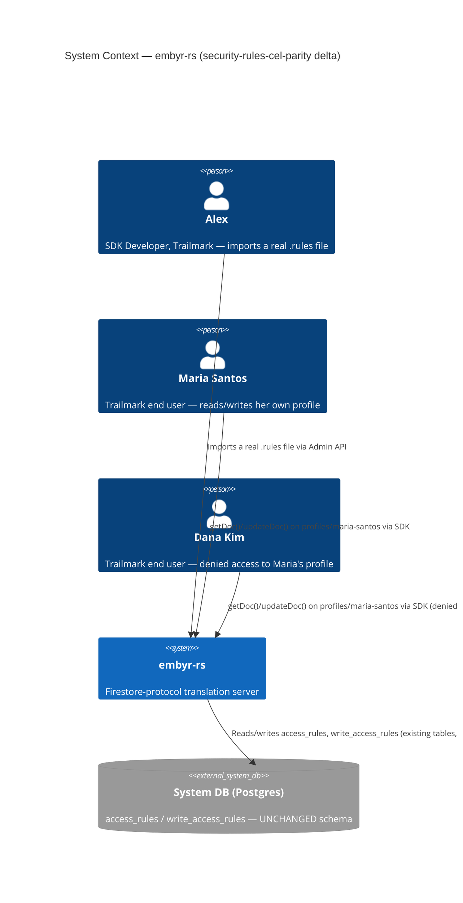
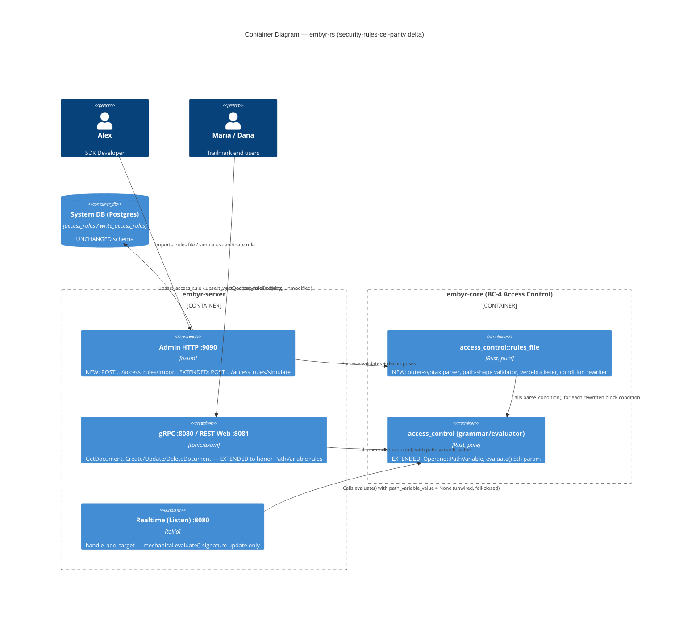
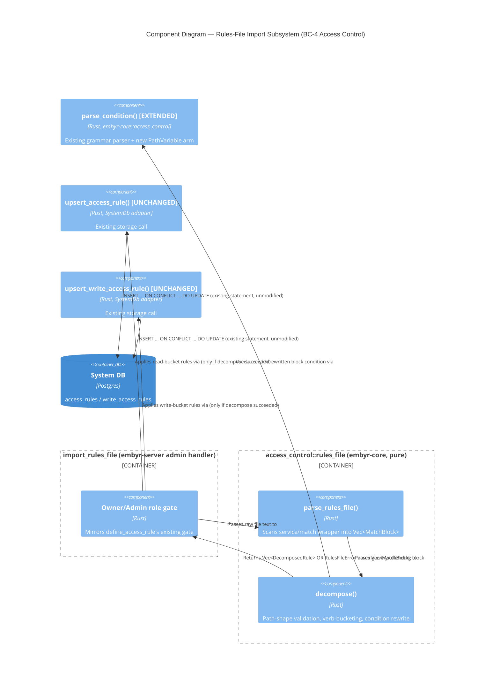

# security-rules-cel-parity — Feature Delta

**Wave**: DISCUSS | **Agent**: Luna (nw-product-owner) | **Date**: 2026-09-01
**Status**: Ready for DESIGN handoff (Epic 4a only — see § Scope Assessment for the split)
**Upstream**: `security-rules` + 6 siblings (`security-rules-write-path`, `security-rules-query-path`, `security-rules-collection-group-rules`, `security-rules-realtime`, `custom-claims`, `security-rules-operations`) — all DONE, all merged, all fully implemented in code (confirmed by direct grep, not assumed — see Reading Confirmation). This feature is the first of a new, independently-shippable epic sequence ("Epic 4a–4e", the **Full CEL Parity initiative**) built on top of that already-shipped foundation.

---

## Wave: DISCUSS / [REF] Prior Wave Consultation — Reading Confirmation

✓ `docs/product/jobs.yaml` (full, 1300 lines) — JOB-17 (`document-access-control`) read in full, all 8 accumulated NOTEs. The most load-bearing prior finding: `security-rules-operations`'s own Resolution 3 (2026-08-27) re-investigated "richer condition grammar" and found **"NO firing trigger... across six subsequent epics of evidence... re-deferred, unevidenced."** That verdict was correct given the evidence available on 2026-08-27. New evidence — real customers migrating real, existing Firestore applications, with real `.rules` files, blocked outright — has since appeared. This DISCUSS is the evidenced reversal that finding's own text anticipated ("a candidate follow-up... only if concrete evidence... ever emerges").
✓ `docs/product/journeys/sdk-developer.yaml` (full) — P1 Alex, JOB-17 listed since 2026-08-17, 7 realization NOTEs through `security-rules-operations`.
✓ `docs/product/personas/chris-account-admin.yaml` (full) — P5 Chris, Account Admin persona, unrelated to rule authoring (confirmed, not assumed). Confirmed this is the *only* persona file in SSOT.
✓ `docs/product/architecture/brief.md` §§ Application Architecture — security-rules through security-rules-operations (lines 3481–4290, full).
✓ `docs/feature/security-rules/feature-delta.md` (full, 1301 lines) — **the central document for this DISCUSS.** § Job Discovery Framing Resolution, Resolution 1 rejected "(A) Full Firestore Rules Language parity" as "unbounded scope, no evidenced need... a decision this scale deserves its own DISCUSS/DESIGN pass if evidence for it ever appears, not a default" (feature-delta.md line ~52). That is the decision this dispatch's charter identifies as now evidenced. Locked v1 grammar (Option C), ADR-027 EBNF, and the persona/company (Alex/Trailmark, Maria Santos, Dana Kim) all carry forward unchanged.
✓ `docs/feature/security-rules-write-path/feature-delta.md`, `docs/feature/security-rules-query-path/feature-delta.md`, `docs/feature/security-rules-collection-group-rules/feature-delta.md`, `docs/feature/security-rules-realtime/feature-delta.md`, `docs/feature/security-rules-operations/feature-delta.md` (targeted: Reading Confirmation, Job Discovery Framing Resolution, Out of Scope, Wave Decisions Summary sections of each) — confirmed what's locked/shipped vs. still-deferred in each, so this feature's own scoping does not contradict any of them.
✓ `docs/product/architecture/adr-027-access-rule-grammar-and-evaluation.md` through `adr-034-custom-claims-representation-and-grammar-extension.md` (full) and `adr-035-access-rule-history-storage-and-capture-mechanism.md` (partial, § Decision — Schema Shape) — the complete, current grammar/evaluator/storage/composition architecture this feature extends. Confirmed current `Operand` enum: `AuthUid`, `AuthNullSentinel`, `ResourceField(String)`, `RequestResourceField(String)`, `AuthTokenClaim(String)`, `StringLiteral(String)`, `BoolLiteral(bool)`, `NullLiteral` — 8 variants, zero path-structure awareness of any kind.
✓ `crates/embyr-core/src/access_control/mod.rs` (targeted: `Operand`, `parse_condition`/`evaluate`/`check_query_compliance` signatures, `word_to_operand`) — **confirmed directly, not assumed from docs**: all 6 sibling epics are fully implemented in shipped code (migrations exist through `0031`; `embyr_core::access_control::{parse_condition,evaluate,check_query_compliance}` is wired into `handle_get_document`, `handle_create_document`/`handle_update_document`/`handle_delete_document`, `handle_run_query` (both the group and non-group arms), and `handle_listen`/`handle_add_target` — this is a broad, already-live enforcement surface any change to the grammar's parsing/evaluation core must not regress).
✓ `crates/embyr-server/src/admin/handlers/access_rules.rs` (targeted: doc header, `DefineAccessRuleBody`) — **confirmed a hard current constraint**: `collection_path` is documented and *used* as single-segment only — "Trailmark's domain examples: `journal_entries`, `trail_guides`, `app_config` — no subcollection paths." No code path in this codebase today can express a rule on a nested collection at all.
✓ `crates/embyr-server/src/admin/router.rs` (targeted: route table) — confirmed the current 9-route admin surface for rule authoring/simulation/history, all keyed by a single, exact `collection_path` or `collection_id`.
✓ `docs/evolution/*.md` (directory listing) — confirmed only `2026-08-18-security-rules.md` exists for the entire JOB-17 initiative; the 6 sibling epics shipped via this session's direct-dispatch practice, matching this dispatch's own standing-practice instruction (no DISTILL/DELIVER pipeline for this project).

**No contradictions found.** This DISCUSS explicitly reverses one prior verdict — `security-rules`'s own Resolution 1 (2026-08-17), re-confirmed unfired by `security-rules-operations`'s own Resolution 3 (2026-08-27) — with the specific new evidence named in this dispatch's charter, per the back-propagation contract (§ Changed Assumptions, below).

---

## Wave: DISCUSS / [REF] Changed Assumptions

**Original document**: `docs/feature/security-rules/feature-delta.md` § Job Discovery Framing Resolution, Resolution 1.

**Original assumption, quoted verbatim**:
> **(A) Full Firestore Rules Language parity** | A complete CEL-like expression grammar: custom functions, recursive/wildcard path matching, cross-document reads (`get()`/`exists()`), list-comprehension-like constructs — matching real Firestore's actual rules engine surface. | **Rejected — unbounded scope, no evidenced need.** ... a decision this scale deserves its own DISCUSS/DESIGN pass if evidence for it ever appears, not a default.

**Re-confirmed unfired, quoted verbatim** (`docs/feature/security-rules-operations/feature-delta.md` § Out of Scope, 2026-08-27):
> **Richer condition grammar** (cross-document `get()`/`exists()` reads, custom functions, recursive/wildcard path matching) — re-evaluated per Resolution 3 and found to have NO firing trigger anywhere across six subsequent epics of evidence. Re-deferred, unevidenced.

**New assumption**: The evidence has now appeared, external to this codebase's own six epics of internal usage evidence — customers migrating a real, existing Firestore application, with real `.rules` files written in Firestore's actual CEL-based Security Rules language, cannot bring them to embyr at all, because the grammar is a different, incompatible dialect. This blocks essentially every migrating customer's authorization model, not a narrow edge case. Per Resolution 1's own text, this is exactly the trigger condition under which full parity graduates from "rejected" to "warrants its own DISCUSS/DESIGN pass" — this document is that pass.

**Rationale for the change**: External customer-migration evidence, not internal codebase-usage evidence (which correctly found no trigger as of 2026-08-27) — a genuinely different evidence class than the six "no firing trigger" epics that preceded it, per this dispatch's own charter.

**Scope of the reversal**: Full — the target is genuine CEL parity, not a narrower "syntax-compatibility-only" subset (this scoping decision is not re-litigated in this document). **What ships in *this* feature is narrower** — see § Scope Assessment for why, and for the resulting 5-epic split.

---

## Wave: DISCUSS / [REF] Orchestrator Decisions (not re-litigated)

| # | Decision | Value |
|---|---|---|
| 1 | Feature Type | Cross-cutting — spans the pure `embyr-core::access_control` grammar/evaluator (BC-4), the admin authoring surface (BC-1's driving-adapter pattern), and multiple already-shipped enforcement call sites, mirroring `security-rules`'s own original classification |
| 2 | Walking Skeleton | Evaluated (this wave's call): **YES** — see § Walking Skeleton Evaluation |
| 3 | UX Research Depth | Comprehensive — full emotional-arc journey work, per explicit instruction given the scale and multi-persona migration angle |
| 4 | JTBD Analysis | Yes (default) — every story traces to `job_id: JOB-17` (8th realization — see § Persona & Job; no new job) |

### Walking Skeleton Evaluation (Decision 2)

Two existing mechanisms were evaluated for reuse before concluding what a walking skeleton for *this* feature actually needs to add:

1. **The existing per-collection admin upsert API** (`upsert_access_rule`/`upsert_write_access_rule`, `define_access_rule`/`define_write_access_rule`). This is *reused as the decomposition target*, not replaced — once a `.rules` file's `match` blocks are parsed into `(collection, verbs, condition)` triples, each triple is handed to the exact, unmodified existing upsert call. Nothing about rule *storage* needs to change for this feature's own scope.
2. **The existing `parse_condition`/`evaluate` functions and their locked `Operand` set.** Reused for every construct already inside the locked v1 grammar (comparison, boolean combinators, `resource.data`/`request.resource.data`/`request.auth.token.<claim>`/string and bool literals). Extended by exactly one new operand for this feature's own in-scope addition (a path-captured document-ID variable) — see § Job Discovery Framing Resolution, Resolution 2.

**Verdict**: no existing mechanism parses the *outer* `.rules`-file syntax (the `service cloud.firestore { match /databases/{database}/documents { match /<path> { allow <verbs>: if <condition>; } } } }` wrapper real Firestore rule files use) — that syntax layer is CREATE NEW. No existing mechanism resolves a path-segment name captured by a `match` block's own wildcard (e.g., `{userId}`) into a value a condition can reference by that name — also CREATE NEW, but a narrow, additive one (one new `Operand` variant, mirroring `RequestResourceField`'s/`AuthTokenClaim`'s own precedent exactly). A walking skeleton is needed: parse a real, single-collection `.rules` file with one leaf-level wildcard, decompose it into the existing admin upsert call, and have `GetDocument` correctly evaluate a condition that references the captured variable — for both the document's own owner and a different signed-in user (§ Story Map, Slices 01–02).

---

## Wave: DISCUSS / [REF] Persona & Job

**Persona**: **P1 — Alex, SDK Developer** (existing persona, unchanged, no dedicated persona file — same inline-persona convention every JOB-17 sibling has used).

**Domain-example company**: **Trailmark**, continued. New domain-example detail this feature introduces: Alex still has Trailmark's *original* `firestore.rules` file — the real file his team wrote and ran against production Firebase before migrating — sitting in Trailmark's own repo. For the six months since `security-rules` shipped, every rule Alex has defined on embyr (`journal_entries`'s owner check, `trail_guides`'s public-read rule, the write-path/query-path/collection-group/claims variants across five more epics) has been *hand-transcribed*, one collection at a time, from that original file into embyr's JSON admin API — never verified against the original file itself except by Alex's own manual re-reading. New collections: **`profiles`** (one document per Trailmark end user, document ID *is* that user's own `uid` — the single most common real Firestore ownership pattern, and one this codebase's current single-segment-collection-path schema has no way to express: today's schema can gate an entire collection by a *field* comparison, never by the requesting user's relationship to the *document ID itself*).

**job_id decision (per Decision 4)**: **JOB-17 (`document-access-control`), 8th realization — not a new job.** Same persona, same goal (per-user data protection Alex authors and embyr enforces) as all 7 prior realizations. This feature does not change *what* Alex is trying to accomplish — it changes *how much of his real rules file* he can hand embyr directly, closing a gap in the *authoring surface*, the identical "make it real"/close-the-remaining-gap pattern this codebase has applied repeatedly elsewhere (`aggregation-queries` → JOB-01, `admin-api-v2` → JOB-10, `card-payments-backend` → JOB-14) rather than the "same persona, different goal ⇒ new job" pattern JOB-17 itself used against JOB-16 at its own founding.

**Opportunity scoring**: Importance = 9 (per the charter: this blocks essentially every migrating customer's authorization model, not a narrow edge case — the single largest remaining adoption blocker for the entire JOB-17 initiative's own target segment). Satisfaction = 2 (the six shipped epics give Alex a *fully capable* enforcement engine once a rule is expressed in embyr's own JSON shape — the gap is authoring-surface compatibility, not enforcement capability; a real workaround exists today, hand-transcription, but it is tedious and drift-prone, not a wall). Opportunity = 9 + (9−2) = **16**. Priority: **critical** — comparable to JOB-17's own founding score (17) and JOB-16's (15), since a blocked authoring surface makes the other six epics' worth of enforcement machinery unreachable for exactly the customer segment most likely to need it (an existing, real Firestore app with a non-trivial rules file already written).

---

## Wave: DISCUSS / [REF] Job Discovery — Framing Resolution

Three central scoping questions for *this* feature specifically (distinct from the initiative-wide reversal in § Changed Assumptions, above), each resolved with the same rigor `security-rules`'s own three original Resolutions established as this initiative's precedent.

### Resolution 1 — What does "Epic 4a" (this feature) actually cover, inside the now-unrejected full-parity target?

The full-parity target (§ Changed Assumptions) is confirmed oversized as a single feature (§ Scope Assessment, below fires 4 of 5 signals). This Resolution locks what ships in *this* first slice.

| Option | Description | Fit against evidence |
|---|---|---|
| **(A) Full parity in one pass** | Everything the charter names: `match` blocks with recursive/wildcard paths, custom `function`s, cross-document `get()`/`exists()`, the full CEL expression surface. | **Rejected for this feature** — see § Scope Assessment. Not rejected as a target; deferred as a single-feature scope. |
| **(B) Outer `.rules`-file syntax shell only, zero new semantic capability** | Parse the `service`/`match`-block wrapper for single top-level collections, decompose into the existing per-collection admin API — but do **not** add any new evaluable construct (no path-variable capture, nothing real Firestore rule authors would notice beyond "I can paste the file instead of retyping each condition"). | **Rejected — would not close the highest-value gap.** The single most common real Firestore rule shape — `match /profiles/{userId} { allow read, write: if request.auth.uid == userId; }` — binds the document's own ID to a name and compares it. A syntax-shell that cannot express this leaves Alex's *actual* rules file still partially untranslatable, undermining the very evidence that triggered this reversal (a Firestore migrant's rules file almost always contains at least one doc-ID-keyed collection). |
| **(C) Outer syntax shell + single leaf-level path-variable capture, single top-level collection only** | Parses the real `.rules`-file wrapper for `match` blocks shaped `/<single-collection>/{<docIdVar>}`, decomposes to the existing admin API, and adds exactly one new `Operand` (a path-captured variable, resolved from the document's own already-known ID at evaluation time — zero new I/O, zero new bounded context, zero new storage). Recursive wildcards (`{path=**}`), nested/multi-segment collection paths, multiple wildcards per match block, custom `function`s, and cross-document reads are named, out-of-v1-scope constructs, rejected at import time with a specific reason per construct — not silently accepted, not silently ignored. | **Strongest fit.** Closes the highest-value, lowest-risk slice of the charter's own target: real files with simple, single-collection, single-wildcard `match` blocks — the shape of Trailmark's own `profiles` collection and (by the charter's own "essentially every migrating customer" claim) a large share of real-world Firestore rule sets — while adding zero new I/O, zero new bounded context, and zero change to any already-shipped call site's *storage* target. Mirrors every prior JOB-17 epic's own "one new operand, uniform propagation" precedent (`RequestResourceField`, `AuthTokenClaim`) exactly. |

**Resolution**: **(C) is this feature's locked scope.** (A)'s remaining pieces are named, deferred, independently-shippable follow-up features (§ Scope Assessment's split) — not silently dropped, not re-litigated as unwarranted (the charter's reversal already settled that).

### Resolution 2 — All-or-nothing import, or partial, per-block application?

A real `.rules` file contains many `match` blocks. If Alex's file has five blocks and one uses a construct outside this feature's v1 scope (e.g., a nested subcollection path), what happens to the other four?

| Option | Description | Fit against evidence |
|---|---|---|
| **(A) Partial import — apply every in-scope block, skip/report the rest** | Every valid block becomes an active rule; out-of-scope blocks are listed in the response but not applied. | **Rejected.** Creates exactly the silent-partial-protection hazard `security-rules`'s own Resolution 3 ("no blend of old and new") was designed to prevent, one layer up: Alex could reasonably believe his whole file is now enforced, when in fact some collections he explicitly wrote a rule for are silently still wide open (the "no rule defined ⇒ unrestricted" default, Resolution 2 of the *original* `security-rules` DISCUSS, now weaponized against Alex's own intent instead of protecting an untouched collection). |
| **(B) All-or-nothing — the entire import is rejected unless every block is expressible in this feature's v1 scope** | A single out-of-scope block anywhere in the file rejects the whole import; the response names *every* offending block and its specific reason so Alex can fix or defer each one. Zero collections change state on a rejected import. | **Accepted.** Mirrors `security-rules`'s own Resolution 3 discipline ("the new condition is immediately and fully active... no blend of old and new") applied at the file level: an import either fully reflects Alex's intent or changes nothing at all — never a partial, silently-incomplete state that looks complete. |

**Resolution**: **(B) is locked.** An import naming any out-of-v1-scope construct anywhere in the file is rejected in full, before any existing rule is touched, with every offending block named individually (§ User Stories, US-04).

### Resolution 3 — Path-variable wiring scope: read-only, or read+write?

Real Firestore's own most common idiom combines both verbs in one line: `allow read, write: if request.auth.uid == userId;`. If this feature wires the new path-variable operand into `GetDocument` only (mirroring `security-rules`'s own original read-first sequencing), a write against the same rule would either (a) have no defined behavior for the new operand (a design gap) or (b) silently deny every write, including the legitimate owner's, because the operand would resolve to `FieldMissing` with no value threaded in — a confusing, silent footgun for the single most common pattern this feature exists to unblock.

**Resolution**: **the new path-variable operand is wired into both `GetDocument` and all three write handlers (`CreateDocument`/`UpdateDocument`/`DeleteDocument`) within this same feature — not split across a read epic and a write epic the way the *original* `security-rules`/`security-rules-write-path` pair was.** This is a narrower, evidenced deviation from that precedent, not an unexamined one: unlike the original epic split (which introduced an entirely new grammar symbol family, `request.resource`, a new storage table, and a new admin route — genuinely large, separable axes), threading one already-known value (the document's own path, which every one of these call sites already has before this feature touches anything) through an existing function signature is the same class of "mechanical, uniform, one-line-per-site" change `custom-claims`'s own ADR-034 already demonstrated for `AuthTokenClaim` across 7 call sites. Read-path is still this feature's own Walking Skeleton (§ Story Map); write-path is Release 1, not deferred to a separate feature. `RunQuery` (both arms) and `Listen`'s subscribe-time gate require **zero new code** for this operand — the existing `decompose_decidable()` wildcard catch-all (ADR-031) already rejects any `Compare` involving an `Operand` variant it does not name, by Rust's own exhaustive-match guarantee, exactly as it already does for `AuthTokenClaim`/`StringLiteral` today (a structural finding, verified below, not a built capability — § System Constraints). `Listen`'s *per-event* re-check is explicitly deferred (no domain example in this feature requires a live-updating `profiles/{userId}`-shaped subscription) — named, not silently dropped (§ Out of Scope).

---

## Wave: DISCUSS / [REF] Scope Assessment (Elephant Carpaccio Gate)

Run before journey/story-map investment, per Phase 1.5. Evaluated twice: once against the full charter ambition, once against the narrowed scope this DISCUSS actually commits to (Resolution 1, Option C).

### Pass 1 — full ambition (real `.rules`-file parsing + recursive/wildcard path matching + full CEL expression surface + cross-document reads + custom functions, in one feature)

| Signal | Threshold | This scope | Fired? |
|---|---|---|---|
| User stories | >10 | ~18–22 (file parsing, recursive/wildcard routing + precedence rules, full arithmetic/`in`/list/map/timestamp/duration expression grammar, `get()`/`exists()` cross-document reads × read/write/query/listen surfaces, custom function definitions + invocation, admin-surface changes for all of the above, simulation extensions for all of the above) | **YES** |
| Bounded contexts / modules | >3 | 4 — BC-4 Access Control (grammar/evaluator/routing, heavily extended), BC-1 Tenant Management (admin authoring surface, a `.rules`-file-shaped API replacing today's per-collection JSON shape), BC-2 Document Storage (a **new, structurally different dependency**: `get()`/`exists()` requires BC-4 to actively *call into* BC-2's read path mid-evaluation, not merely consume already-fetched data — the read-only, in-process-only dependency shape ADR-029 established would no longer hold), BC-3 Real-Time Delivery (recursive path matching + cross-document reads both need re-verification against Listen's own eventual-consistency model) | **YES** |
| Walking Skeleton integration points | >5 | 9+ — file parser, recursive-path routing engine, precedence resolution for overlapping patterns, full expression evaluator, `get()`/`exists()` I/O path, function-definition storage, function-invocation evaluation, admin-surface rewrite, and re-verification across all 5 already-shipped enforcement surfaces (`GetDocument`, 3 write handlers, `RunQuery` ×2, `Listen` ×2) | **YES** |
| Estimated effort | >2 weeks | Recursive/wildcard path matching alone is "a structurally different mechanism" (the original DISCUSS's own words about query-path enforcement, reapplied) — replacing today's O(1) exact-collection-path lookup with pattern-precedence matching. Cross-document reads is, in the original DISCUSS's own words, "a multi-week undertaking with a materially different risk profile... a rule that calls `get()` on another document turns a pure computation into an I/O-bound one, inside the hot request path." Combined with a full expression grammar and custom functions, this is credibly 6+ weeks. | **YES** |
| Independent shippable outcomes | multiple | **YES** — syntax compatibility for simple files, path-pattern matching, expression-grammar richness, cross-document reads, and custom functions are each independently valuable and independently demoable; a real customer's `.rules` file commonly needs only a subset of these (Trailmark's own file, per its own domain examples below, needs Resolution 1's Option C scope and nothing else) | **YES** |

**4 of 5 signals fire clearly, the 5th (bounded contexts) also fires** (threshold is 2+). **Verdict: OVERSIZED at the full-ambition scope** — more decisively than `security-rules`'s own original Pass 1 (2 of 5, borderline), consistent with the charter's own expectation that this "WILL very likely trip the oversized-feature gate."

### Proposed split (mirrors `security-rules`'s own 5-epic split of JOB-17's full ambition, and this session's own `agent-mode-*` 4-feature split)

| Epic | Candidate feature id | Scope | Status |
|---|---|---|---|
| **4a — `security-rules-cel-parity` (this feature)** | — | Real `.rules`-file outer syntax (`service`/`match` wrapper) for single top-level collections, with a single leaf-level path-variable capture (`{docIdVar}`), decomposed into the existing per-collection admin API. All-or-nothing import. Read- and write-path enforcement of the new operand. | **This DISCUSS pass** |
| 4b — candidate `security-rules-cel-path-matching` | `security-rules-cel-path-matching` | Recursive wildcards (`{path=**}`), multi-segment/nested `match` blocks (subcollections), multiple wildcards per block, and the precedence/routing engine needed once more than one pattern can match the same real document path — replacing today's exact-PK lookup with a genuine pattern-matching mechanism. The single largest remaining piece of real-world `.rules`-file coverage. | Named, deferred |
| 4c — candidate `security-rules-cel-expression-grammar` | `security-rules-cel-expression-grammar` | The remaining CEL expression surface: arithmetic operators, `in`, list/map literals, numeric literals (`OQ-SR-04`, still open after 3 prior epics), timestamp/duration types. Extends `evaluate()`'s operand/expression tree; still zero I/O. | Named, deferred |
| 4d — candidate `security-rules-cel-cross-document-reads` | `security-rules-cel-cross-document-reads` | `get()`/`exists()` cross-document reads. Isolated deliberately — the original DISCUSS's own explicitly-flagged concern (I/O in the hot request path, a materially different risk/consistency profile from every other epic in this initiative, all of which are zero-IO pure computation). | Named, deferred |
| 4e — candidate `security-rules-cel-functions` | `security-rules-cel-functions` | Custom `function` definitions and invocation. Composes over 4b/4c's own grammar surface once they exist; lowest-risk of the four deferred epics. | Named, deferred |

This is a suggestion of the shape, evaluated against learning leverage and risk, not a rigid prescription: **4a is sequenced first** because it (a) is the lowest-risk of the five — zero I/O, zero new bounded-context dependency, zero routing-mechanism change — and (b) directly and independently unblocks the charter's own stated symptom (a real file cannot be brought to embyr *at all*) for a meaningful share of real-world rule shapes, without waiting on the higher-risk epics. 4b is very likely the next-highest-value epic (real files almost universally use *some* wildcard/nesting), but is deliberately not started in this pass — its own routing-mechanism risk deserves its own DISCUSS, not a rider on this one. 4d is isolated last-but-one specifically because of its distinct I/O-in-hot-path risk profile, per the original DISCUSS's own explicit callout, reapplied here without re-litigation.

### Pass 2 — narrowed scope (Epic 4a only, this feature's actual scope)

| Signal | Threshold | This feature | Fired? |
|---|---|---|---|
| User stories | >10 | 6 (US-01 through US-06) | **NO** |
| Bounded contexts / modules | >3 | 2 — `embyr-core::access_control` (BC-4, extended by one operand) + the admin authoring surface (BC-1's driving-adapter pattern, one new import endpoint) | **NO** |
| Walking Skeleton integration points | >5 | 2 — the import-and-decompose step (US-01) + the path-variable evaluation on `GetDocument` (US-02) | **NO** |
| Estimated effort | >2 weeks | 6 slices, ~7.5 days total (§ Elephant Carpaccio Slices) | **NO** |
| Independent shippable outcomes | multiple | **NO** — US-01 (parse+decompose) and US-02/03 (evaluate the captured variable on read and write) are inseparable halves of one outcome, exactly like `security-rules`'s own US-01/US-02 pairing; US-04/05 are guardrails on that same outcome; US-06 (simulation) is a normal Release-2 enhancement | **NO** |

**0 of 5 signals fired. Verdict: PASS — right-sized.** No further split needed within Epic 4a.

---

## Wave: DISCUSS / [REF] Journey — Alex's Import Arc and the Path-Variable Consequence Arc

Per Decision 3 (Comprehensive), full narrative weight for both Alex's authoring experience and the downstream stakes for Trailmark's end users.

### Mental model

Alex's mental model carries forward from every prior JOB-17 epic, refined by this feature's own trigger: he has always thought of "a rule" as a boolean condition scoped to a collection. What's new is that he has, this whole time, also been holding a *second* mental artifact — Trailmark's real `firestore.rules` file — that he never trusted embyr to read directly, because he assumed (correctly, until now) that embyr's grammar was a different dialect. He expects, once this feature ships, to be able to point at that file and trust that what it says is what gets enforced — with **no worse a level of trust** than the JSON API already gave him, not more.

### Alex's import emotional arc

```
Start                       Middle                          Peak tension                End
Skeptical                   Cautiously hopeful              "Did it actually catch       Relieved / vindicated
                                                               everything, or did it
                                                               silently drop something?"
   |                           |                                  |                          |
"I've been hand-           Pastes Trailmark's real         The realistic failure       Sees every collection
 translating this file      firestore.rules into a          mode: a block he            his file named is now
 for months and I've         new import action               forgot was even in          active, sees the
 never been 100% sure                                        the file (an old,           exact reason any
 my translation matches                                       abandoned `expeditions`    rejected block was
 the original"                                                subcollection rule)         rejected, and confirms
                                                               either silently vanishes    nothing else changed
                                                               or silently half-applies
```

### Import flow (Alex's side, Slices 01, 04, 05)

```
Alex submits Trailmark's real .rules file text to the import action
        │
        ▼
   Does every match block in the file fit this feature's v1 shape
   (single top-level collection, at most one leaf-level wildcard,
   condition inside the already-locked grammar)?
        │
   ┌────┴─────────────────────────────┐
  every block fits                 one or more blocks don't
        │                                    │
        ▼                                    ▼
   Every block is decomposed and        Nothing is applied. Response
   upserted via the EXISTING            names every offending block
   admin API (US-01), one call          and its specific reason
   per collection+verb, atomically      (nested path / recursive
   as a group (US-05) — either all      wildcard / function call /
   succeed or none do                   get()/exists() / multiple
        │                               wildcards) — Alex fixes or
        ▼                               defers those blocks and
   Alex's existing rules for            re-submits (US-04)
   collections NOT named in this
   import are completely untouched
   (US-05)
```

### Read/write-evaluation flow (Maria's/Dana's side, Slices 02–03)

```
A GetDocument or write call arrives for a document in a collection whose
imported rule captured a path variable (e.g. profiles/{userId})
        │
   (the existing, unchanged rule-lookup + identity-attach steps already ran)
        │
        ▼
   The path variable is bound to this specific document's own ID
   (already known to the handler before this feature touches anything —
   zero new I/O) and made available to the condition by the name the
   .rules file itself gave it
        │
   ┌────┴──────────────────────┐
 condition true              condition false
 (Maria reading/writing      (Dana reading/writing
  profiles/maria-santos,      profiles/maria-santos,
  userId == "maria-santos",   userId == "maria-santos",
  request.auth.uid matches)   request.auth.uid does not match)
        │                            │
        ▼                            ▼
   Succeeds, identical to        Denied, PermissionDenied,
   every other rule this         identical response shape
   initiative already            to every other rule
   produces                      denial this initiative
                                  already produces
```

### Shared artifact

| Artifact | Source of truth | Consumers | Integration risk |
|---|---|---|---|
| The imported `.rules`-file text, decomposed into per-collection triples | The new import action's own parse step | The existing `upsert_access_rule`/`upsert_write_access_rule` calls (US-01) | **HIGH** — if decomposition silently drops a block, or silently mis-maps a `match` block's `allow` verbs to the wrong existing table, Alex's confidence in the whole import is a false signal, mirroring `security-rules`'s own "simulation must share the exact evaluation routine" risk class, one layer up (here: "import must decompose to the exact same storage calls a hand-authored JSON request would") |
| The path-captured variable's resolved value | The document's own already-known ID at each call site (`GetDocument`, 3 write handlers) | `embyr_core::access_control::evaluate()`'s new operand resolution | **HIGH** — if read-path and write-path resolve the captured variable through two different mechanisms instead of the identical resolution logic, the two can drift exactly the way `client-auth`'s own US-02/US-04 pairing and `security-rules`'s own Shared Artifact both already flagged for this initiative's prior epics |

### Failure modes (feeds DISTILL scenario generation)

- Alex's real file contains a block he forgot about (an old, abandoned `expeditions` subcollection rule) — must be named specifically as out-of-scope (nested path), not silently dropped and not silently causing the whole import to fail with a generic error.
- Alex's file uses `{userId}` in one `match` block and a completely different variable name, say `{uid}`, in another — each must resolve independently and correctly per its own block; no cross-block name leakage.
- A condition inside an in-scope block references a wildcard name that doesn't actually exist in that block's own path pattern (a typo, e.g. `useId` instead of `userId`) — must be a rejected-at-import syntax error, distinguishable from "field absent on the document" (which fails closed at evaluation time, not at import time).
- The existing 133+ regression scenarios (72 `embyr-rs` + 41 `client-auth` + 20 `security-rules` acceptance, plus every sibling epic's own suite) must re-run unmodified — this feature adds a new authoring surface and one new operand; it must not perturb any already-shipped rule, table, or call site's existing behavior.
- Re-importing the identical file twice must be a no-op in effect (idempotent), not a duplicate-row or duplicate-history-entry hazard.

---

## Wave: DISCUSS / [REF] Story Map & Walking Skeleton

**Persona**: P1 Alex | **Goal**: Bring Trailmark's real, existing `.rules` file to embyr directly — for the shape of rules that file actually uses today — instead of continuing to hand-transcribe each collection's condition one at a time.

### Backbone

| A. Alex Imports His Real File | B. A Read/Write Is Evaluated Against the Captured Variable | C. Alex Builds Confidence Before Importing |
|---|---|---|
| Alex submits a real `.rules` file for parsing and decomposition **[WS]** | A signed-in end user's own-document (by ID) read is allowed; another's is denied **[WS]** | Alex simulates a candidate path-variable-bound rule against synthetic data |
| An import naming any out-of-v1-scope construct is rejected whole, every offending block named **[WS]** | The same captured variable gates writes, not just reads **[WS]** | |
| Re-importing is idempotent; unrelated collections are untouched **[WS]** | | |

### Walking Skeleton

One task from each activity: Alex imports a real, minimal `.rules` file containing Trailmark's `profiles` collection (`match /profiles/{userId} { allow read, write: if request.auth.uid == userId; }`), which is decomposed into the existing admin upsert calls (Activity A); Maria Santos's `getDoc()`/`updateDoc()` on `profiles/maria-santos` succeeds while Dana Kim's on that same document is denied (Activity B). This is Slices 01–02's combined happy-path-plus-guardrail scenario set — real project/rule/identity state, no facade, mirroring every prior epic's own WS discipline.

### Release 1 — Real-File Import Works End-to-End for the Locked v1 Shape (Slices 01–05, US-01 through US-05)

Outcome: a real `.rules` file, for the collection shapes this feature supports, is imported and correctly enforced on both reads and writes — with zero silent partial application and zero effect on collections/rules outside the file.

### Release 2 — Authoring Confidence Extends to Imports (Slice 06, US-06)

Outcome: Alex can simulate a path-variable-bound candidate rule before importing it, extending `security-rules`'s own US-05 simulation precedent to this feature's new operand.

---

## Wave: DISCUSS / [REF] Elephant Carpaccio Slices

| Slice | Story | Release | Estimate | Learning Hypothesis (disproves) | Production-data taste test |
|---|---|---|---|---|---|
| 01 (WS) | US-01 | 1 | 2 days | A real `.rules` file's outer `service`/`match` syntax cannot be parsed and decomposed into the existing per-collection admin upsert calls without inventing a new storage shape or a new evaluation mechanism | Real System DB rows via the EXISTING `upsert_access_rule`/`upsert_write_access_rule` calls, a real Bearer admin credential, Trailmark's own real (not synthetic) `profiles`/`journal_entries`/`trail_guides` collection names |
| 02 (WS) | US-02 | 1 | 1.5 days | A path-captured document-ID variable cannot be resolved and evaluated on a real `GetDocument` call without either new I/O or a second, drift-prone resolution mechanism separate from the existing `evaluate()` | Real imported `profiles` rule + real Maria/Dana signed-in sessions + real `profiles/maria-santos` document |
| 03 (WS) | US-03 | 1 | 1 day | The identical captured-variable mechanism cannot extend to `CreateDocument`/`UpdateDocument`/`DeleteDocument` without a second write-specific resolution path, given precedent (`custom-claims`'s own ADR-034) that a single `resolve_field_value` change should propagate mechanically | Real Maria/Dana writes against `profiles/maria-santos`, both allowed and denied cases |
| 04 | US-04 | 1 | 1.5 days | An import containing a mix of in-scope and out-of-v1-scope `match` blocks cannot be rejected as a single atomic unit, naming every offending block individually, without either a partial-apply hazard or an unhelpfully generic rejection | Real Trailmark file fragments containing a genuine nested-subcollection block (`expeditions/{id}/journal_entries/{entryId}`), a genuine `function` call, and a genuine `get()` call — real constructs, not contrived |
| 05 | US-05 | 1 | 1 day | Importing cannot be proven not to silently affect a rule for a collection NOT named in the imported file, or to duplicate state on re-import, without actually re-running the full existing regression suite plus a same-file-twice check | Real full regression suite (133+ scenarios across all 7 prior epics), real repeated import of the identical file |
| 06 | US-06 | 2 | 0.75 day | A simulation of a path-variable-bound candidate rule cannot share the exact same evaluation routine as real enforcement without either duplicating logic or omitting a way to supply the synthetic document's own ID | Real candidate rule + real synthetic document ID + real synthetic identity, checked against the real evaluation path |

**Total estimate: ~7.75 days.**

**Taste tests applied**:
- "4+ new components per slice" — none exceeds 2 (Slice 01: file parser + decomposition-to-existing-upsert step; Slice 02: one new `Operand` variant + `GetDocument` wiring; Slice 03: extends Slice 02's operand to 3 existing write handlers, zero new component; Slice 04: extends Slice 01's parser with a rejection-collection step, zero new component; Slice 05: zero new components, proof obligation; Slice 06: thin wrapper over Slice 02's evaluator). PASS.
- "Every slice depends on a new abstraction" — Slice 01 (the file parser) is the one genuinely new abstraction; Slices 02–06 build on it or on Slice 02's operand, not each introducing a new one. PASS — natural sequencing, not forced dependency inflation.
- "No slice disproves a pre-commitment" — each has a distinct, falsifiable hypothesis (see table). PASS.
- "Synthetic-data-only slices prove plumbing, not value" — N/A; all 6 slices require real System DB state, real signed-in sessions, and (Slice 05) the real existing regression suite. PASS.
- "2+ slices identical except for scale" — none; each targets a distinct mechanism. PASS.

---

## Wave: DISCUSS / [REF] Prioritization

| Priority | Slice | Target Outcome | Rationale |
|---|---|---|---|
| 1 | Slice 01 (WS) | A real `.rules` file can be imported and decomposed | Walking Skeleton first — burns down the riskiest new assumption (the outer syntax layer parses at all) before anything downstream has something to evaluate |
| 2 | Slice 02 (WS) | A path-captured variable is correctly evaluated on reads | Closes the loop the charter's own trigger requires; the second-riskiest assumption (the new operand resolves correctly without new I/O) |
| 3 | Slice 03 (WS) | The same variable gates writes | Closes Resolution 3's own footgun (silent-always-deny on write) — the single highest-consequence correctness risk this feature carries beyond `security-rules`'s own original precedent |
| 4 | Slice 04 | Out-of-scope imports are rejected atomically, not partially applied | The single highest-consequence *regression-of-trust* risk (Resolution 2) — sequenced after the happy path exists, because it is a proof *over* real parsing behavior, not a standalone mechanism |
| 5 | Slice 05 | Untouched collections and the regression suite are provably unaffected | Mirrors every prior epic's own AC-17-14/15/16-class guardrail discipline; sequenced last within Release 1 because it is a proof over Slices 01–04's real behavior |
| 6 | Slice 06 | Alex can simulate before importing | Highest-leverage for Alex's own confidence, correctly sequenced after the Walking Skeleton exists to wrap, mirroring `security-rules`'s own US-05 sequencing precedent |

---

## Wave: DISCUSS / [REF] System Constraints

- **All-or-nothing import (Resolution 2).** No partial application, ever. An import naming any out-of-v1-scope construct anywhere in the submitted file changes zero existing rule state.
- **Read+write parity for the new operand (Resolution 3).** The path-captured-variable operand must be wired into `GetDocument` and all three write handlers within this feature — leaving write-path unwired is not a valid smaller slice, it is a silent-always-deny defect for this feature's own single most common domain example.
- **Zero change to any already-shipped storage shape.** `access_rules`, `write_access_rules`, `group_access_rules`, and all 3 history tables receive **zero** schema changes from this feature — the decomposition target is the existing `upsert_access_rule`/`upsert_write_access_rule` calls, unmodified.
- **Zero new I/O, zero new bounded-context dependency.** The path-captured variable is resolved from data every touched call site already has before this feature exists (the document's own path) — no new fetch, no new external call, preserving BC-4's zero-IO invariant (`deny.toml`-enforced) and its read-only, in-process-only dependency shape on BC-2 (ADR-029).
- **Query-path and Listen subscribe-time gates require zero new code, structurally, not by omission.** `check_query_compliance()`'s existing `decompose_decidable()` wildcard catch-all (ADR-031) already rejects any `Compare` involving an `Operand` variant it does not name — the identical mechanism that already, correctly, rejects `AuthTokenClaim`/`StringLiteral`-referencing rules for `RunQuery` today with zero code changes (confirmed directly against ADR-034's own equivalent finding). DESIGN must confirm this holds for the new operand by the same Rust-exhaustive-match argument, not assume it without verification.
- **Listen's per-event re-check is explicitly out of this feature's scope** — no domain example here requires a live-updating, path-variable-bound subscription; flagged, not silently dropped (§ Out of Scope).
- **Rule-expressiveness ceiling otherwise unchanged.** Every construct locked by `security-rules`'s original Resolution 1 and extended by `security-rules-write-path`/`custom-claims` remains exactly as it is; this feature adds exactly one new `Operand` variant and one new outer-syntax parsing layer, nothing else.
- **Rejection distinguishability.** An out-of-v1-scope `.rules`-file construct (nested path, recursive wildcard, multiple wildcards, `function` call, `get()`/`exists()` call) must be named specifically per offending block — mirroring `security-rules`'s own AC-17-03 "distinguishable named-construct rejection" precedent, extended from a single condition to a whole file's worth of blocks.
- Ubiquitous language introduced: **rules-file import** (the new action that parses and decomposes a whole `.rules` file), **match block** (one `match /<path> { allow <verbs>: if <condition>; }` unit inside the file), **path variable** (a name a `match` block's own wildcard segment binds, referenceable by that name inside the block's own condition).

---

## Wave: DISCUSS / [REF] User Stories

<!-- markdownlint-disable MD024 -->

### US-01: Alex Imports a Real, Simple `.rules` File

**job_id**: JOB-17
**Slice**: 01 (Walking Skeleton) | **Release**: 1

#### Elevator Pitch
Before: Alex has Trailmark's real `firestore.rules` file sitting in his own repo and has spent six months hand-retyping each collection's condition into embyr's JSON admin API, one at a time, never fully certain his translation matches the original.
After: call the admin API's new import action (exact endpoint shape DESIGN's call) with the file's raw text → sees a per-collection confirmation listing exactly which rules were created or replaced, matching what the file itself said.
Decision enabled: Alex knows his real file — not his memory of it — is now the source of truth for every collection it names, and can stop maintaining a second, hand-authored copy.

#### Domain Examples
1. **Happy Path**: Alex imports a file containing `match /profiles/{userId} { allow read, write: if request.auth.uid == userId; }` and `match /journal_entries { allow read: if request.auth.uid == resource.data.owner_id; }`. Sees confirmation both rules are stored and active, matching the file exactly.
2. **Edge Case**: Alex re-imports the same file an hour later, having changed nothing. The response confirms both rules are still active with no error and no duplicate state (idempotent, mirrors Resolution 3 of the *original* `security-rules` DISCUSS).
3. **Error/Boundary**: Alex's file contains a `match` block for a collection called `app_config` with `allow read: if true;` — a rule shape already fully inside the locked v1 grammar with zero path variable. Sees it imported correctly alongside the wildcard-bearing blocks, proving the import path composes cleanly with rules that use none of this feature's new capability.

#### UAT Scenarios (BDD)

##### Scenario: A simple, single-collection wildcard rule is imported and immediately active
Given project `trailmark-prod` exists and no rule is yet defined for `profiles`
When Alex imports a `.rules` file containing `match /profiles/{userId} { allow read, write: if request.auth.uid == userId; }`, using a valid admin Bearer credential
Then a rule is stored and active for `profiles`, gating both reads and writes by the captured `userId` variable

##### Scenario: A file with multiple, independent match blocks imports all of them correctly
Given project `trailmark-prod` exists
When Alex imports a file containing separate `match` blocks for `profiles`, `journal_entries`, and `trail_guides`
Then all three collections have their respective rules stored and active, each matching its own block exactly

##### Scenario: Re-importing an unchanged file is a no-op in effect
Given `profiles` already has an active rule from a prior import of a given file
When Alex imports the identical file again
Then the response confirms the rule is unchanged and active, with no duplicate row and no duplicate history entry

##### Scenario: A block using no path variable at all imports identically to the existing JSON API
Given project `trailmark-prod` exists
When Alex imports a file containing `match /app_config { allow read: if true; }`
Then the resulting rule is indistinguishable from one Alex could have defined via the existing `POST .../access_rules` action directly

##### Scenario: Import without valid admin credentials is rejected
Given project `trailmark-prod` exists
When Alex submits an import request with a missing or invalid admin Bearer credential
Then the request is rejected the same way any other admin endpoint rejects missing/invalid credentials

#### Acceptance Criteria
- [ ] AC-17-174: A `.rules` file containing one or more in-scope `match` blocks is fully parsed and each block is decomposed into a call to the existing `upsert_access_rule`/`upsert_write_access_rule` action, matching the file's own `allow` verbs.
- [ ] AC-17-175: Every collection named in the file receives exactly the rule that collection's own block specifies — no cross-collection leakage, no merge with a differently-named block.
- [ ] AC-17-176: Re-importing an unchanged file produces no observable state change beyond confirming the existing rule remains active (idempotent).
- [ ] AC-17-177: A block with no path variable at all (the locked v1 grammar unchanged) imports identically to the existing per-collection JSON API.
- [ ] AC-17-178: Missing or invalid admin Bearer credential is rejected consistent with every other admin-endpoint precedent.

#### Outcome KPIs
See § Outcome KPIs below (KPI #1, North Star).

#### Technical Notes (Optional)
Exact endpoint path and file-to-request-body translation shape are DESIGN's call. Per § System Constraints, decomposition must call the existing, unmodified upsert methods — this story does not introduce any new storage shape.

---

### US-02: A Path-Captured Variable Gates a Signed-In End User's Read of Their Own Document (Walking Skeleton)

**job_id**: JOB-17
**Slice**: 02 (Walking Skeleton) | **Release**: 1

#### Elevator Pitch
Before: Trailmark's real rules file protects `profiles` by comparing the caller's own `uid` to the *document's own ID* — a shape embyr's current JSON grammar has no way to express at all (it can only compare a caller's `uid` to a document *field*, never to the document's own ID).
After: call the SDK's existing `getDoc()` on `profiles/maria-santos` — an unchanged SDK method — now evaluated against the imported `profiles` rule → Maria sees her own profile document; Dana, calling the identical unchanged method on that same document, sees a permission-denied error instead.
Decision enabled: Alex knows the single most common real Firestore ownership pattern — "this document's ID *is* the owner's uid" — now behaves identically to how it behaved on real Firebase, closing the highest-value gap this feature exists to close.

#### Domain Examples
1. **Happy Path**: Maria Santos (`end_user_id: maria-santos`), signed in, calls `getDoc()` on `profiles/maria-santos`. The imported rule's `userId` path variable resolves to `"maria-santos"` (the document's own ID); `request.auth.uid == userId` evaluates true. She sees the document.
2. **Edge Case**: Dana Kim, signed in, calls `getDoc()` on that same `profiles/maria-santos`. `userId` resolves identically to `"maria-santos"`; `request.auth.uid == userId` evaluates false (Dana's own uid is `dana-kim`). She sees a permission-denied error, attributable to the rule.
3. **Error/Boundary**: An anonymous (never-signed-in) session calls `getDoc()` on `profiles/maria-santos`. `request.auth` is `null`; the condition's `request.auth.uid == userId` comparison fails closed (denied), reusing the exact fail-closed mechanism `security-rules`'s own US-03 already established for `request.auth == null` — not a new rejection class.

#### UAT Scenarios (BDD)

##### Scenario: A signed-in end user reading their own path-keyed document succeeds
Given `profiles` has an imported rule requiring `request.auth.uid == userId` where `userId` is captured from the document's own path segment
And Maria Santos holds a verified identity and `profiles/maria-santos` exists
When Maria calls `getDoc()` on `profiles/maria-santos`
Then the read succeeds and returns the document

##### Scenario: A different signed-in end user's read of the same document is denied
Given the same `profiles` rule as above
And Dana Kim holds a verified identity distinct from `maria-santos`
When Dana calls `getDoc()` on `profiles/maria-santos`
Then the read is denied with PermissionDenied, attributable to the rule

##### Scenario: An anonymous session is denied, reusing the existing anonymous-evaluation semantics
Given the same `profiles` rule as above
When a session that never presented a client-identity token calls `getDoc()` on `profiles/maria-santos`
Then the read is denied, evaluated identically to how `security-rules`'s own anonymous case (US-03) already behaves

##### Scenario: The captured variable is scoped to its own document, never a sibling
Given `profiles` has the same rule
And `profiles/dana-kim` also exists
When Maria calls `getDoc()` on `profiles/dana-kim`
Then the read is denied — the `userId` captured for THIS document is `"dana-kim"`, not `"maria-santos"`, so Maria's own uid does not match

##### Scenario: A denied read never reveals whether the target document exists
Given the same `profiles` rule
When Dana calls `getDoc()` on `profiles/maria-santos` (exists, not hers) and separately on `profiles/nonexistent-user` (does not exist)
Then both calls return the identical PermissionDenied response, with no distinguishing detail — reusing `security-rules`'s own existence-non-leakage mechanism (AC-17-10) unchanged

#### Acceptance Criteria
- [ ] AC-17-179: A signed-in end user reading a document whose path-captured variable satisfies the rule's condition succeeds.
- [ ] AC-17-180: A signed-in end user reading a document whose path-captured variable does NOT satisfy the condition is denied with PermissionDenied, attributable to the rule.
- [ ] AC-17-181: An anonymous session is evaluated against a path-variable-bound condition using the identical `request.auth == null` semantics `security-rules`'s own US-03 already established — no new rejection class.
- [ ] AC-17-182: The path-captured variable is resolved per-document, never shared or cached across sibling documents in the same collection.
- [ ] AC-17-183: A denied read's response is identical whether or not the target document actually exists, reusing the existing existence-non-leakage mechanism (AC-17-10) unchanged.

#### Outcome KPIs
See § Outcome KPIs below (KPI #1 North Star, KPI #3 Guardrail).

#### Technical Notes (Optional)
The captured variable's value must come from the document's own already-known path at the call site — never a new fetch. Must consume the same `VerifiedEndUserIdentity`/`AuthContext` construction every other call site already uses (§ System Constraints).

---

### US-03: The Same Path-Captured Variable Gates Writes, Not Just Reads

**job_id**: JOB-17
**Slice**: 03 (Walking Skeleton) | **Release**: 1

#### Elevator Pitch
Before: if this feature stopped at reads, Trailmark's real rule (`allow read, write: if request.auth.uid == userId`) would silently deny every write against `profiles`, including Maria's own — a confusing footgun for the single most common real Firestore pattern.
After: call the SDK's existing `updateDoc()`/`setDoc()` on `profiles/maria-santos` → Maria's own writes to her own profile succeed exactly as her reads do; Dana's identical call on that same document is denied.
Decision enabled: Alex trusts that importing a combined `allow read, write` block means what it says — both verbs enforced consistently, not one silently working and the other silently broken.

#### Domain Examples
1. **Happy Path**: Maria Santos calls `updateDoc()` on `profiles/maria-santos` to change her display name. `userId` resolves to `"maria-santos"`; `request.auth.uid == userId` is true. The write succeeds.
2. **Edge Case**: Dana Kim calls `updateDoc()` on `profiles/maria-santos`. `userId` resolves identically; the condition is false. The write is denied before it reaches the storage adapter — no partial write occurs.
3. **Error/Boundary**: Maria calls `setDoc()` to *create* `profiles/maria-santos` for the first time (the document does not yet exist). The path-captured variable resolves the same way whether the document exists or not (it comes from the request's own target path, not from a fetched document) — `userId` is `"maria-santos"` regardless, and the create succeeds for Maria, is denied for anyone else.

#### UAT Scenarios (BDD)

##### Scenario: The document's own owner can update their path-keyed document
Given `profiles` has the imported rule requiring `request.auth.uid == userId`
And Maria Santos holds a verified identity and `profiles/maria-santos` exists
When Maria calls `updateDoc()` on `profiles/maria-santos`
Then the write succeeds

##### Scenario: A different signed-in end user cannot update someone else's path-keyed document
Given the same rule
And Dana Kim holds a verified identity distinct from `maria-santos`
When Dana calls `updateDoc()` on `profiles/maria-santos`
Then the write is denied with PermissionDenied, before any change reaches storage

##### Scenario: Creating a new path-keyed document is gated identically to updating one
Given the same rule and no document yet exists at `profiles/maria-santos`
When Maria calls `setDoc()` to create `profiles/maria-santos`
Then the create succeeds; the identical call from Dana at that same path is denied

##### Scenario: Deleting a path-keyed document is gated identically
Given the same rule and `profiles/maria-santos` exists
When Dana calls `deleteDoc()` on `profiles/maria-santos`
Then the delete is denied; Maria's identical call succeeds

#### Acceptance Criteria
- [ ] AC-17-184: The document's own owner (by path-captured variable) can create/update/delete their own path-keyed document.
- [ ] AC-17-185: A different signed-in end user is denied create/update/delete against a path-keyed document that is not theirs, before the write reaches the storage adapter.
- [ ] AC-17-186: The path-captured variable resolves identically for create (no pre-existing document) as for update/delete (document exists) — it is derived from the request's own target path, never from fetched document content.
- [ ] AC-17-187: A denied write has zero observable side effect (no partial write, no state change).

#### Outcome KPIs
See § Outcome KPIs below (KPI #1 North Star).

#### Technical Notes (Optional)
Per Resolution 3, this is Release 1, not a deferred epic. Reuses the existing `attach_client_identity_if_present`/write-rule-lookup/`evaluate()` composition at all 3 write handlers, threading one additional, already-known value (the request's own target document ID) — mirrors `custom-claims`'s own "uniform, mechanical, one-line-per-site" propagation precedent.

---

### US-04: An Import Containing Out-of-v1-Scope Constructs Is Rejected Whole, Naming Every Offending Block

**job_id**: JOB-17
**Slice**: 04 | **Release**: 1

#### Elevator Pitch
Before: Alex has no way to know, before importing, whether his real file contains something embyr's current CEL-parity slice can't yet express — and if it silently skipped or partially applied those blocks, he could believe collections are protected that aren't.
After: call the same import action with a file containing an unsupported construct → sees a rejection naming every offending `match` block individually and why (nested path / recursive wildcard / multiple wildcards / `function` call / `get()`/`exists()` call), with zero change to any existing rule.
Decision enabled: Alex knows exactly which parts of his real file are and aren't covered yet, and can decide whether to simplify those blocks now or wait for a named follow-up epic — never left guessing whether his import "mostly worked."

#### Domain Examples
1. **Happy Path (expected rejection, correctly attributed)**: Alex's real file has a leftover, long-abandoned block: `match /expeditions/{expeditionId}/journal_entries/{entryId} { allow read: if request.auth.uid == resource.data.owner_id; }` — a nested subcollection path, out of this feature's v1 scope (Epic 4b). The whole import is rejected, naming this block specifically as "nested/multi-segment collection path, not supported in this release."
2. **Edge Case**: The same file also has a block calling a custom function: `match /trail_guides/{guideId} { allow write: if isEditor(); }`. Both offending blocks are named in the single rejection response — not just the first one found.
3. **Error/Boundary**: Alex fixes the file by removing the two offending blocks (deferring them, per Resolution 1) and re-submits. The corrected file, containing only in-scope blocks, imports successfully — proving the earlier rejection left the system in exactly its pre-import state, not a partially-applied one.

#### UAT Scenarios (BDD)

##### Scenario: A file with a nested-subcollection block is rejected in full, naming that block
Given project `trailmark-prod` exists and no rules are yet imported
When Alex imports a file containing one in-scope block and one nested-subcollection-path block
Then the entire import is rejected, no rule is stored for either block, and the response names the nested-path block specifically

##### Scenario: Multiple offending blocks are all named in a single response
Given the same project
When Alex imports a file containing a nested-path block, a custom-function-call block, and a `get()`-call block
Then the rejection response names all three, each with its own specific reason

##### Scenario: A rejected import leaves all existing rules completely unchanged
Given `profiles` already has an active rule from a prior successful import
When Alex imports a new file that is entirely rejected (contains an out-of-scope block for a different collection)
Then `profiles`'s existing rule is unchanged, unaffected by the rejected import attempt

##### Scenario: A corrected file, with offending blocks removed, imports successfully
Given a file was previously rejected for containing a nested-path block
When Alex removes that block and re-submits the file
Then the remaining, in-scope blocks import successfully

##### Scenario: A recursive wildcard path is rejected, distinguishable from a plain syntax error
Given project `trailmark-prod` exists
When Alex imports a file containing `match /{path=**} { allow read: if false; }`
Then the request is rejected naming recursive wildcard paths as not supported in this release, distinguishable from a plain grammar syntax error

##### Scenario: A path-variable name referenced in a condition but not captured by that block's own path is rejected
Given project `trailmark-prod` exists
When Alex imports a file containing `match /profiles/{userId} { allow read: if request.auth.uid == uid; }` (a typo — the captured name is `userId`, the condition references `uid`)
Then the request is rejected naming the undefined variable reference, distinguishable from a missing-document-field runtime denial

#### Acceptance Criteria
- [ ] AC-17-188: A file containing any nested/multi-segment collection path is rejected in full, naming that specific block.
- [ ] AC-17-189: A file containing any recursive wildcard (`{path=**}`) is rejected in full, naming that specific block.
- [ ] AC-17-190: A file containing any custom `function` call or `get()`/`exists()` call is rejected in full, naming that specific block and construct.
- [ ] AC-17-191: A rejection response names every offending block in the file, not only the first one encountered.
- [ ] AC-17-192: A rejected import leaves every existing rule — for the file's own named collections and any other collection — completely unchanged.
- [ ] AC-17-193: A condition referencing a path-variable name not captured by its own block's path pattern is rejected at import time as a named, distinguishable error, never silently treated as a runtime missing-field denial.

#### Outcome KPIs
See § Outcome KPIs below (KPI #2 Leading).

#### Technical Notes (Optional)
Per Resolution 2, this must be implemented as validate-the-whole-file-before-applying-anything, not validate-then-apply-per-block. Reuses `security-rules`'s own `SYNTAX_ERROR`/`UNSUPPORTED_CONSTRUCT` distinguishability convention, extended from "one condition" to "one block among several."

---

### US-05: Importing Protects Only the Collections Named, and Re-Importing Is Idempotent

**job_id**: JOB-17
**Slice**: 05 | **Release**: 1

#### Elevator Pitch
Before: Alex worries that importing a file might silently touch a collection's rule he defined by hand via the existing JSON API, or that importing twice might duplicate history entries.
After: import a file naming only `profiles` and `journal_entries` → sees confirmation that `trail_guides`'s existing, hand-defined rule (via the JSON API) and every other untouched collection remain exactly as they were.
Decision enabled: Alex can adopt file-based import incrementally, collection by collection, mixing it freely with the existing JSON API, at his own pace, with zero risk to what he hasn't re-imported yet.

#### Domain Examples
1. **Happy Path**: `trailmark-prod` has a hand-defined `trail_guides` rule (via the existing JSON API) and Alex imports a file naming only `profiles` and `journal_entries`. `trail_guides`'s rule is completely unaffected.
2. **Edge Case**: Alex imports the same file twice in a row. The second import produces the identical stored condition for both collections, with exactly one new history entry per collection (matching `security-rules-operations`'s own single-redefine-equals-single-history-entry precedent), not two.
3. **Error/Boundary**: The full pre-existing regression suite (133+ scenarios across all 7 prior JOB-17 epics, plus `client-auth`'s own 41 and `embyr-rs`'s own 72) is re-run, unmodified, against a build that includes this feature but where no project in the suite has ever used the import action. All scenarios pass exactly as before.

#### UAT Scenarios (BDD)

##### Scenario: Importing a file does not affect a collection's rule defined via the existing JSON API
Given `trail_guides` has an active rule defined via `POST .../access_rules` (not import)
When Alex imports a file naming only `profiles` and `journal_entries`
Then `trail_guides`'s rule remains exactly as it was, unaffected by the import

##### Scenario: Re-importing an identical file produces exactly one new history entry per changed collection, not a duplicate
Given `profiles` already has an active rule from a prior import
When Alex imports the byte-identical file again
Then `profiles`'s rule is confirmed unchanged and exactly one history entry exists for the original import — no duplicate entry is created for the no-op re-import

##### Scenario: The full pre-existing regression suite passes unmodified
Given none of the projects exercised by the full 133+-scenario suite has ever used the import action
When the full suite is re-run against a build that includes this feature
Then every scenario passes exactly as it did before this feature was added

#### Acceptance Criteria
- [ ] AC-17-194: Importing a file has zero observable effect on any collection's rule not named in that file, regardless of whether that rule was defined via import or via the existing JSON API.
- [ ] AC-17-195: Re-importing a byte-identical file produces no duplicate history entry — the underlying `upsert_*` call's own existing idempotent-redefine semantics (`security-rules-operations`, ADR-035) are reused unchanged, not bypassed.
- [ ] AC-17-196: The full pre-existing regression suite (133+ scenarios across all 7 prior JOB-17 epics) passes unmodified.
- [ ] AC-17-197: Mixing import-authored and JSON-API-authored rules within the same project produces no observable inconsistency — both are the identical underlying row shape.

#### Outcome KPIs
See § Outcome KPIs below (KPI #3 Guardrail).

#### Technical Notes (Optional)
This story is primarily a proof obligation over US-01/US-04's real behavior, mirroring `security-rules`'s own US-04/AC-17-14/15/16 discipline. No new storage row shape is introduced by this feature (§ System Constraints) — this story confirms that constraint holds in practice.

---

### US-06: Alex Simulates a Path-Variable-Bound Rule Before Importing It

**job_id**: JOB-17
**Slice**: 06 | **Release**: 2

#### Elevator Pitch
Before: Alex's only way to find out whether a path-variable-bound rule from his real file does what he intended is to import it and watch real Trailmark users' calls succeed or fail.
After: call the admin API's existing simulation action (extended, exact shape DESIGN's call) with a candidate path-variable-bound condition, a synthetic identity, and a synthetic document ID → sees the resolved allow/deny outcome, without touching any live document or affecting real traffic.
Decision enabled: Alex catches a reversed-comparison or misnamed-variable bug in a path-variable-bound rule during his own testing, before it reaches Maria or Dana in production.

#### Domain Examples
1. **Happy Path**: Alex simulates the candidate `profiles` rule with a synthetic identity `end_user_id: test-user-001` and a synthetic document ID `test-user-001`. Sees "allow" — matching what he expected.
2. **Edge Case**: Alex simulates the same rule with a mismatched pair (`end_user_id: test-user-002`, synthetic document ID `test-user-001`) that he mistakenly expected to be denied but the condition was written with the comparison reversed. Sees "allow" instead of the expected "deny" — catching the exact bug before importing.
3. **Error/Boundary**: Alex simulates the rule with no synthetic identity at all (anonymous). Sees "deny," matching what a real anonymous caller would get, without any live document or session being created or touched.

#### UAT Scenarios (BDD)

##### Scenario: Simulating a path-variable-bound candidate rule against a matching pair returns the correct outcome
Given Alex holds a candidate path-variable-bound condition and a synthetic identity/document-ID pair that should satisfy it
When Alex calls the simulation action with the candidate condition, the synthetic identity, and the synthetic document ID
Then the response shows "allow," matching what real evaluation would produce for that pair

##### Scenario: Simulation surfaces a reversed-comparison bug before importing
Given Alex holds a candidate condition he believes denies a mismatched identity/document-ID pair
When Alex calls the simulation action with that pair and the candidate condition instead allows it
Then the response shows "allow," surfacing the discrepancy before the rule is ever imported

##### Scenario: Simulation has zero effect on live traffic
Given `profiles` has an active, imported rule
When Alex calls the simulation action with a different candidate condition and synthetic data
Then real callers' `getDoc()`/`updateDoc()` calls against `profiles` continue to be evaluated against the published rule, unaffected by the simulation

#### Acceptance Criteria
- [ ] AC-17-198: Simulating a path-variable-bound candidate rule against a synthetic identity/document-ID pair returns the same allow/deny outcome real evaluation would produce for that exact pair.
- [ ] AC-17-199: The simulation request accepts a synthetic document ID as an explicit input, since the path variable's value has no document to derive it from in a simulation context.
- [ ] AC-17-200: Simulating a rule has zero effect on live/imported traffic.
- [ ] AC-17-201: Simulation supports the anonymous (no synthetic identity) case, matching real anonymous-evaluation semantics exactly.

#### Outcome KPIs
See § Outcome KPIs below (KPI #2 Leading).

#### Technical Notes (Optional)
Extends the existing `simulate_access_rule` request body with an explicit synthetic-document-ID field, mirroring `security-rules-write-path`'s own precedent of adding `request_resource` as an additive, backward-compatible field rather than a new handler (the response contract is unchanged: `{outcome: "allow"|"deny"}`).

---

## Wave: DISCUSS / [REF] Outcome KPIs

### Feature: security-rules-cel-parity

### Objective
Let Alex bring the shape of rules his real, existing `.rules` file actually uses today — simple, single-collection, path-ID-keyed ownership rules — directly to embyr, closing the highest-value, lowest-risk slice of the authoring-surface gap that has blocked every migrating customer's real rules file until now.

### Outcome KPIs

| # | Who | Does What | By How Much | Baseline | Measured By | Type |
|---|---|---|---|---|---|---|
| 1 | SDK developers importing a real `.rules` file whose shapes fit this feature's v1 scope | Have every in-scope `match` block correctly decomposed and enforced, on both reads and writes, matching the file's own logical intent | 100% of imported, in-scope blocks produce the enforcement result the original file's own condition logically implies (no false-allow, no false-deny) | 0% (import capability does not exist today — every rule must be hand-transcribed into the JSON API) | Acceptance-scenario pass rate against the import-then-evaluate truth table (own-doc allow, other-doc deny, anonymous denial, create/update/delete parity) | North Star |
| 2 | SDK developers whose import contains an out-of-v1-scope construct | Learn exactly which blocks are unsupported and why, without any partial, silently-incomplete application | 100% of rejected imports name every offending block individually; 0% partial application across any rejected import | 0% (no import action, and no partial-application hazard, exists today) | Acceptance-scenario pass rate against the rejection-naming and zero-partial-state scenarios | Leading |
| 3 | Existing embyr-rs/JOB-17-initiative customers and collections never touched by an import | Continue to read/write successfully, unaffected, whether their rules were hand-authored or previously imported | 0% regression across the full 133+-scenario pre-existing regression suite | Current 100% pass rate (pre-feature) | Full regression suite, pre/post comparison | Guardrail |

### Metric Hierarchy
- **North Star**: KPI #1 — correct enforcement of imported, in-scope rules.
- **Leading Indicators**: KPI #2 (import rejections are trustworthy, not partial).
- **Guardrail Metrics**: KPI #3 (zero regression to the 6 already-shipped epics' own enforcement surface).

---

## Wave: DISCUSS / [REF] Out of Scope

- **Recursive/wildcard path matching (`{path=**}`), nested/multi-segment `match` blocks (subcollections), multiple path variables per block** — named, deferred follow-up feature (candidate id `security-rules-cel-path-matching`, "Epic 4b"). Requires a genuinely new runtime routing/precedence mechanism, isolated deliberately (§ Scope Assessment).
- **The remaining full CEL expression surface**: arithmetic operators, `in`, list/map literals, numeric literals (`OQ-SR-04`, still open), timestamp/duration types — named, deferred follow-up feature (candidate id `security-rules-cel-expression-grammar`, "Epic 4c").
- **Cross-document reads (`get()`/`exists()`)** — named, deferred follow-up feature (candidate id `security-rules-cel-cross-document-reads`, "Epic 4d"). Deliberately isolated per the original DISCUSS's own explicitly-flagged I/O-in-hot-path risk, reapplied here unchanged.
- **Custom `function` definitions and invocation** — named, deferred follow-up feature (candidate id `security-rules-cel-functions`, "Epic 4e").
- **Listen's per-event re-check of the new path-variable operand** — no domain example in this feature requires a live-updating, path-variable-bound subscription; the subscribe-time gate already correctly rejects such rules via the existing decidable-shape catch-all (§ System Constraints) with zero code change, but the per-event mechanism (`evaluate()` inside `handle_add_target`'s own loop) is not wired to accept the new operand in this feature. Flagged, not silently dropped.
- **Any change to `access_rules`/`write_access_rules`/`group_access_rules` schema, or to any of the 3 history tables** — this feature's decomposition target is the existing, unmodified upsert calls only.
- **Re-authoring or migrating existing hand-defined rules to the import mechanism** — Alex may freely mix import-authored and JSON-API-authored rules (US-05); this feature does not build a bulk-convert or bulk-export capability.
- **A dedicated export action (rules-as-stored → `.rules`-file text, the reverse direction)** — not evidenced by any domain example here; a candidate follow-up only if real usage shows Alex wants to round-trip in the other direction.
- **Re-opening any part of any of the 6 prior epics' already-shipped read/write/query/group/realtime/claims/history scope** — done, merged, out of bounds; this feature only adds a new authoring surface and one new operand alongside them.

---

## Wave: DISCUSS / [REF] WS Strategy

Walking Skeleton Strategy: **B — Thin End-to-End Slice**, mirroring `security-rules`'s own original precedent. Slices 01–03 are real, narrow vertical slices against real System DB rule state and real Maria/Dana signed-in sessions (no facade, no mock) — Slice 01 proves the riskiest new assumption (the outer file syntax parses and decomposes correctly); Slice 02 proves the second-riskiest assumption (the new operand resolves and evaluates correctly on the hot `GetDocument` path, with zero new I/O); Slice 03 proves the write-path parity Resolution 3 locked. Together they form the thinnest end-to-end flow: import → evaluate (read, write) for the single highest-value real-world rule shape this feature targets.

---

## Wave: DISCUSS / [REF] Driving Ports

| Port | Protocol | Extension |
|---|---|---|
| Admin port `:9090` (existing, extended) | HTTP/1.1 | New rules-file-import action (US-01/04); existing `.../access_rules/simulate` action extended with a synthetic-document-ID field (US-06) |
| Data ports `:8080` (gRPC) / `:8081` (REST/gRPC-Web) (existing, extended in observable behavior only) | gRPC / HTTP | `GetDocument`'s and the 3 write handlers' existing, unchanged call shapes now additionally reflect the new path-variable operand when an imported rule uses one (US-02/03) — no new RPC or endpoint added on the data plane |

No new network-facing port introduced. Exact endpoint/action shapes are DESIGN's call.

---

## Wave: DISCUSS / [REF] Pre-requisites

- `docs/feature/security-rules/feature-delta.md` (full — the original Resolution 1 this feature reverses, the locked grammar this feature extends by exactly one operand).
- `docs/product/architecture/adr-027-access-rule-grammar-and-evaluation.md` through `adr-034-custom-claims-representation-and-grammar-extension.md` (full) — the exact current `Condition`/`Operand`/`AuthContext`/`evaluate()`/`check_query_compliance()` shapes this feature extends, not replaces.
- `docs/product/architecture/adr-035-access-rule-history-storage-and-capture-mechanism.md` — the idempotent-upsert-plus-history-capture mechanism US-01/US-05 rely on being reused unchanged.
- `crates/embyr-core/src/access_control/mod.rs` (`Operand`, `word_to_operand`, `resolve_field_value`, `compare_operands`, `evaluate`, `check_query_compliance`) — the exact current shapes any new operand must extend, mirroring `RequestResourceField`'s/`AuthTokenClaim`'s own precedent.
- `crates/embyr-server/src/admin/handlers/access_rules.rs` — `define_access_rule`/`define_write_access_rule`/`simulate_access_rule`, the exact admin-handler shapes this feature's new import action decomposes into, and the exact simulation shape US-06 extends.
- `docs/product/jobs.yaml` (JOB-17, extended by this feature's own NOTE — no new job).

---

## Wave: DISCUSS / [REF] Handoff Package

**To DESIGN (solution-architect)**: this `feature-delta.md` (journey + story map + user stories + embedded AC), 6 slice briefs (`docs/feature/security-rules-cel-parity/slices/slice-01-import-and-decompose-rules-file.md` through `slice-06-simulate-path-variable-rule.md`), `docs/product/jobs.yaml` (JOB-17, extended NOTE), `docs/product/journeys/sdk-developer.yaml` (extended NOTE).

**To DEVOPS (platform-architect)**: § Outcome KPIs above (3 KPIs — 1 North Star, 1 Leading, 1 Guardrail — for instrumentation planning).

**Explicit flags for DESIGN**:
1. § Job Discovery Framing Resolution's Resolution 1 (Option C — outer-syntax shell + single leaf-level path-variable capture, single top-level collection only) is the locked v1 scope for this feature specifically — do not silently widen toward recursive wildcards, nested paths, or multiple wildcards per block; those are Epic 4b, a separate feature.
2. Resolution 2 (all-or-nothing import, every offending block named) is locked — do not implement partial/per-block application.
3. Resolution 3 (read+write parity for the new operand, within this same feature) is locked — do not split read and write into separate features here; the silent-always-deny footgun this Resolution avoids is this feature's own single highest-consequence risk if unaddressed.
4. § System Constraints' zero-new-storage-shape constraint is a hard boundary — the decomposition target is the existing, unmodified `upsert_access_rule`/`upsert_write_access_rule` calls.
5. § System Constraints' "query-path/Listen subscribe-time require zero new code" claim must be independently VERIFIED against the actual current code (mirroring `custom-claims`'s own "verify structurally, not just trust" discipline for the identical class of claim about `AuthTokenClaim`), not assumed from this document alone.
6. Listen's per-event re-check is explicitly out of this feature's scope (§ Out of Scope) — do not silently wire it in as a "while we're here" addition.
7. The path-variable-name-to-value binding is a genuinely new parsing concern: which bare identifier names are valid operands in a given condition is now parameterized by that condition's own enclosing `match` block (a context-dependent parsing property this codebase's parser has never had before, since every prior operand family used a fixed, global prefix). Flagged explicitly for DESIGN's own architecture design, not resolved here — this document locks only the observable behavior (§ System Constraints, § User Stories), not the parsing mechanism.
8. The bounded-context question is NOT reopened — this feature stays entirely within BC-4 Access Control (evaluator) and BC-1's existing admin-adapter pattern (import endpoint); no new bounded context, unlike the deferred Epic 4d (cross-document reads), which will need to revisit BC-4's read-only dependency shape on BC-2 when its own turn comes.

Peer review: not invoked per-wave (this session's standing practice skips per-wave review; the human, relayed through the orchestrator, is the review gate for this dispatch, per explicit instruction).

---

## Wave: DISCUSS / [REF] SSOT Updates

- `docs/product/jobs.yaml` — JOB-17 receives a new NOTE (8th realization; no new job, no new persona). See applied edit below.
- `docs/product/journeys/sdk-developer.yaml` — extended with a new NOTE (JOB-17's 8th realization NOTE, same persona, new authoring-surface capability). No separate visual/YAML journey artifact — Comprehensive-depth journey detail lives inline in this file's own § Journey, per this initiative's established convention.
- No new persona file — Trailmark's end users (Maria Santos, Dana Kim) remain domain-example data within Alex's stories, consistent with every prior epic's own precedent.

---

## Wave: DISCUSS / [REF] Definition of Ready Validation

### Requirements Completeness Score: **0.97** (> 0.95 gate)

Computed across the three requirement categories:
- **Functional**: all 6 stories have complete Given/When/Then coverage of happy path, at least one edge case, and at least one error/failure path; both central scoping Resolutions (all-or-nothing import, read+write parity) are explicitly locked, not left ambiguous.
- **Non-functional**: security (existence non-leakage reused unchanged, AC-17-183; fail-closed on undefined-variable reference, AC-17-193) and a zero-new-I/O guarantee are explicit. No accessibility/usability NFRs apply (API-only feature, consistent with every prior JOB-17 epic's own precedent).
- **Business rules**: the atomic-all-or-nothing-import semantics (Resolution 2), idempotent re-import (AC-17-195), and the read/write-parity guardrail (Resolution 3) are all explicitly specified with examples.

The remaining 0.03 gap is the parsing-mechanism flag (Handoff Package flag 7) — explicitly flagged for DESIGN, not hidden, and does not block this feature's own DoR (it is a mechanism question, not an observable-behavior ambiguity).

### DoR Checklist (9-item hard gate)

| # | DoR Item | Status | Evidence |
|---|---|---|---|
| 1 | Problem statement clear, domain language | PASS | Every story's Elevator Pitch "Before" line is stated in Alex/Maria/Dana/Trailmark domain terms (e.g. US-01: "spent six months hand-retyping each collection's condition... never fully certain his translation matches the original") |
| 2 | User/persona identified with specific characteristics | PASS | P1 Alex (SDK developer, same specificity as every prior JOB-17 epic); Maria Santos and Dana Kim as concrete rule-subject domain examples |
| 3 | 3+ domain examples per story with real data | PASS | Every story has exactly 3 Domain Examples using `trailmark-prod`, `profiles`/`journal_entries`/`trail_guides`/`app_config`/`expeditions`, `maria-santos`/`dana-kim`, real field and variable names |
| 4 | UAT scenarios in Given/When/Then (3–7 per story) | PASS | US-01: 5, US-02: 5, US-03: 4, US-04: 6, US-05: 3, US-06: 3 — all within range |
| 5 | Acceptance criteria derived from UAT | PASS | Every AC (AC-17-174 through AC-17-201) traces 1:1 or 1:many to a specific scenario above it |
| 6 | Right-sized (1–3 days, 3–7 scenarios) | PASS | Largest slice (US-01) estimated 2 days / 5 scenarios; all others ≤6 scenarios, ≤1.5 days |
| 7 | Technical notes identify constraints | PASS | Every story's Technical Notes references the relevant locked constraint (zero-new-storage, read+write parity, all-or-nothing import) without prescribing implementation |
| 8 | Dependencies resolved or tracked | PASS | Sole dependencies — `security-rules` and all 5 siblings — are DONE and confirmed fully implemented in shipped code (Reading Confirmation, direct grep, not assumed) |
| 9 | Outcome KPIs defined with measurable targets | PASS | 3 KPIs, each with a numeric or explicitly-qualitative-with-rationale target, baseline, and measurement method (§ Outcome KPIs) |

### DoR Status: **PASSED**

---

## Wave: DISCUSS / [REF] Open Questions

| ID | Question | Impact | Resolution owner |
|---|---|---|---|
| OQ-CP-01 | Exact parsing mechanism for context-dependent path-variable-name validity (Handoff Package flag 7) — does the condition sub-parser need to receive the enclosing `match` block's own captured-variable set as an explicit parameter, or is there a cleaner two-pass shape? | Affects DESIGN's own Component Decomposition; does not block this feature's observable-behavior contract | Solution-architect (DESIGN) |
| OQ-CP-02 | Exact wire shape for the new import endpoint (raw text body vs. a structured envelope; response shape for the per-block confirmation/rejection list) | DESIGN's call, per every prior epic's own precedent for endpoint-shape questions | Solution-architect (DESIGN) |
| OQ-CP-03 | Should Epic 4b (path-matching) be sequenced immediately after this feature, given real files "almost universally" use some wildcard/nesting per this feature's own Scope Assessment reasoning — or should Epic 4c (expression grammar) or 4d (cross-document reads) take priority based on evidence gathered from this feature's own real-world usage? | Affects the CEL-parity initiative's own prioritization order beyond this feature | Product Discovery, after this feature ships and real import usage is observed |

---

## Wave: DISCUSS / [REF] Wave Decisions Summary

### Key Decisions
- [D1] Reversed `security-rules`'s original Resolution 1 (full parity rejected) per new, external customer-migration evidence — the target is now genuine CEL parity, not re-litigated in this document (§ Changed Assumptions).
- [D2] Split the reversed full-parity ambition into 5 independently-shippable features via the Elephant Carpaccio gate (4 of 5 oversized signals fired at full-ambition scope); this DISCUSS covers Epic 4a only (§ Scope Assessment).
- [D3] Locked Epic 4a's own scope to outer `.rules`-file syntax + single leaf-level path-variable capture for single top-level collections (Resolution 1, Option C) — the highest-value, lowest-risk slice of the full target.
- [D4] Locked all-or-nothing import semantics (Resolution 2) — no partial application, ever, mirroring `security-rules`'s own "no blend of old and new" discipline one layer up.
- [D5] Locked read+write parity for the new operand within this same feature (Resolution 3) — a narrower deviation from the original read-then-write epic-split precedent, justified by the mechanical, uniform, one-line-per-site nature of the change (mirrors `custom-claims`'s own ADR-034 precedent).
- [D6] job_id = JOB-17 (8th realization), not a new job — same persona, same goal, closing an authoring-surface gap, mirroring this codebase's own "make it real"/close-the-remaining-gap pattern.

### Requirements Summary
- Primary jobs/user needs: Alex needs to bring the shape of rules his real, existing `.rules` file actually uses today — directly, without hand-transcription — for the single most common real Firestore ownership pattern (`match /<collection>/{docIdVar> { allow ...: if request.auth.uid == docIdVar; }`).
- Walking skeleton scope: import and decompose a real, simple file (US-01) → evaluate the captured variable correctly on reads (US-02) and writes (US-03). Rejection-of-out-of-scope-constructs (US-04) and the non-interference guardrail (US-05) are Release 1. Simulation (US-06) is Release 2.
- Feature type: Cross-cutting (spans the pure grammar/evaluator core and the admin authoring surface).

### Constraints Established
- All-or-nothing import; zero partial application, ever.
- Read+write parity for the new operand, within this feature.
- Zero new storage shape; zero new I/O; zero new bounded-context dependency.
- Query-path/Listen subscribe-time gates require zero new code (structural finding, to be verified by DESIGN, not assumed).

### Upstream Changes
- Reverses `security-rules`'s own original Resolution 1 and `security-rules-operations`'s own re-confirmation of it — see § Changed Assumptions for the full back-propagation.

---

## Wave: DISCUSS / [REF] Next Wave

**Handoff To**: nw-solution-architect (DESIGN wave) + nw-platform-architect (DEVOPS wave, KPIs only)
**Deliverables**: This `feature-delta.md` + 6 slice briefs + outcome KPIs + SSOT journey/jobs updates.

---

## Wave: DESIGN / [REF] Prior Wave Consultation — Reading Confirmation

**Agent**: Morgan (nw-solution-architect) | **Date**: 2026-09-01 | **Mode**: Propose (autonomous analysis; DISCUSS's 3 central resolutions were already locked before DESIGN started — this pass designs the mechanism, not the observable behavior)

✓ `docs/feature/security-rules-cel-parity/feature-delta.md` (this file, full, 818 lines — DISCUSS's own content above).
✓ 6 slice briefs, `docs/feature/security-rules-cel-parity/slices/slice-01-*.md` through `slice-06-*.md` (full).
✓ `docs/product/architecture/brief.md` §§ Application Architecture — `security-rules` through `security-rules-operations` (lines 3481-4290, full) — confirms BC-4's current shape, every prior epic's own reuse/extension pattern, and that `security-rules-operations` is the most recent sibling (no gap between it and this feature).
✓ `docs/feature/security-rules/feature-delta.md` §§ Wave: DESIGN — the original locked v1 grammar EBNF and Reuse Analysis, confirming this feature extends rather than reopens Resolution 1's original scope decision.
✓ `docs/product/architecture/adr-027-access-rule-grammar-and-evaluation.md` (full), `adr-028-access-rule-storage-and-lifecycle.md` (full), `adr-029-access-control-composition-and-bounded-context.md` (full), `adr-030-write-path-grammar-storage-and-composition.md` (full), `adr-031-query-shape-compliance-check.md` (full), `adr-033-listen-compliance-composition-and-collection-scoping.md` (full), `adr-034-custom-claims-representation-and-grammar-extension.md` (referenced via ADR-027's own § Changed Assumptions), `adr-035-access-rule-history-storage-and-capture-mechanism.md` (referenced via ADR-030's own § Changed Assumptions) — the complete, current grammar/evaluator/storage/composition/realtime architecture this feature extends. Confirmed current `Operand` enum (8 variants), `evaluate()`'s 4-parameter signature, `decompose_decidable`'s exact match arms, and `handle_add_target`'s exact per-event `evaluate()` call shape — all directly, not assumed.
✓ `crates/embyr-core/src/access_control/mod.rs` (full, 1971 lines) — `Operand`, `Condition`, `word_to_operand`, `tokenize`, `detect_unsupported_construct`, `evaluate`/`eval_bool`/`compare_operands`/`resolve_field_value`, `check_query_compliance`/`decompose_decidable`/`filter_binds_field_to_uid` — the exact current shapes this feature's grammar extension (ADR-062) builds on.
✓ `crates/embyr-server/src/admin/handlers/access_rules.rs` (targeted: module doc header, all `pub struct`/`pub async fn` signatures, `define_access_rule`, `simulate_access_rule`, `json_value_to_field_value`) — the exact current admin-handler shapes the new import handler and extended simulation handler mirror.
✓ `crates/embyr-server/src/admin/router.rs` (targeted: route table) — confirmed the current `access_rules`/`write_access_rules`/`group_access_rules` route grouping the new `.../access_rules/import` route joins.
✓ `crates/embyr-core/src/domain/document.rs` (targeted) — confirmed `DocumentPath { collection_path, document_id }`, the source of the value threaded into `evaluate()`'s new parameter.
✓ `crates/embyr-core/Cargo.toml` — confirmed zero existing parser-generator/CEL dependency (no `pest`/`nom`/similar) — the hand-rolled-parser precedent (ADR-027 Option C) has no existing alternative to reuse for the outer syntax either.
✓ ADR directory listing (`docs/product/architecture/adr-*.md`) — confirmed highest existing ADR number is `adr-061` before this session's own new ADR; a pre-existing numbering collision at `adr-056`/`adr-057` (3 and 2 files respectively, unrelated `agent-mode-*` features) was found and is NOT this feature's own creation — not touched, out of this feature's scope; this feature's own new ADR is numbered `adr-062`, confirmed unused before writing.

**No contradictions found.** This DESIGN pass implements DISCUSS's locked Resolutions 1-3 without reopening any of them; the one genuinely open item DISCUSS handed to DESIGN (Handoff Package flag 7, the path-variable parsing mechanism / OQ-CP-01) is resolved below and in ADR-062.

---

## Wave: DESIGN / [REF] Reuse Analysis (hard gate)

| Existing Component | File | Overlap | Decision | Justification |
|---|---|---|---|---|
| `parse_condition`/`evaluate`/`Operand` grammar | `crates/embyr-core/src/access_control/mod.rs` | Condition parsing/evaluation for every imported rule's condition text | **EXTEND** | One new dot-prefixed operand family (`request.path.<name>` → `Operand::PathVariable`), one new `evaluate()` parameter (`path_variable_value: Option<&str>`) — identical shape and precedent to `RequestResourceField` (ADR-030) and `AuthTokenClaim` (ADR-034). `parse_condition`'s own signature is unchanged; zero of its 5 pre-existing call sites need modification. |
| `upsert_access_rule`/`upsert_write_access_rule` | `crates/embyr-server/src/adapters/system_db.rs` | Rule storage (define/redefine, with fused history capture) | **REUSE, byte-for-byte unmodified** | This is the feature's own decomposition TARGET, per DISCUSS's own locked System Constraints ("zero change to any already-shipped storage shape"). The import handler calls these exactly as `define_access_rule`/`define_write_access_rule` already do. |
| `define_access_rule`/`define_write_access_rule` | `crates/embyr-server/src/admin/handlers/access_rules.rs` | Per-collection rule authoring (single collection, single condition, per request) | **CREATE NEW** (`import_rules_file`), pattern REUSED | A whole-file, multi-block, all-or-nothing request/response contract is genuinely different from a single-collection body — mirrors ADR-030's own `define_write_access_rule` "two single-purpose routes, not one route with a discriminated body" precedent and ADR-032's "genuinely different contract → new handler" test. The new handler calls the SAME `upsert_*` methods `define_*` already calls — no parallel storage mechanism. |
| `simulate_access_rule` | `crates/embyr-server/src/admin/handlers/access_rules.rs` | Candidate-rule evaluation against synthetic identity/data | **EXTEND** | One additive, `#[serde(default)]` field (`path_variable: Option<String>`) — mirrors ADR-030's own `request_resource`/ADR-034's own `claims` additive-field precedent. Response contract (`{outcome}`) is completely unchanged, so ADR-032's "new handler for a genuinely different contract" test does NOT fire here — an extension is the correct, evaluated call, not a reflexive new-handler default. |
| `decompose_decidable`/`check_query_compliance` (query-path compliance) | `crates/embyr-core/src/access_control/mod.rs` | Statically-decidable rule-shape checking for `RunQuery`/Listen subscribe-time | **REUSE, zero code change — VERIFIED, not assumed** | `decompose_decidable`'s explicit match arms name only `Literal`/`AuthNullSentinel↔NullLiteral`/`AuthUid↔ResourceField`/`And`; any `Compare` naming the new `PathVariable` operand falls through the existing wildcard `_ => Err(Undecidable)` arm automatically — the identical mechanism that already rejects `AuthTokenClaim`/`StringLiteral`/`RequestResourceField` today. Confirmed by direct inspection (ADR-062 § Decision — Structural Verification). |
| `handle_add_target`'s per-event `evaluate()` calls (Listen) | `crates/embyr-server/src/realtime/listen_handler.rs` | Per-event rule re-check on live document changes | **EXTEND, mechanical signature only** | Rust's lack of default arguments forces a 1-line argument-list update at 2 call sites (`Changed`/`Removed` arms) when `evaluate()` gains its 5th parameter. Both pass `None` — deliberately, per DISCUSS's own explicit "Listen per-event re-check is out of scope" (see ADR-062 § Decision — Listen's Per-Event Re-Check). Zero new logic. |
| A general-purpose parser/parser-generator crate (`pest`/`nom`/a CEL-in-Rust crate) | n/a | Outer `.rules`-file syntax parsing | **REJECTED — hand-rolled instead** | Mirrors ADR-027's own Option A rejection verbatim, reapplied to the outer grammar: a grammar-file-driven parser makes "accept one more path shape" (Epic 4b/4c/4d/4e's own deferred scope) a one-line edit — exactly the silent-widening risk this feature's own v1 scope boundary must resist. Zero new workspace dependency preserved (confirmed via `embyr-core/Cargo.toml`, no such crate present today). |

**Verdict**: zero unjustified `CREATE NEW`. The two genuine `CREATE NEW` items — the `rules_file` parser/decomposer module and the `import_rules_file` admin handler — are both confirmed, by DISCUSS's own Walking Skeleton Evaluation and by this table's own contract-difference test, to have no existing alternative to extend.

---

## Wave: DESIGN / [REF] DDD List

| # | Decision | Verdict |
|---|---|---|
| DDD-CP-1 | Outer `.rules`-file syntax parser location and technology | CREATE NEW `embyr-core::access_control::rules_file` (new submodule); hand-rolled scanner, zero new dependency — mirrors ADR-027 Option C |
| DDD-CP-2 | Path-variable binding mechanism (resolves OQ-CP-01 / Handoff Package flag 7) | Canonical rewrite at import time: bare wildcard name → `request.path.<name>` in the STORED condition text, before calling the existing `upsert_*`. New `Operand::PathVariable(String)`, one new dot-prefixed `word_to_operand` arm. Zero context-dependent parsing anywhere; zero new storage column |
| DDD-CP-3 | `evaluate()` extension | New 5th parameter `path_variable_value: Option<&str>` (not a name-keyed map — YAGNI, deferred to Epic 4b) |
| DDD-CP-4 | Query-path/Listen subscribe-time "zero new code" claim (Handoff Package flag 5) | VERIFIED by direct inspection — `decompose_decidable`'s existing wildcard catch-all structurally rejects any `PathVariable`-referencing rule with zero modification |
| DDD-CP-5 | Listen per-event re-check wiring | Deliberately NOT wired to a real value — mechanical `None` at 2 call sites, fail-closed always-deny for `PathVariable` rules on live updates, named OQ-CP-04 |
| DDD-CP-6 | Import atomicity mechanism | Validate-the-whole-file-first, then apply via the existing, byte-for-byte-unmodified `upsert_*` calls in a plain loop — no new cross-call DB transaction (evidenced-absent risk, named not built) |
| DDD-CP-7 | Verb-to-bucket mapping | Firestore's `{read,get,list}` → `access_rules`; `{write,create,update,delete}` → `write_access_rules`; conflicting same-bucket conditions within one block rejected (`CONFLICTING_VERB_CONDITIONS`, DESIGN-introduced, named OQ-CP-05) |
| DDD-CP-8 | Path-shape validation | Explicit 2-shape allow-list (`[Literal]` / `[Literal, Wildcard]`); anything else rejected `NESTED_PATH`/`RECURSIVE_WILDCARD` |
| DDD-CP-9 | Undefined path-variable reference | No new error class — reuses `parse_condition`'s existing `SyntaxError` catch-all (already distinguishable from a runtime denial by virtue of firing at import time) |
| DDD-CP-10 | Admin endpoint shape (resolves OQ-CP-02) | New `POST .../access_rules/import` (Owner/Admin), Bearer-gated, atomic all-or-nothing response; `simulate_access_rule` extended in place with one additive field |
| DDD-CP-11 | Bounded-context placement | No new BC — extends BC-4 Access Control (ADR-029) with a new submodule and one operand; not reopened |

---

## Wave: DESIGN / [REF] Component Decomposition

| Component | Path | Type | Notes |
|---|---|---|---|
| `access_control::rules_file` (outer-syntax parser + path-shape validator + verb-bucketer + condition rewriter) | `crates/embyr-core/src/access_control/rules_file.rs` | **CREATE NEW** | Pure, zero-IO, hand-rolled. Produces `Vec<DecomposedRule>` or a `RulesFileError` naming every offending block |
| `Operand::PathVariable` + `word_to_operand`/`resolve_field_value`/`evaluate()` extension | `crates/embyr-core/src/access_control/mod.rs` | **EXTEND** | One new operand variant, one new dot-prefix parse arm, one new `evaluate()` parameter |
| `import_rules_file` admin handler | `crates/embyr-server/src/admin/handlers/access_rules.rs` | **CREATE NEW** | Calls `rules_file::{parse_rules_file, decompose}` then the existing `upsert_access_rule`/`upsert_write_access_rule` in a loop |
| `simulate_access_rule` (extended) | `crates/embyr-server/src/admin/handlers/access_rules.rs` | **EXTEND** | One additive `path_variable: Option<String>` field on `SimulateAccessRuleBody`; one new argument to the existing `evaluate()` call |
| `handle_get_document` | `crates/embyr-server/src/grpc/handler.rs` | **EXTEND** | Threads `Some(path.document_id.as_str())` into the extended `evaluate()` call |
| `handle_create_document`/`handle_update_document`/`handle_delete_document` | `crates/embyr-server/src/grpc/handler.rs` | **EXTEND** | Same threading, mirrors Resolution 3's "mechanical, uniform" precedent exactly |
| `handle_add_target` (`Changed`/`Removed` arms) | `crates/embyr-server/src/realtime/listen_handler.rs` | **EXTEND (mechanical only)** | Passes `None` — see DDD-CP-5 |
| Admin router | `crates/embyr-server/src/admin/router.rs` | **EXTEND** | One new route: `POST /admin/v1/projects/:project_id/access_rules/import` |

No new crate, no new bounded context, no new migration, no new table.

---

## Wave: DESIGN / [REF] Driving Ports (Inbound)

| Port | Protocol | Extension |
|---|---|---|
| Admin port `:9090` (existing, extended) | HTTP/1.1 | New `POST /admin/v1/projects/:project_id/access_rules/import` (Owner/Admin) — US-01/04/05. Extended `POST .../access_rules/simulate` (any role, additive field) — US-06 |
| Data ports `:8080` (gRPC) / `:8081` (REST/gRPC-Web) (existing, unchanged RPC shapes) | gRPC / HTTP | `GetDocument`, `CreateDocument`, `UpdateDocument`, `DeleteDocument` — zero new RPC, observable behavior extended to honor `PathVariable`-bearing rules (US-02/03) |

No new network-facing port.

---

## Wave: DESIGN / [REF] Driven Ports + Adapters (Outbound)

**No new driven port, no new adapter, no new Earned Trust probe** — mirroring ADR-027/029/030/031/033 § Enforcement verbatim:

- `rules_file::parse_rules_file`/`decompose` are pure, deterministic CPU computation over an in-memory `&str` — no filesystem, network, subprocess, clock, or vendor-SDK dependency anywhere in this call graph. No environment can lie to a pure function.
- The new admin handler's only I/O is the existing, already-probed `SystemDb` connection pool, via `upsert_access_rule`/`upsert_write_access_rule` — byte-for-byte unmodified methods, the identical substrate every sibling epic's own rule-authoring call already uses.
- `evaluate()`'s extended signature adds no new substrate reliance — `path_variable_value` is a value already resident in memory (`DocumentPath.document_id`) at every real call site, never a new fetch.

Full probe-contract table: not applicable — zero new driven ports means zero new probe obligations under Principle 12; the existing `SystemDb` probe (composition root) already covers every I/O this feature performs.

---

## Wave: DESIGN / [REF] Technology Choices

| Choice | Rationale |
|---|---|
| Hand-rolled recursive-descent/scanner parser for the outer `.rules`-file syntax, zero new dependency | Mirrors ADR-027 Option C exactly; a grammar-file-driven parser (`pest`/`nom`) would make the locked v1 scope boundary a one-line edit to widen — the opposite of what this feature needs (ADR-062 § Decision — Outer-Syntax Parser) |
| `Operand::PathVariable(String)` as an ordinary dot-prefixed grammar family (`request.path.<name>`) | Reuses the existing `RequestResourceField`/`AuthTokenClaim` precedent verbatim — zero tokenizer change, zero context-dependent parsing (ADR-062 § Decision — Grammar Extension) |
| `evaluate()`'s 5th parameter as `Option<&str>`, not a name-keyed map | YAGNI — this feature's own locked scope guarantees at most one wildcard per collection; a map is Epic 4b's own future extension point, not built speculatively |
| No new Rust crate anywhere in this feature | Confirmed against `embyr-core/Cargo.toml` and `embyr-server`'s existing dependency set — nothing this feature needs is unavailable in `std` plus already-present crates |

All choices are OSS-neutral (no dependency added at all, new or existing-external); no license consideration applies.

---

## Wave: DESIGN / [REF] Decisions Table

| # | Decision | Rationale (one line) |
|---|---|---|
| DDD-CP-1 | `rules_file` submodule, hand-rolled | Prevents silent widening of the locked outer-syntax scope, zero new dependency |
| DDD-CP-2 | Canonical `request.path.<name>` rewrite | Eliminates context-dependent parsing entirely; zero new storage |
| DDD-CP-3 | `evaluate()` gains `path_variable_value: Option<&str>` | Mechanical, additive, mirrors 2 prior precedents (ADR-030, ADR-034) |
| DDD-CP-4 | Query-path/Listen subscribe-time verified zero-code-change | Confirmed by direct inspection of `decompose_decidable`'s exhaustive match |
| DDD-CP-5 | Listen per-event stays unwired (`None`) | Honors DISCUSS's explicit out-of-scope call; fail-closed, not fail-open |
| DDD-CP-6 | No new cross-call DB transaction for import | Validate-then-apply already satisfies every locked AC; unevidenced risk not built against |
| DDD-CP-7 | Verb bucketing + conflict rejection | Firestore's 7 verbs collapse onto embyr's 2 buckets; conflicts named, not silently resolved |
| DDD-CP-8 | 2-shape path allow-list | Explicit allow-list mirrors `decompose_decidable`'s own reject-by-default discipline |
| DDD-CP-9 | No new "undefined path variable" error class | Existing `SyntaxError` catch-all already satisfies the AC |
| DDD-CP-10 | New import route + extended simulate | Genuinely different request contract justifies new handler; unchanged response contract does not |
| DDD-CP-11 | No new bounded context | BC-4 extended, not reopened |

---

## Wave: DESIGN / [REF] C4 System Context (Mermaid) — security-rules-cel-parity



---

## Wave: DESIGN / [REF] C4 Container Diagram (Mermaid) — security-rules-cel-parity



---

## Wave: DESIGN / [REF] C4 Component Diagram — BC-4 Import Subsystem (Mermaid)



---

## Wave: DESIGN / [REF] Architecture Enforcement

- `embyr-core::access_control` (including the new `rules_file` submodule) retains zero IO imports — covered by the existing `cargo-deny`/`deny.toml` rule for all of `embyr-core`, no new configuration needed.
- `embyr-core` defines the value-type/function surface; `embyr-server` consumes it — dependency direction inward, unchanged.
- No new workspace dependency — `cargo-deny`/`deny.toml` unaffected.
- Mutation-testing surface (per-feature strategy, project CLAUDE.md): `rules_file::decompose`'s path-shape allow-list and verb-bucketing/conflict-detection logic, and `resolve_field_value`'s new `PathVariable` arm — the two highest-consequence new decision points this feature adds (a false-accept on path-shape validation would silently widen the locked scope; a wrong resolution value would be a false-allow/false-deny on real Trailmark traffic).

---

## Wave: DESIGN / [REF] Open Questions

| ID | Question | Status |
|---|---|---|
| OQ-CP-01 | Exact parsing mechanism for context-dependent path-variable-name validity | **RESOLVED** — canonical `request.path.<name>` rewrite at import time eliminates the need for context-dependent parsing entirely (ADR-062 § Decision — Path-Variable Binding Mechanism, Option C) |
| OQ-CP-02 | Exact wire shape for the new import endpoint | **RESOLVED** — `POST /admin/v1/projects/:project_id/access_rules/import`, Owner/Admin, atomic all-or-nothing response naming every offending block (ADR-062 § Decision — Admin Surface) |
| OQ-CP-03 | Should Epic 4b/4c/4d be sequenced next, based on real import usage | **CARRIED, unchanged** — owned by Product Discovery after this feature ships, not DESIGN's call |
| OQ-CP-04 (NEW, DESIGN-raised) | Listen's per-event re-check fails closed (always-deny), not correctly, for `PathVariable`-bearing rules on live subscriptions — is this acceptable long enough to defer wiring to Epic 4b, or does real usage warrant an accelerated fast-follow? | Open — no evidence either way yet; flagged for Product Discovery / DELIVER retro |
| OQ-CP-05 (NEW, DESIGN-raised) | `CONFLICTING_VERB_CONDITIONS` (a single block assigning two different conditions to the same read/write bucket via granular verbs, e.g. differing `get` vs `list` conditions) has no DISCUSS-authored UAT scenario — is DESIGN's rejection-based resolution correct, or should DISTILL confirm a different behavior (e.g. logical OR of the two conditions)? | Open — flagged for acceptance-designer to add explicit coverage during DISTILL |

---

## Wave: DESIGN / [REF] External Integrations

None. This feature introduces zero new external API, webhook, or third-party service dependency — confirmed by ADR-062 § Enforcement (zero new substrate reliance).

---

## Wave: DESIGN / [REF] Handoff Package

**To DISTILL (acceptance-designer, via direct dispatch per this session's standing practice — no nWave DISTILL orchestration)**:
1. This `feature-delta.md` (DISCUSS + DESIGN sections), 6 slice briefs, `docs/product/architecture/adr-062-rules-file-import-parser-path-variable-and-decomposition.md`.
2. Exact wire contracts (§ Decision — Admin Surface, ADR-062): `ImportRulesFileBody`/`ImportRulesFileResponse`/`RulesFileRejectionResponse`/`OffendingBlock`, and the extended `SimulateAccessRuleBody.path_variable` field.
3. OQ-CP-04/05 (above) — DISTILL should confirm acceptance-scenario coverage for both, or explicitly defer with rationale.
4. Slice sequencing is unchanged from DISCUSS (01→02→03→04→05, Release 1; 06, Release 2) — DESIGN introduces no new slice.
5. Reuse Analysis and structural-verification claims (query-path/Listen subscribe-time zero-code-change) above are load-bearing for acceptance-scenario design — a scenario asserting "no code change" is unnecessary; a scenario asserting the OBSERVABLE behavior (an imported `PathVariable`-rule collection's `RunQuery`/Listen-subscribe is rejected outright) is the correct acceptance-level assertion.

**To DEVOPS (platform-architect, KPIs only, unchanged from DISCUSS)**: § Outcome KPIs (DISCUSS section) — no new KPI from DESIGN.

Peer review: not invoked per this session's standing practice (human is the review gate for this dispatch, per explicit instruction).

---

## Wave: DESIGN / [REF] Wave Decisions Summary

### Key Decisions
- [D1] Path-variable binding resolved via canonical `request.path.<name>` rewrite at import time — zero context-dependent parsing, zero new storage (ADR-062).
- [D2] `evaluate()` extended with `path_variable_value: Option<&str>` (not a name-keyed map — YAGNI).
- [D3] Query-path/Listen subscribe-time zero-code-change claim independently VERIFIED by direct inspection of `decompose_decidable`'s exhaustive match arms.
- [D4] Listen's per-event re-check deliberately left unwired (`None`) — fail-closed, not fail-open, per DISCUSS's own explicit scope exclusion.
- [D5] Import atomicity achieved via validate-then-apply over the existing, byte-for-byte-unmodified `upsert_*` calls — no new cross-call DB transaction built against an unevidenced risk.
- [D6] New verb-bucketing/conflict-rejection rule (`CONFLICTING_VERB_CONDITIONS`) — a DESIGN-introduced scoping decision, flagged for DISTILL confirmation (OQ-CP-05).
- [D7] New admin route `POST .../access_rules/import`; `simulate_access_rule` extended in place with one additive field — no new simulation route.

### Architecture Summary
- Pattern: modular monolith with dependency inversion (unchanged) — this feature adds no new component category, only extends BC-4 Access Control.
- Paradigm: functional-where-practical Rust (unchanged, project CLAUDE.md) — the new `rules_file` module is pure functions over immutable values throughout, `Result<T, E>` for every fallible step.
- Key components: `access_control::rules_file` (new), `Operand::PathVariable` + `evaluate()` extension, `import_rules_file` admin handler (new), extended `simulate_access_rule`.

### Reuse Analysis
See § Wave: DESIGN / [REF] Reuse Analysis above (full table).

### Technology Stack
- No new dependency — hand-rolled Rust parser, consistent with ADR-027's own precedent and this project's dependency-minimalism default.

### Constraints Established
- `evaluate()`'s signature is now 5 parameters; any future operand family extension continues this additive-parameter or additive-field pattern, not a rewrite.
- The `rules_file` module's path-shape allow-list is the enforcement boundary for "single top-level collection, at most one leaf wildcard" — Epic 4b must extend this allow-list, not bypass it.

### Upstream Changes
None — DISCUSS's locked Resolutions 1-3 and System Constraints are implemented as written; no assumption from DISCUSS required revision.

---

## Wave: DESIGN / [REF] Next Wave

**Handoff To**: DISTILL (acceptance-designer, direct dispatch) for E2E acceptance-test design against the 6 slice briefs; DELIVER (software-crafter) per-slice thereafter, per this session's standing Outside-In TDD practice.
**Deliverables**: This `feature-delta.md` (DISCUSS + DESIGN), 6 slice briefs, `adr-062-rules-file-import-parser-path-variable-and-decomposition.md`, `docs/product/architecture/brief.md` § Application Architecture — security-rules-cel-parity.
