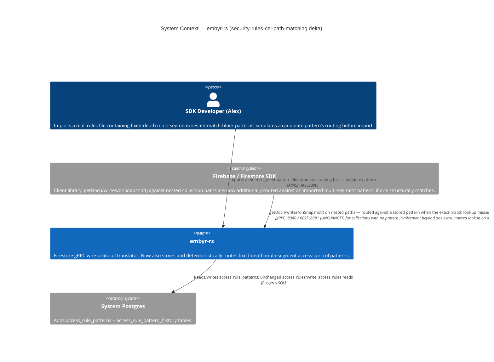
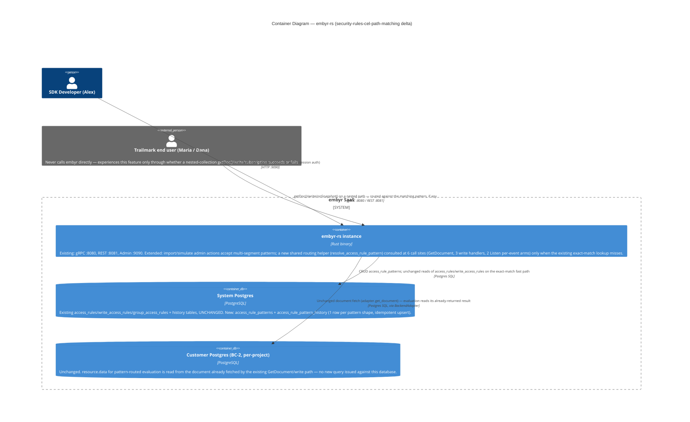
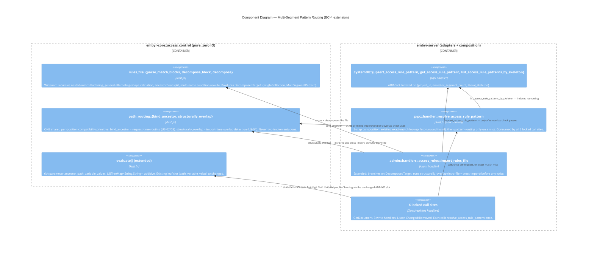

# security-rules-cel-path-matching — Feature Delta

**Wave**: DISCUSS | **Agent**: Luna (nw-product-owner) | **Date**: 2026-09-01
**Status**: Ready for DESIGN handoff
**Upstream**: `security-rules-cel-parity` (Epic 4a, DISCUSS+DESIGN complete, confirmed SHIPPED IN CODE — `crates/embyr-core/src/access_control/rules_file.rs` and `Operand::PathVariable` both exist and are wired into `GetDocument`/3 write handlers today, confirmed by direct read, not assumed) → the direct predecessor. Epic 4a's own § Scope Assessment named this feature explicitly as "Epic 4b (deferred) | `security-rules-cel-path-matching` | Recursive/wildcard multi-segment paths, nested match blocks, runtime pattern-routing engine | Likely highest real-world value next." This DISCUSS is that pass.

<!-- markdownlint-disable MD024 -->

---

## Wave: DISCUSS / [REF] Prior Wave Consultation — Reading Confirmation

✓ `docs/feature/security-rules-cel-parity/feature-delta.md` (full, 1104 lines, both DISCUSS and DESIGN sections) — the direct predecessor. Confirmed its own locked v1 scope (Resolution 1 Option C: single top-level collection, at most one leaf-level path-variable capture), its own Resolution 2 (all-or-nothing import) and Resolution 3 (read+write parity within one feature — both reused as direct precedent below), and its own explicit deferral of this feature's entire scope (§ Out of Scope, § Scope Assessment's 5-epic split table).
✓ `docs/product/architecture/adr-062-rules-file-import-parser-path-variable-and-decomposition.md` (full) — the exact mechanism 4a shipped: `Operand::PathVariable(String)`, `evaluate()`'s 5th parameter `path_variable_value: Option<&str>` (explicitly a single value, not a name-keyed map — ADR-062's own text: "a map keyed by variable name is the natural extension point for Epic 4b... but is not built now (YAGNI)"), the canonical-rewrite-at-import mechanism, and the structural verification that `decompose_decidable`'s wildcard catch-all requires zero code change for `PathVariable`.
✓ `docs/feature/security-rules/feature-delta.md` (targeted: § Job Discovery Framing Resolution, ADR-027, locked v1 grammar) — the base grammar and storage shape this feature extends two epics removed.
✓ `docs/feature/security-rules-collection-group-rules/feature-delta.md` (full, 1053 lines) — read carefully per the dispatch's own instruction, as the single most important candidate prior art for a routing/matching mechanism. **Finding, confirmed by full read, not assumed: this mechanism does NOT reduce this feature's own scope or sizing.** `group_access_rules` (ADR-032) is a flat, disjoint table keyed by `(project_id, collection_id)` **alone** — a single bare identifier, no path, no wildcard, no precedence concept of any kind. Its own Resolution 1 explicitly REJECTED "execute-time composition of every matching nested path's own exact-path rule" as "structurally intractable" for its own, simpler problem (matching a *bare collection id* against however many nesting depths a `collectionGroup()` query's SQL touches) — it never attempts to route a *concrete path* to *one of several structurally-distinct wildcard-bearing patterns*, which is this feature's own central problem. The only genuinely reusable precedent it confirms: (a) the "new disjoint table, schema-identical to `access_rules`/`write_access_rules`, `check_query_compliance()` reused completely unmodified" shape as ONE candidate storage direction (not the only one — see § System Constraints); (b) the "structural verification via direct code read, not assumed" discipline this DISCUSS also applies below.
✓ `docs/product/architecture/brief.md` §§ Application Architecture — `security-rules` through `security-rules-cel-parity` (lines 3481–4391, full) — confirms every prior epic's own DESIGN summary, BC-4's current shape, and that `security-rules-cel-parity` is the most recent sibling (no gap between it and this feature).
✓ `docs/product/jobs.yaml` (JOB-17, full entry, lines 859–1060+, and all 8 accumulated NOTEs) — JOB-17's own functional-dimension text ("enforce them on every request... v1... narrowed... write-path, query-path, and real-time-listen enforcement, plus full Firestore Rules Language parity... recursive wildcard paths, are explicitly named, deferred follow-up epics") names THIS feature's scope explicitly, from JOB-17's own founding NOTE (2026-08-17) onward.
✓ `docs/product/journeys/sdk-developer.yaml` (full) — P1 Alex, JOB-17 listed since 2026-08-17, 8 realization NOTEs through `security-rules-cel-parity` (2026-09-01).
✓ `docs/product/personas/chris-account-admin.yaml` (full) — P5 Chris, Account Admin/Platform Engineer persona, jobs JOB-10/14/04/05 — confirmed, not assumed, entirely unrelated to rule authoring or path matching. Confirmed this is the *only* persona file in SSOT; Alex remains an inline-persona convention, matching every JOB-17 sibling's own precedent.
✓ `crates/embyr-core/src/access_control/rules_file.rs` (full, 669 lines, including tests) — **the single most load-bearing direct-code finding of this DISCUSS.** Confirmed by direct read: `parse_path_segments` already splits a match block's path pattern on every `/`, producing an arbitrary-length `Vec<PathSegment>` for ANY path shape, including genuinely nested/multi-segment patterns (`{userId}` vs `{name=**}` are already distinguished at the segment-parsing layer) — **the outer-syntax scanner is already fully general**; only `decompose_block`'s own shape allow-list (`[Literal(coll)]` / `[Literal(coll), Wildcard(var)]`, everything else rejected `NESTED_PATH`/`RECURSIVE_WILDCARD`) is what currently narrows scope to single-segment collections. This materially changes this feature's own shape: the parser does not need to be rebuilt, only widened at one function's own shape-matching arm — the genuinely new work is the storage/routing layer, not the outer grammar scanner.
✓ `crates/embyr-core/src/access_control/mod.rs` (targeted: `Operand` enum, `evaluate()` signature, `resolve_field_value`, `decompose_decidable`) — confirmed current 9-variant `Operand` (8 from ADR-027/030/034 + `PathVariable(String)` from ADR-062), `evaluate()`'s 5-parameter signature with `path_variable_value: Option<&str>` as a single value (not name-keyed), and `decompose_decidable`'s exhaustive-match wildcard catch-all — the exact shapes this feature extends.
✓ `crates/embyr-server/src/admin/handlers/access_rules.rs` (targeted: `collection_path`/`collection_id` doc comments and validation) — confirmed directly: `access_rules`/`write_access_rules`'s own `collection_path` column carries **zero** DB-level or admin-handler-level validation rejecting a `/`- or `{`/`}`-containing value (only `group_access_rules` has the `NOT LIKE '%/%'` CHECK constraint, ADR-032) — a structural fact directly relevant to this feature's own storage options (§ System Constraints).
✓ `migrations/0022_access_rules.sql`, `0023_write_access_rules.sql`, `0024_group_access_rules.sql` (full) — confirmed `access_rules`/`write_access_rules`: `PRIMARY KEY (project_id, collection_path)`, `collection_path TEXT NOT NULL`, no `CHECK` constraint of any kind. Confirmed `group_access_rules`: `PRIMARY KEY (project_id, collection_id)`, `collection_id TEXT NOT NULL CHECK (collection_id NOT LIKE '%/%')`. Highest existing migration is `0031`; next available is `0032`.
✓ `crates/embyr-server/src/adapters/system_db.rs` (targeted: `get_access_rule`, `upsert_access_rule`) — confirmed `get_access_rule` is a single indexed `WHERE project_id = $1 AND collection_path = $2` exact-match lookup — **no "list all rules for a project" method exists anywhere in this codebase today**, for any of the 3 rule tables. Direct evidence that a runtime pattern-routing mechanism (find the ONE stored pattern, if any, that structurally matches an arbitrary concrete path) has no existing precedent to reuse, structurally confirming the charter's own framing.
✓ `docs/evolution/*.md` (directory listing) — confirmed only `2026-08-18-security-rules.md` exists for the entire JOB-17 initiative; `security-rules-cel-parity` and every sibling since `security-rules-write-path` shipped via this session's direct-dispatch practice without an evolution doc — this feature's dependency is on `security-rules-cel-parity`'s DESIGN decisions being stable (ADR-062, Accepted, and independently confirmed shipped in code above), not on a FINALIZED evolution doc existing, mirroring 4a's own identical dependency framing on its own predecessors.

**No contradictions found.** This DISCUSS does not reopen any of 4a's 3 locked Resolutions (v1 single-collection/single-wildcard scope, all-or-nothing import, read+write parity) — it extends the grammar and adds the routing mechanism 4a's own predecessor table named as this feature's job. One new central architectural question is resolved below (§ Job Discovery Framing Resolution, Resolution 1) with the same evidence discipline every JOB-17 sibling has applied.

---

## Wave: DISCUSS / [REF] Orchestrator Decisions (not re-litigated)

| # | Decision | Value |
|---|---|---|
| 1 | Feature Type | Backend — parser/storage/routing extension (pre-set) |
| 2 | Walking Skeleton | No — brownfield extension of Epic 4a's own infrastructure (pre-set). Evaluated anyway per standing practice: 4a's own outer-syntax scanner, `Operand` family, `evaluate()` signature, and admin-import surface are all reused/extended, never replaced — confirms "Depends" would have resolved to the same answer 4a itself reached for its own predecessors |
| 3 | UX Research Depth | Comprehensive (pre-set) — matching 4a's own depth given the added routing-mechanism complexity |
| 4 | JTBD Analysis | Yes — traces to `job_id: JOB-17`, 9th realization (see § Persona & Job). No new job: same persona, same goal, closing the next-largest remaining gap in the same authoring-surface JOB-17 has incrementally closed 8 times already |

### OQ-CP-03 status (carried from 4a, addressed per dispatch instruction)

4a's own Open Questions named `OQ-CP-03`: whether Epic 4b should be sequenced immediately next "given real files 'almost universally' use some wildcard/nesting... or should Epic 4c or 4d take priority based on evidence gathered from this feature's own real-world usage." No real-world import-usage evidence exists in this codebase's own fiction (a protocol-translation server with no live customer traffic recorded anywhere in `docs/`) — `OQ-CP-03` remains **unresolved by hard usage evidence**, exactly as it was the day 4a wrote it. This DISCUSS proceeds with 4b next anyway, on 4a's own stated reasoning alone (real Firestore rules files overwhelmingly use nested collections and/or wildcards for the single most common real-world data shape — per-user-owned subcollections — which this feature's own § Scope Assessment independently re-confirms via the direct code evidence above: 4a's own domain example already contained an abandoned, rejected nested block). `OQ-CP-03` is not re-opened as a live question in this document; it is noted here, as instructed, and carried forward unresolved rather than silently dropped.

---

## Wave: DISCUSS / [REF] Persona & Job

**Persona**: **P1 — Alex, SDK Developer** (existing, unchanged, inline-persona convention).

**Domain-example company**: **Trailmark**, continued. New domain-example detail: Alex's real `firestore.rules` file — the same file 4a introduced — also contains the block 4a's own US-04 domain example named and rejected: `match /expeditions/{expeditionId}/journal_entries/{entryId} { allow read, write: if request.auth.uid == resource.data.owner_id; }` — a genuinely live, non-abandoned block protecting shared, multi-contributor expedition logs (Trailmark end users co-author journal entries under a specific expedition — `expeditions/trek-2026/journal_entries/*` and `expeditions/coastal-explorer-2026/journal_entries/*` are two concrete, independent expeditions with independent contributor sets). Alex's real file ALSO expresses this using Firestore's own natural nested-`match`-block idiom in places (`match /expeditions/{expeditionId} { match /journal_entries/{entryId} { allow ...; } }`), not only the flat multi-segment form — both are the same file, both need to import.

**job_id decision (per Decision 4)**: **JOB-17 (`document-access-control`), 9th realization — not a new job.** Same persona, same goal as all 8 prior realizations. This feature does not change *what* Alex is trying to accomplish (bring his real `.rules` file to embyr directly) — it closes the single largest remaining share of that file's own shapes 4a's own narrower v1 scope left untranslatable, mirroring the identical "make it real"/close-the-remaining-gap pattern this codebase has now applied 9 times running for this job.

**Opportunity scoring**: Importance = 9 (unchanged from JOB-17's founding score and every sibling's re-application — per 4a's own Scope Assessment reasoning, restated and now independently re-confirmed by direct code evidence above: "real files almost universally use some wildcard/nesting"). Satisfaction = 3 (up from 4a's own 2 — 4a genuinely closed the single-collection/single-wildcard slice, a real, if narrow, improvement; the gap this feature closes — nested/multi-segment collections, the single most common real Firestore ownership shape for hierarchical, shared, or team-scoped data — is larger than the slice 4a closed, so satisfaction remains low, not moderate). Opportunity = 9 + (9−3) = **15**. Priority: **critical** — comparable to JOB-17's founding score (17), JOB-16's (15), and 4a's own (16); a blocked authoring surface for the single most common real-world nested-ownership pattern continues to make a large share of the other 8 epics' worth of enforcement machinery unreachable for exactly the customer segment most likely to need it.

---

## Wave: DISCUSS / [REF] Job Discovery — Framing Resolution

Three central scoping questions, each resolved with the same rigor every JOB-17 sibling's own Resolutions established as precedent.

### Resolution 1 (THE central architectural question) — What happens when a concrete request path could structurally match more than one stored pattern?

Real Cloud Firestore's own documented rule-composition behavior is genuinely permissive: when multiple `match` statements structurally apply to the same path, **every** applicable `allow` expression for the relevant operation is evaluated, and access is granted if **any** of them evaluates true (an OR-composition across every matching statement, not "most specific wins"). This is the single most consequential fidelity question this feature must answer, because it determines whether "a concrete path is routed to a rule" is even the right mental model at all.

| Option | Description | Fit against evidence |
|---|---|---|
| **(A) Most-specific-wins (URL-router semantics)** — the single pattern with the fewest wildcard segments (most literal segments) governs; ties are an error | **Rejected.** Does not match real Firestore's own documented composition behavior at all — this would be a *new*, embyr-invented semantic, not a compatibility feature, undermining the exact customer-migration evidence (§ Changed Assumptions, 4a) that justifies this whole initiative existing. |
| **(B) OR-composition across every structurally-matching pattern (real Firestore's own actual behavior)** | Every pattern whose shape structurally matches the concrete path has its condition evaluated for the relevant verb; the request is permitted if any evaluates true | **Highest fidelity, but not evidenced as necessary by Trailmark's own real file** (see below) and materially larger: it requires the storage/evaluation layer to hold and evaluate potentially *many* conditions per request instead of the *one* condition every prior JOB-17 epic's storage model (`access_rules`/`write_access_rules`, ADR-028/030) has always assumed. Not rejected as a *target* — named as a real, evidenced fidelity gap this feature does NOT close (§ System Constraints, § Out of Scope), not silently pretended away. |
| **(C) Reject any import whose patterns could structurally overlap — every concrete path matches AT MOST ONE stored pattern, enforced at import time (both within one file and against already-stored patterns from prior imports)** | An import is rejected in full, naming the specific overlapping patterns, if two patterns could ever both structurally match the same concrete path shape (e.g., a wildcard segment and a literal segment at the same position under the same parent path) | **Strongest fit for this feature's own evidenced scope.** Trailmark's own real file — the entire evidentiary basis for this initiative — has **no domain example anywhere** (4a's own or this feature's own) requiring two overlapping patterns for the same path shape; every real example is a single, unambiguous pattern per collection depth (`profiles/{userId}`, `expeditions/{expeditionId}/journal_entries/{entryId}`). Mirrors 4a's own Resolution 1 narrowing discipline exactly: ship the evidenced slice, name the richer target explicitly as deferred, do not build unevidenced machinery (Principle 8). Also mirrors Resolution 2's own "all-or-nothing" discipline one layer deeper — an ambiguous import is rejected, not silently resolved by an arbitrary tie-break. |

**Resolution**: **(C) is locked for this feature.** A concrete request path structurally matches **at most one** stored pattern (across every pattern shape this feature supports, including the pre-existing 4a single-wildcard shape and the pre-existing zero-wildcard exact-path shape) — routing is deterministic, never composed. An import that would introduce structural overlap — with another pattern in the *same* file, or with an *already-stored* pattern from a prior import — is rejected outright, naming the specific colliding patterns (§ User Stories, US-04). Option B's real-Firestore-parity OR-composition semantics is an explicit, named, deferred fidelity gap (§ Out of Scope) — not built here, not hidden.

**Confidence and escalation note**: HIGH confidence — directly evidenced by the complete absence of any overlapping-pattern domain example across both this feature's and 4a's own text, and by the same "ship the narrowest evidenced slice" discipline this whole initiative has applied at every prior Resolution. Flagged for the orchestrator, not silently asserted as unquestionably final: Option B is real Firestore's actual behavior, and if evidence of a real customer's file relying on it ever appears, this Resolution — like 4a's own reversal of `security-rules`' original Resolution 1 — is the kind of decision this codebase's own precedent treats as reversible, not permanent.

### Resolution 2 — What path-pattern shapes does this feature accept, and which are deferred?

| Option | Description | Fit against evidence |
|---|---|---|
| **(A) Full charter ambition in one pass** — fixed-depth multi-segment patterns (multiple wildcards, nested match-block syntax) **and** recursive wildcards (`{path=**}`), together | Everything the charter names for "Epic 4b" as originally bucketed by 4a's own deferred-epic table | **Rejected for this feature** — see § Scope Assessment. Recursive/variable-depth matching is a categorically harder routing problem than fixed-depth matching (the set of concrete paths a recursive pattern could match is unbounded in depth, not just unbounded in *which* literal/wildcard values occupy a *fixed* number of positions) — combining both in one feature repeats the exact "combined risk profile" reasoning 4a's own Scope Assessment used to defer recursive wildcards from the *original* full-parity ambition in the first place. |
| **(B) Fixed-depth multi-segment patterns only (0+ wildcard segments at document-ID positions, literal-only at collection-name positions), including nested match-block outer syntax; recursive wildcards explicitly deferred to a new follow-up feature** | Closes `/users/{userId}/posts/{postId}`-shaped and `/expeditions/{expeditionId}/journal_entries/{entryId}`-shaped rules — the single most common real Firestore hierarchical-ownership pattern — without attempting variable-depth matching | **Strongest fit.** Directly evidenced by every domain example in this feature's own text and 4a's own abandoned-block example; zero domain example anywhere requires `{path=**}`. Nested match-block syntax is included (not deferred alongside recursive wildcards) because it is a pure *parser-flattening* concern — the outer-syntax scanner already tokenizes `{...}` segments generically (Reading Confirmation, `rules_file.rs`), so a nested `match { match { ... } }` shell flattens to the identical `Vec<PathSegment>` representation a flat multi-segment pattern already produces; it introduces no new routing/precedence concept of its own, unlike recursive wildcards, which do. Rejecting nested-match syntax while accepting flat multi-segment syntax would repeat 4a's own explicitly-rejected Resolution 1 Option B mistake ("a syntax shell that cannot express [a real shape] leaves Alex's actual rules file still partially untranslatable") — real `.rules` files idiomatically favor nested `match` blocks for shared path prefixes, so both outer-syntax shapes must be accepted for the same reason 4a accepted both wildcard-bearing and wildcard-free blocks in one pass. |

**Resolution**: **(B) is locked.** Fixed-depth multi-segment patterns (any number of segments, wildcard or literal at document-ID positions, literal-only at collection-name positions) and nested match-block outer syntax are this feature's own scope. Recursive wildcards (`{path=**}`) are named, deferred, and given a new candidate follow-up feature id: **`security-rules-cel-recursive-wildcards`** — sequenced logically *after* this feature specifically because it can reuse this feature's own fixed-depth routing/overlap-detection machinery once proven, rather than building variable-depth and fixed-depth matching simultaneously (§ Scope Assessment, § Out of Scope). This narrows 4a's own predecessor table's single "Epic 4b" bucket into two independently-shippable epics — an evidence-driven split, mirroring 4a's own splitting of the original full-parity ambition into 5, and directly responsive to the dispatch's own explicit invitation to re-slice if the routing mechanism warrants it.

### Resolution 3 — Read+write parity and Listen's per-event re-check: extend 4a's own precedent, or defer again?

4a's own Resolution 3 locked read+write parity for its single-variable operand within one feature (not split across a read epic and a write epic), reasoning that threading an already-known value through an existing function signature is "mechanical, uniform, one-line-per-site." 4a also explicitly left Listen's per-event re-check unwired (`OQ-CP-04`), because at the time no routing/binding mechanism beyond a single `Option<&str>` existed to wire — ADR-062's own text named this feature ("most likely 4b, which already touches path-matching machinery") as the natural place to close that gap.

**Resolution**: **Both hold, extended.** Read+write parity (GetDocument + 3 write handlers) is locked within this same feature, for the identical mechanical reason 4a established — now for a name-keyed set of captured variables instead of a single value, but every one of the 4 real call sites already has the full concrete document path before touching storage, so the zero-new-I/O argument carries forward unchanged. **Listen's per-event re-check (`OQ-CP-04`) is also resolved and wired in this feature** (not deferred a second time) — `handle_add_target`'s `Changed`/`Removed` arms already possess the changed document's own path (the identical zero-new-I/O argument), and this feature's own routing/binding mechanism must already exist to serve GetDocument/writes, so wiring Listen costs no separately-invented machinery. This closes a named residual gap from 4a rather than silently deferring it further (§ User Stories, US-03 Technical Notes).

---

## Wave: DISCUSS / [REF] Scope Assessment (Elephant Carpaccio Gate)

Run before journey/story-map investment, per Phase 1.5. Evaluated twice, per the dispatch's own explicit expectation that this feature may trip the gate harder than 4a did.

### Pass 1 — full charter ambition (fixed-depth multi-segment patterns + recursive wildcards + real-Firestore OR-composition precedence, in one feature)

| Signal | Threshold | This scope | Fired? |
|---|---|---|---|
| User stories | >10 | ~11–13 (import + widened parser, fixed-depth routing on read, fixed-depth routing on write, recursive-wildcard parsing, recursive-wildcard routing (a structurally distinct, variable-depth algorithm), OR-composition evaluation across multiple matching patterns, overlap/ambiguity detection redefined for the OR-composition world, admin-surface changes for all of the above, simulation extended for all of the above, non-regression proof) | **YES** |
| Bounded contexts / modules | >3 | 2 — same as 4a (BC-4 extended, BC-1 admin surface reused). Does **not** independently fire, but combines with the other 4 signals below | **NO** |
| Walking Skeleton integration points | >5 | 6+ — import, fixed-depth GetDocument routing, fixed-depth write routing, recursive-wildcard GetDocument routing (a second, structurally distinct routing algorithm), Listen per-event re-check (both fixed-depth and recursive), and re-verification of `RunQuery`/Listen subscribe-time compliance under OR-composition semantics (whether `decompose_decidable`'s wildcard catch-all still soundly rejects an OR-composed rule shape must be independently re-derived, not merely re-confirmed, since the *shape being rejected* is now a set of alternatives, not a single condition) | **YES** |
| Estimated effort | >2 weeks | Recursive/variable-depth matching alone is a categorically harder algorithm than fixed-depth matching (the candidate-pattern search space is not bounded by segment count); OR-composition further requires evaluating and combining multiple conditions per request instead of one, a genuine departure from every prior JOB-17 epic's single-condition-per-request model. Credibly 3+ weeks combined. | **YES** |
| Independent shippable outcomes | multiple | **YES** — fixed-depth multi-segment matching, recursive-wildcard matching, and real-Firestore OR-composition precedence are each independently valuable and independently demoable; Trailmark's own real file (per its own domain examples) needs only the first | **YES** |

**4 of 5 signals fire clearly** (threshold is 2+). **Verdict: OVERSIZED at the full-ambition scope** — matching the dispatch's own expectation that this would trip the gate at least as hard as 4a did, and for the same structural reason: a genuinely new routing/matching *and* composition mechanism, not a parser extension.

### Proposed split (extends 4a's own 5-epic split; narrows its own "Epic 4b" bucket into two)

| Epic | Candidate feature id | Scope | Status |
|---|---|---|---|
| **4b — `security-rules-cel-path-matching` (this feature)** | — | Fixed-depth multi-segment path patterns (any number of wildcard/literal document-ID segments), nested match-block outer syntax, deterministic single-pattern routing (reject on structural overlap, both intra- and cross-import), read+write parity, Listen per-event re-check wiring. | **This DISCUSS pass** |
| 4b-ii — candidate `security-rules-cel-recursive-wildcards` | `security-rules-cel-recursive-wildcards` | Recursive wildcards (`{path=**}`) — variable-depth matching, reusing this feature's own fixed-depth routing/overlap-detection machinery once proven. | Named, deferred |
| 4c — candidate `security-rules-cel-expression-grammar` | `security-rules-cel-expression-grammar` | Unchanged from 4a's own naming — the remaining CEL expression surface (arithmetic, `in`, list/map literals, numeric literals, timestamp/duration). | Named, deferred (unchanged from 4a) |
| 4d — candidate `security-rules-cel-cross-document-reads` | `security-rules-cel-cross-document-reads` | Unchanged from 4a's own naming — `get()`/`exists()` cross-document reads. | Named, deferred (unchanged from 4a) |
| 4e — candidate `security-rules-cel-functions` | `security-rules-cel-functions` | Unchanged from 4a's own naming — custom `function` definitions/invocation. | Named, deferred (unchanged from 4a) |
| — (new, unbucketed) | no candidate id assigned yet | Real-Firestore OR-composition precedence semantics (Resolution 1, Option B) — a genuine fidelity gap left open by this feature's own Resolution 1. Not assigned to any named epic above; a candidate follow-up only if real import usage or customer evidence ever shows an overlapping-pattern file, mirroring 4a's own "flag, don't invent absent evidence" discipline. | Named, unscheduled |

4b-ii is sequenced immediately after 4b specifically because it is the lowest-marginal-cost of the remaining deferred epics once 4b's own fixed-depth routing/overlap-detection exists to extend — a narrower, more evidenced claim than simply repeating 4a's own "likely next" reasoning unchanged.

### Pass 2 — narrowed scope (this feature's actual, locked scope: fixed-depth multi-segment matching only)

| Signal | Threshold | This feature | Fired? |
|---|---|---|---|
| User stories | >10 | 6 (US-01 through US-06) | **NO** |
| Bounded contexts / modules | >3 | 2 — `embyr-core::access_control` (BC-4, extended with a new routing/overlap-detection submodule and a widened `rules_file` shape-check) + the admin authoring surface (BC-1's existing driving-adapter pattern, extending the existing import/simulate actions, no new route) | **NO** |
| Walking Skeleton integration points | >5 | 3 — the import-and-decompose step (US-01), the routing+multi-variable evaluation on GetDocument (US-02), the same mechanism extended to the 3 write handlers (US-03) | **NO** |
| Estimated effort | >2 weeks | 6 slices, ~9.5 days total (§ Elephant Carpaccio Slices) — borderline relative to 4a's own comfortable ~7.75-day margin, but under the 2-week (10-day) threshold; flagged as elevated risk, not silently treated as equally comfortable | **NO** |
| Independent shippable outcomes | multiple | **NO** — US-01 (parse+decompose+route) and US-02/03 (evaluate the routed variables on read and write) are inseparable halves of one outcome, exactly like 4a's own US-01/US-02/US-03 pairing; US-04/US-05 are guardrails on that same outcome; US-06 (simulation) is a normal Release-2 enhancement | **NO** |

**0 of 5 signals fired. Verdict: PASS — right-sized**, at the narrowed scope this DISCUSS locks (Resolution 1 Option C, Resolution 2 Option B). Not as comfortable a margin as 4a's own Pass 2 (effort signal is close to, not far under, threshold) — noted explicitly, not smoothed over, per the dispatch's own expectation that this feature would be harder to right-size than 4a.

**Direct answer to the dispatch's own explicit question**: `security-rules-collection-group-rules`'s existing mechanism does **not** make this feature smaller. It is a flat, disjoint, exact-bare-id-keyed table with zero pattern-matching or precedence concept — a related but structurally orthogonal solution to an orthogonal problem (collection-GROUP querying across unknown nesting depths at query-plan time, not concrete-path routing to one of several wildcard-bearing patterns at document-access time). The one thing it *does* usefully confirm is that "new disjoint table, `check_query_compliance()` reused unmodified" is a proven, low-risk *storage* shape this feature's own DESIGN wave can evaluate as one candidate among others (§ System Constraints) — but the routing/matching *algorithm* itself has no reusable precedent anywhere in this codebase, confirmed directly (`system_db.rs`, no "list all rules" method exists for any of the 3 rule tables today).

---

## Wave: DISCUSS / [REF] Journey — Alex's Nested-File Import Arc and the Routing-Correctness Consequence Arc

Per Decision 3 (Comprehensive), full narrative weight, extending 4a's own journey rather than starting over — the fundamental shape of Alex's mental model (import a real file, trust decomposition, verify against real end-user calls) is unchanged; what's new is the specific fear this feature's own capability introduces.

### Mental model

Alex's mental model carries forward unchanged from 4a in every respect but one: 4a taught him "embyr will tell me exactly which blocks it can't yet handle, and touch nothing else" — a *completeness* guarantee he now trusts. This feature introduces a *new* kind of trust question 4a's own single-collection scope never raised: once a rule can be bound to a *pattern* instead of one fixed collection, does embyr correctly figure out which concrete document a given request is actually touching, and — critically — does a rule written for `expeditions/trek-2026` never accidentally leak into or block `expeditions/coastal-explorer-2026`? 4a's fear was "did it silently drop something." This feature's fear is "did it silently cross the streams."

### Alex's import emotional arc (delta on 4a's own arc)

```
Start                        Middle                           Peak tension                  End
Trusting (from 4a)           Newly uncertain                  "Did my rule for trek-2026     Confident, now for a
                                                                 accidentally also govern       genuinely richer
                                                                 coastal-explorer-2026,          share of his real file
                                                                 or vice versa?"
   |                            |                                   |                             |
Already believes embyr      Re-submits the SAME block           The realistic failure       Sees his rule correctly
never silently drops         4a's own US-04 example              mode: two DIFFERENT          scoped — trek-2026's
anything (4a's own           rejected as NESTED_PATH              expeditions, same           contributors see only
guarantee, earned)           six months ago                      collection shape, must       trek-2026's entries;
                                                                   resolve to completely       coastal-explorer-2026's
                                                                   independent enforcement      see only theirs
```

### Import flow (Alex's side, Slices 01, 04, 05 — extends 4a's own flow)

```
Alex submits a file containing multi-segment/nested-match-block patterns
        │
        ▼
   Does every match block fit this feature's v1 shape (fixed-depth
   segments, literal collection names, wildcard-or-literal document-ID
   positions, condition inside the already-locked grammar) — AND does
   no pattern structurally overlap any OTHER pattern in this file or
   already stored for this project?
        │
   ┌────┴─────────────────────────────────────┐
  every block fits, no overlap            recursive wildcard present, OR
        │                                  structural overlap detected
        ▼                                          │
   Every block is decomposed and routed             ▼
   (US-01), collection-name-plus-wildcard-     Nothing is applied. Response
   shape stored per pattern, atomically as     names every offending block —
   a group (US-05) — either all succeed        either its unsupported construct
   or none do                                  (RECURSIVE_WILDCARD, same
        │                                      taxonomy 4a established) or the
        ▼                                      SPECIFIC other pattern it
   Alex's existing 4a-imported rules            structurally collides with
   (single-collection, single-wildcard)         (US-04) — Alex fixes or defers
   and pre-4a hand-defined rules are             and re-submits
   completely untouched (US-05)
```

### Read/write/listen-evaluation flow (Maria's/Dana's side, Slices 02–03)

```
A GetDocument/write/Listen call arrives for a document at a concrete,
multi-segment path (e.g. expeditions/trek-2026/journal_entries/entry-042)
        │
   (existing identity-attach steps unchanged)
        │
        ▼
   Which ONE stored pattern (if any) structurally matches this concrete
   path? (US-02/03 — the genuinely new routing mechanism)
        │
   ┌────┴──────────────────────┐
  a pattern matches          no pattern matches
        │                          │
        ▼                          ▼
   Every wildcard segment      Falls through to whatever pre-existing
   the matched pattern         behavior already governs this collection
   captures is bound by        (exact-path rule from a prior epoch, or
   its own name (e.g.          "no rule ⇒ unrestricted") — UNCHANGED,
   expeditionId="trek-2026",   proven by US-05
   entryId="entry-042") and
   made available to the
   condition
        │
   ┌────┴──────────────────────┐
 condition true               condition false
 (Maria, a trek-2026           (Dana, not a trek-2026
  contributor, reading/         contributor, reading/
  writing her own entry)        writing that same entry —
        │                       OR Maria reading/writing a
        ▼                       coastal-explorer-2026 entry
   Succeeds — scoped             she does not contribute to)
   EXCLUSIVELY to                     │
   trek-2026's own                    ▼
   contributor set                Denied, PermissionDenied,
                                   identical response shape to
                                   every other rule denial this
                                   initiative already produces
```

### Shared artifact

| Artifact | Source of truth | Consumers | Integration risk |
|---|---|---|---|
| A concrete path's routed pattern match (which stored pattern, if any, governs this request) and its bound variable set | The routing mechanism's own lookup, evaluated fresh per request from the document's own already-known path — never cached, never precomputed | `embyr_core::access_control::evaluate()`'s extended (name-keyed) `path_variable_value` parameter, at all 4 real-enforcement call sites plus 2 Listen per-event call sites | **CRITICAL** — the single highest-risk artifact in this entire feature: if routing resolves the wrong pattern (or the right pattern with the wrong bound values) for a concrete path, the failure mode is a cross-tenant-shaped leak (Maria seeing Dana's expedition data) or a false-deny (Maria locked out of her own), not a mere missing-feature gap. This is a strictly higher-consequence risk class than any single-collection-scoped artifact 4a's own Shared Artifact table named, because a routing bug's blast radius spans every concrete path a pattern *could* match, not one fixed collection |
| The set of currently-stored patterns for a project (needed to detect overlap at import time, US-04, and to route at request time, US-02/03) | Whatever storage mechanism DESIGN selects (§ System Constraints — not locked here) | Import-time overlap detection (US-04) AND request-time routing (US-02/03) — the SAME underlying pattern set, consumed by two different code paths that must never drift from each other | **HIGH** — if import-time overlap detection and request-time routing derive "does this pattern match" from two independently-implemented matching functions instead of one shared one, the two can silently disagree (an import accepted as non-overlapping that later routes ambiguously, or vice versa) — mirrors this initiative's own recurring "two evaluation routines drift" risk class (ADR-030 Decision Driver 3, ADR-029 DDD-SR-8), now at the pattern-matching layer instead of the condition-evaluation layer |

### Failure modes (feeds DISTILL scenario generation)

- Two different expeditions (`trek-2026`, `coastal-explorer-2026`) sharing the identical pattern (`expeditions/{expeditionId}/journal_entries/{entryId}`) must resolve to two completely independent enforcement outcomes for the identical condition, keyed correctly by each request's own concrete `expeditionId` value — never a cross-expedition leak, never a false-deny within the correct expedition.
- Alex's file expresses the SAME logical rule via nested `match` blocks in one place and (hypothetically) flat multi-segment syntax elsewhere — both must decompose to the identical stored pattern, never two different (and potentially conflicting) rows.
- A new import attempts to define `expeditions/trek-2026/journal_entries/{entryId}` (a literal expedition ID) while `expeditions/{expeditionId}/journal_entries/{entryId}` (wildcard) is already stored — must be REJECTED as a structural overlap (Resolution 1, Option C), not silently accepted with undefined precedence.
- A concrete path that matches NO stored pattern of any kind (4b's own new patterns, 4a's own single-wildcard patterns, or the original zero-wildcard exact-path rules) must fall through to exactly the behavior that already governs it today — zero regression, proven directly (US-05).
- The full pre-existing regression suite (133+ `security-rules`-family scenarios plus 4a's own delivered scenarios) must re-run unmodified — this feature widens the grammar and adds a new routing layer; it must not perturb any already-shipped rule, table, or call site's existing behavior, including 4a's own single-wildcard shape.
- Re-importing an identical multi-segment file twice must remain idempotent (no duplicate row, no duplicate history entry), mirroring 4a's own AC-17-176 precedent, now proven for a pattern-shaped key.

---

## Wave: DISCUSS / [REF] Story Map & Walking Skeleton

**Persona**: P1 Alex | **Goal**: Bring the nested/multi-segment share of Trailmark's real `.rules` file to embyr — the single largest remaining share of that file's own shapes 4a's narrower v1 scope left untranslatable — with deterministic, never-ambiguous routing to the correct concrete document.

### Backbone

| A. Alex Imports Nested/Multi-Segment Patterns | B. A Read/Write/Listen Event Is Correctly Routed | C. Alex Builds Confidence Before Importing |
|---|---|---|
| Alex submits a real `.rules` file containing fixed-depth multi-segment and/or nested-match-block patterns **[WS]** | A concrete document path is routed to the ONE non-overlapping pattern that structurally matches it, with every captured variable bound by name **[WS]** | Alex simulates a candidate multi-segment pattern against a synthetic concrete path before importing |
| An import that would introduce structural overlap (intra- or cross-import) is rejected whole, naming the colliding patterns **[WS]** | The same routing+capture mechanism gates writes, not just reads, and Listen's per-event re-check **[WS]** | |
| Untouched patterns/collections and the full regression baseline are unaffected | | |

### Walking Skeleton

Alex imports a real file containing `match /expeditions/{expeditionId} { match /journal_entries/{entryId} { allow read, write: if request.auth.uid == resource.data.owner_id; } } }` (Activity A) — the SAME block 4a's own US-04 rejected six months ago, now expressed via nested `match` syntax. This decomposes and routes correctly (Activity B): Maria Santos, a `trek-2026` contributor, reads/writes her own entry in `expeditions/trek-2026/journal_entries/entry-042`; Dana Kim, not a `trek-2026` contributor, is denied on that same entry; Maria's read of a `coastal-explorer-2026` entry she does not own is ALSO denied, proving routing is scoped per concrete expedition, not merely per collection shape. No facade, real System DB rule state, real Maria/Dana signed-in sessions — mirrors every prior epic's own WS discipline.

### Release 1 — Multi-Segment Pattern Import Works End-to-End, Deterministically Routed (Slices 01–05, US-01 through US-05)

Outcome: a real `.rules` file's fixed-depth multi-segment and nested-match-block patterns are imported and correctly, deterministically routed on reads, writes, and live Listen updates — with zero ambiguous routing, zero silent partial application, and zero effect on any pattern or collection outside the file.

### Release 2 — Authoring Confidence Extends to Multi-Segment Patterns (Slice 06, US-06)

Outcome: Alex can simulate a candidate multi-segment pattern rule against a synthetic concrete path before importing it, extending 4a's own US-06 simulation precedent.

---

## Wave: DISCUSS / [REF] Elephant Carpaccio Slices

| Slice | Story | Release | Estimate | Learning Hypothesis (disproves) | Production-data taste test |
|---|---|---|---|---|---|
| 01 (WS) | US-01 | 1 | 2.5 days | A fixed-depth multi-segment/nested-match-block pattern cannot be parsed, decomposed, and routed to storage without either widening the existing scanner beyond a one-function shape change or inventing a new outer-grammar layer | Real System DB rows, real Bearer admin credential, Trailmark's own real `expeditions/{expeditionId}/journal_entries/{entryId}` pattern (both flat and nested-match syntax variants of the identical block) |
| 02 (WS) | US-02 | 1 | 2.5 days | A concrete document path cannot be deterministically routed to the ONE structurally-matching stored pattern, with every captured variable correctly bound by name, on a real `GetDocument` call, without either an unbounded per-request scan cost or a second, drift-prone matching implementation separate from import-time overlap detection | Real imported `expeditions/{expeditionId}/journal_entries/{entryId}` pattern + real Maria/Dana sessions + real `trek-2026` and `coastal-explorer-2026` entries |
| 03 (WS) | US-03 | 1 | 1 day | The identical routing+binding mechanism cannot extend to `CreateDocument`/`UpdateDocument`/`DeleteDocument` and Listen's per-event `Changed`/`Removed` re-check without a second, write/Listen-specific resolution path | Real Maria/Dana writes and a real live Listen subscription against `expeditions/trek-2026/journal_entries`, both allowed and denied cases |
| 04 | US-04 | 1 | 1.5 days | An import (or a new import against already-stored patterns) containing structurally-overlapping patterns cannot be rejected, naming the specific colliding patterns, without either an undefined-precedence hazard or an unhelpfully generic rejection | Real attempted overlap: a literal `expeditions/trek-2026/journal_entries/{entryId}` import against an already-stored wildcard `expeditions/{expeditionId}/journal_entries/{entryId}` pattern |
| 05 | US-05 | 1 | 1 day | Importing a multi-segment pattern cannot be proven not to silently affect 4a's own single-wildcard imports, the original zero-wildcard rules, or a path matching no stored pattern at all, without re-running the full existing regression suite plus targeted new non-match scenarios | Real full regression suite (133+ scenarios plus 4a's own delivered scenarios), real path with no matching pattern of any kind |
| 06 | US-06 | 2 | 1 day | A simulation of a candidate multi-segment pattern cannot share the exact same routing mechanism real enforcement uses without either duplicating routing logic or omitting a way to supply a synthetic CONCRETE path (not just a synthetic document ID, as 4a's own US-06 sufficed for) | Real candidate pattern + real synthetic concrete path + real synthetic identity, checked against the real routing+evaluation path |

**Total estimate: ~9.5 days.** (Elevated relative to 4a's own ~7.75-day margin — noted explicitly per § Scope Assessment, not smoothed over.)

**Taste tests applied**:
- "4+ new components per slice" — none exceeds 2 (Slice 01: widened shape-check in `rules_file::decompose` + the new routing/storage write path; Slice 02: the new routing lookup + `evaluate()`'s extension to a name-keyed map; Slice 03: extends Slice 02's mechanism to 4 existing call sites, zero new component; Slice 04: extends Slice 01's decompose with an overlap-detection step, zero new component; Slice 05: zero new components, proof obligation; Slice 06: thin wrapper over Slice 02's routing mechanism). PASS.
- "Every slice depends on a new abstraction" — Slice 01 (widened decompose) and Slice 02 (the routing mechanism itself) are the two genuinely new abstractions; Slices 03–06 build on one or both, introducing none of their own. PASS — natural sequencing, not forced dependency inflation, though noted: 2 new abstractions in Release 1 (not 1, as every prior JOB-17 epic has had) is itself a signal of this feature's own elevated risk relative to 4a, named not hidden.
- "No slice disproves a pre-commitment" — each has a distinct, falsifiable hypothesis (see table). PASS.
- "Synthetic-data-only slices prove plumbing, not value" — N/A; all 6 slices require real System DB state, real signed-in sessions, and (Slice 05) the real existing regression suite. PASS.
- "2+ slices identical except for scale" — none; each targets a distinct mechanism. PASS.

---

## Wave: DISCUSS / [REF] Prioritization

| Priority | Slice | Target Outcome | Rationale |
|---|---|---|---|
| 1 | Slice 01 (WS) | A multi-segment/nested-match-block pattern can be imported and decomposed | Walking Skeleton first — burns down the riskiest new assumption (the widened outer grammar decomposes into a coherent, storable pattern shape at all) before anything downstream has something to route against |
| 2 | Slice 02 (WS) | A concrete path is deterministically routed to the correct pattern, with correctly-bound variables | The single riskiest assumption in this entire feature — burns it down before write-path/Listen extension, mirroring the dispatch's own explicit suggestion that routing itself may deserve proof before path-capture richness is layered on |
| 3 | Slice 03 (WS) | The same mechanism gates writes and Listen's per-event re-check | Closes both Resolution 3's own footgun (silent-always-deny on write) AND 4a's own deferred `OQ-CP-04`, sequenced immediately after routing is proven on reads |
| 4 | Slice 04 | Structurally-overlapping imports are rejected, never ambiguously accepted | The single highest-consequence *silent-cross-tenant-leak* risk (Resolution 1) — sequenced after the happy path exists, because it is a proof *over* real routing behavior, not a standalone mechanism |
| 5 | Slice 05 | Untouched patterns/collections, 4a's own imports, and the full regression suite are provably unaffected | Mirrors every prior epic's own guardrail-last discipline; sequenced last within Release 1 as a proof *over* Slices 01–04's real behavior |
| 6 | Slice 06 | Alex can simulate a multi-segment pattern before importing | Highest-leverage for Alex's own confidence, correctly sequenced after the routing mechanism exists to wrap, mirroring 4a's own US-06 sequencing precedent |

---

## Wave: DISCUSS / [REF] System Constraints

- **Deterministic single-pattern routing — LOCKED to Resolution 1's Option C.** A concrete request path matches AT MOST ONE stored pattern, ever. DESIGN must not implement Resolution 1's Option A (most-specific-wins) or Option B (real-Firestore OR-composition) under any framing, including as an "interim MVP." An import that would introduce structural overlap — against another pattern in the same file, or against an already-stored pattern — is rejected outright, before any existing rule is touched, naming the specific colliding patterns.
- **Fixed-depth patterns only — LOCKED to Resolution 2's Option B.** Recursive wildcards (`{path=**}`) are out of this feature's scope entirely — named, deferred, given a new candidate follow-up id (`security-rules-cel-recursive-wildcards`). DESIGN must not silently widen path-shape validation to accept `RecursiveWildcard` segments under any framing.
- **Nested match-block outer syntax is a parser-flattening concern only.** It must decompose to the identical internal pattern representation flat multi-segment syntax produces — no separate routing/precedence concept, no separate storage shape.
- **Read+write parity for the routing mechanism, extended to Listen's per-event re-check — LOCKED (Resolution 3, extends 4a's own precedent).** GetDocument, all 3 write handlers, AND `handle_add_target`'s `Changed`/`Removed` arms must all resolve the routing mechanism's bound variables within this same feature. Leaving any of these 6 call sites unwired is not a valid smaller slice.
- **The runtime pattern-routing/storage mechanism is NOT decided here — DESIGN's own explicit obligation.** Two candidate directions are named as evidence for evaluation, not locked: (a) reuse `access_rules`/`write_access_rules` UNCHANGED by storing a pattern's `{var}`-bearing text directly as the `collection_path` value (structurally distinguishable from a literal path, since a real Firestore collection/document segment name can never legally contain `{`/`}` — confirmed by direct schema/handler read, § Reading Confirmation), preserving the existing fast exact-match lookup untouched for every collection with no patterns, falling back to a per-project pattern search only when the fast exact lookup misses; (b) a new disjoint table mirroring `group_access_rules`' own precedent (ADR-032). Whichever DESIGN selects, it must independently reason about (i) the per-project pattern-row-count NFR (today unbounded — no cap exists anywhere in this codebase, for any of the 3 rule tables), (ii) preserving zero performance regression for the (presumably common) case of a collection with no wildcard-bearing patterns defined at all, and (iii) ensuring import-time overlap detection (US-04) and request-time routing (US-02/03) share ONE matching implementation, never two independently-maintained ones (§ Journey, Shared Artifact table).
- **`decompose_decidable`/`check_query_compliance`'s existing "zero new code" claim for `PathVariable` (established by 4a, ADR-062) must be RE-verified, not merely re-cited, for this feature's own widened use.** 4a's own structural verification covered a single `PathVariable` value; DESIGN must independently confirm the wildcard catch-all still soundly rejects any `Compare` naming `PathVariable` regardless of how many distinct captured names a condition might reference, under this feature's own routing extension.
- **Zero change to any already-shipped storage shape's own EXISTING rows.** Whatever new storage mechanism DESIGN selects, 4a's own single-wildcard rows and the original zero-wildcard rows must be provably unaffected (US-05).
- **Zero new bounded-context dependency, zero new I/O beyond what DESIGN's selected storage mechanism itself requires.** The routing mechanism's own matching logic (given a concrete path and a candidate pattern, does it structurally match, and what does it bind) must remain pure, zero-IO — mirroring `deny.toml`'s enforcement of BC-4's zero-IO invariant.
- **Rejection distinguishability, extended.** An out-of-v1-scope construct (recursive wildcard, still `RECURSIVE_WILDCARD`) and a structural-overlap rejection (new: `PATTERN_OVERLAP` or DESIGN's own equivalent naming) must each be named specifically per offending block/pair, distinguishable from each other and from 4a's own existing taxonomy (`NESTED_PATH`, `CROSS_DOCUMENT_READ`, `CUSTOM_FUNCTION`, `CONFLICTING_VERB_CONDITIONS`, `SYNTAX_ERROR`).
- Ubiquitous language introduced: **multi-segment pattern** (a `match` block's own path pattern spanning more than 2 segments, with 0+ wildcard-captured document-ID positions), **structural overlap** (two patterns that could both match the same concrete path shape), **routing** (resolving a concrete request path to the one stored pattern, if any, that structurally matches it, and binding its captured variables).

---

## Wave: DISCUSS / [REF] User Stories

### US-01: Alex Imports a Real File Containing Multi-Segment and Nested-Match-Block Patterns

**job_id**: JOB-17
**Slice**: 01 (Walking Skeleton) | **Release**: 1

#### Elevator Pitch
Before: Alex's real `firestore.rules` file has a block 4a's own import rejected outright six months ago — `match /expeditions/{expeditionId}/journal_entries/{entryId} { allow read, write: if request.auth.uid == resource.data.owner_id; }` (or its nested-match-block equivalent) — leaving Trailmark's shared, multi-contributor expedition logs still hand-transcribed one collection instance at a time, which is not even possible today since embyr has no way to express "one rule, many expeditions."
After: re-submit the same import action (extended, exact shape DESIGN's call) with the file containing that block → sees a per-pattern confirmation that the multi-segment pattern is now stored and active, matching what the file itself said.
Decision enabled: Alex knows his real file's nested-ownership rules — not a hand-maintained substitute — are now the source of truth for every expedition his file names, present or future, without redefining a rule each time Trailmark launches a new expedition.

#### Domain Examples
1. **Happy Path**: Alex imports a file containing `match /expeditions/{expeditionId} { match /journal_entries/{entryId} { allow read, write: if request.auth.uid == resource.data.owner_id; } } }` — the nested-match-block form. Sees confirmation the pattern is stored and active for `expeditions/{expeditionId}/journal_entries`.
2. **Edge Case**: Alex re-imports the same file an hour later, having changed nothing. The response confirms the pattern is still active with no error and no duplicate state (idempotent, mirrors 4a's own AC-17-176).
3. **Error/Boundary**: The same file also contains the flat multi-segment equivalent of the identical block, written as `match /expeditions/{expeditionId}/journal_entries/{entryId} { allow read, write: if request.auth.uid == resource.data.owner_id; }`, in a SEPARATE test file. Both forms decompose to the identical stored pattern — proving the parser-flattening claim (§ Resolution 2) holds, not merely asserted.

#### UAT Scenarios (BDD)

##### Scenario: A nested-match-block multi-segment pattern is imported and immediately active
Given project `trailmark-prod` exists and no pattern is yet defined for `expeditions/*/journal_entries`
When Alex imports a `.rules` file containing `match /expeditions/{expeditionId} { match /journal_entries/{entryId} { allow read, write: if request.auth.uid == resource.data.owner_id; } } }`
Then a pattern is stored and active for `expeditions/{expeditionId}/journal_entries`, gating both reads and writes by the captured `expeditionId` and `entryId` variables

##### Scenario: The flat multi-segment syntax form decomposes identically to the nested-match-block form
Given the same nested-match-block file has already been imported
When Alex imports a DIFFERENT file expressing the identical rule via `match /expeditions/{expeditionId}/journal_entries/{entryId} { allow read, write: if request.auth.uid == resource.data.owner_id; }`
Then the resulting stored pattern is indistinguishable from the one the nested-match-block form produced

##### Scenario: Re-importing an unchanged multi-segment file is a no-op in effect
Given `expeditions/{expeditionId}/journal_entries` already has an active pattern from a prior import
When Alex imports the identical file again
Then the response confirms the pattern is unchanged and active, with no duplicate row and no duplicate history entry

##### Scenario: A file mixing a multi-segment pattern with a 4a-shaped single-wildcard block imports both correctly
Given project `trailmark-prod` exists
When Alex imports a file containing both `match /expeditions/{expeditionId}/journal_entries/{entryId} { allow read, write: if ...; }` AND `match /profiles/{userId} { allow read, write: if request.auth.uid == userId; }`
Then both patterns are stored and active, each matching its own block exactly, proving this feature composes cleanly with 4a's own already-shipped shape

##### Scenario: Import without valid admin credentials is rejected
Given project `trailmark-prod` exists
When Alex submits an import request with a missing or invalid admin Bearer credential
Then the request is rejected the same way any other admin endpoint rejects missing/invalid credentials

#### Acceptance Criteria
- [ ] AC-17-202: A `match` block whose path pattern spans more than 2 segments (any mix of literal collection names and wildcard-or-literal document-ID positions) is parsed and decomposed into a storable pattern, decoupled from 4a's own single-collection shape restriction.
- [ ] AC-17-203: A nested `match { match { ... } } }` outer-syntax shell decomposes to the identical internal pattern representation the equivalent flat multi-segment syntax produces.
- [ ] AC-17-204: Every captured wildcard segment in a multi-segment pattern is retained by its own name, distinguishable from every other captured segment in the same pattern.
- [ ] AC-17-205: Re-importing an unchanged multi-segment file produces no observable state change beyond confirming the existing pattern remains active (idempotent).
- [ ] AC-17-206: A file mixing this feature's multi-segment patterns with 4a's own single-collection/single-wildcard shapes imports both correctly in one pass.

#### Outcome KPIs
See § Outcome KPIs below (KPI #1, North Star).

#### Technical Notes (Optional)
Widens `rules_file::decompose`'s own shape-check arm (currently `[Literal(coll)]` / `[Literal(coll), Wildcard(var)]` only) to accept arbitrary-length, alternating literal-collection/wildcard-or-literal-document-ID segment sequences, rejecting any `RecursiveWildcard` segment as `RECURSIVE_WILDCARD` (unchanged taxonomy). Storage/routing target is DESIGN's call (§ System Constraints) — this story does not prescribe a new table vs. an extended existing one.

---

### US-02: A Concrete Document Path Is Deterministically Routed to Its Matching Pattern on Reads (Walking Skeleton)

**job_id**: JOB-17
**Slice**: 02 (Walking Skeleton) | **Release**: 1

#### Elevator Pitch
Before: Trailmark's shared expedition logs have no rule embyr can express at all — a hand-authored rule can protect ONE expedition's `journal_entries` at a time, but Trailmark launches new expeditions continuously, and embyr has no way to say "this same ownership rule, for whichever expedition a request is actually about."
After: call the SDK's existing `getDoc()` on `expeditions/trek-2026/journal_entries/entry-042` — an unchanged SDK method — now routed against the imported multi-segment pattern before evaluation → Maria (a `trek-2026` contributor) sees her own entry; Dana (not a `trek-2026` contributor) is denied on that same entry; Maria's read of a DIFFERENT expedition's entry she does not contribute to is ALSO denied.
Decision enabled: Alex knows a single rule now correctly governs every expedition Trailmark has or will ever launch, without redefining anything per expedition — and that the routing itself never crosses expedition boundaries.

#### Domain Examples
1. **Happy Path**: Maria Santos, a `trek-2026` contributor, calls `getDoc()` on `expeditions/trek-2026/journal_entries/entry-042` (her own entry, `owner_id: "maria-santos"`). Routing resolves the imported pattern, binds `expeditionId="trek-2026"`, `entryId="entry-042"`; `request.auth.uid == resource.data.owner_id` evaluates true. She sees the document.
2. **Edge Case**: Dana Kim, signed in but not a contributor to that entry, calls `getDoc()` on that same `expeditions/trek-2026/journal_entries/entry-042`. Routing resolves the identical pattern and binding; the condition evaluates false (Dana's own uid does not match `owner_id`). She sees a permission-denied error.
3. **Error/Boundary**: Maria calls `getDoc()` on `expeditions/coastal-explorer-2026/journal_entries/entry-007` — a DIFFERENT expedition, an entry she does not own. Routing resolves the SAME pattern (structurally identical shape) but binds `expeditionId="coastal-explorer-2026"` — a completely independent binding from the `trek-2026` case. The condition evaluates false against `coastal-explorer-2026`'s own `owner_id`; she is denied — proving routing never leaks a binding from one concrete path into another.

#### UAT Scenarios (BDD)

##### Scenario: A signed-in contributor reading their own entry in a routed expedition succeeds
Given `expeditions/{expeditionId}/journal_entries` has an imported multi-segment pattern requiring `request.auth.uid == resource.data.owner_id`
And Maria Santos holds a verified identity and `expeditions/trek-2026/journal_entries/entry-042` exists with `owner_id: "maria-santos"`
When Maria calls `getDoc()` on `expeditions/trek-2026/journal_entries/entry-042`
Then the read succeeds and returns the document

##### Scenario: A different signed-in user's read of the same entry is denied
Given the same pattern as above
And Dana Kim holds a verified identity distinct from `maria-santos`
When Dana calls `getDoc()` on `expeditions/trek-2026/journal_entries/entry-042`
Then the read is denied with PermissionDenied, attributable to the routed pattern

##### Scenario: The same contributor's read of a DIFFERENT expedition's entry they do not own is denied
Given the same pattern governs both `expeditions/trek-2026/journal_entries` and `expeditions/coastal-explorer-2026/journal_entries`
And Maria is NOT a contributor to `expeditions/coastal-explorer-2026/journal_entries/entry-007`
When Maria calls `getDoc()` on `expeditions/coastal-explorer-2026/journal_entries/entry-007`
Then the read is denied — the `expeditionId` binding for THIS path is `"coastal-explorer-2026"`, never leaking `trek-2026`'s own binding

##### Scenario: A concrete path matching no stored pattern falls through to pre-existing behavior, unaffected
Given no pattern is defined for `trail_guides` (a 4a-era single-collection rule governs it instead)
When Maria calls `getDoc()` on `trail_guides/guide-01`
Then the read is evaluated exactly as it was before this feature existed — 4a's own single-collection rule, unaffected by this feature's routing mechanism

##### Scenario: A denied read never reveals whether the target document exists
Given the same pattern as above
When Dana calls `getDoc()` on `expeditions/trek-2026/journal_entries/entry-042` (exists, not hers) and separately on `expeditions/trek-2026/journal_entries/entry-nonexistent` (does not exist)
Then both calls return the identical PermissionDenied response, reusing `security-rules`'s own existence-non-leakage mechanism (AC-17-10) unchanged

#### Acceptance Criteria
- [ ] AC-17-207: A concrete document path structurally matching an imported multi-segment pattern is routed to that pattern, with every wildcard segment bound to its own concrete value from the request's own path.
- [ ] AC-17-208: A signed-in end user reading a routed document whose bound variables satisfy the pattern's condition succeeds.
- [ ] AC-17-209: A signed-in end user reading a routed document whose bound variables do NOT satisfy the condition is denied with PermissionDenied.
- [ ] AC-17-210: Two concrete paths matching the SAME pattern shape at different wildcard values (e.g. two different expeditions) resolve to two completely independent bindings — no cross-path leakage.
- [ ] AC-17-211: A concrete path matching NO stored pattern of any kind (this feature's, 4a's, or the original zero-wildcard shape) falls through to whatever pre-existing behavior already governs it, unaffected.
- [ ] AC-17-212: A denied read's response is identical whether or not the target document actually exists, reusing the existing existence-non-leakage mechanism (AC-17-10) unchanged.

#### Outcome KPIs
See § Outcome KPIs below (KPI #1 North Star, KPI #3 Guardrail).

#### Technical Notes (Optional)
`evaluate()`'s `path_variable_value: Option<&str>` (4a, ADR-062) must extend to a name-keyed structure (`BTreeMap<String, String>` or DESIGN's equivalent) to support multiple simultaneously-bound captures per condition — the exact extension point ADR-062 itself named as deliberately deferred, not built now, until this feature needed it. The routing lookup itself (given a concrete path, which pattern matches) is the single riskiest new mechanism in this feature (§ Prioritization) — DESIGN's own obligation, not prescribed here beyond § System Constraints' two named candidate directions.

---

### US-03: The Same Routing Mechanism Gates Writes and Listen's Per-Event Re-Check

**job_id**: JOB-17
**Slice**: 03 (Walking Skeleton) | **Release**: 1

#### Elevator Pitch
Before: if this feature stopped at reads, Trailmark's real rule (`allow read, write: if request.auth.uid == owner_id`) would silently deny every write to a shared expedition log, including a legitimate contributor's own — the same footgun 4a's own Resolution 3 already closed once for its own single-variable case, now reopened for multi-segment patterns unless closed again; and 4a's own deferred Listen per-event gap (`OQ-CP-04`) would leave every live-updating expedition-log subscription silently, permanently denied.
After: call the SDK's existing `updateDoc()`/`setDoc()` on `expeditions/trek-2026/journal_entries/entry-042`, and separately subscribe via `onSnapshot()` to that same document → a `trek-2026` contributor's writes succeed and their live subscription correctly reflects later changes to entries they own; a non-contributor's identical calls are denied.
Decision enabled: Alex trusts that importing a combined `allow read, write` multi-segment pattern means what it says on every operation surface — write and live-update, not only the initial read.

#### Domain Examples
1. **Happy Path**: Maria calls `updateDoc()` on `expeditions/trek-2026/journal_entries/entry-042` (her own entry) to add a photo caption. Routing resolves the pattern, binds `expeditionId="trek-2026"`, `entryId="entry-042"`; the condition evaluates true. The write succeeds.
2. **Edge Case**: Dana calls `updateDoc()` on that same entry. Routing resolves identically; the condition evaluates false. The write is denied before it reaches the storage adapter — no partial write occurs.
3. **Error/Boundary**: Maria holds an active `onSnapshot()` subscription on `expeditions/trek-2026/journal_entries/entry-042`. A later `Changed` event for that document is re-checked against the routed pattern using the SAME routing+binding mechanism reads/writes use — Maria continues receiving updates; if Dana somehow held an equivalent subscription, her per-event re-check denies delivery, closing 4a's own deferred `OQ-CP-04` gap rather than leaving it permanently fail-closed.

#### UAT Scenarios (BDD)

##### Scenario: A routed pattern's own contributor can update their entry
Given `expeditions/{expeditionId}/journal_entries` has the imported pattern requiring `request.auth.uid == resource.data.owner_id`
And Maria Santos holds a verified identity and `expeditions/trek-2026/journal_entries/entry-042` exists with `owner_id: "maria-santos"`
When Maria calls `updateDoc()` on that entry
Then the write succeeds

##### Scenario: A different signed-in user cannot update someone else's routed entry
Given the same pattern
And Dana Kim holds a verified identity distinct from `maria-santos`
When Dana calls `updateDoc()` on `expeditions/trek-2026/journal_entries/entry-042`
Then the write is denied with PermissionDenied, before any change reaches storage

##### Scenario: Creating a new entry under a routed pattern is gated identically to updating one
Given the same pattern and no document yet exists at `expeditions/trek-2026/journal_entries/entry-099`
When Maria calls `setDoc()` to create that entry with `owner_id: "maria-santos"`
Then the create succeeds; the identical call from Dana at that same path is denied

##### Scenario: A live subscription's per-event re-check honors the routed pattern for the contributor
Given Maria holds an active `onSnapshot()` subscription on `expeditions/trek-2026/journal_entries/entry-042`
When that document changes
Then Maria's subscription receives the update, re-checked against the routed pattern's binding for `trek-2026`/`entry-042`

##### Scenario: A live subscription's per-event re-check denies delivery for a non-contributor
Given Dana holds an equivalent `onSnapshot()` subscription on `expeditions/trek-2026/journal_entries/entry-042`
When that document changes
Then Dana's subscription does NOT receive the update, closing 4a's own deferred OQ-CP-04 gap rather than leaving PathVariable-bearing rules permanently fail-closed on Listen

#### Acceptance Criteria
- [ ] AC-17-213: The routed pattern's own contributor (by bound variable match) can create/update/delete their own routed document.
- [ ] AC-17-214: A different signed-in end user is denied create/update/delete against a routed document that is not theirs, before the write reaches the storage adapter.
- [ ] AC-17-215: The routed binding resolves identically for create (no pre-existing document) as for update/delete — derived from the request's own target path, never from fetched document content.
- [ ] AC-17-216: Listen's per-event `Changed`/`Removed` re-check resolves the routed pattern's binding correctly (not `None`/always-deny) — closes `OQ-CP-04` from 4a.
- [ ] AC-17-217: A denied write or a denied live-update delivery has zero observable side effect (no partial write, no leaked event payload).

#### Outcome KPIs
See § Outcome KPIs below (KPI #1 North Star).

#### Technical Notes (Optional)
Reuses the existing `attach_client_identity_if_present`/write-rule-lookup/`evaluate()` composition at all 3 write handlers plus `handle_add_target`'s 2 per-event call sites, threading the routing mechanism's own name-keyed binding — mirrors 4a's own Resolution 3 "mechanical, uniform" propagation precedent, now across 6 call sites instead of 4.

---

### US-04: An Import (or a New Pattern) That Would Introduce Structural Overlap Is Rejected, Naming the Colliding Patterns

**job_id**: JOB-17
**Slice**: 04 | **Release**: 1

#### Elevator Pitch
Before: Alex has no way to know, before importing, whether a new pattern he's about to add could ever match the SAME concrete path as an already-stored pattern — and if the system silently picked one or silently combined both, he could believe a specific expedition is protected by the rule he intended when a different, unintended rule (or none at all) actually governs it.
After: attempt to import (or hand-define) a pattern that would structurally overlap an existing one → sees a rejection naming BOTH colliding patterns and why, with zero change to any existing rule.
Decision enabled: Alex knows routing is never ambiguous for any concrete path in his project — every request resolves to exactly one rule, or he is told exactly why he can't have that before it ever takes effect.

#### Domain Examples
1. **Happy Path (expected rejection, correctly attributed)**: `expeditions/{expeditionId}/journal_entries/{entryId}` is already imported (wildcard `expeditionId`). Alex attempts to import a NEW pattern, `expeditions/trek-2026/journal_entries/{entryId}` (literal `trek-2026`) — a special-case exception rule for one specific expedition. Rejected, naming both patterns as structurally overlapping (a concrete path like `expeditions/trek-2026/journal_entries/entry-042` would match either).
2. **Edge Case**: The same overlap check applies WITHIN a single file — Alex's file itself contains both patterns in one import. Rejected identically, before either is ever stored.
3. **Error/Boundary**: Alex fixes the file by removing the literal-exception pattern (deferring the special case) and re-submits. The corrected file, containing only the wildcard pattern, imports successfully — proving the earlier rejection left the system in exactly its pre-import state.

#### UAT Scenarios (BDD)

##### Scenario: A new pattern overlapping an already-stored pattern is rejected, naming both
Given `expeditions/{expeditionId}/journal_entries/{entryId}` is already imported and active
When Alex imports a file containing `expeditions/trek-2026/journal_entries/{entryId}` (a literal segment at the same position as the existing pattern's wildcard)
Then the import is rejected, naming both the new pattern and the existing pattern it structurally overlaps

##### Scenario: Two overlapping patterns within the SAME file are rejected together
Given no pattern is yet stored for `expeditions/*/journal_entries`
When Alex imports a single file containing both `expeditions/{expeditionId}/journal_entries/{entryId}` and `expeditions/trek-2026/journal_entries/{entryId}`
Then the entire import is rejected, naming both colliding blocks, and neither is stored

##### Scenario: A rejected import leaves all existing patterns and rules completely unchanged
Given `profiles` (4a) and `expeditions/{expeditionId}/journal_entries` (this feature) both already have active rules
When Alex imports a new file that is entirely rejected for structural overlap on an unrelated collection
Then both existing rules are unchanged, unaffected by the rejected import attempt

##### Scenario: A corrected file, with the colliding pattern removed, imports successfully
Given a file was previously rejected for structural overlap
When Alex removes the colliding literal-exception pattern and re-submits
Then the remaining, non-overlapping pattern imports successfully

##### Scenario: Non-overlapping patterns of different shapes at the same collection depth import together without issue
Given no pattern is yet stored for `expeditions/*/announcements`
When Alex imports a file containing `expeditions/{expeditionId}/announcements/{announcementId}` alongside the unrelated `expeditions/{expeditionId}/journal_entries/{entryId}` pattern
Then both import successfully — different leaf collection names never structurally overlap regardless of shared wildcard positions

##### Scenario: The overlap rejection is distinguishable from a recursive-wildcard rejection
Given project `trailmark-prod` exists
When Alex imports a file containing both a structurally-overlapping pattern pair AND an unrelated `{path=**}` block
Then the rejection response names each offending block with its own distinct reason (`PATTERN_OVERLAP` vs `RECURSIVE_WILDCARD`)

#### Acceptance Criteria
- [ ] AC-17-218: A new pattern that would structurally overlap an already-stored pattern (from any prior import, this feature's or 4a's own shape) is rejected, naming both the new and the existing colliding pattern.
- [ ] AC-17-219: Two structurally-overlapping patterns within the SAME import are rejected together, before either is stored.
- [ ] AC-17-220: A rejected import (for overlap or for any 4a-era out-of-scope construct) leaves every existing pattern and rule — named in the file or not — completely unchanged.
- [ ] AC-17-221: Patterns with different leaf collection names never structurally overlap, regardless of shared wildcard positions earlier in the path.
- [ ] AC-17-222: A corrected, re-submitted file with the colliding pattern removed imports successfully.
- [ ] AC-17-223: The structural-overlap rejection reason is distinguishable, per offending block, from every other rejection reason in this feature's and 4a's own taxonomy.

#### Outcome KPIs
See § Outcome KPIs below (KPI #2 Leading).

#### Technical Notes (Optional)
Per Resolution 1, this must be implemented as a single shared overlap-matching function, reused identically by both import-time detection and request-time routing (§ System Constraints) — never two independently-maintained matching implementations.

---

### US-05: Untouched Patterns, 4a's Own Imports, and the Full Regression Baseline Are Unaffected

**job_id**: JOB-17
**Slice**: 05 | **Release**: 1

#### Elevator Pitch
Before: Alex worries that adding multi-segment pattern routing might silently perturb 4a's own already-imported single-wildcard rules (`profiles/{userId}`), the original zero-wildcard rules, or a collection with no pattern of any kind.
After: call the existing SDK methods against `profiles/maria-santos` (4a-era), `trail_guides` (original, zero-wildcard), and a collection with no rule at all → all continue to behave exactly as they did before this feature shipped; only genuinely new multi-segment patterns are affected by the new routing mechanism.
Decision enabled: Alex can adopt multi-segment pattern import with zero risk to anything he defined before this feature existed.

#### Domain Examples
1. **Happy Path**: The full pre-existing regression baseline (133+ `security-rules`-family scenarios plus 4a's own delivered scenarios) is re-run unmodified. None of them exercises a multi-segment pattern, so none is affected by this feature's new routing mechanism.
2. **Edge Case**: `profiles/{userId}` (imported by 4a) continues to route Maria's/Dana's `getDoc()`/`updateDoc()` calls exactly as 4a left them — unaffected by this feature's own routing extension, even though both features' storage/routing concerns now coexist.
3. **Error/Boundary**: A collection with no rule of any kind (`app_config`, per every prior epic's own domain example) remains fully unrestricted on every surface — this feature introduces no new default posture for collections it was never asked to protect.

#### UAT Scenarios (BDD)

##### Scenario: The full pre-existing regression baseline passes unmodified
Given the 133+ FINALIZED `security-rules`-family scenarios and 4a's own delivered scenarios, none of which exercises a multi-segment pattern
When the full baseline is re-run against a build that includes this feature
Then all scenarios pass exactly as they did before this feature was added

##### Scenario: A 4a-era single-wildcard pattern is unaffected by this feature's routing mechanism
Given `profiles/{userId}` has an active pattern imported by 4a
When Maria calls `getDoc()`/`updateDoc()` on `profiles/maria-santos`
Then the outcome is identical to 4a's own already-delivered behavior

##### Scenario: A collection with no rule of any kind remains fully unrestricted
Given `app_config` has never had any rule or pattern defined
When any caller calls `getDoc()`, writes, or subscribes on `app_config`
Then all succeed exactly as before this feature shipped

#### Acceptance Criteria
- [ ] AC-17-224: The full pre-existing regression baseline (133+ scenarios plus 4a's own delivered scenarios) passes unmodified.
- [ ] AC-17-225: 4a's own single-wildcard imported patterns (`profiles/{userId}`-shaped) are unaffected by this feature's routing mechanism.
- [ ] AC-17-226: The original zero-wildcard exact-path rules are unaffected by this feature's routing mechanism.
- [ ] AC-17-227: A collection with no rule or pattern of any kind retains fully unrestricted behavior on every surface.

#### Outcome KPIs
See § Outcome KPIs below (KPI #3 Guardrail).

#### Technical Notes (Optional)
Primarily a proof obligation over US-01–US-04's real behavior, mirroring 4a's own US-05 discipline, extended to explicitly re-prove non-interference with 4a's own shipped shape (not merely the pre-4a baseline).

---

### US-06: Alex Simulates a Multi-Segment Pattern Before Importing It

**job_id**: JOB-17
**Slice**: 06 | **Release**: 2

#### Elevator Pitch
Before: Alex's only way to find out whether a multi-segment pattern from his real file routes and evaluates correctly is to import it and watch real expedition contributors' calls succeed or fail.
After: call the admin API's existing simulation action (extended by 4a's own US-06, extended again here) with a candidate multi-segment pattern, a synthetic identity, and a synthetic CONCRETE path (e.g. `expeditions/test-expedition/journal_entries/test-entry`) → sees the resolved allow/deny outcome and the routing's own bound variable values, without touching any live document or affecting real traffic.
Decision enabled: Alex catches a misrouted or misnamed-variable bug in a multi-segment pattern during his own testing, before it reaches Maria or Dana in production.

#### Domain Examples
1. **Happy Path**: Alex simulates the candidate `expeditions/{expeditionId}/journal_entries/{entryId}` pattern with a synthetic identity `end_user_id: test-user-001` and a synthetic concrete path `expeditions/test-expedition/journal_entries/test-entry` where the synthetic document's `owner_id` is `test-user-001`. Sees "allow" and the resolved bindings `expeditionId="test-expedition"`, `entryId="test-entry"`.
2. **Edge Case**: Alex simulates the same rule with a synthetic identity that does NOT match the synthetic document's `owner_id` — expecting "deny" — and confirms the outcome matches his expectation before importing.
3. **Error/Boundary**: Alex simulates a synthetic path that does NOT structurally match any candidate pattern he's testing (e.g. wrong collection depth). Sees a "no matching pattern" outcome, distinguishable from a routed-but-denied outcome — confirming his candidate pattern's own shape before he commits to it.

#### UAT Scenarios (BDD)

##### Scenario: Simulating a matching synthetic path against a candidate multi-segment pattern returns the correct outcome and bindings
Given Alex holds a candidate multi-segment pattern and a synthetic identity/path pair that should satisfy it
When Alex calls the simulation action with the candidate pattern, the synthetic identity, and the synthetic concrete path
Then the response shows "allow" and the resolved variable bindings, matching what real routing+evaluation would produce for that path

##### Scenario: Simulation surfaces a routing-shape mismatch before importing
Given Alex holds a candidate pattern and a synthetic path that does not structurally match it
When Alex calls the simulation action with that pair
Then the response shows a distinguishable "no matching pattern" outcome, not a false "deny"

##### Scenario: Simulation has zero effect on live traffic
Given `expeditions/{expeditionId}/journal_entries` has an active, imported pattern
When Alex calls the simulation action with a different candidate pattern and synthetic data
Then real callers' `getDoc()`/`updateDoc()` calls continue to be evaluated against the published pattern, unaffected by the simulation

#### Acceptance Criteria
- [ ] AC-17-228: Simulating a multi-segment candidate pattern against a synthetic identity/concrete-path pair returns the same allow/deny outcome and bound variable values real routing+evaluation would produce.
- [ ] AC-17-229: The simulation request accepts a synthetic CONCRETE PATH as an explicit input (not merely a synthetic document ID, as 4a's own US-06 sufficed for), since routing itself must be exercised.
- [ ] AC-17-230: A synthetic path that does not structurally match the candidate pattern produces a distinguishable "no matching pattern" outcome, never a false "deny."
- [ ] AC-17-231: Simulating a pattern has zero effect on live/imported traffic.

#### Outcome KPIs
See § Outcome KPIs below (KPI #2 Leading).

#### Technical Notes (Optional)
Extends 4a's own `SimulateAccessRuleBody.path_variable: Option<String>` (single value) to a synthetic-concrete-path input the routing mechanism itself resolves — a materially larger extension than 4a's own additive-field change, since it now exercises routing, not just evaluation; DESIGN's call whether this remains one additive field or the extended contract crosses ADR-032's own "genuinely different contract → new handler" threshold.

---

## Wave: DISCUSS / [REF] Outcome KPIs

### Feature: security-rules-cel-path-matching

### Objective
Let Alex bring the single largest remaining share of Trailmark's real, existing `.rules` file — nested and multi-segment, hierarchically-owned collections, the single most common real Firestore data shape 4a's own narrower v1 scope left untranslatable — directly to embyr, with deterministic, never-ambiguous routing.

### Outcome KPIs

| # | Who | Does What | By How Much | Baseline | Measured By | Type |
|---|---|---|---|---|---|---|
| 1 | SDK developers importing a real `.rules` file whose multi-segment/nested-match-block shapes fit this feature's v1 scope | Have every in-scope pattern correctly routed and enforced, on reads, writes, and live Listen updates, matching the file's own logical intent, for every concrete path any current or future data instance produces | 100% of imported, in-scope patterns produce the routing+enforcement result the original file's own condition logically implies (no false-allow, no false-deny, no cross-instance leakage) | 0% (multi-segment pattern import/routing capability does not exist today — every nested-ownership rule must either be hand-defined per exact instance or is impossible to express at all) | Acceptance-scenario pass rate against the routing truth table (own-instance allow, other-instance deny, cross-instance non-leakage, create/update/delete/live-update parity) | North Star |
| 2 | SDK developers whose import would introduce structural pattern overlap, or whose candidate pattern needs pre-import verification | Learn exactly which patterns collide and why (never silently accepted with undefined precedence), and can verify routing behavior via simulation before importing | 100% of overlap-rejected imports name both colliding patterns individually; 100% of simulated candidate patterns report the same outcome real routing+evaluation would produce | 0% (no overlap-detection or routing-aware simulation exists today) | Acceptance-scenario pass rate against the overlap-rejection and simulation-fidelity scenarios | Leading |
| 3 | Existing 4a/pre-4a customers and collections never touched by a multi-segment import | Continue to read/write/subscribe successfully, unaffected, whether their rules were hand-authored, 4a-imported, or newly multi-segment-imported | 0% regression across the full 133+-scenario pre-existing suite plus 4a's own delivered scenarios | Current 100% pass rate (pre-feature) | Full regression suite, pre/post comparison | Guardrail |

### Metric Hierarchy
- **North Star**: KPI #1 — correct, non-leaking routing+enforcement of imported multi-segment patterns.
- **Leading Indicators**: KPI #2 (overlap rejections are trustworthy, not ambiguous; simulation is routing-aware and fidelity-preserving).
- **Guardrail Metrics**: KPI #3 (zero regression to the 8 already-shipped epics' own enforcement surface).

---

## Wave: DISCUSS / [REF] Out of Scope

- **Recursive wildcards (`{path=**}`)** — named, deferred follow-up feature (candidate id `security-rules-cel-recursive-wildcards`, "Epic 4b-ii"). Variable-depth matching is a categorically harder routing problem than this feature's own fixed-depth scope; isolated deliberately per § Scope Assessment, sequenced to reuse this feature's own overlap-detection/routing machinery once proven.
- **Real-Firestore OR-composition precedence semantics** (Resolution 1, Option B — every structurally-matching pattern's condition evaluated, admitted if any is true) — a genuine, named fidelity gap against real Firestore's own actual behavior. Not assigned to any named follow-up epic; a candidate only if real import usage or customer evidence ever demonstrates a file relying on overlapping patterns, mirroring this initiative's own "flag, don't invent absent evidence" discipline throughout.
- **The remaining full CEL expression surface** (arithmetic, `in`, list/map literals, numeric literals, timestamp/duration) — unchanged from 4a's own naming, candidate id `security-rules-cel-expression-grammar`, "Epic 4c."
- **Cross-document reads (`get()`/`exists()`)** — unchanged from 4a's own naming, candidate id `security-rules-cel-cross-document-reads`, "Epic 4d."
- **Custom `function` definitions and invocation** — unchanged from 4a's own naming, candidate id `security-rules-cel-functions`, "Epic 4e."
- **`RunQuery`/Listen subscribe-time compliance under multiple simultaneously-captured variables** beyond the structural "zero new code" re-verification this feature already requires (§ System Constraints) — if that re-verification surfaces a genuine gap (not expected, but not yet independently confirmed for the multi-variable case), closing it is this feature's own obligation, not deferred; this bullet exists to name that the verification itself, not any assumed-passing outcome, is what's locked.
- **Any change to `access_rules`/`write_access_rules`/`group_access_rules` schema beyond whatever DESIGN's own selected storage mechanism requires** — the two named candidate directions (§ System Constraints) are evidence for DESIGN's evaluation, not a locked schema decision.
- **Re-authoring or migrating 4a-imported single-wildcard rules into this feature's own multi-segment pattern shape** — Alex may freely mix both shapes (US-05); no bulk-convert capability.
- **Re-opening any part of any of the 8 prior epics' already-shipped scope** — done, merged, out of bounds; this feature only widens the outer grammar and adds routing alongside them.

---

## Wave: DISCUSS / [REF] WS Strategy

Walking Skeleton Strategy: **B — Thin End-to-End Slice**, mirroring 4a's own and every JOB-17 sibling's precedent. Slices 01–03 are real, narrow vertical slices against real System DB rule state and real Maria/Dana signed-in sessions (no facade, no mock) — Slice 01 proves the riskiest new assumption (the widened outer grammar decomposes into a coherent, storable multi-segment pattern shape); Slice 02 proves the single riskiest assumption in this entire feature (a concrete path routes deterministically to the correct pattern with correctly-bound, non-leaking variables); Slice 03 proves the write+Listen parity Resolution 3 locks. Together they form the thinnest end-to-end flow: import → route → evaluate (read, write, live-update) for the single highest-value real-world nested-ownership shape this feature targets.

---

## Wave: DISCUSS / [REF] Driving Ports

| Port | Protocol | Extension |
|---|---|---|
| Admin port `:9090` (existing, extended) | HTTP/1.1 | 4a's own rules-file-import action (US-01/04), extended to accept multi-segment/nested-match-block patterns; 4a's own extended simulation action (US-06), extended further to accept a synthetic concrete path |
| Data ports `:8080` (gRPC) / `:8081` (REST/gRPC-Web) (existing, extended in observable behavior only) | gRPC / HTTP | `GetDocument`'s and the 3 write handlers' existing, unchanged call shapes now additionally reflect the routed multi-segment pattern when one matches (US-02/03) — no new RPC or endpoint added on the data plane |
| Real-time delivery (existing, extended in observable behavior only) | gRPC (server-streaming) | `Listen`'s per-event `Changed`/`Removed` re-check now correctly resolves multi-segment routing (US-03), closing 4a's own deferred `OQ-CP-04` — no new RPC |

No new network-facing port introduced. Exact endpoint/action shapes are DESIGN's call.

---

## Wave: DISCUSS / [REF] Pre-requisites

- `docs/feature/security-rules-cel-parity/feature-delta.md` (full — 4a's own locked v1 scope, the outer-syntax scanner and `Operand::PathVariable` this feature extends).
- `docs/product/architecture/adr-062-rules-file-import-parser-path-variable-and-decomposition.md` — the exact current mechanism (canonical-rewrite-at-import, `evaluate()`'s single-value parameter, structural verification of `decompose_decidable`) this feature widens.
- `crates/embyr-core/src/access_control/rules_file.rs` (full) — the exact current `PathSegment`/`MatchBlock`/`decompose_block` shapes this feature's own widened shape-check extends.
- `crates/embyr-core/src/access_control/mod.rs` (`Operand`, `evaluate`, `resolve_field_value`, `decompose_decidable`) — the exact current shapes this feature's name-keyed binding extension must fit.
- `crates/embyr-server/src/adapters/system_db.rs` (`get_access_rule`/`upsert_access_rule` and write/group equivalents) — the exact current single-indexed-lookup shape DESIGN's own routing mechanism must either extend or route around.
- `docs/product/jobs.yaml` (JOB-17, extended by this feature's own NOTE — no new job).

---

## Wave: DISCUSS / [REF] Handoff Package

**To DESIGN (solution-architect)**: this `feature-delta.md` (journey + story map + user stories + embedded AC), 6 slice briefs (`docs/feature/security-rules-cel-path-matching/slices/slice-01-import-multi-segment-patterns.md` through `slice-06-simulate-multi-segment-pattern.md`), `docs/product/jobs.yaml` (JOB-17, extended NOTE), `docs/product/journeys/sdk-developer.yaml` (extended NOTE).

**Explicit flags for DESIGN**:
1. § Job Discovery Framing Resolution's Resolution 1 (deterministic single-pattern routing, reject on structural overlap) is the locked v1 semantics for this feature specifically — do not silently widen toward real-Firestore OR-composition (Option B) under any framing, including as a "small enhancement." That is a named, deferred fidelity gap (§ Out of Scope), not this feature's own scope.
2. Resolution 2 (fixed-depth patterns only, recursive wildcards deferred to `security-rules-cel-recursive-wildcards`) is locked — do not implement `{path=**}` support under any framing.
3. Resolution 3 (read+write+Listen-per-event parity within this same feature, extends 4a's own precedent) is locked — do not split these across a read epic and a write/Listen epic; leaving `OQ-CP-04` unwired a second time is not a valid smaller slice.
4. § System Constraints' runtime routing/storage mechanism is explicitly NOT decided here — DESIGN must design it, evaluating the two named candidate directions (extend `access_rules`/`write_access_rules` unchanged vs. a new disjoint table) against the NFR obligations named there (per-project row-count, zero-regression for pattern-free collections, single shared matching implementation for both import-time overlap detection and request-time routing).
5. 4a's own "zero new code" claim for `decompose_decidable`/`check_query_compliance` (established for a single `PathVariable` value) must be RE-verified, not merely re-cited, under this feature's own multi-variable extension — mirroring 4a's own "verify structurally, not just trust" discipline for the identical class of claim it inherited from `custom-claims`.
6. The bounded-context question is NOT reopened — this feature stays entirely within BC-4 Access Control (evaluator + a new/extended routing submodule) and BC-1's existing admin-adapter pattern (extended import/simulate endpoints); no new bounded context.
7. `security-rules-cel-recursive-wildcards` (4b-ii) and the unbucketed real-Firestore-OR-composition fidelity gap are both explicitly named follow-ups this feature does NOT resolve — DESIGN should design this feature's own routing mechanism to not structurally preclude either from being added later (a soft constraint, not a hard one — Principle 8 still governs: do not build speculative extensibility for either absent further evidence).

Peer review: not invoked per-wave (this session's standing practice skips per-wave review; the human, relayed through the orchestrator, is the review gate for this dispatch, per explicit instruction, mirroring 4a's own identical practice).

---

## Wave: DISCUSS / [REF] SSOT Updates

- `docs/product/jobs.yaml` — JOB-17 receives a new NOTE (9th realization; no new job, no new persona). See applied edit.
- `docs/product/journeys/sdk-developer.yaml` — extended with a new NOTE (JOB-17's 9th realization NOTE, same persona, the routing/multi-segment authoring-surface capability). No separate visual/YAML journey artifact — Comprehensive-depth journey detail lives inline in this file's own § Journey, per this initiative's established convention.
- No new persona file — Trailmark's end users (Maria Santos, Dana Kim) remain domain-example data within Alex's stories, consistent with every prior epic's own precedent.

---

## Wave: DISCUSS / [REF] Definition of Ready Validation

### Requirements Completeness Score: **0.96** (> 0.95 gate)

Computed across the three requirement categories:
- **Functional**: all 6 stories have complete Given/When/Then coverage of happy path, at least one edge case, and at least one error/failure path; all three central scoping Resolutions (deterministic routing, fixed-depth-only scope, read+write+Listen parity) are explicitly locked, not left ambiguous.
- **Non-functional**: security (existence non-leakage reused unchanged, AC-17-212; cross-instance binding non-leakage, AC-17-210; fail-closed-by-construction for unrouted paths falling through to pre-existing behavior, AC-17-211) is explicit. The per-project pattern-row-count NFR is explicitly flagged as a DESIGN obligation, not silently assumed bounded.
- **Business rules**: deterministic single-pattern routing (Resolution 1), fixed-depth-only scope (Resolution 2), and read+write+Listen parity (Resolution 3) are all explicitly specified with examples.

The remaining 0.04 gap (slightly larger than 4a's own 0.03) is the routing/storage mechanism flag (Handoff Package flag 4) PLUS the re-verification-not-yet-performed flag (Handoff Package flag 5) — both explicitly flagged for DESIGN, not hidden, and do not block this feature's own DoR (they are mechanism/verification questions, not observable-behavior ambiguities). The slightly larger gap reflects this feature's own genuinely higher mechanism-design uncertainty relative to 4a, named honestly rather than smoothed to match 4a's own score.

### DoR Checklist (9-item hard gate)

| # | DoR Item | Status | Evidence |
|---|---|---|---|
| 1 | Problem statement clear, domain language | PASS | Every story's Elevator Pitch "Before" line is stated in Alex/Maria/Dana/Trailmark domain terms (e.g. US-01: "a block 4a's own import rejected outright six months ago... leaving Trailmark's shared, multi-contributor expedition logs still hand-transcribed") |
| 2 | User/persona identified with specific characteristics | PASS | P1 Alex (SDK developer, same specificity as every prior JOB-17 epic); Maria Santos and Dana Kim as concrete rule-subject domain examples, now across TWO independent expeditions |
| 3 | 3+ domain examples per story with real data | PASS | Every story has exactly 3 Domain Examples using `trailmark-prod`, `expeditions/trek-2026`, `expeditions/coastal-explorer-2026`, `maria-santos`/`dana-kim`, real field and pattern names |
| 4 | UAT scenarios in Given/When/Then (3–7 per story) | PASS | US-01: 5, US-02: 5, US-03: 5, US-04: 6, US-05: 3, US-06: 3 — all within range |
| 5 | Acceptance criteria derived from UAT | PASS | Every AC (AC-17-202 through AC-17-231) traces 1:1 or 1:many to a specific scenario above it |
| 6 | Right-sized (1–3 days, 3–7 scenarios) | PASS | Largest slices (US-01, US-02) estimated 2.5 days / 5 scenarios each — at the upper bound, not exceeding it; all others ≤6 scenarios, ≤1.5 days |
| 7 | Technical notes identify constraints | PASS | Every story's Technical Notes references the relevant locked constraint (deterministic routing, fixed-depth-only, read+write+Listen parity) without prescribing the storage mechanism |
| 8 | Dependencies resolved or tracked | PASS | Sole dependency — `security-rules-cel-parity` (4a) — is DESIGN-complete and confirmed fully implemented in shipped code (Reading Confirmation, direct grep/read, not assumed) |
| 9 | Outcome KPIs defined with measurable targets | PASS | 3 KPIs, each with a numeric or explicitly-qualitative-with-rationale target, baseline, and measurement method (§ Outcome KPIs) |

### DoR Status: **PASSED**

---

## Wave: DISCUSS / [REF] Open Questions

| ID | Question | Impact | Resolution owner |
|---|---|---|---|
| OQ-PM-01 | Exact runtime routing/storage mechanism (Handoff Package flag 4) — extend `access_rules`/`write_access_rules` unchanged by storing pattern text as `collection_path`, or a new disjoint table mirroring `group_access_rules`? | Affects DESIGN's own Component Decomposition and this feature's own NFR profile; does not block this feature's observable-behavior contract | Solution-architect (DESIGN) |
| OQ-PM-02 | Does `decompose_decidable`'s wildcard catch-all soundly reject a `Compare` naming `PathVariable` under this feature's own multi-variable extension, independently re-verified rather than re-cited from 4a? | Affects `RunQuery`/Listen subscribe-time compliance correctness; if the re-verification surfaces a gap, closing it is in-scope, not deferred | Solution-architect (DESIGN) |
| OQ-PM-03 | Exact wire shape for the extended import/simulate endpoints (multi-segment pattern representation in the request/response bodies) | DESIGN's call, per every prior epic's own precedent for endpoint-shape questions | Solution-architect (DESIGN) |
| OQ-PM-04 (carries `security-rules-cel-parity`'s own `OQ-CP-03`, still unresolved) | Should `security-rules-cel-recursive-wildcards` (4b-ii) be sequenced immediately after this feature, or should 4c/4d/4e take priority based on evidence gathered from this feature's own real-world usage? | Affects the CEL-parity initiative's own prioritization order beyond this feature | Product Discovery, after this feature ships and real import usage is observed |
| OQ-PM-05 | Should real-Firestore OR-composition precedence semantics (Resolution 1, Option B) ever be built, or does the "reject on overlap" posture (Option C) remain permanent for this codebase? | Strategic — affects whether this feature's own Resolution 1 is treated as reversible (like `security-rules`'s own original Resolution 1 was) or permanent | Product Discovery, only if real customer evidence of an overlapping-pattern file ever appears |

---

## Wave: DISCUSS / [REF] Wave Decisions Summary

### Key Decisions
- [D1] Locked this feature's scope to fixed-depth multi-segment/nested-match-block path patterns with deterministic (reject-on-overlap) routing, per Resolution 1 (Option C) and Resolution 2 (Option B) — narrowing 4a's own predecessor table's single "Epic 4b" bucket into two independently-shippable epics.
- [D2] Named a new deferred follow-up feature, `security-rules-cel-recursive-wildcards` ("Epic 4b-ii"), for recursive wildcards (`{path=**}`) — not evidenced as necessary for this feature's own scope, categorically harder routing problem, sequenced to reuse this feature's own machinery once proven.
- [D3] Confirmed, by direct code read, that `security-rules-collection-group-rules`'s existing mechanism does NOT reduce this feature's own scope or sizing — orthogonal problem, orthogonal (and non-reusable, for the routing/matching algorithm specifically) mechanism.
- [D4] Locked read+write parity for the routing mechanism, extended to close 4a's own deferred Listen per-event gap (`OQ-CP-04`) within this same feature (Resolution 3) — a narrower, more evidenced claim than simply re-deferring it a second time.
- [D5] Explicitly did NOT decide the runtime routing/storage mechanism (Resolution 1's "how," not "what") — flagged for DESIGN with two named candidate directions as evidence, not locked.
- [D6] job_id = JOB-17 (9th realization), not a new job — same persona, same goal, closing the next-largest remaining authoring-surface gap.

### Requirements Summary
- Primary jobs/user needs: Alex needs to bring the largest remaining share of his real, existing `.rules` file — nested/multi-segment, hierarchically-owned collections — directly to embyr, with routing that is never ambiguous and never leaks across sibling instances (e.g. one expedition's rule binding never crosses into another's).
- Walking skeleton scope: import and decompose a real multi-segment/nested-match-block file (US-01) → route and evaluate the captured variables correctly on reads (US-02), writes and live Listen updates (US-03). Structural-overlap rejection (US-04) and the non-interference guardrail (US-05) are Release 1. Routing-aware simulation (US-06) is Release 2.
- Feature type: Backend — parser/storage/routing extension.

### Constraints Established
- Deterministic single-pattern routing; reject on any structural overlap, ever — never OR-composition, never most-specific-wins.
- Fixed-depth patterns only; recursive wildcards explicitly out of scope, named deferred follow-up.
- Read+write+Listen-per-event parity for the routing mechanism, within this feature.
- The routing/storage mechanism itself is DESIGN's own explicit obligation — not locked here.

### Upstream Changes
- None — this feature does not reverse or reopen any prior epic's locked Resolution; it extends 4a's own grammar and closes 4a's own explicitly-deferred `OQ-CP-04`.

---

## Wave: DISCUSS / [REF] Next Wave

**Handoff To**: nw-solution-architect (DESIGN wave) + nw-platform-architect (DEVOPS wave, KPIs only)
**Deliverables**: This `feature-delta.md` + 6 slice briefs + outcome KPIs + SSOT journey/jobs updates.

---

## Wave: DESIGN / [REF] Prior Wave Consultation — Reading Confirmation

**Agent**: Morgan (nw-solution-architect) | **Mode**: Propose (autonomous analysis; DISCUSS's 3 central resolutions — deterministic reject-on-overlap routing, fixed-depth-only scope, read+write+Listen-per-event parity — were already locked before DESIGN started; the genuinely open item DISCUSS handed to DESIGN, the routing/storage mechanism itself, is resolved here, ADR-063)

✓ `docs/product/architecture/brief.md` § Application Architecture — read every `security-rules*` subsection (lines 3481-4395: `security-rules`, `security-rules-write-path`, `security-rules-query-path`, `security-rules-collection-group-rules`, `security-rules-realtime`, `custom-claims`, `security-rules-operations`, `security-rules-cel-parity`) — confirms ADR-027 through ADR-035 and ADR-062's own summaries, the existing `AccessRule`/`WriteAccessRule`/`GroupAccessRule` aggregate shapes, and BC-4's current component map.
✓ `docs/feature/security-rules-cel-path-matching/feature-delta.md` §§ Wave: DISCUSS (full, this file, above) — Resolutions 1-3, System Constraints, Handoff Package flags 1-7, User Stories US-01 through US-06, Out of Scope, Open Questions OQ-PM-01 through OQ-PM-05.
✓ `docs/feature/security-rules-cel-parity/feature-delta.md` (full, 1104 lines) — 4a's own locked v1 scope, its DESIGN section (§ Summary reproduced in brief.md lines 4291-4391), and confirmation the outer-syntax scanner/`Operand::PathVariable`/`evaluate()`'s existing 5-parameter signature are exactly what this feature extends, not replaces.
✓ `docs/product/architecture/adr-062-rules-file-import-parser-path-variable-and-decomposition.md` (full) — the exact current mechanism (canonical-rewrite-at-import, `evaluate()`'s single-value `path_variable_value: Option<&str>`, `decompose_decidable`'s structural verification for a single `PathVariable`) this feature's own ADR-063 widens.
✓ `docs/feature/security-rules-collection-group-rules/feature-delta.md` § DESIGN Summary (reproduced in `brief.md` lines 3899-3994) — **independently re-verified, not trusted uncritically, per the dispatch's own explicit instruction**: `group_access_rules` (ADR-032) is confirmed, by direct schema read (`migrations/0024_group_access_rules.sql`, below), to be `PRIMARY KEY (project_id, collection_id)` with a `CHECK (collection_id NOT LIKE '%/%')` constraint — a bare identifier, zero path/wildcard/precedence concept of any kind. DISCUSS's own finding ("does NOT reduce this feature's own scope or sizing... orthogonal problem") is CONFIRMED correct by this independent re-read — the only genuinely reusable precedent is the "new disjoint table, DB-level CHECK over convention-only invariant" *schema shape*, which ADR-063 explicitly adopts (§ Decision — Schema), never a matching *algorithm*, which does not exist in that feature at all.
✓ `crates/embyr-core/src/access_control/rules_file.rs` (full, 669 lines, including all 8 tests) — confirmed directly: `parse_path_segments` already splits on arbitrary `/`-delimited segments producing `Vec<PathSegment>` for any shape; `parse_match_blocks` today handles exactly ONE top-level scan pass (does NOT recurse into a nested `match { match { ... } } }` shell — confirmed by reading `parse_match_blocks`/`parse_allow_clauses` directly: a nested `match` keyword inside a block's own body would fail `parse_allow_clauses`'s `strip_prefix("allow")` check as a `SYNTAX_ERROR` today) — this is new parser work, not already-general, correcting an ambiguity in the DISCUSS-stage framing that called nested-match "a pure parser-flattening concern" without confirming the scanner already flattens it (it does not, yet; ADR-063 § Decision — Nested Match-Block Flattening builds it). `decompose_block`'s 2-shape allow-list confirmed exactly as DISCUSS described.
✓ `crates/embyr-core/src/access_control/mod.rs` (targeted: `Condition`, `Operand` 9-variant enum, `AuthContext`, `EvaluationOutcome`, `evaluate()` full body, `eval_bool`, `compare_operands`, `resolve_field_value`, `decompose_decidable` full body) — confirmed `Operand::PathVariable(String)` already retains the captured name (ADR-062's own text: "retained... Epic 4b's multiple wildcards will need it to disambiguate" — directly actionable here); confirmed `decompose_decidable`'s match arms are keyed on `Operand` *variant*, never on a `PathVariable`'s own `String` value — the structural fact ADR-063 § Decision — Structural Re-Verification relies on to resolve OQ-PM-02.
✓ `crates/embyr-server/src/adapters/system_db.rs` (targeted: `upsert_access_rule`/`get_access_rule`/`upsert_write_access_rule`/history methods, lines 853-1250+) — confirmed `get_access_rule` is a single indexed exact-match lookup; confirmed, by direct grep across the whole file, **no "list all rules for a project" method exists for any of the 3 existing rule tables** — direct evidence a routing mechanism has no reusable precedent, exactly as DISCUSS found.
✓ `crates/embyr-server/src/admin/handlers/access_rules.rs` (targeted: `import_rules_file` full body, lines 1129-1215) — confirmed the exact idempotency-check-before-upsert shape (`get_access_rule` equality check before calling `upsert_access_rule`, per collection, to satisfy AC-17-195 without spuriously growing history) — the shape ADR-063's own pattern-import path mirrors identically for `access_rule_patterns`.
✓ `crates/embyr-server/src/grpc/handler.rs` (targeted: `handle_get_document` full body lines 955-1096, `handle_create_document`/`handle_update_document`/`handle_delete_document` call shapes lines 1096-1470, 2 Listen per-event call sites confirmed near lines 1591 and 1822) — confirmed all 6 locked call sites' exact current shape; confirmed `path.collection_path` is threaded directly into `get_access_rule` today.
✓ `crates/embyr-core/src/domain/document.rs` (targeted: `DocumentPath { collection_path, document_id }`) — confirmed the structural fact ADR-063's entire ancestor/leaf split is built on: `collection_path` is already an ancestor-path concept (always odd-length, ending on a literal collection name), independent of `document_id` (the leaf) — this is what narrows this feature's genuinely new routing surface to ancestor wildcards only.
✓ `migrations/0022_access_rules.sql`, `0023_write_access_rules.sql`, `0024_group_access_rules.sql`, `0025_access_rule_history.sql` (full) — confirmed exact schema/index style precedent (`PRIMARY KEY`, `CHECK` constraint placement, `idx_*_lookup` naming, `ORDER BY id DESC` history-ordering convention) `migrations/0032`/`0033` (new, this DESIGN pass) follow. Confirmed highest existing migration is `0031_anonymous_signing_keys.sql`; `0032`/`0033` are the next available, verified via `Glob` immediately before writing (no concurrent DESIGN agent active, per dispatch).
✓ `docs/product/architecture/adr-027` through `adr-035` (targeted, via `brief.md`'s own summaries plus direct ADR-062 read) — confirmed none is amended by this feature; ADR-063 extends, never contradicts, all nine.

**Migration numbering re-verified at write-time**: `Glob docs/product/architecture/adr-*.md` immediately before writing confirmed the highest existing ADR is `adr-062-*`; this DESIGN pass assigns `adr-063-multi-segment-path-pattern-routing-and-storage.md` — no collision found, no renumbering/stub-redirect needed.

**No contradictions found.** This DESIGN does not reopen any of DISCUSS's 3 locked Resolutions. One correction to DISCUSS's own framing is noted above (nested-match-block flattening is new parser work, not an already-general scanner capability) — this does not change locked scope or observable behavior, only the DESIGN-owned implementation-surface estimate; recorded here per the "flag, don't silently smooth over" discipline this initiative applies throughout, not escalated as a contradiction requiring resolution before proceeding (DISCUSS's own Slice 01 estimate already budgeted 2.5 days for "widening the outer grammar," which comfortably covers this).

---

## Wave: DESIGN / [REF] Reuse Analysis (hard gate)

| Existing Component | File | Overlap | Decision | Justification |
|---|---|---|---|---|
| `rules_file::parse_path_segments`/`PathSegment` | `crates/embyr-core/src/access_control/rules_file.rs` | Path-pattern segment scanning | **EXTEND (reuse unchanged as the shared type)** | Already fully general (arbitrary-length, `Literal`/`Wildcard`/`RecursiveWildcard`). `path_routing.rs`'s new primitives operate on THIS type directly — zero new segment representation invented. |
| `rules_file::parse_match_blocks` | `crates/embyr-core/src/access_control/rules_file.rs` | Outer `match` block scanning | **EXTEND** | Becomes recursive to flatten nested `match { match { ... } } }` shells (confirmed NOT already-general by direct read — see Reading Confirmation correction, above). Widening one function, not a new module. |
| `rules_file::decompose_block` | `crates/embyr-core/src/access_control/rules_file.rs` | Path-shape validation, 2-shape allow-list | **EXTEND** | Allow-list widened to a general alternating-shape rule (any length ≥1); ancestor/leaf split added. Same function, same file, same responsibility. |
| `rules_file::rewrite_path_variable` | `crates/embyr-core/src/access_control/rules_file.rs` | Wildcard-name-to-`request.path.` rewrite | **EXTEND** | Looped over every distinct wildcard name in a block (ancestor + leaf) instead of at most one; per-name substitution logic itself unchanged. |
| `Operand::PathVariable(String)` / `evaluate()` / `resolve_field_value` | `crates/embyr-core/src/access_control/mod.rs` | Path-variable operand + resolution | **EXTEND** | `evaluate()` gains one additive 6th parameter (`ancestor_path_variable_values`); the existing `path_variable_value: Option<&str>` leaf slot is completely unchanged — zero new reasoning for any of 4a's own already-shipped rows. |
| `decompose_decidable` | `crates/embyr-core/src/access_control/mod.rs` | Query/Listen subscribe-time compliance shape rejection | **EXTEND (reuse unchanged, re-verified)** | Confirmed by direct inspection: variant-keyed match arms mean zero code change is needed for the multi-variable case (ADR-063 § Decision — Structural Re-Verification). Not a new CREATE — a confirmed no-op extension. |
| `access_rules`/`write_access_rules` tables + `upsert_access_rule`/`get_access_rule`/`upsert_write_access_rule`/`get_write_access_rule` | `migrations/0022-0023`, `adapters/system_db.rs` | Per-collection exact-match rule storage | **EXTEND (reuse unchanged, zero rows/schema touched)** | Every existing row, method, and call site is byte-for-byte unmodified (US-05 guardrail). The exact-match lookup remains step 1 of the new 2-step composition, always tried first, never bypassed. |
| `group_access_rules` (ADR-032) + its own disjoint-table/CHECK-constraint schema shape | `migrations/0024_group_access_rules.sql` | Storage precedent for a rule concept with no exact analog in `access_rules` | **EXTEND (pattern reuse only — not the same aggregate, not the same algorithm)** | Confirmed by independent re-read (not trusted from DISCUSS alone): `group_access_rules` has zero path/wildcard/precedence concept — nothing to reuse algorithmically. The ONLY reusable precedent is the schema *shape* ("new disjoint table + DB-level invariant over convention-only enforcement"), which ADR-063 explicitly adopts for `access_rule_patterns`. |
| `access_rule_history`/`write_access_rule_history`/`group_access_rule_history` (ADR-035) | `migrations/0025-0027` | History-capture-fused-into-upsert pattern | **EXTEND (pattern reuse)** | `access_rule_pattern_history` (new table) + `upsert_access_rule_pattern`'s fused-transaction shape follow this identical, already-3x-proven precedent. |
| `import_rules_file` admin handler + idempotency-check-before-upsert shape | `crates/embyr-server/src/admin/handlers/access_rules.rs:1129-1215` | File-import composition, AC-17-195 idempotency mechanism | **EXTEND** | Same route, same handler function, branches on `DecomposedTarget`'s new variant to call either the existing `upsert_access_rule`/`upsert_write_access_rule` (unchanged) or the new `upsert_access_rule_pattern`, after the identical already-current-check-before-write pattern. |
| `handle_get_document`/`handle_create_document`/`handle_update_document`/`handle_delete_document`/`handle_add_target` (2 arms) | `crates/embyr-server/src/grpc/handler.rs` | The 6 locked real-enforcement call sites | **EXTEND** | Each gains one call to a new shared private helper (`resolve_access_rule_pattern`, EXTEND of this same file) inserted after the existing exact-match lookup misses — no call site duplicates the routing logic itself. |
| `simulate_access_rule` / `SimulateAccessRuleBody` | `crates/embyr-server/src/admin/handlers/access_rules.rs:264,882` | Candidate-rule simulation | **NOT extended for US-06 — see CREATE NEW below** | The response contract (`{outcome: Allow\|Deny}`) cannot express "no matching pattern" (a 3rd state, AC-17-230) or resolved bindings (AC-17-228) — the same "genuinely different contract → new handler" threshold ADR-032/033 already crossed once each; extending in place would silently overload an existing, tested contract. |
| Routing/overlap-detection matching algorithm (given a concrete or candidate path, does it structurally match a stored pattern shape) | — | Core new capability | **CREATE NEW** | Confirmed by direct grep (`system_db.rs`, all 3 existing rule tables): no "list all rules for a project" method, and no matching/routing function of any kind, exists anywhere in this codebase today. `security-rules-collection-group-rules` independently re-confirmed non-reusable for this specific algorithm (bare-id matching only, zero path/wildcard concept). |
| `access_rule_patterns` table + `access_rule_pattern_history` table | `migrations/0032`, `migrations/0033` (new) | Multi-segment pattern storage | **CREATE NEW** | No existing table can represent a multi-segment ancestor template without either overloading `access_rules.collection_path`'s own semantics (ADR-063 § Considered Options, Option A rejected) or losing the indexed-narrowing columns routing needs cheaply. |
| `simulate_routed_access_rule` handler + `SimulateRoutedAccessRuleBody`/`Response` | `crates/embyr-server/src/admin/handlers/access_rules.rs` (new fn) | US-06 routing-aware simulation | **CREATE NEW** | Justified above (genuinely different response contract) — reuses the SAME `resolve_access_rule_pattern`/`bind_ancestor` routing primitives internally, never a second implementation. |

**Verdict: 11 EXTEND (2 of which are "reuse unchanged, re-verified" — zero
code touched, confirmed by inspection), 3 CREATE NEW (the routing/overlap
algorithm itself, its storage table pair, and the routing-aware simulation
handler) — all 3 CREATE NEW decisions extensively justified by direct-code
evidence that no existing mechanism performs this computation or stores this
shape; 0 unjustified CREATE NEW.**

---

## Wave: DESIGN / [REF] Quality Attribute Priorities

| Rank | Attribute | Forcing Constraint |
|---|---|---|
| 1 | **Deterministic routing correctness (no cross-instance leakage, no ambiguous match)** | KPI #1 North Star. The single highest-consequence defect class this feature can introduce — a routing bug's blast radius spans every concrete path a pattern *could* match (§ DISCUSS Shared Artifact table). Structurally enforced via Resolution 1's own import-time overlap rejection (ADR-063 § Decision — Overlap Detection), not just tested. |
| 2 | **No regression to `access_rules`/`write_access_rules`/pre-4a rules or collections with no rule at all** | KPI #3 guardrail, US-05. Zero schema/row change to any existing table (ADR-063 § Decision — Schema); the existing exact-match lookup is ALWAYS step 1, unconditionally, never bypassed. |
| 3 | **Cheap on every read/write/query/Listen call** | § System Constraints NFR obligation. Indexed narrowing (`ancestor_segment_count`, `literal_skeleton`) bounds routing to O(1) Postgres round-trips + small-K in-memory compatibility checks — never a per-project scan (ADR-063 § Complexity). |
| 4 | **Shared-artifact integrity (import-time overlap detection and request-time routing never drift)** | DISCUSS Shared Artifact table, HIGH risk — mirrors ADR-029 DDD-SR-8/ADR-030 Decision Driver 3's own recurring concern, now at the pattern-matching layer. One primitive (`positions_compatible`), two call shapes (`bind_ancestor`/`structurally_overlap`), never two independently-maintained routines. |
| 5 | **Fail-closed correctness on any routing ambiguity** | A defensive, should-never-trigger guard: if the pure-function invariant (Resolution 1) is ever violated (bug or concurrent-import race), the composition denies and logs `security_rules.routing_invariant_violated` rather than guessing which pattern wins. |
| 6 | **Grammar/scope containment (do not silently widen toward recursive wildcards or OR-composition)** | § System Constraints, Handoff Package flags 1-2. Drives the explicit `RecursiveWildcard` rejection in the widened shape-check and the hard "at most one match" invariant throughout. |

---

## Wave: DESIGN / [REF] Bounded-Context Placement

No new bounded context (per Handoff Package flag 6, not reopened). **BC-4
Access Control** (ADR-029) gains:
- One new pure submodule, `embyr_core::access_control::path_routing`
  (`bind_ancestor`, `structurally_overlap`, `literal_skeleton`).
- One new `rules_file` type pair (`DecomposedPatternRule`,
  `DecomposedTarget`) alongside the existing, unchanged `DecomposedRule`.
- `evaluate()`'s additive 6th parameter.
- A third/fourth aggregate pair in the storage layer
  (`AccessRulePattern`/`AccessRulePatternHistory`), alongside the existing
  `AccessRule`/`WriteAccessRule`/`GroupAccessRule`.

---

## Wave: DESIGN / [REF] Component Decomposition

| Component | Crate/Module Path | Responsibility | Change Type |
|---|---|---|---|
| `rules_file::parse_match_blocks` | `crates/embyr-core/src/access_control/rules_file.rs` | Recursive nested-`match`-block flattening (US-01) | EXTEND |
| `rules_file::decompose_block` | `crates/embyr-core/src/access_control/rules_file.rs` | Widened alternating-shape validation, ancestor/leaf split, verb-bucketing | EXTEND |
| `rules_file::rewrite_path_variable` (loop) | `crates/embyr-core/src/access_control/rules_file.rs` | Multi-name condition rewrite (ancestor + leaf) | EXTEND |
| `rules_file::{DecomposedPatternRule, DecomposedTarget}` | `crates/embyr-core/src/access_control/rules_file.rs` | New decomposition-target types | NEW (additive, `DecomposedRule` unchanged) |
| `path_routing::{bind_ancestor, structurally_overlap, literal_skeleton}` | `crates/embyr-core/src/access_control/path_routing.rs` (new file) | Shared pure matching primitives — routing (US-02/03) and overlap detection (US-04) | NEW |
| `Operand::PathVariable` resolution / `evaluate()` | `crates/embyr-core/src/access_control/mod.rs` | Additive 6th parameter `ancestor_path_variable_values`; leaf slot unchanged | EXTEND |
| `SystemDb::{upsert_access_rule_pattern, get_access_rule_pattern, list_access_rule_patterns_by_skeleton, get_access_rule_pattern_history}` + `AccessRulePatternRow` | `crates/embyr-server/src/adapters/system_db.rs` | Pattern storage CRUD + fused history capture | EXTEND (new methods in existing file) |
| `access_rule_patterns` / `access_rule_pattern_history` tables | `migrations/0032`, `migrations/0033` (new) | Pattern storage (ADR-063 § Schema) | NEW |
| `grpc::handler::resolve_access_rule_pattern` (new private helper) | `crates/embyr-server/src/grpc/handler.rs` | Shared 2-step composition (exact-match then pattern-routing) for all 6 locked call sites | NEW (helper), consumed by EXTEND at 6 call sites |
| `handle_get_document` / `handle_create_document` / `handle_update_document` / `handle_delete_document` / `handle_add_target` (`Changed`/`Removed` arms) | `crates/embyr-server/src/grpc/handler.rs` | Call `resolve_access_rule_pattern` when the exact-match lookup misses (US-02/03; Listen closes OQ-CP-04) | EXTEND |
| `admin::handlers::access_rules::import_rules_file` | `crates/embyr-server/src/admin/handlers/access_rules.rs` | Branch on `DecomposedTarget`; run overlap detection before any write; call pattern-idempotency-check-then-upsert | EXTEND |
| `admin::handlers::access_rules::simulate_routed_access_rule` (new fn) + `SimulateRoutedAccessRuleBody`/`Response` | `crates/embyr-server/src/admin/handlers/access_rules.rs` | Routing-aware simulation (US-06, Release 2) | NEW |

---

## Wave: DESIGN / [REF] Driving Ports (Inbound)

| Port | Protocol | Location | New/Extended | What it does |
|---|---|---|---|---|
| `AccessRuleImportPort` (existing route, `POST /admin/v1/projects/:project_id/access_rules/import`) | HTTP (admin `:9090`) | `admin/handlers/access_rules.rs::import_rules_file` | **Extended** | Now also accepts fixed-depth multi-segment/nested-match-block patterns (US-01), runs overlap detection (US-04), stores via the new pattern adapter methods. Same route, same request/response types (additive semantics on `ImportedBlockSummary`/`OffendingBlock`). |
| `AccessRuleRoutedSimulationPort` (new route, `POST /admin/v1/projects/:project_id/access_rules/simulate_route`) | HTTP (admin `:9090`) | `admin/handlers/access_rules.rs::simulate_routed_access_rule` | **New** | US-06 (Release 2). Any role, read-only, zero writes (AC-17-231). |
| `FirestoreGrpcPort` / `RestPort` (existing) | gRPC `:8080` / REST `:8081` | `grpc/handler.rs` — `handle_get_document`, 3 write handlers | **Extended, additively** | Unchanged call shapes; now additionally routed against a stored multi-segment pattern when the exact-match lookup misses (US-02/03). No new RPC, no new endpoint. `RunQuery` is explicitly **not** extended in this feature (OQ-PM-07). |
| Real-time delivery (existing) | gRPC (server-streaming) | `realtime` / `handle_add_target`'s `Changed`/`Removed` arms | **Extended, additively** | Per-event re-check now resolves multi-segment routing, closing 4a's own deferred `OQ-CP-04` (Resolution 3). Listen's subscribe-time (initial-snapshot) compliance gate is explicitly **not** extended in this feature (OQ-PM-07). No new RPC. |

No new network-facing port introduced.

---

## Wave: DESIGN / [REF] Driven Ports + Adapters (Outbound)

No new *driven* (outbound infrastructure) port. `upsert_access_rule_pattern`/
`get_access_rule_pattern`/`list_access_rule_patterns_by_skeleton`/
`get_access_rule_pattern_history` execute through the existing,
already-probed `SystemDb` connection pool — the identical substrate every
other BC-4 read/write already uses.

**Earned Trust note (Principle 12, explicit, not silently skipped):** no new
Earned Trust probe is required — no new *substrate* dependency is
introduced. `path_routing::bind_ancestor`/`structurally_overlap` and the
widened `rules_file::decompose` are pure, deterministic CPU computation over
values already resident in memory (`Vec<PathSegment>`, `&str`, `BTreeMap`) —
the identical "no environment can lie to a pure function" reasoning ADR-024/
027/029/030/031/033/062 already established applies unchanged. The new
adapter methods are ordinary `sqlx` calls through the SAME already-probed
`SystemDb` pool every existing `access_rules`/`write_access_rules`/
`group_access_rules` method uses.

---

## Wave: DESIGN / [REF] Technology Choices

| Layer | Choice | Version | License | Rationale |
|---|---|---|---|---|
| Path-pattern routing/overlap matcher | Hand-rolled pure functions (new, in-crate, `path_routing.rs`) | N/A (no crate) | N/A | Zero new dependency. Operates on the existing `rules_file::PathSegment` type. Rejected alternative: a generic trie/radix-tree crate — unjustified for a routing problem this small (dozens of patterns per project at most) and would obscure the exact "reject on overlap, never precedence" semantics Resolution 1 locks. |
| Pattern storage | New Postgres table (`access_rule_patterns` + `access_rule_pattern_history`), `sqlx` (existing dependency, unchanged version) | N/A | N/A | Zero new dependency. Schema-only addition, mirroring `group_access_rules`' own precedent (ADR-032). |

No new workspace dependency is added by this feature.

---

## Wave: DESIGN / [REF] Decisions Table

| ID | Decision | Verdict |
|---|---|---|
| DDD-PM-1 | Storage/routing mechanism: new disjoint `access_rule_patterns` table, structured for indexed narrowing (`ancestor_segment_count`, `literal_skeleton`), never overloading `access_rules.collection_path`'s own semantics | Accepted — ADR-063 |
| DDD-PM-2 | Ancestor/leaf split: routing touches only intermediate wildcards; the leaf capture reuses ADR-062's own mechanism completely unchanged | Accepted — ADR-063 |
| DDD-PM-3 | One row per pattern SHAPE (combined read+write columns), a departure from `access_rules`/`write_access_rules`'s own disjoint-table precedent, justified by the single-authoring-path (import-only) evidence | Accepted — ADR-063 |
| DDD-PM-4 | Shared pure-function matching primitives (`bind_ancestor`/`structurally_overlap`, both built on one `positions_compatible` predicate) for both routing and overlap detection — never two independently-maintained routines | Accepted — ADR-063 |
| DDD-PM-5 | `evaluate()` gains an additive 6th parameter (`ancestor_path_variable_values: &BTreeMap<String,String>`); the existing `path_variable_value: Option<&str>` leaf slot is unchanged | Accepted — ADR-063 |
| DDD-PM-6 | Composition: 2-step lookup (existing exact-match first, unconditionally; new pattern-routing only on a miss) at all 6 locked call sites, via one shared private helper — never duplicated per call site | Accepted — ADR-063 |
| DDD-PM-7 | `RunQuery` and Listen's subscribe-time (initial-snapshot) compliance gate are explicitly NOT extended to consult patterns in this feature — a named, deliberate scope boundary, not an oversight (OQ-PM-07) | Accepted — ADR-063 |
| DDD-PM-8 | Nested match-block bodies may not mix `allow` clauses with further nested `match` blocks — rejected `SYNTAX_ERROR` | Accepted (DESIGN-owned scoping decision, flagged OQ-PM-08 for DISTILL) — ADR-063 |
| DDD-PM-9 | US-06 simulation gets a new sibling handler (`simulate_routed_access_rule`), not an additive extension of `simulate_access_rule` — response contract genuinely differs (3-state outcome + resolved bindings) | Accepted — ADR-063 |
| DDD-PM-10 | Overlap detection scoped to `access_rule_patterns` only, never against `access_rules`/`write_access_rules`' own pre-existing, unvalidated `/`-containing `collection_path` loophole | Accepted, residual gap named — ADR-063 (OQ-PM-06) |
| DDD-PM-11 | History capture fused into `upsert_access_rule_pattern`'s own transaction, mirroring ADR-035's 3x-proven precedent for a 4th sibling table | Accepted — ADR-063 |

---

## Wave: DESIGN / [REF] C4 System Context (Mermaid)

No new external system. Same actors `security-rules`/`security-rules-cel-parity` already established; new relationship labels only:



---

## Wave: DESIGN / [REF] C4 Container Diagram (Mermaid)



---

## Wave: DESIGN / [REF] C4 Component Diagram — Multi-Segment Pattern Routing (Mermaid)

Warranted per the SKILL's "5+ components, complex subsystem" threshold: the
widened parser, the two new shared pure-function primitives, the new
adapter, the new composition helper, and the two call-site families (import
vs. real-enforcement) are six separable pieces whose call-graph (ONE routing
implementation, TWO callers — import-time overlap check and request-time
routing) is exactly the property this feature's HIGH-risk Shared Artifact
concern depends on being visible.



---

## Wave: DESIGN / [REF] Architecture Enforcement

Style: Hexagonal (ports-and-adapters), unchanged project-wide pattern. BC-4
is extended, not restructured — no new crate, no new tooling.

Rules enforced (existing, applying unchanged to the new submodules):
- `embyr-core::access_control::path_routing` has zero IO imports
  (`cargo-deny`, `deny.toml`, already covers all of `embyr-core`).
- `embyr-core` defines the value-type/function surface; `embyr-server`
  consumes it — dependency direction inward, matching AD-02's existing rule.
- No new adapter, no new `probe()` required (§ Driven Ports + Adapters,
  above).

---

## Wave: DESIGN / [REF] Open Questions

| ID | Question | Impact | Resolution owner |
|---|---|---|---|
| OQ-PM-06 | `access_rules`/`write_access_rules`' own pre-existing, unvalidated `/`-containing `collection_path` loophole (no CHECK constraint) is not cross-checked by this feature's own overlap detection — should a future feature close this pre-existing gap? | Latent, low-probability cross-tenant risk if the direct hand-authoring JSON API is ever used to define a deep literal `collection_path` value that happens to coincide with a pattern-governed concrete path (exact-match wins deterministically today, per ADR-063 — not ambiguous, just unvalidated at the source) | Product Discovery / a future hardening feature, not this one |
| OQ-PM-07 | `RunQuery` and Listen's subscribe-time (initial-snapshot) compliance gate remain pattern-blind — is this asymmetry (vs. `GetDocument`/writes/Listen-per-event, which ARE pattern-aware) acceptable long-term, or does a future feature need to wire `handle_run_query`'s non-group arm and Listen's subscribe-time gate to `access_rule_patterns` too? | A `RunQuery` against a collection governed EXCLUSIVELY by a multi-segment pattern is currently unrestricted, not denied — a real, named behavioral gap; not evidenced as needed by any domain example in this feature's own DISCUSS | DISTILL to confirm no acceptance scenario requires it; Product Discovery for a future follow-up if evidence appears |
| OQ-PM-08 | Nested match-block bodies may not mix `allow` clauses with further nested `match` blocks (rejected `SYNTAX_ERROR`) — is this DESIGN-owned scoping decision correct, or does a real Trailmark-shaped file need mixing? | No domain example requires mixing; flagged for explicit acceptance coverage, mirrors ADR-062's own `CONFLICTING_VERB_CONDITIONS` precedent | DISTILL (acceptance-designer), confirm scope before DELIVER locks the parser |
| OQ-PM-09 | The "2 indexed lookups on a total-miss" cost (§ ADR-063 Complexity) — should a per-project "has any patterns at all" cache be built now, or deferred until profiling shows it matters? | Deferred per Principle 8/YAGNI, mirrors OQ-SR-05's own precedent; not required for correctness | Platform-architect, post-launch, if profiling warrants |
| OQ-PM-01 (carried from DISCUSS) | Exact runtime routing/storage mechanism | **Resolved by this DESIGN pass** — ADR-063, new disjoint `access_rule_patterns` table with indexed narrowing | Closed |
| OQ-PM-02 (carried from DISCUSS) | Does `decompose_decidable`'s wildcard catch-all soundly reject a multi-variable `PathVariable` reference, independently re-verified? | **Resolved by this DESIGN pass, HIGH confidence** — confirmed variant-keyed match arms never inspect the captured name (ADR-063 § Decision — Structural Re-Verification) | Closed |
| OQ-PM-03 (carried from DISCUSS) | Exact wire shape for the extended import/simulate endpoints | **Resolved by this DESIGN pass** — `ImportedBlockSummary.collection_path` reused unchanged for pattern text; new `SimulateRoutedAccessRuleBody`/`Response` for US-06 (ADR-063 § Decision — Admin Surface Extensions) | Closed |
| OQ-PM-04 / OQ-PM-05 (carried from DISCUSS, `security-rules-cel-recursive-wildcards` sequencing / real-Firestore OR-composition) | Unchanged — strategic, post-launch, evidence-gated | Not this feature's concern | Product Discovery, after this feature ships |

---

## Wave: DESIGN / [REF] External Integrations

**None requiring contract tests.** This feature introduces no new outbound
network dependency: pattern storage reuses the existing, already-probed
`SystemDb` Postgres connection; routing/overlap-detection is pure in-process
computation over data already resident in memory or returned by one indexed
Postgres lookup. No new adapter, no new external service, no new
consumer-driven-contract surface.

---

## Wave: DESIGN / [REF] Handoff Package

**To DISTILL (acceptance-designer)**: this `feature-delta.md` (DISCUSS +
DESIGN sections), 6 slice briefs, `docs/product/architecture/
adr-063-multi-segment-path-pattern-routing-and-storage.md`,
`migrations/0032_access_rule_patterns.sql`,
`migrations/0033_access_rule_pattern_history.sql`.

**Explicit flags for DISTILL**:
1. OQ-PM-08 (nested match-block mixing rejected as `SYNTAX_ERROR`) needs
   explicit acceptance coverage, not silently assumed.
2. OQ-PM-07 (RunQuery/Listen-subscribe-time remain pattern-blind) should NOT
   be exercised by any acceptance scenario expecting pattern enforcement on
   those two surfaces — this is locked, deliberate scope, not a gap to test
   against.
3. The routing invariant ("at most one pattern ever matches") is the single
   highest-value property to stress in acceptance scenarios — two different
   literal expedition IDs sharing one wildcard pattern (US-02 Domain Example
   3) and the literal-vs-wildcard collision (US-04 Domain Example 1) are the
   two canonical scenarios ADR-063's own design is built to make impossible
   to get wrong.
4. `read_condition IS NULL`/`write_condition IS NULL` on a MATCHED pattern
   row means unrestricted for that operation, never fail-closed deny — an
   easy-to-invert composition rule (ADR-063 § Decision — Schema) worth its
   own explicit acceptance scenario.

**External Integrations Requiring Contract Tests**: None (see § External
Integrations, above).

Peer review: not invoked per-wave (this session's standing practice skips
per-wave review, per explicit human authorization for this epic, mirroring
4a's identical practice).

---

## Wave: DESIGN / [REF] Wave Decisions Summary

### Key Decisions
- [D1] Storage/routing mechanism resolved: new disjoint `access_rule_patterns` table (migrations 0032/0033), structured for indexed narrowing on `(project_id, ancestor_segment_count, literal_skeleton)` — never overloading `access_rules.collection_path`'s existing semantics (ADR-063).
- [D2] The genuinely new routing surface is scoped to ANCESTOR wildcards only — the leaf capture reuses ADR-062's own mechanism completely unchanged, confirmed by the `DocumentPath{collection_path, document_id}` structural fact.
- [D3] One shared pure-function matching primitive family (`bind_ancestor`/`structurally_overlap`, one `positions_compatible` predicate) serves both import-time overlap detection and request-time routing.
- [D4] `evaluate()` gains an additive 6th parameter; zero behavior change to any of 4a's own already-shipped rows or call sites beyond a mechanical empty-map argument.
- [D5] `RunQuery`/Listen-subscribe-time compliance are explicitly NOT extended to consult patterns in this feature (OQ-PM-07) — consistent with DISCUSS's own locked 6-call-site list, named not hidden.
- [D6] `security-rules-collection-group-rules`'s own mechanism independently re-confirmed non-reusable for the routing algorithm itself (only its schema *shape* is reused) — DISCUSS's own finding verified, not trusted uncritically.

### Reuse Analysis
See § Wave: DESIGN / [REF] Reuse Analysis, above — 11 EXTEND, 3 CREATE NEW, 0 unjustified.

### Technology Stack
- No new workspace dependency. Hand-rolled pure functions + one new Postgres table pair via the existing `sqlx`/`SystemDb` adapter.

### Constraints Established
- Deterministic single-pattern routing enforced structurally (import-time overlap rejection), never by runtime precedence.
- Zero change to `access_rules`/`write_access_rules`/`group_access_rules` schema or rows.
- Routing/overlap detection share one implementation, never two.
- `RunQuery`/Listen-subscribe-time remain pattern-blind (named scope boundary).

### Upstream Changes
- One correction to DISCUSS's own framing (nested-match-block flattening is new parser work, not an already-general scanner capability) — recorded in § Reading Confirmation, above; does not change locked scope, observable behavior, or the Slice 01 estimate.

---

## Wave: DESIGN / [REF] Next Wave

**Handoff To**: nw-acceptance-designer (DISTILL wave) — not dispatched by this session (per Standing Methodology: no nWave DISTILL/DELIVER pipeline for this dispatch; delivery is dispatched separately per-slice after independent verification).
**Deliverables**: This `feature-delta.md` (DISCUSS + DESIGN), 6 slice briefs, ADR-063, `migrations/0032`/`0033`.
