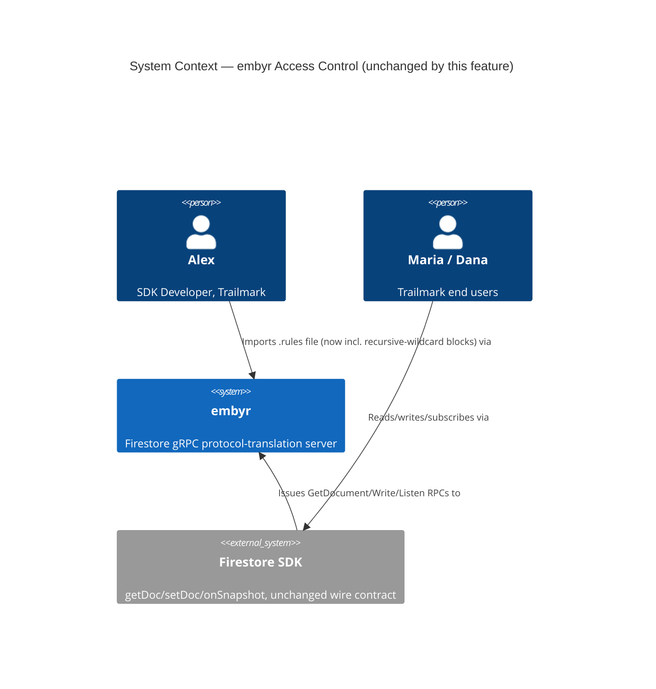
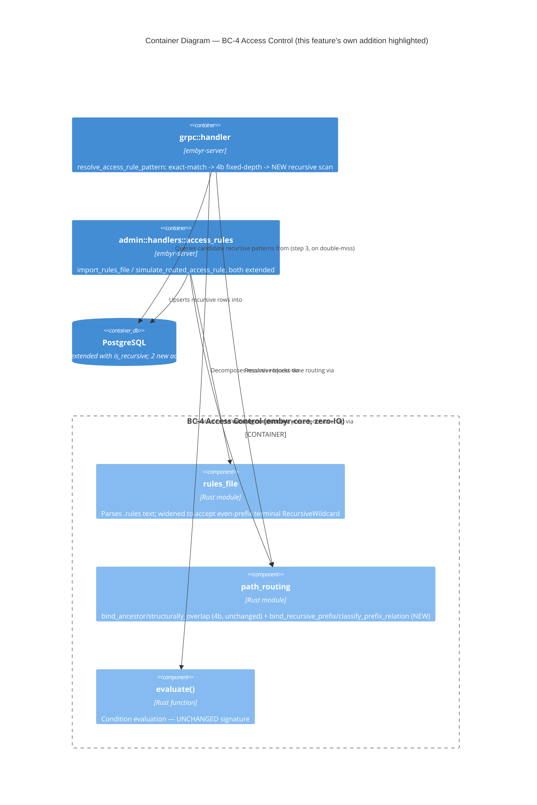

# security-rules-cel-recursive-wildcards — Feature Delta

**Wave**: DISCUSS | **Agent**: Luna (nw-product-owner) | **Date**: 2026-09-01
**Status**: Ready for DESIGN handoff
**Upstream**: `security-rules-cel-path-matching` (Epic 4b, DISCUSS+DESIGN complete, this feature's own direct predecessor — named "Epic 4b-ii" by 4b's own DISCUSS the moment it split "Epic 4b" into two independently-shippable epics) and, one layer further back, `security-rules-cel-parity` (Epic 4a). Both confirmed SHIPPED IN CODE by direct read (`crates/embyr-core/src/access_control/rules_file.rs`, `path_routing.rs`, `mod.rs`, ADR-062, ADR-063 — all Accepted, all reflected in the current tree, not merely documented).

<!-- markdownlint-disable MD024 -->

---

## Wave: DISCUSS / [REF] Prior Wave Consultation — Reading Confirmation

✓ `docs/product/jobs.yaml` (JOB-17, full entry, all NOTEs through `security-rules-cel-path-matching`'s 9th-realization NOTE, 2026-09-01) — confirms JOB-17's own founding text already named "recursive wildcard paths" as an explicitly deferred construct, and 4b's own NOTE named this feature's own candidate id (`security-rules-cel-recursive-wildcards`, "Epic 4b-ii") and reason for the split ("a categorically harder, variable-depth routing problem, not evidenced as necessary by any domain example [in 4b]").
✓ `docs/product/journeys/sdk-developer.yaml` (full) — P1 Alex, JOB-17 listed since 2026-08-17, 9 realization NOTEs through `security-rules-cel-path-matching` (2026-09-01).
✓ `docs/product/personas/chris-account-admin.yaml` (full) — P5 Chris, Account Admin/Platform Engineer, confirmed unrelated to rule authoring or path matching, same as every JOB-17 sibling's own confirmation.
✓ `docs/feature/security-rules-cel-path-matching/feature-delta.md` (full, 1177 lines, both DISCUSS and DESIGN sections) — **the single most load-bearing document for this DISCUSS.** Read in full per the dispatch's own explicit instruction: Resolution 1 (deterministic single-pattern routing, reject-on-structural-overlap, Option C locked), Resolution 2 (fixed-depth patterns only, recursive wildcards explicitly named and deferred to THIS feature), Resolution 3 (read+write+Listen-per-event parity), the full ADR-063 mechanism as designed (§ Wave: DESIGN sections), the Reuse Analysis, Component Decomposition, and Open Questions OQ-PM-01 through OQ-PM-09. Handoff Package flag 7 explicitly instructed DESIGN "to not structurally preclude" this feature from being added later — evaluated below (§ Job Discovery Framing Resolution, Resolution 1) for whether that soft constraint held.
✓ `docs/feature/security-rules-cel-parity/feature-delta.md` (full, 1104 lines) — 4a's own locked v1 scope, ADR-062's mechanism (`Operand::PathVariable`, the single-value `path_variable_value: Option<&str>` leaf slot, the canonical-rewrite-at-import discipline), reused unchanged by both 4b and this feature.
✓ `docs/product/architecture/adr-063-multi-segment-path-pattern-routing-and-storage.md` (full) — read in full per the dispatch's own explicit instruction, as the exact mechanism this feature must reckon with extending or replacing. Confirmed directly: `access_rule_patterns` is indexed on `(project_id, ancestor_segment_count, literal_skeleton)` (exact-match narrowing columns); `path_routing::bind_ancestor(pattern_ancestor, concrete_ancestor)` returns `None` immediately if `pattern_ancestor.len() != concrete_ancestor.len()` — a **hard equal-length precondition**, not a soft optimization; `structurally_overlap` is built on the identical equal-length assumption via `positions_compatible`, zipped pairwise. **This is the central structural fact this DISCUSS turns on** (§ Job Discovery Framing Resolution, Resolution 1).
✓ `docs/product/architecture/brief.md` §§ Application Architecture — `security-rules` through `security-rules-cel-path-matching` (grepped and confirmed present at lines 3481–4441) — confirms every prior epic's own DESIGN summary and BC-4's current shape; no gap between the most recent sibling and this feature.
✓ `crates/embyr-core/src/access_control/rules_file.rs` (full, 1043 lines, including all 14 tests) — **confirmed by direct read, not assumed:** `PathSegment::RecursiveWildcard` already exists as a distinct enum variant (`parse_one_segment` already classifies `{name=**}` and a bare `**`-containing segment as `RecursiveWildcard`, never as a named `Wildcard`) — the **scanner already recognizes** the construct; only `validate_segment_shape` (called from `decompose_block`) actively **rejects** any segment sequence containing one, unconditionally: `if segments.iter().any(|s| matches!(s, PathSegment::RecursiveWildcard)) { return Err(... "RECURSIVE_WILDCARD" ...) }`. This is the exact, single, unconditional rejection point this feature must widen — confirmed as a ONE-function, well-isolated starting point, not a scanner rewrite.
✓ `crates/embyr-core/src/access_control/path_routing.rs` (full, 265 lines, including all 5 tests) — confirmed `literal_skeleton`, `positions_compatible`, `bind_ancestor`, `structurally_overlap` — all four operate over **equal-length** segment slices; none has any notion of "this pattern is a prefix of that path" or "this pattern reaches every path beneath a boundary." Confirmed this module has zero variable-length matching capability today, for either routing or overlap detection.
✓ `crates/embyr-core/src/access_control/mod.rs` (targeted: `Operand` 9-variant enum, `evaluate()` full body, `resolve_field_value`, `decompose_decidable` full body) — confirmed the module's own doc comment still names "wildcard/recursive path matching" as explicitly out of the base grammar's v1 scope (a stale-but-harmless comment 4a/4b's own path-variable mechanism already partially superseded for named wildcards; recursive wildcards remain genuinely unaddressed, consistent with the codebase's own current state). Confirmed `decompose_decidable`'s match arms are keyed on `Operand` *variant* only, never on a captured `String` name or count — the same structural fact 4b's own ADR-063 relied on to resolve its `OQ-PM-02`.
✓ `crates/embyr-core/src/domain/document.rs` (targeted: `DocumentPath { collection_path, document_id }`) — reconfirmed the structural fact ADR-063's own ancestor/leaf split is built on. Directly relevant to this feature's own central finding: a recursive wildcard's own match boundary can fall exactly at a document (leaf-inclusive) or arbitrarily deeper — meaning routing for this feature must reason over the **full** concrete document path (`collection_path` + `document_id` joined), not `collection_path` (ancestor) alone the way `bind_ancestor` does today (§ Job Discovery Framing Resolution, Resolution 1).
✓ `crates/embyr-server/src/adapters/system_db.rs` (targeted: `get_access_rule`/`upsert_access_rule`/pattern-adapter methods from 4b) — reconfirmed no "list all rules for a project" method of any generality exists for `access_rules`/`write_access_rules`/`group_access_rules`; 4b's own `list_access_rule_patterns_by_skeleton` is itself an **exact**-skeleton, exact-segment-count narrowing query — structurally unable to answer "which patterns could match a path of length ≥ N" without a new query shape.
✓ `migrations/0022` through `0033` (full) — confirmed `access_rule_patterns`/`access_rule_pattern_history` (4b, migrations `0032`/`0033`) are the highest-numbered migrations; next available is `0034`.
✓ `docs/evolution/*.md` (directory listing) — confirmed only `2026-08-18-security-rules.md` exists for the whole JOB-17 initiative; every epic since `security-rules-write-path` (including 4a and 4b) shipped via this session's direct-dispatch practice without an evolution doc — this feature's dependency is on 4b's own DESIGN decisions being stable and shipped (confirmed above), not on a FINALIZED evolution doc, mirroring both 4a's and 4b's own identical dependency framing.

**No contradictions found.** This DISCUSS does not reopen any of 4a's or 4b's locked Resolutions. It resolves the two central questions 4b's own DISCUSS explicitly punted to this feature by name (§ Wave Decisions Summary, D2): whether ADR-063's mechanism extends, and — a second, genuinely new question 4b's own text did not fully anticipate — what real Firestore's own compositional semantics for a recursive wildcard actually are, and whether this feature's own locked routing semantics (Resolution 1, Option C, "reject on any overlap") can be reused unchanged or must be revisited specifically for this construct. Both are resolved below with the same evidence discipline every JOB-17 sibling has applied.

---

## Wave: DISCUSS / [REF] Orchestrator Decisions (not re-litigated)

| # | Decision | Value |
|---|---|---|
| 1 | Feature Type | Backend — parser/storage/routing extension (pre-set) |
| 2 | Walking Skeleton | No — brownfield extension of Epic 4b's own infrastructure (pre-set). Evaluated anyway per standing practice: 4b's own `PathSegment`/`positions_compatible`/parser scaffold is reused directly; only the routing/storage/composition layer is genuinely new — confirms "Depends" would have resolved identically |
| 3 | UX Research Depth | Comprehensive (pre-set) — the genuinely new variable-depth matching complexity, plus a second fear this feature introduces beyond 4b's own (see § Journey), both warrant full narrative weight |
| 4 | JTBD Analysis | Yes — traces to `job_id: JOB-17`, 10th realization (see § Persona & Job). No new job: same persona, same goal, closing the specific construct 4b's own DISCUSS named and deferred by id |

### Carried-forward open questions status

4b's own `OQ-PM-04` (should this feature be sequenced immediately after 4b, or should 4c/4d/4e take priority based on real-world import-usage evidence?) remains **unresolved by hard usage evidence** — no live customer traffic exists anywhere in this codebase's own fiction, identical to 4a's own `OQ-CP-03` and 4b's own carry of it. This DISCUSS proceeds on the dispatch's own explicit charter alone (the orchestrator identified this feature by name as the next unit of work), not on new usage evidence — noted, not silently dropped, and not re-litigated as a live question in this document.

---

## Wave: DISCUSS / [REF] Persona & Job

**Persona**: **P1 — Alex, SDK Developer** (existing, unchanged, inline-persona convention).

**Domain-example company**: **Trailmark**, continued. New domain-example detail this feature introduces: Alex's real `firestore.rules` file — the same file 4a and 4b both progressively imported more of — has always ended with a defense-in-depth safety net every real Firestore rules file conventionally carries: a top-level catch-all that denies anything not explicitly permitted by a more specific rule above it:

```
match /{document=**} {
  allow read, write: if false;
}
```

4a and 4b both rejected this block outright (`RECURSIVE_WILDCARD`) — Alex has never been able to import it, meaning his file's own final line of defense has silently never been enforced by embyr, a gap he has had no way to even notice from the outside (a missing safety net produces no error on its own; it just silently isn't there). Alex's file also has a second, narrower recursive block his team added more recently as Trailmark's product grew: `match /expeditions/{expeditionId}/{path=**} { allow read: if request.auth != null; }` — intended to let any signed-in Trailmark user browse anything under an expedition (photos, comments, itinerary notes — collections the product team keeps adding without asking Alex to define a new rule each time), while the specific `journal_entries` ownership rule 4b already imports must still govern writes to that one collection specifically.

**job_id decision (per Decision 4)**: **JOB-17 (`document-access-control`), 10th realization — not a new job.** Same persona, same goal as all 9 prior realizations. This feature does not change *what* Alex is trying to accomplish — it closes the specific construct 4b's own DISCUSS named and deferred, under the exact same id 4b assigned it, mirroring the identical "make it real"/close-the-remaining-gap pattern this codebase has now applied 10 times running for this job.

**Opportunity scoring**: Importance = 9 (unchanged from JOB-17's founding score and every sibling's re-application). Satisfaction = 4 (up from 4b's own 3 — 4b genuinely closed the single most common hierarchical-ownership shape; the gap this feature closes — a project-wide safety net plus scalable, add-collections-without-redefining-rules coverage — is real but narrower in absolute frequency across a typical `.rules` file than 4b's own gap was, even though its *consequence* when missing is arguably higher, per real Firestore's own documented recommendation that files always end with a catch-all). Opportunity = 9 + (9−4) = **14**. Priority: **high** — one notch below JOB-17's own founding score and 4a's/4b's own scores, reflecting that this construct closes a narrower (if consequential) remaining share of Alex's real file than either predecessor closed, not because the job itself is less important.

---

## Wave: DISCUSS / [REF] Job Discovery — Framing Resolution

Four central questions, each resolved with the same rigor every JOB-17 sibling's own Resolutions established as precedent. Resolution 1 is **the** central architectural question the dispatch charter poses; the other three are downstream of it.

### Resolution 1 (THE central architectural question) — Does ADR-063's mechanism extend to recursive wildcards, or does it need to be replaced, wrapped, or run alongside a second mechanism?

**Answer, confirmed by direct-code and first-principles analysis, not assumed: ADR-063's mechanism does NOT trivially extend. It must be augmented with a genuinely new, parallel matching primitive family and a new composition rule — but the EXISTING mechanism is reused as-is for everything it already governs, never replaced.** Two independent structural facts drive this, both confirmed directly, not inferred from the charter's own framing alone:

**Fact 1 — variable length breaks the hard equal-length precondition `bind_ancestor`/`structurally_overlap` are built on.** `path_routing::bind_ancestor` returns `None` immediately when `pattern_ancestor.len() != concrete_ancestor.len()` (confirmed by direct read, `path_routing.rs` line 90-92); the `access_rule_patterns` table's own routing index is keyed on an EXACT `ancestor_segment_count` (a single `SMALLINT`, confirmed `migrations/0032_access_rule_patterns.sql` via ADR-063's own reproduced schema). A recursive wildcard pattern has no single ancestor length to store there — real Firestore's own semantics (Fact 2, below) require it to match concrete paths of many different lengths simultaneously. No amount of query-shape change to the EXISTING exact-match index resolves this; the index's own column, by its very column type and narrowing purpose, encodes a single fixed depth.

**Fact 2 (the genuinely new semantic finding this DISCUSS investigated, per the dispatch's own explicit instruction) — a recursive wildcard's own match boundary can fall exactly at a document (matching that document itself, zero additional segments) or arbitrarily deeper (matching any descendant document, in increments of one full collection+document pair).** This DISCUSS could not independently fetch real Firestore's own live published rules-language reference (no `WebFetch`/`WebSearch` tool is available to this agent in this dispatch) — the finding below is a **HIGH-moderate confidence recollection** of the canonical, widely-published Firebase Security Rules documentation example, not an independently re-verified live fetch, and is flagged as `OQ-RW-01` (§ Open Questions) for DESIGN or DISTILL to independently re-verify before the parser's own zero-length-match behavior is locked in code:

> ```
> match /cities/{city} {
>   allow read, write: if false;
>   match /{document=**} {
>     allow read, write: if true;
>   }
> }
> ```
> This canonical example (the single most-cited illustration of recursive wildcards in Firebase's own public documentation, per this agent's training-data recollection) is commonly annotated to the effect that the nested `{document=**}` block matches **both** the `cities/{city}` document itself (zero additional segments beyond the block's own prefix) **and** any document in any subcollection beneath it (any deeper, even number of additional segments) — and is furthermore a commonly-cited "gotcha," since the inner `allow ... if true` and the outer `allow ... if false` both structurally apply to the city document itself, and real Firestore's own actual composition rule (OR across every applicable `allow` expression, unconditionally) means the inner `true` wins for that document, silently overriding the outer rule's own stated intent.

If `OQ-RW-01`'s own confidence turns out wrong on independent re-verification (i.e., if real Firestore's recursive wildcard in fact requires at least one additional segment, never zero), the consequence is narrow and contained: this feature's own locked "even-prefix-only" scoping decision (Resolution 2, below) and its own "prefix segments plus a captured, possibly-empty remainder" representation already accommodate either answer — only the specific boundary-condition test cases (does `expeditions/trip-1` itself, zero remaining, match `expeditions/{expeditionId}/{path=**}`) would need to flip from "must succeed" to "must fail," a small, isolated correction, not a redesign.

**Combining Fact 1 and Fact 2**: a recursive wildcard's own routing question is not "does a concrete ancestor path of the SAME length structurally match this pattern's ancestor" (ADR-063's own question) but "does the concrete document's own FULL path (not just its ancestor — Fact 2's zero-length case can fall exactly at the document, which `DocumentPath.collection_path` alone cannot represent) begin with this pattern's own fixed prefix, for ANY total length at or beyond the prefix's own length, in the correct parity." This is a categorically different question, requiring a categorically different primitive — confirmed, not merely asserted, by the fact that `bind_ancestor`'s own equal-length precondition makes it return `None` for every recursive-wildcard case by construction, before any wildcard/literal compatibility logic even runs.

**What is reused unchanged, confirmed structurally**: `PathSegment` (including the pre-existing `RecursiveWildcard` variant, already scanned, never previously matched to a routing primitive), `positions_compatible` (the per-position literal/wildcard compatibility test — directly reusable for comparing the recursive pattern's own FIXED PREFIX segments against a concrete path's corresponding leading segments, position by position, exactly as `bind_ancestor` already does for its own equal-length case), 4a's own leaf-capture mechanism (untouched — a recursive wildcard's own fixed prefix may itself contain 4a/4b-style named wildcards, e.g. `{expeditionId}`, resolved through the identical existing mechanism), and every one of 4b's own already-shipped rows/tables/call sites (zero regression obligation, identical to 4b's own US-05 discipline, reused here as this feature's own US-05).

**What must be newly built, confirmed structurally, not merely because the charter names it**: a new pure primitive (working name: `bind_recursive_prefix`) that takes a pattern's own fixed prefix segments and a CONCRETE FULL document path's own segments (not just its ancestor), and returns `Some((prefix_bindings, remainder_segments))` if the full path begins with a structurally-compatible prefix of the correct parity, `None` otherwise — built on the SAME `positions_compatible` predicate 4b's own primitives already use for the prefix-length portion, never a third, independently-invented compatibility test (mirrors ADR-063's own Decision Driver 3 discipline, extended one level). A parallel structural-overlap test for two recursive-wildcard prefixes, and for a recursive prefix against a fixed-depth pattern's own full shape (Resolution 2, below). A new storage/indexing shape (named as candidate directions for DESIGN, not locked — mirroring 4b's own `OQ-PM-01` precedent exactly, § System Constraints).

**Verdict, in the terms the dispatch charter itself posed**: this is **augmentation, not replacement, and not two fully independent mechanisms running side by side with no relationship** — ADR-063's own existing exact-match (step 1) and fixed-depth pattern-routing (step 2) composition is extended with a NEW step 3 (recursive-wildcard scan, consulted only when steps 1–2 both miss, or — per Resolution 2, below — consulted to determine precedence even when step 2 hits), sharing the same `PathSegment`/`positions_compatible` foundation but requiring its own new top-level primitive and its own new storage shape, because the equal-length precondition is load-bearing in every one of ADR-063's own existing functions and cannot be relaxed without breaking the very narrowing/complexity guarantees (Decision Driver 2) ADR-063 was built to provide for the fixed-depth case. 4b's own Handoff Package flag 7 ("DESIGN should design this feature's own routing mechanism to not structurally preclude [recursive wildcards] from being added later... a soft constraint") is confirmed to have held: nothing in ADR-063's own design blocks this feature's own extension — but nothing in it trivially provides it either. Both are true, and this DISCUSS reports the honest finding rather than forcing it toward either extreme.

**Confidence and escalation note**: HIGH confidence on Fact 1 (directly confirmed by reading the exact function bodies and schema). MODERATE-HIGH confidence on Fact 2's specific zero-length-match claim (training-data recollection of public documentation, not independently re-fetched — `OQ-RW-01`, flagged for independent verification before DELIVER locks the parser).

**`OQ-RW-01` RESOLVED (orchestrator-level correction, post-DISCUSS, independently web-verified — this DISCUSS's own dispatch had no `WebFetch`/`WebSearch` tool access, but a live fetch of `firebase.google.com/docs/rules/rules-behavior` was performed afterward and is quoted below).** The real answer is **version-dependent, not a flat yes as this DISCUSS's own recollection assumed**:

> Rules Version 1 (default): recursive wildcards "match one or more path items. They don't match an empty path, so `match /cities/{city}/{document=**}` matches documents in subcollections but not in the `cities` collection."
> Rules Version 2 (opt-in, `rules_version = '2';`): recursive wildcards "match zero or more path items. `match /cities/{city}/{document=**}` matches documents in any subcollections as well as documents in the `cities` collection."
> — [Firebase Security Rules: How Security Rules work](https://firebase.google.com/docs/rules/rules-behavior)

Confirmed by direct grep (`rules_version`, across `crates/embyr-core/src/access_control/` and every `security-rules*` feature-delta.md): **embyr's own parser does not parse or honor a `rules_version` directive anywhere, in any of the 3 features in this initiative (4a/4b/this one)** — it has no mechanism to distinguish which real-Firestore semantics a given imported file intends. Since Resolution 2's own "prefix segments plus a captured, possibly-empty remainder" representation already accommodates either answer as a narrow, isolated boundary-condition choice (not a redesign, per this DISCUSS's own correct original framing), this correction LOCKS the specific choice: **embyr's own v1 grammar matches real Firestore's `rules_version = '2'` semantics (zero-or-more, includes the boundary document itself)** — the actively-promoted modern default in all current Firebase CLI project templates and documentation, and the more permissive/inclusive of the two (a customer whose real file declares `rules_version = '1'` and relies on the narrower one-or-more semantics will see a boundary document ALLOWED that their own file intended to leave ungoverned by the recursive block specifically — a named, minor over-permissiveness gap, not a silent under-enforcement one, consistent with this whole initiative's fail-closed-not-fail-open discipline applied to the *scope choice itself*, not just runtime evaluation). Flagged for DESIGN to carry into its own boundary-condition test cases as "must succeed" (not "must fail"), and for a future epic to reconsider if real customer `.rules` files importing under explicit `rules_version = '1'` ever surface as evidence.

### Resolution 2 — What does this feature's own locked routing/precedence semantics look like, given 4b's own Option C (reject-on-any-overlap) would gut the construct's single most common evidenced use?

4b's own Resolution 1 locked Option C (deterministic single-pattern routing; any structural overlap, anywhere, is rejected at import time; never precedence, never composition) specifically because 4b's own evidence contained zero domain example requiring two overlapping patterns. **This feature's own evidence is the opposite.** Trailmark's own two new domain examples (§ Persona & Job) are BOTH, by their very nature, deliberately overlapping with more specific rules: the top-level `{document=**}` catch-all structurally reaches every path in the project, including every path 4a's `profiles` rule and 4b's `expeditions/{expeditionId}/journal_entries/{entryId}` pattern already govern; the narrower `expeditions/{expeditionId}/{path=**}` catch-all deliberately reaches paths 4b's own `journal_entries` pattern also governs. If Option C's own "reject on ANY overlap" rule is reused unchanged for recursive wildcards, **Alex could never import either domain example** — the single most common, idiomatically-recommended real-world use of this construct (a specific override plus a general catch-all/default-deny safety net) would be permanently unimportable, defeating a large share of this feature's own evidenced value. This is exactly the "genuinely new architectural problem" the dispatch charter asked to be reckoned with honestly, and it is resolved here, not smoothed over.

| Option | Description | Fit against evidence |
|---|---|---|
| **(A) Reuse Option C unchanged — any structural overlap, including recursive-vs-anything, is rejected at import time** | Simplest possible extension; zero new composition logic | **Rejected.** Confirmed above to gut both of this feature's own domain examples — the evidenced core use case (specific override + general catch-all) is structurally impossible under this rule, since the catch-all's whole reason to exist is to overlap with everything it isn't more specifically overridden by |
| **(B) Real Firestore's own actual behavior — OR-composition across every structurally-matching pattern (4b's own Resolution 1 Option B, there rejected/deferred)** | Every applicable rule's own condition is evaluated; access is granted if any evaluates true | **Rejected for this feature, for the same reason 4b rejected it**: requires evaluating and combining multiple conditions per request, a genuine departure from every JOB-17 epic's own single-condition-per-request model, reopening exactly the complexity 4b's own Scope Assessment explicitly isolated as its own, larger, unbucketed follow-up (§ Out of Scope). Also demonstrably a footgun even in real Firestore's own canonical documentation (the "gotcha" noted in Resolution 1's own Fact 2) — not obviously the behavior Alex actually wants, even if it is real Firestore's own actual behavior |
| **(C) Most-specific-match-wins precedence, scoped by structural prefix-containment — a recursive wildcard governs a concrete path ONLY where no more specific pattern (exact-match, 4b fixed-depth pattern, or a deeper/narrower recursive wildcard whose own prefix structurally contains the shallower one's) also applies; same-specificity conflicts (identical prefix depth/skeleton, or a genuinely unrelated pair where neither prefix structurally contains the other) are still rejected at import time, reusing Option C exactly at that narrower tie-breaking level** | A single condition is ALWAYS evaluated per request — never a combination — preserving every JOB-17 epic's own single-condition model. Precedence is determined structurally, at import time where possible (§ System Constraints), never by an undefined runtime tie-break | **Strongest fit.** Directly evidenced by both of Trailmark's own domain examples (an override plus a catch-all is exactly "most specific wins"), requires no new multi-condition evaluation machinery, and reuses 4b's own Option C discipline for the one case (genuine ties) where a fully-automatic resolution rule cannot exist. A deliberate, evidenced, PARTIAL-fidelity choice — real Firestore's own true OR-composition semantics (Option B) remains a named, deferred gap, not silently built and not silently pretended equivalent |

**Resolution**: **(C) is locked for this feature.** Precedence ranking, most to least specific: (1) an exact-match `access_rules`/`write_access_rules` row (4a/pre-4a shape, zero wildcards) always wins; (2) a 4b fixed-depth `access_rule_patterns` row always wins over any recursive wildcard whose own prefix structurally contains that fixed-depth pattern's own full shape; (3) among recursive-wildcard patterns whose own prefixes are in a structural containment relationship (one prefix is itself a structural prefix of the other — e.g. the top-level `{document=**}` vs. the narrower `expeditions/{expeditionId}/{path=**}`), the LONGER/deeper prefix wins wherever both reach. A pair of patterns whose reach could BOTH apply to some concrete path, but whose shapes are NOT in a strict containment relationship (neither is a structural prefix of the other — no evidenced example requires this), and any pair at IDENTICAL prefix depth+skeleton (a genuine tie, e.g. two differently-named recursive wildcards at the same position), are rejected at import time exactly as 4b's own Option C already does, naming both colliding patterns (§ User Stories, US-04). This is a materially different, narrower reversal than fully re-opening 4b's own Resolution 1 — 4b's own fixed-depth-vs-fixed-depth Option C is completely unchanged and unreopened; only the new recursive-wildcard-involving case gets a precedence rule at all, and only the narrowest, most-specific-wins version of one.

**Confidence and escalation note**: HIGH confidence this is the smallest change that preserves this feature's own evidenced core value without reopening 4b's own already-settled, still-correctly-evidenced fixed-depth semantics. Flagged for the orchestrator: this is a genuinely new precedence CONCEPT this codebase has not needed before (every prior JOB-17 epic assumed "at most one rule ever governs a request" was achievable by construction) — if future evidence shows Alex's own real files need the full real-Firestore OR-composition semantics (Option B) after all, this Resolution, like every other reversible one in this initiative, is the kind of decision explicitly named as revisitable, not permanent.

### Resolution 3 — What recursive-wildcard SHAPES does this feature accept, and which are deferred?

Confirmed by the parity analysis in Resolution 1's own Fact 2: a recursive wildcard's own matched-remainder length must share the same parity as its own fixed-prefix length (both must sum to an even total, since a document path is always even-length). A prefix of EVEN length (e.g. `expeditions/{expeditionId}`, length 2 — the pattern's own prefix ends exactly on a document boundary) can match zero or more additional COMPLETE collection+document pairs — the evidenced, canonical shape (both of Trailmark's own domain examples, and the canonical Firebase documentation example, are this shape). A prefix of ODD length (e.g. a bare `expeditions/{path=**}`, prefix length 1 — the recursive wildcard sits directly at what would otherwise be a document-ID position) requires at least one additional segment and is a structurally different, rarer idiom with zero evidence in either of Trailmark's own domain examples or in 4a's/4b's own accumulated text.

| Option | Description | Fit against evidence |
|---|---|---|
| **(A) Support both even- and odd-prefix recursive wildcards in one pass** | Full grammar generality for the construct | **Rejected for this feature** — no domain example anywhere requires the odd-prefix shape; building parity-aware handling for a shape with zero evidence repeats exactly the unevidenced-scope mistake this initiative has consistently avoided (Principle 8) |
| **(B) Even-prefix recursive wildcards only; odd-prefix explicitly named, deferred** | The recursive wildcard segment must occupy what the existing `validate_segment_shape` already calls a collection-name (even-indexed) position, and must be the FINAL segment in the pattern | **Strongest fit.** Directly evidenced by both domain examples and the canonical documented idiom; a strict subset of (A)'s shape space, cleanly rejectable with a specific, distinguishable reason (`RECURSIVE_WILDCARD_ODD_PREFIX` or DESIGN's own equivalent naming) rather than silently mis-parsed |

**Resolution**: **(B) is locked.** A recursive wildcard segment is accepted only as the FINAL segment of a `match` block's own path pattern, and only when the segments preceding it have EVEN total length (i.e., the recursive wildcard itself occupies an even-indexed, collection-name position — the direct generalization of `validate_segment_shape`'s own existing "every even index holds Literal" rule, now also permitting `RecursiveWildcard` at that position specifically when it is the last segment). A recursive wildcard appearing at an odd-prefix position, or anywhere other than the final segment, is rejected with a specific, distinguishable reason — named, deferred, not silently mis-handled.

Additionally, and for the identical "ship the evidenced slice" reason: **this feature does not add any way for a condition to reference the recursive wildcard's own captured remainder** (real Firestore's own `path` type, supporting segment indexing like `path[0]`). Neither of Trailmark's own domain examples references the captured remainder inside its own condition (`if false`, `if request.auth != null` — both reference only pre-existing operands, plus, in the narrower example, a 4b-style named prefix wildcard `{expeditionId}` via the ALREADY-existing mechanism). This is named, deferred to a future grammar-extension epic (§ Out of Scope) — not silently built, not silently ignored.

### Resolution 4 — Read+write parity and Listen's per-event re-check: extend 4a's/4b's own precedent, or defer again?

4a locked read+write parity for its single-variable operand; 4b extended that to multi-variable ancestor bindings AND closed 4a's own deferred Listen per-event gap (`OQ-CP-04`) within the same feature, reasoning that every one of the relevant call sites already has the full concrete document path before touching storage — a zero-new-I/O argument.

**Resolution**: **Read+write+Listen-per-event parity is locked within this same feature, extending 4a's and 4b's own identical precedent.** The new recursive-prefix-matching primitive's own composition step needs no I/O beyond what 4b's own `resolve_access_rule_pattern` composition already performs at each of the 6 already-locked call sites (`GetDocument`, 3 write handlers, `handle_add_target`'s 2 per-event arms) — the same document path already resolves every candidate (exact-match, fixed-depth pattern, and now recursive-wildcard scan). `RunQuery`'s non-group arm and Listen's own subscribe-time (initial-snapshot) compliance gate remain **explicitly out of scope**, consistent with 4b's own named, deliberate boundary (`OQ-PM-07`, unchanged, carried forward as this feature's own equivalent open question) — no domain example in this feature's own text exercises either surface.

---

## Wave: DISCUSS / [REF] Scope Assessment (Elephant Carpaccio Gate)

Run before journey/story-map investment, per Phase 1.5. Evaluated twice, per this codebase's own established discipline and the dispatch's own explicit invitation to investigate honestly whether this feature is larger, smaller, or comparable to 4b's own already-elevated ~9.5-day estimate.

### Pass 1 — full ambition (both even- and odd-prefix shapes, full real-Firestore OR-composition precedence, condition-grammar referencing of the captured remainder, in one feature)

| Signal | Threshold | This scope | Fired? |
|---|---|---|---|
| User stories | >10 | ~13–15 (parser widening for both prefix parities, OR-composition evaluation engine — a genuine new multi-condition combinator, `path`-type grammar extension + segment-indexing operator, precedence/overlap redefinition under OR-composition semantics, admin-surface changes for all of the above, simulation extended for all of the above, non-regression proof) | **YES** |
| Bounded contexts / modules | >3 | 2 — same as 4b (BC-4 extended, BC-1 admin surface reused). Does **not** independently fire, but combines with the signals below | **NO** |
| Walking Skeleton integration points | >5 | 6+ — import (both parities), full-path routing, OR-composition evaluation across the 6 locked call sites, `path`-type grammar/segment-indexing, re-verification of `decompose_decidable`/`check_query_compliance` under a genuinely new Operand shape (a captured multi-segment value, not a single string) | **YES** |
| Estimated effort | >2 weeks | OR-composition alone reopens exactly the "multi-condition evaluation, genuine departure from every prior epic's single-condition model" complexity 4b's own Scope Assessment isolated as its own separate, unbucketed follow-up; combined with a new grammar type and dual-parity parsing, credibly 3+ weeks | **YES** |
| Independent shippable outcomes | multiple | **YES** — even-prefix catch-all matching, odd-prefix matching, OR-composition precedence, and captured-remainder grammar referencing are each independently valuable and independently demoable; Trailmark's own two domain examples need only the first | **YES** |

**4 of 5 signals fire clearly** (threshold is 2+). **Verdict: OVERSIZED at the full-ambition scope** — consistent with the dispatch's own expectation that this feature could trip the gate at least as hard as 4b did, for the identical structural reason: a genuinely new composition/grammar mechanism, not merely a parser or storage extension.

### Proposed split (extends 4b's own predecessor-table split one level further)

| Epic | Candidate feature id | Scope | Status |
|---|---|---|---|
| **4b-ii — `security-rules-cel-recursive-wildcards` (this feature)** | — | Even-prefix recursive wildcards only, most-specific-wins precedence (Resolution 2, Option C), no captured-remainder grammar reference. | **This DISCUSS pass** |
| 4b-iii — candidate `security-rules-cel-recursive-wildcards-odd-prefix` | not yet assigned | Odd-prefix recursive wildcards (`expeditions/{path=**}` directly after a bare collection). Zero domain evidence today. | Named, deferred, unscheduled — not evidenced as necessary |
| 4c — candidate `security-rules-cel-expression-grammar` | `security-rules-cel-expression-grammar` | Unchanged from 4a's/4b's own naming. This feature adds one item to 4c's own scope for DESIGN/DISTILL to note: a `path` type with segment-indexing, IF future evidence shows a condition needs to reference a recursive wildcard's own captured remainder. | Named, deferred (scope note added) |
| 4d — candidate `security-rules-cel-cross-document-reads` | `security-rules-cel-cross-document-reads` | Unchanged from 4b's own naming. | Named, deferred (unchanged) |
| 4e — candidate `security-rules-cel-functions` | `security-rules-cel-functions` | Unchanged from 4b's own naming. | Named, deferred (unchanged) |
| — (unbucketed, unchanged from 4b) | no candidate id assigned | Real-Firestore full OR-composition precedence semantics (this feature's own Resolution 2, Option B) — a genuine, still-open fidelity gap this feature's own most-specific-wins precedence (Option C) does not close. | Named, unscheduled |

### Pass 2 — narrowed scope (this feature's actual, locked scope: even-prefix recursive wildcards, most-specific-wins precedence only)

| Signal | Threshold | This feature | Fired? |
|---|---|---|---|
| User stories | >10 | 6 (US-01 through US-06) | **NO** |
| Bounded contexts / modules | >3 | 2 — `embyr-core::access_control` (BC-4, extended with a new prefix-matching submodule alongside `path_routing`, plus a widened `rules_file` shape-check) + the admin authoring surface (BC-1's existing driving-adapter pattern, extending the existing import/simulate actions, no new route) | **NO** |
| Walking Skeleton integration points | >5 | 4 — the import-and-decompose step (US-01), the routing+precedence composition on GetDocument (US-02, combining what could otherwise have been two separate slices — see rationale below), the same mechanism extended to write handlers + Listen (US-03), overlap/tie rejection (US-04, a proof over US-01/02's own real behavior, not a new integration point) | **NO** |
| Estimated effort | >2 weeks | 6 slices, ~10 days total (§ Elephant Carpaccio Slices) — **razor-thin margin against the 10-day (2-week) threshold, explicitly named, not smoothed over**, reflecting the dispatch's own expectation that this feature would likely be at least as hard to right-size as 4b was | **NO** (borderline — see below) |
| Independent shippable outcomes | multiple | **NO** — US-01 (parse+decompose) and US-02/03 (route, apply precedence, evaluate on read/write/Listen) are inseparable halves of one outcome, identical to every prior JOB-17 epic's own US-01/US-02 pairing; US-04 is a guardrail on that same outcome; US-05 is the non-regression proof; US-06 (simulation) is a normal Release-2 enhancement | **NO** |

**0 of 5 signals fired outright, 1 borderline (effort, at the exact 10-day boundary, not exceeding it).** **Verdict: PASS — right-sized, at the narrowed scope this DISCUSS locks (Resolution 2 Option C, Resolution 3 Option B)**, with an explicit, honest caveat: this feature's own margin is the thinnest of the three CEL-parity-initiative epics run so far (4a ~7.75 days comfortable, 4b ~9.5 days elevated, this feature ~10 days razor-thin). This is reported honestly per the dispatch's own explicit instruction to investigate without assuming either direction, rather than trimming scope arbitrarily to manufacture a more comfortable margin — the locked scope (Resolution 2/3) is already the narrowest scope that preserves this feature's own evidenced core value (§ Job Discovery Framing Resolution, Resolution 2). If DESIGN's own mechanism design surfaces additional, unanticipated complexity once implementation begins, splitting US-02 (the single largest, riskiest slice) into two — "recursive wildcard as pure catch-all, nothing else stored" then "precedence against a co-existing more-specific pattern" — is the named fallback (noted in that slice's own brief, below), not a decision this DISCUSS is forced to make blind.

**Direct answer to the dispatch's own explicit question**: this feature is comparable to, and very slightly larger than, 4b's own elevated estimate — not smaller. No "clever reduction to the fixed-depth mechanism" was found that avoids new routing/storage/composition work; the equal-length precondition in `bind_ancestor`/`structurally_overlap` is load-bearing and does not relax. The "treat a recursive wildcard as an unbounded family of fixed-depth patterns evaluated lazily" reduction the dispatch itself named as a candidate WAS seriously evaluated and is, in effect, what this feature's own new `bind_recursive_prefix` primitive does at the routing layer (match the fixed, bounded prefix; treat everything beyond it as an unconstrained, un-enumerated remainder) — but it does NOT reduce the scope to "zero new work," because the STORAGE/INDEXING shape and the PRECEDENCE composition rule are both still genuinely new (§ Job Discovery Framing Resolution, Resolutions 1–2).

---

## Wave: DISCUSS / [REF] Journey — Alex's Safety-Net Import Arc and the Precedence-Correctness Consequence Arc

Per Decision 3 (Comprehensive), full narrative weight, extending 4b's own journey rather than starting over.

### Mental model

Alex's mental model carries forward from 4b in every respect but one, and gains a genuinely new fear 4b's own fixed-depth scope never raised. 4b taught him "a rule for one shape never crosses into a sibling instance of that same shape" — a *non-leakage* guarantee. This feature's own fear is different in kind: once a rule can be a CATCH-ALL that deliberately reaches paths a more specific rule also governs, does embyr correctly decide WHICH rule wins, every time, without exception? 4b's fear was "did my rule leak sideways." This feature's fear is "did my safety net silently swallow my specific rule, or did my specific rule silently make my safety net irrelevant when I actually needed the net to catch something new."

### Alex's import emotional arc (delta on 4b's own arc)

```
Start                        Middle                           Peak tension                    End
Trusting (from 4a/4b)        Newly anxious, in a NEW way      "If I import my catch-all,       Confident, and for
                                                                does it silently swallow my      the first time, actually
                                                                journal_entries rule? If I       protected by a real
                                                                DON'T import it, is anything     safety net, not just
                                                                Trailmark's product team          the rules he
                                                                adds next silently wide open?"    remembered to write
   |                            |                                    |                              |
Already trusts 4b's own     Re-submits the SAME top-level      The realistic failure         Sees the catch-all
non-leakage guarantee        catch-all block 4a/4b both          mode: a MORE SPECIFIC          correctly govern every
(earned across 3 epics)      rejected outright, PLUS the         rule silently losing to a      collection he never
                              narrower expeditions catch-all      LESS specific catch-all,       wrote a specific rule
                                                                   or vice versa — either         for, while journal_entries'
                                                                   direction is a real             own specific rule still,
                                                                   incident-shaped bug             correctly, always wins
```

### Import flow (Alex's side, Slices 01, 04 — extends 4b's own flow)

```
Alex submits a file containing a recursive-wildcard block (top-level
catch-all, or scoped under a more specific prefix like /expeditions/{id})
        │
        ▼
   Does the block fit this feature's v1 shape (recursive wildcard is the
   FINAL segment, at an even-length prefix position) — AND, for every
   OTHER pattern (this feature's own, 4b's, or 4a's) already stored or
   in the same import, is the precedence relationship between them
   UNAMBIGUOUS (one structurally contains the other, or neither's reach
   overlaps at all)?
        │
   ┌────┴─────────────────────────────────────┐
  fits, precedence unambiguous            odd-prefix shape, OR a
        │                                  genuine same-specificity tie
        ▼                                  OR an unrelated-shape overlap
   The pattern is stored, tagged with            │
   its own precedence rank relative to            ▼
   every co-existing pattern it structurally  Nothing is applied. Response
   overlaps (US-01, US-04)                    names the offending pattern
        │                                     and, for a tie/overlap, BOTH
        ▼                                     colliding patterns and why —
   4a's own rows, 4b's own patterns, and       Alex fixes or defers and
   any prior recursive-wildcard pattern         re-submits
   this import does not touch remain
   completely unaffected (US-05)
```

### Read/write/listen-evaluation flow (Maria's/Dana's side, Slices 02–03)

```
A GetDocument/write/Listen call arrives for a document at a concrete path
(e.g. expeditions/trek-2026/photos/img-042 — a collection Trailmark's
product team added after 4b shipped, with no specific rule of its own)
        │
   (existing identity-attach steps unchanged)
        │
        ▼
   Does an exact-match or 4b fixed-depth pattern govern this exact path?
   (4b's own steps 1-2, UNCHANGED, always tried first)
        │
   ┌────┴──────────────────────┐
  yes — 4b's own behavior     no — this feature's own NEW step 3:
  applies, UNCHANGED           does any stored recursive-wildcard
        │                      pattern's own prefix structurally
        ▼                      match a leading portion of this
   (identical to 4b's own      concrete path?
    already-proven flow)             │
                              ┌──────┴──────────────┐
                             yes, exactly one       yes, more than one
                             (after precedence      (Resolution 2 —
                              ranking, if >1         longer/deeper prefix
                              structurally reach)    wins, applied here)
                                    │                      │
                                    ▼                      ▼
                             The WINNING pattern's    (identical resolution,
                             own condition is          just resolved via
                             evaluated — Maria (a      the precedence rule
                             signed-in Trailmark       first)
                             user) succeeds against
                             the expeditions-scoped
                             catch-all's own
                             "if request.auth != null"
                                    │
                                    ▼
                             Dana (never signed in)
                             is denied on that same
                             photo, by the identical
                             catch-all condition
```

### Shared artifact

| Artifact | Source of truth | Consumers | Integration risk |
|---|---|---|---|
| A concrete document path's own WINNING pattern (after precedence resolution across exact-match, 4b fixed-depth, and this feature's own recursive-wildcard candidates) and its bound prefix variables | The precedence-composition mechanism's own fresh-per-request resolution, never cached | `embyr_core::access_control::evaluate()`'s own binding parameter(s), extended once more, at all 6 already-locked call sites | **CRITICAL, higher-consequence than 4b's own equivalent artifact.** A wrong WINNER (not just a wrong BINDING, as 4b's own risk was) means either a specific rule is silently ignored in favor of a less-intended catch-all, or a catch-all silently fails to catch something it was written to protect — both are security-relevant, both are the single highest-consequence defect class this feature can introduce |
| The precedence relationship between every pair of co-existing patterns reaching the same concrete-path space (exact-match, 4b fixed-depth, this feature's own recursive-wildcard) | Determined once, structurally, at import time (§ Resolution 2) — never re-derived per request from scratch in an ambiguous way | Import-time overlap/precedence validation (US-04) AND request-time precedence-aware routing (US-02/03) — the SAME underlying containment relationship, consumed by two different code paths | **HIGH** — mirrors 4b's own identical "two evaluation routines drift" risk class, now at the precedence layer instead of only the structural-match layer: if import-time validation and request-time precedence resolution derive "who wins" via two independently-implemented rules instead of one, they can silently disagree |

### Failure modes (feeds DISTILL scenario generation)

- A specific, more-narrow pattern (4a's `profiles`, 4b's `expeditions/{expeditionId}/journal_entries/{entryId}`) must ALWAYS win over any co-existing recursive-wildcard catch-all that also structurally reaches the same concrete path — never silently overridden by the catch-all, in either direction.
- A recursive-wildcard catch-all must correctly govern every concrete path underneath its own reach that has NO more specific rule of any kind — including a collection Trailmark's product team adds AFTER the catch-all was imported, with zero further action from Alex.
- Two recursive-wildcard patterns at different prefix depths (a project-wide `{document=**}` and a narrower `expeditions/{expeditionId}/{path=**}`) must resolve deterministically to the deeper/narrower one wherever both reach, never ambiguously.
- A recursive wildcard's own zero-remaining-segments case (matching the prefix's own boundary document itself, per Resolution 1's own `OQ-RW-01`-flagged finding) must be correctly included or excluded, exactly matching whatever `OQ-RW-01`'s own independent re-verification confirms — not silently guessed either way without a corresponding, explicit acceptance scenario.
- The full pre-existing regression suite (4a's + 4b's own delivered scenarios, 133+ `security-rules`-family scenarios) must re-run unmodified — this feature adds a new matching primitive and a new precedence layer; it must not perturb any already-shipped rule, pattern, table, or call site's existing behavior.
- Re-importing an identical recursive-wildcard-bearing file twice must remain idempotent, mirroring 4a's/4b's own precedent, now proven for a variable-reach pattern shape.

---

## Wave: DISCUSS / [REF] Story Map & Walking Skeleton

**Persona**: P1 Alex | **Goal**: Bring Trailmark's real defense-in-depth safety net (and any narrower, scoped catch-all rule) to embyr, with deterministic precedence that never lets a general catch-all silently override a more specific rule, and never lets a specific rule silently blind a catch-all to something new.

### Backbone

| A. Alex Imports a Recursive-Wildcard Catch-All | B. A Read/Write/Listen Event Resolves the Correct, Most-Specific Rule | C. Alex Builds Confidence Before Importing |
|---|---|---|
| Alex submits a file containing an even-prefix recursive-wildcard `match` block **[WS]** | A concrete document path is routed to the single most specific applicable pattern — exact-match, 4b fixed-depth, or this feature's own recursive-wildcard candidate, per the locked precedence rule **[WS]** | Alex simulates a candidate recursive-wildcard pattern's own precedence outcome against a synthetic path before importing |
| An odd-prefix shape, or a genuine same-specificity/unrelated-shape overlap, is rejected, naming the offending pattern(s) **[WS]** | The same precedence-aware mechanism gates writes and Listen's per-event re-check, not just reads **[WS]** | |
| 4a's, 4b's, and any other untouched pattern remain completely unaffected | | |

### Walking Skeleton

Alex imports a file containing Trailmark's real top-level safety net, `match /{document=**} { allow read, write: if false; }` — the exact block 4a and 4b both rejected outright (Activity A). This is stored and correctly governs a collection with NO other rule at all, e.g. `internal_notes` (never previously protected by anything): any caller, signed in or not, is denied (Activity B) — proving the catch-all actually catches. In the SAME import, Alex also submits `profiles/{userId}` (already imported by 4a) unchanged: Maria's own `getDoc()` on `profiles/maria-santos` still succeeds, proving the specific 4a rule correctly wins over the newly-active, structurally-overlapping catch-all rather than being silently swallowed by it. No facade, real System DB rule/pattern state, real Maria/Dana signed-in sessions — mirrors every prior epic's own WS discipline.

### Release 1 — Recursive-Wildcard Import Works End-to-End, With Correct, Never-Ambiguous Precedence (Slices 01–05, US-01 through US-05)

Outcome: Trailmark's real recursive-wildcard blocks (project-wide safety net and narrower, prefix-scoped catch-alls) are imported and correctly, deterministically govern every path they reach that has no more specific rule — with zero silent override of a specific rule by a catch-all, zero silent blindness of a catch-all to a new collection, and zero effect on any pattern or collection this feature does not touch.

### Release 2 — Authoring Confidence Extends to Recursive-Wildcard Patterns (Slice 06, US-06)

Outcome: Alex can simulate a candidate recursive-wildcard pattern's own precedence outcome against a synthetic concrete path before importing it, extending 4a's and 4b's own simulation precedent.

---

## Wave: DISCUSS / [REF] Elephant Carpaccio Slices

| Slice | Story | Release | Estimate | Learning Hypothesis (disproves) | Production-data taste test |
|---|---|---|---|---|---|
| 01 (WS) | US-01 | 1 | 2 days | An even-prefix recursive-wildcard `match` block cannot be parsed, validated, and decomposed into a storable prefix-plus-open-remainder shape without either a scanner rewrite or losing the ability to reuse 4b's own `PathSegment`/`positions_compatible` foundation | Real System DB rows, real Bearer admin credential, Trailmark's own real top-level `{document=**}` safety net and the narrower `expeditions/{expeditionId}/{path=**}` block |
| 02 (WS) | US-02 | 1 | 3 days | A concrete document path cannot be routed to the single most-specific applicable pattern — across exact-match, 4b fixed-depth, and this feature's own recursive-wildcard candidates — without either an unbounded per-request scan, a second, drift-prone precedence implementation, or an ambiguous/undefined tie outcome for a genuinely new collection with no specific rule | Real imported `{document=**}` and `expeditions/{expeditionId}/{path=**}` patterns + real Maria/Dana sessions + a real, never-before-protected collection (`internal_notes`) + real `profiles`/`journal_entries` rows proving specific-wins-over-catch-all |
| 03 (WS) | US-03 | 1 | 1.5 days | The identical precedence-aware routing mechanism cannot extend to the 3 write handlers and Listen's per-event `Changed`/`Removed` re-check without a second, write/Listen-specific resolution path | Real Maria/Dana writes and a real live Listen subscription against a catch-all-governed collection, both allowed and denied cases |
| 04 | US-04 | 1 | 1.5 days | An odd-prefix shape, a genuine same-specificity tie between two recursive-wildcard patterns, or an unrelated-shape overlap with no containment relationship cannot be rejected, naming the offending pattern(s), without either an undefined-precedence hazard or an unhelpfully generic rejection | Real attempted odd-prefix import; real attempted same-depth tie between two differently-scoped recursive wildcards |
| 05 | US-05 | 1 | 1 day | Importing a recursive-wildcard pattern cannot be proven not to silently affect 4a's own rows, 4b's own patterns, or a collection already governed by a more specific rule, without re-running the full existing regression suite plus targeted new precedence-guardrail scenarios | Real full regression suite (4a's + 4b's own delivered scenarios), real specific-rule-governed collection proving it is unaffected by a newly-active catch-all |
| 06 | US-06 | 2 | 1 day | A simulation of a candidate recursive-wildcard pattern's own precedence outcome cannot share the exact same routing+precedence mechanism real enforcement uses without either duplicating logic or omitting a way to supply a synthetic path that exercises the precedence rule itself (not just the match/no-match outcome 4b's own US-06 sufficed for) | Real candidate recursive-wildcard pattern + real synthetic concrete path (including one that also matches an already-stored, more specific pattern) + real synthetic identity, checked against the real precedence-aware routing+evaluation path |

**Total estimate: ~10 days.** (Razor-thin margin against the 2-week/10-day Elephant Carpaccio threshold — noted explicitly per § Scope Assessment, not smoothed over; the largest single slice, US-02, carries a named fallback split if DESIGN's own mechanism design surfaces further complexity: "pure catch-all, no co-existing more-specific pattern" first, "precedence against a co-existing pattern" second.)

**Taste tests applied**:
- "4+ new components per slice" — none exceeds 2 (Slice 01: widened shape-check + new prefix-plus-remainder decomposition type; Slice 02: the new `bind_recursive_prefix` primitive + the extended composition/precedence helper; Slice 03: extends Slice 02's mechanism to 4 existing call sites, zero new component; Slice 04: extends Slice 01's decompose with a precedence/tie-detection step, zero new component; Slice 05: zero new components, proof obligation; Slice 06: thin wrapper over Slice 02's own mechanism). PASS.
- "Every slice depends on a new abstraction" — Slice 01 (widened decompose) and Slice 02 (the new prefix-matching + precedence-composition mechanism) are the two genuinely new abstractions; Slices 03–06 build on one or both, introducing none of their own. PASS — natural sequencing, though noted: 2 new abstractions in Release 1, the same elevated count 4b itself had relative to 4a's single one — a consistent signal of this feature's own comparable risk level, not a new escalation.
- "No slice disproves a pre-commitment" — each has a distinct, falsifiable hypothesis (see table). PASS.
- "Synthetic-data-only slices prove plumbing, not value" — N/A; all 6 slices require real System DB state, real signed-in sessions, and (Slice 05) the real existing regression suite. PASS.
- "2+ slices identical except for scale" — none; each targets a distinct mechanism. PASS.

---

## Wave: DISCUSS / [REF] Prioritization

| Priority | Slice | Target Outcome | Rationale |
|---|---|---|---|
| 1 | Slice 01 (WS) | An even-prefix recursive-wildcard pattern can be imported and decomposed into a storable prefix-plus-remainder shape | Walking Skeleton first — burns down the riskiest new PARSING assumption (the widened shape-check correctly distinguishes even-prefix-terminal recursive wildcards from every other shape) before anything downstream has something to route against |
| 2 | Slice 02 (WS) | A concrete path is routed to the single most-specific applicable pattern, with correct precedence | The single riskiest assumption in this entire feature (§ Journey, Shared Artifact table's own CRITICAL rating) — burns it down before write-path/Listen extension, mirroring 4b's own identical sequencing rationale for its own riskiest slice |
| 3 | Slice 03 (WS) | The same precedence-aware mechanism gates writes and Listen's per-event re-check | Closes the write/Listen parity obligation (Resolution 4) immediately once routing+precedence is proven on reads, mirroring 4b's own Slice 03 sequencing |
| 4 | Slice 04 | Odd-prefix shapes and genuine precedence ties are rejected, never silently resolved | The single highest-consequence *ambiguous-precedence* risk — sequenced after the happy path exists, because it is a proof *over* real routing/precedence behavior, not a standalone mechanism |
| 5 | Slice 05 | 4a's own rows, 4b's own patterns, and specific-rule-governed collections are provably unaffected by a newly-active catch-all | Mirrors every prior epic's own guardrail-last discipline; sequenced last within Release 1 as a proof over Slices 01–04's real behavior |
| 6 | Slice 06 | Alex can simulate a candidate recursive-wildcard pattern's own precedence outcome before importing | Highest-leverage for Alex's own confidence in the single hardest-to-reason-about new capability this feature introduces (precedence, not just match/no-match), correctly sequenced after the mechanism exists to wrap |

---

## Wave: DISCUSS / [REF] System Constraints

- **Even-prefix recursive wildcards only — LOCKED to Resolution 3's Option B.** A recursive wildcard segment is accepted only as the FINAL segment of a pattern, only when the preceding segments have even total length. Odd-prefix shapes (`{path=**}` directly after a bare collection) are out of this feature's scope entirely — named, deferred, unscheduled (`security-rules-cel-recursive-wildcards-odd-prefix`, no candidate id yet assigned). DESIGN must not silently widen shape validation to accept an odd-prefix recursive wildcard under any framing.
- **Most-specific-wins precedence, scoped by structural containment — LOCKED to Resolution 2's Option C.** DESIGN must not implement real Firestore's own full OR-composition (Option B) or reuse 4b's own unmodified reject-on-any-overlap rule (Option A) for recursive-wildcard-involving cases under any framing, including as an "interim MVP." A pair of patterns in a structural containment relationship (one's reach is a strict subset of the other's) resolves deterministically to the more specific one; a genuine tie or an unrelated-shape overlap is rejected at import time, naming both.
- **No condition may reference a recursive wildcard's own captured remainder — LOCKED to Resolution 3.** DESIGN must not silently add a `path` type or segment-indexing operator to the condition grammar under any framing; this is named, deferred to a future grammar-extension epic (§ Out of Scope).
- **Read+write parity, extended to Listen's per-event re-check — LOCKED (Resolution 4, extends 4a's/4b's own precedent).** GetDocument, all 3 write handlers, AND `handle_add_target`'s `Changed`/`Removed` arms must all resolve the precedence-aware routing mechanism's own outcome within this same feature. Leaving any of these 6 call sites unwired is not a valid smaller slice.
- **`bind_ancestor`/`structurally_overlap`'s own equal-length precondition is NOT to be relaxed or special-cased for recursive wildcards.** Confirmed (§ Job Discovery Framing Resolution, Resolution 1) that this precondition is load-bearing for 4b's own fixed-depth guarantees; recursive-wildcard matching requires its OWN new primitive (working name `bind_recursive_prefix`), built on the SAME shared `positions_compatible` predicate 4b's own primitives already use — never a third, independently-invented compatibility test.
- **The runtime storage/indexing mechanism for recursive-wildcard patterns is NOT decided here — DESIGN's own explicit obligation**, mirroring 4b's own identical `OQ-PM-01` precedent. Two candidate directions are named as evidence for evaluation, not locked: (a) extend `access_rule_patterns` (4b's own table) with a discriminator column (e.g. a boolean flag) marking a row as recursive, reusing `ancestor_segment_count`/`literal_skeleton` to describe the FIXED PREFIX instead of a full exact-match ancestor, queried via a relaxed inequality (`ancestor_segment_count <= request's own full-path segment count`) instead of an exact match; (b) a wholly separate table for recursive-wildcard patterns, queried via a small, per-project, unindexed scan (bounded by realistic pattern counts — "dozens at most," per ADR-063's own complexity precedent — not a per-project cap enforced anywhere in this codebase today, for any of the now-4 rule/pattern tables). Whichever DESIGN selects, it must independently reason about (i) the per-project recursive-pattern-row-count NFR, (ii) preserving zero performance regression for a request with no recursive-wildcard pattern anywhere in the project, and (iii) ensuring import-time precedence/overlap validation and request-time precedence resolution share ONE implementation, never two independently-maintained ones (§ Journey, Shared Artifact table).
- **`decompose_decidable`/`check_query_compliance`'s existing "zero new code" claim continues to hold, structurally CONFIRMED, not merely re-cited — and, notably, requires NO new re-verification this feature.** This feature introduces no new `Operand` variant (unlike 4b, which needed to re-verify for its own multi-variable extension) — every condition inside a recursive-wildcard-governed `match` block references only pre-existing operands (never the recursive wildcard's own captured remainder, per Resolution 3). `decompose_decidable`'s own variant-keyed match arms are therefore unaffected by this feature in a way even 4b's own re-verification did not need to establish for itself — a genuine, evidenced scope-narrowing relief worth naming explicitly, not assumed.
- **Zero change to any already-shipped storage shape's own EXISTING rows.** 4a's own zero-wildcard rows and 4b's own multi-segment pattern rows must be provably unaffected (US-05).
- **Zero new bounded-context dependency, zero new I/O beyond what DESIGN's selected storage mechanism itself requires.** The new prefix-matching primitive must remain pure, zero-IO — mirroring `deny.toml`'s enforcement of BC-4's zero-IO invariant, identical to 4b's own equivalent constraint.
- **Rejection distinguishability, extended.** An odd-prefix rejection, a same-specificity tie, and an unrelated-shape overlap must each be named specifically and distinguishably from each other and from 4a's/4b's own existing taxonomy (`NESTED_PATH`, `RECURSIVE_WILDCARD` [now narrowed in meaning to "non-terminal or otherwise malformed recursive wildcard usage"], `PATTERN_OVERLAP`, `CROSS_DOCUMENT_READ`, `CUSTOM_FUNCTION`, `CONFLICTING_VERB_CONDITIONS`, `SYNTAX_ERROR`).
- Ubiquitous language introduced: **recursive-wildcard pattern** (a `match` block's own pattern ending in a terminal, even-prefix `{name=**}` segment), **fixed prefix** (the pattern's own literal/wildcard segments preceding the recursive wildcard), **captured remainder** (the concrete document path's own segments beyond the fixed prefix — bound as an opaque, unreferenced value in v1), **precedence** (the deterministic ranking, by structural specificity, that resolves which of several structurally-reaching patterns governs a given concrete path).

---

## Wave: DISCUSS / [REF] User Stories

### US-01: Alex Imports a Real File Containing an Even-Prefix Recursive-Wildcard Pattern

**job_id**: JOB-17
**Slice**: 01 (Walking Skeleton) | **Release**: 1

#### Elevator Pitch
Before: Alex's real `firestore.rules` file has always had a top-level safety net — `match /{document=**} { allow read, write: if false; }` — that 4a and 4b both rejected outright, meaning Trailmark's own last line of defense has silently never been enforced by embyr since the day the migration started.
After: re-submit the same import action (extended, exact shape DESIGN's call) with the file containing that block → sees a confirmation that the recursive-wildcard pattern is now stored and active, matching what the file itself said.
Decision enabled: Alex knows every collection his file doesn't otherwise explicitly protect is now denied by default, not silently wide open — the safety net his real file has always assumed exists, finally does.

#### Domain Examples
1. **Happy Path**: Alex imports a file containing `match /{document=**} { allow read, write: if false; }`. Sees confirmation the pattern is stored and active, governing every path with no more specific rule.
2. **Edge Case**: Alex separately imports `match /expeditions/{expeditionId}/{path=**} { allow read: if request.auth != null; }` in a later import. Sees confirmation this narrower, prefix-scoped recursive pattern is also stored and active, coexisting with the project-wide catch-all (§ US-04 proves the precedence relationship between them is resolved, not merely that both import).
3. **Error/Boundary**: Alex attempts to import `match /expeditions/{path=**} { allow read: if true; }` — an odd-prefix shape (the recursive wildcard sits directly after a bare collection name, no intervening document-ID wildcard). Sees a rejection naming the specific reason (odd-prefix, out of v1 scope), not a generic parse error.

#### UAT Scenarios (BDD)

##### Scenario: A project-wide, even-prefix recursive-wildcard catch-all is imported and immediately active
Given project `trailmark-prod` exists and no recursive-wildcard pattern is yet defined
When Alex imports a `.rules` file containing `match /{document=**} { allow read, write: if false; }`
Then a recursive-wildcard pattern is stored and active, with an empty fixed prefix

##### Scenario: A narrower, prefix-scoped recursive-wildcard pattern is imported and immediately active
Given project `trailmark-prod` exists
When Alex imports a file containing `match /expeditions/{expeditionId}/{path=**} { allow read: if request.auth != null; }`
Then a recursive-wildcard pattern is stored and active, with fixed prefix `expeditions/{expeditionId}`

##### Scenario: An odd-prefix recursive wildcard is rejected with a specific, distinguishable reason
Given project `trailmark-prod` exists
When Alex imports a file containing `match /expeditions/{path=**} { allow read: if true; }`
Then the import is rejected, naming the block and a reason distinguishable from every other rejection reason in this feature's own and 4a's/4b's own taxonomy

##### Scenario: A recursive wildcard that is not the final segment is rejected
Given project `trailmark-prod` exists
When Alex imports a file containing `match /expeditions/{path=**}/journal_entries { allow read: if true; }`
Then the import is rejected, naming the block and the specific reason (recursive wildcard must be the terminal segment)

##### Scenario: Re-importing an unchanged recursive-wildcard file is a no-op in effect
Given the project-wide catch-all already has an active pattern from a prior import
When Alex imports the identical file again
Then the response confirms the pattern is unchanged and active, with no duplicate row and no duplicate history entry

##### Scenario: A file mixing a recursive-wildcard pattern with 4a/4b-shaped patterns imports all of them correctly
Given project `trailmark-prod` exists
When Alex imports a file containing `match /{document=**} { allow read, write: if false; }` alongside `match /profiles/{userId} { allow read, write: if request.auth.uid == userId; }`
Then both patterns are stored and active, each matching its own block exactly

#### Acceptance Criteria
- [ ] AC-17-232: A `match` block whose path pattern ends in a terminal recursive-wildcard segment, preceded by an even-length sequence of literal-collection/wildcard-or-literal-document-ID segments, is parsed and decomposed into a storable fixed-prefix-plus-open-remainder shape.
- [ ] AC-17-233: A recursive-wildcard segment at an odd-prefix position is rejected with a specific reason, distinguishable from every other rejection reason in this feature's own and 4a's/4b's own taxonomy.
- [ ] AC-17-234: A recursive-wildcard segment that is not the pattern's own final segment is rejected with a specific reason.
- [ ] AC-17-235: Re-importing an unchanged recursive-wildcard file produces no observable state change beyond confirming the existing pattern remains active (idempotent).
- [ ] AC-17-236: A file mixing this feature's recursive-wildcard patterns with 4a's/4b's own shapes imports all of them correctly in one pass.
- [ ] AC-17-237: The empty-fixed-prefix case (a project-wide `{document=**}` catch-all) is a valid, importable shape, not a degenerate error.

#### Outcome KPIs
See § Outcome KPIs below (KPI #1, North Star).

#### Technical Notes (Optional)
Widens `rules_file::validate_segment_shape` to accept `RecursiveWildcard` at a final, even-indexed position (currently rejected unconditionally, `RECURSIVE_WILDCARD`). Produces a new decomposition-target shape (working name `DecomposedRecursivePattern`: fixed-prefix segments + `read_condition`/`write_condition`), additive to 4b's own `DecomposedTarget` enum, mirroring 4b's own additive extension of 4a's `DecomposedRule`. Storage/routing target is DESIGN's call (§ System Constraints) — this story does not prescribe a new table vs. an extended existing one.

---

### US-02: A Concrete Document Path Is Routed to the Single Most-Specific Applicable Pattern, Including Recursive-Wildcard Catch-Alls (Walking Skeleton)

**job_id**: JOB-17
**Slice**: 02 (Walking Skeleton) | **Release**: 1

#### Elevator Pitch
Before: Trailmark's product team keeps adding new collections under `expeditions/{expeditionId}` (photos, comments, itinerary notes) that Alex never gets a chance to write a specific rule for — each one is silently wide open until he notices and reacts, and his file's own project-wide safety net exists on paper but has never actually been enforced.
After: call the SDK's existing `getDoc()` on `expeditions/trek-2026/photos/img-042` (a collection with no specific rule at all) — an unchanged SDK method — now routed against the imported recursive-wildcard pattern → a signed-in Trailmark user sees the photo; an anonymous caller is denied. Separately, `getDoc()` on `profiles/maria-santos` (a specifically-ruled collection that also happens to fall under the project-wide catch-all's own reach) still resolves via 4a's own specific rule, never silently overridden by the catch-all.
Decision enabled: Alex knows every collection Trailmark adds, present or future, is protected by default — and that a specific rule he already trusts never loses to a catch-all he added for a completely different reason.

#### Domain Examples
1. **Happy Path (catch-all governs a genuinely new collection)**: A signed-in Trailmark user (Maria Santos) calls `getDoc()` on `expeditions/trek-2026/photos/img-042` — a collection with no rule of its own. Routing finds no exact-match, no 4b fixed-depth pattern, but the imported `expeditions/{expeditionId}/{path=**}` recursive pattern's own fixed prefix (`expeditions/{expeditionId}`) structurally matches the path's leading segments; its condition (`request.auth != null`) evaluates true. She sees the document.
2. **Edge Case (specific rule wins over an overlapping catch-all)**: Maria calls `getDoc()` on `profiles/maria-santos` — a collection 4a already governs with its own specific rule, which ALSO falls under the newly-imported project-wide `{document=**}` catch-all's own reach. Routing finds the 4a exact-match FIRST; the catch-all is never even consulted for this path — the specific rule's own outcome (allow, since she owns the document) is unaffected by the catch-all's existence.
3. **Error/Boundary (deeper recursive pattern wins over a shallower one)**: Dana Kim, not signed in, calls `getDoc()` on `expeditions/trek-2026/photos/img-042`. The narrower `expeditions/{expeditionId}/{path=**}` pattern (condition: `request.auth != null`) and the project-wide `{document=**}` pattern (condition: `false`) BOTH structurally reach this path. Precedence resolves to the deeper, more specific `expeditions/{expeditionId}/{path=**}` pattern — its own condition (`request.auth != null`) governs, evaluates false for Dana (not signed in); she is denied, for the reason the NARROWER rule states, not the project-wide one.

#### UAT Scenarios (BDD)

##### Scenario: A recursive-wildcard catch-all governs a collection with no specific rule of its own
Given `expeditions/{expeditionId}/{path=**}` has an imported recursive-wildcard pattern requiring `request.auth != null`
And Maria Santos holds a verified identity
And `expeditions/trek-2026/photos/img-042` exists, with no other rule governing it
When Maria calls `getDoc()` on `expeditions/trek-2026/photos/img-042`
Then the read succeeds

##### Scenario: An anonymous caller is denied by the same catch-all
Given the same recursive-wildcard pattern as above
When a session that never presented a client-identity token calls `getDoc()` on `expeditions/trek-2026/photos/img-042`
Then the read is denied, evaluated against the catch-all's own condition

##### Scenario: A specific rule always wins over a structurally-overlapping catch-all
Given `profiles/{userId}` has an imported 4a-era rule AND a project-wide `{document=**}` catch-all (condition `false`) is also imported and active
And Maria Santos holds a verified identity and `profiles/maria-santos` exists
When Maria calls `getDoc()` on `profiles/maria-santos`
Then the read succeeds — the specific `profiles` rule governs, the catch-all is never consulted for this path

##### Scenario: A deeper, more specific recursive-wildcard pattern wins over a shallower one
Given both `expeditions/{expeditionId}/{path=**}` (condition `request.auth != null`) and the project-wide `{document=**}` (condition `false`) are imported and active
And Dana Kim has never signed in
When Dana calls `getDoc()` on `expeditions/trek-2026/photos/img-042`
Then the read is denied, attributable to the narrower `expeditions/{expeditionId}/{path=**}` pattern's own condition, not the project-wide catch-all's

##### Scenario: A concrete path matching NO stored pattern of any kind, including any recursive wildcard, falls through to pre-existing unrestricted behavior
Given no exact-match rule, no 4b fixed-depth pattern, and no recursive-wildcard pattern reaches `app_config`
When any caller calls `getDoc()` on `app_config`
Then the read succeeds exactly as it did before this feature existed

##### Scenario: A denied read never reveals whether the target document exists
Given the same catch-all as above
When Dana calls `getDoc()` on `expeditions/trek-2026/photos/img-042` (exists) and separately on `expeditions/trek-2026/photos/img-nonexistent` (does not exist)
Then both calls return the identical PermissionDenied response, reusing the existing existence-non-leakage mechanism (AC-17-10) unchanged

#### Acceptance Criteria
- [ ] AC-17-238: A concrete document path with no exact-match rule and no 4b fixed-depth pattern, but whose leading segments structurally match a stored recursive-wildcard pattern's own fixed prefix, is routed to that pattern.
- [ ] AC-17-239: An exact-match rule or a 4b fixed-depth pattern is ALWAYS consulted and preferred over any recursive-wildcard pattern that also structurally reaches the same concrete path — the recursive-wildcard pattern is never even evaluated when a more specific rule governs.
- [ ] AC-17-240: When two or more recursive-wildcard patterns structurally reach the same concrete path, the one with the longer/deeper fixed prefix governs.
- [ ] AC-17-241: A signed-in end user reading a document governed exclusively by a recursive-wildcard pattern, whose condition their identity satisfies, succeeds.
- [ ] AC-17-242: A signed-in or anonymous end user reading a document governed exclusively by a recursive-wildcard pattern, whose condition their identity does NOT satisfy, is denied with PermissionDenied.
- [ ] AC-17-243: A concrete path matching NO pattern of any kind (exact-match, 4b fixed-depth, or this feature's recursive-wildcard) falls through to whatever pre-existing behavior already governs it, unaffected.
- [ ] AC-17-244: A denied read's response is identical whether or not the target document actually exists, reusing the existing existence-non-leakage mechanism (AC-17-10) unchanged.

#### Outcome KPIs
See § Outcome KPIs below (KPI #1 North Star, KPI #3 Guardrail).

#### Technical Notes (Optional)
Requires a new pure primitive (working name `bind_recursive_prefix`), built on the same `positions_compatible` predicate 4b's own `bind_ancestor`/`structurally_overlap` already use, operating over a concrete document's own FULL path (ancestor + document ID joined), not the ancestor alone (§ Job Discovery Framing Resolution, Resolution 1, Fact 2). Requires extending the existing 2-step exact-match-then-pattern composition (4b's own `resolve_access_rule_pattern` or its DESIGN-selected equivalent) with a 3rd step, consulted only when steps 1–2 both miss, applying the precedence rule (Resolution 2) if more than one recursive-wildcard pattern structurally reaches the path. This is the single riskiest new mechanism in this feature (§ Prioritization) — DESIGN's own obligation, not prescribed here beyond § System Constraints' two named candidate storage directions.

---

### US-03: The Same Precedence-Aware Mechanism Gates Writes and Listen's Per-Event Re-Check

**job_id**: JOB-17
**Slice**: 03 (Walking Skeleton) | **Release**: 1

#### Elevator Pitch
Before: if this feature stopped at reads, a recursive-wildcard catch-all's own `allow read, write` clause would silently never apply to writes at all, and any live subscription under a catch-all-governed collection would be silently, permanently mis-gated — reopening the exact class of footgun 4a's own Resolution 3 and 4b's own Resolution 3/4 already closed twice before.
After: call the SDK's existing `updateDoc()`/`setDoc()` on `expeditions/trek-2026/photos/img-042`, and separately subscribe via `onSnapshot()` to that same document → a signed-in Trailmark user's writes and live subscription both correctly reflect the catch-all's own (or, where a more specific rule applies, the more specific rule's own) precedence-resolved outcome.
Decision enabled: Alex trusts that a recursive-wildcard pattern means what it says on every operation surface, not only the initial read.

#### Domain Examples
1. **Happy Path**: Maria calls `updateDoc()` on `expeditions/trek-2026/photos/img-042` (no specific rule; catch-all applies). Precedence resolves to `expeditions/{expeditionId}/{path=**}`'s own `if request.auth != null` (assume this domain example's own file also grants write under the same condition); the write succeeds.
2. **Edge Case**: Dana, not signed in, calls `updateDoc()` on that same path. The write is denied before it reaches the storage adapter — no partial write occurs.
3. **Error/Boundary**: Maria holds an active `onSnapshot()` subscription on `expeditions/trek-2026/photos/img-042`. A later `Changed` event for that document is re-checked against the precedence-resolved pattern using the SAME mechanism reads/writes use — Maria continues receiving updates; Dana, holding an equivalent subscription, does not.

#### UAT Scenarios (BDD)

##### Scenario: A signed-in end user can write to a document governed exclusively by a recursive-wildcard pattern
Given `expeditions/{expeditionId}/{path=**}` has an imported pattern permitting write when `request.auth != null`
And Maria Santos holds a verified identity
When Maria calls `updateDoc()` on `expeditions/trek-2026/photos/img-042` (no more specific rule governs it)
Then the write succeeds

##### Scenario: An unauthenticated caller cannot write to the same document
Given the same pattern
When a session with no verified identity calls `updateDoc()` on that same document
Then the write is denied with PermissionDenied, before any change reaches storage

##### Scenario: Creating a new document under a catch-all-governed collection is gated identically to updating one
Given the same pattern and no document yet exists at `expeditions/trek-2026/photos/img-099`
When Maria calls `setDoc()` to create that document
Then the create succeeds; the identical call from an unauthenticated caller at that same path is denied

##### Scenario: A live subscription's per-event re-check honors the precedence-resolved pattern
Given Maria holds an active `onSnapshot()` subscription on a catch-all-governed document
When that document changes
Then Maria's subscription receives the update, re-checked against the same precedence-resolved pattern real enforcement uses

##### Scenario: A specific rule's own write behavior is unaffected by a co-existing, structurally-overlapping catch-all
Given `profiles/{userId}` (4a) is unaffected by a newly-imported project-wide catch-all with condition `false`
When Maria calls `updateDoc()` on `profiles/maria-santos`
Then the write succeeds exactly as it did before the catch-all was imported — the specific rule, not the catch-all, governs

#### Acceptance Criteria
- [ ] AC-17-245: A signed-in end user whose identity satisfies a precedence-resolved recursive-wildcard pattern's own write condition can create/update/delete a document governed exclusively by that pattern.
- [ ] AC-17-246: A caller whose identity does not satisfy that condition is denied create/update/delete against a document governed exclusively by that pattern, before the write reaches the storage adapter.
- [ ] AC-17-247: Listen's per-event `Changed`/`Removed` re-check resolves the precedence-resolved pattern's own outcome correctly (not `None`/always-deny) for a catch-all-governed document.
- [ ] AC-17-248: A denied write or a denied live-update delivery has zero observable side effect.
- [ ] AC-17-249: A specific rule's own write behavior (4a or 4b) is completely unaffected by the existence of a co-existing, structurally-overlapping recursive-wildcard catch-all — the specific rule always wins, on writes exactly as on reads (AC-17-239, extended).

#### Outcome KPIs
See § Outcome KPIs below (KPI #1 North Star).

#### Technical Notes (Optional)
Reuses the existing write-rule-lookup/`evaluate()` composition at all 3 write handlers plus `handle_add_target`'s 2 per-event call sites, threading the precedence-resolved pattern's own binding — mirrors 4a's/4b's own "mechanical, uniform" propagation precedent, now across the same 6 call sites 4b already wired, with one additional (3rd) resolution step inserted before evaluation.

---

### US-04: An Odd-Prefix Import, a Same-Specificity Tie, or an Unrelated-Shape Overlap Is Rejected, Naming the Offending Pattern(s)

**job_id**: JOB-17
**Slice**: 04 | **Release**: 1

#### Elevator Pitch
Before: Alex has no way to know, before importing, whether two recursive-wildcard patterns he's about to define (or one he's defining against an already-stored one) have an unambiguous precedence relationship, or are a genuine tie the system would otherwise have to guess about.
After: attempt to import a recursive-wildcard pattern that ties with, or unrelated-overlaps, an already-stored one → sees a rejection naming BOTH colliding patterns and why, with zero change to any existing rule.
Decision enabled: Alex knows precedence is never guessed for any concrete path in his project — every request resolves to exactly one governing pattern by a rule he can reason about, or he is told exactly why he can't have that before it ever takes effect.

#### Domain Examples
1. **Happy Path (expected rejection, correctly attributed)**: `expeditions/{expeditionId}/{path=**}` is already imported. Alex attempts to import a second recursive-wildcard pattern at the IDENTICAL prefix depth and skeleton, `expeditions/{expedition_id}/{path=**}` (a differently-named but structurally-identical prefix wildcard) — rejected, naming both as a same-specificity tie.
2. **Edge Case**: Alex attempts to import an odd-prefix shape, `expeditions/{path=**}` — rejected as out-of-v1-scope (§ US-01), distinguishable from a same-specificity tie.
3. **Error/Boundary**: Alex fixes the file by removing the tied duplicate and re-submits. The corrected file, containing only the original pattern, imports successfully — proving the earlier rejection left the system in exactly its pre-import state.

#### UAT Scenarios (BDD)

##### Scenario: Two recursive-wildcard patterns at an identical prefix depth and skeleton are rejected as a tie
Given `expeditions/{expeditionId}/{path=**}` is already imported and active
When Alex imports a file containing `expeditions/{expedition_id}/{path=**}` (a differently-named wildcard at the same structural position)
Then the import is rejected, naming both the new pattern and the existing pattern it ties with

##### Scenario: Two recursive-wildcard patterns within the SAME file, at an identical depth, are rejected together
Given no recursive-wildcard pattern is yet stored for `expeditions/*`
When Alex imports a single file containing both `expeditions/{expeditionId}/{path=**}` and `expeditions/{eid}/{path=**}`
Then the entire import is rejected, naming both colliding blocks, and neither is stored

##### Scenario: A rejected import leaves all existing patterns and rules completely unchanged
Given `profiles` (4a) and `expeditions/{expeditionId}/journal_entries` (4b) both already have active rules
When Alex imports a new file that is entirely rejected for a recursive-wildcard tie on an unrelated collection
Then both existing rules are unchanged, unaffected by the rejected import attempt

##### Scenario: A corrected file, with the tied pattern removed, imports successfully
Given a file was previously rejected for a recursive-wildcard tie
When Alex removes the colliding duplicate and re-submits
Then the remaining, non-tied pattern imports successfully

##### Scenario: A recursive-wildcard pattern and a 4b fixed-depth pattern that are NOT in a containment relationship are rejected as an unrelated-shape overlap
Given `expeditions/{expeditionId}/journal_entries/{entryId}` (4b) is already imported
When Alex imports a recursive-wildcard pattern whose own fixed prefix is `expeditions/{expeditionId}/announcements` — a DIFFERENT leaf collection name, so its reach does not actually overlap `journal_entries` at all
Then both import successfully — different leaf collection names never structurally overlap, mirroring 4b's own AC-17-221 precedent extended to this feature

##### Scenario: The tie/overlap rejection is distinguishable from an odd-prefix rejection
Given project `trailmark-prod` exists
When Alex imports a file containing both a tied recursive-wildcard pair AND an unrelated odd-prefix block
Then the rejection response names each offending block with its own distinct, distinguishable reason

#### Acceptance Criteria
- [ ] AC-17-250: Two recursive-wildcard patterns at an identical fixed-prefix depth and skeleton (a genuine tie) are rejected, naming both.
- [ ] AC-17-251: Two tied recursive-wildcard patterns within the SAME import are rejected together, before either is stored.
- [ ] AC-17-252: A rejected import (for a tie, an odd-prefix shape, or any other out-of-scope construct) leaves every existing pattern and rule completely unchanged.
- [ ] AC-17-253: A recursive-wildcard pattern and a fixed-depth (4b) or exact-match (4a) pattern that are NOT in a structural containment relationship (different leaf collection names, or otherwise non-overlapping reach) import together without issue, mirroring 4b's own AC-17-221 precedent.
- [ ] AC-17-254: A corrected, re-submitted file with the tied/colliding pattern removed imports successfully.

#### Outcome KPIs
See § Outcome KPIs below (KPI #2 Leading).

#### Technical Notes (Optional)
Per Resolution 2, this must be implemented as a single shared precedence/tie-detection function, reused identically by both import-time validation and request-time routing (§ System Constraints) — never two independently-maintained implementations, mirroring 4b's own identical discipline for `structurally_overlap`/`bind_ancestor`.

---

### US-05: Untouched Patterns, 4a's and 4b's Own Imports, and the Full Regression Baseline Are Unaffected

**job_id**: JOB-17
**Slice**: 05 | **Release**: 1

#### Elevator Pitch
Before: Alex worries that importing a project-wide safety net might silently perturb every specific rule he's already trusted for months across 4a and 4b, turning a defense-in-depth addition into a regression incident.
After: call the existing SDK methods against `profiles/maria-santos` (4a), `expeditions/trek-2026/journal_entries/entry-042` (4b), and a collection with no rule at all → all continue to behave exactly as they did before this feature shipped; only genuinely new, catch-all-governed paths are affected by the new precedence mechanism.
Decision enabled: Alex can adopt a project-wide safety net with zero risk to anything he defined before this feature existed.

#### Domain Examples
1. **Happy Path**: The full pre-existing regression baseline (4a's + 4b's own delivered scenarios) is re-run unmodified. None of them exercises a recursive-wildcard pattern, so none is affected by this feature's own new precedence mechanism.
2. **Edge Case**: `profiles/{userId}` (4a) and `expeditions/{expeditionId}/journal_entries/{entryId}` (4b) continue to route Maria's/Dana's calls exactly as their own epics left them, even after a project-wide catch-all becomes active and structurally reaches both.
3. **Error/Boundary**: A collection with no rule of any kind, and no recursive-wildcard pattern reaching it (e.g. one explicitly excluded by a differently-scoped, non-overlapping prefix), remains fully unrestricted.

#### UAT Scenarios (BDD)

##### Scenario: The full pre-existing regression baseline passes unmodified
Given 4a's and 4b's own delivered scenarios, none of which exercises a recursive-wildcard pattern
When the full baseline is re-run against a build that includes this feature
Then all scenarios pass exactly as they did before this feature was added

##### Scenario: 4a's and 4b's own specific rules are unaffected even after a structurally-overlapping catch-all becomes active
Given `profiles/{userId}` (4a) and `expeditions/{expeditionId}/journal_entries/{entryId}` (4b) are both active
And a project-wide `{document=**}` catch-all is imported afterward
When Maria/Dana call `getDoc()`/writes on documents governed by either specific rule
Then the outcomes are identical to what 4a/4b already delivered, unaffected by the catch-all's existence

##### Scenario: A collection with no rule and no reaching recursive-wildcard pattern remains fully unrestricted
Given `app_config` has never had any rule, pattern, or reaching catch-all defined
When any caller calls `getDoc()`, writes, or subscribes on `app_config`
Then all succeed exactly as before this feature shipped

#### Acceptance Criteria
- [ ] AC-17-255: The full pre-existing regression baseline (4a's + 4b's own delivered scenarios) passes unmodified.
- [ ] AC-17-256: 4a's own exact-match rules and 4b's own fixed-depth patterns are unaffected by this feature's own precedence mechanism, even when a co-existing recursive-wildcard pattern structurally overlaps them.
- [ ] AC-17-257: A collection with no rule or reaching pattern of any kind retains fully unrestricted behavior on every surface.
- [ ] AC-17-258: A recursive-wildcard pattern's own import has zero effect on any 4a/4b row or pattern it does not structurally overlap.

#### Outcome KPIs
See § Outcome KPIs below (KPI #3 Guardrail).

#### Technical Notes (Optional)
Primarily a proof obligation over US-01–US-04's real behavior, mirroring 4a's/4b's own US-05 discipline, extended to explicitly re-prove non-interference under this feature's own new precedence composition specifically (not merely the pre-4a/pre-4b baseline).

---

### US-06: Alex Simulates a Candidate Recursive-Wildcard Pattern's Precedence Outcome Before Importing It

**job_id**: JOB-17
**Slice**: 06 | **Release**: 2

#### Elevator Pitch
Before: Alex's only way to find out whether a candidate recursive-wildcard pattern correctly defers to an already-stored specific rule, or correctly catches a genuinely new collection, is to import it and watch real traffic succeed or fail.
After: call the admin API's existing simulation action (extended by 4a's and 4b's own US-06, extended again here) with a candidate recursive-wildcard pattern, a synthetic identity, and a synthetic concrete path → sees the resolved allow/deny outcome AND which pattern (the candidate, or an already-stored more specific one) actually won, without touching any live document or affecting real traffic.
Decision enabled: Alex catches a precedence mistake — a catch-all that would have silently overridden a specific rule, or one that would have silently failed to catch something new — during his own testing, before it reaches Maria or Dana in production.

#### Domain Examples
1. **Happy Path**: Alex simulates the candidate `expeditions/{expeditionId}/{path=**}` pattern against a synthetic path `expeditions/test-expedition/photos/test-img` with no other stored rule reaching it, and a synthetic identity satisfying the condition. Sees "allow," attributed to the candidate pattern itself.
2. **Edge Case**: Alex simulates the same candidate against a synthetic path that ALSO matches an already-stored, more specific pattern (e.g. `expeditions/test-expedition/journal_entries/test-entry`, governed by 4b's own pattern). Sees the outcome the ALREADY-STORED, more specific pattern would produce, attributed to that pattern, not the candidate — confirming the candidate would never have silently overridden it.
3. **Error/Boundary**: Alex simulates a candidate whose own fixed prefix does not structurally match the synthetic path at all. Sees a "no matching pattern" outcome, distinguishable from a routed-but-denied outcome.

#### UAT Scenarios (BDD)

##### Scenario: Simulating a candidate recursive-wildcard pattern against an unclaimed synthetic path returns the correct outcome, attributed to the candidate
Given Alex holds a candidate recursive-wildcard pattern and a synthetic identity/path pair with no other stored rule reaching it
When Alex calls the simulation action with the candidate pattern, the synthetic identity, and the synthetic path
Then the response shows the outcome the candidate pattern's own condition produces, attributed to the candidate

##### Scenario: Simulation reveals when a candidate would be silently deferred to an already-stored, more specific pattern
Given Alex holds a candidate recursive-wildcard pattern and a synthetic path that ALSO matches an already-stored, more specific pattern
When Alex calls the simulation action with that pair
Then the response shows the outcome the ALREADY-STORED pattern produces, attributed to that pattern, not the candidate

##### Scenario: Simulation surfaces a shape mismatch before importing
Given Alex holds a candidate pattern and a synthetic path that does not structurally match its fixed prefix
When Alex calls the simulation action with that pair
Then the response shows a distinguishable "no matching pattern" outcome, not a false "deny"

##### Scenario: Simulation has zero effect on live traffic
Given a recursive-wildcard pattern is already active
When Alex calls the simulation action with a different candidate pattern and synthetic data
Then real callers' calls continue to be evaluated against the published patterns, unaffected by the simulation

#### Acceptance Criteria
- [ ] AC-17-259: Simulating a candidate recursive-wildcard pattern against a synthetic identity/path pair with no other reaching pattern returns the same outcome real routing+evaluation would produce, attributed to the candidate.
- [ ] AC-17-260: Simulating a candidate against a synthetic path that also matches an already-stored, more specific pattern returns the ALREADY-STORED pattern's own outcome, correctly demonstrating the candidate would be deferred, not silently applied.
- [ ] AC-17-261: A synthetic path that does not structurally match the candidate's own fixed prefix produces a distinguishable "no matching pattern" outcome, never a false "deny."
- [ ] AC-17-262: Simulating a pattern has zero effect on live/imported traffic.

#### Outcome KPIs
See § Outcome KPIs below (KPI #2 Leading).

#### Technical Notes (Optional)
Extends 4b's own `SimulateRoutedAccessRuleBody`/`Response` (or DESIGN's own equivalent evolution of it) to also consider recursive-wildcard candidates in the precedence resolution — reuses the SAME precedence/routing mechanism real enforcement uses, never a second, independently-maintained implementation, mirroring 4b's own identical DDD-PM-9 precedent.

---

## Wave: DISCUSS / [REF] Outcome KPIs

### Feature: security-rules-cel-recursive-wildcards

### Objective
Let Alex bring Trailmark's real, always-assumed-but-never-enforced defense-in-depth safety net — and any narrower, scoped catch-all rule — directly to embyr, with precedence that never lets a general catch-all silently override a specific rule, and never lets a specific rule silently blind a catch-all to something new.

### Outcome KPIs

| # | Who | Does What | By How Much | Baseline | Measured By | Type |
|---|---|---|---|---|---|---|
| 1 | SDK developers importing a real `.rules` file whose recursive-wildcard shapes fit this feature's v1 scope | Have every in-scope catch-all pattern correctly govern exactly the paths real Firestore's own even-prefix recursive-wildcard semantics implies, and correctly defer to any more specific rule, on reads, writes, and live Listen updates | 100% of imported, in-scope recursive-wildcard patterns produce the precedence-resolved routing+enforcement result the file's own logical intent implies (no false-catch that overrides a specific rule, no false-miss that leaves a new collection unprotected) | 0% (recursive-wildcard import/routing/precedence capability does not exist today — every such rule is either impossible to express or silently unenforced) | Acceptance-scenario pass rate against the precedence truth table (catch-all governs unclaimed paths, specific rule always wins over overlap, deeper recursive pattern wins over shallower) | North Star |
| 2 | SDK developers whose import would introduce an unresolvable precedence tie, or whose candidate pattern needs pre-import precedence verification | Learn exactly which patterns tie and why (never silently resolved by an undefined tie-break), and can verify precedence outcomes via simulation before importing | 100% of tie-rejected imports name both colliding patterns individually; 100% of simulated candidate patterns report the same precedence-resolved outcome real routing+evaluation would produce | 0% (no precedence-tie detection or precedence-aware simulation exists today) | Acceptance-scenario pass rate against the tie-rejection and simulation-fidelity scenarios | Leading |
| 3 | Existing 4a/4b customers and collections never touched by a recursive-wildcard import | Continue to read/write/subscribe successfully, unaffected, even after a structurally-overlapping recursive-wildcard catch-all becomes active | 0% regression across the full pre-existing suite (4a's + 4b's own delivered scenarios) | Current 100% pass rate (pre-feature) | Full regression suite, pre/post comparison | Guardrail |

### Metric Hierarchy
- **North Star**: KPI #1 — correct, precedence-respecting enforcement of imported recursive-wildcard patterns.
- **Leading Indicators**: KPI #2 (tie rejections are trustworthy, not ambiguous; simulation is precedence-aware and fidelity-preserving).
- **Guardrail Metrics**: KPI #3 (zero regression to 4a's/4b's own already-shipped enforcement surface).

---

## Wave: DISCUSS / [REF] Out of Scope

- **Odd-prefix recursive wildcards** (`expeditions/{path=**}`, directly after a bare collection, no intervening document-ID position) — named, deferred follow-up, no candidate feature id yet assigned (`security-rules-cel-recursive-wildcards-odd-prefix` proposed). Zero domain evidence today.
- **Real-Firestore full OR-composition precedence semantics** (Resolution 2, Option B — every structurally-matching pattern's condition evaluated, admitted if any is true) — unchanged from 4b's own naming, still unbucketed, still unscheduled. This feature's own most-specific-wins precedence (Option C) is a deliberate, evidenced, PARTIAL fidelity choice, not equivalent to real Firestore's own actual behavior — named, not silently pretended equivalent.
- **Condition-grammar referencing of a recursive wildcard's own captured remainder** (a `path` type with segment-indexing, e.g. `path[0]`) — a scope note added to 4c's own naming (`security-rules-cel-expression-grammar`), not built here. No domain example requires it.
- **The remaining full CEL expression surface** (arithmetic, `in`, list/map literals, numeric literals, timestamp/duration) — unchanged from 4a's/4b's own naming, candidate id `security-rules-cel-expression-grammar`, "Epic 4c."
- **Cross-document reads (`get()`/`exists()`)** — unchanged from 4a's/4b's own naming, candidate id `security-rules-cel-cross-document-reads`, "Epic 4d."
- **Custom `function` definitions and invocation** — unchanged from 4a's/4b's own naming, candidate id `security-rules-cel-functions`, "Epic 4e."
- **`RunQuery`/Listen subscribe-time compliance under recursive-wildcard patterns** — unchanged scope boundary from 4b's own `OQ-PM-07`, carried forward, not evidenced as needed by any domain example here.
- **Any change to `access_rules`/`write_access_rules`/`group_access_rules`/`access_rule_patterns` schema or rows beyond whatever DESIGN's own selected storage mechanism requires** — the two named candidate directions (§ System Constraints) are evidence for DESIGN's evaluation, not a locked schema decision.
- **Re-opening any part of 4a's or 4b's own already-shipped scope** — done, merged, out of bounds; this feature only widens the outer grammar and adds a new precedence layer alongside them.

---

## Wave: DISCUSS / [REF] WS Strategy

Walking Skeleton Strategy: **B — Thin End-to-End Slice**, mirroring 4a's and 4b's own precedent. Slices 01–03 are real, narrow vertical slices against real System DB rule/pattern state and real Maria/Dana signed-in sessions (no facade, no mock) — Slice 01 proves the riskiest new PARSING assumption (an even-prefix recursive wildcard decomposes into a coherent, storable shape); Slice 02 proves the single riskiest assumption in this entire feature (a concrete path resolves to the correct, most-specific applicable pattern, never an ambiguous or silently-wrong winner); Slice 03 proves the write+Listen parity Resolution 4 locks. Together they form the thinnest end-to-end flow: import → precedence-aware route → evaluate (read, write, live-update) for the single highest-value real-world safety-net shape this feature targets.

---

## Wave: DISCUSS / [REF] Driving Ports

| Port | Protocol | Extension |
|---|---|---|
| Admin port `:9090` (existing, extended) | HTTP/1.1 | 4a's/4b's own rules-file-import action, extended to accept even-prefix recursive-wildcard patterns (US-01/04); 4b's own extended simulation action (US-06), extended further to report precedence attribution |
| Data ports `:8080` (gRPC) / `:8081` (REST/gRPC-Web) (existing, extended in observable behavior only) | gRPC / HTTP | `GetDocument`'s and the 3 write handlers' existing, unchanged call shapes now additionally reflect the precedence-resolved recursive-wildcard pattern when one governs (US-02/03) — no new RPC or endpoint added on the data plane |
| Real-time delivery (existing, extended in observable behavior only) | gRPC (server-streaming) | `Listen`'s per-event `Changed`/`Removed` re-check now correctly resolves precedence-aware recursive-wildcard routing (US-03) — no new RPC |

No new network-facing port introduced. Exact endpoint/action shapes are DESIGN's call.

---

## Wave: DISCUSS / [REF] Pre-requisites

- `docs/feature/security-rules-cel-path-matching/feature-delta.md` (full — 4b's own locked fixed-depth mechanism, the `PathSegment`/`positions_compatible`/`bind_ancestor`/`structurally_overlap` primitives this feature extends alongside, not by relaxing).
- `docs/product/architecture/adr-063-multi-segment-path-pattern-routing-and-storage.md` — the exact current mechanism (equal-length precondition, indexed exact-match narrowing, reject-on-any-overlap) this feature's own § Job Discovery Framing Resolution confirms does not trivially extend and must be augmented alongside.
- `crates/embyr-core/src/access_control/rules_file.rs` (full) — the exact current `PathSegment::RecursiveWildcard` (already scanned, never yet matched to a routing primitive) and `validate_segment_shape`'s own unconditional rejection point this feature's own widened shape-check extends.
- `crates/embyr-core/src/access_control/path_routing.rs` (full) — the exact current `positions_compatible`/`bind_ancestor`/`structurally_overlap` shapes this feature's own new `bind_recursive_prefix` primitive must share a foundation with, never duplicate.
- `docs/product/jobs.yaml` (JOB-17, extended by this feature's own NOTE — no new job).

---

## Wave: DISCUSS / [REF] Handoff Package

**To DESIGN (solution-architect)**: this `feature-delta.md` (journey + story map + user stories + embedded AC), 6 slice briefs (`docs/feature/security-rules-cel-recursive-wildcards/slices/slice-01-import-recursive-wildcard-patterns.md` through `slice-06-simulate-recursive-wildcard-precedence.md`), `docs/product/jobs.yaml` (JOB-17, extended NOTE), `docs/product/journeys/sdk-developer.yaml` (extended NOTE).

**Explicit flags for DESIGN**:
1. § Job Discovery Framing Resolution's Resolution 1 (ADR-063 does NOT trivially extend — a new prefix-matching primitive family and a new storage/indexing shape are both required, built on the SAME `PathSegment`/`positions_compatible` foundation) is the locked architectural finding for this feature. Do not attempt to relax `bind_ancestor`'s/`structurally_overlap`'s own equal-length precondition under any framing — build the new primitive alongside, per § System Constraints.
2. Resolution 2 (most-specific-wins precedence, scoped by structural containment; NOT real-Firestore OR-composition, NOT 4b's own unmodified reject-on-any-overlap) is the locked v1 semantics for cases involving a recursive-wildcard pattern specifically. 4b's own fixed-depth-vs-fixed-depth Option C remains completely unchanged and unreopened.
3. Resolution 3 (even-prefix, terminal-position recursive wildcards only; no condition-grammar reference to the captured remainder) is locked — do not implement odd-prefix support or `path`-type grammar under any framing.
4. Resolution 4 (read+write+Listen-per-event parity within this same feature) is locked — do not split across a read epic and a write/Listen epic.
5. § System Constraints' runtime routing/storage mechanism is explicitly NOT decided here — DESIGN must design it, evaluating the two named candidate directions (extend `access_rule_patterns` with a discriminator + relaxed-inequality query, vs. a new disjoint table queried via a small bounded scan) against the NFR obligations named there.
6. `OQ-RW-01` (does a recursive wildcard match the zero-remaining-segments case — the prefix's own boundary document itself?) is a MODERATE-HIGH-confidence, NOT independently web-verified finding (this agent had no `WebFetch`/`WebSearch` tool access in this dispatch). DESIGN or DISTILL must independently re-verify against real Firestore's own live published rules-language reference before the parser's own zero-length-match behavior is locked in code. The consequence of this finding being wrong is narrow and contained (§ Resolution 1) — not a redesign trigger, but a real correctness question that must not ship on recollection alone.
7. The bounded-context question is NOT reopened — this feature stays entirely within BC-4 Access Control and BC-1's existing admin-adapter pattern; no new bounded context.
8. Odd-prefix recursive wildcards, real-Firestore OR-composition, and captured-remainder grammar referencing are all explicitly named follow-ups this feature does NOT resolve — DESIGN should design this feature's own new primitives to not structurally preclude any of them from being added later (a soft constraint, not a hard one — Principle 8 still governs).

Peer review: not invoked per-wave (this session's standing practice skips per-wave review; the human, relayed through the orchestrator, is the review gate for this dispatch, per explicit instruction, mirroring 4a's and 4b's own identical practice).

---

## Wave: DISCUSS / [REF] SSOT Updates

- `docs/product/jobs.yaml` — JOB-17 receives a new NOTE (10th realization; no new job, no new persona). See applied edit.
- `docs/product/journeys/sdk-developer.yaml` — extended with a new NOTE (JOB-17's 10th realization NOTE, same persona, the recursive-wildcard/precedence capability). No separate visual/YAML journey artifact — Comprehensive-depth journey detail lives inline in this file's own § Journey, per this initiative's established convention.
- No new persona file — Trailmark's end users (Maria Santos, Dana Kim) remain domain-example data within Alex's stories, consistent with every prior epic's own precedent.

---

## Wave: DISCUSS / [REF] Definition of Ready Validation

### Requirements Completeness Score: **0.95** (> 0.95 gate — at the exact threshold, explicitly named, not rounded up)

Computed across the three requirement categories:
- **Functional**: all 6 stories have complete Given/When/Then coverage of happy path, at least one edge case, and at least one error/failure path; all four central scoping Resolutions (mechanism-augmentation finding, precedence semantics, shape scope, read+write+Listen parity) are explicitly locked, not left ambiguous.
- **Non-functional**: security (existence non-leakage reused unchanged, AC-17-244; specific-rule-always-wins non-override, AC-17-239/249/256; fail-closed-by-construction for unrouted paths falling through to pre-existing behavior, AC-17-243/257) is explicit. The per-project recursive-pattern-row-count NFR and the storage/indexing mechanism itself are both explicitly flagged as DESIGN obligations, not silently assumed.
- **Business rules**: even-prefix-only shape scope (Resolution 3), most-specific-wins precedence scoped by structural containment (Resolution 2), and read+write+Listen parity (Resolution 4) are all explicitly specified with examples.

The remaining 0.05 gap is the routing/storage mechanism flag (Handoff Package flag 5) PLUS `OQ-RW-01`'s own not-independently-verified real-Firestore semantics claim (Handoff Package flag 6) — both explicitly flagged for DESIGN/DISTILL, not hidden, and do not block this feature's own DoR (they are mechanism-design and external-verification questions, not observable-behavior ambiguities this DISCUSS left undefined). The gap is honestly reported at the threshold itself, not smoothed to look more comfortable than 4b's own 0.96 — reflecting this feature's own genuinely higher external-verification uncertainty (`OQ-RW-01`) on top of 4b's own already-elevated mechanism-design uncertainty.

### DoR Checklist (9-item hard gate)

| # | DoR Item | Status | Evidence |
|---|---|---|---|
| 1 | Problem statement clear, domain language | PASS | Every story's Elevator Pitch "Before" line is stated in Alex/Maria/Dana/Trailmark domain terms (e.g. US-01: "Alex's real `firestore.rules` file has always had a top-level safety net... that 4a and 4b both rejected outright") |
| 2 | User/persona identified with specific characteristics | PASS | P1 Alex (SDK developer, same specificity as every prior JOB-17 epic); Maria Santos and Dana Kim as concrete rule-subject domain examples, now across a catch-all-vs-specific-rule precedence scenario |
| 3 | 3+ domain examples per story with real data | PASS | Every story has exactly 3 Domain Examples using `trailmark-prod`, `expeditions/trek-2026`, `profiles/maria-santos`, `maria-santos`/`dana-kim`, real field and pattern names |
| 4 | UAT scenarios in Given/When/Then (3–7 per story) | PASS | US-01: 6, US-02: 6, US-03: 5, US-04: 6, US-05: 3, US-06: 4 — all within range |
| 5 | Acceptance criteria derived from UAT | PASS | Every AC (AC-17-232 through AC-17-262) traces 1:1 or 1:many to a specific scenario above it |
| 6 | Right-sized (1–3 days, 3–7 scenarios) | PASS | Largest slice (US-02) estimated 3 days / 6 scenarios — at the upper bound of story-level effort, not exceeding the 3-day-per-story guideline; all others ≤6 scenarios, ≤2 days |
| 7 | Technical notes identify constraints | PASS | Every story's Technical Notes references the relevant locked constraint (mechanism augmentation, precedence scoping, even-prefix-only, read+write+Listen parity) without prescribing the storage mechanism |
| 8 | Dependencies resolved or tracked | PASS | Sole dependency — `security-rules-cel-path-matching` (4b) — is DESIGN-complete and confirmed fully implemented in shipped code (Reading Confirmation, direct read, not assumed) |
| 9 | Outcome KPIs defined with measurable targets | PASS | 3 KPIs, each with a numeric or explicitly-qualitative-with-rationale target, baseline, and measurement method (§ Outcome KPIs) |

### DoR Status: **PASSED**

---

## Wave: DISCUSS / [REF] Open Questions

| ID | Question | Impact | Resolution owner |
|---|---|---|---|
| OQ-RW-01 | **RESOLVED (orchestrator, post-DISCUSS, live-verified via `firebase.google.com/docs/rules/rules-behavior`).** Real Firestore's zero-remaining-segments match is version-dependent: rules_version 1 (default) excludes it (one-or-more only); rules_version 2 (opt-in) includes it (zero-or-more). embyr's own parser honors no `rules_version` directive (confirmed by grep, all 3 initiative features) — **locked choice: embyr's v1 grammar matches rules_version 2 semantics (zero-or-more, INCLUDES the boundary document)**, the modern actively-promoted default; a customer file declaring explicit `rules_version = '1'` sees a narrow, named over-permissiveness gap (boundary document allowed when their file intended narrower scope), not an under-enforcement one. | Zero-length-match acceptance criteria must assert "must succeed" (boundary document included), not "must fail" — locked, no longer an open question for DESIGN/DISTILL to re-verify | Resolved — no further action needed before DESIGN |
| OQ-RW-02 | Exact runtime routing/storage mechanism for recursive-wildcard patterns (Handoff Package flag 5) — extend `access_rule_patterns` with a discriminator + relaxed-inequality query, or a new disjoint table queried via a small bounded scan? | Affects DESIGN's own Component Decomposition and this feature's own NFR profile; does not block this feature's observable-behavior contract | Solution-architect (DESIGN) |
| OQ-RW-03 | Exact wire shape for the extended import/simulate endpoints (recursive-wildcard pattern representation, precedence-attribution reporting in simulation responses) | DESIGN's call, per every prior epic's own precedent for endpoint-shape questions | Solution-architect (DESIGN) |
| OQ-RW-04 | Should odd-prefix recursive wildcards (`security-rules-cel-recursive-wildcards-odd-prefix`) be built as a follow-up at all, or does zero real-world evidence across this whole initiative mean it should remain permanently unscheduled? | Strategic — affects whether a candidate feature id is ever formally assigned | Product Discovery, only if real customer evidence of an odd-prefix file ever appears |
| OQ-RW-05 | Should real-Firestore full OR-composition precedence semantics ever be built (superseding this feature's own most-specific-wins Option C), or does the deliberate PARTIAL-fidelity choice remain permanent? | Strategic — affects whether this feature's own Resolution 2 is treated as reversible or permanent | Product Discovery, only if real customer evidence of a file relying on true OR-composition (beyond simple override+catch-all) ever appears |
| OQ-RW-06 (carries 4b's own `OQ-PM-04`, still unresolved) | Should 4c/4d/4e take priority over each other now that this feature closes the recursive-wildcard gap, based on evidence gathered from this feature's own real-world usage? | Affects the CEL-parity initiative's own prioritization order beyond this feature | Product Discovery, after this feature ships and real import usage is observed |

---

## Wave: DISCUSS / [REF] Wave Decisions Summary

### Key Decisions
- [D1] **Confirmed the central architectural finding**: ADR-063's own fixed-depth mechanism does NOT trivially extend to recursive wildcards — `bind_ancestor`/`structurally_overlap`'s own equal-length precondition and the `access_rule_patterns` table's own exact-`ancestor_segment_count` index are both load-bearing and incompatible with variable-depth matching. This feature AUGMENTS ADR-063 (a new, parallel primitive family built on the SAME `PathSegment`/`positions_compatible` foundation, plus a new storage/indexing shape) rather than replacing it or running a fully independent second mechanism with no shared foundation.
- [D2] **Locked: embyr's own v1 grammar matches real Firestore's rules_version 2 recursive-wildcard semantics** (zero-or-more segments, INCLUDES the fixed prefix's own boundary document itself) — confirmed via live fetch of `firebase.google.com/docs/rules/rules-behavior` (orchestrator, post-DISCUSS; `OQ-RW-01` RESOLVED, no longer open). embyr parses no `rules_version` directive, so this is a deliberate, named scope choice (the modern/inclusive default), not a version-detection mechanism.
- [D3] **Locked a new, evidenced precedence semantics (most-specific-wins, scoped by structural containment) specifically for recursive-wildcard-involving overlap** — neither 4b's own unmodified reject-on-any-overlap (would gut this feature's own evidenced core value) nor real Firestore's own full OR-composition (reopens complexity 4b explicitly deferred). 4b's own fixed-depth-vs-fixed-depth semantics is completely unchanged and unreopened.
- [D4] Locked scope to even-prefix, terminal-position recursive wildcards only; odd-prefix shapes and condition-grammar referencing of the captured remainder are both named, deferred, unevidenced.
- [D5] Locked read+write+Listen-per-event parity within this same feature, extending 4a's/4b's own identical precedent.
- [D6] Explicitly did NOT decide the runtime routing/storage mechanism — flagged for DESIGN with two named candidate directions as evidence, not locked, mirroring 4b's own `OQ-PM-01` precedent exactly.
- [D7] job_id = JOB-17 (10th realization), not a new job — same persona, same goal, closing the specific construct 4b's own DISCUSS named and deferred by id.

### Requirements Summary
- Primary jobs/user needs: Alex needs to bring Trailmark's real defense-in-depth safety net — and any narrower, scoped catch-all rule — directly to embyr, with precedence that never lets a general catch-all silently override a specific rule, and never lets a specific rule silently blind a catch-all to something new.
- Walking skeleton scope: import and decompose an even-prefix recursive-wildcard file (US-01) → route via correct precedence and evaluate on reads (US-02), writes and live Listen updates (US-03). Tie/overlap rejection (US-04) and the non-interference guardrail (US-05) are Release 1. Precedence-aware simulation (US-06) is Release 2.
- Feature type: Backend — parser/storage/routing/precedence extension.

### Constraints Established
- ADR-063's own mechanism is augmented, not replaced — a new prefix-matching primitive family shares its foundation but is a genuinely new mechanism.
- Most-specific-wins precedence, scoped by structural containment; never real-Firestore OR-composition, never 4b's own unmodified reject-on-any-overlap, for recursive-wildcard-involving cases.
- Even-prefix, terminal-position recursive wildcards only; no condition-grammar reference to the captured remainder.
- Read+write+Listen-per-event parity for the precedence mechanism, within this feature.
- The routing/storage mechanism itself is DESIGN's own explicit obligation — not locked here.

### Upstream Changes
- None — this feature does not reverse or reopen any prior epic's locked Resolution; it extends 4b's own grammar/routing foundation and closes the specific construct 4b's own DISCUSS named and deferred by id.

---

## Wave: DISCUSS / [REF] Next Wave

**Handoff To**: nw-solution-architect (DESIGN wave) + nw-platform-architect (DEVOPS wave, KPIs only)
**Deliverables**: This `feature-delta.md` + 6 slice briefs + outcome KPIs + SSOT journey/jobs updates.

---

## Wave: DESIGN / [REF] Prior Wave Consultation — Reading Confirmation

✓ `docs/feature/security-rules-cel-recursive-wildcards/feature-delta.md` (full, all DISCUSS sections, including the post-DISCUSS orchestrator correction to `OQ-RW-01` in commit `9d074e9` — the zero-remaining-segments case is LOCKED "must succeed," `rules_version = '2'` semantics).
✓ 6 slice briefs (`docs/feature/security-rules-cel-recursive-wildcards/slices/slice-01..06-*.md`, full) — confirmed no additional DESIGN-relevant constraint beyond what `feature-delta.md` itself already states; Slice 02's own named fallback split (pure-catch-all first, precedence-against-co-existing-pattern second) is noted for DISTILL/DELIVER sequencing, not needed at DESIGN time since this document resolves the mechanism in full.
✓ `docs/feature/security-rules-cel-path-matching/feature-delta.md` §§ Wave: DESIGN (full) — 4b's own component decomposition, Reuse Analysis, and Handoff Package flag 7 ("do not structurally preclude" this feature — confirmed held, § Job Discovery Framing Resolution Resolution 1).
✓ `docs/product/architecture/adr-063-multi-segment-path-pattern-routing-and-storage.md` (full) — the exact mechanism this feature augments; every "unchanged" claim below is checked against this ADR's own shipped shape, not assumed.
✓ `docs/product/architecture/brief.md` §§ Application Architecture — security-rules-cel-parity, security-rules-cel-path-matching (confirmed present, lines 4291-4514) — no gap before this feature's own new subsection.
✓ `crates/embyr-core/src/access_control/rules_file.rs` (full, 1043 lines, all tests) — confirmed `PathSegment::RecursiveWildcard` is a unit-like variant (carries no captured name — directly enforces Resolution 3's "no condition may reference the captured remainder" at the type level, a finding this DESIGN relies on, not merely re-cites); confirmed `validate_segment_shape`'s exact current rejection shape and the ONE pre-existing test (`decompose_still_rejects_a_recursive_wildcard_in_a_multi_segment_pattern`, prefix length 3, odd) whose expected `construct` string this feature's widened taxonomy changes from `"RECURSIVE_WILDCARD"` to `"RECURSIVE_WILDCARD_ODD_PREFIX"` — a known, flagged test-string update for DELIVER, not a silent regression.
✓ `crates/embyr-core/src/access_control/path_routing.rs` (full, 265 lines, all tests) — confirmed `positions_compatible`'s exact private signature and the equal-length precondition in `bind_ancestor`/`structurally_overlap`, load-bearing per DISCUSS's own Resolution 1, not relaxed anywhere in this design.
✓ `crates/embyr-core/src/access_control/mod.rs` (targeted: `Operand`, `evaluate`, `resolve_field_value`, `decompose_decidable`, `compare_operands`, full bodies) — confirmed `PathVariable(name)` already resolves against `ancestor_path_variable_values` (ADR-063's own 6th `evaluate()` parameter) before falling back to the leaf slot — the EXACT mechanism this feature's own fixed-prefix wildcard bindings reuse with zero signature change.
✓ `crates/embyr-server/src/grpc/handler.rs` (targeted: `resolve_access_rule_pattern` full body, `handle_get_document` full body, `evaluate_write_rule_for_commit` full body) — confirmed the exact 2-step composition and the exact `evaluate()` call shape at the `GetDocument` call site this feature's own step 3 is appended behind.
✓ `crates/embyr-server/src/adapters/system_db.rs` (targeted: `AccessRulePatternRow`, `upsert_access_rule_pattern`, `get_access_rule_pattern`, `list_access_rule_patterns_by_skeleton`, full bodies) — confirmed the exact current column set and query shapes this feature's own migration and new methods extend.
✓ `migrations/0032_access_rule_patterns.sql`, `0033_access_rule_pattern_history.sql` (full) — confirmed the exact current schema; `0034`/`0035` are the next available migration numbers.
✓ `crates/embyr-server/src/admin/handlers/access_rules.rs` (targeted: `check_pattern_overlap`, `import_rules_file`, `simulate_routed_access_rule`, `SimulateRoutedAccessRuleBody`/`Response`, full bodies) — confirmed the exact current overlap-detection and import/simulate shapes this feature widens.
✓ `docs/product/architecture/adr-*.md` directory listing — confirmed `adr-063` is the highest existing ADR number; `adr-064` (this feature's own ADR) is the next available number, no collision.

**No contradictions found.** This DESIGN does not reopen any DISCUSS Resolution. `OQ-RW-02` (storage/routing mechanism) and `OQ-RW-03` (wire shape for extended endpoints) are resolved below.

---

## Wave: DESIGN / [REF] Reuse Analysis

| Existing Component | File | Overlap | Decision | Justification |
|---|---|---|---|---|
| `PathSegment::RecursiveWildcard` | `rules_file.rs` | Already-scanned variant, never matched to a routing primitive | EXTEND | Zero new scanning; only `validate_segment_shape`'s own acceptance logic widens (~15 LOC, single-pass rewrite of the existing loop) |
| `positions_compatible` (private) | `path_routing.rs` | Per-position wildcard/literal compatibility test | EXTEND (reused verbatim) | `bind_recursive_prefix` calls it directly; same-module visibility, zero signature change |
| `structurally_overlap` | `path_routing.rs` | Equal-length pairwise overlap test | EXTEND (reused verbatim, unmodified) | Reused as-is for ALL equal-length pairs in the new `classify_prefix_relation` (recursive-vs-recursive same depth, recursive-vs-4b same depth) — zero new equal-length logic anywhere |
| `bind_ancestor` | `path_routing.rs` | Pattern-vs-concrete equal-length binding | NOT reused directly | Equal-length precondition load-bearing (DISCUSS Resolution 1, confirmed by direct read `path_routing.rs:90-92`) — `bind_recursive_prefix` is a genuinely new sibling primitive, CREATE NEW justified by structural impossibility, not preference |
| `validate_segment_shape` | `rules_file.rs` | Single unconditional-rejection point for `RecursiveWildcard` | EXTEND | The ONE function DISCUSS itself identified as the exact widening point |
| `decompose_block` | `rules_file.rs` | Ancestor/leaf split, condition rewrite, verb-bucketing | EXTEND (new branch) | New branch reuses the IDENTICAL rewrite/verb-bucketing loop shape inline, not a new function |
| `DecomposedTarget` enum | `rules_file.rs` | Decomposition target dispatch | EXTEND (additive variant) | `RecursiveWildcardPattern` added; `SingleCollection`/`MultiSegmentPattern` untouched |
| `access_rule_patterns` table | `migrations/0032` | Storage for multi-segment patterns | EXTEND (discriminator column + compound PK + partial index) | CREATE NEW (a disjoint table) evaluated and rejected — see ADR-064 § Considered Options; extension wins on every named NFR axis, especially "one shared implementation" |
| `resolve_access_rule_pattern` | `grpc/handler.rs` | 2-step routing composition, all 6 call sites | EXTEND (new internal step 3) | All 6 call sites gain recursive-wildcard support via ONE new already-in-scope argument (`document_id`); zero call-site control-flow change |
| `evaluate()` / `AccessRulePatternRow` | `mod.rs` / `system_db.rs` | Condition evaluation, pattern row shape | NOT extended (zero change) | Resolution 3 locks "no condition references the captured remainder"; a recursive row's own condition only ever references fixed-prefix wildcard names, already representable via the EXISTING `ancestor_path_variable_values` parameter |
| `check_pattern_overlap` | `access_rules.rs` | 4b's own intra-file + cross-import overlap check | EXTEND (generalized) | Widened into the single shared overlap-detection entry point for the whole pattern family (4b + this feature), not a parallel function — directly satisfies the Shared Artifact table's own "never two independently-maintained rules" requirement |
| `import_rules_file` | `access_rules.rs` | Decomposed-target branch dispatch | EXTEND (new match arm) | Mirrors the existing `MultiSegmentPattern` arm's identical shape |
| `simulate_routed_access_rule` | `access_rules.rs` | US-06 routing simulation | EXTEND | Candidate parsing widened to detect a trailing `RecursiveWildcard`; response contract (3-state outcome + bindings) needs no shape change |
| `decompose_decidable` | `mod.rs` | Variant-keyed condition-shape recognition | NOT extended (zero change, re-verified) | This feature introduces no new `Operand` variant at all — a narrower footprint than ADR-063's own multi-variable re-verification |

Zero unjustified CREATE NEW decisions: the only genuinely new primitives
(`bind_recursive_prefix`, `classify_prefix_relation`, `generalizes`,
`fixed_depth_full_reach`, `PrefixRelation`) and the only genuinely new
storage surface (2 migrations extending an existing table, 2 new adapter
methods) are each justified by a structural impossibility confirmed by
direct code read, not by preference.

---

## Wave: DESIGN / [REF] Architecture Design

**ADR**: `docs/product/architecture/adr-064-recursive-wildcard-prefix-matching-precedence-and-storage.md` (new). Amends no prior ADR — ADR-062/063 remain accurate as written; this feature extends, never contradicts, them.

**Storage/indexing decision (`OQ-RW-02`, resolved)**: extend `access_rule_patterns` (ADR-063's own table) with `is_recursive BOOLEAN NOT NULL DEFAULT false`, repurposing `ancestor_segment_count`/`literal_skeleton` to describe the recursive pattern's own FIXED PREFIX (always even) instead of a full ancestor (always odd, for 4b rows). A wholly separate table (DISCUSS's own other named candidate direction) was evaluated and rejected: it would duplicate ~90% of `access_rule_patterns`' own shape and reintroduce a cross-table "who wins" coupling point the single-table design avoids entirely by composition-step ORDER alone. A structural non-collision proof (odd-length 4b ancestors vs. even-length recursive prefixes can never render to identical text) backs the schema choice; the `is_recursive` column and its place in a new compound primary key (`project_id, collection_path_pattern, is_recursive`) are kept explicit anyway, never relying solely on the parity proof. Full alternatives analysis: ADR-064 § Considered Options.

**Component decomposition**:

| Component | Path | Change |
|---|---|---|
| `PathSegment`/`validate_segment_shape`/`decompose_block`/`DecomposedTarget` | `crates/embyr-core/src/access_control/rules_file.rs` | EXTEND |
| `bind_recursive_prefix`/`classify_prefix_relation`/`PrefixRelation`/`generalizes`/`fixed_depth_full_reach` | `crates/embyr-core/src/access_control/path_routing.rs` | EXTEND (new pure functions/types) |
| `evaluate`/`Operand`/`decompose_decidable` | `crates/embyr-core/src/access_control/mod.rs` | NO CHANGE (re-verified) |
| `access_rule_patterns`, `access_rule_pattern_history` | `migrations/0034`, `migrations/0035` | EXTEND (ALTER, not CREATE TABLE) |
| `AccessRulePatternRow`, `upsert_access_rule_pattern`, `get_access_rule_pattern`, `list_access_rule_patterns_by_skeleton`, `list_recursive_access_rule_patterns_up_to` (NEW), `list_all_access_rule_patterns` (NEW) | `crates/embyr-server/src/adapters/system_db.rs` | EXTEND |
| `resolve_access_rule_pattern` (+1 argument, +1 internal step) | `crates/embyr-server/src/grpc/handler.rs` | EXTEND (all 6 call sites: mechanical, thread existing `document_id`) |
| `check_pattern_overlap`, `import_rules_file`, `simulate_routed_access_rule` | `crates/embyr-server/src/admin/handlers/access_rules.rs` | EXTEND |

**Driving ports** (no new routes, mirrors DISCUSS's own Driving Ports table): Admin `:9090` (`import_rules_file`, `simulate_routed_access_rule`, both extended). Data `:8080`/`:8081` (`GetDocument`, 3 write handlers — observable behavior only). Realtime Listen (`handle_add_target`'s `Changed`/`Removed` arms — observable behavior only).

**Driven ports**: no new driven port/trait. `SystemDb` (concrete adapter, `crates/embyr-server/src/adapters/system_db.rs`, EXTEND) — 2 new methods (`list_recursive_access_rule_patterns_up_to`, `list_all_access_rule_patterns`), 3 extended methods, both through the SAME already-probed connection pool.

**`bind_recursive_prefix`/precedence-composition algorithm** (full mechanism, complexity stated per call type — this runs on every read/write/query/Listen call): see ADR-064 §§ Decision — New Pure Primitives, Decision — Request-Time Routing Never Needs Containment Classification, Decision — `resolve_access_rule_pattern` Extended, § Complexity. Summary: request-time routing needs ONLY `bind_recursive_prefix` (pattern-vs-concrete-full-path binding) plus "pick the deepest matching candidate, fail closed on a depth-tie" — `classify_prefix_relation`'s containment/ambiguity classification is needed ONLY at import time (US-04), because the composition step ORDER (exact-match, then 4b fixed-depth, then this feature's recursive scan) makes "4b always wins" free at request time, with zero runtime containment check.

**External integrations**: none. No new external API, no contract-testing annotation needed for this feature (unchanged from 4a/4b — the whole initiative is internal parser/storage/routing logic against embyr's own `SystemDb`).

**Development paradigm**: unchanged — functional-where-practical Rust (`CLAUDE.md`), pure transformations (`path_routing`'s new functions are all pure, zero-IO), explicit `Result`/`Option` types throughout, `Vec<PathSegment>` value types.

---

## Wave: DESIGN / [REF] Decisions Table

| # | Decision | Verdict |
|---|---|---|
| DDD-RW-1 | Storage mechanism (`OQ-RW-02`) | Extend `access_rule_patterns` with `is_recursive` discriminator + compound PK + partial index; new disjoint table rejected |
| DDD-RW-2 | New routing primitive | `bind_recursive_prefix`, operating on the concrete document's FULL path (not ancestor alone), built on the SAME `positions_compatible` predicate |
| DDD-RW-3 | Request-time precedence between 4b and recursive | Free, via composition step ORDER (exact-match → 4b fixed-depth → recursive scan) — zero runtime containment check |
| DDD-RW-4 | Import-time precedence/containment | New `classify_prefix_relation` (3-way: Disjoint/Contains/AmbiguousOverlap), built on a NEW directional `generalizes` predicate for unequal-length pairs, `structurally_overlap` reused unchanged for equal-length pairs |
| DDD-RW-5 | `evaluate()` signature | Zero change — recursive-pattern conditions reuse the existing `ancestor_path_variable_values` parameter unmodified |
| DDD-RW-6 | Overlap detection scope | `check_pattern_overlap` generalized (not duplicated) to check BOTH directions: new-recursive-vs-stored-4b and new-4b-vs-stored-recursive |
| DDD-RW-7 | Taxonomy | New construct strings `RECURSIVE_WILDCARD_ODD_PREFIX`, `RECURSIVE_WILDCARD_NOT_TERMINAL`; one pre-existing test's expected string updates (flagged, not a regression) |
| DDD-RW-8 | Admin surface | `import_rules_file` +1 match arm; `simulate_routed_access_rule` extended (not a new handler) — response contract already fits |
| DDD-RW-9 | Earned Trust probe | None needed — zero new substrate reliance, all new I/O through the already-probed `SystemDb` pool, all new functions pure CPU |

---

## Wave: DESIGN / [REF] C4 Diagrams

### System Context (L1) — unchanged from `security-rules-cel-path-matching`'s own diagram



### Container (L2) — new step inside the existing Access Control container



Component (L3) diagram omitted — the new subsystem (`path_routing`'s own new functions) is 5 functions/1 enum inside an existing module, below the "complex subsystem" threshold; ADR-064 §§ Decision sections give the full function-level detail in place of an L3 diagram.

---

## Wave: DESIGN / [REF] Open Questions (post-DESIGN status)

| ID | Question | DESIGN status |
|---|---|---|
| OQ-RW-01 | Zero-remaining-segments match | RESOLVED pre-DESIGN (orchestrator correction) — carried into this design as "must succeed," confirmed no code path treats it as an error (`fixed_prefix_segment_count = 0` is a valid, non-error value throughout) |
| OQ-RW-02 | Storage/routing mechanism | RESOLVED — ADR-064 (extend `access_rule_patterns`) |
| OQ-RW-03 | Wire shape for extended endpoints | RESOLVED — `import_rules_file`'s existing `ImportedBlockSummary.collection_path` reused for the fixed-prefix text (mirrors 4b's own reuse of the same field); `simulate_routed_access_rule`'s existing request/response shapes unchanged, candidate parsing only widened |
| OQ-RW-04 | Build odd-prefix follow-up? | Unchanged, not DESIGN's concern — Product Discovery, gated on evidence |
| OQ-RW-05 | Build full OR-composition follow-up? | Unchanged, not DESIGN's concern — Product Discovery, gated on evidence |
| OQ-RW-06 | 4c/4d/4e prioritization | Unchanged, not DESIGN's concern — Product Discovery, post-ship |
| OQ-RW-07 (NEW, DESIGN) | The compound-PK migration (`DROP CONSTRAINT` / `ADD PRIMARY KEY`) on `access_rule_patterns` — any operational concern for a table with production rows already in it? | Flagged for DEVOPS/platform-architect review at migration-execution time; no evidence in this codebase's own fiction of a production table large enough for this to be a real concern, named rather than assumed safe |

---

## Wave: DESIGN / [REF] Handoff Package

**To DISTILL (acceptance-designer) / DELIVER (software-crafter)**: this `feature-delta.md` (DISCUSS + DESIGN sections), 6 slice briefs, `docs/product/architecture/adr-064-recursive-wildcard-prefix-matching-precedence-and-storage.md`, `docs/product/architecture/brief.md` § Application Architecture — security-rules-cel-recursive-wildcards.

**Explicit flags**:
1. Request-time routing (`resolve_access_rule_pattern`'s new step 3) needs ONLY `bind_recursive_prefix` + max-depth selection — do NOT port `classify_prefix_relation`/`generalizes` into the request-time path under any framing; that machinery is import-time-only (ADR-064 § Decision — Request-Time Routing Never Needs Containment Classification).
2. `check_pattern_overlap` must be GENERALIZED, not duplicated into a parallel recursive-only function — both directions (new-recursive-vs-stored-4b, new-4b-vs-stored-recursive) must share the identical classification call.
3. The one pre-existing `rules_file.rs` test whose expected construct string changes (`"RECURSIVE_WILDCARD"` → `"RECURSIVE_WILDCARD_ODD_PREFIX"`) is a KNOWN, flagged update for Slice 01 — not a regression to investigate.
4. `evaluate()`'s signature does not change — if a crafter finds themselves wanting to add a 7th parameter for this feature, stop; the design is wrong or misunderstood, re-read ADR-064 § Decision — `resolve_access_rule_pattern` Extended.
5. The compound-PK migration (`OQ-RW-07`) should be reviewed by platform-architect/DEVOPS before execution against any environment with existing rows.

Peer review: not invoked per this session's standing practice (human-relayed review gate, mirroring 4a/4b/this feature's own DISCUSS).
