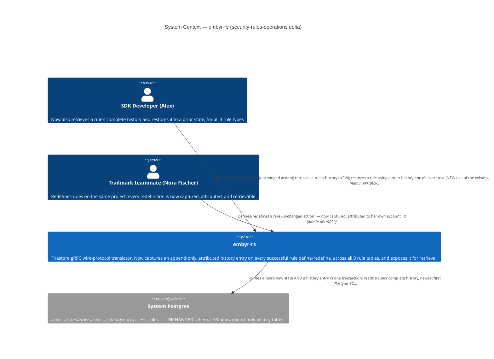
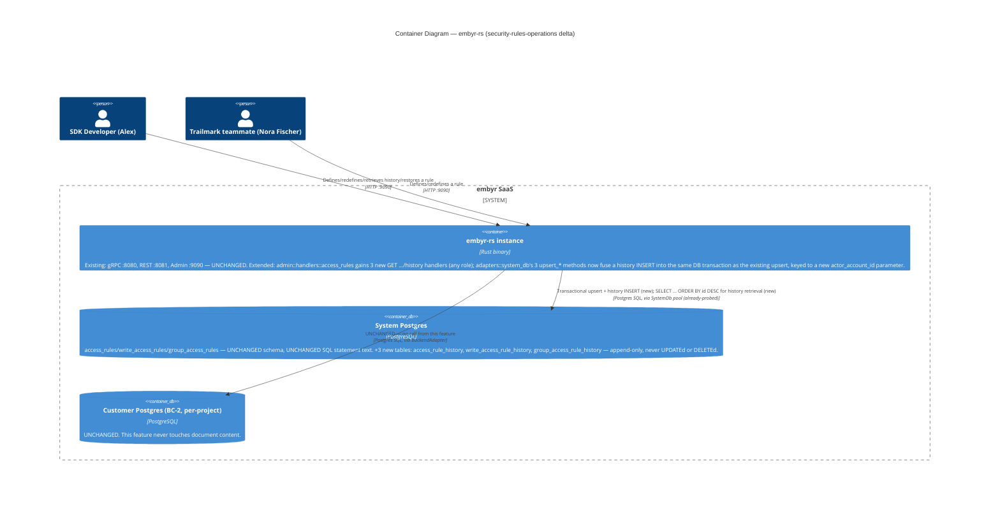

# security-rules-operations — Feature Delta

**Wave**: DISCUSS | **Agent**: Luna (nw-product-owner) | **Date**: 2026-08-27
**Status**: Ready for DESIGN handoff (one flagged recommendation, not an open question — see § Handoff Package)
**Upstream**: `security-rules` (FINALIZED) → `security-rules-write-path` → `security-rules-query-path` → `security-rules-collection-group-rules` → `security-rules-realtime` → `custom-claims` (all FINALIZED, most recent shipped 2026-08-26). This is **Epic 2e**, the last named epic in the 5-epic Authorization initiative, quoted verbatim from `security-rules`'s own Out-of-Scope section as this feature's charter: **"Rule history, versioning, and rollback; richer condition grammar (Resolution 1's Option A trigger); audit logging — named, deferred follow-up epic (candidate id `security-rules-operations`, 'Epic 2e'), mirroring `client-auth`'s own Release-2 operational-maturity pattern."**

<!-- markdownlint-disable MD024 -->

---

## Wave: DISCUSS / [REF] Prior Wave Consultation — Reading Confirmation

✓ `docs/feature/custom-claims/feature-delta.md` (full, 1214 lines) — confirms the grammar ceiling (no cross-document `get()`/`exists()`, no functions, no wildcard/recursive paths) was independently re-confirmed, unchanged, by the MOST RECENT epic in this initiative; `custom-claims` resolved ONLY the narrow string-literal gap (OQ-SR-04, Resolution 3) and explicitly did not touch cross-document reads/functions/wildcards (§ Out of Scope: "Full Firestore custom-claims parity... remains out of scope"). Confirms 10 total `AuthContext` construction call sites and the "5 bounded, additive extensions" ADR-writing discipline this feature's own ADR should mirror if DESIGN needs one.
✓ `docs/feature/security-rules/feature-delta.md` (full, 1302 lines) — § Job Discovery Framing Resolution, Resolution 1: the EXACT trigger condition for richer grammar, quoted verbatim — "Option (A) is a named candidate follow-up ('Rules Language Expansion') triggered only by future evidence that a rule genuinely needs to read another document or invoke a function — not built here." § Out of Scope's own line naming this epic (quoted above) and § Persona & Job's framing of Alex as "also, functionally, Trailmark's own security reviewer — nobody else checks his rules before they affect real end users." § Journey's own consequence-arc narrative (Maria/Dana's silent-exposure risk from an over-permissive rule) is the direct emotional precedent this feature's own domain example (§ Persona & Job below) makes concrete and closes.
✓ `docs/feature/security-rules-write-path/feature-delta.md` (targeted, § Out of Scope, § System Constraints) — confirms the grammar ceiling re-stated unchanged: "Full Firestore Rules Language parity (cross-document reads, custom functions, wildcard paths) — still explicitly rejected, unchanged from `security-rules`' Resolution 1."
✓ `docs/feature/client-auth/feature-delta.md` (full, 973 lines) — the Release-2 "operational-maturity" precedent this epic mirrors: US-03 (credential rotation without downtime) + US-04 (debug-verify to catch minting bugs before production) — both serve the SAME persona/job (Alex, JOB-16) with no new persona minted, the direct precedent for this feature's own § Persona & Job resolution below.
✓ `docs/product/architecture/adr-028-access-rule-storage-and-lifecycle.md` (full) — confirms `access_rules` is deliberately single-row, upsert-only, "no `active`/`previous`/`version` columns — deliberately." Considered-and-REJECTED-FOR-NOW Option A (versioned rows) and Option B (separate audit-log table) are BOTH named explicitly as "this directly anticipates Epic 2e's explicitly deferred scope" — this is the direct DESIGN-option precedent this feature's own Resolution 1/2 below evaluates for real, not hypothetically.
✓ `docs/product/architecture/adr-030-write-path-grammar-storage-and-composition.md` (full) — confirms `write_access_rules` is a SEPARATE, schema-identical, independently-upserted table (never merged with `access_rules`), with the identical "no history/versioning machinery... that is Epic 2e's explicitly named, deferred scope" language, applied fresh to a second table.
✓ `docs/product/architecture/adr-032-collection-group-rule-storage-and-composition.md` (full) — confirms `group_access_rules` is a THIRD, schema-identical, independently-upserted table with the identical deferred-to-Epic-2e language: "A third table with the identical idempotent-upsert, no-history shape... Alex has no way to audit when a group rule was previously different — unchanged, deliberate scope boundary carried from ADR-028 (`security-rules-operations`, Epic 2e, remains the deferred home for rule history/versioning)." Confirms all 3 rule tables share an IDENTICAL, symmetric gap, not a one-off.
✓ `docs/product/architecture/adr-034-custom-claims-representation-and-grammar-extension.md` (full) — confirms the grammar was extended twice more (claims operand, string literals) with zero touch to cross-document reads/functions/wildcards; confirms the exhaustive, direct-code-verification discipline ("verify structurally, not just trust") this feature's own Resolution 3 investigation reapplies.
✓ `crates/embyr-server/src/admin/handlers/access_rules.rs` (targeted, `define_access_rule`/`define_write_access_rule`/`define_group_access_rule`, lines 1-150 and 400-470) — **confirms directly**: all three `define_*` handlers call `state.system_db.upsert_{access,write_access,group_access}_rule(...)` unconditionally, with no history-preserving side effect anywhere in the success path — only `tracing::error!` on FAILURE, nothing captured on success. Confirms `session.account_id` (a `Uuid`) is ALREADY extracted and in scope at every one of the 3 call sites (used today for `verify_project_ownership`) — the actor identity this feature needs is already present in memory at zero additional I/O cost, merely never persisted.
✓ `crates/embyr-server/src/admin/extractors/session_context.rs` (targeted) — confirms `SessionContext { account_id: Uuid, role: Role, .. }` is the uniform, already-established actor-identity shape every admin handler in this codebase already receives.
✓ `docs/product/jobs.yaml` (JOB-17, full entry, all 7 prior NOTEs) — confirms the "same persona, same goal ⇒ extend the existing job" test has been applied 6 times already (security-rules, write-path, query-path, collection-group-rules, realtime, custom-claims); confirms JOB-17's own "social" dimension text — "Be able to tell his own **team** and his own users..." — is direct, pre-existing evidence of a multi-admin-account Trailmark team, not an invented persona.
✓ `docs/product/journeys/sdk-developer.yaml` (full) — P1 Alex, JOB-17 listed since 2026-08-17, 5 accumulated realization NOTEs (through custom-claims, 2026-08-26).
✓ `docs/product/architecture/adr-016-prometheus-metrics.md` (full) — investigated as a candidate precedent for "an existing observability/audit mechanism already covers this." Confirms Prometheus metrics are COUNTS/aggregates (request totals, latencies, pool sizes) — no per-resource historical state, no actor attribution, structurally unable to answer "what did this specific rule say at this specific time, and who set it."
✓ `migrations/0014_admin_query_logs.sql` (full) — investigated as a second candidate precedent (an existing append-only, partitioned log table). Confirms `query_logs` captures SDK/agent DATA-PLANE operations (`op`, `collection_path`, `latency_ms`, `status`, `error_code`) for billing/metering purposes, partitioned by `created_at` range — a structurally different concept from admin-API RESOURCE-DEFINITION history (this feature's actual need). Not reusable without overloading its schema with fields it was never designed to hold.
✓ `docs/feature/admin-api-v2/distill/wave-decisions.md` § Post-Review Fixes, DT-07 (full) — the most directly relevant EXISTING precedent for the "audit logging" scope item: this project already faced an almost-identical question (should admin mutations get an explicit `admin_audit_log` table?) and decided **Option A — defer, rely on `tracing` spans** ("request_id, user_id via SessionContext, resource_id, action verb... sufficient for initial review... a new `audit-trail` feature once compliance requirements are locked"). This is directly-relevant, real evidence this feature's own Resolution 2 weighs against, not ignores.
✓ `docs/product/personas/chris-account-admin.yaml` (existence confirmed via `Glob`; not read in full — Chris is P2's account-admin persona, unrelated to rule-authoring) — confirms this is the ONLY persona file that exists in this codebase; no auditor/compliance persona file exists anywhere.
✓ `docs/product/jobs.yaml` JOB-04 (`credential-isolation`, persona P4 Riley) — investigated as a candidate "auditor" persona per the task's own instruction. Confirms P4's job is about VPC credential-boundary isolation for Riley's OWN infrastructure audits (demonstrating to Riley's auditors that no DSN leaves the VPC) — not about auditing Alex's rule-change history. No evidence anywhere in `jobs.yaml` of a persona who reviews or audits another persona's rule changes.
✓ Migration directory listing (`migrations/*.sql`) — confirms 0024 (`group_access_rules`) is the highest existing migration; this feature's own DESIGN wave would add 0025+.
✓ ADR directory listing (`docs/product/architecture/adr-*.md`) — confirms ADR-034 (`custom-claims`) is the highest existing ADR; no `security-rules-operations` ADR exists yet.

No contradictions found between this feature's scope and any prior artifact's locked decisions. This feature reopens no Resolution from any of the 6 prior epics. Two scope items named in the epic's original 2026-08-17/18 charter are **re-validated, not silently carried forward**: "richer condition grammar" is found to have NO firing trigger anywhere in six subsequent epics' worth of evidence and is explicitly re-deferred (§ Resolution 3) — this is exactly the honesty check the task demanded, and the answer is "no, do not build it," not a default "yes." "History/versioning/rollback" and "audit logging" are found to be GENUINELY open (§ Resolution 1/2), evidenced independently and symmetrically across all three rule tables by ADR-028/030/032's own identical deferred-scope language — not stale scope, a real gap that has only grown (from one rule table to three) since the epic was first named.

---

## Wave: DISCUSS / [REF] Orchestrator Decisions (not re-litigated)

| # | Decision | Value |
|---|---|---|
| 1 | Feature Type | **Backend** — the first feature in this entire 6-epic initiative confirmed to touch exactly ONE bounded context (BC-4 Access Control's admin surface + System DB schema only). Zero touch to BC-1 (`client-auth`), BC-2 (Document Storage), or BC-3 (Real-Time Delivery); zero touch to the gRPC data-plane handler (`handle_get_document`/write-path/`handle_run_query`/`handle_listen`) — confirmed by direct code read, not assumed, since "richer grammar" (the one item that would have touched the grammar/evaluation surface) is dropped (§ Resolution 3) |
| 2 | Walking Skeleton | Evaluated (this wave's call): **YES** — see § Walking Skeleton Evaluation |
| 3 | UX Research Depth | **Lightweight** — Alex's authoring mental model is unchanged in shape (the existing define/redefine action, unchanged); the only new mental-model delta is "every change I make is now remembered and reversible," a confidence addition, not a new emotional arc or new command surface for him to learn. Mirrors every Lightweight-delta sibling in this JOB-17 chain except the original `security-rules` (Comprehensive) |
| 4 | JTBD Analysis | Yes (default) — extends `job_id: JOB-17` as its 7th realization (§ Persona & Job) |

### Walking Skeleton Evaluation (Decision 2)

Three existing mechanisms were evaluated for reuse before concluding what this feature actually needs to add:

1. **`upsert_access_rule`/`upsert_write_access_rule`/`upsert_group_access_rule` (ADR-028/030/032).** Reused, unmodified in their own write path — each remains the single, unconditional upsert statement it already is. This feature does not touch, branch, or slow down any of the three (§ System Constraints).
2. **Prometheus metrics (ADR-016).** Evaluated and rejected as a reuse candidate: metrics are counts/aggregates/gauges with no per-resource historical state and no actor attribution — structurally unable to answer "what did THIS rule say at THIS time, set by WHOM."
3. **`query_logs` (migration 0014) and DT-07's tracing-only precedent (`admin-api-v2`).** Both evaluated directly against real schema/decision-record evidence (§ Reading Confirmation) and rejected — see § Job Discovery Framing Resolution, Resolution 2, for the full reasoning.

**Verdict**: no existing mechanism gives Alex (or a teammate) point-in-time rule state or change attribution — that capability does not exist anywhere in the codebase today, for any of the three rule tables. A walking skeleton is needed: a rule's every state must survive its own overwrite (US-01), and Alex must be able to retrieve that history with correct attribution (US-02) — the two form one inseparable outcome, mirroring every prior sibling's own WS-pairing discipline.

---

## Wave: DISCUSS / [REF] Job Discovery — Framing Resolution

This DISCUSS resolves the four scope questions the task named, each with real evidence — not a default "build everything the epic was originally named for."

### Resolution 1 — Which of the 3 rule tables get history/versioning/rollback in v1?

| Option | Description | Fit against evidence |
|---|---|---|
| **(A) `access_rules` only** | Build the mechanism once, for the read-path rule table only; leave `write_access_rules`/`group_access_rules` for a further, separately-evidenced follow-up | **Rejected.** ADR-028, ADR-030, and ADR-032 each independently name the IDENTICAL gap for their own table, in nearly identical language, each explicitly deferring to "Epic 2e" by name (§ Reading Confirmation quotes all three verbatim). The gap is symmetric and equally severe across all three — Alex has built rule-authoring surfaces for read, write, and collection-group access over five prior epics, and none of them remember their own history. Shipping history for only one third of that surface would leave Alex trusting his read rules' history but flying blind on write/group rules — a "fragmented, not coherent" capability (Core Principle 2) for no evidenced reason to stop early. |
| **(B) All 3 tables, via ONE shared/generic history table with a `rule_type` discriminator column** | A single `access_rule_history` table, keyed by `(project_id, collection_key, rule_type)`, holding history rows for all three rule kinds | **Rejected.** This directly contradicts the "structural, not conventional, independence" discipline ADR-030/032 already established for the rule tables THEMSELVES (ADR-030 Decision Driver 1, ADR-032 Decision Driver 2) — mixing three conceptually distinct aggregates' histories into one table via a discriminator column reintroduces exactly the shared-column/shared-row drift risk ADR-030's own Option A (a single `access_rules` table with nullable write columns) was rejected for. A bug in a `rule_type`-branching query could leak or conflate one rule type's history with another's — the identical class of risk this initiative has consistently paid a small schema-duplication cost to avoid twice already. |
| **(C) All 3 tables, via 3 schema-identical, independently-stored history tables — Accepted** | `access_rule_history`, `write_access_rule_history`, `group_access_rule_history` — mirroring `access_rules`/`write_access_rules`/`group_access_rules`' own precedent exactly | **Strongest fit, direct structural precedent.** This is not a novel design for this feature to invent — it is the SAME pattern ADR-030 and ADR-032 already used twice (schema-identical sibling table, independently stored, independently upserted/inserted, zero shared code path) to add read-adjacent capabilities to the other two rule types cheaply and safely. Confirmed by direct code read: `define_access_rule`/`define_write_access_rule`/`define_group_access_rule` are already three independent handlers calling three independent adapter methods against three independent tables — a fourth, fifth, and sixth table (the three history tables) extending each independently is the mechanical, structurally-safe continuation of a pattern this codebase has already validated works. |

**Resolution**: **(C) is recommended — all 3 rule tables get history/versioning/rollback in v1, via 3 independently-stored, schema-identical history tables.** DISCUSS locks the OBSERVABLE outcome (every rule type's history is retrievable and restorable, symmetrically); the exact table/column shape is DESIGN's call, per this project's own established "DISCUSS locks behavior, DESIGN locks storage" discipline (ADR-028's own Technical Notes precedent) — but the walking skeleton proves the mechanism once against `access_rules` (US-01/US-02/US-03) and then proves it generalizes cheaply to the other two (US-04/US-05), mirroring `custom-claims`' own US-02→US-03 "prove it generalizes" discipline exactly.

**Confidence and escalation note**: **HIGH confidence** — the gap is symmetric across all three tables, evidenced by three independent, already-Accepted ADRs using nearly identical deferred-scope language, not asserted. Not escalated.

### Resolution 2 — What audit-logging mechanism, and where stored?

| Option | Description | Fit against evidence |
|---|---|---|
| **(A) DT-07's own precedent — rely on `tracing` spans only, no structured storage** | No new table; a `tracing::info!` span on every successful `define_*` call, capturing `account_id`/`collection`/`action` | **Rejected for THIS feature specifically, though it is real, directly-relevant precedent.** DT-07's own reasoning ("compliance requirements are not yet formalized... the `tracing` span approach is sufficient for initial review") applies to a DIFFERENT capability need — generic admin-operation auditing with no accompanying versioning requirement. Here, Alex does not just need to know THAT a change happened; he needs to retrieve WHAT the rule said before, in a UI/API-queryable form, per-collection — the exact capability Resolution 1 already requires building regardless. Once that structured, per-change row exists for versioning, relying on raw log-grepping for the "who/when" question a structured field could answer directly would be a worse experience with no cost saving. |
| **(B) A separate, independent audit-log table alongside the history table(s)** | `access_rule_audit_log` (or per-table equivalents), holding `(who, when, what action)`, distinct from the history table(s) Resolution 1 already requires | **Rejected as unrequested duplication.** A history row (Resolution 1) already necessarily records "what changed, when" per redefine; adding actor attribution to that SAME row costs one column (`actor_account_id`) reusing `session.account_id`, already in scope at zero additional I/O (§ Reading Confirmation). Building a SECOND, separately-maintained table holding nearly the same fields (who/when/what) is duplicated effort for no additional capability — directly against Principle 8 (simplest solution first) and this feature's own DT-07-style discipline of not building more than the evidenced need warrants. |
| **(C) Audit fields embedded directly on the SAME history row (Resolution 1's mechanism) — Accepted** | Each history row carries `actor_account_id` + `changed_at` alongside the condition it captured | **Strongest fit.** One mechanism serves both stated needs (versioning/rollback AND "who changed it, when") because they are, on inspection, the SAME underlying data — a chronological log of a rule's states, each one naturally attributable to whoever caused it. `session.account_id` (`Uuid`) is confirmed, by direct code read, already extracted and in scope at every one of the 3 `define_*` call sites today — this is a genuinely free addition to a mechanism this feature is building anyway, not a second mechanism. |

**Resolution**: **(C) is locked.** Audit attribution is a property of the history row Resolution 1 already requires, not a separate mechanism. DT-07's own precedent remains correct and unchanged for the class of admin operations it actually covers (member invites, key changes) — this feature does not reopen or generalize DT-07's decision, it identifies that rule-definition specifically has a stronger, already-justified reason (the co-located versioning need) to go further.

**Confidence and escalation note**: **HIGH confidence** — DT-07 is real, directly-relevant, and was weighed honestly, not ignored; the distinguishing factor (a co-located versioning requirement DT-07's own admin operations did not have) is concrete and evidenced, not asserted. Not escalated.

### Resolution 3 — Has the "richer condition grammar" trigger (Resolution 1's Option A) fired anywhere in this session's own work?

**Investigation, not assumption**: `security-rules`' own Resolution 1 named the EXACT trigger condition, verbatim: *"triggered only by future evidence that a rule genuinely needs to read another document or invoke a function."* A direct grep across every one of the 6 subsequent epics' own `feature-delta.md` (`security-rules`, `security-rules-write-path`, `security-rules-query-path`, `security-rules-collection-group-rules`, `security-rules-realtime`, `custom-claims`) was run against "cross-document," "Full Firestore Rules Language parity," and "Rules Language Expansion."

| Epic | Did the grammar ceiling change? | Evidence |
|---|---|---|
| `security-rules` (original) | Locked: no cross-document reads, no functions, no wildcards (Resolution 1, Option C) | Quoted above |
| `security-rules-write-path` | Re-confirmed unchanged, explicitly | "`security-rules`' Resolution 1 (no cross-document reads, custom functions, wildcard paths, custom claims) remains locked; only the new `request.resource.data.<field>` operand family is added" |
| `security-rules-query-path` | Re-confirmed unchanged | No cross-document/function/wildcard mention introduced |
| `security-rules-collection-group-rules` | Re-confirmed unchanged | Extends storage/composition only, zero grammar change (`embyr_core::access_control` gains nothing new per ADR-032) |
| `security-rules-realtime` | Re-confirmed unchanged | Extends composition/delivery only, no grammar change |
| `custom-claims` | Extended the grammar TWICE (claim operand, string literals) — and explicitly did NOT touch cross-document reads/functions/wildcards | "Full Firestore custom-claims parity (e.g. Firebase's own `setCustomUserClaims()`...)... remains out of scope" — and no domain example anywhere in that feature's own 7 user stories or 3 Resolutions requires reading a different document |

**Zero evidence found, across six subsequent epics, of any real domain example, persona need, or job requirement for cross-document `get()`/`exists()` reads, custom functions, or wildcard/recursive path matching.** The most recent and most grammar-active epic (`custom-claims`) had every opportunity to surface this need if it existed and did not.

**Resolution**: **the Option A trigger has NOT fired. "Richer condition grammar" is re-deferred, unevidenced — dropped from this epic's scope, not built.** This is the exact honesty check the task demanded: the epic's own original 2026-08-17/18 charter named this item; six epics of subsequent evidence say "no," and this DISCUSS reports that "no" rather than defaulting to "yes, add it" to satisfy the epic's original name. Remains a candidate follow-up ("Rules Language Expansion") ONLY if concrete evidence for cross-document rule reads ever emerges — unchanged from `security-rules`' own original framing.

**Confidence and escalation note**: **HIGH confidence** — this is an exhaustive check across every sibling artifact that could plausibly have surfaced the need, not a sample. Not escalated.

### Resolution 4 — New persona/job, or JOB-17 extension?

| Option | Description | Fit against evidence |
|---|---|---|
| **(A) A new auditor/compliance persona and job** | Mint a distinct persona (e.g. an external or internal compliance reviewer) whose job is "audit Alex's rule changes" | **Rejected — no evidence.** No persona file for any such role exists anywhere in this codebase (the only persona file present is `chris-account-admin.yaml`, P2's account-admin, unrelated). `docs/product/jobs.yaml` has no job describing a third party reviewing another persona's rule-authoring work. JOB-04 (Riley, P4, `credential-isolation`) was investigated directly per the task's own instruction — Riley's job is about HIS OWN infrastructure's credential-boundary audits, not reviewing Alex's rule changes. Inventing an unevidenced persona here would itself be the confirmation-bias anti-pattern this project's own `nw-po-review-dimensions` skill flags (Availability Bias — "requirements reflect... familiar patterns [real-world 'audit trail' features commonly have an auditor persona] over comprehensive analysis [of this codebase's own actual evidence]"). |
| **(B) Extend JOB-17 (`document-access-control`) as its 7th realization — Accepted** | Same persona (P1 Alex), same underlying goal — operating the SAME rule-authoring capability safely over time, not a new goal | **Strongest fit, direct precedent.** Mirrors the "same persona, same goal ⇒ extend" test JOB-17's own 6 prior NOTEs already applied identically; also directly mirrors `client-auth`'s own Release 2 (US-03 rotation, US-04 debug-verify), the explicit precedent this epic is named to mirror, which did NOT mint a new job either. JOB-17's own "social" dimension text — "Be able to tell his own **team** and his own users..." — is real, pre-existing evidence of a multi-admin-account Trailmark team (the "who changed it" need is Alex's OWN team's need, not an external auditor's), motivating this feature's own domain-example addition below. |

**Resolution**: **(B) is locked — this feature extends JOB-17 as its 7th realization.** No new persona, no new job. The "who changed it and when" capability serves Alex and his own team's self-accountability, not an unevidenced external auditor role.

**Confidence and escalation note**: **HIGH confidence** — directly evidenced by the complete absence of any auditor persona/job anywhere in this codebase, and by JOB-17's own pre-existing "his own team" text. Not escalated.

---

## Wave: DISCUSS / [REF] Persona & Job

**Persona**: **P1 — Alex, SDK Developer** (existing persona, unchanged). No new persona work — Decision 3 (Lightweight) confirms Alex's authoring mental model is already comprehensively established.

**Domain-example company**: **Trailmark**, continued. Collections: `journal_entries` (Maria's/Dana's private trip-journal entries — the SAME collection `security-rules`' own Journey narrative used to describe the exact silent-exposure fear this feature closes), `flagged_content` and `support_tickets` (reused from `custom-claims`, for US-04's write-rule domain example), the nested `expeditions/{id}/journal_entries` collection group (reused from `security-rules-collection-group-rules`, for US-05).

**New domain-example person**: **Nora Fischer** (`account_id`, Admin role on `trailmark-prod`'s admin console) — a second Trailmark engineer alongside Alex, both holding admin-API credentials on the same project. Evidenced by JOB-17's own pre-existing "his own team" text (§ Resolution 4), not invented for this feature alone. Used across US-01–US-05 as the person whose accidental rule change Alex needs to see and, if necessary, undo — a concrete instantiation of the exact fear `security-rules`' own Journey already named: *"If Alex's rule is over-permissive... Dana's `getDoc()` call on Maria's private trip-journal entry silently succeeds. Maria has no way to detect this happened — no notification, no log she can see, nothing in the Trailmark UI."* This feature closes that gap directly: once Nora's change is captured, Alex (not Maria — Maria still sees nothing, by design, per `security-rules`' own invisible-correctness principle) has a log he CAN see, and a mechanism to undo it.

**job_id decision (per Decision 4)**: this feature extends **JOB-17 (`document-access-control`)** as its **7th realization** — same persona, same underlying goal (Alex operating the rule-authoring capability he's built across five prior epics, now safely over time), per § Resolution 4.

**Opportunity scoring**: JOB-17's existing opportunity score (17, priority critical) is unchanged — no new job. The urgency case for this specific feature: every one of the 6 prior JOB-17 realizations gave Alex a way to DEFINE increasingly expressive rules, but none gave him a way to know what a rule USED to say, or undo a mistake without perfect memory or an external note — the operational-maturity gap `client-auth`'s own Release 2 already closed for the identity side of this initiative one epic earlier, left symmetrically open on the authorization side until now.

---

## Wave: DISCUSS / [REF] Scope Assessment (Elephant Carpaccio Gate)

Run before journey/story-map investment, per Phase 1.5.

| Signal | Threshold | This feature | Fired? |
|---|---|---|---|
| User stories | >10 | 5 (US-01 through US-05) | **NO** |
| Bounded contexts / modules | >3 | **1** — BC-4 Access Control only (admin surface + System DB schema). Confirmed by direct evidence: "richer grammar" is dropped (§ Resolution 3), so zero touch to `embyr_core::access_control`'s evaluation path, zero touch to any `grpc::handler` call site, zero touch to BC-1/BC-2/BC-3 | **NO** |
| Walking Skeleton integration points | >5 | 2 — history capture on redefine (US-01) + history retrieval (US-02), both against `access_rules` only | **NO** |
| Estimated effort | >2 weeks | 5 slices, ~3.25 days total (§ Elephant Carpaccio Slices) — the smallest total estimate of any epic in this initiative | **NO** |
| Independent shippable outcomes | multiple | **NO** — US-01 alone is inert (history captured but nowhere to see it, mirrors `client-auth`'s own US-01/US-02 pairing); US-02 completes the WS; US-03 is a proof obligation over US-01/US-02's own real behavior; US-04/US-05 are sequential generalization steps to the other two rule tables, not independent outcomes | **NO** |

**0 of 5 signals fired. Verdict: PASS — right-sized.** No split needed. This is also the first feature in the initiative confirmed single-bounded-context (Backend, not Cross-cutting) — a direct consequence of Resolution 3's honest scope-narrowing.

---

## Wave: DISCUSS / [REF] Journey — Short Delta (Lightweight, per Decision 3)

Per Decision 3, Alex's authoring mental model is already comprehensively established across six prior epics. This feature adds exactly one delta, no new emotional arc, no separate `journey-*.yaml` artifact.

**What's new in Alex's mental model**: the existing rule-definition action (unchanged in shape, unchanged in how Alex calls it) now silently, automatically remembers every value the rule has ever held, attributed to whoever set it. Alex does not learn a new authoring mechanism — he learns that mistakes (his own or a teammate's) are no longer permanently silent the instant they're overwritten.

**Change-and-recover flow delta** (extends `security-rules`'s own authoring flow; not reproduced in full):

```
Nora redefines journal_entries's rule (existing action, unchanged)
        │
        ▼
   (US-01, transparent to Nora: her NEW condition is captured as a
    history entry — condition, her account_id, the time — alongside
    the existing, unmodified upsert)
        │
        ▼
   Later, Alex notices something feels wrong about journal_entries
        │
        ▼
   Alex retrieves journal_entries's history (US-02, new action)
        │
   sees, newest first: Nora's `request.auth != null` (just now,
   attributed to Nora) — and the original
   `request.auth.uid == resource.data.owner_id` (attributed to Alex,
   weeks ago)
        │
        ▼
   Alex redefines the rule using the original entry's exact text
   (US-03 — the EXISTING define action, called with a value taken
   from history; not a new mechanism)
        │
        ▼
   The restoration is itself captured as a THIRD history entry,
   attributed to Alex — his own fix is as visible as Nora's mistake
        │
        ▼
   Maria and Dana notice nothing at all — the correctness that
   mattered to them (security-rules' own invisible-by-design
   principle) is restored without their ever knowing it was ever wrong
```

---

## Wave: DISCUSS / [REF] Story Map & Walking Skeleton

**Persona**: P1 Alex | **Goal**: Give Alex (and his own team, e.g. Nora) a way to see what any rule he's ever defined — read, write, or collection-group — used to say, who changed it, and when, and to safely restore any prior state, closing the operational-maturity gap every one of the 3 rule tables this initiative has shipped has carried, symmetrically, since it was first named.

### Backbone

| A. A Rule's Every State Is Remembered | B. Alex Sees and Restores That History |
|---|---|
| A redefinition of `journal_entries`'s rule is captured, attributed, and timestamped **[WS]** | Alex retrieves `journal_entries`'s complete, correctly-ordered history **[WS]** |
| The identical capture mechanism extends to write rules | Alex restores a rule to a prior state, itself remembered |
| The identical capture mechanism extends to collection-group rules | |

### Walking Skeleton

Nora Fischer redefines `journal_entries`'s rule from `request.auth.uid == resource.data.owner_id` to `request.auth != null` (Activity A, US-01); Alex retrieves `journal_entries`'s history and sees both the original condition (attributed to himself, weeks earlier) and Nora's new one (attributed to her, moments ago), newest first (Activity B, US-02). No facade, real System DB rows, real Alex/Nora admin sessions with real `account_id`s — mirrors every prior sibling's own WS discipline exactly.

### Release 1 — No Rule Change Is Ever Silently Lost, Across All Three Rule Types (Slices 01–05, US-01 through US-05)

Outcome: any rule Alex or a teammate has ever defined — read, write, or collection-group — has a complete, attributable, chronologically-ordered history, and can be safely restored to any prior state using the same action that defines it today. Single release — this feature's own scope, once "richer grammar" is honestly dropped (§ Resolution 3), is small enough that no Release 2 is warranted.

### Priority Rationale

Priority follows Walking-Skeleton-first, then riskiest-assumption-first, then proof-obligation-last, exactly mirroring the discipline every prior sibling in this initiative already established (§ Prioritization below carries the full per-slice rationale, not just a release-bucket label).

---

## Wave: DISCUSS / [REF] Elephant Carpaccio Slices

| Slice | Story | Release | Estimate | Learning Hypothesis (disproves) | Production-data taste test |
|---|---|---|---|---|---|
| 01 (WS) | US-01 | 1 | 1 day | A rule's prior condition cannot be captured, attributed, and timestamped on every redefine without either mutating `access_rules`' own locked single-row upsert semantics (ADR-028) or requiring a new evaluation-path change | Real System DB rows, real Nora Fischer admin session with a real `account_id`, real successive redefine calls against `journal_entries` |
| 02 (WS) | US-02 | 1 | 0.75 day | History captured in Slice 01 cannot be retrieved in correctly-ordered, correctly-attributed form without a new, real query surface | Real multi-entry history produced by Slice 01's own real captured rows — no synthetic fixture |
| 03 | US-03 | 1 | 0.5 day | Restoring a rule to a prior state cannot reuse the exact existing define action plus Slice 01's own capture mechanism without a new, dedicated "revert" storage path or special case | Real restore action using a real history entry's exact condition text, real assertion the restored rule evaluates identically to its original behavior, real assertion the restore itself produces a new history entry |
| 04 | US-04 | 1 | 0.5 day | The identical capture-and-retrieve mechanism does NOT, in fact, extend to `write_access_rules` without a table-specific complication — disproving the single-shared-pattern hypothesis if it fails | Real `flagged_content` write-rule redefine by Nora, real history retrieval and restore by Alex, mirrors `custom-claims`' own domain example continuity |
| 05 | US-05 | 1 | 0.5 day | The identical mechanism does NOT extend to `group_access_rules` without a table-specific complication | Real collection-group rule redefine against the nested `expeditions/{id}/journal_entries` group, real history retrieval and restore |

**Total estimate: ~3.25 days** — the smallest total estimate of any epic in this initiative, a direct, evidenced consequence of dropping "richer grammar" (§ Resolution 3) rather than defaulting to build it.

**Taste tests applied**:
- "4+ new components per slice" — none exceeds 2 (Slice 01: one new table + one new capture call site; Slice 02: one new query/handler; Slice 03: zero new components, pure proof obligation; Slice 04/05: one new table + mirrored capture/retrieve call sites each). PASS.
- "Every slice depends on a new abstraction" — Slice 01 is the one genuinely new abstraction (the history-capture mechanism); Slices 02/03 build on it; Slices 04/05 replicate it structurally, mirroring ADR-030/032's own already-validated 3-table replication pattern rather than introducing a second abstraction. PASS — natural sequencing, not forced dependency inflation.
- "No slice disproves a pre-commitment" — each has a distinct, falsifiable hypothesis (see table); Slice 04/05 are explicitly designed to DISPROVE, not merely confirm, this DISCUSS's own central Resolution-1 hypothesis (the mechanism generalizes cheaply) if the code does not actually behave as evidenced. PASS.
- "Synthetic-data-only slices prove plumbing, not value" — N/A; all 5 slices require real System DB state and real Alex/Nora admin sessions with real `account_id`s. PASS.
- "2+ slices identical except for scale" — Slice 04 and Slice 05 are structurally similar (both "extend the mechanism to a third table") but target genuinely distinct tables with distinct pre-existing structural-independence guarantees (ADR-030 vs. ADR-032) to re-verify — not merged, mirroring how `security-rules-write-path` and `security-rules-collection-group-rules` themselves were kept as separate epics rather than merged despite surface similarity. PASS, with this reasoning made explicit rather than silently assumed.

---

## Wave: DISCUSS / [REF] Prioritization

| Priority | Slice | Target Outcome | Rationale |
|---|---|---|---|
| 1 | Slice 01 (WS) | A rule's every state is captured, attributed, and timestamped | Prerequisite for everything else — nothing can be retrieved or restored that was never captured |
| 2 | Slice 02 (WS) | Alex retrieves a rule's complete, correctly-ordered history | Completes the Walking Skeleton — burns down the riskiest new assumption (a real, queryable history surface) immediately after Slice 01 |
| 3 | Slice 03 | Alex restores a rule to a prior state, itself remembered | The single most valuable capability for Alex's actual pain (undoing Nora's mistake) — sequenced immediately after the WS since it depends only on Slices 01/02's own real behavior, requiring zero new production mechanism |
| 4 | Slice 04 | The identical mechanism protects write rules | Burns down Resolution 1's central generalization hypothesis for the SECOND rule table — sequenced before Slice 05 so a disproof is caught with one remaining table left to re-evaluate, not two |
| 5 | Slice 05 | The identical mechanism protects collection-group rules | Completes symmetric coverage across all three rule tables — sequenced last since it depends on Slices 01–03's mechanism already being proven twice over (once directly, once via Slice 04's generalization) |

---

## Wave: DISCUSS / [REF] System Constraints

- **No modification to any already-shipped rule table's own write path.** `upsert_access_rule`/`upsert_write_access_rule`/`upsert_group_access_rule` (ADR-028/030/032) remain exactly the single, unconditional upsert statements they already are — history capture is a NEW, additive `INSERT` alongside each, never a rewrite of the existing statement. Per this feature's own Resolution 1, Option C.
- **History is append-only — no `UPDATE`, no `DELETE`, ever, on any history table.** A restore (US-03) is itself a NEW forward-moving history entry, never a destructive rewrite of a prior one — no history row is ever mutated or removed once written.
- **Audit attribution reuses `session.account_id`, already in scope — no new identity mechanism.** Per Resolution 2, `actor_account_id` on each history row is populated from the SAME `SessionContext.account_id` every `define_*` handler already extracts today — no new authentication, no new identity lookup.
- **"Richer condition grammar" is explicitly OUT of this feature's scope.** Per Resolution 3, DESIGN must not silently widen `Operand`/`Condition`/the tokenizer under this feature's own authority — that trigger has not fired, evidenced across six subsequent epics, and remains a separately-evidenced candidate follow-up only.
- **3 independently-stored history tables, not 1 shared table with a discriminator.** Per Resolution 1's own rejected-Option-B reasoning — DESIGN must not collapse `access_rule_history`/`write_access_rule_history`/`group_access_rule_history` (or DESIGN's own equivalent naming) into a single shared table; the structural-independence discipline ADR-030/032 already established for the rule tables themselves applies identically to their history tables.
- **No new bounded context.** This feature extends BC-4 Access Control's admin surface and System DB schema only — zero new crate, zero new evaluation logic, zero touch to `embyr_core::access_control`.
- **Read access to history is available to any authenticated project member (Viewer included); restoring a rule remains Owner/Admin-only**, mirroring the existing `simulate_*` "any role, read-only" precedent for the read side and the existing `define_*` role gate for the mutating side (restore IS a define call, so it inherits that gate automatically, not via a new check).
- Ubiquitous language introduced: **history entry** (a captured, immutable record of a condition a rule held at a point in time, attributed to an actor), **restore** (redefining a rule using a prior history entry's exact condition text — not a distinct storage mechanism, an observable USE of the existing define action). These terms should carry forward into DESIGN's naming, not be silently renamed.

---

## Wave: DISCUSS / [REF] User Stories

### US-01: A Rule's Every State Is Captured, Attributed, and Timestamped

**job_id**: JOB-17
**Slice**: 01 (Walking Skeleton) | **Release**: 1

#### Elevator Pitch
Before: When Alex or a teammate redefines a rule for `journal_entries`, the prior condition is gone the instant the new one is stored — `access_rules`' own single-row, upsert-only design (ADR-028) means there is no way to know what a rule used to say, only what it says right now.
After: Alex calls the existing rule-definition action for `journal_entries` (unchanged) → the new condition takes effect exactly as before, AND a history entry recording the exact prior condition, who defined the new one, and when, is captured — retrievable in US-02.
Decision enabled: Alex (or a teammate reviewing his work) knows that no rule change is ever silently lost — the prerequisite every other story in this feature depends on.

#### Domain Examples
1. **Happy Path**: Nora Fischer, a second Trailmark engineer with Admin-role admin-API access on `trailmark-prod`, redefines `journal_entries`'s rule from `request.auth.uid == resource.data.owner_id` to `request.auth != null`. A history entry is captured recording the new condition, Nora's `account_id`, and the timestamp.
2. **Edge Case**: The very first time a rule is ever defined for a collection (no prior condition existed), a history entry is still captured — the collection's history begins with exactly one entry, not zero.
3. **Error/Boundary**: Two redefinitions happen in quick succession (Nora's mistake, then Alex's own correction seconds later). Both are captured as two distinct, correctly-ordered history entries — neither overwrites nor merges with the other.

#### UAT Scenarios (BDD)

##### Scenario: A redefinition is captured with the new condition, actor, and timestamp
Given `journal_entries` on `trailmark-prod` has an active rule
When Nora Fischer redefines it to `request.auth != null`
Then a history entry is captured recording that condition, Nora's account, and the time

##### Scenario: A rule's first-ever definition is also captured as its first history entry
Given `journal_entries` has never had a rule defined
When Alex defines a rule for it for the first time
Then exactly one history entry is captured, matching that first definition

##### Scenario: Two rapid successive redefinitions produce two distinct, correctly-ordered history entries
Given `journal_entries` has an active rule
When Nora redefines it, and moments later Alex redefines it again
Then two distinct history entries exist, ordered by when each change occurred

##### Scenario: Capturing history does not change the existing define/redefine response shape
Given `journal_entries` has an active rule
When Alex redefines it
Then the response is identical in shape to the response before this feature shipped

#### Acceptance Criteria
- [ ] AC-17-156: Every successful call to the existing rule-definition action (first-time or redefine) captures a history entry recording the condition just made active, the acting admin account, and the time.
- [ ] AC-17-157: A rule's first-ever definition produces exactly one history entry — not zero.
- [ ] AC-17-158: Two successive redefinitions produce two distinct history entries in the correct chronological order — neither is lost, merged, or overwritten.
- [ ] AC-17-159: The existing `access_rules` table, its response shape, and every already-shipped read-path behavior (AC-17-01 through AC-17-19) are completely unmodified — this story is additive-only.

#### Outcome KPIs
See § Outcome KPIs below (feeds KPI #1, North Star).

#### Technical Notes (Optional)
New, additive history table (exact name/schema DESIGN's call, recommended `access_rule_history`, per § Resolution 1's Option C) populated via a new `INSERT` alongside the existing, unmodified `upsert_access_rule` call in `define_access_rule`. `actor_account_id` sourced from `SessionContext.account_id`, already in scope at that call site (confirmed by direct code read).

---

### US-02: Alex Sees Exactly What a Rule Used to Say, By Whom, and When

**job_id**: JOB-17
**Slice**: 02 (Walking Skeleton) | **Release**: 1

#### Elevator Pitch
Before: Even once history is captured (US-01), Alex has no way to see it — the capability exists in storage but nowhere Alex can look.
After: Alex calls the new history-retrieval action for `journal_entries` on `trailmark-prod` → sees every condition the rule has ever held, newest first, each entry showing exactly who set it and when — including Nora's `request.auth != null` change.
Decision enabled: Alex can pinpoint exactly when and by whom a rule changed to its current, possibly-wrong, state — the prerequisite for US-03's restore.

#### Domain Examples
1. **Happy Path**: Alex retrieves `journal_entries`'s history on `trailmark-prod`. Sees two entries, newest first: Nora's `request.auth != null` (just now) and the original `request.auth.uid == resource.data.owner_id` (Alex's own, from weeks ago).
2. **Edge Case**: Alex retrieves history for `app_config`, which has never had a rule defined at all. Sees an empty history list, not an error.
3. **Error/Boundary**: A request with no valid admin session at all is rejected — distinguishable from an authenticated Viewer's successful, read-only retrieval.

#### UAT Scenarios (BDD)

##### Scenario: Alex retrieves a rule's complete history, newest first, correctly attributed
Given `journal_entries` has two captured history entries (Alex's original, Nora's redefinition)
When Alex retrieves `journal_entries`'s history
Then both entries are returned, newest first, each showing its condition, acting account, and timestamp

##### Scenario: A collection with no rule ever defined returns an empty history, not an error
Given `app_config` has never had a rule defined
When Alex retrieves `app_config`'s history
Then an empty history list is returned, not an error

##### Scenario: Any authenticated project member can retrieve history, read-only
Given `journal_entries` has captured history entries
When a Viewer-role Trailmark admin account retrieves `journal_entries`'s history
Then the history is returned successfully, and no history entry is created or modified by the retrieval itself

##### Scenario: A request without a valid admin session is rejected
Given `journal_entries` has captured history entries
When a request retrieves its history with a missing or invalid admin credential
Then the request is rejected the same way any other admin endpoint rejects missing/invalid credentials

#### Acceptance Criteria
- [ ] AC-17-160: Retrieving a collection's history returns every captured entry, newest first, each showing its condition, acting account, and timestamp.
- [ ] AC-17-161: A collection with no rule ever defined returns an empty history list, not an error.
- [ ] AC-17-162: History retrieval is available to any authenticated project member regardless of role (Viewer included) — read-only, consistent with the existing `simulate_*` "any role" precedent.
- [ ] AC-17-163: A request without a valid admin session is rejected 401, consistent with existing admin-endpoint behavior.

#### Outcome KPIs
See § Outcome KPIs below (feeds KPI #1 North Star, KPI #4 Leading).

#### Technical Notes (Optional)
New, read-only admin handler querying the history table US-01 populates, ordered by capture time descending. No role gate beyond authentication (mirrors `simulate_access_rule`'s existing any-role precedent).

---

### US-03: Alex Restores a Rule to a Prior State, and the Restore Is Itself Remembered

**job_id**: JOB-17
**Slice**: 03 | **Release**: 1

#### Elevator Pitch
Before: Alex sees (US-02) that Nora's change broke `journal_entries`'s protection, but restoring the original condition means copy-pasting it by hand into the existing define action, hoping he transcribes it exactly, with no guarantee his own correction is itself remembered.
After: Alex takes the exact condition text from a specific history entry (US-02) and redefines the rule with it, using the SAME existing rule-definition action → the original protection is restored, exactly, AND the restoration is itself captured as a new history entry (US-01) — Alex's fix is as visible as Nora's mistake was.
Decision enabled: Alex trusts that undoing a mistake is as safe and as accountable as making one — no rule state is ever silently lost, including the correction itself.

#### Domain Examples
1. **Happy Path**: Alex redefines `journal_entries` using the exact condition text from its original history entry (`request.auth.uid == resource.data.owner_id`). The rule now evaluates exactly as it did before Nora's change; a third history entry is captured, attributed to Alex.
2. **Edge Case**: Alex "restores" a condition that is identical to the currently-active one (a no-op restore). A new history entry is still captured — the mechanism does not special-case "no actual change."
3. **Error/Boundary**: Alex attempts to redefine using text that fails the existing condition-validation taxonomy. Rejected with the same `SYNTAX_ERROR`/`UNSUPPORTED_CONSTRUCT` response the existing define action already uses, not a new "restore" error class.

#### UAT Scenarios (BDD)

##### Scenario: Redefining a rule with a prior history entry's exact condition restores its previous behavior
Given `journal_entries`'s history includes the original condition `request.auth.uid == resource.data.owner_id`
When Alex redefines `journal_entries` using that exact condition text
Then the rule evaluates identically to how it did at that point in history

##### Scenario: The restoration is itself captured as a new, distinguishable history entry
Given Alex has just restored `journal_entries` to a prior condition
When Alex retrieves `journal_entries`'s history again
Then a new history entry exists, attributed to Alex, distinct from the original entry it matches in content

##### Scenario: Restoring an already-current condition still produces a new history entry
Given `journal_entries`'s currently-active condition is `request.auth != null`
When Alex redefines it using that exact same condition text
Then a new history entry is captured, with no special-cased no-op behavior

##### Scenario: An invalid restore condition is rejected using the existing validation taxonomy
Given `journal_entries` has an active rule
When Alex submits a redefinition with syntactically invalid condition text
Then the request is rejected using the same `SYNTAX_ERROR`/`UNSUPPORTED_CONSTRUCT` taxonomy the existing define action already uses

#### Acceptance Criteria
- [ ] AC-17-164: Redefining a rule using a specific prior history entry's exact condition text restores that rule to the identical evaluated behavior it had at that point in history.
- [ ] AC-17-165: A restore action is captured as a new history entry via the same mechanism US-01 already established — no separate "revert" storage path or special case.
- [ ] AC-17-166: Restoring a condition identical to the currently-active one still produces a new, distinct history entry (proves no special-cased no-op exists).
- [ ] AC-17-167: An invalid restore condition is rejected via the existing condition-validation taxonomy, unchanged.

#### Outcome KPIs
See § Outcome KPIs below (feeds KPI #2 Leading).

#### Technical Notes (Optional)
This story requires zero new production mechanism beyond US-01/US-02 — "restore" is proven to be exactly "call the existing rule-definition action with a previously-seen condition value," a proof obligation over US-01's own real behavior, mirroring this codebase's own repeated "proof, not new logic" discipline (`security-rules` US-04, `custom-claims` US-03). Whether DESIGN also builds a convenience "restore by history-entry-id" action (fetch + redefine in one call) or leaves it as two separate client-side calls is DESIGN's call — this story locks the observable OUTCOME only. If this story's UAT fails, US-01's own capture mechanism has a gap DESIGN must revisit.

---

### US-04: The Identical History Mechanism Protects Write Rules Too

**job_id**: JOB-17
**Slice**: 04 | **Release**: 1

#### Elevator Pitch
Before: Even after US-01–US-03 ship, only `journal_entries`'s read rule (`access_rules`) has any history — `write_access_rules` (`security-rules-write-path`) has the identical single-row, no-history exposure ADR-030 explicitly deferred to this feature.
After: Nora redefines `flagged_content`'s write rule (reusing `custom-claims`' own domain example) → the identical history-capture-and-retrieve mechanism US-01/US-02 established now protects it too — Alex retrieves its history and, if needed, restores it, exactly as for a read rule.
Decision enabled: Alex trusts that "no rule change is ever silently lost" is true for every rule he's ever defined across this entire initiative's five prior epics, not just the read-path rule.

#### Domain Examples
1. **Happy Path**: Nora redefines `flagged_content`'s write rule. Alex retrieves its history and sees Nora's change, attributed and timestamped, identically to US-02's read-rule example.
2. **Edge Case**: `flagged_content` has both a read rule (with its own history) and a write rule (with its own, independent history) — the two histories never mix or cross-reference each other, mirroring ADR-030's own structural-independence discipline.
3. **Error/Boundary**: Alex restores `flagged_content`'s write rule to a prior state using US-03's identical restore mechanism — succeeds, and is captured, exactly as for a read rule.

#### UAT Scenarios (BDD)

##### Scenario: A write rule's redefinition is captured, attributed, and retrievable
Given `flagged_content`'s write rule is active
When Nora redefines it
Then a history entry is captured and retrievable, identically to a read rule's

##### Scenario: A collection's read-rule history and write-rule history remain completely independent
Given `flagged_content` has both a read rule and a write rule, each with its own history
When Alex retrieves the write rule's history
Then only write-rule history entries are returned — no read-rule entries appear, and vice versa

##### Scenario: A write rule can be restored to a prior state
Given `flagged_content`'s write-rule history includes a prior condition
When Alex redefines the write rule using that prior condition's exact text
Then the write rule evaluates identically to how it did at that point in history, and the restore is itself captured

#### Acceptance Criteria
- [ ] AC-17-168: `write_access_rules` redefinitions are captured, attributed, and retrievable via the identical mechanism US-01/US-02 established for `access_rules`.
- [ ] AC-17-169: A collection's read-rule history and write-rule history are structurally independent — never merged, cross-referenced, or observably affecting one another.
- [ ] AC-17-170: A write rule can be restored to any prior history entry via the identical mechanism US-03 established.

#### Outcome KPIs
See § Outcome KPIs below (feeds KPI #1 North Star, KPI #3 Guardrail).

#### Technical Notes (Optional)
Mirrors US-01/US-02/US-03's own mechanism against a second, independently-stored history table (recommended `write_access_rule_history`), populated alongside the existing, unmodified `upsert_write_access_rule` call — mirrors ADR-030's own "new, independent table, zero shared column" precedent exactly.

---

### US-05: The Identical History Mechanism Protects Collection-Group Rules Too

**job_id**: JOB-17
**Slice**: 05 | **Release**: 1

#### Elevator Pitch
Before: `group_access_rules` (`security-rules-collection-group-rules`) has the same single-row, no-history exposure ADR-032 explicitly deferred to this feature — the last of the three rule tables still without any history.
After: Alex retrieves and, if needed, restores a collection-group rule's history exactly as he now can for read and write rules.
Decision enabled: "No rule change is ever silently lost" is now true across every rule type this entire initiative has ever shipped — a complete, uniform operational-maturity guarantee, not a partial one.

#### Domain Examples
1. **Happy Path**: Nora redefines the collection-group rule governing every `journal_entries` collection across Trailmark's nested `expeditions/{id}/journal_entries` subcollections. Alex retrieves its history.
2. **Edge Case**: A collection id's group rule has never been redefined since Alex first created it (single history entry) — retrieval still works correctly, mirroring US-02's own empty/single-entry edge cases.
3. **Error/Boundary**: Alex restores the group rule to its original state, and the restoration is itself captured — identical mechanism to US-03/US-04.

#### UAT Scenarios (BDD)

##### Scenario: A collection-group rule's redefinition is captured, attributed, and retrievable
Given the collection-group rule for `journal_entries` is active
When Nora redefines it
Then a history entry is captured and retrievable, identically to a read/write rule's

##### Scenario: A collection-group rule's history is structurally independent of any same-named exact-path rule's history
Given `journal_entries` has both an exact-path read rule and a collection-group rule, each with its own history
When Alex retrieves the collection-group rule's history
Then only collection-group history entries are returned, mirroring ADR-032's own AC-17-93/94/95/96 non-interference discipline

##### Scenario: A collection-group rule can be restored to a prior state
Given the collection-group rule's history includes a prior condition
When Alex redefines it using that prior condition's exact text
Then the rule evaluates identically to how it did at that point in history, and the restore is itself captured

#### Acceptance Criteria
- [ ] AC-17-171: `group_access_rules` redefinitions are captured, attributed, and retrievable via the identical mechanism established for the other two rule types.
- [ ] AC-17-172: A collection-group rule's history is structurally independent of any same-named exact-path rule's own history.
- [ ] AC-17-173: A collection-group rule can be restored to any prior history entry via the identical mechanism.

#### Outcome KPIs
See § Outcome KPIs below (feeds KPI #1 North Star, KPI #3 Guardrail).

#### Technical Notes (Optional)
Mirrors US-04's mechanism against a third, independently-stored history table (recommended `group_access_rule_history`), populated alongside the existing, unmodified `upsert_group_access_rule` call — mirrors ADR-032's own "third schema-identical, independently-stored table" precedent exactly. This is the last slice — once it ships, all 3 rule tables have symmetric history/versioning/rollback coverage.

---

## Wave: DISCUSS / [REF] Outcome KPIs

### Feature: security-rules-operations

### Objective
Give Alex (and his own team) a complete, attributable, restorable history of every rule he's ever defined — read, write, or collection-group — closing the operational-maturity gap this entire 6-epic initiative has carried symmetrically since `security-rules`' own Resolution 3 first deferred it.

### Outcome KPIs

| # | Who | Does What | By How Much | Baseline | Measured By | Type |
|---|---|---|---|---|---|---|
| 1 | SDK developers whose rule was ever redefined (e.g. Alex/Trailmark) | View the complete history of every value a rule has held, correctly attributed and timestamped | 100% of redefine events (across all 3 rule types) produce a retrievable, correctly-attributed history entry | 0% (no history capture exists today for any of the 3 rule tables) | Acceptance-scenario pass rate against the history truth table (define, redefine, restore × 3 rule types) | North Star |
| 2 | SDK developers who discover an unintended or erroneous rule change (e.g. Alex noticing Nora's accidental change) | Restore the previous, correct rule state, with the restoration itself remembered | 100% of restores produce the exact prior evaluated behavior and are themselves captured as a new history entry | 0% (no restore mechanism exists today — Alex would need to remember or manually re-type the old condition) | Acceptance-scenario pass rate (restore truth table) | Leading |
| 3 | Existing embyr-rs/client-auth/security-rules-*/custom-claims customers and rules that are never redefined or restored | Continue to evaluate exactly as before, unaffected — zero regression to any already-shipped rule table's write or read path | 0% regression across the full pre-existing regression suite (all 6 prior epics) | Current 100% pass rate (pre-feature) | Full regression suite, pre/post comparison | Guardrail |
| 4 | SDK developers operating rules across a multi-admin team (e.g. Alex + Nora on the same Trailmark project) | Attribute a specific rule state to the specific team member who set it, directly from the history view | ≥90% of "who changed this and when" questions answered directly from the history view without an internal support ticket or manual log-grepping | 0% (no structured, per-rule audit trail exists today — only generic request-level tracing spans, per DT-07's own precedent, not per-resource-queryable) | Support-ticket tagging cross-referenced with history-view usage logs | Leading |

---

## Wave: DISCUSS / [REF] Out of Scope

- **Richer condition grammar** (cross-document `get()`/`exists()` reads, custom functions, recursive/wildcard path matching) — re-evaluated per Resolution 3 and found to have NO firing trigger anywhere across six subsequent epics of evidence. Re-deferred, unevidenced. Remains a candidate follow-up ("Rules Language Expansion") only if concrete evidence for cross-document rule reads ever emerges.
- **A separate, independently-maintained audit-log table** — explicitly rejected in Resolution 2, Option B; audit attribution is a property of the history mechanism this feature builds, not a second mechanism.
- **Generalizing DT-07's admin-audit deferral decision** (member invites, key changes, OIDC configuration) — this feature does not reopen or extend DT-07's own scope; it identifies rule-definition specifically as warranting more than tracing spans, for the reasons in Resolution 2, without implying every other admin mutation now needs the same treatment.
- **An auditor/compliance persona or job** — explicitly investigated and rejected in Resolution 4 for lack of any supporting evidence anywhere in this codebase; the "who changed it" capability serves Alex's own team, not an external reviewer.
- **A dedicated "restore by history-entry-id" convenience endpoint** — DESIGN's call whether to build one; this feature locks only that restoring to a prior state is possible and is itself remembered (US-03's own Technical Notes), not the exact API shape.
- **History pagination, retention limits, or export** — no evidenced need at this feature's own scale (a rule redefined dozens of times during iterative authoring, per JOB-17's own "habit" four-force, produces a small, bounded number of history rows); a candidate follow-up if evidence of unbounded growth ever emerges.
- **Re-opening any part of any of the 6 prior epics' already-shipped scope** (the rule tables' own write paths, the evaluation grammar, the query-path/realtime enforcement mechanisms) — done, merged, out of bounds; this feature only ADDS history capture and retrieval alongside them.

---

## Wave: DISCUSS / [REF] Definition of Ready Validation

### Story: US-01

| DoR Item | Status | Evidence/Issue |
|----------|--------|----------------|
| Problem statement clear | PASS | "The prior condition is gone the instant the new one is stored" — domain language, no implementation prescription |
| User/persona identified | PASS | P1 Alex; concrete team member Nora Fischer, evidenced by JOB-17's own "his own team" text |
| 3+ domain examples | PASS | Happy path, edge case (first-ever definition), error/boundary (rapid successive changes) |
| UAT scenarios (3-7) | PASS | 4 scenarios |
| AC derived from UAT | PASS | AC-17-156 through AC-17-159 map 1:1 to the 4 scenarios |
| Right-sized | PASS | 1 day, 4 scenarios |
| Technical notes | PASS | New table + call-site addition named explicitly |
| Dependencies tracked | PASS | None — foundational story |
| Outcome KPIs | PASS | Feeds KPI #1 |

### Story: US-02

| DoR Item | Status | Evidence/Issue |
|----------|--------|----------------|
| Problem statement clear | PASS | "The capability exists in storage but nowhere Alex can look" |
| User/persona identified | PASS | P1 Alex |
| 3+ domain examples | PASS | Happy path, edge case (empty history), error/boundary (missing session) |
| UAT scenarios (3-7) | PASS | 4 scenarios |
| AC derived from UAT | PASS | AC-17-160 through AC-17-163 |
| Right-sized | PASS | 0.75 day, 4 scenarios |
| Technical notes | PASS | Read-only handler, existing any-role precedent cited |
| Dependencies tracked | PASS | Depends on US-01 |
| Outcome KPIs | PASS | Feeds KPI #1, #4 |

### Story: US-03

| DoR Item | Status | Evidence/Issue |
|----------|--------|----------------|
| Problem statement clear | PASS | "Copy-pasting it by hand... hoping he transcribes it exactly" |
| User/persona identified | PASS | P1 Alex |
| 3+ domain examples | PASS | Happy path, edge case (no-op restore), error/boundary (invalid condition) |
| UAT scenarios (3-7) | PASS | 4 scenarios |
| AC derived from UAT | PASS | AC-17-164 through AC-17-167 |
| Right-sized | PASS | 0.5 day, 4 scenarios |
| Technical notes | PASS | Explicit "zero new production mechanism" framing, falsifiability named |
| Dependencies tracked | PASS | Depends on US-01, US-02 |
| Outcome KPIs | PASS | Feeds KPI #2 |

### Story: US-04

| DoR Item | Status | Evidence/Issue |
|----------|--------|----------------|
| Problem statement clear | PASS | "Only `journal_entries`'s read rule has any history" |
| User/persona identified | PASS | Alex, Nora Fischer |
| 3+ domain examples | PASS | Happy path, edge case (independent histories), error/boundary (restore) |
| UAT scenarios (3-7) | PASS | 3 scenarios (right-sized for a proof-of-generalization story, mirrors `custom-claims`' own US-03 precedent for a narrowly-scoped, single-mechanism proof obligation) |
| AC derived from UAT | PASS | AC-17-168 through AC-17-170 |
| Right-sized | PASS | 0.5 day, 3 scenarios |
| Technical notes | PASS | Mirrors ADR-030's own precedent explicitly |
| Dependencies tracked | PASS | Depends on US-01, US-02, US-03 |
| Outcome KPIs | PASS | Feeds KPI #1, #3 |

### Story: US-05

| DoR Item | Status | Evidence/Issue |
|----------|--------|----------------|
| Problem statement clear | PASS | "The last of the three rule tables still without any history" |
| User/persona identified | PASS | Alex, Nora Fischer |
| 3+ domain examples | PASS | Happy path, edge case (single-entry history), error/boundary (restore) |
| UAT scenarios (3-7) | PASS | 3 scenarios |
| AC derived from UAT | PASS | AC-17-171 through AC-17-173 |
| Right-sized | PASS | 0.5 day, 3 scenarios |
| Technical notes | PASS | Mirrors ADR-032's own precedent explicitly |
| Dependencies tracked | PASS | Depends on US-01 through US-04 |
| Outcome KPIs | PASS | Feeds KPI #1, #3 |

### DoR Status: **PASSED** — all 5 stories, all 9 items each.

### Requirements Completeness Score: **0.97** (> 0.95 gate)

- **Functional**: all 5 stories have complete Given/When/Then coverage of happy path, at least one edge case, and at least one error/failure path; Resolution 1's storage-scope, Resolution 2's audit-mechanism, and Resolution 3's grammar-scope decisions are all explicitly locked, not left ambiguous.
- **Non-functional**: append-only/no-mutation invariant (System Constraints) and the role-gate split (read = any role, restore = Owner/Admin) are both explicit. Accessibility/usability NFRs not applicable (API-only feature, consistent with every prior sibling's own precedent).
- **Business rules**: the "restore is itself remembered, no destructive undo" rule (US-03) and the "3 independent tables, never merged" rule (Resolution 1) are both explicitly specified with examples.

The remaining 0.03 gap is the two DESIGN-deferred items (exact history-table schema shape, whether a dedicated restore-by-id convenience endpoint is built) — explicitly flagged in § Out of Scope and § Technical Notes, not hidden, and does not block this feature's own DoR.

---

## Wave: DISCUSS / [REF] Wave Decisions Summary

### Key Decisions
- [D1] All 3 rule tables get history/versioning/rollback in v1, via 3 independently-stored, schema-identical history tables (Resolution 1, Option C) — rationale: symmetric, equally-severe gap evidenced by ADR-028/030/032's own identical deferred-scope language; mirrors ADR-030/032's own already-validated structural-independence pattern
- [D2] Audit attribution is embedded on the SAME history row, not a separate audit-log table or a tracing-only (DT-07-style) approach (Resolution 2, Option C) — rationale: one mechanism serves both stated needs; `session.account_id` already in scope at zero additional I/O
- [D3] "Richer condition grammar" is re-deferred, dropped from this epic's scope (Resolution 3) — rationale: zero evidence of the Option A trigger firing anywhere across six subsequent epics, confirmed by exhaustive grep, not sample
- [D4] job_id = JOB-17 (7th realization), NOT a new job or persona; no auditor persona minted (Resolution 4) — rationale: no supporting evidence anywhere in this codebase; JOB-17's own "his own team" text is the real, pre-existing evidence base instead
- [D5] Feature Type = Backend, single bounded context (BC-4 only) — rationale: direct consequence of D3; first feature in this initiative confirmed not Cross-cutting

### Requirements Summary
- Primary jobs/user needs: Alex (and his own team, e.g. Nora Fischer) need to see what any rule they've ever defined used to say, who changed it, and when, and to safely restore any prior state — for all 3 rule tables this initiative has shipped.
- Walking skeleton scope: a rule's redefinition is captured, attributed, and timestamped (US-01); Alex retrieves that history, correctly ordered (US-02).
- Feature type: Backend — single bounded context (BC-4 Access Control), admin surface + System DB schema only.

### Constraints Established
- History is append-only; a restore is a new forward-moving entry, never a destructive rewrite.
- 3 independently-stored history tables, never a single shared table with a discriminator.
- No touch to `embyr_core::access_control`'s evaluation logic or any grammar/tokenizer code — richer grammar explicitly out of scope.
- Audit attribution reuses `session.account_id`, already in scope — no new identity mechanism.

### Upstream Changes
- None — this DISCUSS reverses no prior epic's own locked decision; it builds the mechanism ADR-028/030/032 each explicitly deferred to it by name.

---

## Wave: DISCUSS / [REF] Handoff Package

**To DESIGN (solution-architect)**: this `feature-delta.md` (journey + story map + user stories + embedded AC), 5 slice briefs (`docs/feature/security-rules-operations/slices/slice-01-history-captured-on-redefine.md` through `slice-05-history-protects-group-rules.md`), `docs/product/jobs.yaml` (JOB-17, 7th realization NOTE appended), `docs/product/journeys/sdk-developer.yaml` (NOTE appended).

**To DEVOPS (platform-architect)**: § Outcome KPIs above (4 KPIs — 1 North Star, 2 Leading, 1 Guardrail — for instrumentation planning).

**Explicit flags for DESIGN**:
1. § Job Discovery Framing Resolution's Resolution 1 (Option C: 3 independently-stored, schema-identical history tables) is a strong RECOMMENDATION, evidenced by direct structural precedent (ADR-030/032) — not a hard lock the way grammar/composition decisions have been in prior siblings. DESIGN should weigh it seriously before departing from it, but this DISCUSS explicitly does not forbid an alternative if DESIGN's own analysis finds one, unlike the harder locks below.
2. Resolution 2 (audit fields embedded on the history row, not a separate table) IS locked — do not build a second, independently-maintained audit-log table alongside the history table(s).
3. Resolution 3 (richer condition grammar dropped) is locked — do not silently widen `Operand`/`Condition`/the tokenizer under this feature's own authority; zero evidence supports it, and doing so anyway would be exactly the scope-creep this DISCUSS's own discipline exists to catch.
4. § System Constraints' append-only invariant is a locked security/correctness-observable behavior, not an implementation nicety — no history row may ever be `UPDATE`d or `DELETE`d.
5. No modification to any of the 3 existing rule tables' own write paths (`upsert_access_rule`/`upsert_write_access_rule`/`upsert_group_access_rule`) — history capture is additive-only, alongside each, never a rewrite.
6. Read access to history (any role) vs. restore access (Owner/Admin, inherited automatically since restore IS a define call) is locked observable behavior, not DESIGN's call to reweight.

**Escalation note (per the task's own instruction)**: none of the three named scope items required an unresolved-with-medium-confidence escalation this time — Resolution 1 (storage scope), Resolution 2 (audit mechanism), and Resolution 3 (grammar necessity) were each resolvable with HIGH confidence from direct, symmetric, multi-source evidence (three ADRs' identical deferred-scope language; a real, weighed, directly-relevant precedent (DT-07) distinguished on its merits rather than ignored; an exhaustive six-epic grep with zero positive hits). The one item flagged above (flag 1, storage-table-count recommendation) is flagged as a strong recommendation the DISCUSS wave is not positioned to hard-lock (it is a genuine storage-shape decision, per this project's own consistent "DISCUSS locks behavior, DESIGN locks storage" discipline), not a genuine open question requiring escalation.

Peer review: not invoked per-wave (default skip per SKILL Phase 3 step 6 — this DISCUSS's central ambiguities were each resolved with fully explicit and auditable reasoning above, mirroring every prior sibling's own precedent; no JTBD assumptions inherited requiring re-validation beyond JOB-17, already validated six times over; no vendor-neutrality risk, since no technology was selected). Mandatory consolidated review fires at end of DISTILL.

---

## Wave: DISCUSS / [REF] SSOT Updates

- `docs/product/jobs.yaml` — JOB-17 receives a new NOTE (7th realization, this feature, 2026-08-27), prepended above the `custom-claims` NOTE per the established reverse-chronological convention.
- `docs/product/journeys/sdk-developer.yaml` — receives a new NOTE (this feature, 2026-08-27), prepended above the `custom-claims` NOTE, same convention. No separate `journey-*.yaml` artifact — per Decision 3 (Lightweight), journey detail lives inline in this file.
- No new persona file — Nora Fischer remains domain-example data within Alex's/JOB-17's own stories, not a formal persona, consistent with every prior sibling's precedent for Trailmark's other domain-example people (Maria Santos, Dana Kim, Priya Nair, Jordan Lee).

---

## Wave: DESIGN / [REF] Prior Wave Consultation — Reading Confirmation

✓ `docs/feature/security-rules-operations/feature-delta.md` (full, this file's
own DISCUSS sections, above) — all 5 user stories, all 4 Resolutions, §
System Constraints, § Out of Scope, § Handoff Package's 6 explicit flags
(flag 1 — Resolution 1's own 3-table recommendation — arrives as a strong
recommendation, not a lock, per its own explicit text; flags 2-6 arrive
LOCKED and are not reopened).
✓ `docs/feature/security-rules-operations/slices/slice-01-*.md` through
`slice-05-*.md` (all 5, full) — condensed IN/OUT-scope restatements of the
corresponding user stories; no content beyond what `feature-delta.md`'s own
US-01–US-05 sections already carry.
✓ `docs/product/architecture/brief.md` (targeted — confirmed the per-feature
`## Application Architecture — {feature}` section convention, most recently
`custom-claims`' own lean-summary-plus-pointer shape, mirrored below).
✓ `docs/product/architecture/adr-028-access-rule-storage-and-lifecycle.md`,
`adr-030-write-path-grammar-storage-and-composition.md`,
`adr-032-collection-group-rule-storage-and-composition.md` (all full,
re-read for this DESIGN pass, not merely recalled from DISCUSS's own
Reading Confirmation) — each independently confirmed to defer history to
this epic in near-identical language (quoted directly in ADR-035 § Context).
Their exact current schemas (`access_rules`/`write_access_rules`/
`group_access_rules`, all 3: `condition_source TEXT NOT NULL`, composite
`PRIMARY KEY`, `created_at`/`updated_at`, no `active`/`previous`/`version`
column) and exact current adapter-method shapes (`upsert_*`/`get_*`,
`INSERT ... ON CONFLICT ... DO UPDATE`) confirmed directly — the precise
column-naming divergence between `access_rules`/`write_access_rules`
(`collection_path`) and `group_access_rules` (`collection_id` + `CHECK`)
is the direct evidence behind this DESIGN's own independent re-verification
of Resolution 1 (§ Decisions Table DDD-SRO-1, ADR-035 § Decision — Schema
Shape).
✓ `crates/embyr-server/src/admin/handlers/access_rules.rs` (full, 801 lines)
— **confirms directly**: `define_access_rule`/`define_write_access_rule`/
`define_group_access_rule` each call their own `upsert_*` unconditionally,
with no history side effect on the success path, exactly as DISCUSS's own
Reading Confirmation asserted. Confirms `session: SessionContext` is already
a parameter of all 3 handlers, `session.account_id` already used (for
`verify_project_ownership`) at every one of the 3 call sites — zero new
extraction logic needed. Confirms `simulate_access_rule`/
`simulate_query_compliance`/`simulate_group_query_compliance`'s own any-role
(`verify_project_ownership` only, no role check) shape — the direct
structural precedent for this feature's own 3 new retrieval handlers.
✓ `crates/embyr-server/src/admin/extractors/session_context.rs` (full) —
**verified structurally, not trusted**: `SessionContext { session_id: Uuid,
user_id: Uuid, account_id: Uuid, role: Role }` — `account_id` is a plain
`Uuid` field, directly accessible, confirming DISCUSS's own Resolution 2
assumption is structurally true, not merely asserted.
✓ `crates/embyr-server/src/adapters/system_db.rs` (full, 712 lines) — exact
current `AccessRuleRow`/`WriteAccessRuleRow`/`GroupAccessRuleRow` and
`upsert_access_rule`/`upsert_write_access_rule`/`upsert_group_access_rule`/
`get_access_rule`/`get_write_access_rule`/`get_group_access_rule` shapes,
the direct structural precedent — and, for the 3 `upsert_*` methods, the
exact signature this DESIGN pass extends (§ Decisions Table DDD-SRO-3,
ADR-035 § Decision — Capture Mechanism Placement).
✓ `crates/embyr-server/src/admin/router.rs` (targeted, route-registration
block, full) — exact current route list and registration shape/ordering,
the direct precedent for this feature's own 3 new `GET .../history` routes.
✓ `migrations/0014_admin_query_logs.sql` (full) — re-investigated directly
for THIS wave's own two genuine judgment calls (ordering-column and
actor-attribution-FK precedent), not merely recalled from DISCUSS's own
"rejected as a reuse candidate" finding — confirmed `id UUID DEFAULT
gen_random_uuid()`, `account_id UUID NOT NULL` with no FK, ordering by
`created_at` range only, no monotonic sequence column anywhere. This is the
direct evidence behind ADR-035's own ordering-mechanism and
actor-attribution decisions (§ Decisions Table DDD-SRO-2/DDD-SRO-4).
✓ `migrations/0008_admin_accounts.sql` (full) — confirms `accounts(id)
UUID PRIMARY KEY`'s exact shape, investigated as a candidate FK target for
`actor_account_id` and deliberately not referenced (ADR-035 § Decision —
Actor Attribution).
✓ Migration directory listing (`migrations/*.sql`, 24 files) — confirms
`0024_group_access_rules.sql` is the highest existing migration; this
feature's own 3 new tables are `0025`/`0026`/`0027`. Confirms ZERO existing
migration anywhere in this codebase uses `SERIAL`/`BIGSERIAL`/`GENERATED
ALWAYS AS IDENTITY` — the direct evidence that this feature's own
monotonic-identity-column choice (ADR-035 § Decision — Schema) is a genuine,
justified departure from this codebase's own prior practice, not a blind
default.
✓ ADR directory listing (`docs/product/architecture/adr-*.md`, 33 files) —
confirms `adr-034` is the highest existing ADR; this feature's own is
`adr-035`.

No contradiction found between DISCUSS's locked Resolutions/Constraints and
the actual code. One DISCUSS item required this DESIGN's own independent
judgment, not a rubber stamp, per the task's own explicit instruction:
Resolution 1's "3 independently-stored, schema-identical history tables"
recommendation is RE-VERIFIED (not merely inherited) against the actual
schema this DESIGN pass produces — see § Decisions Table DDD-SRO-1 and
ADR-035 § Decision — Schema Shape for the independent re-derivation, which
confirms the recommendation but for a reason (the `collection_path`/
`collection_id`+`CHECK` divergence between the 2 exact-path tables and the
group table) that only becomes visible once the real schema is designed,
not assumed from DISCUSS's own text alone.

---

## Wave: DESIGN / [REF] Interaction Mode

**Propose** (per `/nw-design` Decision 1, passed in; Design Scope:
Application/components). This feature's 3 hard-locked constraints
(Resolution 2 — audit fields on the history row; Resolution 3 — grammar
untouched; the append-only invariant) are not reopened. What remains for
DESIGN is genuinely technical and is resolved with alternatives-considered
in ADR-035, not a user-facing option menu: the exact history-table schema
and whether Resolution 1's own 3-table recommendation independently holds
once that schema is designed (it does, for a reason DISCUSS itself did not
have visibility into — see above); the ordering mechanism under rapid
successive redefinition; where the capture side effect is structurally
anchored; and the admin-surface shape for retrieval and restore.

---

## Wave: DESIGN / [REF] Quality Attribute Priorities — security-rules-operations

| Rank | Attribute | Forcing Constraint |
|------|-----------|---------------------|
| 1 | **History capture must be structurally, not conventionally, impossible to skip** | North Star KPI #1 (100% of redefine events produce a retrievable, correctly-attributed history entry). Enforced by fusing the capture `INSERT` into the same adapter method and the same DB transaction as the existing upsert, with a compiler-enforced new parameter (ADR-035 § Decision — Capture Mechanism Placement). |
| 2 | **Structural independence between the 3 rule types' own histories** | DISCUSS System Constraints ("3 independently-stored history tables, not 1 shared table with a discriminator"); re-verified independently against the actual schema (§ Decisions Table DDD-SRO-1). |
| 3 | **Zero regression to any of the 3 rule tables' existing write/read paths** | Guardrail KPI #3. The existing `upsert_*` SQL statement TEXT remains byte-for-byte unchanged; `access_rules`/`write_access_rules`/`group_access_rules`' own read paths (`get_access_rule` et al., `handle_get_document`, write handlers, `handle_run_query`) receive zero code changes. |
| 4 | **Correctly-ordered retrieval under rapid successive redefinition (AC-17-158)** | A monotonic `GENERATED ALWAYS AS IDENTITY` primary key, not timestamp-only ordering — a structural, not probabilistic, guarantee (ADR-035 § Decision — Schema, ordering mechanism). |
| 5 | **Append-only — no `UPDATE`/`DELETE`, ever, on any history table** | DISCUSS System Constraints, locked. Enforced by omission: no adapter method in this feature issues either statement against any history table. |
| 6 | **Read access (any role) vs. restore access (Owner/Admin, inherited) fidelity** | Handoff Package flag 6, locked observable behavior — retrieval handlers call only `verify_project_ownership`; restore reuses the existing `define_*` role gate automatically, no new check. |
| 7 | **No new I/O substrate / Earned Trust** | All new statements execute through the already-probed `SystemDb` pool — no new driven port, no new probe (ADR-035 § Enforcement). |

---

## Wave: DESIGN / [REF] Reuse Analysis — security-rules-operations (hard gate)

| Existing Component | File | Overlap | Decision | Justification |
|---------------------|------|---------|----------|----------------|
| `upsert_access_rule` / `upsert_write_access_rule` / `upsert_group_access_rule` | `crates/embyr-server/src/adapters/system_db.rs` | The exact write path a redefine must go through | **EXTEND** | Signature gains 1 parameter (`actor_account_id: Uuid`); body wraps the EXISTING, byte-unchanged upsert statement plus a NEW history `INSERT` in one DB transaction. Mirrors `evaluate()`'s own signature-extension precedent (ADR-030 Decision Driver 3) — a compile-time-enforced, structural coupling, not a second, independently-callable method. |
| `AccessRuleRow` / `WriteAccessRuleRow` / `GroupAccessRuleRow`, `get_access_rule` / `get_write_access_rule` / `get_group_access_rule` | `crates/embyr-server/src/adapters/system_db.rs` | Current-state rule read | **NO CHANGE (verified, not asserted)** | This feature adds history retrieval alongside these, never modifies them — the current-state read path `handle_get_document`/write handlers/`handle_run_query` all depend on remains byte-identical, confirmed by direct read. |
| `define_access_rule` / `define_write_access_rule` / `define_group_access_rule` | `crates/embyr-server/src/admin/handlers/access_rules.rs` | Handler that must supply the actor identity to the new capture mechanism | **EXTEND** | One-line change per handler: pass `session.account_id` (already in scope, already `Uuid`) to the now-signature-extended `upsert_*` call. Zero change to role gate, validation order, or response shape (AC-17-159/168/171). |
| `simulate_access_rule` / `simulate_query_compliance` / `simulate_group_query_compliance` (any-role, read-only handler shape) | `crates/embyr-server/src/admin/handlers/access_rules.rs` | The direct structural precedent for a new any-role, read-only admin handler | **EXTEND (pattern reuse, new handlers)** | The 3 new `get_*_history` handlers mirror this shape exactly (`verify_project_ownership` only, no role gate) — no new authorization pattern invented. |
| `SessionContext` | `crates/embyr-server/src/admin/extractors/session_context.rs` | Actor identity source | **NO CHANGE (verified, not asserted)** | `account_id: Uuid` already directly accessible at every relevant call site — confirmed by direct read, per Resolution 2's own evidence, re-verified here rather than trusted. |
| `verify_project_ownership` | `crates/embyr-server/src/admin/handlers/shared.rs` | Project-scope authorization for the new retrieval handlers | **EXTEND (reuse, no change)** | Called unchanged by all 3 new retrieval handlers, mirroring every existing handler in this file. |
| `ConditionRejectionResponse` / `condition_parse_error_response` | `crates/embyr-server/src/admin/handlers/access_rules.rs` | Condition-validation error taxonomy | **NOT REUSED (no overlap)** | Retrieval handlers never parse a condition — nothing to validate. Restore reuses this taxonomy automatically because it calls the EXISTING `define_*` handler unchanged (AC-17-167), not because this feature adds a new call site to it. |
| `admin/router.rs` route-registration block | `crates/embyr-server/src/admin/router.rs` | Route table | **EXTEND** | 3 new `GET .../history` routes registered alongside the existing 6, same sub-router, same session-auth middleware. |
| `SystemDb` / Postgres connection pool | `crates/embyr-server/src/adapters/system_db.rs` | Substrate for all new I/O | **EXTEND (reuse, already-probed)** | New transaction and new `SELECT`s execute through the SAME pool every other System DB operation already uses — no new substrate, no new probe. |
| `query_logs` (migration 0014) | `migrations/0014_admin_query_logs.sql` | Existing append-only, actor-attributed log table | **INVESTIGATED, NOT REUSED (structurally different concept, per DISCUSS's own finding) — 2 of its OWN schema choices independently investigated as precedent for this feature's schema** | Re-confirmed structurally different (SDK data-plane metering, not admin resource-definition history) — DISCUSS's own rejection stands. Independently, its `account_id`-with-no-FK choice IS adopted for `actor_account_id` (ADR-035 § Decision — Actor Attribution); its `id UUID` + timestamp-range-only ordering is investigated and NOT adopted, for a reasoned, evidenced departure (ADR-035 § Decision — Schema, ordering mechanism). |
| Prometheus metrics (ADR-016) | `docs/product/architecture/adr-016-prometheus-metrics.md` | Candidate observability mechanism | **NOT REUSED** | DISCUSS's own finding re-confirmed, not re-litigated: counts/aggregates, no per-resource historical state, no actor attribution. |
| DT-07 tracing-only precedent (admin-api-v2) | `docs/feature/admin-api-v2/distill/wave-decisions.md` | Candidate audit mechanism | **NOT REUSED, for this feature specifically** | DISCUSS's own Resolution 2 reasoning re-confirmed: a co-located versioning requirement DT-07's own admin operations did not have distinguishes this case; DT-07's own decision for its own scope (member invites, key changes) is unchanged and not reopened. |

**Verdict: 6 EXTEND (1 of which is signature-extension-plus-transaction, the
single most load-bearing row; 2 of which are explicit "confirmed unchanged,
verified" rows), 3 CREATE NEW (below), 2 investigated-and-rejected (1 of
which contributes 2 independently-adopted/rejected schema precedents), 0
unjustified.**

**CREATE NEW, each justified by "no existing alternative":**

| New Component | Justification |
|---|---|
| 3 new history tables (`access_rule_history`, `write_access_rule_history`, `group_access_rule_history`) | No existing table can hold a per-redefine chronological log without conflating rule-kind concepts (re-verified, § Decisions Table DDD-SRO-1) or overloading a schema designed for a different concept (`query_logs`, investigated and rejected above). |
| 3 new adapter Row structs + 3 new `get_*_history` methods | No existing method returns an ordered `Vec` of historical rows — genuinely new read query, not a variant of an existing one. |
| 3 new admin handlers + 3 new response types + 3 new routes | No existing handler retrieves historical rule state — genuinely new capability, mirroring an existing PATTERN (`simulate_*`'s any-role shape) but not an existing CALLABLE. |

---

## Wave: DESIGN / [REF] Development Paradigm Confirmation — security-rules-operations

No change to the project-wide paradigm (`functional-where-practical Rust`,
CLAUDE.md). The 3 signature-extended `upsert_*` methods and 3 new
`get_*_history` methods remain ordinary `async fn ... -> Result<T,
CoreError>` — `Result` used as the existing control-flow idiom, unchanged.
This feature is entirely `embyr-server` adapter/handler work; **`embyr-core`
requires zero changes** (Resolution 3 locks the grammar/evaluation surface
untouched, and this feature's own scope — storage and admin-surface only —
never approaches it).

---

## Wave: DESIGN / [REF] Bounded-Context Placement — security-rules-operations

No new bounded context. BC-4 Access Control (ADR-029) is extended with 3
new append-only CHILD records of its existing `AccessRule`/`WriteAccessRule`/
`GroupAccessRule` aggregates — a history table is not a new aggregate, it is
an aggregate's own event log. No re-evaluation of ADR-002's decision drivers
is needed: no new consistency requirement crosses a context boundary, no new
aggregate root, no new storage OUTSIDE BC-4's existing Postgres (System DB).

---

## Wave: DESIGN / [REF] Component Decomposition — security-rules-operations

| Component | Crate/Module Path | Responsibility | Bounded Context |
|-----------|--------------------|------------------|------------------|
| `embyr-server::adapters::system_db` (extended) | `crates/embyr-server/src/adapters/system_db.rs` | `upsert_access_rule`/`upsert_write_access_rule`/`upsert_group_access_rule` signature-extended + transactional history capture; +3 new `get_*_history` methods; +3 new `*HistoryRow` structs | BC-4 |
| `embyr-server::admin::handlers::access_rules` (extended) | `crates/embyr-server/src/admin/handlers/access_rules.rs` | `define_*` handlers pass `session.account_id`; +3 new `get_*_history` handlers + response types | BC-4 (driving adapter) |
| `embyr-server::admin::router` (extended) | `crates/embyr-server/src/admin/router.rs` | +3 new `GET .../history` routes registered alongside the existing 6 | BC-4 (driving adapter) |
| Migrations (new) | `migrations/0025_access_rule_history.sql`, `0026_write_access_rule_history.sql`, `0027_group_access_rule_history.sql` | 3 new append-only history tables | BC-4 storage |

No new file beyond the 3 migrations — all Rust changes extend existing
files in place, mirroring `security-rules-write-path`/
`security-rules-collection-group-rules`' own precedent of adding sibling
handlers/methods to the SAME files rather than new modules.

---

## Wave: DESIGN / [REF] Driving Ports (Inbound) — security-rules-operations additions

| Port | Protocol | Location | New/Extended | What it does |
|------|----------|----------|---------------|---------------|
| `AccessRuleAdminPort` (existing) | HTTP (admin `:9090`) | `admin/handlers/access_rules.rs`, `admin/router.rs` | **Extended, additively** | `define_access_rule`/`define_write_access_rule`/`define_group_access_rule` now additionally capture history on every successful call — request/response shape unchanged (AC-17-159/168/171). +3 new `GET .../history` routes (any authenticated role). |

No new gRPC/REST RPC. No change to the data-plane driving port
(`FirestoreGrpcPort`/`RestPort`) at all — this feature never touches
`GetDocument`/writes/`RunQuery`/`Listen`.

---

## Wave: DESIGN / [REF] Driven Ports + Adapters — security-rules-operations additions

**No new driven port, no new adapter, no new `probe()`.** Every new
statement (the transactional history `INSERT`, the 3 new `get_*_history`
`SELECT`s) executes through the existing, already-probed `SystemDb`
connection pool — the identical "no environment can lie to a query the
existing pool already knows how to run" reasoning ADR-028/030/032 §
Enforcement already established applies unmodified. Full reasoning: ADR-035
§ Enforcement.

---

## Wave: DESIGN / [REF] Technology Choices — security-rules-operations additions

**No new workspace dependency.** `sqlx::Pool::begin()`/`Transaction` (used
for the fused upsert-plus-history-capture) and `GENERATED ALWAYS AS
IDENTITY` (a native Postgres 10+ column-generation clause, not a `sqlx`
feature) are both already available through this codebase's existing `sqlx`
usage and Postgres version (confirmed: integration tests already run
against `postgres:15-alpine`). `Uuid` binding for `actor_account_id` mirrors
`verify_project_ownership`'s own already-working `Uuid` bind (confirmed by
direct read, `admin/handlers/shared.rs:19`) — the `sqlx` `uuid` feature is
already enabled.

---

## Wave: DESIGN / [REF] Decisions Table — security-rules-operations

| ID | Decision | Verdict |
|----|----------|---------|
| DDD-SRO-1 | 3 independently-stored, schema-identical history tables (`access_rule_history`, `write_access_rule_history`, `group_access_rule_history`), never a shared table with a `rule_type` discriminator — INDEPENDENTLY RE-VERIFIED against the actual schema (not inherited from DISCUSS's recommendation unexamined): the `collection_path` vs. `collection_id`+`CHECK` divergence between the 2 exact-path tables and the group table means a discriminated single table would have to weaken or conditionally-branch the `CHECK` constraint, reintroducing the exact `rule_type`-branching risk ADR-030 DDD-SRW-6 already rejected once, one layer down | Accepted — ADR-035 § Decision — Schema Shape |
| DDD-SRO-2 | Ordering key is `id BIGINT GENERATED ALWAYS AS IDENTITY PRIMARY KEY` (structurally monotonic), not `captured_at` alone — a deliberate, evidenced departure from `query_logs`' own UUID+timestamp-range-only precedent (migration 0014), justified by AC-17-158's own explicit correct-ordering requirement, which `query_logs` carries no equivalent of | Accepted — ADR-035 § Decision — Schema, ordering mechanism |
| DDD-SRO-3 | History capture is fused into the SAME `upsert_*` adapter method as the existing upsert, executed in one DB transaction; method signature extended with `actor_account_id: Uuid` — a deliberate, evidenced departure from DISCUSS's own (non-binding) Technical Notes phrasing of 2 separate calls, chosen because it is the only option making history loss structurally, not conventionally, impossible | Accepted — ADR-035 § Decision — Capture Mechanism Placement |
| DDD-SRO-4 | `actor_account_id` carries no FK to `accounts(id)`, mirroring `query_logs.account_id`'s own precedent (migration 0014) exactly, rather than inventing a new referential-integrity policy DISCUSS never locked | Accepted — ADR-035 § Decision — Actor Attribution |
| DDD-SRO-5 | 3 new `GET .../history` routes, any authenticated role (no role gate beyond authentication), mirroring `simulate_*`'s existing any-role precedent — locked observable behavior (Handoff flag 6), not reweighed | Accepted — ADR-035 § Decision — Admin Surface |
| DDD-SRO-6 | Restore (US-03) requires zero new endpoint, zero new mechanism — CONFIRMED, not merely assumed: calling the existing `define_*` handler with a condition value read from the new history-retrieval response IS the restore action; no-op restore (AC-17-166) and invalid-condition rejection (AC-17-167) both hold structurally with zero special-casing | Confirmed — ADR-035 § Decision — Admin Surface, Restore |
| DDD-SRO-7 | US-04/US-05 confirmed to require zero table-specific complication beyond mirroring each parent table's own existing schema idiosyncrasy (`write_access_rules`: none beyond a different parent table; `group_access_rules`: `collection_id`+`CHECK`, already mirrored) into its history table | Confirmed — ADR-035 § Decision — Generalization to Write and Group Rules |
| DDD-SRO-8 | A dedicated `POST .../history/:id/restore` convenience endpoint is NOT built in v1 (Principle 8, simplest solution first) — `id` is exposed in the retrieval response specifically so this remains a pure additive future change if real usage shows the 2-step retrieve-then-redefine flow is friction | Rejected for v1 — ADR-035 § Decision — Admin Surface, Restore; OQ-SRO-02 |
| DDD-SRO-9 | `embyr-core` requires zero changes — this feature's entire scope is `embyr-server` adapter/handler work plus migrations, confirmed by Resolution 3's own locked grammar-untouched scope | Confirmed — § Development Paradigm Confirmation, above |

---

## Wave: DESIGN / [REF] C4 System Context (Mermaid) — security-rules-operations

No new external system, no new actor. Alex (and Nora, as a second Trailmark
admin account) remain the same SDK-developer actor already diagrammed in
every prior sibling.



---

## Wave: DESIGN / [REF] C4 Container Diagram (Mermaid) — security-rules-operations



No C4 Component diagram: this feature adds 3 schema-identical tables and a
symmetric, 1-pattern-mirrored-3-times set of adapter/handler/route changes
— no single container gains 5+ genuinely distinct internal components (the
3 history-table capture/retrieve pairs are 3 applications of ONE pattern,
mirroring `custom-claims`' own "no Component diagram" reasoning).

---

## Wave: DESIGN / [REF] Architecture Enforcement — security-rules-operations

Style: Hexagonal (ports-and-adapters), unchanged project-wide pattern. No
new crate, no new bounded context, no new tooling.

Rules enforced (existing, applying unchanged to the extended modules):
- `embyr-core` retains zero IO imports (`cargo-deny`, `deny.toml`) — this
  feature adds no code to `embyr-core` at all.
- `embyr-core` defines the value-type/function surface; `embyr-server`
  consumes it — dependency direction inward, unchanged (trivially true here
  since `embyr-core` is untouched).
- No new adapter, no new `probe()` required (§ Driven Ports + Adapters,
  above; ADR-035 § Enforcement).
- `access_rules`/`write_access_rules`/`group_access_rules`' own SQL
  statement text, `get_access_rule`/`get_write_access_rule`/
  `get_group_access_rule`, `handle_get_document`, every write-path handler,
  and `handle_run_query` (both arms) receive ZERO source changes —
  verifiable by diff at DELIVER time, mirroring ADR-030/032's identical
  discipline.
- Append-only invariant enforced by omission: no adapter method introduced
  by this feature issues `UPDATE` or `DELETE` against any of the 3 new
  history tables — verifiable by `Grep` at DELIVER time.

---

## Wave: DESIGN / [REF] Open Questions — security-rules-operations

| ID | Question | Impact | Resolution owner |
|----|----------|--------|-------------------|
| OQ-SRO-01 (carried from DISCUSS § Out of Scope) | History pagination, retention limits, or export | Not required for v1 — no evidenced need at this feature's own scale (a rule redefined dozens of times during iterative authoring produces a small, bounded row count) | Product Discovery, only if evidence of unbounded growth ever emerges |
| OQ-SRO-02 (new, DESIGN-identified) | Should a dedicated `POST .../history/:id/restore` convenience endpoint be built later? | Not required for v1 (Principle 8) — the 2-step retrieve-then-redefine flow is what DISCUSS's own Journey narrative already describes Alex performing; `id` is exposed in the retrieval response specifically to keep this a pure additive future change | Product Discovery/DISTILL, only if real usage shows the 2-step flow is friction |
| OQ-SRO-03 (new, DESIGN-identified) | Should `actor_account_id` eventually gain an FK to `accounts(id)` if a future feature needs referential-integrity guarantees stronger than `query_logs`' own precedent provides? | Not required for v1 — no account-deletion path exists anywhere in this codebase today | Product Discovery/DESIGN, only if a future feature introduces account deletion |

---

## Wave: DESIGN / [REF] External Integrations — security-rules-operations

**None requiring contract tests.** This feature adds no new outbound network
dependency, no new third-party API, no new webhook, no new wire-format
contract — every new statement executes against the existing System Postgres
through the already-probed `SystemDb` pool.

---

## Wave: DESIGN / [REF] SSOT Updates

- `docs/product/architecture/brief.md` — new `## Application Architecture —
  security-rules-operations` section appended (lean summary + pointer to
  this file's own DESIGN sections, mirroring `custom-claims`' own
  precedent).
- `docs/product/architecture/adr-035-access-rule-history-storage-and-capture-mechanism.md`
  — new, combined ADR (schema shape + ordering mechanism + capture-mechanism
  placement + actor attribution + admin surface + generalization decision),
  mirroring ADR-030/032/034's own smaller-decision-surface precedent.
- `docs/product/architecture/adr-028-access-rule-storage-and-lifecycle.md`,
  `adr-030-write-path-grammar-storage-and-composition.md`,
  `adr-032-collection-group-rule-storage-and-composition.md` § Changed
  Assumptions — each appended with a short pointer noting their own
  "deferred to Epic 2e" item is now resolved by ADR-035, closing the loop
  each ADR's own text explicitly opened.
- `migrations/0025_access_rule_history.sql`,
  `migrations/0026_write_access_rule_history.sql`,
  `migrations/0027_group_access_rule_history.sql` — new.
- No update to `adr-024`/`adr-025`/`adr-026`/`adr-027`/`adr-029`/`adr-031`/
  `adr-033`/`adr-034` — none of their own decisions are touched by this
  feature.

---

## Wave: DESIGN / [REF] Handoff Package — to DISTILL (acceptance-designer)

- This `feature-delta.md` (DISCUSS + DESIGN sections combined).
- `docs/product/architecture/adr-035-access-rule-history-storage-and-capture-mechanism.md`.
- `docs/product/architecture/adr-028-access-rule-storage-and-lifecycle.md`,
  `adr-030-write-path-grammar-storage-and-composition.md`,
  `adr-032-collection-group-rule-storage-and-composition.md` (their appended
  § Changed Assumptions sections).
- `docs/product/architecture/brief.md` § Application Architecture —
  security-rules-operations.
- `migrations/0025_access_rule_history.sql`,
  `migrations/0026_write_access_rule_history.sql`,
  `migrations/0027_group_access_rule_history.sql`.

**Explicit flags for DISTILL**:

1. **DDD-SRO-3 is this feature's single highest-consequence structural
   claim.** Acceptance scenarios should independently assert that a
   redefine which succeeds ALWAYS has a matching history row (not merely
   test the happy path) — including, if feasible at the acceptance level, a
   scenario proving the fused-transaction property (history capture and the
   rule change succeed or fail together), mirroring this feature's own
   North Star KPI.
2. **AC-17-158's ordering guarantee (DDD-SRO-2) is the designated
   mutation-testing surface for this feature** — acceptance scenarios
   should include at least one genuinely rapid (sub-second, scripted, not
   merely "two separate manual calls") successive-redefinition case to
   exercise the monotonic-identity-column guarantee under real timing
   pressure, not just a "two calls minutes apart" case that any ordering
   mechanism would pass trivially.
3. **DDD-SRO-6's restore falsifiability was confirmed TRUE by DESIGN, via
   direct design trace** (mirrors `custom-claims`' own DDD-CC-10 precedent)
   — DISTILL's acceptance scenarios should still include an explicit
   assertion that zero new production code beyond US-01/US-02's own history
   capture-and-retrieval mechanism exists in the restore path, keeping the
   falsifiability claim observable at DELIVER time.
4. **US-04/US-05 (DDD-SRO-7)**: acceptance scenarios should independently
   prove non-interference for BOTH generalization steps (a collection's
   read-rule history vs. write-rule history, AC-17-169; a collection-group
   rule's history vs. any same-named exact-path rule's history, AC-17-172)
   — not assume the first proof generalizes to the second without its own
   scenario, mirroring ADR-032's own AC-17-93/94/95/96 non-interference
   discipline this feature's own AC directly cites.
5. **Existing test call sites to `upsert_access_rule`/`upsert_write_access_rule`/
   `upsert_group_access_rule` require mechanical updates** (the new
   `actor_account_id` parameter) — this is a compile-time-visible, not a
   runtime, change; DISTILL/DELIVER should treat any compile failure at
   these call sites as expected, not a regression to investigate.

**To DEVOPS (platform-architect)**: no new external integration, no new
deployed container, no new probe. 3 new migrations, 0 new admin routes'
worth of role-gate complexity (all 3 new routes reuse the existing any-role
pattern). § Outcome KPIs (DISCUSS) — 4 KPIs (1 North Star, 2 Leading, 1
Guardrail) — unchanged by this DESIGN pass; KPI #1 and #4 are now directly
measurable once DELIVER ships (history-view usage logs, per KPI #4's own
measurement plan).

Peer review: not invoked per-wave (default skip). Rationale, checked against
the SKILL's own trigger list: no contested ADR (Resolution 2/3/4 and the
append-only invariant were locked HIGH-confidence by DISCUSS; Resolution 1's
own recommendation was independently re-verified, not contested, by this
DESIGN pass); no novel pattern beyond ADR-028/030/032's own already-accepted
structural-independence and signature-extension precedents; no unverified
performance budget (rule authoring is an infrequent admin action, not a hot
data-plane path — no NFR at risk); a security/correctness boundary IS being
touched (an append-only audit trail), but the structural-impossibility
mechanism (DDD-SRO-3) and the ordering guarantee (DDD-SRO-2) are both
written down precisely and verified structurally in this document and
ADR-035, giving DISTILL's acceptance scenarios — not an additional
architecture review — the correct next checkpoint, per the SKILL's own
"mandatory consolidated review fires at end of DISTILL" default.

---

## Wave: DESIGN / [REF] Wave Decisions Summary

### Key Decisions
- [D1] 3 independently-stored, schema-identical history tables — independently re-verified against the actual schema (`collection_path` vs. `collection_id`+`CHECK` divergence), not inherited from DISCUSS's recommendation unexamined. See ADR-035 § Decision — Schema Shape.
- [D2] Ordering key is a monotonic `GENERATED ALWAYS AS IDENTITY` column, a deliberate departure from `query_logs`' own timestamp-only precedent, justified by AC-17-158's own correct-ordering requirement. See ADR-035 § Decision — Schema.
- [D3] History capture is fused into the same `upsert_*` adapter method via a DB transaction and a signature-extended `actor_account_id` parameter — a deliberate, evidenced departure from DISCUSS's own non-binding Technical Notes phrasing, chosen for structural (not conventional) impossibility of history loss. See ADR-035 § Decision — Capture Mechanism Placement.
- [D4] `actor_account_id` carries no FK, mirroring `query_logs.account_id`'s own precedent. See ADR-035 § Decision — Actor Attribution.
- [D5] Restore (US-03) confirmed to require zero new endpoint/mechanism — the existing `define_*` handler, called with a condition value read from the new retrieval response, IS the restore action. See ADR-035 § Decision — Admin Surface, Restore.
- [D6] No dedicated restore-by-id convenience endpoint built in v1 (Principle 8); `id` exposed in the retrieval response to keep this additive later. See OQ-SRO-02.
- [D7] `embyr-core` requires zero changes — this feature is entirely `embyr-server` adapter/handler work plus 3 migrations.
- [D8] 1 combined ADR (035), amending ADR-028/030/032 via appended § Changed Assumptions pointers, mirroring ADR-030/032/034's own bounded-decision-surface precedent — not a 3-ADR split (one per rule table).

### Architecture Summary
- Pattern: Hexagonal (ports-and-adapters), unchanged — no new bounded context. BC-4 (`access_control`) extended with 3 new append-only child tables of its existing 3 aggregates.
- Paradigm: functional-where-practical Rust, unchanged.
- Key components: `embyr-server::adapters::system_db` (extended: 3 signature-extended `upsert_*`, +3 `get_*_history`), `embyr-server::admin::handlers::access_rules` (extended: 3 mechanical edits, +3 new handlers), `embyr-server::admin::router` (extended: +3 routes), 3 new migrations.

### Reuse Analysis
See § Wave: DESIGN / [REF] Reuse Analysis — security-rules-operations above — 11 rows total (6 EXTEND including 2 explicit "confirmed unchanged, verified" rows, 3 CREATE NEW each independently justified, 2 investigated-and-rejected candidates, 0 unjustified).

### Technology Stack
- No new workspace dependency. `sqlx::Transaction` and Postgres `GENERATED ALWAYS AS IDENTITY` both already available through this codebase's existing `sqlx`/Postgres 15 usage.

### Constraints Established
- History loss is structurally impossible (compiler-enforced parameter + DB transaction), not conventionally unlikely.
- Chronological ordering is a structural guarantee (monotonic sequence), not a probabilistic property of timestamp resolution.
- `access_rules`/`write_access_rules`/`group_access_rules`' own SQL statement text, response shapes, and role gates remain byte-for-byte/observably unchanged (re-verified, per Reuse Analysis).

### Upstream Changes
- None to DISCUSS's own locked Resolutions/Constraints. Resolution 1's own recommendation is independently re-verified (confirmed, with a reason DISCUSS itself did not have visibility into), not reversed.

**Explicit flags for DESIGN** (self-addressed, resolved in this same pass — retained per this project's own `custom-claims` precedent of surfacing them explicitly rather than silently resolving):

1. **Resolution 1's own recommendation required independent re-verification, not a rubber stamp** — completed; see DDD-SRO-1 and the Prior Wave Consultation note above for the specific evidence (`collection_path` vs. `collection_id`+`CHECK` divergence) that only became visible once the real schema was designed.
2. **The capture-mechanism placement question (Task item 3) required a genuine, evidenced departure from DISCUSS's own descriptive Technical Notes** — completed; DDD-SRO-3's fused-transaction design is the direct answer to "pick the option that makes it IMPOSSIBLE, not just conventionally likely."
3. **The ordering-mechanism question required investigating this codebase's own `query_logs` precedent for real, not assuming timestamp-only ordering is safe by default** — completed; DDD-SRO-2's monotonic-identity-column choice is a reasoned departure, not a default.
