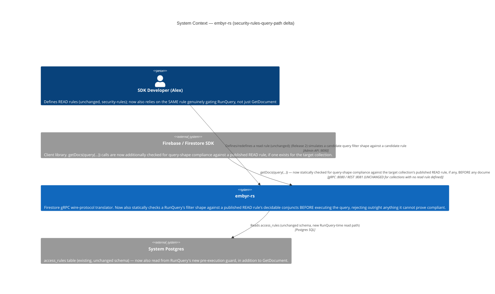
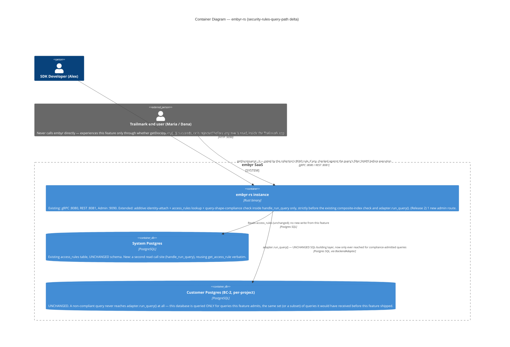
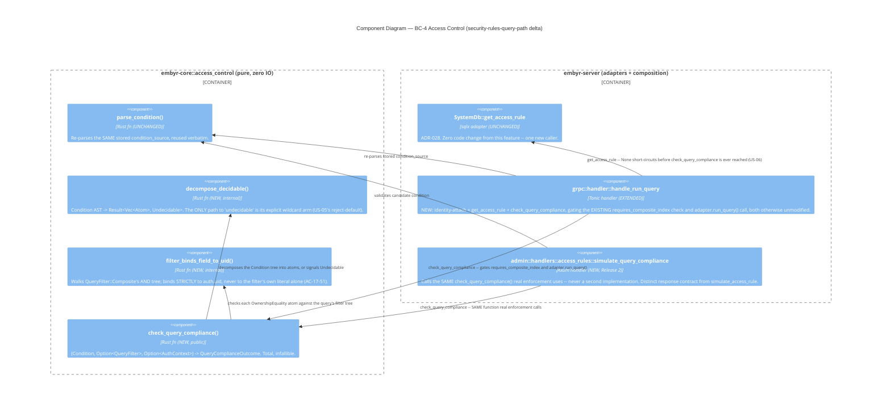

# security-rules-query-path — Feature Delta

**Wave**: DISCUSS | **Agent**: Luna (nw-product-owner) | **Date**: 2026-08-18
**Status**: Ready for DESIGN handoff (one flagged escalation — see § Handoff Package)
**Upstream**: `security-rules` (FINALIZED 2026-08-18, `docs/evolution/2026-08-18-security-rules.md`) — this feature is Epic 2c of the 5-epic access-control initiative. `security-rules`' own § Out of Scope named this feature's id and framing explicitly: "query-path enforcement... Structurally different mechanism: a query must be provably rule-compliant *before* execution, not filtered after — real Firestore rejects non-compliant query shapes outright rather than silently filtering results, and this feature does not attempt that." Right now, in production, `RunQuery` completely bypasses `access_rules` — a client can read anything a `GetDocument` rule would deny simply by querying for it instead of fetching it by id. This is a genuine, actively-exploitable bypass of the read-path guarantee `security-rules` shipped.

<!-- markdownlint-disable MD024 -->

---

## Wave: DISCUSS / [REF] Density Resolution

`~/.nwave/global-config.json` was not read — no Bash tool available to this agent invocation (per `nw-product-owner`'s tool grant: Read/Write/Edit/Glob/Grep/Task only) — falling back to the documented DISCUSS hard default: `mode=lean`, `expansion_prompt=ask-intelligent`, noted explicitly rather than silently assumed, mirroring both `security-rules` and `security-rules-write-path`'s own precedent for this exact unavailability. Trigger check against this feature's own artifacts: "multi-stakeholder need" (≥3 personas: Alex, Maria, Dana) technically fires but is answered by cross-reference, not duplication, per Decision 3 (Lightweight) — journey detail below is a short delta on `security-rules`' own Comprehensive-depth journey, exactly as `security-rules-write-path` did. "Cross-cutting complexity" (≥3 bounded contexts) does **not** fire — direct code evidence below (§ Job Discovery Framing Resolution) shows this feature touches 2 bounded contexts (BC-4 extended, BC-2's existing `RunQuery` handler call site), not 3, and requires zero change to BC-2's actual SQL-building layer. No other trigger fires. Tier-1 [REF] only, no Tier-2 expansions rendered.

---

## Wave: DISCUSS / [REF] Prior Wave Consultation — Reading Confirmation

✓ `docs/feature/security-rules/feature-delta.md` (full, 1302 lines, all DISCUSS+DESIGN sections) — the direct structural precedent; § Out of Scope's query-path entry (candidate id `security-rules-query-path`, confirming this feature's own id was already reserved) and its "structurally different mechanism... reject outright... not filtered after" framing are this feature's own charter, quoted verbatim above.
✓ `docs/feature/security-rules-write-path/feature-delta.md` (full, 1140 lines, DISCUSS+DESIGN sections) — the most recent precedent for the same grammar-reuse pattern, the same `AccessRuleRow`/independence discipline, and the same evidence-driven Framing Resolution methodology (2a's 3 resolutions, 2b's 2 resolutions) this DISCUSS applies a third time. Confirms `security-rules-write-path` is **not yet FINALIZED** — DISCUSS+DESIGN only, no evolution doc exists (confirmed via `docs/evolution/*.md` directory listing below) — therefore **not** a dependency of this feature and **not** part of this feature's regression baseline.
✓ `docs/product/architecture/adr-027-access-rule-grammar-and-evaluation.md` (full — locked v1 grammar EBNF, `Condition`/`Operand`/`CompareOp`/`AuthContext`/`EvaluationOutcome` types, fail-closed-on-missing-field semantics — the exact machinery re-read directly from source below, not assumed from the ADR alone).
✓ `docs/product/architecture/adr-028-access-rule-storage-and-lifecycle.md` (full — confirms `access_rules` has exactly one row per `(project_id, collection_path)`, the table this feature reads from).
✓ `docs/product/architecture/adr-029-access-control-composition-and-bounded-context.md` (full — confirms BC-4 Access Control's placement, `handle_get_document` as the sole 2a call site, identity-reuse pattern, existence-non-leakage mechanism, "simulation shares the exact evaluation routine" guarantee — directly extended below).
✓ `docs/evolution/2026-08-18-security-rules.md` (full — confirms `security-rules` shipped clean: 133 total regression scenarios [113 prior + 20 `security-rules` acceptance], 0 regressions — this feature's own regression baseline).
✓ `docs/product/jobs.yaml` (full — JOB-17's own functional-dimension text already names "have embyr enforce them on every request" and its own NOTE already anticipates query-path as this job's own full ambition, not a different goal; JOB-16 cross-reference NOTE re-confirmed unrelated).
✓ `docs/product/journeys/sdk-developer.yaml` (full — JOB-17 already listed for P1 Alex; extended below with a NOTE, no new job id added).
✓ `crates/embyr-core/src/access_control/mod.rs` (full, 819 lines including tests) — `parse_condition()`/`evaluate()`, the `Condition`/`Operand`/`AuthContext`/`EvaluationOutcome` types, and — critically — `evaluate()`'s signature, which requires an already-fetched `resource_fields: &BTreeMap<String, FieldValue>`, confirming directly that `evaluate()` cannot be called at query-planning time (no document has been fetched yet). This is the central piece of evidence behind § Job Discovery Framing Resolution's "is `evaluate()` reusable" finding.
✓ `crates/embyr-core/src/domain/query.rs` (full, 71 lines) — `StructuredQuery`/`QueryFilter`/`FieldFilter`/`FilterOp`/`OrderBy`/`Cursor` — confirms `QueryFilter::Composite(Vec<QueryFilter>)` is explicitly documented as an **AND-only** composite (doc comment: "Composite AND filter") — no OR representation exists anywhere in the domain query model.
✓ `crates/embyr-server/src/grpc/handler.rs` (targeted full reads: `handle_run_query` lines 1131-1260+, `translate_filter` lines 1504-1544+) — confirms `handle_run_query` translates the proto `StructuredQuery` into the domain `StructuredQuery` type BEFORE calling `adapter.run_query()` (line ~1238), and — critically — confirms `translate_filter`'s `CompositeFilter` branch explicitly rejects any composite operator other than `And`/`Unspecified` with `"unsupported composite operator"` — independently confirming, from the wire-protocol translation layer (not just the domain type's doc comment), that OR-composed filters do not exist anywhere in embyr's actual query pipeline today.
✓ `crates/embyr-pg-storage/src/backend_adapter.rs` (targeted read: `run_query`, lines 530+) — confirms `run_query` builds a raw SQL `SELECT` via `sqlx::QueryBuilder` directly from the already-translated domain `StructuredQuery` — confirming the enforcement point this feature needs is **upstream** of this function (in `grpc/handler.rs::handle_run_query`, before this call), not a change to this SQL-building layer itself.
✓ Migration/ADR numbering — confirmed `adr-030-write-path-grammar-storage-and-composition.md` is the highest existing ADR (031 next-free, DESIGN's call); confirmed `docs/evolution/*.md` does not include a `security-rules-write-path` entry (that feature is DESIGN-only, not yet DELIVERed).

No contradictions found between this feature's scope and prior evidence. This feature reverses no founding decision of its own. One genuine architectural judgment call — made without a live stakeholder — is flagged explicitly, not silently resolved: see § Job Discovery Framing Resolution's confidence/escalation note and § Handoff Package.

---

## Wave: DISCUSS / [REF] Orchestrator Decisions (not re-litigated)

| # | Decision | Value |
|---|---|---|
| 1 | Feature Type | Cross-cutting — spans BC-4 Access Control (extended with a new compliance mechanism) and BC-2 Document Storage's `RunQuery` handler. **Evidence-based nuance, flagged not overridden**: direct code reads (§ Reading Confirmation) show this does NOT require BC-2's own SQL-building/query-execution layer (`embyr-pg-storage::backend_adapter::run_query`) to change at all — enforcement is a pre-execution guard inserted in `grpc::handler::handle_run_query`, upstream of the SQL-building call, exactly mirroring how `GetDocument`/write-path enforcement already work. The "Cross-cutting" label is honored as given; the specific worry that motivated it (BC-2's query-execution layer needing to change) is evidence-contradicted below. |
| 2 | Walking Skeleton | Evaluated (this wave's call): **YES** — see § Walking Skeleton Evaluation |
| 3 | UX Research Depth | Lightweight — backend/API extension of an already-researched feature, mirroring `security-rules-write-path`'s own Decision-3 framing |
| 4 | JTBD Analysis | Yes (default) — every story traces to `job_id: JOB-17` (extended, not a new job — see § Persona & Job) |

### Walking Skeleton Evaluation (Decision 2 = "Depends")

Two existing mechanisms were evaluated for reuse before concluding what this feature's walking skeleton actually needs to add:

1. **`embyr_core::access_control::{parse_condition, Condition, Operand, AuthContext}` (ADR-027).** Reused unchanged. Same stored `condition_source` (from `access_rules`, ADR-028), same AST, same types — no new grammar, no new parser.
2. **`embyr_core::access_control::evaluate()` (ADR-027/030).** **Not reusable for this feature's core mechanism** — direct evidence: `evaluate()`'s signature requires `resource_fields: &BTreeMap<String, FieldValue>`, an already-fetched document's field map. At `RunQuery`-planning time no single target document has been fetched — that is the entire nature of a query, the document set isn't known until the query runs. Calling `evaluate()` per-candidate-document would require fetching every document first, i.e. exactly the execute-then-filter antipattern this feature must not build (§ Job Discovery Framing Resolution, Option B).

**Verdict**: no existing mechanism decides, before execution, whether a *query's shape* (not a fetched document) satisfies a rule. A walking skeleton is needed: a NEW, pure, sibling function inside `embyr_core::access_control` that pattern-matches a parsed `Condition` against a `StructuredQuery`'s `QueryFilter` tree and an `AuthContext`, called from `handle_run_query` before `adapter.run_query()` — reusing `parse_condition()`/`Condition`/`Operand`/`AuthContext` unchanged, adding no new grammar (§ Story Map, Slices 01–06).

---

## Wave: DISCUSS / [REF] Job Discovery — Framing Resolution

This is the single most important output of this DISCUSS: the real, evidenced trade-off the task asked to be surfaced, not waved away. Two questions are resolved below with the same rigor `security-rules`' 3 Resolutions and `security-rules-write-path`'s 2 Resolutions established as this project's precedent.

### Resolution 1 (THE central architectural question) — Query-shape-compliance scope

| Option | Description | Fit against evidence |
|---|---|---|
| **(A) General AST-to-query compliance proving** — full real-Firestore parity, including `Condition::Or`/`Condition::Not`, cross-document references, arbitrary boolean-formula-vs-filter-tree proving | **Rejected — structurally intractable given embyr's actual `QueryFilter` shape, not just risky.** `crates/embyr-core/src/domain/query.rs::QueryFilter` is `Field(FieldFilter)` or `Composite(Vec<QueryFilter>)`, and `Composite`'s own doc comment states "Composite AND filter" — confirmed independently, not just from the doc comment, by `grpc/handler.rs::translate_filter`'s `CompositeFilter` branch, which explicitly rejects any operator other than `And`/`Unspecified` with `"unsupported composite operator"`. **There is no OR representation anywhere in embyr's query pipeline today.** Proving compliance for a rule containing `\|\|` would require either (a) inventing a UNION-of-queries execution strategy inside `embyr-pg-storage::backend_adapter::run_query` — a genuine, multi-week change to BC-2's actual SQL-building layer, the exact expansion Decision 1's own hedge was right to be wary of — or (b) rejecting all `\|\|`-shaped rules anyway, in which case Option A's generality buys nothing for the single case (`\|\|`, the common real-Firestore "owner OR public" pattern) most likely to matter, while still requiring general boolean-formula proving for every other case. Rejected as unbounded scope requiring new query-execution machinery this DISCUSS is not scoped to design. |
| **(B) Execute-then-filter** — fetch every document in the queried collection, call `evaluate()` per-document post-fetch, drop denied ones from the response | **Rejected outright, explicitly, per the task's own framing — and confirmed as the wrong shape by direct code evidence, not just a stylistic objection.** `evaluate()` (`crates/embyr-core/src/access_control/mod.rs:403`) requires a concrete, already-fetched `resource_fields` map — using it this way means fetching every candidate document, **including ones the caller has zero entitlement to see**, before deciding to hide them. This reintroduces exactly the antipattern named in the task: pagination behavior leaks (an attacker can distinguish "0 results because none exist" from "0 results because all were filtered" by varying query scope), a `COUNT()`-shaped query would report a wrong-but-plausible number instead of failing, and the server performs real Postgres I/O fetching data the caller was never entitled to see — the opposite of the fail-closed posture both `security-rules` and `security-rules-write-path` maintain throughout. Rejected outright, not deferred — it is not a smaller version of the correct behavior, it is a behavior real Firestore itself does not have. |
| **(C) Narrow, structural compliance check over a closed set of DECIDABLE `Condition` shapes** — evaluated BEFORE `adapter.run_query()` is called; any query against a rule of an UNDECIDABLE shape is rejected outright, for the entire collection, until future evidence justifies extending the decidable set | **Strongest fit — the only option that is (a) tractable given `QueryFilter`'s actual AND-only shape, (b) genuinely fail-closed (rejects rather than silently allows or silently filters when uncertain), and (c) buildable without touching BC-2's SQL-building layer.** See the decidable-shape enumeration below. |

**Resolution**: **(C) is locked.** The decidable shape set, checked by a NEW pure function pattern-matching over the EXISTING `Condition` AST (no new grammar):

1. `Condition::Literal(true)` — always compliant, no filter required (e.g. `trail_guides`' `allow read: if true`).
2. `Condition::Literal(false)` — never compliant; every query on the collection is rejected (deny-all).
3. `Condition::Compare(AuthNullSentinel, Ne|Eq, NullLiteral)` alone (the `request.auth != null` idiom) — compliance decided from `request.auth`'s presence/absence, independent of the query's filter shape entirely.
4. `Condition::Compare(AuthUid, Eq, ResourceField(f))` or the reversed operand order — compliant **only if** the query's filter tree (recursively walked through `QueryFilter::Composite`'s AND structure) contains a `QueryFilter::Field(FieldFilter { field_path: f, op: FilterOp::Equal, value })` where `value` equals the **caller's own** verified `request.auth.uid` — not merely any equality filter on that field. **This is the load-bearing security property**: the compliance check reads the caller's own server-known auth context, it never trusts a client-supplied filter value as proof of entitlement — a filter reading `where('owner_id','==','maria-santos')` issued by Dana is non-compliant because the bound value doesn't match Dana's own identity, not because the field name is wrong.
5. `Condition::And(left, right)` where both `left` and `right` independently recursively decompose into shapes 1–4 (excluding `Literal(false)`, which short-circuits the whole rule to always-deny) — reusing `QueryFilter::Composite`'s own AND-only semantics 1:1, no new composition rule invented.

Undecidable (query rejected outright, whole collection, until evidence justifies extending):
- `Condition::Or` anywhere in the tree — no `QueryFilter` representation exists to require (Option A's rejection above).
- `Condition::Not` anywhere in the tree — no clean `.where()` analog exists in the current filter grammar.
- Any reference to `Operand::RequestResourceField` (the write-only operand, `security-rules-write-path`/ADR-030) in a read rule — nonsensical for `RunQuery` (there is no "proposed new document" being queried); denied outright, never crashes.
- Any `Condition::Compare` shape not named above (e.g. two `ResourceField` operands compared to each other, `CompareOp::Ne` against a `ResourceField`) — no domain example here evidences a query-filter analog; rejected rather than built speculatively.

**Confidence and escalation note — genuinely flagged, not resolved with false confidence**: HIGH confidence that Option C is correctly scoped **given** the actual `QueryFilter`/`Condition` shapes read directly from source (`crates/embyr-core/src/domain/query.rs`, `crates/embyr-core/src/access_control/mod.rs`) and independently cross-checked at the wire-translation layer (`translate_filter`'s own OR-rejection) — not a one-source inference. **However, one genuine judgment call was made without a live stakeholder and is flagged explicitly for the orchestrator**: whether `Condition::And` decomposition (shape 5 above) belongs in the LOCKED v1 scope, or should be deferred to Release 2 on top of a stricter v1 supporting only single-atom shapes (1–4). The task's own framing describes the narrower reading ("only support... a pure ownership check AND the query includes a matching equality filter... reject everything else") without explicitly asking for AND-composition. This DISCUSS includes it because it is structurally free (recursion over an already-AND-shaped tree, no new mechanism) and evidenced by realistic domain composition (US-04's `trip_photos` example) — but a more conservative reading of the task's own hint would land at Slices 01–03 + 05–06 only, deferring Slice 04. **Recommend the orchestrator confirm this scoping call before DESIGN treats it as unquestionably locked** — see § Handoff Package.

### Resolution 2 — Is `evaluate()` reusable for query enforcement at all?

**No — `evaluate()` itself is not reusable; `parse_condition()` and the `Condition`/`Operand`/`AuthContext` types ARE reused unchanged.** Confirmed by direct evidence above (Resolution 1, Option B rejection): `evaluate()` requires an already-fetched document's field map, which does not exist at query-planning time. This confirms the task's own hypothesis — query-shape enforcement genuinely needs a different mechanism, not a new `evaluate()` call site.

**What IS reused, unmodified**: `parse_condition()` (parses the SAME stored `condition_source` into the SAME `Condition` AST — zero new grammar, zero new parser); the `Condition`/`Operand`/`AuthContext` types (the new compliance function pattern-matches over the EXISTING `Condition` enum, no parallel condition representation). The new function is a **sibling** to `evaluate()` inside the same `embyr_core::access_control` module (BC-4, pure, zero IO) — an addition, not a duplication of grammar or storage, consistent with ADR-027/029/030's own "extend, don't replace" discipline.

### Confirmed against precedent (not assumed): the table this feature consults

This feature reads `access_rules` (read conditions, `security-rules`/ADR-028) — **not** `write_access_rules` (`security-rules-write-path`/ADR-030, itself not yet FINALIZED). `RunQuery` is Firestore's list-**read** RPC; `security-rules`' own Out of Scope entry already framed query enforcement as gating reads. Direct code confirmation: `crates/embyr-server/src/adapters/system_db.rs`'s `get_access_rule`/`AccessRuleRow` (read rules, unchanged) is the adapter-method precedent this feature's `RunQuery`-time lookup reuses; `write_access_rules`/`get_write_access_rule` is irrelevant here and not read from.

---

## Wave: DISCUSS / [REF] Persona & Job

**Persona**: **P1 — Alex, SDK Developer** (existing persona, unchanged from `security-rules`/`security-rules-write-path`). No new persona work — Decision 3 (Lightweight) confirms Alex's authoring mental model is already established.

**Domain-example company**: **Trailmark**, continued. Collections: `journal_entries` (Maria's/Dana's private trip-journal documents, `owner_id` field, ownership-equality read rule from `security-rules`), `trail_guides` (Trailmark's published content, `request.auth != null` rule in some examples), `trail_map_overlays` (new domain example, public `allow read: if true`), `trip_photos` (new domain example, curator-owned shared galleries, illustrates AND-composition), `trip_comments` (new domain example, illustrates an OR-composed rule this feature cannot enforce for queries), `app_config` (never protected by any rule).

**job_id decision (per Decision 4)**: **this feature extends JOB-17 (`document-access-control`) — it does not mint a new job.** Direct textual evidence, written before this feature existed: JOB-17's own `job_story` (`jobs.yaml`) already says *"have embyr enforce them **on every request**"* — "every request" already named queries. JOB-17's own NOTE (added by `security-rules` DISCUSS, 2026-08-17) already says *"query-path... enforcement are named, deferred follow-up epics"* — JOB-17 named `security-rules-query-path` as a mechanism that would realize more of its own already-stated ambition, not a functionally/emotionally/socially distinct goal. This mirrors the exact "make it real" extension pattern `security-rules-write-path` itself used (JOB-14 → `card-payments-backend`, JOB-10 → `admin-api-v2`), not the "same persona, different goal ⇒ new job" pattern that produced JOB-17 itself (JOB-16 → JOB-17). See `docs/product/jobs.yaml` for the NOTE added under JOB-17 (§ SSOT Updates).

**Opportunity scoring**: JOB-17's existing opportunity score (17, priority critical) is unchanged — this feature does not create a new job. The urgency case specifically for this feature: unlike `security-rules-write-path` (closing a *known, named* gap), `RunQuery`'s bypass is a currently-active, exploitable hole in a guarantee Alex reasonably believes is already complete — Alex who defined a `journal_entries` read rule and confirmed it via `GetDocument`/simulation has no reason to suspect his own app's list screens are unprotected, since nothing in `security-rules`' UX signals that queries are a different code path at all.

---

## Wave: DISCUSS / [REF] Scope Assessment (Elephant Carpaccio Gate)

Run before story-map investment, per Phase 1.5 — applied honestly, per the task's own instruction, given the genuine cross-cutting/architectural-novelty concern Decision 1 raised.

| Signal | Threshold | This feature | Fired? |
|---|---|---|---|
| User stories | >10 | 7 (US-01 through US-07) | **NO** |
| Bounded contexts / modules | >3 | 2 — BC-4 Access Control (extended: new compliance function) + BC-2 Document Storage's existing `RunQuery` handler call site. **Confirmed by direct code read**: `embyr-pg-storage::backend_adapter::run_query`'s SQL-building layer needs zero change — the compliance check runs upstream, in `grpc::handler::handle_run_query`, against the already-translated `StructuredQuery` (§ Job Discovery Framing Resolution). This directly narrows Decision 1's own hedge that BC-2's query-execution layer "likely" needs to change. | **NO** |
| Walking Skeleton integration points | >5 | 1 — `handle_run_query` (all of US-01–US-06's decidable/undecidable branches live in this single call site, exactly mirroring how `GetDocument`'s 3 read-path stories shared one call site) | **NO** |
| Estimated effort | >2 weeks | 7 slices, ~8 days total (§ Elephant Carpaccio Slices) | **NO** |
| Independent shippable outcomes | multiple | **NO** — decidable-shape query enforcement (US-01–US-06) is one outcome ("RunQuery honestly enforces or fails closed"); simulation (US-07) is a normal Release-2 enhancement, mirroring both prior epics' own "inseparable halves" reasoning | **NO** |

**0 of 5 signals fired. Verdict: PASS — right-sized.** No split proposed. This is a meaningful, evidence-grounded correction to Decision 1's own stated worry ("may well be oversized given the cross-cutting BC-2+BC-4 span") — grounded in actual code (`QueryFilter`'s AND-only shape, `run_query`'s SQL-building layer being untouched, no new rule-authoring surface needed since query enforcement reuses the SAME `access_rules` row Alex already defined for `GetDocument`), not merely narrower framing.

---

## Wave: DISCUSS / [REF] Journey — Query-Path Compliance Flow (Lightweight)

Per Decision 3, this is a short delta on `security-rules`' own Comprehensive-depth journey (Alex's authoring/testing arc, Maria's/Dana's consequence arc) — not reproduced here.

### What's new in Alex's mental model

Alex now expects — matching real Firestore exactly — that a `.where()` clause on his SDK's query is not just a performance/correctness convenience, it is the *proof* the server needs that his query is entitled to run at all. He expects a query missing that clause to be **refused**, not silently narrowed and not silently ignored — the same "tell me clearly, don't guess for me" posture he already trusts from `GetDocument`'s rule denials.

### Query-evaluation flow (extends `security-rules`' own read-evaluation flow)

```
A RunQuery call arrives for a collection
        │
   (authenticate() unchanged; attach_client_identity_if_present() reused,
    UNCHANGED — request.auth is Some(VerifiedEndUserIdentity) or None,
    exactly as GetDocument already has)
        │
        ▼
   Does this collection have a READ rule defined? (access_rules, unchanged
   from security-rules — the SAME row GetDocument already consults)
        │
   no ──────────────────────┐                    yes
        │                    │                     │
        ▼                    │                     ▼
  Query proceeds exactly     │      Is the rule's Condition shape DECIDABLE
  as before this feature     │      (Literal, auth-presence-only, ownership-
  shipped (AC-17-69)         │      equality, or an AND of those)?
        │                    │                     │
        │                    │       ┌─────────────┴──────────────┐
        │                    │     no                            yes
        │                    │       │                             │
        │                    │       ▼                             ▼
        │                    │  Query rejected outright,   Does the query's filter
        │                    │  "rule shape not            (+ auth context) satisfy
        │                    │  supported for query         every decidable conjunct?
        │                    │  enforcement" (US-05)               │
        │                    │       │                  ┌──────────┴──────────┐
        │                    │       │                 no                    yes
        │                    │       │                  │                     │
        │                    │       │                  ▼                     ▼
        └────────────────────┴───────┴──────────  Query rejected,       Query proceeds
                                                    naming the missing   exactly as
                                                    constraint (US-02)   requested (US-01/03/04)
```

---

## Wave: DISCUSS / [REF] Story Map & Walking Skeleton

**Persona**: P1 Alex | **Goal**: Give the SAME rule Alex already trusts for `GetDocument` real, honest enforcement on `RunQuery` too — admitting only queries provably compliant with the rule, refusing everything else outright, never silently filtering.

### Backbone

| A. A Query Is Checked for Compliance | B. Alex Builds Confidence Before Publishing |
|---|---|
| A compliant single-atom query (ownership-equality, auth-presence, or public) is admitted **[WS]** | Alex simulates a candidate query filter against a rule before shipping client code |
| A non-compliant query (missing/wrong filter) is rejected outright, before execution **[WS]** | |
| A compliant AND-composed query is admitted; a partially-compliant one is rejected **[WS]** | |
| A query against an undecidable rule shape (Or/Not/write-only operand) is rejected outright for the whole collection **[WS]** | |
| A collection with no rule, or a sibling collection, is provably unaffected **[WS]** | |

No new "Alex defines protection" activity — this feature reuses the SAME `access_rules` row/action `security-rules` already shipped; there is nothing new to author.

### Walking Skeleton

Alex's existing `journal_entries` ownership rule (unchanged, `security-rules`) is checked against `RunQuery`: Maria's query filtered by her own `owner_id` is admitted; her unfiltered or wrongly-filtered query is rejected; Dana's/an anonymous session's queries against `trail_guides` (auth-presence rule) and `trail_map_overlays` (public rule) are decided correctly without any filter requirement; a `trip_photos` AND-composed rule is decided by requiring every conjunct; a `trip_comments` OR-composed rule causes every query against it to be rejected outright; and `app_config`/the full 133-scenario regression suite are provably unaffected. No facade, real System DB rule state, real Maria/Dana/anonymous sessions — mirrors both prior epics' own WS discipline exactly.

### Release 1 — Query-Path Enforcement Is Honest, Not Silent (Slices 01–06, US-01 through US-06)

Outcome: any collection protected by a decidable-shape read rule genuinely gates `RunQuery` the same way it gates `GetDocument`; any collection protected by an undecidable-shape rule is honestly refused rather than silently bypassed; every untouched collection remains exactly as it was.

### Release 2 — Authoring Confidence, Extended to Queries (Slice 07, US-07)

Outcome: Alex can prove his SDK's actual query code will be accepted before shipping it, extending both prior epics' simulation guarantee to query shapes.

---

## Wave: DISCUSS / [REF] Elephant Carpaccio Slices

| Slice | Story | Release | Estimate | Learning Hypothesis (disproves) | Production-data taste test |
|---|---|---|---|---|---|
| 01 (WS) | US-01 | 1 | 1.5 days | A query cannot be proven compliant with an ownership-equality rule by statically comparing its filter tree against the rule's AST, without either fetching a document first or requiring new query-execution machinery | Real registered `journal_entries` read rule + real Maria/Dana signed-in sessions + real filtered `RunQuery` calls |
| 02 (WS) | US-02 | 1 | 1 day | A non-compliant query (missing filter, wrong-value filter, wrong operator) cannot be rejected BEFORE touching Postgres, with a specific and distinguishable reason, using only the already-translated `StructuredQuery` | Real unfiltered and wrongly-filtered `RunQuery` calls against a real rule-gated collection |
| 03 (WS) | US-03 | 1 | 1 day | A rule that doesn't reference document fields at all (auth-presence-only, public) cannot be decided for queries using only `request.auth`, independent of filter shape | Real signed-in and anonymous sessions against real `trail_guides`/`trail_map_overlays` collections |
| 04 (WS) | US-04 | 1 | 1.5 days | An AND-composed rule cannot be decided by independently requiring each conjunct, reusing `QueryFilter::Composite`'s own AND-only semantics, without inventing new composition rules | Real `trip_photos` AND-composed rule + real signed-in/anonymous sessions + real filtered/unfiltered queries |
| 05 (WS) | US-05 | 1 | 1.5 days | A rule shape this feature cannot prove compliant (Or/Not/write-only operand) cannot be safely refused outright for every query, without either crashing or silently defaulting to allow | Real `trip_comments` OR-composed rule + real filtered queries designed to look compliant |
| 06 (WS) | US-06 | 1 | 1 day | Query enforcement on one collection cannot be proven to leave untouched collections and the existing 133-scenario regression suite unaffected without actually re-running them unmodified | Real full regression suite, real multi-collection project state |
| 07 | US-07 | 2 | 1 day | A query-shape simulation cannot share the exact same compliance function real enforcement uses without duplicating (and risking drift in) the decidable-shape logic | Real candidate rules + real candidate query filters checked against the real compliance function |

**Total estimate: ~8.5 days.**

**Taste tests applied**:
- "4+ new components per slice" — none exceeds 2 (Slice 01: new compliance function + `handle_run_query` wiring; Slices 02–05 extend the same function's branches, no new component; Slice 06: zero new components, pure regression proof; Slice 07: thin wrapper over the same function). PASS.
- "Every slice depends on a new abstraction" — Slice 01 (the compliance function itself) is the one genuinely new abstraction; Slices 02–07 extend it. PASS — natural sequencing, not forced inflation.
- "No slice disproves a pre-commitment" — each has a distinct, falsifiable hypothesis (see table). PASS.
- "Synthetic-data-only slices prove plumbing, not value" — N/A; all 7 slices require real System DB rule state and real signed-in/anonymous sessions. PASS.
- "2+ slices identical except for scale" — none; each targets a distinct decidable/undecidable shape or a distinct proof obligation. PASS.

---

## Wave: DISCUSS / [REF] Prioritization

| Priority | Slice | Target Outcome | Rationale |
|---|---|---|---|
| 1 | Slice 01 (WS) | A compliant ownership-equality query is admitted | Burns down the single riskiest new assumption first — that static filter-vs-rule comparison is tractable at all given `QueryFilter`'s real shape |
| 2 | Slice 02 (WS) | A non-compliant query is rejected before execution | Proves the fail-closed-at-plan-time posture this entire feature exists to guarantee — the other half of Slice 01's own mechanism |
| 3 | Slice 03 (WS) | Auth-presence-only and public rules are decided without a filter requirement | Simpler subset of Slice 01's mechanism (no field-filter walk needed); extends coverage to `security-rules`' own already-shipped rule shapes |
| 4 | Slice 05 (WS) | Undecidable rule shapes are rejected outright | Sequenced ahead of Slice 04 deliberately — the single highest-consequence branch (a wrong default here is a false-allow) is proven before the more nuanced AND-composition case is layered on top |
| 5 | Slice 04 (WS) | AND-composed rules are decided by requiring every conjunct | Depends conceptually on Slices 01/03/05's individual atom checks and reject-default all existing first |
| 6 | Slice 06 (WS) | Untouched collections and the regression suite are unaffected | The single highest-consequence regression risk, sequenced last within the WS as a proof *over* Slices 01–05's real behavior |
| 7 | Slice 07 | Alex can pre-check a candidate query shape | Highest-leverage for Alex's own confidence; depends on Slices 01–05's compliance function existing to wrap |

---

## Wave: DISCUSS / [REF] System Constraints

- **Query-shape-compliance scope is LOCKED to Resolution 1's Option C** (§ Job Discovery Framing Resolution) — the exact 5-shape decidable set. DESIGN must not silently widen toward Option A (general/Or/Not proving) or implement Option B (execute-then-filter) under any framing, including as an "interim MVP."
- **`evaluate()` is not reused for this feature's core mechanism.** A NEW pure sibling function is required in `embyr_core::access_control`, reusing `parse_condition()`/`Condition`/`Operand`/`AuthContext` unchanged. `evaluate()` itself receives zero modification.
- **This feature reads `access_rules` only, never `write_access_rules`.** No change to `security-rules-write-path`'s (still unfinalized) scope or code.
- **No change to `embyr-pg-storage`'s SQL-building/query-execution layer.** The compliance check is a pre-execution guard inserted in `grpc::handler::handle_run_query`, evaluated against the already-translated domain `StructuredQuery`, before `adapter.run_query()` is ever called — confirmed by direct code read, not assumed.
- **The single highest-consequence design risk**: the undecidable-shape default arm (US-05) must reject, never silently allow. A missing or incorrect default here is a false-allow — the worst possible outcome for this entire initiative, since it would look like enforcement while providing none. Flagged as this feature's designated mutation-testing surface (per-feature strategy, CLAUDE.md).
- **The filter-value-matches-caller's-own-uid property (US-01/AC-17-51) is the second-highest-consequence risk** — a compliance check that merely requires "a filter on the right field," without binding its value to the caller's own server-known `request.auth.uid`, would let any signed-in caller query for any other user's data simply by writing a filter with someone else's id as the literal value.
- **No regression to collections with no read rule, or with a read rule of an undecidable shape that Alex never queries directly (only fetches by id).** A collection's `GetDocument` behavior (`security-rules`, unmodified) must remain byte-for-byte unaffected by this feature.
- **v1 query-enforcement surface is `RunQuery` only.** `Listen`/`onSnapshot` (Epic 2d, `security-rules-realtime`) is explicitly NOT addressed, even though queries commonly back `onSnapshot` subscriptions — per the task's own explicit scope boundary, not reopened here.
- Ubiquitous language introduced: **query-shape compliance** (whether a `RunQuery`'s filter tree, together with the caller's own auth context, provably satisfies a rule's condition), **decidable rule shape** (one of the 5 `Condition` shapes this feature can prove compliance for), **undecidable rule shape** (any other shape — causes outright rejection of every query against the collection).

---

## Wave: DISCUSS / [REF] User Stories

### US-01: A Query Against an Ownership-Equality Rule Succeeds Only With the Matching Filter

**job_id**: JOB-17
**Slice**: 01 (Walking Skeleton) | **Release**: 1

#### Elevator Pitch
Before: Alex's `journal_entries` rule (`request.auth.uid == resource.data.owner_id`) genuinely protects single-document `getDoc()` reads, but Trailmark's app also lists entries via `getDocs(query(...))` — a code path this rule has never touched — so an unfiltered or wrongly-filtered list query today streams back every signed-in user's private entries, not just the caller's own.
After: call the SDK's existing `getDocs(query(collection(db,'journal_entries'), where('owner_id','==', auth.currentUser.uid)))` — an unchanged SDK method — now checked against the published rule before Postgres ever runs it → the query executes and Maria sees only her own entries; Dana's identical query returns only Dana's.
Decision enabled: Alex knows the exact rule that already protects `GetDocument` also protects `RunQuery`, as long as the client's query shape proves the caller's entitlement — not a promise, a requirement he can verify.

#### Domain Examples
1. **Happy Path**: Maria Santos issues `RunQuery` on `journal_entries` with `where('owner_id','==','maria-santos')`. Her filter's bound value matches her own verified uid; admitted and executes.
2. **Edge Case**: Maria's query adds a second, unrelated filter (`where('archived','==',false)`) alongside the required one. The composite AND filter still contains the required conjunct; compliance holds regardless of what else is AND'd in.
3. **Error/Boundary**: Dana issues `RunQuery` on `journal_entries` with `where('owner_id','==','maria-santos')` — a filter on the right field, but bound to Maria's id, not Dana's own. Rejected: the filter's value doesn't match Dana's own verified `request.auth.uid`.

#### UAT Scenarios (BDD)

##### Scenario: A query with the required matching filter is admitted and executes
Given `journal_entries` has an active rule requiring `request.auth.uid == resource.data.owner_id`
And Maria Santos holds a verified identity
When Maria issues `RunQuery` on `journal_entries` filtered by `owner_id == "maria-santos"`
Then the query is admitted and executes

##### Scenario: Extra filters alongside the required one do not break compliance
Given the same rule as above
When Maria issues `RunQuery` on `journal_entries` filtered by `owner_id == "maria-santos"` AND `archived == false`
Then the query is admitted and executes

##### Scenario: A filter bound to someone else's identity is rejected, not merely field-matched
Given the same rule as above
And Dana Kim holds a verified identity distinct from `"maria-santos"`
When Dana issues `RunQuery` on `journal_entries` filtered by `owner_id == "maria-santos"`
Then the query is rejected before execution, attributable to the rule

##### Scenario: A field-name mismatch is treated as non-matching
Given the same rule as above (exact field reference: `owner_id`)
When Maria issues `RunQuery` on `journal_entries` filtered by `ownerId == "maria-santos"` (different field name)
Then the query is rejected before execution

#### Acceptance Criteria
- [ ] AC-17-49: A `RunQuery` whose filter includes an equality constraint on the rule's referenced field, bound to the caller's own verified `request.auth.uid`, is admitted and executes.
- [ ] AC-17-50: Additional filters beyond the required one do not affect compliance.
- [ ] AC-17-51: A filter on the correct field but bound to a value other than the caller's own verified uid is rejected before execution — the load-bearing security property of this whole feature.
- [ ] AC-17-52: Field-reference matching is exact-string, case-sensitive — no fuzzy or partial matching.

#### Outcome KPIs
See § Outcome KPIs below (KPI #1, North Star).

#### Technical Notes (Optional)
The compliance check is a NEW pure function in `embyr_core::access_control` (sibling to `evaluate()`, not a modification — § Job Discovery Framing Resolution), invoked from `grpc::handler::handle_run_query` BEFORE `adapter.run_query()`. Must read the SAME `access_rules` row `handle_get_document` already reads (`get_access_rule`, unchanged) and consume the SAME `VerifiedEndUserIdentity`/`None` value `attach_client_identity_if_present()` produces (shared-artifact discipline reused from both prior epics).

---

### US-02: A Query Missing the Required Filter Is Rejected Before Execution, Not Filtered After

**job_id**: JOB-17
**Slice**: 02 (Walking Skeleton) | **Release**: 1

#### Elevator Pitch
Before: nothing distinguishes "Maria queried for her own entries" from "Maria queried for everyone's and the server quietly decided what to show her" — there is no signal telling Alex whether his rule is even consulted for lists, let alone whether a non-compliant query is refused rather than silently narrowed.
After: call `getDocs(query(collection(db,'journal_entries')))` — no filter at all — against a rule-gated collection → the call fails immediately with a specific rejection naming the missing constraint, before any row is read from Postgres.
Decision enabled: Alex can tell, from the response alone, that his client code's query shape — not his rule, not his data — needs fixing, and knows the server never touched the underlying documents to produce that answer.

#### Domain Examples
1. **Happy Path (expected reject)**: Maria issues `RunQuery` on `journal_entries` with no filter at all. Rejected before touching Postgres.
2. **Edge Case**: Maria issues `RunQuery` filtered only by `archived == false` (a real, valid filter, just not the required one). Still rejected — the required conjunct is absent regardless of what other valid filters exist.
3. **Error/Boundary**: A query using `where('owner_id','!=','someone-else')` (inequality) instead of the required equality is rejected — `FilterOp::NotEqual` does not satisfy `CompareOp::Eq`.

#### UAT Scenarios (BDD)

##### Scenario: A query with no filter at all is rejected before touching storage
Given `journal_entries` has the ownership-equality rule
When Maria issues `RunQuery` on `journal_entries` with no filter
Then the query is rejected, and no document row is fetched

##### Scenario: A query with unrelated filters but no matching conjunct is rejected
Given the same rule
When Maria issues `RunQuery` on `journal_entries` filtered only by `archived == false`
Then the query is rejected before execution

##### Scenario: An inequality filter on the right field does not satisfy an equality rule
Given the same rule
When Maria issues `RunQuery` on `journal_entries` filtered by `owner_id != "someone-else"`
Then the query is rejected before execution

##### Scenario: The rejection names the missing constraint, distinguishable from other rejection classes
Given the same rule
When Maria issues a non-compliant `RunQuery`
Then the rejection response names that the query is missing a required equality filter on `owner_id`, distinguishable from an `authenticate()`-level rejection or a composite-index `FAILED_PRECONDITION`

#### Acceptance Criteria
- [ ] AC-17-53: A `RunQuery` with no filter, against a collection whose rule requires a matching equality conjunct, is rejected before any document is fetched.
- [ ] AC-17-54: A `RunQuery` whose filters exist but omit the required conjunct is rejected — other valid filters do not substitute.
- [ ] AC-17-55: A different operator (e.g. `!=`) on the rule's referenced field does not satisfy an equality (`==`) rule.
- [ ] AC-17-56: The rejection response names the specific missing constraint, distinguishable from `authenticate()`-level and composite-index rejections.

#### Outcome KPIs
See § Outcome KPIs below (KPI #1 North Star, KPI #2 Leading).

#### Technical Notes (Optional)
Reuses the same pre-execution compliance function as US-01 (absence branch). Exact status/reason-code shape is DESIGN's call; the observable requirement is only that it is distinguishable and occurs strictly before `adapter.run_query()`.

---

### US-03: A Query Against an Auth-Presence-Only or Public Rule Is Decided Without a Matching Filter

**job_id**: JOB-17
**Slice**: 03 (Walking Skeleton) | **Release**: 1

#### Elevator Pitch
Before: `trail_guides`' rule (`request.auth != null`) protects `GetDocument` but has no query analog — `RunQuery` against `trail_guides` today ignores the rule entirely, signed in or not.
After: call `getDocs(query(collection(db,'trail_guides')))` — no filter needed, since the rule doesn't reference document content — from a signed-in session → executes; the identical call from a never-signed-in session is rejected, matching `GetDocument`'s existing behavior for the equivalent rule.
Decision enabled: Alex knows a rule that doesn't reference document content protects queries the same way it protects single-document reads — no filter gymnastics required.

#### Domain Examples
1. **Happy Path**: Dana Kim, signed in, issues `RunQuery` on `trail_guides` (`request.auth != null`) with no filter. Admitted and executes.
2. **Edge Case**: A never-signed-in session issues the identical unfiltered `RunQuery` on `trail_guides`. Rejected — `request.auth` is `null`.
3. **Error/Boundary**: The same never-signed-in session issues `RunQuery` on `trail_map_overlays` (`allow read: if true`). Admitted and executes — a public rule places no constraint at all.

#### UAT Scenarios (BDD)

##### Scenario: A signed-in caller's unfiltered query succeeds against an auth-presence-only rule
Given `trail_guides` has a rule requiring `request.auth != null`
When Dana Kim, signed in, issues `RunQuery` on `trail_guides` with no filter
Then the query is admitted and executes

##### Scenario: A never-signed-in caller's query is denied by the same rule
Given the same rule
When a session that never presented a client-identity token issues `RunQuery` on `trail_guides`
Then the query is rejected, attributable to the rule

##### Scenario: A public rule admits any query, signed in or not
Given `trail_map_overlays` has a rule of `allow read: if true`
When a never-signed-in session issues `RunQuery` on `trail_map_overlays` with no filter
Then the query is admitted and executes

##### Scenario: An invalid client-identity header is evaluated identically to no header at all
Given `trail_guides` has the `request.auth != null` rule
When a session presenting a malformed or expired identity header issues `RunQuery` on `trail_guides`
Then the query is rejected identically to the never-signed-in case

#### Acceptance Criteria
- [ ] AC-17-57: A signed-in caller's query, with or without a filter, is admitted against a rule requiring only `request.auth != null`.
- [ ] AC-17-58: A never-signed-in caller's query is rejected against the same rule.
- [ ] AC-17-59: A query against `allow read: if true` is admitted regardless of caller identity or filter shape.
- [ ] AC-17-60: An invalid identity header is evaluated identically to no header at all — reusing ADR-026's "attach nothing" semantics, no new rejection class.

#### Outcome KPIs
See § Outcome KPIs below (KPI #1 North Star, KPI #3 Guardrail).

#### Technical Notes (Optional)
`Condition::Literal`/`Condition::Compare(AuthNullSentinel,...)` branches of the same compliance function — no field-filter walk needed.

---

### US-04: A Query Against an AND-Composed Rule Is Decided by Requiring Every Conjunct

**job_id**: JOB-17
**Slice**: 04 (Walking Skeleton) | **Release**: 1

#### Elevator Pitch
Before: Alex cannot express "must be signed in AND must own this record" and have it mean anything for list queries.
After: define `request.auth != null && request.auth.uid == resource.data.curator_id` on `trip_photos`, then call `getDocs(query(collection(db,'trip_photos'), where('curator_id','==', auth.currentUser.uid)))` from a signed-in session → admitted; the same query missing the filter, or issued anonymously, is rejected.
Decision enabled: Alex can compose the same two building blocks he already trusts individually and trust the combination is enforced the same way for queries as for `GetDocument`.

#### Domain Examples
1. **Happy Path**: Maria, signed in, issues `RunQuery` on `trip_photos` filtered by `curator_id == "maria-santos"`. Both conjuncts satisfiable; admitted.
2. **Edge Case**: Maria issues the same query without the `curator_id` filter. Auth-presence conjunct satisfied, ownership conjunct not decidable; rejected.
3. **Error/Boundary**: A never-signed-in session issues `RunQuery` on `trip_photos` with a `curator_id` filter present. Rejected on the auth-presence conjunct alone, regardless of the filter.

#### UAT Scenarios (BDD)

##### Scenario: A query satisfying both AND'd conjuncts is admitted
Given `trip_photos` has a rule requiring `request.auth != null && request.auth.uid == resource.data.curator_id`
And Maria Santos holds a verified identity
When Maria issues `RunQuery` on `trip_photos` filtered by `curator_id == "maria-santos"`
Then the query is admitted and executes

##### Scenario: A query satisfying only one AND'd conjunct is rejected
Given the same rule
When Maria issues `RunQuery` on `trip_photos` with no filter
Then the query is rejected — the ownership conjunct is not decidable without the matching filter

##### Scenario: An anonymous session is rejected regardless of filter shape
Given the same rule
When a never-signed-in session issues `RunQuery` on `trip_photos` filtered by `curator_id == "maria-santos"`
Then the query is rejected — the auth-presence conjunct fails independent of the filter

##### Scenario: The filter's bound value must still match the caller's own identity
Given the same rule
When Dana Kim, signed in, issues `RunQuery` on `trip_photos` filtered by `curator_id == "maria-santos"`
Then the query is rejected — the ownership conjunct's filter value does not match Dana's own uid

#### Acceptance Criteria
- [ ] AC-17-61: A query satisfying every AND'd conjunct of a composed rule is admitted.
- [ ] AC-17-62: A query satisfying only a subset of the AND'd conjuncts is rejected.
- [ ] AC-17-63: Each conjunct is checked independently — an anonymous session is rejected by the auth-presence conjunct even if the filter would otherwise satisfy the ownership conjunct.
- [ ] AC-17-64: AND-composed checking reuses the same per-conjunct rules as single-atom rules (US-01/02/03) — no new per-conjunct semantics.

#### Outcome KPIs
See § Outcome KPIs below (KPI #1 North Star).

#### Technical Notes (Optional)
Recursive decomposition of `Condition::And(left, right)` into independently requiring `left` and `right` — a direct structural mirror of `QueryFilter::Composite`'s own AND-only semantics. `Condition::Literal(false)` anywhere in the tree short-circuits to always-reject.

---

### US-05: A Query Against a Rule Shape This Feature Cannot Prove Compliant Is Rejected Outright

**job_id**: JOB-17
**Slice**: 05 (Walking Skeleton) | **Release**: 1

#### Elevator Pitch
Before (within this feature's own scope): a rule like `resource.data.owner_id == request.auth.uid || resource.data.visibility == "public"` — the common Firestore "owner OR public" pattern — has no query-time equivalent US-01–US-04's mechanism can prove; without an explicit guard, `RunQuery` on such a collection would look enforced while actually being a silent gap.
After: define such a rule on `trip_comments` and call `RunQuery` against it, any filter at all → every query is rejected, naming that the rule's shape is not yet supported for query enforcement — never silently unfiltered, never partially/incorrectly filtered.
Decision enabled: Alex knows immediately, from a clear rejection, that a specific rule shape needs simplifying — or that this collection needs a different rule — before this feature's narrower cases lull him into trusting query enforcement generally.

#### Domain Examples
1. **Happy Path (expected reject)**: `trip_comments` has rule `resource.data.owner_id == request.auth.uid || resource.data.visibility == "public"`. Any `RunQuery` against it, any filter, is rejected.
2. **Edge Case**: A rule using `!` (e.g. `!(resource.data.hidden == true)`). Rejected identically.
3. **Error/Boundary**: A read rule degenerately referencing `request.resource.data.<field>` (a write-only operand). Rejected as undecidable, never crashes.

#### UAT Scenarios (BDD)

##### Scenario: A query against an OR-shaped rule is rejected regardless of filter
Given `trip_comments` has a rule combining ownership and public-visibility with `\|\|`
When any signed-in end user issues `RunQuery` on `trip_comments` with any filter, including one that would satisfy the ownership half
Then the query is rejected, naming that the rule's shape is not supported for query enforcement in v1

##### Scenario: A query against a NOT-shaped rule is rejected
Given a collection has a rule using `!`
When any caller issues `RunQuery` against it
Then the query is rejected, naming that the rule's shape is not supported

##### Scenario: A read rule degenerately referencing request.resource is rejected, never crashes
Given a collection's read rule references `request.resource.data.<field>`
When any caller issues `RunQuery` against it
Then the query is rejected, and no internal error or crash occurs

##### Scenario: The rejection is distinguishable from a missing-filter rejection
Given an OR-shaped rule
When a caller issues a `RunQuery` that would satisfy every individual disjunct if evaluated
Then the rejection names "rule shape not supported," not "missing required filter" — the two reasons are distinguishable

#### Acceptance Criteria
- [ ] AC-17-65: A `RunQuery` against a collection whose rule contains `Condition::Or` anywhere in its tree is rejected, regardless of filter shape.
- [ ] AC-17-66: A `RunQuery` against a collection whose rule contains `Condition::Not` anywhere in its tree is rejected.
- [ ] AC-17-67: A `RunQuery` against a collection whose read rule references `Operand::RequestResourceField` is rejected, never crashes.
- [ ] AC-17-68: The "unsupported rule shape" rejection is distinguishable from the "missing required filter" rejection (US-02) and from `authenticate()`-level rejections.

#### Outcome KPIs
See § Outcome KPIs below (KPI #1 North Star — the "no false-allow" half is this story's entire purpose).

#### Technical Notes (Optional)
The default/fallthrough arm for any `Condition` variant not explicitly matched by US-01/03/04's decidable-shape arms — the single most important arm in the whole function. Designated mutation-testing surface (per-feature strategy, CLAUDE.md), mirroring `security-rules`/`security-rules-write-path`'s own fail-closed-on-missing-field designation.

---

### US-06: A Collection With No Rule, or an Untouched Sibling Collection, Keeps Querying Exactly as Before

**job_id**: JOB-17
**Slice**: 06 (Walking Skeleton) | **Release**: 1

#### Elevator Pitch
Before: Alex worries that shipping query enforcement might silently reject queries on collections that never had a rule, or that a complex rule on one collection might affect a sibling.
After: call the existing SDK `getDocs()` on `app_config` and on any collection without a read rule → both continue to execute exactly as before this feature shipped, unfiltered.
Decision enabled: Alex can adopt query enforcement with zero risk to collections — or to the existing regression baseline — he hasn't touched.

#### Domain Examples
1. **Happy Path**: `app_config` has never had any rule. Any caller's `RunQuery` succeeds unfiltered, exactly as before.
2. **Edge Case**: `journal_entries` has an active rule; `trail_guides` in the same project has none in this example. A caller's unfiltered `RunQuery` on `trail_guides` succeeds, unaffected.
3. **Error/Boundary**: The full pre-existing 133-scenario regression suite (113 prior + 20 `security-rules` acceptance) is re-run unmodified against a build including this feature. All 133 pass exactly as before.

#### UAT Scenarios (BDD)

##### Scenario: A collection that has never had a rule is unaffected by this feature
Given `app_config` has never had a rule defined
When any caller issues an unfiltered `RunQuery` on `app_config`, using only the existing project `api_key`
Then the query succeeds exactly as it did before this feature shipped

##### Scenario: A rule on one collection does not affect query behavior on a sibling collection without its own rule
Given `journal_entries` has an active rule and `trail_guides` has none
When a caller issues an unfiltered `RunQuery` on `trail_guides`
Then the query succeeds, unaffected by `journal_entries`'s rule

##### Scenario: The full pre-existing regression suite passes unmodified
Given none of the projects exercised by the 133 pre-existing scenarios has ever defined a rule
When the full 133-scenario suite is re-run against a build that includes this feature
Then all 133 scenarios pass exactly as they did before this feature was added

##### Scenario: GetDocument's existing behavior is unaffected by this feature
Given `journal_entries` has an active read rule already enforced on `GetDocument` (`security-rules`)
When Maria calls `getDoc()` on her own entry
Then the read succeeds exactly as it did before this feature shipped — `RunQuery` enforcement is additive

#### Acceptance Criteria
- [ ] AC-17-69: A `RunQuery` on a collection with no rule defined succeeds unfiltered, gated only by the existing `api_key`.
- [ ] AC-17-70: A rule on one collection has zero observable effect on `RunQuery` behavior for any other collection without its own rule.
- [ ] AC-17-71: The full 133-scenario pre-existing regression suite passes unmodified.
- [ ] AC-17-72: `GetDocument`'s existing rule-enforcement behavior (`security-rules`) is unmodified by this feature.

#### Outcome KPIs
See § Outcome KPIs below (KPI #3 Guardrail).

#### Technical Notes (Optional)
Proof obligation over US-01–US-05's real behavior, mirroring `security-rules`'s AC-17-14/15/16 and `security-rules-write-path`'s AC-17-42/43/44/45 discipline. Structural guardrail preferred: `get_access_rule` returning `None` short-circuits before the new compliance function or any query-shape inspection runs at all.

---

### US-07: Alex Can Pre-Check Whether a Candidate Query Shape Would Be Accepted

**job_id**: JOB-17
**Slice**: 07 | **Release**: 2

#### Elevator Pitch
Before: Alex's only way to find out whether a specific client-side query his app issues will be accepted is to run the app and watch it fail — or, worse, discover later that a rule shape he'd never checked is undecidable and thus rejected for every query he ever tries against it.
After: call the admin API's existing rule-simulation action, extended to accept a candidate query filter shape alongside the existing candidate identity → sees whether that exact query shape would be admitted or rejected, without issuing any real query.
Decision enabled: Alex can validate his SDK's actual query code against the rule before shipping it.

#### Domain Examples
1. **Happy Path**: Alex simulates `journal_entries`'s ownership rule with candidate identity `end_user_id: test-user-001` and candidate filter `owner_id == "test-user-001"`. Sees "admitted."
2. **Edge Case**: Alex simulates the same rule with the same identity but an empty candidate filter (what his app's list screen actually issues today). Sees "rejected — missing required filter" — catching the bug before shipping.
3. **Error/Boundary**: Alex simulates a candidate `\|\|`-shaped rule against any candidate filter. Sees "rejected — rule shape not supported," matching US-05's real behavior.

#### UAT Scenarios (BDD)

##### Scenario: Simulating a compliant candidate query returns "admitted"
Given Alex holds a candidate ownership rule and a candidate query filter that satisfies it for a given candidate identity
When Alex calls the simulation action with the rule, identity, and filter
Then the response shows "admitted," matching what a real query would produce

##### Scenario: Simulation surfaces a missing-filter bug before publishing client code
Given Alex holds a published ownership rule and a candidate filter that omits the required conjunct
When Alex simulates that filter
Then the response shows "rejected — missing required filter," matching US-02's real behavior

##### Scenario: Simulation reports unsupported rule shapes identically to real enforcement
Given Alex holds a candidate rule using `\|\|`
When Alex simulates any candidate filter against it
Then the response shows "rejected — rule shape not supported," matching US-05's real behavior

##### Scenario: Simulation has zero effect on live traffic
Given `journal_entries` has an active, published rule
When Alex calls the simulation action with a different candidate rule and filter
Then real callers' `RunQuery` calls continue to be evaluated against the published rule, unaffected by the simulation

#### Acceptance Criteria
- [ ] AC-17-73: Simulating a candidate query filter against a candidate rule returns the same admit/reject outcome real enforcement would produce.
- [ ] AC-17-74: Simulation correctly reports "missing required filter" for candidate filters lacking a required conjunct.
- [ ] AC-17-75: Simulation correctly reports "rule shape not supported" for candidate rules outside the decidable set.
- [ ] AC-17-76: Simulating a query shape has zero effect on live/published `RunQuery` traffic.

#### Outcome KPIs
See § Outcome KPIs below (KPI #4 Leading).

#### Technical Notes (Optional)
Extends the existing `simulate_access_rule` admin handler (extended twice already, by `security-rules` and `security-rules-write-path`) with an optional candidate `QueryFilter` shape, calling the SAME compliance function US-01–05 use — must not become a third, independently-maintained implementation.

---

## Wave: DISCUSS / [REF] Outcome KPIs

### Feature: security-rules-query-path

### Objective
Give the SAME rule Alex already trusts for `GetDocument` real, correct, and honest enforcement on `RunQuery` too — admitting only queries provably compliant with a decidable-shape rule, refusing everything else outright before execution — closing the actively-exploitable bypass that today lets any caller read anything a `GetDocument` rule would deny simply by querying for it.

### Outcome KPIs

| # | Who | Does What | By How Much | Baseline | Measured By | Type |
|---|---|---|---|---|---|---|
| 1 | SDK developers with a decidable-shape read rule (e.g. Alex/Trailmark) | Have `RunQuery` correctly admit compliant queries and reject non-compliant ones, including zero false-allows for undecidable rule shapes | 100% of `RunQuery` calls against a rule-configured collection produce the admit/reject decision this feature's locked mechanism implies; 0 false-allows for undecidable shapes | 0% (capability does not exist today — `RunQuery` bypasses `access_rules` entirely) | Acceptance-scenario pass rate against the query-compliance truth table (admit/reject × decidable/undecidable) | North Star |
| 2 | SDK developers whose queries are rejected | Identify the rejection is query-shape-caused (not `authenticate()` or composite-index) from the response alone | ≥90% self-attributed without a support ticket | 0% (no such rejection class exists today) | Support-ticket tagging cross-referenced with rejection-response inspection | Leading |
| 3 | Existing `embyr-rs`/`client-auth`/`security-rules` customers and collections that never define a rule | Continue querying successfully, unaffected | 0% regression across the 133 pre-existing regression scenarios | Current 100% pass rate | Full regression suite, pre/post comparison | Guardrail |
| 4 | SDK developers authoring/testing rules and client query code | Catch a query-incompatible rule shape or a client-code filter bug via simulation before it reaches a real end user | ≥1 caught per integration/testing cycle (qualitative, ramps with adoption); 0 confirmed data-exposure incidents traced to an un-simulated query | N/A (capability does not exist today) | Simulation-action usage log cross-referenced with post-publish rejection-rate anomalies | Leading |

---

## Wave: DISCUSS / [REF] Out of Scope

- **General/full query-shape-compliance proving** (`Condition::Or`/`Condition::Not`, requiring a UNION-of-queries execution mechanism) — explicitly rejected per Resolution 1, Option A; would require its own DISCUSS/DESIGN if evidence emerges that real Trailmark-shaped apps need OR-composed rules enforced on queries.
- **Execute-then-filter / post-execution filtering** — rejected outright as an antipattern (Option B), not deferred.
- **`security-rules-realtime`** (`Listen`/`onSnapshot` enforcement, Epic 2d) — unchanged, still separately deferred; queries backing `onSnapshot` subscriptions are explicitly NOT addressed here.
- **`security-rules-operations`** (rule history/versioning, richer grammar, audit log, Epic 2e) — unchanged.
- **Any change to `access_rules`' storage shape, `GetDocument`'s enforcement, or `write_access_rules`/write-path enforcement** — this feature reads `access_rules` only, never writes to it, and touches no write-path code.
- **Composite-index interaction beyond confirming independence** — the compliance check and the existing `requires_composite_index`/index-readiness check are independent; deeper interaction stress-testing is flagged (OQ-SRQ-03) for DISTILL, not designed here.
- **String/number literal operands (OQ-SR-04)** and **role-based/custom-claims authorization** — not reopened, unchanged from prior epics.

---

## Wave: DISCUSS / [REF] WS Strategy

Walking Skeleton Strategy: **B — Thin End-to-End Slice** (unchanged convention). Slices 01–06 are real, narrow vertical slices against real System DB rule state and real Maria/Dana/anonymous sessions (no facade, no mock) — Slice 01 proves the riskiest new assumption (static filter-vs-rule compliance is tractable); Slice 02 proves the fail-closed-at-plan-time posture; Slice 03 extends coverage to already-shipped rule shapes; Slice 05 proves the highest-consequence reject-default before Slice 04 layers AND-composition on top; Slice 06 proves the whole thing is additive.

---

## Wave: DISCUSS / [REF] Driving Ports

| Port | Protocol | Extension |
|---|---|---|
| Admin port `:9090` (existing, extended) | HTTP/1.1 | `simulate_access_rule`'s body extended with an optional candidate query-filter shape (US-07 only) |
| Data ports `:8080` (gRPC) / `:8081` (REST/gRPC-Web) (existing, extended in observable behavior only) | gRPC / HTTP | `RunQuery`'s existing, unchanged call shape now additionally reflects query-shape compliance when a read rule is defined for the target collection (US-01–06) — no new RPC or endpoint |

No new network-facing port introduced. Exact endpoint/action shapes are DESIGN's call.

---

## Wave: DISCUSS / [REF] Pre-requisites

- `docs/feature/security-rules/feature-delta.md` (full — the direct methodological precedent and this feature's own charter, quoted in the header above).
- `docs/product/architecture/adr-027-access-rule-grammar-and-evaluation.md`, `adr-028-access-rule-storage-and-lifecycle.md`, `adr-029-access-control-composition-and-bounded-context.md` (full — the exact machinery this feature composes with).
- `docs/evolution/2026-08-18-security-rules.md` (full — confirms `security-rules` is DONE/FINALIZED, 133-scenario regression baseline this feature must not break). **`security-rules-write-path` is NOT a dependency** — confirmed not yet FINALIZED (no evolution doc exists), and this feature never reads `write_access_rules`.
- `crates/embyr-core/src/access_control/mod.rs` (`parse_condition`/`evaluate`, `Condition`/`Operand`/`AuthContext` — `evaluate()` confirmed NOT reusable for this feature's mechanism; parsing/types ARE reused).
- `crates/embyr-core/src/domain/query.rs` (`StructuredQuery`/`QueryFilter`/`FieldFilter` — confirmed AND-only composite, the structural fact this whole feature's tractability rests on).
- `crates/embyr-server/src/grpc/handler.rs`'s `handle_run_query`/`translate_filter` (the exact wiring point and the independent confirmation of the AND-only constraint at the wire-translation layer).
- `crates/embyr-pg-storage/src/backend_adapter.rs`'s `run_query` (confirms the SQL-building layer this feature does NOT need to touch).
- `docs/product/jobs.yaml` (JOB-17, extended via NOTE — see § SSOT Updates).

---

## Wave: DISCUSS / [REF] Handoff Package

**To DESIGN (solution-architect)**: this `feature-delta.md` (journey delta + story map + user stories + embedded AC), 7 slice briefs (`docs/feature/security-rules-query-path/slices/slice-01-*.md` through `slice-07-*.md`), `docs/product/jobs.yaml` (JOB-17, extended via NOTE).

**To DEVOPS (platform-architect)**: § Outcome KPIs above (4 KPIs — 1 North Star, 2 Leading, 1 Guardrail).

**Explicit flags for DESIGN**:
1. § Job Discovery Framing Resolution's Option C is LOCKED — the exact 5-shape decidable set. Do NOT silently extend to Or/Not without a new DISCUSS pass; do NOT implement Option B (execute-then-filter) under any framing, including as an "interim MVP."
2. **The AND-decomposition scoping call (decidable shape 5) was made without a live stakeholder** — flagged explicitly in the Resolution's own confidence note. DESIGN may proceed provisionally, but this is the one genuine judgment call this DISCUSS could not close with full confidence from evidence alone.
3. `evaluate()` is confirmed NOT reusable for this feature's core mechanism — a NEW pure sibling function is needed; `parse_condition()`/AST types ARE reused unchanged.
4. This feature reads `access_rules` (read conditions) only — confirmed against precedent, never `write_access_rules`.
5. No change to `embyr-pg-storage`'s SQL-building/query-execution layer is needed — the compliance check is a pre-execution guard in `grpc::handler::handle_run_query`. This directly narrows Decision 1's own hedge that BC-2's query-execution layer "likely" needs to change — DESIGN should independently confirm but should expect BC span of BC-4 (extended) + BC-2's existing `RunQuery` handler call site only.
6. US-05's "undecidable shape → reject outright" default arm is this feature's single highest-consequence design risk (a false-allow) — designated mutation-testing surface.
7. Regression baseline is 133 scenarios (113 prior + 20 `security-rules`) — `security-rules-write-path` is NOT yet FINALIZED and is therefore not part of this feature's dependency graph or regression baseline.
8. A new ADR (031, next-free per `docs/product/architecture/adr-*.md` numbering) is expected for the query-compliance mechanism, mirroring ADR-027/028/029/030's pattern.

**Escalation flagged for the orchestrator, not resolved here**: given (a) the genuine, stakeholder-unconfirmed judgment call in the Framing Resolution (AND-decomposition inclusion — flag #2 above) and (b) the fact that this DISCUSS's own evidence meaningfully narrows Decision 1's stated premise (BC-2's query-execution layer needing to change), **recommend the orchestrator either confirm the AND-decomposition scoping call with the user before DESIGN treats it as unquestionably locked, or explicitly trigger `/nw-review nw-product-owner-reviewer` before DESIGN proceeds.** This is the one place this DISCUSS recommends deviating from the default per-wave-review skip (SKILL Phase 3 step 6) — the architectural consequence of getting Resolution 1 wrong (a false-allow in production) is high enough that a second pair of eyes before DESIGN commits to it is warranted, even though DISCUSS itself found no internal contradiction or DoR failure.

---

## Wave: DISCUSS / [REF] SSOT Updates

- `docs/product/jobs.yaml` — added a NOTE under JOB-17 (`document-access-control`) documenting that this feature is JOB-17's own query-path realization (not a new job) — mirroring `security-rules-write-path`'s own NOTE pattern. JOB-17's `job_story`/dimensions text is unchanged (historically accurate as written).
- `docs/product/journeys/sdk-developer.yaml` — extended with a NOTE clarifying JOB-17 now also covers query-path enforcement via this feature; `updated` date bumped. No new job id added.
- No new persona file — Trailmark's end users remain domain-example data, consistent with prior precedent.

---

## Wave: DISCUSS / [REF] Definition of Ready Validation

### Requirements Completeness Score: **0.96** (> 0.95 gate)

Computed across the three requirement categories:
- **Functional**: all 7 stories have complete Given/When/Then coverage of happy path, at least one edge case, and at least one error/failure path; the query-shape-compliance scope (the central architectural question) is explicitly locked (Resolution 1), not left ambiguous — though the AND-decomposition sub-scoping call is honestly flagged as a judgment call, not silently asserted as fact (§ Handoff Package).
- **Non-functional**: security (the filter-value-matches-caller's-own-uid property, AC-17-51; the undecidable-shape reject-default, AC-17-65/66/67; existence non-leakage is inherited unchanged from `security-rules` since this feature never changes what a query response reveals about denied documents — it prevents the query from running at all) is explicit. A performance guardrail note (cheap existence-check before the compliance walk, mirroring both prior epics' own precedent) is flagged, not a hard-numeric SLA at DISCUSS time.
- **Business rules**: the decidable-shape enumeration (Resolution 1), per-collection isolation (AC-17-70), and the admit/reject truth table (compliant/non-compliant/auth-presence/undecidable) are all explicitly specified with examples.

**NFR note (carried forward)**: a collection with no read rule must add effectively zero overhead to the existing unarmed query path — a cheap existence-check against the rule store before any filter-tree walk, mirroring `security-rules`' own precedent. Not a hard-numeric SLA at DISCUSS time.

The remaining 0.04 gap is the AND-decomposition scoping uncertainty (§ Handoff Package flag 2) plus OQ-SRQ-01/02/03 below — explicitly flagged, not hidden, and does not block this feature's own DoR, but is the specific reason this DISCUSS recommends an extra confirmation step before DESIGN (§ Handoff Package escalation).

### DoR Checklist (9-item hard gate)

| # | DoR Item | Status | Evidence |
|---|---|---|---|
| 1 | Problem statement clear, domain language | PASS | Every story's Elevator Pitch "Before" line is stated in Alex/Maria/Dana domain terms (e.g. US-02: "nothing distinguishes 'Maria queried for her own entries' from 'Maria queried for everyone's and the server quietly decided'") |
| 2 | User/persona identified with specific characteristics | PASS | P1 Alex (unchanged); Maria Santos and Dana Kim as concrete rule-subject domain examples, continued |
| 3 | 3+ domain examples per story with real data | PASS | Every story has exactly 3 Domain Examples using `trailmark-prod`, real collection names, `maria-santos`/`dana-kim`, real field names |
| 4 | UAT scenarios in Given/When/Then (3–7 per story) | PASS | US-01: 4, US-02: 4, US-03: 4, US-04: 4, US-05: 4, US-06: 4, US-07: 4 — all within range |
| 5 | Acceptance criteria derived from UAT | PASS | Every AC (AC-17-49 through AC-17-76) traces 1:1 or 1:many to a specific scenario above it |
| 6 | Right-sized (1–3 days, 3–7 scenarios) | PASS | Largest slices (US-01/04/05) estimated 1.5 days / 4 scenarios; all others ≤4 scenarios, ≤1.5 days |
| 7 | Technical notes identify constraints | PASS | Every story's Technical Notes references the relevant locked constraint (decidable-shape scope, `evaluate()`-non-reuse, SQL-layer-untouched) without prescribing implementation |
| 8 | Dependencies resolved or tracked | PASS | Sole dependency, `security-rules`, is FINALIZED (`docs/evolution/2026-08-18-security-rules.md`); `access_control::parse_condition`, `Condition`/`Operand`/`AuthContext`, `access_rules` table, and `StructuredQuery`/`QueryFilter` all exist and are readable today. `security-rules-write-path` explicitly confirmed NOT a dependency. |
| 9 | Outcome KPIs defined with measurable targets | PASS | 4 KPIs, each with a numeric or explicitly-qualitative-with-rationale target, baseline, and measurement method |

### DoR Status: **PASSED** — with one explicit escalation flag (§ Handoff Package) recommended before DESIGN treats Resolution 1's AND-decomposition scope as final.

---

## Wave: DISCUSS / [REF] Open Questions

| ID | Question | Impact | Resolution owner |
|---|---|---|---|
| OQ-SRQ-01 | ~~Whether `Condition::And` decomposition (decidable shape 5) belongs in v1's locked scope~~ — **RESOLVED**: user confirmed AND-composition stays in v1's locked scope (Slice 04 included, Walking Skeleton unchanged). Rationale: the full 7-slice feature was already scoped as right-sized (0/5 oversized signals) including Slice 04; deferring it would leave v1 unable to handle realistic compound rules (e.g. "owner AND published"), and the mechanism (require every conjunct to have a matching query filter) is not materially harder than the single-atom case already being built. | Slice 04 confirmed in-scope for the Walking Skeleton | Closed — user confirmation received 2026-08-18 |
| OQ-SRQ-02 | Whether OR-composed rules (the "owner OR public" pattern) will need query support badly enough to justify a UNION-of-queries execution mechanism in `embyr-pg-storage` | Does not block this feature; would require its own DISCUSS/DESIGN pass, a genuinely larger undertaking (§ Resolution 1, Option A) | Product Discovery, triggered by future evidence |
| OQ-SRQ-03 | Interaction between the new compliance check and the existing `requires_composite_index`/index-readiness check — confirmed independent in principle, not stress-tested against every decidable-shape × index-requirement combination | Does not block this feature's own DoR; flagged for DISTILL to confirm no interaction bug (e.g. check ordering) exists | Acceptance-designer (DISTILL), or DESIGN if it affects the compliance function's placement relative to the existing `Self::requires_composite_index` call |
| OQ-SR-01 (carried, unrelated) | Bounded-context placement — already resolved as BC-4 Access Control (`security-rules` DESIGN) | Not reopened by this feature | Closed |
| OQ-SR-03 (carried, unrelated) | Custom claims on `VerifiedEndUserIdentity` | Does not block this feature | Product Discovery |
| OQ-SR-04 (carried, unrelated) | String/number literal operands — confirmed booleans-only | Not reopened by this feature | Closed |

---

## Wave: DISCUSS / [REF] Wave Decisions Summary

### Key Decisions
- [D1] Locked query-shape-compliance scope to Resolution 1's Option C (a narrow, closed set of 5 decidable `Condition` shapes, checked before execution; everything else rejected outright) — rejecting Option A (general/Or/Not proving, structurally intractable given `QueryFilter`'s confirmed AND-only shape and requiring new query-execution machinery) and Option B (execute-then-filter, the explicit antipattern named in the task) — see § Job Discovery Framing Resolution.
- [D2] Confirmed `embyr_core::access_control::evaluate()` is NOT reusable for this feature's mechanism (requires an already-fetched document unavailable at query-planning time); a new pure sibling function is needed, reusing `parse_condition()`/`Condition`/`Operand`/`AuthContext` unchanged — see Resolution 2.
- [D3] Confirmed this feature reads `access_rules` (read conditions) only, never `write_access_rules` — consistent with prior precedent and Firestore's own `RunQuery`-is-a-read framing.
- [D4] Extended JOB-17 rather than minting a new job — mirrors `security-rules-write-path`'s own "same job, next operation surface" reasoning, directly evidenced by JOB-17's own NOTE already naming query-path as a deferred follow-up — see § Persona & Job.
- [D5] Scope Assessment PASS, 0/5 signals fired — direct code evidence (no change needed to BC-2's SQL-building layer; no new rule-authoring surface, since query enforcement reuses the same `access_rules` row Alex already defined; `QueryFilter`'s AND-only shape) meaningfully narrows Decision 1's own stated worry that this feature "may well be oversized" — see § Scope Assessment.
- [D6] Flagged, not silently resolved: the AND-decomposition scoping call (part of D1) was made without a live stakeholder — recommend orchestrator confirmation or an explicit peer-review trigger before DESIGN commits to it as final — see § Handoff Package.

### Requirements Summary
- Primary jobs/user needs: Alex needs the SAME rule he already trusts for `GetDocument` to genuinely, honestly gate `RunQuery` too — admitting only provably compliant queries, refusing everything else outright before execution, never silently filtering — while every collection he hasn't touched and the existing regression baseline remain provably unaffected.
- Walking skeleton scope: a compliant single-atom query is admitted (US-01) → a non-compliant one is rejected before execution (US-02) → auth-presence-only/public rules are decided without a filter (US-03) → an undecidable rule shape is rejected outright (US-05) → an AND-composed rule is decided by requiring every conjunct (US-04) → untouched collections and the regression suite are unaffected (US-06). Simulation (US-07) is Release 2.
- Feature type: Cross-cutting (as decided) — evidence narrows the specific worry that motivated the label (BC-2's SQL-execution layer needing to change) without contradicting the label itself.

### Constraints Established
- Query-shape-compliance scope locked to a closed 5-shape decidable set; undecidable shapes are rejected outright, whole-collection, never partially enforced or silently allowed.
- `evaluate()` is not reused; a new pure sibling function is required, reusing `parse_condition()`/AST types unchanged.
- This feature reads `access_rules` only; `write_access_rules` and all write-path code are untouched.
- No change to `embyr-pg-storage`'s SQL-building layer; enforcement is a pre-execution guard in `grpc::handler::handle_run_query`.
- The filter-value-matches-caller's-own-uid property is the load-bearing security guarantee of the entire feature.

### Upstream Changes
- None — no DISCOVER/DIVERGE artifacts exist for this feature (same as `security-rules`/`security-rules-write-path`); this DISCUSS is grounded directly in `security-rules`' own shipped artifacts, direct reads of `crates/embyr-core/src/domain/query.rs`/`crates/embyr-core/src/access_control/mod.rs`/`crates/embyr-server/src/grpc/handler.rs`, and `docs/product/jobs.yaml`.

---

## Wave: DESIGN / [REF] Prior Wave Consultation — Reading Confirmation

✓ `docs/product/architecture/brief.md` § Application Architecture — security-rules (lines 3480-3739, full) and § Application Architecture — security-rules-write-path (lines 3742-3801, full) — the direct structural precedents this DESIGN mirrors: Quality Attribute Priorities, Reuse Analysis, Bounded-Context Placement, Component Decomposition, Driving/Driven Ports, Decisions Table, C4 System Context/Container/Component diagrams, Architecture Enforcement, Open Questions, External Integrations.
✓ `docs/feature/security-rules-query-path/feature-delta.md` (full DISCUSS output, this file, read in full above) — 7 user stories (US-01..07), the locked 5-shape decidable set (Resolution 1, Option C), Resolution 2 (`evaluate()` not reusable), OQ-SRQ-01 (RESOLVED: AND-composition stays in v1 — user-confirmed), OQ-SRQ-02 (OR-composed queries, deferred to Product Discovery), OQ-SRQ-03 (composite-index ordering, unresolved — resolved by this DESIGN pass below).
✓ `docs/feature/security-rules-write-path/feature-delta.md` § DESIGN section (full, lines 771-1130) — the closest architectural precedent (ADR-030's shape: combined single ADR, Reuse Analysis discipline, "confirmed unchanged" rows, Component Decomposition table shape) — read in full to confirm the precedent's exact structure before mirroring it, while noting explicitly (per this task's own framing) that this feature's mechanism is structurally different: query-shape compliance checking against a filter TREE, not document evaluation against a fetched field MAP.
✓ `docs/product/architecture/adr-027-access-rule-grammar-and-evaluation.md`, `adr-028-access-rule-storage-and-lifecycle.md`, `adr-029-access-control-composition-and-bounded-context.md`, `adr-030-write-path-grammar-storage-and-composition.md` (full) — the exact machinery this ADR (ADR-031) extends: `Condition`/`Operand`/`CompareOp`/`AuthContext` types, `parse_condition()`, BC-4's placement, the identity-reuse pattern, the "single shared evaluation routine, never duplicated" discipline (DDD-SR-8/DDD-SRW-3).
✓ `crates/embyr-core/src/access_control/mod.rs` (full, 819 lines including tests, re-read fresh) — confirmed exact current `Condition` (5 variants: `Literal`, `Compare`, `And`, `Or`, `Not`), `Operand` (6 variants including `RequestResourceField` from ADR-030), `CompareOp` (`Eq`/`Ne` only), `AuthContext { uid: String }` shapes; confirmed `eval_bool`'s internal `Result<bool, FieldMissing>` control-flow pattern — the direct structural precedent for this feature's own `decompose_decidable`'s `Result<Vec<Atom>, Undecidable>` internal signaling (ADR-031).
✓ `crates/embyr-core/src/domain/query.rs` (full, 71 lines, re-read fresh) — confirmed `QueryFilter` is exactly `Field(FieldFilter)` or `Composite(Vec<QueryFilter>)` ("Composite AND filter" doc comment) — no OR representation anywhere, the structural fact ADR-031's tractability rests on. Confirmed `FieldFilter { field_path: String, op: FilterOp, value: FieldValue }` and `FilterOp::Equal` as the exact operator this feature's ownership-equality check binds on.
✓ `crates/embyr-server/src/grpc/handler.rs` (targeted full reads: `attach_client_identity_if_present` lines 358-383, `requires_composite_index` lines 446-458, `handle_get_document` lines 506-625, `handle_run_query` lines 1131-1267, `translate_filter` lines 1504-1553) — confirmed `handle_run_query`'s EXACT current ordering: rate-limit check → `authenticate()`/suspended check → structured-query proto extraction → `translate_filter` → order_by/limit/cursor translation → `domain_query`/`collection` construction → `requires_composite_index` + `index_manager.is_index_ready` check (→ `Status::failed_precondition` if not ready) → `adapter.run_query()` → response-stream construction. Confirmed the exact insertion points ADR-031 § Decision — Composition specifies, not assumed from DISCUSS's own paraphrase alone.
✓ `crates/embyr-server/src/adapters/system_db.rs` (targeted full reads: `AccessRuleRow` lines 28-38, `upsert_access_rule`/`get_access_rule` lines 319-368) — confirmed `get_access_rule`'s exact signature/SQL/`None`-short-circuit shape — the direct precedent this feature's new `handle_run_query` call site reuses verbatim, zero modification.
✓ `crates/embyr-server/src/admin/handlers/access_rules.rs` (full) — confirmed `simulate_access_rule`'s exact current body/response shape (`{outcome: "allow"|"deny"}`), `condition_parse_error_response`/`ConditionRejectionResponse`/`SYNTAX_ERROR`/`UNSUPPORTED_CONSTRUCT` taxonomy, `json_value_to_field_value` — the direct precedent for the Release-2 `simulate_query_compliance` handler, and the evidence behind this DESIGN's deliberate departure from DISCUSS's Technical Note (extend `simulate_access_rule` in place) toward a distinct handler with a distinct response contract — see ADR-031 § Decision — Release 2 Simulation Extension for the full reasoning.
✓ `crates/embyr-pg-storage/src/backend_adapter.rs` (targeted read: `run_query`, line 530+) — re-confirmed builds SQL directly from the already-translated domain `StructuredQuery`; zero change from this feature.
✓ Migration/ADR numbering — confirmed `adr-030-write-path-grammar-storage-and-composition.md` is the highest existing ADR; `adr-031-query-shape-compliance-check.md` (this DESIGN's output) is next-free. No new migration — this feature introduces no new table.

⊘ `nwave-ai outcomes check-delta` — not run. No Bash tool available to this dispatch (documentation/design-only, per task boundary). This is a code-feature pipeline (new typed contract surface: `QueryComplianceOutcome`/`UnsatisfiedConjunct`/`check_query_compliance()`, 1 new gRPC-adjacent rejection path, 1 new admin route deferred to Release 2), so per D-6 the check is not skip-eligible on scope grounds — skipped only for tooling-availability reasons, noted explicitly. Flagged for whichever wave next has Bash access to run it retroactively against this feature-delta.

No contradictions found between this DESIGN's decisions and DISCUSS's locked Resolutions. All of § Handoff Package's 8 explicit flags are honored as written, not reinterpreted — see § Decisions Table below for the point-by-point mapping. OQ-SRQ-03 (the one DISCUSS explicitly left open for DESIGN) is resolved below, not deferred further.

---

## Wave: DESIGN / [REF] Interaction Mode

**Propose** (autonomous analysis, self-selected), per this dispatch's own task framing: no live user available for back-and-forth. Mirrors `security-rules`' and `security-rules-write-path`'s own DESIGN dispatch mode exactly. Two candidate framings were weighed and presented with trade-offs, self-selected with explicit rationale, rather than silently picked:

1. **ADR structure — 1 combined ADR vs. a split** (2-3 ADRs mirroring ADR-027/028/029's original three-way split). **Selected: 1 combined ADR (031)**, mirroring ADR-030's own precedent. Rationale: this feature's decision surface, while including one genuinely novel algorithm (the compliance-check function), has only two other axes — call-site composition/ordering, and a Release-2 admin extension — both of which are bounded, additive consequences of the one novel decision, not independently wide option spaces of their own. Splitting would produce two near-empty ADRs referencing the same core algorithm decision. Rejected alternative: 3 ADRs (algorithm; composition/ordering; simulation) — rejected as over-fragmenting a feature DISCUSS's own Scope Assessment already confirmed is right-sized (0/5 oversized signals).
2. **Release-2 simulation: extend `simulate_access_rule` in place (DISCUSS's own Technical Note) vs. a new, distinct handler.** **Selected: new, distinct handler** (`simulate_query_compliance`), a deliberate departure from DISCUSS's Technical Note — DISCUSS's Technical Notes are explicitly marked "(Optional)" implementation hints, not locked decisions (unlike § Job Discovery Framing Resolution, which IS locked). Rationale and full trade-off: ADR-031 § Decision — Release 2 Simulation Extension, mirroring ADR-030's own DDD-SRW-6 rejection of a `rule_type`-discriminated single handler for the identical reason (a genuinely different RESPONSE CONTRACT, not just an optional input field, should not live behind a runtime branch in one handler).

---

## Wave: DESIGN / [REF] Quality Attribute Priorities — security-rules-query-path

| Rank | Attribute | Forcing Constraint |
|------|-----------|---------------------|
| 1 | **Fail-closed on undecidable rule shapes — never a false-allow** | US-05, this feature's single highest-consequence design risk. Structurally enforced via `decompose_decidable`'s explicit wildcard match arm being the ONLY path to `RejectedUnsupportedRuleShape` — not an allow-list gap. Designated mutation-testing surface (per-feature strategy, CLAUDE.md). |
| 2 | **The caller's-own-uid binding property (AC-17-51)** | The load-bearing security guarantee of the entire feature — a compliance check that only verifies "a filter exists on the right field" without binding its VALUE to the server-verified `auth.uid` would let any signed-in caller enumerate another user's data. Drives `filter_binds_field_to_uid`'s exact contract (ADR-031 § Decision — Algorithm and Types). |
| 3 | **No regression to collections/traffic with no read rule, and zero regression to `GetDocument`/write-path behavior** | AC-17-69/70/71/72 (US-06). Structurally enforced via `get_access_rule` returning `None` short-circuiting before `check_query_compliance` is ever called — the identical guardrail shape ADR-029/030 already established, applied a third time. |
| 4 | **Minimal information leakage on double-failure (non-compliant AND missing-index)** | OQ-SRQ-03, resolved by this DESIGN pass. Drives the compliance-check-before-composite-index-check ordering (ADR-031 § Decision — Composition). |
| 5 | **Shared-artifact integrity (no compliance-checking-routine drift between real enforcement and Release-2 simulation)** | Mirrors DDD-SR-8/DDD-SRW-3's precedent. Drives ADR-031's "one function, two call sites" design and `UnsatisfiedConjunct::reason_code()`'s single shared vocabulary. |
| 6 | **No new substrate dependency, no new Earned Trust probe required** | `check_query_compliance` is pure CPU computation over in-memory values — zero filesystem/network/subprocess/clock/vendor-SDK surface. Confirmed explicitly, not silently assumed (ADR-031 § Enforcement). |

---

## Wave: DESIGN / [REF] Reuse Analysis — security-rules-query-path (hard gate)

| Existing Component | File | Overlap | Decision | Justification |
|---------------------|------|---------|----------|----------------|
| `embyr_core::access_control::{parse_condition, Condition, Operand, AuthContext}` | `crates/embyr-core/src/access_control/mod.rs` | Grammar parsing, AST/type surface | **EXTEND (reuse unchanged)** | Zero modification. `check_query_compliance` pattern-matches over the EXISTING `Condition` enum; `parse_condition()` re-parses the SAME stored `condition_source` `handle_get_document` already re-parses. No new grammar, no new parser. |
| `embyr_core::access_control::evaluate()` | `crates/embyr-core/src/access_control/mod.rs` | Boolean-condition evaluation | **CONFIRMED NOT REUSED — explicit non-decision, not silently skipped** | `evaluate()` requires an already-fetched `resource_fields: &BTreeMap<String, FieldValue>`, unavailable at query-planning time (DISCUSS Resolution 2, re-confirmed by direct code read). Zero modification to `evaluate()` itself; it gains no new caller from this feature. |
| `embyr_core::access_control::check_query_compliance()` (+ `QueryComplianceOutcome`/`UnsatisfiedConjunct` types) | `crates/embyr-core/src/access_control/mod.rs` (extended file, new function/types) | Query-shape-vs-condition-tree compliance | **CREATE NEW** | Confirmed by DISCUSS's own Walking Skeleton Evaluation: "no existing mechanism decides, before execution, whether a query's shape satisfies a rule." A pure, zero-IO sibling to `evaluate()`, reusing `Condition`/`Operand`/`AuthContext` unchanged — the single genuinely novel component this feature adds (ADR-031). |
| `crates/embyr-core/src/domain/query.rs::{QueryFilter, FieldFilter, FilterOp}` | `crates/embyr-core/src/domain/query.rs` | Query filter representation | **EXTEND (reuse unchanged, read-only consumer)** | `check_query_compliance`/`filter_binds_field_to_uid` read `QueryFilter`'s existing AND-only shape; zero modification to this module. |
| `embyr-server::adapters::system_db::{AccessRuleRow, get_access_rule}` | `crates/embyr-server/src/adapters/system_db.rs:28-38,346-368` | Read-rule lookup | **EXTEND (new call site, method itself unmodified)** | `handle_run_query` gains a second call site to the SAME `get_access_rule`, identical signature, identical `None`-short-circuit shape `handle_get_document` already established. Zero lines of `get_access_rule`/`AccessRuleRow` change. |
| `embyr-server::grpc::handler::attach_client_identity_if_present` | `crates/embyr-server/src/grpc/handler.rs:358-383` | `request.auth` identity resolution | **EXTEND (consume; new call site; function itself untouched)** | Mirrors `security-rules`'/`security-rules-write-path`'s own identical reuse discipline — one more call site, zero modification to the function. |
| `embyr-server::grpc::handler::handle_run_query` | `crates/embyr-server/src/grpc/handler.rs:1131-1267` | `RunQuery` RPC handling | **EXTEND** | Additive identity-attach + rule-lookup + compliance-check steps inserted before the existing `requires_composite_index` check; `translate_filter`/order_by/cursor translation and the final `adapter.run_query()`/response-stream construction are otherwise unchanged (ADR-031 § Decision — Composition). |
| `embyr-server::grpc::handler::{requires_composite_index, translate_filter, collect_filter_fields}` | `crates/embyr-server/src/grpc/handler.rs:446-458,1504-1553` | Composite-index detection; proto→domain filter translation | **UNCHANGED — explicitly NOT touched** | Listed here to make the non-decision explicit and auditable (mirrors ADR-030's identical discipline for `access_rules`/`get_access_rule`). Only their relative ORDER after the new compliance check changes (they now run strictly after it); zero change to their internal logic. |
| `embyr-pg-storage::backend_adapter::run_query` (SQL-building layer) | `crates/embyr-pg-storage/src/backend_adapter.rs:530+` | Query execution against Customer Postgres | **UNCHANGED — explicitly NOT touched** | Confirmed by direct code read (DISCUSS and re-confirmed here): builds SQL directly from the already-translated domain `StructuredQuery`. The compliance check runs entirely upstream, inside `grpc::handler::handle_run_query`, before this function is ever called. |
| `embyr-server::admin::handlers::access_rules` module shape (`ConditionRejectionResponse`/`condition_parse_error_response`, session-auth/role-gate pattern, `verify_project_ownership` reuse) | `crates/embyr-server/src/admin/handlers/access_rules.rs` | Admin-handler shape for rule-related actions | **EXTEND (pattern reuse, Release 2)** | New `simulate_query_compliance` function added to the SAME file, reusing `condition_parse_error_response`/`verify_project_ownership`/the any-role read-only gate pattern verbatim — a distinct function with a distinct response type, not a further branch inside `simulate_access_rule` (ADR-031 § Decision — Release 2 Simulation Extension). |
| `embyr-server::admin::router::build_admin_router` session sub-router | `crates/embyr-server/src/admin/router.rs` | Route registration | **EXTEND (Release 2)** | 1 new route (`POST .../access_rules/simulate_query`) added; zero new middleware, zero change to any existing route. |
| `embyr_core::domain::field_value::FieldValue` | `crates/embyr-core/src/domain/field_value.rs` | Document/filter field-value representation | **EXTEND (reuse unchanged)** | `filter_binds_field_to_uid`'s equality comparison (`ff.value == FieldValue::String(caller_uid.to_string())`) reuses the identical existing type — no new value-representation type introduced. |

**Verdict: 9 EXTEND (2 of which are explicit "confirmed unchanged" rows), 1 explicit
"confirmed NOT reused" (`evaluate()`), 1 CREATE NEW (`check_query_compliance()` +
its 2 companion types — extensively justified: no existing component compares a
`Condition` AST against a `QueryFilter` tree, confirmed by DISCUSS's own
walking-skeleton analysis and re-verified here against the actual current source),
0 unjustified CREATE NEW. 12 rows total.**

---

## Wave: DESIGN / [REF] Development Paradigm Confirmation — security-rules-query-path

No change to the project-wide paradigm. `check_query_compliance`/
`decompose_decidable`/`filter_binds_field_to_uid` are pure, total functions —
no `Result` in `check_query_compliance`'s own public signature (mirrors
`evaluate()`'s infallible-by-construction discipline exactly: every rejection
reason is a value in `QueryComplianceOutcome`, never a panic, never an
`Err`); `decompose_decidable`'s internal `Result<Vec<Atom>, Undecidable>` is
pure control-flow signaling within the module, the identical pattern
`eval_bool`'s own internal `Result<bool, FieldMissing>` already establishes —
not a new idiom. Zero IO, zero shared mutable state. `functional-where-practical
Rust` (CLAUDE.md) is preserved exactly, not relaxed.

---

## Wave: DESIGN / [REF] Bounded-Context Placement — security-rules-query-path

No new bounded context. BC-4 Access Control (ADR-029, extended ADR-030) gains
a third pure function, `check_query_compliance`, alongside the existing
`parse_condition`/`evaluate` — sharing BC-4's existing ubiquitous language
(`Condition`, `AuthContext`) and its existing read-only dependency on BC-1
(identity), now additionally consumed from a second BC-2 call site
(`handle_run_query`, alongside the existing `handle_get_document`). No
re-evaluation of ADR-002's five decision drivers is needed — this function has
the identical zero-IO, pure-computation shape ADR-027/029 already placed in
BC-4.

---

## Wave: DESIGN / [REF] Component Decomposition — security-rules-query-path

| Component | Crate/Module Path | Responsibility | Bounded Context |
|-----------|--------------------|------------------|------------------|
| `embyr-core::access_control` (extended) | `crates/embyr-core/src/access_control/mod.rs` | Adds `check_query_compliance()`, `decompose_decidable()` (internal), `filter_binds_field_to_uid()` (internal), `QueryComplianceOutcome`, `UnsatisfiedConjunct` (ADR-031). No IO. | BC-4 |
| `embyr-server::grpc::handler::handle_run_query` (extended) | `crates/embyr-server/src/grpc/handler.rs` | Adds identity-attach + `get_access_rule` lookup + `check_query_compliance` call, gating the existing `requires_composite_index`/`adapter.run_query()` calls (US-01–06). Adds `query_compliance_rejection()` (new free function, builds the `Status::permission_denied` message). | BC-4 (consumes BC-1 + BC-2 data, read-only), BC-2 (query gating) |
| `embyr-server::admin::handlers::access_rules` (extended, Release 2) | `crates/embyr-server/src/admin/handlers/access_rules.rs` | Adds `simulate_query_compliance` (US-07) — session-auth, any-role Axum handler, distinct response contract from `simulate_access_rule` | BC-4 (driving adapter) |
| `embyr-server::adapters::system_db::get_access_rule` (existing, new call site only) | `crates/embyr-server/src/adapters/system_db.rs` | Unchanged method, one new caller (`handle_run_query`) | BC-4 (driven adapter) |

---

## Wave: DESIGN / [REF] Driving Ports (Inbound) — security-rules-query-path additions

| Port | Protocol | Location | New/Extended | What it does |
|------|----------|----------|---------------|---------------|
| `FirestoreGrpcPort` / `RestPort` (existing) | gRPC `:8080` / REST `:8081` | `grpc/handler.rs::handle_run_query` | **Extended, additively** | `RunQuery`'s existing, unchanged call shape now additionally reflects query-shape compliance when a read rule is defined for the target collection (US-01–06). No new RPC, no new endpoint. Every other RPC handler (`GetDocument`, write handlers, `Listen`) is unmodified. |
| `QueryComplianceSimulationPort` | HTTP (admin `:9090`, session sub-router) | `admin/handlers/access_rules.rs::simulate_query_compliance` (Release 2) | **New** | `POST /admin/v1/projects/:project_id/access_rules/simulate_query` (US-07, body `{condition, auth: {uid}|null, query_filters: [...]}`). Session auth, any role — mirrors `simulate_access_rule`'s read-only/any-role precedent. Zero writes, zero effect on live traffic (AC-17-73..76). |

No new gRPC/REST RPC, no new data-plane port. 1 new admin HTTP action, deferred to Release 2.

---

## Wave: DESIGN / [REF] Driven Ports + Adapters — security-rules-query-path additions

No new *driven* (outbound infrastructure) port. `get_access_rule`'s new call
site executes through the existing, already-probed `SystemDb` connection
pool — the identical substrate `handle_get_document`'s own call already uses.
No new adapter, no new `probe()`.

**Earned Trust note (Principle 12 discipline, explicit, not silently
skipped):** no new Earned Trust probe is required because no new *substrate*
dependency is introduced. `check_query_compliance()`/`decompose_decidable()`/
`filter_binds_field_to_uid()` are pure, deterministic CPU computation over
values already resident in memory (a `Condition` AST, an
`Option<QueryFilter>`, an `Option<AuthContext>`) — the identical "no
partial-trust / no substrate-lie scenario" reasoning ADR-029/030 § Enforcement
already established applies here without modification: this function either
decides deterministically given its inputs, or it does not; there is no
environment that can lie to a pure function. Full reasoning: ADR-031 §
Enforcement.

---

## Wave: DESIGN / [REF] Technology Choices — security-rules-query-path additions

No new workspace dependency. `check_query_compliance` is a hand-rolled Rust
function operating over existing types — the same "no new dependency for a
deliberately small, closed decision surface" rationale ADR-027/028/030
already established for this module.

---

## Wave: DESIGN / [REF] Decisions Table — security-rules-query-path

| ID | Decision | Verdict |
|----|----------|---------|
| DDD-SRQ-1 | New pure function `check_query_compliance(condition, filter, auth) -> QueryComplianceOutcome` in `embyr_core::access_control` — a sibling to `evaluate()`, not a modification of it — decomposing an AND-only `Condition` tree into atoms via `decompose_decidable()`, whose explicit wildcard match arm is the sole path to `RejectedUnsupportedRuleShape` | Accepted — ADR-031 § Decision — Algorithm and Types |
| DDD-SRQ-2 | Ownership-equality satisfaction binds STRICTLY to the caller's own server-verified `auth.uid` — `filter_binds_field_to_uid` compares the query filter's bound VALUE against `auth.uid`, never treats field-name presence alone as proof of entitlement (AC-17-51, load-bearing) | Accepted — ADR-031 § Decision — Algorithm and Types |
| DDD-SRQ-3 | AND-composition (locked shape 5, OQ-SRQ-01 user-confirmed in v1 scope): each conjunct decomposed and checked independently via `Vec<Atom>` flattening; `Literal(false)` anywhere short-circuits the whole rule to `Rejected{[DenyAll]}` | Accepted — ADR-031 § Decision — Algorithm and Types |
| DDD-SRQ-4 | Composition/ordering: identity-attach + `get_access_rule` lookup + `check_query_compliance` call inserted into `handle_run_query`, strictly BEFORE the existing `requires_composite_index`/`is_index_ready` check | Accepted — ADR-031 § Decision — Composition |
| DDD-SRQ-5 | **OQ-SRQ-03 RESOLVED**: compliance check runs before the composite-index check — a query both non-compliant and missing an index surfaces the compliance rejection, minimizing information leakage about a collection's index topology to a caller never entitled to query it at all | Accepted — ADR-031 § Decision — Composition, § OQ-SRQ-03 Resolution |
| DDD-SRQ-6 | Rejection shape: `Status::permission_denied`, mirroring `handle_get_document`'s own precedent — NOT `invalid_argument` (reserved for malformed request shapes) and NOT a new status code. Distinguishability within the `PermissionDenied` family via a stable `[REASON_CODE]` message-text convention driven by `UnsatisfiedConjunct::reason_code()`, consistent with this codebase's existing message-string-only precedent at the gRPC boundary (no new `Status` metadata mechanism invented) | Accepted — ADR-031 § Decision — Rejection Response Shape |
| DDD-SRQ-7 | Release 2 simulation: a NEW, distinct handler `simulate_query_compliance` (not a further extension of `simulate_access_rule`'s body/response) — deliberate departure from DISCUSS's own (non-binding) Technical Note, because the response CONTRACTS are genuinely different, mirroring ADR-030 DDD-SRW-6's identical reasoning against a `rule_type`-discriminated single handler | Accepted — ADR-031 § Decision — Release 2 Simulation Extension |
| DDD-SRQ-8 | No change to `embyr-pg-storage::backend_adapter::run_query`, `translate_filter`, `requires_composite_index`'s internal logic, `access_rules`'/`write_access_rules`' storage or adapter methods, or any write-path handler | Confirmed — ADR-031 § Decision — Composition, § Reuse Analysis |

---

## Wave: DESIGN / [REF] C4 System Context (Mermaid) — security-rules-query-path

No new external system, no new actor. `security-rules`'/`security-rules-write-path`'s
own System Context diagrams are unchanged in their boxes; only relationship
labels gain query-path scope:



---

## Wave: DESIGN / [REF] C4 Container Diagram (Mermaid) — security-rules-query-path



---

## Wave: DESIGN / [REF] C4 Component Diagram — BC-4 Access Control, Query-Path Extension (Mermaid)

Warranted per the SKILL's "5+ components, complex subsystem" threshold: the
new compliance function, its internal decomposition/filter-walk helpers, the
existing `get_access_rule` adapter, the extended `handle_run_query`
composition point, and (Release 2) the new admin handler are five-plus
separable pieces whose call-graph — one new function reached from two call
sites (real enforcement + Release-2 simulation), gated by the SAME
`get_access_rule` existence check `handle_get_document` already established —
is exactly the property this feature's HIGH-risk flags (US-05's reject-default,
AC-17-51's uid-binding) depend on being visible.



---

## Wave: DESIGN / [REF] Architecture Enforcement — security-rules-query-path

Style: Hexagonal (ports-and-adapters), unchanged project-wide pattern. No new
crate, no new bounded context, no new tooling.

Rules enforced (existing, applying unchanged to the extended module):
- `embyr-core::access_control` retains zero IO imports (`cargo-deny`,
  `deny.toml`, already covers all of `embyr-core`) — `check_query_compliance`/
  `decompose_decidable`/`filter_binds_field_to_uid` add no import.
- `embyr-core` defines the value-type/function surface; `embyr-server`
  consumes it — dependency direction inward, unchanged.
- No new adapter, no new `probe()` required (see § Driven Ports + Adapters,
  above, and ADR-031 § Enforcement for the explicit Principle 12 reasoning).
- `translate_filter`, `requires_composite_index`, `access_rules`'s schema,
  `get_access_rule`/`upsert_access_rule`, `handle_get_document`, and every
  write-path handler receive zero source changes — verifiable by diff, not
  merely by test pass, at DELIVER time (mirrors ADR-030's identical
  discipline).

---

## Wave: DESIGN / [REF] Open Questions — security-rules-query-path

| ID | Question | Impact | Resolution owner |
|----|----------|--------|-------------------|
| OQ-SRQ-03 (carried from DISCUSS) | Interaction between the new compliance check and the existing `requires_composite_index`/index-readiness check | **Resolved by this DESIGN pass** — compliance check runs strictly BEFORE the composite-index check (minimizes information leakage on double-failure; zero added cost on the common no-rule path) — see § Decisions Table DDD-SRQ-5 and ADR-031 § OQ-SRQ-03 Resolution | Closed, this DESIGN |
| OQ-SRQ-01 (carried from DISCUSS) | Whether `Condition::And` decomposition belongs in v1's locked scope | **Already RESOLVED by DISCUSS** (user-confirmed 2026-08-18) — implemented as locked, no further DESIGN-time change | Closed, DISCUSS |
| OQ-SRQ-02 (carried, unrelated to this DESIGN pass) | Whether OR-composed rules will need query support badly enough to justify a UNION-of-queries execution mechanism in `embyr-pg-storage` | Not reopened by this DESIGN — confirmed, per Resolution 1 Option A's rejection, that no part of this feature's scope requires or anticipates that mechanism | Product Discovery, triggered by future evidence |
| OQ-SRQ-04 (new, DESIGN-identified) | `check_query_compliance`'s reason-code-in-message-text convention (ADR-031 § Decision — Rejection Response Shape) is weaker than structured gRPC error details (`google.rpc.ErrorInfo`) would provide — should this codebase adopt structured gRPC error metadata project-wide? | Does not block this feature — the chosen convention is consistent with this codebase's existing, unanimous message-string-only precedent at the gRPC boundary; a project-wide change is out of this feature's scope to unilaterally decide | Platform-architect / a future cross-cutting ADR, if evidence emerges that acceptance/integration tooling needs richer machine-readable rejection metadata |
| OQ-SRQ-05 (new, DESIGN-identified) | Should `check_query_compliance`'s decidable-shape set ever be extended (e.g., a 6th shape) via config/feature-flag rather than a code change, to de-risk future widening? | Not required for v1 — the locked set is intentionally closed and code-level (Decision Driver 6: "widening requires a new AST variant, parser branch, and evaluator arm," mirroring ADR-027's own grammar-containment discipline) | Product Discovery, only if evidence emerges that the decidable set needs frequent, non-code-review-gated extension |

---

## Wave: DESIGN / [REF] External Integrations — security-rules-query-path

**None requiring contract tests.** This feature introduces no new outbound
network dependency: the new `get_access_rule` call site reuses the existing,
already-probed `SystemDb` Postgres connection; `check_query_compliance` is
pure in-process computation over data already available at
`handle_run_query`'s call site (the already-translated `StructuredQuery`,
the already-verified `AuthContext`). No new adapter, no new external
service, no new consumer-driven-contract surface.

---

## Wave: DESIGN / [REF] SSOT Updates

- `docs/product/architecture/brief.md` — new `## Application Architecture —
  security-rules-query-path` section appended (mirrors this file's DESIGN
  sections at summary density, per `security-rules-write-path`'s own
  precedent for a feature whose full DESIGN content lives in its own
  `feature-delta.md`).
- `docs/product/architecture/adr-031-query-shape-compliance-check.md` — new
  ADR (combined algorithm/composition/rejection-shape/simulation-extension
  decision, per this DESIGN's own smaller-decision-surface reasoning, § Wave:
  DESIGN / [REF] Interaction Mode above).
- No update to `adr-027`/`adr-028`/`adr-029`/`adr-030` — all four remain
  accurate as written; this feature extends, never contradicts, any of their
  decisions.

---

## Wave: DESIGN / [REF] Handoff Package — to DISTILL (acceptance-designer)

- This `feature-delta.md` (DISCUSS + DESIGN sections combined).
- `docs/product/architecture/adr-031-query-shape-compliance-check.md`.
- `docs/product/architecture/brief.md` § Application Architecture —
  security-rules-query-path.
- **Explicit flags for DISTILL** (mirrors DISCUSS's/write-path DESIGN's own
  flag-forward discipline):
  1. `check_query_compliance`'s exact algorithm (ADR-031 § Decision —
     Algorithm and Types) is fully specified, including the caller's-own-uid
     binding contract — acceptance scenarios for AC-17-51 should include at
     least one that would FAIL under a weaker "field-name-only" compliance
     check (Dana filtering on `owner_id == "maria-santos"`), to make the
     structural claim observable, not just asserted (mirrors write-path
     DESIGN's identical discipline for AC-17-43).
  2. US-05's undecidable-shape reject-default (`decompose_decidable`'s
     wildcard arm) is this feature's designated mutation-testing surface
     (per-feature strategy, CLAUDE.md) — DISTILL's acceptance scenarios for
     AC-17-65/66/67 are the scenarios DELIVER's mutation pass will lean on
     most heavily; ensure independent coverage of `Or`, `Not`, and a
     read-rule `RequestResourceField` reference, not just one combined case.
  3. OQ-SRQ-03 is now RESOLVED (compliance-check-before-composite-index) —
     DISTILL's acceptance scenarios should include at least one query that is
     BOTH non-compliant AND would require a composite index, asserting the
     compliance rejection is what the caller observes, not the
     `FAILED_PRECONDITION`.
  4. The `check_query_compliance`/`decompose_decidable` pairing is a strong
     property-based-testing target (this project's `proptest`-based
     paradigm, mirroring `access_control::mod::tests`'s own PBT-full block):
     a property like "for any AND-composed condition of N decidable
     conjuncts, compliance holds iff every conjunct independently has a
     matching filter/auth-state" is a natural PBT candidate. This is a
     design-time observation for DELIVER's test authorship under the TDD
     flow this feature will use — DESIGN does not author the test itself.
  5. Release 2 (US-07, `simulate_query_compliance`) has a genuinely different
     response contract (`{compliant, reasons}`) than `simulate_access_rule`'s
     (`{outcome}`) — DISTILL should design Release-2 acceptance scenarios
     against the NEW response shape specified in ADR-031, not by analogy to
     the existing simulation endpoint's shape.
  6. OQ-SRQ-02 (OR-composed query support) and OQ-SRQ-04/05 (new, this
     DESIGN pass) are deferred, non-blocking — confirm DISTILL agrees no
     acceptance scenario requires resolving any of them first.

**To DEVOPS (platform-architect)**: no new external integration, no new
deployed container, no new probe, no new migration. § Outcome KPIs (DISCUSS)
— 4 KPIs (1 North Star, 2 Leading, 1 Guardrail) — unchanged by this DESIGN
pass.

Peer review: not invoked per-wave (default skip). Rationale, checked against
the SKILL's own trigger list: no contested ADR beyond the algorithm decision,
which is fully alternatives-documented (Resolution 1's Options A/B rejection,
carried from DISCUSS, re-affirmed here) with explicit reasoning; no novel
pattern beyond ADR-027/028/029/030's own already-accepted precedent (pure
sibling function, `Result`-as-control-flow, "one function two call sites");
no unverified performance budget (the NFR note's "cheap existence-check
before the compliance walk" is structurally the same `get_access_rule() ->
None` short-circuit already shipped and measured in `security-rules`); a
security boundary IS being changed here (closing an actively-exploitable
bypass) — but the caller's-own-uid-binding contract (Decision Driver 2) is
written down explicitly and precisely enough (ADR-031 § Decision — Algorithm
and Types, § Decision Drivers) that DISTILL's acceptance scenarios, not an
additional architecture review, are the correct next checkpoint per the
SKILL's own "mandatory consolidated review fires at end of DISTILL" default.
This DESIGN pass explicitly flags AC-17-51's binding contract in § Handoff
Package flag 1 above specifically so that consolidated review has a clear,
written contract to check against, per this dispatch's own boundary
instruction.

---

## Wave: DESIGN / [REF] Wave Decisions Summary

### Key Decisions
- [D1] New pure function `check_query_compliance()` (+ `QueryComplianceOutcome`/`UnsatisfiedConjunct` types) added to `embyr_core::access_control` as a sibling to `evaluate()` — decomposes an AND-only `Condition` tree via `decompose_decidable()`, whose explicit wildcard arm is the SOLE path to "undecidable, reject outright" (US-05's fail-closed default). Reuses `parse_condition()`/`Condition`/`Operand`/`AuthContext` unchanged; `evaluate()` itself is confirmed untouched. See ADR-031 § Decision — Algorithm and Types.
- [D2] Ownership-equality satisfaction is bound STRICTLY to the caller's own server-verified `auth.uid` — `filter_binds_field_to_uid` compares the query filter's bound VALUE against `auth.uid`, never accepts field-name presence alone as proof of entitlement (AC-17-51, this feature's single most security-critical property, treated with explicit written scrutiny per this dispatch's own instruction). See ADR-031 § Decision — Algorithm and Types.
- [D3] Composition: identity-attach + `get_access_rule` lookup + `check_query_compliance` call inserted into `handle_run_query`, gating the EXISTING `requires_composite_index`/`adapter.run_query()` calls — `None` rule short-circuits to the exact pre-feature code path (US-06). See ADR-031 § Decision — Composition.
- [D4] **OQ-SRQ-03 RESOLVED**: the compliance check runs strictly BEFORE the composite-index check — minimizes information leakage on double-failure, costs nothing extra on the common unarmed-collection path. See ADR-031 § OQ-SRQ-03 Resolution.
- [D5] Rejection shape: `Status::permission_denied`, mirroring `handle_get_document`'s own precedent; distinguishability within that status family via a stable `[REASON_CODE]` message-text convention (`UnsatisfiedConjunct::reason_code()`), consistent with this codebase's existing message-string-only gRPC-boundary precedent — no new `Status` metadata mechanism invented. See ADR-031 § Decision — Rejection Response Shape.
- [D6] Release 2 (US-07): a NEW, distinct admin handler `simulate_query_compliance`, not a further extension of `simulate_access_rule` — a deliberate, reasoned departure from DISCUSS's own (non-binding) Technical Note, because the response CONTRACT is genuinely different (compliant/reasons vs. allow/deny), mirroring ADR-030 DDD-SRW-6's identical reasoning. Calls the SAME `check_query_compliance()` real enforcement uses. See ADR-031 § Decision — Release 2 Simulation Extension.
- [D7] 1 combined ADR (031), mirroring ADR-030's precedent, not a 3-way split — the decision surface beyond the one novel algorithm is bounded/additive, not independently wide.

### Architecture Summary
- Pattern: Hexagonal (ports-and-adapters), unchanged — no new bounded context, BC-4 Access Control extended with a third pure function (`check_query_compliance`) alongside `parse_condition`/`evaluate`.
- Paradigm: functional-where-practical Rust, unchanged — the new function and its internal helpers are pure, total, zero IO; `Result`-as-control-flow reused from `eval_bool`'s own existing pattern.
- Key components: `embyr-core::access_control` (extended: `check_query_compliance`, `decompose_decidable`, `filter_binds_field_to_uid`, `QueryComplianceOutcome`, `UnsatisfiedConjunct`), `embyr-server::grpc::handler::handle_run_query` (extended), `embyr-server::admin::handlers::access_rules::simulate_query_compliance` (new, Release 2).

### Reuse Analysis
See § Wave: DESIGN / [REF] Reuse Analysis — security-rules-query-path above — 12 rows total (9 EXTEND including 2 explicit "confirmed unchanged," 1 explicit "confirmed NOT reused" (`evaluate()`), 1 CREATE NEW, 0 unjustified).

### Technology Stack
- No new workspace dependency. Rust, `embyr-core::access_control` extended in-place.

### Constraints Established
- The 5-shape decidable set (DISCUSS Resolution 1, Option C) is the closed, code-level boundary of what this feature can ever admit for a query — extending it requires a new `Condition`/`Atom` match arm and a new DESIGN pass, never a config change (mirrors ADR-027's grammar-containment discipline).
- `check_query_compliance` is a pure sibling to `evaluate()`, never a modification of it; `evaluate()` gains zero new callers from this feature.
- No change to `embyr-pg-storage`'s SQL-building layer, `translate_filter`, `requires_composite_index`'s internal logic, or any `security-rules`/`security-rules-write-path`-shipped code.
- The compliance check runs strictly before the composite-index check in `handle_run_query` (OQ-SRQ-03, resolved).

### Upstream Changes
- None — no DISCUSS assumption was contradicted by this DESIGN pass. OQ-SRQ-03 was explicitly left open BY DISCUSS for DESIGN to resolve, and is resolved above, not a back-propagated change to a DISCUSS decision.
