# Architecture Brief — embyr-rs
> Updated: 2026-05-23
> Feature: Full Rust reimplementation of Google Firestore-compatible server

---

## System Architecture

### Wave: DESIGN / [REF] System Quality Attributes

Ranked by forcing constraint from user stories and SPEC.md invariants:

| Rank | Attribute | Forcing Constraint |
|------|-----------|-------------------|
| 1 | **Protocol fidelity** | SDK compat KPI: ≥95% Firestore conformance suite pass rate. Any deviation silently breaks client SDK state machines. |
| 2 | **Tenant isolation** | SPEC invariant 10: every query, every storage op, every DocChange fan-out is predicated on `project_id`. A cross-tenant data leak is an immediate service-ending event. |
| 3 | **Credential confidentiality** | SPEC invariant 13: customer DB credentials never exist in plaintext in the system DB. Enforced structurally for all four backend modes. |
| 4 | **Real-time latency** | KPI: write → `onSnapshot` callback p99 ≤ 2 s (US-05, AC-05c). Drives the LISTEN/NOTIFY architecture choice over polling. |
| 5 | **Horizontal scalability** | SPEC: multiple stateless embyr instances behind a LB. Sticky routing required only for BrowserChannel (by `SID`) and TCP-affine Listen streams. |
| 6 | **Operational simplicity** | Single binary, three TCP listeners. No coordination plane (no Redis, no Kafka, no Zookeeper). Reduces operator failure surface. |
| 7 | **Availability** | Soft-delete with retention window (168 h default) protects against accidental data loss. Background sweeper is the only async side-effect process. |

### Wave: DESIGN / [REF] System Constraints

**Technical:**
- Single Rust binary (`embyr-rs`). No sidecar processes on the data plane.
- Separate Rust binary (`embyr-agent`) deployed in customer VPC for `backend_mode=agent`. Version must match embyr SaaS major version.
- Three distinct TCP listeners per instance: gRPC port (8080), REST port (8081), admin port (9090). Port conflicts are a hard startup validation failure.
- Postgres is the only supported production backend for both system DB and customer DBs. SQLite is dev/test only (single-node system DB exclusively).
- BrowserChannel session state and Listen stream registries are in-process. These are not externalized to a shared store — this is a deliberate scope constraint (D09, D10 from feature-delta locked decisions).
- Per-project rate limiting is per-instance token bucket. No distributed rate-limiting coordination. *(Superseded by ADR-015 — distributed-rate-limiting feature.)*
- Resume token retention window is bounded by the 24-hour tombstone sweep. Tokens older than 24 h trigger a full re-snapshot, not an error.
- `backend_mode=direct_pg` requires `auth_mode=key` without exception (SPEC invariant 14). The API key is the sole ECIES key material.

**Operational:**
- Admin port (9090) must be bound to an internal/loopback interface. Infrastructure policy (firewall, network ACL) enforces non-exposure — embyr does not enforce this in software.
- Agent binary (`embyr-agent`) requires `EMBYR_AGENT_DB_DSN`, `EMBYR_AGENT_CERT`, `EMBYR_AGENT_KEY`, `EMBYR_AGENT_CA` at startup. Missing any causes non-zero exit (AC-12e).
- embyr SaaS reconnects to agents with exponential backoff (1 s initial, max 30 s).
- Credential cache TTL default 5 min: cloud secret rotation visible to SDK within ≤ 1 cache TTL + rotation propagation time. KPI: ≤ 5 min gap (AC-10d).

**Security:**
- Argon2id parameters: memory=65536 KiB, iterations=3, parallelism=4, tag=32 bytes. Not configurable — fixed in code.
- ECIES scheme: X25519 ECDH + HKDF-SHA256 + AES-256-GCM. Private key re-derived from API key on each cache miss; never persisted.
- Credential cache key: `(project_id, BLAKE3(api_key))`. BLAKE3 is a fingerprint, not a security boundary — the Argon2id hash is the security boundary.
- mTLS is mandatory for agent connections. No unauthenticated agent mode exists.
- Dual-hash rotation window: `auth_key_hash` (primary) and `auth_key_hash_2` (secondary) — any match succeeds during rotation. Clearing `auth_key_hash_2` completes rotation.

### Wave: DESIGN / [REF] Process Topology

**Two binaries, never merged:**

```
embyr-rs        — multi-tenant SaaS process
embyr-agent     — customer-deployed sidecar (one per project, customer VPC)
```

**embyr-rs TCP listeners (per instance):**

| Listener | Default Port | Protocol | Serves |
|----------|-------------|----------|--------|
| gRPC port | 8080 | gRPC over HTTP/2 | Native gRPC (Node.js SDK, server SDKs) |
| REST port | 8081 | HTTP/1.1 + HTTP/2 | gRPC-Web, BrowserChannel, REST/JSON (web SDK, curl) |
| Admin port | 9090 | HTTP/1.1 | Project management API (internal only) |

All three listeners run inside one OS process. There is no gateway subprocess.

**REST port routing decision tree** (single combined handler):
1. `Content-Type: grpc-web*` or CORS preflight for gRPC-Web → gRPC-Web handler
2. Path ends with `/channel` → BrowserChannel handler (no write deadline)
3. `GET /healthz` or `GET /readyz` → health handlers (no auth, no CORS)
4. `POST .../documents:runQuery`, `:batchGet`, `:runAggregationQuery` → custom JSON-array streamers
5. All other paths → grpc-gateway REST mux (30 s timeout)

**embyr-agent listeners:**

| Listener | Default Port | Protocol | Serves |
|----------|-------------|----------|--------|
| Agent gRPC | 9191 | gRPC over mTLS | `embyr.agent.v1.StorageAgent` — internal storage proxy |

**Background goroutines per embyr-rs instance:**
- Transaction sweeper: expires transactions every `transactions.sweep_interval` (default 30 s)
- Tombstone sweeper: purges tombstones older than 24 h
- Deleted project sweeper: purges soft-deleted projects after `admin.deletion_retention` (168 h)
- LISTEN listener: one dedicated Postgres connection per active customer DB receiving `NOTIFY` events
- Agent subscription: one long-lived gRPC `Subscribe` stream per `backend_mode=agent` project

### Wave: DESIGN / [REF] Network Topology

**SaaS deployment (operator-managed):**

```
Internet / SDK clients
        │
        ▼
   Load Balancer
   ├── L7 routing by path/header
   ├── Sticky by cookie/header for BrowserChannel (SID-based)
   └── TCP-affine for gRPC streams (connection-level stickiness)
        │
   ┌────┴────┐
   │embyr-rs │  (N instances, same binary, stateless for writes)
   │  :8080  │  ← gRPC
   │  :8081  │  ← REST/gRPC-Web/BrowserChannel
   └────┬────┘
        │         :9090 admin port — NOT behind public LB
        │         ├── bound to internal interface only
        │         └── accessible via internal network / bastion / VPN
        │
   ┌────┴─────────────────┐
   │  System DB           │  Operator-managed Postgres (projects, metrics)
   │  (one per deployment)│
   └──────────────────────┘
        │  (per project, on-demand connection)
   ┌────┴─────────────────┐
   │  Customer DBs        │  One Postgres per project (customer-managed)
   │  (direct_pg /        │
   │   aws_secret /       │
   │   gcp_secret)        │
   └──────────────────────┘
```

**Agent deployment (customer VPC):**

```
Customer VPC
┌─────────────────────────────┐
│  embyr-agent  :9191 (mTLS)  │
│        │                    │
│  Customer Postgres          │
└─────────────────────────────┘
        ▲ mTLS gRPC (outbound from embyr SaaS)
        │
   embyr-rs (SaaS) — connects to agent endpoint stored in project record
```

**TLS posture:**
- gRPC port (8080): no TLS by default; mTLS when any project uses `auth_mode=mtls` (configured via `server.tls.cert/key`)
- REST port (8081): same TLS configuration as gRPC port; when mTLS active, client certs validated per-project against `auth_mtls_ca`
- Admin port (9090): plain HTTP; TLS not required because the port must not be reachable from the public network
- Agent channel: mandatory mTLS in both directions; no plaintext mode

**CORS:** Controlled by `server.allowed_origins`. Empty list = allow all origins (suitable for development). Production operators must restrict this.

**Sticky routing requirement:**
- BrowserChannel: load balancer must route by `SID` cookie or query parameter to the same embyr instance for the session lifetime. Reason: session state (`sessions` map, log ring) is in-process only.
- gRPC Listen streams: TCP connection affinity is sufficient (gRPC streams live on one HTTP/2 connection). No explicit sticky config needed beyond normal LB connection affinity.
- gRPC writes: stateless — any instance handles any write.

### Wave: DESIGN / [REF] Scalability Model

**Horizontal scaling approach:**

Writes are stateless: any embyr instance can serve any write for any project. Add instances behind the LB to scale write throughput linearly. The bottleneck moves to the customer Postgres, not embyr.

Reads are stateless in the same sense. The credential cache is per-instance; more instances means more total cache capacity but also more cache misses on cold start or restart. At `credential_cache_ttl=5min` and a credential fetch cost of ~50 ms (cloud secret fetch) vs. ~0.5 ms (ECIES decrypt), the cold-start cost is bounded.

**Per-instance state inventory (what cannot be shared):**

| State | Scope | Consequence of Instance Death |
|-------|-------|-------------------------------|
| BrowserChannel sessions | In-process map (SID → session) | Active sessions die; SDK reconnects, creates new SID |
| Listen stream registry | In-process registry (project_id → subscribers) | Active listeners receive EOF; SDK reconnects, triggers full re-snapshot or delta via resume token |
| Credential cache | In-process LRU (project_id + fingerprint → DSN) | Rebuilt on first request after restart; no data loss |
| Per-project rate limiter state | In-process token buckets | Buckets reset on restart; brief over-limit window possible |
| NOTIFY listener connections | One dedicated Postgres connection per active customer DB | Reconnected on restart with exponential backoff |
| Agent gRPC subscriptions | One long-lived stream per agent-mode project | Reconnected on restart with exponential backoff |

**Scaling bottlenecks by load type:**

| Load type | Bottleneck | Relief |
|-----------|------------|--------|
| Write throughput | Customer Postgres write capacity | Postgres tuning, connection pooling (PgBouncer in front of customer DB) |
| Listen fan-out throughput | NOTIFY payload size cap (8 KB) limits payload; re-fetch via GetDocument mitigates | Registry per-subscriber channel cap (64) causes RESET on slow consumers |
| BrowserChannel session count | In-process memory; 200 sessions/project default limit | Add instances; LB sticky routing distributes sessions |
| Credential fetch latency (cold) | AWS/GCP API latency ~50–200 ms per cold miss | Cache TTL (5 min); pre-warm not available — by design, credentials are not persistent plaintext |
| Argon2id verification latency | ~200–500 ms per verification at recommended params | Credential cache hit avoids re-verification; cache miss on every restart is acceptable |
| Admin provisioning (direct_pg) | Argon2id hash + schema migration on customer DB; p99 ≤ 5 s KPI | Sequential; no parallelism needed at provisioning rates |

**Back-of-envelope capacity estimation:**

Assumptions:
- 1,000 active projects
- 100 concurrent Listen streams per project = 100,000 active streams across the fleet
- 500 writes/sec/project peak = 500,000 writes/sec fleet-wide
- Average document: 2 KB data + 200 B metadata = ~2.2 KB
- NOTIFY payload triggers re-fetch; re-fetch = 1 Postgres read

Memory per embyr instance:
- Listen registry: 64 events × 2 KB × 100,000 streams = ~12.8 GB theoretical max — in practice, most streams are idle. At 10 active events/stream buffer: ~1.3 GB.
- BrowserChannel sessions: 200 sessions/project × 1,000 projects = 200,000 sessions max. At 10 KB/session: ~2 GB.
- Credential cache: 1,000 entries × ~1 KB = ~1 MB (negligible).

Practical instance sizing: 4–8 GB RAM handles ~500 concurrent projects with active streams comfortably. Scale horizontally beyond that.

Postgres connections per instance:
- System DB: `backend.postgres.max_conns` default 25
- Customer DBs: up to 25 connections per project, but connections are established on-demand. At 100 active projects per instance, this is up to 2,500 simultaneous Postgres connections — likely too many. Operators should deploy PgBouncer in transaction-pooling mode in front of customer Postgres instances for large deployments.

### Wave: DESIGN / [REF] Data Flow

**Write request path (direct_pg mode):**

```
Firebase SDK
  └─ gRPC: UpdateDocument (project_id, path, data)
        │
   embyr-rs gRPC handler
        │
   [1] Auth middleware
        ├─ Extract project_id from request proto database field
        ├─ Load project record from system DB (or cache)
        ├─ Check status: deleted → NotFound, suspended → PermissionDenied
        └─ Argon2id verify(api_key, auth_key_hash) — or hash_2 if rotation active
        │
   [2] Rate limit check (per-project token bucket, in-process)
        ├─ Bucket has tokens → consume and proceed
        └─ Bucket empty → ResourceExhausted, stop
        │
   [3] AdapterForProject(project_id, api_key)
        ├─ Cache hit (project_id, BLAKE3(api_key)) → return cached DSN
        └─ Cache miss:
              ECIES decrypt: re-derive X25519 priv from api_key+project_id via HKDF
              → decrypt backend_pg_creds_enc → plaintext DSN
              → insert into credential cache (TTL 5 min)
        │
   [4] Execute SQL on customer Postgres
        ├─ UPDATE documents SET data=$1, version=version+1, updated_at=now()
        │   WHERE project_id=$2 AND path=$3 AND version=$4  (OCC check)
        └─ Emit DocChange{Upsert, project_id, path, version}
        │
   [5] NOTIFY propagation
        ├─ Postgres trigger fires: pg_notify('doc_changes', payload)
        ├─ embyr LISTEN listener receives notification
        ├─ Registry fans out DocChange to all Listen subscribers for project_id
        └─ Each Listen handler: re-fetch document via GetDocument → send documentChange to gRPC stream
        │
   [6] Metrics recording (async, best-effort)
        └─ RecordMetrics(project_id, ingress_bytes, egress_bytes, cpu_ms)
              UPSERT INTO daily_project_metrics ... ON CONFLICT DO UPDATE ...
        │
   Response: WriteResult{update_time: committed_at}
```

**Read request path (aws_secret mode, credential cache miss):**

```
Firebase SDK
  └─ gRPC: GetDocument
        │
   [1] Auth middleware (same as write path, Argon2id verify)
        │
   [2] AdapterForProject(project_id, api_key)
        ├─ Cache miss → load project record (backend_mode=aws_secret)
        ├─ Call AWS Secrets Manager: GetSecretValue(SecretId=backend_secret_arn)
        │   using instance IAM role (IRSA) or assumed role_arn
        ├─ Parse JSON secret: {"dsn": "postgres://..."}
        └─ Insert into credential cache (TTL 5 min)
        │
   [3] SELECT * FROM documents WHERE project_id=$1 AND path=$2
        │
   Response: Document proto
```

**Listen stream path (real-time):**

```
Firebase SDK
  └─ gRPC bidirectional stream: Listen
        │
   [1] Auth middleware (once per stream open)
        │
   [2] AddTarget received:
        ├─ If no resume token: full snapshot query → stream documentChange × N, then CURRENT + NO_CHANGE
        └─ If valid resume token: delta query (updated_at > sinceTime) + tombstones → stream delta
        │
   [3] Subscribe to Registry for project_id
        └─ Receive channel: capacity 64 DocChange events
        │
   [4] On each DocChange from Registry:
        ├─ In-memory filter: does this DocChange match the target's query?
        ├─ Yes: re-fetch document via GetDocument (handles 8 KB NOTIFY payload cap)
        └─ Send documentChange to client; then NO_CHANGE with updated resume token
        │
   [5] Keep-alive: every 30 s of idle, send NO_CHANGE (no resume token, no target IDs)
        │
   [6] Registry overflow (buffer cap 64 hit):
        └─ Set overflow flag; next change triggers RESET → client re-snapshots all targets
```

**Agent mode path:**

```
Firebase SDK
  └─ gRPC: any operation
        │
   [1] Auth middleware
        │
   [2] AdapterForProject(project_id, api_key)
        └─ backend_mode=agent: no credential fetch; return AgentAdapter for backend_agent_endpoint
        │
   [3] AgentAdapter.Execute(rpc, args)
        └─ Forward gRPC call over mTLS to embyr-agent:9191
              embyr-agent executes SQL on local Postgres
              embyr-agent returns result proto
        │
   Response: forwarded from agent
```

**Suspension enforcement path:**

```
POST /admin/v1/projects/{id}/suspend (admin port 9090)
        │
   [1] Admin auth: verify Authorization: Bearer <admin.key>
        │
   [2] UPDATE projects SET status='suspended' WHERE project_id=$1
        │
   Next SDK request for this project:
        │
   [3] Auth middleware: load project record → status=suspended → PermissionDenied immediately
        └─ Credential cache entry remains but is bypassed by status check (status checked before cache lookup)
```

Note: suspension takes effect on the next request after the DB write commits. At the auth middleware's project load, the project record is read from the system DB (not from a write-through cache that could be stale beyond the natural connection pool query interval). The AC-09a requirement of "within 1 second" is met because embyr does not cache project status independently — it is read per-request from Postgres.

### Wave: DESIGN / [REF] Failure Modes

| Failure | Symptom | Embyr Behavior | Client Behavior |
|---------|---------|----------------|-----------------|
| System DB (Postgres) unreachable | No project record lookups possible | All requests fail auth middleware: `Unavailable` | SDK sees connection errors; retry |
| Customer DB (direct_pg) unreachable at provision time | Schema migration fails | `POST /admin/v1/projects` → 400 `backend_unavailable` | Operator retries provisioning |
| Customer DB unreachable at request time | Connection pool exhausted or connection refused | `Unavailable` returned to client | SDK retries; exponential backoff |
| Customer DB unreachable for NOTIFY listener | LISTEN connection drops | Reconnect with backoff (1 s initial, max 30 s); during outage, live changes not delivered | Active `onSnapshot` receives no updates until reconnect; on reconnect, full re-snapshot (no RESET during backoff — RESET only on registry overflow) |
| AWS Secrets Manager unreachable | `GetSecretValue` call fails | `Unavailable` to SDK client on credential cache miss | SDK retries; if cached DSN still valid, requests succeed until TTL expiry |
| GCP Secret Manager unreachable | Same as AWS | Same | Same |
| Cloud secret expired/rotated | Cache contains old DSN, Postgres rejects it | Connection failure on next Postgres operation → evict cache entry → re-fetch secret → retry | Transparent after ≤ 1 cache TTL (5 min); AC-10d specifies 6-min wait for KPI |
| embyr-agent unreachable | mTLS connection fails or stream drops | `Unavailable` for all storage operations for the project; reconnect with backoff (1 s → 30 s) | SDK sees `Unavailable`; retries. On reconnect, active Listen clients for the project receive RESET → re-snapshot |
| embyr instance crash | In-process state lost | LB detects instance down (health check on /healthz fails within LB probe interval); traffic rerouted | BrowserChannel sessions die → SDK creates new SID on next request. Listen streams die → SDK reconnects, resumes from last resume token (delta delivery). Rate limiter resets (brief over-limit window possible). |
| embyr instance restart (rolling) | Same as crash but controlled | LB drains connections before instance stops (if LB supports drain) | Same as crash, but graceful if drain is configured |
| Registry buffer overflow (slow consumer) | Per-subscriber channel fills to 64 | Overflow flag raised; next DocChange to that subscriber sends RESET | Client receives RESET → clears targets → re-sends AddTarget → full re-snapshot |
| Argon2id verification cost spike | ~200–500 ms per verify at cold start | Credential cache prevents re-verify on subsequent requests from same client within TTL | First request after restart or cache expiry is slower; acceptable per design |
| Admin key compromise | All admin operations accessible to attacker | No technical mitigation in embyr; credential rotation via operator re-deploy with new `admin.key` | N/A |
| BrowserChannel session not found (SID lookup miss after instance restart) | Session map empty on new instance | HTTP 400 returned to client | Firebase JS SDK creates a new session (new `SID`) automatically |

**Substrate probes (Earned Trust — startup validation):**

embyr must validate substrate claims before accepting traffic. The following probes run at startup before any listener is opened:

| Probe | What it validates | Failure action |
|-------|-------------------|----------------|
| System DB connectivity | `db.Ping()` within 2 s | Refuse to start; log `health.startup.refused: system_db_unreachable` |
| System DB WAL mode (SQLite dev only) | `PRAGMA journal_mode` = `wal` | Refuse to start; log `health.startup.refused: sqlite_wal_mode_not_set` |
| System DB schema migration | All migrations applied without error | Refuse to start; log `health.startup.refused: migration_failed` |
| Port availability | Bind all three sockets before accepting | Refuse to start; log `health.startup.refused: port_conflict` with conflicting port |
| Admin key present | `admin.key` non-empty | Refuse to start; log `health.startup.refused: admin_key_missing` |
| Agent cert loadable | TLS cert/key parse succeeds if any agent project configured | Refuse to start; log `health.startup.refused: agent_tls_load_failed` |
| Cloud IAM reachability | Test IAM metadata endpoint if `aws_secret` or `gcp_secret` projects exist | Warn only (not refuse) — IAM may be region-scoped; log `health.startup.warn: cloud_iam_probe_failed` |

The `/readyz` endpoint re-runs the system DB ping on every call; it does not re-run schema migrations. The `/healthz` endpoint is process-alive only.

### Wave: DESIGN / [REF] C4 System Context (Mermaid)

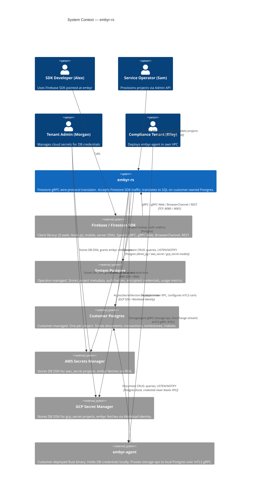

### Wave: DESIGN / [REF] C4 Container Diagram (Mermaid)

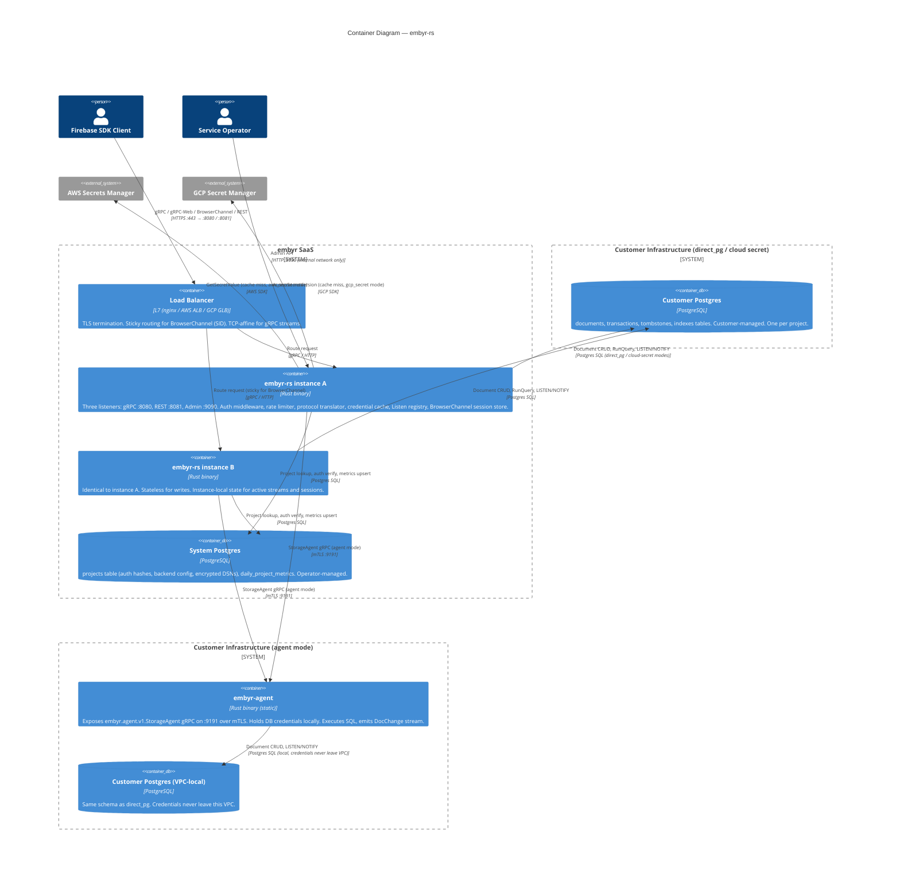

### Wave: DESIGN / [REF] System-Level Decisions Table

| ID | Decision | Verdict | Rationale |
|----|----------|---------|-----------|
| SD-01 | Single binary for all transports | Accepted | SPEC requires gRPC, gRPC-Web, BrowserChannel, REST served simultaneously. Separate processes would require shared session state externalization (Redis), which is explicitly out of scope (D09). Single binary eliminates IPC, reduces operational surface, and satisfies AC-13d ("no separate server process required for browser transports"). |
| SD-02 | In-process Listen registry (no Redis pub/sub) | Accepted | Postgres LISTEN/NOTIFY delivers `DocChange` events to one embyr instance per customer DB connection. The registry fans out in-process to all Listen stream handlers on that instance. Trade-off: live changes for a project only reach clients connected to the instance holding the NOTIFY listener for that project. In practice, all instances hold NOTIFY listeners for all active projects, so all clients on any instance get changes. Rejected alternative: Redis pub/sub would enable cross-instance fan-out but adds operational dependency and distributed failure mode. At the stated scale (p99 ≤ 2 s KPI), in-process fan-out is sufficient. |
| SD-03 | Credential cache keyed by `(project_id, BLAKE3(api_key))` | Accepted | API key is re-presented on every request (Bearer token). BLAKE3 is collision-resistant and fast (~1 ns) — suitable as a cache key. The BLAKE3 fingerprint is not a security boundary; Argon2id handles authentication. This prevents the cache from being poisoned by a key that passes fingerprint matching but fails Argon2id verification: the credential cache is only populated after successful Argon2id verify. Trade-off: cache miss on any new API key value (including after rotation) requires a full credential fetch + Argon2id verify cycle. |
| SD-04 | Per-instance token bucket rate limiting (no distributed coordination) | **Superseded by ADR-015** | Original rationale: simplicity trade-off; per-instance bucket acceptable at launch. Superseded by the `distributed-rate-limiting` feature: the `rate_buckets` table in the system Postgres DB now provides cluster-wide enforcement. The in-process `TokenBucket` is retained as the 20ms-timeout fallback (D3). See ADR-015 for the full context and alternatives considered. |
| SD-05 | Postgres LISTEN/NOTIFY for real-time change delivery (no Kafka / Redis Streams) | Accepted | The data source is Postgres. Adding a separate message broker (Kafka, Redis) would require a CDC pipeline, adding operational complexity and a new failure mode. NOTIFY fires within the committing transaction, guaranteeing that no write is visible without a notification. Trade-off: NOTIFY payload capped at 8 KB — addressed by re-fetching the document via GetDocument in the Listen handler (SPEC explicitly specifies this re-fetch). NOTIFY is regional (one cluster per region) — consistent with SPEC multi-region model. KPI: p99 ≤ 2 s for write → callback; in-process fan-out after NOTIFY adds < 1 ms. |
| SD-06 | OCC via `version` column (no pessimistic locking) | Accepted | Firestore's transaction model is OCC. The `version` column on documents enables lightweight conflict detection without holding Postgres row locks across RPC round-trips. SDK retries on `Aborted`. Trade-off: high-contention writes on hot documents produce higher abort rates. At the stated concurrency (100 concurrent transactions KPI, AC-06a), OCC abort rate is acceptable without additional coordination. Pessimistic locking would require session-affine connections (incompatible with connection pooling). |
| SD-07 | Separate admin port (9090) with no cross-contamination from data ports | Accepted | SPEC requires admin API inaccessible from public network. The isolation is implemented at the TCP listener level (bind to different port, potentially different interface). This is structurally simpler and more auditable than path-based routing (where a routing bug could expose admin endpoints). AC-07f requires admin endpoints not accessible on data port. |
| SD-08 | Soft-delete with 168 h retention window before background purge | Accepted | D08 (locked decision). Immediate hard-delete is operationally irreversible and high-risk. The retention window allows the operator to recover from accidental deletion. Background sweeper (`SweepDeletedProjects`) connects to the customer DB using stored credentials to drop tables; if the customer DB is unreachable, the sweep is skipped and retried next cycle. Trade-off: customer DB credentials must remain valid for the duration of the retention window for purge to complete. |
| SD-09 | embyr-agent as separate static binary (no shared library) | Accepted | Agent runs in customer VPC where embyr SaaS is untrusted. Static binary minimizes supply-chain surface (no runtime dependencies). Binary version must match embyr SaaS major version — enforced by protocol versioning in `embyr.agent.v1.StorageAgent`. Trade-off: separate release process for agent binary. Distribution/packaging is explicitly out of scope for this feature (feature-delta Out of Scope section). |
| SD-10 | Resume token = base64(RFC3339Nano UTC timestamp) | Accepted | Resume tokens encode a read-time. Tombstones are retained for 24 h; any resume token older than 24 h triggers a full re-snapshot (no error). This bounds tombstone table growth and simplifies the delta delivery query to a single `updated_at > sinceTime` predicate. Trade-off: a 24 h outage causes all reconnecting clients to re-snapshot — acceptable for the stated availability model. |

---

## Domain Model

> Updated: 2026-05-23
> Mode: Propose (greenfield — derived from SPEC.md, feature-delta.md, jobs.yaml)

---

### Wave: DESIGN / [REF] Bounded Contexts

embyr-rs has **no domain of its own in the classical sense** — it is a translation layer. The domain is therefore the set of concerns the system must model precisely to fulfil its protocol-fidelity and multi-tenancy obligations. Three bounded contexts emerge from language divergence, isolation requirements, and ownership boundaries.

| # | Bounded Context | Subdomain Type | Responsibility | Rationale |
|---|----------------|---------------|----------------|-----------|
| BC-1 | **Tenant Management** | Core | Owns the lifecycle of a `Project` (the unit of tenancy): provisioning, authentication, suspension, deletion, and usage metering. Lives exclusively in the System DB. | "Project" here means a billing/identity/control-plane entity. It is structurally independent from documents, transactions, and queries. The operator's vocabulary ("create a project", "suspend billing") is entirely different from Alex's ("write a document", "listen for changes"). Language divergence at the persona boundary confirms the split. |
| BC-2 | **Document Storage** | Core | Owns `Document`, `Transaction`, `Index`, `Tombstone`, and the query engine. Executes all CRUD, RunQuery, batch operations, and index management against a customer-owned Postgres. Lives in the Customer DB. | Alex's entire vocabulary lives here. "Document", "collection", "index", "transaction" are distinct from tenant concepts. Isolation requirement: this context must never touch the System DB directly — it receives only a `ProjectId` and a storage adapter. |
| BC-3 | **Real-Time Delivery** | Core | Owns `ListenTarget`, `ResumeToken`, `DocChange` propagation, BrowserChannel session state, and the stream fan-out registry. Bridges Postgres `NOTIFY` events to SDK stream consumers. | The vocabulary here ("listen target", "resume token", "snapshot", "delta", "CURRENT marker") exists nowhere else in the system. Real-time delivery has its own consistency model (eventual, NOTIFY-driven), its own failure modes (buffer overflow → RESET), and its own state that is orthogonal to both tenant management and document mutation. |

**What is NOT a bounded context:**

- **Credential Resolution** is a domain service within Tenant Management, not a separate context. It translates a `BackendConfig` (value object) into a live storage connection. It has no entities, no lifecycle, no invariants of its own.
- **Protocol Translation** (gRPC ↔ SQL encoding) is an infrastructure concern — it belongs to the application/infrastructure layer of each context, not a domain concept.
- **Rate Limiting** is a policy enforcement mechanism within Tenant Management, not a context boundary.

---

### Wave: DESIGN / [REF] Ubiquitous Language

Terms are scoped per bounded context. The same word in two contexts may mean something different — this is intentional.

#### BC-1: Tenant Management

| Term | Definition |
|------|-----------|
| **Project** | The unit of tenancy. Identified by a `ProjectId` matching `^[a-z][a-z0-9-]{0,62}$`. Has a lifecycle: `Active → Suspended → Deleted`. Owns auth configuration and backend connectivity configuration. Lives in the System DB. |
| **ProjectId** | Immutable identifier for a project. RFC 1123 hostname label format. Assigned at provisioning; never changes. |
| **AuthKey** | The credential an SDK client presents on every request (Bearer token). Presented in plaintext over the wire; stored only as an `Argon2idHash`. Never persisted in plaintext. |
| **Argon2idHash** | The result of hashing an `AuthKey` with Argon2id (memory=65536 KiB, iter=3, par=4). The security boundary for client authentication. |
| **DualHashWindow** | The rotation state where both `auth_key_hash` (primary) and `auth_key_hash_2` (secondary) are active. Any match succeeds. Clearing the secondary completes rotation. |
| **BackendConfig** | Value object describing how to reach the customer's Postgres. Variant: `DirectPg` (ECIES-encrypted DSN), `AwsSecret` (ARN reference), `GcpSecret` (resource name), `Agent` (mTLS endpoint). Never contains a plaintext DSN. |
| **EncryptedDsn** | A DSN encrypted at rest using ECIES (X25519 ECDH + HKDF-SHA256 + AES-256-GCM). Decryptable only by re-deriving the private key from the `AuthKey`. |
| **BackendMode** | The variant selector of `BackendConfig`: `direct_pg`, `aws_secret`, `gcp_secret`, `agent`. |
| **AuthMode** | The authentication variant for SDK clients: `key` (API key + Argon2id), `mtls` (mutual TLS). |
| **ProjectStatus** | Enumerated lifecycle state: `Active`, `Suspended`, `Deleted`. |
| **CredentialCache** | In-process LRU cache keyed by `(ProjectId, BLAKE3(AuthKey))`. TTL=5 min. Stores a resolved storage connection (DSN or agent handle). Not a domain object — an infrastructure optimization. |
| **CredentialFingerprint** | `BLAKE3(AuthKey)` — used as a cache lookup key only. Not a security boundary. |
| **DailyProjectMetrics** | Metering record: `(ProjectId, Date, ingress_bytes, egress_bytes, cpu_ms)`. One row per project per calendar day. Upserted on each request. |
| **AdminKey** | The operator's credential for the admin port. A single shared secret per embyr deployment. Must be non-empty at startup. |
| **DeletionRetentionWindow** | The duration (default 168 h) between a project's soft-deletion and its background purge. During this window, the `Deleted` project still occupies the System DB and its customer DB schema remains intact. |
| **SuspensionEffect** | The observable consequence of suspension: all data-plane requests for the project return `PermissionDenied` on the next request after the status write commits. Takes effect within 1 request latency (not eventually). |

#### BC-2: Document Storage

| Term | Definition |
|------|-----------|
| **Document** | The primary aggregate. Identified by a `DocumentPath`. Has `fields` (Firestore Value encoding), `create_time`, `update_time`, and a `version` counter used for OCC. Stored in the customer-owned Postgres `documents` table. |
| **DocumentPath** | The full resource path: `projects/{project_id}/databases/(default)/documents/{collection}/{document_id}`. Unique within a project. |
| **Collection** | A named grouping of documents. Not a stored entity — an emergent concept derived from the first path segment after `documents/`. |
| **CollectionGroup** | A logical union of all collections with the same name across all paths within a project. Enables cross-hierarchy queries. |
| **Fields** | The payload of a document: a map of field names to Firestore `Value` types. Stored as JSONB. Encoding follows the Firestore wire proto exactly. |
| **Version** | A monotonically increasing integer on each document, incremented on every write. The OCC conflict detection key: a mutation specifying `version=N` is rejected if the stored version is not `N`. |
| **Transaction** | An OCC unit spanning `Begin → reads → Commit`. Identified by a `TransactionId`. TTL=60 s. Holds read timestamps and pending mutations. Lives in the `transactions` table. |
| **TransactionId** | Opaque bytes identifying a transaction. Assigned at `BeginTransaction`; invalidated at `Commit`, `Rollback`, or TTL expiry. |
| **OccConflict** | The condition where a document's stored `version` does not match the version recorded at read time. Results in `ABORTED`; the SDK retries. |
| **Mutation** | A write operation within a transaction or batch: `Set`, `Update`, `Delete`. Applied atomically at `Commit`. |
| **Index** | A composite index enabling complex query execution. States: `Creating → Ready`. Stored in the `indexes` table. A query requiring an index that does not exist in `Ready` state returns `FAILED_PRECONDITION`. |
| **IndexState** | Enumerated: `Creating`, `Ready`. Transitions are one-way. |
| **Tombstone** | A record of a deleted document enabling delta delivery on reconnect. Contains `DocumentPath` and `delete_time`. Retained for 24 h. Enables the delta query: "documents deleted since resume time." |
| **StructuredQuery** | The Firestore query representation: collection selector, filters, order clauses, limit, cursor. Translated to SQL by the query engine. |
| **QueryCursor** | A position in a query result set, encoded as document field values or a document reference. Enables pagination via `startAfter` / `endBefore`. |
| **BatchGetRequest** | A read of up to N documents by path in a single RPC. Returns each document or a `MissingDocument` marker. May execute within a transaction. |
| **AggregationQuery** | A query returning aggregated values (currently `count(*)`). No document bodies returned. |

#### BC-3: Real-Time Delivery

| Term | Definition |
|------|-----------|
| **ListenTarget** | A subscription registered by an SDK client specifying a query or document path to watch. Identified by a client-assigned `TargetId`. Has a `ResumeToken`. |
| **TargetId** | A client-assigned integer identifying a listen target within a stream. Reused by the client across reconnects. |
| **ResumeToken** | An opaque bytes value encoding a UTC read-time in RFC3339Nano format, base64-encoded. Returned to the client in `NO_CHANGE` responses. Used on reconnect to request delta delivery rather than a full snapshot. |
| **SnapshotDelivery** | The initial delivery mode: all documents matching the target's query are streamed as `DocumentChange(Added)` events, followed by a `TargetChange(CURRENT)` marker. |
| **DeltaDelivery** | The reconnect delivery mode: only documents changed or deleted since the `ResumeToken` time are streamed. Requires tombstones to cover deleted documents. |
| **DocChange** | An in-process value carrying `(ChangeType, ProjectId, DocumentPath, Version)`. Produced by the Postgres `NOTIFY` listener; consumed by the fan-out registry. Not a domain event in the ES sense — it is an infrastructure signal. |
| **ChangeType** | Enumerated: `Upserted`, `Deleted`. Determines whether the Listen handler re-fetches the document or synthesizes a `DocumentRemove` response. |
| **ListenRegistry** | The in-process map from `ProjectId` to the set of active `ListenTarget` handlers. Receives `DocChange` signals and fans out to matching subscribers. Per-instance — not shared across embyr instances. |
| **RegistryOverflow** | The condition where a subscriber's buffer (capacity=64) is full. Sets an overflow flag; the next `DocChange` triggers a `RESET` response, causing the client to re-snapshot all targets. |
| **RESET** | A `TargetChange(RESET)` response to a slow-consumer subscriber. Instructs the SDK to clear all targets and re-register, triggering full re-snapshot. |
| **CURRENT Marker** | A `TargetChange(CURRENT)` response indicating the initial snapshot is complete. Sent once per target after all initial documents are streamed. |
| **NO_CHANGE** | A `TargetChange(NO_CHANGE)` response carrying an updated `ResumeToken`. Sent after each `DocChange` fan-out and as a keep-alive every 30 s. |
| **BrowserChannelSession** | An in-process session state for the Firebase JS web SDK's long-poll transport. Identified by a `SessionId` (SID). Lives on the embyr instance that created it. Non-transferable across instances. |
| **SessionId** | An opaque string identifying a BrowserChannel session. Assigned at session creation; required on all subsequent requests. |
| **StreamToken** | A per-request sequence token used by the Write stream RPC for ordering. Separate from `ResumeToken`. |

---

### Wave: DESIGN / [REF] Aggregates

This system is OLTP-style protocol translation. Event Sourcing is not warranted (see DD-04). Aggregates use traditional state-based persistence. All aggregates are small by Vernon's Rule 2.

#### BC-1 — Project (Aggregate Root)

**Aggregate root**: `Project`
**Entities contained**: None (root only)
**Value objects**: `ProjectId`, `Argon2idHash` (×2, dual-hash window), `BackendConfig`, `AuthMode`
**Lives in**: System DB, `projects` table

**Invariants enforced:**
1. A `Project` in `Deleted` state must not be reactivated. `Deleted` is terminal.
2. `BackendConfig::DirectPg` requires `AuthMode::Key` — no other auth mode is valid (SPEC invariant 14). This invariant is enforced at construction, not in the persistence layer.
3. `auth_key_hash` must be present in `Active` state. A project without a hash cannot authenticate clients.
4. `ProjectId` is assigned once and immutable. No rename operation exists.
5. `Deleted` projects are not hard-deleted immediately — they enter a retention window (`DeletionRetentionWindow`) before the background sweeper purges them.

**Vernon Rule compliance:**
- Rule 1 (true invariants): `BackendConfig` and `AuthMode` must be consistent within the same project record — enforced transactionally.
- Rule 2 (small): Root entity only. No child entities.
- Rule 3 (reference by identity): `DailyProjectMetrics` references `ProjectId`, not a `Project` object.
- Rule 4 (eventual consistency outside): Suspension effects propagate to the auth middleware without a saga; the per-request DB read provides the effect.

**Commands handled:**
- `ProvisionProject(project_id, backend_config, auth_mode)` → `Project{Active}`
- `SuspendProject(project_id)` → `Project{Suspended}` (idempotent)
- `ActivateProject(project_id)` → `Project{Active}`
- `DeleteProject(project_id)` → `Project{Deleted}`
- `RotateAuthKey(project_id, new_hash)` → updates `auth_key_hash_2` during window, then promotes

---

#### BC-1 — DailyProjectMetrics (Aggregate Root)

**Aggregate root**: `DailyProjectMetrics`
**Entities contained**: None
**Value objects**: `ProjectId`, `MetricsDate`, `IngressBytes`, `EgressBytes`, `CpuMs`
**Lives in**: System DB, `daily_project_metrics` table

**Invariants enforced:**
1. One row per `(ProjectId, Date)`. Enforced by a unique constraint. Conflicts resolve via `ON CONFLICT DO UPDATE` (accumulation).
2. Counters are non-negative. Negative ingress or egress bytes are rejected.
3. Metrics are recorded best-effort and asynchronously. A failed metrics write does not fail the SDK request.

**Vernon Rule compliance:**
- Rule 1: The invariant "one row per (project, day) with accumulated counters" is entirely self-contained.
- Rule 2: Root entity only. No children.
- Rule 3: References `ProjectId` by value, not a `Project` object.
- Rule 4: Metrics recording is decoupled from the SDK request; eventual consistency is explicit.

Note: this is a metering aggregate, not a reporting aggregate. It accumulates raw counters. Aggregation for billing reports is an external concern.

---

#### BC-2 — Document (Aggregate Root)

**Aggregate root**: `Document`
**Entities contained**: None (root only)
**Value objects**: `DocumentPath`, `Fields`, `Version`, `CreateTime`, `UpdateTime`
**Lives in**: Customer DB, `documents` table

**Invariants enforced:**
1. `DocumentPath` is unique within a project. Two documents cannot share a path.
2. A write specifying `version=N` is rejected if stored `version ≠ N` (OCC). This invariant is the entire concurrency model.
3. `create_time` is set once at first write and never updated. `update_time` is updated on every mutation.
4. A `Delete` operation does not remove the row immediately if any active Listen target may need delta delivery — it creates a `Tombstone` and marks the row absent (or removes it; the tombstone is the durable record).

**Vernon Rule compliance:**
- Rule 1: OCC via `version` is the core invariant. It must be checked and committed atomically.
- Rule 2: Root entity only. `Fields` is a value object (JSONB blob), not a child entity.
- Rule 3: `Transaction` references `DocumentPath` values, not `Document` objects.
- Rule 4: `ListenTarget` receives change notifications via `DocChange` signal (Postgres NOTIFY), not via a synchronous domain event from the `Document` aggregate.

**Why Collection is not an aggregate or entity:**
Collection has no identity of its own, no invariants, and no lifecycle. It is an emergent grouping derivable from `DocumentPath`. Giving it an aggregate boundary would require locking it on every document write — a scalability anti-pattern.

---

#### BC-2 — Transaction (Aggregate Root)

**Aggregate root**: `Transaction`
**Entities contained**: None (root only)
**Value objects**: `TransactionId`, `ProjectId`, `ReadTime`, `PendingMutations` (list of `Mutation` VOs), `ExpiresAt`
**Lives in**: Customer DB, `transactions` table

**Invariants enforced:**
1. A `Transaction` not committed within TTL=60 s is expired. `Commit` on an expired transaction returns `NOT_FOUND`.
2. A rolled-back transaction cannot be committed. `Rollback` transitions to terminal state.
3. A `Commit` applies all `PendingMutations` atomically. Partial application is not permitted.
4. OCC conflicts detected at `Commit` time produce `ABORTED`. The transaction is then in a terminal state; it is not retried by the server.

**Vernon Rule compliance:**
- Rule 1: The TTL expiry and rollback finality are true invariants of the transaction lifecycle.
- Rule 2: Small. `PendingMutations` is a list of value objects, not a collection of entities.
- Rule 3: `Transaction` references `DocumentPath` values; it does not hold `Document` objects.
- Rule 4: OCC conflict detection (comparing stored `version` against read-time `version`) is the only cross-aggregate coordination, and it is synchronous within the `Commit` operation by design — it is not an eventual consistency scenario.

---

#### BC-2 — Index (Aggregate Root)

**Aggregate root**: `Index`
**Entities contained**: None
**Value objects**: `IndexId`, `ProjectId`, `IndexDefinition` (collection path + field specs), `IndexState`
**Lives in**: Customer DB, `indexes` table

**Invariants enforced:**
1. An index transitions `Creating → Ready` only. There is no rollback to `Creating` from `Ready`.
2. A `RunQuery` against a collection requiring a composite index that does not have a `Ready` index for the exact field combination returns `FAILED_PRECONDITION`. This is enforced at query planning time, not at index creation time.
3. Duplicate index definitions (same collection + same field set) are rejected.

**Vernon Rule compliance:**
- Rule 1: State transitions are self-contained invariants.
- Rule 2: Root entity only.
- Rule 3: `RunQuery` references `IndexId` by value (or by definition match) when checking preconditions.
- Rule 4: Index creation is an administrative operation. No saga or eventual consistency is required for the `Creating → Ready` transition (it is background DDL in Postgres).

---

#### BC-2 — Tombstone (Not an Aggregate — Supporting Value Record)

`Tombstone` is not an aggregate. It has no commands, no invariants beyond its retention window, and no lifecycle transitions driven by business rules. It is a read-side record produced as a side-effect of document deletion, consumed by the delta delivery query, and purged by the background sweeper after 24 h.

It is modeled as a **domain record** (a value-typed row): `(ProjectId, DocumentPath, DeleteTime)`. No aggregate wrapper is needed.

---

#### BC-3 — ListenTarget (Aggregate Root)

**Aggregate root**: `ListenTarget`
**Entities contained**: None
**Value objects**: `TargetId`, `ProjectId`, `QuerySpec` (or `DocumentPath` for single-doc targets), `ResumeToken`
**Lives in**: In-process (per embyr instance). Not persisted to any database.

**Invariants enforced:**
1. A `ListenTarget` is owned by exactly one gRPC stream. When the stream closes, all its targets are deregistered.
2. `ResumeToken` advances monotonically — it is only updated to a newer timestamp on each `NO_CHANGE` response. It never moves backwards.
3. A `ResumeToken` older than 24 h is treated as absent — the target switches to `SnapshotDelivery` mode.
4. A `ListenTarget` in overflow state (buffer full) must not receive further `DocChange` signals until after the `RESET` is sent and acknowledged.

**Vernon Rule compliance:**
- Rule 1: The overflow invariant (rule 4 above) is the primary consistency requirement — it determines whether the next signal is a `DocChange` or a `RESET`.
- Rule 2: Root entity only.
- Rule 3: References `ProjectId`, `DocumentPath`, and `TargetId` by value. No references to `Document` or `Transaction` objects.
- Rule 4: The `ListenRegistry` fans out `DocChange` signals to multiple `ListenTarget` instances. This is the intended eventual consistency path — one Postgres commit triggers N downstream listener updates.

**Note on in-process residence**: The non-persistent nature of `ListenTarget` is intentional and a locked architectural decision (D09). It means `ListenTarget` state is ephemeral — instance restart triggers re-snapshot for all clients. This is acceptable per the system's scalability model.

---

#### BC-3 — BrowserChannelSession (Aggregate Root)

**Aggregate root**: `BrowserChannelSession`
**Entities contained**: None
**Value objects**: `SessionId`, `ProjectId`, `LogRing` (bounded circular buffer of pending responses)
**Lives in**: In-process (per embyr instance). Not persisted.

**Invariants enforced:**
1. A `SessionId` is assigned once at session creation. It is never reused within the same instance lifetime.
2. A request referencing a `SessionId` not present in the in-process map returns HTTP 400. The SDK then creates a new session (new `SessionId`).
3. A project is limited to `browser_channel_max_sessions` (default 200) concurrent `BrowserChannelSession` instances.

**Vernon Rule compliance:**
- Rule 1: `SessionId` uniqueness and session count cap are the core invariants.
- Rule 2: Root entity only.
- Rule 3: References `ProjectId` by value.
- Rule 4: Not applicable — sessions are independent; no cross-session consistency required.

---

### Wave: DESIGN / [REF] Context Map

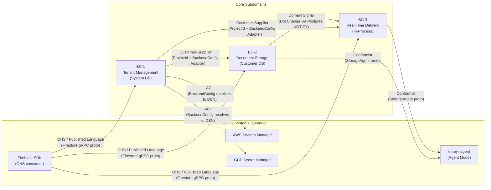

**Relationship annotations:**

| Relationship | Pattern | Direction | Notes |
|-------------|---------|-----------|-------|
| Firebase SDK → embyr (all contexts) | OHS + Published Language | SDK is downstream conformist | embyr serves the Firestore gRPC proto surface unchanged. SDK cannot distinguish embyr from Google Firestore. |
| Tenant Management → Document Storage | Customer-Supplier | TM is upstream | TM supplies `ProjectId` and a resolved `BackendAdapter` to DS. DS does not access the System DB; it receives only what TM provides. |
| Tenant Management → Real-Time Delivery | Customer-Supplier | TM is upstream | Same as above: RTD receives `ProjectId` and adapter from TM. |
| Document Storage → Real-Time Delivery | Domain Signal (one-way) | DS is upstream signal producer | Postgres NOTIFY fires within the committing transaction in DS. RTD's Listen registry receives `DocChange` in-process. No ACL needed — `DocChange` carries only primitive values (path, version, change type). |
| Tenant Management → AWS/GCP Secrets | ACL | TM wraps external secret API | TM translates the external concept of "secret ARN" or "GCP resource name" into an internal `BackendConfig`. The external secret schema (JSON `{"dsn": "..."}`) is absorbed at the ACL boundary, not propagated into the domain model. |
| Document Storage / RTD → embyr-agent | Conformist | Both contexts adopt the `StorageAgent` proto | `embyr.agent.v1.StorageAgent` is the published protocol. DS and RTD call it without translation — they conform to the agent's interface. |

---

### Wave: DESIGN / [REF] Event Model

embyr-rs is **not an event-sourced system**. State is stored directly in Postgres tables (state-based persistence). However, there are two categories of domain-relevant signals worth naming:

#### Integration Signals (Infrastructure-Layer, Not Domain Events)

These are not domain events in the DDD sense — they carry no business meaning on their own and are not stored in an event log. They are infrastructure signals produced by Postgres and consumed by the in-process registry.

| Signal | Producer | Consumer | Carrier | Description |
|--------|---------|---------|---------|-------------|
| `DocChange{Upserted}` | Document Storage (Postgres trigger → NOTIFY) | Real-Time Delivery (LISTEN listener) | Postgres NOTIFY payload | Fired within the committing write transaction. Payload: `(project_id, path, version)`. Triggers re-fetch in the Listen handler. |
| `DocChange{Deleted}` | Document Storage (Postgres trigger → NOTIFY) | Real-Time Delivery | Postgres NOTIFY payload | Same structure. RTD synthesizes `DocumentRemove` response from tombstone. |

#### Administrative State Transitions (Lifecycle Events, BC-1)

These represent real business facts with observable consequences. They are not stored in an event log but they represent meaningful state changes that downstream components react to.

| Event | Trigger | Observable Effect |
|-------|---------|-----------------|
| `ProjectProvisioned` | `POST /admin/v1/projects` succeeds | Customer DB schema migrated; SDK can begin using endpoint. |
| `ProjectSuspended` | `POST .../suspend` | All subsequent data-plane requests → `PermissionDenied`. Effective within 1 request. |
| `ProjectActivated` | `POST .../activate` | Data-plane requests succeed again. |
| `ProjectDeleted` | `DELETE .../projects/{id}` | `GET` returns 404 immediately. Background sweeper schedules purge after retention window. |

**ES/CQRS assessment (see DD-04 for full rationale):** Event Sourcing is not recommended for any bounded context in this system. The audit trail requirement is met by `DailyProjectMetrics` (metering) and Postgres WAL (operational). No temporal queries are needed. CQRS would add complexity without benefit — the read model and write model are identical for both Document Storage and Tenant Management at the current scale and access patterns.

---

### Wave: DESIGN / [REF] Domain-Level Decisions Table

| ID | Decision | Verdict | Rationale |
|----|----------|---------|-----------|
| DD-01 | Three bounded contexts (Tenant Management, Document Storage, Real-Time Delivery) | Accepted | Language divergence at the operator/SDK-developer persona boundary confirms BC-1 vs BC-2. The unique vocabulary of listen targets, resume tokens, and snapshot delivery — absent from both tenant management and document CRUD — confirms BC-3 as a separate context. The three contexts map to three distinct storage locations: System DB, Customer DB, and in-process state. |
| DD-02 | Collection is not a domain entity or aggregate | Accepted | Collection has no identity, invariants, or lifecycle. It is a derivable namespace grouping from `DocumentPath`. Modeling it as an aggregate would require locking it on every document write, creating a hot spot. |
| DD-03 | Tombstone is a supporting record, not an aggregate | Accepted | Tombstone has no commands, no state transitions, and no business invariants. Its only purpose is to satisfy the delta delivery query. Wrapping it in an aggregate would add ceremony with no invariant benefit. |
| DD-04 | No Event Sourcing in any bounded context | Accepted | embyr-rs is OLTP-style protocol translation. The audit trail requirement is satisfied by `DailyProjectMetrics` (metering aggregate) and Postgres WAL. No temporal query requirements exist (there is no "what was the document at time T?" SDK operation in scope). No multiple materialized read models requiring separate projections. Adding ES would impose event versioning, projection rebuilds, and a learning curve with no domain benefit. Postgres state-based persistence is the correct fit. |
| DD-05 | No CQRS in any bounded context | Accepted | Read and write models are identical in Document Storage (GetDocument reads the same row that UpdateDocument writes). In Real-Time Delivery, the "read model" is the live stream — it is populated by NOTIFY, not by a separate projection pipeline. CQRS would add infrastructure complexity (separate read stores, projection workers) with no query performance benefit that Postgres indexes cannot provide. |
| DD-06 | BackendConfig is a value object, not an entity | Accepted | `BackendConfig` has no identity of its own. It describes how to reach a storage backend; it is fully owned by and defined within the `Project` aggregate. Two `BackendConfig`s with identical values are interchangeable. Making it an entity would require inventing an artificial lifecycle and identity that do not exist in the domain. |
| DD-07 | ListenTarget resides in-process, not in Customer DB | Accepted | Listen targets are ephemeral subscriptions. They have no value after the stream closes. Persisting them to Postgres would require a distributed lookup on reconnect across instances, adding latency and coupling. The SDK's reconnect-with-resume-token mechanism provides the durability guarantee that matters: the token encodes the read-time; the document query is stateless given the token. |
| DD-08 | Credential Cache is infrastructure, not a domain object | Accepted | The credential cache is a performance optimization (avoids Argon2id re-verification on every request). It has no business rules, no domain invariants, and no observable business behavior. Placing it in the domain model would pollute BC-1 with infrastructure concerns. |
| DD-09 | DailyProjectMetrics is a separate aggregate from Project | Accepted | Metrics are append-accumulate records with a date dimension. Including them inside the `Project` aggregate would violate Rule 1 (they share no invariants with project lifecycle) and Rule 2 (a project with years of daily metrics would be a very large aggregate). The `ProjectId` foreign key is sufficient coupling. |

---

## Application Architecture

> Updated: 2026-05-23
> Mode: Propose (greenfield — derived from SPEC.md, feature-delta.md, story-map.md, prior brief sections)

---

### Wave: DESIGN / [REF] Development Paradigm

**Verdict: Functional-where-practical Rust (not OOP, not a full FP framework)**

Rust is multi-paradigm. The choice for embyr-rs is to exploit Rust's ownership model as a functional discipline enforcer rather than emulating OOP inheritance hierarchies:

- **Pure transformations for protocol encoding/decoding.** Every Firestore proto ↔ SQL value mapping is a pure function: `firestore_value_to_sql(v: &Value) -> SqlValue`. No mutable state, no side effects, no `self`. This eliminates a class of encoding bugs and makes each mapping independently testable.
- **Explicit error types over exceptions.** All fallible operations return `Result<T, E>` with domain-typed errors (`AuthError`, `StorageError`, `NotifyError`). No panic-as-control-flow outside startup probes.
- **No shared mutable state except behind `Arc<Mutex<T>>` or async channels.** The credential cache, session map, and Listen registry are the three legitimate shared-mutable structures in the system. Each is wrapped in `Arc<RwLock<T>>` (read-heavy cache) or `Arc<Mutex<T>>` (write-required registry). All other state is owned by a single task or passed by value.
- **Trait-based polymorphism over inheritance.** `BackendAdapter`, `SecretFetcher`, `MetricsPort`, and `AgentClient` are Rust traits. Dispatch is static (monomorphic at compile time for the hot path) or dynamic (`dyn Trait` in the composition root for testability). This is the hexagonal ports-and-adapters family — not OOP inheritance.
- **Effect boundary at the adapter layer.** IO, time, cryptography, and network calls are confined to adapter implementations. Domain logic in `embyr-core` operates on values and returns `Result`s; it does not call `tokio::time::Instant::now()` or `sqlx::query!` directly.
- **Async Rust (tokio) for concurrency.** Rust does not have goroutines; it has async tasks scheduled on a Tokio executor. The concurrency model maps directly: one task per Listen stream, one task per BrowserChannel session, one task per background sweeper. No thread-per-request, no blocking IO on async threads.

**Why not full OOP (struct + impl + inheritance simulation)?** Rust has no inheritance. Simulating it with trait objects everywhere sacrifices the compile-time monomorphism that makes the hot path (auth → credential cache → SQL execute) zero-overhead. The domain model sections establish that aggregates are small with no child entities — there is nothing to inherit.

**Why not a pure FP framework (Haskell-style effects, monadic composition)?** Tokio async/await is already the effect system for IO concurrency. Introducing a separate effect algebra (e.g., `frunk` or `fp-core`) would add a learning cliff with no correctness gain beyond what Rust's type system already provides for free. The SPEC's wire protocol is inherently stateful (bidirectional gRPC streams, resume tokens, session state); pretending otherwise by wrapping everything in `IO<A>` increases cognitive overhead without architectural benefit.

---

### Wave: DESIGN / [REF] Architectural Pattern

**Verdict: Hexagonal (ports-and-adapters) with a Cargo workspace as the enforcement mechanism**

The three bounded contexts from the Domain Model map directly to three inner hexagons. The driving ports (inbound) and driven ports (outbound) are Rust traits. The composition root (`embyr-server/src/main.rs`) wires concrete adapters to ports and runs startup probes before opening any TCP listener.

**Dependency rule (enforced by crate boundaries):**

```
embyr-proto        (generated, no domain logic)
       ↑
embyr-core         (domain logic, pure functions, trait definitions — zero IO imports)
       ↑
embyr-server       (composition root: wires adapters, runs probes, opens listeners)
embyr-admin        (admin HTTP server — depends on embyr-core, not on embyr-server internals)
embyr-agent        (separate binary — depends on embyr-core storage traits only)
```

The `embyr-core` crate must not import `tokio`, `sqlx`, `tonic`, `axum`, or any IO crate. It imports only `std`, `thiserror`, `serde`, and the generated proto types from `embyr-proto` for value type definitions. All IO crosses the adapter boundary.

**Enforcement tooling:** `cargo-deny` enforces disallowed dependencies per crate via `deny.toml`. A custom `cargo-depcheck` CI step (using `cargo metadata` + a script) validates that `embyr-core` has no transitive dependency on any IO crate listed in the deny list. This is the compile-time enforcement layer. A pre-commit AST hook (using `syn` or `cargo-machete`) validates that no `use tokio::` or `use sqlx::` appears in `embyr-core/src/`. See AD-06 in the Application-Level Decisions Table for the tool selection rationale.

**Rejected alternative: Layered architecture (controller → service → repository).**
Layered architecture allows higher layers to depend on lower layers by interface, but the layers are horizontal (presentation, application, domain, infrastructure). In practice, without explicit enforcement, "application" layers accumulate direct infrastructure calls. The hexagonal boundary is stricter: `embyr-core` has no knowledge of any infrastructure concept — not even the concept of a database. This is the correct default for a system where testability (AC-isolated unit tests for query translation, OCC logic, and auth decisions) is a first-class concern.

---

### Wave: DESIGN / [REF] Component Decomposition

**Workspace crates:**

| Component | Crate/Module Path | Responsibility | Bounded Context |
|-----------|-------------------|----------------|-----------------|
| `embyr-proto` | `crates/embyr-proto/` | Houses Tonic-generated gRPC stubs for `google.firestore.v1`, `google.firestore.admin.v1`, and `embyr.agent.v1`. Also contains shared proto value types reused by `embyr-core`. Build script (`build.rs`) runs `tonic-build` against the `.proto` files. No logic. | Cross-cutting (generated) |
| `embyr-core` | `crates/embyr-core/` | Domain logic: auth decisions, protocol encoding/decoding (`firestore_value ↔ SQL`), query translation (`StructuredQuery → SQL`), OCC conflict detection, resume token encoding, aggregate value types. Defines all port traits (`BackendAdapter`, `SecretFetcher`, `MetricsPort`, `AgentClient`, `NotifyListener`). No IO imports. | BC-1, BC-2, BC-3 (pure logic) |
| `embyr-core::tenant` | `crates/embyr-core/src/tenant/` | `Project` aggregate, `DailyProjectMetrics` aggregate, `AuthKey` verification logic (Argon2id), `BackendConfig` value object, `CredentialFingerprint` (BLAKE3), `EncryptedDsn` ECIES decrypt, `ProjectStatus` state machine. | BC-1 |
| `embyr-core::storage` | `crates/embyr-core/src/storage/` | `Document`, `Transaction`, `Index`, `Tombstone` value types. `StructuredQuery` → SQL translator. OCC conflict detection. `BackendAdapter` trait definition. | BC-2 |
| `embyr-core::realtime` | `crates/embyr-core/src/realtime/` | `ListenTarget`, `ResumeToken`, `DocChange` types. `ListenRegistry` logic (fan-out, overflow detection, RESET trigger). `BrowserChannelSession` state machine. | BC-3 |
| `embyr-server` | `crates/embyr-server/` | Composition root. Wires all adapters, runs startup probes, opens three TCP listeners. Contains the three listener tasks, the gRPC service implementation (delegates to `embyr-core`), the REST handler (routing decision tree), and the BrowserChannel handler. Imports Tokio, Tonic, Axum, sqlx. | Cross-cutting (infrastructure) |
| `embyr-server::grpc` | `crates/embyr-server/src/grpc/` | Tonic `FirestoreServer` implementation. Auth interceptor (Argon2id verify, rate limit check, project status check). Routes to BC-2 handlers (CRUD, query, transaction) and BC-3 handler (Listen stream). | BC-2, BC-3 (driving adapter) |
| `embyr-server::rest` | `crates/embyr-server/src/rest/` | Axum router implementing the REST port routing decision tree from ADR-001. gRPC-Web bridge. BrowserChannel handler (long-poll session management). grpc-gateway JSON mux. Health endpoints (`/healthz`, `/readyz`). | BC-2, BC-3 (driving adapter) |
| `embyr-server::adapters::postgres` | `crates/embyr-server/src/adapters/postgres/` | `PostgresBackendAdapter` implementing `BackendAdapter` for direct_pg / aws_secret / gcp_secret modes. Connection pool management (sqlx `PgPool`). Postgres NOTIFY listener task. Schema migration runner (sqlx-migrate). `probe()` implementation. | BC-2 (driven adapter) |
| `embyr-server::adapters::agent` | `crates/embyr-server/src/adapters/agent/` | `AgentBackendAdapter` implementing `BackendAdapter` for agent mode. mTLS gRPC client to `embyr.agent.v1.StorageAgent`. Reconnect logic with exponential backoff. `probe()` implementation. | BC-2 (driven adapter) |
| `embyr-server::adapters::secrets` | `crates/embyr-server/src/adapters/secrets/` | `AwsSecretFetcher` and `GcpSecretFetcher` implementing `SecretFetcher`. AWS SDK v1 (`aws-sdk-secretsmanager`) and GCP SDK (`google-cloud-secretmanager`) clients. `probe()` implementations (IAM reachability check). | BC-1 (driven adapter) |
| `embyr-server::adapters::cache` | `crates/embyr-server/src/adapters/cache/` | `CredentialCache` — in-process LRU (`Arc<RwLock<LruCache<CacheKey, BackendAdapter>>>`). TTL eviction. BLAKE3 fingerprint keying. Not a port — pure infrastructure optimization. | BC-1 (infrastructure) |
| `embyr-server::adapters::metrics` | `crates/embyr-server/src/adapters/metrics/` | `PostgresMetricsAdapter` implementing `MetricsPort`. Async best-effort UPSERT to `daily_project_metrics`. Tokio `spawn` to fire-and-forget; failure logs but does not propagate. | BC-1 (driven adapter) |
| `embyr-server::sweepers` | `crates/embyr-server/src/sweepers/` | Three background Tokio tasks: `TransactionSweeper`, `TombstoneSweeper`, `DeletedProjectSweeper`. Each runs on a configurable interval. Failures are logged and retried next cycle; they do not crash the process. | BC-1, BC-2 (infrastructure) |
| `embyr-admin` | `crates/embyr-admin/` | Axum HTTP server on admin port 9090. Implements `POST /admin/v1/projects`, `GET /admin/v1/projects/{id}`, `PATCH`, `POST .../suspend`, `POST .../activate`, `DELETE`. Admin bearer token middleware. Calls `embyr-core::tenant` domain logic; calls `embyr-server::adapters::postgres` for provisioning and migrations. | BC-1 (driving adapter) |
| `embyr-agent` | `crates/embyr-agent/` | Separate binary. Tonic gRPC server implementing `embyr.agent.v1.StorageAgent`. mTLS listener on `:9191`. Executes SQL on local Postgres using sqlx. Emits `DocChange` events to the SaaS via a streaming `Subscribe` RPC. Startup probe: env var check, DB ping, TLS cert parse. | BC-2 (standalone agent) |

---

### Wave: DESIGN / [REF] Driving Ports (Inbound)

Driving ports adapt external calls into the domain. They are the entry points through which the outside world exercises `embyr-core` logic.

| Port | Location | Adapter(s) | What it does |
|------|----------|------------|--------------|
| `FirestoreGrpcPort` | `embyr-server::grpc` | `FirestoreGrpcHandler` (Tonic service impl) | Accepts gRPC requests from Firebase SDK on `:8080`. Auth interceptor runs before every handler. Delegates document ops to BC-2 domain functions, Listen ops to BC-3. |
| `RestPort` | `embyr-server::rest` | `RestRouter` (Axum) | Accepts HTTP/1.1 and HTTP/2 on `:8081`. Routes by Content-Type and path: gRPC-Web bridge → gRPC handler, BrowserChannel path → `BrowserChannelHandler`, streaming JSON → custom streamers, all others → grpc-gateway mux. |
| `BrowserChannelPort` | `embyr-server::rest` (sub-handler) | `BrowserChannelHandler` | Implements Firebase JS SDK's long-poll WebChannel protocol. Manages `BrowserChannelSession` lifecycle (create, forward-channel POST, back-channel GET). Tied to BC-3. |
| `AdminHttpPort` | `embyr-admin` | `AdminRouter` (Axum, separate bind) | Accepts HTTP on `:9090`. Bearer token auth (`admin.key`). Exposes project lifecycle CRUD and suspension endpoints. Tied to BC-1. |
| `AgentGrpcPort` | `embyr-agent` (agent binary only) | `StorageAgentHandler` (Tonic service impl) | Inbound gRPC over mTLS in customer VPC. Accepts storage ops forwarded from embyr SaaS. |

**Auth interceptor design (cross-cutting, applied to `FirestoreGrpcPort` and `RestPort`):**

The auth interceptor runs as a Tonic interceptor on the gRPC port and as Axum middleware on the REST port. It executes in order:
1. Extract `project_id` from the `database` field of the request proto (or URL path for REST).
2. Load `Project` record from System DB (sqlx, single SELECT).
3. Check `ProjectStatus`: `Deleted` → `NOT_FOUND`; `Suspended` → `PERMISSION_DENIED`.
4. Argon2id verify(`api_key`, `auth_key_hash`); also check `auth_key_hash_2` if present (dual-hash rotation window). Failure → `UNAUTHENTICATED`.
5. Rate limit check: per-project token bucket, in-process. Bucket empty → `RESOURCE_EXHAUSTED`.
6. `AdapterForProject(project_id, api_key)`: credential cache lookup (BLAKE3 fingerprint key); on miss, decrypt or fetch DSN; insert into cache.
7. Attach `BackendAdapter` to request context.

Step 3 (status check) precedes step 6 (credential cache lookup). A suspended project never gets a cache hit that could bypass the check.

---

### Wave: DESIGN / [REF] Driven Ports + Adapters (Outbound)

Driven ports are the system's dependencies on external infrastructure. They are Rust traits defined in `embyr-core`; concrete implementations live in `embyr-server::adapters`.

**Earned Trust requirement (Principle 12):** Every driven adapter must implement a `probe()` method that verifies the adapter can honor its contract in the actual deployment environment. Probes run at startup before any TCP listener is opened. A probe failure causes the process to emit `health.startup.refused` and exit non-zero.

#### `BackendAdapter` trait (`embyr-core::storage`)

```
trait BackendAdapter: Send + Sync {
    // Storage operations
    async fn get_document(...) -> Result<Option<Document>, StorageError>;
    async fn create_document(...) -> Result<Document, StorageError>;
    async fn update_document(...) -> Result<Document, StorageError>;
    async fn delete_document(...) -> Result<(), StorageError>;
    async fn run_query(...) -> Result<Vec<Document>, StorageError>;
    async fn batch_get(...) -> Result<Vec<BatchGetResult>, StorageError>;
    async fn run_aggregation_query(...) -> Result<AggregationResult, StorageError>;
    async fn begin_transaction(...) -> Result<TransactionId, StorageError>;
    async fn commit(...) -> Result<CommitResult, StorageError>;
    async fn rollback(...) -> Result<(), StorageError>;
    // Earned Trust
    async fn probe(&self) -> Result<(), AdapterProbeError>;
}
```

**Concrete implementations:**

| Adapter | Crate path | Backend mode | Probe behavior |
|---------|-----------|-------------|----------------|
| `PostgresBackendAdapter` | `embyr-server::adapters::postgres` | `direct_pg`, `aws_secret`, `gcp_secret` | `sqlx::PgPool::acquire()` within 2 s; execute `SELECT 1`; check `documents` table exists; verify `pg_notify` is not suppressed (execute a test NOTIFY and confirm LISTEN receives it within 500 ms — catches Docker overlayfs and WSL2 DrvFs environments that no-op NOTIFY). |
| `AgentBackendAdapter` | `embyr-server::adapters::agent` | `agent` | Connect mTLS channel to agent endpoint; call `StorageAgent.Ping` RPC; verify response within 2 s. Also verify client cert is not expired (not just parseable). |

**Probe fault-injection scenarios (required in CI):**

1. Postgres unreachable: probe must return `AdapterProbeError::DbUnreachable` within 2 s (no infinite hang).
2. Postgres NOTIFY suppressed (simulate with a transaction that never commits): probe must detect via timeout.
3. Agent cert expired: probe must return `AdapterProbeError::CertExpired`.
4. Agent endpoint wrong address: probe must return `AdapterProbeError::ConnectionRefused` within 2 s.

#### `SecretFetcher` trait (`embyr-core::tenant`)

```
trait SecretFetcher: Send + Sync {
    async fn fetch_secret(&self, reference: &SecretReference) -> Result<PlaintextDsn, SecretError>;
    async fn probe(&self) -> Result<(), AdapterProbeError>;
}
```

| Adapter | Crate path | Cloud | Probe behavior |
|---------|-----------|-------|---------------|
| `AwsSecretFetcher` | `embyr-server::adapters::secrets` | AWS | Call AWS STS `GetCallerIdentity` to verify IAM credentials are valid. Log warn only (not refuse to start) if the IAM endpoint is unreachable — IAM may be region-scoped. |
| `GcpSecretFetcher` | `embyr-server::adapters::secrets` | GCP | Fetch OIDC token from metadata server to verify workload identity. Same warn-only behavior. |

#### `MetricsPort` trait (`embyr-core::tenant`)

```
trait MetricsPort: Send + Sync {
    async fn record(&self, project_id: ProjectId, ingress: u64, egress: u64, cpu_ms: u64);
    // No probe — best-effort; failure is logged, not fatal.
}
```

| Adapter | Crate path | Notes |
|---------|-----------|-------|
| `PostgresMetricsAdapter` | `embyr-server::adapters::metrics` | Fire-and-forget Tokio spawn. UPSERT `daily_project_metrics`. Never blocks the hot path. |

#### `NotifyListener` trait (`embyr-core::realtime`)

```
trait NotifyListener: Send + Sync {
    // Subscribe to NOTIFY events for a project's customer DB.
    async fn subscribe(&self, project_id: ProjectId) -> Result<Receiver<DocChange>, NotifyError>;
    async fn probe(&self) -> Result<(), AdapterProbeError>;
}
```

| Adapter | Crate path | Notes |
|---------|-----------|-------|
| `PostgresNotifyListener` | `embyr-server::adapters::postgres` (same crate, different struct) | One dedicated `sqlx::PgConnection` (not from the pool — LISTEN requires a dedicated connection). Each project that has an active Listen subscriber gets one `LISTEN doc_changes_<project_id>` connection. Reconnects with exponential backoff (1 s → 30 s). |

#### `AgentClient` trait (`embyr-core::storage`)

Used by `embyr-server::adapters::agent` to represent the mTLS gRPC channel to `embyr-agent`.

```
trait AgentClient: Send + Sync {
    async fn execute_storage_op(&self, op: StorageOp) -> Result<StorageResult, AgentError>;
    async fn subscribe_changes(&self, project_id: ProjectId) -> Result<Receiver<DocChange>, AgentError>;
    async fn probe(&self) -> Result<(), AdapterProbeError>;
}
```

#### Probe enforcement (three orthogonal layers per Principle 12):

| Layer | Mechanism | What it checks |
|-------|-----------|---------------|
| Subtype (compile-time) | `impl BackendAdapter for PostgresBackendAdapter` — Rust trait bounds enforce presence of `probe()`. Missing method = compile error. | Does the struct claim to implement the trait? |
| Structural (pre-commit AST) | `cargo check --manifest-path crates/embyr-server/Cargo.toml` + a custom proc-macro attribute `#[adapter]` on every concrete adapter struct. The proc-macro verifies at compile time that a `probe()` method is present and returns `Result<(), AdapterProbeError>`. | Is the method signature correct? |
| Behavioral (CI gold-test) | CI stage `probe-contracts`: spins up each adapter against a real or simulated substrate with fault injection (Postgres stopped, cert expired) and asserts probe returns the expected error variant within the time bound. | Does the probe actually detect the failures it claims to detect? |

---

### Wave: DESIGN / [REF] Technology Choices

| Layer | Choice | Version | License | Rationale |
|-------|--------|---------|---------|-----------|
| Async runtime | `tokio` | 1.x (LTS) | MIT | Required by Tonic. Industry-standard Rust async executor. Multi-threaded scheduler (`rt-multi-thread`) for the data-plane hot path. See ADR-003. |
| gRPC framework | `tonic` | 0.12.x | MIT | De facto Rust gRPC library. Supports bidirectional streaming (required for `Listen` RPC), gRPC-Web (via `tonic-web`), and Tonic interceptors for auth middleware. See ADR-004. |
| Proto codegen | `tonic-build` | 0.12.x | MIT | Companion to Tonic. Generates Rust types from `.proto` files at build time. Configured in `embyr-proto/build.rs`. |
| HTTP framework (REST + Admin) | `axum` | 0.7.x | MIT | Tower-compatible Axum integrates natively with Tonic's Tower service model. Chosen over Actix-web because Axum uses the same `tower::Service` trait as Tonic, enabling a unified middleware stack. Single HTTP/2 + HTTP/1.1 server instance handles both REST port and admin port with shared middleware. |
| Database driver | `sqlx` | 0.7.x | MIT / Apache 2.0 | Async Postgres driver with compile-time query checking (`query!` macro). Eliminates a class of SQL type mismatch bugs. Includes built-in migration runner (`sqlx-migrate`). Connection pool (`PgPool`) included. No ORM — queries are plain SQL, which is correct for a system with complex JSONB operations and NOTIFY. |
| Argon2id | `argon2` (RustCrypto) | 0.5.x | MIT / Apache 2.0 | RustCrypto's `argon2` crate. Implements Argon2id with the fixed parameters (memory=65536 KiB, iter=3, par=4) from SPEC. Pure Rust, no C dependency. |
| ECIES / HKDF / ECDH | `x25519-dalek`, `hkdf`, `aes-gcm` (RustCrypto) | current | MIT / Apache 2.0 | Compose X25519 ECDH + HKDF-SHA256 + AES-256-GCM as specified by SPEC invariants 11–12. RustCrypto crates are the standard for pure-Rust cryptographic primitives. No OpenSSL dependency. |
| BLAKE3 | `blake3` | 1.x | CC0 / Apache 2.0 | Single-crate, extremely fast (~1 ns for short inputs). Used for `CredentialFingerprint` (cache key). Not a security boundary — speed is the primary criterion here. |
| TLS | `rustls` + `tokio-rustls` | 0.23.x / 0.26.x | MIT / Apache 2.0 | Pure-Rust TLS. No OpenSSL. mTLS for agent connections (`rustls::ServerConfig` with client cert required). Cert parsing for startup probe. |
| LRU cache | `lru` | 0.12.x | MIT | Minimal LRU cache implementation. Used for `CredentialCache`. `Arc<RwLock<lru::LruCache<K, V>>>` provides concurrent read access. |
| AWS SDK | `aws-sdk-secretsmanager` | 1.x | Apache 2.0 | Official AWS SDK for Rust (Smithy-generated). IRSA credential chain via `aws-config`. Used by `AwsSecretFetcher`. |
| GCP SDK | `google-cloud-secretmanager` | 0.x (community) | MIT | Community GCP Rust SDK. Workload Identity via Application Default Credentials. Used by `GcpSecretFetcher`. If the community crate proves unstable, fallback: direct HTTP call to `https://secretmanager.googleapis.com/v1/{name}:access` with OIDC token from metadata server (pure `reqwest`). |
| Config | `config` | 0.14.x | MIT / Apache 2.0 | Hierarchical configuration from TOML file + environment variable overrides. Used for all startup configuration. |
| Serialization | `serde` + `serde_json` | 1.x | MIT / Apache 2.0 | JSON serialization for JSONB fields, admin API request/response bodies, and secret payload parsing. |
| Error handling | `thiserror` | 1.x | MIT / Apache 2.0 | Derive macros for domain-typed error enums. Used in `embyr-core` for `StorageError`, `AuthError`, `NotifyError`, `AdapterProbeError`. |
| Logging / tracing | `tracing` + `tracing-subscriber` | 0.1.x | MIT | Structured logging with spans. `tracing` spans wrap each gRPC handler call with `project_id`, `rpc_name`, and `trace_id`. Outputs JSON for log aggregation. |
| Metrics | `metrics` + `metrics-exporter-prometheus` | `metrics = "0.23"`, `metrics-exporter-prometheus = "0.15"` | MIT | Prometheus metrics facade + exporter. `metrics::counter!/histogram!/gauge!` macros resolve through a process-global recorder installed once at startup. Scrape endpoint at `GET :9090/metrics`. See ADR-016. |
| Migrations | `sqlx-migrate` (included in `sqlx`) | 0.7.x | MIT / Apache 2.0 | Embedded migration files in `embyr-server/migrations/` (system DB) and `embyr-agent/migrations/` (customer DB schema). Runs at startup before listeners open. |
| Dependency enforcement | `cargo-deny` | 0.14.x | MIT / Apache 2.0 | `deny.toml` per crate. Enforces that `embyr-core` has no IO crate dependencies. Also validates license compliance and known CVEs. |

---

### Wave: DESIGN / [REF] Reuse Analysis

This is a greenfield codebase. The `Cargo.toml` has no dependencies and `src/main.rs` is a stub. Every component is new. Justification is provided for each CREATE NEW decision.

| Existing Component | File | Overlap | Decision | Justification |
|-------------------|------|---------|----------|---------------|
| `embyr-proto` crate | (new) `crates/embyr-proto/` | None | CREATE NEW | Proto stubs must be generated from the Firestore `.proto` files. No existing Rust crate provides the exact `google.firestore.v1` and `embyr.agent.v1` bindings required. The `firestore-client` community crate is client-only and cannot be reused server-side. |
| `embyr-core` crate | (new) `crates/embyr-core/` | None | CREATE NEW | No existing crate provides Firestore query translation (StructuredQuery → SQL), OCC logic, or the domain aggregates defined in the Domain Model. |
| `BackendAdapter` trait | (new) | None | CREATE NEW | The trait is the central architectural element from ADR-002. No existing abstraction in the Rust ecosystem covers the four backend modes (direct_pg, aws_secret, gcp_secret, agent) with a unified interface. |
| `PostgresBackendAdapter` | (new) `crates/embyr-server/src/adapters/postgres/` | None | CREATE NEW | sqlx-based implementation is specific to embyr's schema (`documents`, `transactions`, `tombstones`, `indexes` tables). No ORM layer to reuse. |
| Auth middleware | (new) `crates/embyr-server/src/grpc/` | None | CREATE NEW | Argon2id + ECIES + BLAKE3 in a Tonic interceptor is specific to embyr's security model. No existing Tonic auth middleware implements this combination. |
| BrowserChannel handler | (new) `crates/embyr-server/src/rest/` | None | CREATE NEW | No Rust crate implements Firebase's WebChannel long-poll protocol server-side. The Firebase JS SDK's WebChannel client is the only published reference; embyr must implement the server counterpart from the SPEC. |
| Admin API | (new) `crates/embyr-admin/` | None | CREATE NEW | Project lifecycle management is specific to embyr's data model. Generic admin frameworks (e.g., admin-rs) do not map to the provisioning + migration workflow. |
| `embyr-agent` binary | (new) `crates/embyr-agent/` | None | CREATE NEW | No existing Rust binary proxies Firestore-protocol storage operations over mTLS gRPC. The agent is unique to embyr's architecture. |

**Third-party reuse (OSS substitution over reimplementation):**

| Concern | Reused library | Alternatives rejected |
|---------|---------------|----------------------|
| Argon2id hash | `argon2` (RustCrypto) | Roll-own: rejected (security-critical, no benefit to custom impl). C binding (libargon2): rejected (pure-Rust preference, no OS dependency). |
| X25519 + HKDF + AES-GCM (ECIES) | RustCrypto suite | OpenSSL (`openssl` crate): rejected (C dependency, linking complexity, larger attack surface). |
| BLAKE3 | `blake3` | SHA-256 for cache key: rejected (BLAKE3 is 10× faster for this use case; no security difference since this is a cache key not a hash boundary). |
| Postgres async driver | `sqlx` | `tokio-postgres` (raw): rejected (no compile-time query checking, manual migration management). `diesel` async: rejected (ORM abstraction adds complexity over raw SQL; JSONB operations require raw SQL anyway). |
| HTTP framework | `axum` | `actix-web`: rejected (different actor model; does not share Tower middleware with Tonic, requiring duplicate auth middleware impl). `warp`: rejected (less active maintenance, smaller ecosystem). |

---

### Wave: DESIGN / [REF] Application-Level Decisions Table

| ID | Decision | Verdict | Rationale |
|----|----------|---------|-----------|
| AD-01 | Cargo workspace with five crates | Accepted | Workspace enforces crate-level dependency boundaries. `embyr-core` cannot accidentally import `sqlx` because `sqlx` is not in its `[dependencies]`. `embyr-agent` cannot import `embyr-server` internals. This is the mechanical enforcement of hexagonal architecture in Rust. Rejected alternative: single crate with modules — module visibility in Rust (`pub(crate)`) does not prevent sibling module imports, making the dependency rule unenforced. |
| AD-02 | `BackendAdapter` as a trait in `embyr-core` (not in `embyr-server`) | Accepted | The trait must be defined where the domain logic lives (`embyr-core::storage`) so that domain functions can be written against the trait without importing any adapter crate. If the trait lived in `embyr-server`, domain logic would have an upward dependency on infrastructure. This would invert the dependency rule. |
| AD-03 | Auth middleware runs per-request (no session token / JWT caching) | Accepted | SPEC requires per-request API key verification (Bearer token on every call). The credential cache (step 6 in the auth flow) caches the resolved adapter, not the authentication decision. Argon2id re-verification on every cache miss is the cost of not having a session token. At cache TTL=5 min and typical traffic patterns, re-verification occurs at most once per 5 minutes per (project, api_key) tuple. Rejected alternative: short-lived JWT issued after first Argon2id verify — adds token issuance, rotation, and revocation logic not present in SPEC. |
| AD-04 | `axum` for both REST port and admin port (not `actix-web`) | Accepted | Axum's Tower service model is identical to Tonic's. The auth interceptor, tracing middleware, and rate-limit middleware are Tower layers that can be applied uniformly to both the gRPC-Web bridge and the REST router without duplication. Actix-web uses a different Actor-based middleware model, requiring separate middleware implementations for gRPC and HTTP paths. |
| AD-05 | `sqlx` with compile-time query checking over `diesel` or raw `tokio-postgres` | Accepted | JSONB operations (Firestore value storage), NOTIFY subscription, and the OCC `UPDATE ... WHERE version = $n` pattern require direct SQL control. `diesel`'s query builder does not handle all required JSONB operators without raw SQL escape hatches, eliminating the primary benefit of an ORM. `sqlx`'s `query!` macro provides compile-time type checking of SQL parameters and result columns without abstracting away the SQL. `tokio-postgres` without `sqlx` would require a manual migration runner. |
| AD-06 | `cargo-deny` + custom proc-macro for adapter boundary enforcement | Accepted | `import-linter` (Python ecosystem) does not apply to Rust. `ArchUnit` is JVM-only. For Rust, the options are: (a) `cargo-deny` (import graph — cannot check method presence), (b) custom proc-macro attribute (compile-time method presence check on adapter structs), (c) CI script using `cargo metadata` (dependency tree check). All three layers are deployed: `cargo-deny` for the crate dependency rule, proc-macro for `probe()` method presence, CI script for behavioral probe tests. No single tool provides all three — the combination is required per Principle 12 Earned Trust. |
| AD-07 | `tracing` crate with Tokio console support over `log` | Accepted | `log` is synchronous and has no span/context concept. `tracing` spans propagate through async await points, enabling per-request structured context (project_id, rpc_name) without thread-local storage. Tokio console integration provides live async task inspection during development. Rejected alternative: OpenTelemetry SDK directly — adds significant startup weight; `tracing-opentelemetry` is the bridge if OTel export is needed later without changing log call sites. |
| AD-08 | Dedicated Postgres connection per active project for NOTIFY (not from connection pool) | Accepted | `LISTEN` in Postgres requires a persistent connection that is never returned to the pool mid-stream. Pool connections are designed to be short-lived and interchangeable. A `LISTEN` connection returned to the pool would silently lose its NOTIFY subscription. The dedicated connection approach matches the Postgres `LISTEN/NOTIFY` contract precisely. Cost: one additional Postgres connection per active customer DB. At 100 active projects per instance, this is 100 additional connections — acceptable given the capacity analysis in the System Architecture section. |
| AD-09 | BrowserChannel handler in `embyr-server::rest` (not a separate crate) | Accepted | BrowserChannel is transport infrastructure for BC-3 (Real-Time Delivery). It does not contain domain logic. Placing it in its own crate would require it to depend on both `embyr-core::realtime` (for session state) and the REST framework (Axum), making it a thin glue crate with no independent testability benefit. As a module within `embyr-server::rest`, it shares the REST port's Axum router directly and is testable via the standard Axum test client. |
| AD-10 | `google-cloud-secretmanager` community crate with `reqwest` fallback design | Accepted | The official GCP Rust SDK (`google-cloud-rust`) is under active development (Apache 2.0). The `google-cloud-secretmanager` community crate wraps it. If the community crate proves unstable (tracked in Open Questions), the `GcpSecretFetcher` can be reimplemented as a direct HTTPS call to the GCP REST API with an OIDC token from the metadata server. The `SecretFetcher` trait isolates this decision — the fallback is a single-adapter swap, not a system change. |

---

### Wave: DESIGN / [REF] C4 Component Diagram — Data Plane (Mermaid)

The data plane subsystem is the most complex: it spans the auth interceptor, credential resolution, the Listen stream handler, the Postgres NOTIFY listener, the in-process fan-out registry, and the backend adapter routing for the four backend modes. This L3 diagram shows the internal components of the `embyr-server` container from the C4 Container diagram.

```mermaid
C4Component
    title Component Diagram — embyr-server Data Plane

    Container_Boundary(embyrServer, "embyr-server (Rust binary)") {

        Component(grpcListener, "gRPC Listener", "Tonic TcpIncoming :8080", "Accepts raw HTTP/2 gRPC connections from Firebase SDK and routes to FirestoreHandler")
        Component(restListener, "REST Listener", "Axum TcpListener :8081", "Accepts HTTP/1.1 + HTTP/2. Routing decision tree: gRPC-Web → bridge, /channel → BrowserChannel, health → bypass, streaming JSON → custom, others → grpc-gateway mux")

        Component(authInterceptor, "Auth Interceptor", "Tonic Interceptor / Axum Middleware", "Per-request: extract project_id, load Project from System DB, check status, Argon2id verify API key, rate limit check. Attaches BackendAdapter to request context.")
        Component(rateLimiter, "Rate Limiter", "In-process token bucket (Arc<Mutex>)", "Per-project token bucket. Consumes token on each request. Returns RESOURCE_EXHAUSTED when empty. Resets on instance restart.")
        Component(credentialCache, "Credential Cache", "Arc<RwLock<LruCache>>", "Keyed by (project_id, BLAKE3(api_key)). TTL=5 min. Returns BackendAdapter on hit. On miss: calls CredentialResolver.")
        Component(credentialResolver, "Credential Resolver", "embyr-core::tenant domain service", "BackendConfig variant dispatch: DirectPg → ECIES decrypt; AwsSecret → AwsSecretFetcher; GcpSecret → GcpSecretFetcher; Agent → AgentBackendAdapter. Returns BackendAdapter.")

        Component(firestoreHandler, "Firestore gRPC Handler", "Tonic service impl (embyr-server::grpc)", "Routes gRPC methods: GetDocument / CreateDocument / UpdateDocument / DeleteDocument / RunQuery / BatchGet / AggregationQuery / BeginTransaction / Commit / Rollback → BC2StorageService. Listen → ListenHandler.")
        Component(bc2StorageService, "BC-2 Storage Service", "embyr-core::storage domain functions", "Executes document CRUD, query translation (StructuredQuery→SQL), OCC conflict detection. Calls BackendAdapter. Pure domain logic — no IO.")
        Component(listenHandler, "Listen Stream Handler", "embyr-server::grpc (per-stream Tokio task)", "One task per active Listen stream. Registers ListenTarget in ListenRegistry. Delivers initial snapshot. Receives DocChange from registry channel. Applies in-memory query filter. Re-fetches document via BackendAdapter. Sends documentChange to gRPC stream.")
        Component(listenRegistry, "Listen Registry", "embyr-core::realtime::ListenRegistry (Arc<Mutex>)", "In-process fan-out hub. Maps project_id → set of subscriber channels (capacity=64 each). On registry overflow: sets overflow flag. Next DocChange triggers RESET to that subscriber.")
        Component(notifyListener, "Postgres NOTIFY Listener", "embyr-server::adapters::postgres (dedicated Tokio task per project)", "One long-lived Postgres connection per active project. Executes LISTEN doc_changes_<project_id>. On NOTIFY: parses DocChange payload. Dispatches DocChange to ListenRegistry.")
        Component(browserChannelHandler, "BrowserChannel Handler", "embyr-server::rest (Axum handler)", "Firebase JS SDK long-poll transport. Manages BrowserChannelSession (SID→session map). Forward-channel POST: enqueues write ops. Back-channel GET: long-polls for responses. Delegates Listen to ListenHandler via internal channel.")

        Component(pgAdapter, "Postgres Backend Adapter", "embyr-server::adapters::postgres", "Implements BackendAdapter for direct_pg / aws_secret / gcp_secret modes. sqlx PgPool. Schema migrations. probe(): ping + NOTIFY round-trip test.")
        Component(agentAdapter, "Agent Backend Adapter", "embyr-server::adapters::agent", "Implements BackendAdapter for agent mode. mTLS Tonic client to embyr-agent:9191. Reconnects with exponential backoff. probe(): StorageAgent.Ping RPC.")
        Component(awsFetcher, "AWS Secret Fetcher", "embyr-server::adapters::secrets", "aws-sdk-secretsmanager client. Fetches DSN from ARN via IRSA. probe(): STS GetCallerIdentity (warn-only).")
        Component(gcpFetcher, "GCP Secret Fetcher", "embyr-server::adapters::secrets", "google-cloud-secretmanager client. Fetches DSN via workload identity ADC. probe(): metadata server OIDC token fetch (warn-only).")
        Component(metricsAdapter, "Metrics Adapter", "embyr-server::adapters::metrics", "PostgresMetricsAdapter. Fire-and-forget Tokio spawn. UPSERT daily_project_metrics. Failure logged, not propagated.")
    }

    Container_Boundary(core, "embyr-core (library crate)") {
        Component(tenantDomain, "Tenant Domain", "embyr-core::tenant", "Project aggregate, BackendConfig, Argon2id verify, ECIES decrypt. No IO.")
        Component(storageDomain, "Storage Domain", "embyr-core::storage", "Document/Transaction/Index value types, StructuredQuery→SQL, OCC logic, BackendAdapter trait. No IO.")
        Component(realtimeDomain, "Realtime Domain", "embyr-core::realtime", "ListenTarget, ResumeToken, DocChange, ListenRegistry logic, BrowserChannelSession state machine. No IO.")
    }

    System_Ext(systemDB, "System Postgres", "projects, daily_project_metrics tables")
    System_Ext(customerDB, "Customer Postgres", "documents, transactions, tombstones, indexes tables. NOTIFY source.")
    System_Ext(embyrAgent, "embyr-agent", "StorageAgent gRPC service over mTLS :9191")
    System_Ext(awsSecretsManager, "AWS Secrets Manager", "ARN-based DSN store")
    System_Ext(gcpSecretManager, "GCP Secret Manager", "Resource-name-based DSN store")

    Rel(grpcListener, authInterceptor, "passes request through")
    Rel(restListener, authInterceptor, "passes request through")
    Rel(authInterceptor, rateLimiter, "checks rate limit via")
    Rel(authInterceptor, credentialCache, "resolves adapter via")
    Rel(credentialCache, credentialResolver, "delegates on cache miss to")
    Rel(credentialResolver, tenantDomain, "calls ECIES decrypt in")
    Rel(credentialResolver, awsFetcher, "fetches DSN via")
    Rel(credentialResolver, gcpFetcher, "fetches DSN via")
    Rel(credentialResolver, agentAdapter, "returns handle to")
    Rel(authInterceptor, systemDB, "reads Project record from")
    Rel(authInterceptor, firestoreHandler, "attaches BackendAdapter and routes to")
    Rel(firestoreHandler, bc2StorageService, "delegates CRUD + query ops to")
    Rel(firestoreHandler, listenHandler, "spawns task via")
    Rel(bc2StorageService, storageDomain, "executes domain logic in")
    Rel(bc2StorageService, pgAdapter, "executes SQL via")
    Rel(bc2StorageService, agentAdapter, "forwards ops via")
    Rel(listenHandler, listenRegistry, "registers subscriber in")
    Rel(listenHandler, bc2StorageService, "re-fetches document via")
    Rel(listenHandler, realtimeDomain, "evaluates query filter using")
    Rel(notifyListener, customerDB, "receives NOTIFY from")
    Rel(notifyListener, listenRegistry, "dispatches DocChange to")
    Rel(listenRegistry, listenHandler, "delivers DocChange to (channel per subscriber)")
    Rel(browserChannelHandler, realtimeDomain, "manages session state via")
    Rel(browserChannelHandler, listenHandler, "delegates Listen to")
    Rel(pgAdapter, customerDB, "executes SQL on")
    Rel(agentAdapter, embyrAgent, "calls StorageAgent RPC via mTLS")
    Rel(awsFetcher, awsSecretsManager, "calls GetSecretValue on")
    Rel(gcpFetcher, gcpSecretManager, "calls AccessSecretVersion on")
    Rel(metricsAdapter, systemDB, "upserts metrics to")
```

---

### Wave: DESIGN / [REF] Rate Limiting

> Feature: distributed-rate-limiting | ADR-015 | Updated: 2026-08-07

**Prior state (SD-04, now superseded):** Per-instance `TokenBucket` in a `HashMap<ProjectId, TokenBucket>`. Each embyr node enforced limits independently — a project configured for 1000 RPS could fire N × 1000 RPS cluster-wide across N nodes.

**Current design:** Postgres-backed distributed token bucket with in-process fallback.

#### Coordination mechanism

The system Postgres DB (`rate_buckets` table, migration `0018_rate_buckets.sql`) is the coordination point. Each gRPC request that passes authentication executes an atomic UPDATE against `rate_buckets` for its project, consuming one token and returning the remaining count:

```sql
UPDATE rate_buckets
SET tokens = LEAST($1::float8,
                   tokens + EXTRACT(EPOCH FROM (now() - last_refill)) * $2::float8
             ) - 1.0,
    last_refill = now()
WHERE project_id = $3
  AND tokens + EXTRACT(EPOCH FROM (now() - last_refill)) * $2::float8 >= 1.0
RETURNING tokens;
```

- 1 row returned → request allowed. `RETURNING tokens` provides the remaining count for response headers.
- 0 rows returned → rate limited (`RESOURCE_EXHAUSTED`, gRPC code 8).
- Row lock is at the `project_id` PK level — no cross-project contention.

#### Failure mode — 20ms timeout + in-process fallback (D3)

The Postgres UPDATE is wrapped in `tokio::time::timeout(Duration::from_millis(20), ...)`. On timeout:
1. `rate_limit_pg_timeout_total` counter increments (Prometheus, admin port `/metrics`).
2. The per-instance `TokenBucket` for `project_id` is used instead, capped at exactly 1× `EMBYR_RATE_LIMIT_RPS`.
3. When Postgres recovers, the next request succeeds within 20ms and distributed coordination resumes automatically — no restart required.

This is a "fail open" posture: the cluster enforces at most 1× capacity per node during fallback (not unlimited). A degradation event is observable via the `rate_limit_pg_timeout_total` counter.

#### Configuration (`EMBYR_RATE_LIMIT_RPS`)

Read once at startup; default `1000.0`. Operator-wide — no per-project granularity (D4). Changing the value requires a process restart. The same value is used for both `capacity` (burst size) and `refill_rate` (tokens/second), giving a 1-second window token bucket.

#### Scope

- gRPC port `:8080` — rate limited (all 9 Firestore RPCs).
- REST/gRPC-Web port `:8081` — rate limited (shares the same `Arc<RateLimiter>` as gRPC via `FirestoreService`).
- Admin port `:9090` — **NOT rate limited** (D9). Admin is operator-only, low-volume; exclusion prevents self-DoS during provisioning bursts.

#### Response headers

All 9 gRPC handler call sites attach trailing metadata (tonic 0.12, `Response::metadata_mut()` for unary handlers, `Status::metadata_mut()` for error responses) with:
- `x-ratelimit-limit` — configured capacity
- `x-ratelimit-remaining` — tokens remaining (floored at 0)
- `x-ratelimit-reset` — epoch milliseconds when the next token is available
- `retry-after-ms` — (rejection only) milliseconds the SDK should wait before retrying

Headers are attached inline at each call site using `attach_rate_limit_headers()` and `attach_retry_after()` helper functions — not in tower middleware (D6, because `project_id` lives in the proto body, not metadata; middleware cannot extract it before auth).

#### Provisioning integration

`POST /admin/v1/projects` (provisioning handler) inserts a `rate_buckets` row with `tokens = EMBYR_RATE_LIMIT_RPS` and `last_refill = now()` in the **same transaction** as the `projects` row. FK `ON DELETE CASCADE` removes the row when a project is hard-deleted by the sweeper (168h after soft-deletion). No sweeper code change required.

#### `RateLimitInfo` domain type

`embyr-core::rate_limit::RateLimitInfo { remaining: f64, limit: f64, reset_ms: u64 }` — pure value type in `embyr-core`, zero IO imports. Both the allowed (`Ok`) and rejected (`Err`) arms of `RateLimiter::check()` return this type, enabling header attachment on every response regardless of outcome.

#### Data flow (updated write path, step [2])

The rate-limit step in the gRPC write path (see Data Flow section above) changes from:
```
[2] Rate limit check (per-project token bucket, in-process)
```
to:
```
[2] Rate limit check (RateLimiter::check)
    ├─ Attempt atomic UPDATE rate_buckets (20ms timeout)
    │   ├─ 1 row RETURNING tokens → Ok(RateLimitInfo) — allowed; attach headers to response
    │   └─ 0 rows → Err(RateLimitInfo) — rate limited; RESOURCE_EXHAUSTED + headers
    └─ On timeout/error: per-instance TokenBucket fallback (1× cap) + counter increment
```

---

### Wave: DESIGN / [REF] Open Questions

Items not blocking architecture but requiring resolution during DELIVER wave:

| ID | Question | Impact | Resolution owner |
|----|----------|--------|-----------------|
| OQ-01 | `google-cloud-secretmanager` community crate stability — the official `google-cloud-rust` SDK is in active development. Is the community crate mature enough, or should `GcpSecretFetcher` be implemented as a direct HTTPS call? | AD-10 fallback design is in place; decision needed before S14 (cloud secrets slice). | Platform-architect + implementer during S14. |
| OQ-02 | gRPC-Web bridge implementation: use `tonic-web` crate (included in Tonic 0.12) or implement custom Content-Type transcoding middleware? `tonic-web` handles the gRPC-Web framing; the question is whether it handles all CORS preflight edge cases for the Firebase JS SDK. | If `tonic-web` has gaps, a thin wrapper is needed before S12 (browser transport slice). | Implementer during S12; spike against Firebase JS SDK. |
| OQ-03 | BrowserChannel protocol completeness: SPEC.md describes the WebChannel/BrowserChannel protocol at a behavioral level. Does the Firebase JS SDK use any undocumented protocol extensions (e.g., non-standard MIME boundaries, chunked encoding variants) that require empirical testing? | Only discoverable by running the actual Firebase JS SDK against the implementation in S12. | S12 spike deliverable. |
| OQ-04 | `LISTEN doc_changes_<project_id>` channel naming: NOTIFY channel names in Postgres are limited to 63 bytes. A `project_id` matching `^[a-z][a-z0-9-]{0,62}$` can be up to 63 characters, making `doc_changes_` + 63-char project_id = 75 characters — over the limit. Options: (a) hash the project_id to a fixed-length suffix, (b) truncate, (c) use a numeric ID. | Blocks S07 (NOTIFY fan-out). Decision needed before S07. | Implementer during S07 design. Recommendation: BLAKE3(project_id) truncated to 16 hex chars (64 bits) → `dc_<16hex>` = 19 bytes, always under limit. |
| OQ-05 | Argon2id verification timing on the hot path: SPEC fixes parameters at memory=65536 KiB, iter=3, par=4 (~200–500 ms). The credential cache prevents re-verification on cache hits. But cold-start latency (first request per (project, api_key) pair after restart) is unavoidably slow. Is there an operator SLA for cold-start latency, or is the 5-min TTL window acceptable? | No architecture change needed; operational guidance document needed. | Sam (Service Operator) to confirm during S01. |
| OQ-06 | Firestore conformance test suite: the SDK compat KPI is ≥ 95% pass rate against the Firestore conformance suite. Does a publicly available conformance test suite exist, or must it be derived from the Firebase SDK's integration tests? | Affects acceptance test design for S01–S09. | Acceptance-designer to investigate during DISTILL wave. |

---

## Application Architecture — embyr-agent

> Updated: 2026-05-27
> Feature: embyr-agent full StorageAgent implementation (US-A01 through US-A06)
> Mode: Propose (autonomous analysis, committed recommendations)
> ADRs: docs/feature/embyr-agent/design/adrs/

---

### Wave: DESIGN / [REF] embyr-agent Component Decomposition

This section describes the internal structure of the `embyr-agent` binary after the full implementation. The existing stub (`crates/embyr-agent/src/server.rs`) provides the mTLS skeleton; this design replaces it.

A new 6th workspace crate `embyr-pg-storage` is introduced (see ADR-A03). Both `embyr-server` and `embyr-agent` depend on it.

**Updated workspace crate graph:**

```
embyr-proto        (generated gRPC stubs — no domain logic)
       ↑
embyr-core         (domain logic, pure functions, port trait definitions — zero IO imports)
       ↑
embyr-pg-storage   (sqlx-backed BackendAdapter + NotifyListener — no tonic/axum/rustls)
       ↑         ↑
embyr-server   embyr-agent   (separate binaries; agent must NOT import embyr-server)
embyr-admin
```

**Component table (embyr-agent internal):**

| Component | Module Path | Responsibility | Bounded Context |
|-----------|-------------|----------------|-----------------|
| `AgentConfig` | `crates/embyr-agent/src/config.rs` | Reads all required env vars at startup. Exits non-zero with diagnostic on any missing var. Parses `EMBYR_AGENT_PROJECT_ID` into `ProjectId`. New vars: `EMBYR_AGENT_MAX_CONNS`, `EMBYR_AGENT_LOG_LEVEL`, `EMBYR_AGENT_SHUTDOWN_TIMEOUT_SECS`. | Cross-cutting (startup) |
| `StartupProbe` | `crates/embyr-agent/src/probe.rs` | Runs sequentially: (1) Postgres ping via `PgPool::acquire()` + `SELECT 1`, (2) customer schema migration via `sqlx-migrate`, (3) TLS cert parse validity check. Emits structured log events. Hard failure exits non-zero. Must complete before gRPC listener opens. | Cross-cutting (Earned Trust) |
| `StorageAgentService` | `crates/embyr-agent/src/server.rs` | Tonic `StorageAgent` service implementation. Holds `project_id: ProjectId`, `storage: Arc<PostgresBackendAdapter>`, `notify_listener: Arc<AgentNotifyBridge>`. Dispatches each RPC to `PostgresBackendAdapter` (from `embyr-pg-storage`). Validates resource name project_id matches configured project_id on every request. | BC-2 (driving adapter) |
| `AgentNotifyBridge` | `crates/embyr-agent/src/notify.rs` | Manages the Postgres LISTEN connection for `Subscribe` stream consumers. Starts a `PostgresNotifyListener` task (from `embyr-pg-storage`) on first `Subscribe` call. Bridges NOTIFY events into the tonic server-streaming response channel (capacity 64). Overflow → sets overflow flag in DocChange stream. | BC-3 (real-time delivery) |
| `GracefulShutdown` | `crates/embyr-agent/src/server.rs` | SIGTERM handler. Calls `tonic::transport::Server::graceful_shutdown()`. Waits up to `EMBYR_AGENT_SHUTDOWN_TIMEOUT_SECS` (default 30s). Emits `{"msg":"shutdown complete"}` on clean exit. Cancels in-flight RPCs after timeout with `Unavailable` status. | Cross-cutting (lifecycle) |
| `PostgresBackendAdapter` | `crates/embyr-pg-storage/src/backend_adapter.rs` | Moved from `embyr-server::adapters::postgres_backend`. Implements `BackendAdapter` trait for all document CRUD, query, OCC, tombstone, and transaction operations. Used by both embyr-server and embyr-agent. `probe()` implementation: `SELECT 1` + table existence check. | BC-2 (driven adapter) |
| `PostgresNotifyListener` | `crates/embyr-pg-storage/src/notify_listener.rs` | Moved from `embyr-server::adapters::postgres_notify_listener`. Dedicated `sqlx::PgListener` connection. `notify_channel()` BLAKE3 function. Used by both embyr-server (via ListenRegistry fan-out) and embyr-agent (via AgentNotifyBridge). | BC-3 (infrastructure) |
| `AgentTransactionSweeper` | `crates/embyr-agent/src/sweeper.rs` | Background tokio task. Sweeps expired transactions from the customer DB every 30s (same interval as embyr-server `TransactionSweeper`). Failure is logged and retried next cycle. Shares SQL logic with embyr-pg-storage. | BC-2 (infrastructure) |

---

### Wave: DESIGN / [REF] Proto Extensions (storage_agent.proto)

All additions are backward-compatible proto3 extensions. Existing field numbers are never modified.

| RPC / Message | Type | Field Numbers | Rationale | Slice |
|---------------|------|---------------|-----------|-------|
| `rpc Subscribe(SubscribeRequest) returns (stream DocChange)` | New RPC | — | Required for US-A05 real-time delivery. See ADR-A01. | S05A |
| `message SubscribeRequest` | New message | `project_id = 1` | Identifies which project the SaaS is subscribing on behalf of. The agent validates this matches `EMBYR_AGENT_PROJECT_ID`. | S05A |
| `message DocChange` | New message | `project_id=1, path=2, collection=3, parent=4, kind=5(enum UPSERT/DELETE), version=6, data=7` | Carries the change event from agent to SaaS. `data` is proto3-JSON of Document fields. Always full document JSON (agent re-fetches from Postgres if NOTIFY payload truncated by 8KB limit). | S05A |
| `rpc Ping(PingRequest) returns (PingResponse)` | New RPC | — | Required for `AgentBackendAdapter.probe()` on SaaS side (replaces the current sentinel GetDocument probe, which is ambiguous). A dedicated `Ping` gives a clean, semantically unambiguous probe signal. | S06A |
| `message PingRequest` | New message | `(empty — proto3 zero fields)` | Ping carries no payload. | S06A |
| `message PingResponse` | New message | `server_time = 1 (Timestamp)` | Returns agent wall-clock time so SaaS can detect stale agents. | S06A |
| `rpc ListDocuments(ListDocumentsRequest) returns (ListDocumentsResponse)` | New RPC | — | Required for US-A03 pagination (`ListDocuments` Firestore operation). Server-side pagination at the agent avoids fetching all documents to the SaaS. | S03A |
| `message ListDocumentsRequest` | New message | `parent=1, collection_id=2, page_size=3(default 100), page_token=4, order_by=5, mask=6` | Matches Firestore ListDocuments request semantics. `page_token` is a base64-encoded cursor. | S03A |
| `message ListDocumentsResponse` | New message | `documents=1(repeated Document), next_page_token=2` | Absent `next_page_token` signals last page. | S03A |
| `rpc RunAggregationQuery(RunAggregationQueryRequest) returns (RunAggregationQueryResponse)` | New RPC | — | Required for US-A03 `count()` aggregation. | S03A |
| `message RunAggregationQueryRequest` | New message | `parent=1, structured_aggregation_query=2` | Carries count() aggregation query. | S03A |
| `message RunAggregationQueryResponse` | New message | `result=1(AggregateFields)` | Returns aggregation result. | S03A |
| `message AggregateFields` | New message | `count=1(int64)` | Count result carrier. | S03A |

**No `BatchGetDocuments` RPC is added.** See ADR-A02: `AgentBackendAdapter.batch_get()` on the SaaS side fans out N parallel `GetDocument` RPCs.

---

### Wave: DESIGN / [REF] embyr-agent Config Extensions

All new env vars follow the existing `EMBYR_AGENT_*` prefix convention.

| Env Var | Required | Default | Type | Purpose |
|---------|----------|---------|------|---------|
| `EMBYR_AGENT_DB_DSN` | Yes | — | String | Postgres DSN. Never logged. Existing. |
| `EMBYR_AGENT_CERT` | Yes | — | Path | PEM server TLS certificate. Existing. |
| `EMBYR_AGENT_KEY` | Yes | — | Path | PEM server TLS private key. Existing. |
| `EMBYR_AGENT_CA` | Yes | — | Path | PEM CA cert for mTLS client verification. Existing. |
| `EMBYR_AGENT_LISTEN_ADDR` | No | `0.0.0.0:9191` | SocketAddr | gRPC listen address. Existing. |
| `EMBYR_AGENT_PROJECT_ID` | Yes | — | ProjectId | Single project this agent serves. Validated on every RPC. See ADR-A04. |
| `EMBYR_AGENT_MAX_CONNS` | No | `25` | u32 | Postgres pool max connections. |
| `EMBYR_AGENT_LOG_LEVEL` | No | `info` | tracing LevelFilter | Log verbosity. Accepted values: `trace`, `debug`, `info`, `warn`, `error`. |
| `EMBYR_AGENT_SHUTDOWN_TIMEOUT_SECS` | No | `30` | u64 | Seconds to drain in-flight RPCs after SIGTERM before forceful cancellation. |
| `EMBYR_AGENT_SWEEP_INTERVAL_SECS` | No | `30` | u64 | Interval between `AgentTransactionSweeper` runs. Operational tuning only; default matches embyr-server TransactionSweeper. |

**DSN invariant**: `EMBYR_AGENT_DB_DSN` is read once into `AgentConfig.db_dsn` and passed to `PgPoolOptions::connect()`. It is never cloned into any `tracing::` field, never formatted into a log message, and never written to any file. The CI acceptance test for US-A06 uses a sentinel DSN and greps all log output to verify absence.

---

### Wave: DESIGN / [REF] Startup Sequence

The startup sequence enforces Postgres readiness before the gRPC listener opens (D7 locked decision).

```
Step 1: Parse env vars
  AgentConfig::from_env()
  → If any required var is absent: stderr diagnostic + exit(1) [no port bound]
  → EMBYR_AGENT_PROJECT_ID parsed as ProjectId
  → EMBYR_AGENT_DB_DSN stored in AgentConfig (never emitted to log)

Step 2: Init structured logging
  tracing_subscriber::fmt() with JSON format, EMBYR_AGENT_LOG_LEVEL filter
  → All subsequent log output is structured JSON {level, ts, msg, ...fields}

Step 3: Probe Postgres (HARD gate — failure exits non-zero, no port bound)
  PgPoolOptions::new().max_connections(EMBYR_AGENT_MAX_CONNS).connect(dsn)
  → Connection failure within 10s timeout: log {msg: "startup_refused", reason: "postgres_unreachable"} + exit(1)
  → SELECT 1 on acquired connection: failure → exit(1)
  → Log: {msg: "connected to Postgres", project_id: <id>}

  NOTIFY round-trip probe (HARD gate — detects Docker overlayfs no-op NOTIFY, WSL2 DrvFs):
  → Open a DEDICATED sqlx::PgListener connection (NOT from the pool; same pattern as PostgresNotifyListener)
  → LISTEN on probe channel dc_probe_<random_suffix>
  → pg_notify(probe_channel, 'probe_token') via pool
  → Expect recv() within 500ms; timeout → log {msg: "startup_refused", reason: "notify_suppressed"} + exit(1)
  → Close dedicated LISTEN connection after probe completes
  → Log: {msg: "notify round-trip verified"}

Step 4: Run customer schema migrations (HARD gate)
  sqlx::migrate!("migrations/customer").run(&pool)
  → Migration failure: log {msg: "startup_refused", reason: "migration_failed"} + exit(1)
  → Log: {msg: "schema ready"}

Step 5: Parse and validate TLS material (HARD gate)
  Read cert_pem, key_pem, ca_pem from file paths
  → File not found or parse failure: log {msg: "startup_refused", reason: "tls_load_failed"} + exit(1)
  → Verify cert is not expired (x509 not-after check via rustls cert parsing)
  → Log: {msg: "tls certs loaded and valid"}

Step 6: Construct StorageAgentService
  PostgresBackendAdapter::new(pool)  [from embyr-pg-storage]
  AgentNotifyBridge::new(dsn, project_id)
  StorageAgentService { project_id, storage, notify_bridge }

Step 7: Register SIGTERM handler
  tokio::signal::unix::signal(SIGTERM) → initiates graceful_shutdown

Step 8: Open mTLS gRPC listener (ONLY after steps 3–5 complete)
  TcpListener::bind(EMBYR_AGENT_LISTEN_ADDR)
  tonic::transport::Server::builder().tls_config(tls).add_service(StorageAgentServer)
  → Log: {msg: "listening on :9191", addr: <addr>}
  → From this point, Kubernetes readinessProbe (TCP :9191) reports Ready

[Startup complete — accepting RPCs]
```

**Gate invariant**: Steps 3, 4, and 5 are hard gates. Any failure in these steps means the process exits before Step 8. The log line `"listening on :9191"` ALWAYS appears AFTER `"connected to Postgres"` in the structured log output.

---

### Wave: DESIGN / [REF] Graceful Shutdown

SIGTERM handling follows the SPEC §Lifecycle §Shutdown requirements (US-A06).

```
SIGTERM received
  → tonic graceful_shutdown() called
  → gRPC listener stops accepting new connections immediately
  → In-flight RPCs continue executing

Wait up to EMBYR_AGENT_SHUTDOWN_TIMEOUT_SECS (default 30s)
  → If all RPCs complete within timeout: exit(0) + log {msg: "shutdown complete"}
  → If timeout expires with RPCs still active:
       cancel remaining RPCs → callers receive Status::Unavailable
       exit(0) + log {msg: "shutdown complete", forced: true}

AgentNotifyBridge dropped → PostgresNotifyListener task aborted
PgPool dropped → Postgres connections closed
```

**SIGTERM contract**: New connections are rejected from the moment SIGTERM is received. In-flight RPCs always receive a response (their result or `Unavailable` on timeout).

---

### Wave: DESIGN / [REF] Subscribe Architecture

The Subscribe streaming RPC delivers Postgres NOTIFY events to embyr SaaS in real-time. This is the most novel component in the agent design.

**Flow:**

```
embyr SaaS (AgentBackendAdapter.subscribe_changes)
  └─ gRPC: Subscribe(SubscribeRequest{project_id})
       │
  StorageAgentService::subscribe()
       │
  AgentNotifyBridge::get_or_start_listener(project_id)
       ├─ First subscriber: start PostgresNotifyListener task
       │    └─ sqlx::PgListener::connect(dsn)
       │    └─ LISTEN dc_<BLAKE3(project_id)[:8]>
       └─ Returns: tokio::mpsc::Receiver<DocChange> (capacity 64)
       │
  Per-event loop (tokio streaming task):
       ├─ recv() from mpsc channel
       ├─ On DocChange event:
       │    ├─ If NOTIFY payload contains full document: populate DocChange.data
       │    └─ If payload truncated (>8KB): re-fetch via PostgresBackendAdapter.get_document()
       │         └─ Serialize document fields to proto3-JSON → DocChange.data
       │
       ├─ Send DocChange proto on tonic streaming response
       │
       ├─ On channel overflow (capacity 64 full):
       │    └─ Set overflow flag in DocChange (kind=DELETE, version=0, data="OVERFLOW")
       │         → SaaS receives signal, sends RESET to Listen clients
       │
       └─ On tonic stream closed (SaaS disconnected):
            └─ Drop Receiver → AgentNotifyBridge decrements subscriber count
                 └─ If 0 subscribers: abort PostgresNotifyListener task
```

**Channel capacity decision**: 64 events matches the `ListenRegistry` subscriber channel capacity in embyr-server. This creates symmetric overflow semantics: the agent-side overflow and the SaaS-side registry overflow both produce RESET, and the SaaS side handles both identically.

**NOTIFY payload truncation**: Postgres limits NOTIFY payloads to 8KB. The agent encodes DocChange events in the NOTIFY payload as `{collection_path}/{document_id}` (path-only). The full document JSON is always re-fetched via `PostgresBackendAdapter.get_document()` before sending on the gRPC stream. This matches the embyr-server NOTIFY listener behaviour in `postgres_notify_listener.rs`.

**Single listener per project**: Only one `PostgresNotifyListener` tokio task runs per project regardless of how many embyr SaaS instances connect (each SaaS instance has one Subscribe stream per agent-mode project). The agent serves one project; there is therefore at most one LISTEN connection at any time (plus the pool connections for CRUD operations).

---

### Wave: DESIGN / [REF] Earned Trust — Agent Probe Design

The agent must demonstrate empirically that its substrate is functional before accepting any RPCs. Three probe enforcement layers (Principle 12) apply.

**Agent `StartupProbe` (runs at startup, hard gate):**

| Probe step | What it validates | Lie scenario detected | Failure action |
|------------|------------------|-----------------------|----------------|
| `PgPool::acquire()` + `SELECT 1` | Postgres reachable and responding | Connection refused, auth failure, wrong host | Non-zero exit, `health.startup.refused: postgres_unreachable` |
| `SELECT count(*) FROM documents WHERE false` | `documents` table exists with correct schema | Schema migration never ran, wrong DB | Non-zero exit, `health.startup.refused: schema_missing` |
| `pg_notify(channel, 'probe')` + LISTEN round-trip on dedicated `sqlx::PgListener` connection (opened for probe only; closed after verification; NOT from pool) | NOTIFY is not suppressed | Docker overlayfs no-op NOTIFY, tmpfs, WSL2 DrvFs | Non-zero exit, `health.startup.refused: notify_suppressed` |
| TLS cert parse + not-after check | Cert is valid and not expired | Expired cert causes mTLS handshake failure with SaaS | Non-zero exit, `health.startup.refused: cert_expired` |
| TLS cert CN matches `EMBYR_AGENT_PROJECT_ID` | Cert identity matches configured project | Misconfigured cert/project_id mismatch | Non-zero exit, `health.startup.refused: cert_project_id_mismatch` |

**Three enforcement layers:**

| Layer | Mechanism | What it checks |
|-------|-----------|---------------|
| Subtype (compile-time) | `PostgresBackendAdapter` implements `BackendAdapter` trait (including `probe()`). Missing method = compile error. | Adapter claims to implement the port contract. |
| Structural (pre-commit AST) | `cargo check` on `embyr-pg-storage` with `#[adapter]` proc-macro attribute verifying `probe()` has non-trivial body (not `Ok(())`). Enforced by existing AST hook infrastructure (AD-06). | `probe()` body is not a stub. |
| Behavioral (CI gold-test) | `probe-contracts` CI stage: spins up agent with Postgres stopped → asserts `StartupProbe` returns `postgres_unreachable`; with cert expired → asserts `cert_expired`; with NOTIFY suppressed → asserts `notify_suppressed`. | Probe detects actual failures in real substrate. |

**Ping RPC as SaaS-side probe:** The new `Ping` RPC (ADR-A01 proto extension for S06A) enables `AgentBackendAdapter.probe()` on the SaaS side to send a clean, semantically unambiguous probe signal rather than the current sentinel `GetDocument` approach. The Ping response includes `server_time`, enabling the SaaS to detect clock skew > 5s (a potential mTLS cert validity window issue).

---

### Wave: DESIGN / [REF] C4 Component Diagram — embyr-agent (Mermaid)

This L3 diagram shows the internal components of the `embyr-agent` container. The agent binary is a single OS process with one TCP listener.

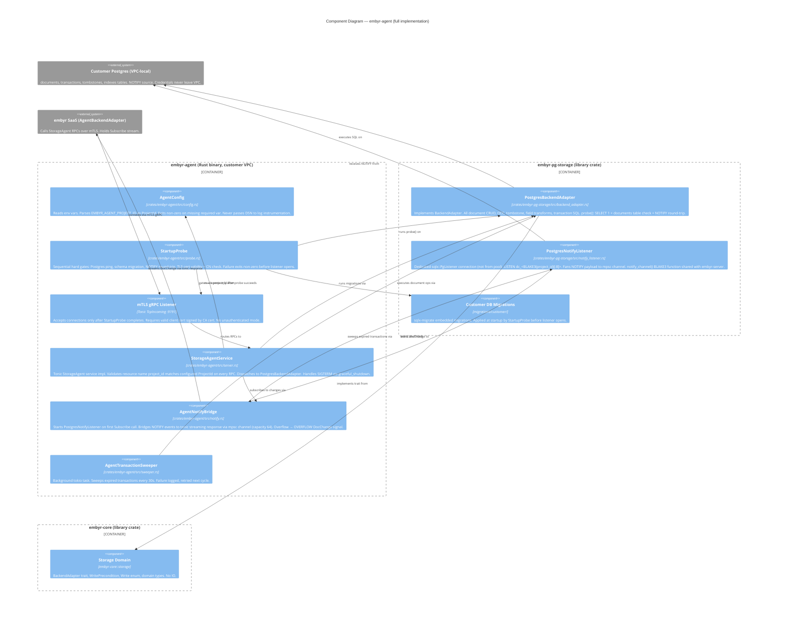

---

### Wave: DESIGN / [REF] Application-Level Decisions Table — embyr-agent

| ID | Decision | Verdict | Rationale |
|----|----------|---------|-----------|
| AD-A01 | Subscribe RPC: server-streaming | Accepted | Agent is the sole event producer. Server-streaming is the simplest unidirectional gRPC primitive. Bidirectional adds heartbeat complexity with no benefit. Polling violates 2s KPI. See ADR-A01. |
| AD-A02 | BatchGetDocuments: N parallel GetDocument RPCs on SaaS side | Accepted | Agent SQL is N independent SELECTs regardless. HTTP/2 multiplexing makes N unary RPCs semantically equivalent to one streaming RPC at <100-document batch sizes. Proto stays minimal. See ADR-A02. |
| AD-A03 | New `embyr-pg-storage` crate (6th workspace crate) | Accepted | SQL complexity (OCC, tombstones, field transforms, NOTIFY) too high for safe duplication. Extracted crate depends on sqlx+tokio only; forbidden from importing tonic/axum/rustls (enforced by cargo-deny). See ADR-A03. |
| AD-A04 | `EMBYR_AGENT_PROJECT_ID` env var for project identity | Accepted | Agent is single-project. Env var is consistent with existing AgentConfig pattern. Adding project_id to all 8 proto messages is premature generalisation for a V1 single-project binary. Cert-CN derivation is fragile. See ADR-A04. |
| AD-A05 | `AgentTransactionSweeper` in agent binary | Accepted | Transactions created on the agent-local Postgres (Begin/Commit via agent) have TTL=60s. Without a sweeper, expired transaction rows accumulate indefinitely. The sweeper is identical in logic to `TransactionSweeper` in embyr-server; it runs on the agent's local customer DB. Embyr SaaS cannot sweep agent-local transactions (it has no direct Postgres access to the customer VPC DB). |
| AD-A06 | Dedicated NOTIFY connection per project (not from pool) | Accepted | LISTEN in Postgres requires a persistent connection. Pool connections are returned after each query; a LISTEN connection returned to the pool loses its subscription silently. Same decision as embyr-server AD-08. The agent serves one project, so at most one dedicated NOTIFY connection exists alongside the pool connections. |
| AD-A07 | Ping RPC replaces sentinel GetDocument for SaaS-side probe | Accepted | The current `AgentBackendAdapter.probe()` sends a GetDocument with path `projects/__probe__/...` and accepts `Unimplemented` as success. This is semantically ambiguous: an agent that returns Unimplemented for all RPCs passes the probe. A dedicated `Ping` RPC with an explicit `PingResponse` distinguishes "agent is fully implemented and functional" from "agent is reachable but returns Unimplemented". The Ping response's `server_time` enables clock-skew detection. **Transition note**: Ping is added in S06A. Between S01A (walking skeleton) and S06A, the existing sentinel GetDocument probe remains valid and is deliberately left in place — it correctly validates mTLS connectivity during the S01A–S06A window when GetDocument is implemented but Ping is not yet. S06A upgrades the probe to Ping. |
| AD-A08 | `embyr-pg-storage` customer DB migrations run in embyr-agent startup (not embyr-server) | Accepted | The agent's customer DB may be freshly provisioned and have no schema. `sqlx::migrate!` in `StartupProbe` ensures the schema is present before any RPC can be served. embyr-server's admin API also runs migrations via `PostgresBackendAdapter.migrate()` at project provisioning time; both are safe because sqlx-migrate is idempotent. |

---

### Wave: DESIGN / [REF] Reuse Analysis — embyr-agent

| Existing Component | File | Overlap | Decision | Justification |
|-------------------|------|---------|----------|---------------|
| `PostgresBackendAdapter` | `crates/embyr-server/src/adapters/postgres_backend.rs` | 100% overlap — identical SQL required | MOVE to `embyr-pg-storage` | Agent needs the same SQL as embyr-server. Moving to shared crate eliminates duplication without violating AD-01. |
| `PostgresNotifyListener` | `crates/embyr-server/src/adapters/postgres_notify_listener.rs` | 100% overlap — identical LISTEN/NOTIFY pattern | MOVE to `embyr-pg-storage` | `notify_channel()` BLAKE3 function must be identical in agent and server. Moving to shared crate is the only way to guarantee this. |
| `StorageAgentService` stub | `crates/embyr-agent/src/server.rs` | Partial — mTLS skeleton, `run()`, all 8 RPC stubs | EXTEND — replace stub RPC bodies | Skeleton already proves mTLS wiring. Extend by injecting `PostgresBackendAdapter` (from pg-storage) and replacing `Err(Status::unimplemented(...))` with real implementations. |
| `AgentConfig` | `crates/embyr-agent/src/config.rs` | Partial — 5 existing vars | EXTEND — add 3 new vars | Add `project_id`, `max_conns`, `log_level`, `shutdown_timeout_secs` to existing struct. |
| `main.rs` | `crates/embyr-agent/src/main.rs` | Partial — logging init, error exit | EXTEND — add startup probe gate | Insert `StartupProbe::run()` call before `server::run()`. Redirect logging to JSON format. |
| `AgentBackendAdapter.probe()` | `crates/embyr-server/src/adapters/agent_backend.rs` | Partial — uses sentinel GetDocument | MODIFY — replace with Ping RPC | Replace sentinel GetDocument probe with new `Ping` RPC call. Cleaner semantics; detects Unimplemented vs functional distinction. |
| `BackendAdapter` trait | `crates/embyr-core/src/storage/backend_adapter.rs` | Exact — `batch_get()` needed | EXTEND trait | Add `batch_get(project_id, paths) -> Result<Vec<BatchGetResult>, CoreError>` method to trait. Both adapters implement it. |
| `notify_channel()` function | `crates/embyr-server/src/adapters/postgres_notify_listener.rs` | 100% — must be identical | MOVE to `embyr-pg-storage` | The NOTIFY channel name derivation (BLAKE3 truncated to 16 hex) must match between SaaS LISTEN and agent NOTIFY. Single source of truth in shared crate. |

**Third-party reuse (no new dependencies required for agent implementation):**

All crates needed by `embyr-agent` are already present in the workspace:
- `sqlx` (via `embyr-pg-storage`) — Postgres driver
- `tonic` — gRPC server
- `tokio` — async runtime
- `rustls` + `tokio-rustls` — TLS
- `tracing` + `tracing-subscriber` — structured logging
- `blake3` (via `embyr-pg-storage`) — channel name derivation
- `thiserror` — error types

No new npm, cargo, or external dependencies are introduced by the embyr-agent full implementation.

---

### Wave: DESIGN / [REF] Quality Attribute Strategies — embyr-agent

| Quality Attribute | Strategy | Measurable Target |
|------------------|-----------|--------------------|
| **Reliability** | Startup probe gates listener on Postgres readiness. SIGTERM drain. Transaction sweeper prevents expired-tx accumulation. Reconnect backoff on SaaS side for Subscribe disconnects. | Startup failure exits non-zero within 10s. SIGTERM drain completes within 30s (or forces cancellation). Zero expired transactions accumulate beyond 90s. |
| **Security (DSN confidentiality)** | DSN never passes through any `tracing::` macro, never formatted into a `String` for logging, never included in error messages. Negative CI test with sentinel DSN value. | Zero log lines containing DSN substring in all CI runs. |
| **Security (mTLS enforcement)** | `ServerTlsConfig` with `client_ca_root` — no unauthenticated mode. TLS cert CN validated against `EMBYR_AGENT_PROJECT_ID` at startup. | All connections without valid client cert rejected at TLS handshake (no gRPC status returned). |
| **Protocol fidelity** | `PostgresBackendAdapter` (shared with embyr-server) executes identical SQL for identical operations. Same OCC semantics, same tombstone insertion, same field encoding. | Parity test suite (US-A03 KPI): same queries against direct-mode and agent-mode projects return identical results. |
| **Real-time latency** | Postgres NOTIFY + dedicated listener connection + tokio mpsc (capacity 64) + server-streaming gRPC. Re-fetch from pool on payload truncation. | Write → onSnapshot callback p99 ≤ 2s under ≤100 writes/sec (US-A05 KPI). |
| **Observability** | Structured JSON log output (`tracing-subscriber` fmt with JSON). Every RPC logs `project_id`, `rpc_name`, `duration_ms`. DSN excluded from all log fields. Startup lifecycle events are structured events. | All log output parseable by `jq`. Startup events follow structured schema. |
| **Maintainability** | SQL extracted to `embyr-pg-storage`. Single source of truth. cargo-deny enforces crate boundary invariants. | Zero SQL duplication between embyr-server and embyr-agent. cargo-deny CI check passes. |

---

### Wave: DESIGN / [REF] Slice Execution Order and Architecture Dependencies

Slice order S01A → S06A → S02A → S04A → S03A → S05A (locked decision D9 from DISCUSS). Architecture dependencies:

| Slice | Architectural prerequisite | Depends on |
|-------|---------------------------|-----------|
| S01A | `embyr-pg-storage` crate created; `PostgresBackendAdapter` moved | `BackendAdapter` trait (existing), sqlx (existing) |
| S06A | `AgentConfig` extended; `StartupProbe` module; `GracefulShutdown`; `Ping` RPC added to proto | S01A (pool available to probe) |
| S02A | Write RPCs: `CreateDocument`, `UpdateDocument`, `DeleteDocument` in `StorageAgentService` | S01A (adapter present), S06A (config has project_id) |
| S04A | Transaction RPCs: `BeginTransaction`, `Commit`, `Rollback`; `AgentTransactionSweeper` | S02A (writes working) |
| S03A | Query RPCs: `RunQuery`, `RunAggregationQuery`, `ListDocuments`; new proto messages | S01A (read path working) |
| S05A | `Subscribe` RPC; `AgentNotifyBridge`; proto extension; NOTIFY round-trip in startup probe | S01A, S02A (writes trigger NOTIFY), S06A (probe includes NOTIFY check) |

---

## Application Architecture — user-admin-ui

> Updated: 2026-06-14
> Feature: user-admin-ui (Leptos 0.8 CSR WASM SPA)
> Mode: Propose (autonomous analysis — design spec pre-approved)
> ADRs: docs/product/architecture/adr-005 through adr-008

---

### Wave: DESIGN / [REF] Quality Attribute Priorities — user-admin-ui

| Rank | Attribute | Forcing Constraint |
|------|-----------|-------------------|
| 1 | **Bundle size** | Hard limit: `<5 MB` WASM bundle (CLAUDE.md). Highest-risk assumption. Validated at Walking Skeleton (Slice 01). Any dependency that adds significant size is a blocker. |
| 2 | **Zero JS toolchain** | Pure Rust workspace. No npm, no webpack, no TypeScript compiler. `trunk` is the only additional build tool. Contributors must not need two build systems. |
| 3 | **Type safety** | All domain types (Database, Member, AdminKey, NavState) are Rust structs. Compiler enforces exhaustiveness of Msg enum. No `serde_json::Value` duck-typing in view code. |
| 4 | **UX responsiveness** | SVG charts with mousemove crosshair, modal Portal rendering, clipboard API, keyboard ESC — all require genuine reactivity, not server round-trips. Leptos fine-grained reactivity re-renders only changed components. |
| 5 | **Testability** | `update()` is a pure Rust function testable with `cargo test` — no browser, no WASM runtime. Domain type constructors in `data.rs` are testable. Charts' SVG path functions are pure math functions. |
| 6 | **Maintainability** | Single language for both server and UI. Directory structure mirrors views and components 1:1. `Msg` enum variants are the authoritative list of state transitions — compiler enforces completeness. |
| 7 | **V2 migration safety** | `Resource`/`Action` async blocks are the only thing that changes when moving from mock to `#[server]` functions. No component changes. Migration is a compile-time-verifiable guarantee. |

---

### Wave: DESIGN / [REF] Component Decomposition

New workspace crate: `crates/embyr-admin-ui/`

**Core TEA modules:**

| File Path | Responsibility | Slice |
|-----------|---------------|-------|
| `src/main.rs` | WASM entry: `mount_to_body(App)`, `console_error_panic_hook` | 01 |
| `src/model.rs` | `AppModel` struct (all domain state) + domain types (`Database`, `Member`, `NavState`, `Section`, `DbTab`, etc.) | 01 |
| `src/msg.rs` | `Msg` enum — 30+ variants, all `Clone`, exhaustive | 01 |
| `src/update.rs` | Pure `fn update(&mut AppModel, Msg)` — no IO, no async, deterministic | 01 |
| `src/data.rs` | Mock data: `databases()`, `members()`, `sdk_keys()`, `billing_usage()`, `query_logs()` — V2 replacement target | 01 |
| `src/app.rs` | Root component: `RwSignal<AppModel>`, `Callback<Msg>`, context provision, Auth/Shell router | 01 |

**Shell components:**

| File Path | Responsibility | Slice |
|-----------|---------------|-------|
| `src/components/sidebar.rs` | Navigation items, database count badge, account switcher `Menu` | 01 |
| `src/components/topbar.rs` | Breadcrumb, notifications menu, user avatar menu, sign-out | 01 |
| `src/components/mod.rs` | Module re-exports | 01 |

**Primitive component library (`src/components/primitives/`):**

| Component | Props/Variants | Slice |
|-----------|---------------|-------|
| `Button` | variant: Default|Primary|Ghost|Danger; size: Sm|Md|Lg; icon; disabled; on_click | 01 |
| `Badge` | variant: Active|Suspended|Deleted|Pending | 01 |
| `Card` | header slot; children | 01 |
| `Modal` | title; Leptos Portal; ESC closes via `window_event_listener` | 02 |
| `Input` | value signal; on_change; placeholder; error | 02 |
| `Toggle` | checked; on_change; disabled | 04 |
| `Tabs` | items: Vec<TabItem>; active signal; on_change | 02 |
| `Menu` | trigger slot; items; width | 01 |

**Chart components (`src/components/charts/`):**

| Component | What it renders | Slice |
|-----------|----------------|-------|
| `Sparkline` | Polyline SVG path from `&[f64]` (24 points) | 02 |
| `LatencyChart` | Full 24h latency chart + mousemove crosshair via `web-sys::MouseEvent` | 02 |
| `BarChart` | Hourly ops bar chart (reads/writes/deletes) | 02 |
| `Donut` | Percentage ring SVG | 05 |

**Views:**

| File Path | Responsibility | Slice |
|-----------|---------------|-------|
| `src/views/auth.rs` | Login form, MFA TOTP 6-digit input, email OTP, recovery code | 01 |
| `src/views/dashboard.rs` | KPI grid, database card grid, empty state | 01 |
| `src/views/databases.rs` | Databases table, `CreateDatabaseModal` | 02 |
| `src/views/db_detail/mod.rs` | DB detail wrapper: header, tab router | 02 |
| `src/views/db_detail/overview.rs` | KPI tiles, latency chart, ops bar chart, logging toggle | 02 |
| `src/views/db_detail/connections.rs` | Backend config panel (masked DSN / agent endpoint), edit/save/cancel, active connections placeholder | 03 |
| `src/views/db_detail/logs.rs` | Query log table, filters, sort, export CSV | 05 |
| `src/views/db_detail/keys.rs` | SDK keys table, create-and-show-once flow, revoke | 03 |
| `src/views/billing.rs` | Time range selector, per-database breakdown table | 05 |
| `src/views/identities.rs` | Members tab + Service Accounts tab | 04 |
| `src/views/api_keys.rs` | Admin API keys table, create-and-show-once flow | 04 |
| `src/views/settings.rs` | Account, Auth Methods, OIDC providers, Danger Zone | 06 |

**Build artifacts:**

| File Path | Responsibility | Slice |
|-----------|---------------|-------|
| `Cargo.toml` | `leptos { features = ["csr"] }`, `wasm-bindgen`, `web-sys`, `js-sys`, `serde`, `uuid`, `chrono` | 01 |
| `Trunk.toml` | `public_url = "/admin/"`, dist output | 01 |
| `index.html` | Trunk entry: links `styles.css`, loads `.wasm` | 01 |
| `public/styles.css` | Verbatim port of `static/styles.css` — 3 themes (`data-look="ember"|"graphite"|"paper"`), 2 density modes | 01 |
| `public/assets/embyr-mark.svg` | Brand mark | 01 |

**embyr-admin extension:**

| Change | Scope | Slice |
|--------|-------|-------|
| Add `ServeDir` route at `/admin/` in `main.rs` | `crates/embyr-admin/src/main.rs` | 01 |
| Add `tower-http` with `fs` feature to Cargo.toml | `crates/embyr-admin/Cargo.toml` | 01 |
| `make ui` Makefile target | root `Makefile` | 01 |

---

### Wave: DESIGN / [REF] Driving Ports (Inbound)

The embyr-admin-ui SPA is driven by the browser environment. There are no traditional "driving ports" in the hexagonal sense — the SPA is a client, not a server. The inbound event sources are:

| Event Source | Adapter in Leptos | What triggers it |
|-------------|------------------|-----------------|
| Browser HTTP GET `/admin/` | `ServeDir` in `embyr-admin` serves `index.html` | User navigates to the admin URL |
| DOM events (click, input, submit) | Leptos event handlers (`on:click`, `on:input`) | User interaction with any component |
| Keyboard events | `window_event_listener("keydown", ...)` in Modal component | ESC key closes modals |
| Mouse events | `web-sys::MouseEvent` + `mousemove` listener | Chart crosshair positioning in `LatencyChart` |
| Clipboard API | `web-sys::Navigator::clipboard()` | Copy-to-clipboard in key creation modals |
| Leptos `Resource` completion | `Effect::new` wired to `dispatch` | Async data load completes (mock in V1, `#[server]` in V2) |

---

### Wave: DESIGN / [REF] Driven Ports and Adapters

**V1 driven port — Mock data (`data.rs`):**

| Port | V1 Adapter | V2 Adapter |
|------|-----------|-----------|
| Database list | `mock::databases() -> Vec<Database>` | `#[server] fetch_databases() -> Result<Vec<Database>, ServerFnError>` |
| Database mutation | `mock::make_database(&NewDatabase) -> Database` | `#[server] create_database(input) -> Result<Database, ServerFnError>` |
| Member list | `mock::members() -> Vec<Member>` | `#[server] fetch_members() -> Result<Vec<Member>, ServerFnError>` |
| SDK keys | `mock::sdk_keys(db_id) -> Vec<SdkKey>` | `#[server] fetch_sdk_keys(db_id) -> Result<Vec<SdkKey>, ServerFnError>` |
| Admin keys | `mock::admin_keys() -> Vec<AdminKey>` | `#[server] fetch_admin_keys() -> Result<Vec<AdminKey>, ServerFnError>` |
| OIDC providers | `mock::oidc_providers() -> Vec<OidcProvider>` | `#[server] fetch_oidc_providers() -> Result<Vec<OidcProvider>, ServerFnError>` |
| Billing usage | `mock::billing_usage(range) -> Vec<BillingRow>` | `#[server] fetch_billing(range) -> Result<Vec<BillingRow>, ServerFnError>` |
| Query logs | `mock::query_logs(db_id) -> Vec<LogEntry>` | `#[server] fetch_query_logs(db_id, filters) -> Result<Vec<LogEntry>, ServerFnError>` |

**V2 migration path** (ADR-007): the only change per operation is the single line inside the `Resource`/`Action` async block. No component changes.

**Earned Trust — no driven adapter probe required for V1** because the mock data layer is in-process Rust code with no external substrate. V2 `#[server]` functions call `embyr-admin` API routes which call Postgres — the Postgres probe is already covered by the `embyr-admin` startup sequence (V2 work outside this feature's scope).

---

### Wave: DESIGN / [REF] Bundle Size Budget

| Layer | Estimated Size (compressed) | Notes |
|-------|-----------------------------|-------|
| Leptos 0.8 core + CSR runtime | ~300–500 KB | Fine-grained reactivity; no VDOM overhead |
| `wasm-bindgen` + `web-sys` | ~100–200 KB | Only features requested via Cargo.toml features compile in |
| `serde` + `serde_json` | ~80–120 KB | Required for domain type serialization |
| `uuid` (v4 + js feature) | ~30–50 KB | Uses `js-sys` Math.random in WASM |
| `chrono` (wasmbind feature) | ~50–80 KB | Date formatting for log tables and billing range |
| Application code (all views + components + charts) | ~200–400 KB | SVG path math, TEA model, all views |
| `styles.css` (uncompressed) | ~50–80 KB | Verbatim port of design prototype CSS |
| **Total estimated (compressed)** | **~810 KB – 1.4 MB** | Well under 5 MB hard limit |

**Validation**: `trunk build --release` output is measured in the Slice 01 CI job. The CI job fails if the total `dist/` directory exceeds 5 MB. This is the primary KPI gate for Walking Skeleton.

**Risk**: `web-sys` features requested but unused are tree-shaken by `wasm-opt` (invoked by trunk in release mode). Over-requesting features (e.g., all of `web-sys`) would balloon the bundle. The `Cargo.toml` must list only the features actually used: `Window`, `Document`, `Element`, `MouseEvent`, `KeyboardEvent`, `Navigator`, `Clipboard`, `ClipboardItem`.

---

### Wave: DESIGN / [REF] Architecture Enforcement

| Concern | Enforcement Mechanism |
|---------|----------------------|
| No tokio/sqlx/tonic/axum in `embyr-admin-ui` | `cargo-deny`: `deny.toml` for the UI crate lists server-side IO crates as denied |
| `update()` must remain pure (no IO) | CI mutation test (`cargo mutants -p embyr-admin-ui`): any mutation that introduces IO will cause test failures since no async test infrastructure is present |
| `Msg` enum exhaustiveness | Rust compiler: `match msg { ... }` in `update()` must be exhaustive — missing variant = compile error |
| `AppModel` types are `Clone` | Rust compiler: `RwSignal::new(AppModel::from_mock())` requires `Clone` — missing impl = compile error |
| Bundle size `<5 MB` | CI job: `trunk build --release && du -sh dist/ && [ $(du -sm dist/ | cut -f1) -lt 5 ]` |
| Primitive components match CSS contract | Visual regression screenshots in CI (V2; Slice 07) |

---

### Wave: DESIGN / [REF] Reuse Analysis

#### JSX Prototype Files (`crates/embyr-admin/static/`)

The JSX prototype is a design-time artifact in a different language (JavaScript/JSX). The `EXTEND` classification is inapplicable — the prototype cannot be extended or imported into the Rust/WASM codebase. The applicable classifications are PORT (manual translation required), REUSE_ASSET (copy verbatim), DROP (exclude from production), and DERIVE (Rust type derived from JS shape with type-system guarantees added).

| File | Classification | Action |
|------|---------------|--------|
| `store.jsx` | PORT | AppProvider state + mutations → `model.rs` (AppModel struct) + `msg.rs` (Msg enum) + `update.rs` (update fn). The 7 `useState` instances → 7 fields on `AppModel`. The 12 mutation functions → 12 Msg variants. Manual translation required — type system guarantees added (exhaustive match, Clone bounds). |
| `app.jsx` | PORT | Sidebar, Topbar, Routed, Root → `sidebar.rs`, `topbar.rs`, `app.rs`. Routing via `nav.section` match → `match model.nav.section` in `app.rs`. TweaksPanel dropped (see below). |
| `views_auth.jsx` | PORT | AuthGate component → `views/auth.rs`. Form state (`useState`) → local `RwSignal` or dispatched Msg. TOTP input logic → CodeInput component in `views/auth.rs`. |
| `views_dashboard.jsx` | PORT | DashView → `views/dashboard.rs`. Database card grid, KPI grid → Leptos component with `move || model.with(|m| m.databases.clone())`. |
| `views_databases.jsx` | PORT | DatabasesView → `views/databases.rs`. CreateDatabaseModal → Modal primitive. |
| `views_db_detail.jsx` | PORT | DatabaseDetail → `views/db_detail/mod.rs` + `overview.rs` + `connections.rs`. |
| `views_db_logs.jsx` | PORT | Log table + filters → `views/db_detail/logs.rs`. |
| `views_billing.jsx` | PORT | BillingView → `views/billing.rs`. |
| `views_identities.jsx` | PORT | IdentitiesView (Members + Service Accounts tabs) → `views/identities.rs`. |
| `views_apikeys.jsx` | PORT | ApiKeysView → `views/api_keys.rs`. |
| `views_settings.jsx` | PORT | SettingsView → `views/settings.rs`. |
| `ui.jsx` | PORT | Button, Badge, Card, Modal, Input, Toggle, Tabs, Menu, Avatar, MenuItem → `components/primitives/` (one file per component). CSS class names preserved verbatim. |
| `charts.jsx` | PORT | Sparkline, LatencyChart, BarChart, Donut → `components/charts/` (pure Rust SVG path math). `mousemove` event handler → `web-sys::MouseEvent` + `web_sys::window().unwrap().add_event_listener_with_callback`. |
| `icons.jsx` | PORT | SVG icon paths → `components/icons.rs` or inline `view!` macro SVG literals. Icon name string map → `pub enum Icon` with `impl IntoView`. |
| `styles.css` | REUSE_ASSET | Copy verbatim to `public/styles.css`. No modifications. CSS variables, class names, and data-attribute selectors are referenced by the Leptos components via string class names in `view!` macros. |
| `tweaks-panel.jsx` | DROP | Design-time tool (theme/font/density switcher for design review). Not included in the Leptos build. Default theme `ember` + `comfortable` density hardcoded via `data-look="ember"` on `<html>` in `index.html`. |
| `data.js` | DERIVE | Mock data shapes → `src/data.rs`. JavaScript objects → Rust structs with field-type guarantees. `genKey("embyr_sdk")` → `uuid::Uuid::new_v4()` formatted as `embyr_sdk_{uuid}`. Date strings → `chrono::NaiveDate`. |

#### Existing Rust Code in `crates/embyr-admin/`

| Existing Component | File | Classification | Action |
|-------------------|------|---------------|--------|
| `embyr-admin` binary stub | `crates/embyr-admin/src/main.rs` | EXTEND | Add `ServeDir` route + `tower-http` dependency. Stub is 6 lines; extension is minimal. |
| `embyr-admin` Cargo.toml | `crates/embyr-admin/Cargo.toml` | EXTEND | Add `tower-http = { version = "0.5", features = ["fs"] }`. Existing `axum`, `tokio`, `serde` dependencies unchanged. |

#### New Rust Code

| Component | Classification | Justification |
|-----------|---------------|---------------|
| `crates/embyr-admin-ui/` (entire crate) | CREATE NEW | No existing Rust WASM UI crate in the workspace. The JSX prototype is design-only — not importable. |
| Root `Makefile` `ui` target | CREATE NEW | No Makefile exists; `make ui` is the build orchestration for `trunk build --release` + dist copy. |

---

### Wave: DESIGN / [REF] Open Questions

| ID | Question | Blocking | Resolution Timing |
|----|----------|---------|------------------|
| OQ-UI-01 | **WASM bundle size** — the 810 KB–1.4 MB estimate is unvalidated. `web-sys` with all requested features may produce a larger bundle than estimated. Actual size is only known after `trunk build --release` on the full component tree. | Blocks go/no-go on Leptos CSR decision. Validated at Slice 01. | Slice 01 Walking Skeleton CI job. |
| OQ-UI-02 | **Email delivery in V1 mock** — member invitations (US-009) show a pending entry in the Members table but no email is sent. The invitation email flow requires an SMTP adapter in `embyr-admin` (V2 work). Is the UI behaviour (pending entry only) sufficient for P5's needs in V1? | No — pending entry behaviour is documented in AC-009-02. V2 SMTP work is separate feature scope. | Confirmed in DISCUSS wave (Out of Scope). |
| OQ-UI-03 | **Active connections display** — shown as "—" with V2 badge. Multi-pod connection counting requires a distributed counter (Redis/shared Postgres). Is the "—" placeholder + badge sufficient for V1 or does P5 need a single-instance count? | Low risk — confirmed deferred in DISCUSS wave (AC-004-01, AC-005-04). | Confirmed in DISCUSS wave locked decisions (D4). |
| OQ-UI-04 | **SSR migration timing** — the migration from CSR to SSR requires `leptos_axum` integration in `embyr-admin`. When does SSR become worth the added build coupling? The trigger is likely "V2 real data + stakeholder request for faster initial paint." | Not blocking V1 or V2 mock-to-real migration. SSR path is documented in design spec § Migration. | V3 consideration; tracked in design spec. |
| OQ-UI-05 | **`leptos_router` for URL-based navigation** — V1 nav is in-memory (`NavState` in `AppModel`). Browser back button does not work. Adding `leptos_router` requires wrapping each section in a `Route` and migrating `NavState` to URL params. Impact on AppModel is moderate. | Not blocking V1. Deferred to V2 per locked decision and DISCUSS Out of Scope. | V2 consideration; adds `leptos_router` dependency. |

---

### Wave: DESIGN / [REF] Application-Level Decisions Table — user-admin-ui

| ID | Decision | Verdict | Rationale |
|----|----------|---------|-----------|
| UI-AD-01 | Leptos 0.8 CSR WASM | Accepted | Zero JS toolchain, shared types, TEA pattern built-in. See ADR-005. |
| UI-AD-02 | TEA via `RwSignal<AppModel>` + `Callback<Msg>` via context | Accepted | Testable pure update(), no prop drilling, fine-grained reactivity. See ADR-006. |
| UI-AD-03 | Mock-first V1, `#[server]` V2 | Accepted | Decouples UI sprint from backend sprint. Zero-component-change migration guarantee. See ADR-007. |
| UI-AD-04 | Separate workspace crate `embyr-admin-ui` | Accepted | Build isolation: trunk vs cargo. Dependency isolation: no server-side IO crates in UI crate. See ADR-008. |
| UI-AD-05 | Pure SVG charts (no JS chart library) | Accepted | Zero bundle size impact. Path math is pure Rust functions. No `canvas`, no `d3`, no `chart.js`. Design prototype already used SVG. |
| UI-AD-06 | Verbatim CSS port (no CSS-in-Rust) | Accepted | `styles.css` is 100% design-reviewed. No CSS library (tailwind, emotion) introduces build complexity. Leptos components reference CSS classes as string literals in `view!` macros — standard HTML practice. |
| UI-AD-07 | `window_event_listener` for ESC, not per-component JS | Accepted | Modals rendered via Leptos Portal outside the component tree. ESC must be caught at the window level. `leptos::window_event_listener("keydown", ...)` is the correct Leptos primitive. |
| UI-AD-08 | Default theme hardcoded (`data-look="ember"` in index.html) | Accepted | TweaksPanel is a design-time tool (DROP classification). Production theme is the approved ember theme. No runtime theme switching in V1. |
| UI-AD-09 | In-memory navigation state (no `leptos_router` in V1) | Accepted | URL deep linking is not required by any V1 AC. Adding `leptos_router` in V1 would require routing configuration for every view with no user-visible benefit. Deferred to V2. |
| UI-AD-10 | `cargo-mutants` mutation testing on `update.rs` and `data.rs` | Accepted | The pure `update()` function is the highest-value mutation target — it contains all state transition logic. `cargo-mutants` can test it without a browser. Target: ≥80% kill rate per CLAUDE.md `per-feature` mutation strategy. |

---

## Application Architecture — admin-api-v2

> Updated: 2026-07-29
> Feature: admin-api-v2 (22 new Axum routes, 10 new Postgres tables, session auth layer)
> Mode: Propose (autonomous analysis)
> ADRs: docs/product/architecture/adr-009 through adr-014

---

### Wave: DESIGN / [REF] Quality Attribute Priorities — admin-api-v2

| Rank | Attribute | Forcing Constraint |
|------|-----------|-------------------|
| 1 | **Auth isolation** | Operator Bearer routes must never run session middleware (AC-B01-07). Zero incidents where operator routes broken — KPI in DISCUSS. |
| 2 | **Account isolation** | `projects.account_id` is the sole scoping mechanism (D3). A missing `WHERE account_id` clause leaks cross-account data — service-ending event equivalent to a cross-tenant breach. |
| 3 | **Credential confidentiality** | No plaintext key stored anywhere: session tokens as BLAKE3, SDK keys as BLAKE3 + Argon2id, admin keys as BLAKE3, TOTP secrets as AES-GCM, OIDC secrets as AES-GCM. |
| 4 | **Response latency** | `GET /admin/v1/projects` p99 ≤ 100ms (AC-B02-05). Session lookup adds one SELECT; must be indexed on `token_hash`. |
| 5 | **Testability** | RBAC domain function testable without Axum. Session extractor testable with DB stubs. Handlers testable with pre-constructed `SessionContext`. |
| 6 | **Backward compatibility** | All 5 operator routes unchanged (D7: GET project response extended in-place; non-breaking). |

---

### Wave: DESIGN / [REF] Component Map

#### Auth Middleware Architecture

```
Admin Port :9090
        │
   ┌────┴──────────────────────────────────────────┐
   │  admin_router (merged from four sub-routers)  │
   └────────────────────────────────────────────────┘
        │                 │                 │                 │
   ┌────┴─────┐    ┌──────┴──────┐   ┌─────┴──────┐  ┌──────┴──────┐
   │ operator │    │   session   │   │   public   │  │  dual_auth  │
   │ sub-rtr  │    │   sub-rtr   │   │   sub-rtr  │  │   sub-rtr   │
   │          │    │             │   │            │  │             │
   │ Bearer   │    │ cookie OR   │   │  no auth   │  │ either      │
   │ EMBYR    │    │ admin_key   │   │            │  │ principal   │
   │ _ADMIN   │    │ Bearer      │   │            │  │             │
   │ _KEY     │    │             │   │            │  │             │
   └──────────┘    └─────────────┘   └────────────┘  └─────────────┘
        │                 │                 │                 │
   4 op routes     22 user routes     2 public routes   GET /projects/:id
```

#### SessionContext Extractor Flow

```
HTTP request with cookie OR admin_api_key Bearer
        │
   SessionContextExtractor::from_request_parts()
        │
   ├─ cookie present? → BLAKE3(cookie_value) → SELECT FROM sessions WHERE token_hash = $1
   │       AND expires_at > now()
   │       → spawn(UPDATE sessions SET last_active_at = now())
   │       → Ok(SessionContext { user_id, account_id, role })
   │
   └─ Bearer starts with "embyr_adm_"? → BLAKE3(raw_token) → SELECT FROM admin_api_keys
           WHERE key_hash = $1 AND revoked_at IS NULL
           → spawn(UPDATE admin_api_keys SET last_used_at = now())
           → Ok(SessionContext { user_id: user_or_sa_id, account_id, role })
   │
   Neither → 401
```

#### Account-Scoping Pattern

Every session-auth handler receives `session: SessionContext` from the extractor. All SQL queries include:
```sql
WHERE account_id = $<session.account_id>
```
This predicate is explicit in the handler body — not hidden in middleware. Code review and static analysis can verify its presence.

#### SDK Key → RotateAuthKey Path

```
POST /admin/v1/projects/:id/sdk_keys
        │
   [1] SessionContext extractor → verify role ≥ Admin via check_rbac()
   [2] Verify project.account_id = session.account_id
   [3] OsRng.fill_bytes(32) → raw_key
   [4] spawn_blocking: new_sdk_key_material(raw_key)
        → SdkKeyMaterial { argon2id_hash, ecies_pubkey, blake3_hash }
   [5] BEGIN TRANSACTION
        INSERT INTO sdk_api_keys (project_id, name, key_hash, prefix, created_at)
        UPDATE projects SET
          api_key_hash_secondary = api_key_hash_current,
          api_key_hash_current = $argon2id_hash,
          [if backend_mode=direct_pg AND backend_pg_dsn_enc IS NOT NULL]:
            ecies_encrypted_dsn = ecies::encrypt(&ecies_pubkey, &decrypt(dsn_enc))
        WHERE id = $project_id AND account_id = $account_id
       COMMIT
   [6] credential_cache.evict_project(project_id) -- fire-and-forget
   [7] Return 201: { id, name, key: "embyr_sdk_<base64url>", prefix, created_at }
```

#### Query Log Write Path

```
gRPC handler (e.g., UpdateDocument)
        │
   [1] Storage op → Ok(result)
   [2] Check project_meta.logging_enabled (from request extension, loaded in auth middleware)
   [3] If true: query_log_writer.record(QueryLogEntry { project_id, op, path, status, duration_ms })
        └─ PostgresQueryLogAdapter::record():
               tokio::spawn (bounded channel, 1000 capacity)
               → INSERT INTO query_logs (...) -- partitioned by (project_id, date)
               → failure: tracing::warn!, drop silently
   [4] Return result to client immediately (no wait for log write)
```

---

### Wave: DESIGN / [REF] C4 System Context — Extended

The `userAdmin` person (Chris) is now a first-class actor on the admin port. The system context diagram gains one new actor; all other elements are unchanged.

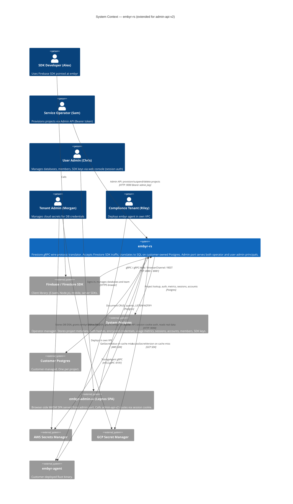

---

### Wave: DESIGN / [REF] C4 Container Diagram — Extended

The admin port (:9090) now serves two distinct traffic types routed through four sub-routers. The System Postgres gains the new admin-api-v2 tables.

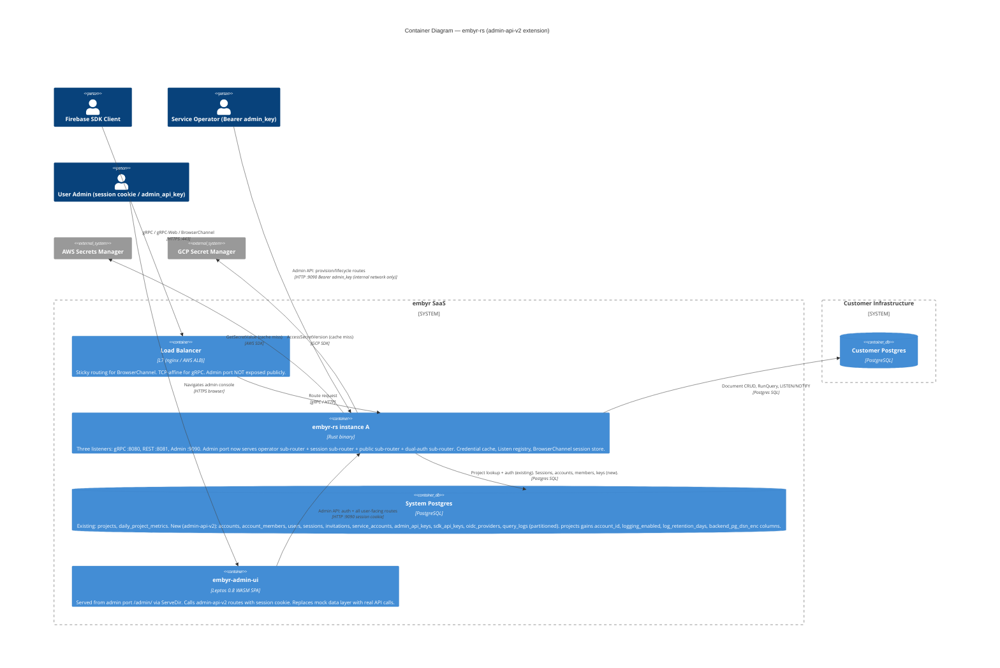

---

### Wave: DESIGN / [REF] C4 Component Diagram — Admin Port (admin-api-v2)

This L3 diagram shows the internal components of the admin port subsystem within `embyr-server`. The data-plane components (gRPC listener, Firestore handler, Listen registry) are not shown — see the existing data-plane L3 diagram.

```mermaid
C4Component
    title Component Diagram — Admin Port (admin-api-v2)

    Container_Boundary(adminPort, "embyr-server Admin Port :9090") {

        Component(adminRouter, "Admin Router", "embyr-server::admin::router", "Axum Router merging four sub-routers: operator, session, public, dual_auth. Built once at composition root. with_state() erases type parameters before merge.")

        Component(operatorRouter, "Operator Sub-Router", "embyr-server::admin (operator routes)", "Routes: POST /projects, POST .../suspend, POST .../activate, DELETE /projects/:id. Layer: OperatorAuthMiddleware.")
        Component(sessionRouter, "Session Sub-Router", "embyr-server::admin (session routes)", "Routes: all 22 new user-facing routes. Layer: SessionAuthMiddleware.")
        Component(publicRouter, "Public Sub-Router", "embyr-server::admin (public routes)", "Routes: POST /auth/signin, GET /auth/oidc/callback. No auth middleware.")
        Component(dualAuthRouter, "Dual-Auth Sub-Router", "embyr-server::admin (dual-auth route)", "Route: GET /projects/:id. Layer: DualAuthMiddleware.")

        Component(operatorAuthMw, "OperatorAuthMiddleware", "embyr-server::admin::middleware::operator_auth", "Tower from_fn_with_state. Validates Bearer EMBYR_ADMIN_KEY. Returns 401 if absent or mismatched.")
        Component(sessionAuthMw, "SessionAuthMiddleware", "embyr-server::admin::middleware::session_auth", "Tower from_fn_with_state. Tries cookie BLAKE3 lookup in sessions table; then admin_api_key BLAKE3 lookup. Sets SessionContext extension on success.")
        Component(dualAuthMw, "DualAuthMiddleware", "embyr-server::admin::middleware::dual_auth", "Tries session auth first, then operator Bearer. Sets AuthPrincipal { User(SessionContext) | Operator } extension.")

        Component(sessionCtxExtractor, "SessionContextExtractor", "embyr-server::admin::extractors::session_context", "FromRequestParts impl. Reads cookie or admin_api_key Bearer. Queries sessions or admin_api_keys table. Returns SessionContext { user_id, account_id, role }.")

        Component(authHandlers, "Auth Handlers", "embyr-server::admin::handlers::auth", "signin: validate email+password+TOTP, create session row, set HTTP-only cookie. signout: clear cookie, expire session. oidc_callback: validate id_token, create session, redirect.")
        Component(projectHandlers, "Project Handlers", "embyr-server::admin::handlers::projects + sdk_keys + metrics + query_logs", "list_projects (account-scoped), patch_project, list/create/revoke sdk_keys, get_metrics, list_query_logs. SDK key creation calls new_sdk_key_material on blocking thread.")
        Component(memberHandlers, "Member/SA/Key Handlers", "embyr-server::admin::handlers::members + service_accounts + admin_keys", "Member CRUD, service account CRUD, admin API key CRUD. All call check_rbac before write ops.")
        Component(oidcBillingHandlers, "OIDC + Billing Handlers", "embyr-server::admin::handlers::oidc_providers + billing", "OIDC provider CRUD (Owner only): AES-GCM encrypts client_secret. Billing: aggregate daily_project_metrics by account + time range.")
        Component(operatorHandlers, "Operator Handlers", "embyr-server::admin::handlers::provision + lifecycle + get_project", "Existing 5 operator routes. provision.rs uses OperatorState. get_project.rs reads AuthPrincipal extension to apply account scoping for User, or return unscoped for Operator.")

        Component(rbacFn, "check_rbac()", "embyr-core::admin::rbac", "Pure domain function. Returns RbacError for: InsufficientRole, SelfDemotion, CannotChangeOwnerRole, LastOwnerRemoval, KeyRoleExceedsActor.")
        Component(sdkKeyMaterial, "new_sdk_key_material()", "embyr-core::domain::project", "Pure function. Returns SdkKeyMaterial { argon2id_hash, ecies_pubkey, blake3_hash }. Called on spawn_blocking thread.")
        Component(emailSender, "IEmailSender", "embyr-core::admin::email (trait) / embyr-server::adapters::email (NoopEmailSender V1)", "Invitation email port. V1: NoopEmailSender logs and returns Ok. V2: SmtpEmailSender via lettre.")
        Component(queryLogWriter, "IQueryLogWriter", "embyr-core::admin::query_log (trait) / embyr-server::adapters::query_log", "PostgresQueryLogAdapter. record() spawns bounded Tokio task. Inserts into query_logs partition. Best-effort: failure never propagated.")
        Component(queryLogSweeper, "QueryLogSweeper", "embyr-server::sweepers::query_log_sweeper", "Daily Tokio task. Drops query_logs_<project_id>_<date> partitions older than projects.log_retention_days. Acquires Postgres advisory lock before each cycle to prevent duplicate drops in multi-instance deployments. Lock: pg_try_advisory_lock(fnv1a_hash('embyr_query_log_sweep')).")
        Component(sessionCleaner, "SessionCleaner", "embyr-server::sweepers::session_cleaner", "Hourly Tokio task. Deletes sessions WHERE expires_at < now() - 30 days. Also deletes expired unaccepted invitations. Advisory lock: pg_try_advisory_lock(fnv1a_hash('embyr_session_clean')).")
    }

    System_Ext(systemDB, "System Postgres", "accounts, users, sessions, admin_api_keys, sdk_api_keys, oidc_providers, query_logs, projects, daily_project_metrics")
    System_Ext(credCache, "CredentialCache", "In-process LRU (Arc<RwLock>). Evicted on SDK key creation/revocation.")

    Rel(adminRouter, operatorRouter, "merges")
    Rel(adminRouter, sessionRouter, "merges")
    Rel(adminRouter, publicRouter, "merges")
    Rel(adminRouter, dualAuthRouter, "merges")

    Rel(operatorRouter, operatorAuthMw, "layered with")
    Rel(operatorRouter, operatorHandlers, "routes to")
    Rel(sessionRouter, sessionAuthMw, "layered with")
    Rel(sessionRouter, sessionCtxExtractor, "handlers use")
    Rel(sessionRouter, projectHandlers, "routes to")
    Rel(sessionRouter, memberHandlers, "routes to")
    Rel(sessionRouter, oidcBillingHandlers, "routes to")
    Rel(publicRouter, authHandlers, "routes to")
    Rel(dualAuthRouter, dualAuthMw, "layered with")
    Rel(dualAuthRouter, operatorHandlers, "routes get_project to")

    Rel(sessionAuthMw, systemDB, "looks up session/admin_key hash in")
    Rel(sessionCtxExtractor, systemDB, "queries sessions and admin_api_keys in")
    Rel(authHandlers, systemDB, "reads users, creates sessions in")
    Rel(projectHandlers, systemDB, "reads/writes projects, sdk_api_keys, query_logs in")
    Rel(projectHandlers, sdkKeyMaterial, "calls for SDK key creation")
    Rel(projectHandlers, credCache, "evicts on SDK key create/revoke")
    Rel(projectHandlers, queryLogWriter, "records operation logs via")
    Rel(memberHandlers, systemDB, "reads/writes account_members, invitations in")
    Rel(memberHandlers, emailSender, "sends invitation email via")
    Rel(memberHandlers, rbacFn, "enforces RBAC via")
    Rel(projectHandlers, rbacFn, "enforces RBAC via")
    Rel(oidcBillingHandlers, systemDB, "reads/writes oidc_providers, daily_project_metrics in")
    Rel(queryLogSweeper, systemDB, "drops old partitions in")
    Rel(sessionCleaner, systemDB, "deletes expired sessions and invitations in")
```

---

### Wave: DESIGN / [REF] New Database Schema (Migrations)

10 new tables + 2 schema alterations. All run via `sqlx-migrate` at startup (B-01 migration).

| Table | Purpose | Key Columns | Index |
|-------|---------|-------------|-------|
| `accounts` | Tenant account container | `id UUID PK`, `name TEXT`, `created_at TIMESTAMPTZ` | PK |
| `users` | Login credentials | `id UUID PK`, `email TEXT UNIQUE`, `password_hash TEXT`, `totp_secret_enc BYTEA`, `failed_totp_attempts INT`, `locked_until TIMESTAMPTZ` | `email` UNIQUE |
| `account_members` | User ↔ Account with role | `account_id UUID FK`, `user_id UUID FK`, `role TEXT`, `joined_at TIMESTAMPTZ`, PK(`account_id, user_id`) | `(account_id, role)` |
| `sessions` | Active sessions | `id UUID PK`, `token_hash BYTEA(32) UNIQUE`, `user_id UUID FK`, `account_id UUID FK`, `role TEXT`, `created_at TIMESTAMPTZ`, `last_active_at TIMESTAMPTZ`, `expires_at TIMESTAMPTZ` | `token_hash` UNIQUE |
| `invitations` | Pending member invites | `id UUID PK`, `account_id UUID FK`, `email TEXT`, `role TEXT`, `invited_by UUID FK`, `expires_at TIMESTAMPTZ`, `accepted_at TIMESTAMPTZ` | `(account_id, email)` |
| `service_accounts` | Non-human principals | `id UUID PK`, `account_id UUID FK`, `name TEXT`, `description TEXT`, `role TEXT`, `created_at TIMESTAMPTZ` | `account_id` |
| `admin_api_keys` | Programmatic access keys | `id UUID PK`, `account_id UUID FK`, `name TEXT`, `key_hash BYTEA(32) UNIQUE`, `prefix TEXT`, `role TEXT`, `user_id UUID FK nullable`, `service_account_id UUID FK nullable`, `created_at TIMESTAMPTZ`, `last_used_at TIMESTAMPTZ`, `revoked_at TIMESTAMPTZ` | `key_hash` UNIQUE |
| `sdk_api_keys` | SDK auth keys per project | `id UUID PK`, `project_id TEXT FK`, `name TEXT`, `key_hash BYTEA(32) UNIQUE`, `prefix TEXT`, `created_at TIMESTAMPTZ`, `last_used_at TIMESTAMPTZ`, `revoked_at TIMESTAMPTZ` | `key_hash` UNIQUE, `project_id` |
| `oidc_providers` | Per-account OIDC config | `id UUID PK`, `account_id UUID FK`, `issuer TEXT`, `client_id TEXT`, `client_secret_enc BYTEA`, `enabled BOOL`, `created_at TIMESTAMPTZ` | `account_id` |
| `query_logs` | Per-project operation log | `id BIGSERIAL`, `project_id TEXT FK`, `operation TEXT`, `collection_path TEXT`, `document_path TEXT`, `status TEXT`, `duration_ms INT`, `client_ip TEXT`, `ts TIMESTAMPTZ NOT NULL` | Partitioned by `(project_id, ts::date)` |

**Schema alterations on existing tables:**
- `projects` gains: `account_id UUID REFERENCES accounts(id) NOT NULL`, `logging_enabled BOOLEAN NOT NULL DEFAULT false`, `log_retention_days INT`, `backend_pg_dsn_enc BYTEA` (AES-GCM encrypted DSN under `EMBYR_ENCRYPTION_KEY`)
- Index added: `projects(account_id)` — required for `GET /admin/v1/projects` p99 ≤ 100ms target

**Known Limitation — SDK key rotation for pre-existing projects:**
Projects provisioned before this feature have `backend_pg_dsn_enc IS NULL` because the plaintext DSN cannot be backfilled without the original API key (only its Argon2id hash is stored). For these projects, SDK key creation proceeds normally — `api_key_hash_current` and `api_key_hash_secondary` are updated, Firestore SDK authentication with the new SDK key works — but `ecies_encrypted_dsn` is NOT re-encrypted with the new key's ECIES pubkey (step 7b in the SDK key creation flow is skipped). The credential cache continues to use the existing `ecies_encrypted_dsn` until the project is re-provisioned. **Mitigation for operators:** Delete and re-provision the project using the operator API (DELETE then POST `/admin/v1/projects`). After re-provisioning, `backend_pg_dsn_enc` is populated and full SDK key rotation with DSN re-encryption is supported. Acceptance test AC-B03-03 must explicitly verify the `backend_pg_dsn_enc IS NULL` skip-path and document it as expected behavior.

---

### Wave: DESIGN / [REF] Background Tasks

Two background Tokio tasks run on a schedule within `embyr-server`. Both use **Postgres advisory locks** to prevent duplicate execution in multi-instance deployments.

| Task | Location | Schedule | Advisory Lock Key | Failure Mode |
|------|----------|----------|------------------|--------------|
| `QueryLogSweeper` | `embyr-server::sweepers::query_log_sweeper` | Daily (configurable via env, default 02:00 UTC) | `pg_try_advisory_lock(fnv1a_hash("embyr_query_log_sweep"))` | Lock held by another instance → skip cycle, retry next cycle |
| `SessionCleaner` | `embyr-server::sweepers::session_cleaner` | Hourly | `pg_try_advisory_lock(fnv1a_hash("embyr_session_clean"))` | Lock held by another instance → skip cycle, retry next cycle |

**Advisory lock pattern (both sweepers):**

```
loop (every schedule interval):
  if NOT pg_try_advisory_lock($key):
    tracing::debug!("sweep cycle skipped: lock held by another instance")
    continue
  try:
    run_sweep()
  finally:
    pg_advisory_unlock($key)
```

`pg_try_advisory_lock` is non-blocking (returns false immediately if held). Advisory locks are session-scoped and released on connection close — crash-safe at the cost of one missed cycle if the sweeper crashes holding the lock. This is acceptable for non-critical maintenance tasks.

**SessionCleaner behavior:** Deletes `sessions` rows where `expires_at < now() - INTERVAL '30 days'`. The 30-day grace period prevents any in-flight request from referencing a recently-expired session. Hard delete (no soft-delete needed; sessions contain no user-generated content). Also deletes `invitations` rows where `expires_at < now() - INTERVAL '7 days'` and `accepted_at IS NULL`.

**QueryLogSweeper behavior:** Queries `projects` for `logging_enabled = true` records and their `log_retention_days`. Drops partition tables `query_logs_<project_id>_<date>` for dates older than `retention_days` using `DROP TABLE IF EXISTS`. DDL is instant and lock-free for table-level drops. Sweeper must run against a test environment partition table before production use (B-04 slice gate).

---

### Wave: DESIGN / [REF] Startup Sequence Extension

The composition root adds two new startup validations after existing probes:

```
[Existing probes]
  System DB connectivity, WAL mode, schema migration, port availability, admin key present

[New — admin-api-v2]
  EMBYR_ENCRYPTION_KEY check:
    IF SELECT count(*) FROM accounts > 0 AND EMBYR_ENCRYPTION_KEY absent or ≠ 32 bytes:
      → refuse to start: health.startup.refused: encryption_key_missing
    IF accounts table empty:
      → warn: health.startup.warn: encryption_key_not_configured
      → proceed (fresh deployment; key can be set before first user is created)
```

---

### Wave: DESIGN / [REF] Architecture Enforcement

| Concern | Enforcement Mechanism |
|---------|----------------------|
| `embyr-core::admin` must not import IO crates | `cargo-deny` `deny.toml` for `embyr-core`: `tokio`, `sqlx`, `axum`, `lettre` in deny list |
| Operator routes never run session middleware | Axum sub-router layer scoping: structurally enforced. Integration test: operator routes must pass with Bearer admin_key, fail with session cookie |
| Account-scoping completeness | Integration test: cross-account 403 test for every session-auth endpoint (DISTILL wave acceptance test matrix) |
| No plaintext credentials stored | CI test: scan `query_logs` and `sessions` tables for known test plaintext values after operations — must return empty |
| `new_sdk_key_material` not bypassed | `cargo-deny` / `cargo-depcheck`: handlers must not import `argon2`, `ecies`, `blake3` directly — they must go through `embyr-core::domain::project::new_sdk_key_material` |
| RBAC function not bypassed | `cargo-machete` / code review: handler files in `admin/handlers/` that write data must import `embyr_core::admin::rbac::check_rbac` |
| Mutation testing | `cargo-mutants -p embyr-server --filter admin` targets RBAC function, session extractor, SDK key creation. Target: ≥80% kill rate |

---

### Wave: DESIGN / [REF] Application-Level Decisions Table — admin-api-v2

| ID | Decision | Verdict | Rationale |
|----|----------|---------|-----------|
| B-AD-01 | Sub-router merge with per-router Tower layers | Accepted | ADR-009. Structural isolation; operator routes and session routes cannot cross-contaminate. One dual-auth route handled by dedicated sub-router. |
| B-AD-02 | `SessionContext` as `FromRequestParts` extractor | Accepted | ADR-010. Compile-time enforcement of account scoping; impossible to forget `account_id` in handler SQL because `SessionContext` is the only way to obtain it. |
| B-AD-03 | `IEmailSender` port in `embyr-core::admin::email` | Accepted | ADR-011. Inner-hexagon port trait placement. V1 `NoopEmailSender` trivially satisfies Earned Trust; V2 `SmtpEmailSender` adds real probe. |
| B-AD-04 | RBAC via pure domain function | Accepted | ADR-012. Non-trivial RBAC invariants (self-demotion, last-owner, key role cap) encoded in one auditable pure function in `embyr-core`. Testable without Axum server. |
| B-AD-05 | Fire-and-forget query log writes | Accepted | ADR-013. Zero client latency impact. Consistent with MetricsPort pattern. Bounded channel (1000) caps resource use. |
| B-AD-06 | `new_sdk_key_material` domain function; `backend_pg_dsn_enc` column | Accepted | ADR-014. D4 compliance (no ECIES bypass). DSN re-encryption on key rotation via server-side AES-GCM encrypted DSN column. Pre-existing projects skip DSN re-encryption (known limitation, documented). |
| B-AD-07 | `UserAdminState` separate from `OperatorState` | Accepted | Different dependency graphs; merging creates unnecessary coupling between operator infrastructure (AWS/GCP fetchers) and user-admin infrastructure (email, encryption key). |
| B-AD-08 | `QueryLogSweeper` uses `DROP TABLE` on old partitions (not `DELETE`) | Accepted | `DROP TABLE` on a daily partition is instant and lock-free. `DELETE WHERE ts < cutoff` on a large table takes O(rows) and holds locks. Same rationale as deleted-project sweeper vs. immediate hard-delete. |
| B-AD-09 | `totp-rs` crate for TOTP validation | Accepted | MIT license. RFC 6238 compliant. Pure Rust, no C dependency. Active maintenance (last release < 3 months). Only alternative (`oath-toolkit` crate) requires `liboath` C binding — rejected per OSS preference for pure Rust. |
| B-AD-10 | No idle expiry for admin API keys (long-lived by design) | Accepted | AC-B05-11 specifies "immediate revocation" as the only invalidation mechanism. Admin API keys are for CI/CD automation — 24h idle expiry would break unattended pipelines. Revocation is the explicit invalidation mechanism. |

---

### Wave: DESIGN / [REF] Open Questions — admin-api-v2

| ID | Question | Blocking | Resolution Timing |
|----|----------|---------|------------------|
| OQ-B01 | DSN re-encryption for pre-existing projects | No (fallback: skip when `backend_pg_dsn_enc IS NULL`) | Before B-03 merge |
| OQ-B02 | `sessions.token_hash` column type: `BYTEA` vs `TEXT` | No (minor DDL) | B-01 migration DDL |
| OQ-B03 | TOTP library confirmed: `totp-rs` | Yes — blocks B-01 | Before B-01 crafter handoff |
| OQ-B04 | Admin API key idle expiry: none (long-lived by design, B-AD-10) | No | Resolved above |
| OQ-B05 | Sam's tooling handles unknown fields in `GET /projects/:id` response | No (AC-B02-04 asserts this) | B-02 integration test |

---

### Wave: DESIGN / [REF] External Integrations Requiring Contract Tests

**Handoff annotation for platform-architect:**

No new external third-party APIs introduced in admin-api-v2 (all data lives in System Postgres). The SMTP relay (V2 `SmtpEmailSender`) is the only new external integration:

```
External Integrations Requiring Contract Tests (V2):
- SMTP relay (SmtpEmailSender): EHLO handshake probe at startup.
  Recommended V2: smoke test against a real SMTP relay in CI (e.g., Mailpit for local,
  AWS SES sandbox for integration environment) to detect SMTP auth format changes.
  Not a consumer-driven contract test (SMTP is a standard protocol, not a versioned API).
```

OIDC providers are configured at runtime by the account Owner — they are not a fixed external integration at the infrastructure layer. No contract tests needed at the platform level.

---

## Application Architecture — observability

> Updated: 2026-08-08
> Feature: observability (JOB-12 — service operator visibility)
> ADRs: `docs/product/architecture/adr-016-prometheus-metrics.md`

---

### Wave: DESIGN / [REF] Observability

embyr-rs previously had no Prometheus metrics infrastructure. All observability was
unstructured `tracing::warn!/info!` log lines. The `metrics` crate appeared in the
technology table as `0.22.x` (planned but never added to `Cargo.toml`). The observability
feature delivers five metric families via `metrics = "0.23"` + `metrics-exporter-prometheus = "0.15"`.

#### Prometheus endpoint

`GET /metrics` on the admin port (:9090), guarded by Bearer `EMBYR_ADMIN_KEY`.

This route is added to the `operator_router` in `build_admin_router` — the same sub-router
that guards project provisioning and lifecycle routes. Prometheus's `prometheus.yml`
supports `bearer_token` for scrape authentication; no custom configuration needed on the
Prometheus side beyond the token.

The endpoint is NOT available on the data ports (:8080, :8081). Admin port network
isolation (firewall/ACL) is an operator responsibility per the operational constraint in
the System Architecture section. The auth requirement provides defense-in-depth.

#### PrometheusHandle lifecycle

`PrometheusBuilder::new().install_recorder()` installs a process-global recorder and
returns a `PrometheusHandle`. Installed once via `std::sync::OnceLock` in
`crates/embyr-server/src/observability.rs` before any TCP listener opens.

`PrometheusHandle` is `Clone`. It is stored in `OperatorState.prometheus_handle` and
used by the `get_prometheus_metrics` handler to call `handle.render()` — which produces
the Prometheus text exposition format.

Startup ordering constraint: recorder installation precedes DB migration, adapter probes,
and listener binding. This ensures startup events are captured in metrics.

#### Metric families

| Metric | Type | Labels | Description |
|--------|------|--------|-------------|
| `embyr_grpc_requests_total` | counter | `method`, `status` | gRPC requests by method and tonic status code |
| `embyr_grpc_request_duration_seconds` | histogram | `method` | Wall-clock request duration |
| `embyr_rate_limit_requests_total` | counter | `project_id`, `outcome` | Rate-limit decisions per project (HIGH CARDINALITY — see below) |
| `embyr_rate_limit_pg_timeout_total` | counter | none | Postgres token-bucket fallback events |
| `embyr_pg_pool_size` | gauge | `pool` | System DB total connection count |
| `embyr_pg_pool_idle` | gauge | `pool` | System DB idle connection count |

`method` label values: `GetDocument`, `CreateDocument`, `UpdateDocument`, `DeleteDocument`,
`BatchGetDocuments`, `BeginTransaction`, `Commit`, `Rollback`, `RunQuery`, `Listen`.

`status` label values (tonic Code → lowercase): `ok`, `not_found`, `unauthenticated`,
`permission_denied`, `resource_exhausted`, `internal`, `unavailable`, `aborted`,
`already_exists`, `invalid_argument`, `failed_precondition`, `unimplemented`.

`outcome` values: `allowed`, `rejected`.

`pool` values: `system` (system DB pool only; customer DB pools are not instrumented in
V1 — unbounded cardinality; V2 concern).

#### Histogram bucket configuration

Boundaries for `embyr_grpc_request_duration_seconds`:
`[0.001, 0.005, 0.01, 0.025, 0.05, 0.1, 0.25, 0.5, 1.0, 2.0, 5.0, 10.0]` seconds.

The `2.0` boundary enables `histogram_quantile(0.99, rate(...[5m])) > 2.0` as the SLO
alert expression aligned to the Firestore SLA (p99 ≤ 2 s, AC-05c).

Applied at recorder installation time via `Matcher::Prefix("embyr_grpc_request_duration")`
in `PrometheusBuilder`.

#### HIGH CARDINALITY: `project_id` label

`embyr_rate_limit_requests_total{project_id, outcome}` produces one time series per
project per outcome. For deployments up to ~10,000 projects, the resulting ~20,000 series
is within Prometheus defaults. Above that, operators must use recording rules to aggregate
(D-OBS-7 from DISCUSS wave locked decisions). See ADR-016 for the full cardinality analysis.

#### `rate_limit_pg_timeout_total` conversion

The `tracing::warn!` at `rate_limit.rs:146` (the "rate_limit_pg_timeout" log line) is
retained. A `metrics::counter!("embyr_rate_limit_pg_timeout_total").increment(1)` call is
added alongside it. This converts a log-only signal into a Prometheus-queryable counter,
enabling alerting on rate-limit fallback events without log grep.

#### Pool gauge update strategy (D-OBS-8)

Pool gauges are updated by two mechanisms:
1. A 15-second Tokio background task spawned at server startup alongside the existing
   sweeper tasks. Receives a `sqlx::PgPool` clone from the system DB.
2. Immediately before `handle.render()` in the `get_prometheus_metrics` handler, ensuring
   scrape freshness at the moment of the HTTP request.

#### New components

| Component | Location | Responsibility |
|-----------|----------|---------------|
| `get_or_install_prometheus_handle()` | `embyr-server::observability` | OnceLock-backed idempotent recorder installation; histogram bucket config |
| `get_prometheus_metrics` handler | `embyr-server::admin::handlers::prometheus_metrics` | Pool gauge update + `handle.render()` + Content-Type header |
| `obs_helpers` | `embyr-server::middleware::obs_helpers` | `grpc_status_label()` mapping; gRPC method name constants |
| `OperatorState.prometheus_handle` | `embyr-server::admin::state` | Handle storage; passed via `State<OperatorState>` to handler |

#### Architecture enforcement

- `embyr-core/deny.toml`: `metrics` and `metrics-exporter-prometheus` added to disallowed
  crates. Instrumentation is an `embyr-server` concern only; domain layer must not emit metrics.
- Behavioral probe: OBS-01 acceptance test scrapes `GET /metrics` and asserts HTTP 200 +
  `# HELP` / `# TYPE` lines (Earned Trust layer for the `PrometheusHandle` dependency).

---

## Application Architecture — production-readiness

> Updated: 2026-08-08
> Feature: production-readiness (JOB-13 — production deployment)
> ADRs: `docs/product/architecture/adr-017-production-startup.md`

---

### Wave: DESIGN / [REF] Production Deployment

This section documents the production deployment architecture for embyr-server. It resolves
the three blockers that prevented any production deployment: the `main.rs` stub, the missing
Dockerfile, and the missing CI pipeline.

No changes to the domain model, bounded contexts, port traits, or adapter implementations
are required. This is a composition root and infrastructure-only change.

---

#### Config: `ServerConfig::from_env()`

New module `crates/embyr-server/src/config.rs`. Mirrors `embyr_agent::config::AgentConfig`.

| Variable | Required | Default | Validation |
|----------|----------|---------|------------|
| `DATABASE_URL` | Yes | — | Non-empty string; Postgres DSN |
| `EMBYR_ADMIN_KEY` | Yes | — | Non-empty string |
| `EMBYR_ENCRYPTION_KEY` | Yes | — | Exactly 64 hex chars (32 bytes); validated at parse time |
| `EMBYR_RATE_LIMIT_RPS` | No | 1000.0 | Finite float > 0 |
| `GRPC_PORT` | No | 8080 | Valid u16 |
| `REST_PORT` | No | 8081 | Valid u16 |
| `ADMIN_PORT` | No | 9090 | Valid u16 |
| `RUST_LOG` | No | "info" | Tracing level filter string |

All errors are accumulated before returning. The operator sees every missing or invalid
variable in a single stderr message (exit code 1).

`EMBYR_ENCRYPTION_KEY` is parsed to `[u8; 32]` at startup — invalid format causes exit 1
before any port is bound. This satisfies the admin-api-v2 requirement that the encryption
key is validated before user-admin routes can function.

---

#### Production Startup Sequence (14 steps)

```
1.  ServerConfig::from_env()
    → on ConfigError: eprintln! + exit(1)

2.  tracing_subscriber::fmt()
        .with_env_filter(RUST_LOG env or config.log_level fallback)
        .with_writer(stderr).init()

3.  observability::get_or_install_prometheus_handle()
    [ADR-016: recorder installed before any TCP listener opens]

4.  SystemDb::new(&config.db_url).await
    → on Err: tracing::error! + exit(1)

5.  system_db.migrate().await
    [18 migrations embedded via sqlx::migrate!("../../migrations")]
    → on Err: tracing::error! + exit(1)

6.  system_db.probe().await
    [SELECT 1 + projects table existence check]
    → on Err: tracing::error! "startup probe failed" + exit(1)

7.  alloc_production_components(Arc::clone(&system_db), &config)
    → ProductionComponents { cache, idx_mgr, metrics, listen_registry,
                              active_listeners, rate_limiter (Postgres-backed),
                              shutdown_tx, shutdown_rx }
    + pool gauge background task (15-second interval) spawned

8.  TcpListener::bind("0.0.0.0:{grpc_port}")
    TcpListener::bind("0.0.0.0:{rest_port}")
    TcpListener::bind("0.0.0.0:{admin_port}")
    → on any Err: tracing::error! + exit(1)
    [All three ports or none — D-PR-6]

9.  Build FirestoreService (system_db, adapters, RateLimiter::with_pg, keepalive 30s)

10. Build admin_app via build_admin_router(system_db, admin_key, cache,
        encryption_key, NoopEmailSender, None, None, rate_limit_rps, prometheus_handle)

11. spawn_all_servers(grpc_listener, rest_listener, admin_listener,
                      service, admin_app, shutdown_rx)

12. tracing::info!("embyr-server ready" grpc=0.0.0.0:8080 rest=0.0.0.0:8081
                                         admin=0.0.0.0:9090)

13. tokio::select! on ctrl_c + SIGTERM
    → shutdown_tx.send(())
    → tracing::info!("shutdown signal received, draining...")

14. tracing::info!("embyr-server stopped")    [exit code 0]
```

Steps 4–8 are hard gates: any failure exits non-zero before a single port is bound.

**Graceful shutdown and drain behavior:** When `shutdown_tx` fires (step 13), the
`tokio::select!` in `spawn_all_servers` cancels the accept loops for all three listeners.
In-flight gRPC requests that are already executing continue until their handlers return;
new connections and new gRPC streams are rejected immediately. Kubernetes sends SIGTERM and
waits `terminationGracePeriodSeconds` (default 30 seconds) before sending SIGKILL. The
embyr-server process exits 0 when all active handlers complete. If the Kubernetes grace
period expires before all handlers finish, SIGKILL terminates the process — clients receive
an `Unavailable` error and the Firebase SDK retries. Operators deploying in Kubernetes
should set `terminationGracePeriodSeconds: 30` (default) or higher for workloads with
long-lived Listen streams.

---

#### Docker: Multi-Stage Dockerfile

File location: repository root (`Dockerfile`). Four stages:

| Stage | Base Image | Purpose |
|-------|-----------|---------|
| `chef` | `rust:1.80-slim` | Install `cargo-chef` for dependency caching |
| `planner` | `chef` | `cargo chef prepare --recipe-path recipe.json` |
| `builder` | `chef` | `cargo chef cook --release` then `cargo build --release --bin embyr-server` |
| `runtime` | `debian:bookworm-slim` | Minimal runtime: binary + `ca-certificates` + non-root user |

Non-root: `useradd -r -s /bin/false embyr`. The process runs as `embyr` (UID != 0).

`EXPOSE 8080 8081 9090`. `ENTRYPOINT ["/app/embyr-server"]`.

No `COPY migrations/` is required. `sqlx::migrate!("../../migrations")` embeds all 18
migration files into the binary at compile time — they are not needed at runtime.

Target final image size: < 100 MB. `ca-certificates` is required for TLS handshakes to
AWS Secrets Manager and GCP Secret Manager.

Dependency caching: cargo-chef caches the `cook` layer separately from application source.
A source-only change (no `Cargo.toml`/`Cargo.lock` modification) rebuilds in < 60 seconds
on a warm cache, satisfying the US-PR-02 AC for rebuild time.

---

#### CI: GitHub Actions

File: `.github/workflows/ci.yml`. Three jobs:

| Job | What it runs | Gate |
|-----|-------------|------|
| `test` | `cargo test --workspace` with Postgres 15 service container | All tests pass |
| `lint` | `cargo clippy --workspace -- -D warnings` + `cargo deny check` | Zero warnings; license + advisory compliance |
| `docker` | `docker build -t embyr-server:ci .` (depends on `test`) | Image builds without error |

Triggers: `push: branches: [master]` and `pull_request: branches: [master]`.

Dependency caching via `Swatinem/rust-cache@v2`. All three jobs must pass for a PR to be
mergeable. Workflow runtime target: < 10 minutes total (with warm cache).

`cargo deny check` uses the existing `deny.toml` — no new configuration required.

---

#### lib.rs Changes (Minimal)

Two additions with zero impact on existing tests:

1. `pub fn alloc_production_components(system_db: Arc<SystemDb>, config: &ServerConfig) -> ProductionComponents`
   — wires the same components as `alloc_test_components` but uses `ServerConfig` values
   (real admin_key, encryption_key, rate_limit_rps) and `RateLimiter::with_pg` (Postgres-backed).

2. `spawn_all_servers` visibility changed from `fn` to `pub fn` — one keyword.

All `start_test_server_*` constructors remain private and unchanged.

---

#### External Integrations Requiring Contract Tests

No new external integrations are introduced by this feature. The Postgres system DB,
AWS Secrets Manager, and GCP Secret Manager integrations are unchanged from prior features.

---

#### Architecture Enforcement

| Concern | Mechanism |
|---------|-----------|
| `embyr-core` IO-free invariant | `cargo deny check` in CI `lint` job — `deny.toml` unchanged; no new IO crate added to `embyr-core` |
| Startup sequence ordering | Unit tests for `ServerConfig::from_env()` in `config.rs` test module; US-PR-01 integration test asserts `healthz` 200 only after full startup |
| No partial startup | Integration tests assert no port is bound when required env var is missing (process exits before bind) |
| Non-root Docker process | CI `docker` job builds image; can be verified with `docker inspect --format '{{.Config.User}}'` |

---

## Application Architecture — card-payments

> Updated: 2026-08-10
> Feature: card-payments (JOB-14 — self-service subscription/payment management, frontend-only per DISCUSS Scope Assessment split)
> Mode: Propose (autonomous analysis)
> ADRs: `docs/product/architecture/adr-019-billing-modal-global-state.md` (new); ADR-005/006/007/008 apply unchanged (no re-litigation)

---

### Wave: DESIGN / [REF] Summary

This feature extends `embyr-admin-ui` (Leptos 0.8 CSR WASM, established by `user-admin-ui` —
see § Application Architecture — user-admin-ui above) with self-service billing/subscription
management for the account admin persona (P5/Chris). It introduces **no new architectural
pattern, no new crate, no new external dependency, and no backend changes**. It is a pure
extension of the existing TEA skeleton (`AppModel`/`Msg`/`update()`), the existing mock-first
data layer (ADR-007), and the existing `views/{feature}/` multi-file subdirectory precedent
(`views/db_detail/`).

Full detail (component decomposition, model/msg/update changes, driving/driven ports, Reuse
Analysis, Decisions table, C4 Component diagram) lives in
`docs/feature/card-payments/feature-delta.md` § Wave: DESIGN — this section is the SSOT summary
per the multi-architect brief convention.

### Wave: DESIGN / [REF] Component Decomposition (Summary)

| File Path | Change | Responsibility |
|-----------|--------|-----------------|
| `crates/embyr-admin-ui/src/views/billing/{mod,overview,usage,invoices,modals}.rs` | **NEW** (replaces `views/billing.rs`) | Billing tab shell + Plan/PaymentMethod/CapUsage/NextInvoice/TestClock cards + Usage table + Invoice history + Card/Upgrade modals |
| `crates/embyr-admin-ui/src/components/suspension_banner.rs` | **NEW** | Cross-cutting read-only-state banner, rendered in `ShellView` above all routed `Section` content |
| `crates/embyr-admin-ui/src/components/primitives/segmented.rs` | **NEW** | N-way value-select control (TestClockCard) |
| `crates/embyr-admin-ui/src/model.rs`, `msg.rs`, `update.rs`, `data.rs` | **EXTEND** | New billing domain types (`Subscription`, `Card`, `Invoice`, `UsageStats` on `Database`), pure `impl AppModel` derivation methods (`usage_totals`/`cap_ratios`/`cap_exceeded`/`effective_status`/`read_only`), 10 new `Msg` variants, mock constructors |
| `crates/embyr-admin-ui/src/components/icons.rs` | **EXTEND** | `"trash"` icon (deletes-dimension) |
| `crates/embyr-admin-ui/src/views/mod.rs` | **EXTEND** | `billing` module promoted to directory; `ShellView` mounts `SuspensionBanner`/`CardModal`/`UpgradeModal` above routed content |

No changes to `embyr-admin`, `embyr-server`, `embyr-core`, or any other crate.

### Wave: DESIGN / [REF] Key Decision — Cross-Cutting Modal State (ADR-019)

`CardModal`/`UpgradeModal` open/step state is **global `AppModel` state** dispatched via `Msg`,
not view-local `RwSignal` (which is the existing `db_detail` confirm-modal precedent). This is
required because `SuspensionBanner` (cross-cutting, rendered in `ShellView`) must be able to open
either modal directly regardless of the currently active `Section` (AC-108-05) — a cross-component
coordination requirement that view-local state cannot satisfy. See ADR-019 for full alternatives
analysis (view-local + prop-drilling; navigate-then-open; independent context signals — all
rejected).

### Wave: DESIGN / [REF] Business-Logic Single-Sourcing

Per this feature's DISCUSS constraint (`wave-decisions.md`: *"Status derivation MUST be a pure
function over `AppModel` fields, not duplicated stored booleans"*), `capExceeded`/
`effectiveStatus`/`readOnly` are implemented as `impl AppModel` methods in `model.rs` —
`usage_totals()`, `cap_ratios()`, `cap_exceeded()`, `effective_status()`, `read_only()` — computed
on every read (`model.with(|m| m.effective_status())`), never stored. This is the single
implementation of the D-6 (hard-stop) and D-7 (per-dimension metering) business rules, consumed
identically by `SuspensionBanner`, `CapUsageCard`, and `UpgradeModal`.

### Wave: DESIGN / [REF] Reuse Analysis (Summary)

10 EXTEND (`Tabs`, `Modal`, `Database`, `AppModel`, `Msg`, `update()`, `data.rs`, `views/mod.rs`,
`Icon`, `components/mod.rs`), 1 REPLACE (`views/billing.rs` → `views/billing/` — content migrated,
not dropped), 1 PATTERN REUSE (`views/db_detail/` directory shape, no shared code), 2 CREATE NEW
(`Segmented` primitive; the `views/billing/` file set itself — unavoidable, no prior billing UI
code existed), 1 explicit NOT APPLICABLE (`Toggle` — no boolean-switch use case in any of the 8
slices), 1 explicit NOT EXTRACTED (progress/stacked bars kept page-local — YAGNI, single consumer
each in V1). Zero unjustified CREATE NEW decisions. Full table with per-row justification:
`docs/feature/card-payments/feature-delta.md` § Wave: DESIGN / [REF] Reuse Analysis.

### Wave: DESIGN / [REF] Driven Ports — Forward Contract for `card-payments-backend`

All V1 driven ports are in-process mock data (`data.rs`) — no external substrate, no `probe()`
required for this feature (mirrors the identical conclusion already recorded above for
user-admin-ui). Forward contract for the recommended `card-payments-backend` follow-up feature:
`fetch_subscription`/`fetch_invoices`/`attach_payment_method`/`change_subscription_plan` as
`#[server]` functions (ADR-007 migration contract — one-line body substitution, zero component
changes), plus a real Stripe webhook-sourced payment-failure signal replacing `TestClockCard`'s
direct setter as the *source* only. **External Integrations Requiring Contract Tests**: none in
this feature; forward flag for `card-payments-backend` — Stripe REST API + webhooks will be that
feature's highest-risk external boundary, recommend consumer-driven contract tests (Pact) in CI's
acceptance stage at that time.

### Wave: DESIGN / [REF] Architecture Enforcement (Addition)

Extends UI-AD-10 (existing `cargo mutants -p embyr-admin-ui` mutation-testing decision, previously
scoped to `update.rs`/`data.rs`) to also cover `model.rs`'s new `impl AppModel` derivation
methods — the highest-value mutation target in this feature, since `effective_status()` is the
literal implementation of the D-6 hard-stop business rule.

### Wave: DESIGN / [REF] Application-Level Decisions Table — card-payments

| ID | Decision | Verdict | Rationale |
|----|----------|---------|-----------|
| CP-AD-01 | Extend existing TEA skeleton, zero new architectural pattern | Accepted | Direct reuse of ADR-005/006/007; frontend-only scope per DISCUSS split |
| CP-AD-02 | `views/billing/` mirrors `views/db_detail/` multi-file precedent | Accepted | Established, working pattern in this exact codebase |
| CP-AD-03 | `capExceeded`/`effectiveStatus`/`readOnly` as pure `impl AppModel` methods, never stored fields | Accepted | DISCUSS constraint; single-sourced D-6/D-7 logic |
| CP-AD-04 | `CardModal`/`UpgradeModal` open-state is global `AppModel`, not view-local | Accepted — see ADR-019 | Cross-cutting `SuspensionBanner` trigger requirement (AC-108-05) |
| CP-AD-05 | `Segmented` new primitive; progress bars NOT extracted as primitives | Accepted | Semantically distinct from `Tabs`/`Toggle`; bars are single-consumer in V1 (YAGNI) |
| CP-AD-06 | No Stripe.js/Elements JS interop shim in V1 — Rust-native form only | Accepted (inherited from D-3/D-5) | Explicit DISCUSS scope boundary; same-shape swap target for `card-payments-backend` |
| CP-AD-07 | No new npm/JS dependency, no new Rust crate dependency | Accepted | Zero bundle-size risk beyond incremental application code; existing ≤4.5 MB CI gate applies unchanged |

---

## Application Architecture — card-payments-backend

> Updated: 2026-08-11
> Feature: card-payments-backend (JOB-14's "make it real" backend half — Stripe subscriptions,
> webhooks, metering, real-time cap enforcement)
> Mode: Propose (autonomous analysis)
> ADRs: `docs/product/architecture/adr-020-cumulative-cap-check-architecture.md` (new),
> `docs/product/architecture/adr-021-stripe-sdk-integration.md` (new); ADR-009/ADR-015/ADR-018
> apply unchanged (sub-router pattern, distributed rate-limiting, secrets-management) — extended,
> not re-litigated.

---

### Wave: DESIGN / [REF] Quality Attribute Priorities — card-payments-backend

| Rank | Attribute | Forcing Constraint |
|------|-----------|-------------------|
| 1 | **Correctness of suspension state (trust-critical)** | D-12's "one mechanism, two triggers" — a false suspension of a paying, healthy account is reputationally worse than a missed enforcement (feature-delta KPI #3 framing). Zero false-positive suspensions is a guardrail KPI, not aspirational. |
| 2 | **Webhook idempotency and signature integrity** | Stripe redelivers events; a non-idempotent handler double-applies state transitions (double-suspend, double-reactivate). Invalid signatures must never reach a handler. |
| 3 | **Zero added latency on the `:8080`/`:8081` Firestore hot path** | Protocol fidelity and real-time latency are the system's rank-1/rank-4 quality attributes (`brief.md` § System Quality Attributes). Billing concerns must not compete with them on the data plane. |
| 4 | **Financial accuracy (no drift between local state and Stripe)** | KPI #1 (subscription-record reconciliation), KPI #4 (metering-to-invoice reconciliation) — local `subscriptions` rows are a read cache of Stripe, never the write-ahead source of truth. |
| 5 | **Testability under D-13's no-mock constraint** | Every Stripe-calling component must be exercisable against real Stripe test-mode APIs; pure domain logic (`cap_status` derivation, webhook-outcome classification) must be testable without any network dependency. |

---

### Wave: DESIGN / [REF] D-9 Resolution Summary

Full resolution and rationale: `docs/product/architecture/adr-020-cumulative-cap-check-architecture.md`.

**Verdict: CREATE NEW mechanism — not a `RateLimiter`/`TokenBucket` extension.** The cumulative
cap check is computed by a new background task (`CapUsageRefresher`, interval-based, mirrors the
existing `QueryLogSweeper`/`SessionCleaner` advisory-lock sweeper pattern) that writes into an
in-process `CapStatusCache` (mirrors the existing `CredentialCache` shape) and, on a cap-crossing
transition, calls the *same* `set_project_status` function the dunning trigger (US-204) uses — via
new `suspend_account_projects`/`activate_account_projects` fan-out wrappers in `lifecycle.rs`. The
`:8080`/`:8081` hot path is **unmodified**: the existing `ProjectStatus` check in the auth
interceptor is the enforcement point, driven by a new upstream writer, adding zero new per-request
computation or Postgres query. Billing-cycle boundary for Free-plan accounts (which have no Stripe
`Subscription` object) is the UTC calendar month — Stripe's `current_period_start`/`current_period_end`
apply only to Pro-plan display, never to cap computation.

---

### Wave: DESIGN / [REF] Component Decomposition

| File Path | Change | Responsibility |
|-----------|--------|-----------------|
| `crates/embyr-core/src/admin/billing.rs` | **NEW** | IO-free domain types: `SubscriptionPlan{Free,Pro}`, `SubscriptionStatus{Active,PastDue,FreeCapExceeded,Canceled}`, `Subscription` value type, `UsageDimension{Reads,Writes,Deletes,Storage}`, `DimensionCapEntry{used,cap,pct}`, `CapStatus`, `WebhookEventOutcome{Applied,Duplicate,Ignored}`. Pure functions: `compute_cap_status()`, `cap_exceeded()` (boundary-inclusive ≥100%). Zero IO imports. |
| `crates/embyr-core/src/admin/mod.rs` | **EXTEND** | `pub mod billing;` + re-exports, mirrors existing module registration shape |
| `crates/embyr-server/src/adapters/stripe_gateway.rs` | **NEW** | `StripeGateway` — sole `async-stripe` import site. Methods: get-or-create Customer, create/update Subscription, push Usage Record (idempotency-key `{project_id}:{dimension}:{date}`), verify webhook signature (`Webhook::construct_event`). Implements `probe()` (Earned Trust, see below). |
| `crates/embyr-server/src/adapters/cap_status_cache.rs` | **NEW** | `CapStatusCache` — `Arc<RwLock<HashMap<AccountId, CapStatus>>>`, in-process per-instance, shape mirrors `CredentialCache`. Read by the subscription handler; written by `CapUsageRefresher`. |
| `crates/embyr-server/src/admin/handlers/billing_subscription.rs` | **NEW** | `get_subscription` (US-201, extended with `cap_status` in US-206) and `post_subscription` (US-202, `check_rbac` Owner/Admin-gated) handlers. Separate file from existing `billing.rs` (usage-reporting, read-only, zero Stripe calls) — different responsibility, different external dependency. |
| `crates/embyr-server/src/admin/handlers/webhooks_stripe.rs` | **NEW** | `stripe_webhook_handler` — dedupe via `processed_webhook_events`, dispatch by `event.type`: `customer.subscription.updated`/`.deleted` (sync local row), `invoice.payment_failed` (final-failure only → `suspend_account_projects`), `invoice.payment_succeeded` (→ `activate_account_projects`), all others → 200 no-op. |
| `crates/embyr-server/src/admin/handlers/billing_metering.rs` | **NEW** | `run_metering` handler (US-205, operator-authed `POST /admin/v1/billing/run-metering`). Reads yesterday's `daily_project_metrics`, pushes one Stripe Usage Record per project per non-zero dimension, per-project failure isolation (one Stripe failure does not abort the run). **Not a Tokio-interval background task** — DISCUSS Slice 05 explicitly descopes scheduling to DEVOPS; this is a plain async function invoked via HTTP so an external scheduler (k8s CronJob or similar) can trigger it. |
| `crates/embyr-server/src/admin/middleware/stripe_signature.rs` | **NEW** | `stripe_signature_middleware` — Tower middleware, verifies `Stripe-Signature` via `StripeGateway`'s wrapped `Webhook::construct_event`. Buffers the raw request body for HMAC verification, mirrors the shape (not the mechanism) of `operator_auth_middleware`. |
| `crates/embyr-server/src/sweepers/cap_usage_refresher.rs` | **NEW** | `CapUsageRefresher` — Tokio-interval background task (`EMBYR_CAP_CHECK_INTERVAL_SECS`, default 30s), advisory-lock-guarded, mirrors `QueryLogSweeper`/`SessionCleaner` shape. See ADR-020. |
| `crates/embyr-server/src/admin/handlers/lifecycle.rs` | **EXTEND** | `set_project_status` visibility widened to `pub(crate)`; signature narrowed from `&OperatorState` to a smaller `LifecycleDeps { system_db, credential_cache }` so non-operator callers (webhook handler, `CapUsageRefresher`) can invoke it. New `suspend_account_projects`/`activate_account_projects` fan-out wrappers, both delegating to the identical `set_project_status` (D-12 compliance, verified directly). |
| `crates/embyr-server/src/admin/router.rs` | **EXTEND** | 5th sub-router (`webhook_router`), structural sibling of `public_router` — no session/operator auth `route_layer`, own `stripe_signature_middleware` instead. `build_admin_router` signature gains `stripe_gateway: Arc<StripeGateway>`, `stripe_webhook_signing_secret: String` (mirrors ADR-018's precedent of extending this function's parameter list directly, `#[allow(clippy::too_many_arguments)]`, rather than introducing a config struct). |
| `crates/embyr-server/src/admin/state.rs` | **EXTEND** | New `WebhookState { system_db, stripe_gateway, webhook_signing_secret, credential_cache }` — separate from `OperatorState`/`UserAdminState`, mirrors the B-AD-07 precedent ("different dependency graphs; merging creates unnecessary coupling"). |
| `crates/embyr-server/src/admin/handlers/mod.rs` | **EXTEND** | Register `billing_subscription`, `webhooks_stripe`, `billing_metering` modules |
| `crates/embyr-server/src/admin/middleware/mod.rs` | **EXTEND** | Register `stripe_signature` module |
| `crates/embyr-server/src/adapters/mod.rs` | **EXTEND** | Register `stripe_gateway`, `cap_status_cache` modules |
| `crates/embyr-server/src/sweepers/mod.rs` | **EXTEND** | Register `cap_usage_refresher` module |
| `crates/embyr-server/src/config.rs` | **EXTEND** | `ServerConfig` gains `stripe_secret_key: String`, `stripe_webhook_signing_secret: String`, `stripe_publishable_key: String`, `cap_check_interval_secs: u64` (default 30). Three new resolver functions reusing `resolve_secret_source`/`fetch_from_secret_manager` (ADR-018 pattern) — no `_previous`/rotation variant (not locked for this feature; see Open Questions). |
| `crates/embyr-server/src/lib.rs` | **EXTEND** | `alloc_production_components` wires `StripeGateway` (probed), `CapStatusCache`, spawns `CapUsageRefresher`; `build_admin_router` call site gains the two new params. |
| `crates/embyr-server/Cargo.toml`, root `Cargo.toml` | **EXTEND** | Add `async-stripe` to `[workspace.dependencies]` and `embyr-server`'s `[dependencies]` (see ADR-021). |
| `migrations/0019_subscriptions.sql` | **NEW** | `accounts.stripe_customer_id` column (`TEXT UNIQUE`); `subscriptions` table, one row per account (`account_id UUID PRIMARY KEY REFERENCES accounts(id)`), `plan`/`status` CHECK-constrained, `stripe_subscription_id`, `current_period_start`/`current_period_end` (Pro-only, NULL for Free), `updated_at`. |
| `migrations/0020_processed_webhook_events.sql` | **NEW** | `processed_webhook_events(event_id TEXT PRIMARY KEY, processed_at TIMESTAMPTZ)` — idempotency ledger, same INSERT-ON-CONFLICT shape as existing UNIQUE-constrained tables (`sdk_api_keys.key_hash`). |

No changes to `embyr-proto`, `embyr-admin` (Leptos SPA — Decision 1 backend-only boundary honored,
no frontend components touched), or `embyr-agent`.

---

### Wave: DESIGN / [REF] Driving Ports (Inbound) — card-payments-backend

| Port | Location | Adapter(s) | What it does |
|------|----------|------------|--------------|
| `GET /admin/v1/billing/subscription` | `webhook_router` — no, session sub-router (`crates/embyr-server::admin::router`) | `billing_subscription::get_subscription` | Session-authed, any role. Returns real Stripe-backed subscription + `cap_status` (Free-plan only, from `CapStatusCache`). Lazy Stripe Customer provisioning on first call. |
| `POST /admin/v1/billing/subscription` | session sub-router | `billing_subscription::post_subscription` | Session-authed, Owner/Admin (`check_rbac`). Real Stripe Subscription create/update; local row updates only after Stripe confirms (write-through, not write-behind). Clears `free_cap_exceeded` and reactivates on upgrade. |
| `POST /admin/v1/webhooks/stripe` | **new 5th sub-router** (`webhook_router`) | `webhooks_stripe::stripe_webhook_handler` | No session/operator auth — own `stripe_signature_middleware` (D-11). Idempotent via `processed_webhook_events`. |
| `POST /admin/v1/billing/run-metering` | operator sub-router | `billing_metering::run_metering` | Operator-authed only (Bearer `EMBYR_ADMIN_KEY`, mirrors existing operator routes). Manually triggerable; DEVOPS wires scheduled invocation. |

No new customer-facing gRPC/REST surface on `:8080`/`:8081` (confirmed per DISCUSS Driving Ports —
the cap check modifies existing internal enforcement behavior, adds no new port).

---

### Wave: DESIGN / [REF] Driven Ports + Adapters (Outbound) — card-payments-backend

#### `StripeGateway` (`crates/embyr-server::adapters::stripe_gateway`)

Not a `trait`-based port — mirrors ADR-015's "concrete struct, not a port interface" precedent for
`RateLimiter`: Stripe has exactly one implementation (real Stripe test-mode/live API, D-13
explicitly forbids a mocked port), so a trait would add indirection with no test-double benefit.

Conceptual interface (concrete methods on a concrete struct, not a trait — no code beyond this
signature list belongs in this document):

```
impl StripeGateway {
    async fn get_or_create_customer(&self, account_id: AccountId) -> Result<CustomerId, StripeError>;
    async fn upsert_subscription(&self, customer_id: &CustomerId, plan: SubscriptionPlan) -> Result<StripeSubscription, StripeError>;
    async fn push_usage_record(&self, subscription_item_id: &str, quantity: u64, timestamp: DateTime<Utc>, idempotency_key: &str) -> Result<(), StripeError>;
    fn verify_webhook_signature(&self, payload: &[u8], sig_header: &str) -> Result<stripe::Event, StripeError>;
    async fn probe(&self) -> Result<(), AdapterProbeError>;
}
```

**Earned Trust — `probe()` design (Principle 12):**

| Aspect | Design |
|--------|--------|
| What it calls | `GET /v1/balance` — Stripe's standard zero-side-effect "is this API key valid and reachable" endpoint |
| Timeout | 3 s (mirrors the existing `SecretFetcher.probe()` cloud-IAM-reachability pattern's soft-timeout shape) |
| Failure action | **Soft failure — WARN, not refuse to start.** Logs `health.startup.warn: stripe_probe_failed`. Rationale: billing is not on the Firestore protocol-serving critical path (rank-1 quality attribute); a Stripe outage at deploy time should not block the data plane from starting, mirroring the existing `Cloud IAM reachability` probe's documented precedent ("Warn only — IAM may be region-scoped"). |
| Fault-injection scenarios (CI, required) | (1) Invalid API key → 401 → `StripeProbeError::Unauthorized`. (2) Network unreachable/timeout → `StripeProbeError::Unreachable` within the 3 s bound (no infinite hang). (3) Valid key, restricted/disabled account → `StripeProbeError::AccountRestricted` (from response body inspection). |
| Config validation (non-network) | `STRIPE_WEBHOOK_SIGNING_SECRET` format-checked at startup (`whsec_` prefix), mirroring `validate_encryption_key_hex`'s format-check-before-first-use pattern — not a network probe, a cheap local sanity check. |

#### `LifecycleDeps` (`crates/embyr-server::admin::handlers::lifecycle`)

Not a new adapter — a narrowed dependency struct extracted from `OperatorState` so
`set_project_status`/`suspend_account_projects`/`activate_account_projects` are callable from
`WebhookState` and `CapUsageRefresher` without depending on operator-only fields (admin key,
AWS/GCP fetchers). No new IO surface; purely a signature refactor for reuse.

---

### Wave: DESIGN / [REF] Technology Choices — card-payments-backend

| Layer | Choice | Version | License | Rationale |
|-------|--------|---------|---------|-----------|
| Stripe SDK | `async-stripe` | latest stable (pin exact series at implementation time) | MIT | See ADR-021 — API surface size (5 resource areas) and webhook-signature security-criticality favor a maintained typed SDK over hand-rolled `reqwest`, mirroring the `aws-sdk-secretsmanager` precedent rather than the single-endpoint `GcpSecretFetcher` precedent. |
| Background task scheduling | `tokio::time::interval` (existing pattern) | — (already a workspace dep) | MIT | `CapUsageRefresher` reuses the exact `QueryLogSweeper`/`SessionCleaner` interval-loop + `pg_try_advisory_lock` shape. Zero new dependency. |
| Idempotency (webhooks) | Postgres `UNIQUE` + `INSERT ... ON CONFLICT` | — (existing `sqlx`) | — | Mirrors `sdk_api_keys.key_hash UNIQUE` precedent. Zero new dependency. |
| Idempotency (usage records) | `async-stripe`'s native idempotency-key parameter | — | — | Reuses Stripe's own server-side idempotency guarantee instead of a redundant local ledger table. |

---

### Wave: DESIGN / [REF] Reuse Analysis — card-payments-backend

| Existing Component | File | Overlap | Decision | Justification |
|-------------------|------|---------|----------|---------------|
| `router.rs`'s 4-sub-router composition-root pattern | `crates/embyr-server/src/admin/router.rs` | New webhook sub-router | **EXTEND** | 5th sub-router merged into `build_admin_router`, structurally identical to `public_router` (no session/operator `route_layer`) plus its own `stripe_signature_middleware` (D-11 locked) |
| `lifecycle.rs::set_project_status` | `crates/embyr-server/src/admin/handlers/lifecycle.rs` | Single-project suspend/activate | **EXTEND** | Visibility widened + dependency struct narrowed + two new account-fan-out wrappers; D-12 mandates literally the same function for both new triggers — zero duplicated suspend logic |
| `config.rs`'s `resolve_secret_source`/`fetch_from_secret_manager` (ADR-018) | `crates/embyr-server/src/config.rs` | Env-var + AWS/GCP-secret-manager resolution | **EXTEND** | 3 new resolver calls (`STRIPE_SECRET_KEY`/`STRIPE_WEBHOOK_SIGNING_SECRET`/`STRIPE_PUBLISHABLE_KEY`), zero new resolution logic |
| `adapters/aws_secret_fetcher.rs` / `gcp_secret_fetcher.rs` adapter shape | `crates/embyr-server/src/adapters/` | One-file-per-external-integration, `probe()`-bearing adapter | **PATTERN REUSE** | `stripe_gateway.rs` follows the identical shape; no shared code (different external API entirely) |
| `middleware::rate_limit::RateLimiter`/`TokenBucket` | `crates/embyr-server/src/middleware/rate_limit.rs` | Per-request quota enforcement | **CREATE NEW** (cap-check mechanism explicitly NOT built on top of this) | See ADR-020 — different key (account vs. project), different time semantics (cumulative-since-cycle vs. continuous refill), different reset boundary; AC-206-06 explicitly locks this as a MUST-NOT-literally-extend |
| `daily_project_metrics` + `billing.rs`'s account-scoped aggregation query shape | `crates/embyr-server/src/admin/handlers/billing.rs` | Per-account usage aggregation, `LEFT JOIN`+`GROUP BY` pattern | **EXTEND** (query shape reused; new query text) | `CapUsageRefresher` and the metering batch job reuse the identical join/aggregation shape against a different date-range predicate (calendar-month vs. `billing.rs`'s 4 fixed ranges) — not literally callable as-is, but zero new aggregation *pattern* invented |
| `adapters/credential_cache.rs` (`CredentialCache`) | `crates/embyr-server/src/adapters/credential_cache.rs` | In-process, per-instance keyed cache | **PATTERN REUSE** | `CapStatusCache` follows the identical `Arc<RwLock<HashMap<K,V>>>`-per-instance shape; different key/value types, so not the same struct |
| `sweepers::query_log_sweeper`/`session_cleaner` advisory-lock background task shape | `crates/embyr-server/src/sweepers/` | Scheduled, advisory-lock-guarded interval task | **PATTERN REUSE** | `CapUsageRefresher` follows the identical `pg_try_advisory_lock` + interval-loop shape |
| `admin_api_keys.key_hash`/`sdk_api_keys.key_hash` UNIQUE-constraint idempotency shape | migrations | Idempotent-write-via-UNIQUE-constraint pattern | **PATTERN REUSE** | `processed_webhook_events(event_id PRIMARY KEY)` follows the identical INSERT-ON-CONFLICT idempotency shape |
| `admin/state.rs`'s `OperatorState`/`UserAdminState` split (B-AD-07) | `crates/embyr-server/src/admin/state.rs` | Per-sub-router state struct, separated by dependency graph | **PATTERN REUSE → CREATE NEW `WebhookState`** | B-AD-07's precedent ("different dependency graphs; merging creates unnecessary coupling") applies directly: webhook router needs `StripeGateway` + webhook secret, neither existing state struct needs those |
| `embyr-core::rate_limit::RateLimitInfo` | `crates/embyr-core/src/rate_limit.rs` | Pure IO-free domain value type + derivation shape | **PATTERN REUSE** | `embyr-core::admin::billing` follows the identical "pure struct + pure derivation fn, zero IO" shape |
| `daily_project_metrics` schema (`migrations/0002_metrics.sql`) | migrations | 4-dimension usage tracking | **GAP — flagged, not silently extended** | No `storage_bytes` column exists; `billing.rs` already hard-codes storage as a V1 placeholder (`0`). See ADR-020 § Storage Dimension Gap and Open Questions (OQ-CP-1) — reads/writes/deletes are fully real in this feature; storage is a documented, pre-existing gap this feature inherits rather than introduces |

Zero unjustified CREATE NEW decisions. The one genuine CREATE NEW (cumulative cap-check mechanism)
is extensively justified in ADR-020 with 3 rejected alternatives.

---

### Wave: DESIGN / [REF] Background Tasks — card-payments-backend

| Task | Location | Schedule | Advisory Lock Key | Failure Mode |
|------|----------|----------|-------------------|--------------|
| `CapUsageRefresher` | `embyr-server::sweepers::cap_usage_refresher` | Every `EMBYR_CAP_CHECK_INTERVAL_SECS` (default 30s) | `pg_try_advisory_lock(fnv1a_hash("embyr_cap_check"))` | Lock held by another instance → skip cycle, retry next cycle (mirrors `QueryLogSweeper`/`SessionCleaner`) |

`run_metering` (US-205) is **not** a background task — it is a plain async function invoked
synchronously by `POST /admin/v1/billing/run-metering`. Scheduling (cron/k8s CronJob) is explicit
DEVOPS-wave scope per Slice 05's own OUT Scope declaration — this asymmetry with `CapUsageRefresher`
is a deliberate, DISCUSS-locked scope split, not an inconsistency.

---

### Wave: DESIGN / [REF] C4 System Context — Extended (card-payments-backend)

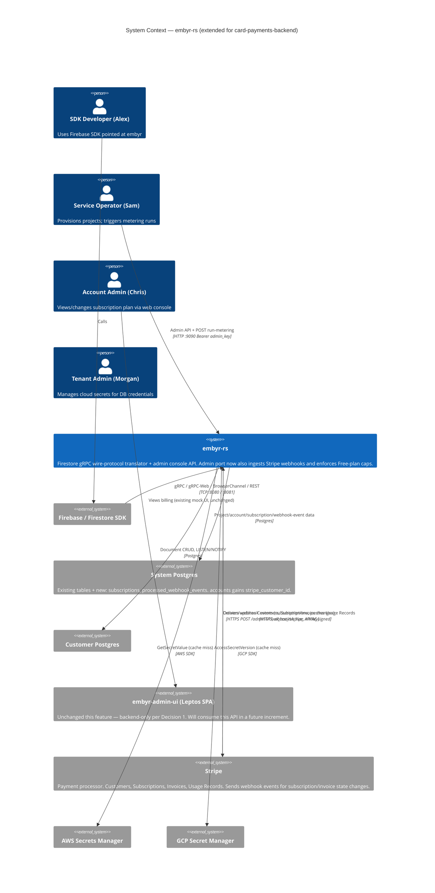

---

### Wave: DESIGN / [REF] C4 Container Diagram — Extended (card-payments-backend)

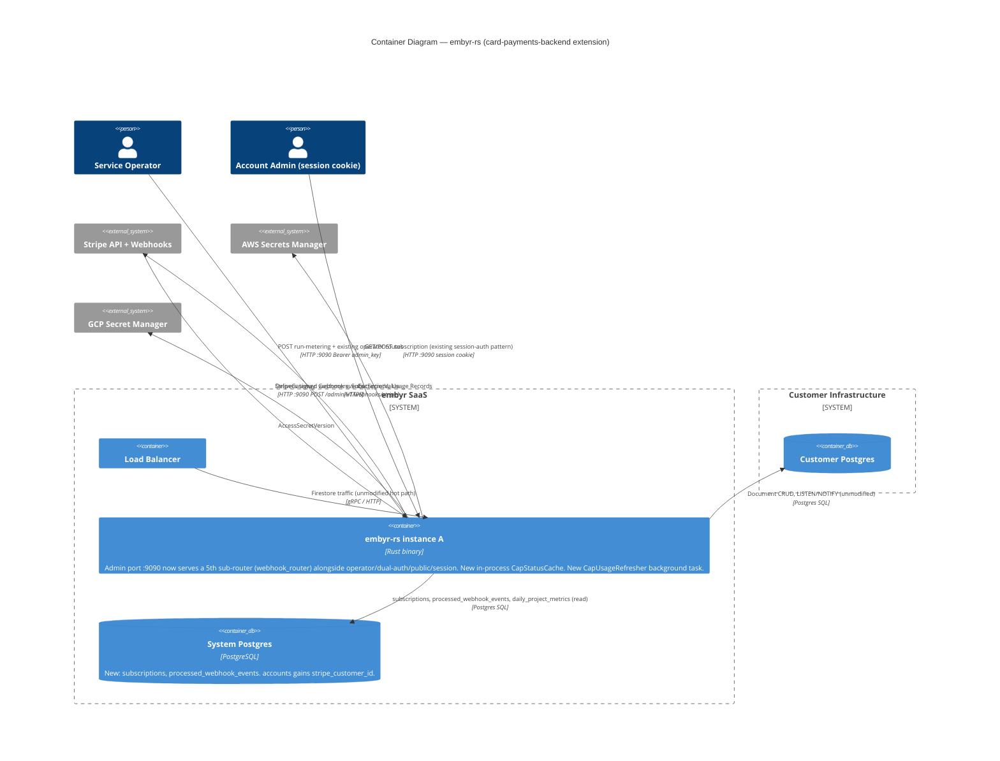

---

### Wave: DESIGN / [REF] C4 Component Diagram — Billing Subsystem (card-payments-backend)

Complex, multi-part subsystem (webhook ingestion + cumulative cap-check + batch metering +
Stripe adapter) — L3 diagram per SKILL mandate.

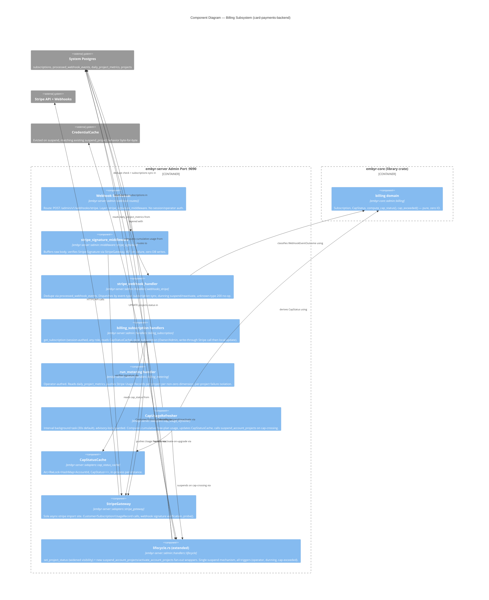

---

### Wave: DESIGN / [REF] Architecture Enforcement — card-payments-backend

| Concern | Enforcement Mechanism |
|---------|----------------------|
| `embyr-core::admin::billing` must not import IO crates | `cargo-deny` `deny.toml` for `embyr-core`, unchanged (`async-stripe`, `sqlx`, `tokio`, `axum` in deny list) |
| `StripeGateway` is the sole `async-stripe` import site | Code review convention (mirrors existing `AwsSecretFetcher`/`GcpSecretFetcher` sole-importer convention — not newly tool-enforced) |
| One suspend mechanism, all triggers (D-12) | Integration test (DISTILL wave): asserts dunning (US-204) and cap-exceeded (US-207) triggers both call `lifecycle::set_project_status` via a shared test helper / code-path assertion, not merely behaviorally similar output |
| Webhook idempotency | Integration test: redelivers an identical `event.id` and asserts the second delivery is a no-op (no double state transition) |
| Zero hot-path latency added | Integration test: benchmarks `:8080`/`:8081` request latency before/after this feature lands, asserts no regression (the cap check adds no code to this path — see ADR-020) |
| `async-stripe` license/CVE compliance | `cargo deny check` (unchanged `deny.toml`), covers the new dependency automatically |
| Mutation testing | `cargo-mutants -p embyr-server --filter billing` targets `compute_cap_status`/`cap_exceeded` (embyr-core, pure), webhook dedupe logic, and the `suspend_account_projects`/`activate_account_projects` fan-out. Per-feature mutation gate per project `CLAUDE.md`. |

---

### Wave: DESIGN / [REF] Application-Level Decisions Table — card-payments-backend

| ID | Decision | Verdict | Rationale |
|----|----------|---------|-----------|
| CPB-AD-01 | D-9's cap check is a new background-computed mechanism, not a `RateLimiter` extension | Accepted — see ADR-020 | Different key/time-semantics/reset-boundary; AC-206-06 locks this explicitly |
| CPB-AD-02 | `async-stripe` over hand-rolled `reqwest` | Accepted — see ADR-021 | API surface size + webhook-signature security-criticality; mirrors the `aws-sdk-secretsmanager` precedent, not `GcpSecretFetcher`'s |
| CPB-AD-03 | Enforcement happens in a background task; the `:8080`/`:8081` hot path is unmodified | Accepted | Eliminates the request-hot-path race condition Slice 07 explicitly flagged; adds zero latency to the rank-1/rank-4 quality-attribute-critical data plane |
| CPB-AD-04 | Free-plan cap-check billing cycle = UTC calendar month; Stripe period fields are Pro-display-only | Accepted | AC-206-05 requires a real cycle boundary; Free accounts have no guaranteed Stripe `Subscription` object to source one from |
| CPB-AD-05 | Storage dimension NOT metered/capped in V1 | Accepted, flagged as OQ-CP-1 | No `daily_project_metrics` column exists; computing it requires a new `BackendAdapter::table_size()` port method against each customer DB — real scope beyond this feature's locked boundary |
| CPB-AD-06 | Webhook usage-record idempotency reuses Stripe's native idempotency-key mechanism, no local ledger table | Accepted | Avoids a redundant, potentially-drifting local audit table for a guarantee Stripe already provides server-side |
| CPB-AD-07 | `lifecycle::set_project_status` narrowed to `LifecycleDeps`, not `OperatorState` | Accepted | Enables literal reuse (D-12) from non-operator callers (webhook handler, background task) without those callers depending on operator-only fields |
| CPB-AD-08 | `billing_subscription.rs` is a new file, not an extension of existing `billing.rs` | Accepted | Existing `billing.rs` is a pure read-only reporting query with zero external-IO; mixing Stripe calls into it violates single-responsibility |
| CPB-AD-09 | `run_metering` is HTTP-triggered, not a Tokio-interval sweeper (unlike `CapUsageRefresher`) | Accepted | DISCUSS Slice 05 explicitly descopes scheduling to DEVOPS-wave; deliberate asymmetry, not an inconsistency |
| CPB-AD-10 | No `_previous`/rotation variant for `STRIPE_*` secrets in this feature | Accepted, flagged as OQ-CP-2 | Not locked by any D-decision; ADR-018's dual-key pattern is available to extend later if Stripe key rotation becomes an operational need |

---

### Wave: DESIGN / [REF] Open Questions — card-payments-backend

| ID | Question | Blocking | Resolution Timing |
|----|----------|---------|-------------------|
| OQ-CP-1 | Storage-dimension metering/cap enforcement — requires a new `BackendAdapter::table_size()` port method against customer DBs | No (V1 ships reads/writes/deletes complete; storage remains the existing `billing.rs`-precedented placeholder) | Follow-up feature |
| OQ-CP-2 | `STRIPE_SECRET_KEY`/`STRIPE_WEBHOOK_SIGNING_SECRET` rotation (dual-key window, ADR-018-shaped) | No (not locked by DISCUSS; extend later if needed) | Follow-up feature, if operationally needed |
| OQ-CP-3 | `EMBYR_CAP_CHECK_INTERVAL_SECS` default (30s) — is this the right latency/load trade-off at production scale (many Free accounts)? | No (configurable; DEVOPS can tune post-launch against KPI #5 measurement) | DEVOPS-wave observation, post-launch |
| OQ-CP-4 | `GET /admin/v1/billing/metering-log` audit trail (mentioned as illustrative in US-205's elevator pitch) | No — explicitly not built; KPI #4's reconciliation job is DEVOPS-wave scope per DISCUSS's own Out of Scope section | DEVOPS-wave, if pursued |
| OQ-CP-5 | Peer review was skipped per-wave (background dispatch default) — but the D-9 resolution (ADR-020) is genuinely novel/contested enough that a dedicated review WOULD normally be warranted per the SKILL's trigger conditions | Flagged for orchestrator | Orchestrator's call — mandatory consolidated review still fires at end of DISTILL |

---

### Wave: DESIGN / [REF] External Integrations Requiring Contract Tests — card-payments-backend

```
External Integrations Requiring Contract Tests:
- Stripe (REST API + Webhooks): embyr-server consumes Customer/Subscription/Invoice/UsageRecord
  APIs and receives webhook events (customer.subscription.*, invoice.payment_*).
  Recommended: consumer-driven contract tests (Pact) in CI's acceptance stage, covering both
  directions — embyr-as-consumer of Stripe's REST API responses, and embyr-as-provider of the
  webhook endpoint's expected request shape (Stripe's own webhook payload schema). This is the
  highest-risk external boundary in this feature: a Stripe API contract change (new required
  field, deprecated Usage Records API in favor of the newer Billing Meters API, webhook payload
  schema evolution) would silently break subscription sync, metering, or dunning without contract
  tests catching it pre-production. D-13's real-Stripe-test-mode testing strategy catches *some*
  drift at test time, but only for the specific call shapes exercised by acceptance tests — Pact
  contract tests against Stripe's published OpenAPI schema (Stripe publishes one) would catch
  drift more systematically.
```

This is a forward-flag from the frontend `card-payments` feature's own DESIGN section (§ Driven
Ports — Forward Contract), now realized as this feature's own highest-risk boundary.

---

## Application Architecture — customer-db-onboarding

> Updated: 2026-08-16
> Feature: customer-db-onboarding (JOB-15 — privilege-separated Postgres onboarding for
> DBA-gated/regulated customers, `backend_mode=direct_pg` only)
> Mode: Propose (autonomous analysis per Decision 1)
> ADRs: `docs/product/architecture/adr-022-customer-db-prep-crate-and-migration-consolidation.md`
> (new), `docs/product/architecture/adr-023-schema-readiness-verification.md` (new)

---

### Wave: DESIGN / [REF] Contradiction Check — AD-A08 Correction

DISCUSS's feature-delta (§ Out of Scope) states: "`agent` backend mode — not applicable;
`embyr-agent` already self-migrates its own local customer DB at its own startup (AD-A08)."
Codebase inspection during DESIGN (`crates/embyr-agent/src/main.rs`, `probe.rs`, `server.rs`)
found this factually incorrect: `embyr-agent`'s production `run()` path connects a pool and starts
the mTLS gRPC server directly — it never calls `PostgresBackendAdapter::migrate()` or
`run_migrations()`. Those methods exist (in `embyr-pg-storage`) but, per their own doc comments,
are used only by test harnesses today.

This does not change agent mode's exclusion from this feature's scope — the exclusion is still
correct on independent grounds (agent-mode credentials never leave the customer's VPC, so the
cross-tenant privilege-separation-from-embyr's-SaaS problem this feature solves does not apply to
agent mode regardless of how its schema gets applied). But the *stated reason* was inaccurate, and
the actual gap (how does an agent-mode customer's local DB get its schema today?) is real and
undocumented. Flagged as OQ-2 below — not fixed in this feature, per DISCUSS's explicit
"do not expand scope" guardrail.

---

### Wave: DESIGN / [REF] Quality Attribute Priorities — customer-db-onboarding

| Rank | Attribute | Forcing Constraint |
|------|-----------|---------------------|
| 1 | **Privilege-separation integrity** | The entire reason the feature exists: provisioning must never require or attempt DDL against a database when it isn't necessary (AC-02-01, AC-02-05). This is the feature's own North Star KPI. |
| 2 | **Migration-set single-sourcing** | DISCUSS's Handoff Package names this the single highest-consequence design risk. A drift between what the prep binary applies and what `embyr-server` expects is the anxiety-path failure mode JOB-15 names explicitly. |
| 3 | **Error-message actionability** | KPI #2 (leading indicator): ≥90% of not-prepped/stale-version failures must be self-resolvable from the error message alone, no support ticket. |
| 4 | **No regression to the existing default `direct_pg` flow** | KPI #3 (guardrail): 0% regression in existing provisioning success rate for non-DBA-gated customers. The single highest-consequence *defect* class this feature can produce. |
| 5 | **Idempotent, resumable preparation** | AC-01-02/AC-01-03 — a DBA's interrupted run (VPN drop, network blip) must not require manual cleanup. |

---

### Wave: DESIGN / [REF] Reuse Analysis — customer-db-onboarding (hard gate)

| Existing Component | File | Overlap | Decision | Justification |
|---------------------|------|---------|----------|----------------|
| `PostgresBackendAdapter::migrate()` / `run_migrations()` | `crates/embyr-pg-storage/src/backend_adapter.rs` | Already applies `migrations/customer/` via `sqlx::migrate!` — exact capability the new prep binary needs, and exact capability `provision.rs` reimplements independently three times today | **EXTEND** | Route both the new prep binary and `provision.rs`'s three branches through this single existing method instead of independent inline macro calls. Collapses 2 pre-existing independent embeds (`provision.rs`, `backend_adapter.rs`) plus the new prep binary's would-be 3rd embed down to ONE canonical embed — directly resolves DISCUSS's #1 escalated risk. ~3 LOC diff per `provision.rs` branch vs. 0 new migration-application code anywhere. See ADR-022. |
| `SystemDb::probe()` | `crates/embyr-server/src/adapters/system_db.rs` | Hard-gate schema-verification pattern: `SELECT 1` liveness + `information_schema.tables` existence check, refuse-to-proceed on mismatch | **EXTEND (pattern reuse, new sibling method)** | The new `verify_schema_readiness()` follows the identical shape but targets a different DB (customer, not system) at a different moment (provisioning-time, not server-startup). Cannot literally extend `SystemDb` itself — it is hard-wired to the system DB's own pool, connection lifecycle (`SystemDb::new()`), and the `projects` table name; retrofitting it to be DB/table-agnostic is more code than the ~15 LOC sibling method added to `PostgresBackendAdapter`, which already owns the customer DB pool. See ADR-023. |
| `provision.rs`'s `direct_pg` branch + `probe_customer_db()` | `crates/embyr-server/src/admin/handlers/provision.rs` | The exact code path being extended: existing connectivity probe + automatic migrate call | **EXTEND** | Insert `verify_schema_readiness()` between the existing `probe_customer_db()` and the migrate call; branch on its result to skip migrate (`Ready`) or enrich the failure message (`NotPrepped`/`Stale`). No new HTTP endpoint; no new request/response shape beyond the error body. |
| `embyr-agent` crate ([[bin]] target, `AgentConfig::from_env()` error-accumulation pattern, named startup errors) | `crates/embyr-agent/` | Precedent for a customer-run standalone binary with env-var config and distinct, actionable startup errors | **CREATE NEW crate (pattern-only reuse, not code reuse)** | `embyr-agent` is a long-running mTLS gRPC daemon (tonic, rustls server TLS, background sweeper, NOTIFY bridge) — a fundamentally different runtime shape from a one-shot CLI migration tool. Sharing its crate would pull tonic/rustls-server/mTLS dependencies into a tool needing none of them, working against the same supply-chain-minimization rationale SD-01/SD-09 already established for `embyr-agent` itself. The `[[bin]]`+`[lib]` shape and the config-error-accumulation *pattern* are reused directly; the crate and its dependency graph are new (`embyr-db-prep`: only `embyr-pg-storage`, `embyr-core`, `sqlx`, `tokio`). See ADR-022. |
| `embyr-server` crate (as a home for a new `[[bin]]`) | `crates/embyr-server/` | Considered as an alternative home for the new binary | **REJECTED (not extended)** | `embyr-server`'s `Cargo.toml` carries axum, tonic, tonic-web, aws-sdk-secretsmanager, async-stripe, and a dozen SaaS-side dependencies irrelevant to a one-shot DB migration tool run in a customer environment. See ADR-022 Alternative 2. |
| `CoreError` enum (`PermissionDenied`, `BackendUnavailable`, `InvalidArgument`) | `crates/embyr-core/src/error.rs` | Existing variants already cover "insufficient privilege" and "connection failure" semantics via free-text payload | **EXTEND (reuse existing variants, no new enum growth)** | Prep binary and `verify_schema_readiness()` reuse these existing variants; the String payload carries the specific role/database/table/version detail. Matches the project's established convention (nearly every `CoreError` variant already carries a free-text detail string). |

**Verdict: 5 EXTEND, 1 CREATE NEW (new crate, extensively justified against 2 rejected in-place
alternatives — see ADR-022), 0 unjustified CREATE NEW.**

---

### Wave: DESIGN / [REF] Component Decomposition — customer-db-onboarding

| File Path | Change | Responsibility |
|-----------|--------|-----------------|
| `crates/embyr-db-prep/Cargo.toml` | **NEW** | New workspace crate. `[[bin]] name = "embyr-db-prep"`. Deps: `embyr-pg-storage`, `embyr-core`, `sqlx`, `tokio` only. |
| `crates/embyr-db-prep/src/main.rs` | **NEW** | Entry point: `DbPrepConfig::from_env()` → connectivity probe (SELECT 1, timeout-bound) → `PostgresBackendAdapter::migrate()` → classify result → print named message → exit code. Mirrors `embyr-agent/src/main.rs`'s wire→probe→use shape. |
| `crates/embyr-db-prep/src/config.rs` | **NEW** | `DbPrepConfig::from_env()` — `EMBYR_DB_PREP_DSN` (required, elevated) + `EMBYR_DB_PREP_DML_ROLE_DSN` (**optional**, revised per ADR-023 security-review resolution — the DML role's own connection string, used only to self-discover its role name). Mirrors `AgentConfig::from_env()`'s error-accumulation pattern. |
| `crates/embyr-db-prep/src/error_report.rs` | **NEW** | Classifies the underlying `sqlx`/Postgres error (connect-phase vs. `SQLSTATE 42501` insufficient_privilege vs. other) into the 3 named message shapes UAT requires. Role/database named from the DSN's own components, not from server response content. |
| `crates/embyr-pg-storage/src/backend_adapter.rs` | **EXTEND** | Add `verify_schema_readiness(&self) -> Result<SchemaReadiness, CoreError>`; add `discover_current_user(&self) -> Result<String, CoreError>` (runs `SELECT current_user`, used against a brief DML-role connection, ADR-023 revised); add `grant_schema_readiness_read(&self, role_name: &str) -> Result<(), CoreError>` (executes the role-scoped `GRANT`, executed against the elevated connection, using Postgres's own `format('%I', ...)` for identifier quoting — no hand-rolled Rust quoting). `provision.rs`'s 3 branches switch from inline `sqlx::migrate!` to calling the already-existing `migrate()` (ADR-022). |
| `crates/embyr-core/src/domain/schema_readiness.rs` | **NEW** | Pure `SchemaReadiness` enum (`Ready`, `NotPrepped`, `Stale`). Zero IO imports — `deny.toml`-compliant. |
| `crates/embyr-core/src/domain/mod.rs` | **EXTEND** | Register `schema_readiness` module. |
| `crates/embyr-server/src/admin/handlers/provision.rs` | **EXTEND** | `direct_pg` branch: call `verify_schema_readiness()` after `probe_customer_db()`; skip migrate on `Ready`; on `NotPrepped`/`Stale`, attempt the existing (unchanged) migrate call and enrich only the failure message. Replace all 3 inline `sqlx::migrate!` calls with `PostgresBackendAdapter::migrate()`. No grant-related change — the grant step lives exclusively in `embyr-db-prep` (see revised ADR-023). |
| ~~`migrations/customer/0003_grant_schema_readiness_read.sql`~~ | **REMOVED (design revision)** | Superseded — a role-parameterized grant cannot be expressed as static, unparameterized migration SQL (the target role name isn't known at migration-authoring time). The grant is now a runtime step in `embyr-db-prep` only (`discover_current_user()` + `grant_schema_readiness_read()`), never a tracked migration. `expected_version` for `Stale`/`Ready` comparison remains `2` (`0001`, `0002` only). |
| Root `Cargo.toml` | **EXTEND** | Add `crates/embyr-db-prep` to `[workspace] members`. |
| `deny.toml` | **EXTEND** | Register `embyr-db-prep` with the same IO-permissive scope as `embyr-agent`/`embyr-server` (only `embyr-core` is IO-prohibited). |

No changes to `embyr-proto`, `embyr-admin`, `embyr-admin-ui`, or `embyr-agent`.

**Revision note (post-DESIGN-wave security review):** the original Component Decomposition proposed
a static migration `0003_grant_schema_readiness_read.sql` granting `SELECT` on `_sqlx_migrations` to
`PUBLIC`. A targeted security review of ADR-023 approved the design overall but flagged this as an
avoidably broad grant for a feature whose entire framing is least-privilege separation. Revised to a
role-parameterized runtime grant (above); full mechanism and rationale: ADR-023 (revised) and
§ Driven Ports + Adapters below.

---

### Wave: DESIGN / [REF] Driving Ports — customer-db-onboarding

| Port | Auth/Trigger | Handler |
|------|--------------|---------|
| `embyr-db-prep` CLI process (**new**) | Run by Elena under her own elevated, database-scoped Postgres role. Config: `EMBYR_DB_PREP_DSN` env var (required) + `EMBYR_DB_PREP_DML_ROLE_DSN` env var (optional, revised per ADR-023 — enables the role-scoped read grant). Not network-facing — a system-context-level driving port, per DISCUSS's own framing. | `crates/embyr-db-prep/src/main.rs` |
| `POST /admin/v1/projects` (existing, `backend_mode=direct_pg` branch extended) | Operator Bearer (`operator_auth_middleware`, unchanged) | `provision.rs::provision` |

No new customer-facing gRPC/REST surface on `:8080`/`:8081` — confirmed unchanged from DISCUSS's
own Driving Ports section.

---

### Wave: DESIGN / [REF] Driven Ports + Adapters — customer-db-onboarding

Conceptual interface (method signatures only — no implementation belongs in this document):

```
impl PostgresBackendAdapter {
    async fn migrate(&self) -> Result<(), CoreError>;
    // existing method, now the sole embed point for migrations/customer/ (ADR-022)

    async fn verify_schema_readiness(&self) -> Result<SchemaReadiness, CoreError>;
    // new (ADR-023)

    async fn discover_current_user(&self) -> Result<String, CoreError>;
    // new (ADR-023, revised) — runs `SELECT current_user`. Called against a brief, short-lived
    // connection opened with EMBYR_DB_PREP_DML_ROLE_DSN; the DSN is never logged, never reused
    // beyond this one query (mirrors StartupProbe's DSN-handling convention).

    async fn grant_schema_readiness_read(&self, role_name: &str) -> Result<(), CoreError>;
    // new (ADR-023, revised) — executed against the ELEVATED connection (only the owner of
    // _sqlx_migrations can grant on it). Role-name interpolation is delegated to Postgres's own
    // format('%I', ...) (a plain, bind-parameterized SELECT), never hand-rolled Rust-side quoting —
    // closes the SQL-injection-shaped risk a naive string interpolation would open.
}

enum SchemaReadiness {
    Ready { schema_version: i64 },
    NotPrepped { missing_tables: Vec<String> },
    Stale { expected_version: i64, found_version: i64 },
}
```

**Revised per ADR-023's security-review resolution:** `_sqlx_migrations` is made readable to the DML
role via a runtime, role-scoped `GRANT` — not `GRANT ... TO PUBLIC`, and not a static migration file
(a role-parameterized grant cannot be expressed as unparameterized migration SQL). `embyr-db-prep`
performs the grant only when `EMBYR_DB_PREP_DML_ROLE_DSN` is supplied (optional); if absent, the tool
still reports migration success normally and prints an informational note that read-verification
access was not established. Full mechanism, the two-round-trip identifier-quoting technique, and the
rejected `PUBLIC`-grant alternative: ADR-023 § Mechanism, § Alternatives Considered (Alternative 4).

**Earned Trust — probe design (Principle 12):**

| Aspect | Design |
|--------|--------|
| What `embyr-db-prep` probes before use | Connectivity: `PgPoolOptions::connect(dsn)` + `SELECT 1`, timeout-bound — mirrors `probe_customer_db()`/`embyr-agent`'s `StartupProbe::probe_postgres` shape. Runs **before** `migrate()` is ever attempted (wire → probe → use). |
| Failure action on probe failure | Hard failure — distinct "connection failed" message, exit 1, `migrate()` never attempted. |
| Fault-injection scenarios | (1) host unreachable → connect timeout/error → "connection failed" (AC-01-05). (2) valid connection, insufficient privilege on the first pending DDL statement → `SQLSTATE 42501` → "insufficient privilege: role `{role}` lacks CREATE on database `{database}`" (role/database parsed from the DSN itself, not server response content — AC-01-04). (3) interrupted mid-migration (network drop between migrations) → Postgres transactional DDL rolls back the uncommitted migration; `_sqlx_migrations` retains only prior, fully-committed versions; re-run resumes cleanly with no duplicate-object error — this relies on Postgres's transactional DDL + sqlx's per-migration transaction wrapping (validated existing behavior, no new resume logic required — AC-01-03). (4) `EMBYR_DB_PREP_DML_ROLE_DSN` connection fails (revised, ADR-023) → the grant step is skipped with a distinct, non-fatal warning; migration success/failure reporting is unaffected — a broken DML-role credential must not make an otherwise-successful schema migration look like a failure. |
| `verify_schema_readiness()` as `embyr-server`'s own probe | Mirrors `SystemDb::probe()`'s hard-gate shape: a read-only check of substrate claims (schema state) performed before provisioning proceeds against that substrate. Runs on every `direct_pg` provisioning request — the provisioning-time analogue of a startup probe, not a one-time check. |
| The specific substrate lie this defends against | A submitted DML-only connection string "looks" like an ordinary Postgres connection (connects fine, `SELECT 1` succeeds) but silently cannot perform the DDL provisioning has always assumed it could until the migration attempt fails. This is exactly the kind of substrate assumption Earned Trust requires probing/diagnosing explicitly rather than surfacing as a raw downstream error. |

External integrations requiring contract tests: **none.** This feature adds no new external
SaaS/API integration — the "external" system touched (the customer's own Postgres) is already a
first-class integration point in the existing architecture (`direct_pg` mode), not a new
dependency class.

---

### Wave: DESIGN / [REF] C4 System Context (Mermaid) — customer-db-onboarding

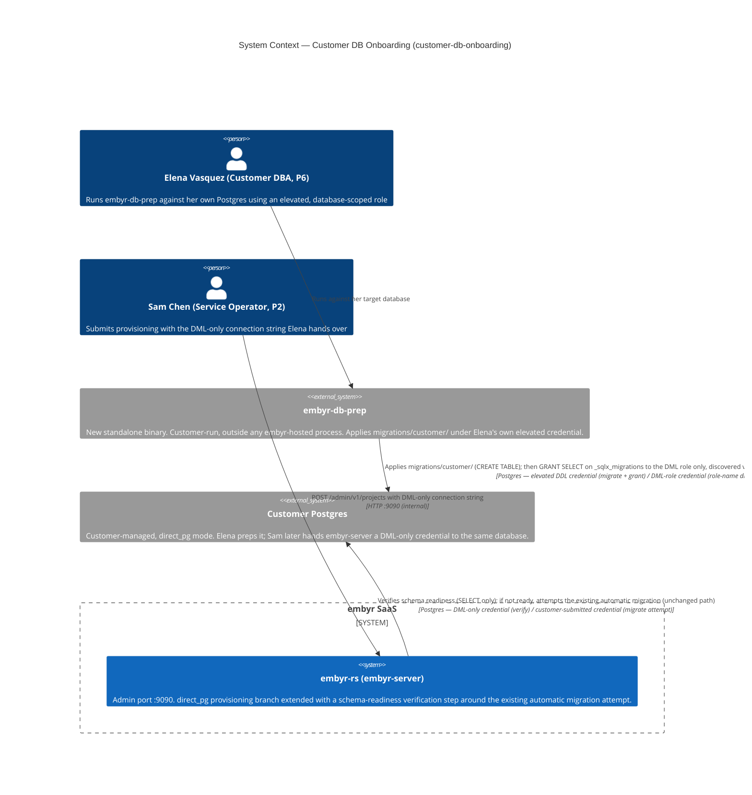

---

### Wave: DESIGN / [REF] C4 Container Diagram (Mermaid) — customer-db-onboarding

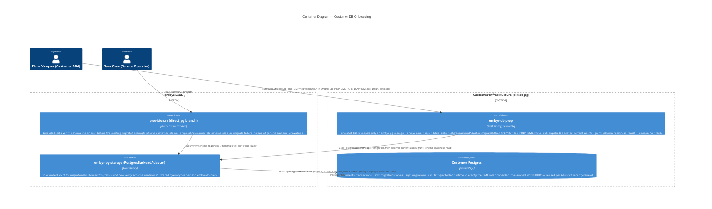

---

### Wave: DESIGN / [REF] Architecture Enforcement — customer-db-onboarding

| Concern | Enforcement Mechanism |
|---------|------------------------|
| Single embed point for `migrations/customer/` (ADR-022) | Code-review convention + DISTILL-wave regression test asserting the macro invocation appears exactly once in the workspace source tree (`crates/embyr-pg-storage/src/backend_adapter.rs`) — mirrors the project's existing "sole importer" conventions (e.g., `StripeGateway`, ADR-021). |
| `embyr-core` stays IO-free (`SchemaReadiness` enum) | Existing `deny.toml` IO-prohibition for `embyr-core`, unchanged scope. |
| `embyr-db-prep` dependency minimality (no tonic/rustls-server/aws-sdk) | `deny.toml` extended to register `embyr-db-prep`; `Cargo.lock` diff review in CI — no new transitive dependencies beyond `sqlx`/`tokio`/`embyr-pg-storage`/`embyr-core` already present in the workspace. |
| `verify_schema_readiness()` never attempts DDL | Integration test (DISTILL, testcontainers, mirrors `SystemDb::probe()`'s test pattern): connect as a role granted only DML+SELECT on the application tables, assert `verify_schema_readiness()` succeeds/reports correctly without itself triggering a permission-denied error. |
| Role-scoped grant is actually role-scoped, not broad (**added per security review, ADR-023 revision**) | Integration test: after `embyr-db-prep` runs with `EMBYR_DB_PREP_DML_ROLE_DSN` set to role `embyr_app`, assert `embyr_app` CAN `SELECT * FROM _sqlx_migrations` AND a second, distinct role granted no privileges by the test fixture CANNOT (`permission denied`). This is the test that would have caught a `PUBLIC`-grant regression. |
| Grant-discovery mechanism applied consistently and idempotently | Integration test: run `embyr-db-prep`'s full flow (migrate + discover + grant) twice against the same database/role, assert the second run is a no-op — `migrate()`'s existing idempotency plus `grant_schema_readiness_read()`'s idempotency (re-granting is a Postgres no-op). |
| Grant step is optional and non-fatal when `EMBYR_DB_PREP_DML_ROLE_DSN` is absent/unreachable | Integration test: run `embyr-db-prep` without the DML-role DSN, assert migration success is still reported via the unchanged success message and an informational (not error) note is printed; a subsequent `verify_schema_readiness()` against a DML-only role with no grant reports `NotPrepped`, not an unhandled error. |
| Identifier interpolation into the dynamic `GRANT` is injection-safe | Unit/integration test: role name containing an embedded double-quote or reserved word round-trips correctly through `discover_current_user()` → `format('%I', ...)` → `grant_schema_readiness_read()` without producing a malformed or injectable statement. |
| Mutation testing | `cargo-mutants -p embyr-core --filter schema_readiness` (pure comparison logic). Per-feature mutation gate per project `CLAUDE.md`. |

---

### Wave: DESIGN / [REF] Application-Level Decisions Table — customer-db-onboarding

| ID | Decision | Verdict | Rationale |
|----|----------|---------|-----------|
| CDO-AD-01 | Single embed point for `migrations/customer/` via `PostgresBackendAdapter::migrate()` | Accepted — ADR-022 | Eliminates the pre-existing 2-way embed duplication and prevents a 3rd; directly resolves DISCUSS's #1 flagged risk |
| CDO-AD-02 | New crate `embyr-db-prep`, not a new `[[bin]]` inside `embyr-agent` or `embyr-server` | Accepted — ADR-022 | Supply-chain minimization; mirrors SD-09's rationale for `embyr-agent` itself |
| CDO-AD-03 | Verification via sqlx's own `_sqlx_migrations` table, not a bespoke marker table | Accepted — ADR-023 | Avoids a second, parallel bookkeeping mechanism; reuses existing sqlx tracking |
| CDO-AD-04 | `verify_schema_readiness()` enriches the existing migrate-attempt failure path; does not replace or gate it | Accepted — ADR-023 | Required to preserve AC-02-06 (no regression to today's full-privilege-DSN default path) |
| CDO-AD-05 | `found_version >= expected_version` (not strict equality) counts as `Ready` | Accepted, flagged OQ-1 | Forward-compatible during rolling deploys; could mask a hypothetical future non-additive migration — documented, deferred |
| CDO-AD-06 | `SchemaReadiness` lives in `embyr-core` (pure domain type); `verify_schema_readiness()` lives in `embyr-pg-storage` (adapter) | Accepted | Matches existing layering (`ProjectId` in `embyr-core`, adapter-side structs like `ProjectAuthRow` in infra) |
| CDO-AD-07 | No new `CoreError` variants; reuse `PermissionDenied`/`BackendUnavailable` for prep-binary and verify messaging | Accepted | Matches the existing string-payload `CoreError` convention; avoids enum growth for a single feature |
| CDO-AD-08 | **Revised** — `_sqlx_migrations` read access is a role-scoped `GRANT` (target role discovered at runtime via a brief secondary connection + `SELECT current_user`), executed by `embyr-db-prep` only, not a static `migrations/customer/0003` migration granting `PUBLIC` | Accepted — ADR-023 (revised), supersedes the original PUBLIC-grant proposal | Security review flagged the `PUBLIC` grant as avoidably broad for a privilege-separation feature; role-scoped grant achieves the same zero-manual-role-typing property via self-discovery, at the cost of one new optional prep-tool input (`EMBYR_DB_PREP_DML_ROLE_DSN`) |

---

### Wave: DESIGN / [REF] Open Questions — customer-db-onboarding

| ID | Question | Blocking | Resolution Timing |
|----|----------|---------|---------------------|
| OQ-1 | `found_version >= expected_version` could mask a genuinely breaking future migration (e.g., a column removal) that the current additive-only, one-table-per-migration schema history doesn't yet need to worry about | No | Follow-up, if/when a non-additive migration is ever introduced to `migrations/customer/` |
| OQ-2 | **AD-A08 factual correction** (see § Contradiction Check above): `embyr-agent`'s production `server::run()` does not call `migrate()`/`run_migrations()` at startup. Agent mode's exclusion from this feature is still correct on other grounds (credentials never leave the customer VPC), but how an agent-mode customer's local DB actually gets its schema today is unaddressed and undocumented | No (does not block this feature; `direct_pg` is unaffected) | Recommend a follow-up: either wire `embyr-agent`'s startup path to call `PostgresBackendAdapter::migrate()` (now single-sourced per ADR-022, trivial to add), or document the current manual process, whichever reflects actual customer practice |
| OQ-3 | `aws_secret`/`gcp_secret` generalization (deferred per DISCUSS) | No | `provision.rs`'s `aws_secret`/`gcp_secret` branches can adopt the identical `verify_schema_readiness()` call with zero new adapter code when scoped — design confirmed to generalize cleanly |
| OQ-4 | **Resolved by targeted security review.** The original `GRANT SELECT ... TO PUBLIC` (ADR-023) was flagged as a genuine, if narrow, privilege-model change during a targeted security review of the ADR. The review approved ADR-023 overall and recommended a role-scoped grant instead — adopted (CDO-AD-08, ADR-023 revision). No further review action needed on this specific point. | Resolved | Closed this wave |
| OQ-5 | The revised role-scoped grant introduces an ordering dependency: if Elena runs `embyr-db-prep` without `EMBYR_DB_PREP_DML_ROLE_DSN` (e.g., before the `embyr_app` role exists), `verify_schema_readiness()` will report `NotPrepped` at provisioning time even though the schema itself is fully applied, until the tool is re-run (idempotently) with the DML-role DSN supplied | No (documented, not a defect — re-running the idempotent prep tool is cheap) | DISTILL should write an explicit UAT scenario for this sequencing case so it is tested, not just documented |

---

## Application Architecture — client-auth

> Updated: 2026-08-16
> Feature: client-auth (JOB-16 — per-end-user identity verification via customer-minted
> custom tokens, `signInWithCustomToken()` bridge pattern)
> Mode: Propose (autonomous analysis per Decision 1)
> ADRs: `docs/product/architecture/adr-024-client-identity-verification-mechanism.md`
> (new), `adr-025-client-identity-credential-storage-rotation.md` (new),
> `adr-026-client-identity-composition-with-api-key-auth.md` (new)

---

### Wave: DESIGN / [REF] Quality Attribute Priorities — client-auth

See `docs/feature/client-auth/feature-delta.md` § Quality Attribute Priorities
(client-auth) for the ranked table — reproduced here for SSOT completeness:

1. No regression to existing `api_key`-only traffic (KPI #3 guardrail, structurally
   enforced — ADR-026).
2. Non-impersonation (embyr must never hold anything that lets it mint a valid
   Trailmark-authentic token — ADR-024).
3. Distinguishable rejection-reason fidelity (four reasons, never collapsed — ADR-024).
4. Shared-artifact integrity — one verification routine, two call sites (ADR-025).
5. Operational simplicity for V1 — no new session-issuance machinery (ADR-026, reuses
   AD-03's already-established rationale).

---

### Wave: DESIGN / [REF] Reuse Analysis — client-auth (hard gate)

See `docs/feature/client-auth/feature-delta.md` § Reuse Analysis for the full table
(6 EXTEND, 2 justified CREATE NEW, 0 unjustified CREATE NEW). Summary: this feature
extends the existing `authenticate()` interceptor additively (never restructures it),
reuses the ADR-009/010 session-auth sub-router and `SessionContext` extractor verbatim
for its three new admin routes, reuses ADR-018's dual-current/previous rotation *shape*
(not its code, since the underlying primitive differs — public key vs. hash vs.
symmetric key), and reuses the already-workspace-present `jsonwebtoken` crate rather
than adding a new one. The two CREATE NEW items are a new 1:1 credential table
(mirroring the existing `sdk_api_keys`-as-own-table precedent) and a new verification
call site (the existing `oidc_callback` JWT code is architecturally incompatible —
browser-session-shaped, not stateless-per-request — confirmed by direct read, not
assumed).

---

### Wave: DESIGN / [REF] Architectural Pattern — client-auth

**No change to the project's Hexagonal (ports-and-adapters) pattern or its Cargo
-workspace enforcement mechanism.** `embyr-core::client_identity` is a new domain module
following the identical shape as `embyr-core::auth` (pure functions, zero IO, `Result`
-typed errors) — not a new pattern, an instance of the existing one. No new driving or
driven port *category* is introduced; the two new driving ports (admin credential
lifecycle, REST sign-in) are new *instances* of the existing `AdminHttpPort`/`RestPort`
categories already documented in § Driving Ports (Inbound) above.

---

### Wave: DESIGN / [REF] Component Decomposition — client-auth

| Component | Crate/Module Path | Responsibility | Bounded Context |
|-----------|--------------------|------------------|------------------|
| `embyr-core::client_identity` | `crates/embyr-core/src/client_identity/mod.rs` (new) | `ClientIdentityCredential`, `VerifiedEndUserIdentity` value types; `ClientIdentityVerifyError` enum (`MissingToken`/`Malformed`/`Expired`/`ProjectMismatch`); pure `verify_client_identity_token()`. No IO — extends `embyr-core`'s zero-IO invariant with a first-time `jsonwebtoken` dependency (verified pure-computation). | BC-1 |
| `embyr-server::admin::handlers::client_identity` | `crates/embyr-server/src/admin/handlers/client_identity.rs` (new) | Session-auth Axum handlers: register (US-01), rotate (US-03), debug-verify (US-04). Mirrors `sdk_keys.rs`'s shape (Owner/Admin gate for mutating actions, `verify_project_ownership`, no-raw-material-in-response convention). | BC-1 (driving adapter) |
| `embyr-server::admin::handlers::shared` | `crates/embyr-server/src/admin/handlers/shared.rs` (new — extraction) | Promoted `verify_project_ownership` helper, now shared by `sdk_keys.rs` and `client_identity.rs`. | BC-1 |
| `embyr-server::rest::sign_in` | `crates/embyr-server/src/rest/sign_in.rs` (new) | `POST /v1/projects/{project_id}/accounts:signInWithCustomToken` (US-02). Calls the shared verify function; returns the AC-16-07 rejection taxonomy. Transport shape flagged OQ-CA-01. | BC-1 → BC-2/BC-3 (driving adapter) |
| `embyr-server::grpc::handler::authenticate` (existing, extended) | `crates/embyr-server/src/grpc/handler.rs` | Adds an additive step 4: optional `x-embyr-client-identity` header check, gated entirely on the header's presence (ADR-026). Zero change to the existing three-role `api_key` check. | BC-1 |
| `client_identity_credentials` (System DB table) | `crates/embyr-server/migrations/0021_client_identity_credentials.sql` (new) | 1:1 FK to `projects.id`. `public_key_current`/`public_key_previous` (BYTEA, unhashed — see ADR-025), `algorithm`, `created_at`, `rotated_at`. | BC-1 |

---

### Wave: DESIGN / [REF] Driving Ports (Inbound) — client-auth additions

| Port | Location | Adapter(s) | What it does |
|------|----------|------------|---------------|
| `ClientIdentityCredentialAdminPort` | `embyr-server::admin::handlers::client_identity` | Axum, session sub-router (`:9090`) | `POST .../client_identity_credential` (register, 201/400/401/404/409), `POST .../client_identity_credential/rotate` (US-03), `POST .../client_identity_credential/verify` (debug-verify, US-04, read-only, any role). Owner/Admin gate on register/rotate, matching `sdk_keys.rs`'s `Role::Admin` check. |
| `ClientIdentitySignInPort` | `embyr-server::rest::sign_in` | Axum (`:8081`) | `POST /v1/projects/{project_id}/accounts:signInWithCustomToken`. No auth header of its own — the token presented in the body *is* the credential being verified. Returns 200 with `{localId, expiresIn}` or 400 with a `reason` enum matching AC-16-07's four rejection classes. |
| `FirestoreGrpcPort` / `RestPort` (existing, extended additively) | `embyr-server::grpc`, `embyr-server::rest` | `authenticate()` (extended) | New optional step: `x-embyr-client-identity` / `X-Embyr-Client-Identity` header, checked only if present, never rejects the underlying call on failure (ADR-026). |

---

### Wave: DESIGN / [REF] Driven Ports + Adapters — client-auth additions

No new driven port. `verify_client_identity_token()` is pure computation (CPU-bound
Ed25519 signature check, no IO) over an already-fetched request header and an
already-loaded `client_identity_credentials` row — the existing `SystemDb` driven port
is reused unchanged. Per Principle 12, the explicit reasoning for why no new `probe()`
is warranted here (no new substrate dependency; a cryptographic signature either
verifies or it does not, with no partial-trust/substrate-lie scenario analogous to
`decrypt_with_rotation`'s AEAD-tag guarantee in ADR-018) is documented in
`docs/feature/client-auth/feature-delta.md` § Driven Ports + Adapters.

---

### Wave: DESIGN / [REF] Technology Choices — client-auth additions

| Layer | Choice | Version | License | Rationale |
|-------|--------|---------|---------|-----------|
| Token format/verification | `jsonwebtoken` (workspace dep, reused) | 10.x, `aws_lc_rs` backend | MIT | New consumer (`embyr-core`) of an already-present dependency. See ADR-024. |
| Signature algorithm | EdDSA (Ed25519) | RFC 8032/8037 | N/A | Asymmetric-only, satisfies non-impersonation constraint; algorithm-pinned to defend against JWT algorithm-confusion attacks. See ADR-024. |
| Fingerprint (admin response) | `blake3` (workspace dep, reused) | 1.x | CC0/Apache 2.0 | Non-secret credential fingerprint for the registration response, matching the existing `CredentialFingerprint` convention. See ADR-025. |

No new workspace dependency is added.

---

### Wave: DESIGN / [REF] Application-Level Decisions Table — client-auth

| ID | Decision | Verdict | Rationale |
|----|----------|---------|-----------|
| CA-AD-01 | Ed25519/EdDSA, directly-registered public key (not HMAC shared secret, not JWKS discovery) | Accepted — ADR-024 | Only option satisfying the non-impersonation constraint without adding a hot-path network dependency |
| CA-AD-02 | New `client_identity_credentials` table, unhashed/unencrypted public key, current/previous rotation columns | Accepted — ADR-025 | Public data needs neither hashing nor encryption; rotation-window *shape* mirrors ADR-018, not its data representation |
| CA-AD-03 | Stateless per-request re-verification; no embyr-issued session JWT | Accepted — ADR-026 | Directly extends AD-03's already-accepted "no session-token layer" rationale to a cheaper primitive (Ed25519 vs. Argon2id) |
| CA-AD-04 | New `x-embyr-client-identity` header/metadata key, additive to the unchanged `authorization` slot | Accepted, provisional pending OQ-CA-01 spike — ADR-026 | Structurally guarantees the regression invariant (new branch unreachable when header absent); exact SDK wire fidelity requires empirical confirmation, mirroring OQ-02/OQ-03 |
| CA-AD-05 | `jsonwebtoken` becomes an `embyr-core` dependency for the first time | Accepted | Verified pure-computation; `deny.toml`'s IO-prohibition list is unaffected |

---

### Wave: DESIGN / [REF] C4 Diagrams — client-auth

See `docs/feature/client-auth/feature-delta.md` §§ C4 System Context (Mermaid, client
-auth delta), C4 Container Diagram (Mermaid, client-auth delta) for the full diagrams.
No new external system is introduced; Trailmark's own token-minting backend is never
called by embyr (offline signature verification only), so it does not appear as a
`System_Ext` relationship target — only as context in the System Context diagram's
narrative.

---

### Wave: DESIGN / [REF] Architecture Enforcement — client-auth

Style: Hexagonal (ports-and-adapters), unchanged project-wide pattern.
Language: Rust.
Tool: `cargo-deny` (existing `deny.toml`) + the existing three-layer probe-enforcement
combination (AD-06) — no new enforcement tooling required, since this feature adds no
new adapter requiring a `probe()` (see Driven Ports above).

Rules enforced (existing, applying unchanged to the new module):
- `embyr-core::client_identity` has zero IO imports (`cargo-deny`, `deny.toml`).
- `embyr-core` defines the trait/value-type surface; `embyr-server` consumes it —
  dependency direction inward, matching AD-02's existing rule for `BackendAdapter`.

---

### Wave: DESIGN / [REF] Open Questions — client-auth

See `docs/feature/client-auth/feature-delta.md` § Open Questions for OQ-CA-01 (sign-in
wire-fidelity spike, mirrors OQ-02/OQ-03), OQ-CA-02 (verification-result caching,
non-blocking performance follow-up), OQ-CA-03 (embyr-hosted-auth scope ceiling,
non-blocking, owned by Product Discovery).

---

### Wave: DESIGN / [REF] External Integrations — client-auth

**None requiring contract tests.** This feature introduces no new outbound network
dependency: `verify_client_identity_token()` is pure computation against
already-registered material; Trailmark's own token-minting backend is never called by
embyr (the token arrives already-signed, over a channel embyr does not control — the
SDK/app's own network path to embyr, not a new embyr-to-Trailmark integration). This is
a deliberate consequence of ADR-024's Option C selection over Option B (JWKS discovery),
which would have introduced exactly such an integration.

---

## Application Architecture — security-rules

> Updated: 2026-08-17
> Feature: security-rules (JOB-17 — per-collection access-control rules gating
> `GetDocument` reads by identity + document content, Epic 2a of the two-epic
> Firebase-security-model initiative's second epic; epic 1 = `client-auth`)
> Mode: Propose (autonomous analysis per Decision 1, propose-mode dispatch)
> ADRs: `docs/product/architecture/adr-027-access-rule-grammar-and-evaluation.md`
> (new), `adr-028-access-rule-storage-and-lifecycle.md` (new),
> `adr-029-access-control-composition-and-bounded-context.md` (new). Also amends
> `adr-002-bounded-contexts.md` (§ Changed Assumptions, appended, not rewritten).

---

### Wave: DESIGN / [REF] Quality Attribute Priorities — security-rules

| Rank | Attribute | Forcing Constraint |
|------|-----------|---------------------|
| 1 | **No regression to collections/traffic with no rule defined** | KPI #3 guardrail (AC-17-14/15/16) — this feature's single highest-consequence defect class. Structurally enforced via `get_access_rule` returning `None` short-circuiting before any evaluation logic runs (ADR-029), not just tested. |
| 2 | **Existence non-leakage** | AC-17-10, a locked security-observable behavior. Drives ADR-029's evaluation-ordering and uniform-`PermissionDenied`-response decisions. |
| 3 | **Fail-closed correctness (never crash, never over-permit on missing data)** | AC-17-09. Drives ADR-027's total, infallible `evaluate()` signature. |
| 4 | **Shared-artifact integrity (no evaluation-routine drift between real enforcement and simulation)** | § Handoff Package flag 8, HIGH integration risk. Drives ADR-029's two-call-sites-one-function design. |
| 5 | **Identity-reuse integrity (no re-derivation of `request.auth`)** | § Handoff Package flag 5, HIGH integration risk. Drives ADR-029's identity-threading design. |
| 6 | **Grammar containment (do not silently widen the locked v1 expressiveness)** | § Handoff Package flag 1. Drives ADR-027's hand-rolled-parser-over-parser-generator decision. |

---

### Wave: DESIGN / [REF] Reuse Analysis — security-rules (hard gate)

| Existing Component | File | Overlap | Decision | Justification |
|---------------------|------|---------|----------|----------------|
| `SessionContext` extractor + session sub-router | `admin/extractors/session_context.rs`, `admin/middleware/session_auth.rs`, `admin/router.rs` | Project-owner-scoped admin action auth | **EXTEND** | 2 new routes (define/redefine, simulate) added to the existing session sub-router, reusing `SessionContext` verbatim. Zero new auth middleware. |
| `verify_project_ownership` (shared helper) | `admin/handlers/shared.rs` | Project-ownership-by-account_id check | **EXTEND** | Called directly by the new `access_rules.rs` handler — no second, independently-maintained copy. |
| Admin handler shape (Owner/Admin gate, no-raw-material-in-response convention, JSON error body shape) | `admin/handlers/client_identity.rs`, `admin/handlers/sdk_keys.rs` | Handler structure for project-scoped mutating admin actions | **EXTEND (pattern reuse)** | The new `access_rules.rs` handler follows the identical shape — `Role::Admin` gate on define/redefine, any-role on simulate (mirroring `verify_client_identity_credential`'s debug-verify precedent). |
| `client_identity_credentials`-style adapter CRUD (`insert_*`/`get_*`/`rotate_*`) | `adapters/system_db.rs:169-281` | CRUD pattern for project-scoped System DB state | **EXTEND (pattern reuse; new table, new upsert shape)** | `upsert_access_rule`/`get_access_rule` follow the identical method shape (typed row struct, `try_get` field mapping, `CoreError::BackendUnavailable` on failure) but collapse insert/rotate into one upsert method — a deliberate deviation from the pattern, justified in ADR-028 by Resolution 3's idempotent-upsert lock (register/rotate's *split* exists because those two actions are observably different; define/redefine are not). |
| `embyr-core::client_identity` module shape (pure fn + value types + error enum, zero IO) | `client_identity/mod.rs` | Zero-IO domain module pattern | **EXTEND (pattern reuse)** | `embyr-core::access_control` follows the identical shape (ADR-027). |
| `VerifiedEndUserIdentity` / `attach_client_identity_if_present` | `client_identity/mod.rs`; `grpc/handler.rs:358-383` | Identity available to `request.auth` | **EXTEND (consume, not modify)** | Zero changes to this function; its previously-discarded return value (`_verified_identity`) is now consumed (renamed, threaded into evaluation) — see ADR-029. |
| `handle_get_document` | `grpc/handler.rs:506-551` | The single `GetDocument` call site | **EXTEND** | Additive rule-lookup + evaluation step inserted after identity-attach, before the response is finalized. No other RPC handler touched. |
| Admin router registration (`build_admin_router`/session_router) | `admin/router.rs` | Route registration | **EXTEND** | 2 new routes added; zero new middleware, zero signature changes. |
| `embyr_core::domain::field_value::FieldValue` | `domain/field_value.rs` | Document field-value representation | **EXTEND (reuse unchanged)** | `resource.data.<field>` values are represented directly as the existing `FieldValue` type — no new value-representation type introduced for BC-4. |
| `authenticate()`'s "fast-path status check before expensive verification" precedent | `grpc/handler.rs:200-207` | Cheap existence/status check gating an expensive step | **EXTEND (pattern reuse)** | `get_access_rule`'s existence-check-before-evaluation shape directly reuses this precedent, per DISCUSS's own NFR note request. |
| Condition parser/evaluator (`parse_condition`, `evaluate`) | — | Boolean-expression evaluation over identity + document data | **CREATE NEW** | Confirmed by DISCUSS's own Walking Skeleton Evaluation: "no existing mechanism evaluates a boolean condition over identity + document data — that computation does not exist anywhere in the codebase today." |
| `access_rules` table | `migrations/0022_access_rules.sql` | Rule storage | **CREATE NEW** | No existing table stores per-collection conditions. Schema shape mirrors an existing precedent (EXTEND-pattern, above) but the data itself is new. |

**Verdict: 10 EXTEND, 2 CREATE NEW (both extensively justified — no existing
mechanism evaluates a condition over identity+document data, confirmed by
DISCUSS's own walking-skeleton analysis; no existing table stores rule
conditions), 0 unjustified CREATE NEW.**

---

### Wave: DESIGN / [REF] Development Paradigm Confirmation — security-rules

No change to the project-wide paradigm. `embyr-core::access_control` follows the
existing "functional-where-practical Rust" discipline (§ Development Paradigm,
above): a pure, total `evaluate()` function (no `Result`, `Deny` absorbs every
failure mode per ADR-027's fail-closed design), a pure `parse_condition()`
function returning `Result<Condition, ConditionParseError>`, zero IO, zero shared
mutable state. `CLAUDE.md`'s existing paradigm section requires no update.

---

### Wave: DESIGN / [REF] Bounded-Context Placement — security-rules

**BC-4: Access Control** is added — see
`docs/product/architecture/adr-029-access-control-composition-and-bounded-context.md`
§ Considered Options — Bounded-Context Placement for the full alternatives
analysis (Option A extend BC-1, rejected; Option B extend BC-2, rejected; Option C
new BC-4, accepted) evaluated against ADR-002's own five decision drivers, and
`docs/product/architecture/adr-002-bounded-contexts.md` § Changed Assumptions for
the formal amendment (Option D's original rejection text quoted verbatim, new
assumption stated, Context Map addition appended).

---

### Wave: DESIGN / [REF] Component Decomposition — security-rules

| Component | Crate/Module Path | Responsibility | Bounded Context |
|-----------|--------------------|------------------|------------------|
| `embyr-core::access_control` | `crates/embyr-core/src/access_control/mod.rs` (new) | `Condition` AST, `Operand`, `CompareOp`, `AuthContext`, `EvaluationOutcome`, `ConditionParseError` value types; pure `parse_condition()` and `evaluate()` functions (ADR-027). No IO. | BC-4 |
| `embyr-server::admin::handlers::access_rules` | `crates/embyr-server/src/admin/handlers/access_rules.rs` (new) | `define_access_rule` (US-01, define+redefine as one idempotent-upsert action), `simulate_access_rule` (US-05) — session-auth Axum handlers, mirroring `client_identity.rs`'s shape | New module | BC-4 (driving adapter) |
| `embyr-server::adapters::system_db` (extended) | `crates/embyr-server/src/adapters/system_db.rs` | Adds `AccessRuleRow`, `upsert_access_rule()`, `get_access_rule()` (ADR-028) | Extended (existing file) | BC-4 (driven adapter) |
| `embyr-server::grpc::handler::handle_get_document` (extended) | `crates/embyr-server/src/grpc/handler.rs` | Adds rule-lookup + evaluation step, threading the already-computed `VerifiedEndUserIdentity` into `AuthContext` and the fetched document's fields into `resource_fields` (ADR-029). Zero change to any other `handle_*` method. | Extended (existing file) | BC-4 (consumes BC-1 + BC-2 data, read-only) |
| `access_rules` (System DB table) | `crates/embyr-server/migrations/0022_access_rules.sql` (new) | Storage for the per-`(project_id, collection_path)` condition (ADR-028) | New table | BC-4 |

---

### Wave: DESIGN / [REF] Driving Ports (Inbound) — security-rules additions

| Port | Protocol | Location | New/Extended | What it does |
|------|----------|----------|---------------|---------------|
| `AccessRuleAdminPort` | HTTP (admin `:9090`, session sub-router) | `admin/handlers/access_rules.rs` | New | `POST /admin/v1/projects/:project_id/access_rules` (define/redefine, US-01, body `{collection_path, condition}` — collection path in the body, not the URL, to sidestep subcollection-path URL-encoding entirely). Session auth, Owner/Admin only, mirroring `client_identity.rs::register_client_identity_credential`. |
| `AccessRuleSimulationPort` | HTTP (admin `:9090`, session sub-router) | `admin/handlers/access_rules.rs` | New | `POST /admin/v1/projects/:project_id/access_rules/simulate` (US-05, body `{condition, auth: {uid}|null, document: {...}}`). Session auth, any role — mirrors `verify_client_identity_credential`'s read-only/debug-only, any-role precedent. Zero writes (AC-17-18). |
| `FirestoreGrpcPort` / `RestPort` (existing) | gRPC `:8080` / REST `:8081` | `grpc/handler.rs::handle_get_document` | **Extended, additively** | `GetDocument`'s existing, unchanged call shape now additionally reflects rule evaluation when a rule is defined for the target collection (US-02/03/04). No new RPC, no new endpoint. Every other data-plane RPC is unmodified (§ Handoff Package flag 6). |

---

### Wave: DESIGN / [REF] Driven Ports + Adapters — security-rules additions

No new *driven* (outbound infrastructure) port. `upsert_access_rule`/
`get_access_rule` execute through the existing, already-probed `SystemDb`
connection pool — the identical substrate BC-1's own System-DB reads already use.
No new adapter, no new `probe()`.

**Earned Trust note (Principle 12 discipline, explicit, not silently skipped):**
no new Earned Trust probe is required because no new *substrate* dependency is
introduced. `embyr_core::access_control::evaluate()`/`parse_condition()` are pure,
deterministic CPU computation over values already resident in memory (a
`Condition` AST, an `Option<AuthContext>`, a `BTreeMap<String, FieldValue>`) — the
identical "no partial-trust / no substrate-lie scenario" reasoning ADR-024
established for `verify_client_identity_token()` applies here without
modification: a condition either parses/evaluates deterministically given its
inputs, or it does not; there is no environment that can lie to a pure function.
Full reasoning: `docs/product/architecture/adr-029-access-control-composition-and-bounded-context.md`
§ Enforcement.

---

### Wave: DESIGN / [REF] Technology Choices — security-rules additions

| Layer | Choice | Version | License | Rationale |
|-------|--------|---------|---------|-----------|
| Condition parser | Hand-rolled recursive-descent (new, in-crate) | N/A (no crate) | N/A | Zero new dependency. Rejected alternatives: `pest`/`nom` parser-generator crates — expressiveness that invites silently widening the locked grammar (ADR-027), and a new dependency for a deliberately tiny, closed, locked grammar. See ADR-027 § Considered Options. |
| Condition/document value representation | `embyr_core::domain::field_value::FieldValue` (existing, reused) | N/A | N/A | No new value type — `resource.data.<field>` maps directly onto the type BC-2 already uses for document fields. |

No new workspace dependency is added by this feature.

---

### Wave: DESIGN / [REF] Decisions Table — security-rules

| ID | Decision | Verdict |
|----|----------|---------|
| DDD-SR-1 | Rule-expressiveness grammar: comparison + boolean combinators over `request.auth`/`resource.data.<field>`/`true`/`false`, hand-rolled recursive-descent parser, zero new dependency | Accepted — ADR-027 |
| DDD-SR-2 | Missing-field evaluation semantics: top-level short-circuit to `Deny` for the entire condition tree, not per-operator null propagation | Accepted — ADR-027 |
| DDD-SR-3 | Rule storage: single row per `(project_id, collection_path)`, idempotent `INSERT ... ON CONFLICT DO UPDATE`, no versioning/history columns | Accepted — ADR-028 |
| DDD-SR-4 | Condition persisted as raw source text, re-parsed per evaluation (not a cached/serialized AST) | Accepted — ADR-028 (OQ-SR-05 flags future caching if profiling warrants) |
| DDD-SR-5 | Bounded-context placement: new BC-4 Access Control, not folded into BC-1 or BC-2 | Accepted — ADR-029, amends ADR-002 |
| DDD-SR-6 | Composition: single call site (`handle_get_document`), identity threaded not re-derived, existence-check-before-evaluation short-circuit for the no-rule-defined guardrail | Accepted — ADR-029 |
| DDD-SR-7 | Existence non-leakage: evaluate unconditionally against real-or-empty resource fields; `Deny` always produces an identical `PermissionDenied` response regardless of document existence | Accepted — ADR-029 (OQ-SR-06 flags a scoped clarification for content-blind rules) |
| DDD-SR-8 | Simulation (US-05) and real enforcement (US-02/03) call the identical `evaluate()`/`parse_condition()` functions — two call sites, one implementation | Accepted — ADR-029 |
| DDD-SR-9 | Admin endpoint shapes: `POST .../access_rules` (define/redefine, collection path in body) and `POST .../access_rules/simulate` (any role, read-only) | Accepted — this section, § Driving Ports |

---

### Wave: DESIGN / [REF] C4 System Context (Mermaid) — security-rules

No new external system. Trailmark's own end users (Maria, Dana) and Alex's admin
credential are the same actors `client-auth` already established; this feature
adds new relationship labels, not new boxes:

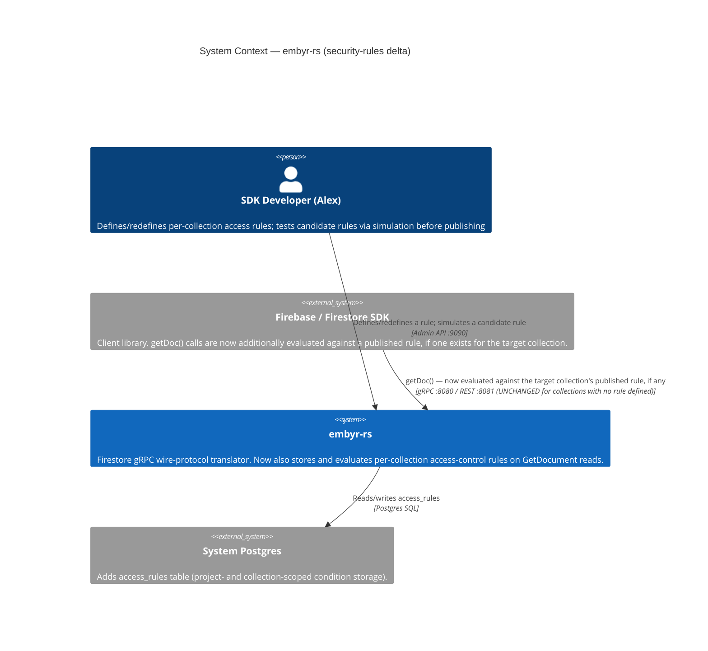

---

### Wave: DESIGN / [REF] C4 Container Diagram (Mermaid) — security-rules

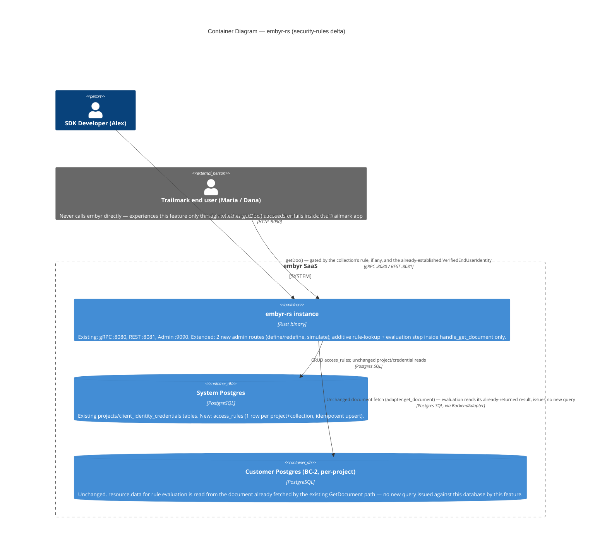

---

### Wave: DESIGN / [REF] C4 Component Diagram — BC-4 Access Control (Mermaid)

Warranted per the SKILL's "5+ components, complex subsystem" threshold: the
parser, evaluator, storage adapter, two admin handlers, and the `GetDocument`
composition point are five separable pieces whose call-graph (two call sites into
one evaluation function) is exactly the property this feature's HIGH-risk flags
depend on being visible.

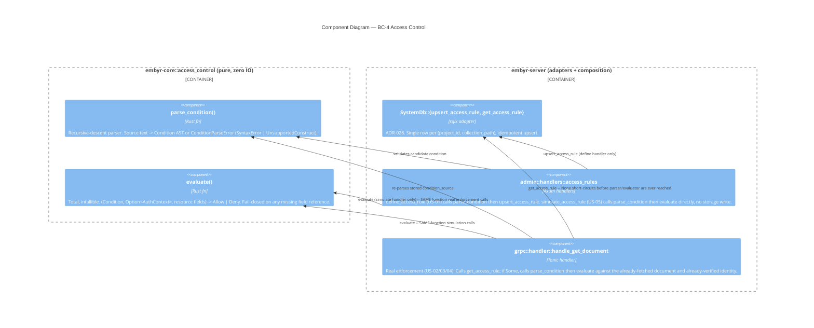

---

### Wave: DESIGN / [REF] Architecture Enforcement — security-rules

Style: Hexagonal (ports-and-adapters), unchanged project-wide pattern. BC-4 is a
new inner hexagon within the existing Cargo-workspace enforcement mechanism
(AD-01/AD-06) — no new crate, no new tooling.

Rules enforced (existing, applying unchanged to the new module):
- `embyr-core::access_control` has zero IO imports (`cargo-deny`, `deny.toml`,
  already covers all of `embyr-core`).
- `embyr-core` defines the value-type/function surface; `embyr-server` consumes
  it — dependency direction inward, matching AD-02's existing rule.
- No new adapter, no new `probe()` required (see § Driven Ports + Adapters,
  above, and ADR-029 § Enforcement for the explicit Principle 12 reasoning).

---

### Wave: DESIGN / [REF] Open Questions — security-rules

| ID | Question | Impact | Resolution owner |
|----|----------|--------|-------------------|
| OQ-SR-04 | The locked v1 grammar (Resolution 1, Option C) admits only `true`/`false` as literal operands, not arbitrary string/number literals — is a rule like `resource.data.status == "published"` intentionally out of v1 scope, or an unintended gap? | Affects DISTILL's acceptance-scenario design and DELIVER's parser scope; no story's domain examples require it, so DESIGN implements the literal locked-grammar reading and flags rather than silently widening | DISTILL (acceptance-designer), confirm scope before DELIVER locks the parser |
| OQ-SR-05 | Should the parsed `Condition` AST be cached (keyed by `(project_id, collection_path, updated_at)`) once real traffic volume is known, avoiding re-parse-per-request? | Not required for V1 correctness (grammar is tiny, parse cost believed negligible); pure performance follow-up | Platform-architect, post-launch, if profiling warrants — mirrors OQ-CA-02's precedent |
| OQ-SR-06 | A rule that never references `resource.data` (content-blind, e.g. `allow read: if true`) still resolves to `NotFound` against a non-existent document — is this in-scope existence-leakage acceptable, since AC-17-10's own UAT scenario is written against a content-referencing rule? | Does not block this feature's WS scope; affects whether DISTILL writes an acceptance scenario for this specific edge case | DISTILL (acceptance-designer) |
| OQ-SR-01 (carried from DISCUSS) | Bounded-context placement | **Resolved by this DESIGN pass** — BC-4 Access Control, see § Bounded-Context Placement above and ADR-029 | Closed |
| OQ-SR-02 (carried from DISCUSS) | Whether Epic 2b (write-path) needs `resource`/`request.resource` as two distinct grammar symbols | Out of this feature's scope; ADR-027's `Condition`/`Operand` types are read-only-shaped today and would need extension, not replacement, if Epic 2b needs old/new document state | Product Discovery / DISCUSS, triggered when Epic 2b starts |
| OQ-SR-03 (carried from DISCUSS) | Whether custom claims on `VerifiedEndUserIdentity` will ever be needed | Out of this feature's scope; `AuthContext` (ADR-027) mirrors `VerifiedEndUserIdentity`'s current shape exactly (uid only) and would need a corresponding `client-auth`/ADR-024 extension first | Product Discovery, cross-referenced with `client-auth` |

---

### Wave: DESIGN / [REF] External Integrations — security-rules

**None requiring contract tests.** This feature introduces no new outbound
network dependency: rule storage reuses the existing, already-probed `SystemDb`
Postgres connection; rule evaluation is pure in-process computation over data
already fetched by the existing `GetDocument` path. No new adapter, no new
external service, no new consumer-driven-contract surface.

---

## Application Architecture — security-rules-write-path

> Updated: 2026-08-18
> Feature: security-rules-write-path (JOB-17 — extends per-collection
> access-control rules to `CreateDocument`/`UpdateDocument`/`DeleteDocument`,
> Epic 2b of the access-control initiative; Epic 2a = `security-rules`)
> Mode: Propose (autonomous analysis, no live user for this dispatch)
> ADRs: `docs/product/architecture/adr-030-write-path-grammar-storage-and-composition.md`
> (new — combined grammar/storage/composition, per DISCUSS's smaller-decision
> -surface steer). Does not amend `adr-027`/`adr-028`/`adr-029` — all three
> remain accurate as written; this feature extends, never contradicts, them.

Full DESIGN content (Quality Attribute Priorities, Reuse Analysis, Bounded-Context
Placement, Component Decomposition, Driving/Driven Ports, Technology Choices,
Decisions Table DDD-SRW-1..9, C4 System Context/Container/Component diagrams,
Architecture Enforcement, Open Questions, External Integrations, Handoff Package)
lives in `docs/feature/security-rules-write-path/feature-delta.md` §§ Wave:
DESIGN — the single narrative file per the lean output convention. Summary below.

### Summary

**Storage shape (this feature's central decision)**: a new, fully independent
`write_access_rules` table (`migrations/0023_write_access_rules.sql`), own primary
key `(project_id, collection_path)`, own adapter methods
(`upsert_write_access_rule`/`get_write_access_rule`) — not a shared or nullable
column on the existing `access_rules` table. This makes AC-17-43 ("a collection's
read rule has zero effect on writes unless a separate write rule is explicitly
defined") structurally true: `access_rules`, `get_access_rule`,
`upsert_access_rule`, and `handle_get_document`'s existing guardrail branch
receive **zero** code changes from this feature.

**Grammar extension**: `Operand::RequestResourceField(String)` added to
`embyr-core::access_control::Operand` (ADR-027, extended). `evaluate()`'s
signature is extended (not duplicated) with a `request_resource_fields`
parameter — the same total, infallible, fail-closed function real write
enforcement and simulation both call, mirroring ADR-029's no-duplication
guarantee.

**Composition**: `handle_create_document`/`handle_update_document`/
`handle_delete_document` each gain an identity-attach call (reusing
`attach_client_identity_if_present`, unchanged) and a `get_write_access_rule`
existence check that short-circuits to the exact pre-feature code path when no
write rule is defined (AC-17-42). Update/delete additionally fetch the pre-write
document (reusing the existing `BackendAdapter::get_document`) only when a write
rule is defined, mirroring `handle_get_document`'s own fetch-then-decide pattern
and existence-non-leakage mechanism (ADR-029), now extended to writes.

**Bounded context**: no new context. BC-4 Access Control (ADR-029) is extended
with a second, independent aggregate (`WriteAccessRule`) alongside the existing
`AccessRule`.

**No new external integration, no new driven port, no new Earned Trust probe** —
all new I/O reuses already-probed substrate (`SystemDb` pool,
`BackendAdapter::get_document`).

Full alternatives-considered analysis (including the rejected shared-column
storage option and the rejected `rule_type`-discriminated admin-handler option):
`docs/product/architecture/adr-030-write-path-grammar-storage-and-composition.md`.

---

## Application Architecture — security-rules-query-path

> Updated: 2026-08-18
> Feature: security-rules-query-path (JOB-17 — closes the RunQuery bypass of
> `access_rules`, Epic 2c of the access-control initiative; Epic 2a =
> `security-rules`, Epic 2b = `security-rules-write-path`)
> Mode: Propose (autonomous analysis, no live user for this dispatch)
> ADR: `docs/product/architecture/adr-031-query-shape-compliance-check.md`
> (new — combined algorithm/composition/rejection-shape/simulation-extension
> decision, per this feature's own smaller-decision-surface reasoning,
> mirroring ADR-030's precedent). Does not amend `adr-027`/`adr-028`/
> `adr-029`/`adr-030` — all four remain accurate as written; this feature
> extends, never contradicts, them.

Full DESIGN content (Quality Attribute Priorities, Reuse Analysis,
Bounded-Context Placement, Component Decomposition, Driving/Driven Ports,
Technology Choices, Decisions Table DDD-SRQ-1..8, C4 System Context/Container
/Component diagrams, Architecture Enforcement, Open Questions, External
Integrations, Handoff Package) lives in
`docs/feature/security-rules-query-path/feature-delta.md` §§ Wave: DESIGN —
the single narrative file per the lean output convention. Summary below.

### Summary

**The central decision**: a new, pure sibling function,
`embyr_core::access_control::check_query_compliance(condition, filter, auth)
-> QueryComplianceOutcome`, statically compares a rule's parsed `Condition`
tree against a `RunQuery`'s already-translated `QueryFilter` tree and the
caller's server-verified `AuthContext` — **without fetching or inspecting any
document**. `evaluate()` itself is confirmed untouched and gains no new
caller; the two functions answer structurally different questions (document
-value truth vs. query-shape provability).

**Fail-closed by construction**: `decompose_decidable()` — the internal
helper that flattens the locked 5-shape decidable set (`Literal`,
`request.auth != null`/`== null`, `request.auth.uid ==
resource.data.<field>`, and AND-composition of those) — has a single,
explicit wildcard match arm that is the *only* path to
`QueryComplianceOutcome::RejectedUnsupportedRuleShape`. `Condition::Or`,
`Condition::Not`, any `RequestResourceField` reference, and any other
unnamed `Compare` shape all fall through to that one arm — the entire
collection is rejected outright, never partially enforced, never silently
allowed (US-05, this feature's designated mutation-testing surface).

**The caller's-own-uid binding (this feature's single most security-critical
property, AC-17-51)**: ownership-equality compliance is decided by
`filter_binds_field_to_uid`, which compares the query filter's bound VALUE
against `auth.uid` — the server-verified identity, never anything
client-asserted. A filter naming the right field but bound to someone else's
id (Dana filtering `owner_id == "maria-santos"`) does not satisfy the check;
only a filter bound to the caller's own verified uid does.

**Composition**: `handle_run_query` gains an identity-attach call (reusing
`attach_client_identity_if_present`, unchanged) and a `get_access_rule`
existence check (the SAME method `handle_get_document` already calls,
zero modification) that short-circuits to the exact pre-feature code path
when no read rule is defined (US-06). When a rule is defined,
`check_query_compliance`'s verdict gates the EXISTING
`requires_composite_index`/`is_index_ready` check and `adapter.run_query()`
call, both otherwise unmodified — **the compliance check runs strictly
BEFORE the composite-index check** (OQ-SRQ-03, resolved: minimizes
information leakage on double-failure, adds zero cost on the common
no-rule path).

**Rejection shape**: `Status::permission_denied`, mirroring
`handle_get_document`'s own precedent — not a new status code, not new
`Status` metadata machinery. Distinguishability within that status family
(missing-filter vs. auth-required vs. deny-all vs. unsupported-shape) uses a
stable `[REASON_CODE]` message-text convention, consistent with this
codebase's existing message-string-only precedent at the gRPC boundary.

**Bounded context**: no new context. BC-4 Access Control (ADR-029) is
extended with a third pure function alongside `parse_condition`/`evaluate`.

**No new storage, no new external integration, no new driven port, no new
Earned Trust probe** — this feature reads the existing `access_rules` table
only (never `write_access_rules`); `check_query_compliance` and its internal
helpers are pure CPU computation over values already resident in memory.

**Release 2 (US-07)**: a new, distinct admin handler
`simulate_query_compliance` (`POST .../access_rules/simulate_query`) — a
deliberate departure from DISCUSS's own non-binding Technical Note to extend
`simulate_access_rule` in place, because the response contract
(`{compliant, reasons}`, shape-compliance) is genuinely different from
`simulate_access_rule`'s (`{outcome}`, allow/deny). Calls the identical
`check_query_compliance()` real enforcement uses — never a second,
independently-maintained implementation.

Full alternatives-considered analysis (including the rejected
`evaluate()`-reuse framings and the rejected extend-`simulate_access_rule`
-in-place option):
`docs/product/architecture/adr-031-query-shape-compliance-check.md`.

---

## Application Architecture — security-rules-collection-group-rules

> Updated: 2026-08-25
> Feature: security-rules-collection-group-rules (JOB-17 — closes the
> collection-group (`all_descendants = true`) `RunQuery` rule-lookup gap
> `security-rules-query-path` itself left in place; extends the query-path
> operation surface, not a new epic number in the read/write/query
> numbering)
> Mode: Propose (autonomous analysis; DISCUSS's central architectural
> question — Resolution 1 — was already locked before DESIGN started)
> ADR: `docs/product/architecture/adr-032-collection-group-rule-storage-and-composition.md`
> (new — combined schema/adapter/composition/simulation decision, per this
> feature's own smaller-decision-surface reasoning, mirroring ADR-030/031's
> precedent). Does not amend `adr-027`/`adr-028`/`adr-029`/`adr-030`/
> `adr-031` — all five remain accurate as written; this feature extends,
> never contradicts, them.

Full DESIGN content (Quality Attribute Priorities, Reuse Analysis,
Bounded-Context Placement, Component Decomposition, Driving/Driven Ports,
Technology Choices, Decisions Table DDD-SRCG-1..8, C4 System Context/
Container diagrams, Architecture Enforcement, Open Questions, External
Integrations, Handoff Package) lives in
`docs/feature/security-rules-collection-group-rules/feature-delta.md` §§
Wave: DESIGN — the single narrative file per the lean output convention.
Summary below.

### Summary

**The central decision (locked by DISCUSS, implemented here)**: a
collection-group rule is a new, independently-authored, independently
-stored rule concept — a third disjoint table, `group_access_rules`
(`migrations/0024_group_access_rules.sql`), `PRIMARY KEY (project_id,
collection_id)` — never auto-applied from a same-named exact-path rule and
never execute-time-composed from per-path rules (both proven unsafe/
intractable in DISCUSS). A collection-group query against a collection id
with no group rule is rejected outright, universally, regardless of any
same-named exact-path rule's existence — matching real Firestore's own
documented behavior exactly (confirmed against Firebase's own docs during
DISCUSS's escalation resolution).

**Schema departure from ADR-028/030's own precedent, justified not
mirrored**: the new table's collection-id column is named `collection_id`
(not `collection_path`, since a group id is structurally never a path) and
carries a NEW `CHECK (collection_id NOT LIKE '%/%')` constraint — the first
time this initiative enforces its own "bare identifier, not a path"
invariant at the DB layer rather than by convention alone (`access_rules`/
`write_access_rules`' own "single-segment in v1" comment was confirmed,
during this feature's own DISCUSS, to be unenforced by any code).

**Adapter**: `GroupAccessRuleRow` + `upsert_group_access_rule`/
`get_group_access_rule`, mirroring `upsert_write_access_rule`/
`get_write_access_rule`'s exact shape.

**Composition**: `handle_run_query` gains an `if all_descendants { .. }
else { .. }` branch around its existing rule-lookup composition. The `else`
arm is the EXISTING `get_access_rule`/`access_rules` composition
(`security-rules-query-path`, ADR-031), preserved verbatim — the structural
mechanism proving `GetDocument`, writes, and non-group `RunQuery` remain
byte-for-byte unaffected. The new `if` arm reads `group_access_rules`
exclusively; a `None` row short-circuits to an outright rejection
(`GROUP_RULE_NOT_DEFINED`) BEFORE `parse_condition`/`check_query_compliance`
are ever called — the opposite default from the non-group arm's own
"no rule ⇒ unrestricted" guardrail, a deliberate, DISCUSS-locked asymmetry.
When a group rule IS found, the identical `check_query_compliance()`/
`QueryComplianceOutcome`/`UnsatisfiedConjunct`/`query_compliance_rejection()`
machinery `security-rules-query-path` built is reused completely
unchanged — zero new decidable shape, zero new evaluator branch, zero new
type anywhere in `embyr_core::access_control`. The existing
composite-index-check ordering guarantee (compliance strictly before
index-readiness, ADR-031's own OQ-SRQ-03 resolution) is confirmed, not
re-derived, to hold identically for the group arm.

**Bounded context**: no new context. BC-4 Access Control (ADR-029) is
extended with a third disjoint aggregate (`GroupAccessRule`) alongside the
existing `AccessRule`/`WriteAccessRule`; no new pure function is added.

**Admin surface**: `define_group_access_rule` (US-01, new handler, mirrors
`define_write_access_rule` plus a new bare-collection-id validation step)
and `simulate_group_query_compliance` (US-07, new sibling handler,
`POST .../access_rules/simulate_group_query`) — the latter REUSES
`simulate_query_compliance`'s response type verbatim (the response contract
is identical in shape) while introducing a genuinely new, narrower request
type (`group_condition: Option<String>`, modeling the "no group rule"
default as a first-class simulatable scenario) — an evaluated, evidence
-based departure from ADR-031's own precedent of duplicating both request
and response types, not a blind re-application of it.

**No new external integration, no new driven port, no new Earned Trust
probe** — all new I/O reuses the already-probed `SystemDb` pool; the new DB
CHECK constraint is a domain-invariant enforcement, not a substrate-lie
probe (there is no new substrate dependency to probe against).

Full alternatives-considered analysis (including the rejected
handler-optional-field overload for US-07 and the rejected
convention-only-schema option): `docs/product/architecture/adr-032-collection-group-rule-storage-and-composition.md`.

---

## Application Architecture — security-rules-realtime

> Updated: 2026-08-26
> Feature: security-rules-realtime (JOB-17 — closes Listen's (`onSnapshot()`)
> rule-enforcement gap AND a pre-existing, more severe project-wide
> cross-collection delivery leak in BC-3's own fan-out mechanism; Epic 2d of
> the access-control initiative)
> Mode: Propose (autonomous analysis; DISCUSS's two central architectural
> questions — Resolutions 1 and 2 — were already locked before DESIGN
> started; two genuine judgment calls, Handoff Package flags 3 and 7, were
> confirmed in-scope / resolved respectively by this DESIGN pass)
> ADR: `docs/product/architecture/adr-033-listen-compliance-composition-and-collection-scoping.md`
> (new — combined collection-scoping/composition/delete-non-leakage/admin
> -surface decision, mirroring ADR-030/031/032's own smaller-decision
> -surface precedent). Does not amend `adr-027` through `adr-032` — all six
> remain accurate as written; this feature extends, never contradicts, them.

Full DESIGN content (Quality Attribute Priorities, Reuse Analysis,
Bounded-Context Placement, Component Decomposition, Driving/Driven Ports,
Technology Choices, Decisions Table DDD-SRRT-1..11, C4 System Context/
Container/Component diagrams, Architecture Enforcement, Open Questions,
External Integrations, Handoff Package) lives in
`docs/feature/security-rules-realtime/feature-delta.md` §§ Wave: DESIGN —
the single narrative file per the lean output convention. Summary below.

### Summary

**The central decision (locked by DISCUSS, implemented here)**: a composed
mechanism, not a single reused function — `check_query_compliance()`
(ADR-031, UNCHANGED) gates the initial snapshot at subscribe time;
`evaluate()` (ADR-027/030, UNCHANGED) re-checks every individually-delivered
document-change event; plus a genuinely new, BC-3-internal collection
-scoping filter with no analog in any prior epic. `embyr_core::
access_control` gains ZERO new code — the first feature in this initiative
where BC-4 Access Control grows by nothing at all.

**Collection-scoping mechanism (Finding 5's fix, this feature's single
highest-consequence risk)**: a delivery-time filter inside
`handle_add_target`'s own event-consumption loop (the consuming side) — NOT
a `ListenRegistry`/`PostgresNotifyListener` per-collection-channel redesign.
Applies unconditionally, before any rule-dependent branch, to both
`DocumentChange` and `DocumentDelete` delivery — a structural, rule
-independent guarantee. `ListenRegistry::fan_out()` and `SubscriberEntry`
receive zero code change.

**Subscribe-time + per-event composition**: `handle_listen` gains one new
call (`attach_client_identity_if_present`, mirrors `RunQuery`'s own
placement) and threads `Arc::clone(&self.system_db)` into the spawned
`handle_add_target` task. `handle_add_target` extracts the FULL
`StructuredQuery` (fixing Finding 2 — the initial snapshot now honors the
caller's own filter, reusing `translate_filter()` unchanged) and gains a
subscribe-time compliance gate mirroring `handle_run_query`'s own non-group
arm exactly. The parsed `Condition` and built `AuthContext` are retained for
the ENTIRE lifetime of the subscription's loop — reused unmodified for every
subsequent per-event `evaluate()` call, so the per-event recheck (US-04)
costs zero additional Postgres queries beyond what `PostgresNotifyListener::
fetch_event()` already performs for every NOTIFY (Finding 6).

**Delete-event non-leakage (US-05, a genuine judgment call this DESIGN
resolved)**: `fetch_event()`'s EXISTING single SQL query is widened (drops
`AND NOT deleted`, adds the `deleted` column to the SELECT list) rather than
adding a second query or a per-subscriber re-fetch — the same round-trip
count as today, now also surfacing the pre-deletion field snapshot
`evaluate()` needs for content-referencing rules. `ListenEvent::Removed`
gains a `fields` payload, never serialized into the wire-level
`DocumentDelete` proto — internal decision input only.

**Admin surface (US-08, an evaluated departure from ADR-032's own
precedent, in the opposite direction)**: `simulate_query_compliance`
(`security-rules-query-path`) is reused COMPLETELY UNCHANGED — zero new
route, zero new handler, zero new type — because Listen's subscribe-time
gate's request-contract shape is IDENTICAL to `RunQuery`'s non-group arm,
unlike the collection-group case's genuinely different `group_condition:
Option<String>` contract that justified a new sibling handler there.

**Bounded context**: no new context. BC-3 Real-Time Delivery gains its
first-ever internal correctness mechanism in this initiative (the
collection-scoping filter and the widened `fetch_event()` predicate); BC-4
gains two new call sites and zero new code.

**No new table, no new migration, no new admin route, no new external
integration, no new driven port, no new Earned Trust probe** — the smallest
CREATE-NEW footprint of any of the five epics in this initiative, despite
the largest user-story footprint (8 stories). All new I/O reuses
already-probed substrate (`SystemDb` pool, customer-Postgres pool via
`PostgresNotifyListener`).

Full alternatives-considered analysis (including the rejected per
-collection-channel redesign and the rejected per-subscriber delete-fetch
option): `docs/product/architecture/adr-033-listen-compliance-composition-and-collection-scoping.md`.

---

## Application Architecture — custom-claims

> Updated: 2026-08-27
> Feature: custom-claims (JOB-17, 6th realization — closes `security-rules`'
> own Out-of-Scope deferral: rules can now reference `request.auth.token.<claim>`,
> not just bare `uid`; genuinely cross-bounded-context, spanning BC-1 Tenant
> Management's token contract AND BC-4 Access Control's grammar)
> Mode: Propose (autonomous analysis; DISCUSS's own central architectural
> question — Resolution 1, claims are mint-time-embedded — was already locked
> HIGH-confidence before DESIGN started; the one genuine judgment call,
> Handoff Package flag 2 (US-06 string-literal scope), arrived confirmed
> in-scope, not re-opened by this DESIGN pass)
> ADR: `docs/product/architecture/adr-034-custom-claims-representation-and-grammar-extension.md`
> (new — combined claims-representation/grammar-extension/query-path-safety/
> write-path-falsifiability/simulation-extension decision, mirroring
> ADR-030/031's own smaller-decision-surface precedent). Amends
> `adr-024` (claims representation) and `adr-027`/`adr-029` (grammar/
> composition) via appended `§ Changed Assumptions` sections — the first
> feature in this initiative to amend an ADR outside the `security-rules*`
> series. Does not amend `adr-025`/`adr-026`/`adr-028`/`adr-030`/`adr-031`/
> `adr-032`/`adr-033` — all seven remain accurate as written.

Full DESIGN content (Quality Attribute Priorities, Reuse Analysis,
Bounded-Context Placement, Component Decomposition, Driving/Driven Ports,
Technology Choices, Decisions Table DDD-CC-1..12, C4 System Context/Container
diagrams, Architecture Enforcement, Open Questions, External Integrations,
Handoff Package) lives in `docs/feature/custom-claims/feature-delta.md` §§
Wave: DESIGN — the single narrative file per the lean output convention.
Summary below.

### Summary

**The central decision (locked by DISCUSS, implemented here)**: claims are
mint-time-embedded in the SAME signed JWT payload `client-auth` already
verifies — zero new admin API, zero new System DB table, zero new I/O.
`ClientIdentityClaims` gains `#[serde(flatten)] extra: BTreeMap<String,
serde_json::Value>`; `VerifiedEndUserIdentity` gains `claims: BTreeMap<String,
FieldValue>`, translated via a new `FieldValue::from_json_value` (promoted
from a private helper in `embyr-server`'s admin handlers — the first
cross-crate reuse of that translation, eliminating a would-be duplicate).

**Grammar extension (mirrors `RequestResourceField`'s own ADR-030 precedent
exactly)**: `Operand::AuthTokenClaim(String)`, parsed via a new
`"request.auth.token."`-prefix branch, zero tokenizer change required.
`AuthContext` gains `claims: BTreeMap<String, FieldValue>`. `resolve_field_value`
gains one new arm; `compare_operands` gains ZERO — claim comparisons fall
through to the existing generic `FieldValue::PartialEq` arm, confirmed
structurally.

**A DESIGN-discovered finding, not silently folded in**: direct code
verification found `word_to_operand()` had no `"true"`/`"false"` arm —
`Operand::BoolLiteral` was NOT reachable from comparisons, despite ADR-027's
own text claiming otherwise. Without a fix, US-02's own literal
walking-skeleton domain example (`request.auth.token.is_moderator == true`)
could not parse. Fixed with 2 new arms, verified zero-regression (additive
only — every previously-parseable input is unaffected).

**Query-path safety (US-05) and write-path falsifiability (US-03), both
verified structurally, not assumed**: `check_query_compliance()`/
`decompose_decidable()` receive ZERO code changes — the existing wildcard
`_ => Err(Undecidable)` catch-all rejects any `Compare` involving the 2 new
`Operand` variants by Rust's own exhaustive-match guarantee, including inside
an `And`. `evaluate()`'s shared dispatch across all call sites (GetDocument,
all 3 write operations, Listen per-event, simulation) confirms write-path
claim support requires zero production code beyond US-02's own change —
Resolution 4's central hypothesis holds in practice, not just in theory.

**Release 2 (US-06/US-07)**: `Operand::StringLiteral(String)` requires a
genuinely new `tokenize()` quote-handling branch PLUS a required companion fix
— `detect_unsupported_construct` must become quote-aware, or a legitimate
string-literal value containing `**`/`{`/a call-shaped substring would be
misclassified as `UnsupportedConstruct`. US-07 extends `simulate_access_rule`'s
existing `SimulatedAuth` with a `claims` field — not a new sibling handler,
since (unlike `simulate_group_query_compliance`'s own precedent) the request
contract is not genuinely different.

**Bounded context**: no new context. BC-1 (`client_identity`) and BC-4
(`access_control`) both extended — the first feature in this initiative to
touch two contexts' own core types in the same change. BC-4's read-only,
indirect dependency on BC-1 is unchanged in shape.

**No new table, no new migration, no new admin route, no new external
integration, no new driven port, no new Earned Trust probe.** One new
build-time consideration: `serde_json` promoted to a direct (non-dev)
dependency of `embyr-core`, confirmed non-IO against `deny.toml`'s ban list —
the smallest CREATE-NEW footprint of any epic in this initiative (9 Reuse
Analysis rows, 8 EXTEND, 0 CREATE NEW).

Full alternatives-considered analysis (including the rejected explicit-typed
-struct and raw-`Value` claims representations, and the rejected new-sibling
-handler for US-07): `docs/product/architecture/adr-034-custom-claims-representation-and-grammar-extension.md`.

---

## Application Architecture — security-rules-operations

> Updated: 2026-08-27
> Feature: security-rules-operations (JOB-17, 7th realization — Epic 2e, the
> last named epic in the 6-epic Authorization initiative; gives Alex a
> complete, attributable, restorable history of every rule he's ever
> defined, closing the "no history/versioning" gap ADR-028/030/032 each
> independently deferred to this epic by name)
> Mode: Propose (autonomous analysis; DISCUSS's 3 central architectural
> questions — Resolutions 2, 3, and the append-only invariant — were already
> locked before DESIGN started; Resolution 1's own 3-table recommendation
> was independently re-verified, not rubber-stamped, by this DESIGN pass)
> ADR: `docs/product/architecture/adr-035-access-rule-history-storage-and-capture-mechanism.md`
> (new — combined schema-shape/ordering-mechanism/capture-placement/actor
> -attribution/admin-surface/generalization decision, mirroring
> ADR-030/032/034's own smaller-decision-surface precedent). Amends
> `adr-028`, `adr-030`, and `adr-032` via appended § Changed Assumptions
> pointers — each closes the "deferred to Epic 2e" item its own text named
> explicitly. Does not amend `adr-024`/`adr-025`/`adr-026`/`adr-027`/
> `adr-029`/`adr-031`/`adr-033`/`adr-034` — all eight remain accurate as
> written.

Full DESIGN content (Quality Attribute Priorities, Reuse Analysis,
Bounded-Context Placement, Component Decomposition, Driving/Driven Ports,
Technology Choices, Decisions Table DDD-SRO-1..9, C4 System Context/
Container diagrams, Architecture Enforcement, Open Questions, External
Integrations, Handoff Package) lives in
`docs/feature/security-rules-operations/feature-delta.md` §§ Wave: DESIGN —
the single narrative file per the lean output convention. Summary below.

### Summary

**The central decision (DISCUSS's own recommendation, independently
re-verified here, not rubber-stamped)**: 3 independently-stored,
schema-identical history tables — `access_rule_history`,
`write_access_rule_history`, `group_access_rule_history` — never a single
shared table with a `rule_type` discriminator. Re-derivation, not
inheritance: `access_rules`/`write_access_rules` key on `collection_path`
while `group_access_rules` keys on `collection_id` with its own `CHECK`
constraint (ADR-032) — a discriminated single table would have to weaken or
conditionally branch that `CHECK`, reintroducing the exact `rule_type`
-branching risk ADR-030 DDD-SRW-6 already rejected once, one layer down.

**Schema**: each history table carries `condition_source`,
`actor_account_id` (no FK — mirrors `query_logs.account_id`'s own
precedent, migration 0014), `captured_at`, and an `id BIGINT GENERATED
ALWAYS AS IDENTITY PRIMARY KEY` — the AUTHORITATIVE "newest first" ordering
key, not `captured_at`. This is a deliberate departure from `query_logs`'
own timestamp-range-only ordering (this codebase's only prior append-only,
actor-attributed log table, and the only one investigated as precedent):
`query_logs` carries no per-row strict-ordering correctness requirement,
while this feature's own AC-17-158 explicitly requires correctly-ordered
retrieval of rapid successive redefinitions — a bar a monotonic sequence
meets structurally and timestamp precision alone meets only probabilistically.

**Capture mechanism — the single most load-bearing decision**: history
capture is fused into the SAME adapter method as each rule table's existing
`upsert_*` call, executed inside one DB transaction, with the method
signature extended to require the acting `actor_account_id: Uuid`. This is
a deliberate, evidenced departure from DISCUSS's own (non-binding) Technical
Notes phrasing of "two separate calls" — chosen because it is the only
option making history loss structurally, not conventionally, impossible:
the compiler enforces the new parameter at every call site, and the
transaction guarantees the rule change and its history entry succeed or
fail together. The existing upsert SQL statement TEXT (`INSERT ... ON
CONFLICT ... DO UPDATE`) remains byte-for-byte unchanged, satisfying
DISCUSS's own "never a rewrite of the existing statement" constraint.

**Admin surface**: 3 new `GET .../history` routes (any authenticated role,
mirrors `simulate_*`'s existing any-role precedent — Handoff Package flag 6,
locked). Restore (US-03) needs zero new endpoint and zero new mechanism,
confirmed by design: Alex retrieves history, reads a prior entry's
`condition` field, and calls the SAME existing `define_*` endpoint with that
text — the restoration is captured as a new history entry automatically via
the fused mechanism above, with no special-casing for a no-op restore
(AC-17-166). A dedicated restore-by-id convenience endpoint is deliberately
NOT built in v1 (Principle 8) — each history entry's `id` is exposed in the
retrieval response specifically to keep that endpoint a pure additive future
change if real usage ever shows the 2-step flow is friction.

**Generalization (US-04/US-05)**: confirmed, not merely assumed, that no
table-specific complication exists beyond mirroring each parent table's own
existing schema idiosyncrasy (`group_access_rules`' `collection_id`+`CHECK`)
into its history table — the identical pattern applied a second and third
time.

**Bounded context**: no new context. BC-4 Access Control (ADR-029) is
extended with 3 new append-only CHILD tables of its existing `AccessRule`/
`WriteAccessRule`/`GroupAccessRule` aggregates — not a new aggregate.
`embyr-core` requires ZERO changes (Resolution 3, locked — no touch to
`Operand`/`Condition`/the tokenizer/evaluation logic anywhere in this
feature), the first feature since `security-rules-collection-group-rules`
to leave `embyr_core::access_control` completely untouched.

**No new external integration, no new driven port, no new Earned Trust
probe** — all new I/O (the transactional capture, the 3 new retrieval
queries) reuses the already-probed `SystemDb` pool. 3 new migrations
(`0025`-`0027`), 0 new admin route role-gate complexity (all reuse the
existing any-role pattern), 0 new workspace dependency.

Full alternatives-considered analysis (including the rejected shared
-table-with-discriminator option, the rejected two-separate-calls capture
placement, and the rejected FK-to-`accounts` actor-attribution option):
`docs/product/architecture/adr-035-access-rule-history-storage-and-capture-mechanism.md`.

---

## Application Architecture — client-auth-hosted-identity

> Updated: 2026-08-27
> Feature: client-auth-hosted-identity (JOB-18 — strategic scope reversal of
> `client-auth`'s own locked-but-flagged-reversible exclusion; embyr-hosted
> email/password signup, signin, and password reset for end users whose
> app has no backend of its own to mint a custom token from)
> Mode: Propose (autonomous analysis per Decision 1)
> ADR: `docs/product/architecture/adr-036-hosted-identity-bounded-context-and-storage.md`
> (new — combined bounded-context-placement/storage-split/composition
> decision, mirroring ADR-025/026/029/035's own bundled-decision precedent).
> Amends `adr-002-bounded-contexts.md` (§ Changed Assumptions, appended) and
> `adr-026-client-identity-composition-with-api-key-auth.md` (step 4
> verification-time credential routing, additive). Does not amend
> `adr-024`/`adr-025`/`adr-011` — all three remain accurate as written and
> are reused unchanged.

Full DESIGN content (Reuse Analysis, Bounded-Context Placement, Component
Decomposition, Driving/Driven Ports, Technology Choices, Decisions Table
DDD-CHI-1..10, C4 System Context/Container/Component diagrams, Architecture
Enforcement, Open Questions, External Integrations) lives in
`docs/feature/client-auth-hosted-identity/feature-delta.md` §§ Wave: DESIGN —
the single narrative file per the lean output convention. Summary below.

### Summary

**Bounded context**: a fifth bounded context, **BC-5 Hosted Identity**, is
added — the hosted-identity `Account` passes ADR-002's own Option-D
three-part test (identity, lifecycle, invariants) the same way BC-4 Access
Control did; folding it into BC-1 or BC-2 would repeat the exact reasoning
gap ADR-002's `Changed Assumptions` already corrected once. BC-5 is the
first bounded context in this codebase with a storage boundary genuinely
split across both databases.

**Storage split (the central decision)**: `hosted_identity_accounts` and
`hosted_identity_reset_tokens` live in **Customer DB** (Resolution 2, locked
— PII isolation, project scope), reusing BC-2's own `PostgresBackendAdapter`
+ `migrations/customer/` mechanism unchanged (ADR-022 already single-sourced
it — zero new migration mechanism). The embyr-owned Ed25519 signing key
(structurally disjoint from `client_identity_credentials`, Resolution 3,
locked) lives in **System DB** instead — a deliberate split, not an
oversight: it is embyr's own control-plane secret, and a `direct_pg`
customer's own DBA administers their Customer DB directly, so putting
embyr's private signing key there would hand that DBA a silent,
audit-trail-free identity-forgery capability Resolution 2 never accepted.
The private key is ECIES-encrypted at rest with the identical
key-derived-from-`api_key` pattern `ecies_encrypted_dsn` already uses — zero
new cryptographic primitive.

**Composition**: `verify_client_identity_token()` (ADR-024) has ZERO code
changes (Resolution 3, locked). ADR-026 step 4 is widened, additively, to
try `client_identity_credentials` first (100% unchanged code path for
`client-auth`-only projects) and `hosted_identity_signing_keys` second —
the identical "try current, then previous" pattern ADR-025 already
established, one level up. `backend_mode=agent` is refused twice,
independently: once at US-01's enablement action (structural 403, not a
warning), and again at every signup/signin/reset call, because the new
Customer-DB-adapter resolver (`resolve_customer_db_adapter`, new, composes
only pre-existing primitives — Argon2id, ECIES, `PostgresBackendAdapter`,
`CredentialCache`) never constructs an agent adapter at all — a type-level
guarantee, not a runtime check.

**Driving port**: REST `:8081`, no new listener. Unlike
`signInWithCustomToken()`'s credential-only shape, hosted identity's 4 new
endpoints (`accounts:signUp`, `accounts:signInWithPassword`,
`accounts:sendOobCode`, `accounts:resetPassword`) require the project's
`api_key` as a `?key=` query parameter — a genuine, evidenced difference
(Customer DB access requires it), which also happens to mirror real
Firebase's own Identity Toolkit REST surface.

**Reuse**: Argon2id parameters reused via 2 new thin named wrapper functions
sharing the existing `argon2_instance()` constant (not
`hash_api_key(password.as_bytes())` directly — rejected as misleading at the
call site). `IEmailSender` (ADR-011) reused completely unchanged for
password-reset "send" — `NoopEmailSender` V1, honest V1 delivery gap
unchanged. Oracle protection (sign-in, reset-request) follows
`invalid_credentials()`'s discipline (one shared response constructor per
rejection class) as a pattern, not shared code (different response shape,
different module).

Full alternatives-considered analysis, exact schemas, and the full C4
diagram set: `docs/product/architecture/adr-036-hosted-identity-bounded-context-and-storage.md`
and `docs/feature/client-auth-hosted-identity/feature-delta.md` §§ Wave:
DESIGN.

## Application Architecture — oauth-providers

> Updated: 2026-08-30
> Feature: oauth-providers (JOB-19 — Google sign-in via ID-token verification,
> the third Identity-track mechanism, joining `client-auth`'s customer-minted
> custom tokens and `client-auth-hosted-identity`'s hosted email/password)
> Mode: Propose (autonomous analysis per Decision 1)
> ADR: `docs/product/architecture/adr-037-oauth-providers-signing-key-and-verification-composition.md`
> (new — bundles bounded-context confirmation, signing-key custody,
> verification mechanism, and a third widening of verification-time
> credential routing, mirroring ADR-036's own bundled-decision precedent).
> Amends `adr-002-bounded-contexts.md` (§ Changed Assumptions, appended — a
> confirming note, not a new bounded context). Does not amend
> `adr-024`/`adr-025`/`adr-026`/`adr-036` — all remain accurate as written
> and are reused unchanged (`verify_client_identity_token`,
> `mint_client_identity_token`, `EMBYR_ENCRYPTION_KEY`/`decrypt_with_rotation`
> all have ZERO code changes).

Full DESIGN content (Reuse Analysis, Bounded-Context Placement, Component
Decomposition, Driving/Driven Ports, Technology Choices, Decisions Table
DDD-OAP-1..8, C4 System Context extension, Architecture Enforcement, Open
Questions, External Integrations) lives in
`docs/feature/oauth-providers/feature-delta.md` §§ Wave: DESIGN — the single
narrative file per the lean output convention. Summary below.

### Summary

**Bounded context**: applying ADR-002's Option-D three-part test to the one
candidate entity this feature introduces (`OAuthProviderCredential`)
confirms DISCUSS's own Resolution 5 — **extends BC-1 Tenant Management, no
new BC-6**. The identical shape `client_identity_credentials` already has
(project-scoped, System-DB-resident, no-confidentiality-property auth
material). The third application of Option D in this codebase's history, and
the first to NOT produce a new context — direct evidence the test is applied
per-case, not by pattern-matching the two most recent precedents (BC-4, BC-5).

**Central finding (corrects a DISCUSS-level assumption)**: Slice 01's own
brief assumed "embyr generates nothing here" — tracing
`mint_client_identity_token`'s exact signature shows this cannot hold;
minting always needs an embyr-owned Ed25519 seed. A NEW, disjoint
`oauth_signing_keys` table is generated at Slice 01 registration time —
**not** a reuse of `hosted_identity_signing_keys` (would silently couple
Google sign-in to hosted identity being separately enabled — contradicts
"coexists with, does not replace") and **not** encrypted via ECIES/`api_key`
like `hosted_identity_signing_keys` (Slice 02 has no Customer DB dependency
to justify it). Instead it reuses the already-workspace-resident
AES-256-GCM-under-`EMBYR_ENCRYPTION_KEY` pattern (`decrypt_with_rotation` +
2 existing inline-encrypt call sites, ADR-018) — a genuinely better-fitting
credential-custody shape for an embyr-owned secret that needs no
per-project `api_key` scoping. Positive consequence: Slice 01 needs no
`api_key` field at all, avoiding the exact "gap found and closed" class of
defect `client-auth-hosted-identity`'s own DESIGN had to patch reactively
(ADR-036 Decision 5).

**Composition**: `verify_client_identity_token()` and
`mint_client_identity_token()` (ADR-024/ADR-036) have ZERO code changes.
`attach_client_identity_if_present` (`grpc/handler.rs`) is widened a THIRD
time — `client_identity_credentials` → `hosted_identity_signing_keys` →
`oauth_signing_keys` — the identical "try source A, then B, then C" pattern
ADR-036 Decision 4 already normalized one level up from ADR-025's own
current/previous-key retry, required for a Google-signed-in end user's
subsequent Firestore calls to carry her identity (AC-19-05/AC-19-10).

**Driving ports**: Slice 01 — admin `:9090`, `POST
.../oauth_providers/google` (provider in the URL path, not a body field,
structurally foreclosing silent GitHub expansion; no `api_key` needed).
Slice 02 — REST `:8081`, `POST .../accounts:signInWithIdp`, no `?key=`
query parameter at all — the simplest, most stateless of the three
Identity-track sign-in shapes, since this feature has no Customer DB
dependency.

**New pure module**: `embyr_core::oauth_identity` (Google ID-token
verification — RS256/JWKS, structurally distinct from `client_identity`'s
EdDSA/single-key scheme; reuses `oidc_callback`'s own RS256/JWKS primitives
as a pattern, not as shared code, mirroring DISCUSS's own confirmed finding
that only the primitives, not the flow, are reusable).

**Reuse**: 13 EXTEND vs. 5 CREATE NEW in the Reuse Analysis table — zero new
crate dependencies (`jsonwebtoken`, `reqwest`, `aes-gcm`, `ed25519-dalek` all
already workspace-resident).

**External integration**: Google's JWKS endpoint is flagged for contract
testing (Pact or a scheduled schema-shape smoke test) — the sole
cryptographic trust anchor for this feature's entire security property.

Full alternatives-considered analysis, exact schemas, and the C4 System
Context extension: `docs/product/architecture/adr-037-oauth-providers-signing-key-and-verification-composition.md`
and `docs/feature/oauth-providers/feature-delta.md` §§ Wave: DESIGN.

## Application Architecture — aggregation-queries

> Updated: 2026-08-30
> Feature: aggregation-queries (JOB-01 — `RunAggregationQuery`, closing the
> single most consequential remaining client-facing proto gap for real
> Firestore SDK compatibility: COUNT/SUM/AVG without transferring documents)
> Mode: Propose (autonomous analysis per Decision 1)
> ADRs: `adr-038-aggregation-query-wire-contract.md` (RPC/message shapes,
> locks OQ-AGG-01's server-streaming shape at the message-field level),
> `adr-039-aggregation-compliance-and-filter-integrity.md`
> (`check_query_compliance()` reuse + a HIGH-severity pre-existing finding),
> `adr-040-aggregation-sql-pushdown-and-field-path-validation.md` (COUNT/SUM/AVG
> SQL push-down + first real enforcement of SPEC.md's own field-path
> Invariant 6), `adr-041-agent-mode-aggregation-scope.md` (Resolution 3
> confirmation + a correction to Slice 01's own `CoreError` assumption).
> Does not amend `adr-002-bounded-contexts.md` — BC-2's own ubiquitous
> language already named `AggregationQuery`/`RunAggregationQuery` (line 71,
> 73) before this feature existed; DESIGN confirms, not revises, that
> placement. Does not amend `adr-031`/`adr-032` — both reused with zero code
> changes.

Full DESIGN content (Reuse Analysis, Component Decomposition, Driving/Driven
Ports, Technology Choices, Decisions Table DDD-AGG-1..N, C4 System
Context/Container/Component diagrams, Open Questions, escalated findings)
lives in `docs/feature/aggregation-queries/feature-delta.md` §§ Wave: DESIGN
— the single narrative file per the lean output convention. Summary below.

### Summary

**Bounded context**: confirms BC-2 Document Storage, no new context — the
one candidate placement question DISCUSS itself already closed with direct
textual evidence from ADR-002.

**Two severity-flagged findings, surfaced only by this DESIGN's own required
reading of already-shipped adapter code, neither anticipated by DISCUSS**:
(1) `AgentBackendAdapter::run_query` (client-facing, `backend_mode=agent`'s
existing `RunQuery` proxy) hardcodes `filter: None` when calling the agent —
the caller's own compliance-admitted filter is never actually applied to the
executed query, meaning any `backend_mode=agent` deployment's `RunQuery`
today returns EVERY document in a collection to any caller admitted under an
ownership-equality rule, not just their own — a genuine, already-in-production
cross-user data exposure, unrelated to this feature's own scope but directly
informing its own design (ADR-039). (2) Field-path validation
(`^[a-zA-Z_][a-zA-Z0-9_.]*$`, documented as SPEC.md's own Invariant 6) is not
actually enforced ANYWHERE in `embyr-server`/`embyr-pg-storage` today, despite
this feature's own DISCUSS slices assuming it is reusable — a latent
SQL-injection-shaped gap in the already-shipped `RunQuery` path (ADR-040).
Both are named, HIGH-severity, NOT fixed by this feature (out of slice
scope), and flagged first in this DESIGN's own Handoff for orchestrator
triage as independent follow-ups.

**Wire contract**: locks OQ-AGG-01's server-streaming shape at the message
level — `StructuredAggregationQuery`/`Aggregation` (oneof count/sum/avg +
alias)/`RunAggregationQueryRequest`/`RunAggregationQueryResponse` — cross-checked
against SPEC.md's own pre-existing `§RunAggregationQuery` documentation (no
divergence found) and against this architect's own knowledge of real
Firestore's public proto (field-number verification flagged as a residual,
non-blocking DELIVER-time check — no network access from this sandbox).

**SQL push-down**: COUNT/SUM/AVG reuse `append_filter` and the
collection-group WHERE-clause branch from `run_query` unchanged (Slice 01's
own Learning Hypothesis confirmed); SUM/AVG exploit the existing type-tagged
JSON field encoding (`{"t":"I"|"D"|...,"v":...}`) for crash-free,
type-correct numeric exclusion, and Postgres's own native `AVG()` aggregate
supplies AC-01-19's null-vs-zero distinction structurally, not by convention.

**Agent-mode scope**: confirms DISCUSS's Resolution 3 (Option B — proxy
`embyr-agent`'s existing COUNT RPC unchanged; SUM/AVG-for-agent deferred) and
corrects one of its own implementation assumptions — no new `CoreError`
variant is introduced (would have forced a compile-fix edit inside the
`embyr-agent` binary via its own exhaustive `core_error_to_status` match,
contradicting Resolution 3's own "zero agent-binary changes"); a
handler-local error-mapping function achieves the same client-facing
`Unimplemented` contract instead.

**Reuse**: 9 EXTEND, 2 CREATE NEW (both narrowly-scoped pure functions:
`validate_field_path`, `domain_filter_to_agent_filter`) in the Reuse
Analysis table — zero new crate dependencies.

**External integrations**: none new — Postgres and the agent's mTLS gRPC
channel are both pre-existing, already-`probe()`-covered dependencies; this
feature adds a new PORT METHOD on each, not a new external dependency, so no
new probe and no new contract-testing recommendation are required (Earned
Trust principle applied: confirmed, not assumed, by reading the existing
`BackendAdapter::probe()` contract both adapters already implement).

Full alternatives-considered analysis, exact SQL, exact proto text, and the
C4 diagrams: the four ADRs above and
`docs/feature/aggregation-queries/feature-delta.md` §§ Wave: DESIGN.

## Application Architecture — batch-get-documents

> Updated: 2026-08-30
> Feature: batch-get-documents (JOB-01 — completes the already-declared
> `BatchGetDocuments` handler, the second, smaller, more contained
> client-facing proto gap alongside `aggregation-queries`)
> Mode: Propose (autonomous analysis per Decision 1)
> ADR: `adr-042-batch-get-documents-per-document-denial-semantics.md`
> (Resolution 5 — overturns DISCUSS's own draft whole-batch-abort choice in
> favor of per-document denial, `Deny` -> `missing`). Does not amend
> `adr-002-bounded-contexts.md` — BC-2's own ubiquitous language already
> named `BatchGetRequest` (line 73) before this feature existed. Does not
> amend `adr-027`/`adr-029` (`access_control::evaluate()` reused byte-for-byte
> unchanged).

Full DESIGN content (DDD-BGD-1..13, Component Decomposition, Reuse Analysis,
Driving/Driven Ports, C4 System Context/Container/Component diagrams, Open
Questions, Peer Review Record) lives in
`docs/feature/batch-get-documents/feature-delta.md` §§ Wave: DESIGN — the
single narrative file per the lean output convention. Summary below.

## Application Architecture — anonymous-sessions

> Updated: 2026-08-30
> Feature: anonymous-sessions (JOB-20 — a fourth, zero-prior-credential
> identity-establishment mechanism, `signInAnonymously()`-equivalent,
> joining `client-auth`'s custom tokens, `client-auth-hosted-identity`'s
> hosted email/password, and `oauth-providers`' Google sign-in)
> Mode: Guide/Propose per Decision 1 (session-level, full-rigor DESIGN,
> single-file SSOT convention — no DISTILL/DELIVER roadmap machinery)
> ADRs: `adr-043-anonymous-sessions-signing-key-custody-and-driving-port.md`
> (main — bundles bounded-context confirmation, signing-key custody,
> stateless minting, driving-port composition, a fourth widening of
> verification-time credential routing, and a REST-rate-limiting-gap
> finding), `adr-044-anonymous-sessions-no-backend-mode-gating.md`
> (Escalation 2 — no `backend_mode=agent` gating, amends `adr-036` Decision
> 5's scope language), `adr-045-anonymous-sessions-token-ttl-reuse-no-refresh.md`
> (Escalation 1 — reuse `TOKEN_TTL_SECS` unchanged, no refresh mechanism
> built in this feature). Amends `adr-036-hosted-identity-bounded-context-and-storage.md`
> (§ Decision 5, scoping clarification appended, not rewritten). Does not
> amend `adr-002`/`adr-024`/`adr-025`/`adr-026`/`adr-037` — all reused
> unchanged (`verify_client_identity_token`, `mint_client_identity_token`,
> `EMBYR_ENCRYPTION_KEY`/`decrypt_with_rotation` all have ZERO code changes).

Full DESIGN content (Reuse Analysis, Bounded-Context Placement, Component
Decomposition, Driving/Driven Ports, Technology Choices, Decisions Table
DDD-AS-1..11, C4 System Context/Container diagrams, Slice-by-Slice Design
Notes, Open Questions) lives in
`docs/feature/anonymous-sessions/feature-delta.md` §§ Wave: DESIGN — the
single narrative file per the lean output convention. Summary below.

### Summary

**Bounded context**: applying ADR-002's Option-D three-part test a fourth
time to the one candidate entity this feature introduces
(`anonymous_signing_keys`' row) confirms **extends BC-1 Tenant Management,
no new context** — thinner even than `oauth_signing_keys`' own already-thin
BC-1 extension (no redefinable content field at all).

**Two escalations, resolved with fresh reasoning, not by inertia from
`client-auth-hosted-identity`'s precedent**:
1. **Refresh-token/TTL** — reuse `TOKEN_TTL_SECS` (3600s) unchanged; no
   refresh mechanism built here. A longer anonymous-specific TTL was
   considered and rejected (only shrinks the gap's frequency, AC-20-10
   remains accepted regardless; breaks the codebase's one-constant-for-all
   convention for no closing benefit). A genuine refresh mechanism is named
   explicitly as a cross-cutting follow-up spanning all four identity
   mechanisms, not this feature's own job (ADR-045).
2. **`backend_mode=agent` gating** — NO gate, any call site. Ground-truth
   code read of `oauth_providers.rs`/`sign_in_with_idp.rs` (not the ADR-037
   prose alone) confirms oauth-providers already shipped with zero
   `backend_mode` checks. The generalized rule: the gate exists specifically
   to protect `resolve_customer_db_adapter`'s own structural incapability
   for `backend_mode=agent` projects — a precondition that only applies to
   features whose runtime path resolves a Customer DB adapter. Neither
   oauth-providers nor anonymous-sessions ever calls that function, so
   neither needs the gate. Recorded as a scoping amendment to ADR-036
   Decision 5, not a rewrite (ADR-044).

**One correction to DISCUSS's own assumption, found by ground-truth code
reading**: DISCUSS's § System Constraints claimed anonymous sign-in abuse is
"bounded today only by [the] existing generic per-project request-rate
limiting" — `grep` across `crates/embyr-server/src/rest/` for
`RateLimiter`/`rate_limit` returns zero matches; that limiter is gRPC-only.
No REST `accounts:<verb>` endpoint, including this feature's own, is rate
limited today — a pre-existing, cross-cutting gap this feature inherits and
materially sharpens (anonymous sign-in requires strictly less proof of
identity than its three siblings), named explicitly and not fixed here
(extending the REST surface generally is a cross-cutting follow-up, ADR-043
Decision 7).

**Storage/custody**: confirms DISCUSS's Resolution 2 with no deviation — a
NEW, structurally disjoint `anonymous_signing_keys` table (System DB),
AES-256-GCM under `EMBYR_ENCRYPTION_KEY`, generated at US-01 enablement,
byte-for-byte the same shape and generation sequence `oauth_signing_keys`
already established. Confirms Resolution 3 (stateless minting) with no
deviation — `end_user_id = Uuid::new_v4()`, never persisted, no Customer DB
touch anywhere in this feature.

**Driving port**: confirms Resolution 4 with no deviation — new file
`crates/embyr-server/src/rest/sign_in_anonymously.rs`, `accounts:signUp`-compatible
wire aim but never touching `sign_up.rs`'s own function body; `?key=`
structurally required (the only admission bar this endpoint has, since
anonymous sign-in presents zero other credential — a materially different
justification than hosted-identity's own `?key=` requirement, which exists
for Customer DB resolution this feature never performs). `OQ-AS-01` (does
the real SDK reuse `accounts:signUp`'s action verb or a distinct one)
remains an open, required pre-DELIVER spike; both possible dispatch
outcomes are fully specified so DELIVER does not need to re-derive the
decision.

**Composition**: `verify_client_identity_token()`/`mint_client_identity_token()`
have ZERO code changes. `attach_client_identity_if_present` is widened a
FOURTH time — `client_identity_credentials` → `hosted_identity_signing_keys`
→ `oauth_signing_keys` → `anonymous_signing_keys` — the identical
"try source A, then B, then C, then D" pattern normalized twice already.

**Reuse**: 7 EXTEND, 1 CREATE NEW (the signing-key table — structural
disjointness leaves no alternative), 4 REUSE UNCHANGED — zero new crate
dependencies, zero new pure `embyr-core` module (confirmed directly: unlike
hosted-identity's password-strength rule, anonymous sign-in has no
analogous domain logic to isolate).

**External integrations**: none — every call site is this codebase's own
System DB or a pure, zero-IO function; no contract-testing annotation
needed.

Full alternatives-considered analysis, exact schema, exact dispatch-mechanics
contingency, and the C4 diagrams: the three ADRs above and
`docs/feature/anonymous-sessions/feature-delta.md` §§ Wave: DESIGN.

### Summary

**Bounded context**: confirms BC-2 Document Storage, no new context —
already named in BC-2's own ubiquitous language.

**The one genuine design question this feature raised**: DISCUSS's own draft
Resolution 5 chose whole-batch abort (`Status::permission_denied` for the
entire call) on any single denied document, mechanically mirroring
`GetDocument`'s own per-call guarantee. The orchestrator flagged a
moderately-confident concern post-handoff: real Firestore's own Security
Rules evaluation for batched reads is, to the orchestrator's recollection,
per-document, not per-call — whole-batch abort would silently drop every
OTHER legitimately-accessible document in the same call, undermining the
feature's own named core use case (resolving a batch of references gathered
from a prior query, where not every reference being accessible is ordinary).
**ADR-042 resolves this deliberately**: denial is per-document; `Deny` maps
to a `missing` stream item (the proto's `found`/`missing` oneof has no third
"denied" arm, so this is the only wire-legal, non-leaking signal available);
the batch is never aborted. This *preserves* existence non-leakage at the
per-item level (a denied document becomes indistinguishable from a genuinely
absent one, isomorphic to `GetDocument`'s own single-document guarantee) and
avoids the ADDITIONAL leak the rejected whole-batch-abort alternative would
have introduced, and fully serves the batch's own core use case. Confidence
in the real-Firestore behavioral claim is stated as moderate, not certain,
with a named non-blocking residual for later verification — full reasoning,
alternatives considered, and consequences in the ADR. **Peer-reviewed
(iteration 1, `nw-solution-architect-reviewer`)**: conditionally approved —
1 critical (AC-01-03 wording contradicted the ADR, now revised throughout
`feature-delta.md`/`slice-01-batch-fetch.md`), 3 high (an over-claimed
"strengthening" framing, now corrected to "preserved"; a missing batch-size
cap, now added as a DESIGN recommendation pending orchestrator confirmation;
the unverified-behavior residual, addressed via an explicit trivial-
reversibility note rather than a runtime feature flag — see
`feature-delta.md` § Peer Review Record for the full record and this
architect's reasoning for declining the flag).

**Upstream AC impact**: this decision revises AC-01-03 and its corresponding
UAT scenario's literal wording (originally drafted around whole-batch abort)
to per-document `missing` semantics — flagged explicitly in the DESIGN
Handoff Package for the orchestrator, not silently implemented against stale
AC text.

**Reuse**: 9 REUSE-UNCHANGED/NO-CHANGE, 2 EXTEND (new caller of
`handle_get_document`'s own per-document sequence and `handle_run_query`'s
own per-call/stream-construction patterns), **0 CREATE NEW** — the leanest
Reuse Analysis of any feature in this SSOT to date. Component Decomposition
is a single function body (`handle_batch_get_documents`); zero new types,
traits, adapters, or dependencies anywhere in the codebase.

**External integrations**: none new — Postgres and the agent's mTLS gRPC
channel are both pre-existing, already-`probe()`-covered dependencies; this
feature adds zero new port methods, reusing `BackendAdapter::get_document`
exactly as `GetDocument` already does, N times per call (Earned Trust
principle applied: confirmed, not assumed).

**Peer review**: triggered (security-boundary-adjacent decision — ADR-042
changes existence-non-leakage's wire expression and overturns a DISCUSS
draft resolution based on moderately-confident external-system recollection,
exactly the shape of decision most susceptible to unexamined bias). Scoped
to ADR-042 specifically plus a completeness pass on the zero-CREATE-NEW
Reuse Analysis claim. See `feature-delta.md` § Peer Review Record for the
outcome.

Full alternatives-considered analysis and the C4 diagrams: ADR-042 and
`docs/feature/batch-get-documents/feature-delta.md` §§ Wave: DESIGN.

