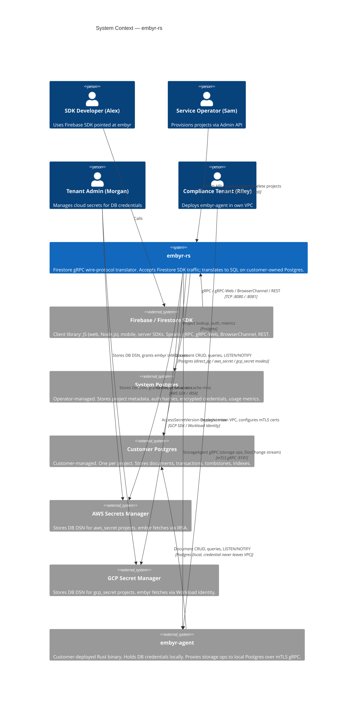
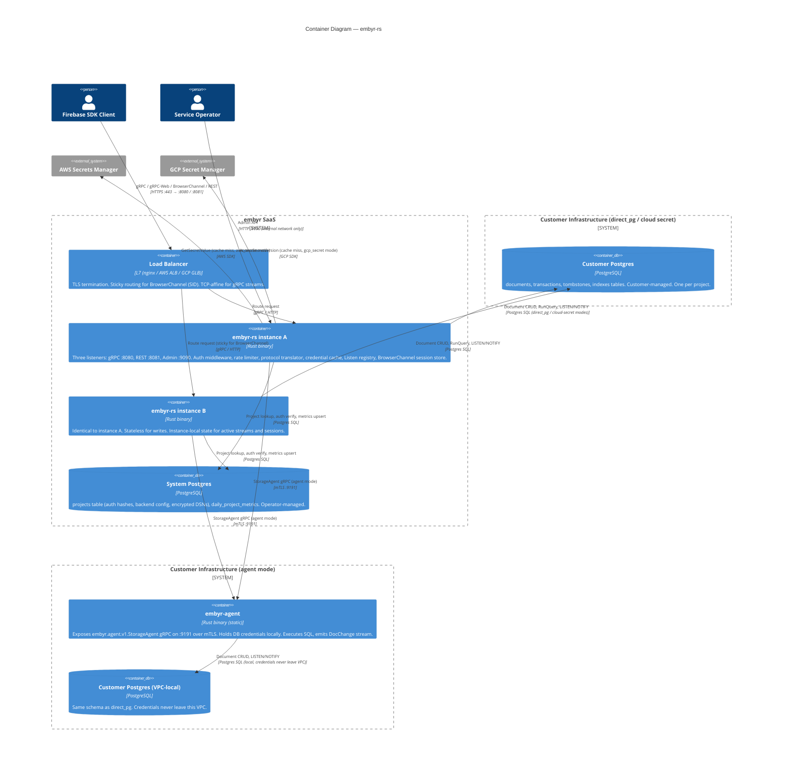
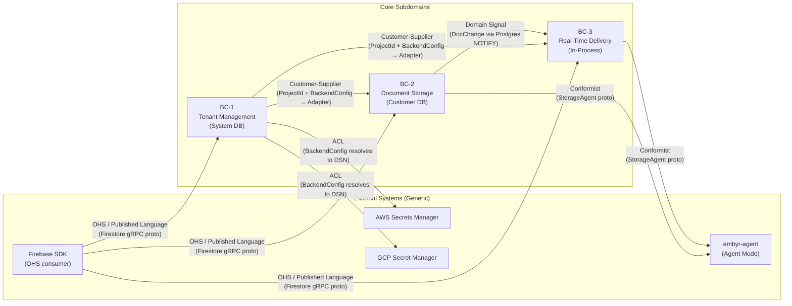
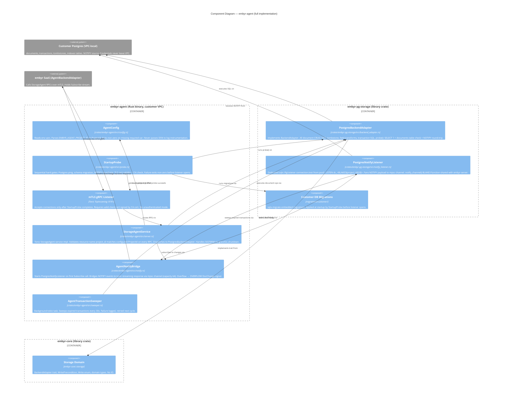

# Architecture Brief — embyr-rs
> Updated: 2026-05-23
> Feature: Full Rust reimplementation of Google Firestore-compatible server

---

## System Architecture

### Wave: DESIGN / [REF] System Quality Attributes

Ranked by forcing constraint from user stories and SPEC.md invariants:

| Rank | Attribute | Forcing Constraint |
|------|-----------|-------------------|
| 1 | **Protocol fidelity** | SDK compat KPI: ≥95% Firestore conformance suite pass rate. Any deviation silently breaks client SDK state machines. |
| 2 | **Tenant isolation** | SPEC invariant 10: every query, every storage op, every DocChange fan-out is predicated on `project_id`. A cross-tenant data leak is an immediate service-ending event. |
| 3 | **Credential confidentiality** | SPEC invariant 13: customer DB credentials never exist in plaintext in the system DB. Enforced structurally for all four backend modes. |
| 4 | **Real-time latency** | KPI: write → `onSnapshot` callback p99 ≤ 2 s (US-05, AC-05c). Drives the LISTEN/NOTIFY architecture choice over polling. |
| 5 | **Horizontal scalability** | SPEC: multiple stateless embyr instances behind a LB. Sticky routing required only for BrowserChannel (by `SID`) and TCP-affine Listen streams. |
| 6 | **Operational simplicity** | Single binary, three TCP listeners. No coordination plane (no Redis, no Kafka, no Zookeeper). Reduces operator failure surface. |
| 7 | **Availability** | Soft-delete with retention window (168 h default) protects against accidental data loss. Background sweeper is the only async side-effect process. |

### Wave: DESIGN / [REF] System Constraints

**Technical:**
- Single Rust binary (`embyr-rs`). No sidecar processes on the data plane.
- Separate Rust binary (`embyr-agent`) deployed in customer VPC for `backend_mode=agent`. Version must match embyr SaaS major version.
- Three distinct TCP listeners per instance: gRPC port (8080), REST port (8081), admin port (9090). Port conflicts are a hard startup validation failure.
- Postgres is the only supported production backend for both system DB and customer DBs. SQLite is dev/test only (single-node system DB exclusively).
- BrowserChannel session state and Listen stream registries are in-process. These are not externalized to a shared store — this is a deliberate scope constraint (D09, D10 from feature-delta locked decisions).
- Per-project rate limiting is per-instance token bucket. No distributed rate-limiting coordination.
- Resume token retention window is bounded by the 24-hour tombstone sweep. Tokens older than 24 h trigger a full re-snapshot, not an error.
- `backend_mode=direct_pg` requires `auth_mode=key` without exception (SPEC invariant 14). The API key is the sole ECIES key material.

**Operational:**
- Admin port (9090) must be bound to an internal/loopback interface. Infrastructure policy (firewall, network ACL) enforces non-exposure — embyr does not enforce this in software.
- Agent binary (`embyr-agent`) requires `EMBYR_AGENT_DB_DSN`, `EMBYR_AGENT_CERT`, `EMBYR_AGENT_KEY`, `EMBYR_AGENT_CA` at startup. Missing any causes non-zero exit (AC-12e).
- embyr SaaS reconnects to agents with exponential backoff (1 s initial, max 30 s).
- Credential cache TTL default 5 min: cloud secret rotation visible to SDK within ≤ 1 cache TTL + rotation propagation time. KPI: ≤ 5 min gap (AC-10d).

**Security:**
- Argon2id parameters: memory=65536 KiB, iterations=3, parallelism=4, tag=32 bytes. Not configurable — fixed in code.
- ECIES scheme: X25519 ECDH + HKDF-SHA256 + AES-256-GCM. Private key re-derived from API key on each cache miss; never persisted.
- Credential cache key: `(project_id, BLAKE3(api_key))`. BLAKE3 is a fingerprint, not a security boundary — the Argon2id hash is the security boundary.
- mTLS is mandatory for agent connections. No unauthenticated agent mode exists.
- Dual-hash rotation window: `auth_key_hash` (primary) and `auth_key_hash_2` (secondary) — any match succeeds during rotation. Clearing `auth_key_hash_2` completes rotation.

### Wave: DESIGN / [REF] Process Topology

**Two binaries, never merged:**

```
embyr-rs        — multi-tenant SaaS process
embyr-agent     — customer-deployed sidecar (one per project, customer VPC)
```

**embyr-rs TCP listeners (per instance):**

| Listener | Default Port | Protocol | Serves |
|----------|-------------|----------|--------|
| gRPC port | 8080 | gRPC over HTTP/2 | Native gRPC (Node.js SDK, server SDKs) |
| REST port | 8081 | HTTP/1.1 + HTTP/2 | gRPC-Web, BrowserChannel, REST/JSON (web SDK, curl) |
| Admin port | 9090 | HTTP/1.1 | Project management API (internal only) |

All three listeners run inside one OS process. There is no gateway subprocess.

**REST port routing decision tree** (single combined handler):
1. `Content-Type: grpc-web*` or CORS preflight for gRPC-Web → gRPC-Web handler
2. Path ends with `/channel` → BrowserChannel handler (no write deadline)
3. `GET /healthz` or `GET /readyz` → health handlers (no auth, no CORS)
4. `POST .../documents:runQuery`, `:batchGet`, `:runAggregationQuery` → custom JSON-array streamers
5. All other paths → grpc-gateway REST mux (30 s timeout)

**embyr-agent listeners:**

| Listener | Default Port | Protocol | Serves |
|----------|-------------|----------|--------|
| Agent gRPC | 9191 | gRPC over mTLS | `embyr.agent.v1.StorageAgent` — internal storage proxy |

**Background goroutines per embyr-rs instance:**
- Transaction sweeper: expires transactions every `transactions.sweep_interval` (default 30 s)
- Tombstone sweeper: purges tombstones older than 24 h
- Deleted project sweeper: purges soft-deleted projects after `admin.deletion_retention` (168 h)
- LISTEN listener: one dedicated Postgres connection per active customer DB receiving `NOTIFY` events
- Agent subscription: one long-lived gRPC `Subscribe` stream per `backend_mode=agent` project

### Wave: DESIGN / [REF] Network Topology

**SaaS deployment (operator-managed):**

```
Internet / SDK clients
        │
        ▼
   Load Balancer
   ├── L7 routing by path/header
   ├── Sticky by cookie/header for BrowserChannel (SID-based)
   └── TCP-affine for gRPC streams (connection-level stickiness)
        │
   ┌────┴────┐
   │embyr-rs │  (N instances, same binary, stateless for writes)
   │  :8080  │  ← gRPC
   │  :8081  │  ← REST/gRPC-Web/BrowserChannel
   └────┬────┘
        │         :9090 admin port — NOT behind public LB
        │         ├── bound to internal interface only
        │         └── accessible via internal network / bastion / VPN
        │
   ┌────┴─────────────────┐
   │  System DB           │  Operator-managed Postgres (projects, metrics)
   │  (one per deployment)│
   └──────────────────────┘
        │  (per project, on-demand connection)
   ┌────┴─────────────────┐
   │  Customer DBs        │  One Postgres per project (customer-managed)
   │  (direct_pg /        │
   │   aws_secret /       │
   │   gcp_secret)        │
   └──────────────────────┘
```

**Agent deployment (customer VPC):**

```
Customer VPC
┌─────────────────────────────┐
│  embyr-agent  :9191 (mTLS)  │
│        │                    │
│  Customer Postgres          │
└─────────────────────────────┘
        ▲ mTLS gRPC (outbound from embyr SaaS)
        │
   embyr-rs (SaaS) — connects to agent endpoint stored in project record
```

**TLS posture:**
- gRPC port (8080): no TLS by default; mTLS when any project uses `auth_mode=mtls` (configured via `server.tls.cert/key`)
- REST port (8081): same TLS configuration as gRPC port; when mTLS active, client certs validated per-project against `auth_mtls_ca`
- Admin port (9090): plain HTTP; TLS not required because the port must not be reachable from the public network
- Agent channel: mandatory mTLS in both directions; no plaintext mode

**CORS:** Controlled by `server.allowed_origins`. Empty list = allow all origins (suitable for development). Production operators must restrict this.

**Sticky routing requirement:**
- BrowserChannel: load balancer must route by `SID` cookie or query parameter to the same embyr instance for the session lifetime. Reason: session state (`sessions` map, log ring) is in-process only.
- gRPC Listen streams: TCP connection affinity is sufficient (gRPC streams live on one HTTP/2 connection). No explicit sticky config needed beyond normal LB connection affinity.
- gRPC writes: stateless — any instance handles any write.

### Wave: DESIGN / [REF] Scalability Model

**Horizontal scaling approach:**

Writes are stateless: any embyr instance can serve any write for any project. Add instances behind the LB to scale write throughput linearly. The bottleneck moves to the customer Postgres, not embyr.

Reads are stateless in the same sense. The credential cache is per-instance; more instances means more total cache capacity but also more cache misses on cold start or restart. At `credential_cache_ttl=5min` and a credential fetch cost of ~50 ms (cloud secret fetch) vs. ~0.5 ms (ECIES decrypt), the cold-start cost is bounded.

**Per-instance state inventory (what cannot be shared):**

| State | Scope | Consequence of Instance Death |
|-------|-------|-------------------------------|
| BrowserChannel sessions | In-process map (SID → session) | Active sessions die; SDK reconnects, creates new SID |
| Listen stream registry | In-process registry (project_id → subscribers) | Active listeners receive EOF; SDK reconnects, triggers full re-snapshot or delta via resume token |
| Credential cache | In-process LRU (project_id + fingerprint → DSN) | Rebuilt on first request after restart; no data loss |
| Per-project rate limiter state | In-process token buckets | Buckets reset on restart; brief over-limit window possible |
| NOTIFY listener connections | One dedicated Postgres connection per active customer DB | Reconnected on restart with exponential backoff |
| Agent gRPC subscriptions | One long-lived stream per agent-mode project | Reconnected on restart with exponential backoff |

**Scaling bottlenecks by load type:**

| Load type | Bottleneck | Relief |
|-----------|------------|--------|
| Write throughput | Customer Postgres write capacity | Postgres tuning, connection pooling (PgBouncer in front of customer DB) |
| Listen fan-out throughput | NOTIFY payload size cap (8 KB) limits payload; re-fetch via GetDocument mitigates | Registry per-subscriber channel cap (64) causes RESET on slow consumers |
| BrowserChannel session count | In-process memory; 200 sessions/project default limit | Add instances; LB sticky routing distributes sessions |
| Credential fetch latency (cold) | AWS/GCP API latency ~50–200 ms per cold miss | Cache TTL (5 min); pre-warm not available — by design, credentials are not persistent plaintext |
| Argon2id verification latency | ~200–500 ms per verification at recommended params | Credential cache hit avoids re-verification; cache miss on every restart is acceptable |
| Admin provisioning (direct_pg) | Argon2id hash + schema migration on customer DB; p99 ≤ 5 s KPI | Sequential; no parallelism needed at provisioning rates |

**Back-of-envelope capacity estimation:**

Assumptions:
- 1,000 active projects
- 100 concurrent Listen streams per project = 100,000 active streams across the fleet
- 500 writes/sec/project peak = 500,000 writes/sec fleet-wide
- Average document: 2 KB data + 200 B metadata = ~2.2 KB
- NOTIFY payload triggers re-fetch; re-fetch = 1 Postgres read

Memory per embyr instance:
- Listen registry: 64 events × 2 KB × 100,000 streams = ~12.8 GB theoretical max — in practice, most streams are idle. At 10 active events/stream buffer: ~1.3 GB.
- BrowserChannel sessions: 200 sessions/project × 1,000 projects = 200,000 sessions max. At 10 KB/session: ~2 GB.
- Credential cache: 1,000 entries × ~1 KB = ~1 MB (negligible).

Practical instance sizing: 4–8 GB RAM handles ~500 concurrent projects with active streams comfortably. Scale horizontally beyond that.

Postgres connections per instance:
- System DB: `backend.postgres.max_conns` default 25
- Customer DBs: up to 25 connections per project, but connections are established on-demand. At 100 active projects per instance, this is up to 2,500 simultaneous Postgres connections — likely too many. Operators should deploy PgBouncer in transaction-pooling mode in front of customer Postgres instances for large deployments.

### Wave: DESIGN / [REF] Data Flow

**Write request path (direct_pg mode):**

```
Firebase SDK
  └─ gRPC: UpdateDocument (project_id, path, data)
        │
   embyr-rs gRPC handler
        │
   [1] Auth middleware
        ├─ Extract project_id from request proto database field
        ├─ Load project record from system DB (or cache)
        ├─ Check status: deleted → NotFound, suspended → PermissionDenied
        └─ Argon2id verify(api_key, auth_key_hash) — or hash_2 if rotation active
        │
   [2] Rate limit check (per-project token bucket, in-process)
        ├─ Bucket has tokens → consume and proceed
        └─ Bucket empty → ResourceExhausted, stop
        │
   [3] AdapterForProject(project_id, api_key)
        ├─ Cache hit (project_id, BLAKE3(api_key)) → return cached DSN
        └─ Cache miss:
              ECIES decrypt: re-derive X25519 priv from api_key+project_id via HKDF
              → decrypt backend_pg_creds_enc → plaintext DSN
              → insert into credential cache (TTL 5 min)
        │
   [4] Execute SQL on customer Postgres
        ├─ UPDATE documents SET data=$1, version=version+1, updated_at=now()
        │   WHERE project_id=$2 AND path=$3 AND version=$4  (OCC check)
        └─ Emit DocChange{Upsert, project_id, path, version}
        │
   [5] NOTIFY propagation
        ├─ Postgres trigger fires: pg_notify('doc_changes', payload)
        ├─ embyr LISTEN listener receives notification
        ├─ Registry fans out DocChange to all Listen subscribers for project_id
        └─ Each Listen handler: re-fetch document via GetDocument → send documentChange to gRPC stream
        │
   [6] Metrics recording (async, best-effort)
        └─ RecordMetrics(project_id, ingress_bytes, egress_bytes, cpu_ms)
              UPSERT INTO daily_project_metrics ... ON CONFLICT DO UPDATE ...
        │
   Response: WriteResult{update_time: committed_at}
```

**Read request path (aws_secret mode, credential cache miss):**

```
Firebase SDK
  └─ gRPC: GetDocument
        │
   [1] Auth middleware (same as write path, Argon2id verify)
        │
   [2] AdapterForProject(project_id, api_key)
        ├─ Cache miss → load project record (backend_mode=aws_secret)
        ├─ Call AWS Secrets Manager: GetSecretValue(SecretId=backend_secret_arn)
        │   using instance IAM role (IRSA) or assumed role_arn
        ├─ Parse JSON secret: {"dsn": "postgres://..."}
        └─ Insert into credential cache (TTL 5 min)
        │
   [3] SELECT * FROM documents WHERE project_id=$1 AND path=$2
        │
   Response: Document proto
```

**Listen stream path (real-time):**

```
Firebase SDK
  └─ gRPC bidirectional stream: Listen
        │
   [1] Auth middleware (once per stream open)
        │
   [2] AddTarget received:
        ├─ If no resume token: full snapshot query → stream documentChange × N, then CURRENT + NO_CHANGE
        └─ If valid resume token: delta query (updated_at > sinceTime) + tombstones → stream delta
        │
   [3] Subscribe to Registry for project_id
        └─ Receive channel: capacity 64 DocChange events
        │
   [4] On each DocChange from Registry:
        ├─ In-memory filter: does this DocChange match the target's query?
        ├─ Yes: re-fetch document via GetDocument (handles 8 KB NOTIFY payload cap)
        └─ Send documentChange to client; then NO_CHANGE with updated resume token
        │
   [5] Keep-alive: every 30 s of idle, send NO_CHANGE (no resume token, no target IDs)
        │
   [6] Registry overflow (buffer cap 64 hit):
        └─ Set overflow flag; next change triggers RESET → client re-snapshots all targets
```

**Agent mode path:**

```
Firebase SDK
  └─ gRPC: any operation
        │
   [1] Auth middleware
        │
   [2] AdapterForProject(project_id, api_key)
        └─ backend_mode=agent: no credential fetch; return AgentAdapter for backend_agent_endpoint
        │
   [3] AgentAdapter.Execute(rpc, args)
        └─ Forward gRPC call over mTLS to embyr-agent:9191
              embyr-agent executes SQL on local Postgres
              embyr-agent returns result proto
        │
   Response: forwarded from agent
```

**Suspension enforcement path:**

```
POST /admin/v1/projects/{id}/suspend (admin port 9090)
        │
   [1] Admin auth: verify Authorization: Bearer <admin.key>
        │
   [2] UPDATE projects SET status='suspended' WHERE project_id=$1
        │
   Next SDK request for this project:
        │
   [3] Auth middleware: load project record → status=suspended → PermissionDenied immediately
        └─ Credential cache entry remains but is bypassed by status check (status checked before cache lookup)
```

Note: suspension takes effect on the next request after the DB write commits. At the auth middleware's project load, the project record is read from the system DB (not from a write-through cache that could be stale beyond the natural connection pool query interval). The AC-09a requirement of "within 1 second" is met because embyr does not cache project status independently — it is read per-request from Postgres.

### Wave: DESIGN / [REF] Failure Modes

| Failure | Symptom | Embyr Behavior | Client Behavior |
|---------|---------|----------------|-----------------|
| System DB (Postgres) unreachable | No project record lookups possible | All requests fail auth middleware: `Unavailable` | SDK sees connection errors; retry |
| Customer DB (direct_pg) unreachable at provision time | Schema migration fails | `POST /admin/v1/projects` → 400 `backend_unavailable` | Operator retries provisioning |
| Customer DB unreachable at request time | Connection pool exhausted or connection refused | `Unavailable` returned to client | SDK retries; exponential backoff |
| Customer DB unreachable for NOTIFY listener | LISTEN connection drops | Reconnect with backoff (1 s initial, max 30 s); during outage, live changes not delivered | Active `onSnapshot` receives no updates until reconnect; on reconnect, full re-snapshot (no RESET during backoff — RESET only on registry overflow) |
| AWS Secrets Manager unreachable | `GetSecretValue` call fails | `Unavailable` to SDK client on credential cache miss | SDK retries; if cached DSN still valid, requests succeed until TTL expiry |
| GCP Secret Manager unreachable | Same as AWS | Same | Same |
| Cloud secret expired/rotated | Cache contains old DSN, Postgres rejects it | Connection failure on next Postgres operation → evict cache entry → re-fetch secret → retry | Transparent after ≤ 1 cache TTL (5 min); AC-10d specifies 6-min wait for KPI |
| embyr-agent unreachable | mTLS connection fails or stream drops | `Unavailable` for all storage operations for the project; reconnect with backoff (1 s → 30 s) | SDK sees `Unavailable`; retries. On reconnect, active Listen clients for the project receive RESET → re-snapshot |
| embyr instance crash | In-process state lost | LB detects instance down (health check on /healthz fails within LB probe interval); traffic rerouted | BrowserChannel sessions die → SDK creates new SID on next request. Listen streams die → SDK reconnects, resumes from last resume token (delta delivery). Rate limiter resets (brief over-limit window possible). |
| embyr instance restart (rolling) | Same as crash but controlled | LB drains connections before instance stops (if LB supports drain) | Same as crash, but graceful if drain is configured |
| Registry buffer overflow (slow consumer) | Per-subscriber channel fills to 64 | Overflow flag raised; next DocChange to that subscriber sends RESET | Client receives RESET → clears targets → re-sends AddTarget → full re-snapshot |
| Argon2id verification cost spike | ~200–500 ms per verify at cold start | Credential cache prevents re-verify on subsequent requests from same client within TTL | First request after restart or cache expiry is slower; acceptable per design |
| Admin key compromise | All admin operations accessible to attacker | No technical mitigation in embyr; credential rotation via operator re-deploy with new `admin.key` | N/A |
| BrowserChannel session not found (SID lookup miss after instance restart) | Session map empty on new instance | HTTP 400 returned to client | Firebase JS SDK creates a new session (new `SID`) automatically |

**Substrate probes (Earned Trust — startup validation):**

embyr must validate substrate claims before accepting traffic. The following probes run at startup before any listener is opened:

| Probe | What it validates | Failure action |
|-------|-------------------|----------------|
| System DB connectivity | `db.Ping()` within 2 s | Refuse to start; log `health.startup.refused: system_db_unreachable` |
| System DB WAL mode (SQLite dev only) | `PRAGMA journal_mode` = `wal` | Refuse to start; log `health.startup.refused: sqlite_wal_mode_not_set` |
| System DB schema migration | All migrations applied without error | Refuse to start; log `health.startup.refused: migration_failed` |
| Port availability | Bind all three sockets before accepting | Refuse to start; log `health.startup.refused: port_conflict` with conflicting port |
| Admin key present | `admin.key` non-empty | Refuse to start; log `health.startup.refused: admin_key_missing` |
| Agent cert loadable | TLS cert/key parse succeeds if any agent project configured | Refuse to start; log `health.startup.refused: agent_tls_load_failed` |
| Cloud IAM reachability | Test IAM metadata endpoint if `aws_secret` or `gcp_secret` projects exist | Warn only (not refuse) — IAM may be region-scoped; log `health.startup.warn: cloud_iam_probe_failed` |

The `/readyz` endpoint re-runs the system DB ping on every call; it does not re-run schema migrations. The `/healthz` endpoint is process-alive only.

### Wave: DESIGN / [REF] C4 System Context (Mermaid)



### Wave: DESIGN / [REF] C4 Container Diagram (Mermaid)



### Wave: DESIGN / [REF] System-Level Decisions Table

| ID | Decision | Verdict | Rationale |
|----|----------|---------|-----------|
| SD-01 | Single binary for all transports | Accepted | SPEC requires gRPC, gRPC-Web, BrowserChannel, REST served simultaneously. Separate processes would require shared session state externalization (Redis), which is explicitly out of scope (D09). Single binary eliminates IPC, reduces operational surface, and satisfies AC-13d ("no separate server process required for browser transports"). |
| SD-02 | In-process Listen registry (no Redis pub/sub) | Accepted | Postgres LISTEN/NOTIFY delivers `DocChange` events to one embyr instance per customer DB connection. The registry fans out in-process to all Listen stream handlers on that instance. Trade-off: live changes for a project only reach clients connected to the instance holding the NOTIFY listener for that project. In practice, all instances hold NOTIFY listeners for all active projects, so all clients on any instance get changes. Rejected alternative: Redis pub/sub would enable cross-instance fan-out but adds operational dependency and distributed failure mode. At the stated scale (p99 ≤ 2 s KPI), in-process fan-out is sufficient. |
| SD-03 | Credential cache keyed by `(project_id, BLAKE3(api_key))` | Accepted | API key is re-presented on every request (Bearer token). BLAKE3 is collision-resistant and fast (~1 ns) — suitable as a cache key. The BLAKE3 fingerprint is not a security boundary; Argon2id handles authentication. This prevents the cache from being poisoned by a key that passes fingerprint matching but fails Argon2id verification: the credential cache is only populated after successful Argon2id verify. Trade-off: cache miss on any new API key value (including after rotation) requires a full credential fetch + Argon2id verify cycle. |
| SD-04 | Per-instance token bucket rate limiting (no distributed coordination) | Accepted | D10 (locked decision): distributed rate limiting is out of scope. Per-instance bucket means a project can exceed the configured per-project limit by a factor of N (number of instances). Operators must set per-instance limits conservatively at 1/N of the intended cluster-wide limit. This is a deliberate simplicity trade-off. The KPI for rate limiting (AC-14c: p99 latency increase < 0.5 ms) is achievable only with in-memory token buckets; a Redis round-trip would add ~0.5–2 ms per request. |
| SD-05 | Postgres LISTEN/NOTIFY for real-time change delivery (no Kafka / Redis Streams) | Accepted | The data source is Postgres. Adding a separate message broker (Kafka, Redis) would require a CDC pipeline, adding operational complexity and a new failure mode. NOTIFY fires within the committing transaction, guaranteeing that no write is visible without a notification. Trade-off: NOTIFY payload capped at 8 KB — addressed by re-fetching the document via GetDocument in the Listen handler (SPEC explicitly specifies this re-fetch). NOTIFY is regional (one cluster per region) — consistent with SPEC multi-region model. KPI: p99 ≤ 2 s for write → callback; in-process fan-out after NOTIFY adds < 1 ms. |
| SD-06 | OCC via `version` column (no pessimistic locking) | Accepted | Firestore's transaction model is OCC. The `version` column on documents enables lightweight conflict detection without holding Postgres row locks across RPC round-trips. SDK retries on `Aborted`. Trade-off: high-contention writes on hot documents produce higher abort rates. At the stated concurrency (100 concurrent transactions KPI, AC-06a), OCC abort rate is acceptable without additional coordination. Pessimistic locking would require session-affine connections (incompatible with connection pooling). |
| SD-07 | Separate admin port (9090) with no cross-contamination from data ports | Accepted | SPEC requires admin API inaccessible from public network. The isolation is implemented at the TCP listener level (bind to different port, potentially different interface). This is structurally simpler and more auditable than path-based routing (where a routing bug could expose admin endpoints). AC-07f requires admin endpoints not accessible on data port. |
| SD-08 | Soft-delete with 168 h retention window before background purge | Accepted | D08 (locked decision). Immediate hard-delete is operationally irreversible and high-risk. The retention window allows the operator to recover from accidental deletion. Background sweeper (`SweepDeletedProjects`) connects to the customer DB using stored credentials to drop tables; if the customer DB is unreachable, the sweep is skipped and retried next cycle. Trade-off: customer DB credentials must remain valid for the duration of the retention window for purge to complete. |
| SD-09 | embyr-agent as separate static binary (no shared library) | Accepted | Agent runs in customer VPC where embyr SaaS is untrusted. Static binary minimizes supply-chain surface (no runtime dependencies). Binary version must match embyr SaaS major version — enforced by protocol versioning in `embyr.agent.v1.StorageAgent`. Trade-off: separate release process for agent binary. Distribution/packaging is explicitly out of scope for this feature (feature-delta Out of Scope section). |
| SD-10 | Resume token = base64(RFC3339Nano UTC timestamp) | Accepted | Resume tokens encode a read-time. Tombstones are retained for 24 h; any resume token older than 24 h triggers a full re-snapshot (no error). This bounds tombstone table growth and simplifies the delta delivery query to a single `updated_at > sinceTime` predicate. Trade-off: a 24 h outage causes all reconnecting clients to re-snapshot — acceptable for the stated availability model. |

---

## Domain Model

> Updated: 2026-05-23
> Mode: Propose (greenfield — derived from SPEC.md, feature-delta.md, jobs.yaml)

---

### Wave: DESIGN / [REF] Bounded Contexts

embyr-rs has **no domain of its own in the classical sense** — it is a translation layer. The domain is therefore the set of concerns the system must model precisely to fulfil its protocol-fidelity and multi-tenancy obligations. Three bounded contexts emerge from language divergence, isolation requirements, and ownership boundaries.

| # | Bounded Context | Subdomain Type | Responsibility | Rationale |
|---|----------------|---------------|----------------|-----------|
| BC-1 | **Tenant Management** | Core | Owns the lifecycle of a `Project` (the unit of tenancy): provisioning, authentication, suspension, deletion, and usage metering. Lives exclusively in the System DB. | "Project" here means a billing/identity/control-plane entity. It is structurally independent from documents, transactions, and queries. The operator's vocabulary ("create a project", "suspend billing") is entirely different from Alex's ("write a document", "listen for changes"). Language divergence at the persona boundary confirms the split. |
| BC-2 | **Document Storage** | Core | Owns `Document`, `Transaction`, `Index`, `Tombstone`, and the query engine. Executes all CRUD, RunQuery, batch operations, and index management against a customer-owned Postgres. Lives in the Customer DB. | Alex's entire vocabulary lives here. "Document", "collection", "index", "transaction" are distinct from tenant concepts. Isolation requirement: this context must never touch the System DB directly — it receives only a `ProjectId` and a storage adapter. |
| BC-3 | **Real-Time Delivery** | Core | Owns `ListenTarget`, `ResumeToken`, `DocChange` propagation, BrowserChannel session state, and the stream fan-out registry. Bridges Postgres `NOTIFY` events to SDK stream consumers. | The vocabulary here ("listen target", "resume token", "snapshot", "delta", "CURRENT marker") exists nowhere else in the system. Real-time delivery has its own consistency model (eventual, NOTIFY-driven), its own failure modes (buffer overflow → RESET), and its own state that is orthogonal to both tenant management and document mutation. |

**What is NOT a bounded context:**

- **Credential Resolution** is a domain service within Tenant Management, not a separate context. It translates a `BackendConfig` (value object) into a live storage connection. It has no entities, no lifecycle, no invariants of its own.
- **Protocol Translation** (gRPC ↔ SQL encoding) is an infrastructure concern — it belongs to the application/infrastructure layer of each context, not a domain concept.
- **Rate Limiting** is a policy enforcement mechanism within Tenant Management, not a context boundary.

---

### Wave: DESIGN / [REF] Ubiquitous Language

Terms are scoped per bounded context. The same word in two contexts may mean something different — this is intentional.

#### BC-1: Tenant Management

| Term | Definition |
|------|-----------|
| **Project** | The unit of tenancy. Identified by a `ProjectId` matching `^[a-z][a-z0-9-]{0,62}$`. Has a lifecycle: `Active → Suspended → Deleted`. Owns auth configuration and backend connectivity configuration. Lives in the System DB. |
| **ProjectId** | Immutable identifier for a project. RFC 1123 hostname label format. Assigned at provisioning; never changes. |
| **AuthKey** | The credential an SDK client presents on every request (Bearer token). Presented in plaintext over the wire; stored only as an `Argon2idHash`. Never persisted in plaintext. |
| **Argon2idHash** | The result of hashing an `AuthKey` with Argon2id (memory=65536 KiB, iter=3, par=4). The security boundary for client authentication. |
| **DualHashWindow** | The rotation state where both `auth_key_hash` (primary) and `auth_key_hash_2` (secondary) are active. Any match succeeds. Clearing the secondary completes rotation. |
| **BackendConfig** | Value object describing how to reach the customer's Postgres. Variant: `DirectPg` (ECIES-encrypted DSN), `AwsSecret` (ARN reference), `GcpSecret` (resource name), `Agent` (mTLS endpoint). Never contains a plaintext DSN. |
| **EncryptedDsn** | A DSN encrypted at rest using ECIES (X25519 ECDH + HKDF-SHA256 + AES-256-GCM). Decryptable only by re-deriving the private key from the `AuthKey`. |
| **BackendMode** | The variant selector of `BackendConfig`: `direct_pg`, `aws_secret`, `gcp_secret`, `agent`. |
| **AuthMode** | The authentication variant for SDK clients: `key` (API key + Argon2id), `mtls` (mutual TLS). |
| **ProjectStatus** | Enumerated lifecycle state: `Active`, `Suspended`, `Deleted`. |
| **CredentialCache** | In-process LRU cache keyed by `(ProjectId, BLAKE3(AuthKey))`. TTL=5 min. Stores a resolved storage connection (DSN or agent handle). Not a domain object — an infrastructure optimization. |
| **CredentialFingerprint** | `BLAKE3(AuthKey)` — used as a cache lookup key only. Not a security boundary. |
| **DailyProjectMetrics** | Metering record: `(ProjectId, Date, ingress_bytes, egress_bytes, cpu_ms)`. One row per project per calendar day. Upserted on each request. |
| **AdminKey** | The operator's credential for the admin port. A single shared secret per embyr deployment. Must be non-empty at startup. |
| **DeletionRetentionWindow** | The duration (default 168 h) between a project's soft-deletion and its background purge. During this window, the `Deleted` project still occupies the System DB and its customer DB schema remains intact. |
| **SuspensionEffect** | The observable consequence of suspension: all data-plane requests for the project return `PermissionDenied` on the next request after the status write commits. Takes effect within 1 request latency (not eventually). |

#### BC-2: Document Storage

| Term | Definition |
|------|-----------|
| **Document** | The primary aggregate. Identified by a `DocumentPath`. Has `fields` (Firestore Value encoding), `create_time`, `update_time`, and a `version` counter used for OCC. Stored in the customer-owned Postgres `documents` table. |
| **DocumentPath** | The full resource path: `projects/{project_id}/databases/(default)/documents/{collection}/{document_id}`. Unique within a project. |
| **Collection** | A named grouping of documents. Not a stored entity — an emergent concept derived from the first path segment after `documents/`. |
| **CollectionGroup** | A logical union of all collections with the same name across all paths within a project. Enables cross-hierarchy queries. |
| **Fields** | The payload of a document: a map of field names to Firestore `Value` types. Stored as JSONB. Encoding follows the Firestore wire proto exactly. |
| **Version** | A monotonically increasing integer on each document, incremented on every write. The OCC conflict detection key: a mutation specifying `version=N` is rejected if the stored version is not `N`. |
| **Transaction** | An OCC unit spanning `Begin → reads → Commit`. Identified by a `TransactionId`. TTL=60 s. Holds read timestamps and pending mutations. Lives in the `transactions` table. |
| **TransactionId** | Opaque bytes identifying a transaction. Assigned at `BeginTransaction`; invalidated at `Commit`, `Rollback`, or TTL expiry. |
| **OccConflict** | The condition where a document's stored `version` does not match the version recorded at read time. Results in `ABORTED`; the SDK retries. |
| **Mutation** | A write operation within a transaction or batch: `Set`, `Update`, `Delete`. Applied atomically at `Commit`. |
| **Index** | A composite index enabling complex query execution. States: `Creating → Ready`. Stored in the `indexes` table. A query requiring an index that does not exist in `Ready` state returns `FAILED_PRECONDITION`. |
| **IndexState** | Enumerated: `Creating`, `Ready`. Transitions are one-way. |
| **Tombstone** | A record of a deleted document enabling delta delivery on reconnect. Contains `DocumentPath` and `delete_time`. Retained for 24 h. Enables the delta query: "documents deleted since resume time." |
| **StructuredQuery** | The Firestore query representation: collection selector, filters, order clauses, limit, cursor. Translated to SQL by the query engine. |
| **QueryCursor** | A position in a query result set, encoded as document field values or a document reference. Enables pagination via `startAfter` / `endBefore`. |
| **BatchGetRequest** | A read of up to N documents by path in a single RPC. Returns each document or a `MissingDocument` marker. May execute within a transaction. |
| **AggregationQuery** | A query returning aggregated values (currently `count(*)`). No document bodies returned. |

#### BC-3: Real-Time Delivery

| Term | Definition |
|------|-----------|
| **ListenTarget** | A subscription registered by an SDK client specifying a query or document path to watch. Identified by a client-assigned `TargetId`. Has a `ResumeToken`. |
| **TargetId** | A client-assigned integer identifying a listen target within a stream. Reused by the client across reconnects. |
| **ResumeToken** | An opaque bytes value encoding a UTC read-time in RFC3339Nano format, base64-encoded. Returned to the client in `NO_CHANGE` responses. Used on reconnect to request delta delivery rather than a full snapshot. |
| **SnapshotDelivery** | The initial delivery mode: all documents matching the target's query are streamed as `DocumentChange(Added)` events, followed by a `TargetChange(CURRENT)` marker. |
| **DeltaDelivery** | The reconnect delivery mode: only documents changed or deleted since the `ResumeToken` time are streamed. Requires tombstones to cover deleted documents. |
| **DocChange** | An in-process value carrying `(ChangeType, ProjectId, DocumentPath, Version)`. Produced by the Postgres `NOTIFY` listener; consumed by the fan-out registry. Not a domain event in the ES sense — it is an infrastructure signal. |
| **ChangeType** | Enumerated: `Upserted`, `Deleted`. Determines whether the Listen handler re-fetches the document or synthesizes a `DocumentRemove` response. |
| **ListenRegistry** | The in-process map from `ProjectId` to the set of active `ListenTarget` handlers. Receives `DocChange` signals and fans out to matching subscribers. Per-instance — not shared across embyr instances. |
| **RegistryOverflow** | The condition where a subscriber's buffer (capacity=64) is full. Sets an overflow flag; the next `DocChange` triggers a `RESET` response, causing the client to re-snapshot all targets. |
| **RESET** | A `TargetChange(RESET)` response to a slow-consumer subscriber. Instructs the SDK to clear all targets and re-register, triggering full re-snapshot. |
| **CURRENT Marker** | A `TargetChange(CURRENT)` response indicating the initial snapshot is complete. Sent once per target after all initial documents are streamed. |
| **NO_CHANGE** | A `TargetChange(NO_CHANGE)` response carrying an updated `ResumeToken`. Sent after each `DocChange` fan-out and as a keep-alive every 30 s. |
| **BrowserChannelSession** | An in-process session state for the Firebase JS web SDK's long-poll transport. Identified by a `SessionId` (SID). Lives on the embyr instance that created it. Non-transferable across instances. |
| **SessionId** | An opaque string identifying a BrowserChannel session. Assigned at session creation; required on all subsequent requests. |
| **StreamToken** | A per-request sequence token used by the Write stream RPC for ordering. Separate from `ResumeToken`. |

---

### Wave: DESIGN / [REF] Aggregates

This system is OLTP-style protocol translation. Event Sourcing is not warranted (see DD-04). Aggregates use traditional state-based persistence. All aggregates are small by Vernon's Rule 2.

#### BC-1 — Project (Aggregate Root)

**Aggregate root**: `Project`
**Entities contained**: None (root only)
**Value objects**: `ProjectId`, `Argon2idHash` (×2, dual-hash window), `BackendConfig`, `AuthMode`
**Lives in**: System DB, `projects` table

**Invariants enforced:**
1. A `Project` in `Deleted` state must not be reactivated. `Deleted` is terminal.
2. `BackendConfig::DirectPg` requires `AuthMode::Key` — no other auth mode is valid (SPEC invariant 14). This invariant is enforced at construction, not in the persistence layer.
3. `auth_key_hash` must be present in `Active` state. A project without a hash cannot authenticate clients.
4. `ProjectId` is assigned once and immutable. No rename operation exists.
5. `Deleted` projects are not hard-deleted immediately — they enter a retention window (`DeletionRetentionWindow`) before the background sweeper purges them.

**Vernon Rule compliance:**
- Rule 1 (true invariants): `BackendConfig` and `AuthMode` must be consistent within the same project record — enforced transactionally.
- Rule 2 (small): Root entity only. No child entities.
- Rule 3 (reference by identity): `DailyProjectMetrics` references `ProjectId`, not a `Project` object.
- Rule 4 (eventual consistency outside): Suspension effects propagate to the auth middleware without a saga; the per-request DB read provides the effect.

**Commands handled:**
- `ProvisionProject(project_id, backend_config, auth_mode)` → `Project{Active}`
- `SuspendProject(project_id)` → `Project{Suspended}` (idempotent)
- `ActivateProject(project_id)` → `Project{Active}`
- `DeleteProject(project_id)` → `Project{Deleted}`
- `RotateAuthKey(project_id, new_hash)` → updates `auth_key_hash_2` during window, then promotes

---

#### BC-1 — DailyProjectMetrics (Aggregate Root)

**Aggregate root**: `DailyProjectMetrics`
**Entities contained**: None
**Value objects**: `ProjectId`, `MetricsDate`, `IngressBytes`, `EgressBytes`, `CpuMs`
**Lives in**: System DB, `daily_project_metrics` table

**Invariants enforced:**
1. One row per `(ProjectId, Date)`. Enforced by a unique constraint. Conflicts resolve via `ON CONFLICT DO UPDATE` (accumulation).
2. Counters are non-negative. Negative ingress or egress bytes are rejected.
3. Metrics are recorded best-effort and asynchronously. A failed metrics write does not fail the SDK request.

**Vernon Rule compliance:**
- Rule 1: The invariant "one row per (project, day) with accumulated counters" is entirely self-contained.
- Rule 2: Root entity only. No children.
- Rule 3: References `ProjectId` by value, not a `Project` object.
- Rule 4: Metrics recording is decoupled from the SDK request; eventual consistency is explicit.

Note: this is a metering aggregate, not a reporting aggregate. It accumulates raw counters. Aggregation for billing reports is an external concern.

---

#### BC-2 — Document (Aggregate Root)

**Aggregate root**: `Document`
**Entities contained**: None (root only)
**Value objects**: `DocumentPath`, `Fields`, `Version`, `CreateTime`, `UpdateTime`
**Lives in**: Customer DB, `documents` table

**Invariants enforced:**
1. `DocumentPath` is unique within a project. Two documents cannot share a path.
2. A write specifying `version=N` is rejected if stored `version ≠ N` (OCC). This invariant is the entire concurrency model.
3. `create_time` is set once at first write and never updated. `update_time` is updated on every mutation.
4. A `Delete` operation does not remove the row immediately if any active Listen target may need delta delivery — it creates a `Tombstone` and marks the row absent (or removes it; the tombstone is the durable record).

**Vernon Rule compliance:**
- Rule 1: OCC via `version` is the core invariant. It must be checked and committed atomically.
- Rule 2: Root entity only. `Fields` is a value object (JSONB blob), not a child entity.
- Rule 3: `Transaction` references `DocumentPath` values, not `Document` objects.
- Rule 4: `ListenTarget` receives change notifications via `DocChange` signal (Postgres NOTIFY), not via a synchronous domain event from the `Document` aggregate.

**Why Collection is not an aggregate or entity:**
Collection has no identity of its own, no invariants, and no lifecycle. It is an emergent grouping derivable from `DocumentPath`. Giving it an aggregate boundary would require locking it on every document write — a scalability anti-pattern.

---

#### BC-2 — Transaction (Aggregate Root)

**Aggregate root**: `Transaction`
**Entities contained**: None (root only)
**Value objects**: `TransactionId`, `ProjectId`, `ReadTime`, `PendingMutations` (list of `Mutation` VOs), `ExpiresAt`
**Lives in**: Customer DB, `transactions` table

**Invariants enforced:**
1. A `Transaction` not committed within TTL=60 s is expired. `Commit` on an expired transaction returns `NOT_FOUND`.
2. A rolled-back transaction cannot be committed. `Rollback` transitions to terminal state.
3. A `Commit` applies all `PendingMutations` atomically. Partial application is not permitted.
4. OCC conflicts detected at `Commit` time produce `ABORTED`. The transaction is then in a terminal state; it is not retried by the server.

**Vernon Rule compliance:**
- Rule 1: The TTL expiry and rollback finality are true invariants of the transaction lifecycle.
- Rule 2: Small. `PendingMutations` is a list of value objects, not a collection of entities.
- Rule 3: `Transaction` references `DocumentPath` values; it does not hold `Document` objects.
- Rule 4: OCC conflict detection (comparing stored `version` against read-time `version`) is the only cross-aggregate coordination, and it is synchronous within the `Commit` operation by design — it is not an eventual consistency scenario.

---

#### BC-2 — Index (Aggregate Root)

**Aggregate root**: `Index`
**Entities contained**: None
**Value objects**: `IndexId`, `ProjectId`, `IndexDefinition` (collection path + field specs), `IndexState`
**Lives in**: Customer DB, `indexes` table

**Invariants enforced:**
1. An index transitions `Creating → Ready` only. There is no rollback to `Creating` from `Ready`.
2. A `RunQuery` against a collection requiring a composite index that does not have a `Ready` index for the exact field combination returns `FAILED_PRECONDITION`. This is enforced at query planning time, not at index creation time.
3. Duplicate index definitions (same collection + same field set) are rejected.

**Vernon Rule compliance:**
- Rule 1: State transitions are self-contained invariants.
- Rule 2: Root entity only.
- Rule 3: `RunQuery` references `IndexId` by value (or by definition match) when checking preconditions.
- Rule 4: Index creation is an administrative operation. No saga or eventual consistency is required for the `Creating → Ready` transition (it is background DDL in Postgres).

---

#### BC-2 — Tombstone (Not an Aggregate — Supporting Value Record)

`Tombstone` is not an aggregate. It has no commands, no invariants beyond its retention window, and no lifecycle transitions driven by business rules. It is a read-side record produced as a side-effect of document deletion, consumed by the delta delivery query, and purged by the background sweeper after 24 h.

It is modeled as a **domain record** (a value-typed row): `(ProjectId, DocumentPath, DeleteTime)`. No aggregate wrapper is needed.

---

#### BC-3 — ListenTarget (Aggregate Root)

**Aggregate root**: `ListenTarget`
**Entities contained**: None
**Value objects**: `TargetId`, `ProjectId`, `QuerySpec` (or `DocumentPath` for single-doc targets), `ResumeToken`
**Lives in**: In-process (per embyr instance). Not persisted to any database.

**Invariants enforced:**
1. A `ListenTarget` is owned by exactly one gRPC stream. When the stream closes, all its targets are deregistered.
2. `ResumeToken` advances monotonically — it is only updated to a newer timestamp on each `NO_CHANGE` response. It never moves backwards.
3. A `ResumeToken` older than 24 h is treated as absent — the target switches to `SnapshotDelivery` mode.
4. A `ListenTarget` in overflow state (buffer full) must not receive further `DocChange` signals until after the `RESET` is sent and acknowledged.

**Vernon Rule compliance:**
- Rule 1: The overflow invariant (rule 4 above) is the primary consistency requirement — it determines whether the next signal is a `DocChange` or a `RESET`.
- Rule 2: Root entity only.
- Rule 3: References `ProjectId`, `DocumentPath`, and `TargetId` by value. No references to `Document` or `Transaction` objects.
- Rule 4: The `ListenRegistry` fans out `DocChange` signals to multiple `ListenTarget` instances. This is the intended eventual consistency path — one Postgres commit triggers N downstream listener updates.

**Note on in-process residence**: The non-persistent nature of `ListenTarget` is intentional and a locked architectural decision (D09). It means `ListenTarget` state is ephemeral — instance restart triggers re-snapshot for all clients. This is acceptable per the system's scalability model.

---

#### BC-3 — BrowserChannelSession (Aggregate Root)

**Aggregate root**: `BrowserChannelSession`
**Entities contained**: None
**Value objects**: `SessionId`, `ProjectId`, `LogRing` (bounded circular buffer of pending responses)
**Lives in**: In-process (per embyr instance). Not persisted.

**Invariants enforced:**
1. A `SessionId` is assigned once at session creation. It is never reused within the same instance lifetime.
2. A request referencing a `SessionId` not present in the in-process map returns HTTP 400. The SDK then creates a new session (new `SessionId`).
3. A project is limited to `browser_channel_max_sessions` (default 200) concurrent `BrowserChannelSession` instances.

**Vernon Rule compliance:**
- Rule 1: `SessionId` uniqueness and session count cap are the core invariants.
- Rule 2: Root entity only.
- Rule 3: References `ProjectId` by value.
- Rule 4: Not applicable — sessions are independent; no cross-session consistency required.

---

### Wave: DESIGN / [REF] Context Map



**Relationship annotations:**

| Relationship | Pattern | Direction | Notes |
|-------------|---------|-----------|-------|
| Firebase SDK → embyr (all contexts) | OHS + Published Language | SDK is downstream conformist | embyr serves the Firestore gRPC proto surface unchanged. SDK cannot distinguish embyr from Google Firestore. |
| Tenant Management → Document Storage | Customer-Supplier | TM is upstream | TM supplies `ProjectId` and a resolved `BackendAdapter` to DS. DS does not access the System DB; it receives only what TM provides. |
| Tenant Management → Real-Time Delivery | Customer-Supplier | TM is upstream | Same as above: RTD receives `ProjectId` and adapter from TM. |
| Document Storage → Real-Time Delivery | Domain Signal (one-way) | DS is upstream signal producer | Postgres NOTIFY fires within the committing transaction in DS. RTD's Listen registry receives `DocChange` in-process. No ACL needed — `DocChange` carries only primitive values (path, version, change type). |
| Tenant Management → AWS/GCP Secrets | ACL | TM wraps external secret API | TM translates the external concept of "secret ARN" or "GCP resource name" into an internal `BackendConfig`. The external secret schema (JSON `{"dsn": "..."}`) is absorbed at the ACL boundary, not propagated into the domain model. |
| Document Storage / RTD → embyr-agent | Conformist | Both contexts adopt the `StorageAgent` proto | `embyr.agent.v1.StorageAgent` is the published protocol. DS and RTD call it without translation — they conform to the agent's interface. |

---

### Wave: DESIGN / [REF] Event Model

embyr-rs is **not an event-sourced system**. State is stored directly in Postgres tables (state-based persistence). However, there are two categories of domain-relevant signals worth naming:

#### Integration Signals (Infrastructure-Layer, Not Domain Events)

These are not domain events in the DDD sense — they carry no business meaning on their own and are not stored in an event log. They are infrastructure signals produced by Postgres and consumed by the in-process registry.

| Signal | Producer | Consumer | Carrier | Description |
|--------|---------|---------|---------|-------------|
| `DocChange{Upserted}` | Document Storage (Postgres trigger → NOTIFY) | Real-Time Delivery (LISTEN listener) | Postgres NOTIFY payload | Fired within the committing write transaction. Payload: `(project_id, path, version)`. Triggers re-fetch in the Listen handler. |
| `DocChange{Deleted}` | Document Storage (Postgres trigger → NOTIFY) | Real-Time Delivery | Postgres NOTIFY payload | Same structure. RTD synthesizes `DocumentRemove` response from tombstone. |

#### Administrative State Transitions (Lifecycle Events, BC-1)

These represent real business facts with observable consequences. They are not stored in an event log but they represent meaningful state changes that downstream components react to.

| Event | Trigger | Observable Effect |
|-------|---------|-----------------|
| `ProjectProvisioned` | `POST /admin/v1/projects` succeeds | Customer DB schema migrated; SDK can begin using endpoint. |
| `ProjectSuspended` | `POST .../suspend` | All subsequent data-plane requests → `PermissionDenied`. Effective within 1 request. |
| `ProjectActivated` | `POST .../activate` | Data-plane requests succeed again. |
| `ProjectDeleted` | `DELETE .../projects/{id}` | `GET` returns 404 immediately. Background sweeper schedules purge after retention window. |

**ES/CQRS assessment (see DD-04 for full rationale):** Event Sourcing is not recommended for any bounded context in this system. The audit trail requirement is met by `DailyProjectMetrics` (metering) and Postgres WAL (operational). No temporal queries are needed. CQRS would add complexity without benefit — the read model and write model are identical for both Document Storage and Tenant Management at the current scale and access patterns.

---

### Wave: DESIGN / [REF] Domain-Level Decisions Table

| ID | Decision | Verdict | Rationale |
|----|----------|---------|-----------|
| DD-01 | Three bounded contexts (Tenant Management, Document Storage, Real-Time Delivery) | Accepted | Language divergence at the operator/SDK-developer persona boundary confirms BC-1 vs BC-2. The unique vocabulary of listen targets, resume tokens, and snapshot delivery — absent from both tenant management and document CRUD — confirms BC-3 as a separate context. The three contexts map to three distinct storage locations: System DB, Customer DB, and in-process state. |
| DD-02 | Collection is not a domain entity or aggregate | Accepted | Collection has no identity, invariants, or lifecycle. It is a derivable namespace grouping from `DocumentPath`. Modeling it as an aggregate would require locking it on every document write, creating a hot spot. |
| DD-03 | Tombstone is a supporting record, not an aggregate | Accepted | Tombstone has no commands, no state transitions, and no business invariants. Its only purpose is to satisfy the delta delivery query. Wrapping it in an aggregate would add ceremony with no invariant benefit. |
| DD-04 | No Event Sourcing in any bounded context | Accepted | embyr-rs is OLTP-style protocol translation. The audit trail requirement is satisfied by `DailyProjectMetrics` (metering aggregate) and Postgres WAL. No temporal query requirements exist (there is no "what was the document at time T?" SDK operation in scope). No multiple materialized read models requiring separate projections. Adding ES would impose event versioning, projection rebuilds, and a learning curve with no domain benefit. Postgres state-based persistence is the correct fit. |
| DD-05 | No CQRS in any bounded context | Accepted | Read and write models are identical in Document Storage (GetDocument reads the same row that UpdateDocument writes). In Real-Time Delivery, the "read model" is the live stream — it is populated by NOTIFY, not by a separate projection pipeline. CQRS would add infrastructure complexity (separate read stores, projection workers) with no query performance benefit that Postgres indexes cannot provide. |
| DD-06 | BackendConfig is a value object, not an entity | Accepted | `BackendConfig` has no identity of its own. It describes how to reach a storage backend; it is fully owned by and defined within the `Project` aggregate. Two `BackendConfig`s with identical values are interchangeable. Making it an entity would require inventing an artificial lifecycle and identity that do not exist in the domain. |
| DD-07 | ListenTarget resides in-process, not in Customer DB | Accepted | Listen targets are ephemeral subscriptions. They have no value after the stream closes. Persisting them to Postgres would require a distributed lookup on reconnect across instances, adding latency and coupling. The SDK's reconnect-with-resume-token mechanism provides the durability guarantee that matters: the token encodes the read-time; the document query is stateless given the token. |
| DD-08 | Credential Cache is infrastructure, not a domain object | Accepted | The credential cache is a performance optimization (avoids Argon2id re-verification on every request). It has no business rules, no domain invariants, and no observable business behavior. Placing it in the domain model would pollute BC-1 with infrastructure concerns. |
| DD-09 | DailyProjectMetrics is a separate aggregate from Project | Accepted | Metrics are append-accumulate records with a date dimension. Including them inside the `Project` aggregate would violate Rule 1 (they share no invariants with project lifecycle) and Rule 2 (a project with years of daily metrics would be a very large aggregate). The `ProjectId` foreign key is sufficient coupling. |

---

## Application Architecture

> Updated: 2026-05-23
> Mode: Propose (greenfield — derived from SPEC.md, feature-delta.md, story-map.md, prior brief sections)

---

### Wave: DESIGN / [REF] Development Paradigm

**Verdict: Functional-where-practical Rust (not OOP, not a full FP framework)**

Rust is multi-paradigm. The choice for embyr-rs is to exploit Rust's ownership model as a functional discipline enforcer rather than emulating OOP inheritance hierarchies:

- **Pure transformations for protocol encoding/decoding.** Every Firestore proto ↔ SQL value mapping is a pure function: `firestore_value_to_sql(v: &Value) -> SqlValue`. No mutable state, no side effects, no `self`. This eliminates a class of encoding bugs and makes each mapping independently testable.
- **Explicit error types over exceptions.** All fallible operations return `Result<T, E>` with domain-typed errors (`AuthError`, `StorageError`, `NotifyError`). No panic-as-control-flow outside startup probes.
- **No shared mutable state except behind `Arc<Mutex<T>>` or async channels.** The credential cache, session map, and Listen registry are the three legitimate shared-mutable structures in the system. Each is wrapped in `Arc<RwLock<T>>` (read-heavy cache) or `Arc<Mutex<T>>` (write-required registry). All other state is owned by a single task or passed by value.
- **Trait-based polymorphism over inheritance.** `BackendAdapter`, `SecretFetcher`, `MetricsPort`, and `AgentClient` are Rust traits. Dispatch is static (monomorphic at compile time for the hot path) or dynamic (`dyn Trait` in the composition root for testability). This is the hexagonal ports-and-adapters family — not OOP inheritance.
- **Effect boundary at the adapter layer.** IO, time, cryptography, and network calls are confined to adapter implementations. Domain logic in `embyr-core` operates on values and returns `Result`s; it does not call `tokio::time::Instant::now()` or `sqlx::query!` directly.
- **Async Rust (tokio) for concurrency.** Rust does not have goroutines; it has async tasks scheduled on a Tokio executor. The concurrency model maps directly: one task per Listen stream, one task per BrowserChannel session, one task per background sweeper. No thread-per-request, no blocking IO on async threads.

**Why not full OOP (struct + impl + inheritance simulation)?** Rust has no inheritance. Simulating it with trait objects everywhere sacrifices the compile-time monomorphism that makes the hot path (auth → credential cache → SQL execute) zero-overhead. The domain model sections establish that aggregates are small with no child entities — there is nothing to inherit.

**Why not a pure FP framework (Haskell-style effects, monadic composition)?** Tokio async/await is already the effect system for IO concurrency. Introducing a separate effect algebra (e.g., `frunk` or `fp-core`) would add a learning cliff with no correctness gain beyond what Rust's type system already provides for free. The SPEC's wire protocol is inherently stateful (bidirectional gRPC streams, resume tokens, session state); pretending otherwise by wrapping everything in `IO<A>` increases cognitive overhead without architectural benefit.

---

### Wave: DESIGN / [REF] Architectural Pattern

**Verdict: Hexagonal (ports-and-adapters) with a Cargo workspace as the enforcement mechanism**

The three bounded contexts from the Domain Model map directly to three inner hexagons. The driving ports (inbound) and driven ports (outbound) are Rust traits. The composition root (`embyr-server/src/main.rs`) wires concrete adapters to ports and runs startup probes before opening any TCP listener.

**Dependency rule (enforced by crate boundaries):**

```
embyr-proto        (generated, no domain logic)
       ↑
embyr-core         (domain logic, pure functions, trait definitions — zero IO imports)
       ↑
embyr-server       (composition root: wires adapters, runs probes, opens listeners)
embyr-admin        (admin HTTP server — depends on embyr-core, not on embyr-server internals)
embyr-agent        (separate binary — depends on embyr-core storage traits only)
```

The `embyr-core` crate must not import `tokio`, `sqlx`, `tonic`, `axum`, or any IO crate. It imports only `std`, `thiserror`, `serde`, and the generated proto types from `embyr-proto` for value type definitions. All IO crosses the adapter boundary.

**Enforcement tooling:** `cargo-deny` enforces disallowed dependencies per crate via `deny.toml`. A custom `cargo-depcheck` CI step (using `cargo metadata` + a script) validates that `embyr-core` has no transitive dependency on any IO crate listed in the deny list. This is the compile-time enforcement layer. A pre-commit AST hook (using `syn` or `cargo-machete`) validates that no `use tokio::` or `use sqlx::` appears in `embyr-core/src/`. See AD-06 in the Application-Level Decisions Table for the tool selection rationale.

**Rejected alternative: Layered architecture (controller → service → repository).**
Layered architecture allows higher layers to depend on lower layers by interface, but the layers are horizontal (presentation, application, domain, infrastructure). In practice, without explicit enforcement, "application" layers accumulate direct infrastructure calls. The hexagonal boundary is stricter: `embyr-core` has no knowledge of any infrastructure concept — not even the concept of a database. This is the correct default for a system where testability (AC-isolated unit tests for query translation, OCC logic, and auth decisions) is a first-class concern.

---

### Wave: DESIGN / [REF] Component Decomposition

**Workspace crates:**

| Component | Crate/Module Path | Responsibility | Bounded Context |
|-----------|-------------------|----------------|-----------------|
| `embyr-proto` | `crates/embyr-proto/` | Houses Tonic-generated gRPC stubs for `google.firestore.v1`, `google.firestore.admin.v1`, and `embyr.agent.v1`. Also contains shared proto value types reused by `embyr-core`. Build script (`build.rs`) runs `tonic-build` against the `.proto` files. No logic. | Cross-cutting (generated) |
| `embyr-core` | `crates/embyr-core/` | Domain logic: auth decisions, protocol encoding/decoding (`firestore_value ↔ SQL`), query translation (`StructuredQuery → SQL`), OCC conflict detection, resume token encoding, aggregate value types. Defines all port traits (`BackendAdapter`, `SecretFetcher`, `MetricsPort`, `AgentClient`, `NotifyListener`). No IO imports. | BC-1, BC-2, BC-3 (pure logic) |
| `embyr-core::tenant` | `crates/embyr-core/src/tenant/` | `Project` aggregate, `DailyProjectMetrics` aggregate, `AuthKey` verification logic (Argon2id), `BackendConfig` value object, `CredentialFingerprint` (BLAKE3), `EncryptedDsn` ECIES decrypt, `ProjectStatus` state machine. | BC-1 |
| `embyr-core::storage` | `crates/embyr-core/src/storage/` | `Document`, `Transaction`, `Index`, `Tombstone` value types. `StructuredQuery` → SQL translator. OCC conflict detection. `BackendAdapter` trait definition. | BC-2 |
| `embyr-core::realtime` | `crates/embyr-core/src/realtime/` | `ListenTarget`, `ResumeToken`, `DocChange` types. `ListenRegistry` logic (fan-out, overflow detection, RESET trigger). `BrowserChannelSession` state machine. | BC-3 |
| `embyr-server` | `crates/embyr-server/` | Composition root. Wires all adapters, runs startup probes, opens three TCP listeners. Contains the three listener tasks, the gRPC service implementation (delegates to `embyr-core`), the REST handler (routing decision tree), and the BrowserChannel handler. Imports Tokio, Tonic, Axum, sqlx. | Cross-cutting (infrastructure) |
| `embyr-server::grpc` | `crates/embyr-server/src/grpc/` | Tonic `FirestoreServer` implementation. Auth interceptor (Argon2id verify, rate limit check, project status check). Routes to BC-2 handlers (CRUD, query, transaction) and BC-3 handler (Listen stream). | BC-2, BC-3 (driving adapter) |
| `embyr-server::rest` | `crates/embyr-server/src/rest/` | Axum router implementing the REST port routing decision tree from ADR-001. gRPC-Web bridge. BrowserChannel handler (long-poll session management). grpc-gateway JSON mux. Health endpoints (`/healthz`, `/readyz`). | BC-2, BC-3 (driving adapter) |
| `embyr-server::adapters::postgres` | `crates/embyr-server/src/adapters/postgres/` | `PostgresBackendAdapter` implementing `BackendAdapter` for direct_pg / aws_secret / gcp_secret modes. Connection pool management (sqlx `PgPool`). Postgres NOTIFY listener task. Schema migration runner (sqlx-migrate). `probe()` implementation. | BC-2 (driven adapter) |
| `embyr-server::adapters::agent` | `crates/embyr-server/src/adapters/agent/` | `AgentBackendAdapter` implementing `BackendAdapter` for agent mode. mTLS gRPC client to `embyr.agent.v1.StorageAgent`. Reconnect logic with exponential backoff. `probe()` implementation. | BC-2 (driven adapter) |
| `embyr-server::adapters::secrets` | `crates/embyr-server/src/adapters/secrets/` | `AwsSecretFetcher` and `GcpSecretFetcher` implementing `SecretFetcher`. AWS SDK v1 (`aws-sdk-secretsmanager`) and GCP SDK (`google-cloud-secretmanager`) clients. `probe()` implementations (IAM reachability check). | BC-1 (driven adapter) |
| `embyr-server::adapters::cache` | `crates/embyr-server/src/adapters/cache/` | `CredentialCache` — in-process LRU (`Arc<RwLock<LruCache<CacheKey, BackendAdapter>>>`). TTL eviction. BLAKE3 fingerprint keying. Not a port — pure infrastructure optimization. | BC-1 (infrastructure) |
| `embyr-server::adapters::metrics` | `crates/embyr-server/src/adapters/metrics/` | `PostgresMetricsAdapter` implementing `MetricsPort`. Async best-effort UPSERT to `daily_project_metrics`. Tokio `spawn` to fire-and-forget; failure logs but does not propagate. | BC-1 (driven adapter) |
| `embyr-server::sweepers` | `crates/embyr-server/src/sweepers/` | Three background Tokio tasks: `TransactionSweeper`, `TombstoneSweeper`, `DeletedProjectSweeper`. Each runs on a configurable interval. Failures are logged and retried next cycle; they do not crash the process. | BC-1, BC-2 (infrastructure) |
| `embyr-admin` | `crates/embyr-admin/` | Axum HTTP server on admin port 9090. Implements `POST /admin/v1/projects`, `GET /admin/v1/projects/{id}`, `PATCH`, `POST .../suspend`, `POST .../activate`, `DELETE`. Admin bearer token middleware. Calls `embyr-core::tenant` domain logic; calls `embyr-server::adapters::postgres` for provisioning and migrations. | BC-1 (driving adapter) |
| `embyr-agent` | `crates/embyr-agent/` | Separate binary. Tonic gRPC server implementing `embyr.agent.v1.StorageAgent`. mTLS listener on `:9191`. Executes SQL on local Postgres using sqlx. Emits `DocChange` events to the SaaS via a streaming `Subscribe` RPC. Startup probe: env var check, DB ping, TLS cert parse. | BC-2 (standalone agent) |

---

### Wave: DESIGN / [REF] Driving Ports (Inbound)

Driving ports adapt external calls into the domain. They are the entry points through which the outside world exercises `embyr-core` logic.

| Port | Location | Adapter(s) | What it does |
|------|----------|------------|--------------|
| `FirestoreGrpcPort` | `embyr-server::grpc` | `FirestoreGrpcHandler` (Tonic service impl) | Accepts gRPC requests from Firebase SDK on `:8080`. Auth interceptor runs before every handler. Delegates document ops to BC-2 domain functions, Listen ops to BC-3. |
| `RestPort` | `embyr-server::rest` | `RestRouter` (Axum) | Accepts HTTP/1.1 and HTTP/2 on `:8081`. Routes by Content-Type and path: gRPC-Web bridge → gRPC handler, BrowserChannel path → `BrowserChannelHandler`, streaming JSON → custom streamers, all others → grpc-gateway mux. |
| `BrowserChannelPort` | `embyr-server::rest` (sub-handler) | `BrowserChannelHandler` | Implements Firebase JS SDK's long-poll WebChannel protocol. Manages `BrowserChannelSession` lifecycle (create, forward-channel POST, back-channel GET). Tied to BC-3. |
| `AdminHttpPort` | `embyr-admin` | `AdminRouter` (Axum, separate bind) | Accepts HTTP on `:9090`. Bearer token auth (`admin.key`). Exposes project lifecycle CRUD and suspension endpoints. Tied to BC-1. |
| `AgentGrpcPort` | `embyr-agent` (agent binary only) | `StorageAgentHandler` (Tonic service impl) | Inbound gRPC over mTLS in customer VPC. Accepts storage ops forwarded from embyr SaaS. |

**Auth interceptor design (cross-cutting, applied to `FirestoreGrpcPort` and `RestPort`):**

The auth interceptor runs as a Tonic interceptor on the gRPC port and as Axum middleware on the REST port. It executes in order:
1. Extract `project_id` from the `database` field of the request proto (or URL path for REST).
2. Load `Project` record from System DB (sqlx, single SELECT).
3. Check `ProjectStatus`: `Deleted` → `NOT_FOUND`; `Suspended` → `PERMISSION_DENIED`.
4. Argon2id verify(`api_key`, `auth_key_hash`); also check `auth_key_hash_2` if present (dual-hash rotation window). Failure → `UNAUTHENTICATED`.
5. Rate limit check: per-project token bucket, in-process. Bucket empty → `RESOURCE_EXHAUSTED`.
6. `AdapterForProject(project_id, api_key)`: credential cache lookup (BLAKE3 fingerprint key); on miss, decrypt or fetch DSN; insert into cache.
7. Attach `BackendAdapter` to request context.

Step 3 (status check) precedes step 6 (credential cache lookup). A suspended project never gets a cache hit that could bypass the check.

---

### Wave: DESIGN / [REF] Driven Ports + Adapters (Outbound)

Driven ports are the system's dependencies on external infrastructure. They are Rust traits defined in `embyr-core`; concrete implementations live in `embyr-server::adapters`.

**Earned Trust requirement (Principle 12):** Every driven adapter must implement a `probe()` method that verifies the adapter can honor its contract in the actual deployment environment. Probes run at startup before any TCP listener is opened. A probe failure causes the process to emit `health.startup.refused` and exit non-zero.

#### `BackendAdapter` trait (`embyr-core::storage`)

```
trait BackendAdapter: Send + Sync {
    // Storage operations
    async fn get_document(...) -> Result<Option<Document>, StorageError>;
    async fn create_document(...) -> Result<Document, StorageError>;
    async fn update_document(...) -> Result<Document, StorageError>;
    async fn delete_document(...) -> Result<(), StorageError>;
    async fn run_query(...) -> Result<Vec<Document>, StorageError>;
    async fn batch_get(...) -> Result<Vec<BatchGetResult>, StorageError>;
    async fn run_aggregation_query(...) -> Result<AggregationResult, StorageError>;
    async fn begin_transaction(...) -> Result<TransactionId, StorageError>;
    async fn commit(...) -> Result<CommitResult, StorageError>;
    async fn rollback(...) -> Result<(), StorageError>;
    // Earned Trust
    async fn probe(&self) -> Result<(), AdapterProbeError>;
}
```

**Concrete implementations:**

| Adapter | Crate path | Backend mode | Probe behavior |
|---------|-----------|-------------|----------------|
| `PostgresBackendAdapter` | `embyr-server::adapters::postgres` | `direct_pg`, `aws_secret`, `gcp_secret` | `sqlx::PgPool::acquire()` within 2 s; execute `SELECT 1`; check `documents` table exists; verify `pg_notify` is not suppressed (execute a test NOTIFY and confirm LISTEN receives it within 500 ms — catches Docker overlayfs and WSL2 DrvFs environments that no-op NOTIFY). |
| `AgentBackendAdapter` | `embyr-server::adapters::agent` | `agent` | Connect mTLS channel to agent endpoint; call `StorageAgent.Ping` RPC; verify response within 2 s. Also verify client cert is not expired (not just parseable). |

**Probe fault-injection scenarios (required in CI):**

1. Postgres unreachable: probe must return `AdapterProbeError::DbUnreachable` within 2 s (no infinite hang).
2. Postgres NOTIFY suppressed (simulate with a transaction that never commits): probe must detect via timeout.
3. Agent cert expired: probe must return `AdapterProbeError::CertExpired`.
4. Agent endpoint wrong address: probe must return `AdapterProbeError::ConnectionRefused` within 2 s.

#### `SecretFetcher` trait (`embyr-core::tenant`)

```
trait SecretFetcher: Send + Sync {
    async fn fetch_secret(&self, reference: &SecretReference) -> Result<PlaintextDsn, SecretError>;
    async fn probe(&self) -> Result<(), AdapterProbeError>;
}
```

| Adapter | Crate path | Cloud | Probe behavior |
|---------|-----------|-------|---------------|
| `AwsSecretFetcher` | `embyr-server::adapters::secrets` | AWS | Call AWS STS `GetCallerIdentity` to verify IAM credentials are valid. Log warn only (not refuse to start) if the IAM endpoint is unreachable — IAM may be region-scoped. |
| `GcpSecretFetcher` | `embyr-server::adapters::secrets` | GCP | Fetch OIDC token from metadata server to verify workload identity. Same warn-only behavior. |

#### `MetricsPort` trait (`embyr-core::tenant`)

```
trait MetricsPort: Send + Sync {
    async fn record(&self, project_id: ProjectId, ingress: u64, egress: u64, cpu_ms: u64);
    // No probe — best-effort; failure is logged, not fatal.
}
```

| Adapter | Crate path | Notes |
|---------|-----------|-------|
| `PostgresMetricsAdapter` | `embyr-server::adapters::metrics` | Fire-and-forget Tokio spawn. UPSERT `daily_project_metrics`. Never blocks the hot path. |

#### `NotifyListener` trait (`embyr-core::realtime`)

```
trait NotifyListener: Send + Sync {
    // Subscribe to NOTIFY events for a project's customer DB.
    async fn subscribe(&self, project_id: ProjectId) -> Result<Receiver<DocChange>, NotifyError>;
    async fn probe(&self) -> Result<(), AdapterProbeError>;
}
```

| Adapter | Crate path | Notes |
|---------|-----------|-------|
| `PostgresNotifyListener` | `embyr-server::adapters::postgres` (same crate, different struct) | One dedicated `sqlx::PgConnection` (not from the pool — LISTEN requires a dedicated connection). Each project that has an active Listen subscriber gets one `LISTEN doc_changes_<project_id>` connection. Reconnects with exponential backoff (1 s → 30 s). |

#### `AgentClient` trait (`embyr-core::storage`)

Used by `embyr-server::adapters::agent` to represent the mTLS gRPC channel to `embyr-agent`.

```
trait AgentClient: Send + Sync {
    async fn execute_storage_op(&self, op: StorageOp) -> Result<StorageResult, AgentError>;
    async fn subscribe_changes(&self, project_id: ProjectId) -> Result<Receiver<DocChange>, AgentError>;
    async fn probe(&self) -> Result<(), AdapterProbeError>;
}
```

#### Probe enforcement (three orthogonal layers per Principle 12):

| Layer | Mechanism | What it checks |
|-------|-----------|---------------|
| Subtype (compile-time) | `impl BackendAdapter for PostgresBackendAdapter` — Rust trait bounds enforce presence of `probe()`. Missing method = compile error. | Does the struct claim to implement the trait? |
| Structural (pre-commit AST) | `cargo check --manifest-path crates/embyr-server/Cargo.toml` + a custom proc-macro attribute `#[adapter]` on every concrete adapter struct. The proc-macro verifies at compile time that a `probe()` method is present and returns `Result<(), AdapterProbeError>`. | Is the method signature correct? |
| Behavioral (CI gold-test) | CI stage `probe-contracts`: spins up each adapter against a real or simulated substrate with fault injection (Postgres stopped, cert expired) and asserts probe returns the expected error variant within the time bound. | Does the probe actually detect the failures it claims to detect? |

---

### Wave: DESIGN / [REF] Technology Choices

| Layer | Choice | Version | License | Rationale |
|-------|--------|---------|---------|-----------|
| Async runtime | `tokio` | 1.x (LTS) | MIT | Required by Tonic. Industry-standard Rust async executor. Multi-threaded scheduler (`rt-multi-thread`) for the data-plane hot path. See ADR-003. |
| gRPC framework | `tonic` | 0.12.x | MIT | De facto Rust gRPC library. Supports bidirectional streaming (required for `Listen` RPC), gRPC-Web (via `tonic-web`), and Tonic interceptors for auth middleware. See ADR-004. |
| Proto codegen | `tonic-build` | 0.12.x | MIT | Companion to Tonic. Generates Rust types from `.proto` files at build time. Configured in `embyr-proto/build.rs`. |
| HTTP framework (REST + Admin) | `axum` | 0.7.x | MIT | Tower-compatible Axum integrates natively with Tonic's Tower service model. Chosen over Actix-web because Axum uses the same `tower::Service` trait as Tonic, enabling a unified middleware stack. Single HTTP/2 + HTTP/1.1 server instance handles both REST port and admin port with shared middleware. |
| Database driver | `sqlx` | 0.7.x | MIT / Apache 2.0 | Async Postgres driver with compile-time query checking (`query!` macro). Eliminates a class of SQL type mismatch bugs. Includes built-in migration runner (`sqlx-migrate`). Connection pool (`PgPool`) included. No ORM — queries are plain SQL, which is correct for a system with complex JSONB operations and NOTIFY. |
| Argon2id | `argon2` (RustCrypto) | 0.5.x | MIT / Apache 2.0 | RustCrypto's `argon2` crate. Implements Argon2id with the fixed parameters (memory=65536 KiB, iter=3, par=4) from SPEC. Pure Rust, no C dependency. |
| ECIES / HKDF / ECDH | `x25519-dalek`, `hkdf`, `aes-gcm` (RustCrypto) | current | MIT / Apache 2.0 | Compose X25519 ECDH + HKDF-SHA256 + AES-256-GCM as specified by SPEC invariants 11–12. RustCrypto crates are the standard for pure-Rust cryptographic primitives. No OpenSSL dependency. |
| BLAKE3 | `blake3` | 1.x | CC0 / Apache 2.0 | Single-crate, extremely fast (~1 ns for short inputs). Used for `CredentialFingerprint` (cache key). Not a security boundary — speed is the primary criterion here. |
| TLS | `rustls` + `tokio-rustls` | 0.23.x / 0.26.x | MIT / Apache 2.0 | Pure-Rust TLS. No OpenSSL. mTLS for agent connections (`rustls::ServerConfig` with client cert required). Cert parsing for startup probe. |
| LRU cache | `lru` | 0.12.x | MIT | Minimal LRU cache implementation. Used for `CredentialCache`. `Arc<RwLock<lru::LruCache<K, V>>>` provides concurrent read access. |
| AWS SDK | `aws-sdk-secretsmanager` | 1.x | Apache 2.0 | Official AWS SDK for Rust (Smithy-generated). IRSA credential chain via `aws-config`. Used by `AwsSecretFetcher`. |
| GCP SDK | `google-cloud-secretmanager` | 0.x (community) | MIT | Community GCP Rust SDK. Workload Identity via Application Default Credentials. Used by `GcpSecretFetcher`. If the community crate proves unstable, fallback: direct HTTP call to `https://secretmanager.googleapis.com/v1/{name}:access` with OIDC token from metadata server (pure `reqwest`). |
| Config | `config` | 0.14.x | MIT / Apache 2.0 | Hierarchical configuration from TOML file + environment variable overrides. Used for all startup configuration. |
| Serialization | `serde` + `serde_json` | 1.x | MIT / Apache 2.0 | JSON serialization for JSONB fields, admin API request/response bodies, and secret payload parsing. |
| Error handling | `thiserror` | 1.x | MIT / Apache 2.0 | Derive macros for domain-typed error enums. Used in `embyr-core` for `StorageError`, `AuthError`, `NotifyError`, `AdapterProbeError`. |
| Logging / tracing | `tracing` + `tracing-subscriber` | 0.1.x | MIT | Structured logging with spans. `tracing` spans wrap each gRPC handler call with `project_id`, `rpc_name`, and `trace_id`. Outputs JSON for log aggregation. |
| Metrics | `metrics` + `metrics-exporter-prometheus` | 0.22.x | MIT | Prometheus metrics export on admin port (`GET /metrics`). Counters for requests, auth failures, cache hits/misses, NOTIFY events, sweeper runs. |
| Migrations | `sqlx-migrate` (included in `sqlx`) | 0.7.x | MIT / Apache 2.0 | Embedded migration files in `embyr-server/migrations/` (system DB) and `embyr-agent/migrations/` (customer DB schema). Runs at startup before listeners open. |
| Dependency enforcement | `cargo-deny` | 0.14.x | MIT / Apache 2.0 | `deny.toml` per crate. Enforces that `embyr-core` has no IO crate dependencies. Also validates license compliance and known CVEs. |

---

### Wave: DESIGN / [REF] Reuse Analysis

This is a greenfield codebase. The `Cargo.toml` has no dependencies and `src/main.rs` is a stub. Every component is new. Justification is provided for each CREATE NEW decision.

| Existing Component | File | Overlap | Decision | Justification |
|-------------------|------|---------|----------|---------------|
| `embyr-proto` crate | (new) `crates/embyr-proto/` | None | CREATE NEW | Proto stubs must be generated from the Firestore `.proto` files. No existing Rust crate provides the exact `google.firestore.v1` and `embyr.agent.v1` bindings required. The `firestore-client` community crate is client-only and cannot be reused server-side. |
| `embyr-core` crate | (new) `crates/embyr-core/` | None | CREATE NEW | No existing crate provides Firestore query translation (StructuredQuery → SQL), OCC logic, or the domain aggregates defined in the Domain Model. |
| `BackendAdapter` trait | (new) | None | CREATE NEW | The trait is the central architectural element from ADR-002. No existing abstraction in the Rust ecosystem covers the four backend modes (direct_pg, aws_secret, gcp_secret, agent) with a unified interface. |
| `PostgresBackendAdapter` | (new) `crates/embyr-server/src/adapters/postgres/` | None | CREATE NEW | sqlx-based implementation is specific to embyr's schema (`documents`, `transactions`, `tombstones`, `indexes` tables). No ORM layer to reuse. |
| Auth middleware | (new) `crates/embyr-server/src/grpc/` | None | CREATE NEW | Argon2id + ECIES + BLAKE3 in a Tonic interceptor is specific to embyr's security model. No existing Tonic auth middleware implements this combination. |
| BrowserChannel handler | (new) `crates/embyr-server/src/rest/` | None | CREATE NEW | No Rust crate implements Firebase's WebChannel long-poll protocol server-side. The Firebase JS SDK's WebChannel client is the only published reference; embyr must implement the server counterpart from the SPEC. |
| Admin API | (new) `crates/embyr-admin/` | None | CREATE NEW | Project lifecycle management is specific to embyr's data model. Generic admin frameworks (e.g., admin-rs) do not map to the provisioning + migration workflow. |
| `embyr-agent` binary | (new) `crates/embyr-agent/` | None | CREATE NEW | No existing Rust binary proxies Firestore-protocol storage operations over mTLS gRPC. The agent is unique to embyr's architecture. |

**Third-party reuse (OSS substitution over reimplementation):**

| Concern | Reused library | Alternatives rejected |
|---------|---------------|----------------------|
| Argon2id hash | `argon2` (RustCrypto) | Roll-own: rejected (security-critical, no benefit to custom impl). C binding (libargon2): rejected (pure-Rust preference, no OS dependency). |
| X25519 + HKDF + AES-GCM (ECIES) | RustCrypto suite | OpenSSL (`openssl` crate): rejected (C dependency, linking complexity, larger attack surface). |
| BLAKE3 | `blake3` | SHA-256 for cache key: rejected (BLAKE3 is 10× faster for this use case; no security difference since this is a cache key not a hash boundary). |
| Postgres async driver | `sqlx` | `tokio-postgres` (raw): rejected (no compile-time query checking, manual migration management). `diesel` async: rejected (ORM abstraction adds complexity over raw SQL; JSONB operations require raw SQL anyway). |
| HTTP framework | `axum` | `actix-web`: rejected (different actor model; does not share Tower middleware with Tonic, requiring duplicate auth middleware impl). `warp`: rejected (less active maintenance, smaller ecosystem). |

---

### Wave: DESIGN / [REF] Application-Level Decisions Table

| ID | Decision | Verdict | Rationale |
|----|----------|---------|-----------|
| AD-01 | Cargo workspace with five crates | Accepted | Workspace enforces crate-level dependency boundaries. `embyr-core` cannot accidentally import `sqlx` because `sqlx` is not in its `[dependencies]`. `embyr-agent` cannot import `embyr-server` internals. This is the mechanical enforcement of hexagonal architecture in Rust. Rejected alternative: single crate with modules — module visibility in Rust (`pub(crate)`) does not prevent sibling module imports, making the dependency rule unenforced. |
| AD-02 | `BackendAdapter` as a trait in `embyr-core` (not in `embyr-server`) | Accepted | The trait must be defined where the domain logic lives (`embyr-core::storage`) so that domain functions can be written against the trait without importing any adapter crate. If the trait lived in `embyr-server`, domain logic would have an upward dependency on infrastructure. This would invert the dependency rule. |
| AD-03 | Auth middleware runs per-request (no session token / JWT caching) | Accepted | SPEC requires per-request API key verification (Bearer token on every call). The credential cache (step 6 in the auth flow) caches the resolved adapter, not the authentication decision. Argon2id re-verification on every cache miss is the cost of not having a session token. At cache TTL=5 min and typical traffic patterns, re-verification occurs at most once per 5 minutes per (project, api_key) tuple. Rejected alternative: short-lived JWT issued after first Argon2id verify — adds token issuance, rotation, and revocation logic not present in SPEC. |
| AD-04 | `axum` for both REST port and admin port (not `actix-web`) | Accepted | Axum's Tower service model is identical to Tonic's. The auth interceptor, tracing middleware, and rate-limit middleware are Tower layers that can be applied uniformly to both the gRPC-Web bridge and the REST router without duplication. Actix-web uses a different Actor-based middleware model, requiring separate middleware implementations for gRPC and HTTP paths. |
| AD-05 | `sqlx` with compile-time query checking over `diesel` or raw `tokio-postgres` | Accepted | JSONB operations (Firestore value storage), NOTIFY subscription, and the OCC `UPDATE ... WHERE version = $n` pattern require direct SQL control. `diesel`'s query builder does not handle all required JSONB operators without raw SQL escape hatches, eliminating the primary benefit of an ORM. `sqlx`'s `query!` macro provides compile-time type checking of SQL parameters and result columns without abstracting away the SQL. `tokio-postgres` without `sqlx` would require a manual migration runner. |
| AD-06 | `cargo-deny` + custom proc-macro for adapter boundary enforcement | Accepted | `import-linter` (Python ecosystem) does not apply to Rust. `ArchUnit` is JVM-only. For Rust, the options are: (a) `cargo-deny` (import graph — cannot check method presence), (b) custom proc-macro attribute (compile-time method presence check on adapter structs), (c) CI script using `cargo metadata` (dependency tree check). All three layers are deployed: `cargo-deny` for the crate dependency rule, proc-macro for `probe()` method presence, CI script for behavioral probe tests. No single tool provides all three — the combination is required per Principle 12 Earned Trust. |
| AD-07 | `tracing` crate with Tokio console support over `log` | Accepted | `log` is synchronous and has no span/context concept. `tracing` spans propagate through async await points, enabling per-request structured context (project_id, rpc_name) without thread-local storage. Tokio console integration provides live async task inspection during development. Rejected alternative: OpenTelemetry SDK directly — adds significant startup weight; `tracing-opentelemetry` is the bridge if OTel export is needed later without changing log call sites. |
| AD-08 | Dedicated Postgres connection per active project for NOTIFY (not from connection pool) | Accepted | `LISTEN` in Postgres requires a persistent connection that is never returned to the pool mid-stream. Pool connections are designed to be short-lived and interchangeable. A `LISTEN` connection returned to the pool would silently lose its NOTIFY subscription. The dedicated connection approach matches the Postgres `LISTEN/NOTIFY` contract precisely. Cost: one additional Postgres connection per active customer DB. At 100 active projects per instance, this is 100 additional connections — acceptable given the capacity analysis in the System Architecture section. |
| AD-09 | BrowserChannel handler in `embyr-server::rest` (not a separate crate) | Accepted | BrowserChannel is transport infrastructure for BC-3 (Real-Time Delivery). It does not contain domain logic. Placing it in its own crate would require it to depend on both `embyr-core::realtime` (for session state) and the REST framework (Axum), making it a thin glue crate with no independent testability benefit. As a module within `embyr-server::rest`, it shares the REST port's Axum router directly and is testable via the standard Axum test client. |
| AD-10 | `google-cloud-secretmanager` community crate with `reqwest` fallback design | Accepted | The official GCP Rust SDK (`google-cloud-rust`) is under active development (Apache 2.0). The `google-cloud-secretmanager` community crate wraps it. If the community crate proves unstable (tracked in Open Questions), the `GcpSecretFetcher` can be reimplemented as a direct HTTPS call to the GCP REST API with an OIDC token from the metadata server. The `SecretFetcher` trait isolates this decision — the fallback is a single-adapter swap, not a system change. |

---

### Wave: DESIGN / [REF] C4 Component Diagram — Data Plane (Mermaid)

The data plane subsystem is the most complex: it spans the auth interceptor, credential resolution, the Listen stream handler, the Postgres NOTIFY listener, the in-process fan-out registry, and the backend adapter routing for the four backend modes. This L3 diagram shows the internal components of the `embyr-server` container from the C4 Container diagram.

```mermaid
C4Component
    title Component Diagram — embyr-server Data Plane

    Container_Boundary(embyrServer, "embyr-server (Rust binary)") {

        Component(grpcListener, "gRPC Listener", "Tonic TcpIncoming :8080", "Accepts raw HTTP/2 gRPC connections from Firebase SDK and routes to FirestoreHandler")
        Component(restListener, "REST Listener", "Axum TcpListener :8081", "Accepts HTTP/1.1 + HTTP/2. Routing decision tree: gRPC-Web → bridge, /channel → BrowserChannel, health → bypass, streaming JSON → custom, others → grpc-gateway mux")

        Component(authInterceptor, "Auth Interceptor", "Tonic Interceptor / Axum Middleware", "Per-request: extract project_id, load Project from System DB, check status, Argon2id verify API key, rate limit check. Attaches BackendAdapter to request context.")
        Component(rateLimiter, "Rate Limiter", "In-process token bucket (Arc<Mutex>)", "Per-project token bucket. Consumes token on each request. Returns RESOURCE_EXHAUSTED when empty. Resets on instance restart.")
        Component(credentialCache, "Credential Cache", "Arc<RwLock<LruCache>>", "Keyed by (project_id, BLAKE3(api_key)). TTL=5 min. Returns BackendAdapter on hit. On miss: calls CredentialResolver.")
        Component(credentialResolver, "Credential Resolver", "embyr-core::tenant domain service", "BackendConfig variant dispatch: DirectPg → ECIES decrypt; AwsSecret → AwsSecretFetcher; GcpSecret → GcpSecretFetcher; Agent → AgentBackendAdapter. Returns BackendAdapter.")

        Component(firestoreHandler, "Firestore gRPC Handler", "Tonic service impl (embyr-server::grpc)", "Routes gRPC methods: GetDocument / CreateDocument / UpdateDocument / DeleteDocument / RunQuery / BatchGet / AggregationQuery / BeginTransaction / Commit / Rollback → BC2StorageService. Listen → ListenHandler.")
        Component(bc2StorageService, "BC-2 Storage Service", "embyr-core::storage domain functions", "Executes document CRUD, query translation (StructuredQuery→SQL), OCC conflict detection. Calls BackendAdapter. Pure domain logic — no IO.")
        Component(listenHandler, "Listen Stream Handler", "embyr-server::grpc (per-stream Tokio task)", "One task per active Listen stream. Registers ListenTarget in ListenRegistry. Delivers initial snapshot. Receives DocChange from registry channel. Applies in-memory query filter. Re-fetches document via BackendAdapter. Sends documentChange to gRPC stream.")
        Component(listenRegistry, "Listen Registry", "embyr-core::realtime::ListenRegistry (Arc<Mutex>)", "In-process fan-out hub. Maps project_id → set of subscriber channels (capacity=64 each). On registry overflow: sets overflow flag. Next DocChange triggers RESET to that subscriber.")
        Component(notifyListener, "Postgres NOTIFY Listener", "embyr-server::adapters::postgres (dedicated Tokio task per project)", "One long-lived Postgres connection per active project. Executes LISTEN doc_changes_<project_id>. On NOTIFY: parses DocChange payload. Dispatches DocChange to ListenRegistry.")
        Component(browserChannelHandler, "BrowserChannel Handler", "embyr-server::rest (Axum handler)", "Firebase JS SDK long-poll transport. Manages BrowserChannelSession (SID→session map). Forward-channel POST: enqueues write ops. Back-channel GET: long-polls for responses. Delegates Listen to ListenHandler via internal channel.")

        Component(pgAdapter, "Postgres Backend Adapter", "embyr-server::adapters::postgres", "Implements BackendAdapter for direct_pg / aws_secret / gcp_secret modes. sqlx PgPool. Schema migrations. probe(): ping + NOTIFY round-trip test.")
        Component(agentAdapter, "Agent Backend Adapter", "embyr-server::adapters::agent", "Implements BackendAdapter for agent mode. mTLS Tonic client to embyr-agent:9191. Reconnects with exponential backoff. probe(): StorageAgent.Ping RPC.")
        Component(awsFetcher, "AWS Secret Fetcher", "embyr-server::adapters::secrets", "aws-sdk-secretsmanager client. Fetches DSN from ARN via IRSA. probe(): STS GetCallerIdentity (warn-only).")
        Component(gcpFetcher, "GCP Secret Fetcher", "embyr-server::adapters::secrets", "google-cloud-secretmanager client. Fetches DSN via workload identity ADC. probe(): metadata server OIDC token fetch (warn-only).")
        Component(metricsAdapter, "Metrics Adapter", "embyr-server::adapters::metrics", "PostgresMetricsAdapter. Fire-and-forget Tokio spawn. UPSERT daily_project_metrics. Failure logged, not propagated.")
    }

    Container_Boundary(core, "embyr-core (library crate)") {
        Component(tenantDomain, "Tenant Domain", "embyr-core::tenant", "Project aggregate, BackendConfig, Argon2id verify, ECIES decrypt. No IO.")
        Component(storageDomain, "Storage Domain", "embyr-core::storage", "Document/Transaction/Index value types, StructuredQuery→SQL, OCC logic, BackendAdapter trait. No IO.")
        Component(realtimeDomain, "Realtime Domain", "embyr-core::realtime", "ListenTarget, ResumeToken, DocChange, ListenRegistry logic, BrowserChannelSession state machine. No IO.")
    }

    System_Ext(systemDB, "System Postgres", "projects, daily_project_metrics tables")
    System_Ext(customerDB, "Customer Postgres", "documents, transactions, tombstones, indexes tables. NOTIFY source.")
    System_Ext(embyrAgent, "embyr-agent", "StorageAgent gRPC service over mTLS :9191")
    System_Ext(awsSecretsManager, "AWS Secrets Manager", "ARN-based DSN store")
    System_Ext(gcpSecretManager, "GCP Secret Manager", "Resource-name-based DSN store")

    Rel(grpcListener, authInterceptor, "passes request through")
    Rel(restListener, authInterceptor, "passes request through")
    Rel(authInterceptor, rateLimiter, "checks rate limit via")
    Rel(authInterceptor, credentialCache, "resolves adapter via")
    Rel(credentialCache, credentialResolver, "delegates on cache miss to")
    Rel(credentialResolver, tenantDomain, "calls ECIES decrypt in")
    Rel(credentialResolver, awsFetcher, "fetches DSN via")
    Rel(credentialResolver, gcpFetcher, "fetches DSN via")
    Rel(credentialResolver, agentAdapter, "returns handle to")
    Rel(authInterceptor, systemDB, "reads Project record from")
    Rel(authInterceptor, firestoreHandler, "attaches BackendAdapter and routes to")
    Rel(firestoreHandler, bc2StorageService, "delegates CRUD + query ops to")
    Rel(firestoreHandler, listenHandler, "spawns task via")
    Rel(bc2StorageService, storageDomain, "executes domain logic in")
    Rel(bc2StorageService, pgAdapter, "executes SQL via")
    Rel(bc2StorageService, agentAdapter, "forwards ops via")
    Rel(listenHandler, listenRegistry, "registers subscriber in")
    Rel(listenHandler, bc2StorageService, "re-fetches document via")
    Rel(listenHandler, realtimeDomain, "evaluates query filter using")
    Rel(notifyListener, customerDB, "receives NOTIFY from")
    Rel(notifyListener, listenRegistry, "dispatches DocChange to")
    Rel(listenRegistry, listenHandler, "delivers DocChange to (channel per subscriber)")
    Rel(browserChannelHandler, realtimeDomain, "manages session state via")
    Rel(browserChannelHandler, listenHandler, "delegates Listen to")
    Rel(pgAdapter, customerDB, "executes SQL on")
    Rel(agentAdapter, embyrAgent, "calls StorageAgent RPC via mTLS")
    Rel(awsFetcher, awsSecretsManager, "calls GetSecretValue on")
    Rel(gcpFetcher, gcpSecretManager, "calls AccessSecretVersion on")
    Rel(metricsAdapter, systemDB, "upserts metrics to")
```



---

### Wave: DESIGN / [REF] Open Questions

Items not blocking architecture but requiring resolution during DELIVER wave:

| ID | Question | Impact | Resolution owner |
|----|----------|--------|-----------------|
| OQ-01 | `google-cloud-secretmanager` community crate stability — the official `google-cloud-rust` SDK is in active development. Is the community crate mature enough, or should `GcpSecretFetcher` be implemented as a direct HTTPS call? | AD-10 fallback design is in place; decision needed before S14 (cloud secrets slice). | Platform-architect + implementer during S14. |
| OQ-02 | gRPC-Web bridge implementation: use `tonic-web` crate (included in Tonic 0.12) or implement custom Content-Type transcoding middleware? `tonic-web` handles the gRPC-Web framing; the question is whether it handles all CORS preflight edge cases for the Firebase JS SDK. | If `tonic-web` has gaps, a thin wrapper is needed before S12 (browser transport slice). | Implementer during S12; spike against Firebase JS SDK. |
| OQ-03 | BrowserChannel protocol completeness: SPEC.md describes the WebChannel/BrowserChannel protocol at a behavioral level. Does the Firebase JS SDK use any undocumented protocol extensions (e.g., non-standard MIME boundaries, chunked encoding variants) that require empirical testing? | Only discoverable by running the actual Firebase JS SDK against the implementation in S12. | S12 spike deliverable. |
| OQ-04 | `LISTEN doc_changes_<project_id>` channel naming: NOTIFY channel names in Postgres are limited to 63 bytes. A `project_id` matching `^[a-z][a-z0-9-]{0,62}$` can be up to 63 characters, making `doc_changes_` + 63-char project_id = 75 characters — over the limit. Options: (a) hash the project_id to a fixed-length suffix, (b) truncate, (c) use a numeric ID. | Blocks S07 (NOTIFY fan-out). Decision needed before S07. | Implementer during S07 design. Recommendation: BLAKE3(project_id) truncated to 16 hex chars (64 bits) → `dc_<16hex>` = 19 bytes, always under limit. |
| OQ-05 | Argon2id verification timing on the hot path: SPEC fixes parameters at memory=65536 KiB, iter=3, par=4 (~200–500 ms). The credential cache prevents re-verification on cache hits. But cold-start latency (first request per (project, api_key) pair after restart) is unavoidably slow. Is there an operator SLA for cold-start latency, or is the 5-min TTL window acceptable? | No architecture change needed; operational guidance document needed. | Sam (Service Operator) to confirm during S01. |
| OQ-06 | Firestore conformance test suite: the SDK compat KPI is ≥ 95% pass rate against the Firestore conformance suite. Does a publicly available conformance test suite exist, or must it be derived from the Firebase SDK's integration tests? | Affects acceptance test design for S01–S09. | Acceptance-designer to investigate during DISTILL wave. |

---

## Application Architecture — embyr-agent

> Updated: 2026-05-27
> Feature: embyr-agent full StorageAgent implementation (US-A01 through US-A06)
> Mode: Propose (autonomous analysis, committed recommendations)
> ADRs: docs/feature/embyr-agent/design/adrs/

---

### Wave: DESIGN / [REF] embyr-agent Component Decomposition

This section describes the internal structure of the `embyr-agent` binary after the full implementation. The existing stub (`crates/embyr-agent/src/server.rs`) provides the mTLS skeleton; this design replaces it.

A new 6th workspace crate `embyr-pg-storage` is introduced (see ADR-A03). Both `embyr-server` and `embyr-agent` depend on it.

**Updated workspace crate graph:**

```
embyr-proto        (generated gRPC stubs — no domain logic)
       ↑
embyr-core         (domain logic, pure functions, port trait definitions — zero IO imports)
       ↑
embyr-pg-storage   (sqlx-backed BackendAdapter + NotifyListener — no tonic/axum/rustls)
       ↑         ↑
embyr-server   embyr-agent   (separate binaries; agent must NOT import embyr-server)
embyr-admin
```

**Component table (embyr-agent internal):**

| Component | Module Path | Responsibility | Bounded Context |
|-----------|-------------|----------------|-----------------|
| `AgentConfig` | `crates/embyr-agent/src/config.rs` | Reads all required env vars at startup. Exits non-zero with diagnostic on any missing var. Parses `EMBYR_AGENT_PROJECT_ID` into `ProjectId`. New vars: `EMBYR_AGENT_MAX_CONNS`, `EMBYR_AGENT_LOG_LEVEL`, `EMBYR_AGENT_SHUTDOWN_TIMEOUT_SECS`. | Cross-cutting (startup) |
| `StartupProbe` | `crates/embyr-agent/src/probe.rs` | Runs sequentially: (1) Postgres ping via `PgPool::acquire()` + `SELECT 1`, (2) customer schema migration via `sqlx-migrate`, (3) TLS cert parse validity check. Emits structured log events. Hard failure exits non-zero. Must complete before gRPC listener opens. | Cross-cutting (Earned Trust) |
| `StorageAgentService` | `crates/embyr-agent/src/server.rs` | Tonic `StorageAgent` service implementation. Holds `project_id: ProjectId`, `storage: Arc<PostgresBackendAdapter>`, `notify_listener: Arc<AgentNotifyBridge>`. Dispatches each RPC to `PostgresBackendAdapter` (from `embyr-pg-storage`). Validates resource name project_id matches configured project_id on every request. | BC-2 (driving adapter) |
| `AgentNotifyBridge` | `crates/embyr-agent/src/notify.rs` | Manages the Postgres LISTEN connection for `Subscribe` stream consumers. Starts a `PostgresNotifyListener` task (from `embyr-pg-storage`) on first `Subscribe` call. Bridges NOTIFY events into the tonic server-streaming response channel (capacity 64). Overflow → sets overflow flag in DocChange stream. | BC-3 (real-time delivery) |
| `GracefulShutdown` | `crates/embyr-agent/src/server.rs` | SIGTERM handler. Calls `tonic::transport::Server::graceful_shutdown()`. Waits up to `EMBYR_AGENT_SHUTDOWN_TIMEOUT_SECS` (default 30s). Emits `{"msg":"shutdown complete"}` on clean exit. Cancels in-flight RPCs after timeout with `Unavailable` status. | Cross-cutting (lifecycle) |
| `PostgresBackendAdapter` | `crates/embyr-pg-storage/src/backend_adapter.rs` | Moved from `embyr-server::adapters::postgres_backend`. Implements `BackendAdapter` trait for all document CRUD, query, OCC, tombstone, and transaction operations. Used by both embyr-server and embyr-agent. `probe()` implementation: `SELECT 1` + table existence check. | BC-2 (driven adapter) |
| `PostgresNotifyListener` | `crates/embyr-pg-storage/src/notify_listener.rs` | Moved from `embyr-server::adapters::postgres_notify_listener`. Dedicated `sqlx::PgListener` connection. `notify_channel()` BLAKE3 function. Used by both embyr-server (via ListenRegistry fan-out) and embyr-agent (via AgentNotifyBridge). | BC-3 (infrastructure) |
| `AgentTransactionSweeper` | `crates/embyr-agent/src/sweeper.rs` | Background tokio task. Sweeps expired transactions from the customer DB every 30s (same interval as embyr-server `TransactionSweeper`). Failure is logged and retried next cycle. Shares SQL logic with embyr-pg-storage. | BC-2 (infrastructure) |

---

### Wave: DESIGN / [REF] Proto Extensions (storage_agent.proto)

All additions are backward-compatible proto3 extensions. Existing field numbers are never modified.

| RPC / Message | Type | Field Numbers | Rationale | Slice |
|---------------|------|---------------|-----------|-------|
| `rpc Subscribe(SubscribeRequest) returns (stream DocChange)` | New RPC | — | Required for US-A05 real-time delivery. See ADR-A01. | S05A |
| `message SubscribeRequest` | New message | `project_id = 1` | Identifies which project the SaaS is subscribing on behalf of. The agent validates this matches `EMBYR_AGENT_PROJECT_ID`. | S05A |
| `message DocChange` | New message | `project_id=1, path=2, collection=3, parent=4, kind=5(enum UPSERT/DELETE), version=6, data=7` | Carries the change event from agent to SaaS. `data` is proto3-JSON of Document fields. Always full document JSON (agent re-fetches from Postgres if NOTIFY payload truncated by 8KB limit). | S05A |
| `rpc Ping(PingRequest) returns (PingResponse)` | New RPC | — | Required for `AgentBackendAdapter.probe()` on SaaS side (replaces the current sentinel GetDocument probe, which is ambiguous). A dedicated `Ping` gives a clean, semantically unambiguous probe signal. | S06A |
| `message PingRequest` | New message | `(empty — proto3 zero fields)` | Ping carries no payload. | S06A |
| `message PingResponse` | New message | `server_time = 1 (Timestamp)` | Returns agent wall-clock time so SaaS can detect stale agents. | S06A |
| `rpc ListDocuments(ListDocumentsRequest) returns (ListDocumentsResponse)` | New RPC | — | Required for US-A03 pagination (`ListDocuments` Firestore operation). Server-side pagination at the agent avoids fetching all documents to the SaaS. | S03A |
| `message ListDocumentsRequest` | New message | `parent=1, collection_id=2, page_size=3(default 100), page_token=4, order_by=5, mask=6` | Matches Firestore ListDocuments request semantics. `page_token` is a base64-encoded cursor. | S03A |
| `message ListDocumentsResponse` | New message | `documents=1(repeated Document), next_page_token=2` | Absent `next_page_token` signals last page. | S03A |
| `rpc RunAggregationQuery(RunAggregationQueryRequest) returns (RunAggregationQueryResponse)` | New RPC | — | Required for US-A03 `count()` aggregation. | S03A |
| `message RunAggregationQueryRequest` | New message | `parent=1, structured_aggregation_query=2` | Carries count() aggregation query. | S03A |
| `message RunAggregationQueryResponse` | New message | `result=1(AggregateFields)` | Returns aggregation result. | S03A |
| `message AggregateFields` | New message | `count=1(int64)` | Count result carrier. | S03A |

**No `BatchGetDocuments` RPC is added.** See ADR-A02: `AgentBackendAdapter.batch_get()` on the SaaS side fans out N parallel `GetDocument` RPCs.

---

### Wave: DESIGN / [REF] embyr-agent Config Extensions

All new env vars follow the existing `EMBYR_AGENT_*` prefix convention.

| Env Var | Required | Default | Type | Purpose |
|---------|----------|---------|------|---------|
| `EMBYR_AGENT_DB_DSN` | Yes | — | String | Postgres DSN. Never logged. Existing. |
| `EMBYR_AGENT_CERT` | Yes | — | Path | PEM server TLS certificate. Existing. |
| `EMBYR_AGENT_KEY` | Yes | — | Path | PEM server TLS private key. Existing. |
| `EMBYR_AGENT_CA` | Yes | — | Path | PEM CA cert for mTLS client verification. Existing. |
| `EMBYR_AGENT_LISTEN_ADDR` | No | `0.0.0.0:9191` | SocketAddr | gRPC listen address. Existing. |
| `EMBYR_AGENT_PROJECT_ID` | Yes | — | ProjectId | Single project this agent serves. Validated on every RPC. See ADR-A04. |
| `EMBYR_AGENT_MAX_CONNS` | No | `25` | u32 | Postgres pool max connections. |
| `EMBYR_AGENT_LOG_LEVEL` | No | `info` | tracing LevelFilter | Log verbosity. Accepted values: `trace`, `debug`, `info`, `warn`, `error`. |
| `EMBYR_AGENT_SHUTDOWN_TIMEOUT_SECS` | No | `30` | u64 | Seconds to drain in-flight RPCs after SIGTERM before forceful cancellation. |
| `EMBYR_AGENT_SWEEP_INTERVAL_SECS` | No | `30` | u64 | Interval between `AgentTransactionSweeper` runs. Operational tuning only; default matches embyr-server TransactionSweeper. |

**DSN invariant**: `EMBYR_AGENT_DB_DSN` is read once into `AgentConfig.db_dsn` and passed to `PgPoolOptions::connect()`. It is never cloned into any `tracing::` field, never formatted into a log message, and never written to any file. The CI acceptance test for US-A06 uses a sentinel DSN and greps all log output to verify absence.

---

### Wave: DESIGN / [REF] Startup Sequence

The startup sequence enforces Postgres readiness before the gRPC listener opens (D7 locked decision).

```
Step 1: Parse env vars
  AgentConfig::from_env()
  → If any required var is absent: stderr diagnostic + exit(1) [no port bound]
  → EMBYR_AGENT_PROJECT_ID parsed as ProjectId
  → EMBYR_AGENT_DB_DSN stored in AgentConfig (never emitted to log)

Step 2: Init structured logging
  tracing_subscriber::fmt() with JSON format, EMBYR_AGENT_LOG_LEVEL filter
  → All subsequent log output is structured JSON {level, ts, msg, ...fields}

Step 3: Probe Postgres (HARD gate — failure exits non-zero, no port bound)
  PgPoolOptions::new().max_connections(EMBYR_AGENT_MAX_CONNS).connect(dsn)
  → Connection failure within 10s timeout: log {msg: "startup_refused", reason: "postgres_unreachable"} + exit(1)
  → SELECT 1 on acquired connection: failure → exit(1)
  → Log: {msg: "connected to Postgres", project_id: <id>}

  NOTIFY round-trip probe (HARD gate — detects Docker overlayfs no-op NOTIFY, WSL2 DrvFs):
  → Open a DEDICATED sqlx::PgListener connection (NOT from the pool; same pattern as PostgresNotifyListener)
  → LISTEN on probe channel dc_probe_<random_suffix>
  → pg_notify(probe_channel, 'probe_token') via pool
  → Expect recv() within 500ms; timeout → log {msg: "startup_refused", reason: "notify_suppressed"} + exit(1)
  → Close dedicated LISTEN connection after probe completes
  → Log: {msg: "notify round-trip verified"}

Step 4: Run customer schema migrations (HARD gate)
  sqlx::migrate!("migrations/customer").run(&pool)
  → Migration failure: log {msg: "startup_refused", reason: "migration_failed"} + exit(1)
  → Log: {msg: "schema ready"}

Step 5: Parse and validate TLS material (HARD gate)
  Read cert_pem, key_pem, ca_pem from file paths
  → File not found or parse failure: log {msg: "startup_refused", reason: "tls_load_failed"} + exit(1)
  → Verify cert is not expired (x509 not-after check via rustls cert parsing)
  → Log: {msg: "tls certs loaded and valid"}

Step 6: Construct StorageAgentService
  PostgresBackendAdapter::new(pool)  [from embyr-pg-storage]
  AgentNotifyBridge::new(dsn, project_id)
  StorageAgentService { project_id, storage, notify_bridge }

Step 7: Register SIGTERM handler
  tokio::signal::unix::signal(SIGTERM) → initiates graceful_shutdown

Step 8: Open mTLS gRPC listener (ONLY after steps 3–5 complete)
  TcpListener::bind(EMBYR_AGENT_LISTEN_ADDR)
  tonic::transport::Server::builder().tls_config(tls).add_service(StorageAgentServer)
  → Log: {msg: "listening on :9191", addr: <addr>}
  → From this point, Kubernetes readinessProbe (TCP :9191) reports Ready

[Startup complete — accepting RPCs]
```

**Gate invariant**: Steps 3, 4, and 5 are hard gates. Any failure in these steps means the process exits before Step 8. The log line `"listening on :9191"` ALWAYS appears AFTER `"connected to Postgres"` in the structured log output.

---

### Wave: DESIGN / [REF] Graceful Shutdown

SIGTERM handling follows the SPEC §Lifecycle §Shutdown requirements (US-A06).

```
SIGTERM received
  → tonic graceful_shutdown() called
  → gRPC listener stops accepting new connections immediately
  → In-flight RPCs continue executing

Wait up to EMBYR_AGENT_SHUTDOWN_TIMEOUT_SECS (default 30s)
  → If all RPCs complete within timeout: exit(0) + log {msg: "shutdown complete"}
  → If timeout expires with RPCs still active:
       cancel remaining RPCs → callers receive Status::Unavailable
       exit(0) + log {msg: "shutdown complete", forced: true}

AgentNotifyBridge dropped → PostgresNotifyListener task aborted
PgPool dropped → Postgres connections closed
```

**SIGTERM contract**: New connections are rejected from the moment SIGTERM is received. In-flight RPCs always receive a response (their result or `Unavailable` on timeout).

---

### Wave: DESIGN / [REF] Subscribe Architecture

The Subscribe streaming RPC delivers Postgres NOTIFY events to embyr SaaS in real-time. This is the most novel component in the agent design.

**Flow:**

```
embyr SaaS (AgentBackendAdapter.subscribe_changes)
  └─ gRPC: Subscribe(SubscribeRequest{project_id})
       │
  StorageAgentService::subscribe()
       │
  AgentNotifyBridge::get_or_start_listener(project_id)
       ├─ First subscriber: start PostgresNotifyListener task
       │    └─ sqlx::PgListener::connect(dsn)
       │    └─ LISTEN dc_<BLAKE3(project_id)[:8]>
       └─ Returns: tokio::mpsc::Receiver<DocChange> (capacity 64)
       │
  Per-event loop (tokio streaming task):
       ├─ recv() from mpsc channel
       ├─ On DocChange event:
       │    ├─ If NOTIFY payload contains full document: populate DocChange.data
       │    └─ If payload truncated (>8KB): re-fetch via PostgresBackendAdapter.get_document()
       │         └─ Serialize document fields to proto3-JSON → DocChange.data
       │
       ├─ Send DocChange proto on tonic streaming response
       │
       ├─ On channel overflow (capacity 64 full):
       │    └─ Set overflow flag in DocChange (kind=DELETE, version=0, data="OVERFLOW")
       │         → SaaS receives signal, sends RESET to Listen clients
       │
       └─ On tonic stream closed (SaaS disconnected):
            └─ Drop Receiver → AgentNotifyBridge decrements subscriber count
                 └─ If 0 subscribers: abort PostgresNotifyListener task
```

**Channel capacity decision**: 64 events matches the `ListenRegistry` subscriber channel capacity in embyr-server. This creates symmetric overflow semantics: the agent-side overflow and the SaaS-side registry overflow both produce RESET, and the SaaS side handles both identically.

**NOTIFY payload truncation**: Postgres limits NOTIFY payloads to 8KB. The agent encodes DocChange events in the NOTIFY payload as `{collection_path}/{document_id}` (path-only). The full document JSON is always re-fetched via `PostgresBackendAdapter.get_document()` before sending on the gRPC stream. This matches the embyr-server NOTIFY listener behaviour in `postgres_notify_listener.rs`.

**Single listener per project**: Only one `PostgresNotifyListener` tokio task runs per project regardless of how many embyr SaaS instances connect (each SaaS instance has one Subscribe stream per agent-mode project). The agent serves one project; there is therefore at most one LISTEN connection at any time (plus the pool connections for CRUD operations).

---

### Wave: DESIGN / [REF] Earned Trust — Agent Probe Design

The agent must demonstrate empirically that its substrate is functional before accepting any RPCs. Three probe enforcement layers (Principle 12) apply.

**Agent `StartupProbe` (runs at startup, hard gate):**

| Probe step | What it validates | Lie scenario detected | Failure action |
|------------|------------------|-----------------------|----------------|
| `PgPool::acquire()` + `SELECT 1` | Postgres reachable and responding | Connection refused, auth failure, wrong host | Non-zero exit, `health.startup.refused: postgres_unreachable` |
| `SELECT count(*) FROM documents WHERE false` | `documents` table exists with correct schema | Schema migration never ran, wrong DB | Non-zero exit, `health.startup.refused: schema_missing` |
| `pg_notify(channel, 'probe')` + LISTEN round-trip on dedicated `sqlx::PgListener` connection (opened for probe only; closed after verification; NOT from pool) | NOTIFY is not suppressed | Docker overlayfs no-op NOTIFY, tmpfs, WSL2 DrvFs | Non-zero exit, `health.startup.refused: notify_suppressed` |
| TLS cert parse + not-after check | Cert is valid and not expired | Expired cert causes mTLS handshake failure with SaaS | Non-zero exit, `health.startup.refused: cert_expired` |
| TLS cert CN matches `EMBYR_AGENT_PROJECT_ID` | Cert identity matches configured project | Misconfigured cert/project_id mismatch | Non-zero exit, `health.startup.refused: cert_project_id_mismatch` |

**Three enforcement layers:**

| Layer | Mechanism | What it checks |
|-------|-----------|---------------|
| Subtype (compile-time) | `PostgresBackendAdapter` implements `BackendAdapter` trait (including `probe()`). Missing method = compile error. | Adapter claims to implement the port contract. |
| Structural (pre-commit AST) | `cargo check` on `embyr-pg-storage` with `#[adapter]` proc-macro attribute verifying `probe()` has non-trivial body (not `Ok(())`). Enforced by existing AST hook infrastructure (AD-06). | `probe()` body is not a stub. |
| Behavioral (CI gold-test) | `probe-contracts` CI stage: spins up agent with Postgres stopped → asserts `StartupProbe` returns `postgres_unreachable`; with cert expired → asserts `cert_expired`; with NOTIFY suppressed → asserts `notify_suppressed`. | Probe detects actual failures in real substrate. |

**Ping RPC as SaaS-side probe:** The new `Ping` RPC (ADR-A01 proto extension for S06A) enables `AgentBackendAdapter.probe()` on the SaaS side to send a clean, semantically unambiguous probe signal rather than the current sentinel `GetDocument` approach. The Ping response includes `server_time`, enabling the SaaS to detect clock skew > 5s (a potential mTLS cert validity window issue).

---

### Wave: DESIGN / [REF] C4 Component Diagram — embyr-agent (Mermaid)

This L3 diagram shows the internal components of the `embyr-agent` container. The agent binary is a single OS process with one TCP listener.



---

### Wave: DESIGN / [REF] Application-Level Decisions Table — embyr-agent

| ID | Decision | Verdict | Rationale |
|----|----------|---------|-----------|
| AD-A01 | Subscribe RPC: server-streaming | Accepted | Agent is the sole event producer. Server-streaming is the simplest unidirectional gRPC primitive. Bidirectional adds heartbeat complexity with no benefit. Polling violates 2s KPI. See ADR-A01. |
| AD-A02 | BatchGetDocuments: N parallel GetDocument RPCs on SaaS side | Accepted | Agent SQL is N independent SELECTs regardless. HTTP/2 multiplexing makes N unary RPCs semantically equivalent to one streaming RPC at <100-document batch sizes. Proto stays minimal. See ADR-A02. |
| AD-A03 | New `embyr-pg-storage` crate (6th workspace crate) | Accepted | SQL complexity (OCC, tombstones, field transforms, NOTIFY) too high for safe duplication. Extracted crate depends on sqlx+tokio only; forbidden from importing tonic/axum/rustls (enforced by cargo-deny). See ADR-A03. |
| AD-A04 | `EMBYR_AGENT_PROJECT_ID` env var for project identity | Accepted | Agent is single-project. Env var is consistent with existing AgentConfig pattern. Adding project_id to all 8 proto messages is premature generalisation for a V1 single-project binary. Cert-CN derivation is fragile. See ADR-A04. |
| AD-A05 | `AgentTransactionSweeper` in agent binary | Accepted | Transactions created on the agent-local Postgres (Begin/Commit via agent) have TTL=60s. Without a sweeper, expired transaction rows accumulate indefinitely. The sweeper is identical in logic to `TransactionSweeper` in embyr-server; it runs on the agent's local customer DB. Embyr SaaS cannot sweep agent-local transactions (it has no direct Postgres access to the customer VPC DB). |
| AD-A06 | Dedicated NOTIFY connection per project (not from pool) | Accepted | LISTEN in Postgres requires a persistent connection. Pool connections are returned after each query; a LISTEN connection returned to the pool loses its subscription silently. Same decision as embyr-server AD-08. The agent serves one project, so at most one dedicated NOTIFY connection exists alongside the pool connections. |
| AD-A07 | Ping RPC replaces sentinel GetDocument for SaaS-side probe | Accepted | The current `AgentBackendAdapter.probe()` sends a GetDocument with path `projects/__probe__/...` and accepts `Unimplemented` as success. This is semantically ambiguous: an agent that returns Unimplemented for all RPCs passes the probe. A dedicated `Ping` RPC with an explicit `PingResponse` distinguishes "agent is fully implemented and functional" from "agent is reachable but returns Unimplemented". The Ping response's `server_time` enables clock-skew detection. **Transition note**: Ping is added in S06A. Between S01A (walking skeleton) and S06A, the existing sentinel GetDocument probe remains valid and is deliberately left in place — it correctly validates mTLS connectivity during the S01A–S06A window when GetDocument is implemented but Ping is not yet. S06A upgrades the probe to Ping. |
| AD-A08 | `embyr-pg-storage` customer DB migrations run in embyr-agent startup (not embyr-server) | Accepted | The agent's customer DB may be freshly provisioned and have no schema. `sqlx::migrate!` in `StartupProbe` ensures the schema is present before any RPC can be served. embyr-server's admin API also runs migrations via `PostgresBackendAdapter.migrate()` at project provisioning time; both are safe because sqlx-migrate is idempotent. |

---

### Wave: DESIGN / [REF] Reuse Analysis — embyr-agent

| Existing Component | File | Overlap | Decision | Justification |
|-------------------|------|---------|----------|---------------|
| `PostgresBackendAdapter` | `crates/embyr-server/src/adapters/postgres_backend.rs` | 100% overlap — identical SQL required | MOVE to `embyr-pg-storage` | Agent needs the same SQL as embyr-server. Moving to shared crate eliminates duplication without violating AD-01. |
| `PostgresNotifyListener` | `crates/embyr-server/src/adapters/postgres_notify_listener.rs` | 100% overlap — identical LISTEN/NOTIFY pattern | MOVE to `embyr-pg-storage` | `notify_channel()` BLAKE3 function must be identical in agent and server. Moving to shared crate is the only way to guarantee this. |
| `StorageAgentService` stub | `crates/embyr-agent/src/server.rs` | Partial — mTLS skeleton, `run()`, all 8 RPC stubs | EXTEND — replace stub RPC bodies | Skeleton already proves mTLS wiring. Extend by injecting `PostgresBackendAdapter` (from pg-storage) and replacing `Err(Status::unimplemented(...))` with real implementations. |
| `AgentConfig` | `crates/embyr-agent/src/config.rs` | Partial — 5 existing vars | EXTEND — add 3 new vars | Add `project_id`, `max_conns`, `log_level`, `shutdown_timeout_secs` to existing struct. |
| `main.rs` | `crates/embyr-agent/src/main.rs` | Partial — logging init, error exit | EXTEND — add startup probe gate | Insert `StartupProbe::run()` call before `server::run()`. Redirect logging to JSON format. |
| `AgentBackendAdapter.probe()` | `crates/embyr-server/src/adapters/agent_backend.rs` | Partial — uses sentinel GetDocument | MODIFY — replace with Ping RPC | Replace sentinel GetDocument probe with new `Ping` RPC call. Cleaner semantics; detects Unimplemented vs functional distinction. |
| `BackendAdapter` trait | `crates/embyr-core/src/storage/backend_adapter.rs` | Exact — `batch_get()` needed | EXTEND trait | Add `batch_get(project_id, paths) -> Result<Vec<BatchGetResult>, CoreError>` method to trait. Both adapters implement it. |
| `notify_channel()` function | `crates/embyr-server/src/adapters/postgres_notify_listener.rs` | 100% — must be identical | MOVE to `embyr-pg-storage` | The NOTIFY channel name derivation (BLAKE3 truncated to 16 hex) must match between SaaS LISTEN and agent NOTIFY. Single source of truth in shared crate. |

**Third-party reuse (no new dependencies required for agent implementation):**

All crates needed by `embyr-agent` are already present in the workspace:
- `sqlx` (via `embyr-pg-storage`) — Postgres driver
- `tonic` — gRPC server
- `tokio` — async runtime
- `rustls` + `tokio-rustls` — TLS
- `tracing` + `tracing-subscriber` — structured logging
- `blake3` (via `embyr-pg-storage`) — channel name derivation
- `thiserror` — error types

No new npm, cargo, or external dependencies are introduced by the embyr-agent full implementation.

---

### Wave: DESIGN / [REF] Quality Attribute Strategies — embyr-agent

| Quality Attribute | Strategy | Measurable Target |
|------------------|-----------|--------------------|
| **Reliability** | Startup probe gates listener on Postgres readiness. SIGTERM drain. Transaction sweeper prevents expired-tx accumulation. Reconnect backoff on SaaS side for Subscribe disconnects. | Startup failure exits non-zero within 10s. SIGTERM drain completes within 30s (or forces cancellation). Zero expired transactions accumulate beyond 90s. |
| **Security (DSN confidentiality)** | DSN never passes through any `tracing::` macro, never formatted into a `String` for logging, never included in error messages. Negative CI test with sentinel DSN value. | Zero log lines containing DSN substring in all CI runs. |
| **Security (mTLS enforcement)** | `ServerTlsConfig` with `client_ca_root` — no unauthenticated mode. TLS cert CN validated against `EMBYR_AGENT_PROJECT_ID` at startup. | All connections without valid client cert rejected at TLS handshake (no gRPC status returned). |
| **Protocol fidelity** | `PostgresBackendAdapter` (shared with embyr-server) executes identical SQL for identical operations. Same OCC semantics, same tombstone insertion, same field encoding. | Parity test suite (US-A03 KPI): same queries against direct-mode and agent-mode projects return identical results. |
| **Real-time latency** | Postgres NOTIFY + dedicated listener connection + tokio mpsc (capacity 64) + server-streaming gRPC. Re-fetch from pool on payload truncation. | Write → onSnapshot callback p99 ≤ 2s under ≤100 writes/sec (US-A05 KPI). |
| **Observability** | Structured JSON log output (`tracing-subscriber` fmt with JSON). Every RPC logs `project_id`, `rpc_name`, `duration_ms`. DSN excluded from all log fields. Startup lifecycle events are structured events. | All log output parseable by `jq`. Startup events follow structured schema. |
| **Maintainability** | SQL extracted to `embyr-pg-storage`. Single source of truth. cargo-deny enforces crate boundary invariants. | Zero SQL duplication between embyr-server and embyr-agent. cargo-deny CI check passes. |

---

### Wave: DESIGN / [REF] Slice Execution Order and Architecture Dependencies

Slice order S01A → S06A → S02A → S04A → S03A → S05A (locked decision D9 from DISCUSS). Architecture dependencies:

| Slice | Architectural prerequisite | Depends on |
|-------|---------------------------|-----------|
| S01A | `embyr-pg-storage` crate created; `PostgresBackendAdapter` moved | `BackendAdapter` trait (existing), sqlx (existing) |
| S06A | `AgentConfig` extended; `StartupProbe` module; `GracefulShutdown`; `Ping` RPC added to proto | S01A (pool available to probe) |
| S02A | Write RPCs: `CreateDocument`, `UpdateDocument`, `DeleteDocument` in `StorageAgentService` | S01A (adapter present), S06A (config has project_id) |
| S04A | Transaction RPCs: `BeginTransaction`, `Commit`, `Rollback`; `AgentTransactionSweeper` | S02A (writes working) |
| S03A | Query RPCs: `RunQuery`, `RunAggregationQuery`, `ListDocuments`; new proto messages | S01A (read path working) |
| S05A | `Subscribe` RPC; `AgentNotifyBridge`; proto extension; NOTIFY round-trip in startup probe | S01A, S02A (writes trigger NOTIFY), S06A (probe includes NOTIFY check) |

---

## Application Architecture — user-admin-ui

> Updated: 2026-06-14
> Feature: user-admin-ui (Leptos 0.8 CSR WASM SPA)
> Mode: Propose (autonomous analysis — design spec pre-approved)
> ADRs: docs/product/architecture/adr-005 through adr-008

---

### Wave: DESIGN / [REF] Quality Attribute Priorities — user-admin-ui

| Rank | Attribute | Forcing Constraint |
|------|-----------|-------------------|
| 1 | **Bundle size** | Hard limit: `<5 MB` WASM bundle (CLAUDE.md). Highest-risk assumption. Validated at Walking Skeleton (Slice 01). Any dependency that adds significant size is a blocker. |
| 2 | **Zero JS toolchain** | Pure Rust workspace. No npm, no webpack, no TypeScript compiler. `trunk` is the only additional build tool. Contributors must not need two build systems. |
| 3 | **Type safety** | All domain types (Database, Member, AdminKey, NavState) are Rust structs. Compiler enforces exhaustiveness of Msg enum. No `serde_json::Value` duck-typing in view code. |
| 4 | **UX responsiveness** | SVG charts with mousemove crosshair, modal Portal rendering, clipboard API, keyboard ESC — all require genuine reactivity, not server round-trips. Leptos fine-grained reactivity re-renders only changed components. |
| 5 | **Testability** | `update()` is a pure Rust function testable with `cargo test` — no browser, no WASM runtime. Domain type constructors in `data.rs` are testable. Charts' SVG path functions are pure math functions. |
| 6 | **Maintainability** | Single language for both server and UI. Directory structure mirrors views and components 1:1. `Msg` enum variants are the authoritative list of state transitions — compiler enforces completeness. |
| 7 | **V2 migration safety** | `Resource`/`Action` async blocks are the only thing that changes when moving from mock to `#[server]` functions. No component changes. Migration is a compile-time-verifiable guarantee. |

---

### Wave: DESIGN / [REF] Component Decomposition

New workspace crate: `crates/embyr-admin-ui/`

**Core TEA modules:**

| File Path | Responsibility | Slice |
|-----------|---------------|-------|
| `src/main.rs` | WASM entry: `mount_to_body(App)`, `console_error_panic_hook` | 01 |
| `src/model.rs` | `AppModel` struct (all domain state) + domain types (`Database`, `Member`, `NavState`, `Section`, `DbTab`, etc.) | 01 |
| `src/msg.rs` | `Msg` enum — 30+ variants, all `Clone`, exhaustive | 01 |
| `src/update.rs` | Pure `fn update(&mut AppModel, Msg)` — no IO, no async, deterministic | 01 |
| `src/data.rs` | Mock data: `databases()`, `members()`, `sdk_keys()`, `billing_usage()`, `query_logs()` — V2 replacement target | 01 |
| `src/app.rs` | Root component: `RwSignal<AppModel>`, `Callback<Msg>`, context provision, Auth/Shell router | 01 |

**Shell components:**

| File Path | Responsibility | Slice |
|-----------|---------------|-------|
| `src/components/sidebar.rs` | Navigation items, database count badge, account switcher `Menu` | 01 |
| `src/components/topbar.rs` | Breadcrumb, notifications menu, user avatar menu, sign-out | 01 |
| `src/components/mod.rs` | Module re-exports | 01 |

**Primitive component library (`src/components/primitives/`):**

| Component | Props/Variants | Slice |
|-----------|---------------|-------|
| `Button` | variant: Default|Primary|Ghost|Danger; size: Sm|Md|Lg; icon; disabled; on_click | 01 |
| `Badge` | variant: Active|Suspended|Deleted|Pending | 01 |
| `Card` | header slot; children | 01 |
| `Modal` | title; Leptos Portal; ESC closes via `window_event_listener` | 02 |
| `Input` | value signal; on_change; placeholder; error | 02 |
| `Toggle` | checked; on_change; disabled | 04 |
| `Tabs` | items: Vec<TabItem>; active signal; on_change | 02 |
| `Menu` | trigger slot; items; width | 01 |

**Chart components (`src/components/charts/`):**

| Component | What it renders | Slice |
|-----------|----------------|-------|
| `Sparkline` | Polyline SVG path from `&[f64]` (24 points) | 02 |
| `LatencyChart` | Full 24h latency chart + mousemove crosshair via `web-sys::MouseEvent` | 02 |
| `BarChart` | Hourly ops bar chart (reads/writes/deletes) | 02 |
| `Donut` | Percentage ring SVG | 05 |

**Views:**

| File Path | Responsibility | Slice |
|-----------|---------------|-------|
| `src/views/auth.rs` | Login form, MFA TOTP 6-digit input, email OTP, recovery code | 01 |
| `src/views/dashboard.rs` | KPI grid, database card grid, empty state | 01 |
| `src/views/databases.rs` | Databases table, `CreateDatabaseModal` | 02 |
| `src/views/db_detail/mod.rs` | DB detail wrapper: header, tab router | 02 |
| `src/views/db_detail/overview.rs` | KPI tiles, latency chart, ops bar chart, logging toggle | 02 |
| `src/views/db_detail/connections.rs` | Backend config panel (masked DSN / agent endpoint), edit/save/cancel, active connections placeholder | 03 |
| `src/views/db_detail/logs.rs` | Query log table, filters, sort, export CSV | 05 |
| `src/views/db_detail/keys.rs` | SDK keys table, create-and-show-once flow, revoke | 03 |
| `src/views/billing.rs` | Time range selector, per-database breakdown table | 05 |
| `src/views/identities.rs` | Members tab + Service Accounts tab | 04 |
| `src/views/api_keys.rs` | Admin API keys table, create-and-show-once flow | 04 |
| `src/views/settings.rs` | Account, Auth Methods, OIDC providers, Danger Zone | 06 |

**Build artifacts:**

| File Path | Responsibility | Slice |
|-----------|---------------|-------|
| `Cargo.toml` | `leptos { features = ["csr"] }`, `wasm-bindgen`, `web-sys`, `js-sys`, `serde`, `uuid`, `chrono` | 01 |
| `Trunk.toml` | `public_url = "/admin/"`, dist output | 01 |
| `index.html` | Trunk entry: links `styles.css`, loads `.wasm` | 01 |
| `public/styles.css` | Verbatim port of `static/styles.css` — 3 themes (`data-look="ember"|"graphite"|"paper"`), 2 density modes | 01 |
| `public/assets/embyr-mark.svg` | Brand mark | 01 |

**embyr-admin extension:**

| Change | Scope | Slice |
|--------|-------|-------|
| Add `ServeDir` route at `/admin/` in `main.rs` | `crates/embyr-admin/src/main.rs` | 01 |
| Add `tower-http` with `fs` feature to Cargo.toml | `crates/embyr-admin/Cargo.toml` | 01 |
| `make ui` Makefile target | root `Makefile` | 01 |

---

### Wave: DESIGN / [REF] Driving Ports (Inbound)

The embyr-admin-ui SPA is driven by the browser environment. There are no traditional "driving ports" in the hexagonal sense — the SPA is a client, not a server. The inbound event sources are:

| Event Source | Adapter in Leptos | What triggers it |
|-------------|------------------|-----------------|
| Browser HTTP GET `/admin/` | `ServeDir` in `embyr-admin` serves `index.html` | User navigates to the admin URL |
| DOM events (click, input, submit) | Leptos event handlers (`on:click`, `on:input`) | User interaction with any component |
| Keyboard events | `window_event_listener("keydown", ...)` in Modal component | ESC key closes modals |
| Mouse events | `web-sys::MouseEvent` + `mousemove` listener | Chart crosshair positioning in `LatencyChart` |
| Clipboard API | `web-sys::Navigator::clipboard()` | Copy-to-clipboard in key creation modals |
| Leptos `Resource` completion | `Effect::new` wired to `dispatch` | Async data load completes (mock in V1, `#[server]` in V2) |

---

### Wave: DESIGN / [REF] Driven Ports and Adapters

**V1 driven port — Mock data (`data.rs`):**

| Port | V1 Adapter | V2 Adapter |
|------|-----------|-----------|
| Database list | `mock::databases() -> Vec<Database>` | `#[server] fetch_databases() -> Result<Vec<Database>, ServerFnError>` |
| Database mutation | `mock::make_database(&NewDatabase) -> Database` | `#[server] create_database(input) -> Result<Database, ServerFnError>` |
| Member list | `mock::members() -> Vec<Member>` | `#[server] fetch_members() -> Result<Vec<Member>, ServerFnError>` |
| SDK keys | `mock::sdk_keys(db_id) -> Vec<SdkKey>` | `#[server] fetch_sdk_keys(db_id) -> Result<Vec<SdkKey>, ServerFnError>` |
| Admin keys | `mock::admin_keys() -> Vec<AdminKey>` | `#[server] fetch_admin_keys() -> Result<Vec<AdminKey>, ServerFnError>` |
| OIDC providers | `mock::oidc_providers() -> Vec<OidcProvider>` | `#[server] fetch_oidc_providers() -> Result<Vec<OidcProvider>, ServerFnError>` |
| Billing usage | `mock::billing_usage(range) -> Vec<BillingRow>` | `#[server] fetch_billing(range) -> Result<Vec<BillingRow>, ServerFnError>` |
| Query logs | `mock::query_logs(db_id) -> Vec<LogEntry>` | `#[server] fetch_query_logs(db_id, filters) -> Result<Vec<LogEntry>, ServerFnError>` |

**V2 migration path** (ADR-007): the only change per operation is the single line inside the `Resource`/`Action` async block. No component changes.

**Earned Trust — no driven adapter probe required for V1** because the mock data layer is in-process Rust code with no external substrate. V2 `#[server]` functions call `embyr-admin` API routes which call Postgres — the Postgres probe is already covered by the `embyr-admin` startup sequence (V2 work outside this feature's scope).

---

### Wave: DESIGN / [REF] Bundle Size Budget

| Layer | Estimated Size (compressed) | Notes |
|-------|-----------------------------|-------|
| Leptos 0.8 core + CSR runtime | ~300–500 KB | Fine-grained reactivity; no VDOM overhead |
| `wasm-bindgen` + `web-sys` | ~100–200 KB | Only features requested via Cargo.toml features compile in |
| `serde` + `serde_json` | ~80–120 KB | Required for domain type serialization |
| `uuid` (v4 + js feature) | ~30–50 KB | Uses `js-sys` Math.random in WASM |
| `chrono` (wasmbind feature) | ~50–80 KB | Date formatting for log tables and billing range |
| Application code (all views + components + charts) | ~200–400 KB | SVG path math, TEA model, all views |
| `styles.css` (uncompressed) | ~50–80 KB | Verbatim port of design prototype CSS |
| **Total estimated (compressed)** | **~810 KB – 1.4 MB** | Well under 5 MB hard limit |

**Validation**: `trunk build --release` output is measured in the Slice 01 CI job. The CI job fails if the total `dist/` directory exceeds 5 MB. This is the primary KPI gate for Walking Skeleton.

**Risk**: `web-sys` features requested but unused are tree-shaken by `wasm-opt` (invoked by trunk in release mode). Over-requesting features (e.g., all of `web-sys`) would balloon the bundle. The `Cargo.toml` must list only the features actually used: `Window`, `Document`, `Element`, `MouseEvent`, `KeyboardEvent`, `Navigator`, `Clipboard`, `ClipboardItem`.

---

### Wave: DESIGN / [REF] Architecture Enforcement

| Concern | Enforcement Mechanism |
|---------|----------------------|
| No tokio/sqlx/tonic/axum in `embyr-admin-ui` | `cargo-deny`: `deny.toml` for the UI crate lists server-side IO crates as denied |
| `update()` must remain pure (no IO) | CI mutation test (`cargo mutants -p embyr-admin-ui`): any mutation that introduces IO will cause test failures since no async test infrastructure is present |
| `Msg` enum exhaustiveness | Rust compiler: `match msg { ... }` in `update()` must be exhaustive — missing variant = compile error |
| `AppModel` types are `Clone` | Rust compiler: `RwSignal::new(AppModel::from_mock())` requires `Clone` — missing impl = compile error |
| Bundle size `<5 MB` | CI job: `trunk build --release && du -sh dist/ && [ $(du -sm dist/ | cut -f1) -lt 5 ]` |
| Primitive components match CSS contract | Visual regression screenshots in CI (V2; Slice 07) |

---

### Wave: DESIGN / [REF] Reuse Analysis

#### JSX Prototype Files (`crates/embyr-admin/static/`)

The JSX prototype is a design-time artifact in a different language (JavaScript/JSX). The `EXTEND` classification is inapplicable — the prototype cannot be extended or imported into the Rust/WASM codebase. The applicable classifications are PORT (manual translation required), REUSE_ASSET (copy verbatim), DROP (exclude from production), and DERIVE (Rust type derived from JS shape with type-system guarantees added).

| File | Classification | Action |
|------|---------------|--------|
| `store.jsx` | PORT | AppProvider state + mutations → `model.rs` (AppModel struct) + `msg.rs` (Msg enum) + `update.rs` (update fn). The 7 `useState` instances → 7 fields on `AppModel`. The 12 mutation functions → 12 Msg variants. Manual translation required — type system guarantees added (exhaustive match, Clone bounds). |
| `app.jsx` | PORT | Sidebar, Topbar, Routed, Root → `sidebar.rs`, `topbar.rs`, `app.rs`. Routing via `nav.section` match → `match model.nav.section` in `app.rs`. TweaksPanel dropped (see below). |
| `views_auth.jsx` | PORT | AuthGate component → `views/auth.rs`. Form state (`useState`) → local `RwSignal` or dispatched Msg. TOTP input logic → CodeInput component in `views/auth.rs`. |
| `views_dashboard.jsx` | PORT | DashView → `views/dashboard.rs`. Database card grid, KPI grid → Leptos component with `move || model.with(|m| m.databases.clone())`. |
| `views_databases.jsx` | PORT | DatabasesView → `views/databases.rs`. CreateDatabaseModal → Modal primitive. |
| `views_db_detail.jsx` | PORT | DatabaseDetail → `views/db_detail/mod.rs` + `overview.rs` + `connections.rs`. |
| `views_db_logs.jsx` | PORT | Log table + filters → `views/db_detail/logs.rs`. |
| `views_billing.jsx` | PORT | BillingView → `views/billing.rs`. |
| `views_identities.jsx` | PORT | IdentitiesView (Members + Service Accounts tabs) → `views/identities.rs`. |
| `views_apikeys.jsx` | PORT | ApiKeysView → `views/api_keys.rs`. |
| `views_settings.jsx` | PORT | SettingsView → `views/settings.rs`. |
| `ui.jsx` | PORT | Button, Badge, Card, Modal, Input, Toggle, Tabs, Menu, Avatar, MenuItem → `components/primitives/` (one file per component). CSS class names preserved verbatim. |
| `charts.jsx` | PORT | Sparkline, LatencyChart, BarChart, Donut → `components/charts/` (pure Rust SVG path math). `mousemove` event handler → `web-sys::MouseEvent` + `web_sys::window().unwrap().add_event_listener_with_callback`. |
| `icons.jsx` | PORT | SVG icon paths → `components/icons.rs` or inline `view!` macro SVG literals. Icon name string map → `pub enum Icon` with `impl IntoView`. |
| `styles.css` | REUSE_ASSET | Copy verbatim to `public/styles.css`. No modifications. CSS variables, class names, and data-attribute selectors are referenced by the Leptos components via string class names in `view!` macros. |
| `tweaks-panel.jsx` | DROP | Design-time tool (theme/font/density switcher for design review). Not included in the Leptos build. Default theme `ember` + `comfortable` density hardcoded via `data-look="ember"` on `<html>` in `index.html`. |
| `data.js` | DERIVE | Mock data shapes → `src/data.rs`. JavaScript objects → Rust structs with field-type guarantees. `genKey("embyr_sdk")` → `uuid::Uuid::new_v4()` formatted as `embyr_sdk_{uuid}`. Date strings → `chrono::NaiveDate`. |

#### Existing Rust Code in `crates/embyr-admin/`

| Existing Component | File | Classification | Action |
|-------------------|------|---------------|--------|
| `embyr-admin` binary stub | `crates/embyr-admin/src/main.rs` | EXTEND | Add `ServeDir` route + `tower-http` dependency. Stub is 6 lines; extension is minimal. |
| `embyr-admin` Cargo.toml | `crates/embyr-admin/Cargo.toml` | EXTEND | Add `tower-http = { version = "0.5", features = ["fs"] }`. Existing `axum`, `tokio`, `serde` dependencies unchanged. |

#### New Rust Code

| Component | Classification | Justification |
|-----------|---------------|---------------|
| `crates/embyr-admin-ui/` (entire crate) | CREATE NEW | No existing Rust WASM UI crate in the workspace. The JSX prototype is design-only — not importable. |
| Root `Makefile` `ui` target | CREATE NEW | No Makefile exists; `make ui` is the build orchestration for `trunk build --release` + dist copy. |

---

### Wave: DESIGN / [REF] Open Questions

| ID | Question | Blocking | Resolution Timing |
|----|----------|---------|------------------|
| OQ-UI-01 | **WASM bundle size** — the 810 KB–1.4 MB estimate is unvalidated. `web-sys` with all requested features may produce a larger bundle than estimated. Actual size is only known after `trunk build --release` on the full component tree. | Blocks go/no-go on Leptos CSR decision. Validated at Slice 01. | Slice 01 Walking Skeleton CI job. |
| OQ-UI-02 | **Email delivery in V1 mock** — member invitations (US-009) show a pending entry in the Members table but no email is sent. The invitation email flow requires an SMTP adapter in `embyr-admin` (V2 work). Is the UI behaviour (pending entry only) sufficient for P5's needs in V1? | No — pending entry behaviour is documented in AC-009-02. V2 SMTP work is separate feature scope. | Confirmed in DISCUSS wave (Out of Scope). |
| OQ-UI-03 | **Active connections display** — shown as "—" with V2 badge. Multi-pod connection counting requires a distributed counter (Redis/shared Postgres). Is the "—" placeholder + badge sufficient for V1 or does P5 need a single-instance count? | Low risk — confirmed deferred in DISCUSS wave (AC-004-01, AC-005-04). | Confirmed in DISCUSS wave locked decisions (D4). |
| OQ-UI-04 | **SSR migration timing** — the migration from CSR to SSR requires `leptos_axum` integration in `embyr-admin`. When does SSR become worth the added build coupling? The trigger is likely "V2 real data + stakeholder request for faster initial paint." | Not blocking V1 or V2 mock-to-real migration. SSR path is documented in design spec § Migration. | V3 consideration; tracked in design spec. |
| OQ-UI-05 | **`leptos_router` for URL-based navigation** — V1 nav is in-memory (`NavState` in `AppModel`). Browser back button does not work. Adding `leptos_router` requires wrapping each section in a `Route` and migrating `NavState` to URL params. Impact on AppModel is moderate. | Not blocking V1. Deferred to V2 per locked decision and DISCUSS Out of Scope. | V2 consideration; adds `leptos_router` dependency. |

---

### Wave: DESIGN / [REF] Application-Level Decisions Table — user-admin-ui

| ID | Decision | Verdict | Rationale |
|----|----------|---------|-----------|
| UI-AD-01 | Leptos 0.8 CSR WASM | Accepted | Zero JS toolchain, shared types, TEA pattern built-in. See ADR-005. |
| UI-AD-02 | TEA via `RwSignal<AppModel>` + `Callback<Msg>` via context | Accepted | Testable pure update(), no prop drilling, fine-grained reactivity. See ADR-006. |
| UI-AD-03 | Mock-first V1, `#[server]` V2 | Accepted | Decouples UI sprint from backend sprint. Zero-component-change migration guarantee. See ADR-007. |
| UI-AD-04 | Separate workspace crate `embyr-admin-ui` | Accepted | Build isolation: trunk vs cargo. Dependency isolation: no server-side IO crates in UI crate. See ADR-008. |
| UI-AD-05 | Pure SVG charts (no JS chart library) | Accepted | Zero bundle size impact. Path math is pure Rust functions. No `canvas`, no `d3`, no `chart.js`. Design prototype already used SVG. |
| UI-AD-06 | Verbatim CSS port (no CSS-in-Rust) | Accepted | `styles.css` is 100% design-reviewed. No CSS library (tailwind, emotion) introduces build complexity. Leptos components reference CSS classes as string literals in `view!` macros — standard HTML practice. |
| UI-AD-07 | `window_event_listener` for ESC, not per-component JS | Accepted | Modals rendered via Leptos Portal outside the component tree. ESC must be caught at the window level. `leptos::window_event_listener("keydown", ...)` is the correct Leptos primitive. |
| UI-AD-08 | Default theme hardcoded (`data-look="ember"` in index.html) | Accepted | TweaksPanel is a design-time tool (DROP classification). Production theme is the approved ember theme. No runtime theme switching in V1. |
| UI-AD-09 | In-memory navigation state (no `leptos_router` in V1) | Accepted | URL deep linking is not required by any V1 AC. Adding `leptos_router` in V1 would require routing configuration for every view with no user-visible benefit. Deferred to V2. |
| UI-AD-10 | `cargo-mutants` mutation testing on `update.rs` and `data.rs` | Accepted | The pure `update()` function is the highest-value mutation target — it contains all state transition logic. `cargo-mutants` can test it without a browser. Target: ≥80% kill rate per CLAUDE.md `per-feature` mutation strategy. |

