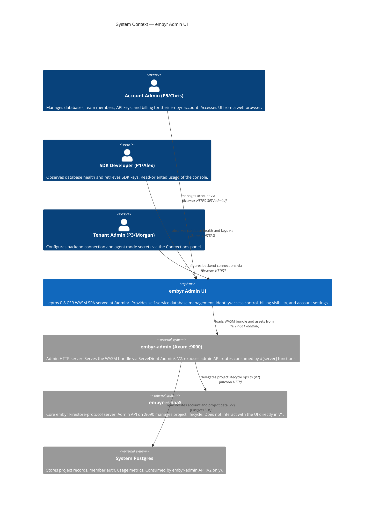
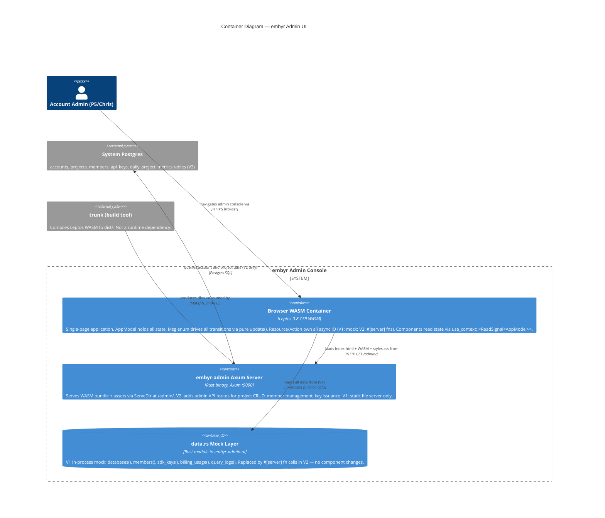
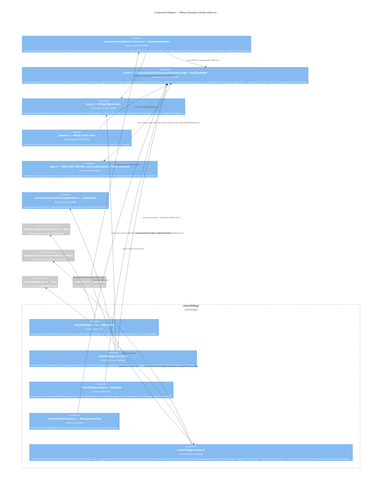
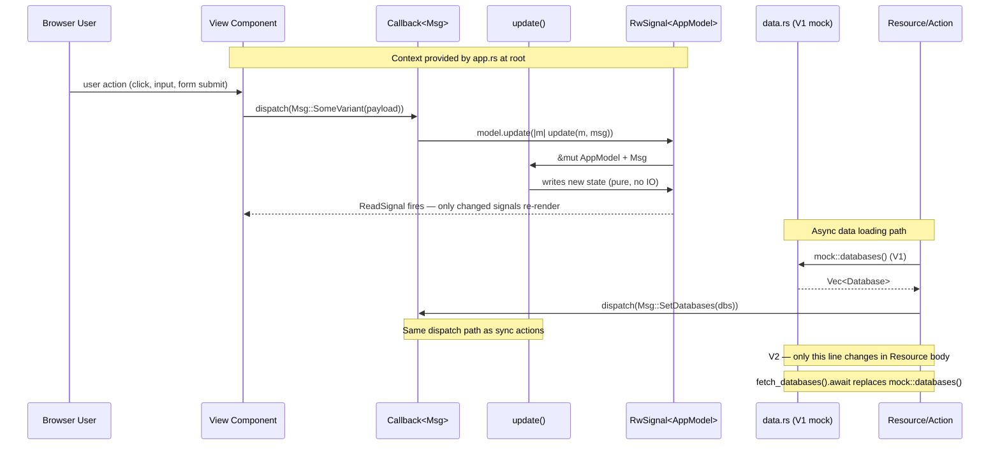

# C4 Diagrams — embyr-admin-ui

> Feature: user-admin-ui
> Updated: 2026-06-14

---

## C4 L1 — System Context

---

## C4 L2 — Container Diagram

---

## C4 L3 — Component Diagram (Browser WASM Container)

```mermaid
C4Component
    title Component Diagram — Browser WASM Container (embyr-admin-ui)

    Container_Boundary(wasm, "Browser WASM Container") {

        Component(main, "main.rs", "WASM entry point", "leptos::mount_to_body(App). Initialises console_error_panic_hook for WASM panic forwarding to browser console.")

        Component(appRoot, "app.rs — App Root", "Leptos root component", "Creates RwSignal<AppModel>. Creates Callback<Msg> that calls update(). Provides both via Leptos context. Renders AuthGate or Shell depending on AppModel.authed.")

        Component(model, "model.rs — AppModel", "Rust struct, Clone", "Single struct holding all mutable state: authed, nav (NavState), databases, members, service_accounts, admin_keys, sdk_keys, oidc_providers, toasts. All domain types (Database, Member, etc.) defined here.")

        Component(msgEnum, "msg.rs — Msg", "Rust enum, Clone, 30+ variants", "One variant per discrete state transition. Covers Auth, Navigation, Databases, SDK Keys, Admin Keys, Identities, Settings, and UI (Toast) categories. Exhaustive match enforced by compiler.")

        Component(updateFn, "update.rs — update()", "Pure Rust fn, no IO, no async", "fn update(model: &mut AppModel, msg: Msg). Exhaustive match on Msg. Deterministic. Testable with cargo test — no browser, no Leptos runtime required.")

        Component(dataLayer, "data.rs — Mock Layer", "Rust module", "V1: provides mock::databases(), mock::members(), mock::sdk_keys(), mock::billing_usage(), mock::query_logs(). Deterministic (literal values). V2: replaced by #[server] fn calls. This is the ONLY file that changes between V1 and V2.")

        Component(shell, "components/sidebar.rs + topbar.rs", "Leptos components", "Sidebar: nav items, account switcher, database count badge. Topbar: breadcrumb navigation, notifications menu, user avatar menu, sign-out action.")

        Component(primitives, "components/primitives/", "Leptos component library", "Button (variant: Default|Primary|Ghost|Danger), Badge, Card, Modal (Portal-based, ESC closes), Input, Toggle, Tabs, Menu, Avatar, Spinner. Each matches CSS class contract of styles.css.")

        Component(charts, "components/charts/", "Pure SVG Leptos components", "Sparkline (polyline path from f64 slice), LatencyChart (24h + mousemove crosshair via web-sys), BarChart (hourly ops), Donut (percentage ring). No JavaScript chart library — all SVG path math in Rust.")

        Component(viewsAuth, "views/auth.rs — AuthGate", "Leptos component", "Login form: email + password. MFA step: TOTP 6-digit CodeInput (auto-focus management). Email OTP flow. Recovery code input. V1: any non-empty password + 6 digits = granted. Dispatches Msg::SignIn on success.")

        Component(viewsDashboard, "views/dashboard.rs — Dashboard", "Leptos component", "KPI grid (total databases, active count). Database card grid (one per database: name, status badge, P95 label, ops counts). Empty state with 'Create your first database' prompt. Clicking card dispatches Msg::OpenDb.")

        Component(viewsDatabases, "views/databases.rs — Databases List", "Leptos component", "Table: Name, Status, Backend Mode, Created, Actions. 'New Database' modal (name + backend mode form). Inline name-uniqueness validation. Suspend/Activate/Delete with confirm modals. Role-based action visibility.")

        Component(viewsDbDetail, "views/db_detail/ — Database Detail", "Leptos component group", "Header: database name, status badge, back breadcrumb. Tab router: Overview | Connections | Logs | Keys. Tab selection dispatches Msg::OpenDb(id, tab).")

        Component(viewsDbOverview, "views/db_detail/overview.rs", "Leptos component", "P95 latency tile, latency sparkline (24 points), ops bar chart (24h), active connections label ('—'). Logging toggle with retention-period selector (1d/7d/30d) and confirm-before-disable modal.")

        Component(viewsDbConnections, "views/db_detail/connections.rs", "Leptos component", "Backend config panel: mode label + mode-specific fields (DSN masked / agent endpoint + secret backend + secret name). Edit/Save/Cancel. Active connections panel ('—' with V2 badge). Role-based edit visibility.")

        Component(viewsDbLogs, "views/db_detail/logs.rs", "Leptos component", "Query log table: Timestamp, Operation, Collection Path, Duration (ms), Status, Client prefix. Filter controls: operation type, collection path prefix, time range, status. Sort by column header. Export CSV (up to 10k rows).")

        Component(viewsDbKeys, "views/db_detail/keys.rs", "Leptos component", "SDK keys table per database: Name, Created, Last Used ('—'), Prefix (8 chars), Revoke. Create flow: name input → result modal shows full key once with clipboard button + 'I've copied' checkbox. Revoke with confirm modal.")

        Component(viewsBilling, "views/billing.rs — Billing", "Leptos component", "Time range selector (7d/30d/this month/last month). Per-database breakdown table: database name, Read Ops, Write Ops, Delete Ops, Peak Connections ('—'), Log Storage GB. Total row.")

        Component(viewsIdentities, "views/identities.rs — Identities", "Leptos component", "Members tab: table (Email, Name, Role, Auth Method, MFA, Last Login, Actions). Invite modal (email + role). Role change selector with Owner-protection guard. Remove with confirm. Service Accounts tab: table + create modal.")

        Component(viewsApiKeys, "views/api_keys.rs — Admin API Keys", "Leptos component", "Account-level admin keys table: Name, Associated Identity, Role, Created, Last Used, Prefix, Revoke. Create modal: select identity → inherit role → name → submit → show full key once (same copy-once UX as SDK keys).")

        Component(viewsSettings, "views/settings.rs — Settings", "Leptos component", "Account section (display name). Auth Methods (email+password toggle, OIDC per-provider toggle). OIDC providers list (Issuer, Client ID, Enabled, Delete). Add provider modal (issuer + client ID + secret). Danger Zone: Delete Account (name re-entry), Transfer Ownership (email input).")
    }

    System_Ext(adminServer, "embyr-admin Axum :9090", "Serves WASM bundle. V2: admin API routes.")
    System_Ext(browserAPIs, "Browser APIs (web-sys)", "window.navigator.clipboard, KeyboardEvent (ESC), MouseEvent (chart crosshair), ClipboardItem")

    Rel(main, appRoot, "mounts")
    Rel(appRoot, model, "creates and owns RwSignal<>")
    Rel(appRoot, msgEnum, "dispatch routes Msg to")
    Rel(appRoot, updateFn, "calls on every dispatch")
    Rel(appRoot, shell, "renders when authed")
    Rel(appRoot, viewsAuth, "renders when not authed")
    Rel(updateFn, model, "mutates via &mut AppModel")
    Rel(dataLayer, model, "seeds initial AppModel.from_mock() from")
    Rel(shell, primitives, "uses Menu, Avatar, Icon from")
    Rel(viewsDashboard, charts, "renders Sparkline via")
    Rel(viewsDbOverview, charts, "renders LatencyChart + BarChart via")
    Rel(viewsBilling, dataLayer, "reads mock::billing_usage() from")
    Rel(viewsDbLogs, dataLayer, "reads mock::query_logs() from")
    Rel(viewsDbKeys, browserAPIs, "writes to clipboard via")
    Rel(primitives, browserAPIs, "ESC key closes Modal via window_event_listener")
    Rel(main, adminServer, "loads WASM bundle from")
```

---

---

## C4 L3 — Component Diagram (Billing Subsystem — card-payments)

> Feature: card-payments | Updated: 2026-08-10
> Extends the L1/L2 diagrams above unchanged (no new container, no new external system).
> Warranted per the mandatory-C4 "complex subsystem" threshold: 9 stories, 8 slices, 1
> cross-cutting component (`SuspensionBanner`) spanning every other `Section`.

---

## TEA Dispatch Flow

